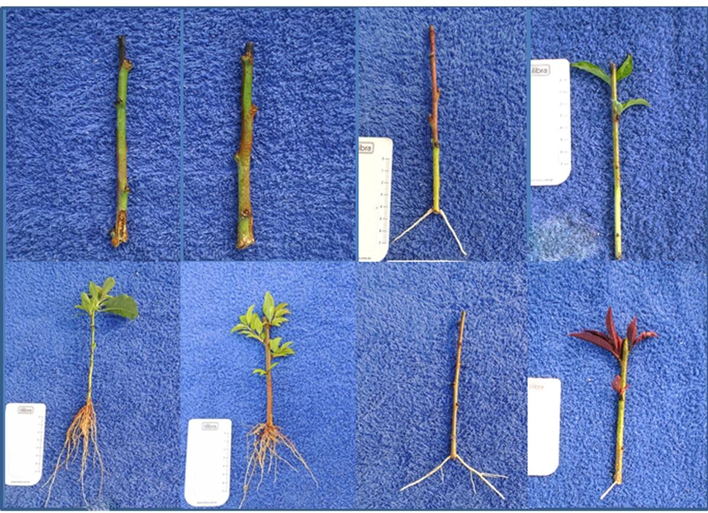

# Transformação de dados

****

<br><br><br><br>

- O modelo de Análise de Variância pressupõe que exista homocedasticidade, ou seja, que os tratamentos apresentem a mesma variabilidade;
- Algumas vezes este pressuposto pode não ser atendido e assim, para corrigir este problema existe uma saída por vezes bastante simples que é a transformação de dados;
- Esta técnica consiste na utilização de um artifício matemático para tornar o modelo de ANOVA válido.

****

## Heterogeneidade Irregular

****

- Ocorre quando alguns tratamentos apresentam maior variabilidade do que outros, contudo, não existe uma associação entre média e variância;

- Neste caso, não há uma transformação matemática que elimine esta variabilidade.

Solução:

* Modelos Lineares Generalizados;

* Análise não paramétrica.

<br>

****

## Heterogeneidade Regular

****

- Acontece quando existe alguma associação entre as médias dos tratamentos e a variância;
- A heterocedasticidade regular está associada é falta de normalidade do erros;

Solução:

* Transformação dos dados;

* Modelos Lineares Generalizados;

* Análise não paramétrica.

<br>

****

## Princípio de transformação

****

<br>

Seja $E(Y) = \mu$ a média de Y e suponha que o desvio padrão de Y é proporcional a potência da média de Y tal que:

<center>

$\sigma Y \alpha \mu^\alpha.$

</center>

O objetivo é encontrar uma transformação de $Y$ que gere uma variância constante.

Suponha que a transformação é uma potência dos dados originais, isto é:

<center>

$Y^*=Y^\lambda$

</center>

Assim, pode ser mostrado que:

<center>

$\sigma Y^* \alpha \mu^{\lambda+ \alpha-1}.$

</center>

Caso $\lambda = 1-\alpha$, então a variância dos dados transformados $Y^*$ é constante, mostrando que **não é necessário transformação**.

Algumas das transformações mais comuns são:

<br>

<center>

| $\lambda$ | Transformação       |
|:-----------:|:---------------------:|
| 1         | Nenhuma             |
| 0,5       | $\sqrt{y}$          |
| 0         | log(y)              |
| -0,5      | $\frac{1}{\sqrt{y}}$ |
| -1        | $\frac{1}{y}$         |

</center>

****

## Seleção Empírica de $\alpha$

****

<br>

Em muitas situações de delineamentos experimentais em que há repetições, pode-se estimar empiricamente $\alpha$ a partir dos dados.

Dado que na i-ésima combinação de tratamentos

<center>

$\sigma Y \alpha \mu^{\alpha}_i =\theta \mu^{\alpha}_i$

</center>

em que $\theta$ é uma constante de proporcionalidade, pode-se aplicar logaritmos para obter:

<center>

$log (\sigma_{Y_i}) = log( \theta) + \alpha log( \mu_{i})$

</center>

Portanto, um gráfico de $log(\sigma_{Y_i})$ versus $log(\mu_i)$ seria uma linha reta com uma inclinação $\alpha$.

Como não se conhece $\sigma_{Y_i}$ e $\mu_i$ , utilizam-se as estimativas $s_i$ e a média $\hat{Y}_i$, respectivamente;

O parâmetro de inclinação da equação linear ajustada é uma estimativa de $\alpha$.

<br>

****

## Transf. de Box & Cox

****

<br>

Box & Cox (1964) mostraram como o parâmetro de transformação $\lambda$ em $Y^* = Y^\lambda$ pode ser estimado simultaneamente com outros parâmetros do modelo (média geral e efeitos de tratamentos) usando o método de máxima verossimilhança. O procedimento consiste em realizar, para vários valores de $\lambda$, uma análise de variância padrão sobre:

$$Y_i(\lambda) = \left\{ \begin{array}{ll} \ln(X_i),~~~~~~\textrm{se $\lambda = 0$,} \\ \\ \dfrac{X_i^{\lambda} - 1}{\lambda},~~~~\textrm{se $\lambda \neq 0$,}\end{array} \right.$$

A estimativa de máxima verossimilhança de $\lambda$ é o valor para o qual a soma de quadrado do resíduo, SQRes($\lambda$), é mínima.

Este valor de $\lambda$ é encontrado através do gráfico de SQRes($\lambda$) *versus* $\lambda$, sendo que $\lambda$ é o valor que minimiza a SQRes($\lambda$).

Ou, ainda, o valor de $\lambda$ que maximiza a função de logverossimilhança.

<br>

Um intervalo de confiança $100(1-\alpha)$% para $\lambda$ pode ser encontrado calculando-se:

<center>

$IC(\lambda) = SQRes(\lambda)(1 \pm \frac{t2^2/2=2;v }{v})$

</center>

em que $v$ é o número de graus de liberdade.

Se o intervalo de confiança incluir o valor $\lambda = 1$, isto quer dizer que não é necessário transformar os dados.

****

## Exemplo 1

****



Vamos considerar os dados adaptados de ZAMBÃO; SAMPAIO; BARBIN, 1982 (Livro Planejamento e Análise Estatística de Experimentos Agronômicos - Décio Barbin) como exemplo, em que o pesquisador pretende comparar quatro cultivares de pêssego quanto ao enraizamento de estacas. Foi utilizado cinco repetições por tratamento e o delineamento experimental foi inteiramente casualizado. 

**Fonte da foto**: Rosa, G.G., 2014 (Pelotas)

<br><br>

Tratamentos | R1      |R2       |R3       |R4       |R5       |TOTAL
------------|---------|---------|---------|---------|---------|---------
A           |02       |02       |01       |01       |00       |06
B           |01       |00       |00       |01       |01       |03
C           |12       |10       |14       |17       |11       |64
D           |07       |09       |15       |08       |10       |49

<br><br> 

## Conjunto de dados

```{r}
resposta=c(02,02,01,01,00,01,00,00,01,01,12,10,14,17,11,07,09,15,08,10)
cultivar=rep(LETTERS[1:4],e=5)
cultivar=as.factor(cultivar)
```

<br>

## Gráficos exploratórios

<br>

### Gráfico de caixas

```{r}
car::Boxplot(resposta~cultivar)
```

<br>

### Histograma

```{r}
hist(resposta)
```

<br>

## Análise de variância

```{r}
modelo=aov(resposta~cultivar)
anova(modelo) # Conferir GL
```

<br>

## Pressuposições 

### Normalidade dos erros

```{r}
shapiro.test(modelo$residuals)
```

Os erros não seguem distribuição normal

### Homogeneidade das variâncias

```{r}
bartlett.test(modelo$residuals~cultivar)
```

As variâncias não são homogêneas

<br>

### Independência dos erros

```{r}
lmtest::dwtest(modelo)
```

Os erros são independentes.

<br>

### Gráfico de resíduos padronizados

```{r}
a=anova(modelo)
plot(modelo$residuals/sqrt(a$`Mean Sq`[2]), ylab="Resíduos Padronizados")
abline(h=0)
```

As pressuposições de normalidade dos erros e homogeneidade das variâncias não foram atendidas. Dessa forma, vamos transformar os dados e conferir novamente as pressuposições!

## Transformação de dados

<br>

### Usando a *package* MASS

<br>

### Usando o comando boxcox e conferindo visualmente um valor aproximado de $\lambda$

```{r}
# MASS::boxcox(modelo) ## o comando boxcox do pacote MASS não aceita quando ocorre observações 0
# vamos somar uma constante com valor "baixo"
MASS::boxcox(aov(resposta+0.000001~cultivar))
```

<br>

### Descobrindo o valor exato de $\lambda$

```{r}
bc=MASS::boxcox(aov(resposta+0.000001~cultivar))
bc$x[which.max(bc$y)]
```

A aproximação de $\lambda$ é 0,5 (sqrt(Y))

<br>

## Dados transformados

<br>

### Modelo transformado

```{r}
modelo=aov(resposta^0.5~cultivar)
#ou
modelo=aov(sqrt(resposta)~cultivar)
```

<br>

### Normalidade dos erros

```{r}
shapiro.test(modelo$residuals)
```

Os erros seguem distribuição normal

<br>

### Homogeneidade das variâncias

```{r}
bartlett.test(modelo$residuals~cultivar)
```

As variâncias são homogêneas

<br>

### Independência dos erros

```{r}
lmtest::dwtest(modelo)
```

Os erros são independentes.

<br>

### Gráfico de resíduos padronizados

```{r}
a=anova(modelo)
plot(modelo$residuals/sqrt(a$`Mean Sq`[2]), ylab="Resíduos Padronizados")
abline(h=0)
```

<br>

## Comparação múltipla

<br>

### Teste de Comparação Múltipla de Tukey (Utilizando o multcomp)

```{r}
library(multcomp)
mcomp=glht(modelo, mcp(cultivar="Tukey"))
plot(mcomp)
cld(mcomp)
```

<br>

### Teste de Comparação Múltipla de Tukey (Utilizando o TukeyHSD do R)

```{r}
(tukey=TukeyHSD(modelo))
plot(tukey)
```

<br>

### Teste de Comparação Múltipla de Tukey (Utilizando o HSD.test do Agricolae)

```{r}
library(agricolae)
tukey=HSD.test(modelo,"cultivar")
plot(tukey)
```

<br>

### Teste de Comparação Múltipla de Tukey (Utilizando o ea1() do pacote easyanova)

```{r, fig.show='hide'}
library(easyanova)
tukey=ea1(data.frame(cultivar,resposta^0.5))
cbind(tukey$Means[1],tukey$Means[2],tukey$Means[4])
```

<br>

### Teste de Comparação Múltipla de Tukey (Utilizando o dic do pacote ExpDes.pt)

```{r}
library(ExpDes.pt)
dic(cultivar,resposta^0.5)
```

<br><br>

****

## Exemplo 2

****

### Conjunto de dados

<br>

Um experimento foi conduzido com o intuito de avaliar a inoculação de *Trichoderma* sp. (T4), *Azospirillum* sp. (T3) e associação de ambos (T2) em relação a testemunha, quanto à altura de plantas de milho. O experimento foi conduzido em delineamento inteiramente casualizado com 8 repetições.

<br>

```{r, include=T}
RESP=c(124,136,124,102,112,108,102,122,
       130,128,118,106,126,106,128,122,
       132,132,190,144,090,126,142,148,
       140,120,118,098,110,140,104,142)
TRAT=rep(c(paste("T",1:4)),e=8)
dados = data.frame(TRAT, RESP)
```

<br><br>

## Estatística descritiva

```{r}
Média = with(dados, mean(RESP))
Variância = with(dados, var(RESP))
Desvio = with(dados, sd(RESP))
CV = Desvio / Média * 100

desc = cbind(Média, Variância, Desvio, CV)
library(knitr)
kable(round(desc,2), align="l")
```

<br>

### Por Cultivar

```{r}
Médias = with(dados, tapply(RESP, TRAT, mean))
Variâncias = with(dados, tapply(RESP, TRAT, var))
Desvios = with(dados, tapply(RESP, TRAT, sd))
CV = Desvios / Médias * 100
Desc = cbind(Médias, Variâncias, Desvios, CV)
kable(round(Desc,2),align="l")
```

<br><br>

## Gráficos exploratórios

<br>

### Gráfico de Caixas

```{r, results='hide', fig.pos="H", fig.align='center'}
par(bty='l', mai=c(1, 1, .2, .2))
par(cex=0.7)
caixas=with(dados, car::Boxplot(RESP ~ dados$TRAT, vertical=T,las=1, col='Lightyellow'))
mediab=tapply(RESP, TRAT, mean)
points(mediab, pch='+', cex=1.5, col='red')
```

<br><br>

## Análise de Variância

\begin{eqnarray*}
\left\{
\begin{array}{ll}
H_0: & \mu_1 = \mu_2 = \mu_3 = \cdots = \mu_{15} \\[.2cm]
H_1: & \mu_i \neq \mu_i' \qquad i \neq i'.
\end{array}
\right.
\end{eqnarray*}

```{r}
mod = with(dados, aov(RESP ~ TRAT))
av=anova(mod)
kable(av, align = "l")
```

<br><br>

## Pressuposições

<br>

### Normalidade dos erros

\begin{eqnarray*}
\left\{
\begin{array}{ll}
H_0: & \mbox{Os erros seguem distribuição normal}\\[.2cm]
H_1: & \mbox{Os erros não seguem distribuição normal}.
\end{array}
\right.
\end{eqnarray*}

```{r}
(norm=shapiro.test(mod$res))
```

Como p-valor calculado ($p=0,07878$) é maior que o nível de significância adotado ($p=0,05$), não se rejeita $H_0$. Logo, os erros seguem distribuição normal.

```{r, results='hide', fig.pos="H", fig.align='center'}
hnp::hnp(mod, las=1, xlab="Quantis teóricos", pch=16)
```

<br>

### Homogeneidade de variâncias

\begin{eqnarray*}
\left\{
\begin{array}{ll}
H_0: & \mbox{ As variâncias são homogêneas}\\[.2cm]
H_1: & \mbox{ As variâncias não são homogêneas}.
\end{array}
\right.
\end{eqnarray*}

```{r}
(homog=with(dados, bartlett.test(mod$res ~ TRAT)))
```

Como p-valor ($p=0,0382$) é menor que o nível de significância adotado ($p=0,05$). Rejeita-se $H_0$, logo, as variâncias dos erros não são homogêneas.

<br>

## Transformação de dados

```{r}
library(MASS)
bc=boxcox(mod)
bc$x[which.max(bc$y)]
```

O valor de $\lambda$ para a Transformação Box-Cox é -0,22222. Nesse sentido, vamos usar a aproximação. Logo, iremos usar a Transformação Log

<br>

### Transformação log

### Modelo com dados transformados

Devemos testar novamente as pressuposições após a Transformação!!!

```{r}
modelo=aov(log(RESP)~TRAT)
anova(modelo)
```

Como p-valor da análise de variância ($p=0,1627$) é maior que o nível de significância adotado, não se rejeita $H_0$. Logo, não há evidências de diferença entre os tratamentos.

<br>

### Normalidade dos erros

```{r}
shapiro.test(modelo$residuals)
```

<br>

### Homogeneidade das variâncias

```{r}
bartlett.test(modelo$residuals~TRAT)
```

<br>

### Independências dos erros

```{r}
lmtest::dwtest(modelo)
```

<br>

### Usando os pacotes easyanova e ExpDes.pt
 
```{r, fig.show='hide'}
dados=data.frame(TRAT,log(RESP))
easyanova::ea1(dados, design=1, plot=2)
```

```{r}
library(ExpDes.pt)
with(dados,dic(TRAT,log(RESP), mcomp="tukey"))
```

<br><br><br><br>
