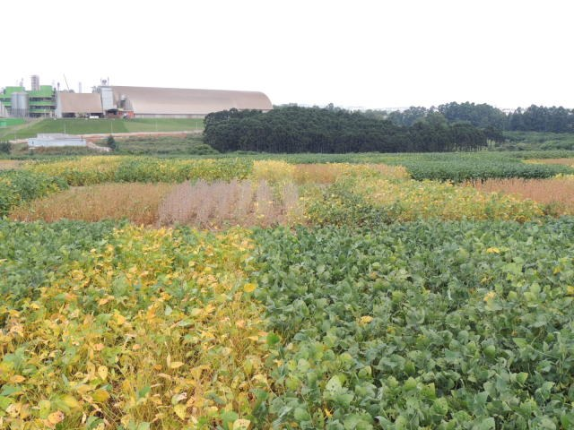

# Delineamento em Blocos Casualizados

****

<br><br><br><br>

- O delineamento em blocos ao acaso ou o delineamento em blocos casualizados são aqueles que levam em consideração os 3 princípios básicos da experimentação;
- O controle local é feito na sua forma mais simples e é chamado de blocos;
- Sempre que não houver homogeneidade das condições experimentais, deve-se utilizar o princípio do controle local;
- Estabelece-se, então, sub-ambientes homogêneos (blocos) e instalando, em cada um deles, todos os tratamentos, igualmente repetidos;
- Nessas condições, o delineamento em blocos casualizados é mais eficiente que o inteiramente ao acaso e, essa eficiência depende da uniformidade das parcelas de cada bloco;
- Pode-se haver diferenças bem acentuadas de um bloco para outro.
- O número de blocos e de repetições coincide apenas quando os tratamentos ocorrem uma única vez em cada bloco.

<br><br>

****

## Vantagens

****

<br>

- Controla as diferenças que ocorrem nas condições ambientais, de um bloco para outro;
- Conduz a uma estimativa mais exata para a variância residual, uma vez que a variação ambiental entre blocos é isolada.

****

## Desvantagens

****

<br>

- Pela utilização do princípio do controle local, há uma redução no número de graus de liberdade do resíduo;
- Exigência de homogeneidade das parcelas dentro de cada bloco limita o número de tratamentos, que não pode ser muito elevado.

<br>

****

## Modelo matemático 

****

<br>

\begin{eqnarray}
y_{ji}=\mu+\tau_i+\beta_j+\varepsilon_{ij}
\end{eqnarray}

$y_{ji}$: é a observação referente ao tratamento i no bloco j;

$\mu$: é a média geral (ou constante comum a todas as observações);

$\tau_i$: é o efeito de tratamento, com $i = 1, 2, . . . , I$;

$\beta_j$: é o efeito do bloco;

$\varepsilon_{ij}$: é o erro experimental, tal que $\varepsilon_{ij}$~N(0; $\sigma^2$).

****

## Hipóteses e Modelo 

****

\begin{eqnarray*}
\left\{
\begin{array}{ll}
H_0: & \mu_1 = \mu_2 =\mu_i\\[.2cm]
H_1: & \mu_i \neq \mu_i' \qquad i \neq i'.
\end{array}
\right.
\end{eqnarray*}

CV            | G.L.    |S.Q.         |Q.M.                     |  Fcalc                 | Ftab
--------------:|:---------:|:-------------:|:-------------------------:|:------------------------:|:----------------------------------
Tratamentos   | $a - 1$ | $SQ_{Trat}$ | $\frac{SQ_{Trat}}{a-1}$ | $\frac{QMTrat}{QMRes}$ | $F(\alpha;GL_{Trat} ;GL_{Res})$
Blocos        | $b-1$   | $Sq_{Blocos}$|$\frac{SQ_{Blocos}}{b-1}$|$\frac{QM_{bloco}}{QM_{Res}}$ | $F(\alpha;GL_{bloco} ;GL_{Res})$
resíduo       | $(a-1)(b-1)$| $SQ_{Res}$  |$\frac{SQRes}{(a-1)(b-1)}$                  | -                      |
Total         | $ab-1$  |$SQ_{Total}$ | -                       | -                      |

<br>

## Croqui 

<br>

Criando uma função para fazer um croqui (Bloco em coluna)


```r
# Não alterar os comandos da função
library(agricolae)
library(gridExtra)
library(grid)
croqui=function(trat,r){
  sort=design.rcbd(trat,r,serie=0)
  sort$book[,3]=as.factor(matrix(sort$book[,3],r,,T))
  ncol=r
  gs <- lapply(sort$book[,3], function(ii)
    grobTree(rectGrob(gp=gpar(fill=ii, alpha=0.5)),textGrob(ii)))
  grid.arrange(grobs=gs, ncol=ncol)}
```

<br>

Vetor de tratamentos


```r
trat=c("T1","T2","T3","T4")
```

<br>

Usando a função


```r
croqui(trat,r=3)
```


<br>

Criando uma função para fazer um croqui (Bloco em linha)


```r
# Não alterar os comandos da função
library(agricolae)
library(gridExtra)
library(grid)
croqui=function(trat,r){
  sort=design.rcbd(trat,r,serie=0)
  sort$book[,3]=as.factor(t(matrix(sort$book[,3],r,,T)))
  ncol=length(levels(sort$book[,3]))
  gs <- lapply(sort$book[,3], function(ii)
    grobTree(rectGrob(gp=gpar(fill=ii, alpha=0.5)),textGrob(ii)))
  grid.arrange(grobs=gs, ncol=ncol)}
```

<br>

Vetor de tratamentos


```r
trat=c("T1","T2","T3","T4")
```

<br>

Usando a função


```r
croqui(trat,r=3)
```


<br><br>

****

## Exemplo 1

****

<br>

**Exemplo do Livro Planejamento e Análise Estatística de Experimentos Agronômicos (2013) - Décio Barbin - pg. 72**


Um experimento foi conduzido com o objetivo de estudar o comportamento de nove porta-enxertos para a laranjeira Valência. 

Os porta-enxertos são:

- T1: Tangerina Sunki
- T2: Limão rugoso Nacional
- T3: Limão rugoso da Flórida
- T4: Tangerina Cleópatra
- T5: Citranger-troyer
- T6: Trifoliata
- T7: Tangerina Cravo
- T8: Laranja caipira
- T9: Limão Cravo

**Delineamento experimental**: Blocos casualizados.

**Repetições/Tratamento**: 3 repetições

<br>

Croqui experimental é apresentado abaixo:

Bloco |     |     |     |     |     |     |     |     |
------|-----|-----|-----|-----|-----|-----|-----|-----|-----
B1    |T3   |T1   |T4   |T8   |T6   |T7   |T2   |T9   |T5
B2    |T7   |T3   |T9   |T4   |T2   |T5   |T1   |T6   |T8
B3    |T8   |T6   |T2   |T1   |T7   |T9   |T3   |T4   |T5

Para o ano de 1973 (Plantas com 12 anos de idade), os resultados de produção, em número médio de frutos por planta, foram:

Tratamentos | B1      |B2       |B3       |Total
------------|---------|---------|---------|---------
1           |145      |155      |166      |466
2           |200      |190      |190      |580
3           |183      |186      |208      |577
4           |190      |175      |186      |551
5           |180      |160      |156      |496
6           |130      |160      |130      |420
7           |206      |165      |170      |541
8           |250      |271      |230      |751
9           |164      |190      |193      |547
Total       |1648     |1652     |1629     |4929

<br>

### Conjunto de dados


```r
resposta=c(145,155,166,
           200,190,190,
           183,186,208,
           190,175,186,
           180,160,156,
           130,160,130,
           206,165,170,
           250,271,230,
           164,190,193)
cultivar=rep(c(paste("T",1:9)),e=3)
cultivar=as.factor(cultivar)
bloco=as.factor(rep(c(paste("B",1:3)),9))
```

<br><br>

## Gráficos exploratórios

<br>

### Gráfico de caixas


```r
car::Boxplot(resposta~cultivar)
```

<!-- -->

<br>

### Histograma


```r
hist(resposta)
```

<!-- -->

<br>

## Análise de variância


```r
modelo=aov(resposta~cultivar+bloco)
anova(modelo) # Conferir GL
```

```
## Analysis of Variance Table
## 
## Response: resposta
##           Df  Sum Sq Mean Sq F value    Pr(>F)    
## cultivar   8 22981.3 2872.67 11.4114 2.637e-05 ***
## bloco      2    33.6   16.78  0.0666    0.9358    
## Residuals 16  4027.8  251.74                      
## ---
## Signif. codes:  0 '***' 0.001 '**' 0.01 '*' 0.05 '.' 0.1 ' ' 1
```

<br><br>

## Pressuposições

<br>

### Normalidade dos erros


```r
shapiro.test(modelo$residuals)
```

```
## 
## 	Shapiro-Wilk normality test
## 
## data:  modelo$residuals
## W = 0.94759, p-value = 0.1873
```

Os erros seguem distribuição normal

<br>

### Homogeneidade das variâncias


```r
bartlett.test(modelo$residuals~cultivar)
```

```
## 
## 	Bartlett test of homogeneity of variances
## 
## data:  modelo$residuals by cultivar
## Bartlett's K-squared = 4.0369, df = 8, p-value = 0.8538
```

As variâncias são homogêneas

<br>

### Independência dos erros


```r
lmtest::dwtest(modelo)
```

```
## 
## 	Durbin-Watson test
## 
## data:  modelo
## DW = 2.3246, p-value = 0.2484
## alternative hypothesis: true autocorrelation is greater than 0
```

Os erros são independentes.

<br>

### Teste de Aditividade de Tukey


```r
library(asbio)
```

```
## Warning: package 'asbio' was built under R version 3.6.3
```

```
## Carregando pacotes exigidos: tcltk
```

```r
tukey.add.test(resposta,cultivar,bloco)
```

```
## 
## Tukey's one df test for additivity 
## F = 0.6866169   Denom df = 15    p-value = 0.4203076
```

<br>

### Gráfico de resíduos padronizados


```r
a=anova(modelo)
plot(modelo$residuals/sqrt(a$`Mean Sq`[3]), ylab="Resíduos Padronizados")
abline(h=0)
```

<!-- -->

<br><br>

## Comparação múltipla

<br>

### Teste de Comparação Múltipla de Tukey (Utilizando o multcomp)


```r
library(multcomp)
```

```
## Carregando pacotes exigidos: mvtnorm
```

```
## Carregando pacotes exigidos: survival
```

```
## Warning: package 'survival' was built under R version 3.6.3
```

```
## Carregando pacotes exigidos: TH.data
```

```
## Carregando pacotes exigidos: MASS
```

```
## 
## Attaching package: 'TH.data'
```

```
## The following object is masked from 'package:MASS':
## 
##     geyser
```

```r
mcomp=glht(modelo, mcp(cultivar="Tukey"))
plot(mcomp)
```

<!-- -->

```r
cld(mcomp)
```

```
## Warning in RET$pfunction("adjusted", ...): Completion with error > abseps
```

```
## Warning in RET$pfunction("adjusted", ...): Completion with error > abseps
```

```
##  T 1  T 2  T 3  T 4  T 5  T 6  T 7  T 8  T 9 
## "ab"  "b"  "b" "ab" "ab"  "a" "ab"  "c" "ab"
```

<br>

### Teste de Comparação Múltipla de Tukey (Utilizando o TukeyHSD do R)


```r
(tukey=TukeyHSD(modelo))
```

```
##   Tukey multiple comparisons of means
##     95% family-wise confidence level
## 
## Fit: aov(formula = resposta ~ cultivar + bloco)
## 
## $cultivar
##               diff         lwr        upr     p adj
## T 2-T 1  38.000000   -8.085796  84.085796 0.1520249
## T 3-T 1  37.000000   -9.085796  83.085796 0.1728150
## T 4-T 1  28.333333  -17.752463  74.419129 0.4559717
## T 5-T 1  10.000000  -36.085796  56.085796 0.9962223
## T 6-T 1 -15.333333  -61.419129  30.752463 0.9489958
## T 7-T 1  25.000000  -21.085796  71.085796 0.6053536
## T 8-T 1  95.000000   48.914204 141.085796 0.0000460
## T 9-T 1  27.000000  -19.085796  73.085796 0.5143733
## T 3-T 2  -1.000000  -47.085796  45.085796 1.0000000
## T 4-T 2  -9.666667  -55.752463  36.419129 0.9969942
## T 5-T 2 -28.000000  -74.085796  18.085796 0.4703201
## T 6-T 2 -53.333333  -99.419129  -7.247537 0.0172692
## T 7-T 2 -13.000000  -59.085796  33.085796 0.9799785
## T 8-T 2  57.000000   10.914204 103.085796 0.0099947
## T 9-T 2 -11.000000  -57.085796  35.085796 0.9929220
## T 4-T 3  -8.666667  -54.752463  37.419129 0.9985839
## T 5-T 3 -27.000000  -73.085796  19.085796 0.5143733
## T 6-T 3 -52.333333  -98.419129  -6.247537 0.0200347
## T 7-T 3 -12.000000  -58.085796  34.085796 0.9877062
## T 8-T 3  58.000000   11.914204 104.085796 0.0086074
## T 9-T 3 -10.000000  -56.085796  36.085796 0.9962223
## T 5-T 4 -18.333333  -64.419129  27.752463 0.8763516
## T 6-T 4 -43.666667  -89.752463   2.419129 0.0705323
## T 7-T 4  -3.333333  -49.419129  42.752463 0.9999989
## T 8-T 4  66.666667   20.580871 112.752463 0.0023716
## T 9-T 4  -1.333333  -47.419129  44.752463 1.0000000
## T 6-T 5 -25.333333  -71.419129  20.752463 0.5900630
## T 7-T 5  15.000000  -31.085796  61.085796 0.9546944
## T 8-T 5  85.000000   38.914204 131.085796 0.0001740
## T 9-T 5  17.000000  -29.085796  63.085796 0.9134401
## T 7-T 6  40.333333   -5.752463  86.419129 0.1116698
## T 8-T 6 110.333333   64.247537 156.419129 0.0000069
## T 9-T 6  42.333333   -3.752463  88.419129 0.0849582
## T 8-T 7  70.000000   23.914204 116.085796 0.0014541
## T 9-T 7   2.000000  -44.085796  48.085796 1.0000000
## T 9-T 8 -68.000000 -114.085796 -21.914204 0.0019490
## 
## $bloco
##               diff       lwr      upr     p adj
## B 2-B 1  0.4444444 -18.85487 19.74376 0.9980554
## B 3-B 1 -2.1111111 -21.41043 17.18820 0.9571497
## B 3-B 2 -2.5555556 -21.85487 16.74376 0.9379209
```

```r
plot(tukey)
```

<!-- --><!-- -->

<br>

### Teste de Comparação Múltipla de Tukey (Utilizando o HSD.test do Agricolae)


```r
library(agricolae)
tukey=HSD.test(modelo,"cultivar")
plot(tukey)
```

<!-- -->

<br>

### Teste de Comparação Múltipla de Tukey (Utilizando o ea1() do pacote easyanova)


```r
library(easyanova)
tukey=ea1(data.frame(cultivar,bloco,resposta), design = 2)
```

```r
cbind(tukey$`Adjusted means`[1],tukey$`Adjusted means`[2],tukey$`Adjusted means`[4])
```

```
##   treatment adjusted.mean tukey
## 1       T 8      250.3333     a
## 2       T 2      193.3333     b
## 3       T 3      192.3333     b
## 4       T 4      183.6667    bc
## 5       T 9      182.3333    bc
## 6       T 7      180.3333    bc
## 7       T 5      165.3333    bc
## 8       T 1      155.3333    bc
## 9       T 6      140.0000     c
```

<br>

#### Teste de Comparação Múltipla de Tukey (Utilizando o dbc do pacote ExpDes.pt)


```r
library(ExpDes.pt)
```

```
## 
## Attaching package: 'ExpDes.pt'
```

```
## The following object is masked from 'package:MASS':
## 
##     ginv
```

```
## The following objects are masked from 'package:agricolae':
## 
##     lastC, order.group, tapply.stat
```

```
## The following object is masked from 'package:stats':
## 
##     ccf
```

```r
dbc(cultivar,bloco,resposta)
```

```
## ------------------------------------------------------------------------
## Quadro da analise de variancia
## ------------------------------------------------------------------------
##            GL      SQ      QM      Fc   Pr>Fc
## Tratamento  8 22981.3 2872.67 11.4114 0.00003
## Bloco       2    33.6   16.78  0.0666 0.93578
## Residuo    16  4027.8  251.74                
## Total      26 27042.7                        
## ------------------------------------------------------------------------
## CV = 8.69 %
## 
## ------------------------------------------------------------------------
## Teste de normalidade dos residuos 
## valor-p:  0.187264 
## De acordo com o teste de Shapiro-Wilk a 5% de significancia, os residuos podem ser considerados normais.
## ------------------------------------------------------------------------
## 
## ------------------------------------------------------------------------
## Teste de homogeneidade de variancia 
## valor-p:  0.7817409 
## De acordo com o teste de oneillmathews a 5% de significancia, as variancias podem ser consideradas homogeneas.
## ------------------------------------------------------------------------
## 
## Teste de Tukey
## ------------------------------------------------------------------------
## Grupos Tratamentos Medias
## a 	 T 8 	 250.3333 
##  b 	 T 2 	 193.3333 
##  b 	 T 3 	 192.3333 
##  bc 	 T 4 	 183.6667 
##  bc 	 T 9 	 182.3333 
##  bc 	 T 7 	 180.3333 
##  bc 	 T 5 	 165.3333 
##  bc 	 T 1 	 155.3333 
##   c 	 T 6 	 140 
## ------------------------------------------------------------------------
```

<br><br>

****

## Exemplo 2

****



Um experimento foi realizado com o intuito de avaliar a produtividade de 15 cultivares comerciais de soja no munícipio de Londrina-PR. O experimento foi instalado em Delineamento em blocos casualizados com 3 repetições por tratamento.

**Fonte da foto**: [Agricultura](http://www.agricultura.gov.br/noticias/entra-em-vigor-novo-sistema-de-registro-de-cultivares/@@nitf_galleria)

<br>

### Conjunto de dados


```r
PRO=c(2444.44,2870.37,2314.81,2629.63,2444.44,2592.59,2962.96,3037.04,3037.04,2592.59,2296.30,2444.44,2370.37,3481.48,2555.56,1981.48,2611.11,1925.93,1870.37,2518.52,2370.37,2462.96,2351.85,2000.00,2703.70,2685.19,2166.67,2129.63,2222.22,1814.81,2537.04,2351.85,2333.33,3370.37,2462.96,3129.63,2666.67,2796.30,2055.56,2333.33,2240.74,2092.59,2703.70,2129.63,2740.74)
Cultivares=rep(c(paste("T",1:15)),e=3)
Bloco=rep(c(paste("B",1:3)),15)
Tratamento = as.factor(Cultivares)
bloco=as.factor(Bloco)
dados = data.frame(Tratamento, TRAT=Tratamento, bloco,resp=PRO)
dados = dados[order(dados$Tratamento), ]
X = 'Cultivares de soja'
(Y = expression(Produtividade (Kg.ha^-1)))
```

```
## expression(Produtividade(Kg.ha^-1))
```

```r
alfa="0,05"
```

<br><br>

## Estatística descritiva


```r
Média = with(dados, mean(resp))
Variância = with(dados, var(resp))
Desvio = with(dados, sd(resp))
CV = Desvio / Média * 100

desc = cbind(Média, Variância, Desvio, CV)
rownames(desc) = 'Produvidade (Kg/ha)'
library(knitr)
kable(round(desc,2), align="l")
```

                      Média     Variância   Desvio   CV    
--------------------  --------  ----------  -------  ------
Produvidade (Kg/ha)   2485.18   141049.6    375.57   15.11 

<br><br>

### Por Cultivar


```r
Médias = with(dados, tapply(resp, Tratamento, mean))
Variâncias = with(dados, tapply(resp, Tratamento, var))
Desvios = with(dados, tapply(resp, Tratamento, sd))
CV = Desvios / Médias * 100
Desc = cbind(Médias, Variâncias, Desvios, CV)
kable(round(Desc,2),align="l")
```

       Médias    Variâncias   Desvios   CV    
-----  --------  -----------  --------  ------
T 1    2543.21   84477.87     290.65    11.43 
T 10   2055.55   45611.24     213.57    10.39 
T 11   2407.41   12689.35     112.65    4.68  
T 12   2987.65   220966.26    470.07    15.73 
T 13   2506.18   156492.52    395.59    15.78 
T 14   2222.22   14746.18     121.43    5.46  
T 15   2524.69   117397.29    342.63    13.57 
T 2    2555.55   9602.62      97.99     3.83  
T 3    3012.35   1829.28      42.77     1.42  
T 4    2444.44   21946.94     148.15    6.06  
T 5    2802.47   354364.77    595.29    21.24 
T 6    2172.84   144831.90    380.57    17.51 
T 7    2253.09   115341.14    339.62    15.07 
T 8    2271.60   58412.64     241.69    10.64 
T 9    2518.52   92934.47     304.85    12.10 

As Médias e as Variâncias estão apresentadas na Tabela \ref{tab:MedVar}. Nota-se uma variação nos valores médios, sendo a menor Média igual a $2055.55$ e a maior Média de $3012.35$. Já em relação às Variâncias, o menor valor é de $1829.28$ e a maior variablidade de $3.5436477\times 10^{5}$. 

<br><br>

## Gráfico de Caixas


```r
par(bty='l', mai=c(1, 1, .2, .2))
par(cex=0.7)
caixas=with(dados, car::Boxplot(resp ~ dados$TRAT, vertical=T,las=1, col='Lightyellow',
                    xlab=X, ylab=Y))
mediab=tapply(dados$resp, dados$ TRAT, mean)
points(mediab, pch='+', cex=1.5, col='red')
```

<div class="figure" style="text-align: center">

<p class="caption">(\#fig:unnamed-chunk-24)Gráfico de caixas</p>
</div>

```r
names(Desvios)[which.min(Desvios)]
```

Não observa-se *outliers*. Há maior variabilidade em T 5 e menor em T 3, com 595.285 e 42.77, respectivamente. Há evidências de diferença entre as Médias dos tratamentos.

<br><br>

## Análise de Variância

\begin{eqnarray*}
\left\{
\begin{array}{ll}
H_0: & \mu_1 = \mu_2 = \mu_3 = \cdots = \mu_{15} \\[.2cm]
H_1: & \mu_i \neq \mu_i' \qquad i \neq i'.
\end{array}
\right.
\end{eqnarray*}


```r
mod = with(dados, aov(resp ~ Tratamento+bloco))
av=anova(mod)
kable(av, align = "l")
```

             Df   Sum Sq      Mean Sq     F value    Pr(>F)    
-----------  ---  ----------  ----------  ---------  ----------
Tratamento   14   3302891.5   235920.82   2.545837   0.0171400 
bloco        2    308550.2    154275.11   1.664793   0.2074184 
Residuals    28   2594738.7   92669.24    NA         NA        

Como p-valor calculado (p=$0.01714$) é menor que o nível de significância adotado ($p=0,05$), rejeita-se $H0$. Logo, 
ao menos dois tratamentos se diferem entre si

<br><br>

## Pressuposições

<br>

### Normalidade dos erros

\begin{eqnarray*}
\left\{
\begin{array}{ll}
H_0: & \mbox{Os erros seguem distribuição normal}\\[.2cm]
H_1: & \mbox{Os erros não seguem distribuição normal}.
\end{array}
\right.
\end{eqnarray*}


```r
(norm=shapiro.test(mod$res))
```

```
## 
## 	Shapiro-Wilk normality test
## 
## data:  mod$res
## W = 0.97989, p-value = 0.6151
```

Como p-valor calculado (p=$0.6151$) é maior que o nível de significância adotado ($\alpha=0,05$), não rejeita-se $H_O$. Logo, os erros seguem distribuição normal.


```r
hnp::hnp(mod, las=1, xlab="Quantis teóricos", pch=16)
```

<div class="figure" style="text-align: center">

<p class="caption">(\#fig:unnamed-chunk-27)Gráfico QQplot \label{Fig:QQ}</p>
</div>

<br>

### Homogeneidade de Variâncias

\begin{eqnarray*}
\left\{
\begin{array}{ll}
H_0: & \mbox{ As Variâncias são homogêneas}\\[.2cm]
H_1: & \mbox{ As Variâncias não são homogêneas}.
\end{array}
\right.
\end{eqnarray*}


```r
(homog=with(dados, bartlett.test(mod$res ~ Tratamento)))
```

```
## 
## 	Bartlett test of homogeneity of variances
## 
## data:  mod$res by Tratamento
## Bartlett's K-squared = 15.293, df = 14, p-value = 0.3584
```

Como p-valor calculado (p=$0.3584$) é maior que o nível de significância adotado ($p=0,05$), não rejeita-se $H_0$. Logo, as Variâncias são homogêneas.

<br>

### Independência dos erros

\begin{eqnarray*}
\left\{
\begin{array}{ll}
H_0: \mbox{Os erros são independentes}\\[.2cm]
H_1: \mbox{Os erros não são independentes}.
\end{array}
\right.
\end{eqnarray*}


```r
(ind=lmtest::dwtest(mod))
```

```
## 
## 	Durbin-Watson test
## 
## data:  mod
## DW = 2.9611, p-value = 0.9272
## alternative hypothesis: true autocorrelation is greater than 0
```

Como p-valor calculado (p=$0.9272$) é maior que o nível de significância adotado ($p=0,05$), não rejeita-se $H_0$. Logo, os erros são independentes. A Figura \ref{fig:res} apresenta os resíduos brutos. Percebe-se que os resíduos estão distribuídos de forma totalmente aleatória, evidenciando a sua independência.


```r
plot(mod$res, las=1, pch=19, col='red', ylab='Resíduos brutos')
abline(h=0)
```

<div class="figure" style="text-align: center">

<p class="caption">(\#fig:unnamed-chunk-30)Gráfico de resíduos brutos \label{fig:res}</p>
</div>

<br><br>

## Teste de comparações
 

```r
mod.1 = easyanova::ea1(dados[,c(1,3,4)], design=2, plot=2)
```

```r
tabela=cbind(mod.1$`Adjusted means`[1],
             mod.1$`Adjusted means`[2],
             mod.1$`Adjusted means`[8])
names(tabela)[1:3]=c("Cultivar","Média","")
kable(tabela, align = 'l', booktabs=T, caption="Teste de comparação de Scott-Knott", format="pandoc", format.args = list(big.mark="."))
```


Table: (\#tab:unnamed-chunk-31)Teste de comparação de Scott-Knott

Cultivar   Média          
---------  ----------  ---
T 3        3.012.347   a  
T 12       2.987.653   a  
T 5        2.802.470   a  
T 2        2.555.553   b  
T 1        2.543.207   b  
T 15       2.524.690   b  
T 9        2.518.520   b  
T 13       2.506.177   b  
T 4        2.444.443   b  
T 11       2.407.407   b  
T 8        2.271.603   b  
T 7        2.253.087   b  
T 14       2.222.220   b  
T 6        2.172.840   b  
T 10       2.055.553   b  


```r
library(ExpDes.pt)
with(dados,dbc(Tratamento, bloco,resp, mcomp="tukey"))
```

```
## ------------------------------------------------------------------------
## Quadro da analise de variancia
## ------------------------------------------------------------------------
##            GL      SQ     QM     Fc   Pr>Fc
## Tratamento 14 3302891 235921 2.5458 0.01714
## Bloco       2  308550 154275 1.6648 0.20742
## Residuo    28 2594739  92669               
## Total      44 6206180                      
## ------------------------------------------------------------------------
## CV = 12.25 %
## 
## ------------------------------------------------------------------------
## Teste de normalidade dos residuos 
## valor-p:  0.6150834 
## De acordo com o teste de Shapiro-Wilk a 5% de significancia, os residuos podem ser considerados normais.
## ------------------------------------------------------------------------
## 
## ------------------------------------------------------------------------
## Teste de homogeneidade de variancia 
## valor-p:  0.1187836 
## De acordo com o teste de oneillmathews a 5% de significancia, as variancias podem ser consideradas homogeneas.
## ------------------------------------------------------------------------
## 
## Teste de Tukey
## ------------------------------------------------------------------------
## Grupos Tratamentos Medias
## a 	 T 3 	 3012.347 
## a 	 T 12 	 2987.653 
## ab 	 T 5 	 2802.47 
## ab 	 T 2 	 2555.553 
## ab 	 T 1 	 2543.207 
## ab 	 T 15 	 2524.69 
## ab 	 T 9 	 2518.52 
## ab 	 T 13 	 2506.177 
## ab 	 T 4 	 2444.443 
## ab 	 T 11 	 2407.407 
## ab 	 T 8 	 2271.603 
## ab 	 T 7 	 2253.087 
## ab 	 T 14 	 2222.22 
## ab 	 T 6 	 2172.84 
##  b 	 T 10 	 2055.553 
## ------------------------------------------------------------------------
```


<br><br><br><br>
