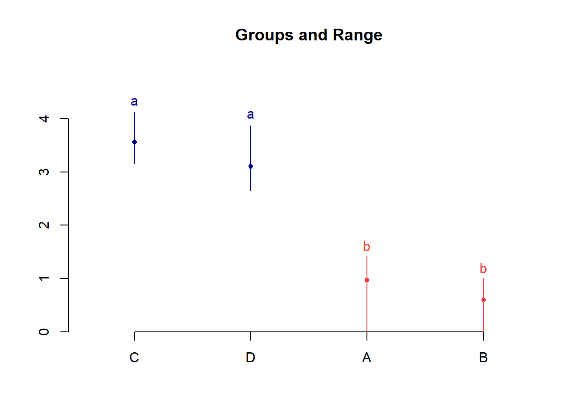

# Transformação de dados

****

<br><br><br><br>

- O modelo de Análise de Variância pressupõe que exista homocedasticidade, ou seja, que os tratamentos apresentem a mesma variabilidade;
- Algumas vezes este pressuposto pode não ser atendido e assim, para corrigir este problema existe uma saída por vezes bastante simples que é a transformação de dados;
- Esta técnica consiste na utilização de um artifício matemático para tornar o modelo de ANOVA válido.

****

## Heterogeneidade Irregular

****

- Ocorre quando alguns tratamentos apresentam maior variabilidade do que outros, contudo, não existe uma associação entre média e variância;

- Neste caso, não há uma transformação matemática que elimine esta variabilidade.

Solução:

* Modelos Lineares Generalizados;

* Análise não paramétrica.

<br>

****

## Heterogeneidade Regular

****

- Acontece quando existe alguma associação entre as médias dos tratamentos e a variância;
- A heterocedasticidade regular está associada é falta de normalidade do erros;

Solução:

* Transformação dos dados;

* Modelos Lineares Generalizados;

* Análise não paramétrica.

<br>

****

## Princípio de transformação

****

<br>

Seja $E(Y) = \mu$ a média de Y e suponha que o desvio padrão de Y é proporcional a potência da média de Y tal que:

<center>

$\sigma Y \alpha \mu^\alpha.$

</center>

O objetivo é encontrar uma transformação de $Y$ que gere uma variância constante.

Suponha que a transformação é uma potência dos dados originais, isto é:

<center>

$Y^*=Y^\lambda$

</center>

Assim, pode ser mostrado que:

<center>

$\sigma Y^* \alpha \mu^{\lambda+ \alpha-1}.$

</center>

Caso $\lambda = 1-\alpha$, então a variância dos dados transformados $Y^*$ é constante, mostrando que **não é necessário transformação**.

Algumas das transformações mais comuns são:

<br>

<center>

| $\lambda$ | Transformação       |
|:-----------:|:---------------------:|
| 1         | Nenhuma             |
| 0,5       | $\sqrt{y}$          |
| 0         | log(y)              |
| -0,5      | $\frac{1}{\sqrt{y}}$ |
| -1        | $\frac{1}{y}$         |

</center>

****

## Seleção Empírica de $\alpha$

****

<br>

Em muitas situações de delineamentos experimentais em que há repetições, pode-se estimar empiricamente $\alpha$ a partir dos dados.

Dado que na i-ésima combinação de tratamentos

<center>

$\sigma Y \alpha \mu^{\alpha}_i =\theta \mu^{\alpha}_i$

</center>

em que $\theta$ é uma constante de proporcionalidade, pode-se aplicar logaritmos para obter:

<center>

$log (\sigma_{Y_i}) = log( \theta) + \alpha log( \mu_{i})$

</center>

Portanto, um gráfico de $log(\sigma_{Y_i})$ versus $log(\mu_i)$ seria uma linha reta com uma inclinação $\alpha$.

Como não se conhece $\sigma_{Y_i}$ e $\mu_i$ , utilizam-se as estimativas $s_i$ e a média $\hat{Y}_i$, respectivamente;

O parâmetro de inclinação da equação linear ajustada é uma estimativa de $\alpha$.

<br>

****

## Transf. de Box & Cox

****

<br>

Box & Cox (1964) mostraram como o parâmetro de transformação $\lambda$ em $Y^* = Y^\lambda$ pode ser estimado simultaneamente com outros parâmetros do modelo (média geral e efeitos de tratamentos) usando o método de máxima verossimilhança. O procedimento consiste em realizar, para vários valores de $\lambda$, uma análise de variância padrão sobre:

$$Y_i(\lambda) = \left\{ \begin{array}{ll} \ln(X_i),~~~~~~\textrm{se $\lambda = 0$,} \\ \\ \dfrac{X_i^{\lambda} - 1}{\lambda},~~~~\textrm{se $\lambda \neq 0$,}\end{array} \right.$$

A estimativa de máxima verossimilhança de $\lambda$ é o valor para o qual a soma de quadrado do resíduo, SQRes($\lambda$), é mínima.

Este valor de $\lambda$ é encontrado através do gráfico de SQRes($\lambda$) *versus* $\lambda$, sendo que $\lambda$ é o valor que minimiza a SQRes($\lambda$).

Ou, ainda, o valor de $\lambda$ que maximiza a função de logverossimilhança.

<br>

Um intervalo de confiança $100(1-\alpha)$% para $\lambda$ pode ser encontrado calculando-se:

<center>

$IC(\lambda) = SQRes(\lambda)(1 \pm \frac{t2^2/2=2;v }{v})$

</center>

em que $v$ é o número de graus de liberdade.

Se o intervalo de confiança incluir o valor $\lambda = 1$, isto quer dizer que não é necessário transformar os dados.

****

## Exemplo 1

****


Vamos considerar os dados adaptados de ZAMBÃO; SAMPAIO; BARBIN, 1982 (Livro Planejamento e Análise Estatística de Experimentos Agronômicos - Décio Barbin) como exemplo, em que o pesquisador pretende comparar quatro cultivares de pêssego quanto ao enraizamento de estacas. Foi utilizado cinco repetições por tratamento e o delineamento experimental foi inteiramente casualizado. 

**Fonte da foto**: Rosa, G.G., 2014 (Pelotas)

<br><br>

Tratamentos | R1      |R2       |R3       |R4       |R5       |TOTAL
------------|---------|---------|---------|---------|---------|---------
A           |02       |02       |01       |01       |00       |06
B           |01       |00       |00       |01       |01       |03
C           |12       |10       |14       |17       |11       |64
D           |07       |09       |15       |08       |10       |49

<br><br> 

## Conjunto de dados


```r
resposta=c(02,02,01,01,00,01,00,00,01,01,12,10,14,17,11,07,09,15,08,10)
cultivar=rep(LETTERS[1:4],e=5)
cultivar=as.factor(cultivar)
```

<br>

## Gráficos exploratórios

<br>

### Gráfico de caixas


```r
car::Boxplot(resposta~cultivar)
```


```
## [1] "18"
```

<br>

### Histograma


```r
hist(resposta)
```


<br>

## Análise de variância


```r
modelo=aov(resposta~cultivar)
anova(modelo) # Conferir GL
```

```
## Analysis of Variance Table
## 
## Response: resposta
##           Df Sum Sq Mean Sq F value    Pr(>F)    
## cultivar   3  564.2  188.07  40.884 9.945e-08 ***
## Residuals 16   73.6    4.60                      
## ---
## Signif. codes:  0 '***' 0.001 '**' 0.01 '*' 0.05 '.' 0.1 ' ' 1
```

<br>

## Pressuposições 

### Normalidade dos erros


```r
shapiro.test(modelo$residuals)
```

```
## 
## 	Shapiro-Wilk normality test
## 
## data:  modelo$residuals
## W = 0.88533, p-value = 0.02209
```

Os erros não seguem distribuição normal

### Homogeneidade das variâncias


```r
bartlett.test(modelo$residuals~cultivar)
```

```
## 
## 	Bartlett test of homogeneity of variances
## 
## data:  modelo$residuals by cultivar
## Bartlett's K-squared = 12.141, df = 3, p-value = 0.006914
```

As variâncias não são homogêneas

<br>

### Independência dos erros


```r
lmtest::dwtest(modelo)
```

```
## 
## 	Durbin-Watson test
## 
## data:  modelo
## DW = 2.269, p-value = 0.4631
## alternative hypothesis: true autocorrelation is greater than 0
```

Os erros são independentes.

<br>

### Gráfico de resíduos padronizados


```r
a=anova(modelo)
plot(modelo$residuals/sqrt(a$`Mean Sq`[2]), ylab="Resíduos Padronizados")
abline(h=0)
```


As pressuposições de normalidade dos erros e homogeneidade das variâncias não foram atendidas. Dessa forma, vamos transformar os dados e conferir novamente as pressuposições!

## Transformação de dados

<br>

### Usando a *package* MASS

<br>

### Usando o comando boxcox e conferindo visualmente um valor aproximado de $\lambda$


```r
# MASS::boxcox(modelo) ## o comando boxcox do pacote MASS não aceita quando ocorre observações 0
# vamos somar uma constante com valor "baixo"
MASS::boxcox(aov(resposta+0.000001~cultivar))
```


<br>

### Descobrindo o valor exato de $\lambda$


```r
bc=MASS::boxcox(aov(resposta+0.000001~cultivar))
```


```r
bc$x[which.max(bc$y)]
```

```
## [1] 0.4242424
```

A aproximação de $\lambda$ é 0,5 (sqrt(Y))

<br>

## Dados transformados

<br>

### Modelo transformado


```r
modelo=aov(resposta^0.5~cultivar)
#ou
modelo=aov(sqrt(resposta)~cultivar)
```

<br>

### Normalidade dos erros


```r
shapiro.test(modelo$residuals)
```

```
## 
## 	Shapiro-Wilk normality test
## 
## data:  modelo$residuals
## W = 0.96828, p-value = 0.7182
```

Os erros seguem distribuição normal

<br>

### Homogeneidade das variâncias


```r
bartlett.test(modelo$residuals~cultivar)
```

```
## 
## 	Bartlett test of homogeneity of variances
## 
## data:  modelo$residuals by cultivar
## Bartlett's K-squared = 0.71659, df = 3, p-value = 0.8693
```

As variâncias são homogêneas

<br>

### Independência dos erros


```r
lmtest::dwtest(modelo)
```

```
## 
## 	Durbin-Watson test
## 
## data:  modelo
## DW = 2.1575, p-value = 0.3596
## alternative hypothesis: true autocorrelation is greater than 0
```

Os erros são independentes.

<br>

### Gráfico de resíduos padronizados


```r
a=anova(modelo)
plot(modelo$residuals/sqrt(a$`Mean Sq`[2]), ylab="Resíduos Padronizados")
abline(h=0)
```


<br>

## Comparação múltipla

<br>

### Teste de Comparação Múltipla de Tukey (Utilizando o multcomp)


```r
library(multcomp)
```

```
## Carregando pacotes exigidos: mvtnorm
```

```
## Carregando pacotes exigidos: survival
```

```
## Warning: package 'survival' was built under R version 3.6.3
```

```
## Carregando pacotes exigidos: TH.data
```

```
## Carregando pacotes exigidos: MASS
```

```
## 
## Attaching package: 'TH.data'
```

```
## The following object is masked from 'package:MASS':
## 
##     geyser
```

```r
mcomp=glht(modelo, mcp(cultivar="Tukey"))
plot(mcomp)
```


```r
cld(mcomp)
```

```
##   A   B   C   D 
## "a" "a" "b" "b"
```

<br>

### Teste de Comparação Múltipla de Tukey (Utilizando o TukeyHSD do R)


```r
(tukey=TukeyHSD(modelo))
```

```
##   Tukey multiple comparisons of means
##     95% family-wise confidence level
## 
## Fit: aov(formula = sqrt(resposta) ~ cultivar)
## 
## $cultivar
##           diff       lwr       upr     p adj
## B-A -0.3656854 -1.271030 0.5396592 0.6619314
## C-A  2.5958680  1.690523 3.5012126 0.0000022
## D-A  2.1362025  1.230858 3.0415471 0.0000252
## C-B  2.9615534  2.056209 3.8668981 0.0000004
## D-B  2.5018879  1.596543 3.4072325 0.0000035
## D-C -0.4596655 -1.365010 0.4456791 0.4869422
```

```r
plot(tukey)
```


<br>

### Teste de Comparação Múltipla de Tukey (Utilizando o HSD.test do Agricolae)


```r
library(agricolae)
tukey=HSD.test(modelo,"cultivar")
plot(tukey)
```



<br>

### Teste de Comparação Múltipla de Tukey (Utilizando o ea1() do pacote easyanova)


```r
library(easyanova)
tukey=ea1(data.frame(cultivar,resposta^0.5))
```

```r
cbind(tukey$Means[1],tukey$Means[2],tukey$Means[4])
```

```
##   treatment   mean tukey
## 1         C 3.5616     a
## 2         D 3.1019     a
## 3         A 0.9657     b
## 4         B 0.6000     b
```

<br>

### Teste de Comparação Múltipla de Tukey (Utilizando o dic do pacote ExpDes.pt)


```r
library(ExpDes.pt)
```

```
## 
## Attaching package: 'ExpDes.pt'
```

```
## The following objects are masked from 'package:agricolae':
## 
##     lastC, order.group, tapply.stat
```

```
## The following object is masked from 'package:MASS':
## 
##     ginv
```

```
## The following object is masked from 'package:stats':
## 
##     ccf
```

```r
dic(cultivar,resposta^0.5)
```

```
## ------------------------------------------------------------------------
## Quadro da analise de variancia
## ------------------------------------------------------------------------
##            GL     SQ      QM     Fc      Pr>Fc
## Tratamento  3 33.346 11.1155 44.402 5.5521e-08
## Residuo    16  4.005  0.2503                  
## Total      19 37.352                          
## ------------------------------------------------------------------------
## CV = 24.32 %
## 
## ------------------------------------------------------------------------
## Teste de normalidade dos residuos 
## Valor-p:  0.7181511 
## De acordo com o teste de Shapiro-Wilk a 5% de significancia, os residuos podem ser considerados normais.
## ------------------------------------------------------------------------
## 
## ------------------------------------------------------------------------
## Teste de homogeneidade de variancia 
## valor-p:  0.8692942 
## De acordo com o teste de bartlett a 5% de significancia, as variancias podem ser consideradas homogeneas.
## ------------------------------------------------------------------------
## 
## Teste de Tukey
## ------------------------------------------------------------------------
## Grupos Tratamentos Medias
## a 	 C 	 3.561553 
## a 	 D 	 3.101888 
##  b 	 A 	 0.9656854 
##  b 	 B 	 0.6 
## ------------------------------------------------------------------------
```

<br><br>

****

## Exemplo 2

****

### Conjunto de dados

<br>

Um experimento foi conduzido com o intuito de avaliar a inoculação de *Trichoderma* sp. (T4), *Azospirillum* sp. (T3) e associação de ambos (T2) em relação a testemunha, quanto à altura de plantas de milho. O experimento foi conduzido em delineamento inteiramente casualizado com 8 repetições.

<br>


```r
RESP=c(124,136,124,102,112,108,102,122,
       130,128,118,106,126,106,128,122,
       132,132,190,144,090,126,142,148,
       140,120,118,098,110,140,104,142)
TRAT=rep(c(paste("T",1:4)),e=8)
dados = data.frame(TRAT, RESP)
```

<br><br>

## Estatística descritiva


```r
Média = with(dados, mean(RESP))
Variância = with(dados, var(RESP))
Desvio = with(dados, sd(RESP))
CV = Desvio / Média * 100

desc = cbind(Média, Variância, Desvio, CV)
library(knitr)
kable(round(desc,2), align="l")
```


Média    Variância   Desvio   CV    
-------  ----------  -------  ------
124.06   367.09      19.16    15.44 

<br>

### Por Cultivar


```r
Médias = with(dados, tapply(RESP, TRAT, mean))
Variâncias = with(dados, tapply(RESP, TRAT, var))
Desvios = with(dados, tapply(RESP, TRAT, sd))
CV = Desvios / Médias * 100
Desc = cbind(Médias, Variâncias, Desvios, CV)
kable(round(Desc,2),align="l")
```

      Médias   Variâncias   Desvios   CV    
----  -------  -----------  --------  ------
T 1   116.25   147.93       12.16     10.46 
T 2   120.50   94.57        9.72      8.07  
T 3   138.00   768.00       27.71     20.08 
T 4   121.50   301.43       17.36     14.29 

<br><br>

## Gráficos exploratórios

<br>

### Gráfico de Caixas


```r
par(bty='l', mai=c(1, 1, .2, .2))
par(cex=0.7)
caixas=with(dados, car::Boxplot(RESP ~ dados$TRAT, vertical=T,las=1, col='Lightyellow'))
mediab=tapply(RESP, TRAT, mean)
points(mediab, pch='+', cex=1.5, col='red')
```


<br><br>

## Análise de Variância

\begin{eqnarray*}
\left\{
\begin{array}{ll}
H_0: & \mu_1 = \mu_2 = \mu_3 = \cdots = \mu_{15} \\[.2cm]
H_1: & \mu_i \neq \mu_i' \qquad i \neq i'.
\end{array}
\right.
\end{eqnarray*}


```r
mod = with(dados, aov(RESP ~ TRAT))
av=anova(mod)
kable(av, align = "l")
```

            Df   Sum Sq     Mean Sq    F value   Pr(>F)    
----------  ---  ---------  ---------  --------  ----------
TRAT        3    2196.375   732.1250   2.23221   0.1064722 
Residuals   28   9183.500   327.9821   NA        NA        

<br><br>

## Pressuposições

<br>

### Normalidade dos erros

\begin{eqnarray*}
\left\{
\begin{array}{ll}
H_0: & \mbox{Os erros seguem distribuição normal}\\[.2cm]
H_1: & \mbox{Os erros não seguem distribuição normal}.
\end{array}
\right.
\end{eqnarray*}


```r
(norm=shapiro.test(mod$res))
```

```
## 
## 	Shapiro-Wilk normality test
## 
## data:  mod$res
## W = 0.94078, p-value = 0.07878
```

Como p-valor calculado ($p=0,07878$) é maior que o nível de significância adotado ($p=0,05$), não se rejeita $H_0$. Logo, os erros seguem distribuição normal.


```r
hnp::hnp(mod, las=1, xlab="Quantis teóricos", pch=16)
```


<br>

### Homogeneidade de variâncias

\begin{eqnarray*}
\left\{
\begin{array}{ll}
H_0: & \mbox{ As variâncias são homogêneas}\\[.2cm]
H_1: & \mbox{ As variâncias não são homogêneas}.
\end{array}
\right.
\end{eqnarray*}


```r
(homog=with(dados, bartlett.test(mod$res ~ TRAT)))
```

```
## 
## 	Bartlett test of homogeneity of variances
## 
## data:  mod$res by TRAT
## Bartlett's K-squared = 8.4132, df = 3, p-value = 0.0382
```

Como p-valor ($p=0,0382$) é menor que o nível de significância adotado ($p=0,05$). Rejeita-se $H_0$, logo, as variâncias dos erros não são homogêneas.

<br>

## Transformação de dados


```r
library(MASS)
bc=boxcox(mod)
```


```r
bc$x[which.max(bc$y)]
```

```
## [1] -0.2222222
```

O valor de $\lambda$ para a Transformação Box-Cox é -0,22222. Nesse sentido, vamos usar a aproximação. Logo, iremos usar a Transformação Log

<br>

### Transformação log

### Modelo com dados transformados

Devemos testar novamente as pressuposições após a Transformação!!!


```r
modelo=aov(log(RESP)~TRAT)
anova(modelo)
```

```
## Analysis of Variance Table
## 
## Response: log(RESP)
##           Df  Sum Sq  Mean Sq F value Pr(>F)
## TRAT       3 0.11275 0.037583  1.8407 0.1627
## Residuals 28 0.57170 0.020418
```

Como p-valor da análise de variância ($p=0,1627$) é maior que o nível de significância adotado, não se rejeita $H_0$. Logo, não há evidências de diferença entre os tratamentos.

<br>

### Normalidade dos erros


```r
shapiro.test(modelo$residuals)
```

```
## 
## 	Shapiro-Wilk normality test
## 
## data:  modelo$residuals
## W = 0.95442, p-value = 0.1922
```

<br>

### Homogeneidade das variâncias


```r
bartlett.test(modelo$residuals~TRAT)
```

```
## 
## 	Bartlett test of homogeneity of variances
## 
## data:  modelo$residuals by TRAT
## Bartlett's K-squared = 6.2678, df = 3, p-value = 0.09928
```

<br>

### Independências dos erros


```r
lmtest::dwtest(modelo)
```

```
## 
## 	Durbin-Watson test
## 
## data:  modelo
## DW = 1.9204, p-value = 0.216
## alternative hypothesis: true autocorrelation is greater than 0
```

<br>

### Usando os pacotes easyanova e ExpDes.pt
 

```r
dados=data.frame(TRAT,log(RESP))
easyanova::ea1(dados, design=1, plot=2)
```

```
## $`Analysis of variance`
##            df type I SS mean square F value    p>F
## treatments  3    0.1127      0.0376  1.8407 0.1627
## Residuals  28    0.5717      0.0204       -      -
## 
## $Means
##   treatment   mean standard.error tukey snk duncan  t scott_knott
## 1       T 3 4.9089         0.0505     a   a      a  a           a
## 2       T 4 4.7909         0.0505     a   a      a ab           a
## 3       T 2 4.7887         0.0505     a   a      a ab           a
## 4       T 1 4.7510         0.0505     a   a      a  b           a
## 
## $`Multiple comparison test`
##        pair contrast p(tukey) p(snk) p(duncan)   p(t)
## 1 T 3 - T 4   0.1180   0.3671 0.1097    0.1097 0.1097
## 2 T 3 - T 2   0.1202   0.3512 0.2293    0.1221 0.1035
## 3 T 3 - T 1   0.1579   0.1449 0.1449    0.0509 0.0354
## 4 T 4 - T 2   0.0022   1.0000 0.9756    0.9756 0.9756
## 5 T 4 - T 1   0.0399   0.9434 0.8429    0.6036 0.5808
## 6 T 2 - T 1   0.0377   0.9516 0.6017    0.6017 0.6017
## 
## $`Residual analysis`
## $`Residual analysis`$`residual analysis`
##                               values
## p.value Shapiro-Wilk test     0.1922
## p.value Bartlett test         0.0993
## coefficient of variation (%)  2.9700
## first value most discrepant  21.0000
## second value most discrepant 19.0000
## third value most discrepant  28.0000
## 
## $`Residual analysis`$residuals
##            1            2            3            4            5            6 
##  0.069304717  0.161678037  0.069304717 -0.126004035 -0.032477977 -0.068845621 
##            7            8            9           10           11           12 
## -0.126004035  0.053044196  0.078851858  0.063347671 -0.017997968 -0.125243499 
##           13           14           15           16           17           18 
##  0.047599314 -0.125243499  0.063347671  0.015338452 -0.026144593 -0.026144593 
##           19           20           21           22           23           24 
##  0.338077556  0.060866784 -0.409136845 -0.072664609  0.046880542  0.088265758 
##           25           26           27           28           29           30 
##  0.150751546 -0.003399134 -0.020206252 -0.205923398 -0.090410511  0.150751546 
##           31           32 
## -0.146499978  0.164936181 
## 
## $`Residual analysis`$`standardized residuals`
##           1           2           3           4           5           6 
##  0.51034208  1.19055541  0.51034208 -0.92786125 -0.23915946 -0.50696142 
##           7           8           9          10          11          12 
## -0.92786125  0.39060380  0.58064476  0.46647593 -0.13253240 -0.92226086 
##          13          14          15          16          17          18 
##  0.35050909 -0.92226086  0.46647593  0.11294841 -0.19252205 -0.19252205 
##          19          20          21          22          23          24 
##  2.48951602  0.44820731 -3.01277832 -0.53508346  0.34521623  0.64996630 
##          25          26          27          28          29          30 
##  1.11009554 -0.02503035 -0.14879364 -1.51636685 -0.66575971  1.11009554 
##          31          32 
## -1.07878809  1.21454754
```


```r
library(ExpDes.pt)
with(dados,dic(TRAT,log(RESP), mcomp="tukey"))
```

```
## ------------------------------------------------------------------------
## Quadro da analise de variancia
## ------------------------------------------------------------------------
##            GL      SQ       QM     Fc  Pr>Fc
## Tratamento  3 0.11275 0.037583 1.8407 0.1627
## Residuo    28 0.57170 0.020418              
## Total      31 0.68444                       
## ------------------------------------------------------------------------
## CV = 2.97 %
## 
## ------------------------------------------------------------------------
## Teste de normalidade dos residuos 
## Valor-p:  0.1921639 
## De acordo com o teste de Shapiro-Wilk a 5% de significancia, os residuos podem ser considerados normais.
## ------------------------------------------------------------------------
## 
## ------------------------------------------------------------------------
## Teste de homogeneidade de variancia 
## valor-p:  0.09928479 
## De acordo com o teste de bartlett a 5% de significancia, as variancias podem ser consideradas homogeneas.
## ------------------------------------------------------------------------
## 
## De acordo com o teste F, as medias nao podem ser consideradas diferentes.
## ------------------------------------------------------------------------
##   Niveis   Medias
## 1    T 1 4.750977
## 2    T 2 4.788683
## 3    T 3 4.908947
## 4    T 4 4.790891
## ------------------------------------------------------------------------
```

<br><br><br><br>
