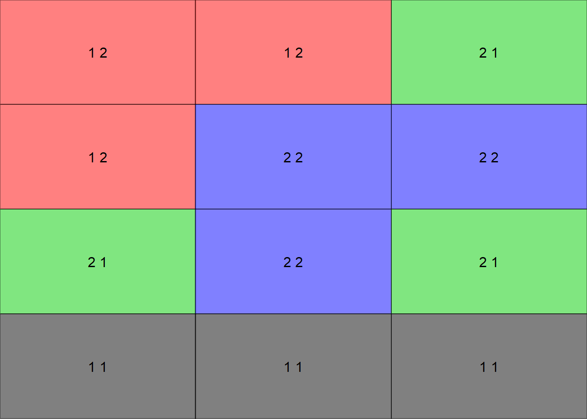
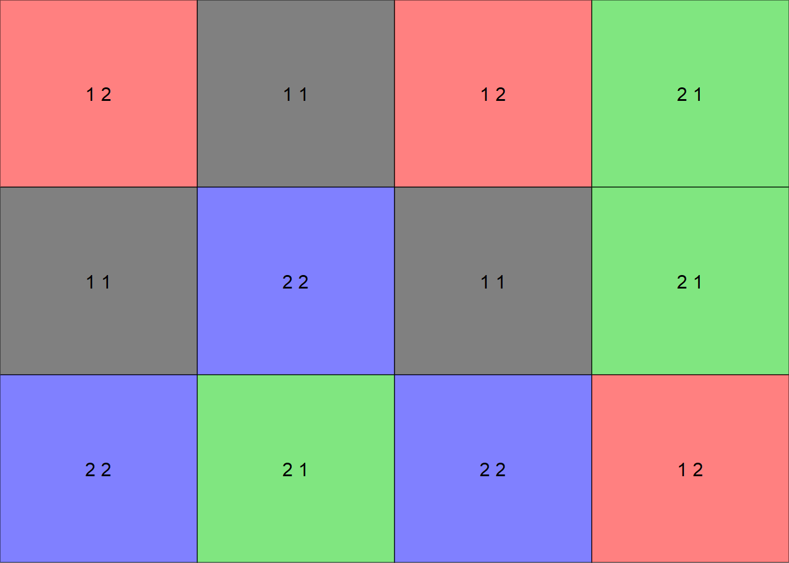
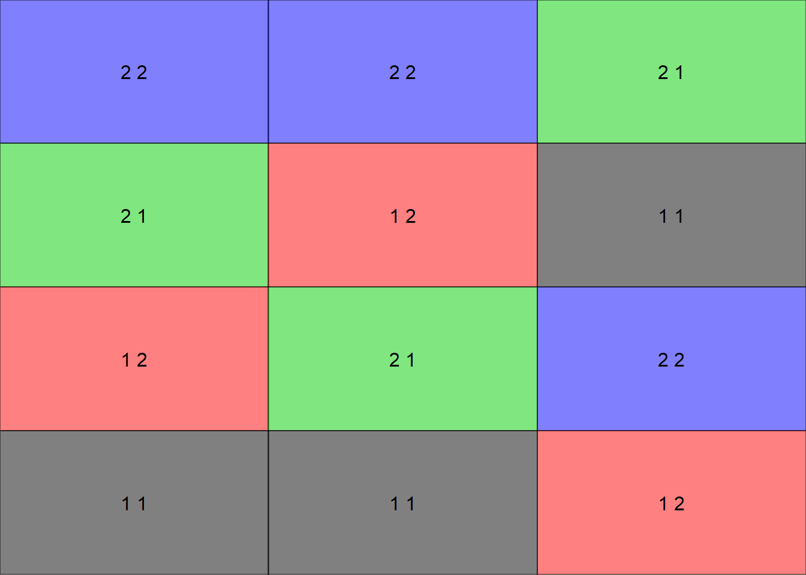
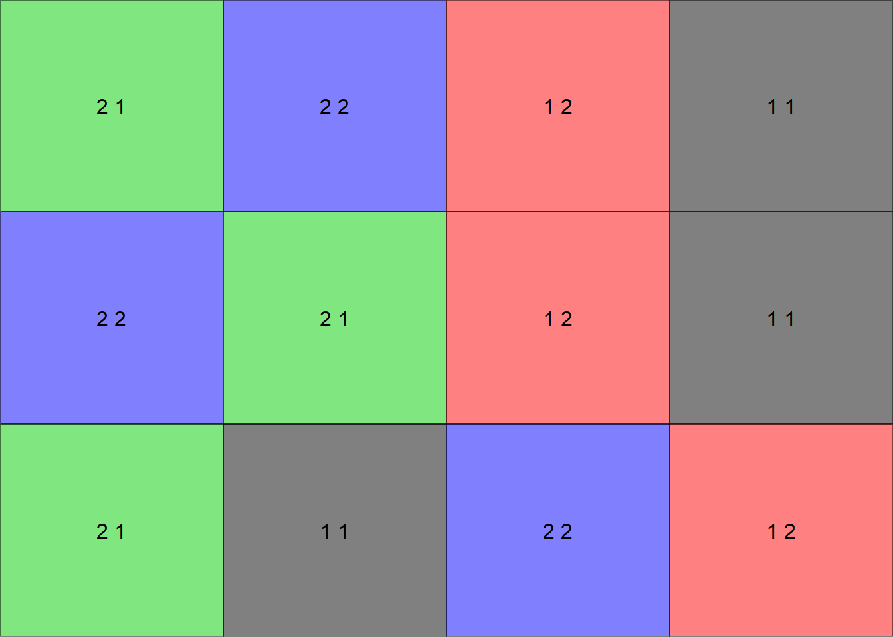
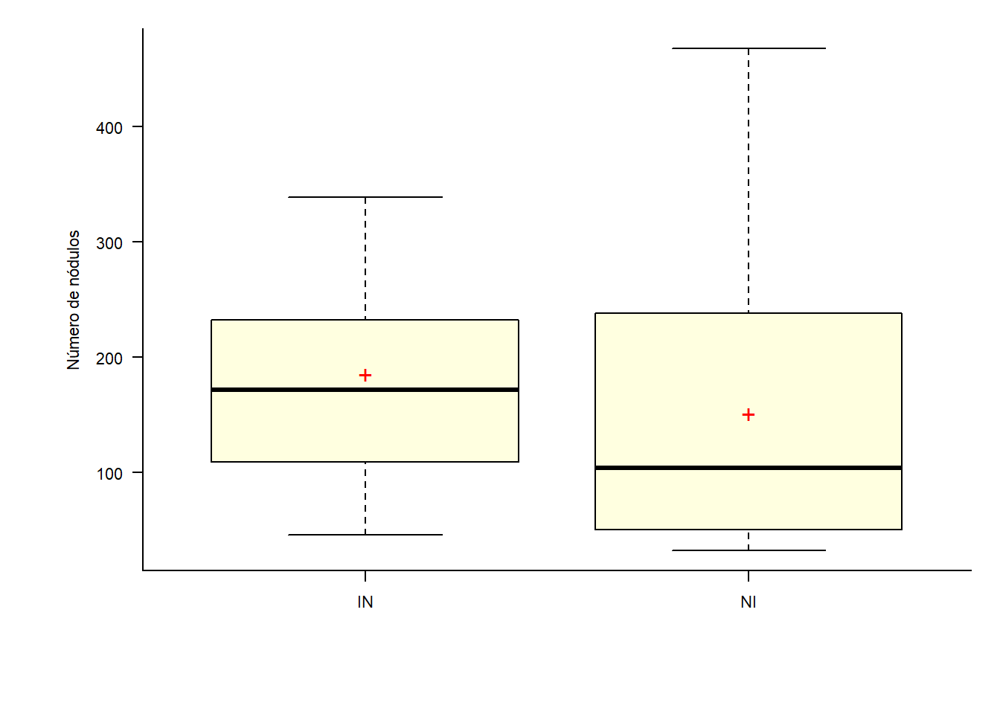
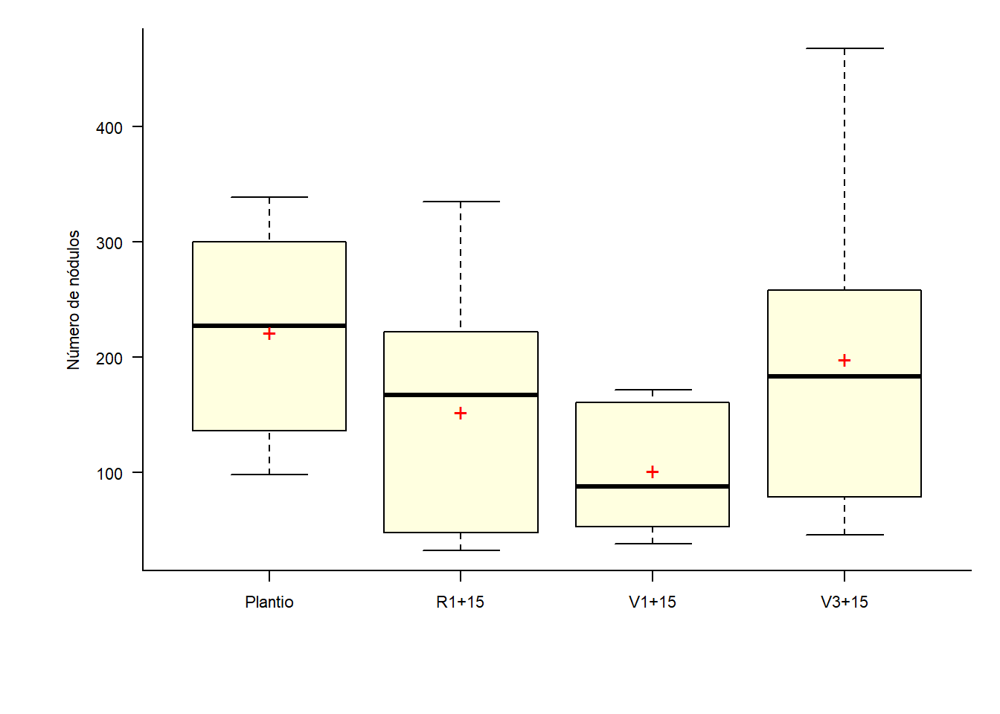
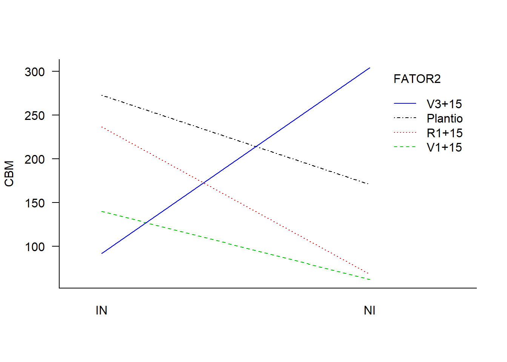
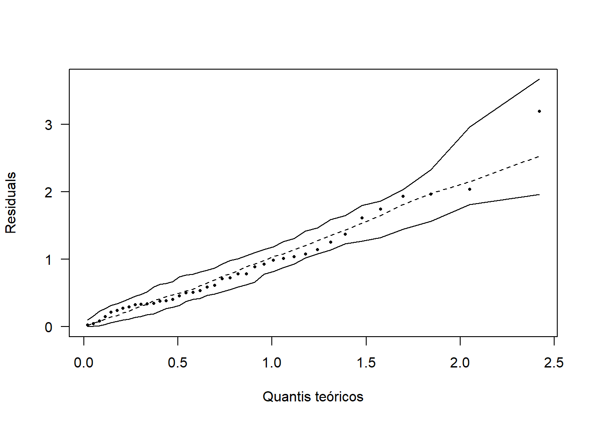

# Esquema Fatorial (2 Fatores) 

****

<br><br><br><br>

Nos experimentos mais simples comparamos níveis (tratamentos) de apenas um fator; Entretanto, existem casos em que dois ou mais fatores devem ser estudados simultaneamente para que possam nos conduzir a resultados de interesse;

Em geral, os experimentos fatoriais são mais eficientes para este tipo de experimento, pois estudam, ao mesmo tempo, os efeitos de dois ou mais fatores, cada um deles com dois ou mais níveis.

O fatorial é um tipo de esquema, ou seja, uma das maneiras de organizar os tratamentos e não um tipo de delineamento;

Os experimentos fatoriais são montados segundo um tipo de delineamento experimental;

Nos experimentos fatoriais, os tratamentos são obtidos pelas combinações dos níveis dos fatores.

<br>

****

## Tipos de efeitos avaliados

****

<br>

- Efeito Principal: é o efeito de cada fator, independente do efeito dos outros fatores;

- Efeito de Interação: é o efeito simultâneo dos fatores sobre a variável em estudo. Dizemos que ocorre interação entre os fatores quando os efeitos dos níveis de um fator são modificados pelos níveis do outro fator.

<br>

****

## Vantagens

****

<br>

a) Pode-se estudar dois ou mais fatores num único experimento.

b) Pode-se, por meio dos efeitos das interações, verificar se um fator é independente ou dependente do(s) outro(s).

****

## Desvantagens

****

<br>

a) O número de tratamentos ou combinações de níveis de fatores cresce, rapidamente, com o aumento do número de níveis, em cada fator, ou mesmo com o aumento do número de fatores.

b) A interpretação dos resultados se torna mais difícil é medida que aumentamos o número de níveis e de fatores no experimento.

<br>

****

## Modelo estatístico

****

<br>

As observações podem ser descritas pelo modelo estatístico linear:

<center>

$y_{ij} = \mu+\tau_{i}+\beta_{j}+(\tau\beta)_{ij}+\epsilon_{ij}$

</center>

- i = 1; 2; : : : ; a
- j = 1; 2; : : : ; b
- k = 1; 2; : : : ; r

em que:

- $y_{ijk}$ é o valor observado no i-ésimo nivel do Fator A e j-ésima nível do Fator B;
- $\mu$ é uma constante;
- $\tau_{i}$ é o efeito do i-ésimo nível do fator A;
- $\beta_{j}$ é o efeito do j-ésimo nível do fator B;
- $(\tau\beta)_ij$ é o efeito da interação entre $\tau_{i}$ e $\beta_{j}$;
- $(\epsilon)ijk$ é o componente de erro aleatório.

<br>

****

## Hipóteses e quadro da análise de variância

****

<br>

No experimento fatorial com 2 fatores, deseja-se testar a signicância de ambos os fatores. 

Há interesse em testar hipóteses sobre a igualdade dos efeitos do fator A, isto é:

- H0 : $\beta_{11}$ = $\beta_{12}$ = : : : $\beta_{1a}$ = 0
- H1 : Pelo menos um $\beta_{1i} \neq 0$

e a igualdade nos efeitos do fator B, ou seja:

- H0 : $\beta_{21}$ = $\beta_{22}$ = : : : $\beta_{2b}$ = 0
- H1 : Pelo menos um $\beta_{2j} \neq 0$

e, ainda, se há interação entre os fatores:

- H0 : $(\beta_1\beta_2)_{ij}$ = 0 para todo i ; j
- H1 : Pelo menos um $(\beta_1\beta_2)_{ij} \neq 0$

CV              | G.L.        |S.Q.         |Q.M.                          | Fcalc 
---------------:|:-----------:|:-----------:|:----------------------------:|:---------------------------------
Fator A         | $a - 1$     | $SQ_{A}$    | $\frac{SQ_{A}}{a-1}$         | $\frac{QM_{A}}{QM_{Res}}$ 
Fator B         | $b-1$       | $SQ_{B}$    | $\frac{SQ_{B}}{b-1}$         | $\frac{QM_{B}}{QM_{Res}}$
Interação A x B | $(a-1)(b-1)$| $SQ_{AxB}$  | $\frac{SQ_{AxB}}{(a-1)(b-1)}$| $\frac{QM_{AxB}}{QM_{Res}}$
resíduo         | $ab(n-1)$   | $SQ_{Res}$  | $\frac{SQ_{Res(b)}}{ab(n-1)}$| 
Total           | $abn-1$     | $SQ_{Total}$| -                            | 

<br>

****

## Croqui em DIC

****

<br>

Criando uma função para fazer um croqui (Número de coluna igual número de repetições)


```r
# Não alterar os comandos da função
library(agricolae)
library(gridExtra)
library(grid)
croqui=function(trat,r){
  sort=design.ab(trat,r,design = "crd",serie=0)
  sort$book$trat=as.vector(matrix(paste(sort$book$A,sort$book$B),nrow =r,byrow=T))
  ncol=r
  sort$book$trat=as.factor(sort$book$trat)
  gs <- lapply(sort$book$trat, function(ii)
    grobTree(rectGrob(gp=gpar(fill=ii, alpha=0.5)),textGrob(ii)))
  grid.arrange(grobs=gs, ncol=ncol)}
```

<br>

Vetor de tratamentos


```r
trat=c(2,2)
```

<br>

Usando a função


```r
croqui(trat,r=3)
```



<br>

Criando uma função para fazer um croqui (Número de colunas igual número de tratamentos)


```r
# Não alterar os comandos da função
library(agricolae)
library(gridExtra)
library(grid)
croqui=function(trat,r){
  sort=design.ab(trat,r,design = "crd",serie=0)
  sort$book$trat=as.vector(t(matrix(paste(sort$book$A,sort$book$B),nrow =r, byrow=T)))
  sort$book$trat=as.factor(sort$book$trat)
  ncol=length(levels(sort$book$trat))
  gs <- lapply(sort$book$trat, function(ii)
    grobTree(rectGrob(gp=gpar(fill=ii, alpha=0.5)),textGrob(ii)))
  grid.arrange(grobs=gs, ncol=ncol)}
```

<br>

Vetor de tratamentos


```r
trat=c(2,2) # número de níveis do fator 1 e fator 2 (no caso são 2 cada)
```

<br>

Usando a função


```r
croqui(trat,r=3)
```



<br><br>

## Croqui em DBC

<br>

Criando uma função para fazer um croqui (Número de coluna igual número de repetições)


```r
# Não alterar os comandos da função
library(agricolae)
library(gridExtra)
library(grid)
croqui=function(trat,r){
  sort=design.ab(trat,r,design = "rcbd",serie=0)
  sort$book$trat=as.vector(matrix(paste(sort$book$A,sort$book$B),nrow =r,byrow=T))
  ncol=r
  sort$book$trat=as.factor(sort$book$trat)
  gs <- lapply(sort$book$trat, function(ii)
    grobTree(rectGrob(gp=gpar(fill=ii, alpha=0.5)),textGrob(ii)))
  grid.arrange(grobs=gs, ncol=ncol)}
```

<br>

Vetor de tratamentos


```r
trat=c(2,2)
```

<br>

Usando a função


```r
croqui(trat,r=3)
```



<br>

Criando uma função para fazer um croqui (Número de colunas igual número de tratamentos)


```r
# Não alterar os comandos da função
library(agricolae)
library(gridExtra)
library(grid)
croqui=function(trat,r){
  sort=design.ab(trat,r,design = "rcbd",serie=0)
  sort$book$trat=as.vector(t(matrix(paste(sort$book$A,sort$book$B),nrow =r, byrow=T)))
  sort$book$trat=as.factor(sort$book$trat)
  ncol=length(levels(sort$book$trat))
  gs <- lapply(sort$book$trat, function(ii)
    grobTree(rectGrob(gp=gpar(fill=ii, alpha=0.5)),textGrob(ii)))
  grid.arrange(grobs=gs, ncol=ncol)}
```

<br>

Vetor de tratamentos


```r
trat=c(2,2) # número de níveis do fator 1 e fator 2 (no caso são 2 cada)
```

<br>

Usando a função


```r
croqui(trat,r=3)
```




<br><br><br>

****

## Exemplo 1

****

<br>

Um experimento foi conduzido em casa de vegetação em vasos na Universidade Estadual de Londrina. O trabalho tem o objetivo de avaliar a aplicação de dicloroisocianurato de sódio (DUP) em soja em 4 épocas de aplicação em soja inoculada ou não com *Rhizobium* e sua influência sobre o número de nódulos. O experimento foi conduzido em delineamento inteiramente casualizado com cinco repetições.


**Fonte da foto**: https://blog.aegro.com.br/inoculante-para-soja/ 


<br>


```r
NN=c(339,332,163,230,300,
      163,172,123,083,161,
      171,069,095,046,079,
      335,235,217,174,222,
      284,136,225,098,110,
      082,038,092,053,046,
      196,252,346,468,258,
      032,038,063,048,160)
(Inoculacao=rep(c("IN","NI"),e=20))
```

```
##  [1] "IN" "IN" "IN" "IN" "IN" "IN" "IN" "IN" "IN" "IN" "IN" "IN" "IN" "IN" "IN"
## [16] "IN" "IN" "IN" "IN" "IN" "NI" "NI" "NI" "NI" "NI" "NI" "NI" "NI" "NI" "NI"
## [31] "NI" "NI" "NI" "NI" "NI" "NI" "NI" "NI" "NI" "NI"
```

```r
(epoca=rep(c("Plantio","V1+15","V3+15","R1+15"),e=5,2))
```

```
##  [1] "Plantio" "Plantio" "Plantio" "Plantio" "Plantio" "V1+15"   "V1+15"  
##  [8] "V1+15"   "V1+15"   "V1+15"   "V3+15"   "V3+15"   "V3+15"   "V3+15"  
## [15] "V3+15"   "R1+15"   "R1+15"   "R1+15"   "R1+15"   "R1+15"   "Plantio"
## [22] "Plantio" "Plantio" "Plantio" "Plantio" "V1+15"   "V1+15"   "V1+15"  
## [29] "V1+15"   "V1+15"   "V3+15"   "V3+15"   "V3+15"   "V3+15"   "V3+15"  
## [36] "R1+15"   "R1+15"   "R1+15"   "R1+15"   "R1+15"
```

```r
F1=as.factor(Inoculacao)
F2=as.factor(epoca)
Trat=paste(F1,F2)
dados=data.frame(F1,F2,resp=NN)
X="";Y="Número de nódulos"
```

<br><br>

## Estatística descritiva


```r
Media = with(dados, mean(resp))
Variancia = with(dados, var(resp))
Desvio = with(dados, sd(resp))
CV = Desvio / Media * 100

desc = cbind(Media, Variancia, Desvio, CV)
desc
```


Media    Variancia   Desvio   CV    
-------  ----------  -------  ------
168.35   11413.41    106.83   63.46 

<br>

### Por Inoculação


```r
MediaA = with(dados, tapply(resp, F1, mean))
VarianciaA = with(dados, tapply(resp, F1, var))
DesvioA = with(dados, tapply(resp, F1, sd))
CVA = DesvioA / MediaA * 100
Desc = cbind(MediaA, VarianciaA, DesvioA, CVA)
Desc
```


     MediaA   VarianciaA   DesvioA   CVA   
---  -------  -----------  --------  ------
IN   185.45   8229.21      90.71     48.92 
NI   151.25   14582.72     120.76    79.84 

<br>

### Por época de aplicação


```r
MediaB = with(dados, tapply(resp, F2, mean))
VarianciaB = with(dados, tapply(resp, F2, var))
DesvioB = with(dados, tapply(resp, F2, sd))
CVB = DesvioB / MediaB * 100
Desc = cbind(MediaB, VarianciaB, DesvioB, CVB)
Desc
```


          MediaB   VarianciaB   DesvioB   CVB   
--------  -------  -----------  --------  ------
Plantio   221.7    8287.34      91.03     41.06 
R1+15     152.4    10686.93     103.38    67.83 
V1+15     101.3    2559.12      50.59     49.94 
V3+15     198.0    18507.56     136.04    68.71 

<br><br>

## Gráficos exploratórios

<br>

### Gráfico de Caixas

#### Fator 1


```r
par(bty='l', mai=c(1, 1, .2, .2))
par(cex=0.7)
caixas=with(dados, car::Boxplot(resp ~ F1, vertical=T,las=1, col='Lightyellow',
                    xlab=X, ylab=Y))
mediab=with(dados,tapply(resp, F1, mean))
points(mediab, pch='+', cex=1.5, col='red')
```



<br>

#### Fator 2


```r
par(bty='l', mai=c(1, 1, .2, .2))
par(cex=0.7)
caixas=with(dados, car::Boxplot(resp ~ F2, vertical=T,las=1, col='Lightyellow',
                    xlab=X, ylab=Y))
mediab=with(dados,tapply(resp, F2, mean))
points(mediab, pch='+', cex=1.5, col='red')
```



<br>

#### Juntando Fatores


```r
par(bty='l', mai=c(1, 1, .2, .2))
par(cex=0.7)
caixas=with(dados, car::Boxplot(resp ~ F1*F2, vertical=T,las=1, col='Lightyellow',
                    xlab=X, ylab=Y))
```


<br><br>

### Gráfico de interação


```r
with(dados, interaction.plot(F2, F1, resp, las=1, col=1:6, bty='l', 
                             xlab='', ylab='CBM', trace.label="FATOR1"))
```


```r
# FATOR1 e FATOR2
with(dados, interaction.plot(F1, F2, resp, las=1, col=1:6, bty='l', 
                             xlab='', ylab='CBM', trace.label="FATOR2"))
```



<br><br>

## Análise de Variância

**Hipótese do Fator 1**:

\begin{eqnarray*}
\left\{
\begin{array}{ll}
H_0: & \mu_1 = \mu_2\\[.2cm]
H_1: & \mu_i \neq \mu_i' \qquad i \neq i'.
\end{array}
\right.
\end{eqnarray*}

**Hipótese do Fator 2**:

\begin{eqnarray*}
\left\{
\begin{array}{ll}
H_0: & \mu_1 = \mu_2 = \mu_3 = \mu_4 \\[.2cm]
H_1: & \mu_i \neq \mu_i' \qquad i \neq i'.
\end{array}
\right.
\end{eqnarray*}

**Hipótese da interação**:

\begin{eqnarray*}
\left\{
\begin{array}{ll}
H_0: & \mbox{Todas as combinações entre os níveis do fator 1 e do fator 2 têm o mesmo efeito} \\[.2cm]
H_1: & \mbox{Pelo menos duas combinações entre os níveis do fator 1 e do fator 2 têm efeitos diferentes}.
\end{array}
\right.
\end{eqnarray*}


```r
mod = with(dados, aov(resp~F1*F2))
anova(mod)
```


            GL   SQ         QM         Teste F     p-valor   
----------  ---  ---------  ---------  ----------  ----------
F1          1    11696.4    11696.40   2.757934    0.1065420 
F2          3    84754.5    28251.50   6.661518    0.0012721 
F1:F2       3    212960.2   70986.73   16.738206   0.0000010 
Residuals   32   135712.0   4241.00    NA          NA        

<br><br>

## Pressuposições

<br>

### Normalidade dos erros

\begin{eqnarray*}
\left\{
\begin{array}{ll}
H_0: & \mbox{Os erros seguem distribuição normal}\\[.2cm]
H_1: & \mbox{Os erros não seguem distribuição normal}.
\end{array}
\right.
\end{eqnarray*}


```r
(norm=shapiro.test(mod$res))
```

```
## 
## 	Shapiro-Wilk normality test
## 
## data:  mod$res
## W = 0.96809, p-value = 0.3125
```


```r
hnp::hnp(mod, las=1, xlab="Quantis teóricos", pch=16)
```



<br>

### Homogeneidade de variâncias

\begin{eqnarray*}
\left\{
\begin{array}{ll}
H_0: & \mbox{ As variâncias são homogêneas}\\[.2cm]
H_1: & \mbox{ As variâncias não são homogêneas}.
\end{array}
\right.
\end{eqnarray*}

#### Para Fator 1


```r
with(dados, bartlett.test(mod$residuals~F1))
```

```
## 
## 	Bartlett test of homogeneity of variances
## 
## data:  mod$residuals by F1
## Bartlett's K-squared = 1.1346, df = 1, p-value = 0.2868
```

<br>

#### Para Fator 2


```r
with(dados, bartlett.test(mod$residuals~F2))
```

```
## 
## 	Bartlett test of homogeneity of variances
## 
## data:  mod$residuals by F2
## Bartlett's K-squared = 8.1367, df = 3, p-value = 0.04327
```

<br>

#### Juntandos os fatores


```r
tratamentos=rep(c(paste("T",1:8)),e=5)
with(dados, bartlett.test(mod$residuals~tratamentos))
```

```
## 
## 	Bartlett test of homogeneity of variances
## 
## data:  mod$residuals by tratamentos
## Bartlett's K-squared = 9.8754, df = 7, p-value = 0.1957
```

<br>

### Independência dos erros

\begin{eqnarray*}
\left\{
\begin{array}{ll}
H_0: \mbox{Os erros são independentes}\\[.2cm]
H_1: \mbox{Os erros não são independentes}.
\end{array}
\right.
\end{eqnarray*}


```r
(ind=lmtest::dwtest(mod))
```

```
## 
## 	Durbin-Watson test
## 
## data:  mod
## DW = 1.9256, p-value = 0.07498
## alternative hypothesis: true autocorrelation is greater than 0
```


```r
plot(mod$res, las=1, pch=19, col='red', ylab='Resíduos brutos')
abline(h=0)
```


<br>

## Teste de comparações


```r
library(ExpDes.pt)
```

```
## 
## Attaching package: 'ExpDes.pt'
```

```
## The following objects are masked from 'package:agricolae':
## 
##     lastC, order.group, tapply.stat
```

```
## The following object is masked from 'package:stats':
## 
##     ccf
```

```r
with(dados,fat2.dic(F1,F2,resp, mcomp="tukey"))
```

```
## ------------------------------------------------------------------------
## Legenda:
## FATOR 1:  F1 
## FATOR 2:  F2 
## ------------------------------------------------------------------------
## 
## 
## Quadro da analise de variancia
## ------------------------------------------------------------------------
##         GL     SQ    QM      Fc    Pr>Fc
## F1       1  11696 11696  2.7579 0.106542
## F2       3  84754 28252  6.6615 0.001272
## F1*F2    3 212960 70987 16.7382 0.000001
## Residuo 32 135712  4241                 
## Total   39 445123                       
## ------------------------------------------------------------------------
## CV = 38.68 %
## 
## ------------------------------------------------------------------------
## Teste de normalidade dos residuos (Shapiro-Wilk)
## valor-p:  0.3125183 
## De acordo com o teste de Shapiro-Wilk a 5% de significancia, os residuos podem ser considerados normais.
## ------------------------------------------------------------------------
## 
## 
## 
## Interacao significativa: desdobrando a interacao
## ------------------------------------------------------------------------
## 
## Desdobrando  F1  dentro de cada nivel de  F2 
## ------------------------------------------------------------------------
## ------------------------------------------------------------------------
## Quadro da analise de variancia
## ------------------------------------------------------------------------
##               GL       SQ        QM      Fc  Pr.Fc
## F2             3  84754.5  28251.50  6.6615 0.0013
## F1:F2 Plantio  1  26112.1  26112.10  6.1571 0.0185
## F1:F2 R1+15    1  70896.4  70896.40 16.7169  3e-04
## F1:F2 V1+15    1  15288.1  15288.10  3.6048 0.0667
## F1:F2 V3+15    1 112360.0 112360.00 26.4938      0
## Residuo       32 135712.0   4241.00               
## Total         39 445123.1  11413.41               
## ------------------------------------------------------------------------
## 
## 
## 
##  F1  dentro do nivel  Plantio  de  F2 
## ------------------------------------------------------------------------
## Teste de Tukey
## ------------------------------------------------------------------------
## Grupos Tratamentos Medias
## a 	 1 	 272.8 
##  b 	 2 	 170.6 
## ------------------------------------------------------------------------
## 
## 
##  F1  dentro do nivel  R1+15  de  F2 
## ------------------------------------------------------------------------
## Teste de Tukey
## ------------------------------------------------------------------------
## Grupos Tratamentos Medias
## a 	 1 	 236.6 
##  b 	 2 	 68.2 
## ------------------------------------------------------------------------
## 
## 
##  F1  dentro do nivel  V1+15  de  F2 
## 
## De acordo com o teste F, as medias desse fator sao estatisticamente iguais.
## ------------------------------------------------------------------------
##     Niveis     Medias
## 1        1      140.4
## 2        2       62.2
## ------------------------------------------------------------------------
## 
## 
##  F1  dentro do nivel  V3+15  de  F2 
## ------------------------------------------------------------------------
## Teste de Tukey
## ------------------------------------------------------------------------
## Grupos Tratamentos Medias
## a 	 2 	 304 
##  b 	 1 	 92 
## ------------------------------------------------------------------------
## 
## 
## 
## Desdobrando  F2  dentro de cada nivel de  F1 
## ------------------------------------------------------------------------
## ------------------------------------------------------------------------
## Quadro da analise de variancia
## ------------------------------------------------------------------------
##          GL       SQ       QM      Fc  Pr.Fc
## F1        1  11696.4 11696.40  2.7579 0.1065
## F2:F1 IN  3 105043.8 35014.58  8.2562  3e-04
## F2:F1 NI  3 192671.0 64223.65 15.1435      0
## Residuo  32 135712.0  4241.00               
## Total    39 445123.1 11413.41               
## ------------------------------------------------------------------------
## 
## 
## 
##  F2  dentro do nivel  IN  de  F1 
## ------------------------------------------------------------------------
## Teste de Tukey
## ------------------------------------------------------------------------
## Grupos Tratamentos Medias
## a 	 1 	 272.8 
## ab 	 2 	 236.6 
##  bc 	 3 	 140.4 
##   c 	 4 	 92 
## ------------------------------------------------------------------------
## 
## 
##  F2  dentro do nivel  NI  de  F1 
## ------------------------------------------------------------------------
## Teste de Tukey
## ------------------------------------------------------------------------
## Grupos Tratamentos Medias
## a 	 4 	 304 
##  b 	 1 	 170.6 
##  b 	 2 	 68.2 
##  b 	 3 	 62.2 
## ------------------------------------------------------------------------
```

<br><br><br><br>
