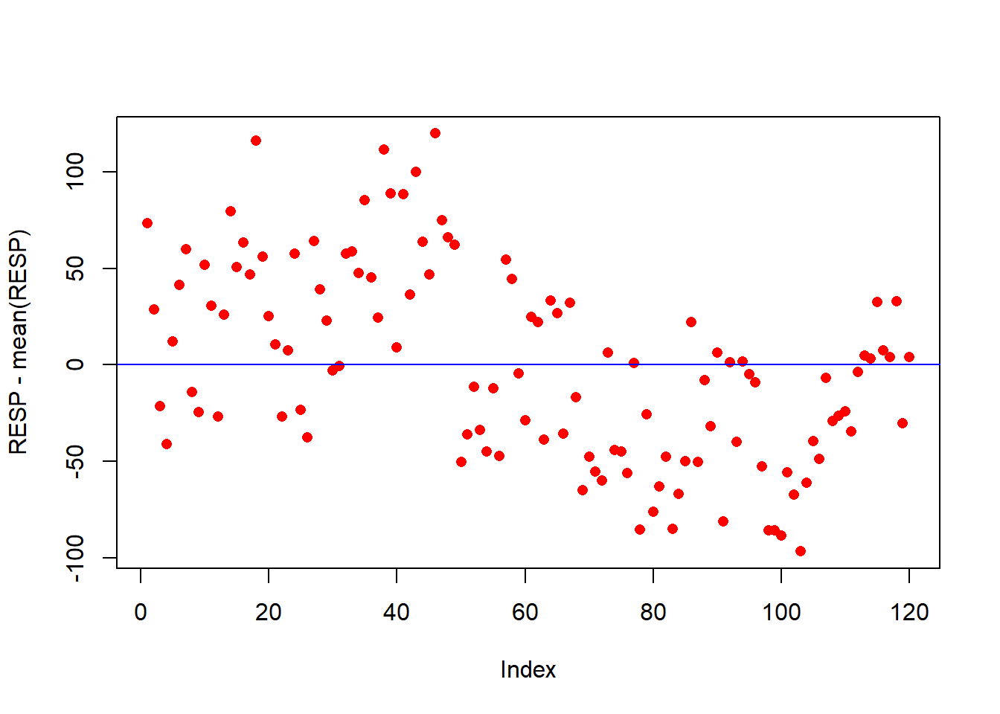

# Esquema de Parcelas Subdivididas

****

<br><br><br><br>

- Tal como no caso de fatorial, o termo parcelas subdivididas não se refere a um tipo de delineamento e sim ao esquema do experimento, ou seja, a maneira pela qual os tratamentos são organizados.
- Nos experimentos em parcelas subdivididas, em geral, estuda-se simultaneamente dois tipos de fatores os quais são geralmente denominados de fatores primários e fatores secundários.
- Em um experimento em parcelas subdivididas, as unidades experimentais são agrupadas em parcelas as quais devem conter um número de unidades experimentais (subparcelas) igual ao
número de níveis do fator secundário.
- Na instalação os níveis do fator primário (A) são distribuidos às parcelas segundo um tipo de delineamento experimental: DIC, DBC, DQL.
- Posteriormente os níveis do fator secundário (B) são distribuídos ao acaso às subparcerlas de cada parcela.Tal disposição permite obter uma estimativa geral de maior precisão para os efeitos dos tratamentos do segundo fator.
- Nos experimentos em parcelas subdivididas tem-se dois resíduos distintos: um correspondente às parcelas e outro às subparcelas dentro das parcelas.
- Em casos mais complexos, as subparcelas podem, também, ser repartidas em subsubparcelas. Tem-se, neste caso, três resíduos distintos:
  - resíduo (a), referente às parcelas;
  - resíduo (b), à subparcelas e
  - resíduo (c), correspondendo às subsubparcelas.

<br>

****

## Vantagens

****

<br>

a) Em comparação com experimentos fatoriais, experimentos em parcelas subdivididas são mais fáceis de instalar;

b) Quando os tratamentos associados aos níveis de um dos fatores exigem maior quantidade de material na unidade experimental do que os tratamentos do outro fator.

c) O esquema pode ser utilizado quando um fator adicional é incorporado num experimento, para ampliar seu objetivo.

d) Através da prévia informação, sabe-se que maiores diferenças podem ser esperadas entre os níveis de um certo fator do que entre os níveis do outro fator.

<br>

****

## Desvantagens

****

<br>

a) Do ponto de vista estatístico, os fatoriais são, em geral, mais eficientes que os em parcelas subdivididas;

b) Enquanto nos fatoriais temos um são resíduo para todos os F e comparações de médias, no *"split-plot"* há dois resíduos, um para comparações de parcelas e outro para subparcelas;

c) Para parcela, o número de GL geralmente é pequeno, levando à pouca sensibilidade na análise;

d) Sempre que possível, é preferível utilizar experimentos fatoriais em lugar dos experimentos em parcelas subdivididas.

<br>

****

## Modelo estatístico

****

<br>

O modelo linear para o experimento em parcelas subdivididas no delineamento em blocos ao acaso é dado por:

<center>

$yijk = \mu+\tau_{i}+\gamma_{k}+(\tau\gamma)_{ik}+\beta_{j}+(\tau\beta)_{ij}+(\tau\beta\gamma)_{ijk}$

</center>

- i = 1; 2; : : : ; a
- j = 1; 2; : : : ; b
- k = 1; 2; : : : ; r

em que:

- $y_{ijk}$ é o valor observado no i-ésimo tratamento, k-ésimo bloco e j-ésima subparcela;
- $\mu$ é uma constante;
- $\tau_{i}$ é o efeito do i-ésimo fator A;
- $\gamma_{k}$ é o efeito do k-ésimo bloco;
- $(\tau\gamma)_{ik}$ é o resíduo (a) da parcela;
- $\beta_{j}$ é o efeito do j-ésimo fator B;
- $(\tau\beta)_ij$ é a interação entre o i-ésimo fator A e o j-ésimo fator B;
- $(\tau\beta\gamma)ijk$ é o resíduo (b) da subparcela;

<br>

****

## Hipóteses e modelo

****

<br>

No experimento em parcelas subdivididas com 2 fatores, deseja-se testar a signicância de ambos os fatores. Há interesse em testar hipóteses sobre a igualdade dos efeitos do fator primário, isto é:

\begin{eqnarray*}
\left\{
\begin{array}{ll}
H_0: & \mu_1 = \mu_2 = \mu_3 = \cdots = \mu_{a} \\[.2cm]
H_1: & \mu_i \neq \mu_i' \qquad i \neq i'.
\end{array}
\right.
\end{eqnarray*}

e a igualdade nos efeitos do fator secundário, ou seja:

\begin{eqnarray*}
\left\{
\begin{array}{ll}
H_0: & \mu_1 = \mu_2 = \mu_3 = \cdots = \mu_{b} \\[.2cm]
H_1: & \mu_i \neq \mu_i' \qquad i \neq i'.
\end{array}
\right.
\end{eqnarray*}

e, ainda, se há interação entre os fatores:

\begin{eqnarray*}
\left\{
\begin{array}{ll}
H_0: & (\tau\beta)ij = 0 \mbox{para todo} i ; j \\[.2cm]
H_1: & \mbox{Pelo menos um} (\tau\beta)ij \neq 0
\end{array}
\right.
\end{eqnarray*}

CV             | G.L.         |S.Q.             |Q.M.                              |  Fcalc 
--------------:|:---------:|:-------------:|:-------------------------:|:------------------------:|:-------------
Bloco          | $r-1$        | $SQ_{Bloc}$     | $\frac{SQ_{Bloc}}{r-1}$          | $\frac{QM_{Bloc}}{QM_{Res(a)}}$
Tratamento A   | $a - 1$      | $SQ_{A}$        | $\frac{SQ_{A}}{a-1}$             | $\frac{QM_{A}}{QM_{Res(a)}}$ 
resíduo A      | $(a-1)(r-1)$ | $SQ_{Res(A)}$   | $\frac{SQ_{res(A)}}{(a-1)(r-1)}$ | 
Parcelas       | $ar-1$       | $SQ_{Parcelas}$ |  -                               |        
Tratamento B   | $b-1$        | $SQ_{B}$        | $\frac{SQ_{B}}{b-1}$             | $\frac{QM_{B}}{QM_{Res(b)}}$
Interação A x B | $(a-1)(b-1)$ | $SQ_{AxB}$      | $\frac{SQ_{AB}}{(a-1)(b-1)}$     | $\frac{QM_{AxB}}{QM_{Res(b)}}$
resíduo B      | $a(a-1)(r-1)$| $SQ_{Res(B)}$   | $\frac{SQ_{Res(b)}}{(r-1)(b-1)}$ | 
Total          | $abr-1$      | $SQ_{Total}$    | -                                | 

<br>

****

## Croqui em DIC

****

<br>

Criando uma função para fazer um croqui (Número de coluna igual número de repetições)


```r
# Não alterar os comandos da função
library(agricolae)
library(gridExtra)
library(grid)
croqui=function(trat,trat1,r){
  sort=design.split(trat,trat1,r,design = "crd",serie=0)
  sort$book$trat=as.vector(matrix(paste(sort$book$trat,sort$book$trat1),nrow =r,byrow=T))
  ncol=r
  sort$book$trat=as.factor(sort$book$trat)
  gs <- lapply(sort$book$trat, function(ii)
    grobTree(rectGrob(gp=gpar(fill=ii, alpha=0.5)),textGrob(ii)))
  grid.arrange(grobs=gs, ncol=ncol)}
```

<br>

Vetor de tratamentos


```r
trat=c("A1","A2")
trat1=c("B1","B2","B3")
```

<br>

Usando a função


```r
croqui(trat,trat1,r=2)
```


<br>

Criando uma função para fazer um croqui (Número de colunas igual número de tratamentos)


```r
# Não alterar os comandos da função
library(agricolae)
library(gridExtra)
library(grid)
croqui=function(trat,trat1,r){
  sort=design.split(trat,trat1,r,design = "crd",serie=0)
  sort$book$trat=as.vector(t(matrix(paste(sort$book$trat,sort$book$trat1),nrow =r, byrow=T)))
  sort$book$trat=as.factor(sort$book$trat)
  ncol=length(levels(sort$book$trat))
  gs <- lapply(sort$book$trat, function(ii)
    grobTree(rectGrob(gp=gpar(fill=ii, alpha=0.5)),textGrob(ii)))
  grid.arrange(grobs=gs, ncol=ncol)}
```

<br>

Vetor de tratamentos


```r
trat=c("A1","A2")
trat1=c("B1","B2","B3")
```

<br>

Usando a função


```r
croqui(trat,trat1,r=2)
```


<br><br>

****

## Croqui em DBC

****

<br>

Criando uma função para fazer um croqui (Número de coluna igual número de repetições)


```r
# Não alterar os comandos da função
library(agricolae)
library(gridExtra)
library(grid)
croqui=function(trat,trat1,r){
  sort=design.split(trat,trat1,r,design = "rcbd",serie=0)
  sort$book$trat=as.vector(matrix(paste(sort$book$trat,sort$book$trat1),nrow =r,byrow=T))
  ncol=r
  sort$book$trat=as.factor(sort$book$trat)
  gs <- lapply(sort$book$trat, function(ii)
    grobTree(rectGrob(gp=gpar(fill=ii, alpha=0.5)),textGrob(ii)))
  grid.arrange(grobs=gs, ncol=ncol)}
```

<br>

Vetor de tratamentos


```r
trat=c("A1","A2")
trat1=c("B1","B2","B3")
```

<br>

Usando a função


```r
croqui(trat,trat1,r=2)
```


<br>

Criando uma função para fazer um croqui (Número de colunas igual número de tratamentos)


```r
# Não alterar os comandos da função
library(agricolae)
library(gridExtra)
library(grid)
croqui=function(trat,trat1,r){
  sort=design.split(trat,trat1,r,design = "rcbd",serie=0)
  sort$book$trat=as.vector(t(matrix(paste(sort$book$trat,sort$book$trat1),nrow =r, byrow=T)))
  sort$book$trat=as.factor(sort$book$trat)
  ncol=length(levels(sort$book$trat))
  gs <- lapply(sort$book$trat, function(ii)
    grobTree(rectGrob(gp=gpar(fill=ii, alpha=0.5)),textGrob(ii)))
  grid.arrange(grobs=gs, ncol=ncol)}
```

<br>

Vetor de tratamentos


```r
trat=c("A1","A2")
trat1=c("B1","B2","B3")
```

<br>

Usando a função


```r
croqui(trat,trat1,r=2)
```


****

## Exemplo 1

****

<br>

Um experimento foi realizado com o intuito de avaliar 5 tratamentos na linha e entrelinha de um pomar. O experimento foi instalado em Delineamento em blocos casualizados com 12 repetições por tratamento. Foi analisado o carbono da biomassa microbiana (CBM).


```r
RESP=c(224.92, 180.32, 130.19, 110.31, 163.74,193.03, 211.49, 137.65, 127.15, 203.39,
       182.36, 124.75, 177.70, 231.01, 202.14,214.89, 198.42, 267.85, 207.67, 176.74,
       162.18, 124.59, 158.99, 209.12, 128.14,113.95, 215.53, 190.51, 174.58, 148.70,
       150.90, 209.03, 210.40, 199.03, 237.05,196.97, 176.06, 263.27, 240.19, 160.72,
       239.90, 188.07, 251.35, 215.45, 198.50,271.42, 226.56, 217.65, 213.69, 101.26,
       115.41, 140.10, 117.67, 106.45, 139.34,104.22, 206.13, 195.89, 147.11, 122.93,
       176.55, 173.63, 112.83, 184.82, 178.18, 115.85, 183.89, 134.92, 086.49, 103.96,
       096.33, 091.64, 157.76, 107.45, 106.61, 095.28, 152.37, 066.02, 125.75, 075.34,
       088.64, 104.00, 066.38, 084.74, 101.76,173.70, 101.24, 143.71, 119.88, 157.79,
       070.42, 152.75, 111.65, 153.08, 146.64,142.57, 098.96, 065.92, 065.62, 063.26,
       095.72, 084.14, 054.92, 090.49, 112.11,102.68, 144.77, 122.58, 125.14, 127.61,
       117.14, 147.87, 156.18, 154.82, 183.91,159.11, 155.41, 184.55, 121.39, 155.77)
FATOR1=rep(rep(c("L","EL"), e=12),5); FATOR1=factor(FATOR1)
FATOR2=rep(c(paste("T",1:5)),e=24); FATOR2=factor(FATOR2)
repe=rep(c(paste("R",1:12)),10); repe=factor(repe)
dados = data.frame(FATOR1,FATOR2,repe,RESP)
```

<br><br>

## Estatística descritiva


```r
"Média" = with(dados, mean(RESP))
"Variância" = with(dados, var(RESP))
Desvio = with(dados, sd(RESP))
CV = Desvio / Média * 100

desc = cbind(Média, Variância, Desvio, CV)
rownames(desc) = 'CBM'
library(knitr)

kable(round(desc,2), align="l", format="pandoc", format.args = list(big.mark="."))
```

```
## Warning in prettyNum(.Internal(format(x, trim, digits, nsmall, width, 3L, :
## 'big.mark' and 'decimal.mark' are both '.', which could be confusing

## Warning in prettyNum(.Internal(format(x, trim, digits, nsmall, width, 3L, :
## 'big.mark' and 'decimal.mark' are both '.', which could be confusing

## Warning in prettyNum(.Internal(format(x, trim, digits, nsmall, width, 3L, :
## 'big.mark' and 'decimal.mark' are both '.', which could be confusing

## Warning in prettyNum(.Internal(format(x, trim, digits, nsmall, width, 3L, :
## 'big.mark' and 'decimal.mark' are both '.', which could be confusing
```

      Média    Variância   Desvio   CV   
----  -------  ----------  -------  -----
CBM   151.58   2.547.35    50.47    33.3 

<br>

### Fator 1 (Linha e Entrelinha)


```r
Médias1 = with(dados, tapply(RESP, FATOR1, mean))
Variâncias1 = with(dados, tapply(RESP, FATOR1, var))
Desvios1 = with(dados, tapply(RESP, FATOR1, sd))
CV1 = Desvios1 / Médias1 * 100
Desc1 = cbind(Médias1, Variâncias1, Desvios1, CV1)
kable(round(Desc1,2),align="l")
```

     Médias1   Variâncias1   Desvios1   CV1   
---  --------  ------------  ---------  ------
EL   166.39    2297.00       47.93      28.80 
L    136.76    2394.44       48.93      35.78 

<br>

### Fator 2 (Manejo)


```r
Médias2 = with(dados, tapply(RESP, FATOR2, mean))
Variâncias2 = with(dados, tapply(RESP, FATOR2, var))
Desvios2 = with(dados, tapply(RESP, FATOR2, sd))
CV2 = Desvios2 / Médias2 * 100
Desc2 = cbind(Médias2, Variâncias2, Desvios2, CV2)
kable(round(Desc2,2),align="l")
```

      Médias2   Variâncias2   Desvios2   CV2   
----  --------  ------------  ---------  ------
T 1   180.03    1599.93       40.00      22.22 
T 2   201.00    1678.32       40.97      20.38 
T 3   139.55    1560.41       39.50      28.31 
T 4   116.90    1085.31       32.94      28.18 
T 5   120.42    1443.94       38.00      31.56 

<br>

### Repetição


```r
Médias4 = with(dados, tapply(RESP, repe, mean))
Variâncias4 = with(dados, tapply(RESP, repe, var))
Desvios4 = with(dados, tapply(RESP, repe, sd))
CV4 = Desvios4/ Médias4 * 100
Desc4 = cbind(Médias4, Variâncias4, Desvios4, CV4)
kable(round(Desc4,2),align="l")
```

       Médias4   Variâncias4   Desvios4   CV4   
-----  --------  ------------  ---------  ------
R 1    158.07    1917.57       43.79      27.70 
R 10   164.26    3154.85       56.17      34.19 
R 11   152.76    2803.26       52.95      34.66 
R 12   146.87    2228.39       47.21      32.14 
R 2    153.81    3815.91       61.77      40.16 
R 3    140.69    3301.19       57.46      40.84 
R 4    145.15    2131.01       46.16      31.80 
R 5    159.66    1780.25       42.19      26.43 
R 6    148.27    3522.03       59.35      40.03 
R 7    157.96    3902.06       62.47      39.54 
R 8    145.57    2218.76       47.10      32.36 
R 9    145.87    2264.97       47.59      32.63 

<br>

### Juntando os fatores


```r
Médias3 = with(dados, tapply(RESP, list(FATOR1,FATOR2), mean))
Variâncias3 = with(dados, tapply(RESP, list(FATOR1,FATOR2), var))
Desvios3 = with(dados, tapply(RESP, list(FATOR1,FATOR2), sd))
CV3 = Desvios3/Médias3 * 100
Desc3 = rbind(Médias3, Variâncias3, Desvios3, CV3)
rownames(Desc3)=c("Média.L","Média.EL","Variância.L","Variância.EL", "Desvio.L","Desvio.EL", "CV.L","CV.EL")
kable(round(Desc3,2),align="l")
```

               T 1       T 2       T 3       T 4      T 5    
-------------  --------  --------  --------  -------  -------
Média.L        194.28    220.76    136.59    131.27   149.07 
Média.EL       165.78    181.23    142.52    102.53   91.76  
Variância.L    1398.17   1208.34   1588.68   904.49   505.68 
Variância.EL   1504.10   1448.57   1654.85   914.33   721.90 
Desvio.L       37.39     34.76     39.86     30.07    22.49  
Desvio.EL      38.78     38.06     40.68     30.24    26.87  
CV.L           19.25     15.75     29.18     22.91    15.08  
CV.EL          23.39     21.00     28.54     29.49    29.28  

<br><br>

## Gráficos exploratórios

<br>

### Gráfico de caixas (*Boxplot*)

<br>

#### Fator 1


```r
caixas=with(dados, car::Boxplot(RESP ~ FATOR1, vertical=T,las=1, col='Lightyellow'))
points(Médias1, pch='+', cex=1.5, col='red')
```


<br>

#### Fator 2


```r
caixas=with(dados, car::Boxplot(RESP ~ FATOR2, vertical=T,las=1, col='Lightyellow'))
points(Médias2, pch='+', cex=1.5, col='red')
```


<br>

#### Juntando fatores


```r
caixas=with(dados, car::Boxplot(RESP ~ FATOR1*FATOR2, vertical=T,las=1, col='Lightyellow'))
```


<br>

### Interação


```r
library(gplots)
```

```
## Warning: package 'gplots' was built under R version 3.6.3
```

```
## 
## Attaching package: 'gplots'
```

```
## The following object is masked from 'package:stats':
## 
##     lowess
```

```r
library(lattice)
with(dados, xyplot(RESP ~ FATOR1|FATOR2, groups=repe, aspect="xy", type="o", ylab='CBM',
                   strip=strip.custom(strip.names=TRUE, strip.levels=TRUE)))
```


```r
with(dados, xyplot(RESP ~ FATOR1|repe, groups=FATOR2, aspect="xy", type="o", ylab='CBM',
                   strip=strip.custom(strip.names=TRUE, strip.levels=TRUE)))
```


```r
with(dados, xyplot(RESP ~ FATOR2|repe, groups=FATOR1, aspect="xy", type="o", ylab='CBM',
                   strip=strip.custom(strip.names=TRUE, strip.levels=TRUE)))
```


```r
with(dados, interaction.plot(FATOR2, FATOR1, RESP, las=1, col=1:6, bty='l', 
                             xlab='', ylab='CBM', trace.label="repe"))
```


```r
# FATOR1 e FATOR2
with(dados, interaction.plot(FATOR1, FATOR2, RESP, las=1, col=1:6, bty='l', 
                             xlab='', ylab='CBM', trace.label="FATOR2"))
```


<br><br>

## Análise de Variância

\begin{eqnarray*}
\left\{
\begin{array}{ll}
H_0: & \mu_1 = \mu_2 = \mu_3 = \cdots = \mu_{a} \\[.2cm]
H_1: & \mu_i \neq \mu_i' \qquad i \neq i'.
\end{array}
\right.
\end{eqnarray*}

e a igualdade nos efeitos do fator secundário, ou seja:
\begin{eqnarray*}
\left\{
\begin{array}{ll}
H_0: & \mu_1 = \mu_2 = \mu_3 = \cdots = \mu_{b} \\[.2cm]
H_1: & \mu_i \neq \mu_i' \qquad i \neq i'.
\end{array}
\right.
\end{eqnarray*}

e, ainda, se há interação entre os fatores:

\begin{eqnarray*}
\left\{
\begin{array}{ll}
H_0: & (\tau\beta)ij = 0 \mbox{para todo} i ; j \\[.2cm]
H_1: & \mbox{Pelo menos um} (\tau\beta)ij \neq 0
\end{array}
\right.
\end{eqnarray*}


```r
mod = with(dados, aov(RESP ~ FATOR1*FATOR2+Error(repe/FATOR1)))
summary(mod)
```

```
## 
## Error: repe
##           Df Sum Sq Mean Sq F value Pr(>F)
## Residuals 11   5772   524.7               
## 
## Error: repe:FATOR1
##           Df Sum Sq Mean Sq F value Pr(>F)   
## FATOR1     1  26339   26339   12.74 0.0044 **
## Residuals 11  22748    2068                  
## ---
## Signif. codes:  0 '***' 0.001 '**' 0.01 '*' 0.05 '.' 0.1 ' ' 1
## 
## Error: Within
##               Df Sum Sq Mean Sq F value   Pr(>F)    
## FATOR2         4 133672   33418  28.882 2.47e-15 ***
## FATOR1:FATOR2  4  12783    3196   2.762   0.0325 *  
## Residuals     88 101820    1157                     
## ---
## Signif. codes:  0 '***' 0.001 '**' 0.01 '*' 0.05 '.' 0.1 ' ' 1
```

Interação significativa ($p=0,0325$)

<br>

### Usando o pacote agricolae


```r
library(agricolae)
mod.parc = with(dados, sp.plot(repe, FATOR1, FATOR2, RESP))
```

```
## 
## ANALYSIS SPLIT PLOT:  RESP 
## Class level information
## 
## FATOR1 	:  L EL 
## FATOR2 	:  T 1 T 2 T 3 T 4 T 5 
## repe 	:  R 1 R 2 R 3 R 4 R 5 R 6 R 7 R 8 R 9 R 10 R 11 R 12 
## 
## Number of observations:  120 
## 
## Analysis of Variance Table
## 
## Response: RESP
##               Df Sum Sq Mean Sq F value    Pr(>F)    
## repe          11   5772     525  0.2537  0.984072    
## FATOR1         1  26339   26339 12.7363  0.004404 ** 
## Ea            11  22748    2068                      
## FATOR2         4 133672   33418 28.8821 2.442e-15 ***
## FATOR1:FATOR2  4  12783    3196  2.7620  0.032468 *  
## Eb            88 101820    1157                      
## ---
## Signif. codes:  0 '***' 0.001 '**' 0.01 '*' 0.05 '.' 0.1 ' ' 1
## 
## cv(a) = 30 %, cv(b) = 22.4 %, Mean = 151.5785
```

<br>

### Usando o pacote easyanova


```r
ano=easyanova::ea2(data.frame(FATOR1,repe,FATOR2,RESP),design = 5)
```

```r
ano[1]
```

```
## $`Marginal anova (Type III Sum of Squares)`
##                 numDF denDF   F-value p-value
## plot                1    11 12.736294  0.0044
## split.plot          4    88 28.882103  <.0001
## block              11    11  0.253728  0.9841
## plot:split.plot     4    88  2.761997  0.0325
```

<br><br>

## Pressupostos 

<br>

### Normalidade dos erros

Uma forma de verificação é usar como esquema fatorial

\begin{eqnarray*}
\left\{
\begin{array}{ll}
H_0: \mbox{Erros seguem distribuição normal}\\[.2cm]
H_1: \mbox{Erros não seguem distribuição normal.}
\end{array}
\right.
\end{eqnarray*}


```r
mod.pres = with(dados, aov(RESP ~ repe + FATOR1*FATOR2)); summary(mod.pres)
```

```
##               Df Sum Sq Mean Sq F value   Pr(>F)    
## repe          11   5772     525   0.417   0.9455    
## FATOR1         1  26339   26339  20.933 1.38e-05 ***
## FATOR2         4 133672   33418  26.559 5.66e-15 ***
## FATOR1:FATOR2  4  12783    3196   2.540   0.0445 *  
## Residuals     99 124568    1258                     
## ---
## Signif. codes:  0 '***' 0.001 '**' 0.01 '*' 0.05 '.' 0.1 ' ' 1
```

```r
shapiro.test(mod.pres$res)
```

```
## 
## 	Shapiro-Wilk normality test
## 
## data:  mod.pres$res
## W = 0.99207, p-value = 0.7273
```

Como p-valor($p=0,7273$) é maior que o nível de significância adotado ($p=0,05$), não se rejeita $H_0$. Logo, os erros seguem distribuição normal.

<br>

### Homogeneidade de variâncias

\begin{eqnarray*}
\left\{
\begin{array}{ll}
H_0: \mbox{As variâncias dos erros são homogêneas}\\[.2cm]
H_1: \mbox{As variâncias dos erros não são homogêneas}
\end{array}
\right.
\end{eqnarray*}

<br>

#### Para Fator 1


```r
with(dados, bartlett.test(mod.pres$residuals~FATOR1))
```

```
## 
## 	Bartlett test of homogeneity of variances
## 
## data:  mod.pres$residuals by FATOR1
## Bartlett's K-squared = 0.022345, df = 1, p-value = 0.8812
```

Como p-valor($p=0,8812$) é maior que o nível de significância adotado ($p=0,05$), não se rejeita $H_0$. Logo, as variâncias dos erros são homogêneas.

<br>

#### Para Bloco


```r
with(dados, bartlett.test(mod.pres$residuals~repe))
```

```
## 
## 	Bartlett test of homogeneity of variances
## 
## data:  mod.pres$residuals by repe
## Bartlett's K-squared = 10.291, df = 11, p-value = 0.5044
```

Como p-valor($p=0,5044$) é maior que o nível de significância adotado ($p=0,05$), não se rejeita $H_0$. Logo, as variâncias dos erros são homogêneas.

<br>

#### Para Fator 2


```r
with(dados, bartlett.test(mod.pres$residuals~FATOR2))
```

```
## 
## 	Bartlett test of homogeneity of variances
## 
## data:  mod.pres$residuals by FATOR2
## Bartlett's K-squared = 6.6241, df = 4, p-value = 0.1571
```

Como p-valor($p=0,1571$) é maior que o nível de significância adotado ($p=0,05$), não se rejeita $H_0$. Logo, as variâncias dos erros são homogêneas.

<br>

#### Juntandos os fatores


```r
tratamentos=rep(c(paste("T",1:10)),e=12)
with(dados, bartlett.test(mod.pres$residuals~tratamentos))
```

```
## 
## 	Bartlett test of homogeneity of variances
## 
## data:  mod.pres$residuals by tratamentos
## Bartlett's K-squared = 8.3359, df = 9, p-value = 0.5007
```

Como p-valor($p=0,5007$) é maior que o nível de significância adotado ($p=0,05$), não se rejeita $H_0$. Logo, as variâncias dos erros são homogêneas.

<br>

### Independência dos erros

\begin{eqnarray*}
\left\{
\begin{array}{ll}
H_0: \mbox{Os erros são independentes}\\[.2cm]
H_1: \mbox{Os erros não são independentes}
\end{array}
\right.
\end{eqnarray*}


```r
library(lmtest)
```

```
## Carregando pacotes exigidos: zoo
```

```
## 
## Attaching package: 'zoo'
```

```
## The following objects are masked from 'package:base':
## 
##     as.Date, as.Date.numeric
```

```r
dwtest(mod.pres)
```

```
## 
## 	Durbin-Watson test
## 
## data:  mod.pres
## DW = 1.9095, p-value = 0.1026
## alternative hypothesis: true autocorrelation is greater than 0
```

Como p-valor($p=0,1026$) é maior que o nível de significância adotado ($p=0,05$), não se rejeita $H_0$. Logo, os erros são independentes.

<br>

### Análise Gráfica


```r
plot(RESP-mean(RESP), pch=16, col="red")
abline(h=0, col="blue")
```



<br><br>

## Teste de comparações múltiplas

<br>

### Pelo pacote easyanova


```r
ano=easyanova::ea2(data.frame(FATOR1,repe,FATOR2,RESP),design = 5)
```

```r
ano$`Adjusted means (plot in levels of split.plot)`
```

```
## $`plot in  T 1`
##   plot.split.plot adjusted.mean standard.error tukey snk duncan t
## 1          EL.T 1       194.275        10.5643     a   a      a a
## 2           L.T 1       165.775        10.5643     a   a      a a
## 
## $`plot in  T 2`
##   plot.split.plot adjusted.mean standard.error tukey snk duncan t
## 3          EL.T 2      220.7617        10.5643     a   a      a a
## 4           L.T 2      181.2325        10.5643     b   b      b b
## 
## $`plot in  T 3`
##   plot.split.plot adjusted.mean standard.error tukey snk duncan t
## 6           L.T 3      142.5167        10.5643     a   a      a a
## 5          EL.T 3      136.5908        10.5643     a   a      a a
## 
## $`plot in  T 4`
##   plot.split.plot adjusted.mean standard.error tukey snk duncan t
## 7          EL.T 4      131.2658        10.5643     a   a      a a
## 8           L.T 4      102.5283        10.5643     a   a      a a
## 
## $`plot in  T 5`
##    plot.split.plot adjusted.mean standard.error tukey snk duncan t
## 9           EL.T 5      149.0750        10.5643     a   a      a a
## 10           L.T 5       91.7642        10.5643     b   b      b b
```

```r
ano$`Adjusted means (split.plot in levels of plot)`
```

```
## $`split.plot in  EL`
##   plot.split.plot adjusted.mean standard.error tukey snk duncan t
## 3          EL.T 2      220.7617        10.5643     a   a      a a
## 1          EL.T 1      194.2750        10.5643     a   a      a a
## 9          EL.T 5      149.0750        10.5643     b   b      b b
## 5          EL.T 3      136.5908        10.5643     b   b      b b
## 7          EL.T 4      131.2658        10.5643     b   b      b b
## 
## $`split.plot in  L`
##    plot.split.plot adjusted.mean standard.error tukey snk duncan  t
## 4            L.T 2      181.2325        10.5643     a   a      a  a
## 2            L.T 1      165.7750        10.5643    ab  ab     ab ab
## 6            L.T 3      142.5167        10.5643     b   b      b  b
## 8            L.T 4      102.5283        10.5643     c   c      c  c
## 10           L.T 5       91.7642        10.5643     c   c      c  c
```

<br>

### Pelo pacote ExpDes.pt


```r
library(ExpDes.pt)
psub2.dbc(FATOR1,FATOR2,repe,RESP)
```

<br><br><br><br>
