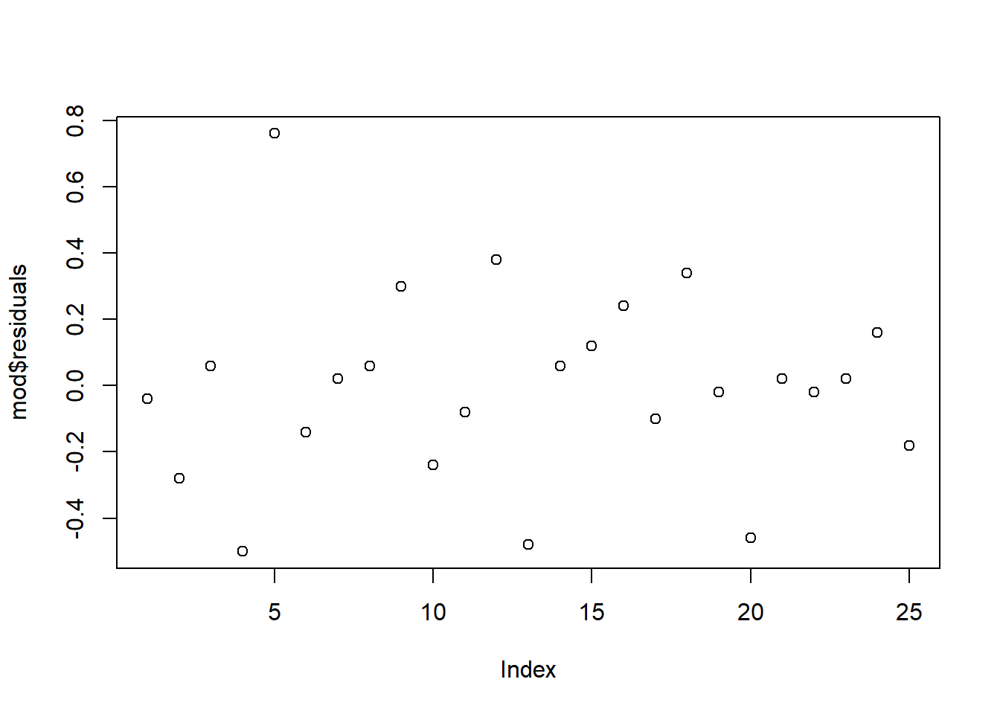

# Polinômios Ortogonais

****

<br><br><br><br>

- A variável analisada na análise de variância nos delineamentos discutidos anteriormente pode ser qualitativa ou quantitativa.
- Uma variável quantitativa é aquela cujos níveis podem ser associados com pontos em uma escala numérica, tal como temperatura, pressão ou tempo.
- Variáveis qualitativas, por outro lado, apresentam valores que não podem ser colocados em ordem de magnitude.

<br>

****

## Teste F

****

<br>

- Se o efeito de tratamentos for significativo e, os níveis forem quantitativos, deve-se decompor os graus de liberdade dos tratamentos em regressão linear, quadrática e cúbica.
- Em situações em que os níveis da variável possuem o mesmo espaçamento, esta decomposição pode ser feita de modo simples pelo método dos polinômios ortogonais, com o auxílio de coeficientes dados em tabelas.

<br>

****

## Quadro da Análise de variância

****

<br>


CV            | G.L.        | S.Q.          | Q.M.                    | Fcalc                           | Ftab
--------------:|:-------------:|:---------------:|:-------------------------:|:---------------------------------:|:--------
Trat          | $a-1$       |$SQ_{trat}$    |$\frac{SQ_{trat}}{a-1}$  |$\frac{QM_{trat}}{QM_{Res}}$     |$F(\alpha;GL_{Trat};GL_{Res})$
  *Linear*      | 1           |$SQ_{\hat{y}L}$|$QM_{\hat{y}L}$          |$\frac{QM_{\hat{y}L}}{QM_{res}}$ |
  *Quadrático*  | 1           |$SQ_{\hat{y}Q}$|$QM_{\hat{y}Q}$          |$\frac{QM_{\hat{y}Q}}{QM_{res}}$ |
  *Cúbico*      | 1           |$SQ_{\hat{y}C}$|$QM_{\hat{y}C}$          |$\frac{QM_{\hat{y}C}}{QM_{res}}$ |
resíduo       | $a(b-1)$    |$SQ_{res}$     |$\frac{SQ_{res}}{a(b-1)}$|
Total         | $ab-1$      |$SQ_{Total}$   |                         |

<br>

****

## Exemplo 1

****

<br>

**Avaliação e Caracterização de Silagem de Triticale (X *Triticosecale* Wittimack)**

No Brasil, quando se fala em produção de volumoso conservado, logo se imagina silagem de milho ou sorgo. No entanto, em clima subtropical e temperado, silagens de cereais de inverno tornam-se uma alternativa interessante para produção dos mesmos, principalmente em situações onde culturas de verão não são possíveis de serem cultivadas.

Assim, um trabalho foi desenvolvido com o objetivo de avaliar a silagem de triticale em substituição à silagem de sorgo na alimentação de bovinos corte. O ensaio foi realizado no Laboratório de análises de Alimentos e Nutrição Animal (LANA) do Departamento de Zootecnia da Universidade Estadual de Londrina. 

Foi estudado a silagem de triticale em substituição a silagem de sorgo com os teores de 0, 25, 50, 75 e 100% de substituição à de sorgo, a fim de melhor avaliar o valor nutritivo deste volumoso. Foi realizada a determinação da matéria seca (MS). O delineamento experimental utilizado foi o inteiramente casualizado com 4 repetições.

Fonte: <http://www.uel.br/pessoal/silvano/Experimental/R/Polinomios/Sorgo_Sandra.R>

<br>

### Conjunto de dados


```r
MS=c(93.517, 93.246, 93.216, 93.224,
     93.168, 93.645, 93.640, 93.357,
     92.985, 92.644, 92.506, 92.293, 
     93.124, 93.375, 93.138, 92.678,
     92.529, 92.150, 92.603, 92.415)
AMOSTRA=c(0,0,0,0,
          25,25,25,25,
          50,50,50,50,
          75,75,75,75,
          100,100,100,100)
dados=data.frame(Amostra=factor(AMOSTRA),MS)
attach(dados)
```

```
## The following object is masked _by_ .GlobalEnv:
## 
##     MS
```

<br>

### Média e Variância


```r
(meditrat=tapply(MS,AMOSTRA,mean))
```

```
##        0       25       50       75      100 
## 93.30075 93.45250 92.60700 93.07875 92.42425
```

```r
(variatrat=tapply(MS,AMOSTRA,var))
```

```
##          0         25         50         75        100 
## 0.02094492 0.05409100 0.08435000 0.08464092 0.03940758
```

<br>

## Análise de Variância

\begin{eqnarray*}
\left\{
\begin{array}{ll}
H_0: & \mu_1 = \mu_2 = \mu_3 = \cdots = \mu_{5} \\[.2cm]
H_1: & \mu_i \neq \mu_i' \qquad i \neq i'.
\end{array}
\right.
\end{eqnarray*}

<br>

## Análise de Variância para Matéria Seca


```r
mod = aov(MS ~ Amostra)
summary(mod)
```

```
##             Df Sum Sq Mean Sq F value   Pr(>F)    
## Amostra      4 3.1344  0.7836   13.82 6.42e-05 ***
## Residuals   15 0.8503  0.0567                     
## ---
## Signif. codes:  0 '***' 0.001 '**' 0.01 '*' 0.05 '.' 0.1 ' ' 1
```

<br>

## Polinômio até 4 grau


```r
mod.reg = aov(MS ~ AMOSTRA + I(AMOSTRA^2) + I(AMOSTRA^3) + I(AMOSTRA^4))
summary(mod.reg)
```

```
##              Df Sum Sq Mean Sq F value   Pr(>F)    
## AMOSTRA       1 1.8092  1.8092  31.916 4.62e-05 ***
## I(AMOSTRA^2)  1 0.0249  0.0249   0.439 0.517484    
## I(AMOSTRA^3)  1 0.0067  0.0067   0.117 0.736600    
## I(AMOSTRA^4)  1 1.2936  1.2936  22.821 0.000245 ***
## Residuals    15 0.8503  0.0567                     
## ---
## Signif. codes:  0 '***' 0.001 '**' 0.01 '*' 0.05 '.' 0.1 ' ' 1
```

<br>

## Polinômio de 3 grau


```r
mod.reg = aov(MS ~ AMOSTRA + I(AMOSTRA^2) + I(AMOSTRA^3))
summary(mod.reg)
```

```
##              Df Sum Sq Mean Sq F value  Pr(>F)   
## AMOSTRA       1 1.8092  1.8092  13.502 0.00205 **
## I(AMOSTRA^2)  1 0.0249  0.0249   0.186 0.67212   
## I(AMOSTRA^3)  1 0.0067  0.0067   0.050 0.82645   
## Residuals    16 2.1439  0.1340                   
## ---
## Signif. codes:  0 '***' 0.001 '**' 0.01 '*' 0.05 '.' 0.1 ' ' 1
```

<br>

## Polinômio de 2 grau


```r
mod.reg = aov(MS ~ AMOSTRA + I(AMOSTRA^2))
summary(mod.reg)
```

```
##              Df Sum Sq Mean Sq F value  Pr(>F)   
## AMOSTRA       1 1.8092  1.8092  14.302 0.00149 **
## I(AMOSTRA^2)  1 0.0249  0.0249   0.197 0.66285   
## Residuals    17 2.1506  0.1265                   
## ---
## Signif. codes:  0 '***' 0.001 '**' 0.01 '*' 0.05 '.' 0.1 ' ' 1
```

<br>

## Polinômio de 1 grau


```r
mod.reg = aov(MS ~ AMOSTRA)
summary(mod.reg)
```

```
##             Df Sum Sq Mean Sq F value  Pr(>F)   
## AMOSTRA      1  1.809  1.8092   14.97 0.00112 **
## Residuals   18  2.175  0.1209                   
## ---
## Signif. codes:  0 '***' 0.001 '**' 0.01 '*' 0.05 '.' 0.1 ' ' 1
```

<br>

## Coeficientes do modelo


```r
mod.reg = lm(MS ~ I(AMOSTRA) + I(AMOSTRA^2) + I(AMOSTRA^3) + I(AMOSTRA^4))
summary(mod.reg)
```

```
## 
## Call:
## lm(formula = MS ~ I(AMOSTRA) + I(AMOSTRA^2) + I(AMOSTRA^3) + 
##     I(AMOSTRA^4))
## 
## Residuals:
##      Min       1Q   Median       3Q      Max 
## -0.40075 -0.09688  0.01388  0.18094  0.37800 
## 
## Coefficients:
##                Estimate Std. Error t value Pr(>|t|)    
## (Intercept)   9.330e+01  1.190e-01 783.743  < 2e-16 ***
## I(AMOSTRA)    1.045e-01  2.659e-02   3.928 0.001341 ** 
## I(AMOSTRA^2) -6.139e-03  1.335e-03  -4.598 0.000348 ***
## I(AMOSTRA^3)  1.008e-04  2.134e-05   4.724 0.000272 ***
## I(AMOSTRA^4) -5.075e-07  1.062e-07  -4.777 0.000245 ***
## ---
## Signif. codes:  0 '***' 0.001 '**' 0.01 '*' 0.05 '.' 0.1 ' ' 1
## 
## Residual standard error: 0.2381 on 15 degrees of freedom
## Multiple R-squared:  0.7866,	Adjusted R-squared:  0.7297 
## F-statistic: 13.82 on 4 and 15 DF,  p-value: 6.422e-05
```

<br>

## Curva Estimada


```r
m1 <- lm(MS~poly(AMOSTRA, degree=1, raw=TRUE)) # não ortogonal
# ou
m2 <- lm(MS~AMOSTRA)
anova(m1)
```

```
## Analysis of Variance Table
## 
## Response: MS
##                                       Df Sum Sq Mean Sq F value   Pr(>F)   
## poly(AMOSTRA, degree = 1, raw = TRUE)  1 1.8092 1.80923   14.97 0.001124 **
## Residuals                             18 2.1755 0.12086                    
## ---
## Signif. codes:  0 '***' 0.001 '**' 0.01 '*' 0.05 '.' 0.1 ' ' 1
```

<br>

## Usando o ExpDes.pt


```r
library(ExpDes.pt)
```

```
## 
## Attaching package: 'ExpDes.pt'
```

```
## The following object is masked from 'package:stats':
## 
##     ccf
```

```r
dic(AMOSTRA,MS,quali = F)
```

```
## ------------------------------------------------------------------------
## Quadro da analise de variancia
## ------------------------------------------------------------------------
##            GL     SQ      QM     Fc      Pr>Fc
## Tratamento  4 3.1344 0.78361 13.823 6.4215e-05
## Residuo    15 0.8503 0.05669                  
## Total      19 3.9847                          
## ------------------------------------------------------------------------
## CV = 0.26 %
## 
## ------------------------------------------------------------------------
## Teste de normalidade dos residuos 
## Valor-p:  0.8052063 
## De acordo com o teste de Shapiro-Wilk a 5% de significancia, os residuos podem ser considerados normais.
## ------------------------------------------------------------------------
## 
## ------------------------------------------------------------------------
## Teste de homogeneidade de variancia 
## valor-p:  0.807195 
## De acordo com o teste de bartlett a 5% de significancia, as variancias podem ser consideradas homogeneas.
## ------------------------------------------------------------------------
## 
## Ajuste de modelos polinomiais de regressao
## ------------------------------------------------------------------------
## 
## Modelo Linear
## ============================================
##    Estimativa Erro.padrao     tc     valor.p
## --------------------------------------------
## b0  93.3980     0.0922    1,012.8630    0   
## b1  -0.0085     0.0015     -5.6494   0.00005
## --------------------------------------------
## 
## R2 do modelo linear
## --------
## 0.577212
## --------
## 
## Analise de variancia do modelo linear
## ===================================================
##                      GL   SQ     QM    Fc   valor.p
## ---------------------------------------------------
## Efeito linear        1  1.8092 1.8092 31.92  5e-05 
## Desvios de Regressao 3  1.3252 0.4417 7.79  0.00228
## Residuos             15 0.8503 0.0567              
## ---------------------------------------------------
## ------------------------------------------------------------------------
## 
## Modelo quadratico
## ==========================================
##    Estimativa Erro.padrao    tc    valor.p
## ------------------------------------------
## b0  93.3558     0.1120    833.2653    0   
## b1  -0.0051     0.0053    -0.9669  0.3489 
## b2  -0.00003    0.00005   -0.6629  0.5175 
## ------------------------------------------
## 
## R2 do modelo quadratico
## --------
## 0.585158
## --------
## 
## Analise de variancia do modelo quadratico
## ===================================================
##                      GL   SQ     QM    Fc   valor.p
## ---------------------------------------------------
## Efeito linear        1  1.8092 1.8092 31.92  5e-05 
## Efeito quadratico    1  0.0249 0.0249 0.44  0.51748
## Desvios de Regressao 2  1.3003 0.6501 11.47 0.00095
## Residuos             15 0.8503 0.0567              
## ---------------------------------------------------
## ------------------------------------------------------------------------
## 
## Modelo cubico
## ==========================================
##    Estimativa Erro.padrao    tc    valor.p
## ------------------------------------------
## b0  93.3687     0.1182    789.9773    0   
## b1  -0.0088     0.0120    -0.7343  0.4741 
## b2   0.0001     0.0003     0.2274  0.8232 
## b3 -0.000001       0      -0.3427  0.7366 
## ------------------------------------------
## 
## R2 do modelo cubico
## --------
## 0.587282
## --------
## 
## Analise de variancia do modelo cubico
## ===================================================
##                      GL   SQ     QM    Fc   valor.p
## ---------------------------------------------------
## Efeito linear        1  1.8092 1.8092 31.92  5e-05 
## Efeito quadratico    1  0.0249 0.0249 0.44  0.51748
## Efeito cubico        1  0.0067 0.0067 0.12  0.7366 
## Desvios de Regressao 1  1.2936 1.2936 22.82 0.00024
## Residuos             15 0.8503 0.0567              
## ---------------------------------------------------
## ------------------------------------------------------------------------
```

<br>

## Gráfico 


```r
plot(MS~AMOSTRA,ylab="Massa Seca",xlab=" ")
abline(m1,col=2)
dose=c(0,25,50,75,100)
points(meditrat~dose,col="blue",pch="*",cex=1.5)
```


<br>

## Gráfico somente com a média


```r
plot(meditrat~dose,col="red",pch=16, las=1)
curve(m1$coefficients[1]+m1$coefficients[2]*x, add=T)
```


<br><br><br>

****

## Exemplo 2

****

<br>

Num experimento estudou-se o efeito do farelo de arroz desengordurado (FAD) como fatores de retardamento da maturidade sexual de frangas. O ensaio, organizado em blocos completos casualizados, abrangeu duas fases distintas e foi constituído de 5 tratamentos e 5 repetições com 8 aves por unidade experimental. Os tratamentos, na primeira fase eram formados por rações que continham 0, 15, 30, 45, 60 % de FAD em substituição ao milho. Os resultados obtidos na primeira fase do ensaio, para conversão alimentar foram os seguintes:

Fonte: <http://www.uel.br/pessoal/lscunha/pages/arquivos/uel/Especializa%C3%A7%C3%A3o/Aula_9_-_Polin%C3%B4mios_Ortogonais(1).pdf>


```r
CA=c(6.5, 6.4, 6.2, 5.8, 7.3,
    7.1, 7.4, 6.9, 7.3, 7.0,
    7.5, 8.1, 6.7, 7.4, 7.7,
    7.2, 7.0, 6.9, 6.7, 6.5,
    6.4, 6.5, 6.0, 6.3, 6.2)
Bloco=rep(c(paste("B", 1:5)),5)
FAD=rep(c(0,15,30,45,60),e=5)
dados=data.frame(fad=factor(FAD),Bloco=factor(Bloco),CA)
```

<br><br>

## Análise de Variância

\begin{eqnarray*}
\left\{
\begin{array}{ll}
H_0: & \mu_1 = \mu_2 = \mu_3 = \cdots = \mu_{5} \\[.2cm]
H_1: & \mu_i \neq \mu_i' \qquad i \neq i'.
\end{array}
\right.
\end{eqnarray*}

<br>


```r
mod = with(dados,aov(CA ~ fad+Bloco))
summary(mod)
```

```
##             Df Sum Sq Mean Sq F value   Pr(>F)    
## fad          4  4.868   1.217  10.058 0.000289 ***
## Bloco        4  0.936   0.234   1.934 0.153795    
## Residuals   16  1.936   0.121                     
## ---
## Signif. codes:  0 '***' 0.001 '**' 0.01 '*' 0.05 '.' 0.1 ' ' 1
```

<br><br>

## Pressuposições

<br>

### Normalidade dos erros

<br>

\begin{eqnarray*}
\left\{
\begin{array}{ll}
H_0: & \mbox{Os erros seguem distribuição normal}\\[.2cm]
H_1: & \mbox{Os erros não seguem distribuição normal}.
\end{array}
\right.
\end{eqnarray*}

<br>


```r
shapiro.test(mod$res)
```

```
## 
## 	Shapiro-Wilk normality test
## 
## data:  mod$res
## W = 0.95907, p-value = 0.3963
```

<br>

### Homogeneidade das Variâncias

<br>

\begin{eqnarray*}
\left\{
\begin{array}{ll}
H_0: & \mbox{ As Variâncias são homogêneas}\\[.2cm]
H_1: & \mbox{ As Variâncias não são homogêneas}.
\end{array}
\right.
\end{eqnarray*}

<br>


```r
bartlett.test(residuals(mod)~as.factor(dados$fad))
```

```
## 
## 	Bartlett test of homogeneity of variances
## 
## data:  residuals(mod) by as.factor(dados$fad)
## Bartlett's K-squared = 6.4994, df = 4, p-value = 0.1648
```

<br>

### Independência dos erros

<br>

\begin{eqnarray*}
\left\{
\begin{array}{ll}
H_0: \mbox{Os erros são independentes}\\[.2cm]
H_1: \mbox{Os erros não são independentes}.
\end{array}
\right.
\end{eqnarray*}


```r
library(lmtest)
```

```
## Carregando pacotes exigidos: zoo
```

```
## 
## Attaching package: 'zoo'
```

```
## The following objects are masked from 'package:base':
## 
##     as.Date, as.Date.numeric
```

```r
dwtest(mod)
```

```
## 
## 	Durbin-Watson test
## 
## data:  mod
## DW = 2.8659, p-value = 0.923
## alternative hypothesis: true autocorrelation is greater than 0
```

```r
plot(mod$residuals)
```



<br>

## Coeficientes do modelo

<br>


```r
mod.reg = lm(CA ~ FAD + I(FAD^2) + I(FAD^3) + I(FAD^4))
summary(mod.reg)
```

```
## 
## Call:
## lm(formula = CA ~ FAD + I(FAD^2) + I(FAD^3) + I(FAD^4))
## 
## Residuals:
##    Min     1Q Median     3Q    Max 
##  -0.78  -0.16   0.02   0.16   0.86 
## 
## Coefficients:
##               Estimate Std. Error t value Pr(>|t|)    
## (Intercept)  6.440e+00  1.695e-01  38.001   <2e-16 ***
## FAD          1.867e-02  6.309e-02   0.296    0.770    
## I(FAD^2)     3.793e-03  5.279e-03   0.718    0.481    
## I(FAD^3)    -1.481e-04  1.407e-04  -1.053    0.305    
## I(FAD^4)     1.317e-06  1.167e-06   1.128    0.272    
## ---
## Signif. codes:  0 '***' 0.001 '**' 0.01 '*' 0.05 '.' 0.1 ' ' 1
## 
## Residual standard error: 0.3789 on 20 degrees of freedom
## Multiple R-squared:  0.6289,	Adjusted R-squared:  0.5547 
## F-statistic: 8.475 on 4 and 20 DF,  p-value: 0.0003607
```

<br>

## Usando o ExpDes.pt


```r
library(ExpDes.pt)
dic(FAD,CA, quali=F)
```

```
## ------------------------------------------------------------------------
## Quadro da analise de variancia
## ------------------------------------------------------------------------
##            GL    SQ     QM     Fc      Pr>Fc
## Tratamento  4 4.868 1.2170 8.4749 0.00036068
## Residuo    20 2.872 0.1436                  
## Total      24 7.740                         
## ------------------------------------------------------------------------
## CV = 5.54 %
## 
## ------------------------------------------------------------------------
## Teste de normalidade dos residuos 
## Valor-p:  0.5382094 
## De acordo com o teste de Shapiro-Wilk a 5% de significancia, os residuos podem ser considerados normais.
## ------------------------------------------------------------------------
## 
## ------------------------------------------------------------------------
## Teste de homogeneidade de variancia 
## valor-p:  0.1426676 
## De acordo com o teste de bartlett a 5% de significancia, as variancias podem ser consideradas homogeneas.
## ------------------------------------------------------------------------
## 
## Ajuste de modelos polinomiais de regressao
## ------------------------------------------------------------------------
## 
## Modelo Linear
## =========================================
##    Estimativa Erro.padrao   tc    valor.p
## -----------------------------------------
## b0   6.9600     0.1313    53.0202    0   
## b1  -0.0040     0.0036    -1.1196 0.2762 
## -----------------------------------------
## 
## R2 do modelo linear
## --------
## 0.036976
## --------
## 
## Analise de variancia do modelo linear
## ===================================================
##                      GL   SQ     QM    Fc   valor.p
## ---------------------------------------------------
## Efeito linear        1  0.1800 0.1800 1.25  0.27615
## Desvios de Regressao 3  4.6880 1.5627 10.88 0.00019
## Residuos             20 2.8720 0.1436              
## ---------------------------------------------------
## ------------------------------------------------------------------------
## 
## Modelo quadratico
## =========================================
##    Estimativa Erro.padrao   tc    valor.p
## -----------------------------------------
## b0   6.4571     0.1595    40.4857    0   
## b1   0.0630     0.0126    5.0056  0.0001 
## b2  -0.0011     0.0002    -5.5512 0.00002
## -----------------------------------------
## 
## R2 do modelo quadratico
## --------
## 0.946003
## --------
## 
## Analise de variancia do modelo quadratico
## ===================================================
##                      GL   SQ     QM    Fc   valor.p
## ---------------------------------------------------
## Efeito linear        1  0.1800 0.1800 1.25  0.27615
## Efeito quadratico    1  4.4251 4.4251 30.82  2e-05 
## Desvios de Regressao 2  0.2629 0.1314 0.92  0.41655
## Residuos             20 2.8720 0.1436              
## ---------------------------------------------------
## ------------------------------------------------------------------------
## 
## Modelo cubico
## =========================================
##    Estimativa Erro.padrao   tc    valor.p
## -----------------------------------------
## b0   6.4171     0.1682    38.1394    0   
## b1   0.0822     0.0285    2.8792  0.0093 
## b2  -0.0020     0.0012    -1.6611 0.1123 
## b3  0.00001     0.00001   0.7464  0.4641 
## -----------------------------------------
## 
## R2 do modelo cubico
## --------
## 0.962437
## --------
## 
## Analise de variancia do modelo cubico
## ===================================================
##                      GL   SQ     QM    Fc   valor.p
## ---------------------------------------------------
## Efeito linear        1  0.1800 0.1800 1.25  0.27615
## Efeito quadratico    1  4.4251 4.4251 30.82  2e-05 
## Efeito cubico        1  0.0800 0.0800 0.56  0.46411
## Desvios de Regressao 1  0.1829 0.1829 1.27  0.27249
## Residuos             20 2.8720 0.1436              
## ---------------------------------------------------
## ------------------------------------------------------------------------
```

<br>

## Curva Estimada


```r
m1 <- lm(CA~poly(FAD, degree=1, raw=TRUE)) # não ortogonal
anova(m1)
```

```
## Analysis of Variance Table
## 
## Response: CA
##                                   Df Sum Sq Mean Sq F value Pr(>F)
## poly(FAD, degree = 1, raw = TRUE)  1   0.18  0.1800  0.5476 0.4668
## Residuals                         23   7.56  0.3287
```

```r
summary(m1)
```

```
## 
## Call:
## lm(formula = CA ~ poly(FAD, degree = 1, raw = TRUE))
## 
## Residuals:
##    Min     1Q Median     3Q    Max 
##  -1.16  -0.42   0.00   0.40   1.26 
## 
## Coefficients:
##                                    Estimate Std. Error t value Pr(>|t|)    
## (Intercept)                        6.960000   0.198604   35.05   <2e-16 ***
## poly(FAD, degree = 1, raw = TRUE) -0.004000   0.005405   -0.74    0.467    
## ---
## Signif. codes:  0 '***' 0.001 '**' 0.01 '*' 0.05 '.' 0.1 ' ' 1
## 
## Residual standard error: 0.5733 on 23 degrees of freedom
## Multiple R-squared:  0.02326,	Adjusted R-squared:  -0.01921 
## F-statistic: 0.5476 on 1 and 23 DF,  p-value: 0.4668
```


```r
m2 <- lm(CA~poly(FAD, degree=2, raw=TRUE)) # não ortogonal
anova(m2)
```

```
## Analysis of Variance Table
## 
## Response: CA
##                                   Df Sum Sq Mean Sq F value    Pr(>F)    
## poly(FAD, degree = 2, raw = TRUE)  2 4.6051 2.30257  16.159 4.811e-05 ***
## Residuals                         22 3.1349 0.14249                      
## ---
## Signif. codes:  0 '***' 0.001 '**' 0.01 '*' 0.05 '.' 0.1 ' ' 1
```

```r
summary(m2)
```

```
## 
## Call:
## lm(formula = CA ~ poly(FAD, degree = 2, raw = TRUE))
## 
## Residuals:
##      Min       1Q   Median       3Q      Max 
## -0.65714 -0.21714 -0.01714  0.16857  0.84286 
## 
## Coefficients:
##                                      Estimate Std. Error t value Pr(>|t|)    
## (Intercept)                         6.4571429  0.1588764  40.643  < 2e-16 ***
## poly(FAD, degree = 2, raw = TRUE)1  0.0630476  0.0125468   5.025 4.96e-05 ***
## poly(FAD, degree = 2, raw = TRUE)2 -0.0011175  0.0002005  -5.573 1.33e-05 ***
## ---
## Signif. codes:  0 '***' 0.001 '**' 0.01 '*' 0.05 '.' 0.1 ' ' 1
## 
## Residual standard error: 0.3775 on 22 degrees of freedom
## Multiple R-squared:  0.595,	Adjusted R-squared:  0.5582 
## F-statistic: 16.16 on 2 and 22 DF,  p-value: 4.811e-05
```

<br>

## Gráficos


```r
(meditrat=tapply(CA,FAD,mean))
```

```
##    0   15   30   45   60 
## 6.44 7.14 7.48 6.86 6.28
```

```r
plot(CA~FAD,ylab="CA",xlab=" ")
curve(coef(m2)[1]+coef(m2)[2]*x+coef(m2)[3]*x^2, add=T)
dose=c(0,15,30,45,60)
points(meditrat~dose,col="blue",pch="*",cex=1.5)
```


```r
plot(meditrat~dose,
     col="red",
     pch=16, 
     las=1, 
     ylab="Conversão alimentar",
     main=expression(italic("Conversão alimentar")),
     xlab="FAD (%)")
curve(coef(m2)[1]+coef(m2)[2]*x+coef(m2)[3]*x^2, add=T, col="blue")
(xmax=coef(m2)[2]/-(2*coef(m2)[3]))
```

```
## poly(FAD, degree = 2, raw = TRUE)1 
##                           28.21023
```

```r
(ymax=coef(m2)[1]+coef(m2)[2]*xmax+coef(m2)[3]*xmax^2)
```

```
## (Intercept) 
##    7.346437
```

```r
abline(v=xmax, h=ymax, lty=2,col="red")
points(xmax,ymax, col="red", pch=8)
legend("bottomleft", bty="n",legend=c(expression(Y==6.457143+0.06304762 *x-0.00111746*x^2), expression(R^2==0.595)))
```


<br><br><br><br>
