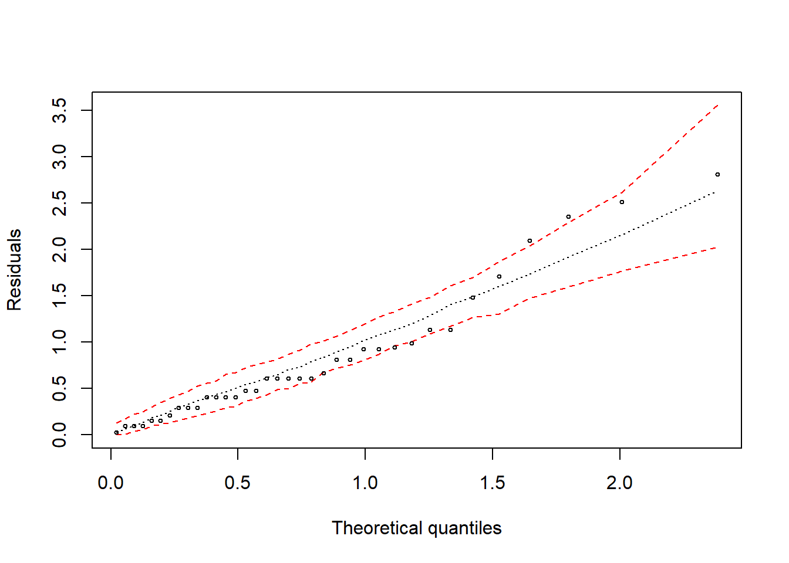
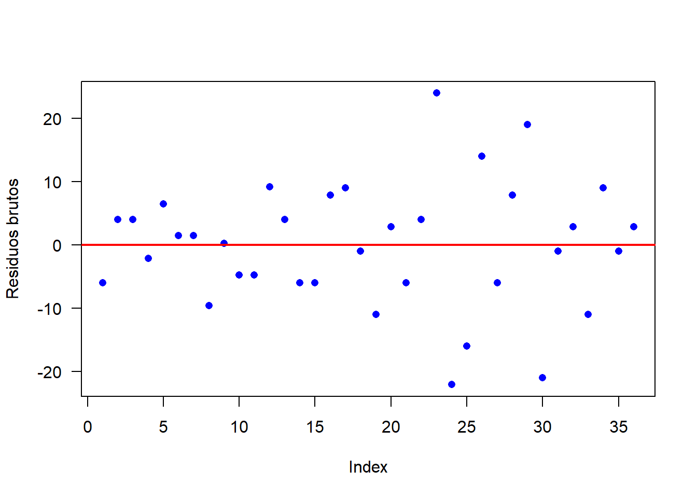

# Análise conjunta

****

<br><br><br><br>

## Análise conjunta com um fator qualitativo (DBC)

<br>

Na experimentação agrícola é comum a instalação de grupos de ensaios iguais, ou seja, com a mesma estrutura (delineamento, repetições e tratamentos iguais), entretanto, em anos e/ou locais distintos, visando a obtenção de conclusões mais abrangentes. Este tipo de análise é denominada análise conjunta de experimentos ou também conhecido como análise de grupos de experimentos.

Requisitos para análise de variância conjunta

a) Definir local (Ambiente) onde a pesquisa será conduzida, ou seja, diferentes localidades, anos diferentes de uma mesma localidade, anos e localidades distintas, etc. instalam-se os experimentos, o que geralmente são implantados em blocos casualziados, e após a coleta dos daddos, realizam-se todas às análises individuais, isto é, análise para cada ambiente de acordo com o delineamento estatístico utilizado.

b) Examina-se a seguir as grandezas dos $QM_{Res}$, ou seja, se forem homogêneas (Quando a razão entre a maior e o menor $QM_{Res}$ não for superior a mais de sete vezes) todos os ambientes poderão ser incluídos na análise conjunta sem restrições, do contrário, devem-se organizar subgrupos com QMresíduos homogêneos, sendo as análises conjuntas feitas para cada subgrupo.

FV               | G.L.        | S.Q.            |Q.M.                            | Fcalc                         
----------------:|:-----------:|:---------------:|:------------------------------:|:------------------------------
Tratamento       | $t-1$       |$SQ_{Tratamento}$|$\frac{SQ_{Tratamento}}{t-1}$   |$\frac{QM_{trat}}{QM_{T x A}}$  
Ambientes        | $a-1$       |$SQ_{Ambiente}$  |$\frac{SQ_{tratamento}}{a-1}$   |$\frac{QM_{a}}{QM_{T x A}}$     
Interação T x A  | $(t-1)(a-1)$|$SQ_{Interação}$ |$\frac{SQ_{T x A}}{(t-1)(a-1)}$ |$\frac{QM_{T x A}}{QM_{res}}$   
Resíduo médio    | $N'$        |$SQ_{res}$       |$\frac{SQ_{res}}{N}$            |
Total            | $at-1$      |$SQ_{Total}$     |                                |


****

## Exemplo 1

****

<br>

Um experimento com três tratamentos (T1: 6cm; T2: 12cm e T3: 18cm) foi conduzido em delineamento em blocos casualizados com quatro repetições cada. Este mesmo experimento foi repetido duas vezes, totalizando 3 ensaios experimentais (fevereiro; Abril e Junho de 2018).

<br>


```r
rm(list=ls())
resposta=c(20,30,30,20,80,75,75,60,85,80,80,90,20,10,10,20,
           30,20,10,20,50,60,80,30,30,60,40,50,100,60,80,80,
           70,90,80,80)
Comprimento=rep(rep(c(6,12,18),e=4),3); Comprimento=as.factor(Comprimento)
Tempo=rep(c(2,4,6),e=12); Tempo=as.factor(Tempo)
Repe=as.factor(c(rep(c(paste("R",1:4)),3),
       rep(c(paste("R",1:4)),3),
       rep(c(paste("R",1:4)),3)))
(dados=data.frame(Comprimento, Tempo, Repe, resposta))
```

```
##    Comprimento Tempo Repe resposta
## 1            6     2  R 1       20
## 2            6     2  R 2       30
## 3            6     2  R 3       30
## 4            6     2  R 4       20
## 5           12     2  R 1       80
## 6           12     2  R 2       75
## 7           12     2  R 3       75
## 8           12     2  R 4       60
## 9           18     2  R 1       85
## 10          18     2  R 2       80
## 11          18     2  R 3       80
## 12          18     2  R 4       90
## 13           6     4  R 1       20
## 14           6     4  R 2       10
## 15           6     4  R 3       10
## 16           6     4  R 4       20
## 17          12     4  R 1       30
## 18          12     4  R 2       20
## 19          12     4  R 3       10
## 20          12     4  R 4       20
## 21          18     4  R 1       50
## 22          18     4  R 2       60
## 23          18     4  R 3       80
## 24          18     4  R 4       30
## 25           6     6  R 1       30
## 26           6     6  R 2       60
## 27           6     6  R 3       40
## 28           6     6  R 4       50
## 29          12     6  R 1      100
## 30          12     6  R 2       60
## 31          12     6  R 3       80
## 32          12     6  R 4       80
## 33          18     6  R 1       70
## 34          18     6  R 2       90
## 35          18     6  R 3       80
## 36          18     6  R 4       80
```

<br>

## ANOVA individual

<br>

Antes de efetuar a análise conjunta, vamos analisar os dados em cada época (Como experimentos separados).

<br>

### Tempo de 2 meses


```r
modelo=with(dados[Tempo=="2",],aov(resposta~Comprimento+Repe))
anova(modelo)
```

```
## Analysis of Variance Table
## 
## Response: resposta
##             Df Sum Sq Mean Sq F value    Pr(>F)    
## Comprimento  2 7779.2  3889.6 69.1481 7.189e-05 ***
## Repe         3   56.3    18.8  0.3333    0.8022    
## Residuals    6  337.5    56.3                      
## ---
## Signif. codes:  0 '***' 0.001 '**' 0.01 '*' 0.05 '.' 0.1 ' ' 1
```

Como p-valor calculado ($p=7.1893264\times 10^{-5}$) é menor que o nível de significância adotado, rejeita-se $H_0$. Logo, ao menos dois tratamentos diferem entre si.

<br>

### Tempo de 4 meses


```r
modelo1=with(dados[Tempo=="4",],aov(resposta~Comprimento+Repe))
anova(modelo1)
```

```
## Analysis of Variance Table
## 
## Response: resposta
##             Df Sum Sq Mean Sq F value  Pr(>F)  
## Comprimento  2   3800 1900.00  8.1429 0.01952 *
## Repe         3    200   66.67  0.2857 0.83436  
## Residuals    6   1400  233.33                  
## ---
## Signif. codes:  0 '***' 0.001 '**' 0.01 '*' 0.05 '.' 0.1 ' ' 1
```

Como p-valor calculado ($p=0.0195152$) é menor que o nível de significância adotado, rejeita-se $H_0$. Logo, ao menos dois tratamentos diferem entre si.

<br>

### Tempo de 6 meses


```r
modelo2=with(dados[Tempo=="6",],aov(resposta~Comprimento+Repe))
anova(modelo2)
```

```
## Analysis of Variance Table
## 
## Response: resposta
##             Df Sum Sq Mean Sq F value  Pr(>F)  
## Comprimento  2 3266.7 1633.33  6.6818 0.02975 *
## Repe         3   33.3   11.11  0.0455 0.98589  
## Residuals    6 1466.7  244.44                  
## ---
## Signif. codes:  0 '***' 0.001 '**' 0.01 '*' 0.05 '.' 0.1 ' ' 1
```

Como p-valor calculado ($p=0.0297504$) é menor que o nível de significância adotado, rejeita-se $H_0$. Logo, ao menos dois tratamentos diferem entre si.

<br>

## Quadrado do resíduo médio


```r
QMResiduo1<- anova(modelo)$`Mean Sq`[3]
QMResiduo2<- anova(modelo1)$`Mean Sq`[3]
QMResiduo3<- anova(modelo2)$`Mean Sq`[3]
QMResiduo<- c(QMResiduo1, QMResiduo2,
              QMResiduo3)
max(QMResiduo)/min(QMResiduo) ## Deve ser menor que 7
```

```
## [1] 4.345679
```

```r
sum(QMResiduo)/3
```

```
## [1] 178.0093
```

<br>

De acordo com Pimentel Gomes (2009), os ensaios em diversos locais podem ser agrupados em uma única análise desde que o quociente entre o maior e o menor quadrado médio do resíduo (QMRes) seja inferior a 7, caso contrário, pode-se considerar subgrupos de locais homogêneos, com quadrados médios residuais que satisfaçam o quociente, a fim de se construir tantas análises conjuntas quantos subgrupos criados

**Referência**: PIMENTEL GOMES, F. Curso de estatística experimental. 15 ed. Piracicaba: FEALQ, 2009. 451p.

<br><br><br>

## Gráfico de interação


```r
interaction.plot(Comprimento, 
                 Tempo, resposta, 
                 col=c("red","blue","green"),
                 las=1,
                 ylab="Resposta")
```


<br>

## Análise de Variância conjunta

A análise de variância conjunta pode ser efetuada conforme os comandos abaixo:

Teste F para efeito da interação Local:Trat (Somente a interação é válida)


```r
summary(aov(resposta~Tempo+Tempo:Repe+Comprimento+
              Tempo:Comprimento, data=dados)) 
```

```
##                   Df Sum Sq Mean Sq F value   Pr(>F)    
## Tempo              2   9829    4915  27.609 3.28e-06 ***
## Comprimento        2  12304    6152  34.560 6.86e-07 ***
## Tempo:Repe         9    290      32   0.181    0.994    
## Tempo:Comprimento  4   2542     635   3.570    0.026 *  
## Residuals         18   3204     178                     
## ---
## Signif. codes:  0 '***' 0.001 '**' 0.01 '*' 0.05 '.' 0.1 ' ' 1
```

Como p-valor calculado $p=0.026$ é menor que o nível de significância adotado de ($\alpha=0.05$), pode-se concluir que há efeito de interação. Logo, temos que analisar como experimentos separados.

Teste F para efeito do Tratamento


```r
mod=aov(resposta~Tempo+Tempo:Repe+Comprimento+Error(Tempo:(Repe+Comprimento)), data=dados)
```

```
## Warning in aov(resposta ~ Tempo + Tempo:Repe + Comprimento + Error(Tempo:(Repe
## + : Error() model is singular
```

```r
summary(mod)
```

```
## 
## Error: Tempo:Repe
##            Df Sum Sq Mean Sq
## Tempo       2   9829    4915
## Tempo:Repe  9    290      32
## 
## Error: Tempo:Comprimento
##             Df Sum Sq Mean Sq F value Pr(>F)  
## Comprimento  2  12304    6152   9.682 0.0293 *
## Residuals    4   2542     635                 
## ---
## Signif. codes:  0 '***' 0.001 '**' 0.01 '*' 0.05 '.' 0.1 ' ' 1
## 
## Error: Within
##           Df Sum Sq Mean Sq F value Pr(>F)
## Residuals 18   3204     178
```

<br><br><br>

## Conferindo "Manualmente" 

Quadro auxiliar com os totais da resposta em ensaios realizados em Londrina no delineamento inteiramente casualizado com três tratamentos (Comprimento de estaca) e quatro repetições em três épocas (T2,T4,T6)

Comprimento     | T2      |T4        |T6           | Total
----------------|---------|----------|-------------|----------
6               | 100     | 60       |180          | 340
12              | 290     | 80       |320          | 690
18              | 335     | 220      |320          | 875
Total           | 725     | 360      |820          | 1905

<br><br>

## Grau de liberdade

**Grau de liberdade do Comprimento**

<center>

$GL_{c}=c-1$

$GL_{comp}=3-1=2$

</center>

**Grau de liberdade do tempo**

<center>

$GL_{t}=t-1$

$GL_{tempo}=3-1=2$

</center>

**Grau de liberdade da interação**

<center>

$GL_{cXt}=(c-1)(t-1)$

$GL_{interação}=(3-1)(3-1)=4$

</center>

**Grau de liberdade do resíduo**

<center>

$GL_{resíduomédio}=N'$

$GL_{resíduo médio}=2*3(3)=18$

$N= c r t=36$

</center>

<br><br>

### Calculando soma de quadrados

<center>

****

$SQ_{c}=\frac{\sum T_c^2}{rc}-\frac{(\sum T_c)^2}{N}$

$SQ_{comp}=\frac{340^2+690^2+875^2}{4*3}-\frac{1905^2}{36}=12.304,17$

****

$SQ_{t}=\frac{\sum T_t^2}{rt}-\frac{(\sum T_t)^2}{N}$

$SQ_{tempo}=\frac{725^2+360^2+820^2}{4*3}-\frac{1905^2}{36}=9.829,15$

****

$SQ_{c X t}=\frac{\sum T_{ct}^2}{r}-\frac{(\sum T_{ct})^2}{N}$

$SQ_{interação}=\frac{100^2+60^2+180^2+290^2+80^2+320^2+335^2+220^2+320^2}{4}-\frac{1905^2}{36}-12.304,17-9.829,15=2.541,63$

</center>

<br><br>

### Calculando quadrado médio

<center>

****
$QM_{c}=\frac{SQ_{c}}{GL_c}$

$QM_{comp}=\frac{12.304,17}{2}=6.152,1$

****
$QM_{t}=\frac{SQ_{t}}{GL_t}$

$QM_{tempo}=\frac{9.829,15}{2}=4.914,6$

****
$QM_{c}=\frac{SQ_{cXt}}{GL_{interação}}$

$QM_{interação}=\frac{2.541,63}{4}=635,4075$

****
$QM_{c}=\frac{SQ_{resT2}+SQ_{resT4}+SQ_{resT6}}{t}$

$QM_{resíduo médio}=\frac{56+233,33+244,44}{3}=178,0$

</center>

<br><br>

### Teste F de Fischer

<center>

****

$F_{c}=\frac{QM_{c}}{QM_{cXt}}$

$F_{comp}=\frac{6.152,1}{635.4075}=9.682$

$F_{t}=\frac{QM_{t}}{QM_{cXt}}$

$F_{tempo}=\frac{4.914,6}{635.4075}=7,73$

$F_{c}=\frac{QM_{cXt}}{QM_{resíduomédio}}$

$F_{interação}=\frac{635.4075}{178}=3,5696$

</center>

<br><br>

## Pressuposição do modelo

<br>

### Normalidade dos erros

\begin{eqnarray*}
\left\{
\begin{array}{ll}
H_0: & \mbox{ Os erros têm distribuição normal} \\[.2cm]
H_1: & \mbox{ Os erros não têm distribuição normal}.
\end{array}
\right.
\end{eqnarray*}


```r
## Vamos analisar os erros como sendo um modelo em esquema Fatorial
mod1=aov(resposta~Comprimento*Tempo+Repe)
(norm=shapiro.test(mod1$res))
```

```
## 
## 	Shapiro-Wilk normality test
## 
## data:  mod1$res
## W = 0.97794, p-value = 0.6756
```

Como p-valor calculado ($p=0.6756399$) é maior que o nível de significância adotado ($\alpha=0,05$), não se rejeita $H_0$. Logo, os erros seguem distribuição normal.

<br><br>

### Gráfico de normalidade


```r
HNP=hnp::hnp(mod1, paint.on=T, col="red" , las=1, pch=8)
```


```r
plot(HNP,lty=c(2,3,2),  col=c(2,1,2,1))
```



<br><br>

### Homogeneidade de variâncias

\begin{eqnarray*}
\left\{
\begin{array}{ll}
H_0: & \mbox{ As variâncias são homogêneas} \\[.2cm]
H_1: & \mbox{ As variâncias não são homogêneas}.
\end{array}
\right.
\end{eqnarray*}


```r
(homog=bartlett.test(mod1$res~paste(Comprimento,Tempo)))
```

```
## 
## 	Bartlett test of homogeneity of variances
## 
## data:  mod1$res by paste(Comprimento, Tempo)
## Bartlett's K-squared = 9.5181, df = 8, p-value = 0.3005
```

Como p-valor calculado ($p=0.3004895$) é maior que o nível de significância adotado ($\alpha=0,05$), não se rejeita $H_0$. Logo, as variâncias são homogêneas.

<br><br>

### Independências dos erros

\begin{eqnarray*}
\left\{
\begin{array}{ll}
H_0: & \mbox{ Os erros são independentes;} \\[.2cm]
H_1: & \mbox{ Os erros não são independentes.}
\end{array}
\right.
\end{eqnarray*}


```r
library(lmtest)
```

```
## Carregando pacotes exigidos: zoo
```

```
## 
## Attaching package: 'zoo'
```

```
## The following objects are masked from 'package:base':
## 
##     as.Date, as.Date.numeric
```

```r
ind=dwtest(mod1)
```

Como p-valor calculado ($p=0.5781767$) é maior que o nível de significância adotado ($\alpha=0,05$), não se rejeita $H_0$. Logo, os erros são independentes. A Figura \ref{Fig3} apresenta o gráfico dos resíduos brutos. Percebe-se que os resíduos estão distribuídos de forma totalmente aleatório, evidenciando a independência dos erros.


```r
plot(mod1$res, col="blue",
     las=1, pch=16,
     ylab="Residuos brutos")
abline(h=0, col="red", lwd=2)
```



<br><br><br>

## Desdobramento

<br>

### Desdobramento do Comprimento em cada nível de Tempo


```r
#desdobramento
dados$LT<- as.factor(dados$Tempo:dados$Comprimento)
#efeito de tratamento dentro de cada nível de local
mod.conj<- aov(resposta ~ Tempo + Tempo:Repe + LT,
               data=dados)
summary(mod.conj,
        split=list(LT=list(TdL1=1:2,TdL2=3:4,
                           TdL3=5:6)))
```

```
##             Df Sum Sq Mean Sq F value   Pr(>F)    
## Tempo        2   9829    4915  27.609 3.28e-06 ***
## LT           6  14846    2474  13.900 6.80e-06 ***
##   LT: TdL1   2   7779    3890  21.850 1.53e-05 ***
##   LT: TdL2   2   3800    1900  10.674 0.000877 ***
##   LT: TdL3   2   3267    1633   9.176 0.001790 ** 
## Tempo:Repe   9    290      32   0.181 0.993687    
## Residuals   18   3204     178                     
## ---
## Signif. codes:  0 '***' 0.001 '**' 0.01 '*' 0.05 '.' 0.1 ' ' 1
```

<br>

### Teste de comparação múltipla


```r
# O QMres é 178 e o GL é 18

require(agricolae)
```

```
## Carregando pacotes exigidos: agricolae
```

```r
#dentro de Tempo 2
tukey.l1<-HSD.test(dados$resposta[dados$Tempo=="2"],
             dados$Comprimento[dados$Tempo=="2"],
             18, 178)
tukey.l1$groups
```

```
##    dados$resposta[dados$Tempo == "2"] groups
## 18                              83.75      a
## 12                              72.50      a
## 6                               25.00      b
```

```r
#dentro de Tempo 4
tukey.l2<-HSD.test(dados$resposta[dados$Tempo=="4"],
                    dados$Comprimento[dados$Tempo=="4"],
                    18, 178)
tukey.l2$groups
```

```
##    dados$resposta[dados$Tempo == "4"] groups
## 18                                 55      a
## 12                                 20      b
## 6                                  15      b
```

```r
#dentro de Tempo 6
tukey.l3<-HSD.test(dados$resposta[dados$Tempo=="6"],
                    dados$Comprimento[dados$Tempo=="6"],
                    18, 178)
tukey.l3$groups
```

```
##    dados$resposta[dados$Tempo == "6"] groups
## 12                                 80      a
## 18                                 80      a
## 6                                  45      b
```


```r
par(mfrow=c(1,3))
bar.group(tukey.l1$groups, ylim=c(0,120),
          main="Tempo 2", xlab="Comprimento",
          ylab="resposta",las=1)
bar.group(tukey.l2$groups, ylim=c(0,120),
          main="Tempo 4", xlab="Comprimento",
          ylab="resposta",las=1)
bar.group(tukey.l3$groups, ylim=c(0,120),
          main="Tempo 6", xlab="Comprimento",
          ylab="resposta",las=1) 
```


<br><br><br>

## Tabela Final


```r
library(knitr)
media=tapply(resposta, list(Comprimento, Tempo),mean)
tabela=data.frame("Mês 2"=media[,1],
             " "=c("B","A","A"),
             "Mês 4"=media[,2],
             " "=c("B","B","A"),
             "Mês 6"=media[,3],
             " "=c("B","A","A"))
library(knitr)

kable(tabela, align = "c", col.names = c("Mês 2"," ","Mês 4"," ","Mês 6"," "))
```

      Mês 2         Mês 4         Mês 6      
---  -------  ---  -------  ---  -------  ---
6     25.00    B     15      B     45      B 
12    72.50    A     20      B     80      A 
18    83.75    A     55      A     80      A 

<br><br><br><br>

