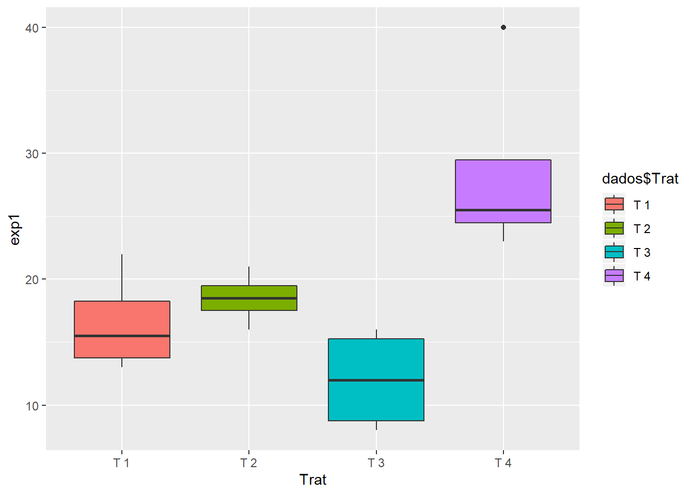
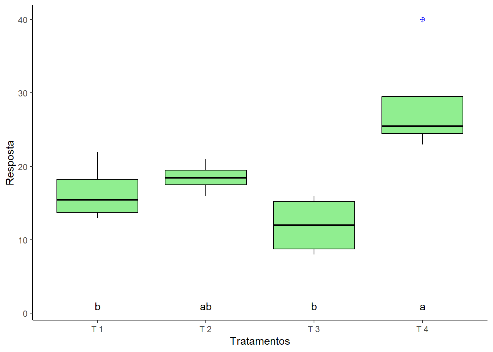

# Caixas (Boxplot)

****

<br>

O *boxplot* (gráfico de caixa) é um gráfico utilizado para avaliar a distribuição empírica do dados. O *boxplot* é formado pelo primeiro e terceiro quartil e pela mediana. As hastes inferiores e superiores se estendem, respectivamente, do quartil inferior até o menor valor não inferior ao limite inferior e do quartil superior até o maior valor não superior ao limite superior. Os limites são calculados da forma abaixo

**Limite inferior**: $\max\{\min(\text{dados});Q_1-1,5(Q_3-Q_1)\}$.

**Limite superior**: $\min\{\max(\text{dados});Q_3+1,5(Q_3-Q_1)\}$.

Para este caso, os pontos fora destes limites são considerados valores discrepantes (*outliers*). A Figura  a seguir apresenta um exemplo do formato de um *boxplot*.

<center>


</center>


Existem várias formas de entrada ou leitura de dados no R. Para um conjunto de dados pequeno, pode-se entrar com as informações diretamente no console do programa. Considere um delineamento inteiramente ao acaso com 5 tratamentos e 4 repetições. A entrada dos dados, entre outras, poderia ser da forma:

<br>


```r
tratamentos=rep(c(paste("T", sep='', 1:5)), each=4)
resposta = c(100, 120, 110,  90, 150, 145, 149, 165, 150, 144, 134, 139, 220, 206, 210, 210, 266, 249, 248, 260)
## Médias e Desvioss-padrão (por Tratamento)
(Médias = tapply(resposta, tratamentos, mean))
```

```
##     T1     T2     T3     T4     T5 
## 105.00 152.25 141.75 211.50 255.75
```

```r
(Desvios = tapply(resposta, tratamentos, sd))
```

```
##        T1        T2        T3        T4        T5 
## 12.909944  8.770215  6.849574  5.972158  8.732125
```

<br>


```r
boxplot(resposta ~ tratamentos)
# Ou, pode-se usar o comando ``Boxplot`` do pacote ``car``
require(car)
```

```
## Carregando pacotes exigidos: car
```

```
## Warning: package 'car' was built under R version 3.6.3
```

```
## Carregando pacotes exigidos: carData
```

```r
Boxplot(resposta ~ tratamentos)
```

```
## Warning in Boxplot.default(mf[[response]], x, id = list(method = id.method, :
## NAs introduzidos por coerção
```


<br>

Uma vantagem do comando ``Boxplot`` é que se houver *outlier*, ele já identifica a pposição do elemento discrepante.

<br>

### Melhorias


```r
boxplot(resposta ~ tratamentos, 
        las=1,
        col="lightyellow",
        xlab="Tratamentos",
        ylab="Resposta",
        ylim=c(0,300))
```


<br>

**Comandos usados**:

* ``las=1``: mostrar a escala do eixo no sentido horizontal;

* ``col="cor"``: mudar a cor das colunas (Ex. "red", "blue", "green" ou ``gray.colors``(quantidade de tonalidades) para escala cinza ou ``rainbow``(quantidade de cores) para escala colorida. Também é possível especificar a cor de cada coluna (``col``=c("red", "green", "yellow", "gray", "blue")));

* ``xlab`` e ``ylab``: nomear os eixos $X$ e $Y$;

* ``xlim`` e ``xlim``: mudar as escalas dos eixox $X$ e $Y$;

<br>

### Plotando médias


```r
boxplot(resposta ~ tratamentos, 
        las=1,
        col="lightyellow",
        xlab="Tratamentos",
        ylab="Resposta",
        ylim=c(50,300))

points(Médias, pch='+', col="red")
```


<br>

### Unidade do eixo Y 

Caso a variável resposta seja Produção ($kg/ha$), inclui-se tal informação usando-se o comando ``expression``.


```r
boxplot(resposta ~ tratamentos,
        las=1,
        col="lightyellow",
        xlab="Tratamentos",
        ylab=expression(Produção~~(kg~ha^-1)),
        ylim=c(50,300))
points(Médias, pch='+', col="red")
```


<br>

### Limites superior e inferior


```r
limites = tapply(resposta, tratamentos, boxplot.stats)
superior=c(limites$`T1`$stats[5],
           limites$`T2`$stats[5],
           limites$`T3`$stats[5],
           limites$`T4`$stats[5],
           limites$`T5`$stats[5])
```

<br>

### Média acima das barras


```r
boxplot(resposta ~ tratamentos,
        las=1,
        col="lightyellow",
        xlab="Tratamentos",
        ylab=expression("Produção"~~(kg~ha^-1)),
        ylim=c(50,300))
points(Médias, pch='+', col="red")
text(c(1:5), superior + 10, Médias)
```


<br>

### Separação de casa decimal


```r
options(OutDec=",")
boxplot(resposta ~ tratamentos,
        las=1,
        col="lightyellow",
        xlab="Tratamentos",
        ylab=expression("Produção"~~(kg~ha^-1)),
        ylim=c(50,300))
points(Médias, pch='+', col="red")
text(c(1:5), superior + 20, Médias)
```


<br>

### Letras do teste de comparação


```r
tukey=c("d","c","c","b","a")
options(OutDec=",")
boxplot(resposta ~ tratamentos,
        las=1,
        col="lightyellow",
        xlab="Tratamentos",
        ylab=expression("Produção"~(kg~ha^-1)),
        ylim=c(50,300))
points(Médias, pch='+', col="red")
text(c(1:5), superior + 20, paste(round(Médias, 0), tukey))
```


<br><br>

## Pacote ggplot2

Vamos trabalhar com um experimento em DIC com quatro tratamentos e quatro repetições cada.


```r
exp1=c(17,22,13,14,18,19,16,21,9,16,15,8,25,26,23,40)
Trat=rep(c(paste("T",1:4)),e=4)
dados=data.frame(Trat,exp1)
dados$Trat=as.factor(Trat)
```

**Obs.** Para facilitar, vamos realizar a análise direto pelo pacote ExpDes.pt (é necessário instalar o pacote)

<br>

### Análise de variância


```r
ExpDes.pt::dic(Trat,exp1)
```

```
## ------------------------------------------------------------------------
## Quadro da analise de variancia
## ------------------------------------------------------------------------
```

```
## Warning in data.matrix(x): NAs introduzidos por coerção
```

```
##            GL     SQ QM     Fc     Pr>Fc
## Tratamento  3 582,75    7,9556 0,0034723
## Residuo    12 293,00                    
## Total      15 875,75                    
## ------------------------------------------------------------------------
## CV = 26,18 %
## 
## ------------------------------------------------------------------------
## Teste de normalidade dos residuos 
## Valor-p:  0,06507919 
## De acordo com o teste de Shapiro-Wilk a 5% de significancia, os residuos podem ser considerados normais.
## ------------------------------------------------------------------------
## 
## ------------------------------------------------------------------------
## Teste de homogeneidade de variancia 
## valor-p:  0,237053 
## De acordo com o teste de bartlett a 5% de significancia, as variancias podem ser consideradas homogeneas.
## ------------------------------------------------------------------------
## 
## Teste de Tukey
## ------------------------------------------------------------------------
## Grupos Tratamentos Medias
## a 	 T 4 	 28,5 
## ab 	 T 2 	 18,5 
##  b 	 T 1 	 16,5 
##  b 	 T 3 	 12 
## ------------------------------------------------------------------------
```

<br>

## Utilizando o *ggplot2*


```r
library(ggplot2)
```

<br>

### Gráfico básico


```r
ggplot(dados, 
       aes(x=Trat,y=exp1))+
  geom_boxplot()
```


<br>

### Modificando cores


```r
ggplot(dados, 
       aes(x=Trat,y=exp1))+
  geom_boxplot(fill="lightgreen",          # Cor da caixa
               colour="red",               # cor do contorno
               outlier.colour = "blue",    # Cor do contorno do outlier
               outlier.shape = 10,          # Formato do ponto do outlier
               outlier.size = 2)           # Tamanho do outlier
```


<br>

### Cor por tratamento


```r
ggplot(dados, 
       aes(x=Trat,y=exp1))+
  geom_boxplot(aes(fill=dados$Trat))
```



<br>

### Nome dos eixos


```r
ggplot(dados, 
       aes(x=Trat,y=exp1))+
  geom_boxplot(fill="lightgreen",          
               colour="red",               
               outlier.colour = "blue",    
               outlier.shape = 10,          
               outlier.size = 2)+      
  ylab("Resposta")+
  xlab("Tratamentos")
```


<br>

### linha de grade e cor de fundo


```r
ggplot(dados, 
       aes(x=Trat,y=exp1))+
  geom_boxplot(fill="lightgreen", 
               colour="black",    
               outlier.colour = "blue",
               outlier.shape = 10,     
               outlier.size = 2)+      
  ylab("Resposta")+
  xlab("Tratamentos")+
  theme_bw()+
  theme_classic()
```


<br>

### Letras do teste de Tukey

**Obs.** Neste exemplo vamos adicionar as letras abaixo das caixas e alinhado em y=1


```r
a=data.frame(Trat=levels(as.factor(Trat)),
             exp1=c(1,1,1,1),                # Deve ter o mesmo da variável
                                             # esse 1 é para Y=1
             letra=c("b","ab","b","a"))
ggplot(dados, 
       aes(x=Trat,y=exp1))+
  geom_boxplot(fill="lightgreen", 
               colour="black",    
               outlier.colour = "blue",
               outlier.shape = 10,     
               outlier.size = 2)+      
  ylab("Resposta")+
  xlab("Tratamentos")+
  theme_bw()+
  theme_classic()+
  geom_text(data = a, aes(label = letra))
```



<br>

## *Package* ggpubr


```r
library(ggpubr)
```

```
## Carregando pacotes exigidos: magrittr
```

```r
ggboxplot(dados,            # data.frame com os dados e tratamentos
          'Trat',           # Nome do tratamento entre aspas
          'exp1')           # Nome da resposta
```


<br>

### Cor da caixa


```r
ggboxplot(dados,
          'Trat',
          'exp1', 
          fill="red")
```


<br>

### Cor de contorno


```r
ggboxplot(dados,
          'Trat',
          'exp1', 
          fill="red",
          color = "blue")
```


<br>

### Inserindo título


```r
ggboxplot(dados,
          'Trat',
          'exp1', 
          fill="red",
          color = "blue",
          title="(A)")
```


<br>

### Nome dos eixos X e Y


```r
ggboxplot(dados,
          'Trat',
          'exp1', 
          fill="red",
          color = "black",
          title="(A)",
          xlab="Tratamentos",
          ylab="Resposta")
```


<br>

### Ponto da média


```r
ggboxplot(dados,
          'Trat',
          'exp1', 
          fill="red",
          color = "black",
          title="(A)",
          xlab="Tratamentos",
          ylab="Resposta",
          add="mean")
```


<br>

**Obs.** Podemos usar ao invés de `"mean"`, os seguintes argumentos:

- `mean_se`: Média e erro padrão
- `mean_sd`: Média e desvio-padrão
- `mean_ci`: Média e intervalo de confiança
- `median`: Mediana
- `point`: pontos referente às observações

Para mais informações consultar atráves de: `desc_stat`

<br>

### Letras do teste de Tukey


```r
a=data.frame(Trat=levels(as.factor(Trat)),
             exp1=c(1,1,1,1),                # Deve ter o mesmo da variável
                                             # esse 1 é para Y=1
             letra=c("b","ab","b","a"))
ggboxplot(dados,
          'Trat',
          'exp1', 
          fill="red",
          color = "black",
          title="(A)",
          xlab="Tratamentos",
          ylab="Resposta",
          add="mean",
          ylim=c(0,40))+
  geom_text(data = a, aes(label = letra))
```


<br><br><br>

****
