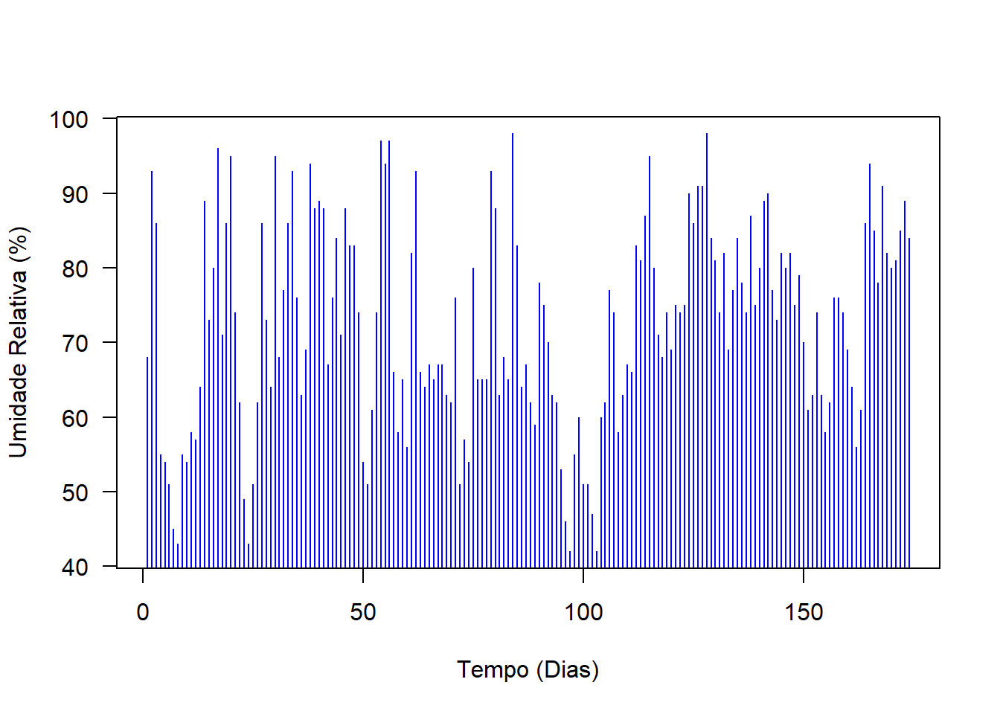
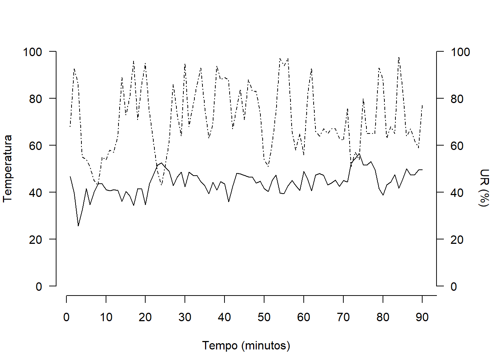
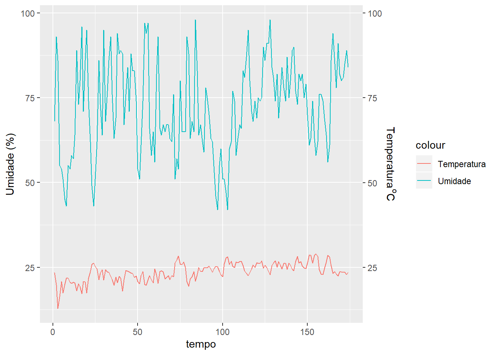
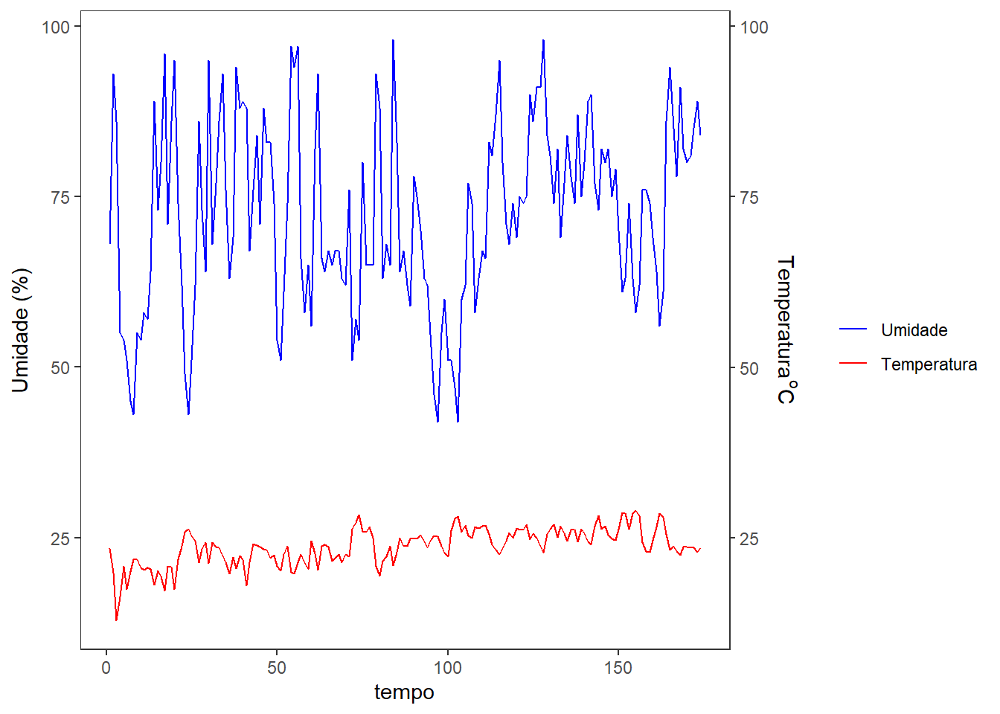

# Linhas

****

Gráficos de linhas ou pontos são normalmente usados para controlar alterações ao longo do tempo e para facilitar a identificação de tendências ou de anomalias.


### Conjunto de dados

Esse conjunto de dados de Umidade relativa (UR) foi obtido no site do Instituto Agronômico do Paraná  (http://www.iapar.br/modules/conteudo/conteudo.php?conteudo=1828) no período de 01/09/2018 a 21/02/2019.

<br>


```r
UR=c(68,93,86,55,54,51,45,43,55,54,58,57,64,89,73,80,96,71,86,95,74,62,49,43,51,62,86,73,64,95,68,77,86,93,76,63,69,94,88,89,88,67,76,84,71,88,83,83,74,54,51,61,74,97,94,97,66,58,65,56,82,93,66,64,67,65,67,67,63,62,76,51,57,54,80,65,65,65,93,88,63,68,65,98,83,64,67,62,59,78,75,70,63,62,53,46,42,55,60,51,51,47,42,60,62,77,74,58,63,67,66,83,81,87,95,80,71,68,74,69,75,74,75,90,86,91,91,98,84,81,74,82,69,77,84,78,74,87,75,80,89,90,77,73,82,80,82,75,79,70,61,63,74,63,58,62,76,76,74,69,64,56,61,86,94,85,78,91,82,80,81,85,89,84)
TEMPO=c(1:174)
```

<br>

### Gráfico de dispersão


```r
plot(UR~TEMPO, 
     ylab="Umidade Relativa (%)", xlab="Tempo (Dias)",
     col="blue", las=1)
```


<br>

### Gráfico com as linhas


```r
plot(UR~TEMPO,
     ylab="Umidade Relativa (%)", xlab="Tempo (Dias)",
     type="lines", 
     col="blue", las=1)
```

```
## Warning in plot.xy(xy, type, ...): gráfico do tipo 'lines' vai ser truncado para
## o primeiro caractere
```


<br>

### Gráfico com linhas e pontos 


```r
plot(UR~TEMPO,
     ylab="Umidade Relativa (%)", xlab="Tempo (Dias)",
     type="b", 
     col="blue", las=1)
```


```r
plot(UR~TEMPO,
     ylab="Umidade Relativa (%)", xlab="Tempo (Dias)",
     type="o", 
     col="blue", las=1)
```


<br>

### Linhas verticais


```r
plot(UR~TEMPO,
     ylab="Umidade Relativa (%)", xlab="Tempo (Dias)",
     type="h", 
     col="blue", las=1)
```



<br>

### Formato em escada


```r
plot(UR~TEMPO,
     ylab="Umidade Relativa (%)", xlab="Tempo (Dias)",
     type="s", 
     col="blue", las=1)
```


<br>

### Juntando os 6 gráficos


```r
par(mfrow=c(2,3))
plot(UR~TEMPO,cex=0.5, 
     ylab="Umidade Relativa (%)", xlab="Tempo (Dias)",
     col="blue", las=1)
plot(UR~TEMPO,cex=0.5,
     ylab="Umidade Relativa (%)", xlab="Tempo (Dias)",
     type="lines", 
     col="blue", las=1)
```

```
## Warning in plot.xy(xy, type, ...): gráfico do tipo 'lines' vai ser truncado para
## o primeiro caractere
```

```r
plot(UR~TEMPO,cex=0.5,
     ylab="Umidade Relativa (%)", xlab="Tempo (Dias)",
     type="b", 
     col="blue", las=1)
plot(UR~TEMPO,cex=0.5,
     ylab="Umidade Relativa (%)", xlab="Tempo (Dias)",
     type="o", 
     col="blue", las=1)
plot(UR~TEMPO,cex=0.5,
     ylab="Umidade Relativa (%)", xlab="Tempo (Dias)",
     type="h", 
     col="blue", las=1)
plot(UR~TEMPO,cex=0.5,
     ylab="Umidade Relativa (%)", xlab="Tempo (Dias)",
     type="s", 
     col="blue", las=1)
```


<br>

****

## Eixo secundário

****

### Conjunto de dados


```r
TM=c(23.4,19.8,12.8,16.3,20.8,17.4,20.0,21.8,21.8,20.6,20.3,20.6,20.4,18.1,20.2,19.3,17.2,20.8,20.7,17.4,21.8,23.8,25.8,26.3,25.3,24.5,21.4,23.3,24.3,21.2,24.3,23.6,23.5,22.3,21.4,19.7,22.1,20.5,22.3,21.8,18.0,21.3,24.1,23.9,23.6,23.3,23.2,22.0,22.4,20.8,20.2,22.6,23.7,19.9,19.7,21.4,22.5,21.4,20.4,24.5,22.7,20.3,23.7,24.0,23.6,21.6,22.0,22.6,21.3,22.5,22.2,26.3,27.2,28.3,25.9,25.8,26.6,24.9,20.8,19.4,21.6,22.2,23.8,20.9,22.9,25.0,23.7,23.8,24.8,24.8)
UR=c(68,93,86,55,54,51,45,43,55,54,58,57,64,89,73,80,96,71,86,95,74,62,49,43,51,62,86,73,64,95,68,77,86,93,76,63,69,94,88,89,88,67,76,84,71,88,83,83,74,54,51,61,74,97,94,97,66,58,65,56,82,93,66,64,67,65,67,67,63,62,76,51,57,54,80,65,65,65,93,88,63,68,65,98,83,64,67,62,59,78)
TEMPO=c(1:90)
```

<br>

### Linhas individuais


```r
par(mfrow=c(1,2)) # mudando parâmetro gráfico para plotar dois graficos lado a lado
plot(TM~TEMPO, ylab="Temperatura")
plot(UR~TEMPO, ylab="Umidade relativa")
```


<br>

### Editando gráficos


```r
par(mfrow=c(1,2))
plot(TM~TEMPO, 
     ylim=c(0,50), # mudando escala de Y
     las=2, # deixando marcador de escala na vertical
     type="l", # mudando tipo de gráfico para linhas
     ylab='Temperatura', # modificando nome do eixo Y
     xlab="Tempo (minutos)") # modificando nome do eixo x
plot(UR~TEMPO, 
     ylim=c(0,100), 
     las=2, 
     type="l", 
     xlab="",
     ylab="",
     lty=4) # modificando formato de linha
```


<br>

### Sobrepor os gráficos


```r
par(mar=c(4,4,3,4)) # modificando a largura da margem (inferior, esquerda, superior, direita)
plot(TM~TEMPO, 
     ylim=c(0,50),
     las=2, 
     type="l",
     ylab='Temperatura', 
     xlab="Tempo (minutos)")
par(new=T) # comando para sobrepor gráficos
plot(UR~TEMPO, 
     ylim=c(0,100), 
     las=2, 
     type="l", 
     xlab="",
     ylab="",
     lty=4)
```


<br>

### Marca das escalas 


```r
par(mar=c(4,4,3,4))
plot(TM~TEMPO, 
     ylim=c(0,50),
     las=2, 
     type="l",
     axes=F, # argumento para remover as escalas 
     ylab='Temperatura', 
     xlab="Tempo (minutos)")
par(new=T)
plot(UR~TEMPO, 
     ylim=c(0,100), 
     las=2, 
     type="l", 
     axes=F, # argumento para remover as escalas
     xlab="",
     ylab="",
     lty=4)
```


```r
par(mar=c(4,4,3,4))
plot(TM~TEMPO, 
     ylim=c(0,50),
     las=2, 
     type="l",
     axes=F, 
     lty=1, 
     ylab='Temperatura', 
     xlab="Tempo (minutos)")
par(new=T)
plot(UR~TEMPO, 
     ylim=c(0,100), 
     las=2, 
     type="l", 
     axes=F, 
     xlab="",
     ylab="",
     lty=4)
axis(2,las=2, ylim=c(0,50)) # escala do eixo y primário
axis(4,las=2) # escala do eixo y secundário
axis(side=1,las=1, at=seq(0, 100, by=10)) # escala do eixo x 
```


```r
## Obs. at=seq(0, 100, by=10) estou definindo um intervalo de 0 a 100 como marca a cada 10 unidades
```

<br>

### Nome do eixo Y secundário


```r
par(mar=c(4,4,3,4))
plot(TM~TEMPO, 
     ylim=c(0,50),
     las=2, 
     type="l",
     axes=F, 
     lty=1, 
     ylab='Temperatura', 
     xlab="Tempo (minutos)")
par(new=T)
plot(UR~TEMPO, 
     ylim=c(0,100), 
     las=2, 
     type="l", 
     axes=F, 
     xlab="",
     ylab="",
     lty=4)
axis(4,las=2)
axis(2,las=2)
axis(side=1,las=1, at=seq(0, 100, by=10))
text(par("usr")[2]*1.11,mean(par("usr")[3:4]), "UR (%)", srt = -90, xpd = TRUE, pos = 4)
```



<br>

### Adicionando legenda


```r
par(mar=c(4,4,3,4))
plot(TM~TEMPO, 
     ylim=c(0,50),
     las=2, 
     type="l",
     axes=F, 
     lty=1, 
     ylab='Temperatura', 
     xlab="Tempo (minutos)")
par(new=T)
plot(UR~TEMPO, 
     ylim=c(0,100), 
     las=2, 
     type="l", 
     axes=F, 
     xlab="",
     ylab="",
     lty=4)
axis(4,las=2)
axis(2,las=2)
axis(side=1,las=1, at=seq(0, 100, by=10))
text(par("usr")[2]*1.11,mean(par("usr")[3:4]), "UR (%)", srt = -90, xpd = TRUE, pos = 4)
legend("bottomleft", # posição da legenda
       lty=c(1,4), # formato do tracejado 
       legend=c(expression("Temperatura"^"o"*C),"Umidade Relativa (%)"), 
       bty="n") # caixa da legenda sem margem
```


<br>

### Conjunto de dados

Esse conjunto de dados de temperatura média (TM) e Umidade relativa (UR) foi obtido no site do Instituto Agronômico do Paraná  (http://www.iapar.br/modules/conteudo/conteudo.php?conteudo=1828) no período de 01/09/2018 a 21/02/2019.


```r
TM=c(23.4,19.8,12.8,16.3,20.8,17.4,20.0,21.8,21.8,20.6,20.3,20.6,20.4,18.1,20.2,19.3,17.2,20.8,20.7,17.4,21.8,23.8,25.8,26.3,25.3,24.5,21.4,23.3,24.3,21.2,24.3,23.6,23.5,22.3,21.4,19.7,22.1,20.5,22.3,21.8,18.0,21.3,24.1,23.9,23.6,23.3,23.2,22.0,22.4,20.8,20.2,22.6,23.7,19.9,19.7,21.4,22.5,21.4,20.4,24.5,22.7,20.3,23.7,24.0,23.6,21.6,22.0,22.6,21.3,22.5,22.2,26.3,27.2,28.3,25.9,25.8,26.6,24.9,20.8,19.4,21.6,22.2,23.8,20.9,22.9,25.0,23.7,23.8,24.8,24.8,24.8,25.4,24.4,23.5,24.7,25.3,25.2,23.8,22.8,22.2,26.0,27.8,28.1,25.8,26.8,25.3,25.0,26.6,26.4,26.7,26.8,25.5,24.0,23.2,22.6,23.4,24.5,25.7,25.0,26.4,26.2,26.2,26.9,24.7,25.6,25.0,23.7,22.8,25.5,26.3,26.9,25.1,26.7,25.6,24.5,26.2,26.2,24.4,26.3,25.6,24.4,24.0,26.7,28.2,26.3,26.7,25.4,24.8,24.6,26.3,28.7,28.6,26.3,28.6,29.0,28.2,24.3,23.0,22.9,24.6,26.6,28.5,28.0,25.5,23.2,23.7,23.0,22.4,23.6,23.6,23.5,23.5,22.9,23.5)
UR=c(68,93,86,55,54,51,45,43,55,54,58,57,64,89,73,80,96,71,86,95,74,62,49,43,51,62,86,73,64,95,68,77,86,93,76,63,69,94,88,89,88,67,76,84,71,88,83,83,74,54,51,61,74,97,94,97,66,58,65,56,82,93,66,64,67,65,67,67,63,62,76,51,57,54,80,65,65,65,93,88,63,68,65,98,83,64,67,62,59,78,75,70,63,62,53,46,42,55,60,51,51,47,42,60,62,77,74,58,63,67,66,83,81,87,95,80,71,68,74,69,75,74,75,90,86,91,91,98,84,81,74,82,69,77,84,78,74,87,75,80,89,90,77,73,82,80,82,75,79,70,61,63,74,63,58,62,76,76,74,69,64,56,61,86,94,85,78,91,82,80,81,85,89,84)
TEMPO=c(1:174)
```

<br>

### Linhas individuais

Utilizando o comando plot do próprio pacote *stats* do R podemos fazer um gráfico de linhas para cada uma das variáveis.


```r
plot(TM~TEMPO, 
     type="lines", 
     col="red", las=1)
```

```
## Warning in plot.xy(xy, type, ...): gráfico do tipo 'lines' vai ser truncado para
## o primeiro caractere
```


```r
plot(UR~TEMPO, 
     type="lines", 
     col="blue", 
     las=1)
```

```
## Warning in plot.xy(xy, type, ...): gráfico do tipo 'lines' vai ser truncado para
## o primeiro caractere
```


<br>

****

## Usando o pacote ggplot2 

****

Obs. Instalar pacote

### Criando a data.frame


```r
data=data.frame(tempo=TEMPO,Umidade=UR,Temperatura=TM)
attach(data)
library(ggplot2)
```

<br>

### Gráficos individuais


```r
ggplot(data, 
       aes(x = tempo))+
  geom_line(aes(y = Temperatura, 
                colour = "Temperatura"), 
            col="red")+
  xlab("Tempo (dias)")
```


```r
ggplot(data, aes(x = tempo))+geom_line(aes(y = Umidade, colour = "Umidade"), col="blue")+ xlab("Tempo (dias)")
```


<br>

### Juntandos os gráficos


```r
(plots=ggplot(data, aes(x = tempo)) +
  geom_line(aes(y = Umidade, 
                colour = "Umidade"))+  
  scale_x_continuous() + 
  geom_line(aes(y = Temperatura, 
                colour = "Temperatura")))
```


<br>

### Eixo Y secundário


```r
(plots=plots + 
  scale_y_continuous(sec.axis = sec_axis(~ . *1 ), 
    limits = c(0, 100)))
```


<br>

### Nomeando eixo Y 


```r
(plots=plots+ 
  scale_y_continuous(name = expression("Umidade (%)"), 
                     sec.axis = sec_axis(~ . *1 , 
                                         name = expression("Temperatura"^o*"C"))))
```

```
## Scale for 'y' is already present. Adding another scale for 'y', which will
## replace the existing scale.
```



<br>

### Organizando a legenda


```r
(plots=plots+
   scale_colour_manual("", 
                       breaks = c("Umidade", "Temperatura"), 
                       values = c("red","blue")))
```


<br>

### Linha de grade e cor de fundo


```r
(plots=plots+theme_bw()+
   theme(panel.grid.major = element_blank(), 
         panel.grid.minor = element_blank()))
```



<br><br><br>

****
