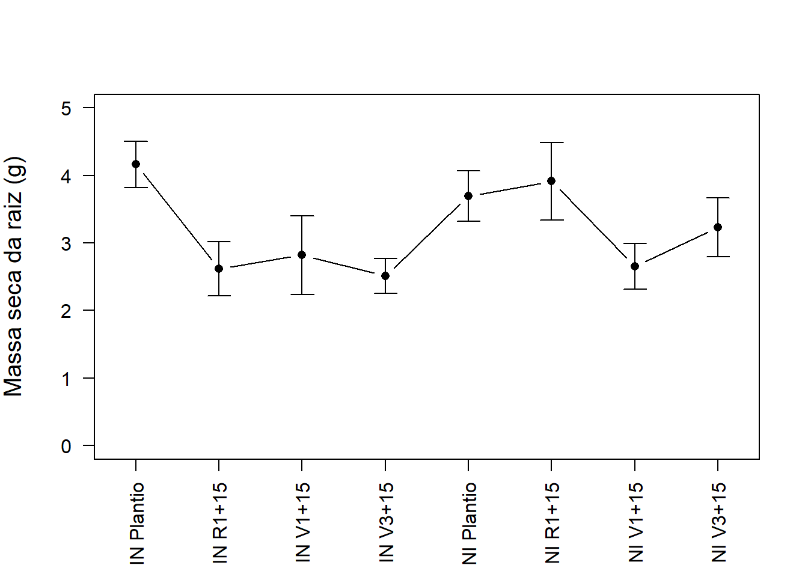

# Intervalo de confiança

****

<br>

### Conjunto de dados

Um experimento foi realizado com o intuito de avaliar a massa seca da raiz de soja no munícipio de Londrina-PR. O experimento foi instalado em delineamento inteiramente casualizado (DIC), 5 repetições, no esquema fatorial 4 x 2 (4 aplicações de dicloroisocianurato de sódio (DUP) e 2 inoculações de *Rhizobium*).


```r
msraiz=c(4.87, 4.64, 3.71, 3.04, 4.57, 4.13,  3.8, 1.17, 3.28, 1.73, 1.87, 2.85,  3.32, 2.19, 2.33, 4.09, 2.85, 1.86, 2.17, 2.12, 3.03, 3.52, 3.72, 3.09, 5.11,  3.6, 2.14, 2.25, 1.93, 3.35, 2.03, 4.72, 3.39, 3.05, 2.98, 2.53, 5.61, 3.74, 2.89, 4.8)
(Inoculação=rep(c("IN","NI"),e=20))
```

```
##  [1] "IN" "IN" "IN" "IN" "IN" "IN" "IN" "IN" "IN" "IN" "IN" "IN" "IN" "IN" "IN"
## [16] "IN" "IN" "IN" "IN" "IN" "NI" "NI" "NI" "NI" "NI" "NI" "NI" "NI" "NI" "NI"
## [31] "NI" "NI" "NI" "NI" "NI" "NI" "NI" "NI" "NI" "NI"
```

```r
(Época=rep(c("Plantio","V1+15","V3+15","R1+15"),e=5,2))
```

```
##  [1] "Plantio" "Plantio" "Plantio" "Plantio" "Plantio" "V1+15"   "V1+15"  
##  [8] "V1+15"   "V1+15"   "V1+15"   "V3+15"   "V3+15"   "V3+15"   "V3+15"  
## [15] "V3+15"   "R1+15"   "R1+15"   "R1+15"   "R1+15"   "R1+15"   "Plantio"
## [22] "Plantio" "Plantio" "Plantio" "Plantio" "V1+15"   "V1+15"   "V1+15"  
## [29] "V1+15"   "V1+15"   "V3+15"   "V3+15"   "V3+15"   "V3+15"   "V3+15"  
## [36] "R1+15"   "R1+15"   "R1+15"   "R1+15"   "R1+15"
```

```r
F1=as.factor(Inoculação)
F2=as.factor(Época)
Trat=paste(F1,F2)
dados=data.frame(Trat,resp=msraiz)
```

<br>

### Gráfico de linhas


```r
sciplot::lineplot.CI(Trat,msraiz,type="l",las=2,xlab="",ylim=c(0,5),
                     ylab="Massa seca da raiz (g)",
                     cex.lab=1.25,cex.names=1)
```

```
## Warning in plot.window(...): "cex.names" não é um parâmetro gráfico
```

```
## Warning in plot.xy(xy, type, ...): "cex.names" não é um parâmetro gráfico
```

```
## Warning in axis(side = side, at = at, labels = labels, ...): "cex.names" não é
## um parâmetro gráfico

## Warning in axis(side = side, at = at, labels = labels, ...): "cex.names" não é
## um parâmetro gráfico
```

```
## Warning in box(...): "cex.names" não é um parâmetro gráfico
```

```
## Warning in title(...): "cex.names" não é um parâmetro gráfico
```

```
## Warning in axis(1, labels = names(mn.data), at = nlevels.x, cex.axis =
## cex.axis, : "cex.names" não é um parâmetro gráfico
```


<br>

### Gráfico de pontos


```r
sciplot::lineplot.CI(Trat,msraiz,type="p",las=2,xlab="",ylim=c(0,5),
                     ylab="Massa seca da raiz (g)",
                     cex.lab=1.25,cex.names=1)
```

```
## Warning in plot.window(...): "cex.names" não é um parâmetro gráfico
```

```
## Warning in plot.xy(xy, type, ...): "cex.names" não é um parâmetro gráfico
```

```
## Warning in axis(side = side, at = at, labels = labels, ...): "cex.names" não é
## um parâmetro gráfico

## Warning in axis(side = side, at = at, labels = labels, ...): "cex.names" não é
## um parâmetro gráfico
```

```
## Warning in box(...): "cex.names" não é um parâmetro gráfico
```

```
## Warning in title(...): "cex.names" não é um parâmetro gráfico
```

```
## Warning in axis(1, labels = names(mn.data), at = nlevels.x, cex.axis =
## cex.axis, : "cex.names" não é um parâmetro gráfico
```


<br>

### Gráfico de linhas e pontos


```r
sciplot::lineplot.CI(Trat,msraiz,type="b",las=2,xlab="",ylim=c(0,5),
                     ylab="Massa seca da raiz (g)",
                     cex.lab=1.25,cex.names=1)
```

```
## Warning in plot.window(...): "cex.names" não é um parâmetro gráfico
```

```
## Warning in plot.xy(xy, type, ...): "cex.names" não é um parâmetro gráfico
```

```
## Warning in axis(side = side, at = at, labels = labels, ...): "cex.names" não é
## um parâmetro gráfico

## Warning in axis(side = side, at = at, labels = labels, ...): "cex.names" não é
## um parâmetro gráfico
```

```
## Warning in box(...): "cex.names" não é um parâmetro gráfico
```

```
## Warning in title(...): "cex.names" não é um parâmetro gráfico
```

```
## Warning in axis(1, labels = names(mn.data), at = nlevels.x, cex.axis =
## cex.axis, : "cex.names" não é um parâmetro gráfico
```



<br>

### Gráfico de barras e linhas


```r
sciplot::bargraph.CI(Trat,msraiz,las=2,xlab="",
                     ylab="Massa seca da raiz (g)",ylim=c(0,5),
                     cex.lab = 1.25,col = "black",
                     angle = 45, cex.names = 1,density = c(0,20))
abline(h=0)
```


<br><br><br>

****

