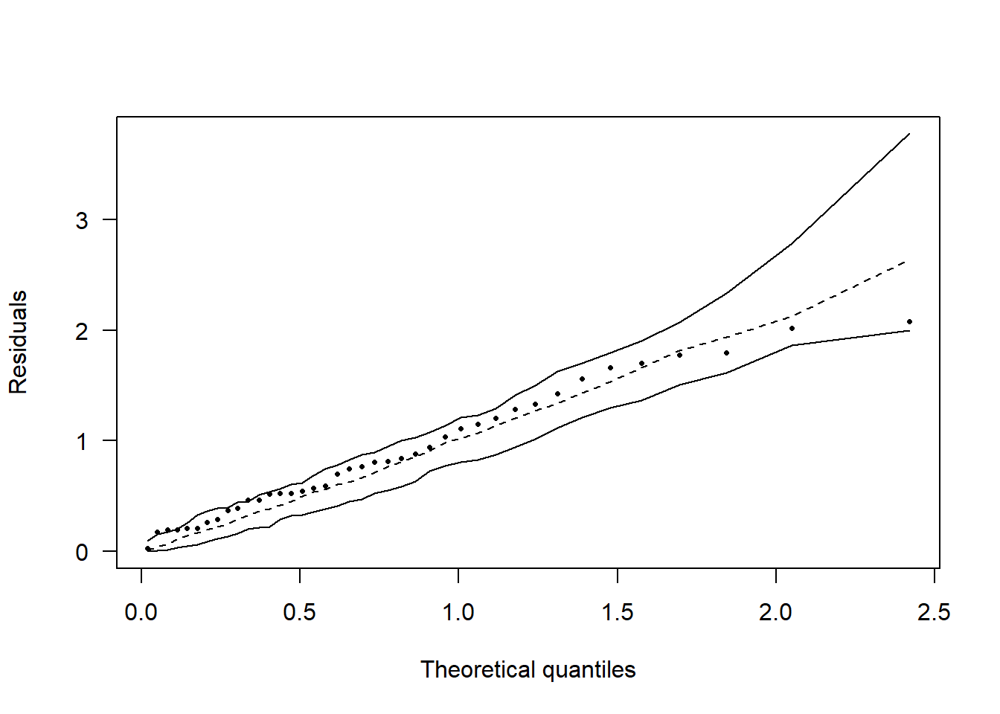
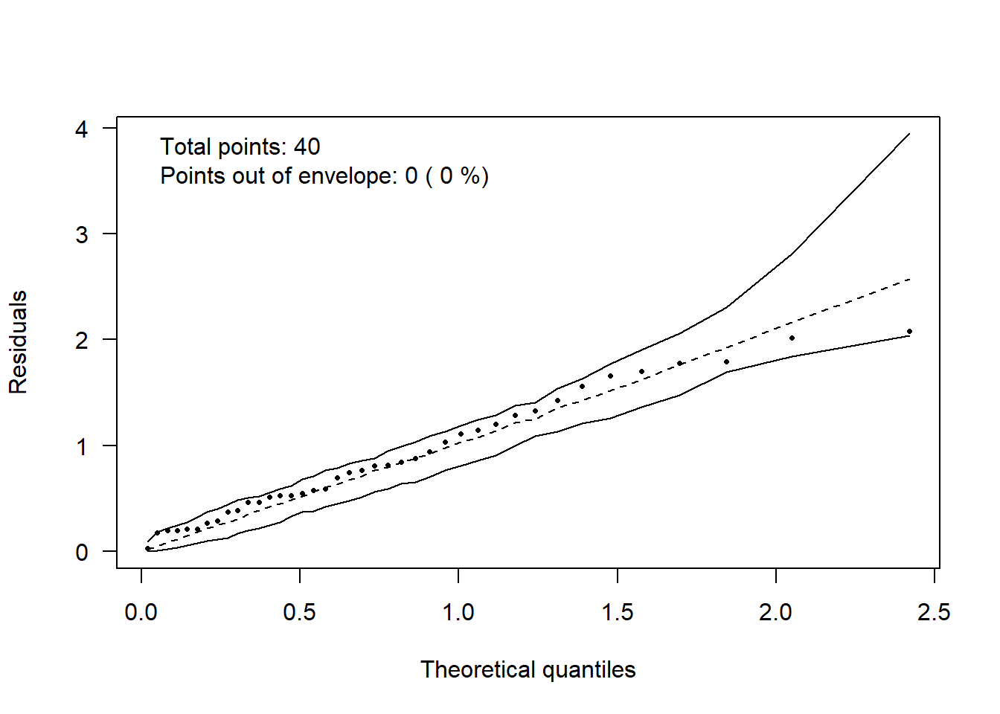
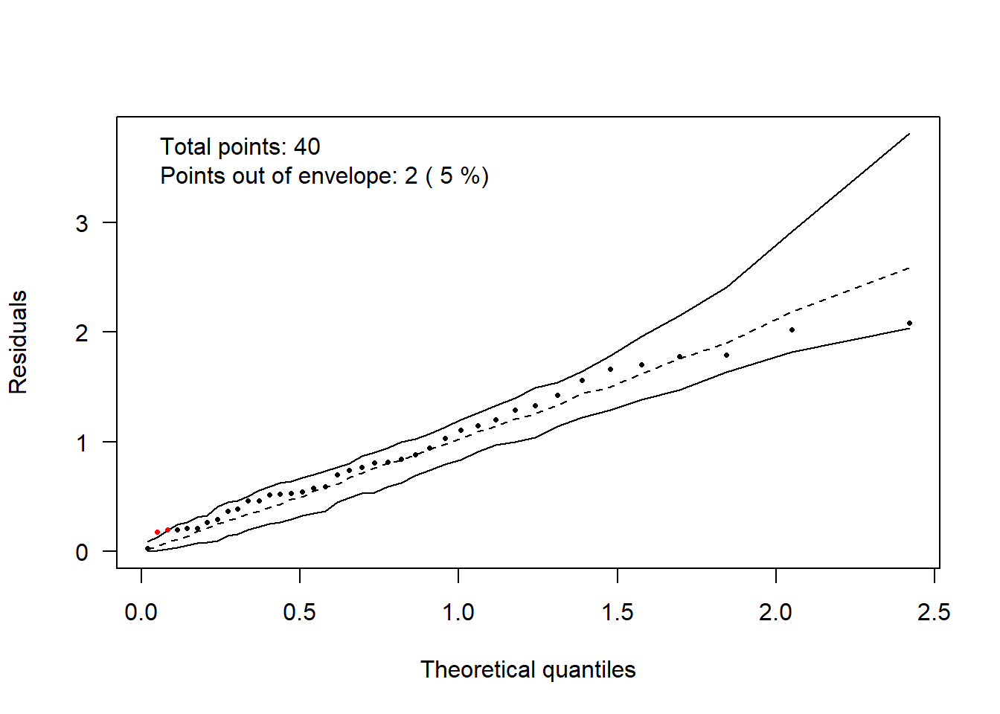

# Quantis Teóricos 

****

<br>

### Conjunto de dados

Um experimento foi realizado com o intuito de avaliar a massa seca da raiz de soja no munícipio de Londrina-PR. O experimento foi instalado em delineamento inteiramente casualizado (DIC), 5 repetições, no esquema fatorial 4 x 2 (4 aplicações de dicloroisocianurato de sódio (DUP) e 2 inoculações de *Rhizobium*).


```r
msraiz=c(4.87, 4.64, 3.71, 3.04, 4.57, 4.13,  3.8, 1.17, 3.28, 1.73, 1.87, 2.85, 3.32, 2.19, 2.33, 4.09, 2.85, 1.86, 2.17, 2.12, 3.03, 3.52, 3.72, 3.09,  5.11,  3.6, 2.14, 2.25, 1.93, 3.35, 2.03, 4.72, 3.39, 3.05, 2.98, 2.53, 5.61, 3.74, 2.89, 4.8)
(Inoculação=rep(c("IN","NI"),e=20))
```

```
##  [1] "IN" "IN" "IN" "IN" "IN" "IN" "IN" "IN" "IN" "IN" "IN" "IN" "IN" "IN" "IN"
## [16] "IN" "IN" "IN" "IN" "IN" "NI" "NI" "NI" "NI" "NI" "NI" "NI" "NI" "NI" "NI"
## [31] "NI" "NI" "NI" "NI" "NI" "NI" "NI" "NI" "NI" "NI"
```

```r
(Época=rep(c("Plantio","V1+15","V3+15","R1+15"),e=5,2))
```

```
##  [1] "Plantio" "Plantio" "Plantio" "Plantio" "Plantio" "V1+15"   "V1+15"  
##  [8] "V1+15"   "V1+15"   "V1+15"   "V3+15"   "V3+15"   "V3+15"   "V3+15"  
## [15] "V3+15"   "R1+15"   "R1+15"   "R1+15"   "R1+15"   "R1+15"   "Plantio"
## [22] "Plantio" "Plantio" "Plantio" "Plantio" "V1+15"   "V1+15"   "V1+15"  
## [29] "V1+15"   "V1+15"   "V3+15"   "V3+15"   "V3+15"   "V3+15"   "V3+15"  
## [36] "R1+15"   "R1+15"   "R1+15"   "R1+15"   "R1+15"
```

```r
F1=as.factor(Inoculação)
F2=as.factor(Época)
Trat=paste(F1,F2)
dados=data.frame(Trat,resp=msraiz)
```

<br>

### Análise de variância


```r
mod = with(dados, aov(msraiz~F1*F2))
anova(mod)
```

```
## Analysis of Variance Table
## 
## Response: msraiz
##           Df  Sum Sq Mean Sq F value  Pr(>F)  
## F1         1  1.1868 1.18680  1.2950 0.26358  
## F2         3  8.5762 2.85872  3.1193 0.03961 *
## F1:F2      3  4.9430 1.64766  1.7978 0.16744  
## Residuals 32 29.3268 0.91646                  
## ---
## Signif. codes:  0 '***' 0.001 '**' 0.01 '*' 0.05 '.' 0.1 ' ' 1
```

<br>

### Envelope simulado


```r
hnp::hnp(mod,
         las=1,
         seed=1,
         pch=16)
```



<br>

### Porcentagem de pontos fora


```r
hnp::hnp(mod,
         seed=1,
         las=1, 
         pch=16,
         print.on=T)
```



<br>

### Colorir pontos fora 


```r
hnp::hnp(mod, 
         seed=1,
         las=1, 
         pch=16,
         print.on=T,
         paint.out=T, 
         col.paint.out="red")
```



<br><br><br>

****

