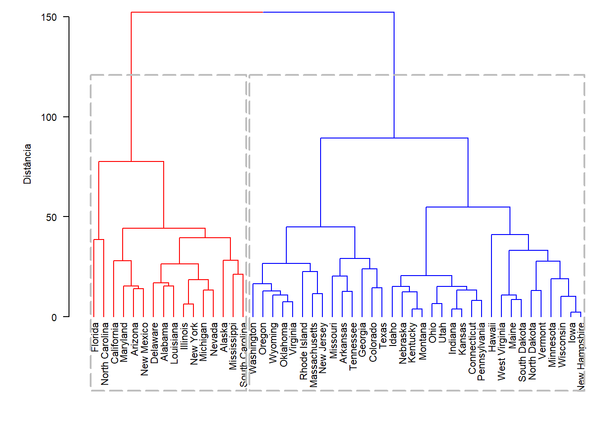
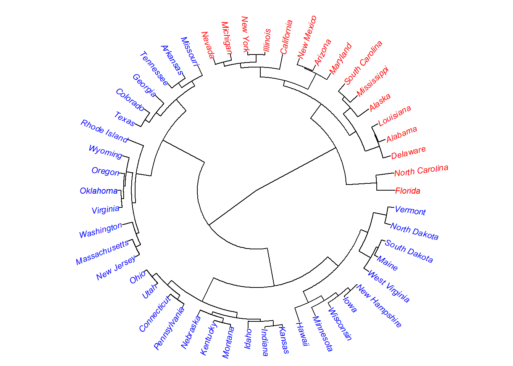

# Dendrograma

****


### Conjunto de dados

Violent Crime Rates by US State

Description

This data set contains statistics, in arrests per 100,000 residents for assault, murder, and rape in each of the 50 US states in 1973. Also given is the percent of the population living in urban areas. 

McNeil, D. R. (1977) Interactive Data Analysis. New York: Wiley.


```r
data("USArrests")
USArrests
```

```
##                Murder Assault UrbanPop Rape
## Alabama          13.2     236       58 21.2
## Alaska           10.0     263       48 44.5
## Arizona           8.1     294       80 31.0
## Arkansas          8.8     190       50 19.5
## California        9.0     276       91 40.6
## Colorado          7.9     204       78 38.7
## Connecticut       3.3     110       77 11.1
## Delaware          5.9     238       72 15.8
## Florida          15.4     335       80 31.9
## Georgia          17.4     211       60 25.8
## Hawaii            5.3      46       83 20.2
## Idaho             2.6     120       54 14.2
## Illinois         10.4     249       83 24.0
## Indiana           7.2     113       65 21.0
## Iowa              2.2      56       57 11.3
## Kansas            6.0     115       66 18.0
## Kentucky          9.7     109       52 16.3
## Louisiana        15.4     249       66 22.2
## Maine             2.1      83       51  7.8
## Maryland         11.3     300       67 27.8
## Massachusetts     4.4     149       85 16.3
## Michigan         12.1     255       74 35.1
## Minnesota         2.7      72       66 14.9
## Mississippi      16.1     259       44 17.1
## Missouri          9.0     178       70 28.2
## Montana           6.0     109       53 16.4
## Nebraska          4.3     102       62 16.5
## Nevada           12.2     252       81 46.0
## New Hampshire     2.1      57       56  9.5
## New Jersey        7.4     159       89 18.8
## New Mexico       11.4     285       70 32.1
## New York         11.1     254       86 26.1
## North Carolina   13.0     337       45 16.1
## North Dakota      0.8      45       44  7.3
## Ohio              7.3     120       75 21.4
## Oklahoma          6.6     151       68 20.0
## Oregon            4.9     159       67 29.3
## Pennsylvania      6.3     106       72 14.9
## Rhode Island      3.4     174       87  8.3
## South Carolina   14.4     279       48 22.5
## South Dakota      3.8      86       45 12.8
## Tennessee        13.2     188       59 26.9
## Texas            12.7     201       80 25.5
## Utah              3.2     120       80 22.9
## Vermont           2.2      48       32 11.2
## Virginia          8.5     156       63 20.7
## Washington        4.0     145       73 26.2
## West Virginia     5.7      81       39  9.3
## Wisconsin         2.6      53       66 10.8
## Wyoming           6.8     161       60 15.6
```

<br>

### Calculando as distâncias


```r
d=dist(USArrests)
R=hclust(d)
```

<br>

### Dendrograma


```r
plot(R)
```


<br>

### Altura dos rótulos


```r
plot(R, hang=-1)
```


<br>

### Editando argumentos


```r
plot(R, 
     las=1, # Escala do eixo na horizontal
     hang=-1, # alinhar altura dos rótulos
     main="", # Título vazio
     ylab="Distância") # Título do eixo Y
```


<br>

### Separando em grupos

Neste exemplo vamos considerar dois grupos


```r
# Chamando package dendextend
library(dendextend)
```

```
## Warning: package 'dendextend' was built under R version 3.6.3
```

```
## 
## ---------------------
## Welcome to dendextend version 1.13.4
## Type citation('dendextend') for how to cite the package.
## 
## Type browseVignettes(package = 'dendextend') for the package vignette.
## The github page is: https://github.com/talgalili/dendextend/
## 
## Suggestions and bug-reports can be submitted at: https://github.com/talgalili/dendextend/issues
## Or contact: <tal.galili@gmail.com>
## 
## 	To suppress this message use:  suppressPackageStartupMessages(library(dendextend))
## ---------------------
```

```
## 
## Attaching package: 'dendextend'
```

```
## The following object is masked from 'package:stats':
## 
##     cutree
```

```r
# Construindo o dendrograma
dend=as.dendrogram(hclust(dist(USArrests), method='average'))

# Definindo cores e grupos para o dendrograma
dend=set(dend,"branches_k_color", 
             value = c("red", "blue"), k = 2)

# Plotando o gráfico
par(cex=0.7)
plot(dend, 
     las=1, 
     ylab="Distância")
```


<br>

### Caixas separando grupos


```r
library(dendextend)
dend=as.dendrogram(hclust(dist(USArrests), 
                          method='average'))
dend=set(dend,
         "branches_k_color", 
             value = c("red", "blue"), 
         k = 2)
par(cex=0.7, mai=c(1.2,0.8,0,0))
plot(dend, 
     las=1,
     ylab="Distância")
par(cex=0.8)
# Construindo caixa de separação entre os grupos
rect.dendrogram(dend,
                k=2, # Dois grupos
                border = 8, # cor da borda (8: cinza)
                lty = 5, # formato da linha
                lwd = 2) # espessura da linha
```



<br>

### Árvore filogenética (Em círculo)


```r
library(ape)
```

```
## 
## Attaching package: 'ape'
```

```
## The following objects are masked from 'package:dendextend':
## 
##     ladderize, rotate
```

```r
par(mar=c(0,0,1,0))
plot(as.phylo(R),
     cex=0.7, 
     type="fan")
```


<br>

### Cor e separando por grupo


```r
par(mar=c(0,0,1,0))
clus=cutree(R,2)
colors=c("red","blue")
plot(as.phylo(R), 
     cex=0.7,
     type="fan", 
     tip.color=colors[clus])
```



<br>

### Formato radial


```r
par(mar=c(0,0,1,0))
plot(as.phylo(R),
     cex=0.7, 
     type="radial")
```


<br><br><br>

****

# Diagrama de Venn

****

## Pacote venneuler


```r
require(venneuler)
```

```
## Carregando pacotes exigidos: venneuler
```

```
## Warning: package 'venneuler' was built under R version 3.6.3
```

```
## Carregando pacotes exigidos: rJava
```

```
## Warning: package 'rJava' was built under R version 3.6.3
```

```r
v <- venneuler(c(A=450, B=1800, "A&B"=230))
plot(v)
```


## Pacote eulerr


```r
library(eulerr)
```

```
## Warning: package 'eulerr' was built under R version 3.6.3
```

```r
fit <- euler(c(A = 450, B = 1800, "A&B" = 230))
plot(fit)
```


Existe um app Shiny: `eulerr.co`

## Pacote gplots


```r
require(gplots) 
```

```
## Carregando pacotes exigidos: gplots
```

```
## Warning: package 'gplots' was built under R version 3.6.3
```

```
## Registered S3 method overwritten by 'gplots':
##   method    from  
##   plot.venn eulerr
```

```
## 
## Attaching package: 'gplots'
```

```
## The following object is masked from 'package:eulerr':
## 
##     venn
```

```
## The following object is masked from 'package:stats':
## 
##     lowess
```

```r
oneName <- function() paste(sample(LETTERS,5,replace=TRUE),collapse="")
geneNames <- replicate(1000, oneName())
GroupA <- sample(geneNames, 400, replace=FALSE)
GroupB <- sample(geneNames, 750, replace=FALSE)
GroupC <- sample(geneNames, 250, replace=FALSE)
GroupD <- sample(geneNames, 300, replace=FALSE)
venn(list(GrpA=GroupA,GrpB=GroupB,GrpC=GroupC,GrpD=GroupD))
```


## Pacote VennDiagram


```r
require(VennDiagram)
```

```
## Carregando pacotes exigidos: VennDiagram
```

```
## Carregando pacotes exigidos: grid
```

```
## Carregando pacotes exigidos: futile.logger
```

```
## 
## Attaching package: 'VennDiagram'
```

```
## The following object is masked from 'package:ape':
## 
##     rotate
```

```
## The following object is masked from 'package:dendextend':
## 
##     rotate
```

```r
vp <- venn.diagram(list(A=1:5,B=1,C=c(4,8:10),D=c(4:12)), 
                   fill = 2:5, alpha = 0.3, filename = NULL);
grid.draw(vp)
```


