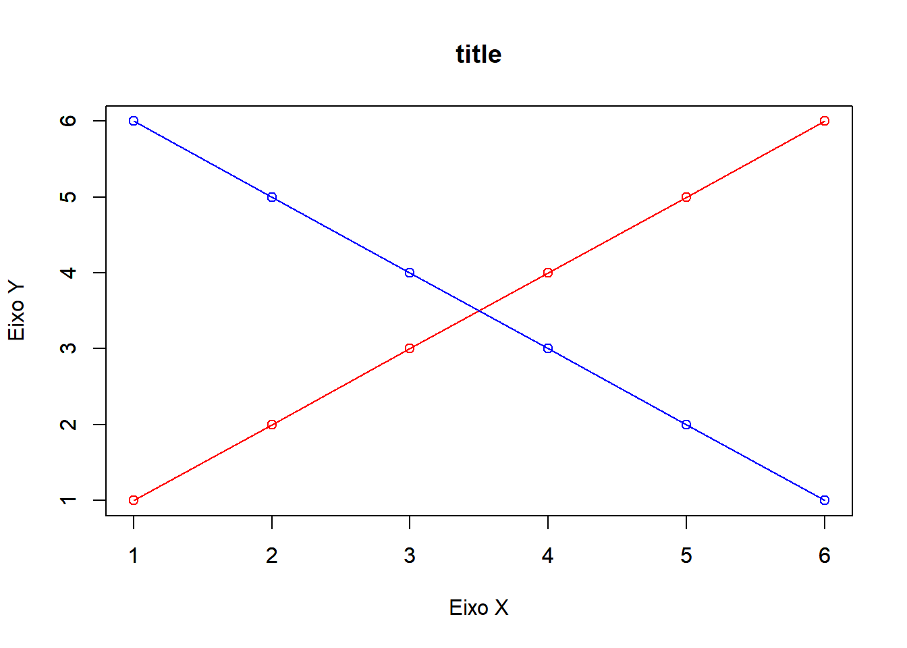

# layout (graphics)

****

<br>

### Como modificar o layout do R graphics

<br>

Durante a elaboração de gráficos no R, muitas vezes nos deparamos com problemas na margem (Títulos ou escalas ficam cortados) ou querem elaborar dois ou mais gráficos em uma única saída. Neste sentido, o presente tutorial irá abordar algumas funções para modificar o layout do gráfico base do R.

Não iremos trabalhar com um conjunto de dados neste exemplo, dessa forma, a linha respectiva ao `plot(1,1,axes=F, col="white", ylab="",xlab="")` serve apenas para demonstrar como alterar os parâmetros gráficos.

<br>

<div style="column-count: 1;">

****

### Gráfico Simples

****


```r
plot(1,1, ylab="Eixo Y",xlab="Eixo X")
```


****

### Parâmetros de margem

****

<br>

O comando par(...) é utilizado para alterar os parâmetros gráficos e deve ser executando antes do gráfico. Entretanto, uma vez executado essa linha de comando, todos os outros gráficos irão apresentar o mesmo layout, exceto se fechar o Rstudio ou limpar todos os gráficos.

O comando mai representa o tamanho de margem e deve-se digitar um vetor numérico com quatro valores, sendo respectivamente em ordem, inferior, esquerda, superior e direita (`mai=c(bottom, left, top, right)`).

<br>


```r
par(mai=c(1,1,1,1))
plot(1,1, ylab="Eixo Y",xlab="Eixo X")
```


****

### Fonte do gráfico

****

O comando para alterar a fonte do gráfico também é realizada dentro de par(...). Os argumentos do comando é `family="fonte"`.

`par(family="serif")`: Times New Roman


```r
par(family="serif")
plot(1,1, ylab="Eixo Y",xlab="Eixo X")
```


<br>

****

### Cor do gráfico

****

Especificando a cor do gráfico (Geral, exceto eixos)


```r
par(col="red")
plot(1,1, ylab="Eixo Y",xlab="Eixo X")
```


Especificando a cor da escala dos eixos do gráfico


```r
par(col.axis="red")
plot(1,1, ylab="",xlab="")
```


Especificando cor do nome dos eixos


```r
par(col.lab="red")
plot(1,1, ylab="Eixo Y",xlab="Eixo X")
```


Especificando cor do título


```r
par(col.main="red")
plot(1,1, ylab="Eixo Y",xlab="Eixo X",main="title")
```


<br>

****

### Tamanho de letra

****


```r
par(cex=1.3)
plot(1,1, ylab="Eixo Y",xlab="Eixo X",main="title")
```


 - `cex.axis` : Tamanho da fonte das escalas de Y e X
 - `cex.lab` : Tamaho da fonte do nome dos eixos
 - `cex.main` : Tamanho da fonte do título

<br>

****

### Sobrepor gráficos

****


```r
plot(c(1,2,3,4,5,6), ylab="Eixo Y",xlab="Eixo X",main="title", type="o",col="red")
par(new=T)
plot(c(6,5,4,3,2,1), ylab="",xlab="",main="", type="o",col="blue")
```



<br>

****

### Dois ou mais gráficos em uma saída

****

`mfrow=c(1,2)`: vetor de dados em que o primeiro representa o número de linhas e o segundo o número de colunas (Neste caso, uma linha e duas colunas)


```r
par(mfrow=c(1,2))
plot(c(1,2,3,4,5,6), ylab="Eixo Y",xlab="Eixo X",main="title", type="o",col="red")
plot(c(6,5,4,3,2,1), ylab="Eixo Y",xlab="Eixo X",main="title", type="o",col="blue")
```


<br>

****

### Saída com dois gráficas na primeira linha e um gráfico na segunda linha

****

Saída com dois gráficas na primeira linha e um gráfico na segunda linha e necessário criar uma matriz com as posições.

Exemplo de matriz:

Matriz com quatro valores (`c(1,3,2,3)`) e duas colunas (`ncol=2`). Neste caso, a linha 1 apresenta os valores 1 e 2, que representam o primeiro e o segundo plot. A linha 2 apresenta os valores 3 e 3 que representa o terceiro plot.


```r
matrix(c(1,3,2,3), ncol=2)
```

```
##      [,1] [,2]
## [1,]    1    2
## [2,]    3    3
```


```r
layout(matrix(c(1,3,2,3), ncol=2))
plot(c(1,2,3,4,5,6), ylab="Eixo Y",xlab="Eixo X",main="title", type="o",col="red")
plot(c(6,5,4,3,2,1), ylab="Eixo Y",xlab="Eixo X",main="title", type="o",col="blue")
plot(c(1,6,1,6,1,6), ylab="Eixo Y",xlab="Eixo X",main="title", type="o",col="blue")
```


<br>

</div>

<br><br><br>

****

