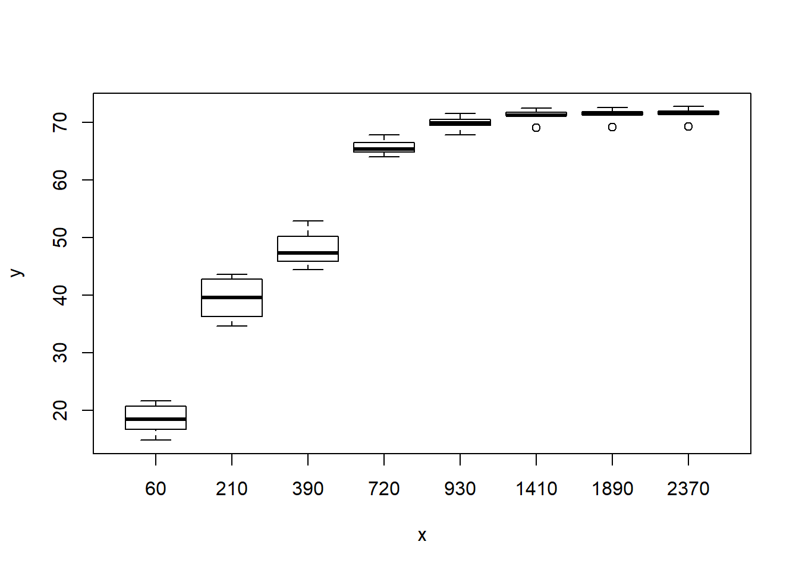
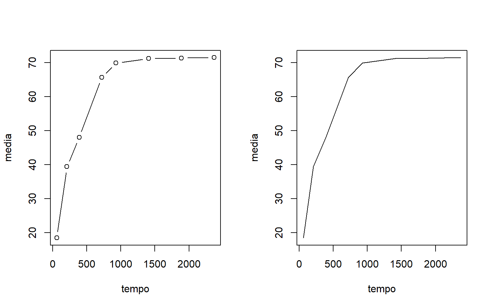
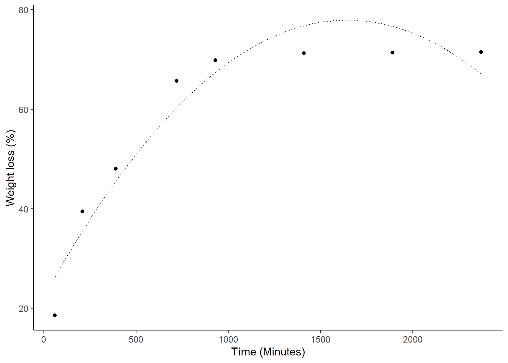

# Análise de regressão linear e não-linear

Nas mais diversas áreas da pesquisa, seja ela na área médica, biológica, industrial, química entre outras, é de grande interesse verificar se duas ou mais variáveis estão relacionadas de alguma forma. Para expressar esta relação é muito importante estabelecer um modelo matemático. Este tipo de modelagem é chamado de regressão, e ajuda a entender como determinadas variáveis influenciam outra variável, ou seja, verifica como o comportamento de uma ou mais variáveis podem mudar o comportamento de outra.

Na agronomia, a análise de regressão é muito utilizada por exemplo, para estabelecer doses de máxima resposta de produtos fitossanitários, adubos, populações de plantas, etc..; ou mesmo no estudo do desenvolvimento de uma planta, o que chamamos de curva de crescimento. 

Popularmente, é comum a utilização de curva do tipo polinomial, visto a facilidade de sua utilização e explicação. Todavia, muito dos dados não se comportam dessa forma, ainda que o ajuste seja significativo, podendo assim, levar a conclusões limitadas em função da análise inadequada. Logo, o presente tutorial apresenta diferentes ajustes de regressão linear e não-linear de um mesmo conjunto de dados. 

Neste tutorial, você irá reparar que em quase todos os modelos, o coeficientes serão significativos, demonstrando que quase todos os modelos são válidos para explicar o comportamento dos dados. A questão é, qual o melhor modelo?


**Obs. Este é um tutorial para demonstração dos modelos de regressão. Alguns casos ele não é significativo ou uma das pressuposições não é atendida. É um tutorial apenas para fins didáticos.**

<br><br>

****

## Conjunto de dados

****

O conjunto de dados é de um experimento cujo objetivo foi avaliar a perda de massa da casca de romã em estufa a $60^oC$. Foi utilizado oito repetições em oito avaliações (60, 210,390, 720, 930, 1410, 1890 e 2370 minutos)


```r
`PERDA DE MASSA CAA`=c(18.15810,17.99376,14.81450,15.39822,21.62234,20.45106,18.65319,20.96547,36.77274,39.92503,34.60874,35.70286,43.57189,42.19460,39.23367,43.36169,52.90384,52.64886,45.61431,47.81200,44.41734,47.40493,46.15373,47.12330,65.29474,67.78859,64.60738,66.24453,63.97464,66.77636,65.37446,65.11912,67.86385,70.68877,69.45271,70.33895,69.43583,71.56150,69.73480,69.97407,69.02813,71.28882,71.17485,71.22420,71.32344,72.46687,71.17063,72.07550,69.16576,71.44176,71.30762,71.34075,71.42775,72.59710,71.28255,72.19996,69.30339,71.59471,71.44040,71.45729,71.53206,72.72733,71.39446,72.32441)
TEMPO=rep(c(60,210,390,720,930,1410,1890,2370),e=8)
dados=data.frame(TEMPO,`PERDA DE MASSA CAA`)
y=c(`PERDA DE MASSA CAA`)
x=c(TEMPO)
data=data.frame(y,x)
```

<br><br>

### Média e desvio-padrão amostral


```r
(media=tapply(y,x, mean))
```

```
##       60      210      390      720      930     1410     1890     2370 
## 18.50708 39.42140 48.00979 65.64748 69.88131 71.21905 71.34541 71.47176
```

```r
(desvio=tapply(y,x, sd))
```

```
##       60      210      390      720      930     1410     1890     2370 
## 2.485224 3.479257 3.133973 1.229025 1.080134 1.007882 1.004939 1.002227
```

```r
(tempo=c(60,210,390,720,930,1410,1890,2370))
```

```
## [1]   60  210  390  720  930 1410 1890 2370
```

<br><br>

****

### Gráficos exploratórios

****

<br><br>

### Gráfico de caixas


```r
boxplot(y~x)
```



### Gráfico de dispersão


```r
plot(y~x)
```


### Gráfico de dispersão com médias


```r
plot(y~x)
points(media~tempo,pch=16,col="red")
```


### Gráfico de linhas com as médias


```r
par(mfrow=c(1,2))
plot(media~tempo, type="b")
plot(media~tempo, type="l")
```



### Histograma


```r
hist(y)
```


<br><br><br>

****

## Linear Simples

****

O modelo de regressão linear simples (MRLS) se define uma relação linear entre a variável dependente e uma variável independente.

$$Y=\beta_1x+\beta_0$$

### Criando o modelo de regressão


```r
modl=lm(y~x)
summary(modl)
```

```
## 
## Call:
## lm(formula = y ~ x)
## 
## Residuals:
##      Min       1Q   Median       3Q      Max 
## -24.4181  -8.1253   0.4191   8.8542  16.0914 
## 
## Coefficients:
##              Estimate Std. Error t value Pr(>|t|)    
## (Intercept) 38.099512   2.368998   16.08  < 2e-16 ***
## x            0.018886   0.001876   10.07 1.15e-14 ***
## ---
## Signif. codes:  0 '***' 0.001 '**' 0.01 '*' 0.05 '.' 0.1 ' ' 1
## 
## Residual standard error: 11.62 on 62 degrees of freedom
## Multiple R-squared:  0.6205,	Adjusted R-squared:  0.6144 
## F-statistic: 101.4 on 1 and 62 DF,  p-value: 1.147e-14
```

### Diagnóstico

### Normalidade dos erros


```r
hnp::hnp(modl)
```

```
## Gaussian model (lm object)
```


```r
shapiro.test(resid(modl)) # erros não normais
```

```
## 
## 	Shapiro-Wilk normality test
## 
## data:  resid(modl)
## W = 0.94067, p-value = 0.004079
```

### Falta de ajuste (Desvio da regressão)


```r
modq=aov(y~as.factor(x))
anova(modl,modq)
```

```
## Analysis of Variance Table
## 
## Model 1: y ~ x
## Model 2: y ~ as.factor(x)
##   Res.Df    RSS Df Sum of Sq      F    Pr(>F)    
## 1     62 8377.2                                  
## 2     56  236.7  6    8140.5 321.02 < 2.2e-16 ***
## ---
## Signif. codes:  0 '***' 0.001 '**' 0.01 '*' 0.05 '.' 0.1 ' ' 1
```

### Construindo gráfico


```r
par(family="serif")
plot(media~tempo, main="Linear Simples",
     las=1, cex=1.3,
     ylab="Weight loss (%)", xlim=c(0,2500),
     xlab="Time (Minutes)", 
     pch=16, ylim=c(0,80))
curve(coef(modl)[1]+coef(modl)[2]*x, add=TRUE, lty=2)
legend("topleft",
       cex=1,
       bty="n",
       legend = c(expression(hat(Y)==38.09951+0.01889*x)))
```


### ggplot2


```r
library(ggplot2)
da=data.frame(media,tempo)
ggplot(da,aes(y=media,x=tempo))+
  geom_point()+
  geom_smooth(method="lm",se = F,col="black",size=0.1,lty=2)+
  theme_classic()+
  ylab("Weight loss (%)")+
  xlab("Time (Minutes)") 
```


<br><br><br>

****

## Quadrático

****

$$Y=\beta_2x^2+\beta_1x+\beta_0$$

### Criando modelo de regressão


```r
mod1=lm(y~x+I(x^2))
summary(mod1)
```

```
## 
## Call:
## lm(formula = y ~ x + I(x^2))
## 
## Residuals:
##     Min      1Q  Median      3Q     Max 
## -11.428  -5.288   1.756   4.360   8.018 
## 
## Coefficients:
##               Estimate Std. Error t value Pr(>|t|)    
## (Intercept)  2.226e+01  1.528e+00   14.57   <2e-16 ***
## x            6.763e-02  3.367e-03   20.09   <2e-16 ***
## I(x^2)      -2.055e-05  1.371e-06  -14.99   <2e-16 ***
## ---
## Signif. codes:  0 '***' 0.001 '**' 0.01 '*' 0.05 '.' 0.1 ' ' 1
## 
## Residual standard error: 5.415 on 61 degrees of freedom
## Multiple R-squared:  0.919,	Adjusted R-squared:  0.9163 
## F-statistic: 345.9 on 2 and 61 DF,  p-value: < 2.2e-16
```

### Diagnóstico do modelo

### Normalidade dos erros


```r
hnp::hnp(mod1)
```

```
## Gaussian model (lm object)
```


```r
shapiro.test(resid(mod1)) # erros nao normais
```

```
## 
## 	Shapiro-Wilk normality test
## 
## data:  resid(mod1)
## W = 0.92285, p-value = 0.000655
```

### Fator de inflação de variância (Multicolinearidade)


```r
car::vif(mod1) # problema de multicolinearidade
```

```
##        x   I(x^2) 
## 14.84834 14.84834
```

### Falta de ajuste (Desvio da regressão)


```r
modq=aov(y~as.factor(x))
anova(mod1,modq)
```

```
## Analysis of Variance Table
## 
## Model 1: y ~ x + I(x^2)
## Model 2: y ~ as.factor(x)
##   Res.Df     RSS Df Sum of Sq      F    Pr(>F)    
## 1     61 1788.55                                  
## 2     56  236.68  5    1551.9 73.438 < 2.2e-16 ***
## ---
## Signif. codes:  0 '***' 0.001 '**' 0.01 '*' 0.05 '.' 0.1 ' ' 1
```

### Construindo gráfico


```r
par(family="serif")
plot(media~tempo, main="Quadrático",
     las=1, cex=1.3,
     ylab="Weight loss (%)", xlim=c(0,2500),
     xlab="Time (Minutes)", 
     pch=16, ylim=c(0,80))
curve(coef(mod1)[1]+coef(mod1)[2]*x+coef(mod1)[3]*x^2, add=TRUE, lty=2)
legend("topleft",
       cex=1,
       bty="n",
       legend = c(expression(hat(Y)==22.26+0.006763*x-0.00002055*x^2)))
```


### Ponto de máximo (Ou mínimo)

O ponto de máximo ou mínimo podem ser encontrados de várias formas

### Manualmente


```r
(xmax=-coef(mod1)[2]/(2*coef(mod1)[3]))
```

```
##        x 
## 1645.317
```

```r
(ymax=coef(mod1)[1]+coef(mod1)[2]*xmax+coef(mod1)[3]*xmax^2)
```

```
## (Intercept) 
##    77.89475
```

### Usando o which.max ou which.min


```r
plot(y~x)
tend=curve(coef(mod1)[1]+coef(mod1)[2]*x+coef(mod1)[3]*x^2,add=T)
```

```r
tend$x[which.max(tend$y)]
```

```
## [1] 1653.9
```

```r
# tend$x[which.min(tend$y)] # no caso de mínimo
```

### ggplot2


```r
library(ggplot2)
da=data.frame(media,tempo)
ggplot(da,aes(y=media,x=tempo))+
  geom_point()+
  geom_smooth(method="lm",formula = y~poly(x,2), se = F,col="black",size=0.1,lty=2)+
  theme_classic()+
  ylab("Weight loss (%)")+
  xlab("Time (Minutes)") 
```



<br><br><br>

****

## Cúbico

****

$$Y=\beta_3x^3+\beta_2x^2+\beta_1x+\beta_0$$

### Construindo o modelo


```r
mod2=lm(y~x+I(x^2)+I(x^3))
summary(mod2)
```

```
## 
## Call:
## lm(formula = y ~ x + I(x^2) + I(x^3))
## 
## Residuals:
##     Min      1Q  Median      3Q     Max 
## -6.0186 -1.3299 -0.3928  1.3155  8.0377 
## 
## Coefficients:
##               Estimate Std. Error t value Pr(>|t|)    
## (Intercept)  1.406e+01  9.927e-01   14.16   <2e-16 ***
## x            1.174e-01  4.125e-03   28.47   <2e-16 ***
## I(x^2)      -7.536e-05  4.189e-06  -17.99   <2e-16 ***
## I(x^3)       1.524e-08  1.149e-09   13.27   <2e-16 ***
## ---
## Signif. codes:  0 '***' 0.001 '**' 0.01 '*' 0.05 '.' 0.1 ' ' 1
## 
## Residual standard error: 2.753 on 60 degrees of freedom
## Multiple R-squared:  0.9794,	Adjusted R-squared:  0.9784 
## F-statistic: 951.1 on 3 and 60 DF,  p-value: < 2.2e-16
```

### Diagnóstico do modelo

### Normalidade dos erros


```r
hnp::hnp(mod2)
```

```
## Gaussian model (lm object)
```


```r
shapiro.test(resid(mod2)) # Erros nao normais
```

```
## 
## 	Shapiro-Wilk normality test
## 
## data:  resid(mod2)
## W = 0.94796, p-value = 0.009093
```

### Fator de inflação de variância (Multicolinearidade) 


```r
car::vif(mod2) # alta multicolinearidade
```

```
##         x    I(x^2)    I(x^3) 
##  86.25922 536.46498 221.25164
```

### Falta de ajuste (Desvio da regressão)


```r
modq=aov(y~as.factor(x))
anova(mod2,modq)
```

```
## Analysis of Variance Table
## 
## Model 1: y ~ x + I(x^2) + I(x^3)
## Model 2: y ~ as.factor(x)
##   Res.Df    RSS Df Sum of Sq      F    Pr(>F)    
## 1     60 454.60                                  
## 2     56 236.68  4    217.93 12.891 1.666e-07 ***
## ---
## Signif. codes:  0 '***' 0.001 '**' 0.01 '*' 0.05 '.' 0.1 ' ' 1
```

### Construindo o gráfico


```r
par(family="serif")
plot(media~tempo, main="Cúbico",
     las=1, cex=1.3,
     ylab="Weight loss (%)", xlim=c(0,2500),
     xlab="Time (Minutes)", 
     pch=16, ylim=c(0,80))
curve(coef(mod2)[1]+coef(mod2)[2]*x+coef(mod2)[3]*x^2+coef(mod2)[4]*x^3, add=TRUE, lty=2)
legend("topleft",
       cex=1,
       bty="n",
       legend = c(expression(hat(Y)==14.06+0.01174*x-0.00007536*x^2+0.00000001524*x^3)))
```


### ponto de máximo, mínimo e inflexão


```r
plot(media~tempo)
curva=curve(coef(mod2)[1]+coef(mod2)[2]*x+coef(mod2)[3]*x^2+coef(mod2)[4]*x^3, add=TRUE, lty=2)
```

```r
# ponto de inflexão
pi=-(2*coef(mod2)[3])/(3*2*coef(mod2)[4])

# ponto de máximo anterior ao ponto de inflexão
xmax=curva$x[which.max(curva$y[curva$x<pi])]

# ponto de mínimo posterior ao ponto de inflexão
xmin=curva$x[which.max(curva$y[curva$x<pi])+which.min(curva$y[curva$x>xmax])]
```


```r
plot(media~tempo)
curva=curve(coef(mod2)[1]+coef(mod2)[2]*x+coef(mod2)[3]*x^2+coef(mod2)[4]*x^3, add=TRUE, lty=1)
abline(v=c(xmax,xmin,pi),lty=2)
```


### ggplot2


```r
library(ggplot2)
da=data.frame(media,tempo)
ggplot(da,aes(y=media,x=tempo))+
  geom_point()+
  geom_smooth(method="lm",formula = y~poly(x,3), se = F,col="black",size=0.1,lty=2)+
  theme_classic()+
  ylab("Weight loss (%)")+
  xlab("Time (Minutes)") 
```


<br><br><br>

****

## Logarítmico

****

$$Y=\beta_{0}+\beta_{1}\log(x)$$

### Construindo modelo


```r
modelog=lm(y~log(x))
summary(modelog)
```

```
## 
## Call:
## lm(formula = y ~ log(x))
## 
## Residuals:
##     Min      1Q  Median      3Q     Max 
## -8.5359 -3.5194 -0.5506  3.6366  8.4348 
## 
## Coefficients:
##             Estimate Std. Error t value Pr(>|t|)    
## (Intercept) -42.7285     3.3261  -12.85   <2e-16 ***
## log(x)       15.5158     0.5096   30.45   <2e-16 ***
## ---
## Signif. codes:  0 '***' 0.001 '**' 0.01 '*' 0.05 '.' 0.1 ' ' 1
## 
## Residual standard error: 4.724 on 62 degrees of freedom
## Multiple R-squared:  0.9373,	Adjusted R-squared:  0.9363 
## F-statistic: 927.1 on 1 and 62 DF,  p-value: < 2.2e-16
```

### Diagnóstico do modelo


```r
hnp::hnp(modelog)
```

```
## Gaussian model (lm object)
```


```r
shapiro.test(resid(modelog))
```

```
## 
## 	Shapiro-Wilk normality test
## 
## data:  resid(modelog)
## W = 0.94476, p-value = 0.006371
```

### Construindo gráfico


```r
plot(media~tempo, main="Log",
     las=1, cex=1.3,
     ylab="Weight loss (%)", xlim=c(0,2500),
     xlab="Time (Minutes)", 
     pch=16, ylim=c(0,80))
curve(-42.73+15.52*log(x),add=T,lty=2)
legend("topleft",
       cex=1,
       bty="n",
       legend = c(expression(hat(Y)==-42.73+15.52*log(x))))
```


<br><br><br>

****

## Michaelis-Menten (MM)

****

$$Y=\frac{A\times x}{V+x}$$

### Construindo o modelo


```r
data=data.frame(y,x)
n0 <- nls(formula=y~A*x/(V+x), data=data,
          start=list(A=max(y), V=100), trace=TRUE)
```

```
## 2726.427 :   72.72733 100.00000
## 820.4424 :   78.84265 179.59765
## 691.338 :   80.90678 212.88993
## 690.8008 :   81.02471 215.24858
## 690.8006 :   81.02129 215.20409
## 690.8006 :   81.02137 215.20519
```

```r
summary(n0)
```

```
## 
## Formula: y ~ A * x/(V + x)
## 
## Parameters:
##   Estimate Std. Error t value Pr(>|t|)    
## A   81.021      1.004   80.67   <2e-16 ***
## V  215.205     11.711   18.38   <2e-16 ***
## ---
## Signif. codes:  0 '***' 0.001 '**' 0.01 '*' 0.05 '.' 0.1 ' ' 1
## 
## Residual standard error: 3.338 on 62 degrees of freedom
## 
## Number of iterations to convergence: 5 
## Achieved convergence tolerance: 3.035e-07
```

### Diagnóstico do modelo


```r
shapiro.test(resid(n0))
```

```
## 
## 	Shapiro-Wilk normality test
## 
## data:  resid(n0)
## W = 0.9717, p-value = 0.1482
```

### Construindo o gráfico


```r
A <- coef(n0)[1]; V <- coef(n0)[2]
par(family="serif")
plot(media~tempo, main="Michaelis Menten",
     las=1, cex=1.3,
     ylab="Weight loss (%)", xlim=c(0,2500),
     xlab="Time (Minutes)", 
     pch=16, ylim=c(0,80))
curve(A*x/(V+x), add=TRUE, lty=2)
legend("topleft",
       cex=1,
       bty="n",
       legend = c(expression(hat(Y)==frac(81.021*x,(215.205+x)))))
```


### Utilizando outro método


```r
m.m <- nls(y ~ SSmicmen(x, Vm, K), data = data)
m.m
```

```
## Nonlinear regression model
##   model: y ~ SSmicmen(x, Vm, K)
##    data: data
##     Vm      K 
##  81.02 215.20 
##  residual sum-of-squares: 690.8
## 
## Number of iterations to convergence: 0 
## Achieved convergence tolerance: 2.047e-06
```

```r
plot(media~tempo, main="Michaelis-Menten",
     las=1, cex=1.3,
     ylab="Weight loss (%)", xlim=c(0,2500),
     xlab="Time (Minutes)", 
     pch=16, ylim=c(0,80))
curve((81.02135*x)/(215.20499+x), add=T)
```


<br><br><br>

****

## MM Modificado

****

$$Y=\frac{A\times x}{V+x}+D\times x $$

### Construindo modelo


```r
data=data.frame(y,x)
n1 <- nls(formula=y~A*x/(V+x)+D*x, data=data,
          start=list(A=max(y), V=100,D=10), trace=TRUE)
```

```
## 10206286603 :   72.72733 100.00000  10.00000
## 802.0047 :   8.061554e+01  1.857416e+02 -9.194725e-04
## 545.3405 :   91.710079373 263.748404929  -0.004630648
## 521.8705 :   96.954052340 297.103221016  -0.006224234
## 521.0745 :   98.085315801 303.935203239  -0.006567869
## 521.0613 :   98.241471280 304.881731574  -0.006617559
## 521.0611 :   98.261118528 305.001695810  -0.006623916
## 521.0611 :   98.263575225 305.016711452  -0.006624713
```

```r
summary(n1)
```

```
## 
## Formula: y ~ A * x/(V + x) + D * x
## 
## Parameters:
##     Estimate Std. Error t value Pr(>|t|)    
## A  98.263575   4.439290  22.135  < 2e-16 ***
## V 305.016711  25.778649  11.832  < 2e-16 ***
## D  -0.006625   0.001563  -4.239 7.73e-05 ***
## ---
## Signif. codes:  0 '***' 0.001 '**' 0.01 '*' 0.05 '.' 0.1 ' ' 1
## 
## Residual standard error: 2.923 on 61 degrees of freedom
## 
## Number of iterations to convergence: 7 
## Achieved convergence tolerance: 9.342e-06
```

### Construindo gráfico


```r
A <- coef(n1)[1]; V <- coef(n1)[2]; D<-coef(n1)[3]
par(family="serif")
plot(media~tempo, main="Michaelis Menten (Corrigido)",
     las=1, cex=1.3,
     ylab="Weight loss (%)", xlim=c(0,2500),
     xlab="Time (Minutes)", 
     pch=16, ylim=c(0,80))
curve(A*x/(V+x)+D*x, add=TRUE, lty=2)
legend("topleft",
       cex=1,
       bty="n",
       legend = c(expression(hat(Y)==frac(98.263572*x,(305.016698+x))-0.006625*x)))
```


<br><br><br>

****

## Segmentada linear

****

$$Y=\beta_{1}X+\beta_{0} (if\leq X_1)$$

### Construindo o modelo linear 


```r
modelo_linear<- lm(y~x)
summary(modelo_linear)
```

```
## 
## Call:
## lm(formula = y ~ x)
## 
## Residuals:
##      Min       1Q   Median       3Q      Max 
## -24.4181  -8.1253   0.4191   8.8542  16.0914 
## 
## Coefficients:
##              Estimate Std. Error t value Pr(>|t|)    
## (Intercept) 38.099512   2.368998   16.08  < 2e-16 ***
## x            0.018886   0.001876   10.07 1.15e-14 ***
## ---
## Signif. codes:  0 '***' 0.001 '**' 0.01 '*' 0.05 '.' 0.1 ' ' 1
## 
## Residual standard error: 11.62 on 62 degrees of freedom
## Multiple R-squared:  0.6205,	Adjusted R-squared:  0.6144 
## F-statistic: 101.4 on 1 and 62 DF,  p-value: 1.147e-14
```

### Construindo o modelo segmentado


```r
library(segmented)
modelo_pieciwise<- segmented(modelo_linear, seg.Z = ~x, psi=1000)
modelo_pieciwise
```

```
## Call: segmented.lm(obj = modelo_linear, seg.Z = ~x, psi = 1000)
## 
## Meaningful coefficients of the linear terms:
## (Intercept)            x         U1.x  
##    15.94664      0.08803     -0.08524  
## 
## Estimated Break-Point(s):
## psi1.x  
##  585.2
```

```r
summary(modelo_pieciwise)
```

```
## 
## 	***Regression Model with Segmented Relationship(s)***
## 
## Call: 
## segmented.lm(obj = modelo_linear, seg.Z = ~x, psi = 1000)
## 
## Estimated Break-Point(s):
##           Est. St.Err
## psi1.x 585.22 24.498
## 
## Meaningful coefficients of the linear terms:
##              Estimate Std. Error t value Pr(>|t|)    
## (Intercept) 15.946644   1.251665   12.74   <2e-16 ***
## x            0.088028   0.004850   18.15   <2e-16 ***
## U1.x        -0.085239   0.004921  -17.32       NA    
## ---
## Signif. codes:  0 '***' 0.001 '**' 0.01 '*' 0.05 '.' 0.1 ' ' 1
## 
## Residual standard error: 3.205 on 60 degrees of freedom
## Multiple R-Squared: 0.9721,  Adjusted R-squared: 0.9707 
## 
## Convergence attained in 2 iter. (rel. change 0)
```

### Definindo limite com base no platô


```r
y1=y[x<=modelo_pieciwise$psi[2]]
x11=x[x<=modelo_pieciwise$psi[2]]
```

### Curva do primeiro segmento


```r
mod=lm(y1~x11)
summary(mod)
```

```
## 
## Call:
## lm(formula = y1 ~ x11)
## 
## Residuals:
##    Min     1Q Median     3Q    Max 
## -6.414 -3.174 -0.520  2.435  9.139 
## 
## Coefficients:
##              Estimate Std. Error t value Pr(>|t|)    
## (Intercept) 15.946644   1.854475   8.599 1.74e-08 ***
## x11          0.088028   0.007186  12.250 2.67e-11 ***
## ---
## Signif. codes:  0 '***' 0.001 '**' 0.01 '*' 0.05 '.' 0.1 ' ' 1
## 
## Residual standard error: 4.749 on 22 degrees of freedom
## Multiple R-squared:  0.8721,	Adjusted R-squared:  0.8663 
## F-statistic: 150.1 on 1 and 22 DF,  p-value: 2.673e-11
```

### Construindo gráfico


```r
par(pch=16,las=1); par(family="serif")
plot(media~tempo, 
     las=1, cex=1.3, main="Segmentado Linear",
     ylab="Weight loss (%)", xlim=c(0,2500),
     xlab="Time (Minutes)", 
     pch=16, ylim=c(0,80))
a=curve(coef(mod)[1]+coef(mod)[2]*x, 
        to=modelo_pieciwise$psi[2], lty=2,add=T)
plato=a$y[round(a$x,3)==round(modelo_pieciwise$psi[2],3)]
lines(c(modelo_pieciwise$psi[2],max(x)),
      c(plato,plato),lty=2)
legend("topleft",
       cex=1,
       legend=expression(hat(Y)==19.836817+0.066839*x~("if"~x~"<"~751.4)), bty="n")
```


<br><br><br>

****

## Segmentada quadrático

****

$$Y=\beta_{2}X^2+\beta_{1}X+\beta_{0} (if\leq X_1)$$

### Construindo o modelo quadrático


```r
modelo_linear<- lm(y~x+I(x^2))
summary(modelo_linear)
```

```
## 
## Call:
## lm(formula = y ~ x + I(x^2))
## 
## Residuals:
##     Min      1Q  Median      3Q     Max 
## -11.428  -5.288   1.756   4.360   8.018 
## 
## Coefficients:
##               Estimate Std. Error t value Pr(>|t|)    
## (Intercept)  2.226e+01  1.528e+00   14.57   <2e-16 ***
## x            6.763e-02  3.367e-03   20.09   <2e-16 ***
## I(x^2)      -2.055e-05  1.371e-06  -14.99   <2e-16 ***
## ---
## Signif. codes:  0 '***' 0.001 '**' 0.01 '*' 0.05 '.' 0.1 ' ' 1
## 
## Residual standard error: 5.415 on 61 degrees of freedom
## Multiple R-squared:  0.919,	Adjusted R-squared:  0.9163 
## F-statistic: 345.9 on 2 and 61 DF,  p-value: < 2.2e-16
```

### Construindo o modelo segmentado


```r
library(segmented)
modelo_pieciwise1<- segmented(modelo_linear)
modelo_pieciwise1
```

```
## Call: segmented.lm(obj = modelo_linear)
## 
## Meaningful coefficients of the linear terms:
## (Intercept)            x       I(x^2)         U1.x  
##   1.580e+01    9.004e-02   -4.424e-06   -7.368e-02  
## 
## Estimated Break-Point(s):
## psi1.x  
##  560.2
```

```r
summary(modelo_pieciwise1)
```

```
## 
## 	***Regression Model with Segmented Relationship(s)***
## 
## Call: 
## segmented.lm(obj = modelo_linear)
## 
## Estimated Break-Point(s):
##            Est. St.Err
## psi1.x 560.234 28.392
## 
## Meaningful coefficients of the linear terms:
##               Estimate Std. Error t value Pr(>|t|)    
## (Intercept)  1.580e+01  1.201e+00  13.151   <2e-16 ***
## x            9.004e-02  4.718e-03  19.083   <2e-16 ***
## I(x^2)      -4.424e-06  1.764e-06  -2.508   0.0149 *  
## U1.x        -7.368e-02  6.596e-03 -11.171       NA    
## ---
## Signif. codes:  0 '***' 0.001 '**' 0.01 '*' 0.05 '.' 0.1 ' ' 1
## 
## Residual standard error: 3.073 on 59 degrees of freedom
## Multiple R-Squared: 0.9748,  Adjusted R-squared: 0.973 
## 
## Convergence attained in 2 iter. (rel. change 0)
```

### Valores para o primeiro segmento

Obs. No caso do linear simples, podemo usar apenas os pontos abaixo do platô, no caso do segmentado quadrático aconselho englobar o ponto acima do acusado no platô. No meu caso é o ponto 930.


```r
y1=y[x<=930]
x11=x[x<=930]
mod=lm(y1~x11+I(x11^2))
summary(mod)
```

```
## 
## Call:
## lm(formula = y1 ~ x11 + I(x11^2))
## 
## Residuals:
##     Min      1Q  Median      3Q     Max 
## -5.5773 -2.1731  0.0432  1.2608  8.0591 
## 
## Coefficients:
##               Estimate Std. Error t value Pr(>|t|)    
## (Intercept)  1.357e+01  1.379e+00   9.839 7.13e-12 ***
## x11          1.175e-01  7.321e-03  16.047  < 2e-16 ***
## I(x11^2)    -6.173e-05  7.151e-06  -8.632 2.15e-10 ***
## ---
## Signif. codes:  0 '***' 0.001 '**' 0.01 '*' 0.05 '.' 0.1 ' ' 1
## 
## Residual standard error: 3.293 on 37 degrees of freedom
## Multiple R-squared:  0.9715,	Adjusted R-squared:   0.97 
## F-statistic: 630.9 on 2 and 37 DF,  p-value: < 2.2e-16
```

### Construindo o gráfico


```r
par(pch=16,las=1); par(family="serif")
plot(media~tempo, main="Segmentado Quadrático",
     las=1, cex=1.3,
     ylab="Weight loss (%)", xlim=c(0,2500),
     xlab="Time (Minutes)", 
     pch=16, ylim=c(0,80))
maximo=-coef(mod)[2]/(2*coef(mod)[3])
a=curve(coef(mod)[1]+coef(mod)[2]*x+coef(mod)[3]*x^2, 
        to=maximo, lty=2,
        add=T)
plato=a$y[round(a$x,3)==round(maximo,3)]
lines(c(maximo,max(x)),
      c(plato,plato),lty=2)
legend("topleft",
       legend=expression(Y==13.57+0.1175*x-0.00006173*x^2~("if"~x~"<"~951.5095)), bty="n")
```


<br><br><br>

****

## Mitscherlich

****

$$Y=A \times(1-exp((B\times C)-(C \times X)$$


```r
modelo2=nls(y~A*(1-exp((B*C)-(C*x))),
           start = list(A=80,B=-10,C=0.01),data=data)
summary(modelo2)
```

```
## 
## Formula: y ~ A * (1 - exp((B * C) - (C * x)))
## 
## Parameters:
##     Estimate Std. Error t value Pr(>|t|)    
## A  7.232e+01  5.606e-01 129.004  < 2e-16 ***
## B -4.438e+01  8.610e+00  -5.155  2.9e-06 ***
## C  2.874e-03  1.302e-04  22.066  < 2e-16 ***
## ---
## Signif. codes:  0 '***' 0.001 '**' 0.01 '*' 0.05 '.' 0.1 ' ' 1
## 
## Residual standard error: 2.63 on 61 degrees of freedom
## 
## Number of iterations to convergence: 7 
## Achieved convergence tolerance: 8.634e-07
```

```r
par(pch=16,las=1); par(family="serif")
plot(media~tempo,main="Mitscherlich",
     las=1, cex=1.3,
     ylab="Weight loss (%)", xlim=c(0,2500),
     xlab="Time (Minutes)", 
     pch=16, ylim=c(0,80))
b=summary(modelo2)
A=b$coefficients[1,1]
B=b$coefficients[2,1]
C=b$coefficients[3,1]
a=curve(A*(1-exp((B*C)-(C*x))),lty=2,add=T)
legend("topleft",expression(Y==72.31912*(1-e^{(-44.382759*0.002873)-(0.002873*x)})),bty="n")
```


<br><br><br>

****

## Logística de 3 termos

****

$$Y = \frac{d}{1+exp(b(x-e))}$$


```r
library(drc)
```

```
## Carregando pacotes exigidos: MASS
```

```
## 
## 'drc' has been loaded.
```

```
## Please cite R and 'drc' if used for a publication,
```

```
## for references type 'citation()' and 'citation('drc')'.
```

```
## 
## Attaching package: 'drc'
```

```
## The following objects are masked from 'package:stats':
## 
##     gaussian, getInitial
```

```r
model <- drm(y ~ x, fct = LL.3(), data = data)
summary(model)
```

```
## 
## Model fitted: Log-logistic (ED50 as parameter) with lower limit at 0 (3 parms)
## 
## Parameter estimates:
## 
##                 Estimate Std. Error t-value   p-value    
## b:(Intercept)  -1.058194   0.062275 -16.992 < 2.2e-16 ***
## d:(Intercept)  79.599836   1.684582  47.252 < 2.2e-16 ***
## e:(Intercept) 208.408451  12.445682  16.745 < 2.2e-16 ***
## ---
## Signif. codes:  0 '***' 0.001 '**' 0.01 '*' 0.05 '.' 0.1 ' ' 1
## 
## Residual standard error:
## 
##  3.340759 (61 degrees of freedom)
```

```r
par(family="serif")
plot(model,main="Logístico LL.3",
     las=1, cex=1.3,
     ylab="Weight loss (%)", 
     xlab="Time (Minutes)", 
     pch=16,lty=2)
legend("topleft",
       legend=expression(hat(Y)==frac(79.599836,
                                      1+exp(-1.058194(x-208.408455)))), bty="n")
```


### ED, DL ou EC


```r
ED(model,10) ## Ed10
```

```
## 
## Estimated effective doses
## 
##        Estimate Std. Error
## e:1:10   26.131      2.755
```

```r
ED(model,50) ## ED50
```

```
## 
## Estimated effective doses
## 
##        Estimate Std. Error
## e:1:50  208.408     12.446
```

```r
ED(model,90) ## ED90
```

```
## 
## Estimated effective doses
## 
##        Estimate Std. Error
## e:1:90   1662.2      267.4
```

<br><br><br>

****

## Logística de 4 termos

****

$$Y = c-\frac{d-c}{1+exp(b(x-e))}$$


```r
model1 <- drm(y ~ x, fct = LL.4(), data = data)
summary(model1)
```

```
## 
## Model fitted: Log-logistic (ED50 as parameter) (4 parms)
## 
## Parameter estimates:
## 
##               Estimate Std. Error  t-value   p-value    
## b:(Intercept)  -1.6960     0.1552 -10.9279 6.668e-16 ***
## c:(Intercept)  15.1899     1.9728   7.6995 1.597e-10 ***
## d:(Intercept)  74.5348     1.0697  69.6796 < 2.2e-16 ***
## e:(Intercept) 289.3971    16.5292  17.5082 < 2.2e-16 ***
## ---
## Signif. codes:  0 '***' 0.001 '**' 0.01 '*' 0.05 '.' 0.1 ' ' 1
## 
## Residual standard error:
## 
##  2.950196 (60 degrees of freedom)
```

```r
par(family="serif")
plot(model,main="Logístico LL.4",
     las=1, cex=1.3,
     ylab="Weight loss (%)", 
     xlab="Time (Minutes)", 
     pch=16,lty=2)
legend("topleft",
       legend=expression(hat(Y)==15.1899+frac(74.59984-15.1899,
                                              1+exp(-1.6960(x-289.3971)))), bty="n")
```


### ED, DL ou EC


```r
ED(model,10) ## Ed10
```

```
## 
## Estimated effective doses
## 
##        Estimate Std. Error
## e:1:10   26.131      2.755
```

```r
ED(model,50) ## ED50
```

```
## 
## Estimated effective doses
## 
##        Estimate Std. Error
## e:1:50  208.408     12.446
```

```r
ED(model,90) ## ED90
```

```
## 
## Estimated effective doses
## 
##        Estimate Std. Error
## e:1:90   1662.2      267.4
```

<br><br><br>

****

## Yield Loss

****

$$\hat{Y}=\frac{i\times x}{1+\frac{i\times x}{A}}$$


```r
#library(devtools)
#install_github("OnofriAndreaPG/aomisc")
par(family="serif")
library(aomisc)
```

```
## Carregando pacotes exigidos: plyr
```

```
## Carregando pacotes exigidos: car
```

```
## Warning: package 'car' was built under R version 3.6.3
```

```
## Carregando pacotes exigidos: carData
```

```
## Registered S3 method overwritten by 'aomisc':
##   method   from
##   plot.nls nlme
```

```r
model2 <- drm(y ~ x, fct = DRC.YL(), data = data)
summary(model2)
```

```
## 
## Model fitted: Yield-Loss function (Cousens, 1985) (2 parms)
## 
## Parameter estimates:
## 
##                Estimate Std. Error t-value   p-value    
## i:(Intercept)  0.376483   0.016637  22.629 < 2.2e-16 ***
## A:(Intercept) 81.021404   0.996137  81.336 < 2.2e-16 ***
## ---
## Signif. codes:  0 '***' 0.001 '**' 0.01 '*' 0.05 '.' 0.1 ' ' 1
## 
## Residual standard error:
## 
##  3.337955 (62 degrees of freedom)
```

```r
plot(model2,main="Yield Loss",
     las=1, cex=1.3,
     ylab="Weight loss (%)", 
     xlab="Time (Minutes)", 
     pch=16,lty=2)
legend("topleft",
       legend=expression(hat(YL)==frac(0.376483*x,
                                       1+frac(0.376483*x,81.021705))), bty="n")
```


<br><br><br>

****

## Weibull 3

****

$$\hat{Y}=d\times e^{-e^{b\times log(x)-e}}$$

```r
par(family="serif")
model3 <- drm(y ~ x, fct = w3(), data = data)
summary(model3)
```

```
## 
## Model fitted: Weibull (type 1) with lower limit at 0 (3 parms)
## 
## Parameter estimates:
## 
##                 Estimate Std. Error t-value   p-value    
## b:(Intercept)  -0.621433   0.051944 -11.963 < 2.2e-16 ***
## d:(Intercept)  88.316665   3.466514  25.477 < 2.2e-16 ***
## e:(Intercept) 135.558602  10.937572  12.394 < 2.2e-16 ***
## ---
## Signif. codes:  0 '***' 0.001 '**' 0.01 '*' 0.05 '.' 0.1 ' ' 1
## 
## Residual standard error:
## 
##  3.702132 (61 degrees of freedom)
```

```r
plot(model3,main="Weibull 3",
     las=1, cex=1.3,
     ylab="Weight loss (%)", 
     xlab="Time (Minutes)", 
     pch=16,lty=2)
legend("topleft",
       legend=expression(hat(YL)==88.316665*e^(-e^{(-0.621433*(log(x)-135.558606))})), bty="n")
```


<br><br><br>

****

## Weibul 4 

****

$$\hat{Y} = c + (d − c)(1 − exp(− exp(b(log(x) − log(e)))))$$


```r
par(family="serif")
model4 <- drm(y ~ x, fct = w4(), data = data)
summary(model4)
```

```
## 
## Model fitted: Weibull (type 1) (4 parms)
## 
## Parameter estimates:
## 
##               Estimate Std. Error t-value   p-value    
## b:(Intercept)  -1.2171     0.1156 -10.528 2.911e-15 ***
## c:(Intercept)  18.4270     1.2668  14.546 < 2.2e-16 ***
## d:(Intercept)  76.5754     1.5142  50.571 < 2.2e-16 ***
## e:(Intercept) 230.4661    11.7439  19.624 < 2.2e-16 ***
## ---
## Signif. codes:  0 '***' 0.001 '**' 0.01 '*' 0.05 '.' 0.1 ' ' 1
## 
## Residual standard error:
## 
##  3.134519 (60 degrees of freedom)
```

```r
plot(model4,main="Weibull 4",
     las=1, cex=1.3,
     ylab="Weight loss (%)", 
     xlab="Time (Minutes)", 
     pch=16,lty=2)
legend("topleft",
       legend=expression(hat(YL)==18.4270+(76.5754-18.4270)(1-e^(-e^(-1.2171*(log(x)-log(230.4661)))))), bty="n")
```


<br><br><br>

****

## Assintótica 2

****


```r
par(family="serif")
model5 <- drm(y ~ x, fct = drc::AR.2(), data = data)
summary(model5)
```

```
## 
## Model fitted: Asymptotic regression with lower limit at 0 (2 parms)
## 
## Parameter estimates:
## 
##                Estimate Std. Error t-value   p-value    
## d:(Intercept)  71.36776    0.64016 111.484 < 2.2e-16 ***
## e:(Intercept) 285.21787   10.77269  26.476 < 2.2e-16 ***
## ---
## Signif. codes:  0 '***' 0.001 '**' 0.01 '*' 0.05 '.' 0.1 ' ' 1
## 
## Residual standard error:
## 
##  3.364715 (62 degrees of freedom)
```

```r
plot(model5,main="Assintótica 2",
     las=1, cex=1.3,
     ylab="Weight loss (%)", 
     xlab="Time (Minutes)", 
     pch=16,lty=2)
```


<br><br><br>

****

## Assintótica 3

****


```r
par(family="serif")
model6 <- drm(y ~ x, fct = drc::AR.3(), data = data)
summary(model6)
```

```
## 
## Model fitted: Shifted asymptotic regression (3 parms)
## 
## Parameter estimates:
## 
##                Estimate Std. Error  t-value   p-value    
## c:(Intercept)   8.65955    1.29240   6.7003 7.565e-09 ***
## d:(Intercept)  72.31924    0.55231 130.9390 < 2.2e-16 ***
## e:(Intercept) 348.01446   15.20460  22.8888 < 2.2e-16 ***
## ---
## Signif. codes:  0 '***' 0.001 '**' 0.01 '*' 0.05 '.' 0.1 ' ' 1
## 
## Residual standard error:
## 
##  2.630211 (61 degrees of freedom)
```

```r
plot(model6,main="Assintótica 3",
     las=1, cex=1.3,
     ylab="Weight loss (%)", 
     xlab="Time (Minutes)", 
     pch=16,lty=2)
```


<br><br><br>

****

## Brain-Counsens 4

****


```r
model7 <- drm(y ~ x, fct = drc::BC.4(), data = data)
summary(model7)
```

```
## 
## Model fitted: Brain-Cousens (hormesis) with lower limit fixed at 0 (4 parms)
## 
## Parameter estimates:
## 
##                  Estimate  Std. Error  t-value   p-value    
## b:(Intercept)  -0.7419957   0.0628498 -11.8059 < 2.2e-16 ***
## d:(Intercept) 149.6381450  28.0543384   5.3339 1.539e-06 ***
## e:(Intercept) 842.5975169 384.1854662   2.1932  0.032179 *  
## f:(Intercept)  -0.0196017   0.0066143  -2.9635  0.004356 ** 
## ---
## Signif. codes:  0 '***' 0.001 '**' 0.01 '*' 0.05 '.' 0.1 ' ' 1
## 
## Residual standard error:
## 
##  2.642605 (60 degrees of freedom)
```

```r
par(family="serif")
plot(model,main="Brain-Counsens 4",
     las=1, cex=1.3,
     ylab="Weight loss (%)", 
     xlab="Time (Minutes)", 
     pch=16,lty=2)
```


<br><br><br>

****

## Brain-Counsens 5

****


```r
par(family="serif")
model8 <- drm(y ~ x, fct = drc::BC.5(), data = data)
summary(model8)
```

```
## 
## Model fitted: Brain-Cousens (hormesis) (5 parms)
## 
## Parameter estimates:
## 
##                  Estimate  Std. Error t-value   p-value    
## b:(Intercept)  -1.0445094   0.2286639 -4.5679 2.561e-05 ***
## c:(Intercept)   8.7627115   4.7730274  1.8359  0.071416 .  
## d:(Intercept) 109.0339449  20.0242731  5.4451 1.055e-06 ***
## e:(Intercept) 486.0685001 143.3483090  3.3908  0.001248 ** 
## f:(Intercept)  -0.0112154   0.0051383 -2.1827  0.033048 *  
## ---
## Signif. codes:  0 '***' 0.001 '**' 0.01 '*' 0.05 '.' 0.1 ' ' 1
## 
## Residual standard error:
## 
##  2.632805 (59 degrees of freedom)
```

```r
plot(model8,main="Brain-Cousens 5",
     las=1, cex=1.3,
     ylab="Weight loss (%)", 
     xlab="Time (Minutes)", 
     pch=16,lty=2)
```


<br><br><br>

****

## Cedergreen-Ritz-Streibig 3

****


```r
par(family="serif")
model9 <- drm(y ~ x, fct = drc::uml3a(), data = data)
summary(model9)
```

```
## 
## Model fitted: U-shaped Cedergreen-Ritz-Streibig (4 parms)
## 
## Parameter estimates:
## 
##                Estimate Std. Error t-value   p-value    
## b:(Intercept)   1.70356    0.15617 10.9084 6.917e-16 ***
## d:(Intercept)  74.51053    1.06473 69.9805 < 2.2e-16 ***
## e:(Intercept) 291.21663   16.71405 17.4235 < 2.2e-16 ***
## f:(Intercept) -15.54808    1.99553 -7.7915 1.112e-10 ***
## ---
## Signif. codes:  0 '***' 0.001 '**' 0.01 '*' 0.05 '.' 0.1 ' ' 1
## 
## Residual standard error:
## 
##  2.947189 (60 degrees of freedom)
```

```r
plot(model9,main="Cedergreen-Ritz-Streibig 3",
     las=1, cex=1.3,
     ylab="Weight loss (%)", 
     xlab="Time (Minutes)", 
     pch=16,lty=2)
```


<br><br><br>

****

## Cedergreen-Ritz-Streibig 4

****


```r
par(family="serif")
model10 <- drm(y ~ x, fct = drc::uml4a(), data = data)
summary(model10)
```

```
## 
## Model fitted: U-shaped Cedergreen-Ritz-Streibig (5 parms)
## 
## Parameter estimates:
## 
##                  Estimate  Std. Error  t-value   p-value    
## b:(Intercept)     4.64106     0.47568   9.7568 6.416e-14 ***
## c:(Intercept) -1701.15137    94.96264 -17.9139 < 2.2e-16 ***
## d:(Intercept)    71.53869     0.42799 167.1489 < 2.2e-16 ***
## e:(Intercept)   544.23492    21.39639  25.4358 < 2.2e-16 ***
## f:(Intercept) -1748.54548    96.09285 -18.1964 < 2.2e-16 ***
## ---
## Signif. codes:  0 '***' 0.001 '**' 0.01 '*' 0.05 '.' 0.1 ' ' 1
## 
## Residual standard error:
## 
##  2.008856 (59 degrees of freedom)
```

```r
plot(model,main="Cedergreen-Ritz-Streibig 4",
     las=1, cex=1.3,
     ylab="Weight loss (%)", 
     xlab="Time (Minutes)", 
     pch=16,lty=2)
```


<br><br><br>

****

## Modelo exponencial

****


```r
modelexp=lm(log(y)~x);summary(modelexp)
```

```
## 
## Call:
## lm(formula = log(y) ~ x)
## 
## Residuals:
##     Min      1Q  Median      3Q     Max 
## -0.8722 -0.1354  0.1129  0.2682  0.3722 
## 
## Coefficients:
##              Estimate Std. Error t value Pr(>|t|)    
## (Intercept) 3.543e+00  6.534e-02  54.216  < 2e-16 ***
## x           4.188e-04  5.174e-05   8.095 2.71e-11 ***
## ---
## Signif. codes:  0 '***' 0.001 '**' 0.01 '*' 0.05 '.' 0.1 ' ' 1
## 
## Residual standard error: 0.3206 on 62 degrees of freedom
## Multiple R-squared:  0.5138,	Adjusted R-squared:  0.506 
## F-statistic: 65.52 on 1 and 62 DF,  p-value: 2.711e-11
```

```r
alpha=exp(modelexp$coefficients[1])
beta=modelexp$coefficients[2]
model11=nls(y~A*exp(x*B),start=list(A=alpha,B=beta))
summary(model11)
```

```
## 
## Formula: y ~ A * exp(x * B)
## 
## Parameters:
##    Estimate Std. Error t value Pr(>|t|)    
## A 4.237e+01  2.255e+00  18.790  < 2e-16 ***
## B 2.762e-04  3.386e-05   8.156 2.12e-11 ***
## ---
## Signif. codes:  0 '***' 0.001 '**' 0.01 '*' 0.05 '.' 0.1 ' ' 1
## 
## Residual standard error: 12.77 on 62 degrees of freedom
## 
## Number of iterations to convergence: 6 
## Achieved convergence tolerance: 5.434e-06
```

```r
plot(y~x)
lines(seq(min(x), max(x), length.out = 100), 
      predict(model11, newdata = data.frame(x = seq(min(x), 
                                                     max(x), 
                                                     length.out = 100))),
      col="red",lwd=2,lty=2)
```


<br><br><br>

****

## Modelo loess

****


```r
model12=loess(y~x)
summary(model12)
```

```
## Call:
## loess(formula = y ~ x)
## 
## Number of Observations: 64 
## Equivalent Number of Parameters: 4.94 
## Residual Standard Error: 2.7 
## Trace of smoother matrix: 5.42  (exact)
## 
## Control settings:
##   span     :  0.75 
##   degree   :  2 
##   family   :  gaussian
##   surface  :  interpolate	  cell = 0.2
##   normalize:  TRUE
##  parametric:  FALSE
## drop.square:  FALSE
```

```r
par(pch=16,las=1); par(family="serif")
plot(media~tempo, main="Modelo Loess",
     las=1, cex=1.3,
     ylab="Weight loss (%)", xlim=c(0,2500),
     xlab="Time (Minutes)", 
     pch=16, ylim=c(0,80))
lines(x,predict(model12,x),lty=2)
```


```r
## ou

par(pch=16,las=1); par(family="serif")
plot(media~tempo, main="modelo loess",
     las=1, cex=1.3,
     ylab="Weight loss (%)", xlim=c(0,2500),
     xlab="Time (Minutes)", 
     pch=16, ylim=c(0,80))
lines(seq(60,2370,5),predict(model12,seq(60,2370,5)),lty=2)
```


```r
## ou

library(ggplot2)
ggplot(data,aes(y=y,x=x))+
  geom_point()+
  geom_smooth()+
  theme_bw()+
  theme_classic()+
  xlab("Time (minutes)")+
  ylab("Weight loss (%)")
```

```
## `geom_smooth()` using method = 'loess' and formula 'y ~ x'
```


****

## Coef. de determinação ($R^2$)

****


```r
r2=c(1-var(residuals(modl))/var(residuals(lm(y~1))),
1-var(residuals(mod1))/var(residuals(lm(y~1))),
1-var(residuals(mod2))/var(residuals(lm(y~1))),
1-var(residuals(modelog))/var(residuals(lm(y~1))),
1-var(residuals(n0))/var(residuals(lm(y~1))),
1-var(residuals(n1))/var(residuals(lm(y~1))),
1-var(residuals(modelo_pieciwise))/var(residuals(lm(y~1))),
1-var(residuals(modelo_pieciwise1))/var(residuals(lm(y~1))),
1-var(residuals(modelo2))/var(residuals(lm(y~1))),
1-var(residuals(model))/var(residuals(lm(y~1))),
1-var(residuals(model1))/var(residuals(lm(y~1))),
1-var(residuals(model2))/var(residuals(lm(y~1))),
1-var(residuals(model3))/var(residuals(lm(y~1))),
1-var(residuals(model4))/var(residuals(lm(y~1))),
1-var(residuals(model5))/var(residuals(lm(y~1))),
1-var(residuals(model6))/var(residuals(lm(y~1))),
1-var(residuals(model7))/var(residuals(lm(y~1))),
1-var(residuals(model8))/var(residuals(lm(y~1))),
1-var(residuals(model9))/var(residuals(lm(y~1))),
1-var(residuals(model10))/var(residuals(lm(y~1))),
1-var(residuals(model11))/var(residuals(lm(y~1))))
```

<br><br><br>

****

## AIC

****


```r
aic=c(AIC(modl),
AIC(mod1),
AIC(mod2),
AIC(modelog),
AIC(n0),
AIC(n1),
AIC(modelo_pieciwise),
AIC(modelo_pieciwise1),
AIC(modelo2),
AIC(model),
AIC(model1),
AIC(model2),
AIC(model3),
AIC(model4),
AIC(model5),
AIC(model6),
AIC(model7),
AIC(model8),
AIC(model9),
AIC(model10),
AIC(model11))
```

<br><br><br>

****

## BIC

****


```r
bic=c(BIC(modl),
BIC(mod1),
BIC(mod2),
BIC(modelog),
BIC(n0),
BIC(n1),
BIC(modelo_pieciwise),
BIC(modelo_pieciwise1),
BIC(modelo2),
BIC(model),
BIC(model1),
BIC(model2),
BIC(model3),
BIC(model4),
BIC(model5),
BIC(model6),
BIC(model7),
BIC(model8),
BIC(model9),
BIC(model10),
BIC(model11))
analise=cbind(aic,bic,r2)
rownames(analise)=c("Linear","Quadrático","Cúbico","Log",
                    "Michaelis-Mente","Michaelis Menten (Corrigido)",
                    "Segmentada Linear","Segmentada Quadrática",
                    "Mitscherlich","Logístico LL.3","Logístico LL.4",
                    "Yield Loss", "Weibull 3","Weibull 4",
                    "Assintótica 2","Assintótica 3",
                    "Brain-Counsens 4","Brain-Counsens 5",
                    "Cedergreen-Ritz-Streibig 3",
                    "Cedergreen-Ritz-Streibig 4",
                    "Exponencial")
knitr::kable(analise)
```

                                     aic        bic          r2
-----------------------------  ---------  ---------  ----------
Linear                          499.5847   506.0614   0.6204884
Quadrático                      402.7620   411.3975   0.9189732
Cúbico                          317.0989   327.8933   0.9794051
Log                             384.3339   390.8105   0.9373170
Michaelis-Mente                 339.8781   346.3547   0.9687055
Michaelis Menten (Corrigido)    323.8311   332.4667   0.9765013
Segmentada Linear               336.5958   347.3902   0.9720705
Segmentada Quadrática           332.1142   345.0675   0.9747606
Mitscherlich                    310.3357   318.9713   0.9808822
Logístico LL.3                  340.9449   349.5804   0.9691758
Logístico LL.4                  325.9732   336.7677   0.9763419
Yield Loss                      339.8781   346.3547   0.9687055
Weibull 3                       354.0919   362.7274   0.9621318
Weibull 4                       333.7306   344.5250   0.9732933
Assintótica 2                   340.9002   347.3768   0.9688639
Assintótica 3                   310.3357   318.9713   0.9808822
Brain-Counsens 4                311.8796   322.6740   0.9810184
Brain-Counsens 5                312.3284   325.2817   0.9814725
Cedergreen-Ritz-Streibig 3      325.8427   336.6371   0.9763901
Cedergreen-Ritz-Streibig 4      277.7064   290.6597   0.9892136
Exponencial                     511.5978   518.0744   0.5422488

