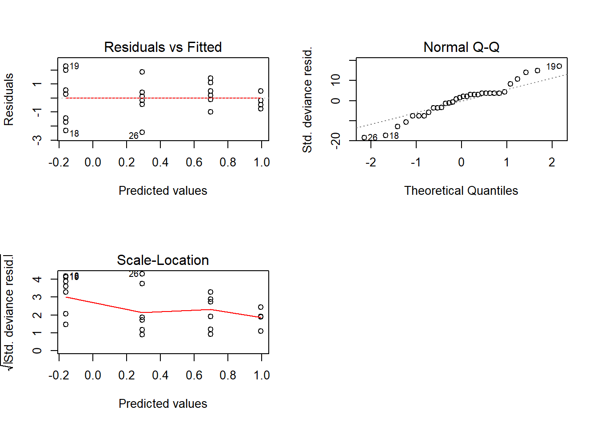
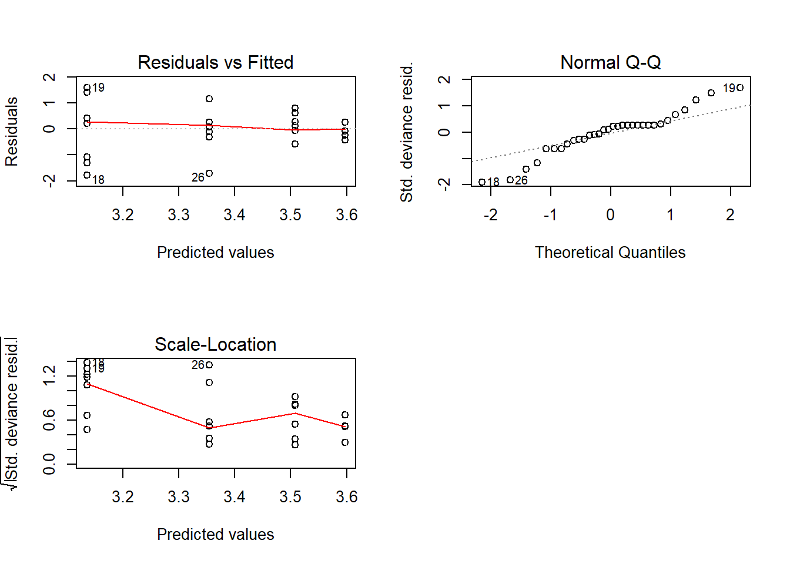
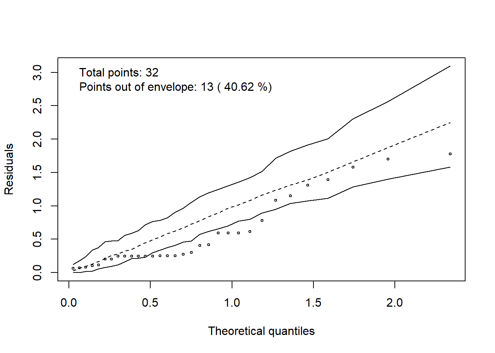
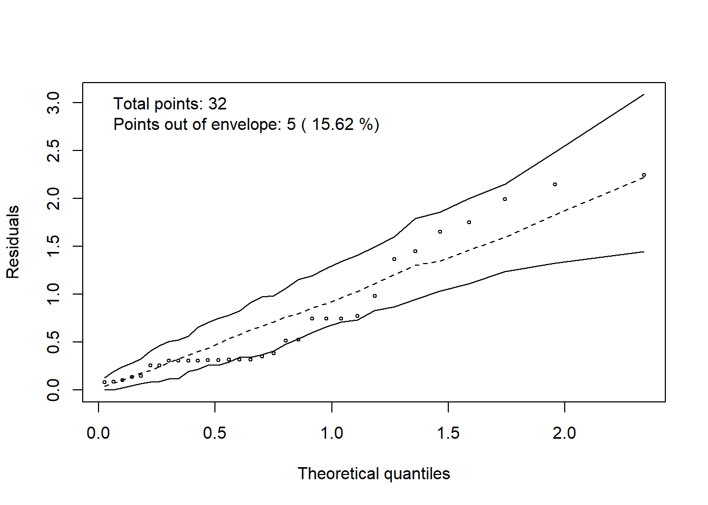
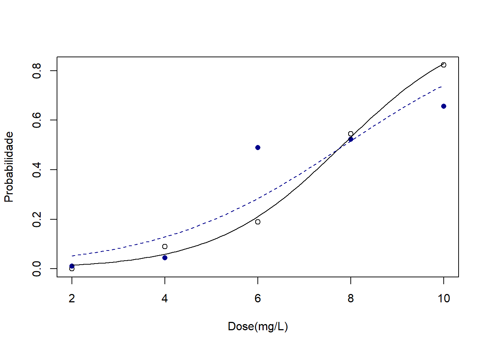

# Modelo linear generalizado

## Conjunto de dados

Considera um conjunto de dados simulados de germinação com oito repetições e quatro tratamento qualitativos. Conforme a regra de análise de sementes, em um teste de germinação é estabelecido a quantidade mínima de 50 sementes por rolo de papel. Logo, sabemos que a quantidade máxima de cada repetição e de 50 sementes.


```r
trat=rep(paste("T",1:4),e=8)
germ=c(33,35,34,30,38,30,37,30,36,38,34,38,38,38,35,35,30,15,31,17,25,24,24,18,27,20,28,35,30,30,30,29)
```

## Modelo linear generalizado

No R, podemos realizar a entrada dos dados de duas formas. Pela proporção ou por dados dicotomizados (Respostas do tipo 0 ou 1).

Nosso exemplo usaremos pela proporção.


```r
modelo=glm(cbind(germ,50-germ)~trat, family=binomial)
```

**Explicação**: `germ` é nossa resposta, ou seja, total de sementes germinadas (ou podemos chamar de total de sucessos na repetição). O valor `50` indica o total de observações na repetição (Deve ser conhecido). `trat` é nossa variável explicativa qualitativa, `binomial` é a distrbuição provável que estamos considerando.

## Análise de deviance


```r
summary(modelo)
```

```
## 
## Call:
## glm(formula = cbind(germ, 50 - germ) ~ trat, family = binomial)
## 
## Deviance Residuals: 
##     Min       1Q   Median       3Q      Max  
## -2.4488  -0.5500   0.2359   0.4838   2.2701  
## 
## Coefficients:
##             Estimate Std. Error z value Pr(>|z|)    
## (Intercept)   0.6969     0.1061   6.566 5.16e-11 ***
## tratT 2       0.2977     0.1548   1.924  0.05437 .  
## tratT 3      -0.8572     0.1460  -5.870 4.36e-09 ***
## tratT 4      -0.4048     0.1466  -2.762  0.00574 ** 
## ---
## Signif. codes:  0 '***' 0.001 '**' 0.01 '*' 0.05 '.' 0.1 ' ' 1
## 
## (Dispersion parameter for binomial family taken to be 1)
## 
##     Null deviance: 108.818  on 31  degrees of freedom
## Residual deviance:  38.676  on 28  degrees of freedom
## AIC: 182.75
## 
## Number of Fisher Scoring iterations: 3
```

```r
anova(modelo, test="Chisq")
```

```
## Analysis of Deviance Table
## 
## Model: binomial, link: logit
## 
## Response: cbind(germ, 50 - germ)
## 
## Terms added sequentially (first to last)
## 
## 
##      Df Deviance Resid. Df Resid. Dev  Pr(>Chi)    
## NULL                    31    108.818              
## trat  3   70.142        28     38.676 3.979e-15 ***
## ---
## Signif. codes:  0 '***' 0.001 '**' 0.01 '*' 0.05 '.' 0.1 ' ' 1
```

## Diagnóstico


```r
par(mfrow=c(2,2))
plot(modelo)
```

```
## hat values (leverages) are all = 0.125
##  and there are no factor predictors; no plot no. 5
```



## Halfnormaplot


```r
hnp::hnp(modelo, print.on=T)
```

```
## Binomial model
```


## Constrastes


```r
library(emmeans)
```

```
## Welcome to emmeans.
## NOTE -- Important change from versions <= 1.41:
##     Indicator predictors are now treated as 2-level factors by default.
##     To revert to old behavior, use emm_options(cov.keep = character(0))
```

```r
media=emmeans(modelo,~trat)
```

## Retornando a função logistica


```r
medfin=regrid(media)
library(multcompView)
library(multcomp)
```

```
## Carregando pacotes exigidos: mvtnorm
```

```
## Carregando pacotes exigidos: survival
```

```
## Carregando pacotes exigidos: TH.data
```

```
## Carregando pacotes exigidos: MASS
```

```
## 
## Attaching package: 'TH.data'
```

```
## The following object is masked from 'package:MASS':
## 
##     geyser
```

```r
cld(medfin, alpha=0.05, Letters=letters, decreasing=FALSE, adjust="tukey")
```

```
##  trat  prob     SE  df asymp.LCL asymp.UCL .group
##  T 3  0.460 0.0249 Inf     0.398     0.522  a    
##  T 4  0.573 0.0247 Inf     0.511     0.634   b   
##  T 1  0.667 0.0236 Inf     0.609     0.726    c  
##  T 2  0.730 0.0222 Inf     0.675     0.785    c  
## 
## Confidence level used: 0.95 
## Conf-level adjustment: sidak method for 4 estimates 
## P value adjustment: tukey method for comparing a family of 4 estimates 
## significance level used: alpha = 0.05
```

## Supondo que não sabemos o total de cada repetição

Nesse caso, vamos optar pela distribuição poisson


```r
modelo=glm(germ~trat, family=poisson)
```

## Análise de deviance


```r
summary(modelo)
```

```
## 
## Call:
## glm(formula = germ ~ trat, family = poisson)
## 
## Deviance Residuals: 
##     Min       1Q   Median       3Q      Max  
## -1.7823  -0.3347   0.1574   0.2550   1.5832  
## 
## Coefficients:
##             Estimate Std. Error z value Pr(>|z|)    
## (Intercept)  3.50781    0.06120  57.318  < 2e-16 ***
## tratT 2      0.08951    0.08468   1.057 0.290496    
## tratT 3     -0.37231    0.09581  -3.886 0.000102 ***
## tratT 4     -0.15353    0.09007  -1.705 0.088274 .  
## ---
## Signif. codes:  0 '***' 0.001 '**' 0.01 '*' 0.05 '.' 0.1 ' ' 1
## 
## (Dispersion parameter for poisson family taken to be 1)
## 
##     Null deviance: 46.061  on 31  degrees of freedom
## Residual deviance: 18.017  on 28  degrees of freedom
## AIC: 193.41
## 
## Number of Fisher Scoring iterations: 4
```

```r
anova(modelo, test="Chisq")
```

```
## Analysis of Deviance Table
## 
## Model: poisson, link: log
## 
## Response: germ
## 
## Terms added sequentially (first to last)
## 
## 
##      Df Deviance Resid. Df Resid. Dev  Pr(>Chi)    
## NULL                    31     46.061              
## trat  3   28.045        28     18.017 3.555e-06 ***
## ---
## Signif. codes:  0 '***' 0.001 '**' 0.01 '*' 0.05 '.' 0.1 ' ' 1
```

## Diagnóstico


```r
par(mfrow=c(2,2))
plot(modelo)
```

```
## hat values (leverages) are all = 0.125
##  and there are no factor predictors; no plot no. 5
```



## Halfnormaplot


```r
hnp::hnp(modelo, print.on=T)
```

```
## Poisson model
```



## Constrastes


```r
library(emmeans)
media=emmeans(modelo,~trat)
```

## Retornando a função logistica


```r
medfin=regrid(media)
library(multcompView)
library(multcomp)
cld(medfin, alpha=0.05, Letters=letters, decreasing=FALSE, adjust="tukey")
```

```
##  trat rate   SE  df asymp.LCL asymp.UCL .group
##  T 3  23.0 1.70 Inf      18.8      27.2  a    
##  T 4  28.6 1.89 Inf      23.9      33.3  ab   
##  T 1  33.4 2.04 Inf      28.3      38.5   bc  
##  T 2  36.5 2.14 Inf      31.2      41.8    c  
## 
## Confidence level used: 0.95 
## Conf-level adjustment: sidak method for 4 estimates 
## P value adjustment: tukey method for comparing a family of 4 estimates 
## significance level used: alpha = 0.05
```

## Analisando sobredispersão


```r
library(AER)
```

```
## Carregando pacotes exigidos: car
```

```
## Carregando pacotes exigidos: carData
```

```
## Carregando pacotes exigidos: lmtest
```

```
## Carregando pacotes exigidos: zoo
```

```
## 
## Attaching package: 'zoo'
```

```
## The following objects are masked from 'package:base':
## 
##     as.Date, as.Date.numeric
```

```
## Carregando pacotes exigidos: sandwich
```

```r
dispersiontest(modelo, trafo=1) 
```

```
## 
## 	Overdispersion test
## 
## data:  modelo
## z = -2.8129, p-value = 0.9975
## alternative hypothesis: true alpha is greater than 0
## sample estimates:
##      alpha 
## -0.4488216
```

```r
## se for menor que 0,01 há sbredispersão, nesse caso usar quasipoisson
```

Caso fosse menor que 0,01 ou 0,05, podemos testar a distribuição quasipoisson. 
Vamos treinar, ainda que não seja necessário.


```r
modelo=glm(germ~trat, family=quasipoisson)
```

## Análise de deviance


```r
summary(modelo)
```

```
## 
## Call:
## glm(formula = germ ~ trat, family = quasipoisson)
## 
## Deviance Residuals: 
##     Min       1Q   Median       3Q      Max  
## -1.7823  -0.3347   0.1574   0.2550   1.5832  
## 
## Coefficients:
##             Estimate Std. Error t value Pr(>|t|)    
## (Intercept)  3.50781    0.04857  72.219  < 2e-16 ***
## tratT 2      0.08951    0.06720   1.332   0.1937    
## tratT 3     -0.37231    0.07604  -4.896 3.69e-05 ***
## tratT 4     -0.15353    0.07148  -2.148   0.0405 *  
## ---
## Signif. codes:  0 '***' 0.001 '**' 0.01 '*' 0.05 '.' 0.1 ' ' 1
## 
## (Dispersion parameter for quasipoisson family taken to be 0.6299182)
## 
##     Null deviance: 46.061  on 31  degrees of freedom
## Residual deviance: 18.017  on 28  degrees of freedom
## AIC: NA
## 
## Number of Fisher Scoring iterations: 4
```

```r
anova(modelo, test="Chisq")
```

```
## Analysis of Deviance Table
## 
## Model: quasipoisson, link: log
## 
## Response: germ
## 
## Terms added sequentially (first to last)
## 
## 
##      Df Deviance Resid. Df Resid. Dev Pr(>Chi)    
## NULL                    31     46.061             
## trat  3   28.045        28     18.017 1.17e-09 ***
## ---
## Signif. codes:  0 '***' 0.001 '**' 0.01 '*' 0.05 '.' 0.1 ' ' 1
```

## Diagnóstico


```r
par(mfrow=c(2,2))
plot(modelo)
```

```
## hat values (leverages) are all = 0.125
##  and there are no factor predictors; no plot no. 5
```


## Halfnormaplot


```r
hnp::hnp(modelo, print.on=T)
```

```
## Quasi-Poisson model
```



## Constrastes


```r
library(emmeans)
media=emmeans(modelo,~trat)
```

## Retornando a função logistica


```r
medfin=regrid(media)
library(multcompView)
library(multcomp)
cld(medfin, alpha=0.05, Letters=letters, decreasing=FALSE, adjust="tukey")
```

```
##  trat rate   SE  df asymp.LCL asymp.UCL .group
##  T 3  23.0 1.35 Inf      19.6      26.4  a    
##  T 4  28.6 1.50 Inf      24.9      32.4   b   
##  T 1  33.4 1.62 Inf      29.3      37.4   bc  
##  T 2  36.5 1.70 Inf      32.3      40.7    c  
## 
## Confidence level used: 0.95 
## Conf-level adjustment: sidak method for 4 estimates 
## P value adjustment: tukey method for comparing a family of 4 estimates 
## significance level used: alpha = 0.05
```

## Distribuição quasibinomial


```r
quasibin<-glm(cbind(germ,50-germ)~trat, family = quasibinomial)
```

## Análise de deviance


```r
summary(modelo)
```

```
## 
## Call:
## glm(formula = germ ~ trat, family = quasipoisson)
## 
## Deviance Residuals: 
##     Min       1Q   Median       3Q      Max  
## -1.7823  -0.3347   0.1574   0.2550   1.5832  
## 
## Coefficients:
##             Estimate Std. Error t value Pr(>|t|)    
## (Intercept)  3.50781    0.04857  72.219  < 2e-16 ***
## tratT 2      0.08951    0.06720   1.332   0.1937    
## tratT 3     -0.37231    0.07604  -4.896 3.69e-05 ***
## tratT 4     -0.15353    0.07148  -2.148   0.0405 *  
## ---
## Signif. codes:  0 '***' 0.001 '**' 0.01 '*' 0.05 '.' 0.1 ' ' 1
## 
## (Dispersion parameter for quasipoisson family taken to be 0.6299182)
## 
##     Null deviance: 46.061  on 31  degrees of freedom
## Residual deviance: 18.017  on 28  degrees of freedom
## AIC: NA
## 
## Number of Fisher Scoring iterations: 4
```

```r
anova(modelo, test="Chisq")
```

```
## Analysis of Deviance Table
## 
## Model: quasipoisson, link: log
## 
## Response: germ
## 
## Terms added sequentially (first to last)
## 
## 
##      Df Deviance Resid. Df Resid. Dev Pr(>Chi)    
## NULL                    31     46.061             
## trat  3   28.045        28     18.017 1.17e-09 ***
## ---
## Signif. codes:  0 '***' 0.001 '**' 0.01 '*' 0.05 '.' 0.1 ' ' 1
```

## Diagnóstico


```r
par(mfrow=c(2,2))
plot(modelo)
```

```
## hat values (leverages) are all = 0.125
##  and there are no factor predictors; no plot no. 5
```


## Halfnormaplot


```r
hnp::hnp(modelo, print.on=T)
```

```
## Quasi-Poisson model
```


## Constrastes


```r
library(emmeans)
media=emmeans(modelo,~trat)
summary(pairs(media), type = "response")
```

```
##  contrast  ratio     SE  df z.ratio p.value
##  T 1 / T 2 0.914 0.0615 Inf -1.332  0.5425 
##  T 1 / T 3 1.451 0.1103 Inf  4.896  <.0001 
##  T 1 / T 4 1.166 0.0833 Inf  2.148  0.1382 
##  T 2 / T 3 1.587 0.1186 Inf  6.182  <.0001 
##  T 2 / T 4 1.275 0.0893 Inf  3.469  0.0029 
##  T 3 / T 4 0.803 0.0631 Inf -2.784  0.0275 
## 
## P value adjustment: tukey method for comparing a family of 4 estimates 
## Tests are performed on the log scale
```

## Retornando a função logistica


```r
medfin=regrid(media)
library(multcompView)
library(multcomp)
cld(medfin, alpha=0.05, Letters=letters, decreasing=FALSE, adjust="tukey")
```

```
##  trat rate   SE  df asymp.LCL asymp.UCL .group
##  T 3  23.0 1.35 Inf      19.6      26.4  a    
##  T 4  28.6 1.50 Inf      24.9      32.4   b   
##  T 1  33.4 1.62 Inf      29.3      37.4   bc  
##  T 2  36.5 1.70 Inf      32.3      40.7    c  
## 
## Confidence level used: 0.95 
## Conf-level adjustment: sidak method for 4 estimates 
## P value adjustment: tukey method for comparing a family of 4 estimates 
## significance level used: alpha = 0.05
```

## Fatorial qualitativo e quantitativo

Supondo um outro exemplo de um experimento em esquema fatorial 2 x 5, em que o primeiro fator e qualitativo e o segundo fator quantitativo com 5 doses (2, 4, 6, 8, 10) e três repetições cada. Total de semenetes e conhecido e o valor e 30.


```r
resp=c(0,0,0,3,3,2,6,6,5,17,18,14,25,26,23,
       0,1,0,1,1,2,15,14,15,15,16,16,20,20,19)
f1=rep(c("T1","T2"),e=15) ## fator qualitativo
d=rep(c(2,4,6,8,10),e=3,2) ## dose como numerico
D=factor(d) ## considerando dose como fator
```

## Modelo

Vamos considerar os dois fatores como qualitativos


```r
bin=glm(cbind(resp,30-resp)~f1*D, family = binomial)
```

## Deviance


```r
summary(bin)
```

```
## 
## Call:
## glm(formula = cbind(resp, 30 - resp) ~ f1 * D, family = binomial)
## 
## Deviance Residuals: 
##     Min       1Q   Median       3Q      Max  
## -0.8532  -0.2951   0.1217   0.1590   0.9375  
## 
## Coefficients:
##             Estimate Std. Error z value Pr(>|z|)
## (Intercept)   -23.14    6757.51  -0.003    0.997
## f1T2           18.65    6757.51   0.003    0.998
## D4             20.81    6757.51   0.003    0.998
## D6             21.68    6757.51   0.003    0.997
## D8             23.31    6757.51   0.003    0.997
## D10            24.67    6757.51   0.004    0.997
## f1T2:D4       -19.39    6757.51  -0.003    0.998
## f1T2:D6       -17.24    6757.51  -0.003    0.998
## f1T2:D8       -18.74    6757.51  -0.003    0.998
## f1T2:D10      -19.54    6757.51  -0.003    0.998
## 
## (Dispersion parameter for binomial family taken to be 1)
## 
##     Null deviance: 397.0255  on 29  degrees of freedom
## Residual deviance:   5.6398  on 20  degrees of freedom
## AIC: 108.6
## 
## Number of Fisher Scoring iterations: 19
```

```r
anova(bin, test="Chisq")
```

```
## Analysis of Deviance Table
## 
## Model: binomial, link: logit
## 
## Response: cbind(resp, 30 - resp)
## 
## Terms added sequentially (first to last)
## 
## 
##      Df Deviance Resid. Df Resid. Dev  Pr(>Chi)    
## NULL                    29     397.03              
## f1    1     0.24        28     396.78    0.6215    
## D     4   363.46        24      33.33 < 2.2e-16 ***
## f1:D  4    27.69        20       5.64 1.443e-05 ***
## ---
## Signif. codes:  0 '***' 0.001 '**' 0.01 '*' 0.05 '.' 0.1 ' ' 1
```

```r
referencia <- ref_grid(bin)
referencia ## Aqui deve aparecer os niveis dos fatores, se dose so aparecer 1, está errado
```

```
## 'emmGrid' object with variables:
##     f1 = T1, T2
##     D = 2, 4, 6, 8, 10
## Transformation: "logit"
```

## Teste de comparação 

Se não fosse um fator quantitativo, podemos fazer assim:


```r
media <- emmeans(bin, ~f1|D)
medfin<-regrid(media)
cld(medfin, alpha=0.05, Letters=letters, adjust="tukey")
```

```
## D = 2:
##  f1   prob       SE  df asymp.LCL asymp.UCL .group
##  T1 0.0000 6.00e-07 Inf -1.40e-06  1.40e-06  a    
##  T2 0.0111 1.10e-02 Inf -1.36e-02  3.58e-02  a    
## 
## D = 4:
##  f1   prob       SE  df asymp.LCL asymp.UCL .group
##  T2 0.0444 2.17e-02 Inf -4.14e-03  9.30e-02  a    
##  T1 0.0889 3.00e-02 Inf  2.18e-02  1.56e-01  a    
## 
## D = 6:
##  f1   prob       SE  df asymp.LCL asymp.UCL .group
##  T1 0.1889 4.13e-02 Inf  9.66e-02  2.81e-01  a    
##  T2 0.4889 5.27e-02 Inf  3.71e-01  6.07e-01   b   
## 
## D = 8:
##  f1   prob       SE  df asymp.LCL asymp.UCL .group
##  T2 0.5222 5.27e-02 Inf  4.04e-01  6.40e-01  a    
##  T1 0.5444 5.25e-02 Inf  4.27e-01  6.62e-01  a    
## 
## D = 10:
##  f1   prob       SE  df asymp.LCL asymp.UCL .group
##  T2 0.6556 5.01e-02 Inf  5.44e-01  7.68e-01  a    
##  T1 0.8222 4.03e-02 Inf  7.32e-01  9.12e-01   b   
## 
## Confidence level used: 0.95 
## Conf-level adjustment: sidak method for 2 estimates 
## significance level used: alpha = 0.05
```

```r
media <- emmeans(bin, ~D|f1)
medfin<-regrid(media)
cld(medfin, alpha=0.05, Letters=letters, adjust="tukey")
```

```
## f1 = T1:
##  D    prob       SE  df asymp.LCL asymp.UCL .group
##  2  0.0000 6.00e-07 Inf -1.60e-06  1.60e-06  a    
##  4  0.0889 3.00e-02 Inf  1.18e-02  1.66e-01   b   
##  6  0.1889 4.13e-02 Inf  8.29e-02  2.95e-01   b   
##  8  0.5444 5.25e-02 Inf  4.10e-01  6.79e-01    c  
##  10 0.8222 4.03e-02 Inf  7.19e-01  9.26e-01     d 
## 
## f1 = T2:
##  D    prob       SE  df asymp.LCL asymp.UCL .group
##  2  0.0111 1.10e-02 Inf -1.73e-02  3.95e-02  a    
##  4  0.0444 2.17e-02 Inf -1.14e-02  1.00e-01  a    
##  6  0.4889 5.27e-02 Inf  3.54e-01  6.24e-01   b   
##  8  0.5222 5.27e-02 Inf  3.87e-01  6.57e-01   b   
##  10 0.6556 5.01e-02 Inf  5.27e-01  7.84e-01   b   
## 
## Confidence level used: 0.95 
## Conf-level adjustment: sidak method for 5 estimates 
## P value adjustment: tukey method for comparing a family of 5 estimates 
## significance level used: alpha = 0.05
```

## Regressão

Como há interação entre os fatores, necessitamos construir duas curvas, vejamos: 

## Dividindo o conjunto de dados


```r
resp1=resp[1:15]  ## resposta de T1, nesse caso as observações de T1 estão na posição de  1 a 15
resp2=resp[16:30] ## resposta de T2, nesse caso as observações de T2 estão na posição de  16 a 30
d=d[1:15] ## cortando dose, nesse caso somente uma vez é necessário
```

## modelo para T1


```r
bin1=glm(cbind(resp1,30-resp1)~d, family = binomial)
summary(bin1)
```

```
## 
## Call:
## glm(formula = cbind(resp1, 30 - resp1) ~ d, family = binomial)
## 
## Deviance Residuals: 
##     Min       1Q   Median       3Q      Max  
## -0.9384  -0.7855  -0.1458   0.4803   0.8687  
## 
## Coefficients:
##             Estimate Std. Error z value Pr(>|z|)    
## (Intercept) -5.66100    0.51900  -10.91   <2e-16 ***
## d            0.72347    0.06751   10.72   <2e-16 ***
## ---
## Signif. codes:  0 '***' 0.001 '**' 0.01 '*' 0.05 '.' 0.1 ' ' 1
## 
## (Dispersion parameter for binomial family taken to be 1)
## 
##     Null deviance: 223.1818  on 14  degrees of freedom
## Residual deviance:   6.8923  on 13  degrees of freedom
## AIC: 50.895
## 
## Number of Fisher Scoring iterations: 4
```

## modelo para T2


```r
bin2=glm(cbind(resp2,30-resp2)~d, family = binomial)
summary(bin2)
```

```
## 
## Call:
## glm(formula = cbind(resp2, 30 - resp2) ~ d, family = binomial)
## 
## Deviance Residuals: 
##     Min       1Q   Median       3Q      Max  
## -1.8205  -1.5467  -0.9111   0.1884   2.4892  
## 
## Coefficients:
##             Estimate Std. Error z value Pr(>|z|)    
## (Intercept) -3.89248    0.37250 -10.449   <2e-16 ***
## d            0.49464    0.05016   9.862   <2e-16 ***
## ---
## Signif. codes:  0 '***' 0.001 '**' 0.01 '*' 0.05 '.' 0.1 ' ' 1
## 
## (Dispersion parameter for binomial family taken to be 1)
## 
##     Null deviance: 173.600  on 14  degrees of freedom
## Residual deviance:  34.827  on 13  degrees of freedom
## AIC: 81.781
## 
## Number of Fisher Scoring iterations: 5
```

## Gráfico

### Calculando vetores


```r
med1=tapply(resp1/30, d, mean)
med2=tapply(resp2/30, d, mean)
DOSE=c(2,4,6,8,10)
```

### Gráfico final


```r
plot(med1~DOSE,xlab="Dose(mg/L)",ylab="Probabilidade")
points(med2~DOSE,pch=16,col="darkblue")
curve(predict(bin1,data.frame(d=x),type="resp"),add=TRUE) ## curva de T1
##points(d,fitted(bin1),pch=20) 
curve(predict(bin2,data.frame(d=x),type="resp"),add=TRUE, lty=2,col="darkblue") ## Curva de T2
```


