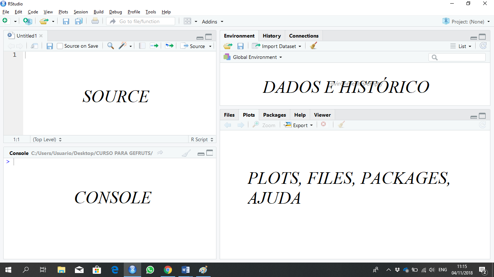
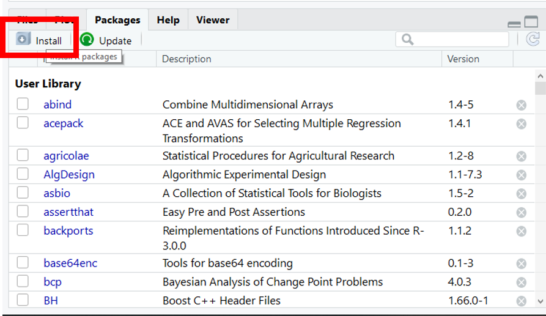
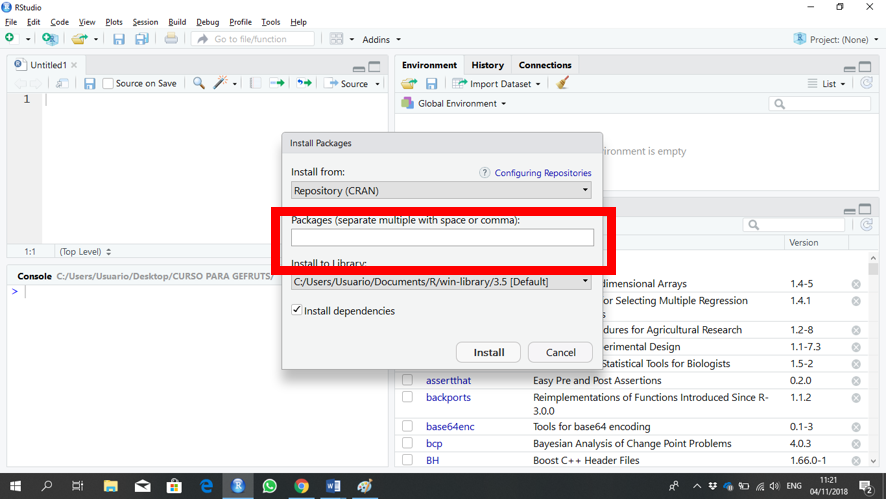
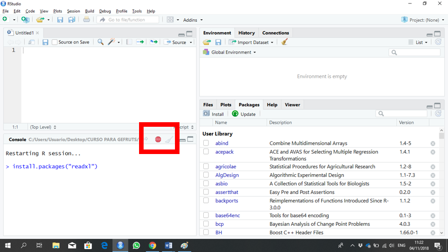

Acessar: https://www.r-project.org/ 
 
Ir em: Download > CRAN

 

Ir em: Universidade Federal do Paraná

 
 
Ir em: Escolher a opção do sistema operacional do computador

  

Ir em: Instalar R pela primeira vez

 

 

[Versões anteriores do R](https://cran.r-project.org/bin/windows/base/old/)

Executar o instalador

## Instalando RStudio

Acessar: https://www.rstudio.com/ 
 
Ir em: Download 

 
Baixar a versão do Rstudio correspondente ao seu sistema operacional

Executar o instalador.

## Primeiros passos

Abra o Rstudio

 
Ambiente Rstudio

 
Source: é seu script (Sempre construir o script aqui, nunca no console)
Console: é a saída
Dados e histórico: é onde está os dados e tudo que foi realizado durante a análise
Plots, files, packages, ajuda: é a saída gráfica, as pastas do diretório atual, os pacotes instalados e a ajuda

## Instalando packages

 

 
Digitar o nome do pacote desejado e depois em “Install”.

 
Toda vez que aparecer o ícone em vermelho, o Rstudio está trabalhando, dessa forma, não executar mais nada até o ícone desaparecer.
 
 

## Chamando pacote no Rstudio

Função: 

`library(nome do pacote)`
`require(nome do pacote)`

nome do pacote::

Ex. library(readxl); require(readxl); readxl::

