--- 
title: "Aplicações práticas do software R para Agronomia"
author: "Gabriel Danilo Shimizu"
date: "2020-05-09"
site: bookdown::bookdown_site
documentclass: book
bibliography: [book.bib, packages.bib]
biblio-style: apalike
link-citations: yes
description: "Este é um ..."
---


# Apresentação


# Estatística Descritiva

<br>

As estatísticas descritivas são números que resumem e descrevem o conjuntos de dados. As estatísticas descritivas apenas "descrevem" os dados, elas não representam generalizações da amostra para a população.

Abaixo, segue alguns comandos do software R e as respectivas explicações das análises. Foi utilizado um conjunto de dados para melhor exemplificação.

****

## Conjunto de Dados

****

Existem várias formas de entrada ou leitura de dados no R. Para um conjunto de dados pequeno, pode-se entrar com as informações diretamente no console do programa. Considere um delineamento 
inteiramente ao acaso com 5 tratamentos e 4 repetições. A entrada dos dados, entre outras, poderia ser da forma:


```r
tratamentos = rep(c(paste("T", sep='', 1:5)), each=4)
resposta = c(100, 120, 110,  90,
             150, 145, 149, 165,
             150, 144, 134, 139,
             220, 206, 211, 210,
             266, 249, 248, 260)
```

<br><br>

****

## Medidas de Tendência Central

****

As medidas de tendência central ou posição são utilizadas para resumir, em um único número, o conjunto de dados observados da variável em estudo. 

Usualmente emprega-se uma das seguintes medidas de posição (ou localização) central: média, mediana ou moda.

<br>

### Média Aritmética Simples

A medida de tendência central mais comumente usada para descrever resumidamente um conjunto de dados, tabelados ou não, é a média aritmética simples, ou simplesmente média e representa-se por $\bar{x}$. é definida como a soma das observações dividida pelo número delas.

Assim, a média amostral é dada por:

$$\overline{x} = \frac{x_1 + \ldots + x_n}{n}, \qquad \mbox{ ou, resumidamente, como } \qquad \overline{x} = \displaystyle \frac {1}{n} \sum_{i=1}^{n} x_i. $$


```r
## Comando básico para o cálculo da média geral
(média = mean(resposta))
```

```
## [1] 173.3
```

Para calcular a média por tratamento, pode-se usar o comando tapply(), que necessita dos seguintes argumentos:
`tapply(vetor de dados, fator, análise)`.

Assim

```r
## Cálculo da média por tratamento
(médias = tapply(resposta, tratamentos, mean))
```

```
##     T1     T2     T3     T4     T5 
## 105.00 152.25 141.75 211.75 255.75
```

<br>

****

### Mediana

****

A mediana, denotada por $Md$, é uma quantidade que, como a média, também procura caracterizar o centro da distribuição de frequências quando os valores são dispostos em ordem crescente ou decrescente de magnitude. 

É o valor que divide o conjunto ordenado de valores em duas partes com igual número de elementos, ou seja, 50\% das observações ficam acima da mediana e 50\% ficam abaixo.

Para calcular a mediana deve-se, em primeiro lugar, ordenar os dados para que se possa localizar a posição da mediana e assim encontrar seu valor. O número que indica a ordem ou posição em que se encontra o valor correspondente à mediana é denominado elemento mediano ($E_{Md}$).

Se o número de observações for impar, a mediana será a observação central. Se o número de observações for par, a mediana será a média aritmática das duas observações centrais.


```r
## Comando básico para o cálculo da mediana
(mediana = median(resposta))
```

```
## [1] 150
```


```r
## Cálculo da mediana por tratamento
(medianas = tapply(resposta, tratamentos, median))
```

```
##    T1    T2    T3    T4    T5 
## 105.0 149.5 141.5 210.5 254.5
```

<br>

****

### Moda

****

A moda de um conjunto de valores é definida como a realização mais frequente do conjunto de valores observados, ou seja, é o valor que apresenta a maior frequência. 

Se dois valores ocorrem com a mesma frequência máxima, cada um deles será a moda, e o conjunto se denomina **bimodal**. 

Se mais de dois valores ocorrem com a mesma frequência máxima, cada um deles é uma moda, e o conjunto é **multimodal**. 

Quando nenhum valor é repetido, o conjunto não tem moda (**amodal**). 

A moda pode ser obtida mesmo que a variável seja **qualitativa**. Os comandos para se determinar a moda são:


```r
tab = table(resposta)
(moda = names(tab)[tab == max(tab)])
```

```
## [1] "150"
```

<br>

****

### Máximo 

****

O maior valor observado no conjunto de dados.


```r
## Comando básico para o cálculo do valor máximo
(máximo = max(resposta))
```

```
## [1] 266
```


```r
## Cálculo do valor máximo para cada tratamento
(máximos = tapply(resposta, tratamentos, max))
```

```
##  T1  T2  T3  T4  T5 
## 120 165 150 220 266
```

<br>

****

### Mínimo

****

O menor valor observado no conjunto de dados.


```r
## Comando básico para valor mínimo
(mínimo = min(resposta))
```

```
## [1] 90
```


```r
## Cálculo do valor mínimo para cada tratamento
(mínimos = tapply(resposta, tratamentos, min))
```

```
##  T1  T2  T3  T4  T5 
##  90 145 134 206 248
```

<br> <br>

****

## Medidas de Dispersão

****

As medidas de dispersão servem para indicar o quanto os dados se apresentam dispersos, ou afastados, em relação ao seu valor médio, por exemplo.

<br>

****

### Amplitude Total

****

A maneira mais simples de se medir a variabilidade de uma variável é através da "distância" entre o maior e o menor valor observado em um conjunto de dados. Essa diferença é a amplitude total, denotada por $A_t$. 

Considere o conjunto de dados ordenado:
$$X_{(1)} \leq X_{(2)} \leq X_{(3)} \leq \cdots \leq X_{(n-1)} \leq X_{(n)}.$$	

A amplitude $A_t$ dos dados é dada por:

$$A_t = X_{(n)} - X_{(1)}$$

```r
(amplitude = max(resposta) - min(resposta))
```

```
## [1] 176
```

```r
# ou
(amplitude = diff(range(resposta)))
```

```
## [1] 176
```

<br>

****

### Variância Amostral

****

A medida de variabilidade mais utilizada é a variância, que é simplesmente a soma dos quadrados dos desvios, dividida pelo total de observações menos um. 

A variância de uma amostra $\left\{x_1, \ldots, x_n \right\}$ de $n$ elementos é definida por:
$$s^2 = \sum_{i=1}^n \frac{(x_i - \overline{x})^2}{n-1} \qquad \mbox{ ou } \qquad s^2 = \frac{1}{n-1} \left[ 
\sum_{i=1}^n x_i^2 - \frac{ \left( \displaystyle \sum_{i=1}^n x_i \right)^2  }{n} \right].$$


```r
## Comando básico para o cálculo da variância amostral
(variância = var(resposta))
```

```
## [1] 3090.747
```


```r
## Cálculo da variância amostral para cada tratamento
(variâncias = tapply(resposta, tratamentos, var))
```

```
##        T1        T2        T3        T4        T5 
## 166.66667  76.91667  46.91667  34.91667  76.25000
```

<br>

Algumas propriedades da variância são:

- somar (ou subtrair) um valor constante e arbitrário $c$ a cada elemento de um conjunto de números não altera a variância;

- multiplicar (ou dividir) por um valor constante e arbitrário $c$ cada elemento de um conjunto de números, a variância fica multiplicada (ou dividida) pelo quadrado da constante.

<br>

****

### Desvio-padrão Amostral

****

Observe que, devido ao fato de se elevar os desvios ao quadrado, a unidade de medida também fica elevada ao quadrado, gerando escalas sem sentido prático. Assim, caso a unidade de mensuração seja metros ($m$), a unidade de medida da variância será $m^2$.

Uma forma de se obter uma medida de dispersão com a mesma unidade de medida dos dados observados é, simplesmente, extrair a raiz quadrada da variância, obtendo-se o desvio padrão. Ele é representado por $s$. Logo,

$$ s = \sqrt{s^2} = \sqrt{\sum_{i=1}^n \frac{(x_i - \overline{x})^2}{n-1}}$$


```r
## Comando básico para Desvio-padrão amostral
(desvio = sd(resposta))
```

```
## [1] 55.59449
```


```r
## Separando por tratamento
(desvios = tapply(resposta, tratamentos, sd))
```

```
##        T1        T2        T3        T4        T5 
## 12.909944  8.770215  6.849574  5.909033  8.732125
```

<br>

****

### Coeficiente de Variação

****

A interpretação do desvio padrão depende da ordem de grandeza da variável em estudo. Assim, um desvio padrão de 10 pode ser insignificante se os valores típicos observados forem muito altos, por exemplo, em torno de 1.000; mas pode ser muito expressivo para um conjunto de dados cuja observação típica seja em torno de 100.

Logo, pode ser conveniente expressar a variabilidade dos dados de uma variável de modo **independente da sua unidade de medida** utilizada, tirando a influência da ordem de grandeza da variável. Tal medida é denominada coeficiente de variação.

O coeficiente de variação de Pearson é a razão entre o desvio padrão e a média. Em geral, o resultado é multiplicado por 100, para que o coeficiente de variação seja expresso em porcentagem. 

É dado por:

$$CV = \dfrac{s} {\overline{x} } \times 100$$


```r
## Comando para o cálculo do Coeficiente de Variação
(CV = sd(resposta) / mean(resposta)*100)
```

```
## [1] 32.07991
```

```r
# ou
(CV = desvio / média * 100)
```

```
## [1] 32.07991
```


```r
## Cálculo do Coeficiente de Variação por tratamento
(CVs = tapply(resposta, tratamentos, sd) / tapply(resposta, tratamentos, mean)*100)
```

```
##        T1        T2        T3        T4        T5 
## 12.295185  5.760404  4.832151  2.790570  3.414320
```

<br>

****

## Gerando uma Tabela com as Estatísticas

****

Pode-se construir uma única tabela com as estatísticas geradas usando-se o comando ``rbind`` ou ``cbind``. Assim,


```r
descritiva = rbind(Média = média,
                   Mediana = mediana,
                   Máximo=max(resposta),
                   Mínimo=min(resposta),
                   Amplitude=amplitude,
                   Variância=variância,
                   "Desvio-padrão"=desvio,
                   "CV(%)"=CV)
colnames(descritiva) = 'Estatísticas'
descritiva
```

```
##               Estatísticas
## Média            173.30000
## Mediana          150.00000
## Máximo           266.00000
## Mínimo            90.00000
## Amplitude        176.00000
## Variância       3090.74737
## Desvio-padrão     55.59449
## CV(%)             32.07991
```

<br>

****

## Gerando as estatísticas por tratamento:

****


```r
# Cálculo das Estatísticas por tratamento

Descritiva = cbind(Médias=round(médias, 1), 
                   Medianas=medianas,
                   Máximos=máximos,
                   Mínimos=mínimos,
                   Amplitudes=máximos - mínimos,
                   Variâncias=round(variâncias, 4), 
                   "Desvios-padrão"=round(desvios, 4), 
                   "CVs(%)"=round(CVs, 1))
Descritiva
```

```
##    Médias Medianas Máximos Mínimos Amplitudes Variâncias Desvios-padrão CVs(%)
## T1  105.0    105.0     120      90         30   166.6667        12.9099   12.3
## T2  152.2    149.5     165     145         20    76.9167         8.7702    5.8
## T3  141.8    141.5     150     134         16    46.9167         6.8496    4.8
## T4  211.8    210.5     220     206         14    34.9167         5.9090    2.8
## T5  255.8    254.5     266     248         18    76.2500         8.7321    3.4
```

# Estatística Experimental

<br><br>

A Estatística Experimental tem por objetivo o estudo dos experimentos, incluindo o planejamento, execução, análise dos dados e interpretação dos resultados obtidos, sendo baseado em três principios básicos: casualização, repetição e controle local.

<br><br>

{width=110%}
[**Fonte**: Exame](https://exame.abril.com.br/ciencia/a-ciencia-por-tras-do-experimento-agricola-mais-longo-da-historia/)

<br><br><br><br>

****

# Delineamento Inteiramente Casualizado

****

<br><br><br><br>

O Delineamento inteiramente casualizado é considerado o delineamento mais simples dentro da estatistica. No DIC as unidades experimentais são destinadas a cada tratamento de uma forma inteiramente casual (sorteio). Os experimentos formulados com este delineamento são denominados "experimentos inteiramente ao acaso".

<br>

O DIC apresenta as seguintes características:

- Considera apenas os princípios de repetição e casulização;
- Os tratamentos são divididos em parcelas de forma inteiramente casual;
- Exige que o material experimental seja semelhante e que as condições de estudo sejam completamentes uniformes;
- Os aspectos que devem ser considerados na semelhança entre as U.E. são aqueles que interferem nas respostas das mesmas aos tratamentos;
- Ele geralmente é mais utilizado em experimentos nos quais as condições experimentais podem ser bastante controladas (por exemplo em laboratórios);

<br>

****

## Vantagens

****

- Delineamento flexível - número de tratamentos e repetições depende apenas da quantidade de parcelas disponíveis

- O número de repetições pode diferir de um tratamento para o outro (experimento não balanceado)

- A análise estatística é simples

- O número de G.L. resíduo é o maior possível

<br>

****

## Desvantagens

****

- Exige homogeneidade das condições ambientais

- Pode estimar uma variância residual muito alta

****

## Modelo matemático para DIC

****

\begin{eqnarray}
y_{ji}=\mu+\tau_i+\varepsilon_{ij}
\end{eqnarray}

$y_{ji}$: é a observação referente ao tratamento i na repetição j;

$\mu$: é a média geral (ou constante comum a todas as observações);

$\tau_i$: é o efeito de tratamento, com $i = 1, 2, . . . , I$;

$\varepsilon_{ij}$: é o erro experimental, tal que $\varepsilon_{ij}$~N(0; $\sigma^2$).

****

## Hipóteses e Modelo 

****

\begin{eqnarray*}
\left\{
\begin{array}{ll}
H_0: & \mu_1 = \mu_2 =\mu_i\\[.2cm]
H_1: & \mu_i \neq \mu_i' \qquad i \neq i'.
\end{array}
\right.
\end{eqnarray*}

CV            | G.L.    |S.Q.         |Q.M.                     |  Fcalc                 | Ftab
-------------:|:-------:|:-----------:|:-----------------------:|:----------------------:|:----------------------------------
Tratamentos   | $a - 1$ | $SQ_{Trat}$ | $\frac{SQ_{Trat}}{a-1}$ | $\frac{QMTrat}{QMRes}$ | $F(\alpha;GL_{Trat} ;GL_{Res})$
resíduo       | $a(b-1)$| $SQ_{Res}$  |$SQRes$                  | -                      |
Total         | $ab-1$  |$SQ_{Total}$ | -                       | -                      |

<center>

**Correção**

$C = \frac{(\sum Y_{ij})^2}{ij}$

**Soma de Quadrados Total**

$SQ_{Total}=\sum Y_{ij}^2-C$

**Soma de Quadrados Tratamento**

$SQ_{Tratamento}=\frac{1}{J}\sum Y_{i}^2-C$

**Soma de Quadrados do resíduo**

$SQ_{Resíduo} = SQ_{Total} - SQ_{Tratamento}$

**Quadrado Médio do Tratamento**

$QM_{Tratamento} = \frac{SQ_{Tratamento}}{GL_{Tratamento}}$

**Quadrado Médio do Resíduo**

$QM_{Resíduo} = \frac{SQ_{Resíduo}}{GL_{Resíduo}}$

**F calculado**

$F_{Calculado}=\frac{QM_{Tratamento}}{QM_{Resíduo}}$

</center>

<br><br>

****

## Croqui para DIC

****

<br>

Criando uma função para fazer um croqui (Número de colunas igual a número de repetições)

<br>


```r
# Não alterar os comandos da função
library(agricolae)
library(gridExtra)
library(grid)
croqui=function(trat,r){
  sort=design.crd(trat,r,serie=0)
  sort$book[,3]=as.factor(matrix(sort$book[,3],r,,T))
  ncol=r
  gs <- lapply(sort$book[,3], function(ii)
    grobTree(rectGrob(gp=gpar(fill=ii, alpha=0.5)),textGrob(ii)))
  grid.arrange(grobs=gs, ncol=ncol)}
```

<br>

Vetor de tratamentos


```r
trat=c("T1","T2","T3","T4")
```

<br>

Usando a função


```r
croqui(trat,r=3)
```

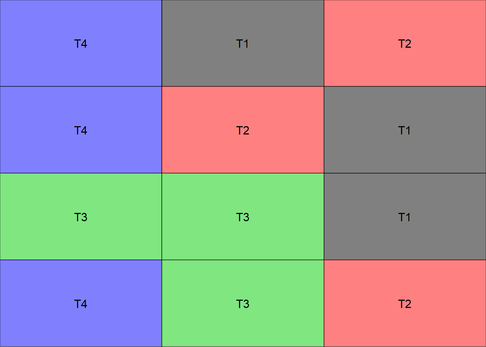

<br>

Criando uma função para fazer um croqui (Número de colunas igual a número de tratamentos)


```r
# Não alterar os comandos da função
library(agricolae)
library(gridExtra)
library(grid)
croqui=function(trat,r){
  sort=design.crd(trat,r,serie=0)
  sort$book[,3]=as.factor(t(matrix(sort$book[,3],r,,T)))
  ncol=length(levels(sort$book[,3]))
  gs <- lapply(sort$book[,3], function(ii)
    grobTree(rectGrob(gp=gpar(fill=ii, alpha=0.5)),textGrob(ii)))
  grid.arrange(grobs=gs, ncol=ncol)}
```

<br>

Vetor de tratamentos


```r
trat=c("T1","T2","T3","T4")
```

<br>

Usando a função


```r
croqui(trat,r=3)
```

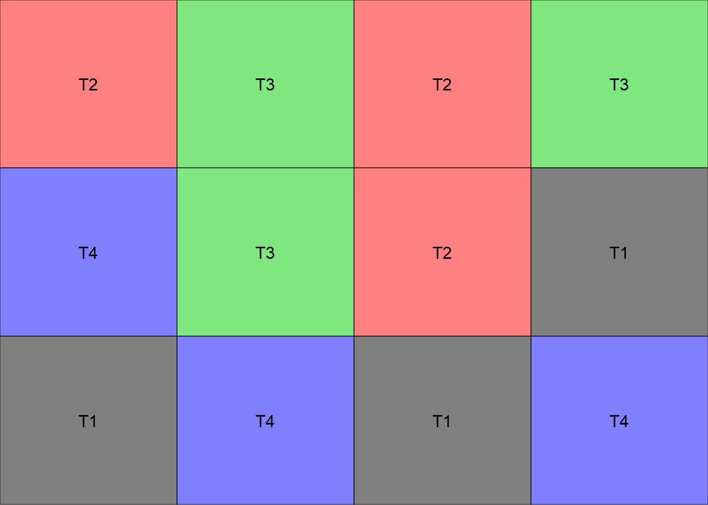

<br><br>

****

## Exemplo 1

****

<br>

Um experimento foi conduzido em Delineamento Inteiramente Casualizado composto por 5 tratamentos em 4 repetições


X1         X2         X3         X4       
---------  ---------  ---------  ---------
T1 (100)   T2 (150)   T1 (110)   T4 (210) 
T3 (150)   T5 (249)   T2 (149)   T3 (139) 
T4 (220)   T1 (120)   T4 (206)   T5 (260) 
T3 (144)   T5 (248)   T3 (134)   T1 (90)  
T5(266)    T2 (145)   T4 (210)   T2 (165) 


```r
tratamentos=rep(c(paste("T",1:5)),e=4)
resposta=c(100,120,110,90,150,145,149,165,150,144,134,139,220,206,210,210,266,249,248,260)
```

<br><br>

## Análise Descritiva


```r
Media=mean(resposta)
Desvio=sd(resposta)
Variancia=var(resposta)
Maximo=max(resposta)
Minimo=min(resposta)
Mediana=median(resposta)
descritiva=cbind(Media,
                 Desvio, 
                 Variancia, 
                 Maximo, 
                 Minimo, 
                 Mediana)
kable(descritiva)
```


  Media     Desvio   Variancia   Maximo   Minimo   Mediana
-------  ---------  ----------  -------  -------  --------
 173.25   55.55924    3086.829      266       90       150

<br><br>

## Por Tratamento


```r
Media=tapply(resposta,tratamentos, mean)
Desvio=tapply(resposta,tratamentos,sd)
Variancia=tapply(resposta,tratamentos, var)
Maximo=tapply(resposta,tratamentos,max)
Minimo=tapply(resposta,tratamentos, min)
Mediana=tapply(resposta,tratamentos,median)
descritiva=cbind(Media,
                 Desvio, 
                 Variancia, 
                 Maximo, 
                 Minimo, 
                 Mediana)
kable(descritiva)
```

        Media      Desvio   Variancia   Maximo   Minimo   Mediana
----  -------  ----------  ----------  -------  -------  --------
T 1    105.00   12.909944   166.66667      120       90     105.0
T 2    152.25    8.770215    76.91667      165      145     149.5
T 3    141.75    6.849574    46.91667      150      134     141.5
T 4    211.50    5.972158    35.66667      220      206     210.0
T 5    255.75    8.732125    76.25000      266      248     254.5


```r
kable(round(descritiva,2), align="l")
```

      Media    Desvio   Variancia   Maximo   Minimo   Mediana 
----  -------  -------  ----------  -------  -------  --------
T 1   105.00   12.91    166.67      120      90       105.0   
T 2   152.25   8.77     76.92       165      145      149.5   
T 3   141.75   6.85     46.92       150      134      141.5   
T 4   211.50   5.97     35.67       220      206      210.0   
T 5   255.75   8.73     76.25       266      248      254.5   

<br><br>

## Gráfico de Caixas (Boxplot)


```r
car::Boxplot(resposta~tratamentos,
             las=1,
             col="lightblue", xlab="",
             ylab=expression("Produtividade"*" "* (Kg*" "*ha^-1)))
points(Media,col="red", pch=8)
```

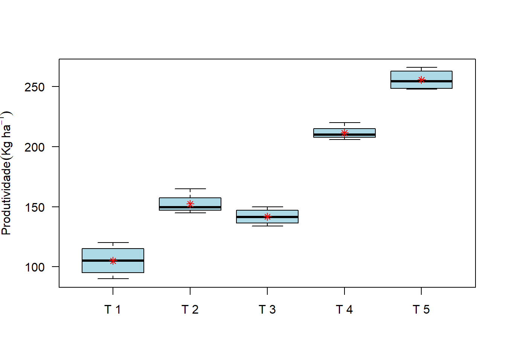

## Análise de Variância

Hipóteses:

\begin{eqnarray*}
\left\{
\begin{array}{ll}
H_0: & \mu_1 = \mu_2 = \mu_3 =\mu_4 =\mu_5\\[.2cm]
H_1: & \mu_i \neq \mu_i' \qquad i \neq i'.
\end{array}
\right.
\end{eqnarray*}

$H_0: \mu_1=\mu_2=\mu_3=\mu_4=\mu_5$\
$H_1: \mu_i\neq\mu'_i \qquad i\neq i'$


```r
modelo=aov(resposta~tratamentos)
anova=anova(modelo)
```


```r
kable(anova, align="l")
```

              Df   Sum Sq     Mean Sq       F value    Pr(>F) 
------------  ---  ---------  ------------  ---------  -------
tratamentos   4    57442.50   14360.62500   178.4298   0      
Residuals     15   1207.25    80.48333                        

Como o p-valor calculado ($p=1.8747417\times 10^{-12}$) é menor que o nível de significância adotado ($\alpha=0,05$), rejeita $H_0$. Logo, ao menos dois tratamentos se diferem entre si.

<br><br>

## Pressuposições da Análise 

<br>

## Normalidade dos erros

\begin{eqnarray*}
\left\{
\begin{array}{ll}
H_0: & \mbox{ Os erros têm distribuição normal} \\[.2cm]
H_1: & \mbox{ Os erros não têm distribuição normal}.
\end{array}
\right.
\end{eqnarray*}


```r
(norm=shapiro.test(modelo$res))
```

```
## 
## 	Shapiro-Wilk normality test
## 
## data:  modelo$res
## W = 0.95788, p-value = 0.5023
```

Como p-valor calculado ($p=0.5023389$) é maior que o nível de significância adotado ($\alpha=0,05$), não se rejeita $H_0$. Logo, os erros seguem distribuição normal.

<br>

## Gráfico de normalidade


```r
HNP=hnp::hnp(modelo, paint.on=T, col="red" , las=1, pch=8)
```


```r
plot(HNP,lty=c(2,3,2),  col=c(2,1,2,1))
```

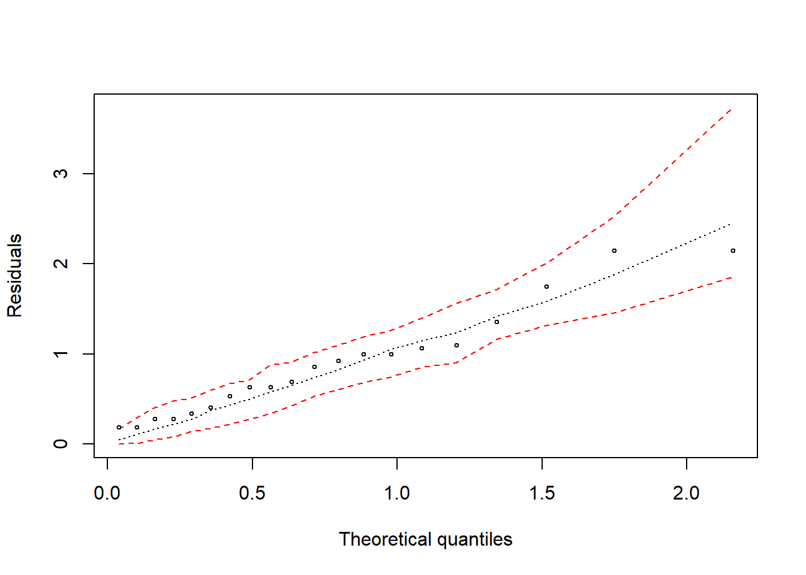

<br><br>

## Homogeneidade de variâncias

\begin{eqnarray*}
\left\{
\begin{array}{ll}
H_0: & \mbox{ As variâncias são homogêneas} \\[.2cm]
H_1: & \mbox{ As variâncias não são homogêneas}.
\end{array}
\right.
\end{eqnarray*}


```r
(homog=bartlett.test(modelo$res~tratamentos))
```

```
## 
## 	Bartlett test of homogeneity of variances
## 
## data:  modelo$res by tratamentos
## Bartlett's K-squared = 1.9189, df = 4, p-value = 0.7507
```

Como p-valor calculado ($p=0.7506686$) é maior que o nível de significância adotado ($\alpha=0,05$), não se rejeita $H_0$. Logo, as variâncias são homogêneas.

<br><br>

## Independências dos erros

\begin{eqnarray*}
\left\{
\begin{array}{ll}
H_0: & \mbox{ Os erros são independentes;} \\[.2cm]
H_1: & \mbox{ Os erros não são independentes.}
\end{array}
\right.
\end{eqnarray*}


```r
library(lmtest)
ind=dwtest(modelo)
```

Como p-valor calculado ($p=0.1738058$) é maior que o nível de significância adotado ($\alpha=0,05$), não se rejeita $H_0$. Logo, os erros são independentes. A Figura \ref{Fig3} apresenta o gráfico dos resíduos brutos. Percebe-se que os resíduos estão distribuídos de forma totalmente aleatório, evidenciando a independência dos erros.


```r
plot(modelo$res, col="blue",
     las=1, pch=16,
     ylab="Residuos brutos")
abline(h=0, col="red", lwd=2)
```


<br><br>

## Teste de Comparação Múltipla


```r
(dados=data.frame(tratamentos,resposta))
mod1=easyanova::ea1(dados, design = 1)
```

```r
tabela=cbind(mod1$Means[1],
      mod1$Means[2], 
      mod1$Means[4])
names(tabela)[1:3]=c("Tratamento","Média","")
tabela
```


```r
kable(tabela, align = "l")
```


Tratamento   Média       
-----------  -------  ---
T 5          255.75   a  
T 4          211.50   b  
T 2          152.25   c  
T 3          141.75   c  
T 1          105.00   d  


```r
tukey=c("d","c","c","b","a")
box=car::Boxplot(resposta~tratamentos,
             las=1,ylim=c(50,300),
             col="lightblue", xlab="",
             ylab=expression("Produtividade"*" "* (Kg*" "*ha^-1)))
points(Media,col="red", pch=8)
text(c(1:5),
     Media+Desvio+10,
     paste(Media,tukey))
```


## Usando o ExpDes.pt


```r
library(ExpDes.pt)
dic(tratamentos, resposta)
```

```
## ------------------------------------------------------------------------
## Quadro da analise de variancia
## ------------------------------------------------------------------------
##            GL    SQ      QM     Fc      Pr>Fc
## Tratamento  4 57442 14360.6 178.43 1.8747e-12
## Residuo    15  1207    80.5                  
## Total      19 58650                          
## ------------------------------------------------------------------------
## CV = 5.18 %
## 
## ------------------------------------------------------------------------
## Teste de normalidade dos residuos 
## Valor-p:  0.5023389 
## De acordo com o teste de Shapiro-Wilk a 5% de significancia, os residuos podem ser considerados normais.
## ------------------------------------------------------------------------
## 
## ------------------------------------------------------------------------
## Teste de homogeneidade de variancia 
## valor-p:  0.7506686 
## De acordo com o teste de bartlett a 5% de significancia, as variancias podem ser consideradas homogeneas.
## ------------------------------------------------------------------------
## 
## Teste de Tukey
## ------------------------------------------------------------------------
## Grupos Tratamentos Medias
## a 	 T 5 	 255.75 
##  b 	 T 4 	 211.5 
##   c 	 T 2 	 152.25 
##   c 	 T 3 	 141.75 
##    d 	 T 1 	 105 
## ------------------------------------------------------------------------
```

<br><br>

## Exemplo 2

**Dados reais de um experimento conduzido na Universidade Estadual de Londrina**


Um experimento foi conduzido com o objetivo de estudar diferentes produtos para redução da perda de massa em pós-colheita de frutos de romã. O experimento foi conduzido em delineamento inteiramente casualizado com quatro repetições.

**Os Tratamentos são**:

- T1: Cera Externo
- T2: Cera Externo + Interno
- T3: Óleo de Laranja Externo
- T4: Óleo de Laranja Interno + Externo
- T5: Hipoclorito de sódio Externo
- T6: Hipoclorito de sódio Interno + Externo

<br>

Os resultados de perda de massa, em porcentagem, foram:

Tratamentos | R1      |R2       |R3       |R4
------------|---------|---------|---------|---------
1           |2.10     |1.90     |1.68     |1.69
2           |1.62     |1.82     |1.73     |1.54
3           |2.62     |2.24     |2.99     |2.62
4           |2.52     |2.21     |2.53     |3.22
5           |2.67     |2.44     |2.78     |2.66
6           |2.17     |2.27     |2.17     |2.04

<br><br>

## Conjunto de dados

<br>


```r
resp=c(2.10,1.90,1.68,1.69,1.62,1.82,1.73,1.54,2.62,2.24,2.99,2.62,
       2.52,2.21,2.53,3.22,2.67,2.44,2.78,2.66,2.17,2.27,2.17,2.04)
trat=as.factor(rep(paste("T",1:6, sep=""),e=4))
```

<br>

## Gráfico de caixas


```r
car::Boxplot(resp~trat)
```

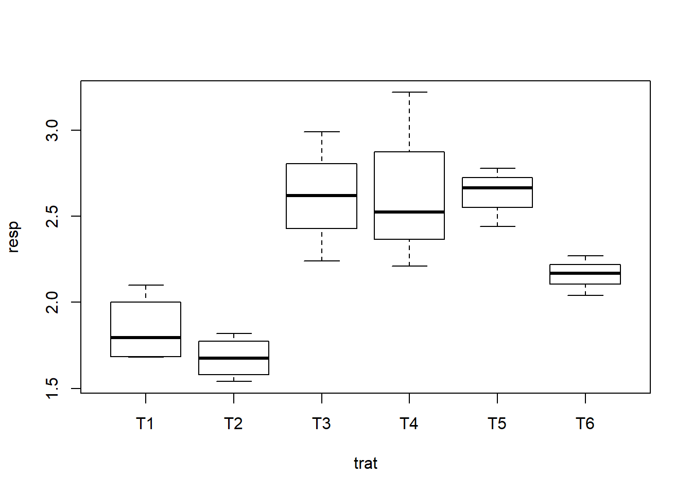

<br><br>

## Histograma


```r
hist(resp)
```


<br><br>

****

## Análise de variância

****

<br>


```r
modelo=aov(resp~trat)
anova(modelo) # Conferir GL
```

```
## Analysis of Variance Table
## 
## Response: resp
##           Df Sum Sq Mean Sq F value    Pr(>F)    
## trat       5 3.6921 0.73842  12.312 2.724e-05 ***
## Residuals 18 1.0796 0.05998                      
## ---
## Signif. codes:  0 '***' 0.001 '**' 0.01 '*' 0.05 '.' 0.1 ' ' 1
```

<br><br>

****

## Pressuposições

****

<br>

## Normalidade dos erros


```r
shapiro.test(modelo$residuals)
```

```
## 
## 	Shapiro-Wilk normality test
## 
## data:  modelo$residuals
## W = 0.94483, p-value = 0.2088
```

Os erros seguem distribuição normal

<br>

## Homogeneidade das variâncias


```r
bartlett.test(modelo$residuals~trat)
```

```
## 
## 	Bartlett test of homogeneity of variances
## 
## data:  modelo$residuals by trat
## Bartlett's K-squared = 8.5683, df = 5, p-value = 0.1276
```

As variâncias são homogêneas

<br>

## Independência dos erros


```r
lmtest::dwtest(modelo)
```

```
## 
## 	Durbin-Watson test
## 
## data:  modelo
## DW = 2.1048, p-value = 0.1924
## alternative hypothesis: true autocorrelation is greater than 0
```

Os erros são independentes.

<br>

## Gráfico de resíduos


```r
a=anova(modelo)
plot(modelo$residuals/sqrt(a$`Mean Sq`[2]), ylab="Resíduos Padronizados")
abline(h=0)
```


<br><br>

****

## Teste de comparação múltipla

****

<br>

### Teste de Comparação Múltipla de Tukey (Utilizando o multcomp)


```r
library(multcomp)
mcomp=glht(modelo, mcp(trat="Tukey"))
plot(mcomp)
```

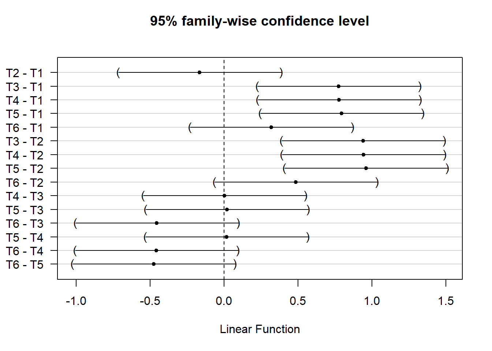

```r
cld(mcomp)
```

```
##   T1   T2   T3   T4   T5   T6 
##  "a"  "a"  "b"  "b"  "b" "ab"
```

<br>

### Teste de Comparação Múltipla de Tukey (Utilizando o TukeyHSD do R)


```r
(tukey=TukeyHSD(modelo))
```

```
##   Tukey multiple comparisons of means
##     95% family-wise confidence level
## 
## Fit: aov(formula = resp ~ trat)
## 
## $trat
##          diff         lwr        upr     p adj
## T2-T1 -0.1650 -0.71534348 0.38534348 0.9268309
## T3-T1  0.7750  0.22465652 1.32534348 0.0033733
## T4-T1  0.7775  0.22715652 1.32784348 0.0032716
## T5-T1  0.7950  0.24465652 1.34534348 0.0026408
## T6-T1  0.3200 -0.23034348 0.87034348 0.4623788
## T3-T2  0.9400  0.38965652 1.49034348 0.0004555
## T4-T2  0.9425  0.39215652 1.49284348 0.0004421
## T5-T2  0.9600  0.40965652 1.51034348 0.0003589
## T6-T2  0.4850 -0.06534348 1.03534348 0.1030235
## T4-T3  0.0025 -0.54784348 0.55284348 1.0000000
## T5-T3  0.0200 -0.53034348 0.57034348 0.9999965
## T6-T3 -0.4550 -1.00534348 0.09534348 0.1409264
## T5-T4  0.0175 -0.53284348 0.56784348 0.9999982
## T6-T4 -0.4575 -1.00784348 0.09284348 0.1373682
## T6-T5 -0.4750 -1.02534348 0.07534348 0.1145358
```

```r
plot(tukey)
```


<br>

### Teste de Comparação Múltipla de Tukey (Utilizando o HSD.test do Agricolae)


```r
library(agricolae)
tukey=HSD.test(modelo,"trat")
plot(tukey)
```

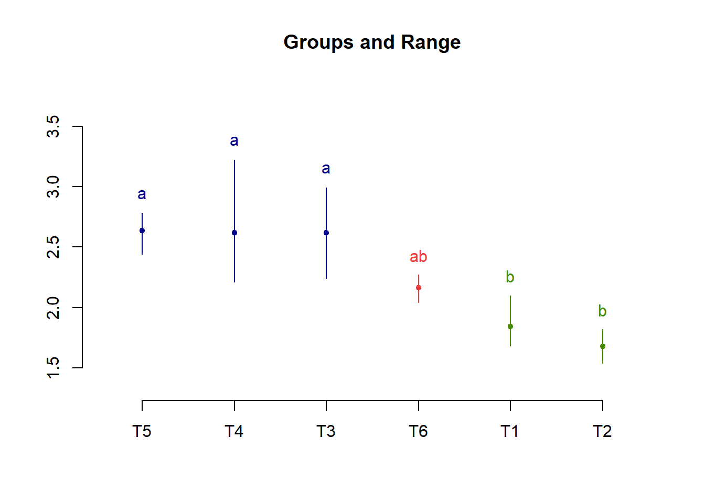

<br>

### Teste de Comparação Múltipla de Tukey (Utilizando o ea1() do pacote easyanova)


```r
library(easyanova)
tukey=ea1(data.frame(trat,resp))
```

```r
cbind(tukey$Means[1],tukey$Means[2],tukey$Means[4])
```

```
##   treatment   mean tukey
## 1        T5 2.6375     a
## 2        T4 2.6200     a
## 3        T3 2.6175     a
## 4        T6 2.1625    ab
## 5        T1 1.8425     b
## 6        T2 1.6775     b
```

<br>

### Teste de Comparação Múltipla de Tukey (Utilizando o dic do pacote ExpDes.pt)


```r
library(ExpDes.pt)
dic(trat,resp)
```

```
## ------------------------------------------------------------------------
## Quadro da analise de variancia
## ------------------------------------------------------------------------
##            GL     SQ      QM     Fc      Pr>Fc
## Tratamento  5 3.6921 0.73842 12.312 2.7235e-05
## Residuo    18 1.0796 0.05998                  
## Total      23 4.7717                          
## ------------------------------------------------------------------------
## CV = 10.84 %
## 
## ------------------------------------------------------------------------
## Teste de normalidade dos residuos 
## Valor-p:  0.2087967 
## De acordo com o teste de Shapiro-Wilk a 5% de significancia, os residuos podem ser considerados normais.
## ------------------------------------------------------------------------
## 
## ------------------------------------------------------------------------
## Teste de homogeneidade de variancia 
## valor-p:  0.1275737 
## De acordo com o teste de bartlett a 5% de significancia, as variancias podem ser consideradas homogeneas.
## ------------------------------------------------------------------------
## 
## Teste de Tukey
## ------------------------------------------------------------------------
## Grupos Tratamentos Medias
## a 	 T5 	 2.6375 
## a 	 T4 	 2.62 
## a 	 T3 	 2.6175 
## ab 	 T6 	 2.1625 
##  b 	 T1 	 1.8425 
##  b 	 T2 	 1.6775 
## ------------------------------------------------------------------------
```

<br>

### Teste de Comparação Múltipla de Tukey (Utilizando o LTukey do pacote laercio)


```r
library(laercio)
LTukey(modelo)
```

```
## 
##  TUKEY TEST TO COMPARE MEANS 
##  
##  Confidence level:  0.95 
##  Dependent variable:  resp
##  Variation Coefficient:  10.83832 % 
##  
## Independent variable:  trat 
##   Factors Means    
##   T5      2.6375 a 
##   T4      2.62   a 
##   T3      2.6175 a 
##   T6      2.1625 ab
##   T1      1.8425  b
##   T2      1.6775  b
## 
## 
```

<br><br>

### Teste de comparação de Duncan (Utilizando o LDuncan do pacote laercio)
 

```r
library(laercio)
LDuncan(modelo,which = "trat")
```

```
## 
##  DUNCAN TEST TO COMPARE MEANS 
##  
##  Confidence Level:  0.95 
##  Dependent Variable:  resp
##  Variation Coefficient:  10.83832 % 
##  
## 
##  Independent Variable:  trat 
##   Factors Means     
##   T5      2.6375 a  
##   T4      2.62   a  
##   T3      2.6175 a  
##   T6      2.1625  b 
##   T1      1.8425  bc
##   T2      1.6775   c
```

<br>

### Teste de comparação de Duncan (Utilizando o dic do pacote ExpDes.pt)
 

```r
library(ExpDes.pt)
dic(trat,resp,mcomp = "duncan")
```

```
## ------------------------------------------------------------------------
## Quadro da analise de variancia
## ------------------------------------------------------------------------
##            GL     SQ      QM     Fc      Pr>Fc
## Tratamento  5 3.6921 0.73842 12.312 2.7235e-05
## Residuo    18 1.0796 0.05998                  
## Total      23 4.7717                          
## ------------------------------------------------------------------------
## CV = 10.84 %
## 
## ------------------------------------------------------------------------
## Teste de normalidade dos residuos 
## Valor-p:  0.2087967 
## De acordo com o teste de Shapiro-Wilk a 5% de significancia, os residuos podem ser considerados normais.
## ------------------------------------------------------------------------
## 
## ------------------------------------------------------------------------
## Teste de homogeneidade de variancia 
## valor-p:  0.1275737 
## De acordo com o teste de bartlett a 5% de significancia, as variancias podem ser consideradas homogeneas.
## ------------------------------------------------------------------------
## 
## Teste de Duncan 
## ------------------------------------------------------------------------
## Grupos  Tratamentos  Medias
## a 	 T5 	     2.6375 
## a 	 T4 	     2.62 
## a 	 T3 	     2.6175 
##  b 	 T6 	     2.1625 
##  bc 	 T1 	     1.8425 
##   c 	 T2 	     1.6775 
## ------------------------------------------------------------------------
```

<br>

### Teste de Agrupamento de Duncan (Utilizando o ea1() do pacote easyanova)


```r
library(easyanova)
tukey=ea1(data.frame(trat,resp))
```

```r
cbind(tukey$Means[1],tukey$Means[2],tukey$Means[6])
```

```
##   treatment   mean duncan
## 1        T5 2.6375      a
## 2        T4 2.6200      a
## 3        T3 2.6175      a
## 4        T6 2.1625      b
## 5        T1 1.8425     bc
## 6        T2 1.6775      c
```

<br>

### Teste de Agrupamento de Scott-Knott (Utilizando o SK do pacote ScottKnott)


```r
library(ScottKnott)
sk <- SK(x=resp, y=resp, model="y~trat", which="trat", sig.level=0.05)
summary(sk)
```

```
##  Levels  Means SK(5%)
##      T5 2.6375      a
##      T4 2.6200      a
##      T3 2.6175      a
##      T6 2.1625      b
##      T1 1.8425      c
##      T2 1.6775      c
```

```r
plot(sk)
box()
```

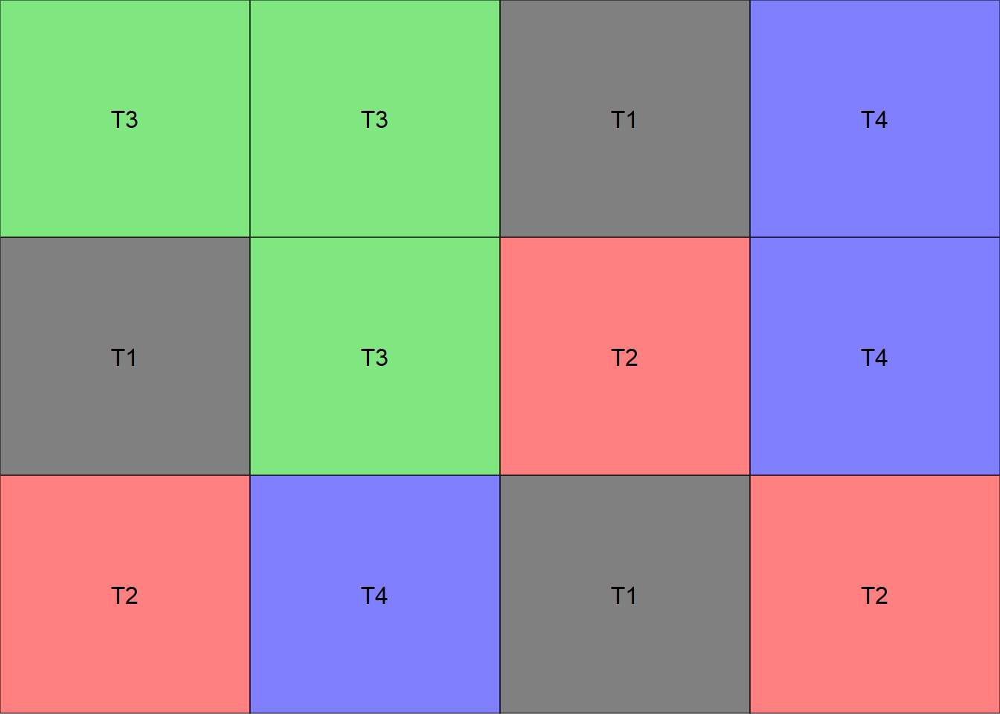

<br>

### Teste de Agrupamento de Scott-Knott (Utilizando o ea1() do pacote easyanova)


```r
library(easyanova)
tukey=ea1(data.frame(trat,resp))
```

```r
cbind(tukey$Means[1],tukey$Means[2],tukey$Means[8])
```

```
##   treatment   mean scott_knott
## 1        T5 2.6375           a
## 2        T4 2.6200           a
## 3        T3 2.6175           a
## 4        T6 2.1625           b
## 5        T1 1.8425           c
## 6        T2 1.6775           c
```

<br>

### Teste de Agrupamento de Scott-Knott (Utilizando o LScottKnott do pacote laercio)


```r
library(laercio)
LScottKnott(modelo,'trat')
```

Obs. O Comando do pacote laercio (Versão 1.0-1) não funciona no Rmarkdown e gera um erro (Problema no scan(), possivelmente o comando do pacote utiliza o scan() para efetuar sua análise e o mesmo não funciona no Rmarkdown a menos que o texto esteja entre aspas).

O Erro gerado é: 

``Error in scan(file = file, what = what, sep = sep, quote = quote, dec = dec,:line 4 did not have 2 elements``


<br><br><br><br>

****

# Transformação de dados

****

<br><br><br><br>

- O modelo de Análise de Variância pressupõe que exista homocedasticidade, ou seja, que os tratamentos apresentem a mesma variabilidade;
- Algumas vezes este pressuposto pode não ser atendido e assim, para corrigir este problema existe uma saída por vezes bastante simples que é a transformação de dados;
- Esta técnica consiste na utilização de um artifício matemático para tornar o modelo de ANOVA válido.

****

## Heterogeneidade Irregular

****

- Ocorre quando alguns tratamentos apresentam maior variabilidade do que outros, contudo, não existe uma associação entre média e variância;

- Neste caso, não há uma transformação matemática que elimine esta variabilidade.

Solução:

* Modelos Lineares Generalizados;

* Análise não paramétrica.

<br>

****

## Heterogeneidade Regular

****

- Acontece quando existe alguma associação entre as médias dos tratamentos e a variância;
- A heterocedasticidade regular está associada é falta de normalidade do erros;

Solução:

* Transformação dos dados;

* Modelos Lineares Generalizados;

* Análise não paramétrica.

<br>

****

## Princípio de transformação

****

<br>

Seja $E(Y) = \mu$ a média de Y e suponha que o desvio padrão de Y é proporcional a potência da média de Y tal que:

<center>

$\sigma Y \alpha \mu^\alpha.$

</center>

O objetivo é encontrar uma transformação de $Y$ que gere uma variância constante.

Suponha que a transformação é uma potência dos dados originais, isto é:

<center>

$Y^*=Y^\lambda$

</center>

Assim, pode ser mostrado que:

<center>

$\sigma Y^* \alpha \mu^{\lambda+ \alpha-1}.$

</center>

Caso $\lambda = 1-\alpha$, então a variância dos dados transformados $Y^*$ é constante, mostrando que **não é necessário transformação**.

Algumas das transformações mais comuns são:

<br>

<center>

| $\lambda$ | Transformação       |
|:-----------:|:---------------------:|
| 1         | Nenhuma             |
| 0,5       | $\sqrt{y}$          |
| 0         | log(y)              |
| -0,5      | $\frac{1}{\sqrt{y}}$ |
| -1        | $\frac{1}{y}$         |

</center>

****

## Seleção Empírica de $\alpha$

****

<br>

Em muitas situações de delineamentos experimentais em que há repetições, pode-se estimar empiricamente $\alpha$ a partir dos dados.

Dado que na i-ésima combinação de tratamentos

<center>

$\sigma Y \alpha \mu^{\alpha}_i =\theta \mu^{\alpha}_i$

</center>

em que $\theta$ é uma constante de proporcionalidade, pode-se aplicar logaritmos para obter:

<center>

$log (\sigma_{Y_i}) = log( \theta) + \alpha log( \mu_{i})$

</center>

Portanto, um gráfico de $log(\sigma_{Y_i})$ versus $log(\mu_i)$ seria uma linha reta com uma inclinação $\alpha$.

Como não se conhece $\sigma_{Y_i}$ e $\mu_i$ , utilizam-se as estimativas $s_i$ e a média $\hat{Y}_i$, respectivamente;

O parâmetro de inclinação da equação linear ajustada é uma estimativa de $\alpha$.

<br>

****

## Transf. de Box & Cox

****

<br>

Box & Cox (1964) mostraram como o parâmetro de transformação $\lambda$ em $Y^* = Y^\lambda$ pode ser estimado simultaneamente com outros parâmetros do modelo (média geral e efeitos de tratamentos) usando o método de máxima verossimilhança. O procedimento consiste em realizar, para vários valores de $\lambda$, uma análise de variância padrão sobre:

$$Y_i(\lambda) = \left\{ \begin{array}{ll} \ln(X_i),~~~~~~\textrm{se $\lambda = 0$,} \\ \\ \dfrac{X_i^{\lambda} - 1}{\lambda},~~~~\textrm{se $\lambda \neq 0$,}\end{array} \right.$$

A estimativa de máxima verossimilhança de $\lambda$ é o valor para o qual a soma de quadrado do resíduo, SQRes($\lambda$), é mínima.

Este valor de $\lambda$ é encontrado através do gráfico de SQRes($\lambda$) *versus* $\lambda$, sendo que $\lambda$ é o valor que minimiza a SQRes($\lambda$).

Ou, ainda, o valor de $\lambda$ que maximiza a função de logverossimilhança.

<br>

Um intervalo de confiança $100(1-\alpha)$% para $\lambda$ pode ser encontrado calculando-se:

<center>

$IC(\lambda) = SQRes(\lambda)(1 \pm \frac{t2^2/2=2;v }{v})$

</center>

em que $v$ é o número de graus de liberdade.

Se o intervalo de confiança incluir o valor $\lambda = 1$, isto quer dizer que não é necessário transformar os dados.

****

## Exemplo 1

****


Vamos considerar os dados adaptados de ZAMBÃO; SAMPAIO; BARBIN, 1982 (Livro Planejamento e Análise Estatística de Experimentos Agronômicos - Décio Barbin) como exemplo, em que o pesquisador pretende comparar quatro cultivares de pêssego quanto ao enraizamento de estacas. Foi utilizado cinco repetições por tratamento e o delineamento experimental foi inteiramente casualizado. 

**Fonte da foto**: Rosa, G.G., 2014 (Pelotas)

<br><br>

Tratamentos | R1      |R2       |R3       |R4       |R5       |TOTAL
------------|---------|---------|---------|---------|---------|---------
A           |02       |02       |01       |01       |00       |06
B           |01       |00       |00       |01       |01       |03
C           |12       |10       |14       |17       |11       |64
D           |07       |09       |15       |08       |10       |49

<br><br> 

## Conjunto de dados


```r
resposta=c(02,02,01,01,00,01,00,00,01,01,12,10,14,17,11,07,09,15,08,10)
cultivar=rep(LETTERS[1:4],e=5)
cultivar=as.factor(cultivar)
```

<br>

## Gráficos exploratórios

<br>

### Gráfico de caixas


```r
car::Boxplot(resposta~cultivar)
```

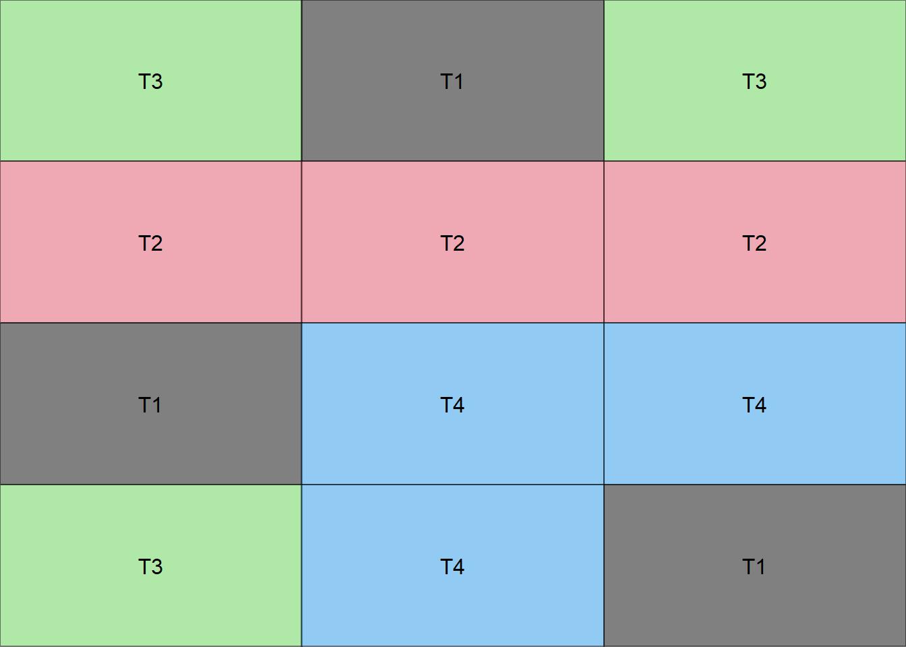

```
## [1] "18"
```

<br>

### Histograma


```r
hist(resposta)
```

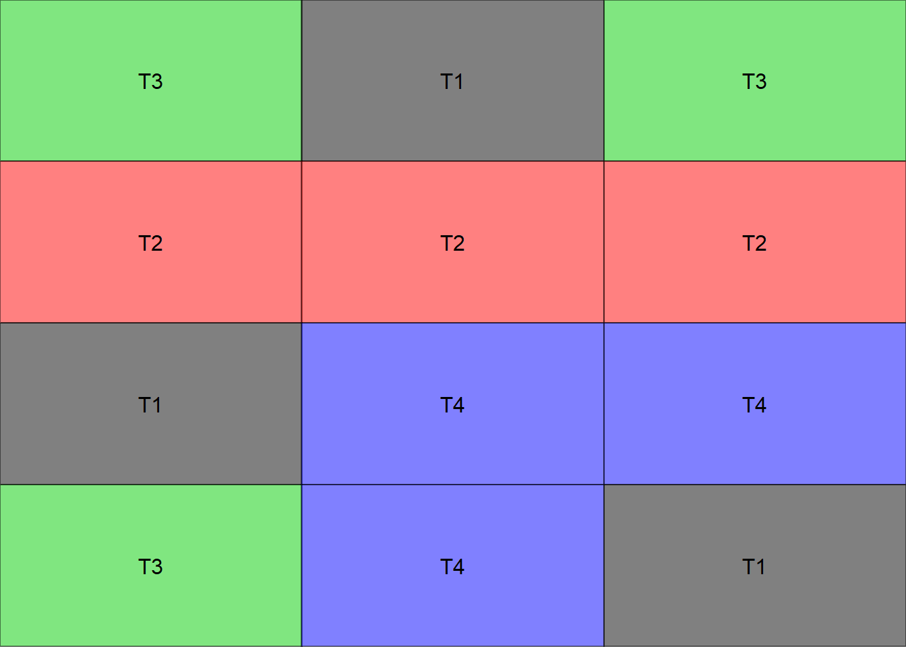

<br>

## Análise de variância


```r
modelo=aov(resposta~cultivar)
anova(modelo) # Conferir GL
```

```
## Analysis of Variance Table
## 
## Response: resposta
##           Df Sum Sq Mean Sq F value    Pr(>F)    
## cultivar   3  564.2  188.07  40.884 9.945e-08 ***
## Residuals 16   73.6    4.60                      
## ---
## Signif. codes:  0 '***' 0.001 '**' 0.01 '*' 0.05 '.' 0.1 ' ' 1
```

<br>

## Pressuposições 

### Normalidade dos erros


```r
shapiro.test(modelo$residuals)
```

```
## 
## 	Shapiro-Wilk normality test
## 
## data:  modelo$residuals
## W = 0.88533, p-value = 0.02209
```

Os erros não seguem distribuição normal

### Homogeneidade das variâncias


```r
bartlett.test(modelo$residuals~cultivar)
```

```
## 
## 	Bartlett test of homogeneity of variances
## 
## data:  modelo$residuals by cultivar
## Bartlett's K-squared = 12.141, df = 3, p-value = 0.006914
```

As variâncias não são homogêneas

<br>

### Independência dos erros


```r
lmtest::dwtest(modelo)
```

```
## 
## 	Durbin-Watson test
## 
## data:  modelo
## DW = 2.269, p-value = 0.4631
## alternative hypothesis: true autocorrelation is greater than 0
```

Os erros são independentes.

<br>

### Gráfico de resíduos padronizados


```r
a=anova(modelo)
plot(modelo$residuals/sqrt(a$`Mean Sq`[2]), ylab="Resíduos Padronizados")
abline(h=0)
```


As pressuposições de normalidade dos erros e homogeneidade das variâncias não foram atendidas. Dessa forma, vamos transformar os dados e conferir novamente as pressuposições!

## Transformação de dados

<br>

### Usando a *package* MASS

<br>

### Usando o comando boxcox e conferindo visualmente um valor aproximado de $\lambda$


```r
# MASS::boxcox(modelo) ## o comando boxcox do pacote MASS não aceita quando ocorre observações 0
# vamos somar uma constante com valor "baixo"
MASS::boxcox(aov(resposta+0.000001~cultivar))
```

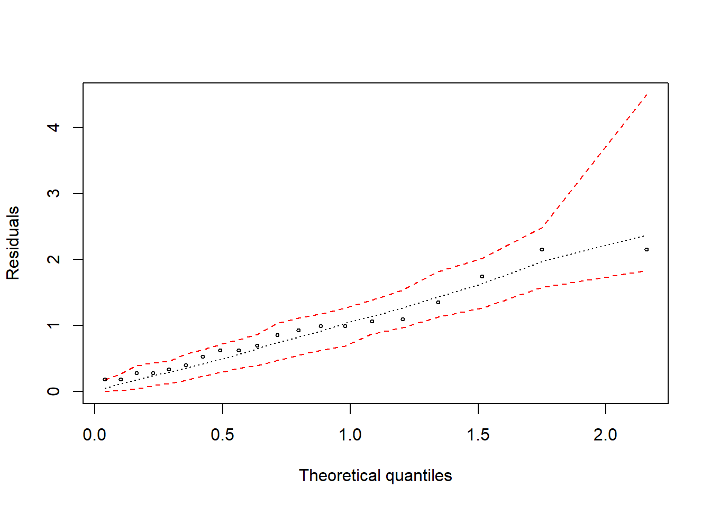

<br>

### Descobrindo o valor exato de $\lambda$


```r
bc=MASS::boxcox(aov(resposta+0.000001~cultivar))
```


```r
bc$x[which.max(bc$y)]
```

```
## [1] 0.4242424
```

A aproximação de $\lambda$ é 0,5 (sqrt(Y))

<br>

## Dados transformados

<br>

### Modelo transformado


```r
modelo=aov(resposta^0.5~cultivar)
#ou
modelo=aov(sqrt(resposta)~cultivar)
```

<br>

### Normalidade dos erros


```r
shapiro.test(modelo$residuals)
```

```
## 
## 	Shapiro-Wilk normality test
## 
## data:  modelo$residuals
## W = 0.96828, p-value = 0.7182
```

Os erros seguem distribuição normal

<br>

### Homogeneidade das variâncias


```r
bartlett.test(modelo$residuals~cultivar)
```

```
## 
## 	Bartlett test of homogeneity of variances
## 
## data:  modelo$residuals by cultivar
## Bartlett's K-squared = 0.71659, df = 3, p-value = 0.8693
```

As variâncias são homogêneas

<br>

### Independência dos erros


```r
lmtest::dwtest(modelo)
```

```
## 
## 	Durbin-Watson test
## 
## data:  modelo
## DW = 2.1575, p-value = 0.3596
## alternative hypothesis: true autocorrelation is greater than 0
```

Os erros são independentes.

<br>

### Gráfico de resíduos padronizados


```r
a=anova(modelo)
plot(modelo$residuals/sqrt(a$`Mean Sq`[2]), ylab="Resíduos Padronizados")
abline(h=0)
```


<br>

## Comparação múltipla

<br>

### Teste de Comparação Múltipla de Tukey (Utilizando o multcomp)


```r
library(multcomp)
mcomp=glht(modelo, mcp(cultivar="Tukey"))
plot(mcomp)
```


```r
cld(mcomp)
```

```
##   A   B   C   D 
## "a" "a" "b" "b"
```

<br>

### Teste de Comparação Múltipla de Tukey (Utilizando o TukeyHSD do R)


```r
(tukey=TukeyHSD(modelo))
```

```
##   Tukey multiple comparisons of means
##     95% family-wise confidence level
## 
## Fit: aov(formula = sqrt(resposta) ~ cultivar)
## 
## $cultivar
##           diff       lwr       upr     p adj
## B-A -0.3656854 -1.271030 0.5396592 0.6619314
## C-A  2.5958680  1.690523 3.5012126 0.0000022
## D-A  2.1362025  1.230858 3.0415471 0.0000252
## C-B  2.9615534  2.056209 3.8668981 0.0000004
## D-B  2.5018879  1.596543 3.4072325 0.0000035
## D-C -0.4596655 -1.365010 0.4456791 0.4869422
```

```r
plot(tukey)
```


<br>

### Teste de Comparação Múltipla de Tukey (Utilizando o HSD.test do Agricolae)


```r
library(agricolae)
tukey=HSD.test(modelo,"cultivar")
plot(tukey)
```


<br>

### Teste de Comparação Múltipla de Tukey (Utilizando o ea1() do pacote easyanova)


```r
library(easyanova)
tukey=ea1(data.frame(cultivar,resposta^0.5))
```

```r
cbind(tukey$Means[1],tukey$Means[2],tukey$Means[4])
```

```
##   treatment   mean tukey
## 1         C 3.5616     a
## 2         D 3.1019     a
## 3         A 0.9657     b
## 4         B 0.6000     b
```

<br>

### Teste de Comparação Múltipla de Tukey (Utilizando o dic do pacote ExpDes.pt)


```r
library(ExpDes.pt)
dic(cultivar,resposta^0.5)
```

```
## ------------------------------------------------------------------------
## Quadro da analise de variancia
## ------------------------------------------------------------------------
##            GL     SQ      QM     Fc      Pr>Fc
## Tratamento  3 33.346 11.1155 44.402 5.5521e-08
## Residuo    16  4.005  0.2503                  
## Total      19 37.352                          
## ------------------------------------------------------------------------
## CV = 24.32 %
## 
## ------------------------------------------------------------------------
## Teste de normalidade dos residuos 
## Valor-p:  0.7181511 
## De acordo com o teste de Shapiro-Wilk a 5% de significancia, os residuos podem ser considerados normais.
## ------------------------------------------------------------------------
## 
## ------------------------------------------------------------------------
## Teste de homogeneidade de variancia 
## valor-p:  0.8692942 
## De acordo com o teste de bartlett a 5% de significancia, as variancias podem ser consideradas homogeneas.
## ------------------------------------------------------------------------
## 
## Teste de Tukey
## ------------------------------------------------------------------------
## Grupos Tratamentos Medias
## a 	 C 	 3.561553 
## a 	 D 	 3.101888 
##  b 	 A 	 0.9656854 
##  b 	 B 	 0.6 
## ------------------------------------------------------------------------
```

<br><br>

****

## Exemplo 2

****

### Conjunto de dados

<br>

Um experimento foi conduzido com o intuito de avaliar a inoculação de *Trichoderma* sp. (T4), *Azospirillum* sp. (T3) e associação de ambos (T2) em relação a testemunha, quanto à altura de plantas de milho. O experimento foi conduzido em delineamento inteiramente casualizado com 8 repetições.

<br>


```r
RESP=c(124,136,124,102,112,108,102,122,
       130,128,118,106,126,106,128,122,
       132,132,190,144,090,126,142,148,
       140,120,118,098,110,140,104,142)
TRAT=rep(c(paste("T",1:4)),e=8)
dados = data.frame(TRAT, RESP)
```

<br><br>

## Estatística descritiva


```r
Média = with(dados, mean(RESP))
Variância = with(dados, var(RESP))
Desvio = with(dados, sd(RESP))
CV = Desvio / Média * 100

desc = cbind(Média, Variância, Desvio, CV)
kable(round(desc,2), align="l")
```


Média    Variância   Desvio   CV    
-------  ----------  -------  ------
124.06   367.09      19.16    15.44 

<br>

### Por Cultivar


```r
Médias = with(dados, tapply(RESP, TRAT, mean))
Variâncias = with(dados, tapply(RESP, TRAT, var))
Desvios = with(dados, tapply(RESP, TRAT, sd))
CV = Desvios / Médias * 100
Desc = cbind(Médias, Variâncias, Desvios, CV)
kable(round(Desc,2),align="l")
```

      Médias   Variâncias   Desvios   CV    
----  -------  -----------  --------  ------
T 1   116.25   147.93       12.16     10.46 
T 2   120.50   94.57        9.72      8.07  
T 3   138.00   768.00       27.71     20.08 
T 4   121.50   301.43       17.36     14.29 

<br><br>

## Gráficos exploratórios

<br>

### Gráfico de Caixas


```r
par(bty='l', mai=c(1, 1, .2, .2))
par(cex=0.7)
caixas=with(dados, car::Boxplot(RESP ~ dados$TRAT, vertical=T,las=1, col='Lightyellow'))
mediab=tapply(RESP, TRAT, mean)
points(mediab, pch='+', cex=1.5, col='red')
```


<br><br>

## Análise de Variância

\begin{eqnarray*}
\left\{
\begin{array}{ll}
H_0: & \mu_1 = \mu_2 = \mu_3 = \cdots = \mu_{15} \\[.2cm]
H_1: & \mu_i \neq \mu_i' \qquad i \neq i'.
\end{array}
\right.
\end{eqnarray*}


```r
mod = with(dados, aov(RESP ~ TRAT))
av=anova(mod)
kable(av, align = "l")
```

            Df   Sum Sq     Mean Sq    F value   Pr(>F)    
----------  ---  ---------  ---------  --------  ----------
TRAT        3    2196.375   732.1250   2.23221   0.1064722 
Residuals   28   9183.500   327.9821                       

<br><br>

## Pressuposições

<br>

### Normalidade dos erros

\begin{eqnarray*}
\left\{
\begin{array}{ll}
H_0: & \mbox{Os erros seguem distribuição normal}\\[.2cm]
H_1: & \mbox{Os erros não seguem distribuição normal}.
\end{array}
\right.
\end{eqnarray*}


```r
(norm=shapiro.test(mod$res))
```

```
## 
## 	Shapiro-Wilk normality test
## 
## data:  mod$res
## W = 0.94078, p-value = 0.07878
```

Como p-valor calculado ($p=0,07878$) é maior que o nível de significância adotado ($p=0,05$), não se rejeita $H_0$. Logo, os erros seguem distribuição normal.


```r
hnp::hnp(mod, las=1, xlab="Quantis teóricos", pch=16)
```

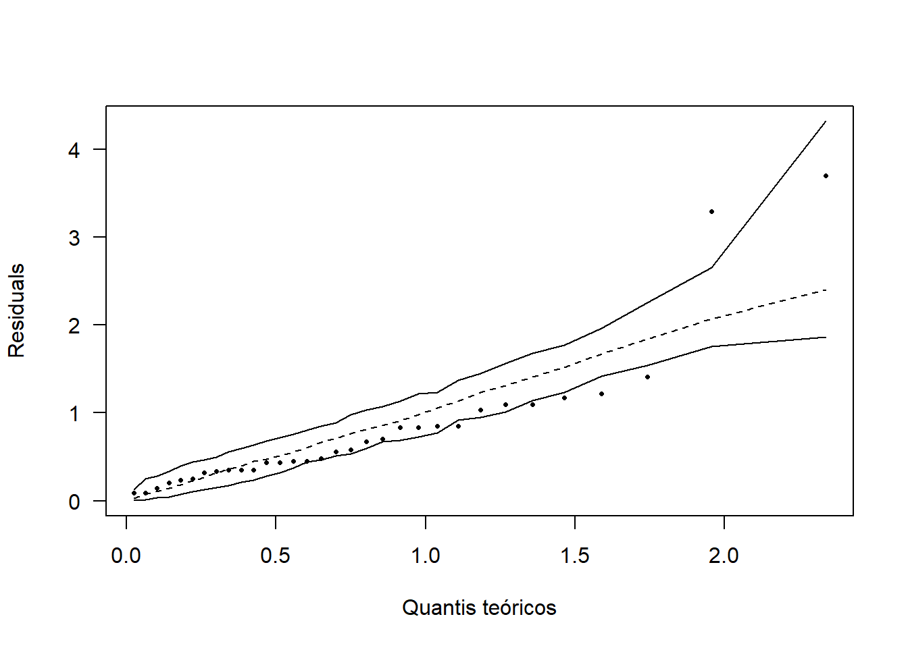

<br>

### Homogeneidade de variâncias

\begin{eqnarray*}
\left\{
\begin{array}{ll}
H_0: & \mbox{ As variâncias são homogêneas}\\[.2cm]
H_1: & \mbox{ As variâncias não são homogêneas}.
\end{array}
\right.
\end{eqnarray*}


```r
(homog=with(dados, bartlett.test(mod$res ~ TRAT)))
```

```
## 
## 	Bartlett test of homogeneity of variances
## 
## data:  mod$res by TRAT
## Bartlett's K-squared = 8.4132, df = 3, p-value = 0.0382
```

Como p-valor ($p=0,0382$) é menor que o nível de significância adotado ($p=0,05$). Rejeita-se $H_0$, logo, as variâncias dos erros não são homogêneas.

<br>

## Transformação de dados


```r
library(MASS)
bc=boxcox(mod)
```

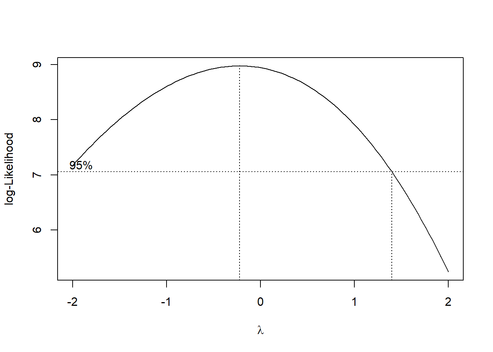

```r
bc$x[which.max(bc$y)]
```

```
## [1] -0.2222222
```

O valor de $\lambda$ para a Transformação Box-Cox é -0,22222. Nesse sentido, vamos usar a aproximação. Logo, iremos usar a Transformação Log

<br>

### Transformação log

### Modelo com dados transformados

Devemos testar novamente as pressuposições após a Transformação!!!


```r
modelo=aov(log(RESP)~TRAT)
anova(modelo)
```

```
## Analysis of Variance Table
## 
## Response: log(RESP)
##           Df  Sum Sq  Mean Sq F value Pr(>F)
## TRAT       3 0.11275 0.037583  1.8407 0.1627
## Residuals 28 0.57170 0.020418
```

Como p-valor da análise de variância ($p=0,1627$) é maior que o nível de significância adotado, não se rejeita $H_0$. Logo, não há evidências de diferença entre os tratamentos.

<br>

### Normalidade dos erros


```r
shapiro.test(modelo$residuals)
```

```
## 
## 	Shapiro-Wilk normality test
## 
## data:  modelo$residuals
## W = 0.95442, p-value = 0.1922
```

<br>

### Homogeneidade das variâncias


```r
bartlett.test(modelo$residuals~TRAT)
```

```
## 
## 	Bartlett test of homogeneity of variances
## 
## data:  modelo$residuals by TRAT
## Bartlett's K-squared = 6.2678, df = 3, p-value = 0.09928
```

<br>

### Independências dos erros


```r
lmtest::dwtest(modelo)
```

```
## 
## 	Durbin-Watson test
## 
## data:  modelo
## DW = 1.9204, p-value = 0.216
## alternative hypothesis: true autocorrelation is greater than 0
```

<br>

### Usando os pacotes easyanova e ExpDes.pt
 

```r
dados=data.frame(TRAT,log(RESP))
easyanova::ea1(dados, design=1, plot=2)
```

```
## $`Analysis of variance`
##            df type I SS mean square F value    p>F
## treatments  3    0.1127      0.0376  1.8407 0.1627
## Residuals  28    0.5717      0.0204       -      -
## 
## $Means
##   treatment   mean standard.error tukey snk duncan  t scott_knott
## 1       T 3 4.9089         0.0505     a   a      a  a           a
## 2       T 4 4.7909         0.0505     a   a      a ab           a
## 3       T 2 4.7887         0.0505     a   a      a ab           a
## 4       T 1 4.7510         0.0505     a   a      a  b           a
## 
## $`Multiple comparison test`
##        pair contrast p(tukey) p(snk) p(duncan)   p(t)
## 1 T 3 - T 4   0.1180   0.3671 0.1097    0.1097 0.1097
## 2 T 3 - T 2   0.1202   0.3512 0.2293    0.1221 0.1035
## 3 T 3 - T 1   0.1579   0.1449 0.1449    0.0509 0.0354
## 4 T 4 - T 2   0.0022   1.0000 0.9756    0.9756 0.9756
## 5 T 4 - T 1   0.0399   0.9434 0.8429    0.6036 0.5808
## 6 T 2 - T 1   0.0377   0.9516 0.6017    0.6017 0.6017
## 
## $`Residual analysis`
## $`Residual analysis`$`residual analysis`
##                               values
## p.value Shapiro-Wilk test     0.1922
## p.value Bartlett test         0.0993
## coefficient of variation (%)  2.9700
## first value most discrepant  21.0000
## second value most discrepant 19.0000
## third value most discrepant  28.0000
## 
## $`Residual analysis`$residuals
##            1            2            3            4            5            6 
##  0.069304717  0.161678037  0.069304717 -0.126004035 -0.032477977 -0.068845621 
##            7            8            9           10           11           12 
## -0.126004035  0.053044196  0.078851858  0.063347671 -0.017997968 -0.125243499 
##           13           14           15           16           17           18 
##  0.047599314 -0.125243499  0.063347671  0.015338452 -0.026144593 -0.026144593 
##           19           20           21           22           23           24 
##  0.338077556  0.060866784 -0.409136845 -0.072664609  0.046880542  0.088265758 
##           25           26           27           28           29           30 
##  0.150751546 -0.003399134 -0.020206252 -0.205923398 -0.090410511  0.150751546 
##           31           32 
## -0.146499978  0.164936181 
## 
## $`Residual analysis`$`standardized residuals`
##           1           2           3           4           5           6 
##  0.51034208  1.19055541  0.51034208 -0.92786125 -0.23915946 -0.50696142 
##           7           8           9          10          11          12 
## -0.92786125  0.39060380  0.58064476  0.46647593 -0.13253240 -0.92226086 
##          13          14          15          16          17          18 
##  0.35050909 -0.92226086  0.46647593  0.11294841 -0.19252205 -0.19252205 
##          19          20          21          22          23          24 
##  2.48951602  0.44820731 -3.01277832 -0.53508346  0.34521623  0.64996630 
##          25          26          27          28          29          30 
##  1.11009554 -0.02503035 -0.14879364 -1.51636685 -0.66575971  1.11009554 
##          31          32 
## -1.07878809  1.21454754
```


```r
library(ExpDes.pt)
with(dados,dic(TRAT,log(RESP), mcomp="tukey"))
```

```
## ------------------------------------------------------------------------
## Quadro da analise de variancia
## ------------------------------------------------------------------------
##            GL      SQ       QM     Fc  Pr>Fc
## Tratamento  3 0.11275 0.037583 1.8407 0.1627
## Residuo    28 0.57170 0.020418              
## Total      31 0.68444                       
## ------------------------------------------------------------------------
## CV = 2.97 %
## 
## ------------------------------------------------------------------------
## Teste de normalidade dos residuos 
## Valor-p:  0.1921639 
## De acordo com o teste de Shapiro-Wilk a 5% de significancia, os residuos podem ser considerados normais.
## ------------------------------------------------------------------------
## 
## ------------------------------------------------------------------------
## Teste de homogeneidade de variancia 
## valor-p:  0.09928479 
## De acordo com o teste de bartlett a 5% de significancia, as variancias podem ser consideradas homogeneas.
## ------------------------------------------------------------------------
## 
## De acordo com o teste F, as medias nao podem ser consideradas diferentes.
## ------------------------------------------------------------------------
##   Niveis   Medias
## 1    T 1 4.750977
## 2    T 2 4.788683
## 3    T 3 4.908947
## 4    T 4 4.790891
## ------------------------------------------------------------------------
```

<br><br><br><br>

****

# Delineamento em Blocos Casualizados

****

<br><br><br><br>

- O delineamento em blocos ao acaso ou o delineamento em blocos casualizados são aqueles que levam em consideração os 3 princípios básicos da experimentação;
- O controle local é feito na sua forma mais simples e é chamado de blocos;
- Sempre que não houver homogeneidade das condições experimentais, deve-se utilizar o princípio do controle local;
- Estabelece-se, então, sub-ambientes homogêneos (blocos) e instalando, em cada um deles, todos os tratamentos, igualmente repetidos;
- Nessas condições, o delineamento em blocos casualizados é mais eficiente que o inteiramente ao acaso e, essa eficiência depende da uniformidade das parcelas de cada bloco;
- Pode-se haver diferenças bem acentuadas de um bloco para outro.
- O número de blocos e de repetições coincide apenas quando os tratamentos ocorrem uma única vez em cada bloco.

<br><br>

****

## Vantagens

****

<br>

- Controla as diferenças que ocorrem nas condições ambientais, de um bloco para outro;
- Conduz a uma estimativa mais exata para a variância residual, uma vez que a variação ambiental entre blocos é isolada.

****

## Desvantagens

****

<br>

- Pela utilização do princípio do controle local, há uma redução no número de graus de liberdade do resíduo;
- Exigência de homogeneidade das parcelas dentro de cada bloco limita o número de tratamentos, que não pode ser muito elevado.

<br>

****

## Modelo matemático 

****

<br>

\begin{eqnarray}
y_{ji}=\mu+\tau_i+\beta_j+\varepsilon_{ij}
\end{eqnarray}

$y_{ji}$: é a observação referente ao tratamento i no bloco j;

$\mu$: é a média geral (ou constante comum a todas as observações);

$\tau_i$: é o efeito de tratamento, com $i = 1, 2, . . . , I$;

$\beta_j$: é o efeito do bloco;

$\varepsilon_{ij}$: é o erro experimental, tal que $\varepsilon_{ij}$~N(0; $\sigma^2$).

****

## Hipóteses e Modelo 

****

\begin{eqnarray*}
\left\{
\begin{array}{ll}
H_0: & \mu_1 = \mu_2 =\mu_i\\[.2cm]
H_1: & \mu_i \neq \mu_i' \qquad i \neq i'.
\end{array}
\right.
\end{eqnarray*}

CV            | G.L.    |S.Q.         |Q.M.                     |  Fcalc                 | Ftab
--------------:|:---------:|:-------------:|:-------------------------:|:------------------------:|:----------------------------------
Tratamentos   | $a - 1$ | $SQ_{Trat}$ | $\frac{SQ_{Trat}}{a-1}$ | $\frac{QMTrat}{QMRes}$ | $F(\alpha;GL_{Trat} ;GL_{Res})$
Blocos        | $b-1$   | $Sq_{Blocos}$|$\frac{SQ_{Blocos}}{b-1}$|$\frac{QM_{bloco}}{QM_{Res}}$ | $F(\alpha;GL_{bloco} ;GL_{Res})$
resíduo       | $(a-1)(b-1)$| $SQ_{Res}$  |$\frac{SQRes}{(a-1)(b-1)}$                  | -                      |
Total         | $ab-1$  |$SQ_{Total}$ | -                       | -                      |

<br>

## Croqui 

<br>

Criando uma função para fazer um croqui (Bloco em coluna)


```r
# Não alterar os comandos da função
library(agricolae)
library(gridExtra)
library(grid)
croqui=function(trat,r){
  sort=design.rcbd(trat,r,serie=0)
  sort$book[,3]=as.factor(matrix(sort$book[,3],r,,T))
  ncol=r
  gs <- lapply(sort$book[,3], function(ii)
    grobTree(rectGrob(gp=gpar(fill=ii, alpha=0.5)),textGrob(ii)))
  grid.arrange(grobs=gs, ncol=ncol)}
```

<br>

Vetor de tratamentos


```r
trat=c("T1","T2","T3","T4")
```

<br>

Usando a função


```r
croqui(trat,r=3)
```


<br>

Criando uma função para fazer um croqui (Bloco em linha)


```r
# Não alterar os comandos da função
library(agricolae)
library(gridExtra)
library(grid)
croqui=function(trat,r){
  sort=design.rcbd(trat,r,serie=0)
  sort$book[,3]=as.factor(t(matrix(sort$book[,3],r,,T)))
  ncol=length(levels(sort$book[,3]))
  gs <- lapply(sort$book[,3], function(ii)
    grobTree(rectGrob(gp=gpar(fill=ii, alpha=0.5)),textGrob(ii)))
  grid.arrange(grobs=gs, ncol=ncol)}
```

<br>

Vetor de tratamentos


```r
trat=c("T1","T2","T3","T4")
```

<br>

Usando a função


```r
croqui(trat,r=3)
```

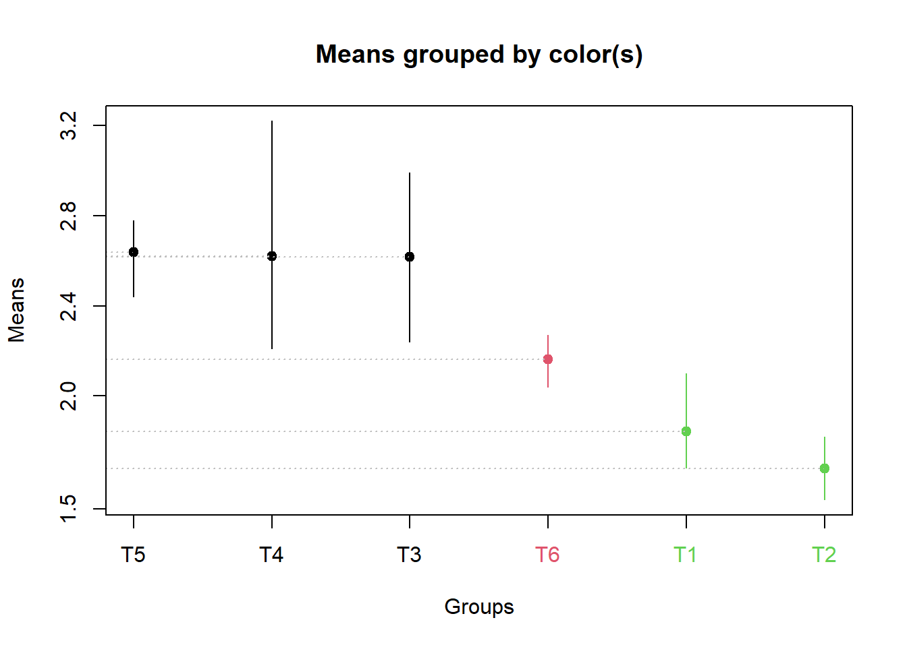

<br><br>

****

## Exemplo 1

****

<br>

**Exemplo do Livro Planejamento e Análise Estatística de Experimentos Agronômicos (2013) - Décio Barbin - pg. 72**


Um experimento foi conduzido com o objetivo de estudar o comportamento de nove porta-enxertos para a laranjeira Valência. 

Os porta-enxertos são:

- T1: Tangerina Sunki
- T2: Limão rugoso Nacional
- T3: Limão rugoso da Flórida
- T4: Tangerina Cleópatra
- T5: Citranger-troyer
- T6: Trifoliata
- T7: Tangerina Cravo
- T8: Laranja caipira
- T9: Limão Cravo

**Delineamento experimental**: Blocos casualizados.

**Repetições/Tratamento**: 3 repetições

<br>

Croqui experimental é apresentado abaixo:

Bloco |     |     |     |     |     |     |     |     |
------|-----|-----|-----|-----|-----|-----|-----|-----|-----
B1    |T3   |T1   |T4   |T8   |T6   |T7   |T2   |T9   |T5
B2    |T7   |T3   |T9   |T4   |T2   |T5   |T1   |T6   |T8
B3    |T8   |T6   |T2   |T1   |T7   |T9   |T3   |T4   |T5

Para o ano de 1973 (Plantas com 12 anos de idade), os resultados de produção, em número médio de frutos por planta, foram:

Tratamentos | B1      |B2       |B3       |Total
------------|---------|---------|---------|---------
1           |145      |155      |166      |466
2           |200      |190      |190      |580
3           |183      |186      |208      |577
4           |190      |175      |186      |551
5           |180      |160      |156      |496
6           |130      |160      |130      |420
7           |206      |165      |170      |541
8           |250      |271      |230      |751
9           |164      |190      |193      |547
Total       |1648     |1652     |1629     |4929

<br>

### Conjunto de dados


```r
resposta=c(145,155,166,
           200,190,190,
           183,186,208,
           190,175,186,
           180,160,156,
           130,160,130,
           206,165,170,
           250,271,230,
           164,190,193)
cultivar=rep(c(paste("T",1:9)),e=3)
cultivar=as.factor(cultivar)
bloco=as.factor(rep(c(paste("B",1:3)),9))
```

<br><br>

## Gráficos exploratórios

<br>

### Gráfico de caixas


```r
car::Boxplot(resposta~cultivar)
```


<br>

### Histograma


```r
hist(resposta)
```


<br>

## Análise de variância


```r
modelo=aov(resposta~cultivar+bloco)
anova(modelo) # Conferir GL
```

```
## Analysis of Variance Table
## 
## Response: resposta
##           Df  Sum Sq Mean Sq F value    Pr(>F)    
## cultivar   8 22981.3 2872.67 11.4114 2.637e-05 ***
## bloco      2    33.6   16.78  0.0666    0.9358    
## Residuals 16  4027.8  251.74                      
## ---
## Signif. codes:  0 '***' 0.001 '**' 0.01 '*' 0.05 '.' 0.1 ' ' 1
```

<br><br>

## Pressuposições

<br>

### Normalidade dos erros


```r
shapiro.test(modelo$residuals)
```

```
## 
## 	Shapiro-Wilk normality test
## 
## data:  modelo$residuals
## W = 0.94759, p-value = 0.1873
```

Os erros seguem distribuição normal

<br>

### Homogeneidade das variâncias


```r
bartlett.test(modelo$residuals~cultivar)
```

```
## 
## 	Bartlett test of homogeneity of variances
## 
## data:  modelo$residuals by cultivar
## Bartlett's K-squared = 4.0369, df = 8, p-value = 0.8538
```

As variâncias são homogêneas

<br>

### Independência dos erros


```r
lmtest::dwtest(modelo)
```

```
## 
## 	Durbin-Watson test
## 
## data:  modelo
## DW = 2.3246, p-value = 0.2484
## alternative hypothesis: true autocorrelation is greater than 0
```

Os erros são independentes.

<br>

### Teste de Aditividade de Tukey


```r
library(asbio)
tukey.add.test(resposta,cultivar,bloco)
```

```
## 
## Tukey's one df test for additivity 
## F = 0.6866169   Denom df = 15    p-value = 0.4203076
```

<br>

### Gráfico de resíduos padronizados


```r
a=anova(modelo)
plot(modelo$residuals/sqrt(a$`Mean Sq`[3]), ylab="Resíduos Padronizados")
abline(h=0)
```

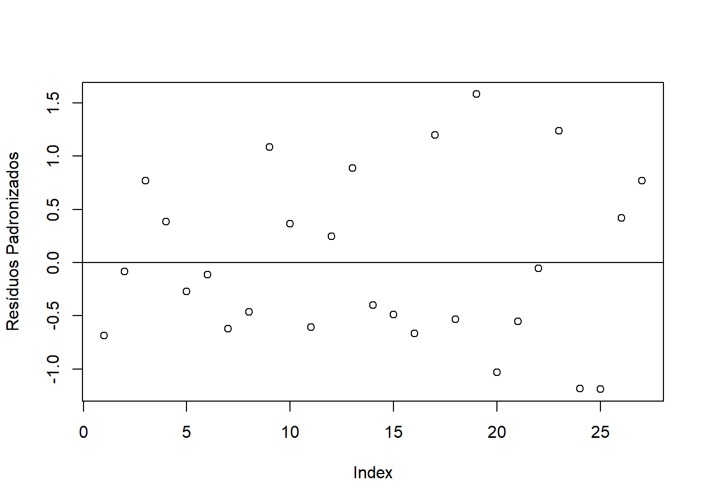

<br><br>

## Comparação múltipla

<br>

### Teste de Comparação Múltipla de Tukey (Utilizando o multcomp)


```r
library(multcomp)
mcomp=glht(modelo, mcp(cultivar="Tukey"))
plot(mcomp)
```

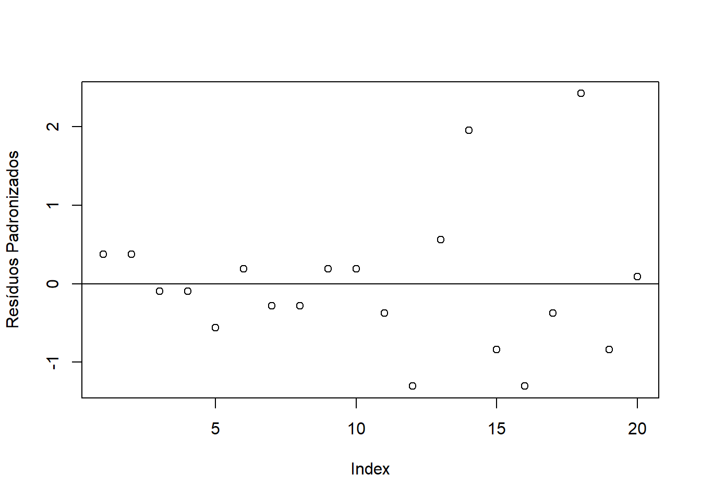

```r
cld(mcomp)
```

```
##  T 1  T 2  T 3  T 4  T 5  T 6  T 7  T 8  T 9 
## "ab"  "b"  "b" "ab" "ab"  "a" "ab"  "c" "ab"
```

<br>

### Teste de Comparação Múltipla de Tukey (Utilizando o TukeyHSD do R)


```r
(tukey=TukeyHSD(modelo))
```

```
##   Tukey multiple comparisons of means
##     95% family-wise confidence level
## 
## Fit: aov(formula = resposta ~ cultivar + bloco)
## 
## $cultivar
##               diff         lwr        upr     p adj
## T 2-T 1  38.000000   -8.085796  84.085796 0.1520249
## T 3-T 1  37.000000   -9.085796  83.085796 0.1728150
## T 4-T 1  28.333333  -17.752463  74.419129 0.4559717
## T 5-T 1  10.000000  -36.085796  56.085796 0.9962223
## T 6-T 1 -15.333333  -61.419129  30.752463 0.9489958
## T 7-T 1  25.000000  -21.085796  71.085796 0.6053536
## T 8-T 1  95.000000   48.914204 141.085796 0.0000460
## T 9-T 1  27.000000  -19.085796  73.085796 0.5143733
## T 3-T 2  -1.000000  -47.085796  45.085796 1.0000000
## T 4-T 2  -9.666667  -55.752463  36.419129 0.9969942
## T 5-T 2 -28.000000  -74.085796  18.085796 0.4703201
## T 6-T 2 -53.333333  -99.419129  -7.247537 0.0172692
## T 7-T 2 -13.000000  -59.085796  33.085796 0.9799785
## T 8-T 2  57.000000   10.914204 103.085796 0.0099947
## T 9-T 2 -11.000000  -57.085796  35.085796 0.9929220
## T 4-T 3  -8.666667  -54.752463  37.419129 0.9985839
## T 5-T 3 -27.000000  -73.085796  19.085796 0.5143733
## T 6-T 3 -52.333333  -98.419129  -6.247537 0.0200347
## T 7-T 3 -12.000000  -58.085796  34.085796 0.9877062
## T 8-T 3  58.000000   11.914204 104.085796 0.0086074
## T 9-T 3 -10.000000  -56.085796  36.085796 0.9962223
## T 5-T 4 -18.333333  -64.419129  27.752463 0.8763516
## T 6-T 4 -43.666667  -89.752463   2.419129 0.0705323
## T 7-T 4  -3.333333  -49.419129  42.752463 0.9999989
## T 8-T 4  66.666667   20.580871 112.752463 0.0023716
## T 9-T 4  -1.333333  -47.419129  44.752463 1.0000000
## T 6-T 5 -25.333333  -71.419129  20.752463 0.5900630
## T 7-T 5  15.000000  -31.085796  61.085796 0.9546944
## T 8-T 5  85.000000   38.914204 131.085796 0.0001740
## T 9-T 5  17.000000  -29.085796  63.085796 0.9134401
## T 7-T 6  40.333333   -5.752463  86.419129 0.1116698
## T 8-T 6 110.333333   64.247537 156.419129 0.0000069
## T 9-T 6  42.333333   -3.752463  88.419129 0.0849582
## T 8-T 7  70.000000   23.914204 116.085796 0.0014541
## T 9-T 7   2.000000  -44.085796  48.085796 1.0000000
## T 9-T 8 -68.000000 -114.085796 -21.914204 0.0019490
## 
## $bloco
##               diff       lwr      upr     p adj
## B 2-B 1  0.4444444 -18.85487 19.74376 0.9980554
## B 3-B 1 -2.1111111 -21.41043 17.18820 0.9571497
## B 3-B 2 -2.5555556 -21.85487 16.74376 0.9379209
```

```r
plot(tukey)
```

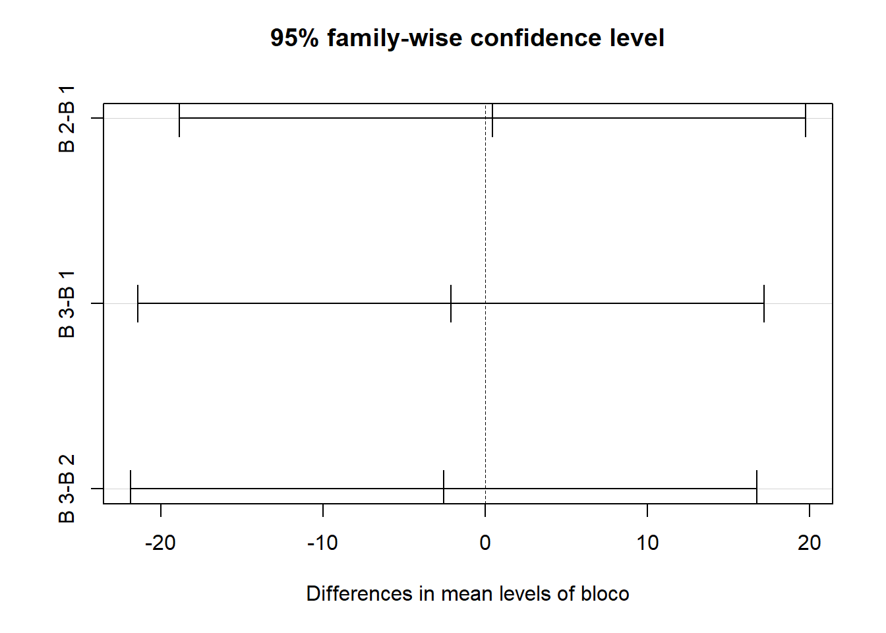

<br>

### Teste de Comparação Múltipla de Tukey (Utilizando o HSD.test do Agricolae)


```r
library(agricolae)
tukey=HSD.test(modelo,"cultivar")
plot(tukey)
```


<br>

### Teste de Comparação Múltipla de Tukey (Utilizando o ea1() do pacote easyanova)


```r
library(easyanova)
tukey=ea1(data.frame(cultivar,bloco,resposta), design = 2)
```

```r
cbind(tukey$`Adjusted means`[1],tukey$`Adjusted means`[2],tukey$`Adjusted means`[4])
```

```
##   treatment adjusted.mean tukey
## 1       T 8      250.3333     a
## 2       T 2      193.3333     b
## 3       T 3      192.3333     b
## 4       T 4      183.6667    bc
## 5       T 9      182.3333    bc
## 6       T 7      180.3333    bc
## 7       T 5      165.3333    bc
## 8       T 1      155.3333    bc
## 9       T 6      140.0000     c
```

<br>

#### Teste de Comparação Múltipla de Tukey (Utilizando o dbc do pacote ExpDes.pt)


```r
library(ExpDes.pt)
dbc(cultivar,bloco,resposta)
```

```
## ------------------------------------------------------------------------
## Quadro da analise de variancia
## ------------------------------------------------------------------------
##            GL      SQ      QM      Fc   Pr>Fc
## Tratamento  8 22981.3 2872.67 11.4114 0.00003
## Bloco       2    33.6   16.78  0.0666 0.93578
## Residuo    16  4027.8  251.74                
## Total      26 27042.7                        
## ------------------------------------------------------------------------
## CV = 8.69 %
## 
## ------------------------------------------------------------------------
## Teste de normalidade dos residuos 
## valor-p:  0.187264 
## De acordo com o teste de Shapiro-Wilk a 5% de significancia, os residuos podem ser considerados normais.
## ------------------------------------------------------------------------
## 
## ------------------------------------------------------------------------
## Teste de homogeneidade de variancia 
## valor-p:  0.7817409 
## De acordo com o teste de oneillmathews a 5% de significancia, as variancias podem ser consideradas homogeneas.
## ------------------------------------------------------------------------
## 
## Teste de Tukey
## ------------------------------------------------------------------------
## Grupos Tratamentos Medias
## a 	 T 8 	 250.3333 
##  b 	 T 2 	 193.3333 
##  b 	 T 3 	 192.3333 
##  bc 	 T 4 	 183.6667 
##  bc 	 T 9 	 182.3333 
##  bc 	 T 7 	 180.3333 
##  bc 	 T 5 	 165.3333 
##  bc 	 T 1 	 155.3333 
##   c 	 T 6 	 140 
## ------------------------------------------------------------------------
```

<br><br>

****

## Exemplo 2

****


Um experimento foi realizado com o intuito de avaliar a produtividade de 15 cultivares comerciais de soja no munícipio de Londrina-PR. O experimento foi instalado em Delineamento em blocos casualizados com 3 repetições por tratamento.

**Fonte da foto**: [Agricultura](http://www.agricultura.gov.br/noticias/entra-em-vigor-novo-sistema-de-registro-de-cultivares/@@nitf_galleria)

<br>

### Conjunto de dados


```r
PRO=c(2444.44,2870.37,2314.81,2629.63,2444.44,2592.59,2962.96,3037.04,3037.04,2592.59,2296.30,2444.44,2370.37,3481.48,2555.56,1981.48,2611.11,1925.93,1870.37,2518.52,2370.37,2462.96,2351.85,2000.00,2703.70,2685.19,2166.67,2129.63,2222.22,1814.81,2537.04,2351.85,2333.33,3370.37,2462.96,3129.63,2666.67,2796.30,2055.56,2333.33,2240.74,2092.59,2703.70,2129.63,2740.74)
Cultivares=rep(c(paste("T",1:15)),e=3)
Bloco=rep(c(paste("B",1:3)),15)
Tratamento = as.factor(Cultivares)
bloco=as.factor(Bloco)
dados = data.frame(Tratamento, TRAT=Tratamento, bloco,resp=PRO)
dados = dados[order(dados$Tratamento), ]
X = 'Cultivares de soja'
(Y = expression(Produtividade (Kg.ha^-1)))
```

```
## expression(Produtividade(Kg.ha^-1))
```

```r
alfa="0,05"
```

<br><br>

## Estatística descritiva


```r
Média = with(dados, mean(resp))
Variância = with(dados, var(resp))
Desvio = with(dados, sd(resp))
CV = Desvio / Média * 100

desc = cbind(Média, Variância, Desvio, CV)
rownames(desc) = 'Produvidade (Kg/ha)'
kable(round(desc,2), align="l")
```

                      Média     Variância   Desvio   CV    
--------------------  --------  ----------  -------  ------
Produvidade (Kg/ha)   2485.18   141049.6    375.57   15.11 

<br><br>

### Por Cultivar


```r
Médias = with(dados, tapply(resp, Tratamento, mean))
Variâncias = with(dados, tapply(resp, Tratamento, var))
Desvios = with(dados, tapply(resp, Tratamento, sd))
CV = Desvios / Médias * 100
Desc = cbind(Médias, Variâncias, Desvios, CV)
kable(round(Desc,2),align="l")
```

       Médias    Variâncias   Desvios   CV    
-----  --------  -----------  --------  ------
T 1    2543.21   84477.87     290.65    11.43 
T 10   2055.55   45611.24     213.57    10.39 
T 11   2407.41   12689.35     112.65    4.68  
T 12   2987.65   220966.26    470.07    15.73 
T 13   2506.18   156492.52    395.59    15.78 
T 14   2222.22   14746.18     121.43    5.46  
T 15   2524.69   117397.29    342.63    13.57 
T 2    2555.55   9602.62      97.99     3.83  
T 3    3012.35   1829.28      42.77     1.42  
T 4    2444.44   21946.94     148.15    6.06  
T 5    2802.47   354364.77    595.29    21.24 
T 6    2172.84   144831.90    380.57    17.51 
T 7    2253.09   115341.14    339.62    15.07 
T 8    2271.60   58412.64     241.69    10.64 
T 9    2518.52   92934.47     304.85    12.10 

As Médias e as Variâncias estão apresentadas na Tabela \ref{tab:MedVar}. Nota-se uma variação nos valores médios, sendo a menor Média igual a $2055.55$ e a maior Média de $3012.35$. Já em relação às Variâncias, o menor valor é de $1829.28$ e a maior variablidade de $3.5436477\times 10^{5}$. 

<br><br>

## Gráfico de Caixas


```r
par(bty='l', mai=c(1, 1, .2, .2))
par(cex=0.7)
caixas=with(dados, car::Boxplot(resp ~ dados$TRAT, vertical=T,las=1, col='Lightyellow',
                    xlab=X, ylab=Y))
mediab=tapply(dados$resp, dados$ TRAT, mean)
points(mediab, pch='+', cex=1.5, col='red')
```

<div class="figure" style="text-align: center">

<p class="caption">(\#fig:unnamed-chunk-122)Gráfico de caixas</p>
</div>

```r
names(Desvios)[which.min(Desvios)]
```

Não observa-se *outliers*. Há maior variabilidade em T 5 e menor em T 3, com 595.285 e 42.77, respectivamente. Há evidências de diferença entre as Médias dos tratamentos.

<br><br>

## Análise de Variância

\begin{eqnarray*}
\left\{
\begin{array}{ll}
H_0: & \mu_1 = \mu_2 = \mu_3 = \cdots = \mu_{15} \\[.2cm]
H_1: & \mu_i \neq \mu_i' \qquad i \neq i'.
\end{array}
\right.
\end{eqnarray*}


```r
mod = with(dados, aov(resp ~ Tratamento+bloco))
av=anova(mod)
kable(av, align = "l")
```

             Df   Sum Sq      Mean Sq     F value    Pr(>F)    
-----------  ---  ----------  ----------  ---------  ----------
Tratamento   14   3302891.5   235920.82   2.545837   0.0171400 
bloco        2    308550.2    154275.11   1.664793   0.2074184 
Residuals    28   2594738.7   92669.24                         

Como p-valor calculado (p=$0.01714$) é menor que o nível de significância adotado ($p=0,05$), rejeita-se $H0$. Logo, 
ao menos dois tratamentos se diferem entre si

<br><br>

## Pressuposições

<br>

### Normalidade dos erros

\begin{eqnarray*}
\left\{
\begin{array}{ll}
H_0: & \mbox{Os erros seguem distribuição normal}\\[.2cm]
H_1: & \mbox{Os erros não seguem distribuição normal}.
\end{array}
\right.
\end{eqnarray*}


```r
(norm=shapiro.test(mod$res))
```

```
## 
## 	Shapiro-Wilk normality test
## 
## data:  mod$res
## W = 0.97989, p-value = 0.6151
```

Como p-valor calculado (p=$0.6151$) é maior que o nível de significância adotado ($\alpha=0,05$), não rejeita-se $H_O$. Logo, os erros seguem distribuição normal.


```r
hnp::hnp(mod, las=1, xlab="Quantis teóricos", pch=16)
```

<div class="figure" style="text-align: center">
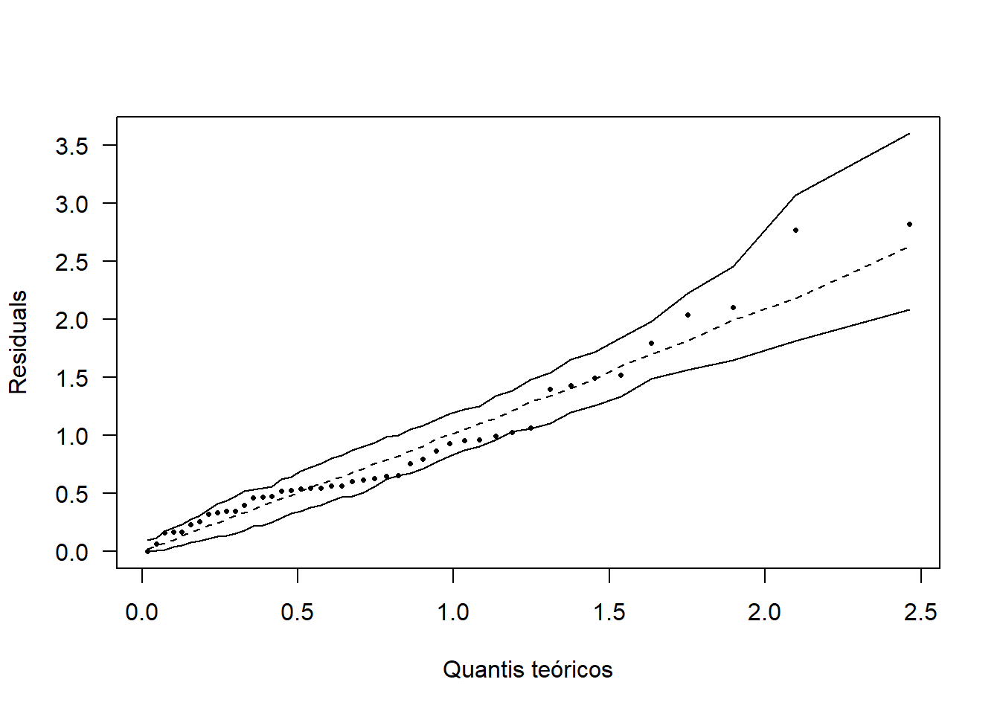
<p class="caption">(\#fig:unnamed-chunk-125)Gráfico QQplot \label{Fig:QQ}</p>
</div>

<br>

### Homogeneidade de Variâncias

\begin{eqnarray*}
\left\{
\begin{array}{ll}
H_0: & \mbox{ As Variâncias são homogêneas}\\[.2cm]
H_1: & \mbox{ As Variâncias não são homogêneas}.
\end{array}
\right.
\end{eqnarray*}


```r
(homog=with(dados, bartlett.test(mod$res ~ Tratamento)))
```

```
## 
## 	Bartlett test of homogeneity of variances
## 
## data:  mod$res by Tratamento
## Bartlett's K-squared = 15.293, df = 14, p-value = 0.3584
```

Como p-valor calculado (p=$0.3584$) é maior que o nível de significância adotado ($p=0,05$), não rejeita-se $H_0$. Logo, as Variâncias são homogêneas.

<br>

### Independência dos erros

\begin{eqnarray*}
\left\{
\begin{array}{ll}
H_0: \mbox{Os erros são independentes}\\[.2cm]
H_1: \mbox{Os erros não são independentes}.
\end{array}
\right.
\end{eqnarray*}


```r
(ind=lmtest::dwtest(mod))
```

```
## 
## 	Durbin-Watson test
## 
## data:  mod
## DW = 2.9611, p-value = 0.9272
## alternative hypothesis: true autocorrelation is greater than 0
```

Como p-valor calculado (p=$0.9272$) é maior que o nível de significância adotado ($p=0,05$), não rejeita-se $H_0$. Logo, os erros são independentes. A Figura \ref{fig:res} apresenta os resíduos brutos. Percebe-se que os resíduos estão distribuídos de forma totalmente aleatória, evidenciando a sua independência.


```r
plot(mod$res, las=1, pch=19, col='red', ylab='Resíduos brutos')
abline(h=0)
```

<div class="figure" style="text-align: center">
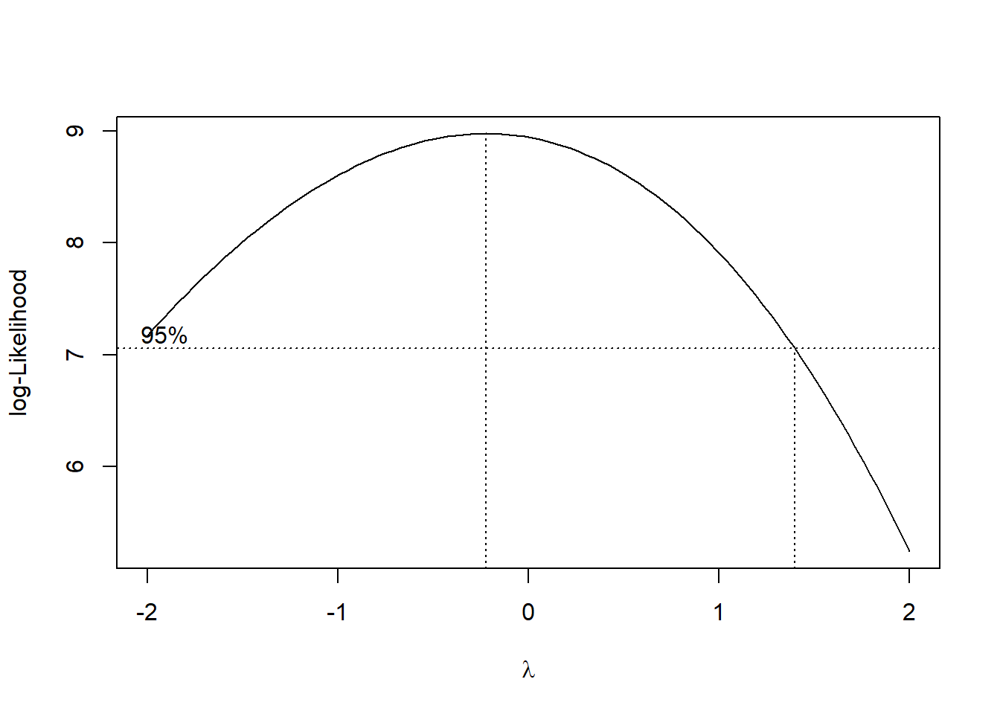
<p class="caption">(\#fig:unnamed-chunk-128)Gráfico de resíduos brutos \label{fig:res}</p>
</div>

<br><br>

## Teste de comparações
 

```r
mod.1 = easyanova::ea1(dados[,c(1,3,4)], design=2, plot=2)
```

```r
tabela=cbind(mod.1$`Adjusted means`[1],
             mod.1$`Adjusted means`[2],
             mod.1$`Adjusted means`[8])
names(tabela)[1:3]=c("Cultivar","Média","")
kable(tabela, align = 'l', booktabs=T, caption="Teste de comparação de Scott-Knott", format="pandoc", format.args = list(big.mark="."))
```


Table: (\#tab:unnamed-chunk-129)Teste de comparação de Scott-Knott

Cultivar   Média          
---------  ----------  ---
T 3        3.012.347   a  
T 12       2.987.653   a  
T 5        2.802.470   a  
T 2        2.555.553   b  
T 1        2.543.207   b  
T 15       2.524.690   b  
T 9        2.518.520   b  
T 13       2.506.177   b  
T 4        2.444.443   b  
T 11       2.407.407   b  
T 8        2.271.603   b  
T 7        2.253.087   b  
T 14       2.222.220   b  
T 6        2.172.840   b  
T 10       2.055.553   b  


```r
library(ExpDes.pt)
with(dados,dbc(Tratamento, bloco,resp, mcomp="tukey"))
```

```
## ------------------------------------------------------------------------
## Quadro da analise de variancia
## ------------------------------------------------------------------------
##            GL      SQ     QM     Fc   Pr>Fc
## Tratamento 14 3302891 235921 2.5458 0.01714
## Bloco       2  308550 154275 1.6648 0.20742
## Residuo    28 2594739  92669               
## Total      44 6206180                      
## ------------------------------------------------------------------------
## CV = 12.25 %
## 
## ------------------------------------------------------------------------
## Teste de normalidade dos residuos 
## valor-p:  0.6150834 
## De acordo com o teste de Shapiro-Wilk a 5% de significancia, os residuos podem ser considerados normais.
## ------------------------------------------------------------------------
## 
## ------------------------------------------------------------------------
## Teste de homogeneidade de variancia 
## valor-p:  0.1187836 
## De acordo com o teste de oneillmathews a 5% de significancia, as variancias podem ser consideradas homogeneas.
## ------------------------------------------------------------------------
## 
## Teste de Tukey
## ------------------------------------------------------------------------
## Grupos Tratamentos Medias
## a 	 T 3 	 3012.347 
## a 	 T 12 	 2987.653 
## ab 	 T 5 	 2802.47 
## ab 	 T 2 	 2555.553 
## ab 	 T 1 	 2543.207 
## ab 	 T 15 	 2524.69 
## ab 	 T 9 	 2518.52 
## ab 	 T 13 	 2506.177 
## ab 	 T 4 	 2444.443 
## ab 	 T 11 	 2407.407 
## ab 	 T 8 	 2271.603 
## ab 	 T 7 	 2253.087 
## ab 	 T 14 	 2222.22 
## ab 	 T 6 	 2172.84 
##  b 	 T 10 	 2055.553 
## ------------------------------------------------------------------------
```


<br><br><br><br>

****

# Delineamento em Quadrado Latino

****

<br><br><br><br>

- Na sessão de delineamento em blocos ao acaso, observamos que o mesmo é usado para reduzir o erro residual de um experimento utilizando o princípio do controle local;
- No Delineamento em Quadrado Latino, além dos princípios da repetição e da casualização, o princípio do controle local é utilizado duas vezes para controlar o efeito de dois fatores;
- Para controlar esta variabilidade, é necessário dividir as unidades experimentais em blocos homogêneos de unidades experimentais em relação a cada fator controlado.
- O número de blocos para cada fator controlado deve ser igual ao número de tratamentos.
Uma vez formados os blocos, distribui-se os tratamentos ao acaso com a restrição que cada tratamento seja designado uma única vez em cada um dos blocos dos dois fatores controlados.
- Os níveis de um fator controlado são identificados por linhas em uma tabela de dupla entrada e os níveis do outro fator controlado são identificados por colunas na tabela.
- A grande restrição dos ensaios em quadrados latinos é que para 2, 3 ou 4 tratamentos teremos apenas 0, 2 ou 6 g.l., respectivamente,para o resíduo.
- Por outro lado, com 9 ou mais tratamentos, o quadrado latino fica muito grande, trazendo dificuldades na instalação, pois, para 9 tratamentos, teremos 81 parcelas.
- Por isso, os quadrados latinos mais usados são os de 5 x 5, 6 x 6, 7 x 7 e 8 x 8.

<br>

****

## Modelo matemático 

****

\begin{eqnarray}
y_{ji}=\mu+\tau_i+\alpha_j+\beta_k+\varepsilon_{ij}
\end{eqnarray}

$y_{ji}$: é o valor observado na i-ésima linha e k-ésima coluna para o j-ésimo tratamento;

$\mu$: é a média geral (ou constante comum a todas as observações);

$\tau_i$: é o efeito de tratamento, com $i = 1, 2, . . . , I$;

$\beta_j$: é o efeito da k-ésima coluna;

$\alpha_j$: é efeito da j-ésima linha

$\varepsilon_{ij}$: é o erro experimental, tal que $\varepsilon_{ij}$~N(0; $\sigma^2$).

**O modelo é completamente aditivo, ou seja, não há interação entre linhas, colunas e tratamentos.**

****

## Hipóteses e Modelo 

****

\begin{eqnarray*}
\left\{
\begin{array}{ll}
H_0: & \mu_1 = \mu_2 =\mu_i\\[.2cm]
H_1: & \mu_i \neq \mu_i' \qquad i \neq i'.
\end{array}
\right.
\end{eqnarray*}

CV            | G.L.        |S.Q.        |Q.M.                      |  Fcalc                  | Ftab
--------------:|:-------------:|:------------:|:--------------------------:|:-------------------------:|:----------------------------------:
Tratamentos   | $p - 1$     |$SQ_{Trat}$ |$\frac{SQ_{Trat}}{p-1}$   |$\frac{QMTrat}{QMRes}$   | $F(\alpha;GL_{Trat} ;GL_{Res})$
Linhas        | $p - 1$     |$SQ_{L}$    |$\frac{SQ_{L}}{p-1}$      |$\frac{QM_{L}}{QM_{Res}}$| $F(\alpha;GL_{L} ;GL_{Res})$
Colunas       | $p - 1$     |$SQ_{C}$    |$\frac{SQ_{C}}{p-1}$      |$\frac{QM_{C}}{QM_{Res}}$| $F(\alpha;GL_{C} ;GL_{Res})$
resíduo       | $(p-2)(p-1)$|$SQ_{Res}$  |$\frac{SQRes}{(p-2)(p-1)}$|                         |
Total         | $p^2-1$     |$SQ_{Total}$|                          |                         |

<br><br>

****

### Croqui de um experimento em DQL

****

<br>

Criando uma função para fazer um croqui


```r
# Não alterar os comandos da função
library(agricolae)
library(gridExtra)
library(grid)
croqui=function(trat){
  r=length(trat)
  sort=design.lsd(trat,r,serie=0)
  sort$book[,4]=as.factor(matrix(sort$book[,4],r,,T))
  ncol=r
  gs <- lapply(sort$book[,4], function(ii)
    grobTree(rectGrob(gp=gpar(fill=ii, alpha=0.5)),textGrob(ii)))
  grid.arrange(grobs=gs, ncol=ncol)}
```

<br>

Vetor de tratamentos


```r
trat=c("T1","T2","T3","T4")
```

<br>

Usando a função


```r
croqui(trat)
```


<br><br>

****

## Exemplo 1

****

Considere um experimento, cujo objetivo foi estudar o efeito da idade de castração no desenvolvimento e produção de suínos, avaliando-se o peso dos leitões. Quatro tratamentos foram estudados:

- A - castração aos 56 dias de idade;
- B - castração aos 7 dias de idade;
- C - castração aos 36 dias de idade;
- D - inteiros (não castrados);
- E - castração aos 21 dias de idade;

Foi utilizado o delineamento em quadrado latino buscando controlar a variação entre leitegadas (linhas) e a variação no peso inicial dos leitões (colunas), sendo a parcela experimental constituída de um leitão. Os ganhos de pesos, em kg, após o período experimental (28 semanas), estão apresentados no quadro abaixo:


Linhas      | Coluna 1 | Coluna 2 | Coluna 3 | Coluna 4 | Coluna 5 | Totais
------------|----------|----------|----------|----------|----------|------------
Leitegada 1 | 93,0(A)  | 115,4(C) | 116,9(E) | 110,2(D) | 110,4(B) | 545,9 
Leitegada 2 | 110,6(C) | 96,5(E)  | 108,9(B) | 97,6 (A) | 112,0(D) | 525,6
Leitegada 3 | 102,1(B) | 108,6(D) | 77,9(A)  | 102,0(E) | 111,7(C) | 502,3
Leitegada 4 | 115,4(D) | 94,9(A)  | 114,0(C) | 100,2(B) | 118,5(E) | 543,0
Leitegada 5 | 117,6(E) | 114,1(B) | 118,7(D) | 108,8(C) | 80,2(A)  | 539,4
Totais      | 538,7    | 529,5    | 536,4    | 518,8    | 532,8    | 2656,2

<br><br>

### Conjunto de dados


```r
RESP=c(93.0, 115.4, 116.9, 110.2, 110.4,110.6, 96.5, 108.9, 97.6, 112.0,102.1, 108.6, 77.9, 102.0, 111.7,115.4, 94.9, 114.0, 100.2, 118.5,117.6, 114.1, 118.7, 108.8, 80.2)
(TRAT=c("A","C","E","D","B","C","E","B","A","D","B","D","A","E","C","D","A","C","B","E","E","B","D","C","A"))
```

```
##  [1] "A" "C" "E" "D" "B" "C" "E" "B" "A" "D" "B" "D" "A" "E" "C" "D" "A" "C" "B"
## [20] "E" "E" "B" "D" "C" "A"
```

```r
(linha=as.factor(rep(1:5,each=5)))
```

```
##  [1] 1 1 1 1 1 2 2 2 2 2 3 3 3 3 3 4 4 4 4 4 5 5 5 5 5
## Levels: 1 2 3 4 5
```

```r
(coluna=as.factor(rep(1:5,5)))
```

```
##  [1] 1 2 3 4 5 1 2 3 4 5 1 2 3 4 5 1 2 3 4 5 1 2 3 4 5
## Levels: 1 2 3 4 5
```

```r
dados = data.frame(TRAT, linha, coluna, RESP)
alfa=0.05
```

<br><br>

## Análise Descritiva


```r
Media=mean(RESP)
Desvio=sd(RESP)
Variancia=var(RESP)
Maximo=max(RESP)
Minimo=min(RESP)
Mediana=median(RESP)
descritiva=cbind(Media,
                 Desvio, 
                 Variancia, 
                 Maximo, 
                 Minimo, 
                 Mediana)
kable(descritiva)
```


   Media     Desvio   Variancia   Maximo   Minimo   Mediana
--------  ---------  ----------  -------  -------  --------
 106.248   11.17751    124.9368    118.7     77.9     110.2

<br>

### Por Tratamento


```r
Media=tapply(RESP,TRAT, mean)
Desvio=tapply(RESP,TRAT,sd)
Variancia=tapply(RESP,TRAT, var)
Maximo=tapply(RESP,TRAT,max)
Minimo=tapply(RESP,TRAT, min)
Mediana=tapply(RESP,TRAT,median)
descritiva=cbind(Media,
                 Desvio, 
                 Variancia, 
                 Maximo, 
                 Minimo, 
                 Mediana)
kable(descritiva)
```

       Media      Desvio   Variancia   Maximo   Minimo   Mediana
---  -------  ----------  ----------  -------  -------  --------
A      88.72    9.014266      81.257     97.6     77.9      93.0
B     107.14    5.825204      33.933    114.1    100.2     108.9
C     112.10    2.636285       6.950    115.4    108.8     111.7
D     112.98    4.075782      16.612    118.7    108.6     112.0
E     110.30   10.288586     105.855    118.5     96.5     116.9


```r
kable(round(descritiva,2), align="l")
```

     Media    Desvio   Variancia   Maximo   Minimo   Mediana 
---  -------  -------  ----------  -------  -------  --------
A    88.72    9.01     81.26       97.6     77.9     93.0    
B    107.14   5.83     33.93       114.1    100.2    108.9   
C    112.10   2.64     6.95        115.4    108.8    111.7   
D    112.98   4.08     16.61       118.7    108.6    112.0   
E    110.30   10.29    105.86      118.5    96.5     116.9   

<br>

## Gráfico de Caixas (Boxplot)


```r
car::Boxplot(RESP~TRAT,
             las=1,
             col="lightblue", xlab="",
             ylab=expression("Resposta"))
points(Media,col="red", pch=8)
```


<br>

## Análise de Variância

\begin{eqnarray*}
\left\{
\begin{array}{ll}
H_0: & \mu_1 = \mu_2 = \mu_3 = \cdots = \mu_{15} \\[.2cm]
H_1: & \mu_i \neq \mu_i' \qquad i \neq i'.
\end{array}
\right.
\end{eqnarray*}


```r
mod=aov(RESP~ TRAT+linha+coluna)
av=anova(mod)
names(av)=c("GL","SQ","QM","Teste F", "p-valor")
kable(av, align = "l", format="pandoc")
```

            GL   SQ          QM         Teste F     p-valor   
----------  ---  ----------  ---------  ----------  ----------
TRAT        4    2020.0544   505.0136   9.0167153   0.0013321 
linha       4    257.8264    64.4566    1.1508340   0.3796397 
coluna      4    48.4984     12.1246    0.2164775   0.9241758 
Residuals   12   672.1032    56.0086                          

Como p-valor calculado (p=$0.0013321$) é menor que o nível de significância adotado ($p=0.05$), rejeita-se $H0$. Logo, 
ao menos dois tratamentos se diferem entre si

<br><br>

## Pressuposições

<br>

### Normalidade dos erros

\begin{eqnarray*}
\left\{
\begin{array}{ll}
H_0: & \mbox{Os erros seguem distribuição normal}\\[.2cm]
H_1: & \mbox{Os erros não seguem distribuição normal}.
\end{array}
\right.
\end{eqnarray*}


```r
(norm=shapiro.test(mod$res))
```

```
## 
## 	Shapiro-Wilk normality test
## 
## data:  mod$res
## W = 0.96116, p-value = 0.438
```

Como p-valor calculado (p=$0.438$) é maior que o nível de significância adotado ($\alpha=0.05$), não rejeita-se $H_O$. Logo, os erros seguem distribuição normal.


```r
hnp::hnp(mod, las=1, xlab="Quantis teóricos", pch=16)
```

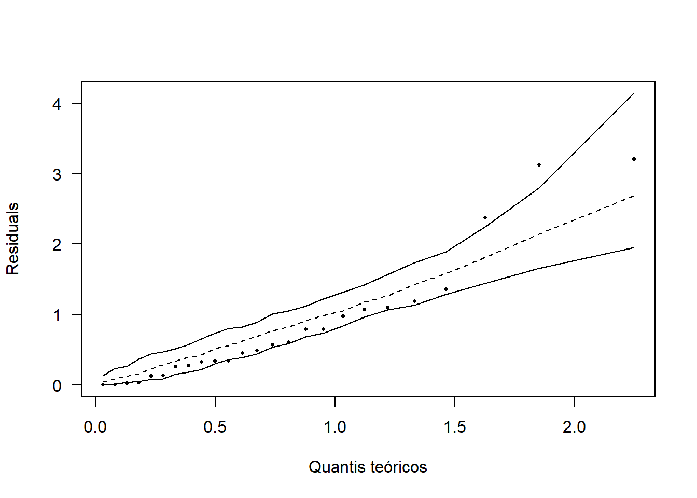

<br>

### Homogeneidade de variâncias

\begin{eqnarray*}
\left\{
\begin{array}{ll}
H_0: & \mbox{ As variâncias são homogêneas}\\[.2cm]
H_1: & \mbox{ As variâncias não são homogêneas}.
\end{array}
\right.
\end{eqnarray*}


```r
(homog=with(dados, bartlett.test(mod$res ~ TRAT)))
```

```
## 
## 	Bartlett test of homogeneity of variances
## 
## data:  mod$res by TRAT
## Bartlett's K-squared = 7.7901, df = 4, p-value = 0.09958
```

Como p-valor calculado ($p=0.0996$) é maior que o nível de significância adotado ($p=0.05$), não rejeita-se $H_0$. Logo, as variâncias são homogêneas.

<br>

### Independência dos erros

\begin{eqnarray*}
\left\{
\begin{array}{ll}
H_0: \mbox{Os erros são independentes}\\[.2cm]
H_1: \mbox{Os erros não são independentes}.
\end{array}
\right.
\end{eqnarray*}


```r
(ind=lmtest::dwtest(mod))
```

```
## 
## 	Durbin-Watson test
## 
## data:  mod
## DW = 1.7241, p-value = 0.08134
## alternative hypothesis: true autocorrelation is greater than 0
```

Como p-valor calculado (p=$0.0813$) é maior que o nível de significância adotado ($p=0.05$), não rejeita-se $H_0$. Logo, os erros são independentes. 


```r
plot(mod$res, las=1, pch=19, col='red')
abline(h=0)
```

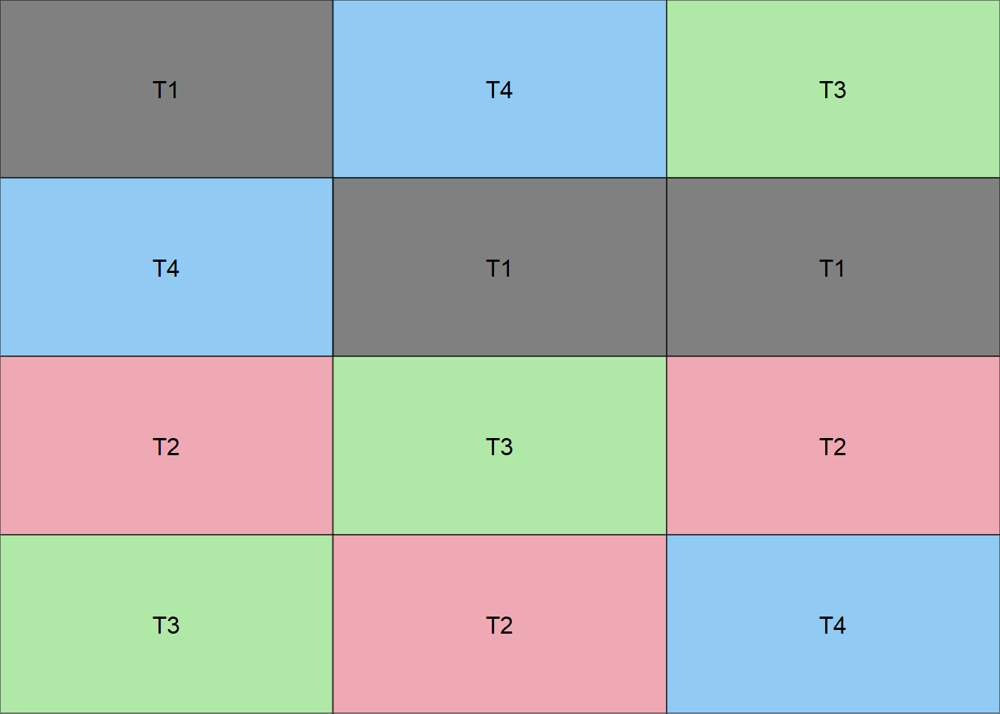

<br><br>

## Teste de comparações

<br>

### Usando o pacote easyanova


```r
library(easyanova)
ea1(dados,design = 3)
```

```
## $`Analysis of variance`
##            df type III SS mean square F value    p>F
## treatments  4   2020.0544    505.0136  9.0167 0.0013
## rows        4    257.8264     64.4566  1.1508 0.3796
## columns     4     48.4984     12.1246  0.2165 0.9242
## residuals  12    672.1032     56.0086       -      -
## 
## $`Adjusted means`
##   treatment adjusted.mean standard.error tukey snk duncan t scott_knott
## 1         D        112.98         3.3469     a   a      a a           a
## 2         C        112.10         3.3469     a   a      a a           a
## 3         E        110.30         3.3469     a   a      a a           a
## 4         B        107.14         3.3469     a   a      a a           a
## 5         A         88.72         3.3469     b   b      b b           b
## 
## $`Multiple comparison test`
##     pair contrast p(tukey) p(snk) p(duncan)   p(t)
## 1  D - C     0.88   0.9997 0.8556    0.8556 0.8556
## 2  D - E     2.68   0.9776 0.8402    0.6003 0.5817
## 3  D - B     5.84   0.7332 0.6186    0.2748 0.2409
## 4  D - A    24.26   0.0019 0.0019    0.0005 0.0003
## 5  C - E     1.80   0.9949 0.7104    0.7104 0.7104
## 6  C - B     4.96   0.8286 0.5624    0.3385 0.3153
## 7  C - A    23.38   0.0026 0.0017    0.0006 0.0003
## 8  E - B     3.16   0.9598 0.5170    0.5170 0.5170
## 9  E - A    21.58   0.0048 0.0018    0.0009 0.0007
## 10 B - A    18.42   0.0150 0.0021    0.0021 0.0021
## 
## $`Residual analysis`
## $`Residual analysis`$`residual analysis`
##                               values
## p.value Shapiro-Wilk test     0.4380
## p.value Bartlett test         0.1031
## coefficient of variation (%)  7.0400
## first value most discrepant   9.0000
## second value most discrepant  7.0000
## third value most discrepant  25.0000
## 
## $`Residual analysis`$residuals
##       1       2       3       4       5       6       7       8       9      10 
##  -0.144   0.716   2.636  -3.224   0.016  -1.864 -12.324   1.856  12.496  -0.164 
##      11      12      13      14      15      16      17      18      19      20 
##  -0.744   1.756  -6.064  -0.024   5.076  -1.424   4.176  -1.484  -6.804   5.536 
##      21      22      23      24      25 
##   4.176   5.676   3.056  -2.444 -10.464 
## 
## $`Residual analysis`$`standardized residuals`
##            1            2            3            4            5            6 
## -0.027211353  0.135300893  0.498118928 -0.609231952  0.003023484 -0.352235843 
##            7            8            9           10           11           12 
## -2.328838268  0.350724101  2.361340717 -0.030990707 -0.140591989  0.331827329 
##           13           14           15           16           17           18 
## -1.145900297 -0.004535225  0.959200182 -0.269090043  0.789129228 -0.280428107 
##           19           20           21           22           23           24 
## -1.285736415  1.046125337  0.789129228  1.072580819  0.577485374 -0.461837125 
##           25 
## -1.977358296
```

<br>

### Usando o pacote laercio


```r
require(laercio)
LTukey(mod,"trat",conf.level=0.95)
```

```
## 
##  TUKEY TEST TO COMPARE MEANS 
##  
##  Confidence level:  0.95 
##  Dependent variable:  RESP
##  Variation Coefficient:  7.043793 % 
##  
## Independent variable:  TRAT 
##   Factors Means    
##   D       112.98 a 
##   C       112.1  a 
##   E       110.3  a 
##   B       107.14 a 
##   A       88.72   b
## 
##  
## Independent variable:  linha 
##   Factors Means   
##   1       109.18 a
##   4       108.6  a
##   5       107.88 a
##   2       105.12 a
##   3       100.46 a
## 
##  
## Independent variable:  coluna 
##   Factors Means   
##   1       107.74 a
##   3       107.28 a
##   5       106.56 a
##   2       105.9  a
##   4       103.76 a
## 
## 
```

<br>

### Usando o pacote agricolae


```r
require(agricolae)
TukeyHSD(mod, "TRAT", ordered = TRUE)
```

```
##   Tukey multiple comparisons of means
##     95% family-wise confidence level
##     factor levels have been ordered
## 
## Fit: aov(formula = RESP ~ TRAT + linha + coluna)
## 
## $TRAT
##      diff        lwr      upr     p adj
## B-A 18.42   3.333159 33.50684 0.0149528
## E-A 21.58   6.493159 36.66684 0.0048180
## C-A 23.38   8.293159 38.46684 0.0025698
## D-A 24.26   9.173159 39.34684 0.0019006
## E-B  3.16 -11.926841 18.24684 0.9597645
## C-B  4.96 -10.126841 20.04684 0.8286018
## D-B  5.84  -9.246841 20.92684 0.7331622
## C-E  1.80 -13.286841 16.88684 0.9949414
## D-E  2.68 -12.406841 17.76684 0.9776166
## D-C  0.88 -14.206841 15.96684 0.9996909
```

```r
plot(TukeyHSD(mod, "TRAT"), col='blue', las=1)
```

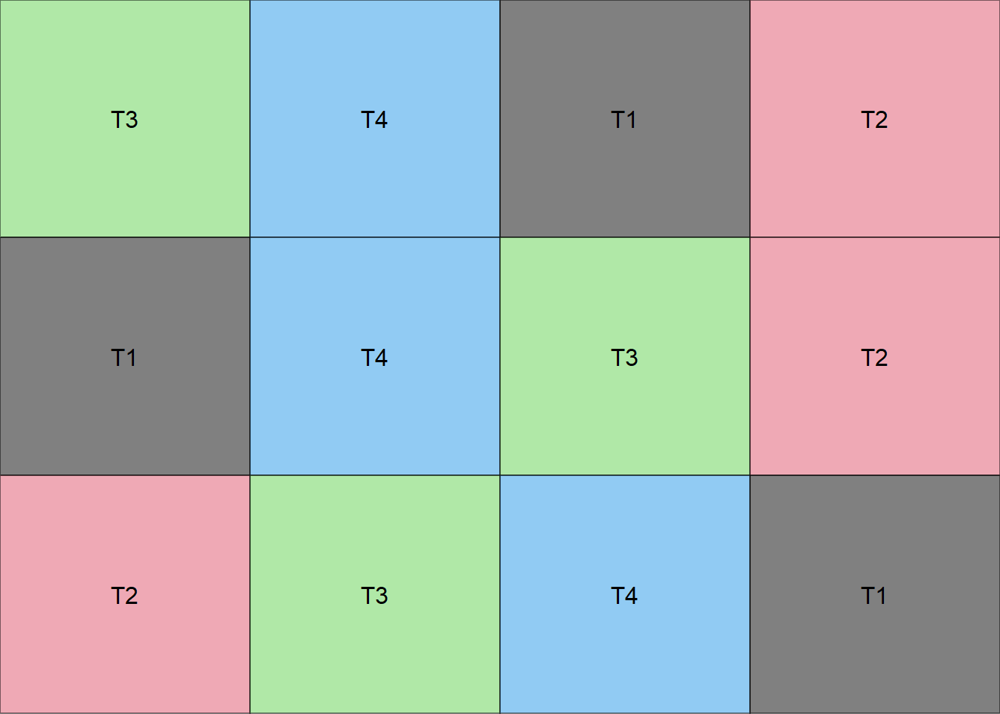

<br>

### Usando o pacote ExpDes.pt


```r
library(ExpDes.pt)
dql(TRAT,linha,coluna,RESP)
```

```
## ------------------------------------------------------------------------
## Quadro da analise de variancia
## ------------------------------------------------------------------------
##            GL      SQ     QM     Fc   Pr>Fc
## Tratamento  4 2020.05 505.01 9.0167 0.00133
## Linha       4  257.83  64.46 1.1508 0.37964
## Coluna      4   48.50  12.12 0.2165 0.92418
## Residuo    12  672.10  56.01               
## Total      24 2998.48                      
## ------------------------------------------------------------------------
## CV = 7.04 %
## 
## ------------------------------------------------------------------------
## Teste de normalidade dos residuos (Shapiro-Wilk)
## valor-p:  0.4380496 
## De acordo com o teste de Shapiro-Wilk a 5% de significancia, os residuos podem ser considerados normais.
## ------------------------------------------------------------------------
## 
## Teste de Tukey
## ------------------------------------------------------------------------
## Grupos Tratamentos Medias
## a 	 D 	 112.98 
## a 	 C 	 112.1 
## a 	 E 	 110.3 
## a 	 B 	 107.14 
##  b 	 A 	 88.72 
## ------------------------------------------------------------------------
```

<br><br><br><br>

****

# Esquema Fatorial (2 Fatores) 

****

<br><br><br><br>

Nos experimentos mais simples comparamos níveis (tratamentos) de apenas um fator; Entretanto, existem casos em que dois ou mais fatores devem ser estudados simultaneamente para que possam nos conduzir a resultados de interesse;

Em geral, os experimentos fatoriais são mais eficientes para este tipo de experimento, pois estudam, ao mesmo tempo, os efeitos de dois ou mais fatores, cada um deles com dois ou mais níveis.

O fatorial é um tipo de esquema, ou seja, uma das maneiras de organizar os tratamentos e não um tipo de delineamento;

Os experimentos fatoriais são montados segundo um tipo de delineamento experimental;

Nos experimentos fatoriais, os tratamentos são obtidos pelas combinações dos níveis dos fatores.

<br>

****

## Tipos de efeitos avaliados

****

<br>

- Efeito Principal: é o efeito de cada fator, independente do efeito dos outros fatores;

- Efeito de Interação: é o efeito simultâneo dos fatores sobre a variável em estudo. Dizemos que ocorre interação entre os fatores quando os efeitos dos níveis de um fator são modificados pelos níveis do outro fator.

<br>

****

## Vantagens

****

<br>

a) Pode-se estudar dois ou mais fatores num único experimento.

b) Pode-se, por meio dos efeitos das interações, verificar se um fator é independente ou dependente do(s) outro(s).

****

## Desvantagens

****

<br>

a) O número de tratamentos ou combinações de níveis de fatores cresce, rapidamente, com o aumento do número de níveis, em cada fator, ou mesmo com o aumento do número de fatores.

b) A interpretação dos resultados se torna mais difícil é medida que aumentamos o número de níveis e de fatores no experimento.

<br>

****

## Modelo estatístico

****

<br>

As observações podem ser descritas pelo modelo estatístico linear:

<center>

$y_{ij} = \mu+\tau_{i}+\beta_{j}+(\tau\beta)_{ij}+\epsilon_{ij}$

</center>

- i = 1; 2; : : : ; a
- j = 1; 2; : : : ; b
- k = 1; 2; : : : ; r

em que:

- $y_{ijk}$ é o valor observado no i-ésimo nivel do Fator A e j-ésima nível do Fator B;
- $\mu$ é uma constante;
- $\tau_{i}$ é o efeito do i-ésimo nível do fator A;
- $\beta_{j}$ é o efeito do j-ésimo nível do fator B;
- $(\tau\beta)_ij$ é o efeito da interação entre $\tau_{i}$ e $\beta_{j}$;
- $(\epsilon)ijk$ é o componente de erro aleatório.

<br>

****

## Hipóteses e quadro da análise de variância

****

<br>

No experimento fatorial com 2 fatores, deseja-se testar a signicância de ambos os fatores. 

Há interesse em testar hipóteses sobre a igualdade dos efeitos do fator A, isto é:

- H0 : $\beta_{11}$ = $\beta_{12}$ = : : : $\beta_{1a}$ = 0
- H1 : Pelo menos um $\beta_{1i} \neq 0$

e a igualdade nos efeitos do fator B, ou seja:

- H0 : $\beta_{21}$ = $\beta_{22}$ = : : : $\beta_{2b}$ = 0
- H1 : Pelo menos um $\beta_{2j} \neq 0$

e, ainda, se há interação entre os fatores:

- H0 : $(\beta_1\beta_2)_{ij}$ = 0 para todo i ; j
- H1 : Pelo menos um $(\beta_1\beta_2)_{ij} \neq 0$

CV              | G.L.        |S.Q.         |Q.M.                          | Fcalc 
---------------:|:-----------:|:-----------:|:----------------------------:|:---------------------------------
Fator A         | $a - 1$     | $SQ_{A}$    | $\frac{SQ_{A}}{a-1}$         | $\frac{QM_{A}}{QM_{Res}}$ 
Fator B         | $b-1$       | $SQ_{B}$    | $\frac{SQ_{B}}{b-1}$         | $\frac{QM_{B}}{QM_{Res}}$
Interação A x B | $(a-1)(b-1)$| $SQ_{AxB}$  | $\frac{SQ_{AxB}}{(a-1)(b-1)}$| $\frac{QM_{AxB}}{QM_{Res}}$
resíduo         | $ab(n-1)$   | $SQ_{Res}$  | $\frac{SQ_{Res(b)}}{ab(n-1)}$| 
Total           | $abn-1$     | $SQ_{Total}$| -                            | 

<br>

****

## Croqui em DIC

****

<br>

Criando uma função para fazer um croqui (Número de coluna igual número de repetições)


```r
# Não alterar os comandos da função
library(agricolae)
library(gridExtra)
library(grid)
croqui=function(trat,r){
  sort=design.ab(trat,r,design = "crd",serie=0)
  sort$book$trat=as.vector(matrix(paste(sort$book$A,sort$book$B),nrow =r,byrow=T))
  ncol=r
  sort$book$trat=as.factor(sort$book$trat)
  gs <- lapply(sort$book$trat, function(ii)
    grobTree(rectGrob(gp=gpar(fill=ii, alpha=0.5)),textGrob(ii)))
  grid.arrange(grobs=gs, ncol=ncol)}
```

<br>

Vetor de tratamentos


```r
trat=c(2,2)
```

<br>

Usando a função


```r
croqui(trat,r=3)
```

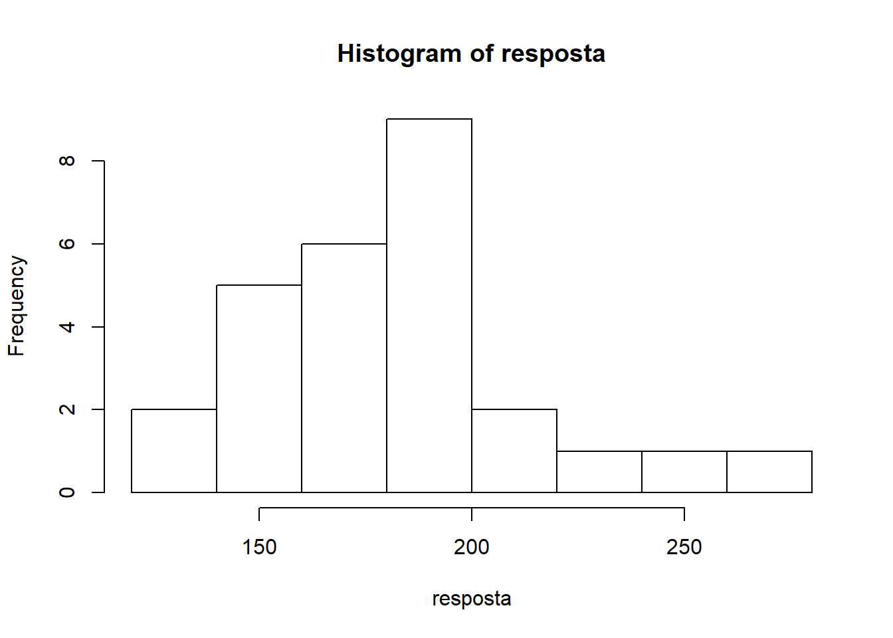

<br>

Criando uma função para fazer um croqui (Número de colunas igual número de tratamentos)


```r
# Não alterar os comandos da função
library(agricolae)
library(gridExtra)
library(grid)
croqui=function(trat,r){
  sort=design.ab(trat,r,design = "crd",serie=0)
  sort$book$trat=as.vector(t(matrix(paste(sort$book$A,sort$book$B),nrow =r, byrow=T)))
  sort$book$trat=as.factor(sort$book$trat)
  ncol=length(levels(sort$book$trat))
  gs <- lapply(sort$book$trat, function(ii)
    grobTree(rectGrob(gp=gpar(fill=ii, alpha=0.5)),textGrob(ii)))
  grid.arrange(grobs=gs, ncol=ncol)}
```

<br>

Vetor de tratamentos


```r
trat=c(2,2) # número de níveis do fator 1 e fator 2 (no caso são 2 cada)
```

<br>

Usando a função


```r
croqui(trat,r=3)
```

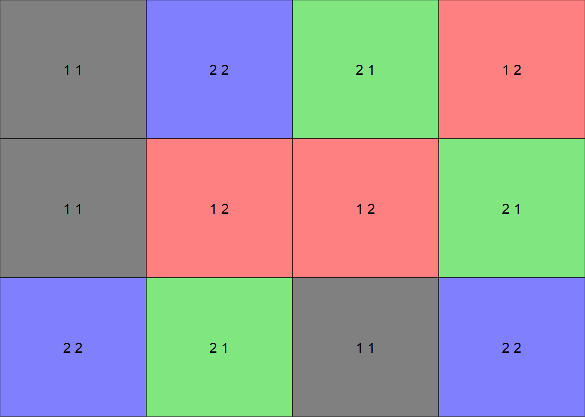

<br><br>

## Croqui em DBC

<br>

Criando uma função para fazer um croqui (Número de coluna igual número de repetições)


```r
# Não alterar os comandos da função
library(agricolae)
library(gridExtra)
library(grid)
croqui=function(trat,r){
  sort=design.ab(trat,r,design = "rcbd",serie=0)
  sort$book$trat=as.vector(matrix(paste(sort$book$A,sort$book$B),nrow =r,byrow=T))
  ncol=r
  sort$book$trat=as.factor(sort$book$trat)
  gs <- lapply(sort$book$trat, function(ii)
    grobTree(rectGrob(gp=gpar(fill=ii, alpha=0.5)),textGrob(ii)))
  grid.arrange(grobs=gs, ncol=ncol)}
```

<br>

Vetor de tratamentos


```r
trat=c(2,2)
```

<br>

Usando a função


```r
croqui(trat,r=3)
```

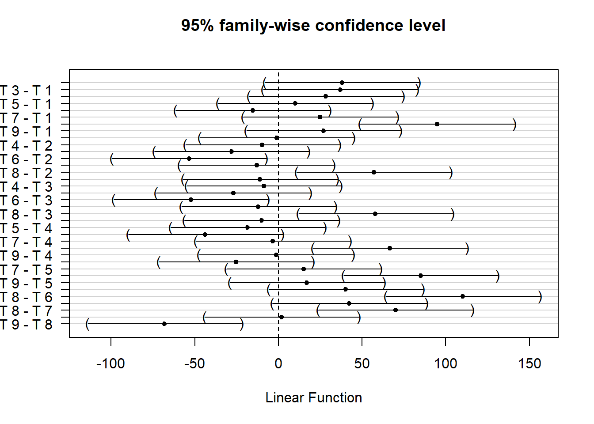

<br>

Criando uma função para fazer um croqui (Número de colunas igual número de tratamentos)


```r
# Não alterar os comandos da função
library(agricolae)
library(gridExtra)
library(grid)
croqui=function(trat,r){
  sort=design.ab(trat,r,design = "rcbd",serie=0)
  sort$book$trat=as.vector(t(matrix(paste(sort$book$A,sort$book$B),nrow =r, byrow=T)))
  sort$book$trat=as.factor(sort$book$trat)
  ncol=length(levels(sort$book$trat))
  gs <- lapply(sort$book$trat, function(ii)
    grobTree(rectGrob(gp=gpar(fill=ii, alpha=0.5)),textGrob(ii)))
  grid.arrange(grobs=gs, ncol=ncol)}
```

<br>

Vetor de tratamentos


```r
trat=c(2,2) # número de níveis do fator 1 e fator 2 (no caso são 2 cada)
```

<br>

Usando a função


```r
croqui(trat,r=3)
```

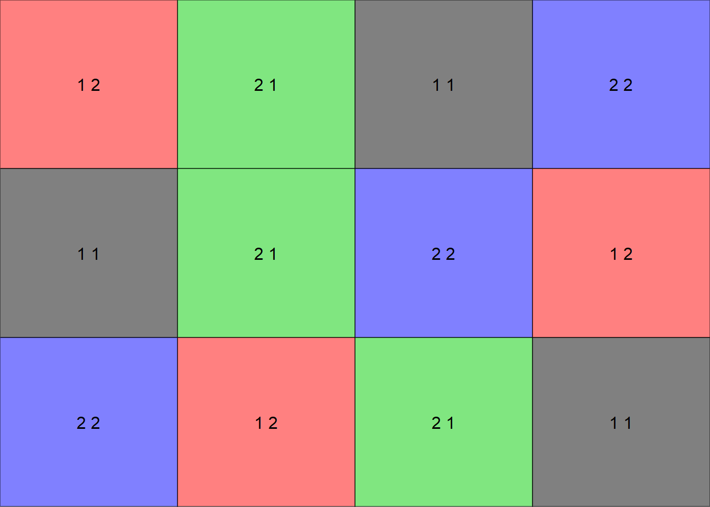


<br><br><br>

****

## Exemplo 1

****

<br>

Um experimento foi conduzido em casa de vegetação em vasos na Universidade Estadual de Londrina. O trabalho tem o objetivo de avaliar a aplicação de dicloroisocianurato de sódio (DUP) em soja em 4 épocas de aplicação em soja inoculada ou não com *Rhizobium* e sua influência sobre o número de nódulos. O experimento foi conduzido em delineamento inteiramente casualizado com cinco repetições.


**Fonte da foto**: https://blog.aegro.com.br/inoculante-para-soja/ 


<br>


```r
NN=c(339,332,163,230,300,
      163,172,123,083,161,
      171,069,095,046,079,
      335,235,217,174,222,
      284,136,225,098,110,
      082,038,092,053,046,
      196,252,346,468,258,
      032,038,063,048,160)
(Inoculacao=rep(c("IN","NI"),e=20))
```

```
##  [1] "IN" "IN" "IN" "IN" "IN" "IN" "IN" "IN" "IN" "IN" "IN" "IN" "IN" "IN" "IN"
## [16] "IN" "IN" "IN" "IN" "IN" "NI" "NI" "NI" "NI" "NI" "NI" "NI" "NI" "NI" "NI"
## [31] "NI" "NI" "NI" "NI" "NI" "NI" "NI" "NI" "NI" "NI"
```

```r
(epoca=rep(c("Plantio","V1+15","V3+15","R1+15"),e=5,2))
```

```
##  [1] "Plantio" "Plantio" "Plantio" "Plantio" "Plantio" "V1+15"   "V1+15"  
##  [8] "V1+15"   "V1+15"   "V1+15"   "V3+15"   "V3+15"   "V3+15"   "V3+15"  
## [15] "V3+15"   "R1+15"   "R1+15"   "R1+15"   "R1+15"   "R1+15"   "Plantio"
## [22] "Plantio" "Plantio" "Plantio" "Plantio" "V1+15"   "V1+15"   "V1+15"  
## [29] "V1+15"   "V1+15"   "V3+15"   "V3+15"   "V3+15"   "V3+15"   "V3+15"  
## [36] "R1+15"   "R1+15"   "R1+15"   "R1+15"   "R1+15"
```

```r
F1=as.factor(Inoculacao)
F2=as.factor(epoca)
Trat=paste(F1,F2)
dados=data.frame(F1,F2,resp=NN)
X="";Y="Número de nódulos"
```

<br><br>

## Estatística descritiva


```r
Media = with(dados, mean(resp))
Variancia = with(dados, var(resp))
Desvio = with(dados, sd(resp))
CV = Desvio / Media * 100

desc = cbind(Media, Variancia, Desvio, CV)
desc
```


Media    Variancia   Desvio   CV    
-------  ----------  -------  ------
168.35   11413.41    106.83   63.46 

<br>

### Por Inoculação


```r
MediaA = with(dados, tapply(resp, F1, mean))
VarianciaA = with(dados, tapply(resp, F1, var))
DesvioA = with(dados, tapply(resp, F1, sd))
CVA = DesvioA / MediaA * 100
Desc = cbind(MediaA, VarianciaA, DesvioA, CVA)
Desc
```


     MediaA   VarianciaA   DesvioA   CVA   
---  -------  -----------  --------  ------
IN   185.45   8229.21      90.71     48.92 
NI   151.25   14582.72     120.76    79.84 

<br>

### Por época de aplicação


```r
MediaB = with(dados, tapply(resp, F2, mean))
VarianciaB = with(dados, tapply(resp, F2, var))
DesvioB = with(dados, tapply(resp, F2, sd))
CVB = DesvioB / MediaB * 100
Desc = cbind(MediaB, VarianciaB, DesvioB, CVB)
Desc
```


          MediaB   VarianciaB   DesvioB   CVB   
--------  -------  -----------  --------  ------
Plantio   221.7    8287.34      91.03     41.06 
R1+15     152.4    10686.93     103.38    67.83 
V1+15     101.3    2559.12      50.59     49.94 
V3+15     198.0    18507.56     136.04    68.71 

<br><br>

## Gráficos exploratórios

<br>

### Gráfico de Caixas

#### Fator 1


```r
par(bty='l', mai=c(1, 1, .2, .2))
par(cex=0.7)
caixas=with(dados, car::Boxplot(resp ~ F1, vertical=T,las=1, col='Lightyellow',
                    xlab=X, ylab=Y))
mediab=with(dados,tapply(resp, F1, mean))
points(mediab, pch='+', cex=1.5, col='red')
```

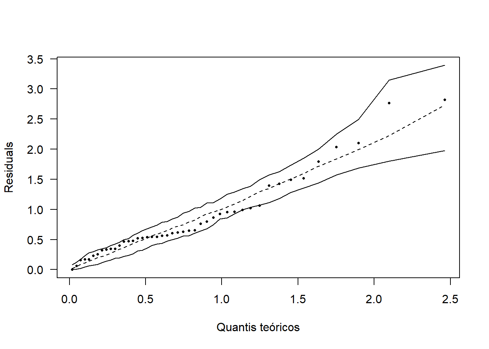

<br>

#### Fator 2


```r
par(bty='l', mai=c(1, 1, .2, .2))
par(cex=0.7)
caixas=with(dados, car::Boxplot(resp ~ F2, vertical=T,las=1, col='Lightyellow',
                    xlab=X, ylab=Y))
mediab=with(dados,tapply(resp, F2, mean))
points(mediab, pch='+', cex=1.5, col='red')
```

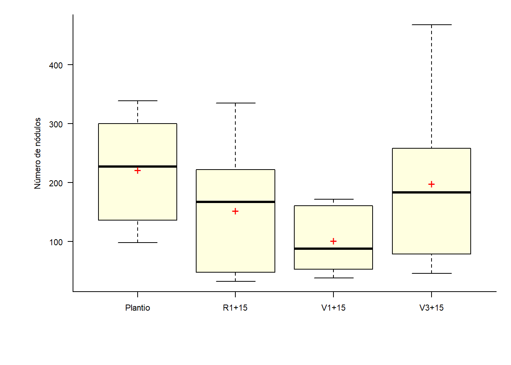

<br>

#### Juntando Fatores


```r
par(bty='l', mai=c(1, 1, .2, .2))
par(cex=0.7)
caixas=with(dados, car::Boxplot(resp ~ F1*F2, vertical=T,las=1, col='Lightyellow',
                    xlab=X, ylab=Y))
```

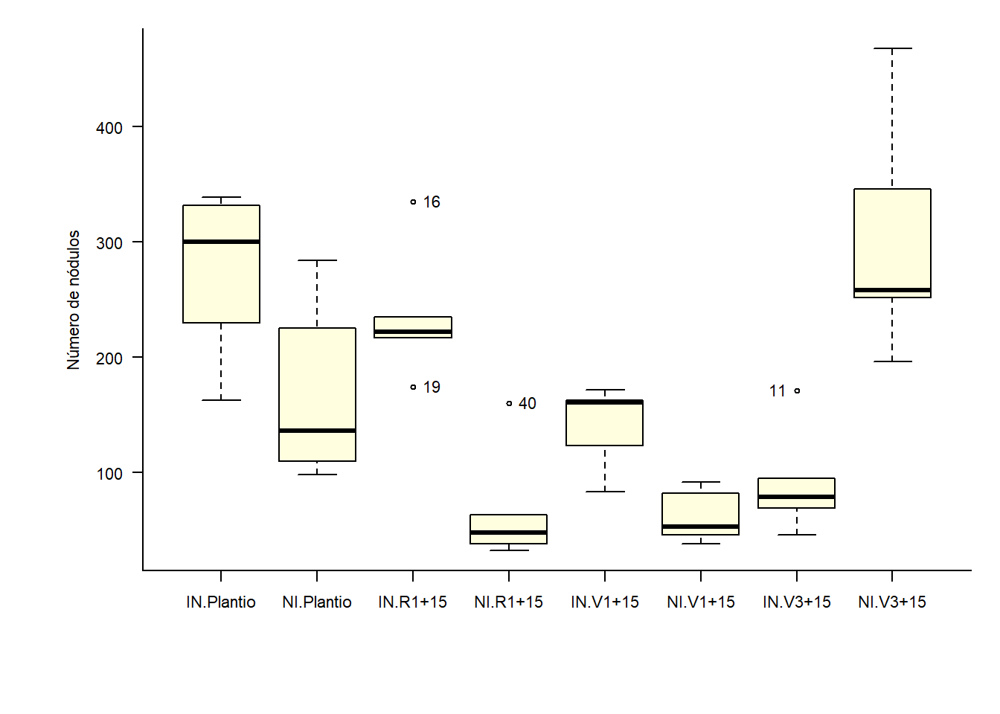

<br><br>

### Gráfico de interação


```r
with(dados, interaction.plot(F2, F1, resp, las=1, col=1:6, bty='l', 
                             xlab='', ylab='CBM', trace.label="FATOR1"))
```


```r
# FATOR1 e FATOR2
with(dados, interaction.plot(F1, F2, resp, las=1, col=1:6, bty='l', 
                             xlab='', ylab='CBM', trace.label="FATOR2"))
```


<br><br>

## Análise de Variância

**Hipótese do Fator 1**:

\begin{eqnarray*}
\left\{
\begin{array}{ll}
H_0: & \mu_1 = \mu_2\\[.2cm]
H_1: & \mu_i \neq \mu_i' \qquad i \neq i'.
\end{array}
\right.
\end{eqnarray*}

**Hipótese do Fator 2**:

\begin{eqnarray*}
\left\{
\begin{array}{ll}
H_0: & \mu_1 = \mu_2 = \mu_3 = \mu_4 \\[.2cm]
H_1: & \mu_i \neq \mu_i' \qquad i \neq i'.
\end{array}
\right.
\end{eqnarray*}

**Hipótese da interação**:

\begin{eqnarray*}
\left\{
\begin{array}{ll}
H_0: & \mbox{Todas as combinações entre os níveis do fator 1 e do fator 2 têm o mesmo efeito} \\[.2cm]
H_1: & \mbox{Pelo menos duas combinações entre os níveis do fator 1 e do fator 2 têm efeitos diferentes}.
\end{array}
\right.
\end{eqnarray*}


```r
mod = with(dados, aov(resp~F1*F2))
anova(mod)
```


            GL   SQ         QM         Teste F     p-valor   
----------  ---  ---------  ---------  ----------  ----------
F1          1    11696.4    11696.40   2.757934    0.1065420 
F2          3    84754.5    28251.50   6.661518    0.0012721 
F1:F2       3    212960.2   70986.73   16.738206   0.0000010 
Residuals   32   135712.0   4241.00                          

<br><br>

## Pressuposições

<br>

### Normalidade dos erros

\begin{eqnarray*}
\left\{
\begin{array}{ll}
H_0: & \mbox{Os erros seguem distribuição normal}\\[.2cm]
H_1: & \mbox{Os erros não seguem distribuição normal}.
\end{array}
\right.
\end{eqnarray*}


```r
(norm=shapiro.test(mod$res))
```

```
## 
## 	Shapiro-Wilk normality test
## 
## data:  mod$res
## W = 0.96809, p-value = 0.3125
```


```r
hnp::hnp(mod, las=1, xlab="Quantis teóricos", pch=16)
```

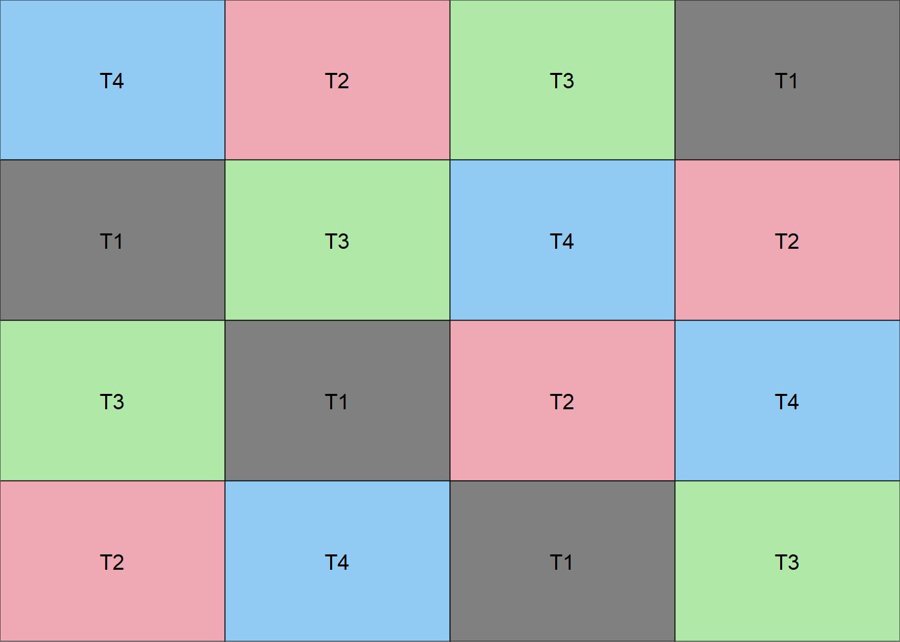

<br>

### Homogeneidade de variâncias

\begin{eqnarray*}
\left\{
\begin{array}{ll}
H_0: & \mbox{ As variâncias são homogêneas}\\[.2cm]
H_1: & \mbox{ As variâncias não são homogêneas}.
\end{array}
\right.
\end{eqnarray*}

#### Para Fator 1


```r
with(dados, bartlett.test(mod$residuals~F1))
```

```
## 
## 	Bartlett test of homogeneity of variances
## 
## data:  mod$residuals by F1
## Bartlett's K-squared = 1.1346, df = 1, p-value = 0.2868
```

<br>

#### Para Fator 2


```r
with(dados, bartlett.test(mod$residuals~F2))
```

```
## 
## 	Bartlett test of homogeneity of variances
## 
## data:  mod$residuals by F2
## Bartlett's K-squared = 8.1367, df = 3, p-value = 0.04327
```

<br>

#### Juntandos os fatores


```r
tratamentos=rep(c(paste("T",1:8)),e=5)
with(dados, bartlett.test(mod$residuals~tratamentos))
```

```
## 
## 	Bartlett test of homogeneity of variances
## 
## data:  mod$residuals by tratamentos
## Bartlett's K-squared = 9.8754, df = 7, p-value = 0.1957
```

<br>

### Independência dos erros

\begin{eqnarray*}
\left\{
\begin{array}{ll}
H_0: \mbox{Os erros são independentes}\\[.2cm]
H_1: \mbox{Os erros não são independentes}.
\end{array}
\right.
\end{eqnarray*}


```r
(ind=lmtest::dwtest(mod))
```

```
## 
## 	Durbin-Watson test
## 
## data:  mod
## DW = 1.9256, p-value = 0.07498
## alternative hypothesis: true autocorrelation is greater than 0
```


```r
plot(mod$res, las=1, pch=19, col='red', ylab='Resíduos brutos')
abline(h=0)
```


<br>

## Teste de comparações


```r
library(ExpDes.pt)
with(dados,fat2.dic(F1,F2,resp, mcomp="tukey"))
```

```
## ------------------------------------------------------------------------
## Legenda:
## FATOR 1:  F1 
## FATOR 2:  F2 
## ------------------------------------------------------------------------
## 
## 
## Quadro da analise de variancia
## ------------------------------------------------------------------------
##         GL     SQ    QM      Fc    Pr>Fc
## F1       1  11696 11696  2.7579 0.106542
## F2       3  84754 28252  6.6615 0.001272
## F1*F2    3 212960 70987 16.7382 0.000001
## Residuo 32 135712  4241                 
## Total   39 445123                       
## ------------------------------------------------------------------------
## CV = 38.68 %
## 
## ------------------------------------------------------------------------
## Teste de normalidade dos residuos (Shapiro-Wilk)
## valor-p:  0.3125183 
## De acordo com o teste de Shapiro-Wilk a 5% de significancia, os residuos podem ser considerados normais.
## ------------------------------------------------------------------------
## 
## 
## 
## Interacao significativa: desdobrando a interacao
## ------------------------------------------------------------------------
## 
## Desdobrando  F1  dentro de cada nivel de  F2 
## ------------------------------------------------------------------------
## ------------------------------------------------------------------------
## Quadro da analise de variancia
## ------------------------------------------------------------------------
##               GL       SQ        QM      Fc  Pr.Fc
## F2             3  84754.5  28251.50  6.6615 0.0013
## F1:F2 Plantio  1  26112.1  26112.10  6.1571 0.0185
## F1:F2 R1+15    1  70896.4  70896.40 16.7169  3e-04
## F1:F2 V1+15    1  15288.1  15288.10  3.6048 0.0667
## F1:F2 V3+15    1 112360.0 112360.00 26.4938      0
## Residuo       32 135712.0   4241.00               
## Total         39 445123.1  11413.41               
## ------------------------------------------------------------------------
## 
## 
## 
##  F1  dentro do nivel  Plantio  de  F2 
## ------------------------------------------------------------------------
## Teste de Tukey
## ------------------------------------------------------------------------
## Grupos Tratamentos Medias
## a 	 1 	 272.8 
##  b 	 2 	 170.6 
## ------------------------------------------------------------------------
## 
## 
##  F1  dentro do nivel  R1+15  de  F2 
## ------------------------------------------------------------------------
## Teste de Tukey
## ------------------------------------------------------------------------
## Grupos Tratamentos Medias
## a 	 1 	 236.6 
##  b 	 2 	 68.2 
## ------------------------------------------------------------------------
## 
## 
##  F1  dentro do nivel  V1+15  de  F2 
## 
## De acordo com o teste F, as medias desse fator sao estatisticamente iguais.
## ------------------------------------------------------------------------
##     Niveis     Medias
## 1        1      140.4
## 2        2       62.2
## ------------------------------------------------------------------------
## 
## 
##  F1  dentro do nivel  V3+15  de  F2 
## ------------------------------------------------------------------------
## Teste de Tukey
## ------------------------------------------------------------------------
## Grupos Tratamentos Medias
## a 	 2 	 304 
##  b 	 1 	 92 
## ------------------------------------------------------------------------
## 
## 
## 
## Desdobrando  F2  dentro de cada nivel de  F1 
## ------------------------------------------------------------------------
## ------------------------------------------------------------------------
## Quadro da analise de variancia
## ------------------------------------------------------------------------
##          GL       SQ       QM      Fc  Pr.Fc
## F1        1  11696.4 11696.40  2.7579 0.1065
## F2:F1 IN  3 105043.8 35014.58  8.2562  3e-04
## F2:F1 NI  3 192671.0 64223.65 15.1435      0
## Residuo  32 135712.0  4241.00               
## Total    39 445123.1 11413.41               
## ------------------------------------------------------------------------
## 
## 
## 
##  F2  dentro do nivel  IN  de  F1 
## ------------------------------------------------------------------------
## Teste de Tukey
## ------------------------------------------------------------------------
## Grupos Tratamentos Medias
## a 	 1 	 272.8 
## ab 	 2 	 236.6 
##  bc 	 3 	 140.4 
##   c 	 4 	 92 
## ------------------------------------------------------------------------
## 
## 
##  F2  dentro do nivel  NI  de  F1 
## ------------------------------------------------------------------------
## Teste de Tukey
## ------------------------------------------------------------------------
## Grupos Tratamentos Medias
## a 	 4 	 304 
##  b 	 1 	 170.6 
##  b 	 2 	 68.2 
##  b 	 3 	 62.2 
## ------------------------------------------------------------------------
```

<br><br><br><br>

****

# Esquema Fatorial (3 Fatores)

****

<br><br><br><br>

Nos experimentos mais simples comparamos níveis (tratamentos) de apenas um fator; entretanto, existem casos em que dois ou mais fatores devem ser estudados simultaneamente para que possam nos conduzir a resultados de interesse;

Em geral, os experimentos fatoriais são mais eficientes para este tipo de experimento, pois estudam, ao mesmo tempo, os efeitos de dois ou mais fatores, cada um deles com dois ou mais níveis.

O fatorial é um tipo de esquema, ou seja, uma das maneiras de organizar os tratamentos e não um tipo de delineamento;

Os experimentos fatoriais são montados segundo um tipo de delineamento experimental;

Nos experimentos fatoriais, os tratamentos são obtidos pelas combinações dos níveis dos fatores.

<br>

****

## Tipos de efeitos avaliados

****

<br>

- Efeito Principal: é o efeito de cada fator, independente do efeito dos outros fatores;

- Efeito de Interação: é o efeito simultâneo dos fatores sobre a variável em estudo. Dizemos que ocorre interação entre os fatores quando os efeitos dos níveis de um fator são modificados pelos níveis do outro fator.

<br>

****

## Vantagens

****

<br>

a) Pode-se estudar dois ou mais fatores num único experimento.

b) Pode-se, por meio dos efeitos das interações, verificar se um fator é independente ou dependente do(s) outro(s).

****

## Desvantagens

****

<br>

a) O número de tratamentos ou combinações de níveis de fatores cresce, rapidamente, com o aumento do número de níveis, em cada fator, ou mesmo com o aumento do número de fatores.

b) A interpretação dos resultados se torna mais difícil é medida que aumentamos o número de níveis e de fatores no experimento.

<br>

****

## Modelo estatístico

****

<br>

As observações podem ser descritas pelo modelo estatístico linear:

<center>

$y_{ijk} = \mu+\beta_{1i}+\beta_{2j}+\beta_{3k}+(\beta_1\beta_2)_{ij}+(\beta_1\beta_3)_{ik}+(\beta_2\beta_3)_{jk}+(\beta_1\beta_2\beta_3)_{ijk}+\epsilon_{ijk}$

</center>

- i = 1; 2; : : : ; a
- j = 1; 2; : : : ; b
- k = 1; 2; : : : ; c

em que:

- $y_{ijk}$ é o valor observado no i-ésimo nível do fator A, j-ésima nível do fator B e k-ésimo nível do fator C;
- $\mu$ é uma constante;
- $\beta_{1i}$ é o efeito do i-ésimo nível do fator A;
- $\beta_{2j}$ é o efeito do j-ésimo nível do fator B;
- $\beta_{3k}$ é o efeito do j-ésimo nível do fator C;
- $(\beta_1\beta_2)_ij$ é o efeito da interação entre $\beta_{1i}$ e $\beta_{2j}$;
- $(\beta_1\beta_3)_ik$ é o efeito da interação entre $\beta_{1i}$ e $\beta_{3j}$;
- $(\beta_2\beta_3)_jk$ é o efeito da interação entre $\beta_{2i}$ e $\beta_{3j}$;
- $(\beta_1\beta_2\beta_3)_{ijk}$ é o efeito da interação entre $\beta_{1i}$, $\beta_{2j}$ e $\beta_{3k}$;
- $(\epsilon)ijk$ é o componente de erro aleatório.

<br>

****

## Hipóteses e modelo

****

<br>

No experimento fatorial com 3 fatores, deseja-se testar a signicância de ambos os fatores. 

No experimento fatorial com 2 fatores, deseja-se testar a signicância de ambos os fatores. 

Há interesse em testar hipóteses sobre a igualdade dos efeitos do fator A, isto é:

- H0 : $\beta_{11}$ = $\beta_{12}$ = : : : $\beta_{1a}$ = 0
- H1 : Pelo menos um $\beta_{1i} \neq 0$

e a igualdade nos efeitos do fator B, ou seja:

- H0 : $\beta_{21}$ = $\beta_{22}$ = : : : $\beta_{2b}$ = 0
- H1 : Pelo menos um $\beta_{2j} \neq 0$

e, ainda, se há interação entre os fatores A e B:

- H0 : $(\beta_1\beta_2)_{ij}$ = 0 para todo i ; j
- H1 : Pelo menos um $(\beta_1\beta_2)_{ij} \neq 0$

e, ainda, se há interação entre os fatores A e C:

- H0 : $(\beta_1\beta_3)_{ik}$ = 0 para todo i ; k
- H1 : Pelo menos um $(\beta_1\beta_3)_{ik} \neq 0$

e, ainda, se há interação entre os fatores B e C:

- H0 : $(\beta_2\beta_3)_{jk}$ = 0 para todo j ; k
- H1 : Pelo menos um $(\beta_2\beta_3)_{jk} \neq 0$

e, ainda, se há interação entre os fatores A e B e C:

- H0 : $(\beta_1\beta_2\beta_3)_{ijk}$ = 0 para todo i ; j; k
- H1 : Pelo menos um $(\beta_1\beta_2\beta_3)_{ijk} \neq 0$

<br><br><br>

****

## Exemplo 1

****

<br>

Neste exemplo, vamos trabalhar com um experimento conduzido em delineamento inteiramente casualziado em esquema fatorial 3 x 3 x 3, em que todos os níveis dos fatores são qualitativos. Cada tratamento foi composto por quatro repetições, totalizando 108 parcelas. Os tratamentos consistem em:

 - Fator 1: A1; A2 e A3
 - Fator 2: B1; B2 e B3
 - Fator 3: C1; C2 e C3

Variável analisada: Produtividade em kg ha$^{-1}$

<br><br>

## Conjunto de dados


```r
RENDIMENTO=c(4599.55,6203.50,4566.02,5616.38,4978.35,5126.15,4816.23,4251.00,4106.79,
             4600.58,4012.14,4623.41,4274.16,4683.50,4433.33,4326.16,4932.66,5066.67,
             4697.29,5011.38,5156.72,4744.21,4826.80,4663.26,4807.19,4377.19,4442.07,
             4685.58,5066.90,5317.66,5144.19,4580.18,4860.37,5204.21,5146.19,5015.67,
             5801.99,4668.05,5393.16,5282.27,5369.41,5494.43,4980.32,5715.76,4754.54,
             5000.83,4664.11,4969.41,5315.43,4872.29,5546.79,4765.79,4649.63,4899.31,
             4890.89,5117.10,4942.97,4548.97,4916.97,4225.38,4820.21,4150.44,4648.46,
             4271.57,5143.54,4808.97,5459.66,4928.35,5224.70,4900.90,4770.88,4977.68,
             5816.80,5107.11,5555.80,5767.65,5117.10,5573.08,5673.87,4859.00,4687.26,
             5055.22,5235.22,4961.72,4984.93,5425.67,4978.33,5172.60,5328.07,4973.87,
             5296.55,4928.01,4528.12,5337.93,5809.20,4914.70,5191.89,5261.24,5287.53,
             5680.55,5080.06,5425.53,4949.13,5300.57,4481.23,5039.54,5223.75,4581.65)
FATOR1=rep(rep(c("A1","A2","A3"), e=12),3)
FATOR2=rep(c("B1","B2","B3"), e=36)
FATOR3=rep(rep(c("C1","c2","c3"),e=4),9)
dados=data.frame(FATOR1,FATOR2,FATOR3,RENDIMENTO)
```

<br><br>

## Análise Exploratória dos dados

<br>

### Análise Exploratória dos dados (Geral)


```r
media=mean(RENDIMENTO)
variancia=var(RENDIMENTO)
desvio=sd(RENDIMENTO)
cv=desvio/media*100
cbind(media,variancia,desvio,cv)
```

```
##         media variancia   desvio       cv
## [1,] 4985.604  172705.4 415.5784 8.335568
```

<br>

### Análise Exploratória dos dados (Fator 1)


```r
media=tapply(RENDIMENTO, FATOR1,mean)
variancia=tapply(RENDIMENTO, FATOR1,var)
desvio=tapply(RENDIMENTO, FATOR1,sd)
cv=desvio/media*100
cbind(media,variancia,desvio,cv)
```

```
##       media variancia   desvio        cv
## A1 5083.450  263382.8 513.2084 10.095670
## A2 4921.823  124860.9 353.3566  7.179384
## A3 4951.540  124516.3 352.8687  7.126444
```

<br>

### Análise Exploratória dos dados (Fator 2)


```r
media=tapply(RENDIMENTO, FATOR2,mean)
variancia=tapply(RENDIMENTO, FATOR2,var)
desvio=tapply(RENDIMENTO, FATOR2,sd)
cv=desvio/media*100
cbind(media,variancia,desvio,cv)
```

```
##       media variancia   desvio       cv
## B1 4804.546  184134.8 429.1093 8.931319
## B2 4969.199  150227.6 387.5920 7.799889
## B3 5183.069  119520.8 345.7178 6.670136
```

<br>

### Análise Exploratória dos dados (Fator 3)


```r
media=tapply(RENDIMENTO, FATOR3,mean)
variancia=tapply(RENDIMENTO,FATOR3,var)
desvio=tapply(RENDIMENTO,FATOR3,sd)
cv=desvio/media*100
cbind(media,variancia,desvio,cv)
```

```
##       media variancia   desvio        cv
## C1 5021.699 277212.38 526.5096 10.484690
## c2 5081.969  97030.46 311.4971  6.129458
## c3 4853.145 124804.19 353.2764  7.279328
```

<br>

### Análise Exploratória dos dados (Juntando tratamentos)


```r
media=tapply(RENDIMENTO, paste(FATOR1,FATOR2,FATOR3),mean)
variancia=tapply(RENDIMENTO, paste(FATOR1,FATOR2,FATOR3),var)
desvio=tapply(RENDIMENTO, paste(FATOR1,FATOR2,FATOR3),sd)
cv=desvio/media*100
cbind(media,variancia,desvio,cv)
```

```
##             media variancia   desvio        cv
## A1 B1 C1 5246.363 644752.49 802.9648 15.305172
## A1 B1 c2 4792.932 146549.05 382.8173  7.987120
## A1 B1 c3 4335.730 103343.11 321.4702  7.414443
## A1 B2 C1 5286.368 219868.17 468.9010  8.870004
## A1 B2 c2 5389.980  95095.62 308.3758  5.721279
## A1 B2 c3 4847.222  26881.76 163.9566  3.382485
## A1 B3 C1 5561.840 104726.07 323.6141  5.818472
## A1 B3 c2 5305.762 147384.02 383.9063  7.235647
## A1 B3 c3 4984.855  52243.96 228.5694  4.585276
## A2 B1 C1 4429.288  33113.39 181.9708  4.108355
## A2 B1 c2 4927.000  26475.47 162.7128  3.302473
## A2 B1 c3 4847.748  46886.15 216.5321  4.466654
## A2 B2 C1 5125.075 135688.18 368.3588  7.187383
## A2 B2 c2 4889.233  36479.09 190.9950  3.906441
## A2 B2 c3 4658.573 115773.22 340.2546  7.303839
## A2 B3 C1 5140.382  44284.47 210.4388  4.093835
## A2 B3 c2 5131.625  44045.53 209.8703  4.089743
## A2 B3 c3 5147.488 303979.30 551.3432 10.710918
## A3 B1 C1 4578.007  40967.71 202.4048  4.421243
## A3 B1 c2 5027.233  99818.88 315.9413  6.284596
## A3 B1 c3 5056.610  23332.19 152.7488  3.020774
## A3 B2 C1 4472.670  98653.19 314.0910  7.022451
## A3 B2 c2 5085.130  81509.59 285.4988  5.614386
## A3 B2 c3 4968.540  36448.71 190.9155  3.842486
## A3 B3 C1 5355.302  48643.48 220.5527  4.118398
## A3 B3 c2 5188.823  45933.24 214.3204  4.130425
## A3 B3 c3 4831.542 127418.26 356.9569  7.388054
```

<br><br>

## Gráfico exploratório

<br>

### Gráfico de caixas


```r
par(mai=c(2,0.8,0.5,0.5))
car::Boxplot(RENDIMENTO~paste(FATOR1,FATOR2,FATOR3), las=2, xlab="")
```

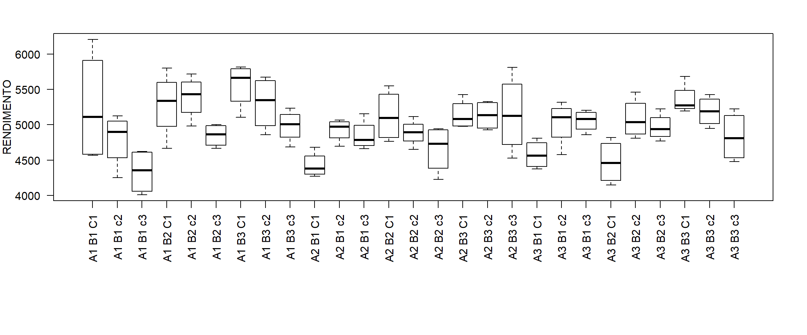

<br>

### Gráfico de interação


```r
FATOR1=FATOR1
FATOR2=FATOR2
FATOR3=FATOR3
RESP=RENDIMENTO
par(mfrow=c(1,2), bty="l")
interaction.plot(FATOR1,FATOR2,RESP, ylab="Resposta")
interaction.plot(FATOR2,FATOR1,RESP, ylab="Resposta")
```

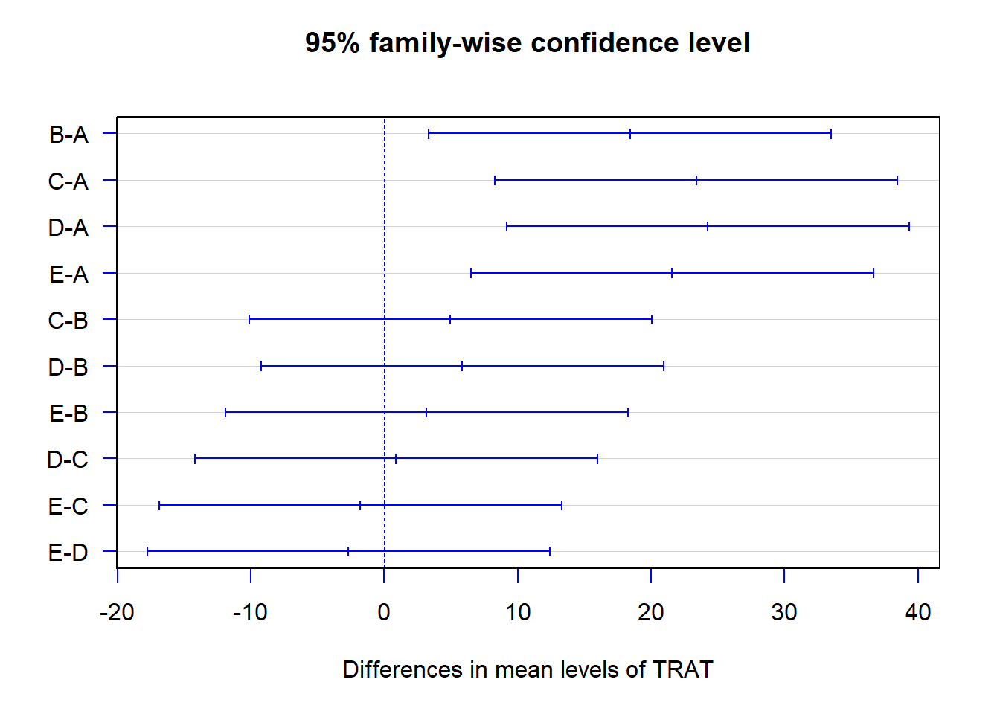

```r
interaction.plot(FATOR1,FATOR3,RESP, ylab="Resposta")
interaction.plot(FATOR2,FATOR1,RESP, ylab="Resposta")
```


```r
interaction.plot(FATOR2,FATOR3,RESP, ylab="Resposta")
interaction.plot(FATOR3,FATOR2,RESP, ylab="Resposta")
```

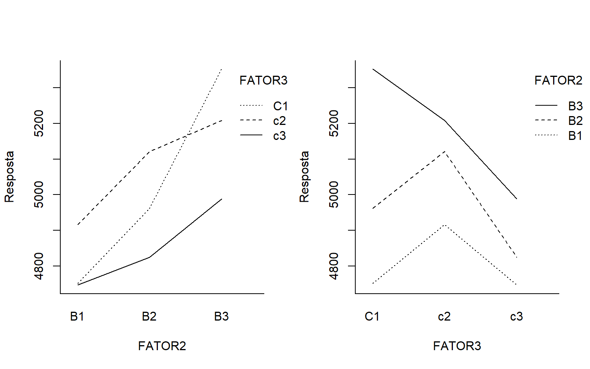

<br>

## Análise de variância


```r
modelo=aov(RESP~FATOR1*FATOR2*FATOR3)
anova(modelo)
```

```
## Analysis of Variance Table
## 
## Response: RESP
##                      Df  Sum Sq Mean Sq F value    Pr(>F)    
## FATOR1                2  532881  266440  2.4550  0.092230 .  
## FATOR2                2 2593572 1296786 11.9487 2.836e-05 ***
## FATOR3                2 1012836  506418  4.6662  0.012078 *  
## FATOR1:FATOR2         4  568196  142049  1.3089  0.273715    
## FATOR1:FATOR3         4 2177621  544405  5.0162  0.001158 ** 
## FATOR2:FATOR3         4  548172  137043  1.2627  0.291478    
## FATOR1:FATOR2:FATOR3  8 2255321  281915  2.5976  0.014010 *  
## Residuals            81 8790883  108529                      
## ---
## Signif. codes:  0 '***' 0.001 '**' 0.01 '*' 0.05 '.' 0.1 ' ' 1
```

O que se observa nesta análise:

 - Efeito de interação tripla: F1 x F2 x F3;
 - Efeito de interação dupla: F1 x F3;
 - Efeito isolado dos fatores F2 e F3.

<br><br>

## Pressuposições

<br>

### Normalidade dos erros

Análise gráfica e pelo teste de normalidade de Shapiro-Wilk


```r
shapiro.test(modelo$residuals)
```

```
## 
## 	Shapiro-Wilk normality test
## 
## data:  modelo$residuals
## W = 0.98386, p-value = 0.217
```

```r
hnp::hnp(modelo)
```

```
## Gaussian model (aov object)
```


Como p-valor calculado ($p=0.217$) é menor que o nível de significância adotado ($\alpha=0.05$), não rejeita-se $H_0$. Logo, os erros podem ser considerados normais

<br>

### Homogeneidade das variâncias


```r
bartlett.test(modelo$residuals~paste(FATOR1,FATOR2,FATOR3))
```

```
## 
## 	Bartlett test of homogeneity of variances
## 
## data:  modelo$residuals by paste(FATOR1, FATOR2, FATOR3)
## Bartlett's K-squared = 26.434, df = 26, p-value = 0.4394
```

Como p-valor calculado ($p=0.4394$) é menor que o nível de significância adotado ($\alpha=0.05$), não rejeita-se $H_0$. Logo, as variâncias podem ser consideradas homogêneas.

<br>

### Independência dos erros


```r
lmtest::dwtest(modelo)
```

```
## 
## 	Durbin-Watson test
## 
## data:  modelo
## DW = 2.8115, p-value = 0.9728
## alternative hypothesis: true autocorrelation is greater than 0
```

Como p-valor calculado ($p=0.9728$) é menor que o nível de significância adotado ($\alpha=0.05$), não rejeita-se $H_0$. Logo, os erros podem ser considerados independentes.

<br>

### Gráfico de residuos padronizados


```r
a=anova(modelo)
plot(modelo$residuals/sqrt(a$`Mean Sq`[7]),
     ylab="Resíduos padronizados",
     pch=16,
     las=1,
     col="red")
abline(h=c(0,3,-3),
       lty=2,
       col="blue")
```

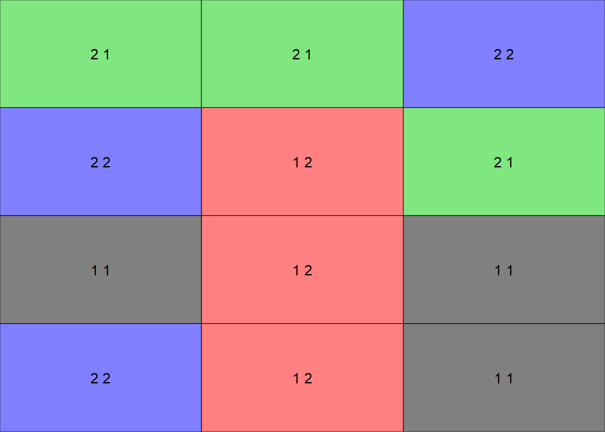

<br><br>

## Teste de comparação 

<br>

### Pacote ExpDes.pt


```r
library(ExpDes.pt)
fat3.dic(FATOR1,FATOR2,FATOR3,RESP)
```

```
## ------------------------------------------------------------------------
## Legenda:
## FATOR 1:  F1 
## FATOR 2:  F2 
## FATOR 3:  F3 
## ------------------------------------------------------------------------
## 
## ------------------------------------------------------------------------
## Quadro da analise de variancia
## ------------------------------------------------------------------------
##           GL         SQ            QM      Fc  Pr>Fc
## F1         2   532880.7  266440.36564   2.455 0.0922
## F2         2  2593572.1 1296786.06573 11.9487      0
## F3         2  1012836.0  506417.98458  4.6662 0.0121
## F1*F2      4   568195.7  142048.92116  1.3089 0.2737
## F1*F3      4  2177620.9  544405.22841  5.0162 0.0012
## F2*F3      4   548172.3  137043.08275  1.2627 0.2915
## F1*F2*F3   8  2255321.1   281915.1382  2.5976  0.014
## Residuo   81  8790882.9  108529.41824               
## Total    107 18479481.7                             
## ------------------------------------------------------------------------
## CV = 0.03 %
## 
## ------------------------------------------------------------------------
## Teste de normalidade dos residuos (Shapiro-Wilk)
## valor-p:  0.2169645 
## De acordo com o teste de Shapiro-Wilk a 5% de significancia, os residuos podem ser considerados normais.
## ------------------------------------------------------------------------
## 
## 
## 
## Interacao F1*F2*F3  significativa: desdobrando a interacao
## ------------------------------------------------------------------------
## 
## Desdobrando  F1  dentro de cada nivel de  F2 e F3 
## ------------------------------------------------------------------------
## ------------------------------------------------------------------------
## Quadro da analise de variancia
## ------------------------------------------------------------------------
##           GL         SQ        QM       Fc    Pr>Fc
## F1: B1 C1  2 1515236.80 757618.40 6.980765 0.001596
## F1: B1 c2  2  110556.18  55278.09 0.509337 0.602805
## F1: B1 c3  2 1100604.58 550302.29 5.070536 0.008418
## F1: B2 C1  2 1485001.57 742500.78  6.84147 0.001797
## F1: B2 c2  2  509409.88 254704.94 2.346875 0.102142
## F1: B2 c3  2  195182.15  97591.07 0.899213 0.410912
## F1: B3 C1  2  355299.69 177649.85 1.636882 0.200956
## F1: B3 c2  2   63027.18  31513.59 0.290369 0.748763
## F1: B3 c3  2  199700.39  99850.20 0.920029 0.402631
## Residuo   81 8790882.88 108529.42                  
## ------------------------------------------------------------------------
## 
## 
## 
##  F1  dentro da combinacao dos niveis  B1  de  F2  e  C1  de  F3 
## ------------------------------------------------------------------------
## Teste de Tukey
## ------------------------------------------------------------------------
## Grupos Tratamentos Medias
## a 	 A1 	 5246.363 
##  b 	 A3 	 4578.007 
##  b 	 A2 	 4429.288 
## ------------------------------------------------------------------------
## 
## 
##  F1  dentro da combinacao dos niveis  B1  de  F2  e  c2  de  F3 
## 
## De acordo com o teste F, as medias desse fator sao estatisticamente iguais.
## ------------------------------------------------------------------------
##     Niveis     Medias
## 1       A1   4792.932
## 2       A2   4927.000
## 3       A3   5027.233
## ------------------------------------------------------------------------
## 
## 
##  F1  dentro da combinacao dos niveis  B1  de  F2  e  c3  de  F3 
## ------------------------------------------------------------------------
## Teste de Tukey
## ------------------------------------------------------------------------
## Grupos Tratamentos Medias
## a 	 A3 	 5056.61 
## ab 	 A2 	 4847.748 
##  b 	 A1 	 4335.73 
## ------------------------------------------------------------------------
## 
## 
##  F1  dentro da combinacao dos niveis  B2  de  F2  e  C1  de  F3 
## ------------------------------------------------------------------------
## Teste de Tukey
## ------------------------------------------------------------------------
## Grupos Tratamentos Medias
## a 	 A1 	 5286.368 
## a 	 A2 	 5125.075 
##  b 	 A3 	 4472.67 
## ------------------------------------------------------------------------
## 
## 
##  F1  dentro da combinacao dos niveis  B2  de  F2  e  c2  de  F3 
## 
## De acordo com o teste F, as medias desse fator sao estatisticamente iguais.
## ------------------------------------------------------------------------
##     Niveis     Medias
## 1       A1   5389.980
## 2       A2   4889.233
## 3       A3   5085.130
## ------------------------------------------------------------------------
## 
## 
##  F1  dentro da combinacao dos niveis  B2  de  F2  e  c3  de  F3 
## 
## De acordo com o teste F, as medias desse fator sao estatisticamente iguais.
## ------------------------------------------------------------------------
##     Niveis     Medias
## 1       A1   4847.222
## 2       A2   4658.573
## 3       A3   4968.540
## ------------------------------------------------------------------------
## 
## 
##  F1  dentro da combinacao dos niveis  B3  de  F2  e  C1  de  F3 
## 
## De acordo com o teste F, as medias desse fator sao estatisticamente iguais.
## ------------------------------------------------------------------------
##     Niveis     Medias
## 1       A1   5561.840
## 2       A2   5140.382
## 3       A3   5355.302
## ------------------------------------------------------------------------
## 
## 
##  F1  dentro da combinacao dos niveis  B3  de  F2  e  c2  de  F3 
## 
## De acordo com o teste F, as medias desse fator sao estatisticamente iguais.
## ------------------------------------------------------------------------
##     Niveis     Medias
## 1       A1   5305.762
## 2       A2   5131.625
## 3       A3   5188.823
## ------------------------------------------------------------------------
## 
## 
##  F1  dentro da combinacao dos niveis  B3  de  F2  e  c3  de  F3 
## 
## De acordo com o teste F, as medias desse fator sao estatisticamente iguais.
## ------------------------------------------------------------------------
##     Niveis     Medias
## 1       A1   4984.855
## 2       A2   5147.488
## 3       A3   4831.542
## ------------------------------------------------------------------------
## 
## 
## 
## Desdobrando  F2  dentro de cada nivel de  F1 e F3 
## ------------------------------------------------------------------------
## ------------------------------------------------------------------------
## Quadro da analise de variancia
## ------------------------------------------------------------------------
##           GL         SQ        QM       Fc    Pr>Fc
## F2: A1 C1  2  236015.40 118007.70 1.087334 0.341983
## F2: A1 c2  2  835403.88 417701.94 3.848744 0.025307
## F2: A1 c3  2  935907.40 467953.70 4.311768 0.016617
## F2: A2 C1  2 1320014.22 660007.11 6.081366 0.003462
## F2: A2 c2  2  136069.20  68034.60 0.626877 0.536829
## F2: A2 c3  2  486225.50 243112.75 2.240063 0.113007
## F2: A3 C1  2 1859098.18 929549.09  8.56495 0.000422
## F2: A3 c2  2   53620.78  26810.39 0.247033 0.781701
## F2: A3 c3  2  102906.69  51453.35 0.474096 0.624164
## Residuo   81 8790882.88 108529.42                  
## ------------------------------------------------------------------------
## 
## 
## 
##  F2  dentro da combinacao dos niveis  A1  de  F1  e  C1  de  F3 
## 
## De acordo com o teste F, as medias desse fator sao estatisticamente iguais.
## ------------------------------------------------------------------------
##     Niveis     Medias
## 1       B1   5246.363
## 2       B2   5286.368
## 3       B3   5561.840
## ------------------------------------------------------------------------
## 
## 
##  F2  dentro da combinacao dos niveis  A1  de  F1  e  c2  de  F3 
## ------------------------------------------------------------------------
## Teste de Tukey
## ------------------------------------------------------------------------
## Grupos Tratamentos Medias
## a 	 B2 	 5389.98 
## ab 	 B3 	 5305.762 
##  b 	 B1 	 4792.932 
## ------------------------------------------------------------------------
## 
## 
##  F2  dentro da combinacao dos niveis  A1  de  F1  e  c3  de  F3 
## ------------------------------------------------------------------------
## Teste de Tukey
## ------------------------------------------------------------------------
## Grupos Tratamentos Medias
## a 	 B3 	 4984.855 
## ab 	 B2 	 4847.222 
##  b 	 B1 	 4335.73 
## ------------------------------------------------------------------------
## 
## 
##  F2  dentro da combinacao dos niveis  A2  de  F1  e  C1  de  F3 
## ------------------------------------------------------------------------
## Teste de Tukey
## ------------------------------------------------------------------------
## Grupos Tratamentos Medias
## a 	 B3 	 5140.382 
## a 	 B2 	 5125.075 
##  b 	 B1 	 4429.288 
## ------------------------------------------------------------------------
## 
## 
##  F2  dentro da combinacao dos niveis  A2  de  F1  e  c2  de  F3 
## 
## De acordo com o teste F, as medias desse fator sao estatisticamente iguais.
## ------------------------------------------------------------------------
##     Niveis     Medias
## 1       B1   4927.000
## 2       B2   4889.233
## 3       B3   5131.625
## ------------------------------------------------------------------------
## 
## 
##  F2  dentro da combinacao dos niveis  A2  de  F1  e  c3  de  F3 
## 
## De acordo com o teste F, as medias desse fator sao estatisticamente iguais.
## ------------------------------------------------------------------------
##     Niveis     Medias
## 1       B1   4847.748
## 2       B2   4658.573
## 3       B3   5147.488
## ------------------------------------------------------------------------
## 
## 
##  F2  dentro da combinacao dos niveis  A3  de  F1  e  C1  de  F3 
## ------------------------------------------------------------------------
## Teste de Tukey
## ------------------------------------------------------------------------
## Grupos Tratamentos Medias
## a 	 B3 	 5355.302 
##  b 	 B1 	 4578.007 
##  b 	 B2 	 4472.67 
## ------------------------------------------------------------------------
## 
## 
##  F2  dentro da combinacao dos niveis  A3  de  F1  e  c2  de  F3 
## 
## De acordo com o teste F, as medias desse fator sao estatisticamente iguais.
## ------------------------------------------------------------------------
##     Niveis     Medias
## 1       B1   5027.233
## 2       B2   5085.130
## 3       B3   5188.823
## ------------------------------------------------------------------------
## 
## 
##  F2  dentro da combinacao dos niveis  A3  de  F1  e  c3  de  F3 
## 
## De acordo com o teste F, as medias desse fator sao estatisticamente iguais.
## ------------------------------------------------------------------------
##     Niveis     Medias
## 1       B1   5056.610
## 2       B2   4968.540
## 3       B3   4831.542
## ------------------------------------------------------------------------
## 
## Desdobrando  F3  dentro de cada nivel de  F1 e F2 
## ------------------------------------------------------------------------
## ------------------------------------------------------------------------
## Quadro da analise de variancia
## ------------------------------------------------------------------------
##           GL           SQ          QM       Fc    Pr>Fc
## F3: A1 B1  2 1658512.5880 829256.2940 7.640843 0.000912
## F3: A1 B2  2  664226.1133 332113.0567  3.06012 0.052338
## F3: A1 B3  2  668625.3330 334312.6665 3.080388 0.051362
## F3: A2 B1  2  572143.2840 286071.6420  2.63589 0.077796
## F3: A2 B2  2  435267.0706 217633.5353 2.005295 0.141249
## F3: A2 B3  2     505.0583    252.5292 0.002327 0.997676
## F3: A3 B1  2  575635.3215 287817.6608 2.651978  0.07663
## F3: A3 B2  2  846116.7155 423058.3577 3.898098 0.024192
## F3: A3 B3  2  572918.8352 286459.4176 2.639463 0.077536
## Residuo   81 8790882.8771 108529.4182                  
## ------------------------------------------------------------------------
## 
## 
## 
##  F3  dentro da combinacao dos niveis  A1  de  F1  e  B1  de  F2 
## ------------------------------------------------------------------------
## Teste de Tukey
## ------------------------------------------------------------------------
## Grupos Tratamentos Medias
## a 	 C1 	 5246.363 
## ab 	 c2 	 4792.932 
##  b 	 c3 	 4335.73 
## ------------------------------------------------------------------------
## 
## 
##  F3  dentro da combinacao dos niveis  A1  de  F1  e  B2  de  F2 
## 
## De acordo com o teste F, as medias desse fator sao estatisticamente iguais.
## ------------------------------------------------------------------------
##     Niveis     Medias
## 1       C1   5286.368
## 2       c2   5389.980
## 3       c3   4847.222
## ------------------------------------------------------------------------
## 
## 
##  F3  dentro da combinacao dos niveis  A1  de  F1  e  B3  de  F2 
## 
## De acordo com o teste F, as medias desse fator sao estatisticamente iguais.
## ------------------------------------------------------------------------
##     Niveis     Medias
## 1       C1   5561.840
## 2       c2   5305.762
## 3       c3   4984.855
## ------------------------------------------------------------------------
## 
## 
##  F3  dentro da combinacao dos niveis  A2  de  F1  e  B1  de  F2 
## 
## De acordo com o teste F, as medias desse fator sao estatisticamente iguais.
## ------------------------------------------------------------------------
##     Niveis     Medias
## 1       C1   4429.288
## 2       c2   4927.000
## 3       c3   4847.748
## ------------------------------------------------------------------------
## 
## 
##  F3  dentro da combinacao dos niveis  A2  de  F1  e  B2  de  F2 
## 
## De acordo com o teste F, as medias desse fator sao estatisticamente iguais.
## ------------------------------------------------------------------------
##     Niveis     Medias
## 1       C1   5125.075
## 2       c2   4889.233
## 3       c3   4658.573
## ------------------------------------------------------------------------
## 
## 
##  F3  dentro da combinacao dos niveis  A2  de  F1  e  B3  de  F2 
## 
## De acordo com o teste F, as medias desse fator sao estatisticamente iguais.
## ------------------------------------------------------------------------
##     Niveis     Medias
## 1       C1   5140.382
## 2       c2   5131.625
## 3       c3   5147.488
## ------------------------------------------------------------------------
## 
## 
##  F3  dentro da combinacao dos niveis  A3  de  F1  e  B1  de  F2 
## 
## De acordo com o teste F, as medias desse fator sao estatisticamente iguais.
## ------------------------------------------------------------------------
##     Niveis     Medias
## 1       C1   4578.007
## 2       c2   5027.233
## 3       c3   5056.610
## ------------------------------------------------------------------------
## 
## 
##  F3  dentro da combinacao dos niveis  A3  de  F1  e  B2  de  F2 
## ------------------------------------------------------------------------
## Teste de Tukey
## ------------------------------------------------------------------------
## Grupos Tratamentos Medias
## a 	 c2 	 5085.13 
## ab 	 c3 	 4968.54 
##  b 	 C1 	 4472.67 
## ------------------------------------------------------------------------
## 
## 
##  F3  dentro da combinacao dos niveis  A3  de  F1  e  B3  de  F2 
## 
## De acordo com o teste F, as medias desse fator sao estatisticamente iguais.
## ------------------------------------------------------------------------
##     Niveis     Medias
## 1       C1   5355.302
## 2       c2   5188.823
## 3       c3   4831.542
## ------------------------------------------------------------------------
```

<br>

### Pacote easyanova


```r
library(easyanova)
ea2(data.frame(FATOR1,FATOR2,FATOR3,RESP),design = 7)
```

**Obs.** Em função da saída extensa da *package* easyanova, foi ocultado o resultado do mesmo.

<br>

## Tabela Final

<br>

**Sugestão de tabela**

+---------------+---------------+------------------------------+------------------------------+------------------------------+
| FATOR1        | FATOR 2       |                              | FATOR 3                      |                              |
+===============+===============+==============================+==============================+==============================+
|               |               | C1                           | C2                           | C3                           |
+---------------+---------------+------------------------------+------------------------------+------------------------------+
|               | - B1           - 5245,36 *a*aA                  - 4335,73 *b*bB                  - 4792,93 *a*aAB             |
| A1            | - B2           - 5286,37 *a*aA                  - 4847,22 *a*abA                 - 5389,98 *a*aA              |
|               | - B3           - 5561,84 *a*aA                  - 4984,86 *a*aA                  - 5305,76 *a*abA             |
+---------------+---------------+------------------------------+------------------------------+------------------------------+
|               | - B1           - 4429,29 *b*bA                  - 4847,75 *ab*aA                 - 4927,00 *a*aA              |
| A2            | - B2           - 5125,08 *a*aA                  - 4658,57 *a*aA                  - 4889,23 *a*aA              |
|               | - B3           - 5140,38 *a*aA                  - 5147,49 *a*aA                  - 5131,63 *a*aA              |
+---------------+---------------+------------------------------+------------------------------+------------------------------+
|               | - B1           - 4578,00 *b*bA                  - 5056,61 *a*aA                  - 5027,23 *a*aA              |
| A3            | - B2           - 4472,67 *b*bB                  - 4968,54 *a*aAB                 - 5085,13 *a*aA              |
|               | - B3           - 5355,30 *a*aA                  - 4831,54 *a*aA                  - 5188,82 *a*aA              |
+---------------+---------------+------------------------------+------------------------------+------------------------------+
|- F1           | - 0,0922$^{ns}$                                                                                            |
|- F2           | - 0,0000$^{**}$                                                                                           |
|- F3           | - 0,0121$^*$                                                                                               |
|- F1xF2        | - 0,2737$^{ns}$                                                                                            |
|- F1xF3        | - 0,0012$^{**}$                                                                                            |
|- F1xF3        | - 0,2915$^{ns}$                                                                                            |
|- F1xF2xF3     | - 0,0140$^*$                                                                                               |
+---------------+---------------+------------------------------+------------------------------+------------------------------+

Médias seguidas de mesma letra maiúscula na linha, minúscula em itálico dentro dos níveis do Fator 2, e minúsculo dentro dos níveis do Fator 1 não diferem pelo teste de Tukey ($p\leqslant 0,05$). $^*,^{**},^{ns}$, significativo a 5%, 1% e não significativo pelo teste F.

<br><br><br><br>

****

# Esquema de Parcelas Subdivididas

****

<br><br><br><br>

- Tal como no caso de fatorial, o termo parcelas subdivididas não se refere a um tipo de delineamento e sim ao esquema do experimento, ou seja, a maneira pela qual os tratamentos são organizados.
- Nos experimentos em parcelas subdivididas, em geral, estuda-se simultaneamente dois tipos de fatores os quais são geralmente denominados de fatores primários e fatores secundários.
- Em um experimento em parcelas subdivididas, as unidades experimentais são agrupadas em parcelas as quais devem conter um número de unidades experimentais (subparcelas) igual ao
número de níveis do fator secundário.
- Na instalação os níveis do fator primário (A) são distribuidos às parcelas segundo um tipo de delineamento experimental: DIC, DBC, DQL.
- Posteriormente os níveis do fator secundário (B) são distribuídos ao acaso às subparcerlas de cada parcela.Tal disposição permite obter uma estimativa geral de maior precisão para os efeitos dos tratamentos do segundo fator.
- Nos experimentos em parcelas subdivididas tem-se dois resíduos distintos: um correspondente às parcelas e outro às subparcelas dentro das parcelas.
- Em casos mais complexos, as subparcelas podem, também, ser repartidas em subsubparcelas. Tem-se, neste caso, três resíduos distintos:
  - resíduo (a), referente às parcelas;
  - resíduo (b), à subparcelas e
  - resíduo (c), correspondendo às subsubparcelas.

<br>

****

## Vantagens

****

<br>

a) Em comparação com experimentos fatoriais, experimentos em parcelas subdivididas são mais fáceis de instalar;

b) Quando os tratamentos associados aos níveis de um dos fatores exigem maior quantidade de material na unidade experimental do que os tratamentos do outro fator.

c) O esquema pode ser utilizado quando um fator adicional é incorporado num experimento, para ampliar seu objetivo.

d) Através da prévia informação, sabe-se que maiores diferenças podem ser esperadas entre os níveis de um certo fator do que entre os níveis do outro fator.

<br>

****

## Desvantagens

****

<br>

a) Do ponto de vista estatístico, os fatoriais são, em geral, mais eficientes que os em parcelas subdivididas;

b) Enquanto nos fatoriais temos um são resíduo para todos os F e comparações de médias, no *"split-plot"* há dois resíduos, um para comparações de parcelas e outro para subparcelas;

c) Para parcela, o número de GL geralmente é pequeno, levando à pouca sensibilidade na análise;

d) Sempre que possível, é preferível utilizar experimentos fatoriais em lugar dos experimentos em parcelas subdivididas.

<br>

****

## Modelo estatístico

****

<br>

O modelo linear para o experimento em parcelas subdivididas no delineamento em blocos ao acaso é dado por:

<center>

$yijk = \mu+\tau_{i}+\gamma_{k}+(\tau\gamma)_{ik}+\beta_{j}+(\tau\beta)_{ij}+(\tau\beta\gamma)_{ijk}$

</center>

- i = 1; 2; : : : ; a
- j = 1; 2; : : : ; b
- k = 1; 2; : : : ; r

em que:

- $y_{ijk}$ é o valor observado no i-ésimo tratamento, k-ésimo bloco e j-ésima subparcela;
- $\mu$ é uma constante;
- $\tau_{i}$ é o efeito do i-ésimo fator A;
- $\gamma_{k}$ é o efeito do k-ésimo bloco;
- $(\tau\gamma)_{ik}$ é o resíduo (a) da parcela;
- $\beta_{j}$ é o efeito do j-ésimo fator B;
- $(\tau\beta)_ij$ é a interação entre o i-ésimo fator A e o j-ésimo fator B;
- $(\tau\beta\gamma)ijk$ é o resíduo (b) da subparcela;

<br>

****

## Hipóteses e modelo

****

<br>

No experimento em parcelas subdivididas com 2 fatores, deseja-se testar a signicância de ambos os fatores. Há interesse em testar hipóteses sobre a igualdade dos efeitos do fator primário, isto é:

\begin{eqnarray*}
\left\{
\begin{array}{ll}
H_0: & \mu_1 = \mu_2 = \mu_3 = \cdots = \mu_{a} \\[.2cm]
H_1: & \mu_i \neq \mu_i' \qquad i \neq i'.
\end{array}
\right.
\end{eqnarray*}

e a igualdade nos efeitos do fator secundário, ou seja:

\begin{eqnarray*}
\left\{
\begin{array}{ll}
H_0: & \mu_1 = \mu_2 = \mu_3 = \cdots = \mu_{b} \\[.2cm]
H_1: & \mu_i \neq \mu_i' \qquad i \neq i'.
\end{array}
\right.
\end{eqnarray*}

e, ainda, se há interação entre os fatores:

\begin{eqnarray*}
\left\{
\begin{array}{ll}
H_0: & (\tau\beta)ij = 0 \mbox{para todo} i ; j \\[.2cm]
H_1: & \mbox{Pelo menos um} (\tau\beta)ij \neq 0
\end{array}
\right.
\end{eqnarray*}

CV             | G.L.         |S.Q.             |Q.M.                              |  Fcalc 
--------------:|:---------:|:-------------:|:-------------------------:|:------------------------:|:-------------
Bloco          | $r-1$        | $SQ_{Bloc}$     | $\frac{SQ_{Bloc}}{r-1}$          | $\frac{QM_{Bloc}}{QM_{Res(a)}}$
Tratamento A   | $a - 1$      | $SQ_{A}$        | $\frac{SQ_{A}}{a-1}$             | $\frac{QM_{A}}{QM_{Res(a)}}$ 
resíduo A      | $(a-1)(r-1)$ | $SQ_{Res(A)}$   | $\frac{SQ_{res(A)}}{(a-1)(r-1)}$ | 
Parcelas       | $ar-1$       | $SQ_{Parcelas}$ |  -                               |        
Tratamento B   | $b-1$        | $SQ_{B}$        | $\frac{SQ_{B}}{b-1}$             | $\frac{QM_{B}}{QM_{Res(b)}}$
Interação A x B | $(a-1)(b-1)$ | $SQ_{AxB}$      | $\frac{SQ_{AB}}{(a-1)(b-1)}$     | $\frac{QM_{AxB}}{QM_{Res(b)}}$
resíduo B      | $a(a-1)(r-1)$| $SQ_{Res(B)}$   | $\frac{SQ_{Res(b)}}{(r-1)(b-1)}$ | 
Total          | $abr-1$      | $SQ_{Total}$    | -                                | 

<br>

****

## Croqui em DIC

****

<br>

Criando uma função para fazer um croqui (Número de coluna igual número de repetições)


```r
# Não alterar os comandos da função
library(agricolae)
library(gridExtra)
library(grid)
croqui=function(trat,trat1,r){
  sort=design.split(trat,trat1,r,design = "crd",serie=0)
  sort$book$trat=as.vector(matrix(paste(sort$book$trat,sort$book$trat1),nrow =r,byrow=T))
  ncol=r
  sort$book$trat=as.factor(sort$book$trat)
  gs <- lapply(sort$book$trat, function(ii)
    grobTree(rectGrob(gp=gpar(fill=ii, alpha=0.5)),textGrob(ii)))
  grid.arrange(grobs=gs, ncol=ncol)}
```

<br>

Vetor de tratamentos


```r
trat=c("A1","A2")
trat1=c("B1","B2","B3")
```

<br>

Usando a função


```r
croqui(trat,trat1,r=2)
```

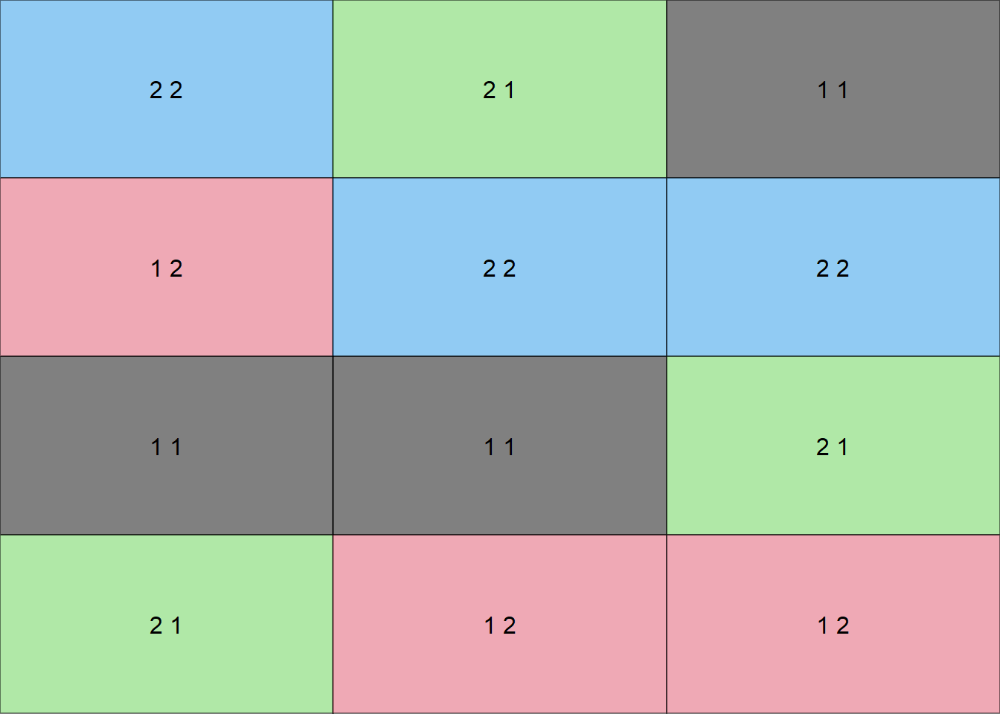

<br>

Criando uma função para fazer um croqui (Número de colunas igual número de tratamentos)


```r
# Não alterar os comandos da função
library(agricolae)
library(gridExtra)
library(grid)
croqui=function(trat,trat1,r){
  sort=design.split(trat,trat1,r,design = "crd",serie=0)
  sort$book$trat=as.vector(t(matrix(paste(sort$book$trat,sort$book$trat1),nrow =r, byrow=T)))
  sort$book$trat=as.factor(sort$book$trat)
  ncol=length(levels(sort$book$trat))
  gs <- lapply(sort$book$trat, function(ii)
    grobTree(rectGrob(gp=gpar(fill=ii, alpha=0.5)),textGrob(ii)))
  grid.arrange(grobs=gs, ncol=ncol)}
```

<br>

Vetor de tratamentos


```r
trat=c("A1","A2")
trat1=c("B1","B2","B3")
```

<br>

Usando a função


```r
croqui(trat,trat1,r=2)
```


<br><br>

****

## Croqui em DBC

****

<br>

Criando uma função para fazer um croqui (Número de coluna igual número de repetições)


```r
# Não alterar os comandos da função
library(agricolae)
library(gridExtra)
library(grid)
croqui=function(trat,trat1,r){
  sort=design.split(trat,trat1,r,design = "rcbd",serie=0)
  sort$book$trat=as.vector(matrix(paste(sort$book$trat,sort$book$trat1),nrow =r,byrow=T))
  ncol=r
  sort$book$trat=as.factor(sort$book$trat)
  gs <- lapply(sort$book$trat, function(ii)
    grobTree(rectGrob(gp=gpar(fill=ii, alpha=0.5)),textGrob(ii)))
  grid.arrange(grobs=gs, ncol=ncol)}
```

<br>

Vetor de tratamentos


```r
trat=c("A1","A2")
trat1=c("B1","B2","B3")
```

<br>

Usando a função


```r
croqui(trat,trat1,r=2)
```


<br>

Criando uma função para fazer um croqui (Número de colunas igual número de tratamentos)


```r
# Não alterar os comandos da função
library(agricolae)
library(gridExtra)
library(grid)
croqui=function(trat,trat1,r){
  sort=design.split(trat,trat1,r,design = "rcbd",serie=0)
  sort$book$trat=as.vector(t(matrix(paste(sort$book$trat,sort$book$trat1),nrow =r, byrow=T)))
  sort$book$trat=as.factor(sort$book$trat)
  ncol=length(levels(sort$book$trat))
  gs <- lapply(sort$book$trat, function(ii)
    grobTree(rectGrob(gp=gpar(fill=ii, alpha=0.5)),textGrob(ii)))
  grid.arrange(grobs=gs, ncol=ncol)}
```

<br>

Vetor de tratamentos


```r
trat=c("A1","A2")
trat1=c("B1","B2","B3")
```

<br>

Usando a função


```r
croqui(trat,trat1,r=2)
```


****

## Exemplo 1

****

<br>

Um experimento foi realizado com o intuito de avaliar 5 tratamentos na linha e entrelinha de um pomar. O experimento foi instalado em Delineamento em blocos casualizados com 12 repetições por tratamento. Foi analisado o carbono da biomassa microbiana (CBM).


```r
RESP=c(224.92, 180.32, 130.19, 110.31, 163.74,193.03, 211.49, 137.65, 127.15, 203.39,
       182.36, 124.75, 177.70, 231.01, 202.14,214.89, 198.42, 267.85, 207.67, 176.74,
       162.18, 124.59, 158.99, 209.12, 128.14,113.95, 215.53, 190.51, 174.58, 148.70,
       150.90, 209.03, 210.40, 199.03, 237.05,196.97, 176.06, 263.27, 240.19, 160.72,
       239.90, 188.07, 251.35, 215.45, 198.50,271.42, 226.56, 217.65, 213.69, 101.26,
       115.41, 140.10, 117.67, 106.45, 139.34,104.22, 206.13, 195.89, 147.11, 122.93,
       176.55, 173.63, 112.83, 184.82, 178.18, 115.85, 183.89, 134.92, 086.49, 103.96,
       096.33, 091.64, 157.76, 107.45, 106.61, 095.28, 152.37, 066.02, 125.75, 075.34,
       088.64, 104.00, 066.38, 084.74, 101.76,173.70, 101.24, 143.71, 119.88, 157.79,
       070.42, 152.75, 111.65, 153.08, 146.64,142.57, 098.96, 065.92, 065.62, 063.26,
       095.72, 084.14, 054.92, 090.49, 112.11,102.68, 144.77, 122.58, 125.14, 127.61,
       117.14, 147.87, 156.18, 154.82, 183.91,159.11, 155.41, 184.55, 121.39, 155.77)
FATOR1=rep(rep(c("L","EL"), e=12),5); FATOR1=factor(FATOR1)
FATOR2=rep(c(paste("T",1:5)),e=24); FATOR2=factor(FATOR2)
repe=rep(c(paste("R",1:12)),10); repe=factor(repe)
dados = data.frame(FATOR1,FATOR2,repe,RESP)
```

<br><br>

## Estatística descritiva


```r
"Média" = with(dados, mean(RESP))
"Variância" = with(dados, var(RESP))
Desvio = with(dados, sd(RESP))
CV = Desvio / Média * 100

desc = cbind(Média, Variância, Desvio, CV)
rownames(desc) = 'CBM'
kable(round(desc,2), align="l", format="pandoc", format.args = list(big.mark="."))
```

      Média    Variância   Desvio   CV   
----  -------  ----------  -------  -----
CBM   151.58   2.547.35    50.47    33.3 

<br>

### Fator 1 (Linha e Entrelinha)


```r
Médias1 = with(dados, tapply(RESP, FATOR1, mean))
Variâncias1 = with(dados, tapply(RESP, FATOR1, var))
Desvios1 = with(dados, tapply(RESP, FATOR1, sd))
CV1 = Desvios1 / Médias1 * 100
Desc1 = cbind(Médias1, Variâncias1, Desvios1, CV1)
kable(round(Desc1,2),align="l")
```

     Médias1   Variâncias1   Desvios1   CV1   
---  --------  ------------  ---------  ------
EL   166.39    2297.00       47.93      28.80 
L    136.76    2394.44       48.93      35.78 

<br>

### Fator 2 (Manejo)


```r
Médias2 = with(dados, tapply(RESP, FATOR2, mean))
Variâncias2 = with(dados, tapply(RESP, FATOR2, var))
Desvios2 = with(dados, tapply(RESP, FATOR2, sd))
CV2 = Desvios2 / Médias2 * 100
Desc2 = cbind(Médias2, Variâncias2, Desvios2, CV2)
kable(round(Desc2,2),align="l")
```

      Médias2   Variâncias2   Desvios2   CV2   
----  --------  ------------  ---------  ------
T 1   180.03    1599.93       40.00      22.22 
T 2   201.00    1678.32       40.97      20.38 
T 3   139.55    1560.41       39.50      28.31 
T 4   116.90    1085.31       32.94      28.18 
T 5   120.42    1443.94       38.00      31.56 

<br>

### Repetição


```r
Médias4 = with(dados, tapply(RESP, repe, mean))
Variâncias4 = with(dados, tapply(RESP, repe, var))
Desvios4 = with(dados, tapply(RESP, repe, sd))
CV4 = Desvios4/ Médias4 * 100
Desc4 = cbind(Médias4, Variâncias4, Desvios4, CV4)
kable(round(Desc4,2),align="l")
```

       Médias4   Variâncias4   Desvios4   CV4   
-----  --------  ------------  ---------  ------
R 1    158.07    1917.57       43.79      27.70 
R 10   164.26    3154.85       56.17      34.19 
R 11   152.76    2803.26       52.95      34.66 
R 12   146.87    2228.39       47.21      32.14 
R 2    153.81    3815.91       61.77      40.16 
R 3    140.69    3301.19       57.46      40.84 
R 4    145.15    2131.01       46.16      31.80 
R 5    159.66    1780.25       42.19      26.43 
R 6    148.27    3522.03       59.35      40.03 
R 7    157.96    3902.06       62.47      39.54 
R 8    145.57    2218.76       47.10      32.36 
R 9    145.87    2264.97       47.59      32.63 

<br>

### Juntando os fatores


```r
Médias3 = with(dados, tapply(RESP, list(FATOR1,FATOR2), mean))
Variâncias3 = with(dados, tapply(RESP, list(FATOR1,FATOR2), var))
Desvios3 = with(dados, tapply(RESP, list(FATOR1,FATOR2), sd))
CV3 = Desvios3/Médias3 * 100
Desc3 = rbind(Médias3, Variâncias3, Desvios3, CV3)
rownames(Desc3)=c("Média.L","Média.EL","Variância.L","Variância.EL", "Desvio.L","Desvio.EL", "CV.L","CV.EL")
kable(round(Desc3,2),align="l")
```

               T 1       T 2       T 3       T 4      T 5    
-------------  --------  --------  --------  -------  -------
Média.L        194.28    220.76    136.59    131.27   149.07 
Média.EL       165.78    181.23    142.52    102.53   91.76  
Variância.L    1398.17   1208.34   1588.68   904.49   505.68 
Variância.EL   1504.10   1448.57   1654.85   914.33   721.90 
Desvio.L       37.39     34.76     39.86     30.07    22.49  
Desvio.EL      38.78     38.06     40.68     30.24    26.87  
CV.L           19.25     15.75     29.18     22.91    15.08  
CV.EL          23.39     21.00     28.54     29.49    29.28  

<br><br>

## Gráficos exploratórios

<br>

### Gráfico de caixas (*Boxplot*)

<br>

#### Fator 1


```r
caixas=with(dados, car::Boxplot(RESP ~ FATOR1, vertical=T,las=1, col='Lightyellow'))
points(Médias1, pch='+', cex=1.5, col='red')
```

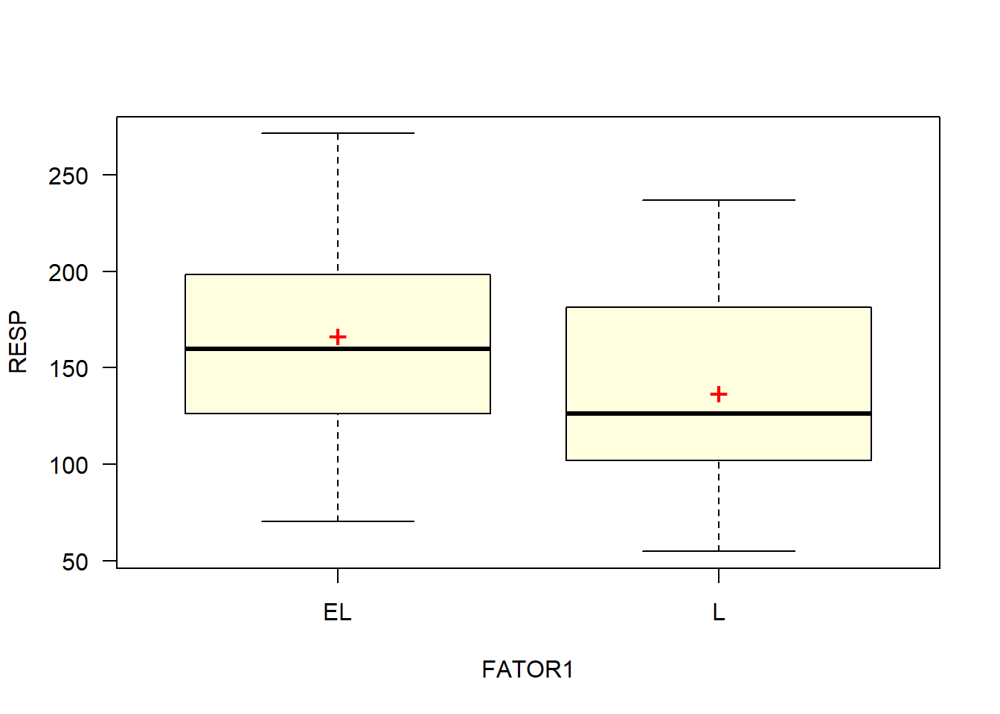

<br>

#### Fator 2


```r
caixas=with(dados, car::Boxplot(RESP ~ FATOR2, vertical=T,las=1, col='Lightyellow'))
points(Médias2, pch='+', cex=1.5, col='red')
```

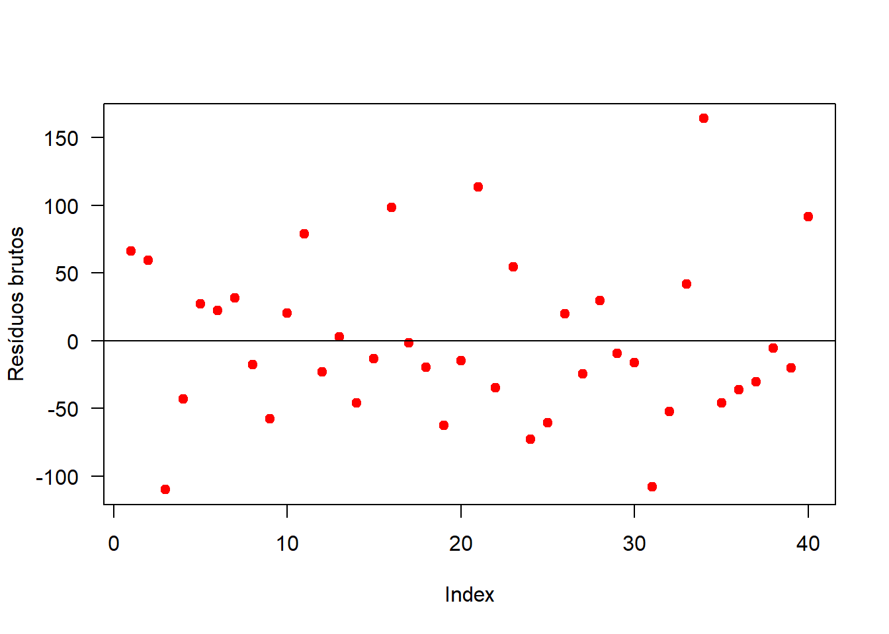

<br>

#### Juntando fatores


```r
caixas=with(dados, car::Boxplot(RESP ~ FATOR1*FATOR2, vertical=T,las=1, col='Lightyellow'))
```


<br>

### Interação


```r
library(gplots)
library(lattice)
with(dados, xyplot(RESP ~ FATOR1|FATOR2, groups=repe, aspect="xy", type="o", ylab='CBM',
                   strip=strip.custom(strip.names=TRUE, strip.levels=TRUE)))
```


```r
with(dados, xyplot(RESP ~ FATOR1|repe, groups=FATOR2, aspect="xy", type="o", ylab='CBM',
                   strip=strip.custom(strip.names=TRUE, strip.levels=TRUE)))
```

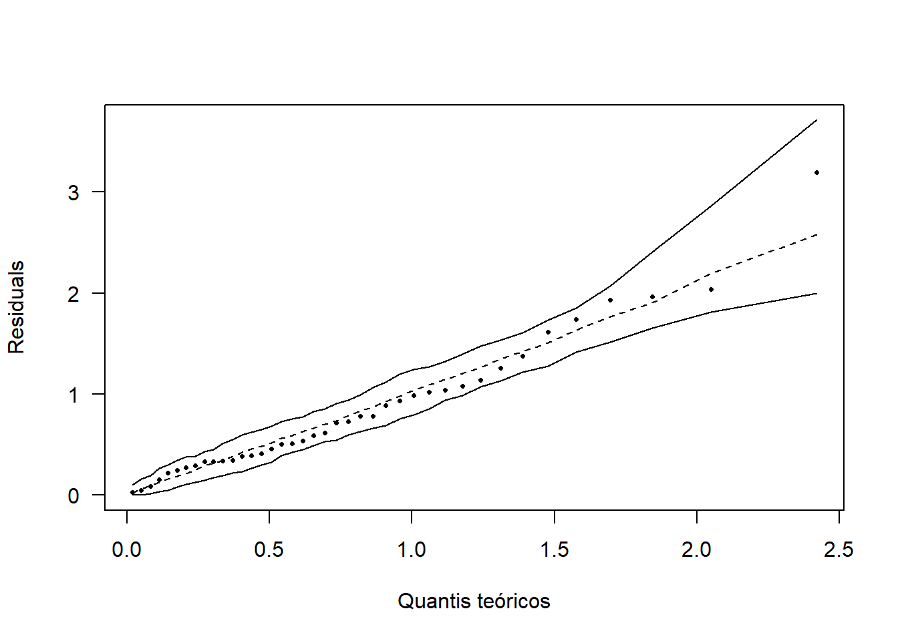


```r
with(dados, xyplot(RESP ~ FATOR2|repe, groups=FATOR1, aspect="xy", type="o", ylab='CBM',
                   strip=strip.custom(strip.names=TRUE, strip.levels=TRUE)))
```


```r
with(dados, interaction.plot(FATOR2, FATOR1, RESP, las=1, col=1:6, bty='l', 
                             xlab='', ylab='CBM', trace.label="repe"))
```


```r
# FATOR1 e FATOR2
with(dados, interaction.plot(FATOR1, FATOR2, RESP, las=1, col=1:6, bty='l', 
                             xlab='', ylab='CBM', trace.label="FATOR2"))
```

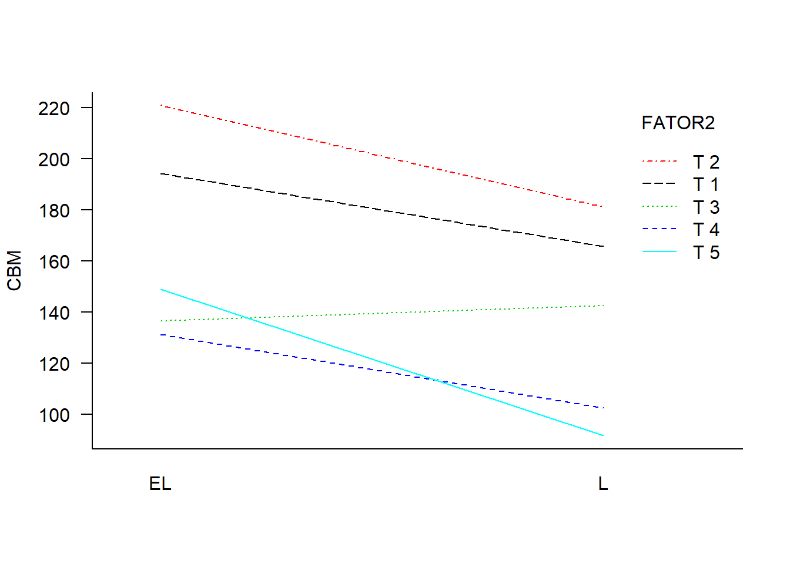

<br><br>

## Análise de Variância

\begin{eqnarray*}
\left\{
\begin{array}{ll}
H_0: & \mu_1 = \mu_2 = \mu_3 = \cdots = \mu_{a} \\[.2cm]
H_1: & \mu_i \neq \mu_i' \qquad i \neq i'.
\end{array}
\right.
\end{eqnarray*}

e a igualdade nos efeitos do fator secundário, ou seja:
\begin{eqnarray*}
\left\{
\begin{array}{ll}
H_0: & \mu_1 = \mu_2 = \mu_3 = \cdots = \mu_{b} \\[.2cm]
H_1: & \mu_i \neq \mu_i' \qquad i \neq i'.
\end{array}
\right.
\end{eqnarray*}

e, ainda, se há interação entre os fatores:

\begin{eqnarray*}
\left\{
\begin{array}{ll}
H_0: & (\tau\beta)ij = 0 \mbox{para todo} i ; j \\[.2cm]
H_1: & \mbox{Pelo menos um} (\tau\beta)ij \neq 0
\end{array}
\right.
\end{eqnarray*}


```r
mod = with(dados, aov(RESP ~ FATOR1*FATOR2+Error(repe/FATOR1)))
summary(mod)
```

```
## 
## Error: repe
##           Df Sum Sq Mean Sq F value Pr(>F)
## Residuals 11   5772   524.7               
## 
## Error: repe:FATOR1
##           Df Sum Sq Mean Sq F value Pr(>F)   
## FATOR1     1  26339   26339   12.74 0.0044 **
## Residuals 11  22748    2068                  
## ---
## Signif. codes:  0 '***' 0.001 '**' 0.01 '*' 0.05 '.' 0.1 ' ' 1
## 
## Error: Within
##               Df Sum Sq Mean Sq F value   Pr(>F)    
## FATOR2         4 133672   33418  28.882 2.47e-15 ***
## FATOR1:FATOR2  4  12783    3196   2.762   0.0325 *  
## Residuals     88 101820    1157                     
## ---
## Signif. codes:  0 '***' 0.001 '**' 0.01 '*' 0.05 '.' 0.1 ' ' 1
```

Interação significativa ($p=0,0325$)

<br>

### Usando o pacote agricolae


```r
library(agricolae)
mod.parc = with(dados, sp.plot(repe, FATOR1, FATOR2, RESP))
```

```
## 
## ANALYSIS SPLIT PLOT:  RESP 
## Class level information
## 
## FATOR1 	:  L EL 
## FATOR2 	:  T 1 T 2 T 3 T 4 T 5 
## repe 	:  R 1 R 2 R 3 R 4 R 5 R 6 R 7 R 8 R 9 R 10 R 11 R 12 
## 
## Number of observations:  120 
## 
## Analysis of Variance Table
## 
## Response: RESP
##               Df Sum Sq Mean Sq F value    Pr(>F)    
## repe          11   5772     525  0.2537  0.984072    
## FATOR1         1  26339   26339 12.7363  0.004404 ** 
## Ea            11  22748    2068                      
## FATOR2         4 133672   33418 28.8821 2.442e-15 ***
## FATOR1:FATOR2  4  12783    3196  2.7620  0.032468 *  
## Eb            88 101820    1157                      
## ---
## Signif. codes:  0 '***' 0.001 '**' 0.01 '*' 0.05 '.' 0.1 ' ' 1
## 
## cv(a) = 30 %, cv(b) = 22.4 %, Mean = 151.5785
```

<br>

### Usando o pacote easyanova


```r
ano=easyanova::ea2(data.frame(FATOR1,repe,FATOR2,RESP),design = 5)
```

```r
ano[1]
```

```
## $`Marginal anova (Type III Sum of Squares)`
##                 numDF denDF   F-value p-value
## plot                1    11 12.736294  0.0044
## split.plot          4    88 28.882103  <.0001
## block              11    11  0.253728  0.9841
## plot:split.plot     4    88  2.761997  0.0325
```

<br><br>

## Pressupostos 

<br>

### Normalidade dos erros

Uma forma de verificação é usar como esquema fatorial

\begin{eqnarray*}
\left\{
\begin{array}{ll}
H_0: \mbox{Erros seguem distribuição normal}\\[.2cm]
H_1: \mbox{Erros não seguem distribuição normal.}
\end{array}
\right.
\end{eqnarray*}


```r
mod.pres = with(dados, aov(RESP ~ repe + FATOR1*FATOR2)); summary(mod.pres)
```

```
##               Df Sum Sq Mean Sq F value   Pr(>F)    
## repe          11   5772     525   0.417   0.9455    
## FATOR1         1  26339   26339  20.933 1.38e-05 ***
## FATOR2         4 133672   33418  26.559 5.66e-15 ***
## FATOR1:FATOR2  4  12783    3196   2.540   0.0445 *  
## Residuals     99 124568    1258                     
## ---
## Signif. codes:  0 '***' 0.001 '**' 0.01 '*' 0.05 '.' 0.1 ' ' 1
```

```r
shapiro.test(mod.pres$res)
```

```
## 
## 	Shapiro-Wilk normality test
## 
## data:  mod.pres$res
## W = 0.99207, p-value = 0.7273
```

Como p-valor($p=0,7273$) é maior que o nível de significância adotado ($p=0,05$), não se rejeita $H_0$. Logo, os erros seguem distribuição normal.

<br>

### Homogeneidade de variâncias

\begin{eqnarray*}
\left\{
\begin{array}{ll}
H_0: \mbox{As variâncias dos erros são homogêneas}\\[.2cm]
H_1: \mbox{As variâncias dos erros não são homogêneas}
\end{array}
\right.
\end{eqnarray*}

<br>

#### Para Fator 1


```r
with(dados, bartlett.test(mod.pres$residuals~FATOR1))
```

```
## 
## 	Bartlett test of homogeneity of variances
## 
## data:  mod.pres$residuals by FATOR1
## Bartlett's K-squared = 0.022345, df = 1, p-value = 0.8812
```

Como p-valor($p=0,8812$) é maior que o nível de significância adotado ($p=0,05$), não se rejeita $H_0$. Logo, as variâncias dos erros são homogêneas.

<br>

#### Para Bloco


```r
with(dados, bartlett.test(mod.pres$residuals~repe))
```

```
## 
## 	Bartlett test of homogeneity of variances
## 
## data:  mod.pres$residuals by repe
## Bartlett's K-squared = 10.291, df = 11, p-value = 0.5044
```

Como p-valor($p=0,5044$) é maior que o nível de significância adotado ($p=0,05$), não se rejeita $H_0$. Logo, as variâncias dos erros são homogêneas.

<br>

#### Para Fator 2


```r
with(dados, bartlett.test(mod.pres$residuals~FATOR2))
```

```
## 
## 	Bartlett test of homogeneity of variances
## 
## data:  mod.pres$residuals by FATOR2
## Bartlett's K-squared = 6.6241, df = 4, p-value = 0.1571
```

Como p-valor($p=0,1571$) é maior que o nível de significância adotado ($p=0,05$), não se rejeita $H_0$. Logo, as variâncias dos erros são homogêneas.

<br>

#### Juntandos os fatores


```r
tratamentos=rep(c(paste("T",1:10)),e=12)
with(dados, bartlett.test(mod.pres$residuals~tratamentos))
```

```
## 
## 	Bartlett test of homogeneity of variances
## 
## data:  mod.pres$residuals by tratamentos
## Bartlett's K-squared = 8.3359, df = 9, p-value = 0.5007
```

Como p-valor($p=0,5007$) é maior que o nível de significância adotado ($p=0,05$), não se rejeita $H_0$. Logo, as variâncias dos erros são homogêneas.

<br>

### Independência dos erros

\begin{eqnarray*}
\left\{
\begin{array}{ll}
H_0: \mbox{Os erros são independentes}\\[.2cm]
H_1: \mbox{Os erros não são independentes}
\end{array}
\right.
\end{eqnarray*}


```r
library(lmtest)
dwtest(mod.pres)
```

```
## 
## 	Durbin-Watson test
## 
## data:  mod.pres
## DW = 1.9095, p-value = 0.1026
## alternative hypothesis: true autocorrelation is greater than 0
```

Como p-valor($p=0,1026$) é maior que o nível de significância adotado ($p=0,05$), não se rejeita $H_0$. Logo, os erros são independentes.

<br>

### Análise Gráfica


```r
plot(RESP-mean(RESP), pch=16, col="red")
abline(h=0, col="blue")
```


<br><br>

## Teste de comparações múltiplas

<br>

### Pelo pacote easyanova


```r
ano=easyanova::ea2(data.frame(FATOR1,repe,FATOR2,RESP),design = 5)
```

```r
ano$`Adjusted means (plot in levels of split.plot)`
```

```
## $`plot in  T 1`
##   plot.split.plot adjusted.mean standard.error tukey snk duncan t
## 1          EL.T 1       194.275        10.5643     a   a      a a
## 2           L.T 1       165.775        10.5643     a   a      a a
## 
## $`plot in  T 2`
##   plot.split.plot adjusted.mean standard.error tukey snk duncan t
## 3          EL.T 2      220.7617        10.5643     a   a      a a
## 4           L.T 2      181.2325        10.5643     b   b      b b
## 
## $`plot in  T 3`
##   plot.split.plot adjusted.mean standard.error tukey snk duncan t
## 6           L.T 3      142.5167        10.5643     a   a      a a
## 5          EL.T 3      136.5908        10.5643     a   a      a a
## 
## $`plot in  T 4`
##   plot.split.plot adjusted.mean standard.error tukey snk duncan t
## 7          EL.T 4      131.2658        10.5643     a   a      a a
## 8           L.T 4      102.5283        10.5643     a   a      a a
## 
## $`plot in  T 5`
##    plot.split.plot adjusted.mean standard.error tukey snk duncan t
## 9           EL.T 5      149.0750        10.5643     a   a      a a
## 10           L.T 5       91.7642        10.5643     b   b      b b
```

```r
ano$`Adjusted means (split.plot in levels of plot)`
```

```
## $`split.plot in  EL`
##   plot.split.plot adjusted.mean standard.error tukey snk duncan t
## 3          EL.T 2      220.7617        10.5643     a   a      a a
## 1          EL.T 1      194.2750        10.5643     a   a      a a
## 9          EL.T 5      149.0750        10.5643     b   b      b b
## 5          EL.T 3      136.5908        10.5643     b   b      b b
## 7          EL.T 4      131.2658        10.5643     b   b      b b
## 
## $`split.plot in  L`
##    plot.split.plot adjusted.mean standard.error tukey snk duncan  t
## 4            L.T 2      181.2325        10.5643     a   a      a  a
## 2            L.T 1      165.7750        10.5643    ab  ab     ab ab
## 6            L.T 3      142.5167        10.5643     b   b      b  b
## 8            L.T 4      102.5283        10.5643     c   c      c  c
## 10           L.T 5       91.7642        10.5643     c   c      c  c
```

<br>

### Pelo pacote ExpDes.pt


```r
library(ExpDes.pt)
psub2.dbc(FATOR1,FATOR2,repe,RESP)
```

<br><br><br><br>

****

# Polinômios Ortogonais

****

<br><br><br><br>

- A variável analisada na análise de variância nos delineamentos discutidos anteriormente pode ser qualitativa ou quantitativa.
- Uma variável quantitativa é aquela cujos níveis podem ser associados com pontos em uma escala numérica, tal como temperatura, pressão ou tempo.
- Variáveis qualitativas, por outro lado, apresentam valores que não podem ser colocados em ordem de magnitude.

<br>

****

## Teste F

****

<br>

- Se o efeito de tratamentos for significativo e, os níveis forem quantitativos, deve-se decompor os graus de liberdade dos tratamentos em regressão linear, quadrática e cúbica.
- Em situações em que os níveis da variável possuem o mesmo espaçamento, esta decomposição pode ser feita de modo simples pelo método dos polinômios ortogonais, com o auxílio de coeficientes dados em tabelas.

<br>

****

## Quadro da Análise de variância

****

<br>


CV            | G.L.        | S.Q.          | Q.M.                    | Fcalc                           | Ftab
--------------:|:-------------:|:---------------:|:-------------------------:|:---------------------------------:|:--------
Trat          | $a-1$       |$SQ_{trat}$    |$\frac{SQ_{trat}}{a-1}$  |$\frac{QM_{trat}}{QM_{Res}}$     |$F(\alpha;GL_{Trat};GL_{Res})$
  *Linear*      | 1           |$SQ_{\hat{y}L}$|$QM_{\hat{y}L}$          |$\frac{QM_{\hat{y}L}}{QM_{res}}$ |
  *Quadrático*  | 1           |$SQ_{\hat{y}Q}$|$QM_{\hat{y}Q}$          |$\frac{QM_{\hat{y}Q}}{QM_{res}}$ |
  *Cúbico*      | 1           |$SQ_{\hat{y}C}$|$QM_{\hat{y}C}$          |$\frac{QM_{\hat{y}C}}{QM_{res}}$ |
resíduo       | $a(b-1)$    |$SQ_{res}$     |$\frac{SQ_{res}}{a(b-1)}$|
Total         | $ab-1$      |$SQ_{Total}$   |                         |

<br>

****

## Exemplo 1

****

<br>

**Avaliação e Caracterização de Silagem de Triticale (X *Triticosecale* Wittimack)**

No Brasil, quando se fala em produção de volumoso conservado, logo se imagina silagem de milho ou sorgo. No entanto, em clima subtropical e temperado, silagens de cereais de inverno tornam-se uma alternativa interessante para produção dos mesmos, principalmente em situações onde culturas de verão não são possíveis de serem cultivadas.

Assim, um trabalho foi desenvolvido com o objetivo de avaliar a silagem de triticale em substituição à silagem de sorgo na alimentação de bovinos corte. O ensaio foi realizado no Laboratório de análises de Alimentos e Nutrição Animal (LANA) do Departamento de Zootecnia da Universidade Estadual de Londrina. 

Foi estudado a silagem de triticale em substituição a silagem de sorgo com os teores de 0, 25, 50, 75 e 100% de substituição à de sorgo, a fim de melhor avaliar o valor nutritivo deste volumoso. Foi realizada a determinação da matéria seca (MS). O delineamento experimental utilizado foi o inteiramente casualizado com 4 repetições.

Fonte: <http://www.uel.br/pessoal/silvano/Experimental/R/Polinomios/Sorgo_Sandra.R>

<br>

### Conjunto de dados


```r
MS=c(93.517, 93.246, 93.216, 93.224,
     93.168, 93.645, 93.640, 93.357,
     92.985, 92.644, 92.506, 92.293, 
     93.124, 93.375, 93.138, 92.678,
     92.529, 92.150, 92.603, 92.415)
AMOSTRA=c(0,0,0,0,
          25,25,25,25,
          50,50,50,50,
          75,75,75,75,
          100,100,100,100)
dados=data.frame(Amostra=factor(AMOSTRA),MS)
attach(dados)
```

<br>

### Média e Variância


```r
(meditrat=tapply(MS,AMOSTRA,mean))
```

```
##        0       25       50       75      100 
## 93.30075 93.45250 92.60700 93.07875 92.42425
```

```r
(variatrat=tapply(MS,AMOSTRA,var))
```

```
##          0         25         50         75        100 
## 0.02094492 0.05409100 0.08435000 0.08464092 0.03940758
```

<br>

## Análise de Variância

\begin{eqnarray*}
\left\{
\begin{array}{ll}
H_0: & \mu_1 = \mu_2 = \mu_3 = \cdots = \mu_{5} \\[.2cm]
H_1: & \mu_i \neq \mu_i' \qquad i \neq i'.
\end{array}
\right.
\end{eqnarray*}

<br>

## Análise de Variância para Matéria Seca


```r
mod = aov(MS ~ Amostra)
summary(mod)
```

```
##             Df Sum Sq Mean Sq F value   Pr(>F)    
## Amostra      4 3.1344  0.7836   13.82 6.42e-05 ***
## Residuals   15 0.8503  0.0567                     
## ---
## Signif. codes:  0 '***' 0.001 '**' 0.01 '*' 0.05 '.' 0.1 ' ' 1
```

<br>

## Polinômio até 4 grau


```r
mod.reg = aov(MS ~ AMOSTRA + I(AMOSTRA^2) + I(AMOSTRA^3) + I(AMOSTRA^4))
summary(mod.reg)
```

```
##              Df Sum Sq Mean Sq F value   Pr(>F)    
## AMOSTRA       1 1.8092  1.8092  31.916 4.62e-05 ***
## I(AMOSTRA^2)  1 0.0249  0.0249   0.439 0.517484    
## I(AMOSTRA^3)  1 0.0067  0.0067   0.117 0.736600    
## I(AMOSTRA^4)  1 1.2936  1.2936  22.821 0.000245 ***
## Residuals    15 0.8503  0.0567                     
## ---
## Signif. codes:  0 '***' 0.001 '**' 0.01 '*' 0.05 '.' 0.1 ' ' 1
```

<br>

## Polinômio de 3 grau


```r
mod.reg = aov(MS ~ AMOSTRA + I(AMOSTRA^2) + I(AMOSTRA^3))
summary(mod.reg)
```

```
##              Df Sum Sq Mean Sq F value  Pr(>F)   
## AMOSTRA       1 1.8092  1.8092  13.502 0.00205 **
## I(AMOSTRA^2)  1 0.0249  0.0249   0.186 0.67212   
## I(AMOSTRA^3)  1 0.0067  0.0067   0.050 0.82645   
## Residuals    16 2.1439  0.1340                   
## ---
## Signif. codes:  0 '***' 0.001 '**' 0.01 '*' 0.05 '.' 0.1 ' ' 1
```

<br>

## Polinômio de 2 grau


```r
mod.reg = aov(MS ~ AMOSTRA + I(AMOSTRA^2))
summary(mod.reg)
```

```
##              Df Sum Sq Mean Sq F value  Pr(>F)   
## AMOSTRA       1 1.8092  1.8092  14.302 0.00149 **
## I(AMOSTRA^2)  1 0.0249  0.0249   0.197 0.66285   
## Residuals    17 2.1506  0.1265                   
## ---
## Signif. codes:  0 '***' 0.001 '**' 0.01 '*' 0.05 '.' 0.1 ' ' 1
```

<br>

## Polinômio de 1 grau


```r
mod.reg = aov(MS ~ AMOSTRA)
summary(mod.reg)
```

```
##             Df Sum Sq Mean Sq F value  Pr(>F)   
## AMOSTRA      1  1.809  1.8092   14.97 0.00112 **
## Residuals   18  2.175  0.1209                   
## ---
## Signif. codes:  0 '***' 0.001 '**' 0.01 '*' 0.05 '.' 0.1 ' ' 1
```

<br>

## Coeficientes do modelo


```r
mod.reg = lm(MS ~ I(AMOSTRA) + I(AMOSTRA^2) + I(AMOSTRA^3) + I(AMOSTRA^4))
summary(mod.reg)
```

```
## 
## Call:
## lm(formula = MS ~ I(AMOSTRA) + I(AMOSTRA^2) + I(AMOSTRA^3) + 
##     I(AMOSTRA^4))
## 
## Residuals:
##      Min       1Q   Median       3Q      Max 
## -0.40075 -0.09688  0.01388  0.18094  0.37800 
## 
## Coefficients:
##                Estimate Std. Error t value Pr(>|t|)    
## (Intercept)   9.330e+01  1.190e-01 783.743  < 2e-16 ***
## I(AMOSTRA)    1.045e-01  2.659e-02   3.928 0.001341 ** 
## I(AMOSTRA^2) -6.139e-03  1.335e-03  -4.598 0.000348 ***
## I(AMOSTRA^3)  1.008e-04  2.134e-05   4.724 0.000272 ***
## I(AMOSTRA^4) -5.075e-07  1.062e-07  -4.777 0.000245 ***
## ---
## Signif. codes:  0 '***' 0.001 '**' 0.01 '*' 0.05 '.' 0.1 ' ' 1
## 
## Residual standard error: 0.2381 on 15 degrees of freedom
## Multiple R-squared:  0.7866,	Adjusted R-squared:  0.7297 
## F-statistic: 13.82 on 4 and 15 DF,  p-value: 6.422e-05
```

<br>

## Curva Estimada


```r
m1 <- lm(MS~poly(AMOSTRA, degree=1, raw=TRUE)) # não ortogonal
# ou
m2 <- lm(MS~AMOSTRA)
anova(m1)
```

```
## Analysis of Variance Table
## 
## Response: MS
##                                       Df Sum Sq Mean Sq F value   Pr(>F)   
## poly(AMOSTRA, degree = 1, raw = TRUE)  1 1.8092 1.80923   14.97 0.001124 **
## Residuals                             18 2.1755 0.12086                    
## ---
## Signif. codes:  0 '***' 0.001 '**' 0.01 '*' 0.05 '.' 0.1 ' ' 1
```

<br>

## Usando o ExpDes.pt


```r
library(ExpDes.pt)
dic(AMOSTRA,MS,quali = F)
```

```
## ------------------------------------------------------------------------
## Quadro da analise de variancia
## ------------------------------------------------------------------------
##            GL     SQ      QM     Fc      Pr>Fc
## Tratamento  4 3.1344 0.78361 13.823 6.4215e-05
## Residuo    15 0.8503 0.05669                  
## Total      19 3.9847                          
## ------------------------------------------------------------------------
## CV = 0.26 %
## 
## ------------------------------------------------------------------------
## Teste de normalidade dos residuos 
## Valor-p:  0.8052063 
## De acordo com o teste de Shapiro-Wilk a 5% de significancia, os residuos podem ser considerados normais.
## ------------------------------------------------------------------------
## 
## ------------------------------------------------------------------------
## Teste de homogeneidade de variancia 
## valor-p:  0.807195 
## De acordo com o teste de bartlett a 5% de significancia, as variancias podem ser consideradas homogeneas.
## ------------------------------------------------------------------------
## 
## Ajuste de modelos polinomiais de regressao
## ------------------------------------------------------------------------
## 
## Modelo Linear
## ============================================
##    Estimativa Erro.padrao     tc     valor.p
## --------------------------------------------
## b0  93.3980     0.0922    1,012.8630    0   
## b1  -0.0085     0.0015     -5.6494   0.00005
## --------------------------------------------
## 
## R2 do modelo linear
## --------
## 0.577212
## --------
## 
## Analise de variancia do modelo linear
## ===================================================
##                      GL   SQ     QM    Fc   valor.p
## ---------------------------------------------------
## Efeito linear        1  1.8092 1.8092 31.92  5e-05 
## Desvios de Regressao 3  1.3252 0.4417 7.79  0.00228
## Residuos             15 0.8503 0.0567              
## ---------------------------------------------------
## ------------------------------------------------------------------------
## 
## Modelo quadratico
## ==========================================
##    Estimativa Erro.padrao    tc    valor.p
## ------------------------------------------
## b0  93.3558     0.1120    833.2653    0   
## b1  -0.0051     0.0053    -0.9669  0.3489 
## b2  -0.00003    0.00005   -0.6629  0.5175 
## ------------------------------------------
## 
## R2 do modelo quadratico
## --------
## 0.585158
## --------
## 
## Analise de variancia do modelo quadratico
## ===================================================
##                      GL   SQ     QM    Fc   valor.p
## ---------------------------------------------------
## Efeito linear        1  1.8092 1.8092 31.92  5e-05 
## Efeito quadratico    1  0.0249 0.0249 0.44  0.51748
## Desvios de Regressao 2  1.3003 0.6501 11.47 0.00095
## Residuos             15 0.8503 0.0567              
## ---------------------------------------------------
## ------------------------------------------------------------------------
## 
## Modelo cubico
## ==========================================
##    Estimativa Erro.padrao    tc    valor.p
## ------------------------------------------
## b0  93.3687     0.1182    789.9773    0   
## b1  -0.0088     0.0120    -0.7343  0.4741 
## b2   0.0001     0.0003     0.2274  0.8232 
## b3 -0.000001       0      -0.3427  0.7366 
## ------------------------------------------
## 
## R2 do modelo cubico
## --------
## 0.587282
## --------
## 
## Analise de variancia do modelo cubico
## ===================================================
##                      GL   SQ     QM    Fc   valor.p
## ---------------------------------------------------
## Efeito linear        1  1.8092 1.8092 31.92  5e-05 
## Efeito quadratico    1  0.0249 0.0249 0.44  0.51748
## Efeito cubico        1  0.0067 0.0067 0.12  0.7366 
## Desvios de Regressao 1  1.2936 1.2936 22.82 0.00024
## Residuos             15 0.8503 0.0567              
## ---------------------------------------------------
## ------------------------------------------------------------------------
```

<br>

## Gráfico 


```r
plot(MS~AMOSTRA,ylab="Massa Seca",xlab=" ")
abline(m1,col=2)
dose=c(0,25,50,75,100)
points(meditrat~dose,col="blue",pch="*",cex=1.5)
```


<br>

## Gráfico somente com a média


```r
plot(meditrat~dose,col="red",pch=16, las=1)
curve(m1$coefficients[1]+m1$coefficients[2]*x, add=T)
```

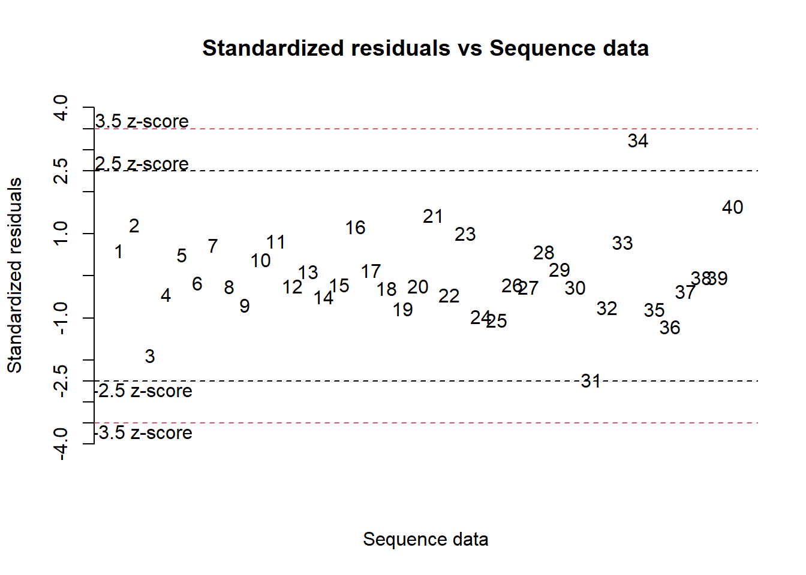

<br><br><br>

****

## Exemplo 2

****

<br>

Num experimento estudou-se o efeito do farelo de arroz desengordurado (FAD) como fatores de retardamento da maturidade sexual de frangas. O ensaio, organizado em blocos completos casualizados, abrangeu duas fases distintas e foi constituído de 5 tratamentos e 5 repetições com 8 aves por unidade experimental. Os tratamentos, na primeira fase eram formados por rações que continham 0, 15, 30, 45, 60 % de FAD em substituição ao milho. Os resultados obtidos na primeira fase do ensaio, para conversão alimentar foram os seguintes:

Fonte: <http://www.uel.br/pessoal/lscunha/pages/arquivos/uel/Especializa%C3%A7%C3%A3o/Aula_9_-_Polin%C3%B4mios_Ortogonais(1).pdf>


```r
CA=c(6.5, 6.4, 6.2, 5.8, 7.3,
    7.1, 7.4, 6.9, 7.3, 7.0,
    7.5, 8.1, 6.7, 7.4, 7.7,
    7.2, 7.0, 6.9, 6.7, 6.5,
    6.4, 6.5, 6.0, 6.3, 6.2)
Bloco=rep(c(paste("B", 1:5)),5)
FAD=rep(c(0,15,30,45,60),e=5)
dados=data.frame(fad=factor(FAD),Bloco=factor(Bloco),CA)
```

<br><br>

## Análise de Variância

\begin{eqnarray*}
\left\{
\begin{array}{ll}
H_0: & \mu_1 = \mu_2 = \mu_3 = \cdots = \mu_{5} \\[.2cm]
H_1: & \mu_i \neq \mu_i' \qquad i \neq i'.
\end{array}
\right.
\end{eqnarray*}

<br>


```r
mod = with(dados,aov(CA ~ fad+Bloco))
summary(mod)
```

```
##             Df Sum Sq Mean Sq F value   Pr(>F)    
## fad          4  4.868   1.217  10.058 0.000289 ***
## Bloco        4  0.936   0.234   1.934 0.153795    
## Residuals   16  1.936   0.121                     
## ---
## Signif. codes:  0 '***' 0.001 '**' 0.01 '*' 0.05 '.' 0.1 ' ' 1
```

<br><br>

## Pressuposições

<br>

### Normalidade dos erros

<br>

\begin{eqnarray*}
\left\{
\begin{array}{ll}
H_0: & \mbox{Os erros seguem distribuição normal}\\[.2cm]
H_1: & \mbox{Os erros não seguem distribuição normal}.
\end{array}
\right.
\end{eqnarray*}

<br>


```r
shapiro.test(mod$res)
```

```
## 
## 	Shapiro-Wilk normality test
## 
## data:  mod$res
## W = 0.95907, p-value = 0.3963
```

<br>

### Homogeneidade das Variâncias

<br>

\begin{eqnarray*}
\left\{
\begin{array}{ll}
H_0: & \mbox{ As Variâncias são homogêneas}\\[.2cm]
H_1: & \mbox{ As Variâncias não são homogêneas}.
\end{array}
\right.
\end{eqnarray*}

<br>


```r
bartlett.test(residuals(mod)~as.factor(dados$fad))
```

```
## 
## 	Bartlett test of homogeneity of variances
## 
## data:  residuals(mod) by as.factor(dados$fad)
## Bartlett's K-squared = 6.4994, df = 4, p-value = 0.1648
```

<br>

### Independência dos erros

<br>

\begin{eqnarray*}
\left\{
\begin{array}{ll}
H_0: \mbox{Os erros são independentes}\\[.2cm]
H_1: \mbox{Os erros não são independentes}.
\end{array}
\right.
\end{eqnarray*}


```r
library(lmtest)
dwtest(mod)
```

```
## 
## 	Durbin-Watson test
## 
## data:  mod
## DW = 2.8659, p-value = 0.923
## alternative hypothesis: true autocorrelation is greater than 0
```

```r
plot(mod$residuals)
```


<br>

## Coeficientes do modelo

<br>


```r
mod.reg = lm(CA ~ FAD + I(FAD^2) + I(FAD^3) + I(FAD^4))
summary(mod.reg)
```

```
## 
## Call:
## lm(formula = CA ~ FAD + I(FAD^2) + I(FAD^3) + I(FAD^4))
## 
## Residuals:
##    Min     1Q Median     3Q    Max 
##  -0.78  -0.16   0.02   0.16   0.86 
## 
## Coefficients:
##               Estimate Std. Error t value Pr(>|t|)    
## (Intercept)  6.440e+00  1.695e-01  38.001   <2e-16 ***
## FAD          1.867e-02  6.309e-02   0.296    0.770    
## I(FAD^2)     3.793e-03  5.279e-03   0.718    0.481    
## I(FAD^3)    -1.481e-04  1.407e-04  -1.053    0.305    
## I(FAD^4)     1.317e-06  1.167e-06   1.128    0.272    
## ---
## Signif. codes:  0 '***' 0.001 '**' 0.01 '*' 0.05 '.' 0.1 ' ' 1
## 
## Residual standard error: 0.3789 on 20 degrees of freedom
## Multiple R-squared:  0.6289,	Adjusted R-squared:  0.5547 
## F-statistic: 8.475 on 4 and 20 DF,  p-value: 0.0003607
```

<br>

## Usando o ExpDes.pt


```r
library(ExpDes.pt)
dic(FAD,CA, quali=F)
```

```
## ------------------------------------------------------------------------
## Quadro da analise de variancia
## ------------------------------------------------------------------------
##            GL    SQ     QM     Fc      Pr>Fc
## Tratamento  4 4.868 1.2170 8.4749 0.00036068
## Residuo    20 2.872 0.1436                  
## Total      24 7.740                         
## ------------------------------------------------------------------------
## CV = 5.54 %
## 
## ------------------------------------------------------------------------
## Teste de normalidade dos residuos 
## Valor-p:  0.5382094 
## De acordo com o teste de Shapiro-Wilk a 5% de significancia, os residuos podem ser considerados normais.
## ------------------------------------------------------------------------
## 
## ------------------------------------------------------------------------
## Teste de homogeneidade de variancia 
## valor-p:  0.1426676 
## De acordo com o teste de bartlett a 5% de significancia, as variancias podem ser consideradas homogeneas.
## ------------------------------------------------------------------------
## 
## Ajuste de modelos polinomiais de regressao
## ------------------------------------------------------------------------
## 
## Modelo Linear
## =========================================
##    Estimativa Erro.padrao   tc    valor.p
## -----------------------------------------
## b0   6.9600     0.1313    53.0202    0   
## b1  -0.0040     0.0036    -1.1196 0.2762 
## -----------------------------------------
## 
## R2 do modelo linear
## --------
## 0.036976
## --------
## 
## Analise de variancia do modelo linear
## ===================================================
##                      GL   SQ     QM    Fc   valor.p
## ---------------------------------------------------
## Efeito linear        1  0.1800 0.1800 1.25  0.27615
## Desvios de Regressao 3  4.6880 1.5627 10.88 0.00019
## Residuos             20 2.8720 0.1436              
## ---------------------------------------------------
## ------------------------------------------------------------------------
## 
## Modelo quadratico
## =========================================
##    Estimativa Erro.padrao   tc    valor.p
## -----------------------------------------
## b0   6.4571     0.1595    40.4857    0   
## b1   0.0630     0.0126    5.0056  0.0001 
## b2  -0.0011     0.0002    -5.5512 0.00002
## -----------------------------------------
## 
## R2 do modelo quadratico
## --------
## 0.946003
## --------
## 
## Analise de variancia do modelo quadratico
## ===================================================
##                      GL   SQ     QM    Fc   valor.p
## ---------------------------------------------------
## Efeito linear        1  0.1800 0.1800 1.25  0.27615
## Efeito quadratico    1  4.4251 4.4251 30.82  2e-05 
## Desvios de Regressao 2  0.2629 0.1314 0.92  0.41655
## Residuos             20 2.8720 0.1436              
## ---------------------------------------------------
## ------------------------------------------------------------------------
## 
## Modelo cubico
## =========================================
##    Estimativa Erro.padrao   tc    valor.p
## -----------------------------------------
## b0   6.4171     0.1682    38.1394    0   
## b1   0.0822     0.0285    2.8792  0.0093 
## b2  -0.0020     0.0012    -1.6611 0.1123 
## b3  0.00001     0.00001   0.7464  0.4641 
## -----------------------------------------
## 
## R2 do modelo cubico
## --------
## 0.962437
## --------
## 
## Analise de variancia do modelo cubico
## ===================================================
##                      GL   SQ     QM    Fc   valor.p
## ---------------------------------------------------
## Efeito linear        1  0.1800 0.1800 1.25  0.27615
## Efeito quadratico    1  4.4251 4.4251 30.82  2e-05 
## Efeito cubico        1  0.0800 0.0800 0.56  0.46411
## Desvios de Regressao 1  0.1829 0.1829 1.27  0.27249
## Residuos             20 2.8720 0.1436              
## ---------------------------------------------------
## ------------------------------------------------------------------------
```

<br>

## Curva Estimada


```r
m1 <- lm(CA~poly(FAD, degree=1, raw=TRUE)) # não ortogonal
anova(m1)
```

```
## Analysis of Variance Table
## 
## Response: CA
##                                   Df Sum Sq Mean Sq F value Pr(>F)
## poly(FAD, degree = 1, raw = TRUE)  1   0.18  0.1800  0.5476 0.4668
## Residuals                         23   7.56  0.3287
```

```r
summary(m1)
```

```
## 
## Call:
## lm(formula = CA ~ poly(FAD, degree = 1, raw = TRUE))
## 
## Residuals:
##    Min     1Q Median     3Q    Max 
##  -1.16  -0.42   0.00   0.40   1.26 
## 
## Coefficients:
##                                    Estimate Std. Error t value Pr(>|t|)    
## (Intercept)                        6.960000   0.198604   35.05   <2e-16 ***
## poly(FAD, degree = 1, raw = TRUE) -0.004000   0.005405   -0.74    0.467    
## ---
## Signif. codes:  0 '***' 0.001 '**' 0.01 '*' 0.05 '.' 0.1 ' ' 1
## 
## Residual standard error: 0.5733 on 23 degrees of freedom
## Multiple R-squared:  0.02326,	Adjusted R-squared:  -0.01921 
## F-statistic: 0.5476 on 1 and 23 DF,  p-value: 0.4668
```


```r
m2 <- lm(CA~poly(FAD, degree=2, raw=TRUE)) # não ortogonal
anova(m2)
```

```
## Analysis of Variance Table
## 
## Response: CA
##                                   Df Sum Sq Mean Sq F value    Pr(>F)    
## poly(FAD, degree = 2, raw = TRUE)  2 4.6051 2.30257  16.159 4.811e-05 ***
## Residuals                         22 3.1349 0.14249                      
## ---
## Signif. codes:  0 '***' 0.001 '**' 0.01 '*' 0.05 '.' 0.1 ' ' 1
```

```r
summary(m2)
```

```
## 
## Call:
## lm(formula = CA ~ poly(FAD, degree = 2, raw = TRUE))
## 
## Residuals:
##      Min       1Q   Median       3Q      Max 
## -0.65714 -0.21714 -0.01714  0.16857  0.84286 
## 
## Coefficients:
##                                      Estimate Std. Error t value Pr(>|t|)    
## (Intercept)                         6.4571429  0.1588764  40.643  < 2e-16 ***
## poly(FAD, degree = 2, raw = TRUE)1  0.0630476  0.0125468   5.025 4.96e-05 ***
## poly(FAD, degree = 2, raw = TRUE)2 -0.0011175  0.0002005  -5.573 1.33e-05 ***
## ---
## Signif. codes:  0 '***' 0.001 '**' 0.01 '*' 0.05 '.' 0.1 ' ' 1
## 
## Residual standard error: 0.3775 on 22 degrees of freedom
## Multiple R-squared:  0.595,	Adjusted R-squared:  0.5582 
## F-statistic: 16.16 on 2 and 22 DF,  p-value: 4.811e-05
```

<br>

## Gráficos


```r
(meditrat=tapply(CA,FAD,mean))
```

```
##    0   15   30   45   60 
## 6.44 7.14 7.48 6.86 6.28
```

```r
plot(CA~FAD,ylab="CA",xlab=" ")
curve(coef(m2)[1]+coef(m2)[2]*x+coef(m2)[3]*x^2, add=T)
dose=c(0,15,30,45,60)
points(meditrat~dose,col="blue",pch="*",cex=1.5)
```

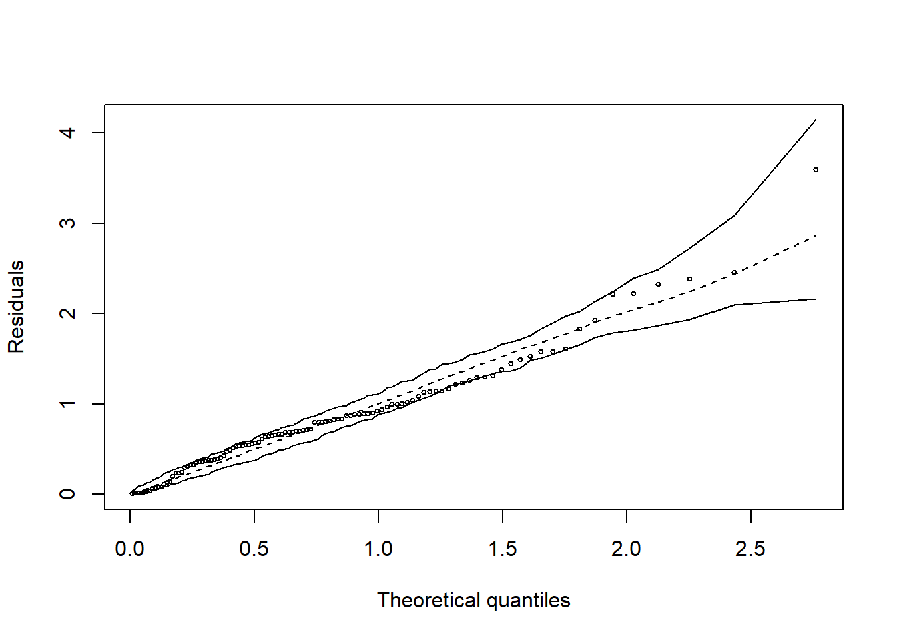


```r
plot(meditrat~dose,
     col="red",
     pch=16, 
     las=1, 
     ylab="Conversão alimentar",
     main=expression(italic("Conversão alimentar")),
     xlab="FAD (%)")
curve(coef(m2)[1]+coef(m2)[2]*x+coef(m2)[3]*x^2, add=T, col="blue")
(xmax=coef(m2)[2]/-(2*coef(m2)[3]))
```

```
## poly(FAD, degree = 2, raw = TRUE)1 
##                           28.21023
```

```r
(ymax=coef(m2)[1]+coef(m2)[2]*xmax+coef(m2)[3]*xmax^2)
```

```
## (Intercept) 
##    7.346437
```

```r
abline(v=xmax, h=ymax, lty=2,col="red")
points(xmax,ymax, col="red", pch=8)
legend("bottomleft", bty="n",legend=c(expression(Y==6.457143+0.06304762 *x-0.00111746*x^2), expression(R^2==0.595)))
```

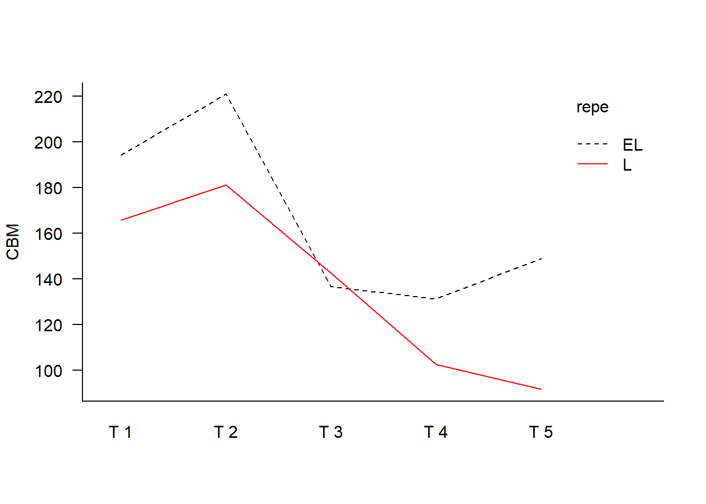

<br><br><br><br>

****

# Análise conjunta

****

<br><br><br><br>

## Análise conjunta com um fator qualitativo (DBC)

<br>

Na experimentação agrícola é comum a instalação de grupos de ensaios iguais, ou seja, com a mesma estrutura (delineamento, repetições e tratamentos iguais), entretanto, em anos e/ou locais distintos, visando a obtenção de conclusões mais abrangentes. Este tipo de análise é denominada análise conjunta de experimentos ou também conhecido como análise de grupos de experimentos.

Requisitos para análise de variância conjunta

a) Definir local (Ambiente) onde a pesquisa será conduzida, ou seja, diferentes localidades, anos diferentes de uma mesma localidade, anos e localidades distintas, etc. instalam-se os experimentos, o que geralmente são implantados em blocos casualziados, e após a coleta dos daddos, realizam-se todas às análises individuais, isto é, análise para cada ambiente de acordo com o delineamento estatístico utilizado.

b) Examina-se a seguir as grandezas dos $QM_{Res}$, ou seja, se forem homogêneas (Quando a razão entre a maior e o menor $QM_{Res}$ não for superior a mais de sete vezes) todos os ambientes poderão ser incluídos na análise conjunta sem restrições, do contrário, devem-se organizar subgrupos com QMresíduos homogêneos, sendo as análises conjuntas feitas para cada subgrupo.

FV               | G.L.        | S.Q.            |Q.M.                            | Fcalc                         
----------------:|:-----------:|:---------------:|:------------------------------:|:------------------------------
Tratamento       | $t-1$       |$SQ_{Tratamento}$|$\frac{SQ_{Tratamento}}{t-1}$   |$\frac{QM_{trat}}{QM_{T x A}}$  
Ambientes        | $a-1$       |$SQ_{Ambiente}$  |$\frac{SQ_{tratamento}}{a-1}$   |$\frac{QM_{a}}{QM_{T x A}}$     
Interação T x A  | $(t-1)(a-1)$|$SQ_{Interação}$ |$\frac{SQ_{T x A}}{(t-1)(a-1)}$ |$\frac{QM_{T x A}}{QM_{res}}$   
Resíduo médio    | $N'$        |$SQ_{res}$       |$\frac{SQ_{res}}{N}$            |
Total            | $at-1$      |$SQ_{Total}$     |                                |


****

## Exemplo 1

****

<br>

Um experimento com três tratamentos (T1: 6cm; T2: 12cm e T3: 18cm) foi conduzido em delineamento em blocos casualizados com quatro repetições cada. Este mesmo experimento foi repetido duas vezes, totalizando 3 ensaios experimentais (fevereiro; Abril e Junho de 2018).

<br>


```r
rm(list=ls())
resposta=c(20,30,30,20,80,75,75,60,85,80,80,90,20,10,10,20,
           30,20,10,20,50,60,80,30,30,60,40,50,100,60,80,80,
           70,90,80,80)
Comprimento=rep(rep(c(6,12,18),e=4),3); Comprimento=as.factor(Comprimento)
Tempo=rep(c(2,4,6),e=12); Tempo=as.factor(Tempo)
Repe=as.factor(c(rep(c(paste("R",1:4)),3),
       rep(c(paste("R",1:4)),3),
       rep(c(paste("R",1:4)),3)))
(dados=data.frame(Comprimento, Tempo, Repe, resposta))
```

```
##    Comprimento Tempo Repe resposta
## 1            6     2  R 1       20
## 2            6     2  R 2       30
## 3            6     2  R 3       30
## 4            6     2  R 4       20
## 5           12     2  R 1       80
## 6           12     2  R 2       75
## 7           12     2  R 3       75
## 8           12     2  R 4       60
## 9           18     2  R 1       85
## 10          18     2  R 2       80
## 11          18     2  R 3       80
## 12          18     2  R 4       90
## 13           6     4  R 1       20
## 14           6     4  R 2       10
## 15           6     4  R 3       10
## 16           6     4  R 4       20
## 17          12     4  R 1       30
## 18          12     4  R 2       20
## 19          12     4  R 3       10
## 20          12     4  R 4       20
## 21          18     4  R 1       50
## 22          18     4  R 2       60
## 23          18     4  R 3       80
## 24          18     4  R 4       30
## 25           6     6  R 1       30
## 26           6     6  R 2       60
## 27           6     6  R 3       40
## 28           6     6  R 4       50
## 29          12     6  R 1      100
## 30          12     6  R 2       60
## 31          12     6  R 3       80
## 32          12     6  R 4       80
## 33          18     6  R 1       70
## 34          18     6  R 2       90
## 35          18     6  R 3       80
## 36          18     6  R 4       80
```

<br>

## ANOVA individual

<br>

Antes de efetuar a análise conjunta, vamos analisar os dados em cada época (Como experimentos separados).

<br>

### Tempo de 2 meses


```r
modelo=with(dados[Tempo=="2",],aov(resposta~Comprimento+Repe))
anova(modelo)
```

```
## Analysis of Variance Table
## 
## Response: resposta
##             Df Sum Sq Mean Sq F value    Pr(>F)    
## Comprimento  2 7779.2  3889.6 69.1481 7.189e-05 ***
## Repe         3   56.3    18.8  0.3333    0.8022    
## Residuals    6  337.5    56.3                      
## ---
## Signif. codes:  0 '***' 0.001 '**' 0.01 '*' 0.05 '.' 0.1 ' ' 1
```

Como p-valor calculado ($p=7.1893264\times 10^{-5}$) é menor que o nível de significância adotado, rejeita-se $H_0$. Logo, ao menos dois tratamentos diferem entre si.

<br>

### Tempo de 4 meses


```r
modelo1=with(dados[Tempo=="4",],aov(resposta~Comprimento+Repe))
anova(modelo1)
```

```
## Analysis of Variance Table
## 
## Response: resposta
##             Df Sum Sq Mean Sq F value  Pr(>F)  
## Comprimento  2   3800 1900.00  8.1429 0.01952 *
## Repe         3    200   66.67  0.2857 0.83436  
## Residuals    6   1400  233.33                  
## ---
## Signif. codes:  0 '***' 0.001 '**' 0.01 '*' 0.05 '.' 0.1 ' ' 1
```

Como p-valor calculado ($p=0.0195152$) é menor que o nível de significância adotado, rejeita-se $H_0$. Logo, ao menos dois tratamentos diferem entre si.

<br>

### Tempo de 6 meses


```r
modelo2=with(dados[Tempo=="6",],aov(resposta~Comprimento+Repe))
anova(modelo2)
```

```
## Analysis of Variance Table
## 
## Response: resposta
##             Df Sum Sq Mean Sq F value  Pr(>F)  
## Comprimento  2 3266.7 1633.33  6.6818 0.02975 *
## Repe         3   33.3   11.11  0.0455 0.98589  
## Residuals    6 1466.7  244.44                  
## ---
## Signif. codes:  0 '***' 0.001 '**' 0.01 '*' 0.05 '.' 0.1 ' ' 1
```

Como p-valor calculado ($p=0.0297504$) é menor que o nível de significância adotado, rejeita-se $H_0$. Logo, ao menos dois tratamentos diferem entre si.

<br>

## Quadrado do resíduo médio


```r
QMResiduo1<- anova(modelo)$`Mean Sq`[3]
QMResiduo2<- anova(modelo1)$`Mean Sq`[3]
QMResiduo3<- anova(modelo2)$`Mean Sq`[3]
QMResiduo<- c(QMResiduo1, QMResiduo2,
              QMResiduo3)
max(QMResiduo)/min(QMResiduo) ## Deve ser menor que 7
```

```
## [1] 4.345679
```

```r
sum(QMResiduo)/3
```

```
## [1] 178.0093
```

<br>

De acordo com Pimentel Gomes (2009), os ensaios em diversos locais podem ser agrupados em uma única análise desde que o quociente entre o maior e o menor quadrado médio do resíduo (QMRes) seja inferior a 7, caso contrário, pode-se considerar subgrupos de locais homogêneos, com quadrados médios residuais que satisfaçam o quociente, a fim de se construir tantas análises conjuntas quantos subgrupos criados

**Referência**: PIMENTEL GOMES, F. Curso de estatística experimental. 15 ed. Piracicaba: FEALQ, 2009. 451p.

<br><br><br>

## Gráfico de interação


```r
interaction.plot(Comprimento, 
                 Tempo, resposta, 
                 col=c("red","blue","green"),
                 las=1,
                 ylab="Resposta")
```

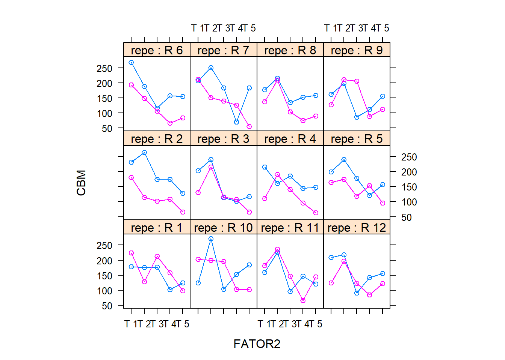

<br>

## Análise de Variância conjunta

A análise de variância conjunta pode ser efetuada conforme os comandos abaixo:

Teste F para efeito da interação Local:Trat (Somente a interação é válida)


```r
summary(aov(resposta~Tempo+Tempo:Repe+Comprimento+
              Tempo:Comprimento, data=dados)) 
```

```
##                   Df Sum Sq Mean Sq F value   Pr(>F)    
## Tempo              2   9829    4915  27.609 3.28e-06 ***
## Comprimento        2  12304    6152  34.560 6.86e-07 ***
## Tempo:Repe         9    290      32   0.181    0.994    
## Tempo:Comprimento  4   2542     635   3.570    0.026 *  
## Residuals         18   3204     178                     
## ---
## Signif. codes:  0 '***' 0.001 '**' 0.01 '*' 0.05 '.' 0.1 ' ' 1
```

Como p-valor calculado $p=0.026$ é menor que o nível de significância adotado de ($\alpha=0.05$), pode-se concluir que há efeito de interação. Logo, temos que analisar como experimentos separados.

Teste F para efeito do Tratamento


```r
mod=aov(resposta~Tempo+Tempo:Repe+Comprimento+Error(Tempo:(Repe+Comprimento)), data=dados)
summary(mod)
```

```
## 
## Error: Tempo:Repe
##            Df Sum Sq Mean Sq
## Tempo       2   9829    4915
## Tempo:Repe  9    290      32
## 
## Error: Tempo:Comprimento
##             Df Sum Sq Mean Sq F value Pr(>F)  
## Comprimento  2  12304    6152   9.682 0.0293 *
## Residuals    4   2542     635                 
## ---
## Signif. codes:  0 '***' 0.001 '**' 0.01 '*' 0.05 '.' 0.1 ' ' 1
## 
## Error: Within
##           Df Sum Sq Mean Sq F value Pr(>F)
## Residuals 18   3204     178
```

<br><br><br>

## Conferindo "Manualmente" 

Quadro auxiliar com os totais da resposta em ensaios realizados em Londrina no delineamento inteiramente casualizado com três tratamentos (Comprimento de estaca) e quatro repetições em três épocas (T2,T4,T6)

Comprimento     | T2      |T4        |T6           | Total
----------------|---------|----------|-------------|----------
6               | 100     | 60       |180          | 340
12              | 290     | 80       |320          | 690
18              | 335     | 220      |320          | 875
Total           | 725     | 360      |820          | 1905

<br><br>

## Grau de liberdade

**Grau de liberdade do Comprimento**

<center>

$GL_{c}=c-1$

$GL_{comp}=3-1=2$

</center>

**Grau de liberdade do tempo**

<center>

$GL_{t}=t-1$

$GL_{tempo}=3-1=2$

</center>

**Grau de liberdade da interação**

<center>

$GL_{cXt}=(c-1)(t-1)$

$GL_{interação}=(3-1)(3-1)=4$

</center>

**Grau de liberdade do resíduo**

<center>

$GL_{resíduomédio}=N'$

$GL_{resíduo médio}=2*3(3)=18$

$N= c r t=36$

</center>

<br><br>

### Calculando soma de quadrados

<center>

****

$SQ_{c}=\frac{\sum T_c^2}{rc}-\frac{(\sum T_c)^2}{N}$

$SQ_{comp}=\frac{340^2+690^2+875^2}{4*3}-\frac{1905^2}{36}=12.304,17$

****

$SQ_{t}=\frac{\sum T_t^2}{rt}-\frac{(\sum T_t)^2}{N}$

$SQ_{tempo}=\frac{725^2+360^2+820^2}{4*3}-\frac{1905^2}{36}=9.829,15$

****

$SQ_{c X t}=\frac{\sum T_{ct}^2}{r}-\frac{(\sum T_{ct})^2}{N}$

$SQ_{interação}=\frac{100^2+60^2+180^2+290^2+80^2+320^2+335^2+220^2+320^2}{4}-\frac{1905^2}{36}-12.304,17-9.829,15=2.541,63$

</center>

<br><br>

### Calculando quadrado médio

<center>

****
$QM_{c}=\frac{SQ_{c}}{GL_c}$

$QM_{comp}=\frac{12.304,17}{2}=6.152,1$

****
$QM_{t}=\frac{SQ_{t}}{GL_t}$

$QM_{tempo}=\frac{9.829,15}{2}=4.914,6$

****
$QM_{c}=\frac{SQ_{cXt}}{GL_{interação}}$

$QM_{interação}=\frac{2.541,63}{4}=635,4075$

****
$QM_{c}=\frac{SQ_{resT2}+SQ_{resT4}+SQ_{resT6}}{t}$

$QM_{resíduo médio}=\frac{56+233,33+244,44}{3}=178,0$

</center>

<br><br>

### Teste F de Fischer

<center>

****

$F_{c}=\frac{QM_{c}}{QM_{cXt}}$

$F_{comp}=\frac{6.152,1}{635.4075}=9.682$

$F_{t}=\frac{QM_{t}}{QM_{cXt}}$

$F_{tempo}=\frac{4.914,6}{635.4075}=7,73$

$F_{c}=\frac{QM_{cXt}}{QM_{resíduomédio}}$

$F_{interação}=\frac{635.4075}{178}=3,5696$

</center>

<br><br>

## Pressuposição do modelo

<br>

### Normalidade dos erros

\begin{eqnarray*}
\left\{
\begin{array}{ll}
H_0: & \mbox{ Os erros têm distribuição normal} \\[.2cm]
H_1: & \mbox{ Os erros não têm distribuição normal}.
\end{array}
\right.
\end{eqnarray*}


```r
## Vamos analisar os erros como sendo um modelo em esquema Fatorial
mod1=aov(resposta~Comprimento*Tempo+Repe)
(norm=shapiro.test(mod1$res))
```

```
## 
## 	Shapiro-Wilk normality test
## 
## data:  mod1$res
## W = 0.97794, p-value = 0.6756
```

Como p-valor calculado ($p=0.6756399$) é maior que o nível de significância adotado ($\alpha=0,05$), não se rejeita $H_0$. Logo, os erros seguem distribuição normal.

<br><br>

### Gráfico de normalidade


```r
HNP=hnp::hnp(mod1, paint.on=T, col="red" , las=1, pch=8)
```


```r
plot(HNP,lty=c(2,3,2),  col=c(2,1,2,1))
```


<br><br>

### Homogeneidade de variâncias

\begin{eqnarray*}
\left\{
\begin{array}{ll}
H_0: & \mbox{ As variâncias são homogêneas} \\[.2cm]
H_1: & \mbox{ As variâncias não são homogêneas}.
\end{array}
\right.
\end{eqnarray*}


```r
(homog=bartlett.test(mod1$res~paste(Comprimento,Tempo)))
```

```
## 
## 	Bartlett test of homogeneity of variances
## 
## data:  mod1$res by paste(Comprimento, Tempo)
## Bartlett's K-squared = 9.5181, df = 8, p-value = 0.3005
```

Como p-valor calculado ($p=0.3004895$) é maior que o nível de significância adotado ($\alpha=0,05$), não se rejeita $H_0$. Logo, as variâncias são homogêneas.

<br><br>

### Independências dos erros

\begin{eqnarray*}
\left\{
\begin{array}{ll}
H_0: & \mbox{ Os erros são independentes;} \\[.2cm]
H_1: & \mbox{ Os erros não são independentes.}
\end{array}
\right.
\end{eqnarray*}


```r
library(lmtest)
ind=dwtest(mod1)
```

Como p-valor calculado ($p=0.5781767$) é maior que o nível de significância adotado ($\alpha=0,05$), não se rejeita $H_0$. Logo, os erros são independentes. A Figura \ref{Fig3} apresenta o gráfico dos resíduos brutos. Percebe-se que os resíduos estão distribuídos de forma totalmente aleatório, evidenciando a independência dos erros.


```r
plot(mod1$res, col="blue",
     las=1, pch=16,
     ylab="Residuos brutos")
abline(h=0, col="red", lwd=2)
```

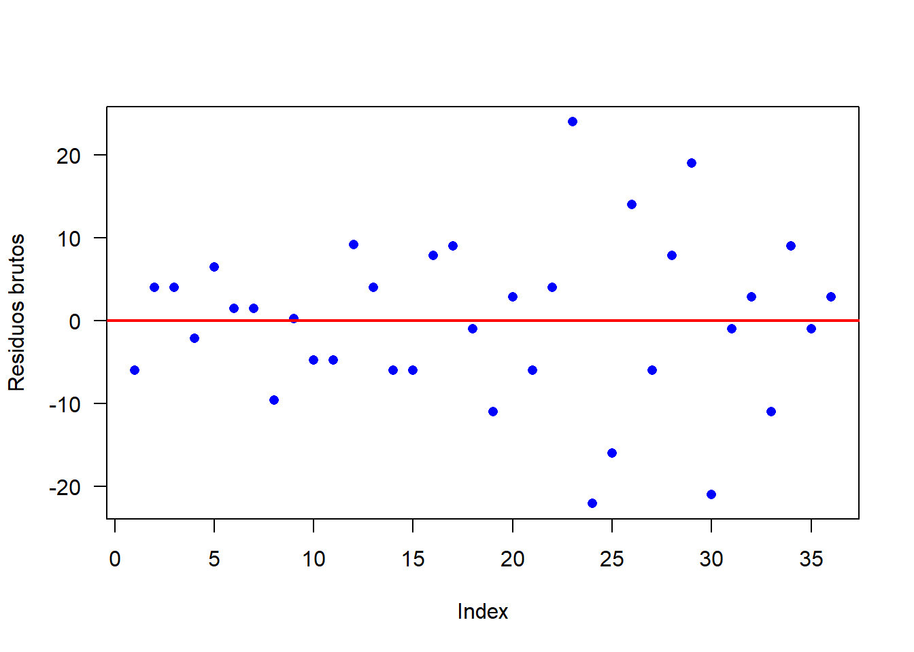

<br><br><br>

## Desdobramento

<br>

### Desdobramento do Comprimento em cada nível de Tempo


```r
#desdobramento
dados$LT<- as.factor(dados$Tempo:dados$Comprimento)
#efeito de tratamento dentro de cada nível de local
mod.conj<- aov(resposta ~ Tempo + Tempo:Repe + LT,
               data=dados)
summary(mod.conj,
        split=list(LT=list(TdL1=1:2,TdL2=3:4,
                           TdL3=5:6)))
```

```
##             Df Sum Sq Mean Sq F value   Pr(>F)    
## Tempo        2   9829    4915  27.609 3.28e-06 ***
## LT           6  14846    2474  13.900 6.80e-06 ***
##   LT: TdL1   2   7779    3890  21.850 1.53e-05 ***
##   LT: TdL2   2   3800    1900  10.674 0.000877 ***
##   LT: TdL3   2   3267    1633   9.176 0.001790 ** 
## Tempo:Repe   9    290      32   0.181 0.993687    
## Residuals   18   3204     178                     
## ---
## Signif. codes:  0 '***' 0.001 '**' 0.01 '*' 0.05 '.' 0.1 ' ' 1
```

<br>

### Teste de comparação múltipla


```r
# O QMres é 178 e o GL é 18

require(agricolae)

#dentro de Tempo 2
tukey.l1<-HSD.test(dados$resposta[dados$Tempo=="2"],
             dados$Comprimento[dados$Tempo=="2"],
             18, 178)
tukey.l1$groups
```

```
##    dados$resposta[dados$Tempo == "2"] groups
## 18                              83.75      a
## 12                              72.50      a
## 6                               25.00      b
```

```r
#dentro de Tempo 4
tukey.l2<-HSD.test(dados$resposta[dados$Tempo=="4"],
                    dados$Comprimento[dados$Tempo=="4"],
                    18, 178)
tukey.l2$groups
```

```
##    dados$resposta[dados$Tempo == "4"] groups
## 18                                 55      a
## 12                                 20      b
## 6                                  15      b
```

```r
#dentro de Tempo 6
tukey.l3<-HSD.test(dados$resposta[dados$Tempo=="6"],
                    dados$Comprimento[dados$Tempo=="6"],
                    18, 178)
tukey.l3$groups
```

```
##    dados$resposta[dados$Tempo == "6"] groups
## 12                                 80      a
## 18                                 80      a
## 6                                  45      b
```


```r
par(mfrow=c(1,3))
bar.group(tukey.l1$groups, ylim=c(0,120),
          main="Tempo 2", xlab="Comprimento",
          ylab="resposta",las=1)
bar.group(tukey.l2$groups, ylim=c(0,120),
          main="Tempo 4", xlab="Comprimento",
          ylab="resposta",las=1)
bar.group(tukey.l3$groups, ylim=c(0,120),
          main="Tempo 6", xlab="Comprimento",
          ylab="resposta",las=1) 
```

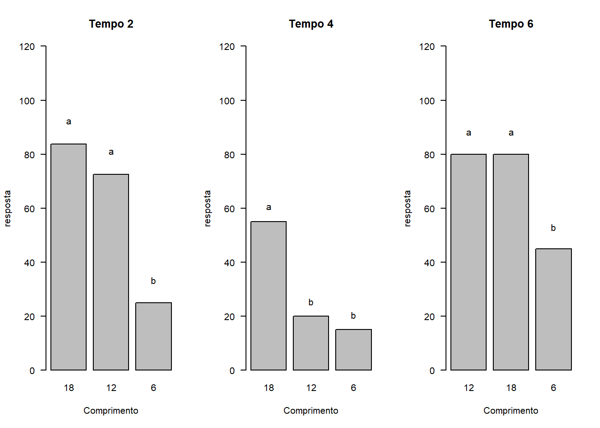

<br><br><br>

## Tabela Final


```r
library(knitr)
media=tapply(resposta, list(Comprimento, Tempo),mean)
tabela=data.frame("Mês 2"=media[,1],
             " "=c("B","A","A"),
             "Mês 4"=media[,2],
             " "=c("B","B","A"),
             "Mês 6"=media[,3],
             " "=c("B","A","A"))
kable(tabela, align = "c", col.names = c("Mês 2"," ","Mês 4"," ","Mês 6"," "))
```

      Mês 2         Mês 4         Mês 6      
---  -------  ---  -------  ---  -------  ---
6     25.00    B     15      B     45      B 
12    72.50    A     20      B     80      A 
18    83.75    A     55      A     80      A 

<br><br><br><br>


# Gráficos em R

<br><br>

****

# Gráfico de Colunas 

****

O gráfico em colunas consiste em construir retângulos, em que uma das dimensões é proporcional à magnitude a ser representada ($n_i$ ou $f_i$), sendo a outra arbitrária, porém igual para todas as colunas. Essas colunas são dispostas paralelamente umas às outras de forma vertical.

<br>

Além do título e fonte de referências deve-se observar o seguinte:

- as colunas devem ter todas a mesma largura;
- a distância entre as colunas deve ser constante e de preferência menor que a largura das colunas.

<br><br>


## Conjunto de dados

<br>


```r
tratamentos=rep(c(paste("T",1:5)),e=4)
resposta=c(100,120,110,90,150,145,149,165,150,144,134,139,220,206,210,210,266,249,248,260)
## Média e Desvio-padrão (Por Tratamento)
media=tapply(resposta,tratamentos, mean)
desvio=tapply(resposta,tratamentos,sd)
```

<br>


```r
barplot(media)
```


<br>

## Adicionando melhorias


```r
barplot(media, 
        las=1,
        col="lightyellow",
        ylab="Resposta",
        xlab="Tratamentos",
        ylim=c(0,300))
abline(h=0)
```

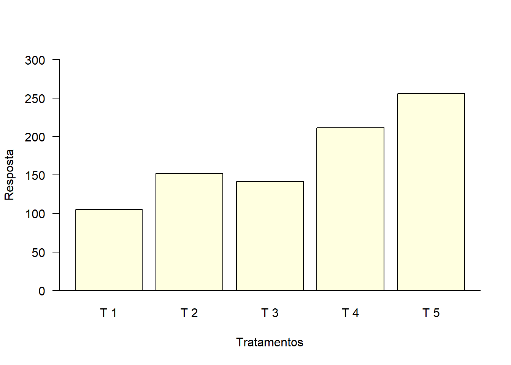

**Comandos**:

las=1: deixar escala do eixo Y na vertical

col="cor": mudar cor das barras (Ex. "red","blue","green" ou gray.colors(quantidade de tonalidades) para escala cinza ou rainbow(quantidade de cores) para escala colorida. Também é possível específicar a cor de cada barra (col=c("red","green","yellow","gray","blue"))).

xlab e ylab: nomear eixo X e Y

xlim e ylim: escala do eixo X e Y

abline(h=0): linha na horizontal em Y=0 (No caso de vertical, abline(v=0)). É possível alterar a cor pela função "col="cor"" e o tracejado pelo "lty=número" (Ver o Help do comando)

<br>

## Barras de desvio-padrão


```r
bar=barplot(media, 
        las=1,
        col="lightyellow",
        ylab="Resposta",
        xlab="Tratamentos",
        ylim=c(0,300))
abline(h=0)
arrows(bar,media+desvio,bar,media-desvio,length = 0.1,angle=90,code=3)
```

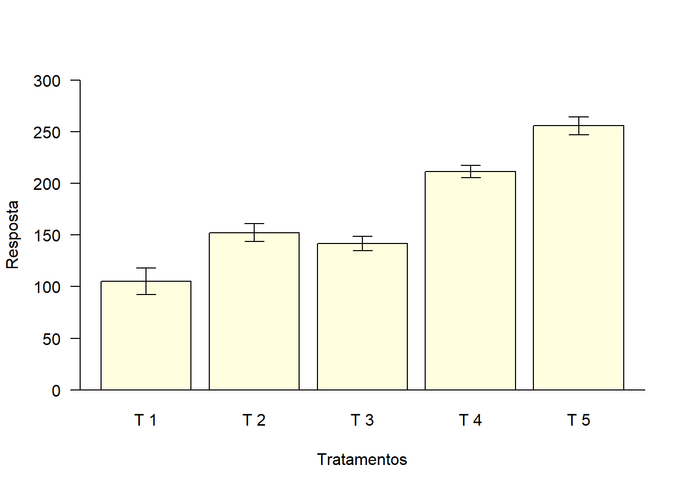

<br>

## Unidade do eixo Y 

(Ex. $Kg\ ha^{-1}$)


```r
bar=barplot(media, 
        las=1,
        col="lightyellow",
        ylab=expression("Resposta"*" "*(kg*" "*ha^-1)),
        xlab="Tratamentos",
        ylim=c(0,300))
abline(h=0)
arrows(bar,media+desvio,bar,media-desvio,length = 0.1,angle=90,code=3)
```


<br>

## Média dos tratamentos


```r
bar=barplot(media, 
        las=1,
        col="lightyellow",
        ylab=expression("Resposta"*" "*(kg*" "*ha^-1)),
        xlab="Tratamentos",
        ylim=c(0,300))
abline(h=0)
text(bar,media+desvio+10,media)
arrows(bar,media+desvio,bar,media-desvio,length = 0.1,angle=90,code=3)
```


<br>

## Separação de casa decimal


```r
options(OutDec=",")
bar=barplot(media, 
        las=1,
        col="lightyellow",
        ylab=expression("Resposta"*" "*(kg*" "*ha^-1)),
        xlab="Tratamentos",
        ylim=c(0,300))
abline(h=0)
text(bar,media+desvio+10,media)
arrows(bar,media+desvio,bar,media-desvio,length = 0.1,angle=90,code=3)
```


<br>

## Letras do teste de comparação


```r
tukey=c("d","c","c","b","a")
options(OutDec=",")
bar=barplot(media, 
        las=1,
        col="lightyellow",
        ylab=expression("Resposta"*" "*(kg*" "*ha^-1)),
        xlab="Tratamentos",
        ylim=c(0,300))
abline(h=0)
text(bar,media+desvio+10,paste(round(media,0),tukey))
arrows(bar,media+desvio,bar,media-desvio,length = 0.1,angle=90,code=3)
```

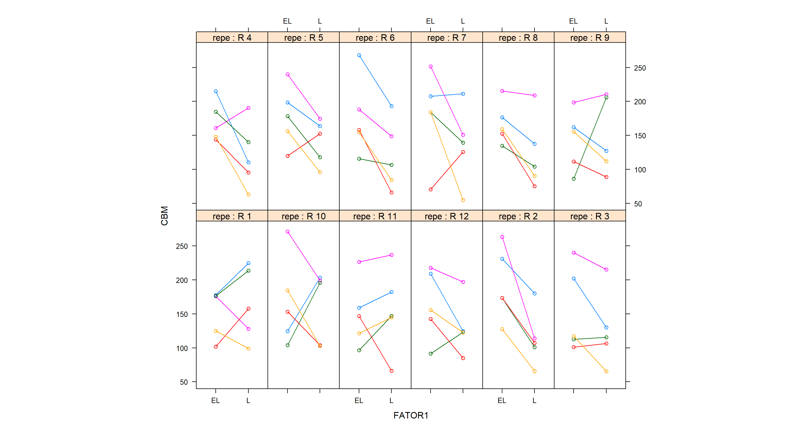

<br><br>

****

## Pacote Agricolae

****

<br>

### Conjunto de dados


```r
tratamentos=rep(c(paste("T",1:5)),e=4)
resposta=c(100,120,110,90,150,145,149,165,150,144,134,139,220,206,210,210,266,249,248,260)
```

<br>

### Modelo de Anova


```r
modelo=aov(resposta~tratamentos)
```


```r
library(agricolae)
a=HSD.test(modelo,"tratamentos", group = T)
```

<br>

### Gráfico com média 


```r
plot(a, las=1)
```

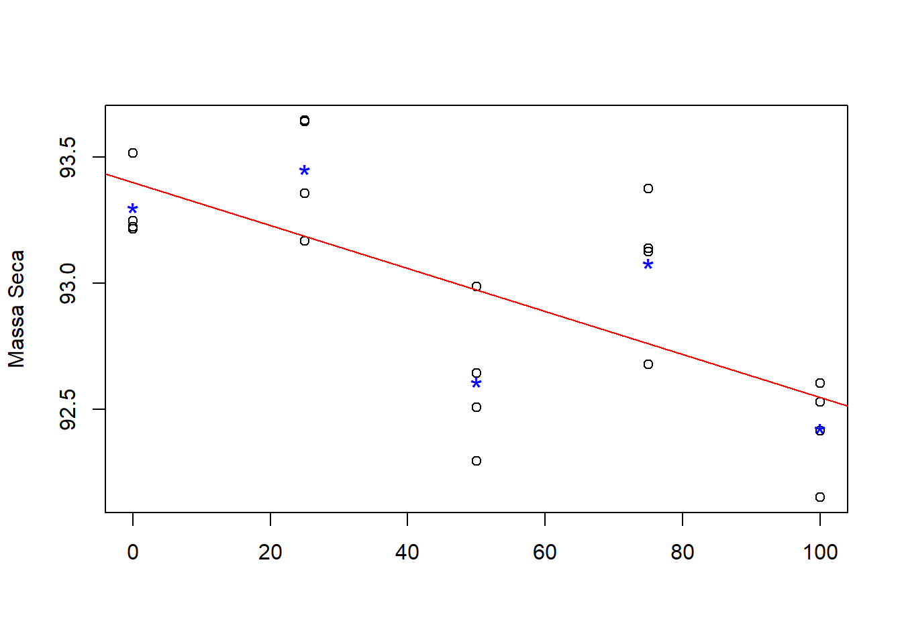

<br>

### Gráfico de barras


```r
bar.group(a$groups, col="lightblue",
          las=1, 
          ylim=c(0,300))
abline(h=0)
```

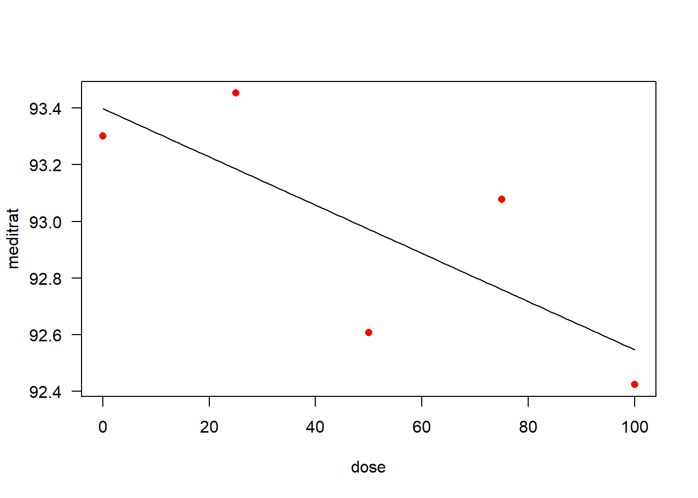

<br>

### Barras de desvio-padrão


```r
bar.err(a$means,
        variation="SD", col="lightblue",
        las=1,
        ylim=c(0,300))
abline(h=0)
```

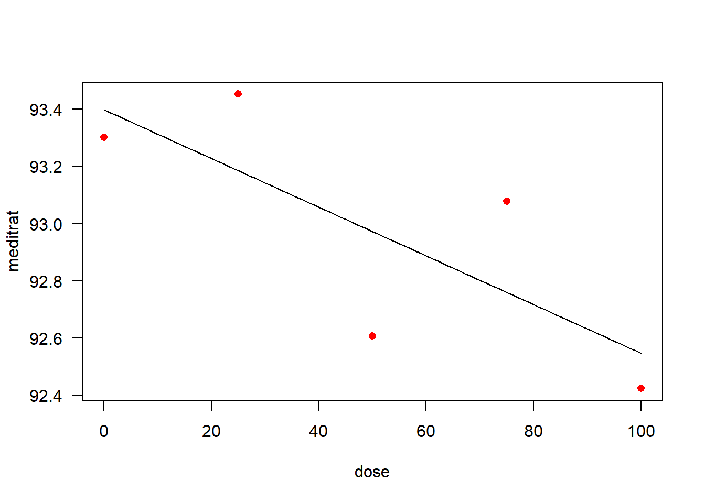

<br>

### Barras de erro padrão


```r
bar.err(a$means,
        variation="SE", col="lightblue",
        las=1,
        ylim=c(0,300))
abline(h=0)
```


<br>

### Barras de máximo-mínimo


```r
bar.err(a$means,
        variation="range", col="lightblue",
        las=1,
        ylim=c(0,300))
abline(h=0)
```


<br>

### Barras da distância interquartil


```r
bar.err(a$means,
        variation="IQR", col="lightblue",
        las=1,
        ylim=c(0,300))
abline(h=0)
```


<br><br><br>

****

## Pacote ggplot2 e ggpubr

****

### Conjunto de dados

Vamos trabalhar com três experimentos em DIC com quatro tratamentos e três repetições cada. 


```r
exp1=c(10,12,13,18,19,16,5,6,5,25,26,28)
exp2=c(9,12,11,18,20,16,7,6,9,25,28,28)
exp3=c(9,12,13,18,22,15,3,6,4,25,30,28)  
Trat=rep(c(paste("T",1:4)),e=3)
dados=data.frame(Trat,exp1,exp2,exp3)
dados$Trat=as.factor(Trat)
```

Obs. Para facilitar, vamos realizar a análise direto pelo pacote ExpDes.pt (é necessário instalar o pacote)

<br>

### Análise de exp1


```r
ExpDes.pt::dic(Trat,exp1)
```

```
## ------------------------------------------------------------------------
## Quadro da analise de variancia
## ------------------------------------------------------------------------
##            GL     SQ QM     Fc      Pr>Fc
## Tratamento  3 719,58    130,83 3,8864e-07
## Residuo     8  14,67                     
## Total      11 734,25                     
## ------------------------------------------------------------------------
## CV = 8,88 %
## 
## ------------------------------------------------------------------------
## Teste de normalidade dos residuos 
## Valor-p:  0,3563889 
## De acordo com o teste de Shapiro-Wilk a 5% de significancia, os residuos podem ser considerados normais.
## ------------------------------------------------------------------------
## 
## ------------------------------------------------------------------------
## Teste de homogeneidade de variancia 
## valor-p:  0,6539247 
## De acordo com o teste de bartlett a 5% de significancia, as variancias podem ser consideradas homogeneas.
## ------------------------------------------------------------------------
## 
## Teste de Tukey
## ------------------------------------------------------------------------
## Grupos Tratamentos Medias
## a 	 T 4 	 26,33333 
##  b 	 T 2 	 17,66667 
##   c 	 T 1 	 11,66667 
##    d 	 T 3 	 5,333333 
## ------------------------------------------------------------------------
```

<br>

### Análise de exp2


```r
ExpDes.pt::dic(Trat,exp2)
```

```
## ------------------------------------------------------------------------
## Quadro da analise de variancia
## ------------------------------------------------------------------------
##            GL     SQ QM     Fc      Pr>Fc
## Tratamento  3 684,92    78,276 2,8606e-06
## Residuo     8  23,33                     
## Total      11 708,25                     
## ------------------------------------------------------------------------
## CV = 10,84 %
## 
## ------------------------------------------------------------------------
## Teste de normalidade dos residuos 
## Valor-p:  0,2365244 
## De acordo com o teste de Shapiro-Wilk a 5% de significancia, os residuos podem ser considerados normais.
## ------------------------------------------------------------------------
## 
## ------------------------------------------------------------------------
## Teste de homogeneidade de variancia 
## valor-p:  0,9823917 
## De acordo com o teste de bartlett a 5% de significancia, as variancias podem ser consideradas homogeneas.
## ------------------------------------------------------------------------
## 
## Teste de Tukey
## ------------------------------------------------------------------------
## Grupos Tratamentos Medias
## a 	 T 4 	 27 
##  b 	 T 2 	 18 
##   c 	 T 1 	 10,66667 
##   c 	 T 3 	 7,333333 
## ------------------------------------------------------------------------
```

<br>

### Análise de exp3


```r
ExpDes.pt::dic(Trat,exp3)
```

```
## ------------------------------------------------------------------------
## Quadro da analise de variancia
## ------------------------------------------------------------------------
##            GL     SQ QM     Fc      Pr>Fc
## Tratamento  3 894,25    47,066 1,9902e-05
## Residuo     8  50,67                     
## Total      11 944,92                     
## ------------------------------------------------------------------------
## CV = 16,32 %
## 
## ------------------------------------------------------------------------
## Teste de normalidade dos residuos 
## Valor-p:  0,9419794 
## De acordo com o teste de Shapiro-Wilk a 5% de significancia, os residuos podem ser considerados normais.
## ------------------------------------------------------------------------
## 
## ------------------------------------------------------------------------
## Teste de homogeneidade de variancia 
## valor-p:  0,7583526 
## De acordo com o teste de bartlett a 5% de significancia, as variancias podem ser consideradas homogeneas.
## ------------------------------------------------------------------------
## 
## Teste de Tukey
## ------------------------------------------------------------------------
## Grupos Tratamentos Medias
## a 	 T 4 	 27,66667 
##  b 	 T 2 	 18,33333 
##   c 	 T 1 	 11,33333 
##    d 	 T 3 	 4,333333 
## ------------------------------------------------------------------------
```

<br>

## Utilizando o *ggplot2*


```r
library(ggplot2)
library(gridExtra)
```

<br>

### Média e desvio-padrão


```r
media=tapply(exp1, Trat, mean)
desvio=tapply(exp1, Trat, sd)
## Construindo uma nova data.frame com a media e desvio
dados1=data.frame(Trat=rownames(media),media,desvio)
```

<br>

### Gráfico básico


```r
ggplot(dados1, 
       aes(x=Trat,y=media))+
  geom_col()
```


### Média no gráfico


```r
ggplot(dados1, 
       aes(x=Trat,y=media))+
  geom_col()+
  geom_text(label=round(media,1), vjust=-1) 
```

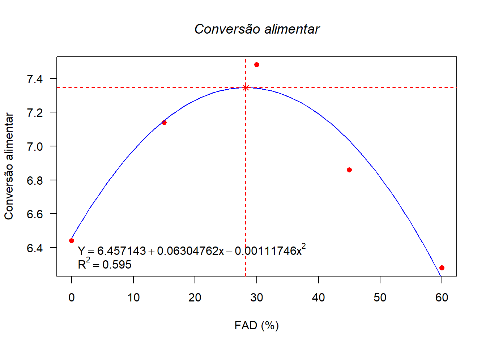

```r
# Obs. Round é para arrendondar o valor, neste caso estamos pedindo até a primeira casa decimal
```

<br>

### Letras do teste de comparação


```r
ggplot(dados1, 
       aes(x=Trat,y=media))+
  geom_col()+
  geom_text(label=paste(round(media,1),c("c","b","d","a")), vjust=-1)
```


```r
#Obs. a função paste serve para juntar palavras, nesse caso está juntando cada média com suas respectivas letras do teste de comparação de médias
```

<br>

### Escala do eixo Y


```r
ggplot(dados1, 
       aes(x=Trat,y=media))+
  geom_col()+
  geom_text(label=paste(round(media,1),c("c","b","d","a")), vjust=-1)+
  ylim(c(0,40))
```

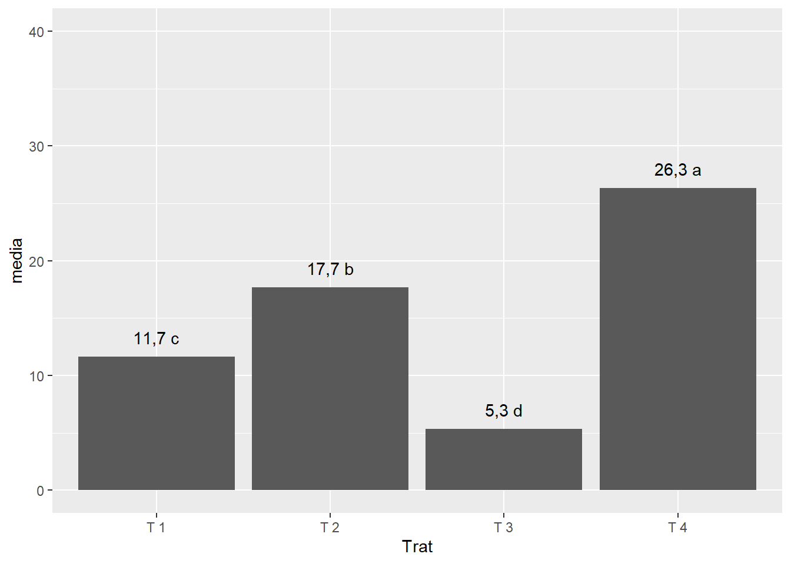

<br>

### Cor das colunas


```r
ggplot(dados1, 
       aes(x=Trat,y=media))+
  geom_col(fill=c(1,2,3,4))+
  geom_text(label=paste(round(media,1),c("c","b","d","a")), vjust=-1)+
  ylim(c(0,40))
```

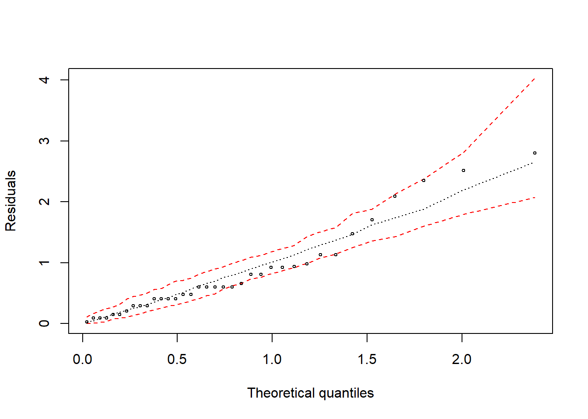

<br>

### Removendo cor de fundo


```r
ggplot(dados1, 
       aes(x=Trat,y=media))+
  geom_col(fill=c(1,2,3,4))+
  geom_text(label=paste(round(media,1),c("c","b","d","a")), vjust=-1)+
  ylim(c(0,40))+
  theme_bw()
```

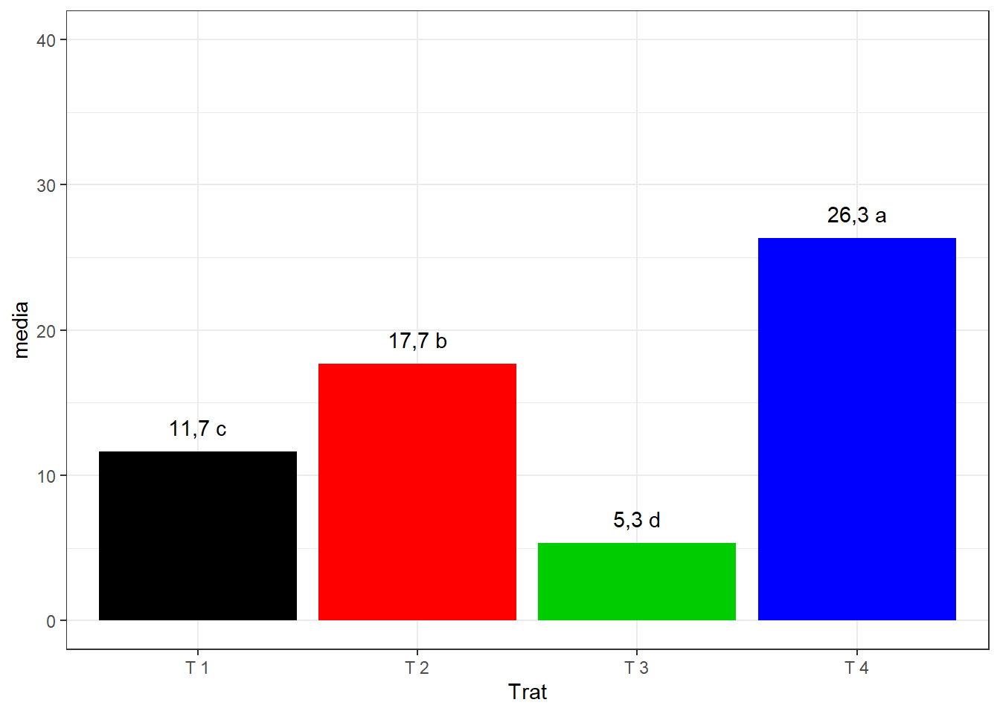

<br>

### Removendo linhas de grade


```r
ggplot(dados1, 
       aes(x=Trat,y=media))+
  geom_col(fill=c(1,2,3,4))+
  geom_text(label=paste(round(media,1),c("c","b","d","a")), vjust=-1)+
  ylim(c(0,40))+
  theme_bw()+
  theme_classic()
```

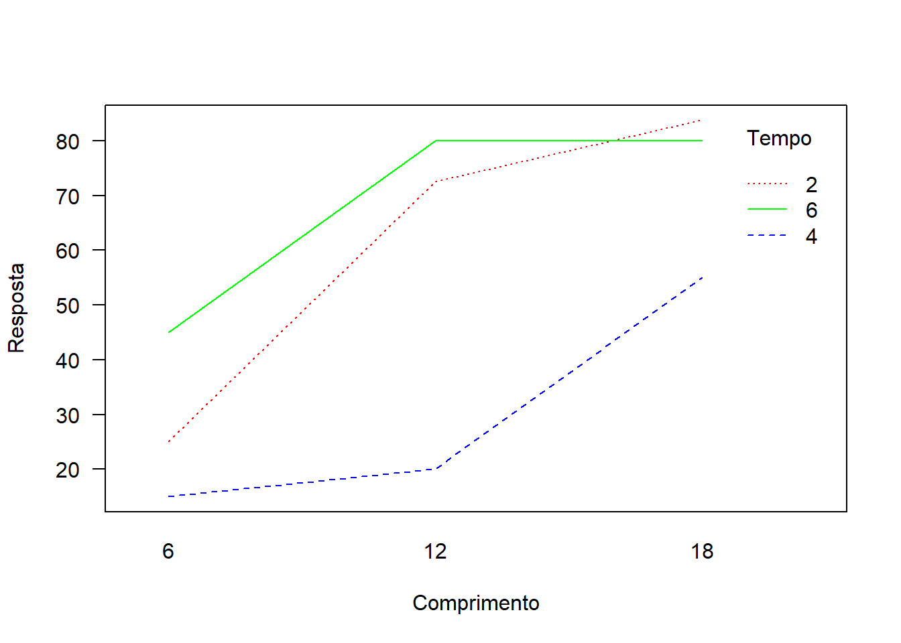

<br>

### Nome dos eixos X e Y

**Obs**. A função `expression()` funciona nesses argumentos.


```r
ggplot(dados1, aes(x=Trat,y=media))+
  geom_col(fill=c(1,2,3,4))+
  geom_text(label=paste(round(media,1),c("c","b","d","a")), vjust=-1)+
  ylim(c(0,40))+
  theme_bw()+
  theme_classic()+
  ylab("Resposta")+
  xlab(" ")
```

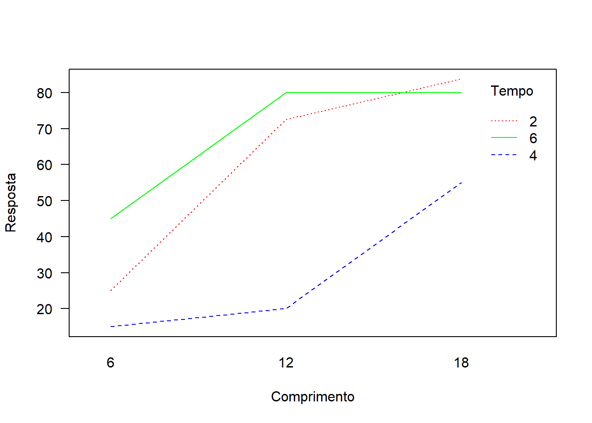

<br>

### Cor do contorno das colunas


```r
ggplot(dados1, 
       aes(x=Trat,y=media))+
  geom_col(fill=c(1,2,3,4),col="black")+     # Modifiquei aqui
  geom_text(label=paste(round(media,1),c("c","b","d","a")), vjust=-1)+
  ylim(c(0,40))+
  theme_bw()+
  theme_classic()+
  ylab("Resposta")+
  xlab(" ")
```


<br>

### Barras de desvio-padrão


```r
ggplot(dados1, aes(x=Trat,y=media))+
  geom_col(fill=c(1,2,3,4),col="black")+
  geom_text(label=paste(round(media,1),c("c","b","d","a")), vjust=-2)+
  ylim(c(0,40))+
  theme_bw()+
  theme_classic()+
  ylab("Resposta")+
  xlab(" ")+
  geom_errorbar(aes(ymax=media+desvio,ymin=media-desvio), width=0.25) # Width é a largura da barra
```

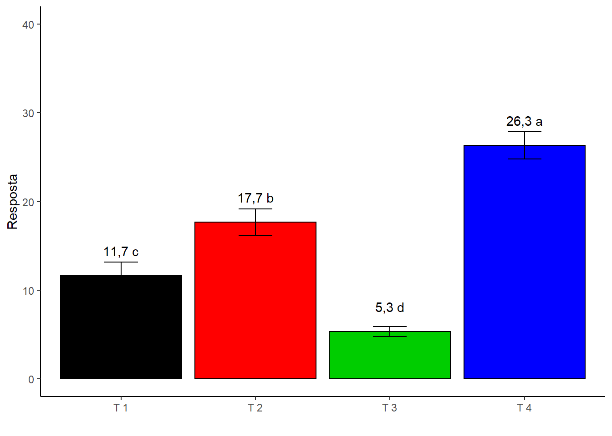

<br>

### Juntando os gráficos

Obs. Vamos chamar todo o plot de cada uma das variáveis de `a,b,c`, respectivamente. 

<br>

### Variável exp1


```r
media=tapply(exp1, Trat, mean)
desvio=tapply(exp1, Trat, sd)
dados1=data.frame(Trat=rownames(media),media,desvio)
a=ggplot(dados1, aes(x=Trat,y=media))+
  geom_col(fill=c(1,2,3,4),col="black")+
  geom_text(label=paste(round(media,1),
                        c("c","b","d","a")), vjust=-3)+
  ylim(c(0,40))+theme_bw()+theme_classic()+ylab("Resposta")+xlab(" ")+
  geom_errorbar(aes(ymax=media+desvio,
                   ymin=media-desvio), width=0.25)
```

<br>

### Variável exp2


```r
media=tapply(exp2, Trat, mean)
desvio=tapply(exp2, Trat, sd)
dados2=data.frame(Trat=rownames(media),media,desvio)
b=ggplot(dados2, aes(x=Trat,y=media))+
  geom_col(fill=c(1,2,3,4),col="black")+
  geom_text(label=paste(round(media,1),
                        c("c","b","c","a")), vjust=-3)+
  ylim(c(0,40))+theme_bw()+theme_classic()+ylab("Resposta")+xlab(" ")+
  geom_errorbar(aes(ymax=media+desvio,
                   ymin=media-desvio), width=0.25)
```

<br>

### Variável exp3


```r
media=tapply(exp3, Trat, mean)
desvio=tapply(exp3, Trat, sd)
dados3=data.frame(Trat=rownames(media),media,desvio)
c=ggplot(dados3, aes(x=Trat,y=media))+
  geom_col(fill=c(1,2,3,4),col="black")+
  geom_text(label=paste(round(media,1),
                        c("c","b","d","a")), vjust=-4)+
  ylim(c(0,40))+theme_bw()+theme_classic()+ylab("Resposta")+xlab(" ")+
  geom_errorbar(aes(ymax=media+desvio,
                   ymin=media-desvio), width=0.25)
```


```r
grid.arrange(a,b,c,ncol=3)
```

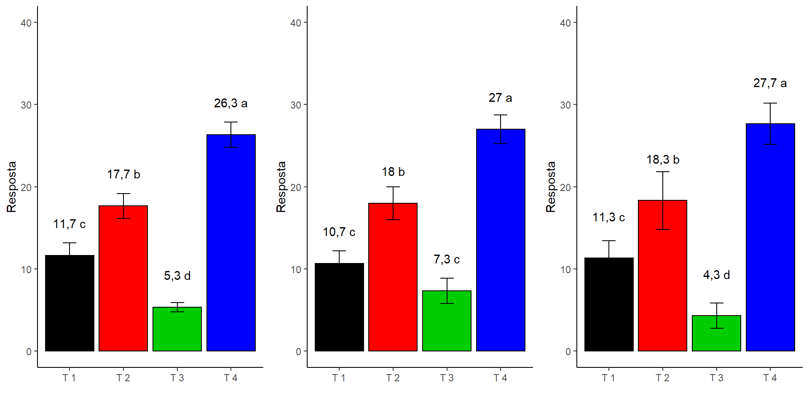

<br><br>

****

## Pacote ggpubr

****

**Obs.** Existem vários *packages* que utilizam o `ggplot2` e geram saídas similares, contudo, com argumentos dos comandos mais simples.


```r
exp1=c(10,12,13,18,19,16,5,6,5,25,26,28)
exp2=c(9,12,11,18,20,16,7,6,9,25,28,28)
exp3=c(9,12,13,18,22,15,3,6,4,25,30,28)  
Trat=rep(c(paste("T",1:4)),e=3)
dados=data.frame(Trat,exp1,exp2,exp3)
dados$Trat=as.factor(Trat)
```


```r
library(ggpubr)
library(gridExtra)
```

<br>

### Comando base 


```r
ggbarplot(dados, 
          x = "Trat", 
          y = "exp1",
          add="mean")
```


<br>

### Barras de desvio-padrão


```r
ggbarplot(dados, 
          x = "Trat", 
          y = "exp1",
          add = "mean_sd")
```

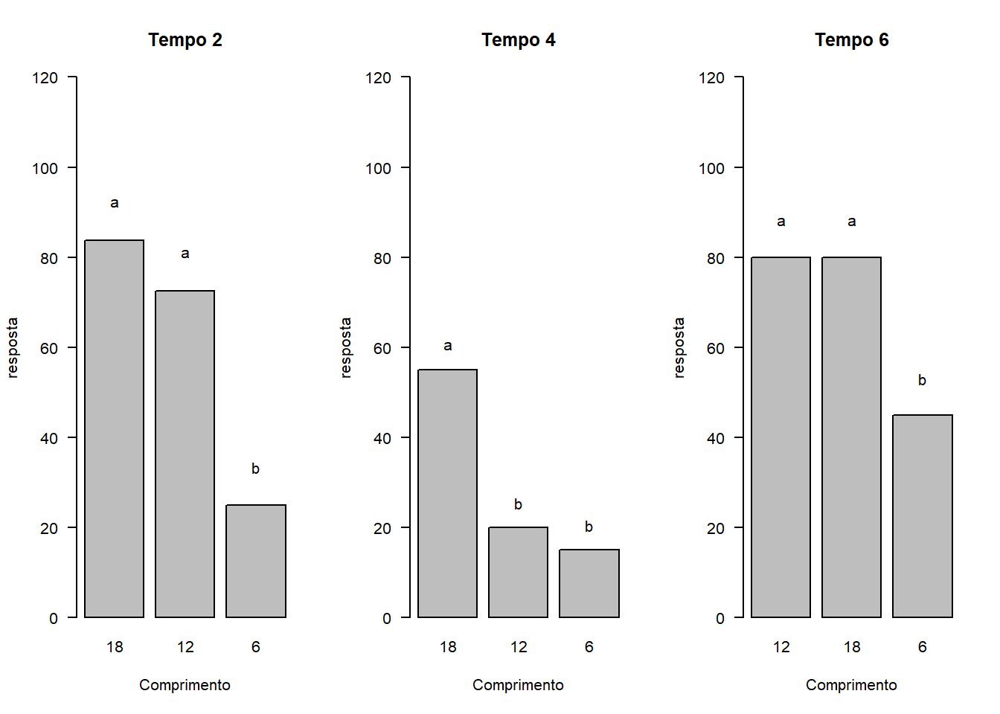

<br>

### Cor da coluna 


```r
ggbarplot(dados, 
          x = "Trat", 
          y = "exp1",
          add = "mean_sd", 
          fill = "Trat")
```


```r
ggbarplot(dados, 
          x = "Trat", 
          y = "exp1",
          add = "mean_sd", 
          fill = "Trat",
          palette = c(1,2,3,4))
```

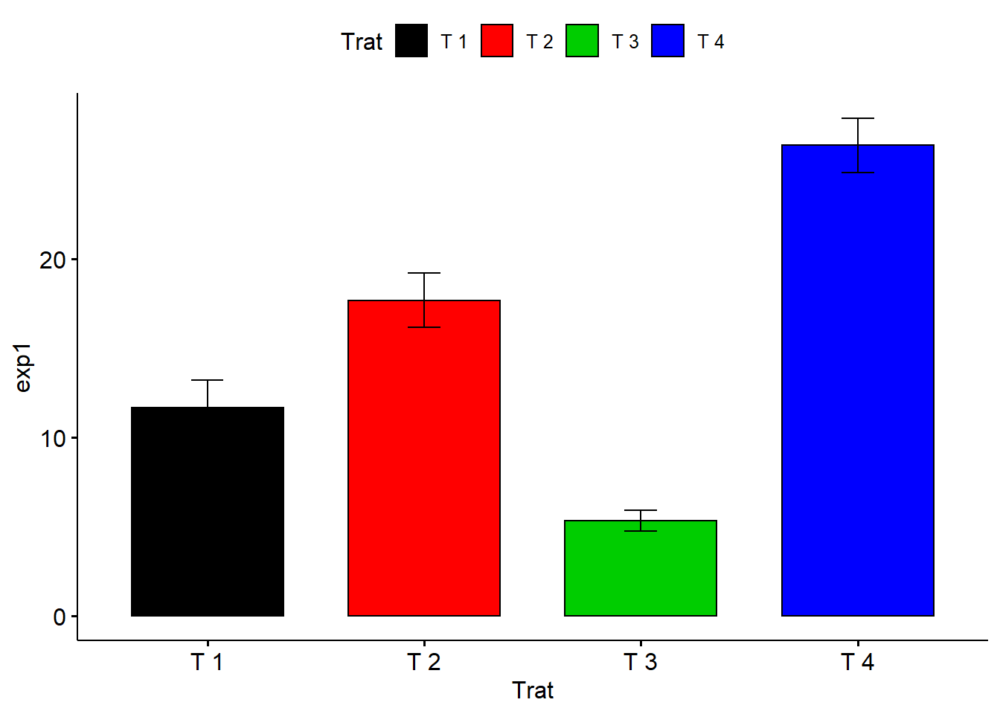

<br>

### Letra do teste de comparação


```r
ggbarplot(dados, 
          x = "Trat", 
          y = "exp1",
          add = "mean_sd", 
          fill = "Trat",
          label = c("c","b","d","a"),
          lab.vjust=-2)
```

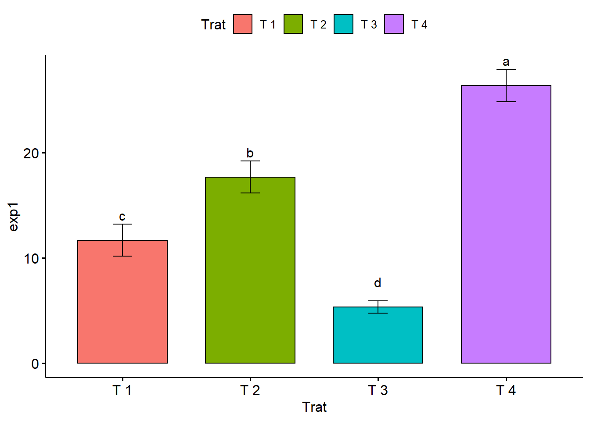

<br>

### Adicionando a média


```r
media=tapply(exp1,Trat,mean)
ggbarplot(dados, 
          x = "Trat", 
          y = "exp1",
          add = "mean_sd", 
          fill = "Trat",
          label = paste(round(media,1),c("c","b","c","a")),
          lab.vjust=-2)
```

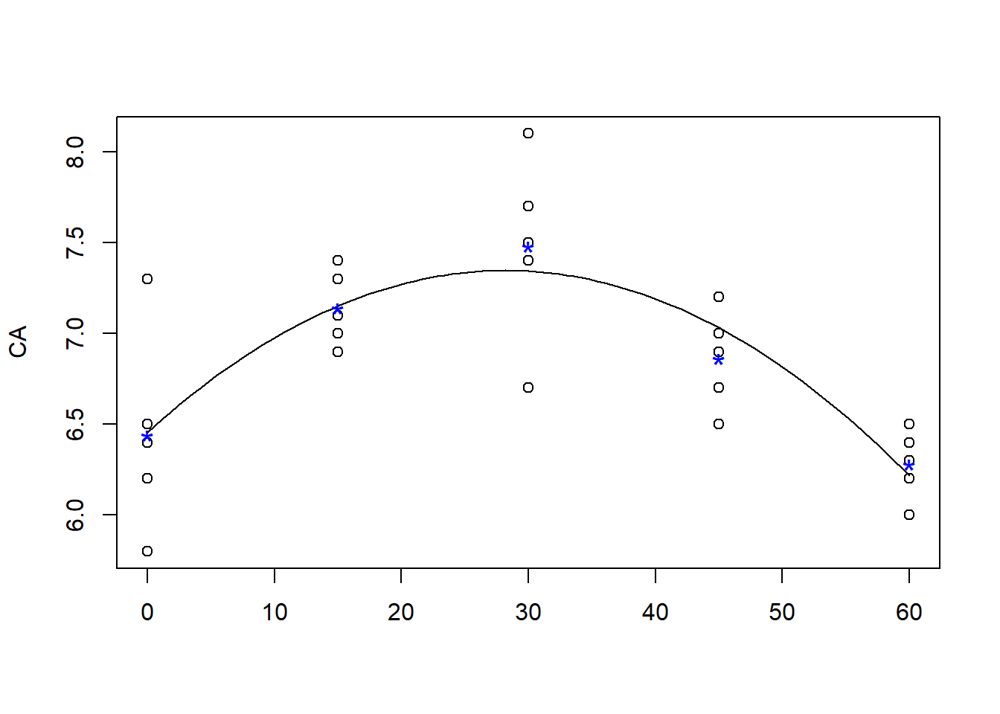

<br>

### Escala do eixo Y


```r
ggbarplot(dados, 
          x = "Trat", 
          y = "exp1",
          add = "mean_sd", 
          fill = "Trat",
          label = paste(round(media,1),c("c","b","d","a")),
          lab.vjust=-2)+ylim(c(0,40))
```


<br>

### Removendo legenda


```r
ggbarplot(dados, 
          x = "Trat", 
          y = "exp1",
          add = "mean_sd", 
          fill = "Trat",
          label = paste(round(media,1),c("c","b","d","a")),
          lab.vjust=-2,
          legend="n")+ylim(c(0,40))
```

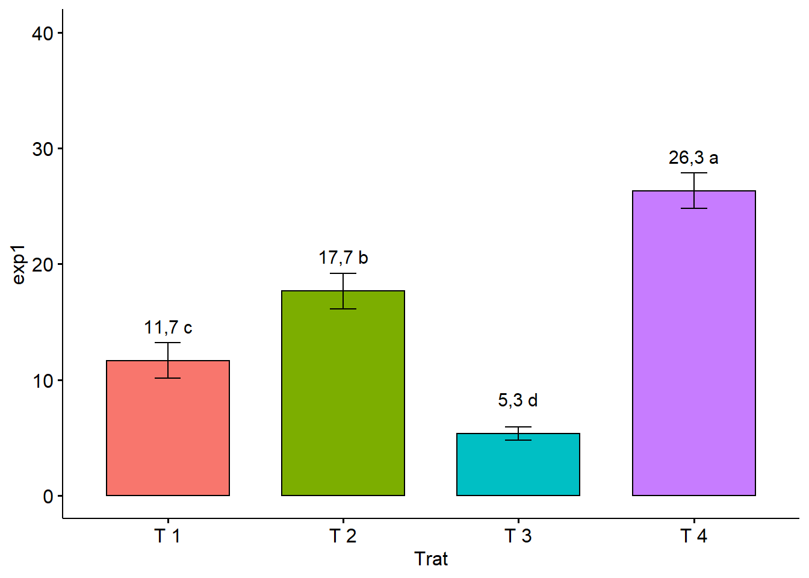

<br>

### Juntando os gráficos

<br>

### Variável exp1


```r
media=tapply(exp1,Trat,mean)
a=ggbarplot(dados, 
          x = "Trat", 
          y = "exp1",
          add = "mean_sd", 
          fill = "Trat",
          label = paste(round(media,1),c("c","b","d","a")),
          lab.vjust=-3,
          legend="n")+ylim(c(0,40))
```

<br>

### Variável exp2


```r
media=tapply(exp2,Trat,mean)
b=ggbarplot(dados, 
          x = "Trat", 
          y = "exp2",
          add = "mean_sd", 
          fill = "Trat",
          label = paste(round(media,1),c("c","b","d","a")),
          lab.vjust=-3,
          legend="n")+ylim(c(0,40))
```

<br>

### Variável exp3


```r
media=tapply(exp3,Trat,mean)
c=ggbarplot(dados, 
          x = "Trat", 
          y = "exp3",
          add = "mean_sd", 
          fill = "Trat",
          label = paste(round(media,1),c("c","b","d","a")),
          lab.vjust=-3,
          legend="n")+ylim(c(0,40))
```


```r
grid.arrange(a,b,c,ncol=3)
```

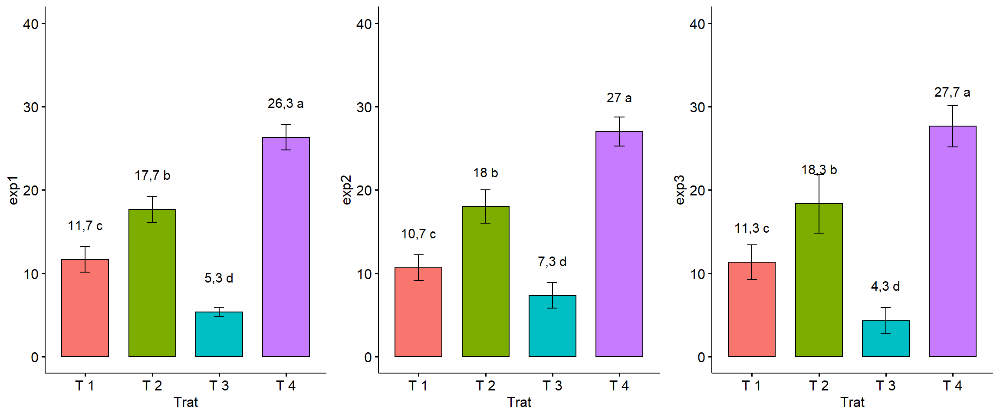

<br>

**Como deixar apenas o gráfico a esquerda com a escala de Y?**

Existem casos em que uma mesma variável foi analisada em várias situações e dessa forma, geramos gráficos com a mesma unidade de medida. Nesse sentido, é frequente apresentar apenas uma escala de Y, geralmente o gráfico a esquerda. No pacote ggpubr, podemos efetuar da seguinte forma:

<br>


```r
media=tapply(exp1,Trat,mean)
a=ggbarplot(dados, 
          x = "Trat", 
          y = "exp1",
          add = "mean_sd", 
          fill = "Trat",
          ylab="Resposta",
          label = paste(round(media,1),c("c","b","d","a")),
          lab.vjust=-3,
          legend="n")+ylim(c(0,40))
```

<br>


```r
media=tapply(exp2,Trat,mean)
b=ggbarplot(dados, 
          x = "Trat", 
          y = "exp2",
          add = "mean_sd", 
          fill = "Trat",
          label = paste(round(media,1),c("c","b","c","a")),
          lab.vjust=-3,
          legend="n",
          yscale="n")+
  ylim(c(0,40))+
  theme(axis.text.y=element_blank())+ # Comando para remover os números da escala de Y
  ylab("") # Remover nome do eixo Y 
```

<br>


```r
media=tapply(exp3,Trat,mean)
c=ggbarplot(dados, 
          x = "Trat", 
          y = "exp3",
          add = "mean_sd", 
          fill = "Trat",
          label = paste(round(media,1),c("c","b","d","a")),
          lab.vjust=-4,
          legend="n")+
  ylim(c(0,40))+
  theme(axis.text.y=element_blank())+
  ylab("")
```


```r
grid.arrange(a,b,c,ncol=3)
```

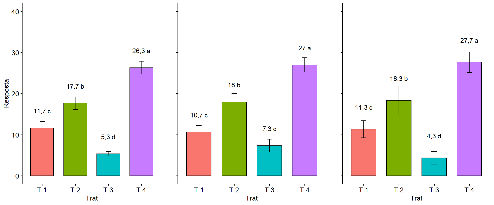

<br><br><br>

****

## Duas variáveis categóricas

****

<br>

### Conjunto de dados


```r
Fator1=factor(rep(c(paste("F",1:2)),e=20))
Fator2=factor(c(rep(c(paste("T",1:5)),e=4),rep(c(paste("T",1:5)),e=4)))
resposta=c(100,120,110,90,150,145,149,165,250,244,220,239,220,206,210,210,266,249,248,260,110,130,120,100,160,165,169,175,160,154,144,149,230,216,220,220,276,259,258,270)
dados=data.frame(Fator1,Fator2,resposta)
## Média e Desvio-padrão (Por Tratamento)
media=with(dados, tapply(dados$resposta,list(Fator1, Fator2), mean))
desvio=with(dados, tapply(resposta,list(Fator1, Fator2), sd))
```

<br>

### Gráfico simples


```r
barplot(media, beside = T)
```

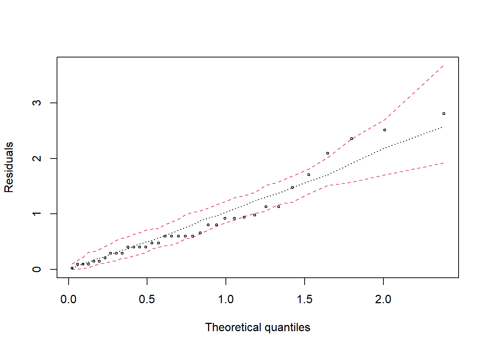

O argumento beside=T é refente a um gráfico de barras em que as barras são posicionadas lado a lado. Do contrário, as barras serão empilhadas (*stacked*). 

<br>

### Melhorias


```r
barplot(media, beside = T,
        las=1, col=c("lawngreen","gold"),
        ylab="Resposta",
        xlab="Fator2",
        ylim=c(0,300))
abline(h=0)
```

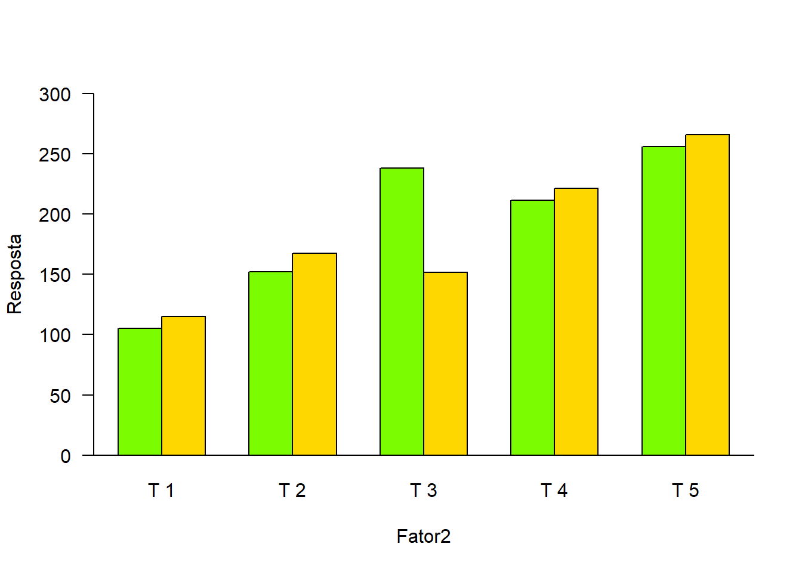

**Comandos**:

**las=1**: deixar escala do eixo Y na vertical

**col="cor"**: mudar cor das barras (Ex. "red","blue","green" ou gray.colors(quantidade de tonalidades) para escala cinza ou rainbow(quantidade de cores) para escala colorida. Também é possível específicar a cor de cada barra (col=c("red","green","yellow","gray","blue"))).

**xlab** e **ylab**: nomear eixo X e Y

**xlim** e **ylim**: escala do eixo X e Y

**abline(h=0)**: linha na horizontal em Y=0 (No caso de vertical, abline(v=0)). É possível alterar a cor pela função "col="cor"" e o tracejado pelo "lty=número" (Ver o Help do comando)

<br>

### Cores


```r
barplot(1:21, col=c("red","white","black","lightyellow","green","blue","orange",
                        "yellow","gray","pink","brown","Gainsboro", "Lavender", 
                        "DeepSkyBlue","LawnGreen", "Gold","MediumOrchid",
                        "LightSalmon", "Sienna", "Tomato", "DeepPink1"))
```


<br>

### Barras de desvio-padrão


```r
bar=barplot(media,beside=T, 
        las=1,
        ylab="Resposta",
        xlab="Tratamentos",
        ylim=c(0,300))
abline(h=0)
arrows(bar,media+desvio,bar,media-desvio,length = 0.1,angle=90,code=3)
```

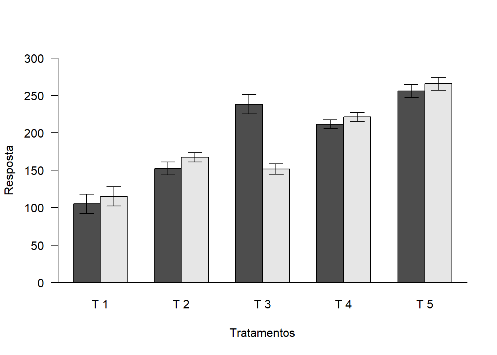

<br>

### Unidade do eixo Y 

(Ex. $Kg\ ha^{-1}$)


```r
bar=barplot(media, beside=T,
        las=1,
        ylab=expression("Resposta"*" "*(kg*" "*ha^-1)),
        xlab="Tratamentos",
        ylim=c(0,300))
abline(h=0)
arrows(bar,media+desvio,bar,media-desvio,length = 0.1,angle=90,code=3)
```


<br>

### Média acima das barras


```r
bar=barplot(media, beside=T,
        las=1,
        ylab=expression("Resposta"*" "*(kg*" "*ha^-1)),
        xlab="Tratamentos",
        ylim=c(0,300))
abline(h=0)
text(bar,media+desvio+10,media, cex=0.8)
arrows(bar,media+desvio,bar,media-desvio,length = 0.1,angle=90,code=3)
```

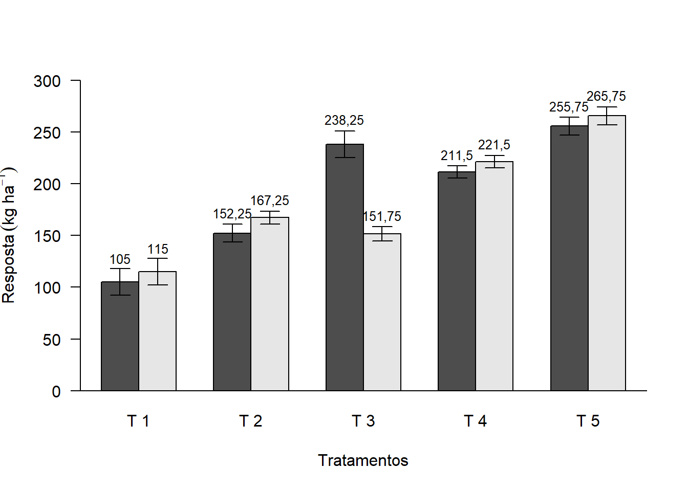

<br>

### Separação de casa decimal


```r
options(OutDec=",")
bar=barplot(media, beside=T,
        las=1,
        ylab=expression("Resposta"*" "*(kg*" "*ha^-1)),
        xlab="Tratamentos",
        ylim=c(0,300))
abline(h=0)
text(bar,media+desvio+10,media, cex=0.8)
arrows(bar,media+desvio,bar,media-desvio,length = 0.1,angle=90,code=3)
```


<br>

### Letras do teste de comparação


```r
tukey=c("dB","dA","cB","cA","cB","cA","bB","bA","aB","aA")
options(OutDec=",")
bar=barplot(media, beside=T,
        las=1,
        ylab=expression("Resposta"*" "*(kg*" "*ha^-1)),
        xlab="Tratamentos",
        ylim=c(0,300))
abline(h=0)
text(bar,media+desvio+10,paste(round(media,0),tukey), cex=0.8)
arrows(bar,media+desvio,bar,media-desvio,length = 0.1,angle=90,code=3)
```

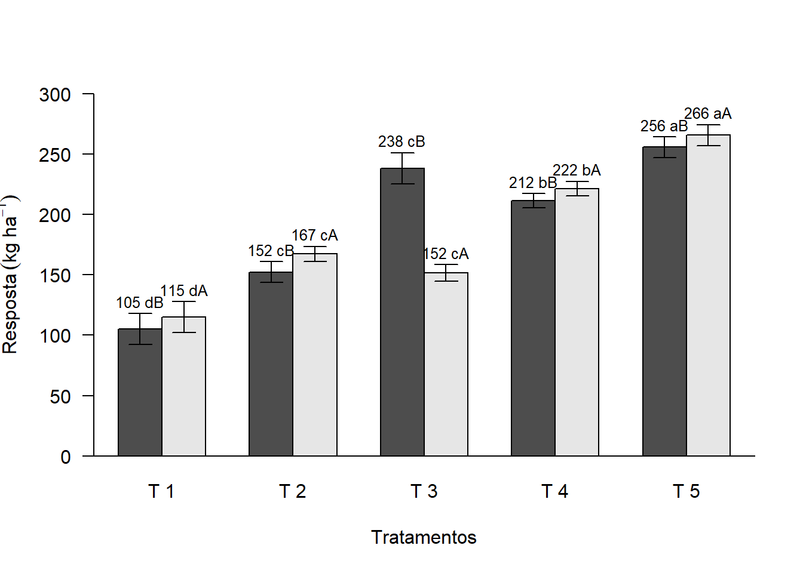

<br>

### Adicionando legenda

**legend.text=rownames(media)**: adicionar a legenda (neste caso em relação ao Fator 2)

**args.legend**: argumentos da legenda (x="topleft": legenda será adicionada no parte superior esquerda, podemos adicionar superior direito ("topright"), inferior esquerdo ("bottomleft"), inferior direito ("bottomright"), centralizado ("center"))


```r
tukey=c("dB","dA","cB","cA","cB","cA","bB","bA","aB","aA")
options(OutDec=",")
bar=barplot(media, 
            beside=T,
            legend.text = rownames(media),
            args.legend = list(x="topleft", bty="n"),
        las=1,
        ylab=expression("Resposta"*" "*(kg*" "*ha^-1)),
        xlab="Tratamentos",
        ylim=c(0,300))
abline(h=0)
text(bar,media+desvio+10,paste(round(media,0),tukey), cex=0.8)
arrows(bar,media+desvio,bar,media-desvio,length = 0.1,angle=90,code=3)
```

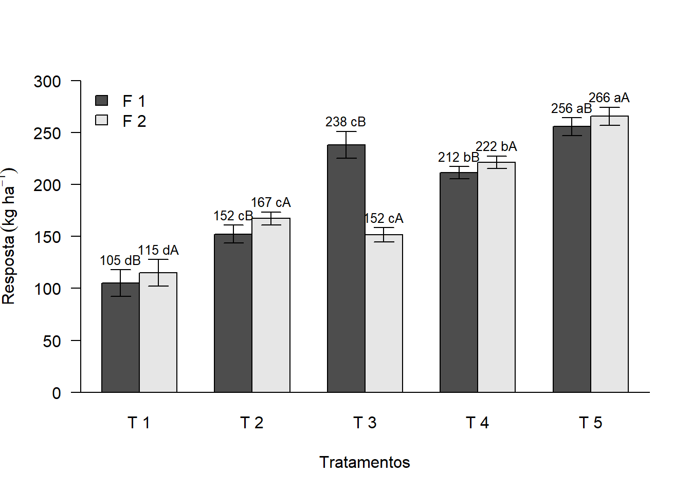

<br><br><br>

****

## Colunas empilhadas

****

<br>

### Conjunto de dados


```r
Fator1=factor(rep(c(paste("F",1:2)),e=20))
Fator2=factor(c(rep(c(paste("T",1:5)),e=4),rep(c(paste("T",1:5)),e=4)))
resposta=c(100,120,110,90,150,145,149,165,250,244,220,239,220,206,210,
           210,266,249,248,260,110,130,120,100,160,165,169,175,160,154,
           144,149,230,216,220,220,276,259,258,270)
dados=data.frame(Fator1,Fator2,resposta)
## Média e Desvio-padrão (Por Tratamento)
media=with(dados, tapply(dados$resposta,list(Fator1, Fator2), mean))
desvio=with(dados, tapply(resposta,list(Fator1, Fator2), sd))
```

<br>

### Gráfico básico


```r
barplot(media, beside=F)
```

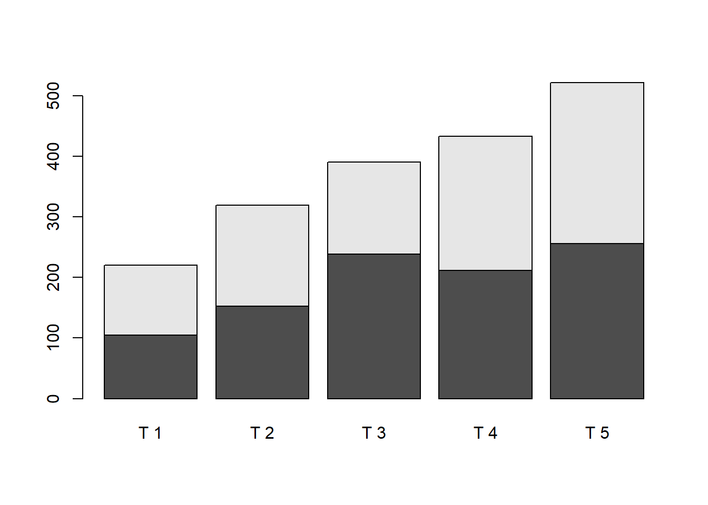

O argumento beside=F é refente a um gráfico de barras em que as barras são posicionadas lado a lado. Do contrário, as barras serão empilhadas (*stacked*). 

<br>

### Melhorias


```r
barplot(media, beside=F,
        las=1, col=c("lawngreen","gold"),
        ylab="Resposta",
        xlab="Fator2",
        ylim=c(0,600))
abline(h=0)
```


**Comandos**:

**las=1**: deixar escala do eixo Y na vertical

**col="cor"**: mudar cor das barras (Ex. "red","blue","green" ou gray.colors(quantidade de tonalidades) para escala cinza ou rainbow(quantidade de cores) para escala colorida. Também é possível específicar a cor de cada barra (col=c("red","green","yellow","gray","blue"))).

**xlab** e **ylab**: nomear eixo X e Y

**xlim** e **ylim**: escala do eixo X e Y

**abline(h=0)**: linha na horizontal em Y=0 (No caso de vertical, abline(v=0)). É possível alterar a cor pela função "col="cor"" e o tracejado pelo "lty=número" (Ver o Help do comando)

### Barras de desvio-padrão


```r
bar=barplot(media,beside=F, 
        las=1,col=c("lawngreen","gold"),
        ylab="Resposta",
        xlab="Tratamentos",
        ylim=c(0,600))
abline(h=0)
arrows(bar,media[1,]+desvio[1,],bar,media[1,]-desvio[1,],length = 0.1,angle=90,code=3)
arrows(bar,media[1,]+media[2,]+desvio[2,],bar,media[1,]+media[2,]-desvio[2,],length = 0.1,angle=90,code=3)
```


<br>

### Unidade do eixo Y 

(Ex. $Kg\ ha^{-1}$)


```r
bar=barplot(media, beside=F,
        las=1,col=c("lawngreen","gold"),
        ylab=expression(Resposta~~(kg~ha^-1)),
        xlab="Tratamentos",
        ylim=c(0,600))
abline(h=0)
arrows(bar,media[1,]+desvio[1,],bar,media[1,]-desvio[1,],length = 0.1,angle=90,code=3)
arrows(bar,media[1,]+media[2,]+desvio[2,],bar,media[1,]+media[2,]-desvio[2,],length = 0.1,angle=90,code=3)
```


### Média acima das barras


```r
bar=barplot(media, beside=F,
        las=1,col=c("lawngreen","gold"),
        ylab=expression(Resposta~~(kg~ha^-1)),
        xlab="Tratamentos",
        ylim=c(0,600))
abline(h=0)
text(bar,media[1,]+desvio[1,]+20,media[1,], cex=0.8)
text(bar,media[1,]+media[2,]+desvio[2,]+20,media[2,], cex=0.8)
arrows(bar,media[1,]+desvio[1,],bar,media[1,]-desvio[1,],length = 0.1,angle=90,code=3)
arrows(bar,media[1,]+media[2,]+desvio[2,],bar,media[1,]+media[2,]-desvio[2,],length = 0.1,angle=90,code=3)
```


<br>

### Separação de casa decimal


```r
options(OutDec=",")
bar=barplot(media, beside=F,
        las=1,col=c("lawngreen","gold"),
        ylab=expression(Resposta~~(kg~ha^-1)),
        xlab="Tratamentos",
        ylim=c(0,600))
abline(h=0)
text(bar,media[1,]+desvio[1,]+20,media[1,], cex=0.8)
text(bar,media[1,]+media[2,]+desvio[2,]+20,media[2,], cex=0.8)
arrows(bar,media[1,]+desvio[1,],bar,media[1,]-desvio[1,],length = 0.1,angle=90,code=3)
arrows(bar,media[1,]+media[2,]+desvio[2,],bar,media[1,]+media[2,]-desvio[2,],length = 0.1,angle=90,code=3)
```


<br>

### Letras do teste de comparação 


```r
tukey=c("dB","dA","cB","cA","cB","cA","bB","bA","aB","aA")
options(OutDec=",")
bar=barplot(media, beside=F,
        las=1,col=c("lawngreen","gold"),
        ylab=expression(Resposta~~(kg~ha^-1)),
        xlab="Tratamentos",
        ylim=c(0,600))
abline(h=0)
text(bar,media[1,]+desvio[1,]+20,paste(media[1,], tukey[c(1,3,6,7,9)]), cex=0.8)
text(bar,media[1,]+media[2,]+desvio[2,]+20,paste(media[2,], tukey[c(2,4,6,8,10)]), cex=0.8)
arrows(bar,media[1,]+desvio[1,],bar,media[1,]-desvio[1,],length = 0.1,angle=90,code=3)
arrows(bar,media[1,]+media[2,]+desvio[2,],bar,media[1,]+media[2,]-desvio[2,],length = 0.1,angle=90,code=3)
```


<br>

### Adicionando legenda

**legend.text=rownames(media)**: adicionar a legenda (neste caso em relação ao Fator 2)

**args.legend**: argumentos da legenda (x="topleft": legenda será adicionada no parte superior esquerda, podemos adicionar superior direito ("topright"), inferior esquerdo ("bottomleft"), inferior direito ("bottomright"), centralizado ("center"))


```r
tukey=c("dB","dA","cB","cA","cB","cA","bB","bA","aB","aA")
options(OutDec=",")
bar=barplot(media, 
            beside=F,
            legend.text = rownames(media),
            args.legend = list(x="topleft", bty="n"),
        las=1,col=c("lawngreen","gold"),
        ylab=expression(Resposta~(kg~ha^-1)),
        xlab="Tratamentos",
        ylim=c(0,600))
abline(h=0)
text(bar,media[1,]+desvio[1,]+20,paste(media[1,], tukey[c(1,3,6,7,9)]), cex=0.8)
text(bar,media[1,]+media[2,]+desvio[2,]+20,paste(media[2,], tukey[c(2,4,6,8,10)]), cex=0.8)
arrows(bar,media[1,]+desvio[1,],bar,media[1,]-desvio[1,],length = 0.1,angle=90,code=3)
arrows(bar,media[1,]+media[2,]+desvio[2,],bar,media[1,]+media[2,]-desvio[2,],length = 0.1,angle=90,code=3)
```


<br><br><br>

****

## Dois lados com escala positiva

****

<br>

### Conjunto de dados


```r
trat=rep(c("T1","T2","T3","T4","T5"),e=3)
mspa=c(8,10,12,18,20,22,28,30,32,38,40,42,48,50,52)
msr=c(14,15,16,19,20,21,24,25,26,29,30,31,34,35,36)
```

<br>

### Média e desvio-padrão


```r
m1=tapply(mspa, trat, mean)
m2=tapply(msr, trat, mean)
sd1=tapply(mspa, trat, sd)
sd2=tapply(msr, trat, sd)
```


```r
# alterando margem e configurando para dois plots um abaixo do outro
op <- list(mfrow = c(2,1),
          oma = c(5,4,0,0) + 0.1,
          mar = c(0,0,0,1))
```

<br>

### Somente colunas

**Obs.** Nesse caso em específico, estamos querendo que ambas as variáveis assumem respostas positivas. Todavia, queremo a coluna da variável MSPA acima e MSR abaixo. 


```r
par(op)
b1=barplot(m1, 
           axes=F, 
           col="blue",
           ylim=c(0,60),
           axisnames = F,
           las=1)
b2=barplot(m2, 
           axes=F,
           col="red",
           ylim=c(60,0),
           las=1)
```

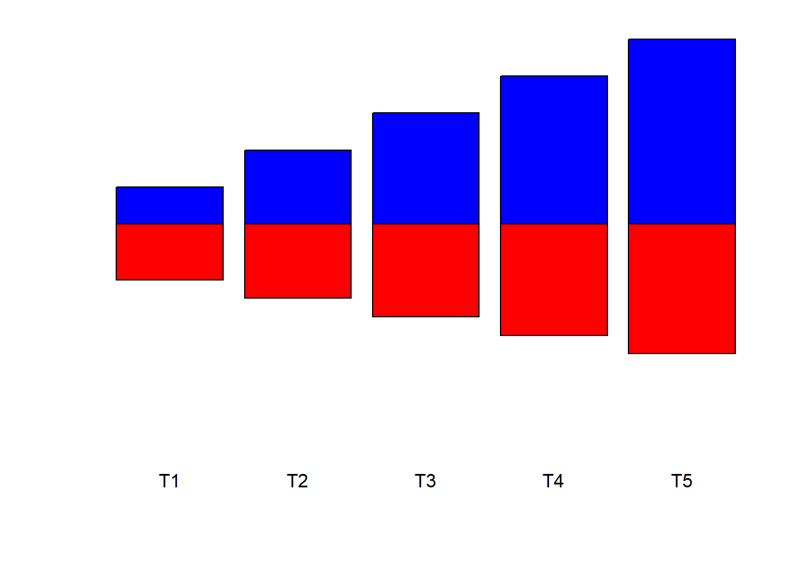

<br>

### Escala do eixo Y


```r
par(op)
b1=barplot(m1, 
           axes=F, 
           col="blue",
           ylim=c(0,60),
           axisnames = F,
           las=1)
axis(2,seq(0,50,10),las=1)
b1=barplot(m2, 
           axes=F,
           col="red",
           ylim=c(60,0),
           axisnames = F,
           las=1)
axis(2,seq(0,50,10),las=1)
```


<br>

### Barras de desvio-padrão


```r
par(op)
b1=barplot(m1, 
           axes=F, 
           col="blue",
           ylim=c(0,60),
           axisnames = F,
           las=1)
axis(2,seq(0,50,10),las=1)
arrows(b1,m1+sd1,b1,m1-sd1,angle = 90,code=3, length = 0.05)
b2=barplot(m2, 
           axes=F,
           col="red",
           ylim=c(60,0),
           axisnames = F,
           las=1)
axis(2,seq(0,50,10),las=1)
arrows(b2,m2+sd2,b2,m2-sd2,angle = 90,code=3, length = 0.05)
```


<br>

### Linha em 0 e título de Y


```r
par(op)
b1=barplot(m1, 
           axes=F, 
           col="blue",
           ylim=c(0,60),
           axisnames = F,
           las=1)
axis(2,seq(0,50,10),las=1)
arrows(b1,m1+sd1,b1,m1-sd1,angle = 90,code=3, length = 0.05)
b2=barplot(m2, 
           axes=F,
           col="red",
           ylim=c(60,0),
           axisnames = F,
           las=1)
axis(2,seq(0,50,10),las=1)
title(ylab = "Resposta",outer=T, line = 3)
arrows(b2,m2+sd2,b2,m2-sd2,angle = 90,code=3, length = 0.05)
abline(h=0)
```

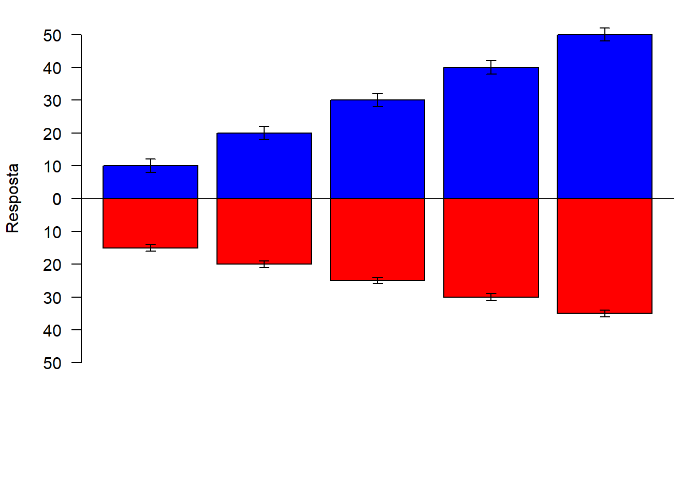

<br>

### Título para MS (g)


```r
par(op)
b1=barplot(m1, 
           axes=F, 
           col="blue",
           ylim=c(0,60),
           axisnames = F,
           las=1)
axis(2,seq(0,50,10),las=1)
arrows(b1,m1+sd1,b1,m1-sd1,angle = 90,code=3, length = 0.05)
b2=barplot(m2, 
           axes=F,
           col="red",
           ylim=c(60,0),
#           axisnames = F,
           las=1)
axis(2,seq(0,50,10),las=1)
title(ylab = expression(MS~(g)),outer=T, line = 3)
arrows(b2,m2+sd2,b2,m2-sd2,angle = 90,code=3, length = 0.05)
abline(h=0)
```


<br>

### Coluna hachurada


```r
par(op)
b1=barplot(m1, 
           axes=F, 
           col="blue",
           density = 40,
           ylim=c(0,60),
           axisnames = F,
           las=1)
axis(2,seq(0,50,10),las=1)
arrows(b1,m1+sd1,b1,m1-sd1,angle = 90,code=3, length = 0.05)
b2=barplot(m2, 
           axes=F,
           col="red",
           ylim=c(60,0),
           density = 20,
#           axisnames = F,
           las=1)
axis(2,seq(0,50,10),las=1)
title(ylab = expression(MS~(g)),outer=T, line = 3)
arrows(b2,m2+sd2,b2,m2-sd2,angle = 90,code=3, length = 0.05)
abline(h=0)
```


<br>

### Adicionando legenda


```r
par(op)
b1=barplot(m1, 
           axes=F, 
           col="blue",
           density = 40,
           ylim=c(0,60),
           axisnames = F,
           las=1)
axis(2,seq(0,50,10),las=1)
arrows(b1,m1+sd1,b1,m1-sd1,angle = 90,code=3, length = 0.05)
legend("topleft",
       fill=c("blue","red"),
       legend=c("MSPA","MSR"),
       density = c(40,20),
       bty="n")
b2=barplot(m2, 
           axes=F,
           col="red",
           ylim=c(60,0),
           density = 20,
#           axisnames = F,
           las=1)
axis(2,seq(0,50,10),las=1)
title(ylab = expression(MS~(g)),outer=T, line = 3)
arrows(b2,m2+sd2,b2,m2-sd2,angle = 90,code=3, length = 0.05)
abline(h=0)
```

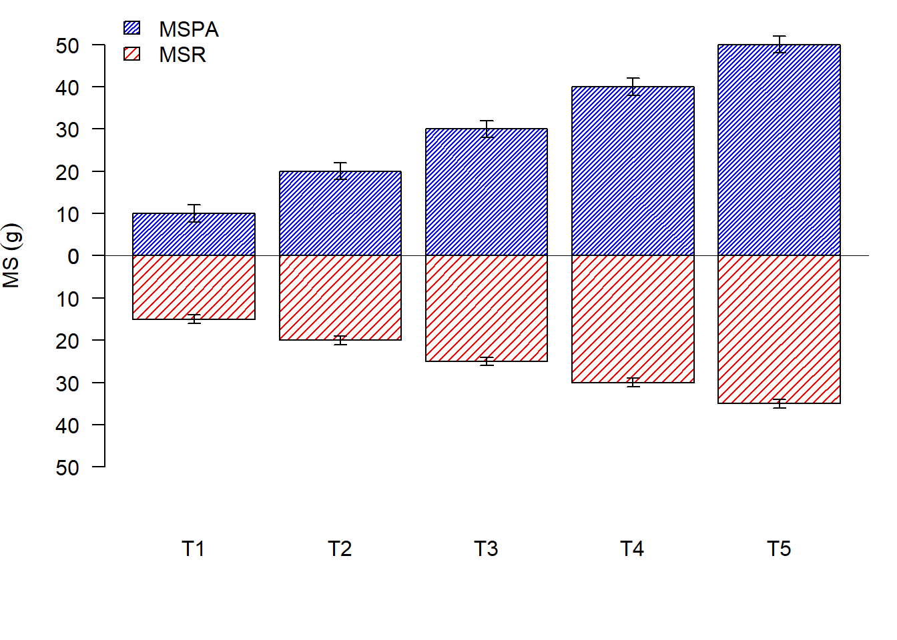

<br>

### Teste de comparação


```r
par(op)
b1=barplot(m1, 
           axes=F, 
           col="blue",
           density = 40,
           ylim=c(0,60),
           axisnames = F,
           las=1)
axis(2,seq(0,50,10),las=1)
arrows(b1,m1+sd1,b1,m1-sd1,angle = 90,code=3, length = 0.05)
legend("topleft",
       fill=c("blue","red"),
       legend=c("MSPA","MSR"),
       density = c(40,20),
       bty="n")
text(b1,m1+sd1+5,c("e","d","c","b","a"))
b2=barplot(m2, 
           axes=F,
           col="red",
           ylim=c(60,0),
           density = 20,
#           axisnames = F,
           las=1)
axis(2,seq(0,50,10),las=1)
text(b2,m2+sd2+5,c("e","d","c","b","a"))
title(ylab = expression(MS~(g)),outer=T, line = 3)
arrows(b2,m2+sd2,b2,m2-sd2,angle = 90,code=3, length = 0.05)
abline(h=0)
```

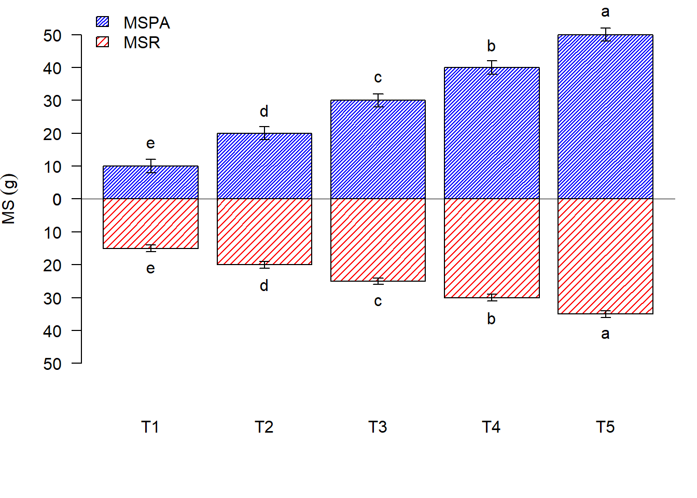

<br>

### Mudando fonte 


```r
par(family="serif")
par(op)
b1=barplot(m1, 
           axes=F, 
           col="blue",
           density = 40,
           ylim=c(0,60),
           axisnames = F,
           las=1)
axis(2,seq(0,50,10),las=1)
arrows(b1,m1+sd1,b1,m1-sd1,angle = 90,code=3, length = 0.05)
legend("topleft",
       fill=c("blue","red"),
       legend=c("MSPA","MSR"),
       density = c(40,20),
       bty="n")
text(b1,m1+sd1+5,c("e","d","c","b","a"))
b2=barplot(m2, 
           axes=F,
           col="red",
           ylim=c(60,0),
           density = 20,
#           axisnames = F,
           las=1)
axis(2,seq(0,50,10),las=1)
text(b2,m2+sd2+5,c("e","d","c","b","a"))
title(ylab = expression(MS~(g)),outer=T, line = 3)
arrows(b2,m2+sd2,b2,m2-sd2,angle = 90,code=3, length = 0.05)
abline(h=0)
```

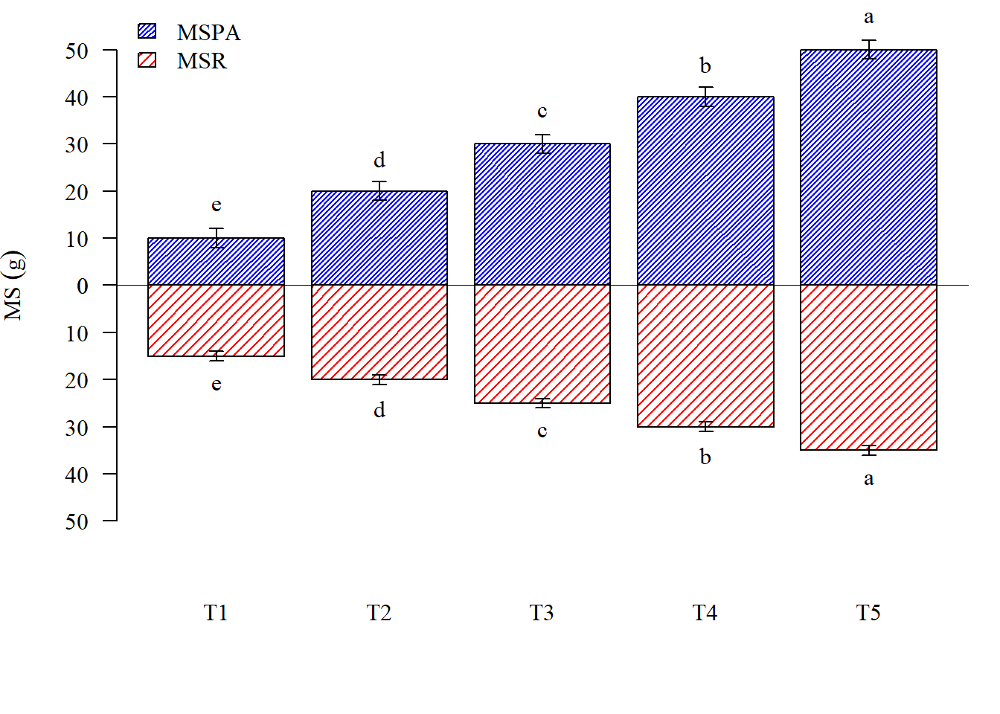

<br><br><br>

****

# Gráfico de Barras

****

<br>

O gráfico em barras consiste em construir retângulos, em que uma das dimensões é proporcional à magnitude a ser representada ($n_i$ ou $f_i$), sendo a outra arbitrária, porém igual para todas as barras. Essas colunas são dispostas paralelamente umas às outras de forma horizontal.

Além do título e fonte de referências deve-se observar o seguinte:

- as barras devem ter todas a mesma largura;
- a distância entre as barras deve ser constante e de preferência menor que a largura das barras.

<br>

### Conjunto de dados


```r
tratamentos=rep(c(paste("T",1:5)),e=4)
resposta=c(100,120,110,90,150,145,149,165,150,144,134,139,220,206,210,210,266,249,248,260)
## Média e Desvio-padrão (Por Tratamento)
media=tapply(resposta,tratamentos, mean)
desvio=tapply(resposta,tratamentos,sd)
```

<br>

### Gráfico básico


```r
barplot(media, horiz = T)
```

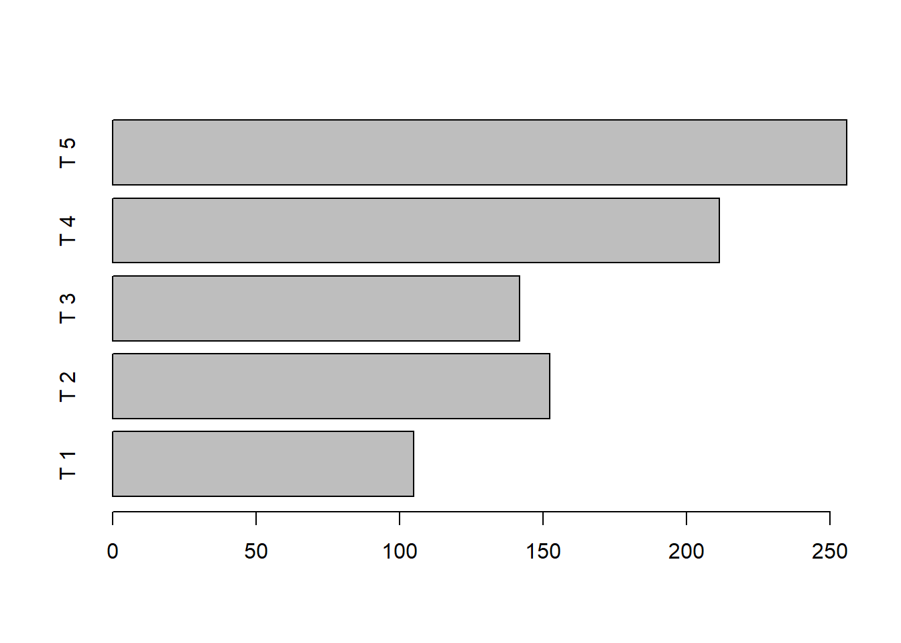

<br>

### Melhorias


```r
barplot(media, horiz = T, 
        las=1,
        col="lightyellow",
        ylab="Resposta",
        xlab="Tratamentos",
        xlim=c(0,300))
abline(v=0)
```


<br>

### Barras de desvio-padrão


```r
bar=barplot(media, 
        las=1,horiz = T,
        col="lightyellow",
        ylab="Resposta",
        xlab="Tratamentos",
        xlim=c(0,300))
abline(v=0)
arrows(media+desvio,bar,media-desvio,bar,length = 0.1,angle=90,code=3)
```

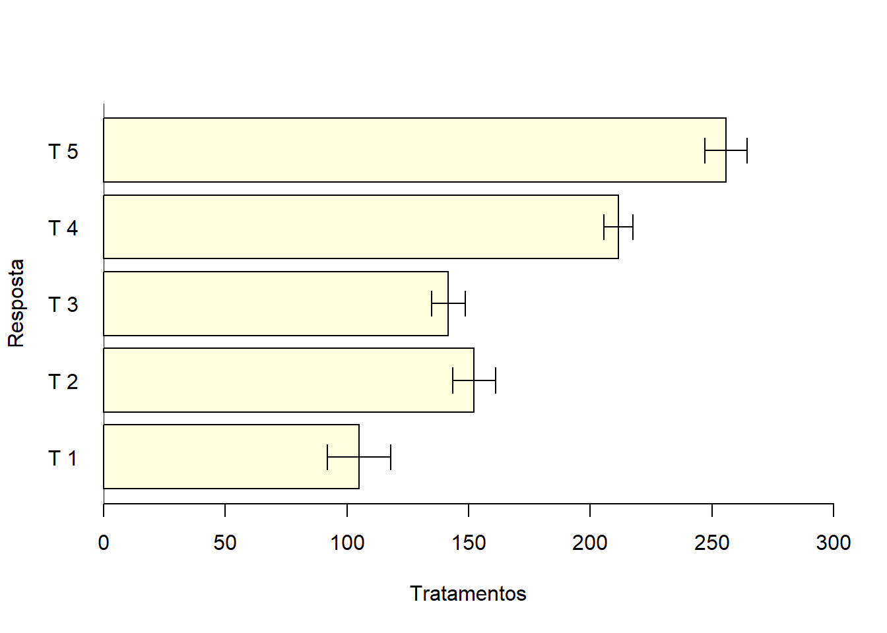

<br>

### Unidade do eixo Y 

(Ex. $Kg\ ha^{-1}$)


```r
bar=barplot(media, 
        las=1,horiz = T,
        col="lightyellow",
        ylab=expression("Resposta"*" "*(kg*" "*ha^-1)),
        xlab="Tratamentos",
        xlim=c(0,300))
abline(v=0)
arrows(media+desvio,bar,media-desvio,bar,length = 0.1,angle=90,code=3)
```


<br>

### Média acima das barras


```r
bar=barplot(media, 
        las=1,horiz = T,
        col="lightyellow",
        ylab=expression("Resposta"*" "*(kg*" "*ha^-1)),
        xlab="Tratamentos",
        xlim=c(0,300))
abline(v=0)
text(media+desvio+20,bar,media)
arrows(media+desvio,bar,media-desvio,bar,length = 0.1,angle=90,code=3)
```


<br>

### Separação de casa decimal


```r
options(OutDec=",")
bar=barplot(media, 
        las=1,horiz = T,
        col="lightyellow",
        ylab=expression("Resposta"*" "*(kg*" "*ha^-1)),
        xlab="Tratamentos",
        xlim=c(0,300))
abline(v=0)
text(media+desvio+20,bar,media)
arrows(media+desvio,bar,media-desvio,bar,length = 0.1,angle=90,code=3)
```


<br>

### Letras do teste de comparação 


```r
tukey=c("d","c","c","b","a")
options(OutDec=",")
bar=barplot(media, 
        las=1,horiz = T,
        col="lightyellow",
        ylab=expression("Resposta"*" "*(kg*" "*ha^-1)),
        xlab="Tratamentos",
        xlim=c(0,300))
abline(v=0)
text(media+desvio+20,bar,paste(round(media,0),tukey))
arrows(media+desvio,bar,media-desvio,bar,length = 0.1,angle=90,code=3)
```

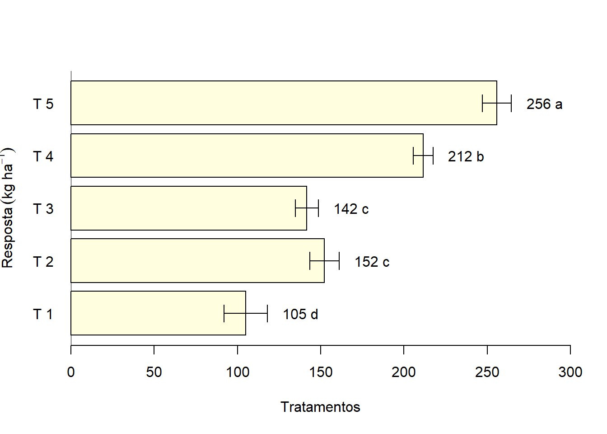

<br><br><br>

****

# Caixas (Boxplot)

****

<br>

O *boxplot* (gráfico de caixa) é um gráfico utilizado para avaliar a distribuição empírica do dados. O *boxplot* é formado pelo primeiro e terceiro quartil e pela mediana. As hastes inferiores e superiores se estendem, respectivamente, do quartil inferior até o menor valor não inferior ao limite inferior e do quartil superior até o maior valor não superior ao limite superior. Os limites são calculados da forma abaixo

**Limite inferior**: $\max\{\min(\text{dados});Q_1-1,5(Q_3-Q_1)\}$.

**Limite superior**: $\min\{\max(\text{dados});Q_3+1,5(Q_3-Q_1)\}$.

Para este caso, os pontos fora destes limites são considerados valores discrepantes (*outliers*). A Figura  a seguir apresenta um exemplo do formato de um *boxplot*.

<center>


</center>


Existem várias formas de entrada ou leitura de dados no R. Para um conjunto de dados pequeno, pode-se entrar com as informações diretamente no console do programa. Considere um delineamento inteiramente ao acaso com 5 tratamentos e 4 repetições. A entrada dos dados, entre outras, poderia ser da forma:

<br>


```r
tratamentos=rep(c(paste("T", sep='', 1:5)), each=4)
resposta = c(100, 120, 110,  90, 150, 145, 149, 165, 150, 144, 134, 139, 220, 206, 210, 210, 266, 249, 248, 260)
## Médias e Desvioss-padrão (por Tratamento)
(Médias = tapply(resposta, tratamentos, mean))
```

```
##     T1     T2     T3     T4     T5 
## 105,00 152,25 141,75 211,50 255,75
```

```r
(Desvios = tapply(resposta, tratamentos, sd))
```

```
##        T1        T2        T3        T4        T5 
## 12,909944  8,770215  6,849574  5,972158  8,732125
```

<br>


```r
boxplot(resposta ~ tratamentos)
# Ou, pode-se usar o comando ``Boxplot`` do pacote ``car``
require(car)
Boxplot(resposta ~ tratamentos)
```

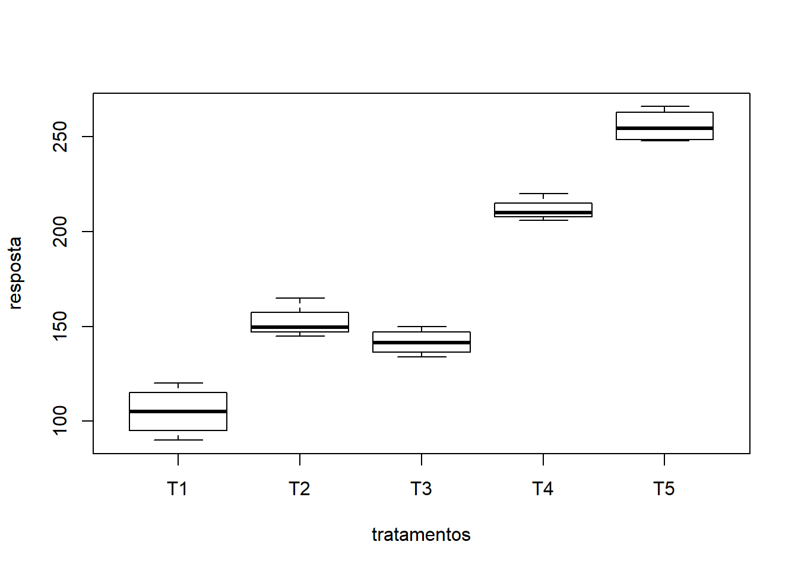

<br>

Uma vantagem do comando ``Boxplot`` é que se houver *outlier*, ele já identifica a pposição do elemento discrepante.

<br>

### Melhorias


```r
boxplot(resposta ~ tratamentos, 
        las=1,
        col="lightyellow",
        xlab="Tratamentos",
        ylab="Resposta",
        ylim=c(0,300))
```


<br>

**Comandos usados**:

* ``las=1``: mostrar a escala do eixo no sentido horizontal;

* ``col="cor"``: mudar a cor das colunas (Ex. "red", "blue", "green" ou ``gray.colors``(quantidade de tonalidades) para escala cinza ou ``rainbow``(quantidade de cores) para escala colorida. Também é possível especificar a cor de cada coluna (``col``=c("red", "green", "yellow", "gray", "blue")));

* ``xlab`` e ``ylab``: nomear os eixos $X$ e $Y$;

* ``xlim`` e ``xlim``: mudar as escalas dos eixox $X$ e $Y$;

<br>

### Plotando médias


```r
boxplot(resposta ~ tratamentos, 
        las=1,
        col="lightyellow",
        xlab="Tratamentos",
        ylab="Resposta",
        ylim=c(50,300))

points(Médias, pch='+', col="red")
```

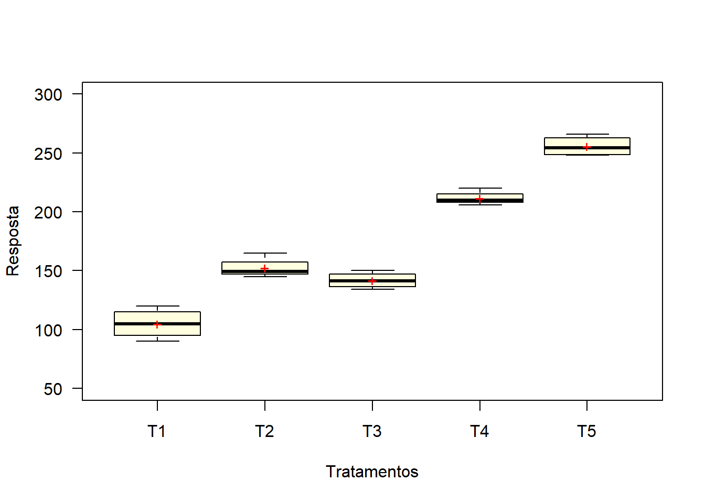

<br>

### Unidade do eixo Y 

Caso a variável resposta seja Produção ($kg/ha$), inclui-se tal informação usando-se o comando ``expression``.


```r
boxplot(resposta ~ tratamentos,
        las=1,
        col="lightyellow",
        xlab="Tratamentos",
        ylab=expression(Produção~~(kg~ha^-1)),
        ylim=c(50,300))
points(Médias, pch='+', col="red")
```


<br>

### Limites superior e inferior


```r
limites = tapply(resposta, tratamentos, boxplot.stats)
superior=c(limites$`T1`$stats[5],
           limites$`T2`$stats[5],
           limites$`T3`$stats[5],
           limites$`T4`$stats[5],
           limites$`T5`$stats[5])
```

<br>

### Média acima das barras


```r
boxplot(resposta ~ tratamentos,
        las=1,
        col="lightyellow",
        xlab="Tratamentos",
        ylab=expression("Produção"~~(kg~ha^-1)),
        ylim=c(50,300))
points(Médias, pch='+', col="red")
text(c(1:5), superior + 10, Médias)
```

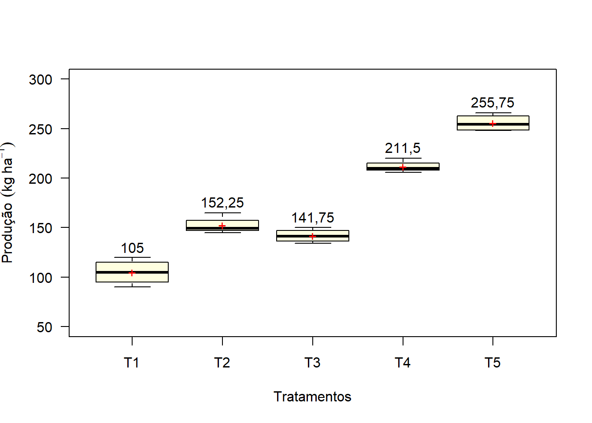

<br>

### Separação de casa decimal


```r
options(OutDec=",")
boxplot(resposta ~ tratamentos,
        las=1,
        col="lightyellow",
        xlab="Tratamentos",
        ylab=expression("Produção"~~(kg~ha^-1)),
        ylim=c(50,300))
points(Médias, pch='+', col="red")
text(c(1:5), superior + 20, Médias)
```


<br>

### Letras do teste de comparação


```r
tukey=c("d","c","c","b","a")
options(OutDec=",")
boxplot(resposta ~ tratamentos,
        las=1,
        col="lightyellow",
        xlab="Tratamentos",
        ylab=expression("Produção"~(kg~ha^-1)),
        ylim=c(50,300))
points(Médias, pch='+', col="red")
text(c(1:5), superior + 20, paste(round(Médias, 0), tukey))
```

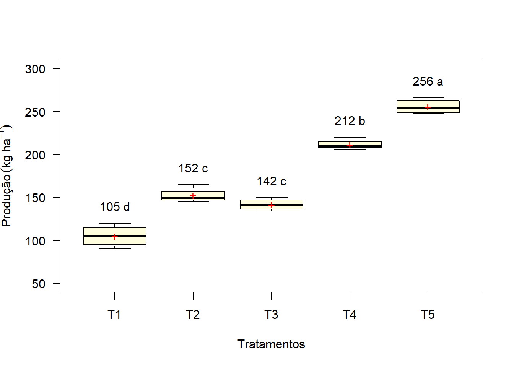

<br><br>

## Pacote ggplot2

Vamos trabalhar com um experimento em DIC com quatro tratamentos e quatro repetições cada.


```r
exp1=c(17,22,13,14,18,19,16,21,9,16,15,8,25,26,23,40)
Trat=rep(c(paste("T",1:4)),e=4)
dados=data.frame(Trat,exp1)
dados$Trat=as.factor(Trat)
```

**Obs.** Para facilitar, vamos realizar a análise direto pelo pacote ExpDes.pt (é necessário instalar o pacote)

<br>

### Análise de variância


```r
ExpDes.pt::dic(Trat,exp1)
```

```
## ------------------------------------------------------------------------
## Quadro da analise de variancia
## ------------------------------------------------------------------------
##            GL     SQ QM     Fc     Pr>Fc
## Tratamento  3 582,75    7,9556 0,0034723
## Residuo    12 293,00                    
## Total      15 875,75                    
## ------------------------------------------------------------------------
## CV = 26,18 %
## 
## ------------------------------------------------------------------------
## Teste de normalidade dos residuos 
## Valor-p:  0,06507919 
## De acordo com o teste de Shapiro-Wilk a 5% de significancia, os residuos podem ser considerados normais.
## ------------------------------------------------------------------------
## 
## ------------------------------------------------------------------------
## Teste de homogeneidade de variancia 
## valor-p:  0,237053 
## De acordo com o teste de bartlett a 5% de significancia, as variancias podem ser consideradas homogeneas.
## ------------------------------------------------------------------------
## 
## Teste de Tukey
## ------------------------------------------------------------------------
## Grupos Tratamentos Medias
## a 	 T 4 	 28,5 
## ab 	 T 2 	 18,5 
##  b 	 T 1 	 16,5 
##  b 	 T 3 	 12 
## ------------------------------------------------------------------------
```

<br>

## Utilizando o *ggplot2*


```r
library(ggplot2)
```

<br>

### Gráfico básico


```r
ggplot(dados, 
       aes(x=Trat,y=exp1))+
  geom_boxplot()
```


<br>

### Modificando cores


```r
ggplot(dados, 
       aes(x=Trat,y=exp1))+
  geom_boxplot(fill="lightgreen",          # Cor da caixa
               colour="red",               # cor do contorno
               outlier.colour = "blue",    # Cor do contorno do outlier
               outlier.shape = 10,          # Formato do ponto do outlier
               outlier.size = 2)           # Tamanho do outlier
```

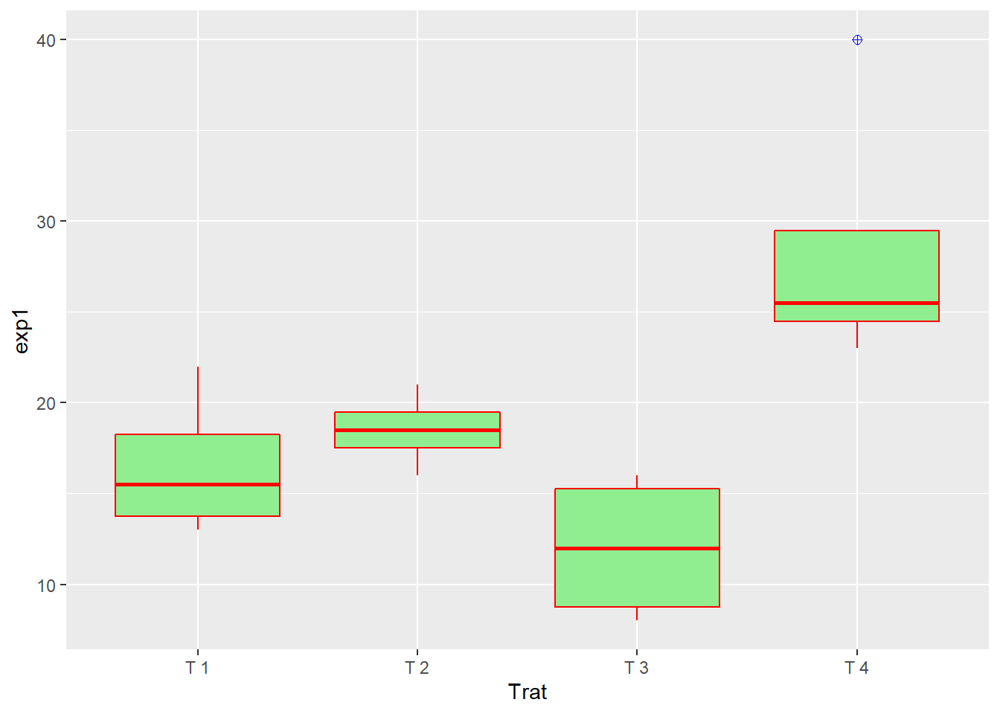

<br>

### Cor por tratamento


```r
ggplot(dados, 
       aes(x=Trat,y=exp1))+
  geom_boxplot(aes(fill=dados$Trat))
```

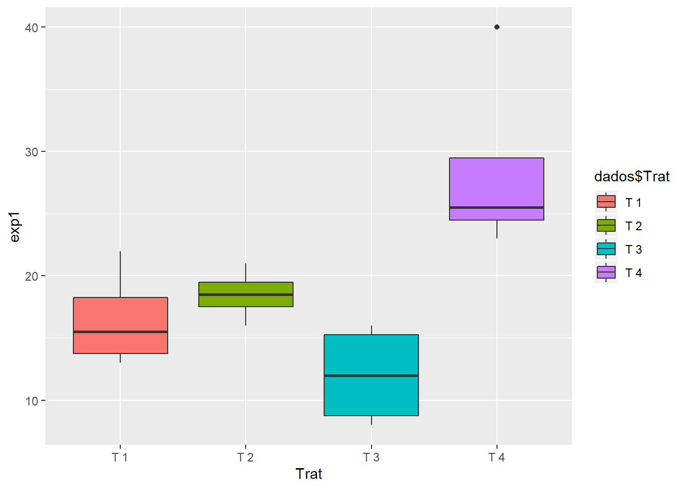

<br>

### Nome dos eixos


```r
ggplot(dados, 
       aes(x=Trat,y=exp1))+
  geom_boxplot(fill="lightgreen",          
               colour="red",               
               outlier.colour = "blue",    
               outlier.shape = 10,          
               outlier.size = 2)+      
  ylab("Resposta")+
  xlab("Tratamentos")
```


<br>

### linha de grade e cor de fundo


```r
ggplot(dados, 
       aes(x=Trat,y=exp1))+
  geom_boxplot(fill="lightgreen", 
               colour="black",    
               outlier.colour = "blue",
               outlier.shape = 10,     
               outlier.size = 2)+      
  ylab("Resposta")+
  xlab("Tratamentos")+
  theme_bw()+
  theme_classic()
```


<br>

### Letras do teste de Tukey

**Obs.** Neste exemplo vamos adicionar as letras abaixo das caixas e alinhado em y=1


```r
a=data.frame(Trat=levels(as.factor(Trat)),
             exp1=c(1,1,1,1),                # Deve ter o mesmo da variável
                                             # esse 1 é para Y=1
             letra=c("b","ab","b","a"))
ggplot(dados, 
       aes(x=Trat,y=exp1))+
  geom_boxplot(fill="lightgreen", 
               colour="black",    
               outlier.colour = "blue",
               outlier.shape = 10,     
               outlier.size = 2)+      
  ylab("Resposta")+
  xlab("Tratamentos")+
  theme_bw()+
  theme_classic()+
  geom_text(data = a, aes(label = letra))
```

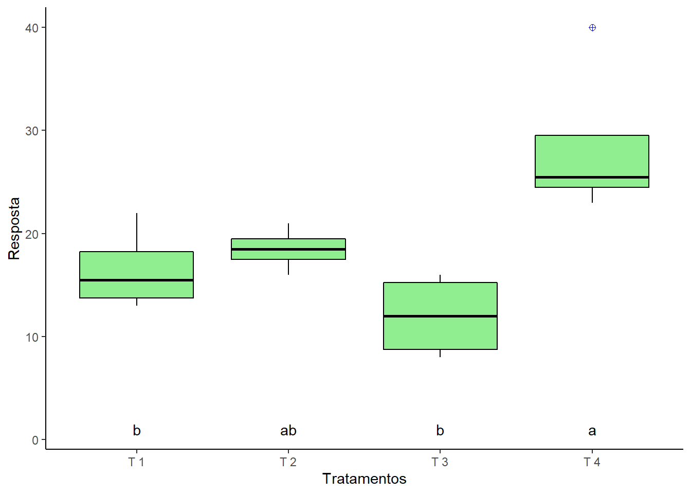

<br>

## *Package* ggpubr


```r
library(ggpubr)
ggboxplot(dados,            # data.frame com os dados e tratamentos
          'Trat',           # Nome do tratamento entre aspas
          'exp1')           # Nome da resposta
```

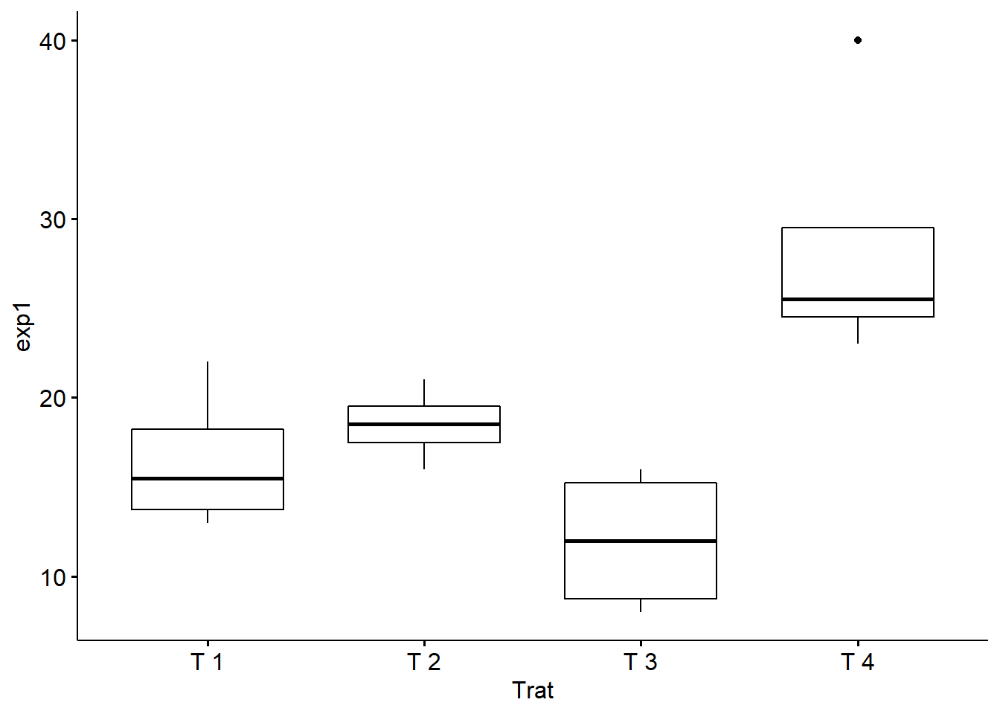

<br>

### Cor da caixa


```r
ggboxplot(dados,
          'Trat',
          'exp1', 
          fill="red")
```

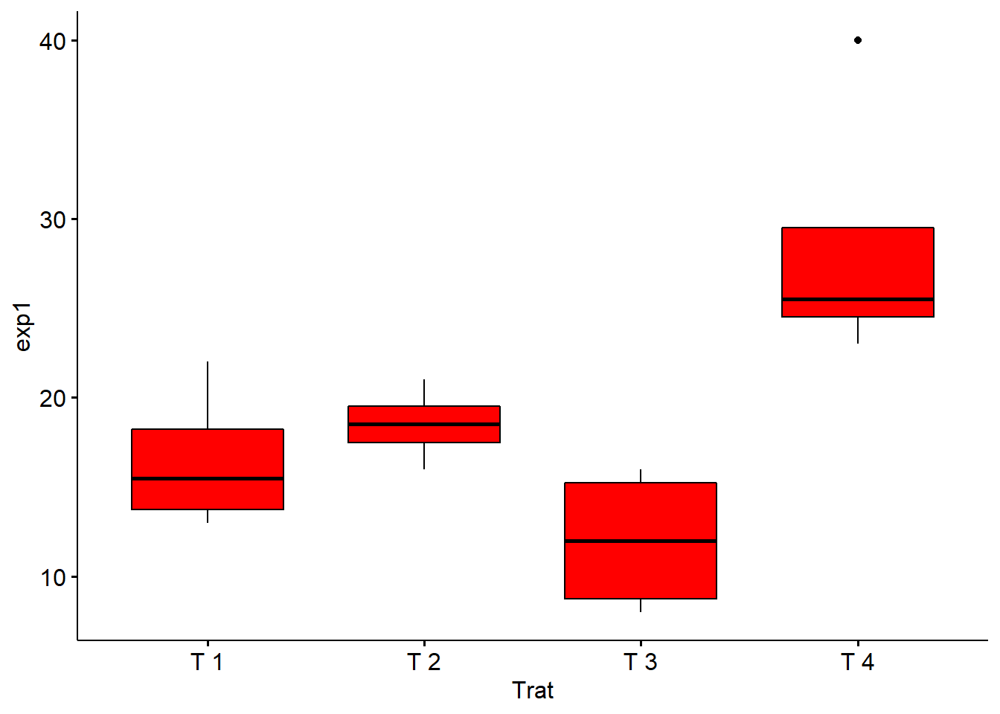

<br>

### Cor de contorno


```r
ggboxplot(dados,
          'Trat',
          'exp1', 
          fill="red",
          color = "blue")
```


<br>

### Inserindo título


```r
ggboxplot(dados,
          'Trat',
          'exp1', 
          fill="red",
          color = "blue",
          title="(A)")
```


<br>

### Nome dos eixos X e Y


```r
ggboxplot(dados,
          'Trat',
          'exp1', 
          fill="red",
          color = "black",
          title="(A)",
          xlab="Tratamentos",
          ylab="Resposta")
```


<br>

### Ponto da média


```r
ggboxplot(dados,
          'Trat',
          'exp1', 
          fill="red",
          color = "black",
          title="(A)",
          xlab="Tratamentos",
          ylab="Resposta",
          add="mean")
```

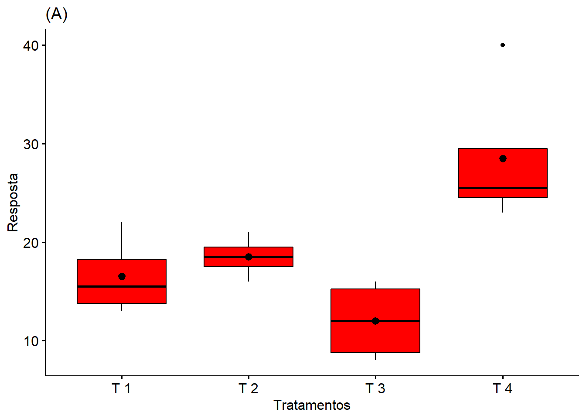

<br>

**Obs.** Podemos usar ao invés de `"mean"`, os seguintes argumentos:

- `mean_se`: Média e erro padrão
- `mean_sd`: Média e desvio-padrão
- `mean_ci`: Média e intervalo de confiança
- `median`: Mediana
- `point`: pontos referente às observações

Para mais informações consultar atráves de: `desc_stat`

<br>

### Letras do teste de Tukey


```r
a=data.frame(Trat=levels(as.factor(Trat)),
             exp1=c(1,1,1,1),                # Deve ter o mesmo da variável
                                             # esse 1 é para Y=1
             letra=c("b","ab","b","a"))
ggboxplot(dados,
          'Trat',
          'exp1', 
          fill="red",
          color = "black",
          title="(A)",
          xlab="Tratamentos",
          ylab="Resposta",
          add="mean",
          ylim=c(0,40))+
  geom_text(data = a, aes(label = letra))
```


<br><br><br>

****

# Regressão

****

O gráfico de regressão pode ser construído utilizando um gráfico de dispersão. Assim, uma análise gráfica preliminar é realizada construindo-se o gráfico de dispersão entre as variáveis em questão. Este gráfico é importante em qualquer análise de regressão já que por meio dele é possível ter uma noção do tipo de relação existente entre as variáveis (relação linear, quadrática). Esta relação na maioria das vezes não é perfeita, ou seja, os pontos não estão dispostos perfeitamente sobre a função que relaciona as duas variáveis mas deseja-se que estes pontos estejam próximos. A curva da regressão é construída sobre o gráfico de dispersão mediante às respectivas análises a serem consideradas para definir o melhor modelo.

<br>

### Conjunto de dados


```r
tratamentos=rep(c(0,2,4,8,16,32,64,128,256),e=4)
resposta=c(0,1,2,4,8,7,9,10,15,17,18,20,25,26,24,28,36,39,38,40,60,68,65,70,100,110,104,107,150,155,156,159,120,130,126,124)
## Média e Desvio-padrão (Por Tratamento)
Dose=c(0,2,4,8,16,32,64,128,256)
media=tapply(resposta,tratamentos, mean)
desvio=tapply(resposta,tratamentos,sd)
```

<br>

### Gráfico básico


```r
plot(media~Dose)
```


### Melhorias


```r
plot(media~Dose, 
        las=1,
        ylab="Resposta",
        xlab="Dose")
```


<br>

### Barras de desvio-padrão


```r
reg=plot(media~Dose, 
        las=1,
        ylab="Resposta",
        xlab="Dose")
arrows(Dose,media+desvio,Dose,media-desvio,length = 0.05,angle=90,code=3)
```


Adicionando barras de desvio-padrão de largura 0.05 (length=0.05), com angulo de 90 graus e tipo de flecha 3 (T ou T invertido)

<br>

### Unidade do eixo 

Y (Ex. $Kg\ ha^{-1}$) e X(Ex.$Kg\ ha^{-1}\ ano^{-1}$)


```r
reg=plot(media~Dose, 
        las=1,
        ylab=expression("Resposta"~~(kg~ha^-1)),
        xlab=expression("Dose"~(kg~ha^-1~ano^-1)))
arrows(Dose,media+desvio,Dose,media-desvio,length = 0.02,angle=90,code=3)
```


A função expression também pode ser usada para textos em gráficos (Função "text()" - veremos posteriormente).

<br>

### Separação de casa decimal


```r
options(OutDec=",")
reg=plot(media~Dose, 
        las=1,
        ylab=expression("Resposta"~~(kg~ha^-1)),
        xlab=expression("Dose"~~(kg~ha^-1~ano^-1)))
arrows(Dose,media+desvio,Dose,media-desvio,length = 0.02,angle=90,code=3)
```


A função "options(OutDec=",")" converte a casa decimal de todas as saídas posteriores ao comando para vírgula, entretanto a função não altera para gráficos do pacote ggplot2.

<br>

### Curva de Tendência


```r
modelo=lm(media~Dose+I(Dose^2))
summary(modelo)
```

```
## 
## Call:
## lm(formula = media ~ Dose + I(Dose^2))
## 
## Residuals:
##     Min      1Q  Median      3Q     Max 
## -6,0101 -2,3298  0,5233  2,3045  3,4953 
## 
## Coefficients:
##               Estimate Std. Error t value Pr(>|t|)    
## (Intercept)  7,7601301  1,7653406   4,396  0,00459 ** 
## Dose         1,8811023  0,0566083  33,230 4,94e-08 ***
## I(Dose^2)   -0,0055671  0,0002241 -24,847 2,80e-07 ***
## ---
## Signif. codes:  0 '***' 0,001 '**' 0,01 '*' 0,05 '.' 0,1 ' ' 1
## 
## Residual standard error: 3,709 on 6 degrees of freedom
## Multiple R-squared:  0,9967,	Adjusted R-squared:  0,9956 
## F-statistic: 899,4 on 2 and 6 DF,  p-value: 3,674e-08
```

```r
plot(media~Dose, 
     las=1,
     ylim=c(0,200),
     col="red",
     pch=16,
     ylab=expression("Resposta"~~(kg~ha^-1)),
     xlab=expression("Dose"~~(kg~ha^-1~ano^-1)))
arrows(Dose,media+desvio,Dose,media-desvio,length = 0.02,angle=90,code=3)
curve(modelo$coefficients[1]+modelo$coefficients[2]*x+modelo$coefficients[3]*x^2, add=T,col="blue")
```


<br>

### Pontos de máximo/mínimo


```r
## Para encontrar o ponto de máximo ou mínimo em equação quadrática, fazer derivada primeira de Y=0

(x=-modelo$coefficients[2]/(2*modelo$coefficients[3]))
```

```
##     Dose 
## 168,9481
```

```r
(y=modelo$coefficients[1]+modelo$coefficients[2]*x+modelo$coefficients[3]*x^2)
```

```
## (Intercept) 
##    166,6644
```


```r
plot(media~Dose, 
     las=1,
     ylim=c(0,200),
     col="red",
     pch=16,
     ylab=expression("Resposta"~~(kg~ha^-1)),
     xlab=expression("Dose"~~(kg~ha^-1~ano^-1)))
arrows(Dose,media+desvio,Dose,media-desvio,length = 0.02,angle=90,code=3)
curve(modelo$coefficients[1]+modelo$coefficients[2]*x+modelo$coefficients[3]*x^2, add=T,col="blue")
abline(h=y,col="red",lty=2)
abline(v=x,col="red",lty=2)
points(x,y,pch=8,col="black")
```


<br>

### Equação e R^2


```r
plot(media~Dose, 
     las=1,
     ylim=c(0,200),
     col="red",
     pch=16,
     ylab=expression("Resposta"~~(kg~ha^-1)),
     xlab=expression("Dose"~~(kg~ha^-1~ano^-1)))
arrows(Dose,media+desvio,Dose,media-desvio,length = 0.02,angle=90,code=3)
curve(modelo$coefficients[1]+modelo$coefficients[2]*x+modelo$coefficients[3]*x^2, add=T,col="blue")
abline(h=y,col="red",lty=2)
abline(v=x,col="red",lty=2)
points(x,y,pch=8,col="black")
text(100,50,expression(Y==7.76013+1.881102*x-0.005567102 *x^2),cex=0.8)
text(100,40,expression(R^2==1.00),cex=0.8)
```


<br><br>

****

## Usando o pacote ggplot2

****

<br>

### Gráfico básico


```r
library(ggplot2)
dados=data.frame(Dose,media)
ggplot(dados, aes(x=Dose, y=media)) + geom_point()
```


<br>

### Editando gráfico


```r
(grafico=ggplot(dados, 
                aes(x=Dose, y=media)) + 
   geom_point(colour="red", size=3, shape=1)+
   geom_smooth(method="lm", se = F, formula = y~poly(x,2), show.legend = T) +
   labs(title = "Exemplo de gráfico de regressão no ggplot2",
       y = expression(Produtividade~~(Kg~ha^-1)), x = "Dose",
       caption = "Fonte: O autor"))
```


geom_point(colour="red", size=3, shape=1): gráfico de dispersão, com pontos de cor vermelha, de tamanho 3 e formato 2 (Círculo sem preenchimento interno)

geom_smooth(method="lm", se = F, formula = y~poly(x,2)): Comando para plotar curva de tendência para regressão polinomial de grau 2 (Quadrático)

labs = nomear os eixos e títulos dos gráficos

<br>

### Plotando equação


```r
texto <- sprintf('y = %.2f + %.2fx %.2fx², r² = %.2f',modelo$coefficients[1],modelo$coefficients[2],modelo$coefficients[3],summary(modelo)$r.squared)
```

<br>

### Plotando o texto 


```r
(grafico=grafico+
   geom_text(aes(x=x, y=y, label=texto), hjust=1, vjust=16))
```


<br>

### Removendo cor de fundo


```r
(grafico=grafico+
   theme_bw())
```


<br>

### Removendo grade


```r
(grafico=grafico+
   theme_classic())
```


```r
(grafico=grafico+
   theme(axis.title = element_text(size = 12),
          axis.text = element_text(size = 12)))
```


<br>

### Ponto de máximo/mínimo


```r
(grafico=grafico+
   geom_vline(xintercept = x, colour="red", linetype="dotted", size=1.2)+
   geom_hline(yintercept =y,colour='red', linetype='dotted', size=1.3))
```


<br>

### Tipos de linhas


```r
d=data.frame(lt=c("blank", "solid", "dashed", "dotted", "dotdash", "longdash", "twodash", "1F", "F1", "4C88C488", "12345678"))
ggplot()+
  scale_x_continuous(name="",limits=c(0,1))+
  scale_y_discrete(name="linetype")+
  theme_bw()+
  theme_classic()+
  scale_linetype_identity()+
  geom_segment(data=d, mapping=aes(x=0, xend=1, y=d$lt, yend=d$lt, linetype=d$lt))
```


<br><br><br>

****

## Duas curvas

****

<br>

### Conjunto de dados

**Variável**:

- **resposta**: Resposta do tratamento A
- **resposta1**: Resposta do tratamento B

**Doses**: 0,2,4,8,16,32,64,128,256


```r
dose=rep(c(0,2,4,8,16,32,64,128,256),e=4)
resposta=c(0,1,2,4,8,7,9,10,15,17,18,20,25,26,24,28,36,39,38,40,60,68,65,70,100,110,104,107,150,155,156,159,120,130,126,124)
resposta1=c(20,21,22,24,28,27,29,26,35,37,38,40,45,46,44,48,56,59,58,60,80,88,85,90,120,130,124,127,160,165,166,169,140,150,146,144)
Dose=c(0,2,4,8,16,32,64,128,256)
```

<br>

### Média e Desvio-padrão


```r
media=tapply(resposta,dose, mean)
media1=tapply(resposta1,dose, mean)
desvio=tapply(resposta,dose,sd)
desvio1=tapply(resposta,dose,sd)
```

<br>

### Tratamento A


```r
modelo=lm(media~Dose+I(Dose^2))
summary(modelo)
```

```
## 
## Call:
## lm(formula = media ~ Dose + I(Dose^2))
## 
## Residuals:
##     Min      1Q  Median      3Q     Max 
## -6,0101 -2,3298  0,5233  2,3045  3,4953 
## 
## Coefficients:
##               Estimate Std. Error t value Pr(>|t|)    
## (Intercept)  7,7601301  1,7653406   4,396  0,00459 ** 
## Dose         1,8811023  0,0566083  33,230 4,94e-08 ***
## I(Dose^2)   -0,0055671  0,0002241 -24,847 2,80e-07 ***
## ---
## Signif. codes:  0 '***' 0,001 '**' 0,01 '*' 0,05 '.' 0,1 ' ' 1
## 
## Residual standard error: 3,709 on 6 degrees of freedom
## Multiple R-squared:  0,9967,	Adjusted R-squared:  0,9956 
## F-statistic: 899,4 on 2 and 6 DF,  p-value: 3,674e-08
```

```r
plot(media~Dose, 
     main="TRATAMENTO A",
     ylim=c(0,200),
     col="red",
     ylab=expression(Resposta~(kg~ha^-1)),
     xlab=expression(Dose~(kg~ha^-1~ano^-1)))
curve(coef(modelo)[1]+coef(modelo)[2]*x+coef(modelo)[3]*x^2, add=T,col="red")
legend("topleft",expression(Y==7.76013+1.88110*x-0.00557 *x^2, R^2==1.00), bty="n")
```


<br>

### Tratamento B


```r
modelo1=lm(media1~Dose+I(Dose^2))
summary(modelo1)
```

```
## 
## Call:
## lm(formula = media1 ~ Dose + I(Dose^2))
## 
## Residuals:
##    Min     1Q Median     3Q    Max 
## -6,959 -4,745  1,761  3,147  5,451 
## 
## Coefficients:
##               Estimate Std. Error t value Pr(>|t|)    
## (Intercept) 28,7090755  2,5811396   11,12 3,15e-05 ***
## Dose         1,7782967  0,0827680   21,48 6,63e-07 ***
## I(Dose^2)   -0,0051907  0,0003276  -15,85 4,01e-06 ***
## ---
## Signif. codes:  0 '***' 0,001 '**' 0,01 '*' 0,05 '.' 0,1 ' ' 1
## 
## Residual standard error: 5,423 on 6 degrees of freedom
## Multiple R-squared:  0,9924,	Adjusted R-squared:  0,9898 
## F-statistic: 390,2 on 2 and 6 DF,  p-value: 4,442e-07
```

```r
plot(media1~Dose, 
     main="TRATAMENTO B",
     ylim=c(0,200),
     col="blue",
     ylab=expression(Resposta~(kg~ha^-1)),
     xlab=expression(Dose~(kg~ha^-1~ano^-1)))
curve(coef(modelo1)[1]+coef(modelo1)[2]*x+coef(modelo1)[3]*x^2, add=T,col="blue")
legend("topleft",expression(Y==28.70908+1.77830*x-0.00520*x^2, R^2==0.99), bty="n")
```


<br>

### Juntando os Gráficos

### Gráfico de dispersão


```r
plot(media~Dose, 
     ylim=c(0,250),
     col="red",
     ylab=expression(Resposta~(kg~ha^-1)),
     xlab=expression(Dose~(kg~ha^-1~ano^-1)))
curve(coef(modelo)[1]+coef(modelo)[2]*x+coef(modelo)[3]*x^2, add=T,col="red")
points(media1~Dose, col="blue")
curve(coef(modelo1)[1]+coef(modelo1)[2]*x+coef(modelo1)[3]*x^2, add=T,col="blue")
```


```r
plot(media~Dose, 
     ylim=c(0,250),
     col="red",
     ylab=expression(Resposta~(kg~ha^-1)),
     xlab=expression(Dose~(kg~ha^-1~ano^-1)))
curve(coef(modelo)[1]+coef(modelo)[2]*x+coef(modelo)[3]*x^2, add=T,col="red")
points(media1~Dose, col="blue")
curve(coef(modelo1)[1]+coef(modelo1)[2]*x+coef(modelo1)[3]*x^2, add=T,col="blue")
```


<br>

### Inserindo legenda


```r
plot(media~Dose, 
    ylim=c(0,250),
    col="red",
    ylab=expression(Resposta~(kg~ha^-1)),
    xlab=expression(Dose~(kg~ha^-1~ano^-1)))
points(media1~Dose,col="blue")
legend("topleft", 
       col=c("red","blue"), 
       bty="n", pch=1,
       c(expression(Y[A]==7.76013+1.88110*x-0.00557*x^2~~R^2*"=1,00"),
         expression(Y[B]==28.70908+1.77830*x-0.00519*x^2~~R^2*"=0,99")))
curve(coef(modelo)[1]+coef(modelo)[2]*x+coef(modelo)[3]*x^2, add=T,col="red")
curve(coef(modelo1)[1]+coef(modelo1)[2]*x+coef(modelo1)[3]*x^2, add=T,col="blue")
```


<br><br><br>

****

# Histograma

****

Histograma é uma representação gráfica (um gráfico de barras verticais ou barras horizontais) da distribuição de frequências de um conjunto de dados quantitativos contínuos. O histograma pode ser um gráfico por valores absolutos ou frequência relativa ou densidade. No caso de densidade, a frequência relativa do intervalo $i$, ($fr_i$), é representada pela área de um retângulo que é colocado acima do ponto médio da classe  i. Consequentemente, a área total do histograma (igual a soma das áreas de todos os retângulos) será igual a 1. Assim, ao construir o histograma, cada retângulo deverá ter área proporcional à frequência relativa (ou à frequência absoluta, o que é indiferente) correspondente. No caso em que os intervalos são de tamanhos (amplitudes) iguais, as alturas dos retângulos serão iguais às frequências relativas (ou iguais às frequências absolutas) dos intervalos correspondentes.

<br>

### Conjunto de dados


```r
tratamentos=rep(c(paste("T",1:5)),e=8)
resposta=c(100,170,160,90,150,145,179,165,180,144,184,139,220,206,187,210,166,235,220,190,100,120,110,190,140,145,149,165,150,144,134,139,188,206,190,140,166,224,148,160)
data=data.frame(tratamentos, resposta)
```

### Gráfico básico


```r
hist(resposta)
```

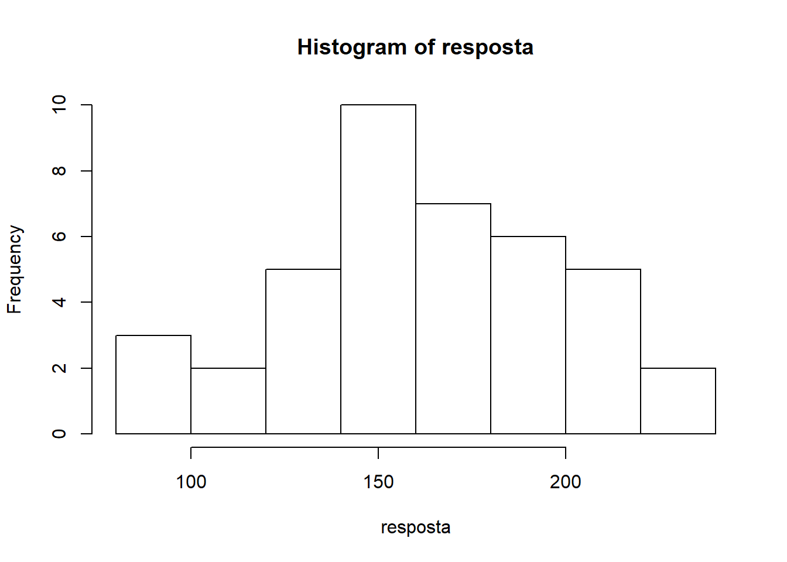

<br>

### Melhorias


```r
hist(resposta, 
        las=1,
        col="lightyellow",
        ylab="Frequência",
        xlab="Resposta",
        ylim=c(0,10),
        main="Histograma")
abline(h=0)
```

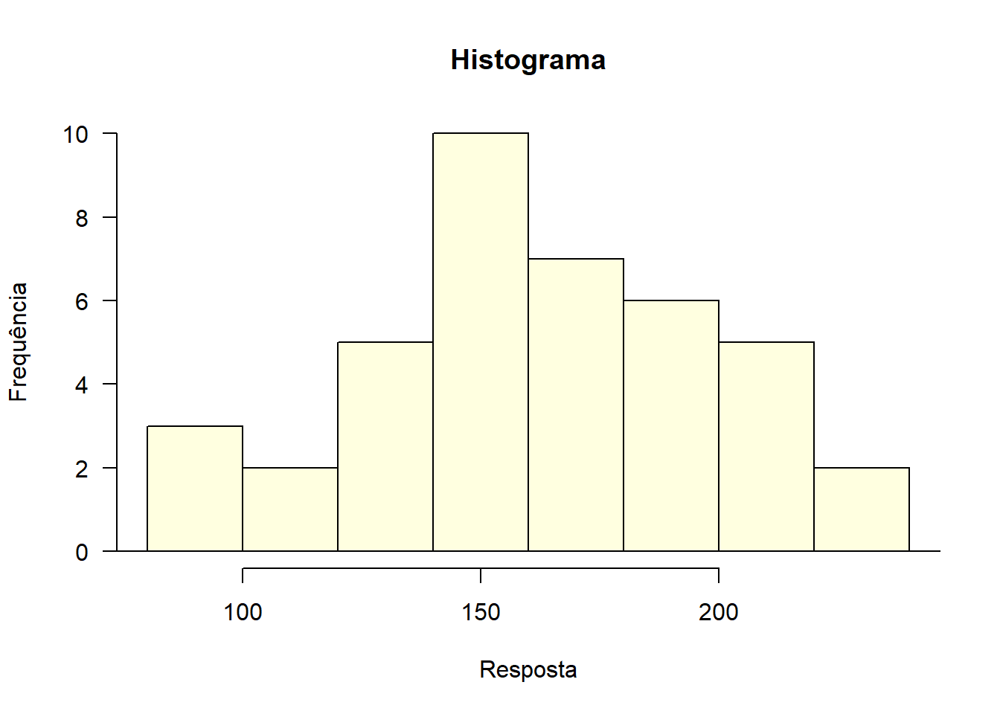

**Comandos**:

las=1: deixar escala do eixo Y na vertical

col="cor": mudar cor das barras (Ex. "red","blue","green" ou gray.colors(quantidade de tonalidades) para escala cinza ou rainbow(quantidade de cores) para escala colorida. Também é possível específicar a cor de cada barra (col=c("red","green","yellow","gray","blue"))).

xlab e ylab: nomear eixo X e Y

xlim e ylim: escala do eixo X e Y

main: Título

abline(h=0): linha na horizontal em Y=0 (No caso de vertical, abline(v=0)). É possível alterar a cor pela função "col="cor"" e o tracejado pelo "lty=número" (Ver o Help do comando)

<br>

### Plotando curva normal


```r
histograma=hist(resposta, 
        las=1,
        col="lightyellow",
        ylab="Frequência",
        xlab="Resposta",
        ylim=c(0,10),
        main="Histograma")
abline(h=0)

## Criando sequência de dados quantitativos discretos entre o mínimo e o máximo da resposta
xfit<-seq(min(resposta),max(resposta))

## dnorm (Função para encontrar os possíveis valores para Y e suas densidade de probabilidade)
yfit<-dnorm(xfit,mean=mean(resposta),sd=sd(resposta))

## diff é o comando para diferença e length para comprimento
yfit <- yfit*diff(histograma$mids[1:2])*length(resposta)

## Plotando linha da curva normal
lines(xfit, yfit, col="blue", lwd=2)
```


<br>

****

## Pacote ggplot2

****

<br>

instalar pacote ggplot2:

``install.packages("ggplot2")``


```r
# Carregar pacote
library(ggplot2)

# Obs. Não esquecer de criar uma data.frame (Ex. chamei de data no início do material)

# Criar histograma
mean=mean(resposta);sd= sd(resposta);n=length(resposta); largura=20
ggplot(data, aes(data$resposta))+
  geom_histogram(binwidth = 20, col="red", fill="green")+
  labs(title="Histograma")+
  labs(x="Resposta", y="Frequência")+
stat_function(fun = function(x) dnorm(x, mean = mean, sd = sd) * n * largura,
    color = "red", size = 1)
```

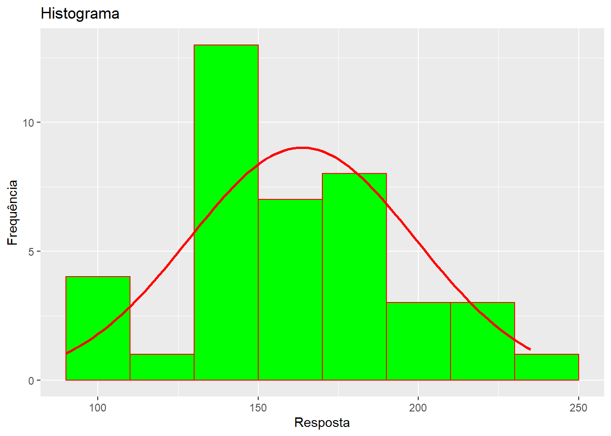

**binwidth** = largura de caixa

**col**= cor do contorno das caixas

**fill**= cor do interior das caixas

**Comando para plotar a curva normal:**

stat_function(fun = function(x) dnorm(x, mean = mean, sd = sd) \* n \* lagura,color = "red", size = 1)

<br><br>

****

## Distribuição normal padrão (Z)

****

### Simulando dados


```r
x=seq(-3,3,length=400)
y=dnorm(x,0,1)
```

<br>

### gráfico simples


```r
plot(x,
     y,
     type="l",
     xlab="",
     ylim=c(-0.1,0.5),
     ylab="")
```


<br>

### Removendo marca da escala


```r
plot(x,y,type="l",axes=F,xlab="",ylim=c(-0.1,0.5),
     ylab="")
```

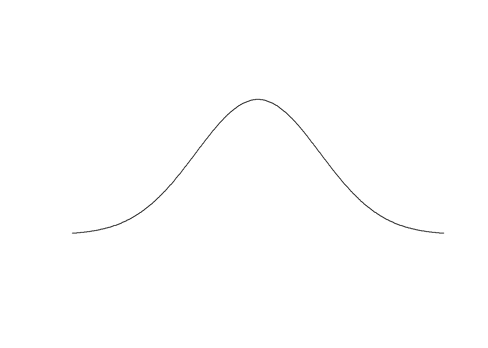

<br>

### Preenchimento tracejado


```r
plot(x,y,type="l",axes=F,xlab="",ylim=c(-0.1,0.5),
     ylab="",col="white")
polygon(c(-3,x,3),c(0,y,0),density = 30)
```


<br>

### Valor crítico (90%)


```r
plot(x,y,type="l",axes=F,xlab="",ylim=c(-0.1,0.5),
     ylab="",col="white")
polygon(c(-3,x,3),c(0,y,0),density = 30)
x1=seq(-1.645,1.645,length=100) # 90
y1=dnorm(x1)
polygon(c(-1.645,x1,1.645),c(0,y1,0),col="white")
abline(h=0);
lines(x=c(0,0),y=c(0,max(y)),lty=2)
```

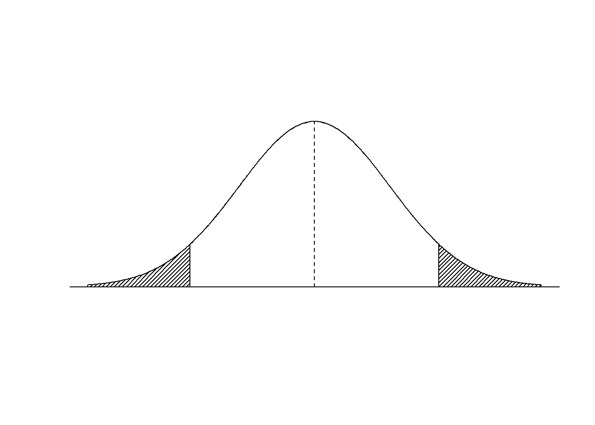

<br>

### Valor crítico (95%)


```r
plot(x,y,type="l",axes=F,xlab="",ylim=c(-0.1,0.5),
     ylab="",col="white")
polygon(c(-3,x,3),c(0,y,0),density = 30)
x1=seq(-1.96,1.96,length=100) # 95%
y1=dnorm(x1)
polygon(c(-1.96,x1,1.96),c(0,y1,0),col="white")
abline(h=0);
lines(x=c(0,0),y=c(0,max(y)),lty=2)
```


<br>

### Valor crítico (99%)


```r
plot(x,y,type="l",axes=F,xlab="",ylim=c(-0.1,0.5),
     ylab="",col="white")
polygon(c(-3,x,3),c(0,y,0),density = 30)
x1=seq(-2.575,2.575,length=100) # 99
y1=dnorm(x1)
polygon(c(-2.575,x1,2.575),c(0,y1,0),col="white")
abline(h=0);
lines(x=c(0,0),y=c(0,max(y)),lty=2)
```

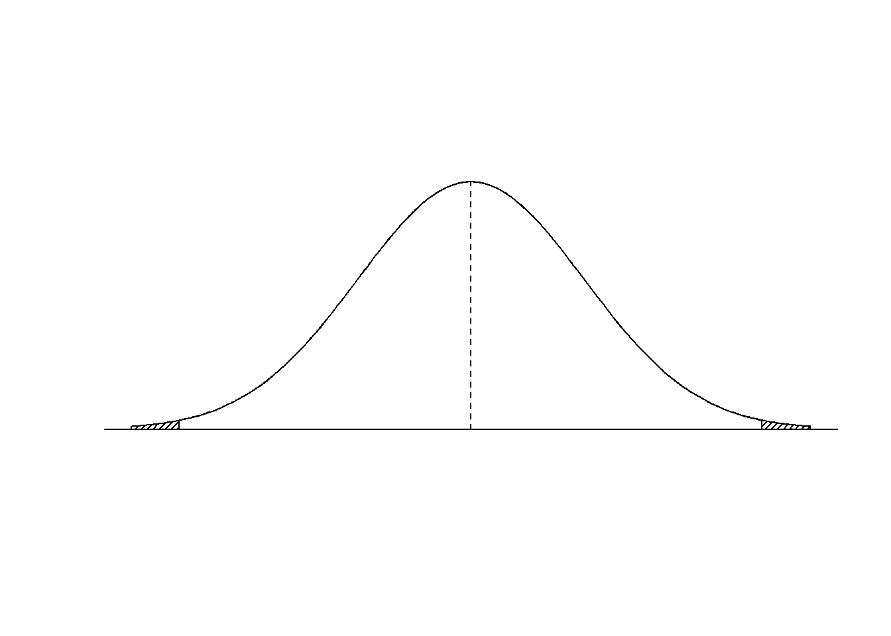

<br>

### Adicionando legendas


```r
plot(x,y,type="l",axes=F,xlab="",ylim=c(-0.1,0.5),
     ylab="",col="white")
polygon(c(-3,x,3),c(0,y,0),density = 30)
x1=seq(-1.96,1.96,length=100)
y1=dnorm(x1)
polygon(c(-1.96,x1,1.96),c(0,y1,0),col="white")
abline(h=0);
lines(x=c(0,0),y=c(0,max(y)),lty=2)
text(-1.96,-.05,expression(frac(-Z,(alpha/2))))
text(+1.96,-.05,expression(frac(Z,(alpha/2))))
text(-2.5,0.1,expression(frac(alpha,2)))
text(+2.5,0.1,expression(frac(alpha,2)))
axis(1)
```

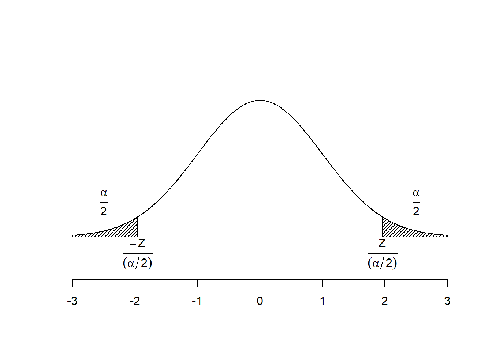

<br><br><br>

****

# Setores circulares 

****

O gráfico de Setores, também conhecido como gráfico de pizza ou gráfico circular é um diagrama circular onde os valores de cada categoria estatística representada são proporcionais às respectivas frequências. Este gráfico pode vir acompanhado de porcentagens. É utilizado para dados qualitativos nominais. Para construir um gráfico de setores é necessário determinar o ângulo dos setores circulares correspondentes à contribuição percentual de cada valor no total.

<br><br>

### Conjunto de dados


```r
variedade=c("Hass","Breda","Quintal","Geada","Margarida","Hass","Geada","Margarida","Hass","Margarida","Hass","Breda","Quintal","Breda","Quintal","Geada","Margarida","Breda","Quintal","Hass","Margarida","Hass","Breda","Hass","Margarida","Hass","Breda","Quintal","Breda","Quintal","Geada","Margarida","Breda","Quintal","Hass","Margarida","Hass","Breda","Geada","Margarida","Breda","Quintal","Hass","Margarida","Hass","Breda","Hass","Margarida","Hass","Breda","Quintal","Breda","Quintal","Geada","Margarida","Breda","Quintal","Hass","Margarida","Hass","Breda","Hass","Margarida","Hass","Breda","Quintal","Breda","Quintal","Geada","Margarida","Breda","Quintal","Quintal","Breda","Quintal")
```

<br>

### Frequências


```r
factor(variedade)
```

```
##  [1] Hass      Breda     Quintal   Geada     Margarida Hass      Geada    
##  [8] Margarida Hass      Margarida Hass      Breda     Quintal   Breda    
## [15] Quintal   Geada     Margarida Breda     Quintal   Hass      Margarida
## [22] Hass      Breda     Hass      Margarida Hass      Breda     Quintal  
## [29] Breda     Quintal   Geada     Margarida Breda     Quintal   Hass     
## [36] Margarida Hass      Breda     Geada     Margarida Breda     Quintal  
## [43] Hass      Margarida Hass      Breda     Hass      Margarida Hass     
## [50] Breda     Quintal   Breda     Quintal   Geada     Margarida Breda    
## [57] Quintal   Hass      Margarida Hass      Breda     Hass      Margarida
## [64] Hass      Breda     Quintal   Breda     Quintal   Geada     Margarida
## [71] Breda     Quintal   Quintal   Breda     Quintal  
## Levels: Breda Geada Hass Margarida Quintal
```

```r
n=length(variedade)
table(variedade)
```

```
## variedade
##     Breda     Geada      Hass Margarida   Quintal 
##        19         7        18        15        16
```

```r
proporção = prop.table(table(variedade))
```

<br>

### Gráfico básico


```r
pie(proporção*100)
```


<br>

### Melhorias


```r
pie(proporção*100, 
    edges=400, 
    radius=1, 
    col=c("red","green","yellow","blue","orange"), 
    main="Variedades de abacate")
```


<br>

### Plotando valores

Obs. sem casa decimal


```r
pie(proporção*100, 
    edges=400, 
    radius=1, 
    labels=paste(names(proporção),"(",round(proporção*100,0),"%",")"), 
    col=c("red","green","yellow","blue","orange"), 
    main="Variedades de abacate")
```

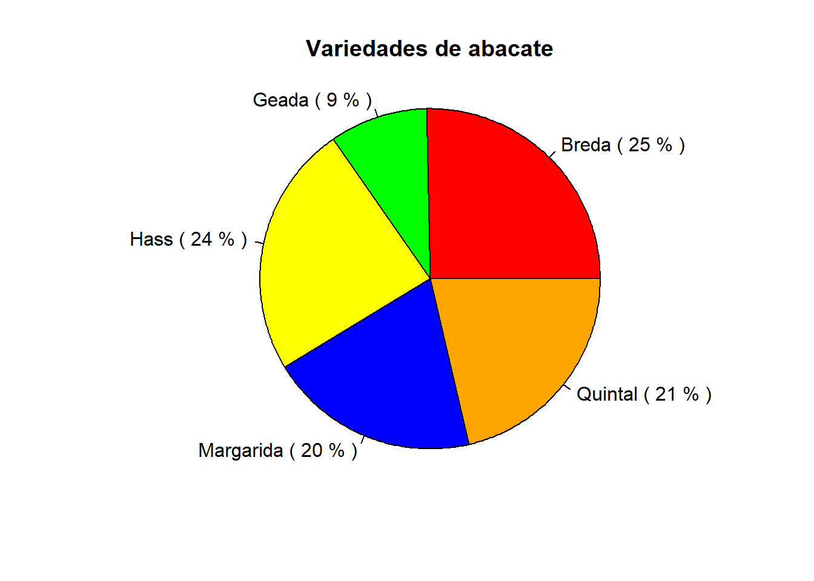

<br><br>

<br>

****

## Gráfico de Setores Circulares 3D

****

<br><br>

### Descobrindo as frequências


```r
factor(variedade)
```

```
##  [1] Hass      Breda     Quintal   Geada     Margarida Hass      Geada    
##  [8] Margarida Hass      Margarida Hass      Breda     Quintal   Breda    
## [15] Quintal   Geada     Margarida Breda     Quintal   Hass      Margarida
## [22] Hass      Breda     Hass      Margarida Hass      Breda     Quintal  
## [29] Breda     Quintal   Geada     Margarida Breda     Quintal   Hass     
## [36] Margarida Hass      Breda     Geada     Margarida Breda     Quintal  
## [43] Hass      Margarida Hass      Breda     Hass      Margarida Hass     
## [50] Breda     Quintal   Breda     Quintal   Geada     Margarida Breda    
## [57] Quintal   Hass      Margarida Hass      Breda     Hass      Margarida
## [64] Hass      Breda     Quintal   Breda     Quintal   Geada     Margarida
## [71] Breda     Quintal   Quintal   Breda     Quintal  
## Levels: Breda Geada Hass Margarida Quintal
```

```r
n=length(variedade)
table(variedade)
```

```
## variedade
##     Breda     Geada      Hass Margarida   Quintal 
##        19         7        18        15        16
```

```r
proporção = prop.table(table(variedade))
```

<br>

### Gráfico em 3D


```r
library(plotrix)
pie3D(proporção*100)
```


<br>

### Separando os setores


```r
pie3D(proporção*100, 
      explode=0.1, 
      main="Variedades de abacate")
```

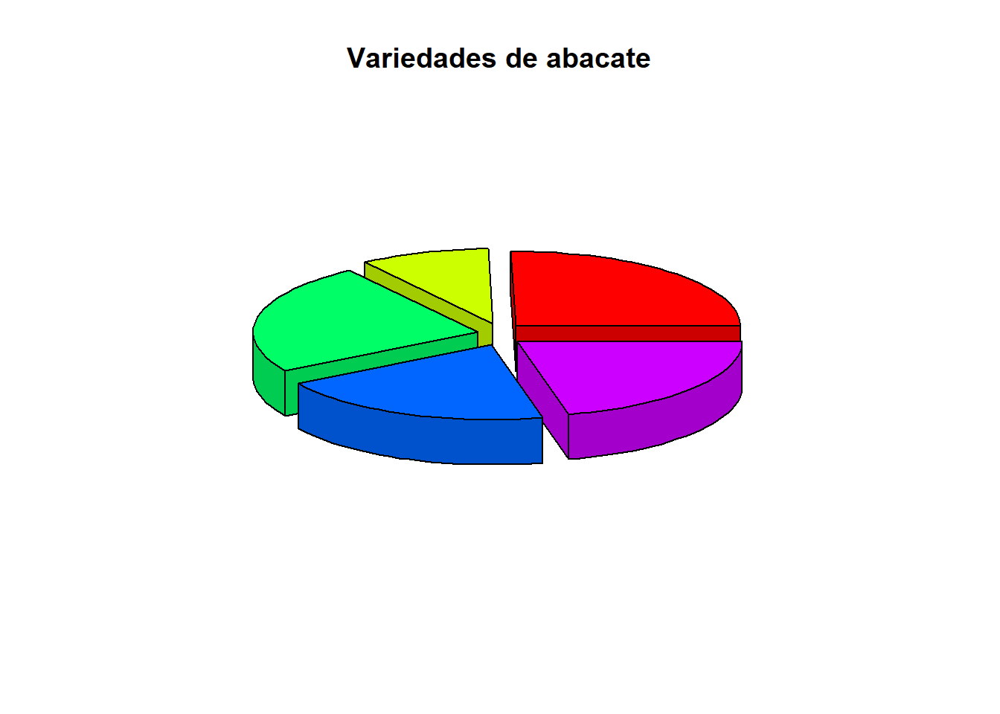

<br>

### Adicionando nomes e frequências


```r
pie3D(proporção*100, 
      explode=0.1, 
      cex=0.8,
      labels=paste(names(proporção),
                   "(",round(proporção*100,0),"%",")"), 
      main="Variedades de abacate")
```

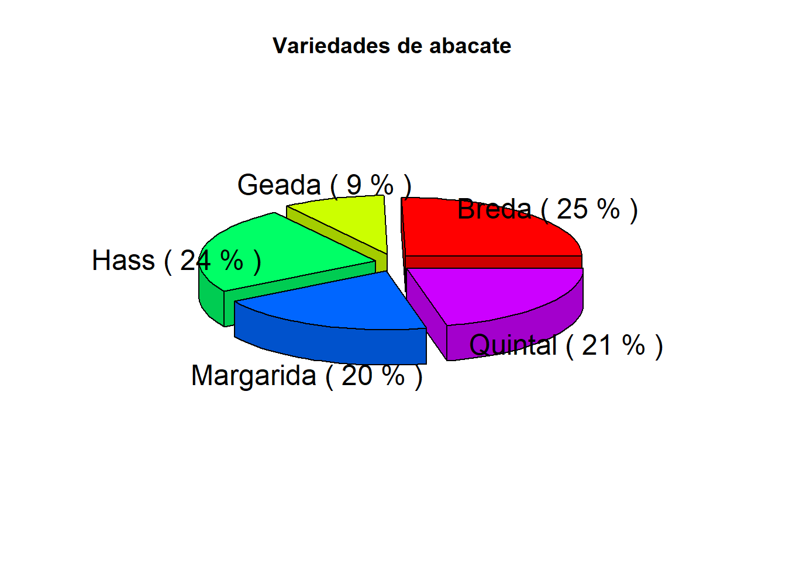

<br><br><br>

****

# Interação

****

O gráfico de interações é usado quando temos ao menos dois fatores. Tem como função identificar visualmente se os fatores apresentam efeito conjunto ou se são independentes

### Conjunto de dados

Um experimento foi realizado com o intuito de avaliar 5 manejos na entrelinha do pomar de laranja Natal e sua influência em relação a linha de plantio. O experimento foi instalado em Delineamento em blocos casualizados com 12 repetições por tratamento em esquema de parcelas subdividida (2 [linha e entrelinha] x 5[ *U. brizantha* (T1),*U. decumbens* (T2), *U. ruziziensis* (T3), *Glifosato* (T4), *Pousio* (T5). Foi analisado o carbono da biomassa microbiana (CBM).


```r
RESP=c(224.92, 180.32, 130.19, 110.31, 163.74,193.03, 211.49, 137.65, 127.15, 203.39,182.36, 124.75, 177.70, 231.01, 202.14,214.89, 198.42, 267.85, 207.67, 176.74,162.18, 124.59, 158.99, 209.12, 128.14,113.95, 215.53, 190.51, 174.58, 148.70,150.90, 209.03, 210.40, 199.03, 237.05,196.97, 176.06, 263.27, 240.19, 160.72,239.90, 188.07, 251.35, 215.45, 198.50,271.42, 226.56, 217.65, 213.69, 101.26,115.41, 140.10, 117.67, 106.45, 139.34,104.22, 206.13, 195.89, 147.11, 122.93,176.55, 173.63, 112.83, 184.82, 178.18,115.85, 183.89, 134.92, 086.49, 103.96,096.33, 091.64, 157.76, 107.45, 106.61,095.28, 152.37, 066.02, 125.75, 075.34,088.64, 104.00, 066.38, 084.74, 101.76,173.70, 101.24, 143.71, 119.88, 157.79,070.42, 152.75, 111.65, 153.08, 146.64,142.57, 098.96, 065.92, 065.62, 063.26,095.72, 084.14, 054.92, 090.49, 112.11,102.68, 144.77, 122.58, 125.14, 127.61,117.14, 147.87, 156.18, 154.82, 183.91,159.11, 155.41, 184.55, 121.39, 155.77)
FATOR1=rep(rep(c("L","EL"), e=12),5); FATOR1=factor(FATOR1)
FATOR2=rep(c(paste("T",1:5)),e=24); FATOR2=factor(FATOR2)
repe=rep(c(paste("R",1:12)),10); repe=factor(repe)
dados = data.frame(FATOR1,FATOR2,repe,RESP)
```

### Fator1 x Fator 2


```r
with(dados, interaction.plot(FATOR1, FATOR2, RESP))
```

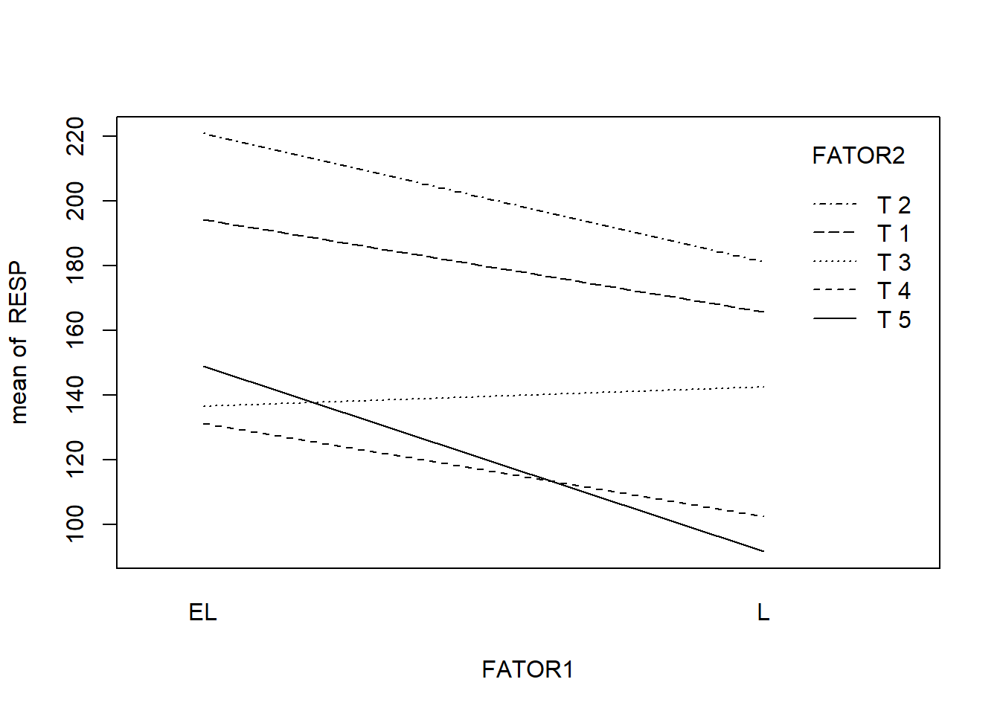

### Editando o gráfico


```r
with(dados, interaction.plot(FATOR1, FATOR2, RESP, las=1, col=1:6, bty='l', 
                             ylab='CBM', trace.label="FATOR2"))
```

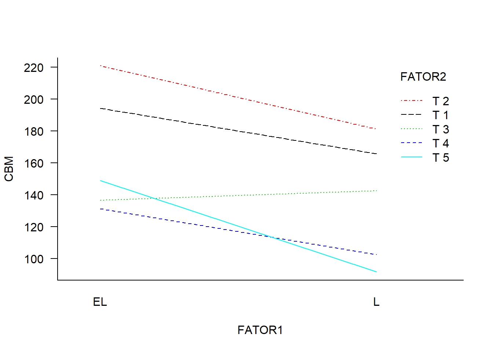

### Fator2 x Fator 1


```r
with(dados, interaction.plot(FATOR2, FATOR1, RESP))
```

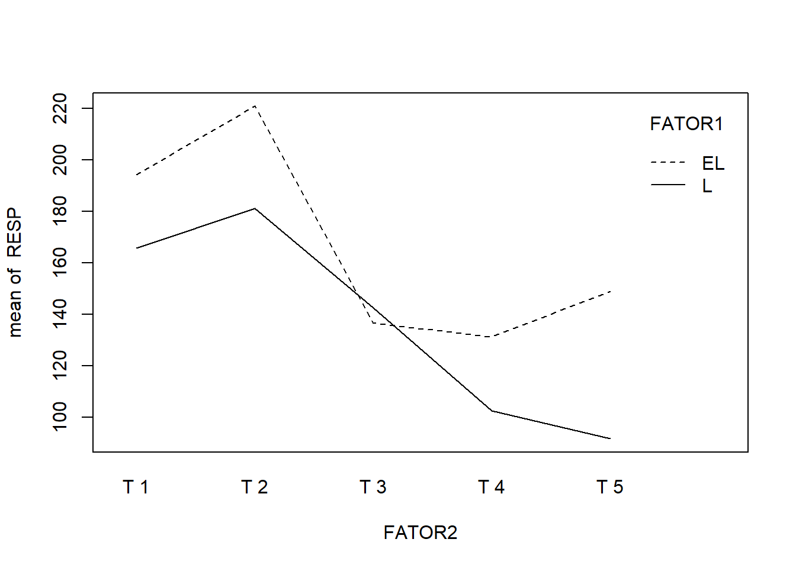

### Editando o gráfico


```r
with(dados, interaction.plot(FATOR2,FATOR1, RESP, las=1, col=c("blue","red"), bty='l',xlab='', ylab='CBM', trace.label="repe"))
```


## Usando o interaction(s)

### Conjunto de dados

Este conjunto de dados pertence ao pacote ExpDes.pt (data6). Ao qual é composto de três fatores (fatorA, fatorB e fatorC), cuja resposta é nomeada como resp.


```r
x=scan(dec=",",text="
1       1      1      1   1 10,0
2       1      1      1   2 10,8
3       1      1      1   3  9,8
4       1      1      2   1 10,3
5       1      1      2   2 11,3
6       1      1      2   3 10,3
7       1      2      1   1  9,7
8       1      2      1   2 10,1
9       1      2      1   3 10,2
10      1      2      2   1  9,4
11      1      2      2   2 11,6
12      1      2      2   3  9,1
13      2      1      1   1  9,2
14      2      1      1   2  8,6
15      2      1      1   3 10,1
16      2      1      2   1  9,3
17      2      1      2   2 10,3
18      2      1      2   3  9,1
19      2      2      1   1 11,5
20      2      2      1   2  9,5
21      2      2      1   3 10,8
22      2      2      2   1 10,7
23      2      2      2   2 10,4
24      2      2      2   3  9,6
")
data=data.frame(t(matrix(x,6,24)))
colnames(data)=c("N","fatorA", "fatorB", "fatorC","rep","resp")
data
```

```
##     N fatorA fatorB fatorC rep resp
## 1   1      1      1      1   1 10,0
## 2   2      1      1      1   2 10,8
## 3   3      1      1      1   3  9,8
## 4   4      1      1      2   1 10,3
## 5   5      1      1      2   2 11,3
## 6   6      1      1      2   3 10,3
## 7   7      1      2      1   1  9,7
## 8   8      1      2      1   2 10,1
## 9   9      1      2      1   3 10,2
## 10 10      1      2      2   1  9,4
## 11 11      1      2      2   2 11,6
## 12 12      1      2      2   3  9,1
## 13 13      2      1      1   1  9,2
## 14 14      2      1      1   2  8,6
## 15 15      2      1      1   3 10,1
## 16 16      2      1      2   1  9,3
## 17 17      2      1      2   2 10,3
## 18 18      2      1      2   3  9,1
## 19 19      2      2      1   1 11,5
## 20 20      2      2      1   2  9,5
## 21 21      2      2      1   3 10,8
## 22 22      2      2      2   1 10,7
## 23 23      2      2      2   2 10,4
## 24 24      2      2      2   3  9,6
```

### Separado por Fator A


```r
par(mfrow=c(1,2))
interaction.plot(data$fatorB[data$fatorA=="1"],
                 data$fatorC[data$fatorA=="1"],
                 data$resp[data$fatorA=="1"])
interaction.plot(data$fatorB[data$fatorA=="2"],
                 data$fatorC[data$fatorA=="2"],
                 data$resp[data$fatorA=="2"])
```

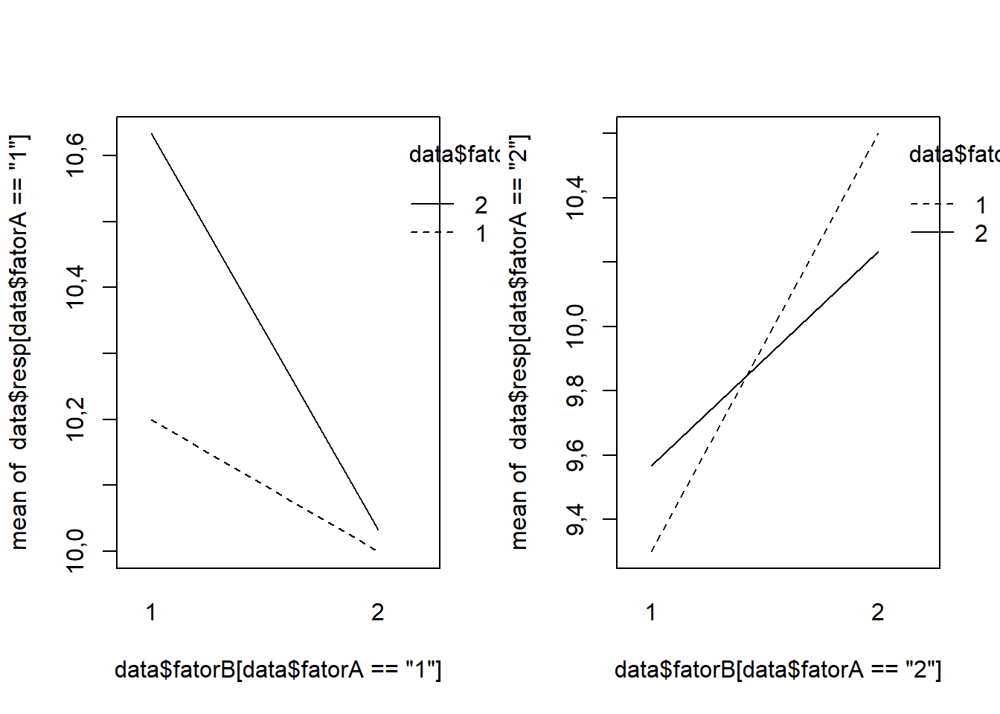

### Alterando escala do eixo Y


```r
par(mfrow=c(1,2))
interaction.plot(data$fatorB[data$fatorA=="1"],
                 data$fatorC[data$fatorA=="1"],
                 data$resp[data$fatorA=="1"], 
                 las=1)
interaction.plot(data$fatorB[data$fatorA=="2"],
                 data$fatorC[data$fatorA=="2"],
                 data$resp[data$fatorA=="2"], 
                 las=1)
```

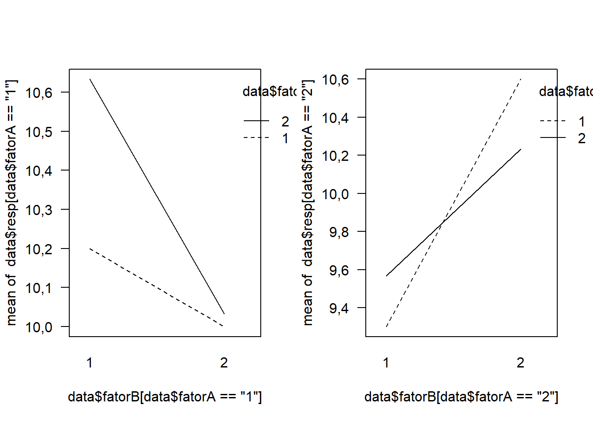

### Título do eixo x e y


```r
par(mfrow=c(1,2))
interaction.plot(data$fatorB[data$fatorA=="1"],
                 data$fatorC[data$fatorA=="1"],
                 data$resp[data$fatorA=="1"], 
                 las=1,
                 xlab="Fator B",
                 ylab="Resposta")
interaction.plot(data$fatorB[data$fatorA=="2"],
                 data$fatorC[data$fatorA=="2"],
                 data$resp[data$fatorA=="2"], 
                 las=1,
                 xlab="Fator B",
                 ylab="Resposta")
```

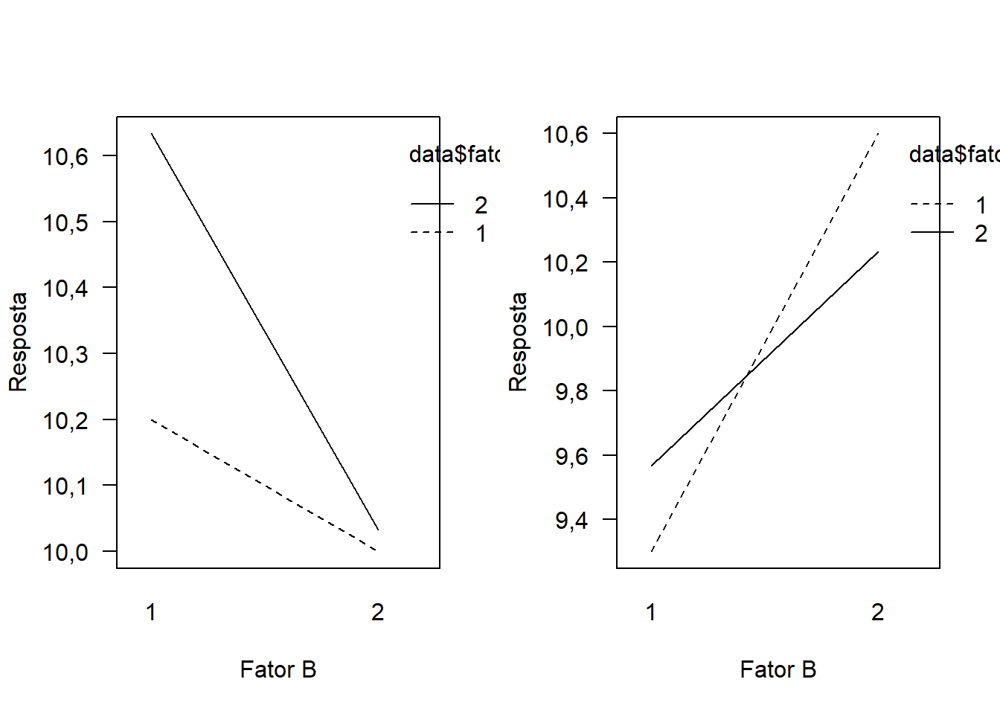

### Removendo linhas da caixa


```r
par(mfrow=c(1,2))
interaction.plot(data$fatorB[data$fatorA=="1"],
                 data$fatorC[data$fatorA=="1"],
                 data$resp[data$fatorA=="1"], 
                 las=1,
                 xlab="Fator B",
                 ylab="Resposta",
                 bty="l")
interaction.plot(data$fatorB[data$fatorA=="2"],
                 data$fatorC[data$fatorA=="2"],
                 data$resp[data$fatorA=="2"], 
                 las=1,
                 xlab="Fator B",
                 ylab="Resposta",
                 bty="l")
```


### Cor da linhas


```r
par(mfrow=c(1,2))
interaction.plot(data$fatorB[data$fatorA=="1"],
                 data$fatorC[data$fatorA=="1"],
                 data$resp[data$fatorA=="1"], 
                 las=1,
                 xlab="Fator B",
                 ylab="Resposta",
                 bty="l", 
                 col = c("red","blue"))
interaction.plot(data$fatorB[data$fatorA=="2"],
                 data$fatorC[data$fatorA=="2"],
                 data$resp[data$fatorA=="2"], 
                 las=1,
                 xlab="Fator B",
                 ylab="Resposta",
                 bty="l",
                 col = c("red","blue"))
```

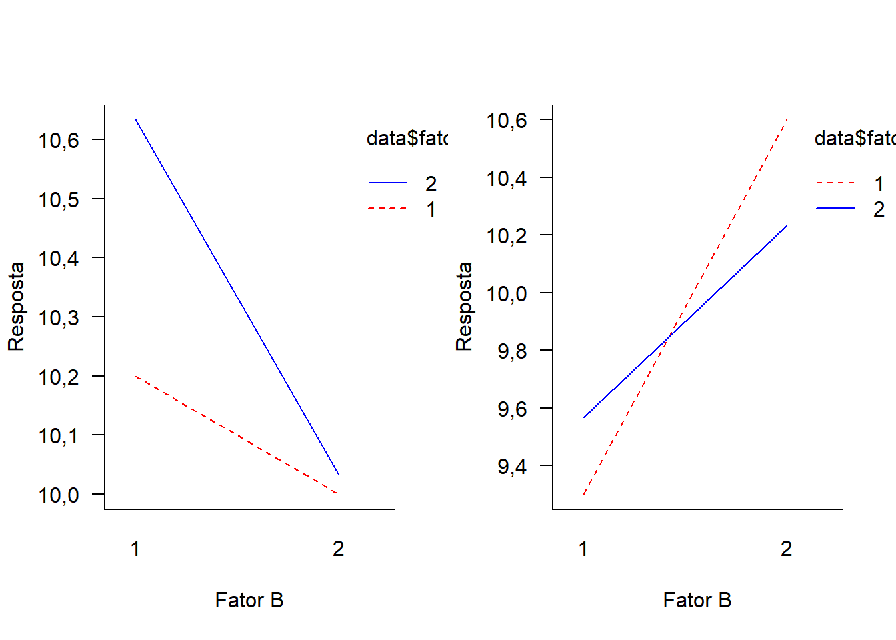

### Título dos gráficos


```r
par(mfrow=c(1,2))
interaction.plot(data$fatorB[data$fatorA=="1"],
                 data$fatorC[data$fatorA=="1"],
                 data$resp[data$fatorA=="1"], 
                 las=1,
                 xlab="Fator B",
                 ylab="Resposta",
                 bty="l", 
                 col = c("red","blue"),
                 main="Fator A = 1")
interaction.plot(data$fatorB[data$fatorA=="2"],
                 data$fatorC[data$fatorA=="2"],
                 data$resp[data$fatorA=="2"], 
                 las=1,
                 xlab="Fator B",
                 ylab="Resposta",
                 bty="l",
                 col = c("red","blue"),
                 main="Fator A = 2")
```

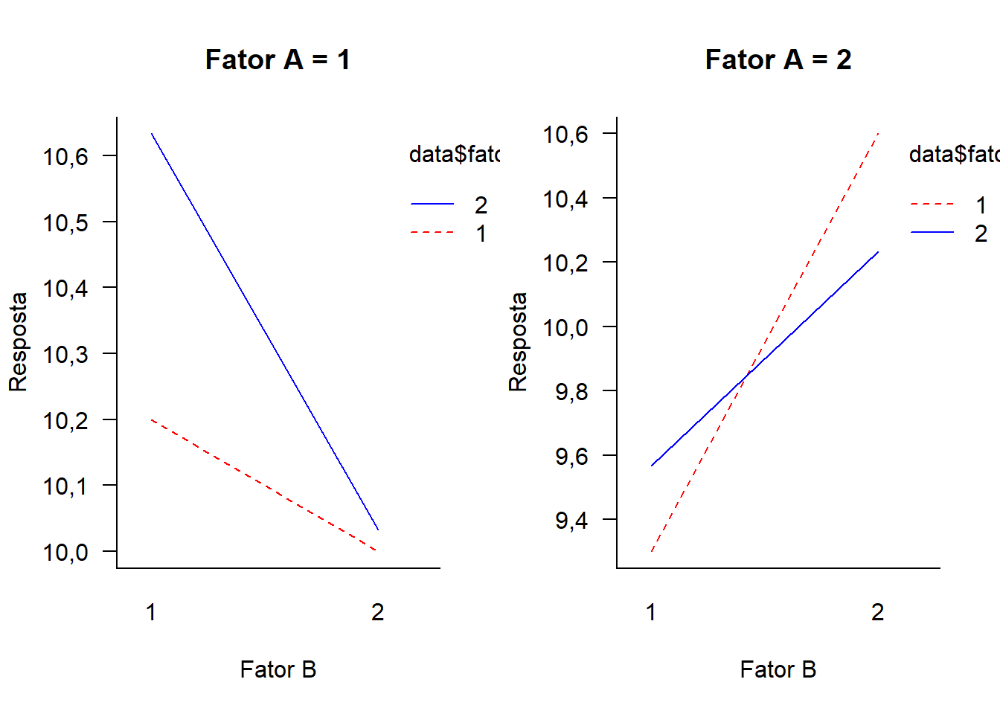

### Título da legenda


```r
par(mfrow=c(1,2))
interaction.plot(data$fatorB[data$fatorA=="1"],
                 data$fatorC[data$fatorA=="1"],
                 data$resp[data$fatorA=="1"], 
                 las=1,
                 xlab="Fator B",
                 ylab="Resposta",
                 bty="l", 
                 col = c("red","blue"),
                 main="Fator A = 1",
                 trace.label = "Fator C")
interaction.plot(data$fatorB[data$fatorA=="2"],
                 data$fatorC[data$fatorA=="2"],
                 data$resp[data$fatorA=="2"], 
                 las=1,
                 xlab="Fator B",
                 ylab="Resposta",
                 bty="l",
                 col = c("red","blue"),
                 main="Fator A = 2",
                 trace.label = "Fator C")
```

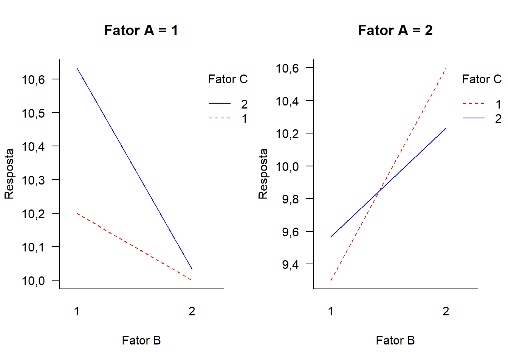


### Pontos da média

Calculando as médias


```r
# Média para nível 1 do fator A
media=with(data, 
           tapply(resp[fatorA=="1"], 
                      list(fatorB[fatorA=="1"],
                           fatorC[fatorA=="1"]), 
                  mean))

# Média e desvio-padrão para nível 2 do fator A
media1=with(data, 
            tapply(resp[fatorA=="2"], 
                      list(fatorB[fatorA=="2"],
                           fatorC[fatorA=="2"]), 
                   mean))           
```


```r
par(mfrow=c(1,2))
interaction.plot(data$fatorB[data$fatorA=="1"],
                 data$fatorC[data$fatorA=="1"],
                 data$resp[data$fatorA=="1"], 
                 las=1,
                 xlab="Fator B",
                 ylab="Resposta",
                 bty="l", 
                 col = c("red","blue"),
                 main="Fator A = 1",
                 trace.label = "Fator C")
points(c(1,2,1,2),media, col="red", pch=16)

interaction.plot(data$fatorB[data$fatorA=="2"],
                 data$fatorC[data$fatorA=="2"],
                 data$resp[data$fatorA=="2"], 
                 las=1,
                 xlab="Fator B",
                 ylab="Resposta",
                 bty="l",
                 col = c("red","blue"),
                 main="Fator A = 2",
                 trace.label = "Fator C")
points(c(1,2,1,2),media1, col="red", pch=16)
```


### Barras de desvio-padrão

Calculando os desvios-padrões


```r
# Desvio-padrão para nível 1 do fator A
desvio=with(data, 
            tapply(resp[fatorA=="1"], 
                      list(fatorB[fatorA=="1"],
                           fatorC[fatorA=="1"]), 
                         sd))

# Desvio-padrão para nível 2 do fator A
desvio1=with(data, 
             tapply(resp[fatorA=="2"], 
                      list(fatorB[fatorA=="2"],
                           fatorC[fatorA=="2"]), 
                    sd))
```


```r
par(mfrow=c(1,2))
interaction.plot(data$fatorB[data$fatorA=="1"],
                 data$fatorC[data$fatorA=="1"],
                 data$resp[data$fatorA=="1"], 
                 las=1, args.legend=list(x="topleft"),
                 xlab="Fator B", ylim=c(8,13),
                 ylab="Resposta", 
                 bty="l", 
                 col = c("red","blue"),
                 main="Fator A = 1",
                 trace.label = "Fator C")
points(c(1,2,1,2),media, col="red", pch=16)
arrows(c(1,2,1,2), media+desvio,c(1,2,1,2),media-desvio, code=3,angle=90,length = 0.1, col=c("red","red","blue","blue"))

interaction.plot(data$fatorB[data$fatorA=="2"],
                 data$fatorC[data$fatorA=="2"],
                 data$resp[data$fatorA=="2"], 
                 las=1,
                 xlab="Fator B", ylim=c(8,13),
                 ylab="Resposta",
                 bty="l",
                 col = c("red","blue"),
                 main="Fator A = 2",
                 trace.label = "Fator C")
points(c(1,2,1,2),media1, col="red", pch=16)
arrows(c(1,2,1,2), media1+desvio1,c(1,2,1,2),media1-desvio1, code=3,angle=90,length = 0.1, col=c("red","red","blue","blue"))
```

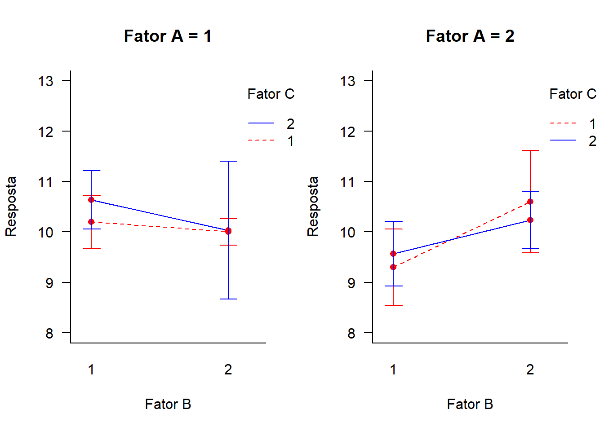

## Pacote dae

### Conjunto de dados


```r
resp=c(4599.55,6203.50,4566.02,5616.38,4978.35,5126.15,4816.23,4251.00,4106.79,
       4600.58,4012.14,4623.41,4274.16,4683.50,4433.33,4326.16,4932.66,5066.67,
       4697.29,5011.38,5156.72,4744.21,4826.80,4663.26,4807.19,4377.19,4442.07,
       4685.58,5066.90,5317.66,5144.19,4580.18,4860.37,5204.21,5146.19,5015.67,
       5801.99,4668.05,5393.16,5282.27,5369.41,5494.43,4980.32,5715.76,4754.54,
       5000.83,4664.11,4969.41,5315.43,4872.29,5546.79,4765.79,4649.63,4899.31,
       4890.89,5117.10,4942.97,4548.97,4916.97,4225.38,4820.21,4150.44,4648.46,
       4271.57,5143.54,4808.97,5459.66,4928.35,5224.70,4900.90,4770.88,4977.68,
       5816.80,5107.11,5555.80,5767.65,5117.10,5573.08,5673.87,4859.00,4687.26,
       5055.22,5235.22,4961.72,4984.93,5425.67,4978.33,5172.60,5328.07,4973.87,
       5296.55,4928.01,4528.12,5337.93,5809.20,4914.70,5191.89,5261.24,5287.53,
       5680.55,5080.06,5425.53,4949.13,5300.57,4481.23,5039.54,5223.75,4581.65)
FATOR1=rep(rep(c("A1","A2","A3"), e=12),3)
FATOR2=rep(c("B1","B2","B3"), e=36)
FATOR3=rep(rep(c("C1","c2","c3"),e=4),9)
dados=data.frame(FATOR1,FATOR2,FATOR3,resp)
```

<br>

### Gráfico com a média

Para se construir esse gráfico é necessário instalar o pacote `dae`


```r
library(dae)
interaction.ABC.plot(resp,FATOR1,FATOR2,FATOR3,data=dados)
```


```r
interaction.ABC.plot(resp,FATOR1,FATOR3,FATOR2,data=dados)
```

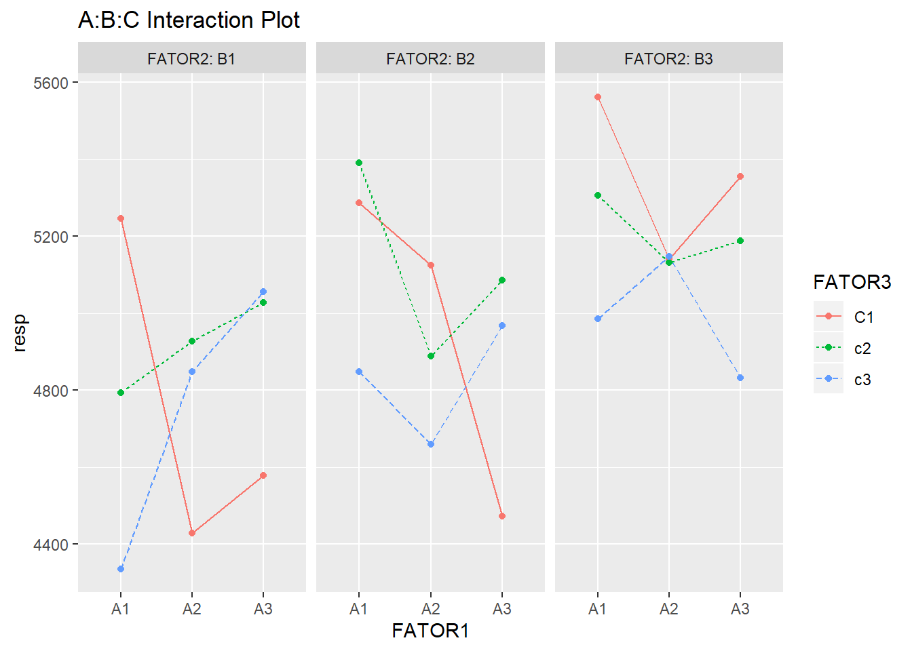

```r
interaction.ABC.plot(resp,FATOR2,FATOR3,FATOR1,data=dados)
```


```r
interaction.ABC.plot(resp,FATOR2,FATOR1,FATOR3,data=dados)
```


```r
interaction.ABC.plot(resp,FATOR3,FATOR2,FATOR1,data=dados)
```


```r
interaction.ABC.plot(resp,FATOR3,FATOR1,FATOR2,data=dados)
```

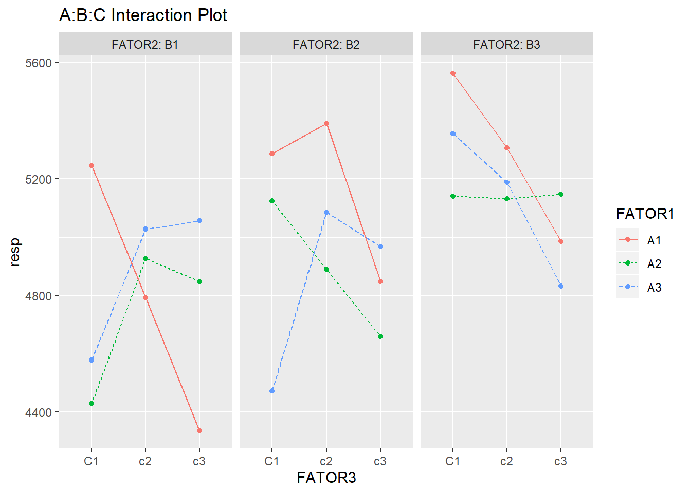

### Média e desvio-padrão


```r
media=tapply(resp, paste(FATOR1,FATOR2,FATOR3),mean)
desvio=tapply(resp, paste(FATOR1,FATOR2,FATOR3),sd)
```


```r
(F1=rep(c("A1","A2","A3"), e=9))
```

```
##  [1] "A1" "A1" "A1" "A1" "A1" "A1" "A1" "A1" "A1" "A2" "A2" "A2" "A2" "A2" "A2"
## [16] "A2" "A2" "A2" "A3" "A3" "A3" "A3" "A3" "A3" "A3" "A3" "A3"
```

```r
(F2=rep(rep(c("B1","B2","B3"), e=3),3)) 
```

```
##  [1] "B1" "B1" "B1" "B2" "B2" "B2" "B3" "B3" "B3" "B1" "B1" "B1" "B2" "B2" "B2"
## [16] "B3" "B3" "B3" "B1" "B1" "B1" "B2" "B2" "B2" "B3" "B3" "B3"
```

```r
(F3=rep(c("C1","c2","c3"),9))
```

```
##  [1] "C1" "c2" "c3" "C1" "c2" "c3" "C1" "c2" "c3" "C1" "c2" "c3" "C1" "c2" "c3"
## [16] "C1" "c2" "c3" "C1" "c2" "c3" "C1" "c2" "c3" "C1" "c2" "c3"
```

```r
paste(F1,F2,F3) # tratamentos
```

```
##  [1] "A1 B1 C1" "A1 B1 c2" "A1 B1 c3" "A1 B2 C1" "A1 B2 c2" "A1 B2 c3"
##  [7] "A1 B3 C1" "A1 B3 c2" "A1 B3 c3" "A2 B1 C1" "A2 B1 c2" "A2 B1 c3"
## [13] "A2 B2 C1" "A2 B2 c2" "A2 B2 c3" "A2 B3 C1" "A2 B3 c2" "A2 B3 c3"
## [19] "A3 B1 C1" "A3 B1 c2" "A3 B1 c3" "A3 B2 C1" "A3 B2 c2" "A3 B2 c3"
## [25] "A3 B3 C1" "A3 B3 c2" "A3 B3 c3"
```

### Criando uma data.frame


```r
data=data.frame(F1,F2,F3,media,desvio)
```

### Construindo o gráfico


```r
interaction.ABC.plot(media,F1,F2,F3,data=data,
                     ggplotFunc=
                       list(geom_errorbar(data=data,
                                          aes(ymax=media+desvio, 
                                              ymin=media-desvio), 
                                                   width=0.2)))
```


<br><br><br>

****

# Perfil Individual

****

### Conjunto de dados

Um experimento foi realizado com o intuito de avaliar 5 manejos na entrelinha do pomar de laranja Natal e sua influência em relação a linha de plantio. O experimento foi instalado em Delineamento em blocos casualizados com 12 repetições por tratamento em esquema de parcelas subdividida (2 [linha e entrelinha] x 5[ *U. brizantha* (T1),*U. decumbens* (T2), *U. ruziziensis* (T3), *Glifosato* (T4), *Pousio* (T5). Foi analisado o carbono da biomassa microbiana (CBM).


```r
RESP=c(224.92, 180.32, 130.19, 110.31, 163.74,193.03, 211.49, 137.65, 127.15, 203.39,182.36, 124.75, 177.70, 231.01, 202.14,214.89, 198.42, 267.85, 207.67, 176.74,162.18, 124.59, 158.99, 209.12, 128.14,113.95, 215.53, 190.51, 174.58, 148.70,150.90, 209.03, 210.40, 199.03, 237.05,196.97, 176.06, 263.27, 240.19, 160.72,239.90, 188.07, 251.35, 215.45, 198.50,271.42, 226.56, 217.65, 213.69, 101.26,115.41, 140.10, 117.67, 106.45, 139.34,104.22, 206.13, 195.89, 147.11, 122.93,176.55, 173.63, 112.83, 184.82, 178.18,115.85, 183.89, 134.92, 086.49, 103.96,096.33, 091.64, 157.76, 107.45, 106.61,095.28, 152.37, 066.02, 125.75, 075.34,088.64, 104.00, 066.38, 084.74, 101.76,173.70, 101.24, 143.71, 119.88, 157.79,070.42, 152.75, 111.65, 153.08, 146.64,142.57, 098.96, 065.92, 065.62, 063.26,095.72, 084.14, 054.92, 090.49, 112.11,102.68, 144.77, 122.58, 125.14, 127.61,117.14, 147.87, 156.18, 154.82, 183.91,159.11, 155.41, 184.55, 121.39, 155.77)
FATOR1=rep(rep(c("L","EL"), e=12),5); FATOR1=factor(FATOR1)
FATOR2=rep(c(paste("T",1:5)),e=24); FATOR2=factor(FATOR2)
repe=rep(c(paste("R",1:12)),10); repe=factor(repe)
dados = data.frame(FATOR1,FATOR2,repe,RESP)
```

### Fator 2 x Fator 1


```r
library(lattice)
with(dados, xyplot(RESP ~ FATOR1|FATOR2, groups=repe))
```

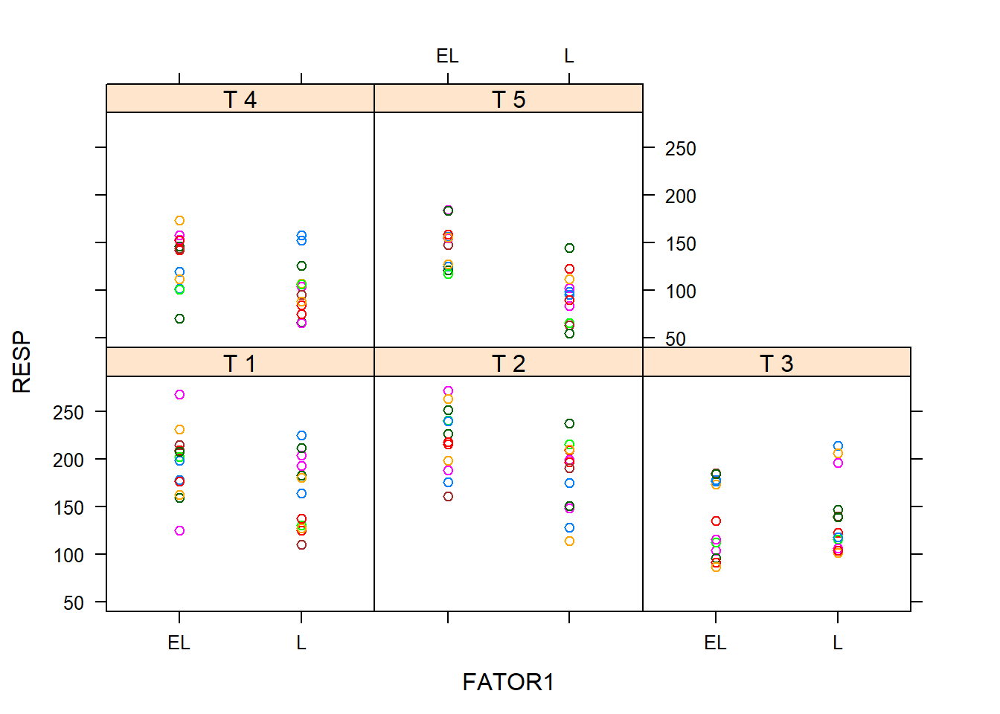


```r
with(dados, xyplot(RESP ~ FATOR1|FATOR2, groups=repe, aspect="xy"))
```


```r
with(dados, xyplot(RESP ~ FATOR1|FATOR2, groups=repe, aspect="xy", type="o"))
```


```r
with(dados, xyplot(RESP ~ FATOR1|FATOR2, groups=repe, aspect="xy", type="o", ylab='CBM',strip=strip.custom(strip.names=TRUE, strip.levels=TRUE)))
```


### Fator 1 x Fator 2


```r
with(dados, xyplot(RESP ~ FATOR2|FATOR1, groups=repe, type="o", ylab='CBM', strip=strip.custom(strip.names=TRUE,strip.levels=TRUE)))
```


<br><br><br>

****

# Linhas

****

Gráficos de linhas ou pontos são normalmente usados para controlar alterações ao longo do tempo e para facilitar a identificação de tendências ou de anomalias.


### Conjunto de dados

Esse conjunto de dados de Umidade relativa (UR) foi obtido no site do Instituto Agronômico do Paraná  (http://www.iapar.br/modules/conteudo/conteudo.php?conteudo=1828) no período de 01/09/2018 a 21/02/2019.

<br>


```r
UR=c(68,93,86,55,54,51,45,43,55,54,58,57,64,89,73,80,96,71,86,95,74,62,49,43,51,62,86,73,64,95,68,77,86,93,76,63,69,94,88,89,88,67,76,84,71,88,83,83,74,54,51,61,74,97,94,97,66,58,65,56,82,93,66,64,67,65,67,67,63,62,76,51,57,54,80,65,65,65,93,88,63,68,65,98,83,64,67,62,59,78,75,70,63,62,53,46,42,55,60,51,51,47,42,60,62,77,74,58,63,67,66,83,81,87,95,80,71,68,74,69,75,74,75,90,86,91,91,98,84,81,74,82,69,77,84,78,74,87,75,80,89,90,77,73,82,80,82,75,79,70,61,63,74,63,58,62,76,76,74,69,64,56,61,86,94,85,78,91,82,80,81,85,89,84)
TEMPO=c(1:174)
```

<br>

### Gráfico de dispersão


```r
plot(UR~TEMPO, 
     ylab="Umidade Relativa (%)", xlab="Tempo (Dias)",
     col="blue", las=1)
```

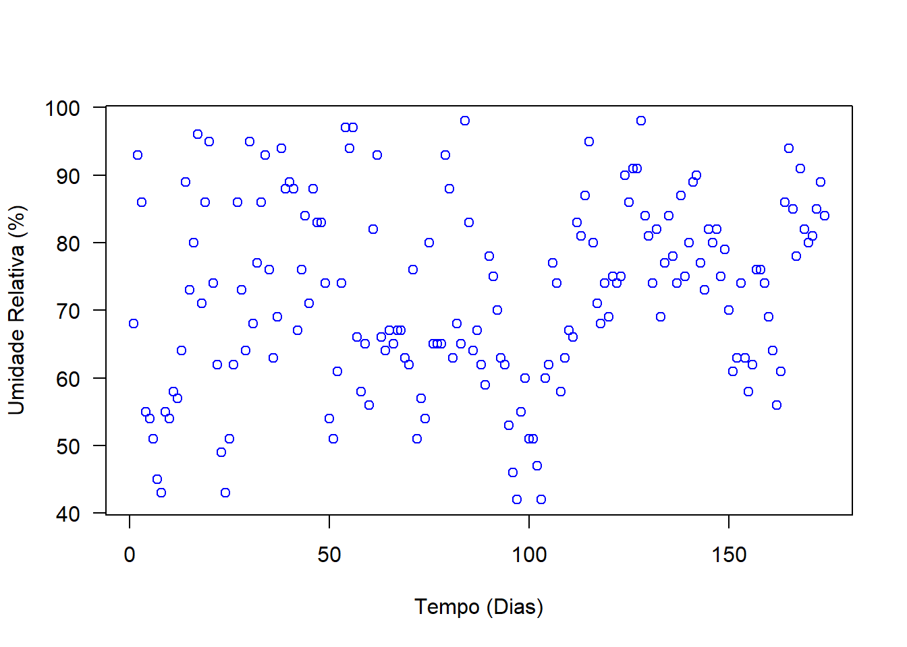

<br>

### Gráfico com as linhas


```r
plot(UR~TEMPO,
     ylab="Umidade Relativa (%)", xlab="Tempo (Dias)",
     type="lines", 
     col="blue", las=1)
```

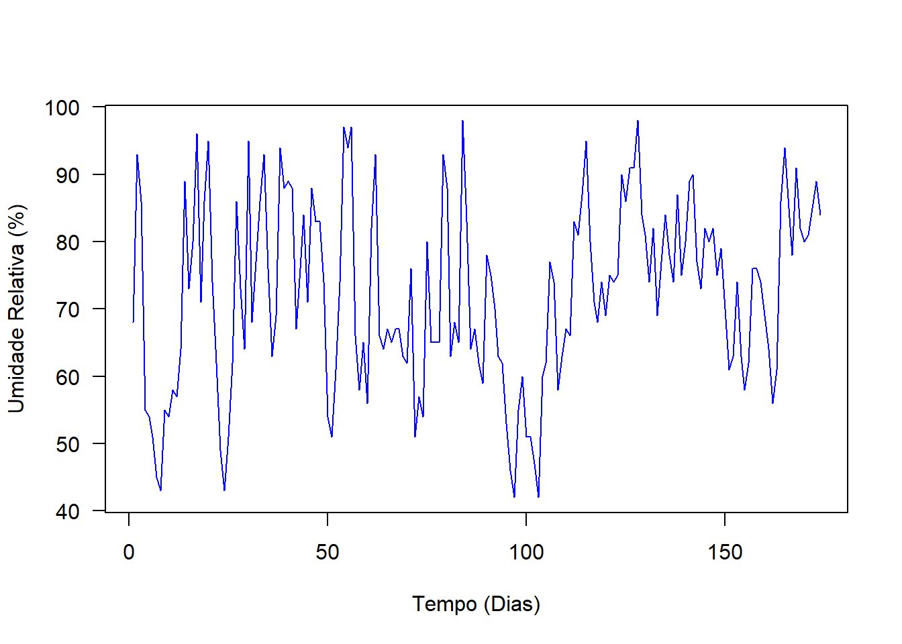

<br>

### Gráfico com linhas e pontos 


```r
plot(UR~TEMPO,
     ylab="Umidade Relativa (%)", xlab="Tempo (Dias)",
     type="b", 
     col="blue", las=1)
```


```r
plot(UR~TEMPO,
     ylab="Umidade Relativa (%)", xlab="Tempo (Dias)",
     type="o", 
     col="blue", las=1)
```


<br>

### Linhas verticais


```r
plot(UR~TEMPO,
     ylab="Umidade Relativa (%)", xlab="Tempo (Dias)",
     type="h", 
     col="blue", las=1)
```

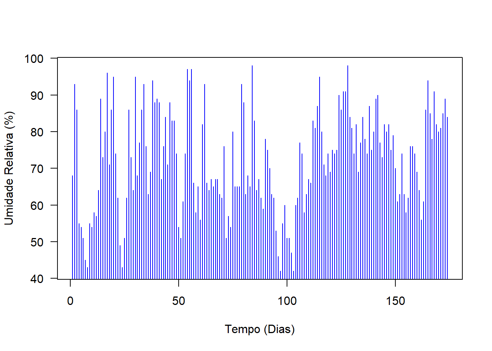

<br>

### Formato em escada


```r
plot(UR~TEMPO,
     ylab="Umidade Relativa (%)", xlab="Tempo (Dias)",
     type="s", 
     col="blue", las=1)
```


<br>

### Juntando os 6 gráficos


```r
par(mfrow=c(2,3))
plot(UR~TEMPO,cex=0.5, 
     ylab="Umidade Relativa (%)", xlab="Tempo (Dias)",
     col="blue", las=1)
plot(UR~TEMPO,cex=0.5,
     ylab="Umidade Relativa (%)", xlab="Tempo (Dias)",
     type="lines", 
     col="blue", las=1)
plot(UR~TEMPO,cex=0.5,
     ylab="Umidade Relativa (%)", xlab="Tempo (Dias)",
     type="b", 
     col="blue", las=1)
plot(UR~TEMPO,cex=0.5,
     ylab="Umidade Relativa (%)", xlab="Tempo (Dias)",
     type="o", 
     col="blue", las=1)
plot(UR~TEMPO,cex=0.5,
     ylab="Umidade Relativa (%)", xlab="Tempo (Dias)",
     type="h", 
     col="blue", las=1)
plot(UR~TEMPO,cex=0.5,
     ylab="Umidade Relativa (%)", xlab="Tempo (Dias)",
     type="s", 
     col="blue", las=1)
```

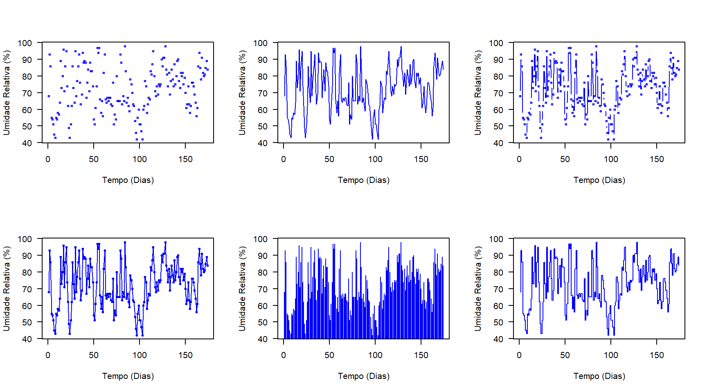

<br>

****

## Eixo secundário

****

### Conjunto de dados


```r
TM=c(23.4,19.8,12.8,16.3,20.8,17.4,20.0,21.8,21.8,20.6,20.3,20.6,20.4,18.1,20.2,19.3,17.2,20.8,20.7,17.4,21.8,23.8,25.8,26.3,25.3,24.5,21.4,23.3,24.3,21.2,24.3,23.6,23.5,22.3,21.4,19.7,22.1,20.5,22.3,21.8,18.0,21.3,24.1,23.9,23.6,23.3,23.2,22.0,22.4,20.8,20.2,22.6,23.7,19.9,19.7,21.4,22.5,21.4,20.4,24.5,22.7,20.3,23.7,24.0,23.6,21.6,22.0,22.6,21.3,22.5,22.2,26.3,27.2,28.3,25.9,25.8,26.6,24.9,20.8,19.4,21.6,22.2,23.8,20.9,22.9,25.0,23.7,23.8,24.8,24.8)
UR=c(68,93,86,55,54,51,45,43,55,54,58,57,64,89,73,80,96,71,86,95,74,62,49,43,51,62,86,73,64,95,68,77,86,93,76,63,69,94,88,89,88,67,76,84,71,88,83,83,74,54,51,61,74,97,94,97,66,58,65,56,82,93,66,64,67,65,67,67,63,62,76,51,57,54,80,65,65,65,93,88,63,68,65,98,83,64,67,62,59,78)
TEMPO=c(1:90)
```

<br>

### Linhas individuais


```r
par(mfrow=c(1,2)) # mudando parâmetro gráfico para plotar dois graficos lado a lado
plot(TM~TEMPO, ylab="Temperatura")
plot(UR~TEMPO, ylab="Umidade relativa")
```

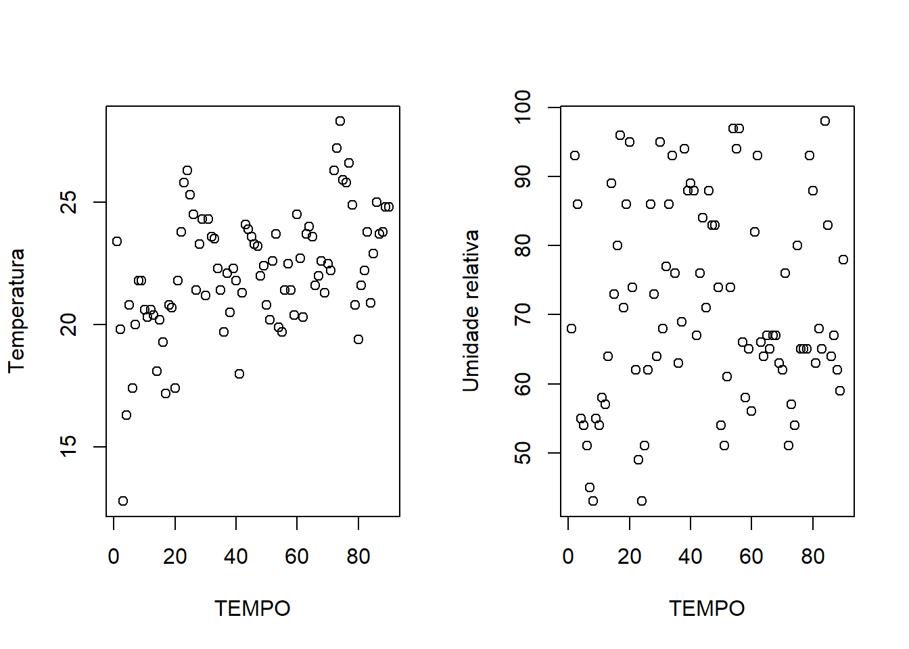

<br>

### Editando gráficos


```r
par(mfrow=c(1,2))
plot(TM~TEMPO, 
     ylim=c(0,50), # mudando escala de Y
     las=2, # deixando marcador de escala na vertical
     type="l", # mudando tipo de gráfico para linhas
     ylab='Temperatura', # modificando nome do eixo Y
     xlab="Tempo (minutos)") # modificando nome do eixo x
plot(UR~TEMPO, 
     ylim=c(0,100), 
     las=2, 
     type="l", 
     xlab="",
     ylab="",
     lty=4) # modificando formato de linha
```

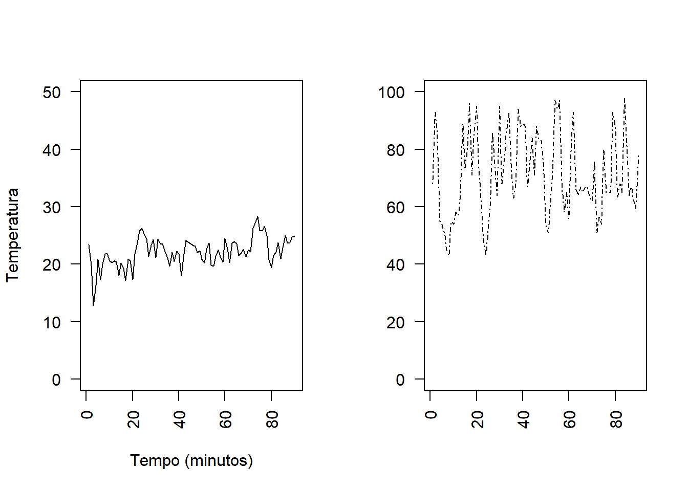

<br>

### Sobrepor os gráficos


```r
par(mar=c(4,4,3,4)) # modificando a largura da margem (inferior, esquerda, superior, direita)
plot(TM~TEMPO, 
     ylim=c(0,50),
     las=2, 
     type="l",
     ylab='Temperatura', 
     xlab="Tempo (minutos)")
par(new=T) # comando para sobrepor gráficos
plot(UR~TEMPO, 
     ylim=c(0,100), 
     las=2, 
     type="l", 
     xlab="",
     ylab="",
     lty=4)
```


<br>

### Marca das escalas 


```r
par(mar=c(4,4,3,4))
plot(TM~TEMPO, 
     ylim=c(0,50),
     las=2, 
     type="l",
     axes=F, # argumento para remover as escalas 
     ylab='Temperatura', 
     xlab="Tempo (minutos)")
par(new=T)
plot(UR~TEMPO, 
     ylim=c(0,100), 
     las=2, 
     type="l", 
     axes=F, # argumento para remover as escalas
     xlab="",
     ylab="",
     lty=4)
```


```r
par(mar=c(4,4,3,4))
plot(TM~TEMPO, 
     ylim=c(0,50),
     las=2, 
     type="l",
     axes=F, 
     lty=1, 
     ylab='Temperatura', 
     xlab="Tempo (minutos)")
par(new=T)
plot(UR~TEMPO, 
     ylim=c(0,100), 
     las=2, 
     type="l", 
     axes=F, 
     xlab="",
     ylab="",
     lty=4)
axis(2,las=2, ylim=c(0,50)) # escala do eixo y primário
axis(4,las=2) # escala do eixo y secundário
axis(side=1,las=1, at=seq(0, 100, by=10)) # escala do eixo x 
```


```r
## Obs. at=seq(0, 100, by=10) estou definindo um intervalo de 0 a 100 como marca a cada 10 unidades
```

<br>

### Nome do eixo Y secundário


```r
par(mar=c(4,4,3,4))
plot(TM~TEMPO, 
     ylim=c(0,50),
     las=2, 
     type="l",
     axes=F, 
     lty=1, 
     ylab='Temperatura', 
     xlab="Tempo (minutos)")
par(new=T)
plot(UR~TEMPO, 
     ylim=c(0,100), 
     las=2, 
     type="l", 
     axes=F, 
     xlab="",
     ylab="",
     lty=4)
axis(4,las=2)
axis(2,las=2)
axis(side=1,las=1, at=seq(0, 100, by=10))
text(par("usr")[2]*1.11,mean(par("usr")[3:4]), "UR (%)", srt = -90, xpd = TRUE, pos = 4)
```


<br>

### Adicionando legenda


```r
par(mar=c(4,4,3,4))
plot(TM~TEMPO, 
     ylim=c(0,50),
     las=2, 
     type="l",
     axes=F, 
     lty=1, 
     ylab='Temperatura', 
     xlab="Tempo (minutos)")
par(new=T)
plot(UR~TEMPO, 
     ylim=c(0,100), 
     las=2, 
     type="l", 
     axes=F, 
     xlab="",
     ylab="",
     lty=4)
axis(4,las=2)
axis(2,las=2)
axis(side=1,las=1, at=seq(0, 100, by=10))
text(par("usr")[2]*1.11,mean(par("usr")[3:4]), "UR (%)", srt = -90, xpd = TRUE, pos = 4)
legend("bottomleft", # posição da legenda
       lty=c(1,4), # formato do tracejado 
       legend=c(expression("Temperatura"^"o"*C),"Umidade Relativa (%)"), 
       bty="n") # caixa da legenda sem margem
```


<br>

### Conjunto de dados

Esse conjunto de dados de temperatura média (TM) e Umidade relativa (UR) foi obtido no site do Instituto Agronômico do Paraná  (http://www.iapar.br/modules/conteudo/conteudo.php?conteudo=1828) no período de 01/09/2018 a 21/02/2019.


```r
TM=c(23.4,19.8,12.8,16.3,20.8,17.4,20.0,21.8,21.8,20.6,20.3,20.6,20.4,18.1,20.2,19.3,17.2,20.8,20.7,17.4,21.8,23.8,25.8,26.3,25.3,24.5,21.4,23.3,24.3,21.2,24.3,23.6,23.5,22.3,21.4,19.7,22.1,20.5,22.3,21.8,18.0,21.3,24.1,23.9,23.6,23.3,23.2,22.0,22.4,20.8,20.2,22.6,23.7,19.9,19.7,21.4,22.5,21.4,20.4,24.5,22.7,20.3,23.7,24.0,23.6,21.6,22.0,22.6,21.3,22.5,22.2,26.3,27.2,28.3,25.9,25.8,26.6,24.9,20.8,19.4,21.6,22.2,23.8,20.9,22.9,25.0,23.7,23.8,24.8,24.8,24.8,25.4,24.4,23.5,24.7,25.3,25.2,23.8,22.8,22.2,26.0,27.8,28.1,25.8,26.8,25.3,25.0,26.6,26.4,26.7,26.8,25.5,24.0,23.2,22.6,23.4,24.5,25.7,25.0,26.4,26.2,26.2,26.9,24.7,25.6,25.0,23.7,22.8,25.5,26.3,26.9,25.1,26.7,25.6,24.5,26.2,26.2,24.4,26.3,25.6,24.4,24.0,26.7,28.2,26.3,26.7,25.4,24.8,24.6,26.3,28.7,28.6,26.3,28.6,29.0,28.2,24.3,23.0,22.9,24.6,26.6,28.5,28.0,25.5,23.2,23.7,23.0,22.4,23.6,23.6,23.5,23.5,22.9,23.5)
UR=c(68,93,86,55,54,51,45,43,55,54,58,57,64,89,73,80,96,71,86,95,74,62,49,43,51,62,86,73,64,95,68,77,86,93,76,63,69,94,88,89,88,67,76,84,71,88,83,83,74,54,51,61,74,97,94,97,66,58,65,56,82,93,66,64,67,65,67,67,63,62,76,51,57,54,80,65,65,65,93,88,63,68,65,98,83,64,67,62,59,78,75,70,63,62,53,46,42,55,60,51,51,47,42,60,62,77,74,58,63,67,66,83,81,87,95,80,71,68,74,69,75,74,75,90,86,91,91,98,84,81,74,82,69,77,84,78,74,87,75,80,89,90,77,73,82,80,82,75,79,70,61,63,74,63,58,62,76,76,74,69,64,56,61,86,94,85,78,91,82,80,81,85,89,84)
TEMPO=c(1:174)
```

<br>

### Linhas individuais

Utilizando o comando plot do próprio pacote *stats* do R podemos fazer um gráfico de linhas para cada uma das variáveis.


```r
plot(TM~TEMPO, 
     type="lines", 
     col="red", las=1)
```


```r
plot(UR~TEMPO, 
     type="lines", 
     col="blue", 
     las=1)
```

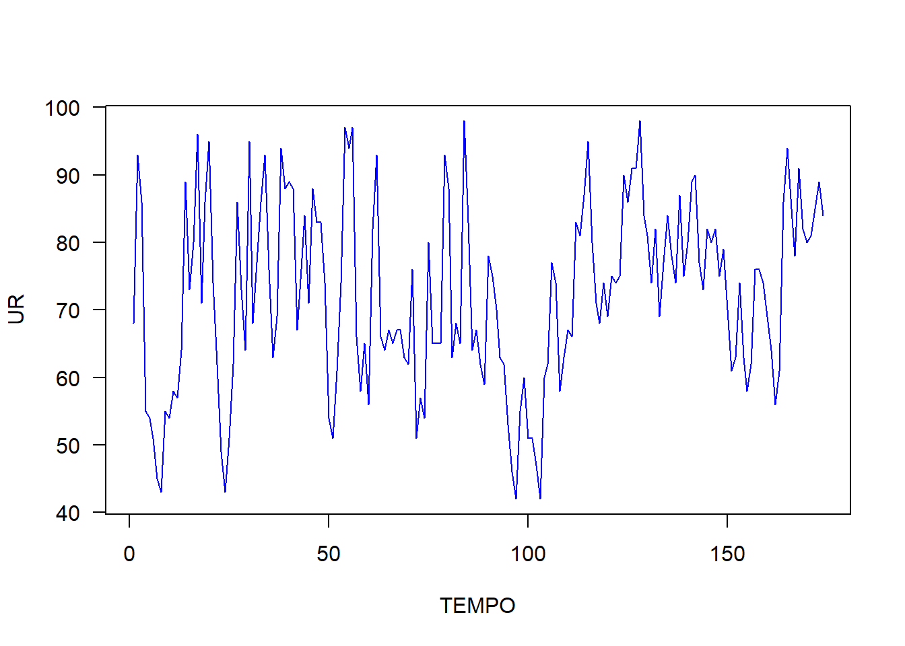

<br>

****

## Usando o pacote ggplot2 

****

Obs. Instalar pacote

### Criando a data.frame


```r
data=data.frame(tempo=TEMPO,Umidade=UR,Temperatura=TM)
attach(data)
library(ggplot2)
```

<br>

### Gráficos individuais


```r
ggplot(data, 
       aes(x = tempo))+
  geom_line(aes(y = Temperatura, 
                colour = "Temperatura"), 
            col="red")+
  xlab("Tempo (dias)")
```


```r
ggplot(data, aes(x = tempo))+geom_line(aes(y = Umidade, colour = "Umidade"), col="blue")+ xlab("Tempo (dias)")
```


<br>

### Juntandos os gráficos


```r
(plots=ggplot(data, aes(x = tempo)) +
  geom_line(aes(y = Umidade, 
                colour = "Umidade"))+  
  scale_x_continuous() + 
  geom_line(aes(y = Temperatura, 
                colour = "Temperatura")))
```

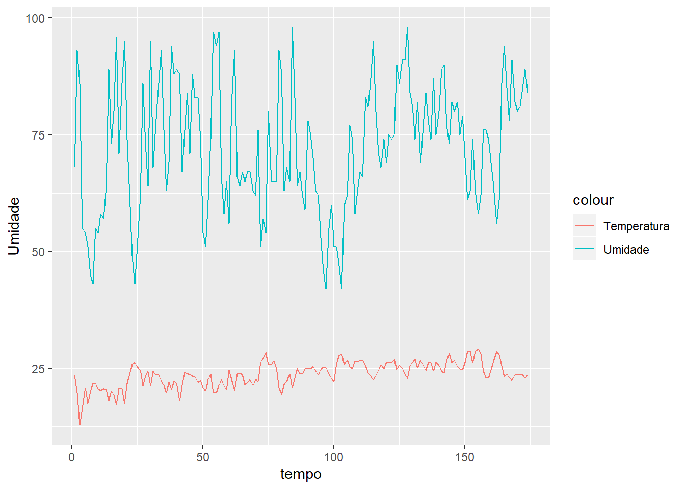

<br>

### Eixo Y secundário


```r
(plots=plots + 
  scale_y_continuous(sec.axis = sec_axis(~ . *1 ), 
    limits = c(0, 100)))
```


<br>

### Nomeando eixo Y 


```r
(plots=plots+ 
  scale_y_continuous(name = expression("Umidade (%)"), 
                     sec.axis = sec_axis(~ . *1 , 
                                         name = expression("Temperatura"^o*"C"))))
```


<br>

### Organizando a legenda


```r
(plots=plots+
   scale_colour_manual("", 
                       breaks = c("Umidade", "Temperatura"), 
                       values = c("red","blue")))
```


<br>

### Linha de grade e cor de fundo


```r
(plots=plots+theme_bw()+
   theme(panel.grid.major = element_blank(), 
         panel.grid.minor = element_blank()))
```

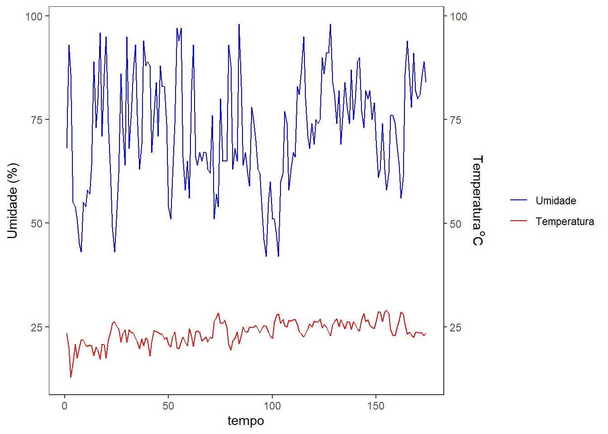

<br><br><br>

****

# Correlação

****

A Matriz de Correlação possibilita a análise simultânea da associação entre variáveis, através do coeficiente de Pearson.

Coeficiente de Pearson

$$\rho = \dfrac{\sum_{i=1}^{n}(x_i-\bar{x})(y_i-\bar{y})}{\sqrt{\sum_{i=1}^n(x_i-\bar{x})^2}\sqrt{\sum_{i=1}^{n}(y_i-\bar{y})^2}}$$


### Conjunto de dados

Variáveis:

- DPF:	Dias para florescimento
- APF:	Altura da planta no florescimento (cm)
- DPM:	Dias para maturação
- APM:	Altura da planta na maturação (cm)
- IPV:	Inserção primeira vagem (cm)
- ACA:	Acamamento 
- PRO:	Produtiviade de grãos em $Kg$ $ha^-1$
- MCG:	Massa de cem grãos (g)


```r
DPF=c(46.00,46.00,46.00,46.00,46.00,46.00,43.00,43.00,43.00,46.00,43.00,43.00,46.00,46.00,46.00,49.00,50.00,46.00,43.00,43.00,46.00,43.00,46.00,43.00,39.00,39.00,43.00,43.00,42.00,45.00,43.00,46.00,46.00,43.00,43.00,43.00,43.00,46.00,43.00,49.00,50.00,43.00,39.00,39.00,39.00)
APF=c(58.33,55.00,50.00,41.00,35.67,43.33,35.67,36.00,35.33,46.67,36.67,49.00,38.33,43.67,44.33,41.00,48.00,43.67,32.67,28.67,36.67,38.33,46.33,53.33,38.00,33.00,32.67,45.67,48.33,46.67,33.67,36.67,42.67,37.00,43.67,35.33,42.33,47.00,47.00,59.67,59.00,48.33,32.33,36.33,33.33)
DPM=c(105.00,105.00,102.00,110.00,110.00,112.00,110.00,110.00,105.00,112.00,112.00,110.00,110.00,112.00,112.00,112.00,112.00,112.00,110.00,105.00,105.00,110.00,102.00,102.00,110.00,105.00,110.00,110.00,110.00,104.00,105.00,105.00,104.00,104.00,104.00,102.00,104.00,105.00,102.00,110.00,112.00,112.00,102.00,102.00,102.00)
APM=c(100.00,90.33,97.00,91.33,97.67,77.33,90.00,93.00,91.33,98.00,84.67,91.33,92.33,101.67,102.33,102.33,98.33,93.00,78.67,72.33,72.33,97.67,104.33,96.00,99.00,97.00,94.33,104.67,115.00,117.67,81.33,82.33,83.00,104.33,107.33,103.00,89.33,90.33,82.33,123.33,115.00,133.33,60.00,59.00,65.67)
IPV=c(15.00,20.00,17.00,10.00,22.67,14.33,23.00,19.33,15.33,14.33,15.00,22.67,14.67,15.33,17.00,13.67,16.67,19.33,11.00,8.67,11.33,13.00,14.67,13.00,13.00,12.00,17.67,14.67,10.67,25.00,18.00,14.00,18.67,15.67,11.00,18.00,16.33,24.33,17.00,13.33,11.00,22.33,10.33,5.67,14.00)
ACA=c(2.00,1.90,2.20,1.50,1.20,1.00,2.00,1.50,1.20,3.00,1.40,1.60,1.80,2.50,2.50,2.00,1.70,1.80,1.50,2.00,1.50,1.80,2.00,1.80,1.30,1.20,2.00,3.00,2.00,3.00,1.50,1.80,2.20,1.80,1.80,2.00,1.80,3.50,3.50,1.50,2.50,2.00,1.20,1.00,1.20)
PRO=c(2444.44,2870.37,2314.81,2629.63,2444.44,2592.59,2962.96,3037.04,3037.04,2592.59,2296.30,2444.44,2370.37,3481.48,2555.56,1981.48,2611.11,1925.93,1870.37,2518.52,2370.37,2462.96,2351.85,2000.00,2703.70,2685.19,2166.67,2129.63,2222.22,1814.81,2537.04,2351.85,2333.33,3370.37,2462.96,3129.63,2666.67,2796.30,2055.56,2333.33,2240.74,2092.59,2703.70,2129.63,2740.74)
MCG=c(10.78,10.96,10.07,10.77,11.17,11.24,12.57,13.35,13.77,14.23,13.61,13.30,11.85,11.80,12.04,10.10,10.19,9.97,12.15,11.35,11.70,12.83,11.52,11.10,10.95,11.14,10.26,12.51,11.87,12.30,14.20,13.13,14.70,13.08,12.76,13.74,14.59,13.98,13.52,12.72,12.22,12.63,10.93,10.65,10.67)
dados=data.frame(DPF,APF,DPM,APM,IPV,ACA,PRO,MCG)
```

<br>

### Matriz de correlação


```r
M<-cor(dados)
head(round(M,2))
```

```
##      DPF  APF  DPM  APM  IPV  ACA   PRO   MCG
## DPF 1,00 0,56 0,39 0,39 0,21 0,33 -0,13 -0,04
## APF 0,56 1,00 0,12 0,57 0,17 0,41 -0,23 -0,03
## DPM 0,39 0,12 1,00 0,37 0,11 0,00 -0,08 -0,09
## APM 0,39 0,57 0,37 1,00 0,32 0,35 -0,09  0,09
## IPV 0,21 0,17 0,11 0,32 1,00 0,36  0,10  0,28
## ACA 0,33 0,41 0,00 0,35 0,36 1,00 -0,14  0,30
```

Instalar pacote corrplot

<br>

### Formato de Círculo


```r
library(corrplot)
corrplot(M, method="circle")
```


<br>

### Formato de quadrado preenchido


```r
corrplot(M, method="color")
```


<br>

### Formato Numérico


```r
corrplot(M, method="number")
```


<br>

### Circulo - matriz superior


```r
corrplot(M, type="upper")
```

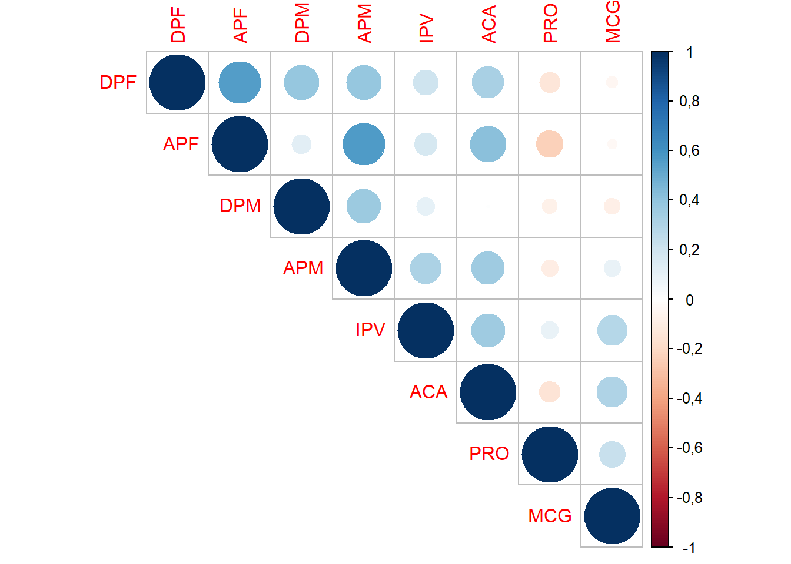

<br>

### Circulo - matriz inferior


```r
corrplot(M, type="lower")
```

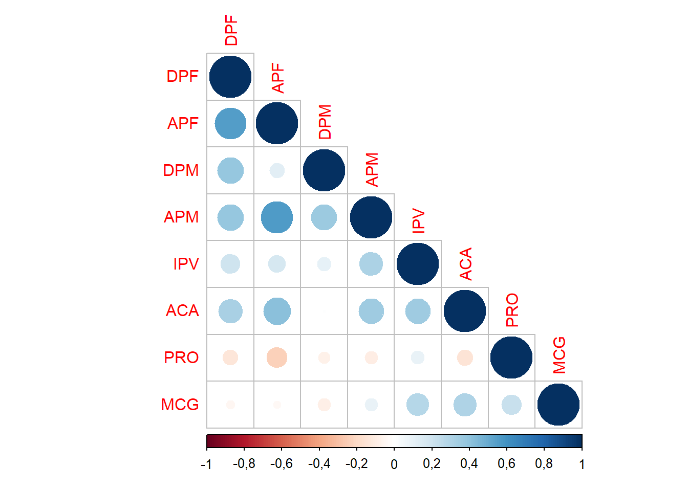

<br>

### Quadrado preenchido, número e sem a diagonal


```r
corrplot(M, method="color",  
         type="upper",
         addCoef.col = "black", insig = "blank", diag=FALSE )
```

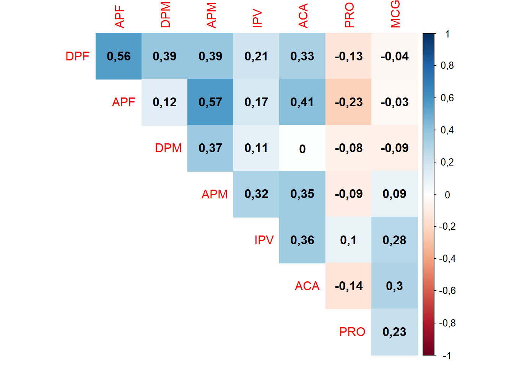

<br>

### Escala cinza


```r
corrplot(M, method="color",  
         type="upper", col=gray.colors(100)[100:1],
         addCoef.col = "black", insig = "blank", diag=FALSE)
```

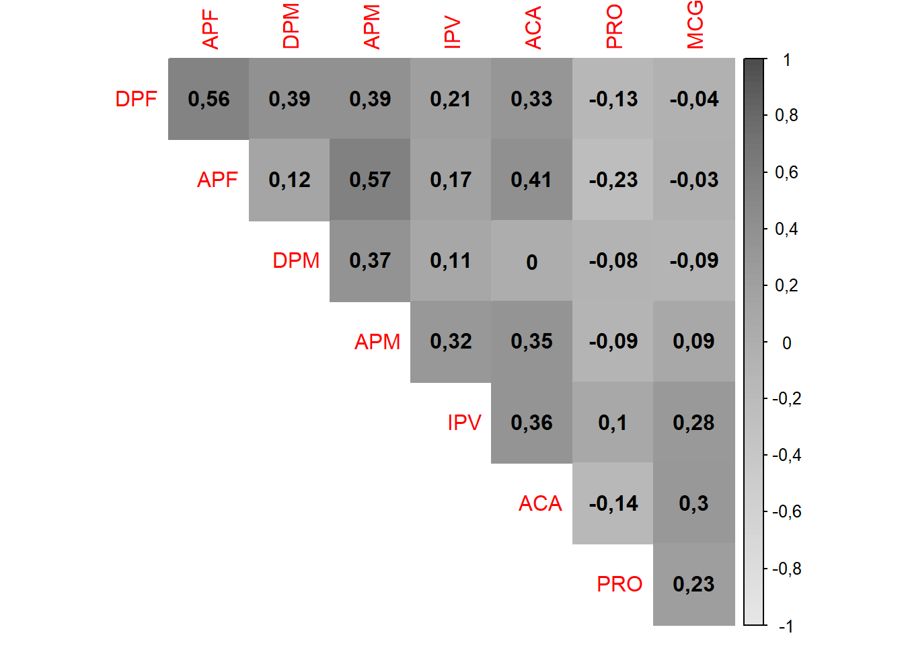

<br>

### Cor da legenda


```r
corrplot(M, method="color", tl.col="black", 
         type="upper", col=gray.colors(100)[100:1],
         addCoef.col = "black", insig = "blank", diag=FALSE )
```

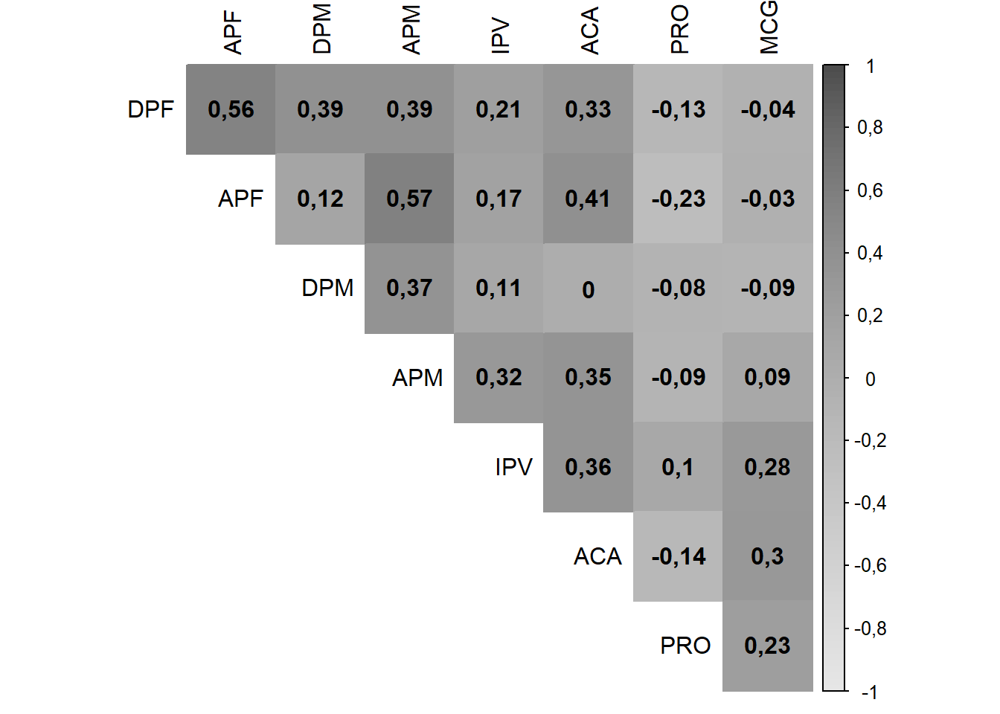

<br>

### Modificando a fonte


```r
par(family="serif")
corrplot(M, method="color", tl.col="black", 
         type="upper", col=gray.colors(100)[100:1],
         addCoef.col = "black", insig = "blank", diag=FALSE )
```


<br>

### Cor do valor da correlação


```r
par(family="serif")
corrplot(M, method="color", tl.col="black", 
         type="upper", col=gray.colors(100)[100:1],
         addCoef.col = "green", insig = "blank", diag=FALSE 
         )
```

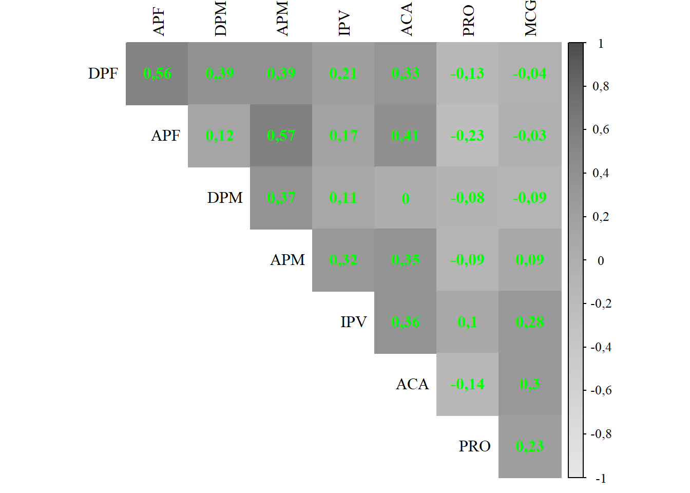

<br><br><br>

****

## Matriz de Correlação

****

<br>

### Conjunto de dados


```r
DPF=c(46.00,46.00,46.00,46.00,46.00,46.00,43.00,43.00,43.00,46.00,43.00,43.00,46.00,46.00,46.00,49.00,50.00,46.00,43.00,43.00,46.00,43.00,46.00,43.00,39.00,39.00,43.00,43.00,42.00,45.00,43.00,46.00,46.00,43.00,43.00,43.00,43.00,46.00,43.00,49.00,50.00,43.00,39.00,39.00,39.00)
APF=c(58.33,55.00,50.00,41.00,35.67,43.33,35.67,36.00,35.33,46.67,36.67,49.00,38.33,43.67,44.33,41.00,48.00,43.67,32.67,28.67,36.67,38.33,46.33,53.33,38.00,33.00,32.67,45.67,48.33,46.67,33.67,36.67,42.67,37.00,43.67,35.33,42.33,47.00,47.00,59.67,59.00,48.33,32.33,36.33,33.33)
DPM=c(105.00,105.00,102.00,110.00,110.00,112.00,110.00,110.00,105.00,112.00,112.00,110.00,110.00,112.00,112.00,112.00,112.00,112.00,110.00,105.00,105.00,110.00,
102.00,102.00,110.00,105.00,110.00,110.00,110.00,104.00,105.00,105.00,104.00,104.00,104.00,102.00,104.00,105.00,102.00,110.00,112.00,112.00,102.00,102.00,102.00)
APM=c(100.00,90.33,97.00,91.33,97.67,77.33,90.00,93.00,91.33,98.00,84.67,91.33,92.33,101.67,102.33,102.33,98.33,93.00,78.67,72.33,72.33,97.67,104.33,96.00,99.00,97.00,94.33,104.67,115.00,117.67,81.33,82.33,83.00,104.33,107.33,103.00,89.33,90.33,82.33,123.33,115.00,133.33,60.00,59.00,65.67)
IPV=c(15.00,20.00,17.00,10.00,22.67,14.33,23.00,19.33,15.33,14.33,15.00,22.67,14.67,15.33,17.00,13.67,16.67,19.33,11.00,8.67,11.33,13.00,14.67,13.00,13.00,12.00,17.67,14.67,10.67,25.00,18.00,14.00,18.67,15.67,11.00,18.00,16.33,24.33,17.00,13.33,11.00,22.33,10.33,5.67,14.00)
ACA=c(2.00,1.90,2.20,1.50,1.20,1.00,2.00,1.50,1.20,3.00,1.40,1.60,1.80,2.50,2.50,2.00,1.70,1.80,1.50,2.00,1.50,1.80,2.00,1.80,1.30,1.20,2.00,3.00,2.00,3.00,1.50,1.80,2.20,1.80,1.80,2.00,1.80,3.50,3.50,1.50,2.50,2.00,1.20,1.00,1.20)
PRO=c(2444.44,2870.37,2314.81,2629.63,2444.44,2592.59,2962.96,3037.04,3037.04,2592.59,2296.30,2444.44,2370.37,3481.48,2555.56,1981.48,2611.11,1925.93,1870.37,2518.52,2370.37,2462.96,2351.85,2000.00,2703.70,2685.19,2166.67,2129.63,2222.22,1814.81,2537.04,2351.85,2333.33,3370.37,2462.96,3129.63,2666.67,2796.30,2055.56,2333.33,2240.74,2092.59,2703.70,2129.63,2740.74)
MCG=c(10.78,10.96,10.07,10.77,11.17,11.24,12.57,13.35,13.77,14.23,13.61,13.30,11.85,11.80,12.04,10.10,10.19,9.97,12.15,11.35,11.70,12.83,11.52,11.10,10.95,11.14,10.26,12.51,11.87,12.30,14.20,13.13,14.70,13.08,12.76,13.74,14.59,13.98,13.52,12.72,12.22,12.63,10.93,10.65,10.67)
```

<br>

### Criando uma data.frame


```r
dados=data.frame(DPF,APF,DPM,APM,IPV,ACA,PRO,MCG)
```

<br>

### Matriz de correlação


```r
corre=cor(dados[c(1:8),c(1:8)])
```

<br>

### Construindo o Gráfico

Instalar pacote (PerformanceAnalytics)


```r
library(PerformanceAnalytics)
chart.Correlation(dados, pch=19)
```

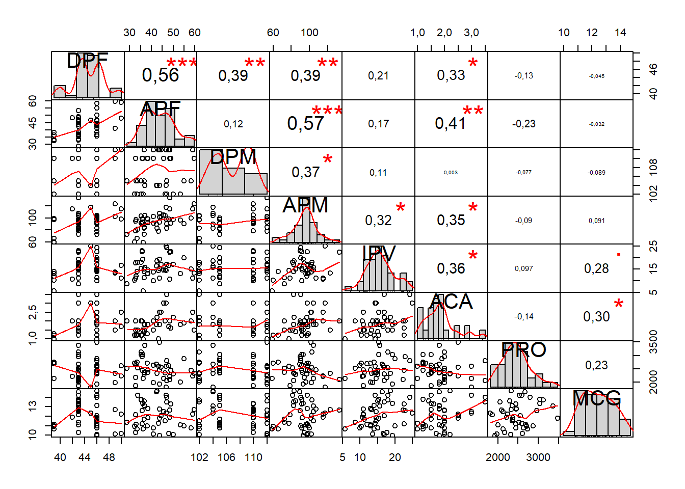

### Conjunto de dados


```r
ph=c(5.4,6.7,6.8,5.9,6.3,6.2,6.3,6,6.1,5.8,6.7,5.7,6.8,6.9,6.5,6.9,6.8,6.7,6.5,6.5,6.7,6.7,6.5,6.7,6.6,6.8,6.4,4.6,6.5,6.6,6.3,6.2,5.5,4.5,5.2,6.5,6.3,6.6,6.4,6.6,6.6,6.5,6.5,6.4,6.5,6.8,6.7,6.6,5.9,6.1,6.3,6.3,6.2,5.3,5.8,6.1,6.7,6.7,6.6,6.6,6.6,6.8,6.8,6.7,6.9,7,7.1,7.1,6.7,6.7,6.6,6.6,6.3,5.8,6.2,6.3,6,5,6.3,5.3,5.4,6.4,6.7,6.5,6.5,6.4,6.7,6.5,6.8,6.2,6.1,6.2,6.8,6.7,6.6,6.4,6.7,6.6,6.4,5.9,6.5,6.6,5.9,6.8,6.8,6.7,6.5,6.7,6.9,6.5,6.8,6.7,6.8,6.6,6.7,6.7,6.9,6.9,6.7,6.8)
HAL=c(4.6,2.7,2.7,3.9,3.4,3.6,3.4,3.9,3.6,3.9,2.5,4.2,2.5,2.5,3.1,2.5,2.5,2.9,3.1,3.1,2.7,2.9,2.9,2.9,3.1,2.7,3.4,8.3,2.9,2.9,3.6,3.1,4.9,8.3,5.3,3.1,2.7,2.7,2.7,2.7,3.1,3.1,2.7,3.1,2.5,2.5,2.9,2.9,3.9,3.9,3.6,3.4,3.9,5.3,3.9,3.9,2.9,2.7,2.9,3.1,2.7,2.1,2.3,2.3,2.3,2.1,2.0,2.1,2.5,2.3,2.5,2.5,3.1,3.6,2.9,2.9,3.4,4.9,2.5,4.6,4.2,2.5,2.3,2.5,2.7,2.5,2.1,2.5,2.1,2.9,2.9,2.9,2.1,2.3,2.5,2.7,2.5,2.5,2.7,3.6,2.7,2.5,3.4,2.0,2.3,2.3,2.7,2.3,2.1,2.5,2.1,2.3,2.3,2.5,2.5,2.3,2.1,2.3,2.3,2.1)
K=c(0.5,0.7,0.7,0.9,0.9,0.8,0.6,0.9,0.8,0.6,0.5,0.4,2.0,1.9,1.0,1.2,1.2,1.6,1.5,0.9,2.0,1.2,1.6,1.4,0.9,0.8,0.8,1.0,0.9,1.1,1.2,1.1,0.6,0.5,0.6,0.9,1.4,1.6,1.3,1.5,0.9,1.2,1.3,1.0,1.4,0.7,0.7,1.0,1.0,0.7,0.8,1.3,0.7,0.7,0.8,0.8,1.3,0.9,1.2,0.8,1.5,1.4,0.8,1.0,1.4,1.1,1.6,1.0,0.9,1.1,1.1,0.9,1.0,0.7,0.6,1.0,1.0,0.7,1.0,0.6,0.9,1.2,0.8,0.8,0.8,0.7,1.1,1.2,0.8,0.9,0.9,1.2,1.1,1.1,1.2,0.9,0.8,0.7,0.9,0.7,0.8,0.9,0.5,0.8,1.0,0.7,0.8,0.7,1.4,0.9,1.4,0.9,1.0,1.3,0.7,1.3,1.4,0.9,0.8,1.4)
P=c(13.7,14.5,65.7,20.5,20.7,19.3,16.2,14.6,15.8,8.7,8.9,7.7,20.0,18.4,9.4,14.8,17.5,11.7,11.2,11.1,51.4,20.4,27.3,14.1,20.1,18.1,23.5,36.4,16.9,18.6,29.0,20.9,16.8,16.8,8.6,11.3,17.5,17.0,30.9,17.2,10.7,17.2,10.9,14.5,26.6,42.1,10.5,13.5,16.4,13.3,34.7,20.0,12.8,15.1,15.8,14.1,26.9,33.2,25.4,25.1,14.1,17.7,12.6,12.9,27.5,18.6,16.9,15.5,16.2,17.6,17.5,14.5,12.6,10.5,10.6,10.5,14.7,10.1,10.7,9.6,17.9,23.9,22.4,22.0,14.2,15.8,12.8,17.8,16.0,10.5,9.6,13.8,17.5,17.7,10.0,10.1,29.0,16.8,18.6,31.7,17.2,40.2,9.8,14.5,28.8,13.0,13.1,18.6,22.0,36.0,19.5,25.2,14.2,15.8,11.9,16.7,20.0,14.7,11.7,17.9)
Ca=c(3.43,4.24,5.37,4.13,4.48,4.65,4.33,4.19,3.91,3.23,4.01,2.98,4.55,4.53,3.91,4.33,4.62,4.54,3.38,3.87,3.85,3.91,3.79,4.57,4.71,4.75,4.93,4.32,4.08,3.73,3.30,3.88,2.59,1.99,2.27,3.68,4.94,5.29,5.69,5.67,4.55,5.01,4.85,4.76,4.99,5.13,4.40,4.38,3.05,3.78,4.21,4.22,3.55,2.81,2.98,3.35,4.03,3.80,3.88,3.97,4.32,4.81,5.06,4.98,5.46,4.88,5.37,5.36,5.41,5.05,5.22,4.95,6.06,3.51,3.72,3.25,2.74,1.78,2.86,2.31,3.63,4.91,4.47,4.85,4.78,6.76,4.31,4.62,4.54,3.10,2.88,3.66,5.56,5.08,4.89,4.67,5.71,5.47,4.68,4.72,4.45,4.23,3.36,4.27,4.31,3.48,3.42,4.38,5.37,7.21,5.40,5.71,4.53,4.35,3.87,3.68,4.18,4.95,4.40,4.84)
Mg=c(2.24,3.22,3.20,2.46,2.51,2.65,2.84,2.80,2.56,2.56,3.45,2.43,3.17,3.25,2.89,3.30,3.34,3.28,2.91,3.00,3.29,2.83,2.89,2.86,2.82,3.15,2.49,2.65,2.95,3.20,2.88,3.10,2.28,1.92,2.05,3.18,3.19,3.13,3.35,3.44,3.27,3.18,3.35,3.24,3.29,3.37,3.21,3.19,2.50,2.01,2.61,2.74,2.42,2.05,2.29,2.36,3.33,3.30,3.03,2.90,2.99,3.34,3.33,3.35,3.30,3.10,3.47,3.30,3.30,3.23,3.25,3.23,3.49,2.40,2.70,2.83,2.78,1.98,2.89,2.30,2.35,3.20,3.45,2.74,2.97,4.56,3.28,2.80,3.03,2.79,2.68,2.95,3.43,3.38,3.30,3.13,3.25,3.06,2.99,2.49,2.84,2.81,2.22,3.48,3.08,2.80,2.62,2.79,3.30,3.39,3.23,3.14,3.31,2.94,3.03,3.17,2.98,3.38,3.13,3.21)
V=c(57.27,75.06,77.30,65.31,69.75,68.82,69.49,66.52,66.47,61.75,75.94,57.72,79.32,79.29,71.24,77.71,78.33,76.18,71.19,71.14,76.94,72.96,73.78,75.10,72.70,76.02,70.72,48.85,73.04,73.25,66.68,71.78,52.34,34.52,48.24,70.98,77.75,78.59,79.11,79.57,73.40,74.76,77.59,73.97,79.17,78.45,73.85,74.40,62.52,62.12,67.51,70.86,62.69,51.35,60.67,62.34,74.62,74.63,73.41,70.85,76.35,81.43,79.59,79.78,81.17,80.69,83.74,81.62,79.09,79.87,79.09,78.23,76.80,64.16,70.53,70.54,65.82,47.34,72.73,53.10,61.80,78.52,78.78,76.85,75.73,82.58,80.00,77.24,79.24,69.95,68.90,72.68,82.19,80.29,78.75,76.06,79.42,78.49,75.87,68.39,74.74,75.88,64.04,80.92,78.00,74.94,71.55,76.95,82.11,81.94,82.16,80.58,78.89,77.11,75.13,77.63,79.68,79.73,77.91,81.24)
dados=data.frame(ph,HAL,K,P,Ca,Mg,V)
```

<br>

### Usando o GGally


```r
library(GGally)
ggpairs(dados)
```


<br>

### Usando a package psych


```r
library(psych)
pairs.panels(dados)
```

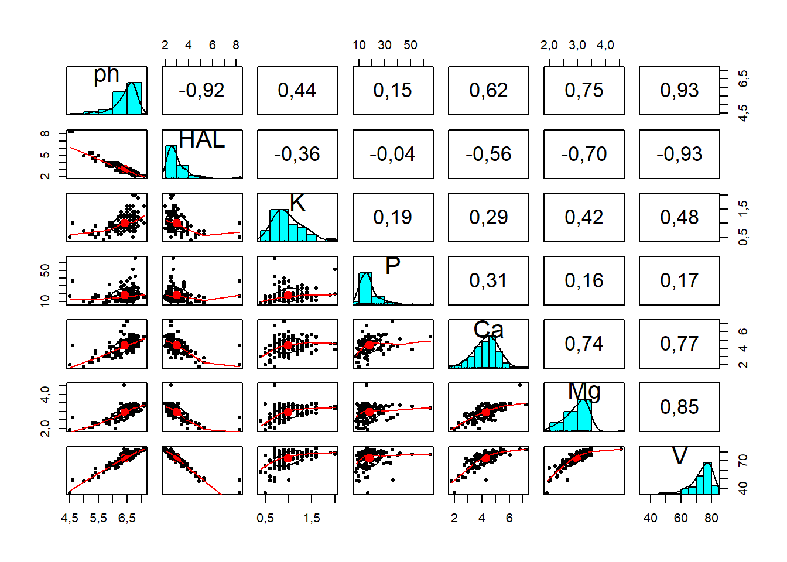

<br><br>

****

## Rede de correlação

****

### Conjunto de dados


```r
DPF=c(46.00,46.00,46.00,46.00,46.00,46.00,43.00,43.00,43.00,46.00,43.00,43.00,46.00,46.00,46.00,49.00,50.00,46.00,43.00,43.00,46.00,43.00,46.00,43.00,39.00,39.00,43.00,43.00,42.00,45.00,43.00,46.00,46.00,43.00,43.00,43.00,43.00,46.00,43.00,49.00,50.00,43.00,39.00,39.00,39.00)
APF=c(58.33,55.00,50.00,41.00,35.67,43.33,35.67,36.00,35.33,46.67,36.67,49.00,38.33,43.67,44.33,41.00,48.00,43.67,32.67,28.67,36.67,38.33,46.33,53.33,38.00,33.00,32.67,45.67,48.33,46.67,33.67,36.67,42.67,37.00,43.67,35.33,42.33,47.00,47.00,59.67,59.00,48.33,32.33,36.33,33.33)
DPM=c(105.00,105.00,102.00,110.00,110.00,112.00,110.00,110.00,105.00,112.00,112.00,110.00,110.00,112.00,112.00,112.00,112.00,112.00,110.00,105.00,105.00,110.00,102.00,102.00,110.00,105.00,110.00,110.00,110.00,104.00,105.00,105.00,104.00,104.00,104.00,102.00,104.00,105.00,102.00,110.00,112.00,112.00,102.00,102.00,102.00)
APM=c(100.00,90.33,97.00,91.33,97.67,77.33,90.00,93.00,91.33,98.00,84.67,91.33,92.33,101.67,102.33,102.33,98.33,93.00,78.67,72.33,72.33,97.67,104.33,96.00,99.00,97.00,94.33,104.67,115.00,117.67,81.33,82.33,83.00,104.33,107.33,103.00,89.33,90.33,82.33,123.33,115.00,133.33,60.00,59.00,65.67)
IPV=c(15.00,20.00,17.00,10.00,22.67,14.33,23.00,19.33,15.33,14.33,15.00,22.67,14.67,15.33,17.00,13.67,16.67,19.33,11.00,8.67,11.33,13.00,14.67,13.00,13.00,12.00,17.67,14.67,10.67,25.00,18.00,14.00,18.67,15.67,11.00,18.00,16.33,24.33,17.00,13.33,11.00,22.33,10.33,5.67,14.00)
ACA=c(2.00,1.90,2.20,1.50,1.20,1.00,2.00,1.50,1.20,3.00,1.40,1.60,1.80,2.50,2.50,2.00,1.70,1.80,1.50,2.00,1.50,1.80,2.00,1.80,1.30,1.20,2.00,3.00,2.00,3.00,1.50,1.80,2.20,1.80,1.80,2.00,1.80,3.50,3.50,1.50,2.50,2.00,1.20,1.00,1.20)
PRO=c(2444.44,2870.37,2314.81,2629.63,2444.44,2592.59,2962.96,3037.04,3037.04,2592.59,2296.30,2444.44,2370.37,3481.48,2555.56,1981.48,2611.11,1925.93,1870.37,2518.52,2370.37,2462.96,2351.85,2000.00,2703.70,2685.19,2166.67,2129.63,2222.22,1814.81,2537.04,2351.85,2333.33,3370.37,2462.96,3129.63,2666.67,2796.30,2055.56,2333.33,2240.74,2092.59,2703.70,2129.63,2740.74)
MCG=c(10.78,10.96,10.07,10.77,11.17,11.24,12.57,13.35,13.77,14.23,13.61,13.30,11.85,11.80,12.04,10.10,10.19,9.97,12.15,11.35,11.70,12.83,11.52,11.10,10.95,11.14,10.26,12.51,11.87,12.30,14.20,13.13,14.70,13.08,12.76,13.74,14.59,13.98,13.52,12.72,12.22,12.63,10.93,10.65,10.67)
```

<br>

### Criando uma data.frame


```r
dados=data.frame(DPF,APF,DPM,APM,IPV,ACA,PRO,MCG)
```

<br>

### Matriz de correlação (Pearson)


```r
corre=cor(dados[c(1:8),c(1:8)])
```

<br>

### Construindo o Gráfico

Instalar pacote (qgraph)


```r
library(qgraph)
```

```
## Error : invalid version specification '1,5'
```

```r
qgraph(corre, shape="circle", 
       posCol="darkgreen", 
       negCol="darkred", layout="groups", vsize=10)
```

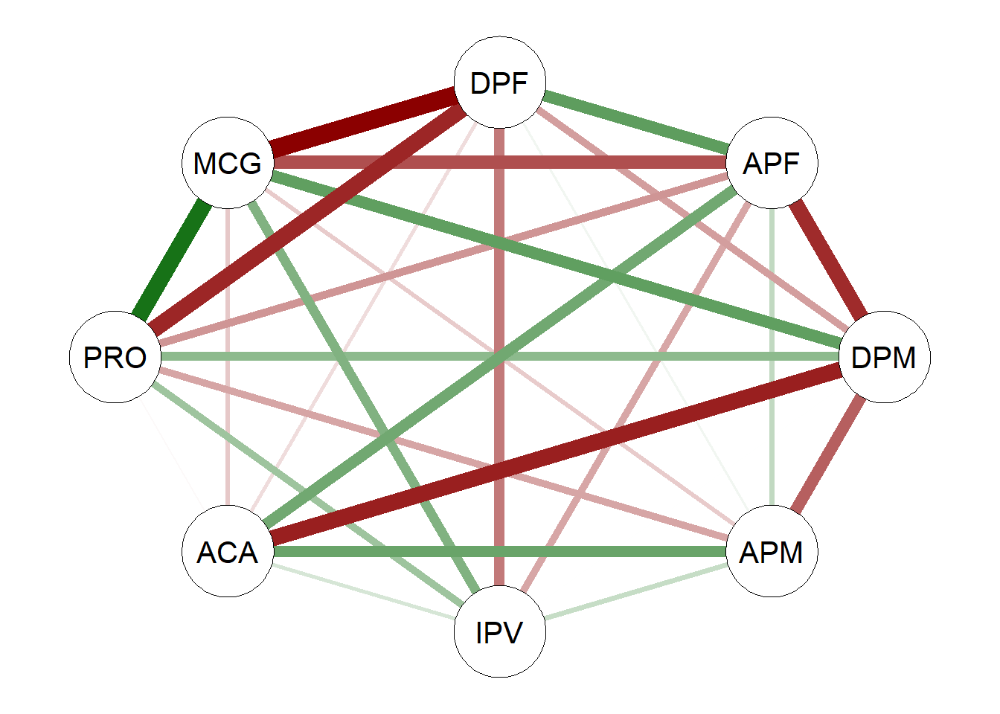

<br>

### Matriz de correlação (Kendall)


```r
corre=cor(dados[c(1:8),c(1:8)], method = "kendall")
```

<br>

### Construindo o Gráfico

Instalar pacote (qgraph)


```r
library(qgraph)
qgraph(corre, shape="circle", 
       posCol="darkgreen", 
       negCol="darkred", layout="groups", vsize=10)
```


<br>

### Matriz de correlação (Spearman)


```r
corre=cor(dados[c(1:8),c(1:8)], method = "spearman")
```

<br>

### Construindo o Gráfico

Instalar pacote (qgraph)


```r
library(qgraph)
qgraph(corre, shape="circle", 
       posCol="darkgreen", 
       negCol="darkred", layout="groups", vsize=10)
```

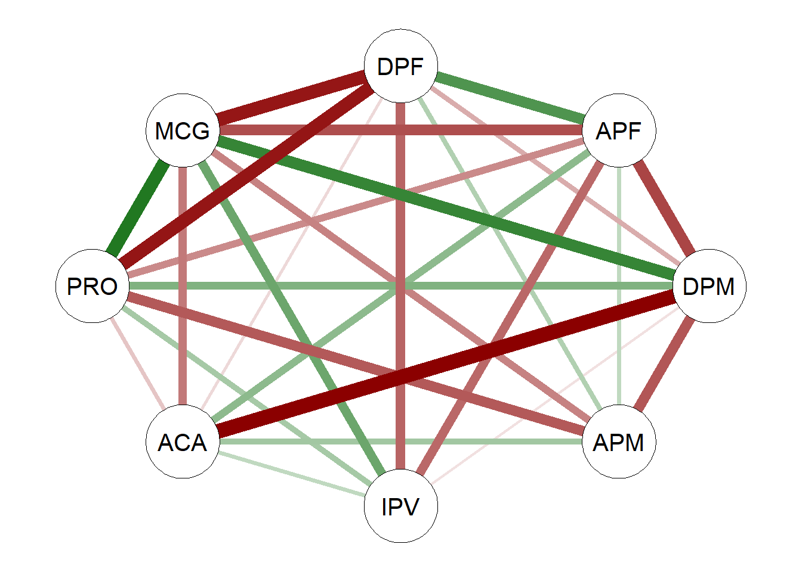

<br><br><br>

****

# Radar

****

<br>

Um gráfico de radar é um método gráfico de apresentar dados multivariáveis na forma de um gráfico bidimensional de três ou mais variáveis quantitativas representadas em eixos que partem do mesmo ponto. A posição relativa e o ãngulo dos eixos normalmente é pouco informativo.

O gráfico de radar é também conhecido como gráfico de teia, gráfico de aranha, gráfico de estrela, polígono irregular, gráfico polar, ou diagrama Kiviat.

<br>

### Conjunto de dados


```r
cor=c(6,6,6,7,7,7,3,4,3,3,3,3,6,6,7,6,6,7,6,7,5,6,5,3,3,5,5,5,3,3)
aroma=c(6,7,5,6,6,7,3,3,3,3,5,3,4,6,6,6,5,7,5,6,5,3,3,6,4,4,5,5,4,3)
sabor=c(5,6,6,6,5,6,3,4,3,4,2,2,3,6,7,6,7,7,6,6,5,4,5,3,6,6,5,5,4,6)
corpo=c(6,5,4,6,4,5,4,4,4,5,2,4,6,6,5,6,6,7,5,6,4,5,5,4,4,5,5,4,2,4)
global=c(5,6,6,7,5,6,3,4,3,3,2,3,4,6,6,6,6,7,6,6,5,6,5,5,4,5,5,4,3,5)
(Amostra=rep(c(paste("A", 1:5)), e=6))
```

```
##  [1] "A 1" "A 1" "A 1" "A 1" "A 1" "A 1" "A 2" "A 2" "A 2" "A 2" "A 2" "A 2"
## [13] "A 3" "A 3" "A 3" "A 3" "A 3" "A 3" "A 4" "A 4" "A 4" "A 4" "A 4" "A 4"
## [25] "A 5" "A 5" "A 5" "A 5" "A 5" "A 5"
```

```r
dados=data.frame(Amostra, cor, aroma, sabor, corpo, global)
```

**Tratamentos**:

- B100: 100% de B (Amostra A1)
- N100: 100% de N (Amostra A2)
- B75N25: 75% de B e 25% de N (Amostra A3)
- B50N50: 50% de B e 50% de N (Amostra A4)
- B25N75: 25% de B e 75% de N (Amostra A5)

### Média por variável


```r
mediacor=tapply(cor, Amostra, mean)
mediaaroma=tapply(aroma, Amostra, mean)
mediasabor=tapply(sabor, Amostra, mean)
mediacorpo=tapply(corpo, Amostra, mean)
mediaglobal=tapply(global, Amostra, mean)
medias=c(mediacor,mediaaroma, mediasabor,mediacorpo,mediaglobal)
```

<br>

### Pacote radarchart

<br>

### Lista com as médias

<br>


```r
labs=c("Cor","Aroma","Sabor","Corpo","Global")
scores=list("B100"=as.numeric(medias[c(1,6,11,16,21)]),
            "N100"=as.numeric(medias[c(2,7,12,17,22)]),
            "B75N25"=as.numeric(medias[c(3,8,13,18,23)]),  
            "B50N50"=as.numeric(medias[c(4,9,14,19,24)]),
            "B25N75"=as.numeric(medias[c(5,10,15,20,25)]))
```

Instalar pacote radarchart


```r
library(radarchart)
chartJSRadar(scores = scores,
             labs=labs, 
             plwd=4 , 
             plty=1,
             axistype=0, 
             maxmin=F,
             cglcol="grey", 
             cglty=1, 
             axislabcol="grey", 
             caxislabels=seq(0,20,5), 
             cglwd=0.8,
             vlcex=0.8)
```

<!--html_preserve--><canvas id="htmlwidget-1e064003c72134332329" class="chartJSRadar html-widget" width="672" height="480"></canvas>
<script type="application/json" data-for="htmlwidget-1e064003c72134332329">{"x":{"data":{"labels":["Cor","Aroma","Sabor","Corpo","Global"],"datasets":[{"label":"B100","data":[6.5,6.16666666666667,5.66666666666667,5,5.83333333333333],"backgroundColor":"rgba(255,0,0,0,2)","borderColor":"rgba(255,0,0,0,8)","pointBackgroundColor":"rgba(255,0,0,0,8)","pointBorderColor":"#fff","pointHoverBackgroundColor":"#fff","pointHoverBorderColor":"rgba(255,0,0,0,8)"},{"label":"N100","data":[3.16666666666667,3.33333333333333,3,3.83333333333333,3],"backgroundColor":"rgba(0,255,0,0,2)","borderColor":"rgba(0,255,0,0,8)","pointBackgroundColor":"rgba(0,255,0,0,8)","pointBorderColor":"#fff","pointHoverBackgroundColor":"#fff","pointHoverBorderColor":"rgba(0,255,0,0,8)"},{"label":"B75N25","data":[6.33333333333333,5.66666666666667,6,6,5.83333333333333],"backgroundColor":"rgba(0,0,255,0,2)","borderColor":"rgba(0,0,255,0,8)","pointBackgroundColor":"rgba(0,0,255,0,8)","pointBorderColor":"#fff","pointHoverBackgroundColor":"#fff","pointHoverBorderColor":"rgba(0,0,255,0,8)"},{"label":"B50N50","data":[5.33333333333333,4.66666666666667,4.83333333333333,4.83333333333333,5.5],"backgroundColor":"rgba(255,255,0,0,2)","borderColor":"rgba(255,255,0,0,8)","pointBackgroundColor":"rgba(255,255,0,0,8)","pointBorderColor":"#fff","pointHoverBackgroundColor":"#fff","pointHoverBorderColor":"rgba(255,255,0,0,8)"},{"label":"B25N75","data":[4,4.16666666666667,5.33333333333333,4,4.33333333333333],"backgroundColor":"rgba(255,0,255,0,2)","borderColor":"rgba(255,0,255,0,8)","pointBackgroundColor":"rgba(255,0,255,0,8)","pointBorderColor":"#fff","pointHoverBackgroundColor":"#fff","pointHoverBorderColor":"rgba(255,0,255,0,8)"}]},"options":{"responsive":true,"title":{"display":false,"text":null},"scale":{"ticks":{"min":0},"pointLabels":{"fontSize":18}},"tooltips":{"enabled":true,"mode":"label"},"legend":{"display":true},"plwd":4,"plty":1,"axistype":0,"maxmin":false,"cglcol":"grey","cglty":1,"axislabcol":"grey","caxislabels":[0,5,10,15,20],"cglwd":0.8,"vlcex":0.8}},"evals":[],"jsHooks":[]}</script><!--/html_preserve-->

<br>

### Pacote plotly

<br>

### Médias por tratamento


```r
B100=c(as.numeric(medias[c(1,6,11,16,21)]))
N100=c(as.numeric(medias[c(2,7,12,17,22)]))
B75N25=c(as.numeric(medias[c(3,8,13,18,23)]))  
B50N50=c(as.numeric(medias[c(4,9,14,19,24)]))
B25N75=c(as.numeric(medias[c(5,10,15,20,25)]))
```

<br>

### Pacote plotly

<center>


```r
library(plotly)
(p <- plot_ly(type = 'scatterpolar',fill = 'toself') %>%
  add_trace(r = B100,theta = c('Cor','Aroma','Sabor', 'Corpo', 'Global'),name = 'B100') %>%
  add_trace(r = N100,theta = c('Cor','Aroma','Sabor', 'Corpo', 'Global'),name = 'N100') %>%
  add_trace(r = B75N25,theta = c('Cor','Aroma','Sabor', 'Corpo', 'Global'),name = 'B75N25') %>%
  add_trace(r = B50N50,theta = c('Cor','Aroma','Sabor', 'Corpo', 'Global'),name = 'B50N50') %>%
  add_trace(r = B25N75,theta = c('Cor','Aroma','Sabor', 'Corpo', 'Global'),name = 'B25N75') %>% layout(polar = list(radialaxis = list(visible = T))))
```

<!--html_preserve--><div id="htmlwidget-a3540d683b69f0d4c71c" style="width:672px;height:480px;" class="plotly html-widget"></div>
<script type="application/json" data-for="htmlwidget-a3540d683b69f0d4c71c">{"x":{"visdat":{"423864706fb4":["function () ","plotlyVisDat"]},"cur_data":"423864706fb4","attrs":{"423864706fb4":{"fill":"toself","alpha_stroke":1,"sizes":[10,100],"spans":[1,20],"type":"scatterpolar"},"423864706fb4.1":{"fill":"toself","alpha_stroke":1,"sizes":[10,100],"spans":[1,20],"type":"scatterpolar","r":[6.5,6.16666666666667,5.66666666666667,5,5.83333333333333],"theta":["Cor","Aroma","Sabor","Corpo","Global"],"name":"B100","inherit":true},"423864706fb4.2":{"fill":"toself","alpha_stroke":1,"sizes":[10,100],"spans":[1,20],"type":"scatterpolar","r":[3.16666666666667,3.33333333333333,3,3.83333333333333,3],"theta":["Cor","Aroma","Sabor","Corpo","Global"],"name":"N100","inherit":true},"423864706fb4.3":{"fill":"toself","alpha_stroke":1,"sizes":[10,100],"spans":[1,20],"type":"scatterpolar","r":[6.33333333333333,5.66666666666667,6,6,5.83333333333333],"theta":["Cor","Aroma","Sabor","Corpo","Global"],"name":"B75N25","inherit":true},"423864706fb4.4":{"fill":"toself","alpha_stroke":1,"sizes":[10,100],"spans":[1,20],"type":"scatterpolar","r":[5.33333333333333,4.66666666666667,4.83333333333333,4.83333333333333,5.5],"theta":["Cor","Aroma","Sabor","Corpo","Global"],"name":"B50N50","inherit":true},"423864706fb4.5":{"fill":"toself","alpha_stroke":1,"sizes":[10,100],"spans":[1,20],"type":"scatterpolar","r":[4,4.16666666666667,5.33333333333333,4,4.33333333333333],"theta":["Cor","Aroma","Sabor","Corpo","Global"],"name":"B25N75","inherit":true}},"layout":{"margin":{"b":40,"l":60,"t":25,"r":10},"polar":{"radialaxis":{"visible":true}},"hovermode":"closest","showlegend":true},"source":"A","config":{"showSendToCloud":false},"data":[{"fillcolor":"rgba(31,119,180,0,5)","fill":"toself","type":"scatterpolar","mode":"markers","marker":{"color":"rgba(31,119,180,1)","line":{"color":"rgba(31,119,180,1)"}},"line":{"color":"rgba(31,119,180,1)"},"frame":null},{"fillcolor":"rgba(255,127,14,0,5)","fill":"toself","type":"scatterpolar","r":[6.5,6.16666666666667,5.66666666666667,5,5.83333333333333],"theta":["Cor","Aroma","Sabor","Corpo","Global"],"name":"B100","mode":"markers","marker":{"color":"rgba(255,127,14,1)","line":{"color":"rgba(255,127,14,1)"}},"line":{"color":"rgba(255,127,14,1)"},"frame":null},{"fillcolor":"rgba(44,160,44,0,5)","fill":"toself","type":"scatterpolar","r":[3.16666666666667,3.33333333333333,3,3.83333333333333,3],"theta":["Cor","Aroma","Sabor","Corpo","Global"],"name":"N100","mode":"markers","marker":{"color":"rgba(44,160,44,1)","line":{"color":"rgba(44,160,44,1)"}},"line":{"color":"rgba(44,160,44,1)"},"frame":null},{"fillcolor":"rgba(214,39,40,0,5)","fill":"toself","type":"scatterpolar","r":[6.33333333333333,5.66666666666667,6,6,5.83333333333333],"theta":["Cor","Aroma","Sabor","Corpo","Global"],"name":"B75N25","mode":"markers","marker":{"color":"rgba(214,39,40,1)","line":{"color":"rgba(214,39,40,1)"}},"line":{"color":"rgba(214,39,40,1)"},"frame":null},{"fillcolor":"rgba(148,103,189,0,5)","fill":"toself","type":"scatterpolar","r":[5.33333333333333,4.66666666666667,4.83333333333333,4.83333333333333,5.5],"theta":["Cor","Aroma","Sabor","Corpo","Global"],"name":"B50N50","mode":"markers","marker":{"color":"rgba(148,103,189,1)","line":{"color":"rgba(148,103,189,1)"}},"line":{"color":"rgba(148,103,189,1)"},"frame":null},{"fillcolor":"rgba(140,86,75,0,5)","fill":"toself","type":"scatterpolar","r":[4,4.16666666666667,5.33333333333333,4,4.33333333333333],"theta":["Cor","Aroma","Sabor","Corpo","Global"],"name":"B25N75","mode":"markers","marker":{"color":"rgba(140,86,75,1)","line":{"color":"rgba(140,86,75,1)"}},"line":{"color":"rgba(140,86,75,1)"},"frame":null}],"highlight":{"on":"plotly_click","persistent":false,"dynamic":false,"selectize":false,"opacityDim":0.2,"selected":{"opacity":1},"debounce":0},"shinyEvents":["plotly_hover","plotly_click","plotly_selected","plotly_relayout","plotly_brushed","plotly_brushing","plotly_clickannotation","plotly_doubleclick","plotly_deselect","plotly_afterplot","plotly_sunburstclick"],"base_url":"https://plot.ly"},"evals":[],"jsHooks":[]}</script><!--/html_preserve-->

</center>


```r
# library(fmsb)
# data=rbind(round(B100,1),
           # round(N100,1),
           # round(B75N25,1),
           # round(B50N50,1),
           # round(B25N75,1))
# rownames(data)=c("B100","N100","B75N25","B50N50","B25N75")
# colnames(data)=c('Cor','Aroma','Sabor', 'Corpo', 'Global')
# data=data.frame(data)
# radarchart(data,axistype = 2)
```

<br><br><br>

****

# Intervalo de confiança

****

<br>

### Conjunto de dados

Um experimento foi realizado com o intuito de avaliar a massa seca da raiz de soja no munícipio de Londrina-PR. O experimento foi instalado em delineamento inteiramente casualizado (DIC), 5 repetições, no esquema fatorial 4 x 2 (4 aplicações de dicloroisocianurato de sódio (DUP) e 2 inoculações de *Rhizobium*).


```r
msraiz=c(4.87, 4.64, 3.71, 3.04, 4.57, 4.13,  3.8, 1.17, 3.28, 1.73, 1.87, 2.85,  3.32, 2.19, 2.33, 4.09, 2.85, 1.86, 2.17, 2.12, 3.03, 3.52, 3.72, 3.09, 5.11,  3.6, 2.14, 2.25, 1.93, 3.35, 2.03, 4.72, 3.39, 3.05, 2.98, 2.53, 5.61, 3.74, 2.89, 4.8)
(Inoculação=rep(c("IN","NI"),e=20))
```

```
##  [1] "IN" "IN" "IN" "IN" "IN" "IN" "IN" "IN" "IN" "IN" "IN" "IN" "IN" "IN" "IN"
## [16] "IN" "IN" "IN" "IN" "IN" "NI" "NI" "NI" "NI" "NI" "NI" "NI" "NI" "NI" "NI"
## [31] "NI" "NI" "NI" "NI" "NI" "NI" "NI" "NI" "NI" "NI"
```

```r
(Época=rep(c("Plantio","V1+15","V3+15","R1+15"),e=5,2))
```

```
##  [1] "Plantio" "Plantio" "Plantio" "Plantio" "Plantio" "V1+15"   "V1+15"  
##  [8] "V1+15"   "V1+15"   "V1+15"   "V3+15"   "V3+15"   "V3+15"   "V3+15"  
## [15] "V3+15"   "R1+15"   "R1+15"   "R1+15"   "R1+15"   "R1+15"   "Plantio"
## [22] "Plantio" "Plantio" "Plantio" "Plantio" "V1+15"   "V1+15"   "V1+15"  
## [29] "V1+15"   "V1+15"   "V3+15"   "V3+15"   "V3+15"   "V3+15"   "V3+15"  
## [36] "R1+15"   "R1+15"   "R1+15"   "R1+15"   "R1+15"
```

```r
F1=as.factor(Inoculação)
F2=as.factor(Época)
Trat=paste(F1,F2)
dados=data.frame(Trat,resp=msraiz)
```

<br>

### Gráfico de linhas


```r
sciplot::lineplot.CI(Trat,msraiz,type="l",las=2,xlab="",ylim=c(0,5),
                     ylab="Massa seca da raiz (g)",
                     cex.lab=1.25,cex.names=1)
```


<br>

### Gráfico de pontos


```r
sciplot::lineplot.CI(Trat,msraiz,type="p",las=2,xlab="",ylim=c(0,5),
                     ylab="Massa seca da raiz (g)",
                     cex.lab=1.25,cex.names=1)
```

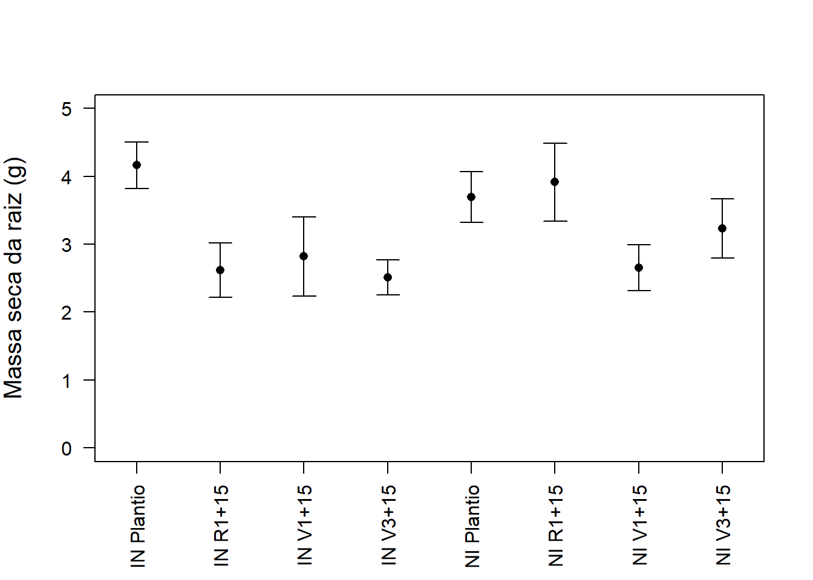

<br>

### Gráfico de linhas e pontos


```r
sciplot::lineplot.CI(Trat,msraiz,type="b",las=2,xlab="",ylim=c(0,5),
                     ylab="Massa seca da raiz (g)",
                     cex.lab=1.25,cex.names=1)
```


<br>

### Gráfico de barras e linhas


```r
sciplot::bargraph.CI(Trat,msraiz,las=2,xlab="",
                     ylab="Massa seca da raiz (g)",ylim=c(0,5),
                     cex.lab = 1.25,col = "black",
                     angle = 45, cex.names = 1,density = c(0,20))
abline(h=0)
```


<br><br><br>

****

# Quantis Teóricos 

****

<br>

### Conjunto de dados

Um experimento foi realizado com o intuito de avaliar a massa seca da raiz de soja no munícipio de Londrina-PR. O experimento foi instalado em delineamento inteiramente casualizado (DIC), 5 repetições, no esquema fatorial 4 x 2 (4 aplicações de dicloroisocianurato de sódio (DUP) e 2 inoculações de *Rhizobium*).


```r
msraiz=c(4.87, 4.64, 3.71, 3.04, 4.57, 4.13,  3.8, 1.17, 3.28, 1.73, 1.87, 2.85, 3.32, 2.19, 2.33, 4.09, 2.85, 1.86, 2.17, 2.12, 3.03, 3.52, 3.72, 3.09,  5.11,  3.6, 2.14, 2.25, 1.93, 3.35, 2.03, 4.72, 3.39, 3.05, 2.98, 2.53, 5.61, 3.74, 2.89, 4.8)
(Inoculação=rep(c("IN","NI"),e=20))
```

```
##  [1] "IN" "IN" "IN" "IN" "IN" "IN" "IN" "IN" "IN" "IN" "IN" "IN" "IN" "IN" "IN"
## [16] "IN" "IN" "IN" "IN" "IN" "NI" "NI" "NI" "NI" "NI" "NI" "NI" "NI" "NI" "NI"
## [31] "NI" "NI" "NI" "NI" "NI" "NI" "NI" "NI" "NI" "NI"
```

```r
(Época=rep(c("Plantio","V1+15","V3+15","R1+15"),e=5,2))
```

```
##  [1] "Plantio" "Plantio" "Plantio" "Plantio" "Plantio" "V1+15"   "V1+15"  
##  [8] "V1+15"   "V1+15"   "V1+15"   "V3+15"   "V3+15"   "V3+15"   "V3+15"  
## [15] "V3+15"   "R1+15"   "R1+15"   "R1+15"   "R1+15"   "R1+15"   "Plantio"
## [22] "Plantio" "Plantio" "Plantio" "Plantio" "V1+15"   "V1+15"   "V1+15"  
## [29] "V1+15"   "V1+15"   "V3+15"   "V3+15"   "V3+15"   "V3+15"   "V3+15"  
## [36] "R1+15"   "R1+15"   "R1+15"   "R1+15"   "R1+15"
```

```r
F1=as.factor(Inoculação)
F2=as.factor(Época)
Trat=paste(F1,F2)
dados=data.frame(Trat,resp=msraiz)
```

<br>

### Análise de variância


```r
mod = with(dados, aov(msraiz~F1*F2))
anova(mod)
```

```
## Analysis of Variance Table
## 
## Response: msraiz
##           Df  Sum Sq Mean Sq F value  Pr(>F)  
## F1         1  1,1868 1,18680  1,2950 0,26358  
## F2         3  8,5762 2,85872  3,1193 0,03961 *
## F1:F2      3  4,9430 1,64766  1,7978 0,16744  
## Residuals 32 29,3268 0,91646                  
## ---
## Signif. codes:  0 '***' 0,001 '**' 0,01 '*' 0,05 '.' 0,1 ' ' 1
```

<br>

### Envelope simulado


```r
hnp::hnp(mod,
         las=1,
         seed=1,
         pch=16)
```

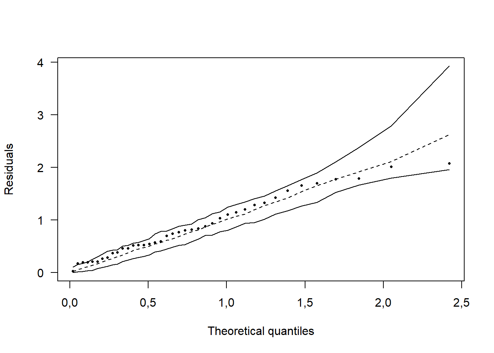

<br>

### Porcentagem de pontos fora


```r
hnp::hnp(mod,
         seed=1,
         las=1, 
         pch=16,
         print.on=T)
```

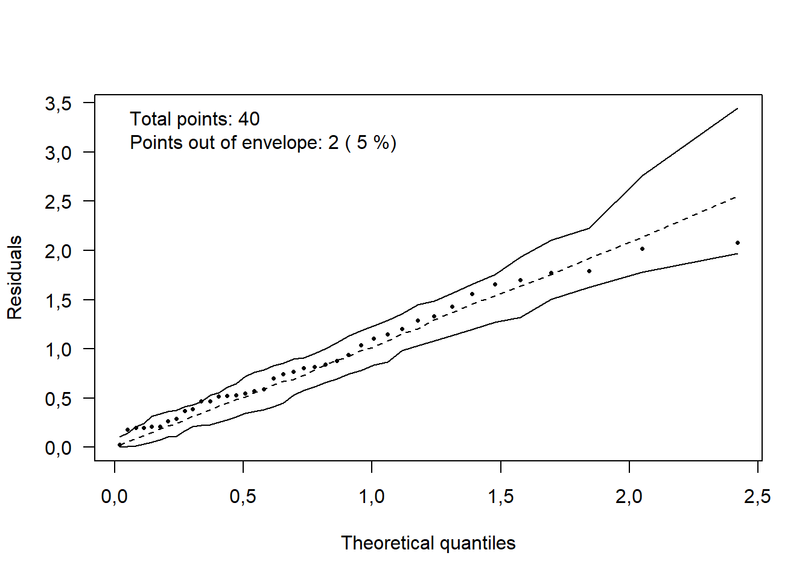

<br>

### Colorir pontos fora 


```r
hnp::hnp(mod, 
         seed=1,
         las=1, 
         pch=16,
         print.on=T,
         paint.out=T, 
         col.paint.out="red")
```

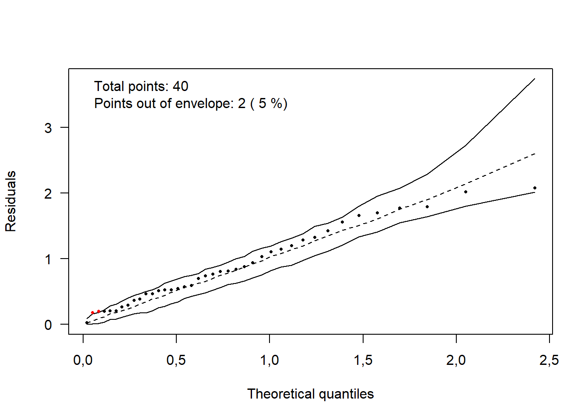

<br><br><br>

****

# Componentes principais

****

A análise de Componentes Principais é um método utilizado para reduzir a dimensão do problema em componentes não correlacionadas que são combinações lineares das variáveis originais. O número dessas componentes é menor ou igual a quantidade de variáveis originais. Esse método é útil quando o número de variáveis em estudo é muito grande.

<br>

****

## Pacote ggforfity

****

### Conjunto de dados


```r
dados <- iris[c(1, 2, 3, 4)]
```

<br>

### Calculando a PCA


```r
(pca=prcomp(dados,scale. = T))
```

```
## Standard deviations (1, .., p=4):
## [1] 1,7083611 0,9560494 0,3830886 0,1439265
## 
## Rotation (n x k) = (4 x 4):
##                     PC1         PC2        PC3        PC4
## Sepal.Length  0,5210659 -0,37741762  0,7195664  0,2612863
## Sepal.Width  -0,2693474 -0,92329566 -0,2443818 -0,1235096
## Petal.Length  0,5804131 -0,02449161 -0,1421264 -0,8014492
## Petal.Width   0,5648565 -0,06694199 -0,6342727  0,5235971
```

<br>

### Dispersão com os autovalores


```r
library(ggfortify)
autoplot(pca,data=iris)
```

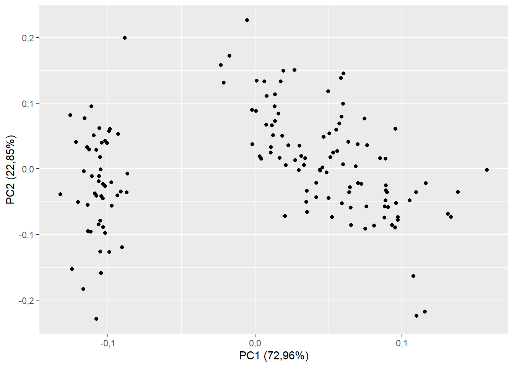

<br>

### Agrupando por espécies

Obs. a coluna de "Species" está na dataset *iris*


```r
library(ggfortify)
autoplot(pca,data=iris,colour="Species")
```


<br>

### Vetor das respostas


```r
library(ggfortify)
autoplot(pca,
         data=iris,
         colour="Species",
         loadings=T)
```

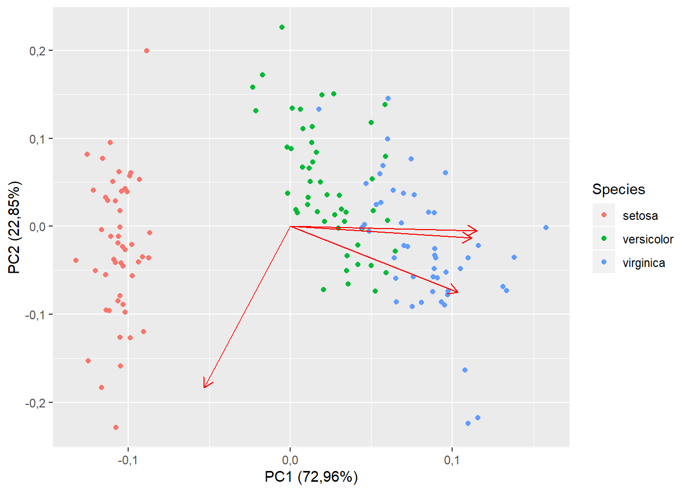

<br>

### Nome dos vetores


```r
library(ggfortify)
autoplot(pca,
         data=iris,
         colour="Species",
         loadings=T,
         loadings.label=T)
```

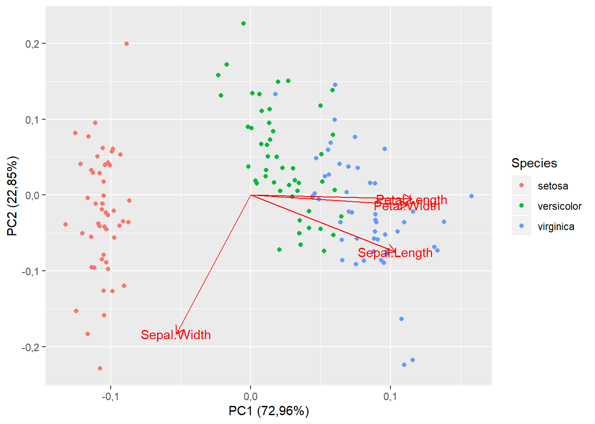

<br>


### Polígono de agrupamento


```r
library(ggfortify)
autoplot(pca,
         data=iris,
         colour="Species",
         loadings=T,
         loadings.label=T,
         frame=T)
```

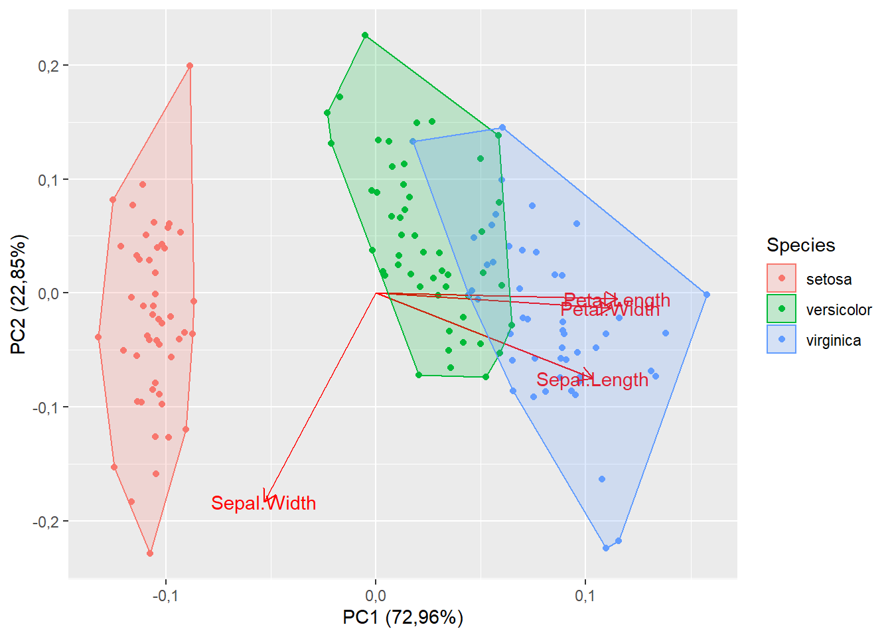

<br>


### Modificando para elipse


```r
library(ggfortify)
autoplot(pca,
         data=iris,
         colour="Species",
         loadings=T,
         loadings.label=T,
         frame=T, 
         frame.type="norm")
```

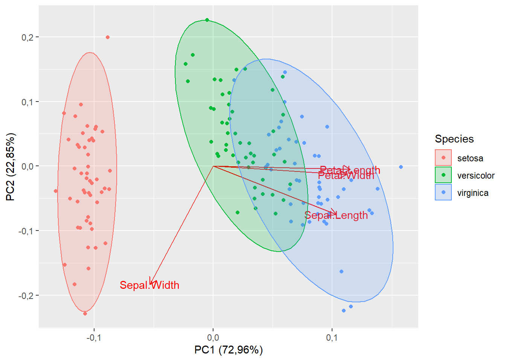

<br>


### Cor do vetor e do nome


```r
library(ggfortify)
autoplot(pca,
         data=iris,
         colour="Species",
         loadings=T,
         loadings.label=T,
         frame=T, 
         frame.type="norm",
         loadings.colour="black",
         loadings.label.colour="black")
```

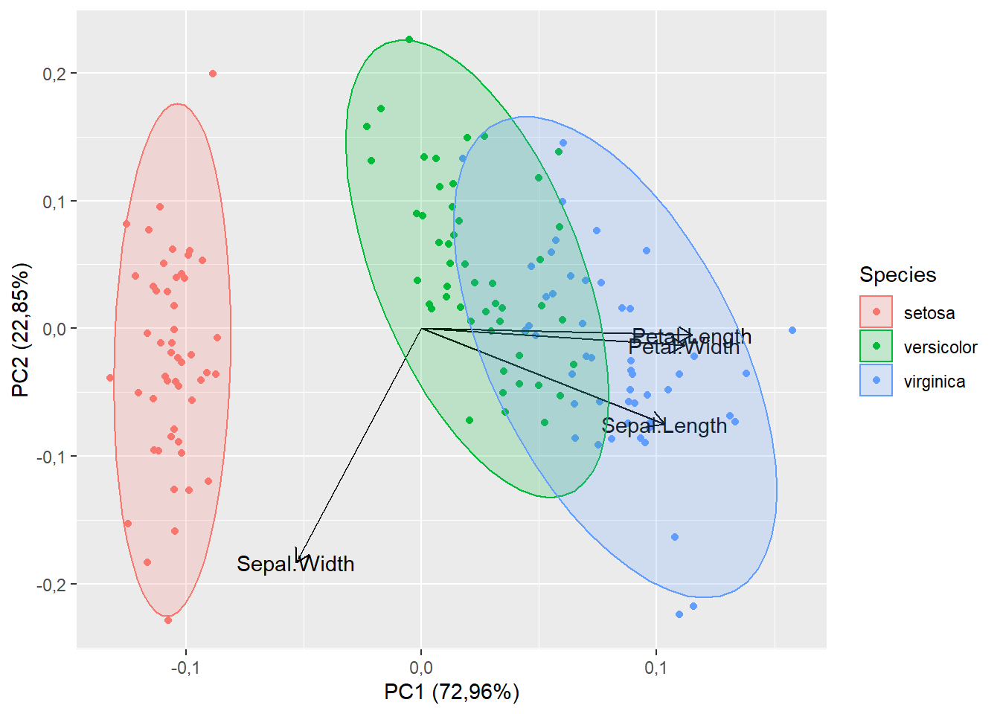

<br>


### fonte; linha de grade e cor de fundo


```r
library(ggfortify)
autoplot(pca,
         data=iris,
         colour="Species",
         loadings=T,
         loadings.label=T,
         frame=T, 
         frame.type="norm",
         loadings.colour="black",
         loadings.label.colour="black",
         loadings.label.family="serif")+theme_bw()+
  theme(text = element_text(family="serif"))
```

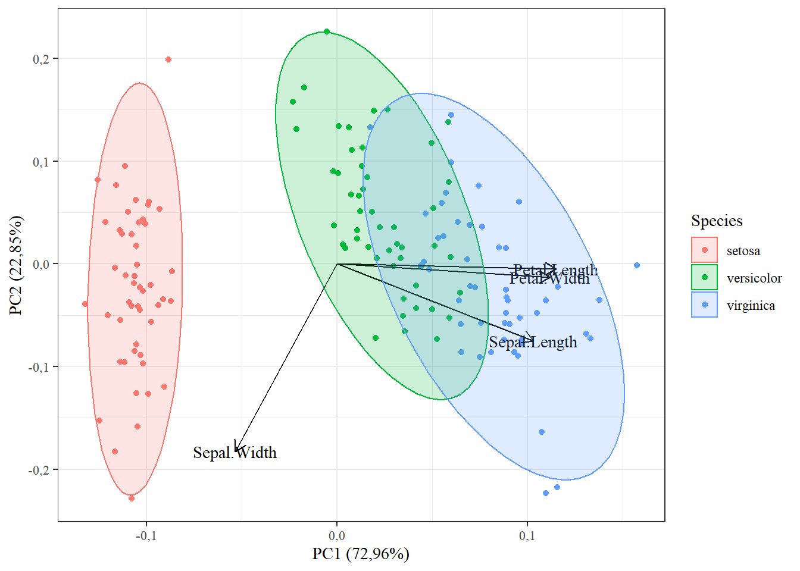

<br>

### Linha em Y=0 e X=0


```r
library(ggfortify)
autoplot(pca,
         data=iris,
         colour="Species",
         loadings=T,
         loadings.label=T,
         frame=T, 
         frame.type="norm",
         loadings.colour="black",
         loadings.label.colour="black",
         loadings.label.family="serif")+theme_bw()+
  theme(text = element_text(family="serif"))+
  geom_vline(,xintercept = 0,linetype=2)+
  geom_hline(,yintercept = 0,linetype=2)
```

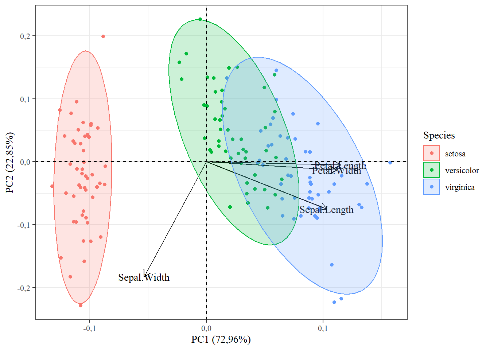

<br><br>

****

## factoextra e factomineR (Biplot)

****

<br>

```r
rm(list=ls())
DPF=c(46.00,46.00,46.00,46.00,46.00,46.00,43.00,43.00,43.00,46.00,43.00,43.00,46.00,46.00,46.00,49.00,50.00,46.00,43.00,43.00,46.00,43.00,46.00,43.00,39.00,39.00,43.00,43.00,42.00,45.00,43.00,46.00,46.00,43.00,43.00,43.00,43.00,46.00,43.00,49.00,50.00,43.00,39.00,39.00,39.00)
APF=c(58.33,55.00,50.00,41.00,35.67,43.33,35.67,36.00,35.33,46.67,36.67,49.00,38.33,43.67,44.33,41.00,48.00,43.67,32.67,28.67,36.67,38.33,46.33,53.33,38.00,33.00,32.67,45.67,48.33,46.67,33.67,36.67,42.67,37.00,43.67,35.33,42.33,47.00,47.00,59.67,59.00,48.33,32.33,36.33,33.33)
DPM=c(105.00,105.00,102.00,110.00,110.00,112.00,110.00,110.00,105.00,112.00,112.00,110.00,110.00,112.00,112.00,112.00,112.00,112.00,110.00,105.00,105.00,110.00,102.00,102.00,110.00,105.00,110.00,110.00,110.00,104.00,105.00,105.00,104.00,104.00,104.00,102.00,104.00,105.00,102.00,110.00,112.00,112.00,102.00,102.00,102.00)
APM=c(100.00,90.33,97.00,91.33,97.67,77.33,90.00,93.00,91.33,98.00,84.67,91.33,92.33,101.67,102.33,102.33,98.33,93.00,78.67,72.33,72.33,97.67,104.33,96.00,99.00,97.00,94.33,104.67,115.00,117.67,81.33,82.33,83.00,104.33,107.33,103.00,89.33,90.33,82.33,123.33,115.00,133.33,60.00,59.00,65.67)
IPV=c(15.00,20.00,17.00,10.00,22.67,14.33,23.00,19.33,15.33,14.33,15.00,22.67,14.67,15.33,17.00,13.67,16.67,19.33,11.00,8.67,11.33,13.00,14.67,13.00,13.00,12.00,17.67,14.67,10.67,25.00,18.00,14.00,18.67,15.67,11.00,18.00,16.33,24.33,17.00,13.33,11.00,22.33,10.33,5.67,14.00)
ACA=c(2.00,1.90,2.20,1.50,1.20,1.00,2.00,1.50,1.20,3.00,1.40,1.60,1.80,2.50,2.50,2.00,1.70,1.80,1.50,2.00,1.50,1.80,2.00,1.80,1.30,1.20,2.00,3.00,2.00,3.00,1.50,1.80,2.20,1.80,1.80,2.00,1.80,3.50,3.50,1.50,2.50,2.00,1.20,1.00,1.20)
PRO=c(2444.44,2870.37,2314.81,2629.63,2444.44,2592.59,2962.96,3037.04,3037.04,2592.59,2296.30,2444.44,2370.37,3481.48,2555.56,1981.48,2611.11,1925.93,1870.37,2518.52,2370.37,2462.96,2351.85,2000.00,2703.70,2685.19,2166.67,2129.63,2222.22,1814.81,2537.04,2351.85,2333.33,3370.37,2462.96,3129.63,2666.67,2796.30,2055.56,2333.33,2240.74,2092.59,2703.70,2129.63,2740.74)
MCG=c(10.78,10.96,10.07,10.77,11.17,11.24,12.57,13.35,13.77,14.23,13.61,13.30,11.85,11.80,12.04,10.10,10.19,9.97,12.15,11.35,11.70,12.83,11.52,11.10,10.95,11.14,10.26,12.51,11.87,12.30,14.20,13.13,14.70,13.08,12.76,13.74,14.59,13.98,13.52,12.72,12.22,12.63,10.93,10.65,10.67)
Tratamento=rep(c(paste("T",1:5)),9)
dados=data.frame(Tratamento,DPF,APF,DPM,APM,IPV,ACA,PRO,MCG)
```

<br>

### Valores dos CP


```r
require(FactoMineR)
pca=PCA(dados[c(2,3,4,5,6,7,9)],scale.unit=T,graph=F)
round(pca$eig,3)
```

```
##        eigenvalue percentage of variance cumulative percentage of variance
## comp 1      2,648                 37,821                            37,821
## comp 2      1,411                 20,152                            57,974
## comp 3      0,939                 13,418                            71,392
## comp 4      0,650                  9,282                            80,673
## comp 5      0,608                  8,692                            89,365
## comp 6      0,479                  6,842                            96,207
## comp 7      0,266                  3,793                           100,000
```

<br>

### Gráfico básico


```r
require(factoextra)
fviz_pca_biplot(pca,geom = c("point"))
```

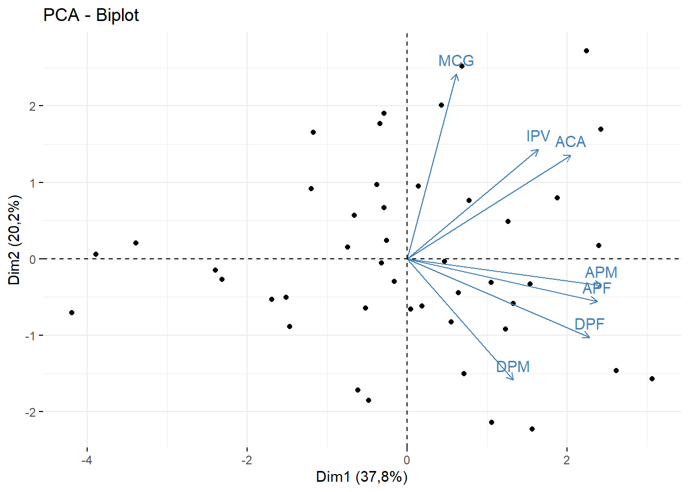

<br>

### Elipse geral


```r
require(factoextra)
fviz_pca_biplot(pca,geom = c("point"),
                addEllipses = T)
```

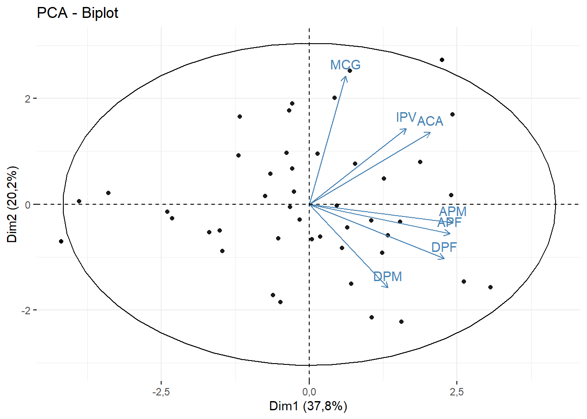

<br>

### Elipse por Tratamentos


```r
require(factoextra)
fviz_pca_biplot(pca,geom = c("point"),
                addEllipses = T, fill.ind = dados$Tratamento)
```

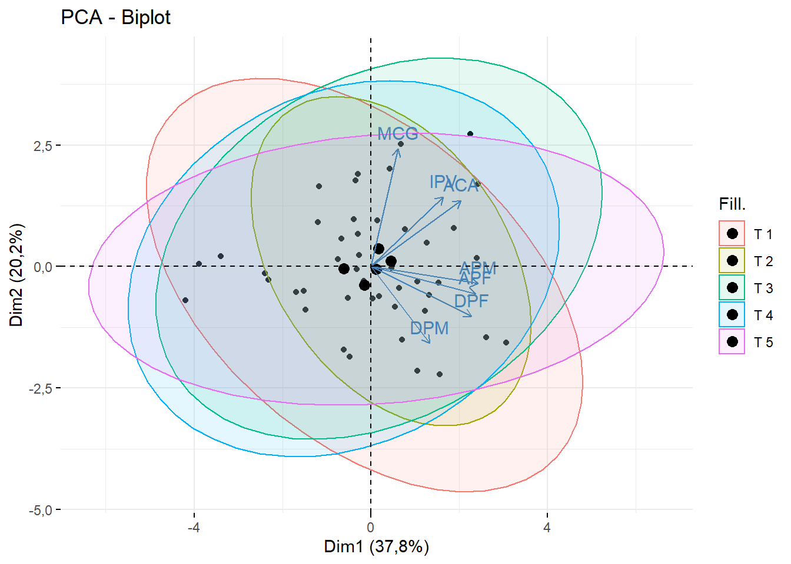

<br>

### Removendo título


```r
require(factoextra)
fviz_pca_biplot(pca,geom = c("point"),
                addEllipses = T, 
                fill.ind = dados$Tratamento,
                title = "")
```

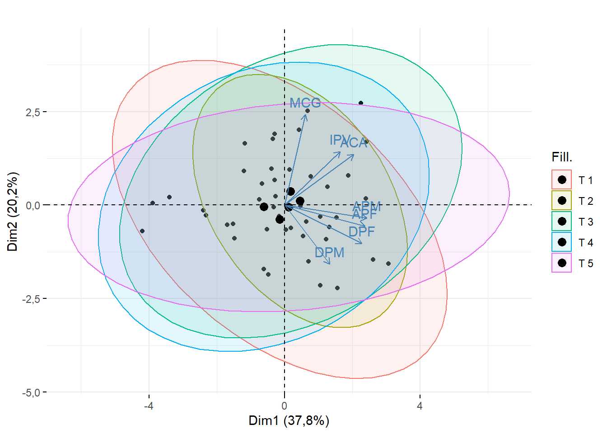

<br>

### Sobreposição de legendas


```r
require(factoextra)
fviz_pca_biplot(pca,geom = c("point"),
                addEllipses = T, ## adicionar elipse
                fill.ind = dados$Tratamento,
                title = "",
                repel=T)
```


<br>

### Tamanho do ponto, letra e a cor


```r
require(factoextra)
fviz_pca_biplot(pca,geom = c("point"),
                addEllipses = T, 
                fill.ind = dados$Tratamento,
                title = "",
                repel=T, 
                pointshape=21,pointsize=2,textsize=0.5, col.var="black")
```


<br>

### Título das ellipses


```r
require(factoextra)
fviz_pca_biplot(pca,geom = c("point"),
                addEllipses = T, 
                fill.ind = dados$Tratamento,
                title = "",
                repel=T, 
                pointshape=21,pointsize=2,textsize=0.5, col.var="black",fill= "Cultivares")
```

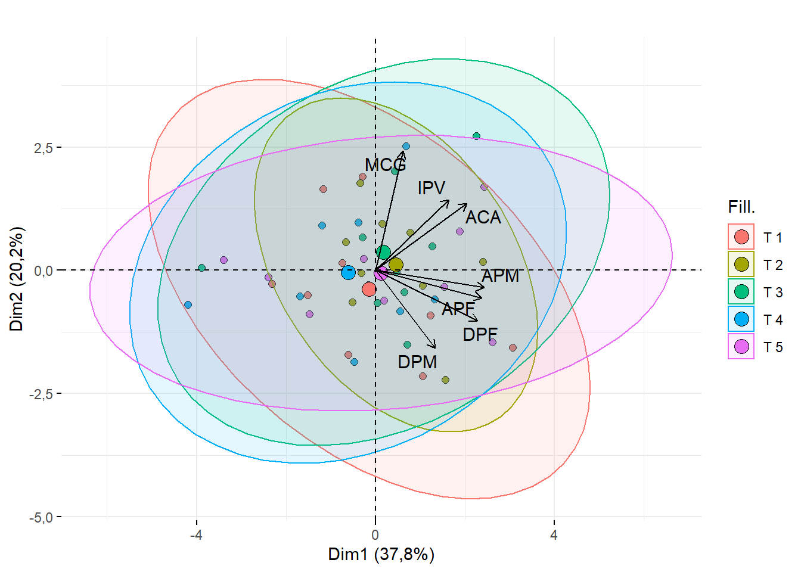

<br>

### Título do 1 e 2 CP


```r
require(factoextra)
fviz_pca_biplot(pca,geom = c("point"),
                addEllipses = T, 
                fill.ind = dados$Tratamento,
                title = "",
                repel=T, 
                pointshape=21,pointsize=2,textsize=0.5,
                col.var="black",fill= "Cultivares")+ylab("CP2(20,2%)")+xlab("CP1(37,8%)")
```

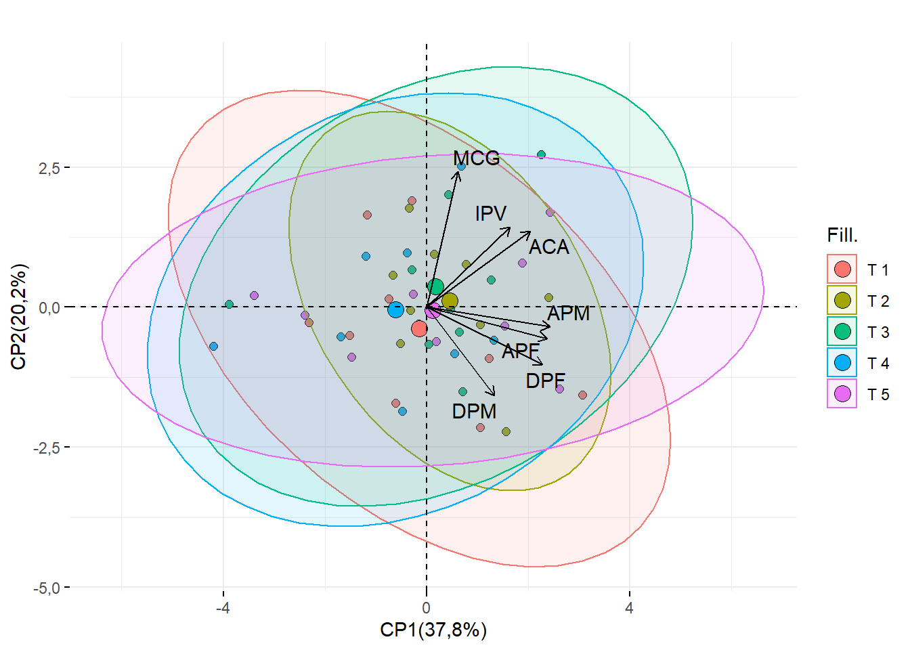

<br><br>

****

## factoextra (Gráficos separados)

****

<br>


### Conjunto de dados


```r
ph=c(5.4,6.7,6.8,5.9,6.3,6.2,6.3,6,6.1,5.8,6.7,5.7,6.8,6.9,6.5,6.9,6.8,6.7,6.5,6.5,6.7,6.7,6.5,6.7,6.6,6.8,6.4,4.6,6.5,6.6,6.3,6.2,5.5,4.5,5.2,6.5,6.3,6.6,6.4,6.6,6.6,6.5,6.5,6.4,6.5,6.8,6.7,6.6,5.9,6.1,6.3,6.3,6.2,5.3,5.8,6.1,6.7,6.7,6.6,6.6,6.6,6.8,6.8,6.7,6.9,7,7.1,7.1,6.7,6.7,6.6,6.6,6.3,5.8,6.2,6.3,6,5,6.3,5.3,5.4,6.4,6.7,6.5,6.5,6.4,6.7,6.5,6.8,6.2,6.1,6.2,6.8,6.7,6.6,6.4,6.7,6.6,6.4,5.9,6.5,6.6,5.9,6.8,6.8,6.7,6.5,6.7,6.9,6.5,6.8,6.7,6.8,6.6,6.7,6.7,6.9,6.9,6.7,6.8)
HAL=c(4.6,2.7,2.7,3.9,3.4,3.6,3.4,3.9,3.6,3.9,2.5,4.2,2.5,2.5,3.1,2.5,2.5,2.9,3.1,3.1,2.7,2.9,2.9,2.9,3.1,2.7,3.4,8.3,2.9,2.9,3.6,3.1,4.9,8.3,5.3,3.1,2.7,2.7,2.7,2.7,3.1,3.1,2.7,3.1,2.5,2.5,2.9,2.9,3.9,3.9,3.6,3.4,3.9,5.3,3.9,3.9,2.9,2.7,2.9,3.1,2.7,2.1,2.3,2.3,2.3,2.1,2.0,2.1,2.5,2.3,2.5,2.5,3.1,3.6,2.9,2.9,3.4,4.9,2.5,4.6,4.2,2.5,2.3,2.5,2.7,2.5,2.1,2.5,2.1,2.9,2.9,2.9,2.1,2.3,2.5,2.7,2.5,2.5,2.7,3.6,2.7,2.5,3.4,2.0,2.3,2.3,2.7,2.3,2.1,2.5,2.1,2.3,2.3,2.5,2.5,2.3,2.1,2.3,2.3,2.1)
K=c(0.5,0.7,0.7,0.9,0.9,0.8,0.6,0.9,0.8,0.6,0.5,0.4,2.0,1.9,1.0,1.2,1.2,1.6,1.5,0.9,2.0,1.2,1.6,1.4,0.9,0.8,0.8,1.0,0.9,1.1,1.2,1.1,0.6,0.5,0.6,0.9,1.4,1.6,1.3,1.5,0.9,1.2,1.3,1.0,1.4,0.7,0.7,1.0,1.0,0.7,0.8,1.3,0.7,0.7,0.8,0.8,1.3,0.9,1.2,0.8,1.5,1.4,0.8,1.0,1.4,1.1,1.6,1.0,0.9,1.1,1.1,0.9,1.0,0.7,0.6,1.0,1.0,0.7,1.0,0.6,0.9,1.2,0.8,0.8,0.8,0.7,1.1,1.2,0.8,0.9,0.9,1.2,1.1,1.1,1.2,0.9,0.8,0.7,0.9,0.7,0.8,0.9,0.5,0.8,1.0,0.7,0.8,0.7,1.4,0.9,1.4,0.9,1.0,1.3,0.7,1.3,1.4,0.9,0.8,1.4)
P=c(13.7,14.5,65.7,20.5,20.7,19.3,16.2,14.6,15.8,8.7,8.9,7.7,20.0,18.4,9.4,14.8,17.5,11.7,11.2,11.1,51.4,20.4,27.3,14.1,20.1,18.1,23.5,36.4,16.9,18.6,29.0,20.9,16.8,16.8,8.6,11.3,17.5,17.0,30.9,17.2,10.7,17.2,10.9,14.5,26.6,42.1,10.5,13.5,16.4,13.3,34.7,20.0,12.8,15.1,15.8,14.1,26.9,33.2,25.4,25.1,14.1,17.7,12.6,12.9,27.5,18.6,16.9,15.5,16.2,17.6,17.5,14.5,12.6,10.5,10.6,10.5,14.7,10.1,10.7,9.6,17.9,23.9,22.4,22.0,14.2,15.8,12.8,17.8,16.0,10.5,9.6,13.8,17.5,17.7,10.0,10.1,29.0,16.8,18.6,31.7,17.2,40.2,9.8,14.5,28.8,13.0,13.1,18.6,22.0,36.0,19.5,25.2,14.2,15.8,11.9,16.7,20.0,14.7,11.7,17.9)
Ca=c(3.43,4.24,5.37,4.13,4.48,4.65,4.33,4.19,3.91,3.23,4.01,2.98,4.55,4.53,3.91,4.33,4.62,4.54,3.38,3.87,3.85,3.91,3.79,4.57,4.71,4.75,4.93,4.32,4.08,3.73,3.30,3.88,2.59,1.99,2.27,3.68,4.94,5.29,5.69,5.67,4.55,5.01,4.85,4.76,4.99,5.13,4.40,4.38,3.05,3.78,4.21,4.22,3.55,2.81,2.98,3.35,4.03,3.80,3.88,3.97,4.32,4.81,5.06,4.98,5.46,4.88,5.37,5.36,5.41,5.05,5.22,4.95,6.06,3.51,3.72,3.25,2.74,1.78,2.86,2.31,3.63,4.91,4.47,4.85,4.78,6.76,4.31,4.62,4.54,3.10,2.88,3.66,5.56,5.08,4.89,4.67,5.71,5.47,4.68,4.72,4.45,4.23,3.36,4.27,4.31,3.48,3.42,4.38,5.37,7.21,5.40,5.71,4.53,4.35,3.87,3.68,4.18,4.95,4.40,4.84)
Mg=c(2.24,3.22,3.20,2.46,2.51,2.65,2.84,2.80,2.56,2.56,3.45,2.43,3.17,3.25,2.89,3.30,3.34,3.28,2.91,3.00,3.29,2.83,2.89,2.86,2.82,3.15,2.49,2.65,2.95,3.20,2.88,3.10,2.28,1.92,2.05,3.18,3.19,3.13,3.35,3.44,3.27,3.18,3.35,3.24,3.29,3.37,3.21,3.19,2.50,2.01,2.61,2.74,2.42,2.05,2.29,2.36,3.33,3.30,3.03,2.90,2.99,3.34,3.33,3.35,3.30,3.10,3.47,3.30,3.30,3.23,3.25,3.23,3.49,2.40,2.70,2.83,2.78,1.98,2.89,2.30,2.35,3.20,3.45,2.74,2.97,4.56,3.28,2.80,3.03,2.79,2.68,2.95,3.43,3.38,3.30,3.13,3.25,3.06,2.99,2.49,2.84,2.81, 2.22,3.48,3.08,2.80,2.62,2.79,3.30,3.39,3.23,3.14,3.31,2.94,3.03,3.17,2.98,3.38,3.13,3.21)
V=c(57.27,75.06,77.30,65.31,69.75,68.82,69.49,66.52,66.47,61.75,75.94,57.72,79.32,79.29,71.24,77.71,78.33,76.18,71.19,71.14,76.94,72.96,73.78,75.10,72.70,76.02,70.72,48.85,73.04,73.25,66.68,71.78,52.34,34.52,48.24,70.98,77.75,78.59,79.11,79.57,73.40,74.76,77.59,73.97,79.17,78.45,73.85,74.40,62.52,62.12,67.51,70.86,62.69,51.35,60.67,62.34,74.62,74.63,73.41,70.85,76.35,81.43,79.59,79.78,81.17,80.69,83.74,81.62,79.09,79.87,79.09,78.23,76.80,64.16,70.53,70.54,65.82,47.34,72.73,53.10,61.80,78.52,78.78,76.85,75.73,82.58,80.00,77.24,79.24,69.95,68.90,72.68,82.19,80.29,78.75,76.06,79.42,78.49,75.87,68.39,74.74,75.88,64.04,80.92,78.00,74.94,71.55,76.95,82.11,81.94,82.16,80.58,78.89,77.11,75.13,77.63,79.68,79.73,77.91,81.24)
Trat=rep(c(paste("T",1:10)), e=12)
dados=data.frame(Trat,ph,HAL,K,P,Ca,Mg,V)
```

### Calculando as médias


```r
mph=tapply(ph, Trat, mean)
mHAL=tapply(HAL, Trat, mean)
mK=tapply(K, Trat, mean)
mP=tapply(P, Trat, mean)
mCa=tapply(Ca, Trat, mean)
mMg=tapply(Mg, Trat, mean)
mV=tapply(V, Trat, mean)
dadosm=data.frame(mph,mHAL,mK,mP,mCa,mMg,mV)
```

<br>

### Dendograma (Definir Clusters)


```r
dend=as.dendrogram(hclust(dist(dadosm), method='average'), hang = -1)
plot(dend)
abline(h=8, lty=2, col="red")
```


```r
## Cluster 1: T8, T10, T6,T9,T2,T4
## Cluster 2: T7, T3, T1, T5
```

<br>

### Valores dos CP


```r
require(FactoMineR)
pca=PCA(dadosm,scale.unit=T,graph=F)
round(pca$eig,3)
```

```
##        eigenvalue percentage of variance cumulative percentage of variance
## comp 1      5,057                 72,243                            72,243
## comp 2      1,037                 14,812                            87,055
## comp 3      0,639                  9,128                            96,183
## comp 4      0,237                  3,387                            99,571
## comp 5      0,022                  0,312                            99,883
## comp 6      0,008                  0,109                            99,992
## comp 7      0,001                  0,008                           100,000
```

<br>

### Gráfico com os vetores


```r
library(factoextra)
fviz_pca_var(pca)
```

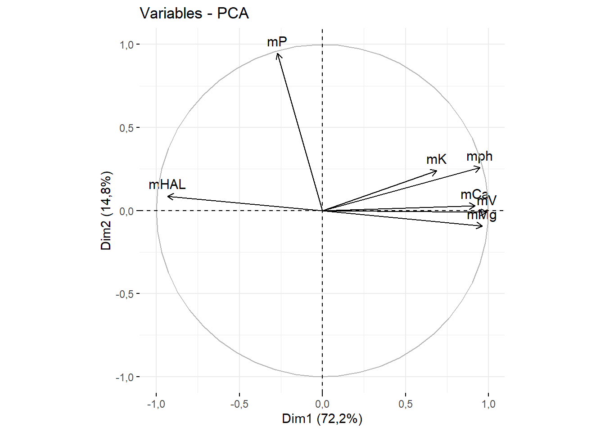

<br>

### Renomeando eixos


```r
fviz_pca_var(pca)+ylab("CP2 (14,9)")+xlab("CP1 (72,3%)")
```


<br>

### Removendo título


```r
fviz_pca_var(pca, title="")+ylab("CP2 (14,9)")+xlab("CP1 (72,3%)")
```

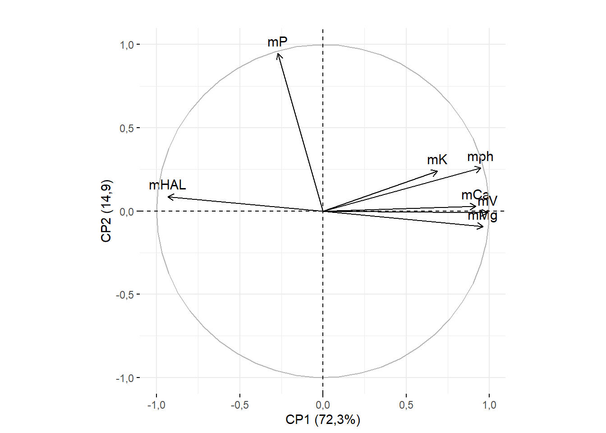

<br>

### Renomeando os vetores


```r
rownames(pca$var$coord)=c("pH","H+AL","K","P","Ca","Mg","V")
fviz_pca_var(pca, title="")+ylab("CP2 (14,9)")+xlab("CP1 (72,3%)")
```

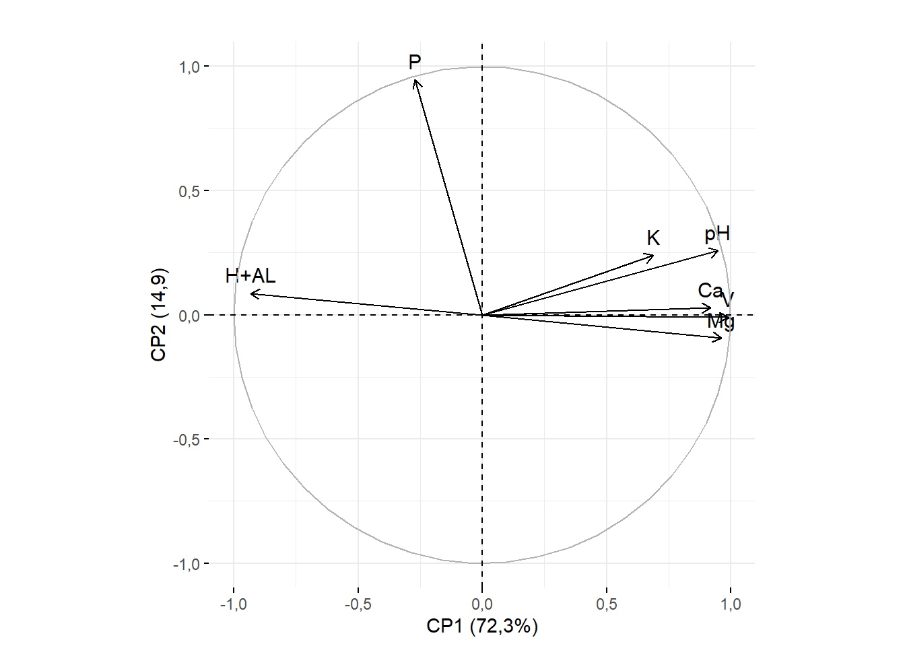

<br>

### Sobreposição dos nomes


```r
rownames(pca$var$coord)=c("pH","H+AL","K","P","Ca","Mg","V")
fviz_pca_var(pca, 
             title="", 
             repel=T)+ylab("CP2 (14,9)")+xlab("CP1 (72,3%)")
```


<br>

### Removendo linhas de grade


```r
rownames(pca$var$coord)=c("pH","H+AL","K","P","Ca","Mg","V")
fviz_pca_var(pca, 
             title="", 
             repel=T)+
  ylab("CP2 (14,9)")+
  xlab("CP1 (72,3%)")+
  theme_classic()
```

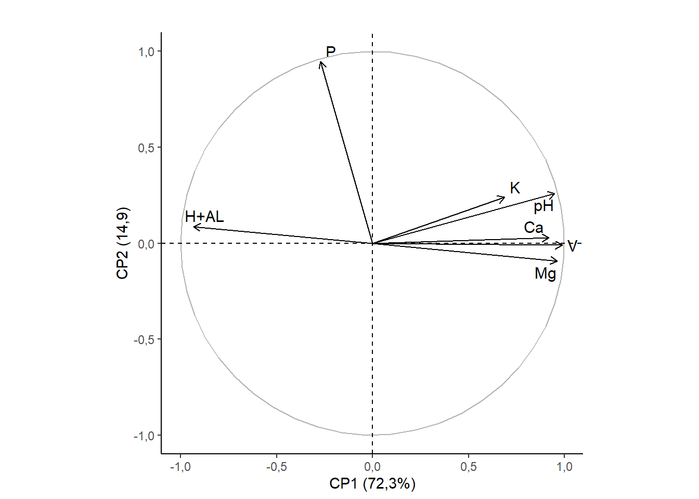

<br>

### Pontos dos scores


```r
fviz_pca_ind(pca)
```

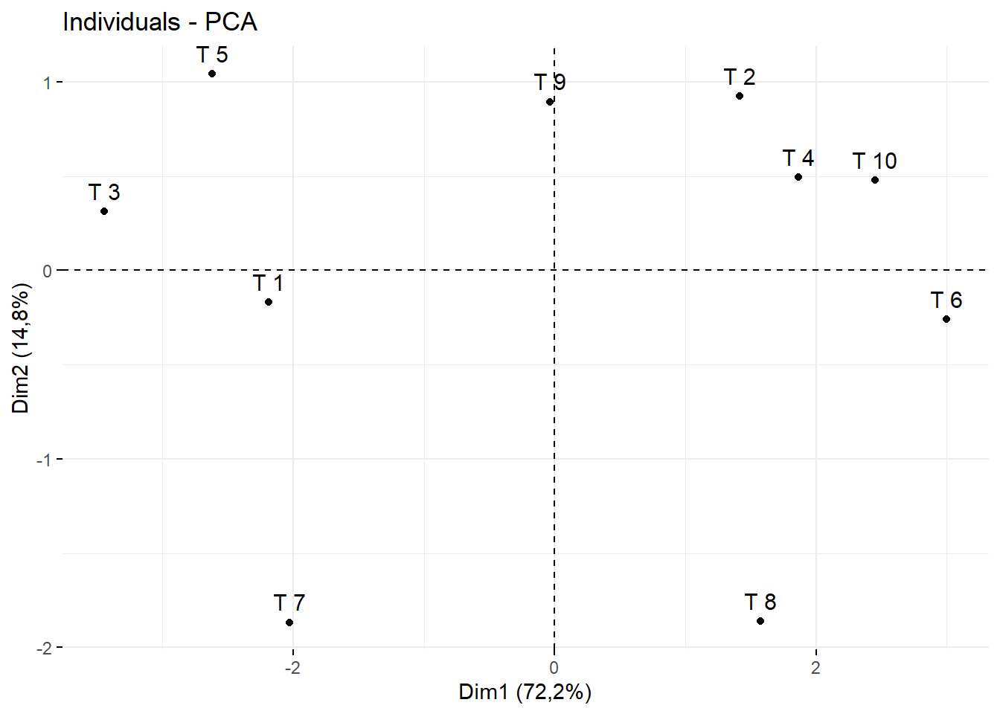

<br>

### Renomeando eixos e título


```r
fviz_pca_ind(pca, title="")+ylab("CP2 (14,9)")+xlab("CP1 (72,3%)")
```


<br>

### Marcando os clusters (Por coloração)


```r
## Cluster 1: T8, T10, T6,T9,T2,T4
## Cluster 2: T7, T3, T1, T5
## Construir vetor com o cluster (Nesse caso vamos chamar de A e B)

cluster=c("B","A","B","A","B","A","B","A","A","A")
fviz_pca_ind(pca, 
             title="", 
             col.ind = as.factor(cluster))+
  ylab("CP2 (14,9)")+
  xlab("CP1 (72,3%)")
```


<br>

### Marcando os clusters (Por formato de ponto)


```r
## Cluster 1: T8, T10, T6,T9,T2,T4
## Cluster 2: T7, T3, T1, T5
## Construir vetor com o cluster (Nesse caso vamos chamar de A e B)

cluster=c("B","A","B","A","B","A","B","A","A","A")
fviz_pca_ind(pca, 
             title="", 
             pointshape = as.factor(cluster),
             pointsize=2)+
  ylab("CP2 (14,9)")+
  xlab("CP1 (72,3%)")
```


<br>

### Marcando os clusters (Por coloração e formato de ponto)


```r
## Cluster 1: T8, T10, T6,T9,T2,T4
## Cluster 2: T7, T3, T1, T5
## Construir vetor com o cluster (Nesse caso vamos chamar de A e B)
cluster=c("B","A","B","A","B","A","B","A","A","A")
fviz_pca_ind(pca, 
             title="", legend.title="Cluster",
             habillage = as.factor(cluster))+
  ylab("CP2 (14,9)")+
  xlab("CP1 (72,3%)")
```

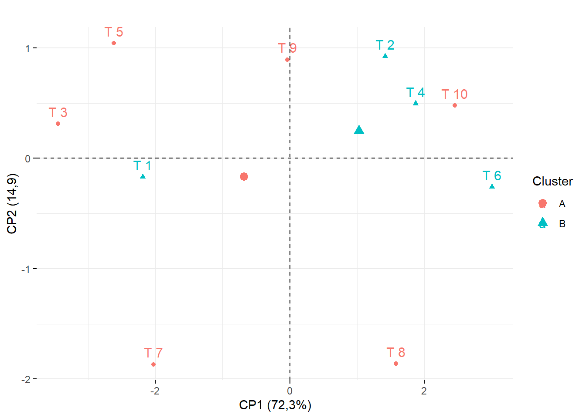

<br>

### Removendo linhas de grade


```r
## Cluster 1: T8, T10, T6,T9,T2,T4
## Cluster 2: T7, T3, T1, T5
## Construir vetor com o cluster (Nesse caso vamos chamar de A e B)
cluster=c("B","A","B","A","B","A","B","A","A","A")
fviz_pca_ind(pca, 
             title="", legend.title="Cluster",
             habillage = as.factor(cluster))+
  ylab("CP2 (14,9)")+
  xlab("CP1 (72,3%)")+theme_classic()
```

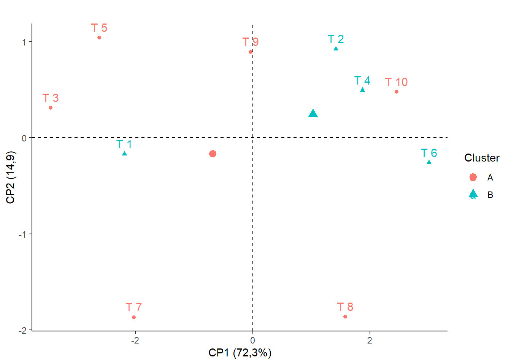


```r
a=fviz_pca_ind(pca, title="")+theme_classic()
b=fviz_pca_var(pca, title="")+theme_classic()
library(gridExtra)
grid.arrange(a,b, ncol=2)
```

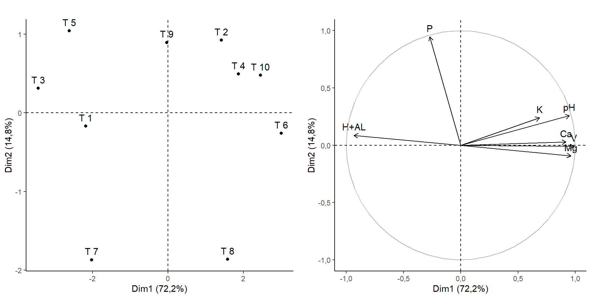

<br><br>

****

## Gráfico de CP (Manualmente)

****

<br>

### Calculando as médias


```r
mph=tapply(ph, Trat, mean)
mHAL=tapply(HAL, Trat, mean)
mK=tapply(K, Trat, mean)
mP=tapply(P, Trat, mean)
mCa=tapply(Ca, Trat, mean)
mMg=tapply(Mg, Trat, mean)
mV=tapply(V, Trat, mean)
dadosm=data.frame(mph,mHAL,mK,mP,mCa,mMg,mV)
```

<br>

### Dendograma (Definir Clusters)

Obs. Fica a critério do pesquisador o valor do corte (Neste caso optei pelo corte em 8, formando assim dois *clusters*)

Podemos fazer como neste exemplo abaixo:


```r
dend=as.dendrogram(hclust(dist(dadosm), method='average'), hang = -1)
plot(dend)
abline(h=8, lty=2, col="red")
```

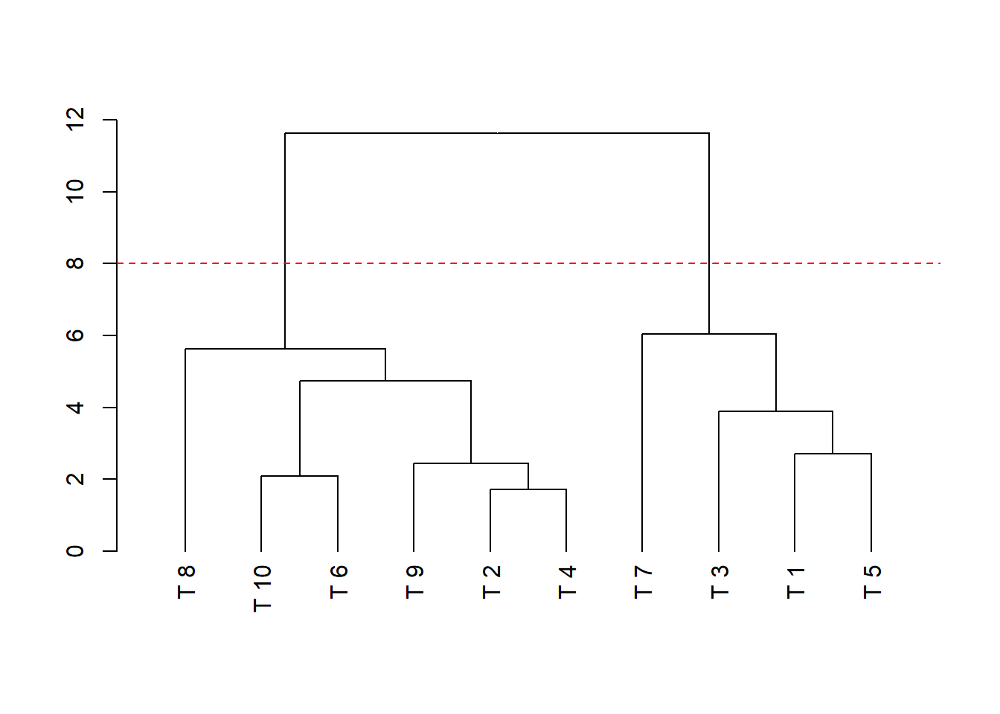

```r
## Cluster 1: T8, T10, T6,T9,T2,T4
## Cluster 2: T7, T3, T1, T5
```

ou,


```r
library(dendextend)
dend=as.dendrogram(hclust(dist(dadosm), method='average'))
dend=set(dend,"branches_k_color", value = c("red", "blue"), k = 2)
par(cex=0.7, mai=c(1.2,0.8,0.5,0.5))
plot(dend,las=1,ylab="Distância")
par(cex=0.8)
rect.dendrogram(dend, k=2,border = 8, lty = 5, lwd = 2)
```

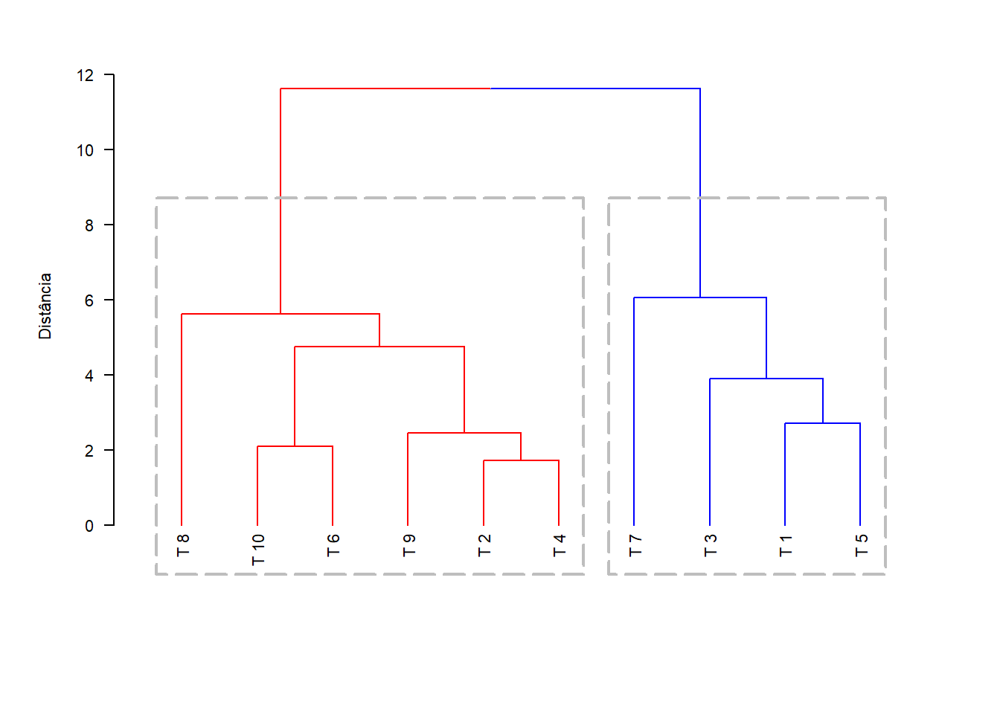

<br>

### Valores dos CP


```r
require(FactoMineR)
pca=PCA(dadosm,scale.unit=T,graph=F)
round(pca$eig,3)
```

```
##        eigenvalue percentage of variance cumulative percentage of variance
## comp 1      5,057                 72,243                            72,243
## comp 2      1,037                 14,812                            87,055
## comp 3      0,639                  9,128                            96,183
## comp 4      0,237                  3,387                            99,571
## comp 5      0,022                  0,312                            99,883
## comp 6      0,008                  0,109                            99,992
## comp 7      0,001                  0,008                           100,000
```

<br>

### Gráfico com os componentes


```r
plot(pca$eig[,2], type="b",ylab="Porcentagem de variância",xlab="CP")
```


<br>

### Ponto dos scores


```r
plot(pca$ind$coord, # Extraindo da pca os valores das coordenadas em x e CP1 e y e CP2
     xlab="CP1 (72.2 %)", # renomeando eixo x
     ylab="CP2 (14.8 %)", # renomeando eixo y
     pch=16) # alterando formato de ponto ("Bolinha preenchida")
abline(h=0,v=0, lty=2) # traçando linha em x e y = 0; lty=2 é linha tracejada 
```


<br>

### Identificando pontos


```r
plot(pca$ind$coord, # Extraindo da pca os valores das coordenadas em x e CP1 e y e CP2
     xlab="CP1 (72.2 %)", # renomeando eixo x
     ylab="CP2 (14.8 %)", # renomeando eixo y
     pch=16) # alterando formato de ponto ("Bolinha preenchida")
abline(h=0,v=0, lty=2) # traçando linha em x e y = 0; lty=2 é linha tracejada 
text(pca$ind$coord[,1],
     pca$ind$coord[,2]-0.1, 
     rownames(pca$ind$coord))
```


<br>

### Modificando nome dos pontos


```r
rownames(pca$ind$coord)=c("A","J","B","C","D","E","F","G","H","I")
plot(pca$ind$coord, # Extraindo da pca os valores das coordenadas em x e CP1 e y e CP2
     xlab="CP1 (72.2 %)", # renomeando eixo x
     ylab="CP2 (14.8 %)", # renomeando eixo y
     pch=16) # alterando formato de ponto ("Bolinha preenchida")
abline(h=0,v=0, lty=2) # traçando linha em x e y = 0; lty=2 é linha tracejada 
text(pca$ind$coord[,1],
     pca$ind$coord[,2]-0.1, 
     rownames(pca$ind$coord))
```

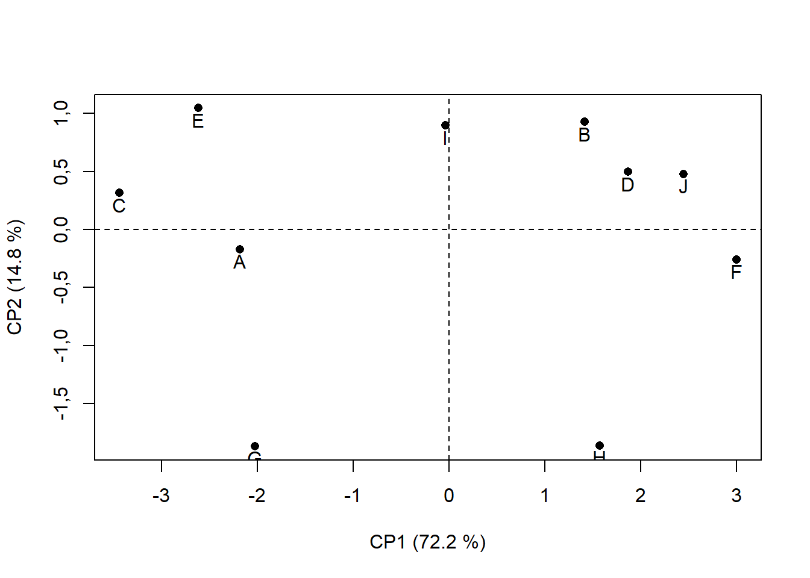

<br>

### Limite da seta dos vetores


```r
plot(pca$var$coord, # Extraindo da pca os valores da coordenadas em x e y dos vetores resposta
     xlab="CP1 (72.2 %)", # renomeando eixo x
     ylab="CP2 (14.8 %)", # renomeando eixo y
     pch=16, # alterando formato de ponto ("Bolinha preenchida")
     ylim=c(-1,1), # Alterando escala de Y para -1 até 1
     xlim=c(-1,1)) # Alterando escala de X para -1 até 1
abline(h=0,v=0, lty=2) # traçando linha em x e y = 0; lty=2 é linha tracejada 
```

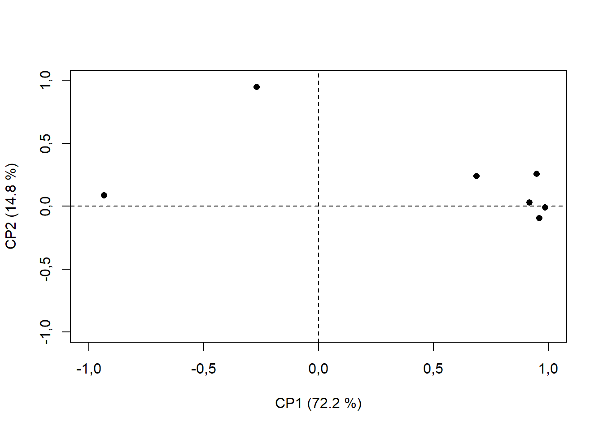

<br>

### Convertendo o ponto para seta

Neste caso, temos que criar setas individuais e plotar sobre o nosso gráfico.

Ex. 

 - `pca$var$coord[1,1]`: extraindo de `pca` o valor da coordenada X para o vetor 1, em que de `pca`, localiza-se na linha 1 e coluna 1
 - `pca$var$coord[1,2]`: extraindo de `pca` o valor da coordenada y para o vetor 1, em que de `pca`, localiza-se na linha 1 e coluna 2


```r
plot(pca$var$coord, 
     xlab="CP1 (72.2 %)",
     ylab="CP2 (14.8 %)",
     col="white", # Estou definindo como branco para apagar os pontos
     ylim=c(-1.5,1.5),
     xlim=c(-1.5,1.5))
abline(h=0,v=0, lty=2)
arrows(0,0,pca$var$coord[1,1],pca$var$coord[1,2], length = 0.1) # vetor 1 - pH
arrows(0,0,pca$var$coord[2,1],pca$var$coord[2,2], length = 0.1) # vetor 2 - HAL
arrows(0,0,pca$var$coord[3,1],pca$var$coord[3,2], length = 0.1) # vetor 3 - K
arrows(0,0,pca$var$coord[4,1],pca$var$coord[4,2], length = 0.1) # vetor 4 - P
arrows(0,0,pca$var$coord[5,1],pca$var$coord[5,2], length = 0.1) # vetor 5 - Ca
arrows(0,0,pca$var$coord[6,1],pca$var$coord[6,2], length = 0.1) # vetor 6 - Mg
arrows(0,0,pca$var$coord[7,1],pca$var$coord[7,2], length = 0.1) # vetor 7 - V
text(pca$var$coord-0.01,rownames(pca$var$coord)) # Estou colocando os nomes dos vetores (-0.01 significa abaixo da coordenada a 0.01)
```


<br>

### Alterando posição do nome do vetores

Existem pesquisadores que preferem que o nome dos vetores quando x é positivo esteja a direita da extremidade da seta e quando x é negativo, o nome esteja a esquerda da seta. Neste caso, podemos utilizar a função `ifelse` dentro de `text()` 


```r
plot(pca$var$coord, 
     xlab="CP1 (72.2 %)",
     ylab="CP2 (14.8 %)",
     col="white",
     ylim=c(-0.5,1),
     xlim=c(-1.5,1.5))
abline(h=0,v=0, lty=2)
arrows(0,0,pca$var$coord[1,1],pca$var$coord[1,2], length = 0.1)
arrows(0,0,pca$var$coord[2,1],pca$var$coord[2,2], length = 0.1)
arrows(0,0,pca$var$coord[3,1],pca$var$coord[3,2], length = 0.1)
arrows(0,0,pca$var$coord[4,1],pca$var$coord[4,2], length = 0.1)
arrows(0,0,pca$var$coord[5,1],pca$var$coord[5,2], length = 0.1)
arrows(0,0,pca$var$coord[6,1],pca$var$coord[6,2], length = 0.1)
arrows(0,0,pca$var$coord[7,1],pca$var$coord[7,2], length = 0.1)
text(pca$var$coord[,1]+
       ifelse(pca$var$coord[,1]<0,-0.2,+0.2),  
     pca$var$coord[,2],rownames(pca$var$coord))
```


`ifelse(pca$var$coord[,1]<0,-0.2,+0.2)`: estamos definindo que se `pca$var$coord[,1]` for menor que 0, irá adicionar -0.2, do contrário irá somar 0.2

**Obs.** Nessa caso estamos alterando apenas em X, este princípio também pode ser aplicado em Y. Também é possível estabelecer manualmente a localização do texto (Criar um vetor com as coordenadas) 

<br>

### Adicionando círculo com raio do maior vetor resposta


```r
library(plotrix)
plot(pca$var$coord, 
     xlab="CP1 (72.2 %)",
     ylab="CP2 (14.8 %)",
     col="white",
     ylim=c(-1,1),
     xlim=c(-1.5,1.5))
abline(h=0,v=0, lty=2)
arrows(0,0,pca$var$coord[1,1],pca$var$coord[1,2], length = 0.1)
arrows(0,0,pca$var$coord[2,1],pca$var$coord[2,2], length = 0.1)
arrows(0,0,pca$var$coord[3,1],pca$var$coord[3,2], length = 0.1)
arrows(0,0,pca$var$coord[4,1],pca$var$coord[4,2], length = 0.1)
arrows(0,0,pca$var$coord[5,1],pca$var$coord[5,2], length = 0.1)
arrows(0,0,pca$var$coord[6,1],pca$var$coord[6,2], length = 0.1)
arrows(0,0,pca$var$coord[7,1],pca$var$coord[7,2], length = 0.1)
text(pca$var$coord[,1]+ifelse(pca$var$coord[,1]<0,-0.2,+0.2),
     pca$var$coord[,2],rownames(pca$var$coord))
draw.circle(0,0,max(ifelse(c(pca$var$coord[,1],pca$var$coord[,2])<0,
                           c(pca$var$coord[,1],pca$var$coord[,2])*-1,
                           c(pca$var$coord[,1],pca$var$coord[,2]))))
```

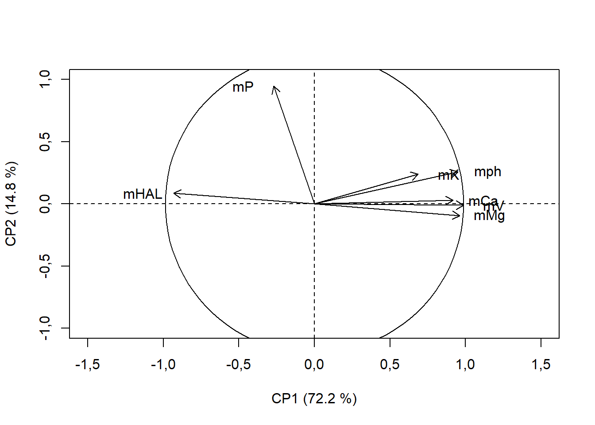

<br>

### Renomeando vetores


```r
rownames(pca$var$coord)=c("pH","H+AL","K","P","Ca","Mg","V%") # renomeando vetores
library(plotrix)
plot(pca$var$coord, 
     xlab="CP1 (72.2 %)",
     ylab="CP2 (14.8 %)",
     col="white",
     ylim=c(-1,1),
     xlim=c(-1.5,1.5))
abline(h=0,v=0, lty=2)
arrows(0,0,pca$var$coord[1,1],pca$var$coord[1,2], length = 0.1)
arrows(0,0,pca$var$coord[2,1],pca$var$coord[2,2], length = 0.1)
arrows(0,0,pca$var$coord[3,1],pca$var$coord[3,2], length = 0.1)
arrows(0,0,pca$var$coord[4,1],pca$var$coord[4,2], length = 0.1)
arrows(0,0,pca$var$coord[5,1],pca$var$coord[5,2], length = 0.1)
arrows(0,0,pca$var$coord[6,1],pca$var$coord[6,2], length = 0.1)
arrows(0,0,pca$var$coord[7,1],pca$var$coord[7,2], length = 0.1)
text(c(1.05,  -1.1, 0.8, -0.3, 1,  1.05,  1.1),
     c(0.3, 0.1, 0.3,  1, 0.06, -0.1, -0),
     rownames(pca$var$coord))
draw.circle(0,0,max(ifelse(c(pca$var$coord[,1],pca$var$coord[,2])<0,
                           c(pca$var$coord[,1],pca$var$coord[,2])*-1,
                           c(pca$var$coord[,1],pca$var$coord[,2]))))
```


<br><br>

****

## Screeplot

****

<br><br>

### Conjunto de dados


```r
Trat=rep(c(paste("T",1:10)), e=12)
dados=data.frame(Trat,ph,HAL,K,P,Ca,Mg,V)
```

<br>

### Calculando as médias


```r
mph=tapply(ph, Trat, mean)
mHAL=tapply(HAL, Trat, mean)
mK=tapply(K, Trat, mean)
mP=tapply(P, Trat, mean)
mCa=tapply(Ca, Trat, mean)
mMg=tapply(Mg, Trat, mean)
mV=tapply(V, Trat, mean)
dadosm=data.frame(mph,mHAL,mK,mP,mCa,mMg,mV)
```

<br>

### Pacote FactomineR


```r
library(FactoMineR)
pca=PCA(dadosm)
```

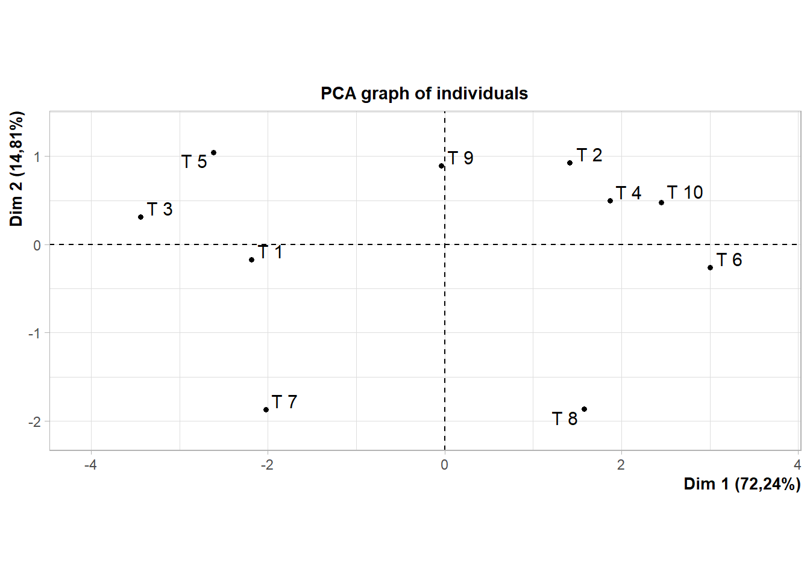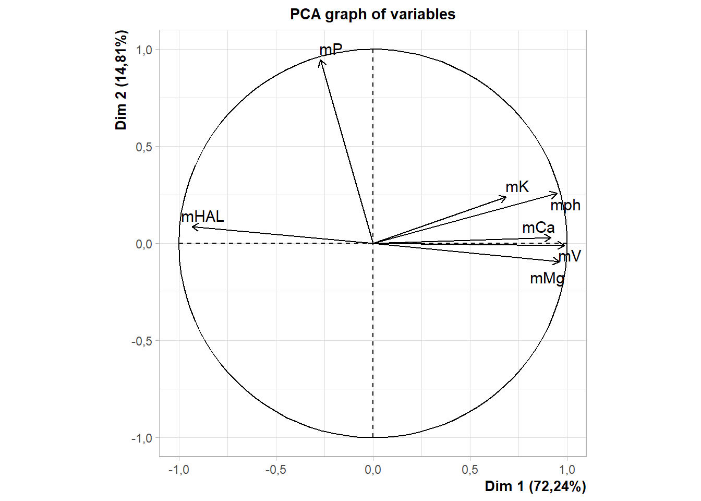

<br>

### Screeplot do factoextra


```r
library(factoextra)
fviz_screeplot(pca)
```

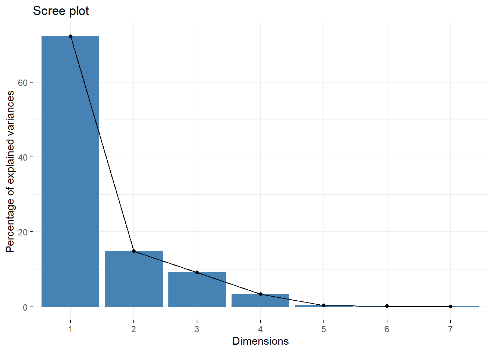


```r
fviz_screeplot(pca,
               title="", # removendo título
               font.family="serif", # fonte times new roman
               barcolor="black", # cor da borda preto
               addlabels=T,
               ggtheme=theme_classic())+
  xlab("Componente Principal")+ # nomeando eixo x
  ylab("Porcentagem de explicação da variância") # nomeando eixo y
```

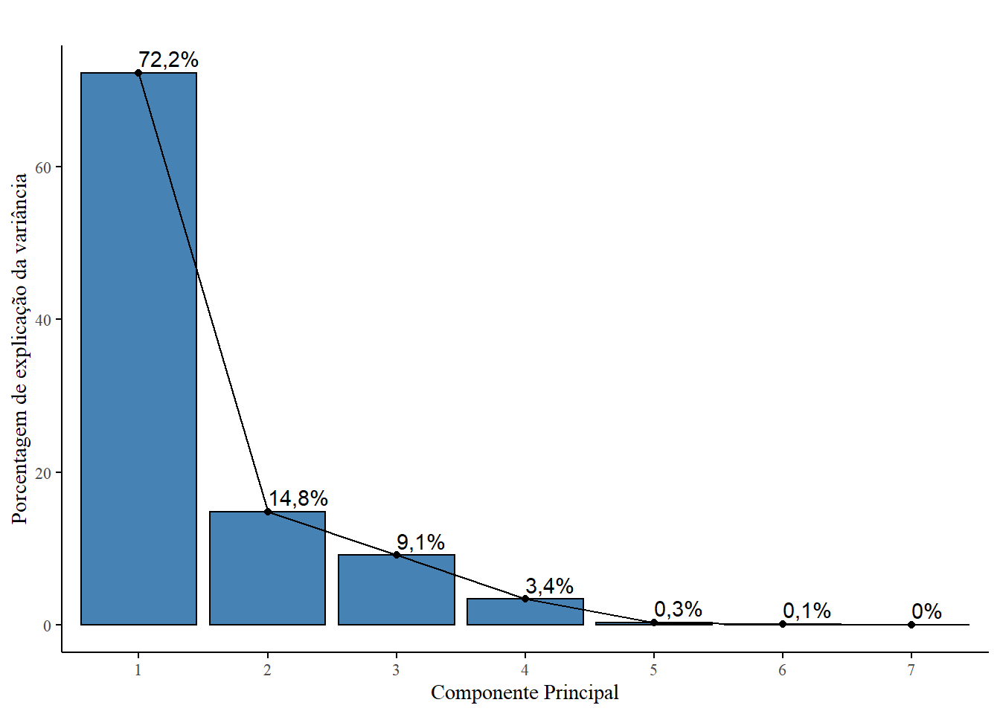

<br>

****

## Manualmente pelo stats

****

<br>

### Somente colunas


```r
par(family="serif") # fonte times new roman
bar=barplot(pca$eig[,2], 
        ylim=c(0,100))
```

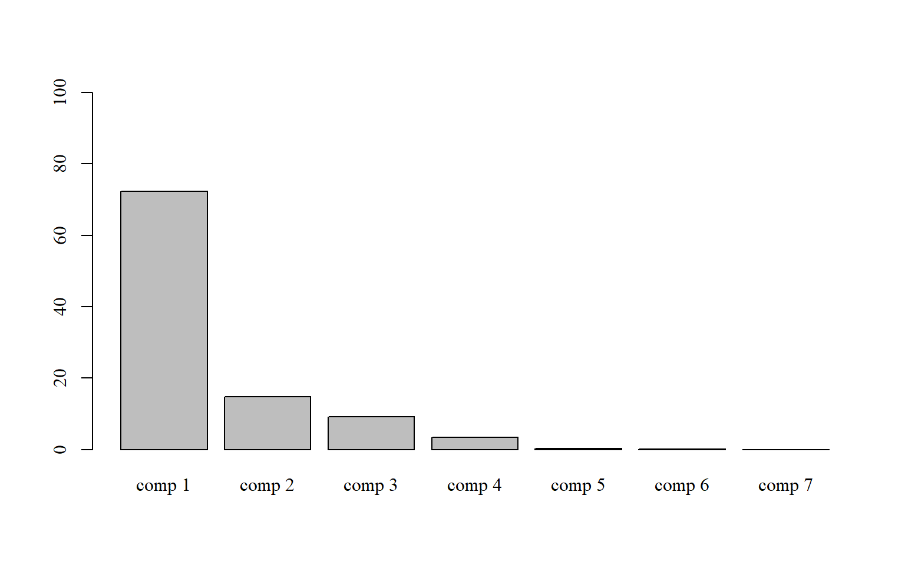

<br>

### Com colunas, pontos e linhas


```r
par(family="serif") # fonte times new roman
bar=barplot(pca$eig[,2], 
        ylim=c(0,100))
points(bar,
       pca$eig[,2], 
       type = "o")
```

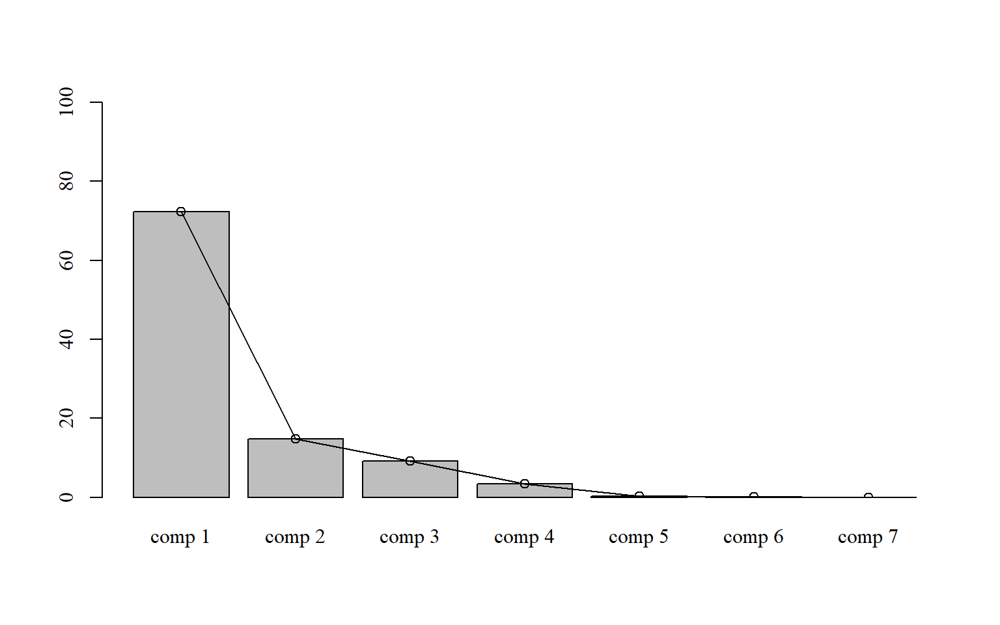

<br>

### Com colunas, pontos, linhas e legenda


```r
par(family="serif") # fonte times new roman
bar=barplot(pca$eig[,2], 
        ylim=c(0,100))
points(bar,
       pca$eig[,2], 
       type = "o")
text(bar,
     pca$eig[,2]+5,
     round(pca$eig[,2],2))
```


<br>

### Editando


```r
rownames(pca$eig)=c(paste("CP",1:length(pca$eig[,2])))
par(family="serif") # fonte times new roman
bar=barplot(pca$eig[,2], 
        ylim=c(0,100),
        las=1,
        col="darkblue",
        xlab="Componente principal",
        ylab="Porcentagem de explicação")
abline(h=0)
points(bar,
       pca$eig[,2], 
       type = "o")
text(bar,
     pca$eig[,2]+5,
     round(pca$eig[,2],2))
```


<br><br>

****

## Correlação com variável latente

****

<br><br>

### Calculando as médias


```r
mph=tapply(ph, Trat, mean)
mHAL=tapply(HAL, Trat, mean)
mK=tapply(K, Trat, mean)
mP=tapply(P, Trat, mean)
mCa=tapply(Ca, Trat, mean)
mMg=tapply(Mg, Trat, mean)
mV=tapply(V, Trat, mean)
dadosm=data.frame(mph,mHAL,mK,mP,mCa,mMg,mV)
```

<br>

## Pacote psych


```r
library(psych)
pca.solo <- principal(scale(dadosm), # scale é para padronizar dados
                      nfactors=5,  # Numero de componentes
                      n.obs=10, # possui 10 observações/ variável
                      rotate='none', 
                      scores=TRUE)
pca.solo
```

```
## Principal Components Analysis
## Call: principal(r = scale(dadosm), nfactors = 5, rotate = "none", n.obs = 10, 
##     scores = TRUE)
## Standardized loadings (pattern matrix) based upon correlation matrix
##        PC1   PC2   PC3   PC4   PC5 h2      u2 com
## mph   0,95  0,26 -0,02 -0,14  0,12  1 3,1e-04 1,2
## mHAL -0,93  0,09  0,20  0,28  0,06  1 5,4e-04 1,3
## mK    0,69  0,24  0,69 -0,01 -0,02  1 7,4e-04 2,2
## mP   -0,27  0,95 -0,17  0,03 -0,04  1 5,4e-05 1,2
## mCa   0,92  0,03 -0,28  0,28  0,02  1 2,9e-03 1,4
## mMg   0,96 -0,09  0,08  0,24 -0,04  1 2,9e-03 1,2
## mV    0,99 -0,01 -0,13 -0,08 -0,03  1 8,4e-04 1,1
## 
##                        PC1  PC2  PC3  PC4  PC5
## SS loadings           5,06 1,04 0,64 0,24 0,02
## Proportion Var        0,72 0,15 0,09 0,03 0,00
## Cumulative Var        0,72 0,87 0,96 1,00 1,00
## Proportion Explained  0,72 0,15 0,09 0,03 0,00
## Cumulative Proportion 0,72 0,87 0,96 1,00 1,00
## 
## Mean item complexity =  1,4
## Test of the hypothesis that 5 components are sufficient.
## 
## The root mean square of the residuals (RMSR) is  0 
##  with the empirical chi square  0  with prob <  NA 
## 
## Fit based upon off diagonal values = 1
```

<br>

### Extraindo correlações


```r
(load <- pca.solo$loadings)
```

```
## 
## Loadings:
##      PC1    PC2    PC3    PC4    PC5   
## mph   0,949  0,258        -0,137  0,116
## mHAL -0,933         0,201  0,278       
## mK    0,687  0,240  0,685              
## mP   -0,270  0,946 -0,171              
## mCa   0,918        -0,277  0,276       
## mMg   0,961                0,239       
## mV    0,987        -0,129              
## 
##                  PC1   PC2   PC3   PC4   PC5
## SS loadings    5,057 1,037 0,639 0,237 0,022
## Proportion Var 0,722 0,148 0,091 0,034 0,003
## Cumulative Var 0,722 0,871 0,962 0,996 0,999
```

<br>

### Correlação com a variável latente CP1


```r
library(lattice)
sorted.loadings1 <- load[order(load[,1]),1]
(load1 <- dotplot(sorted.loadings1,
                 cex=1.5,
                 xlab="Correlação com a variável latente",
                 col="black",
                 scales=list(fontfamily="serif",cex=1.2),
                 auto.key=list(cex=1.2),
                 pch=16))
```


<br>

### Correlação com a variável latente CP2


```r
sorted.loadings2 <- load[order(load[,2]),2]
(load2 <- dotplot(sorted.loadings2,
                 cex=1.5,
                 xlab="Correlação com a variável latente",
                 col="black",
                 scales=list(fontfamily="serif",cex=1.2),
                 pch=16))
```

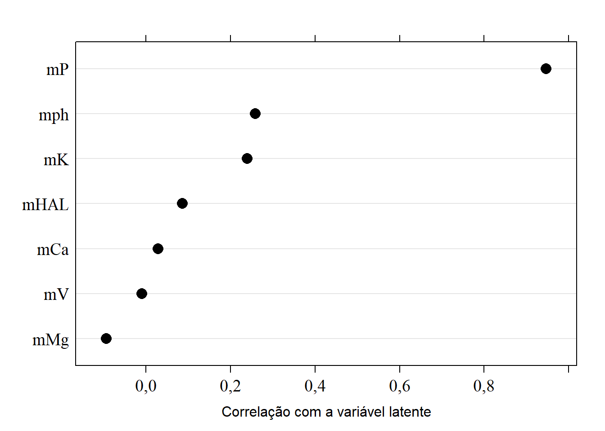

<br>

### Correlação com a variável latente CP3


```r
sorted.loadings3 <- load[order(load[,3]),3]
(load3 <- dotplot(sorted.loadings3,
                 cex=1.5,
                 xlab="Correlação com a variável latente",
                 col="black",
                 scales=list(fontfamily="serif",cex=1.2),
                 pch=16))
```

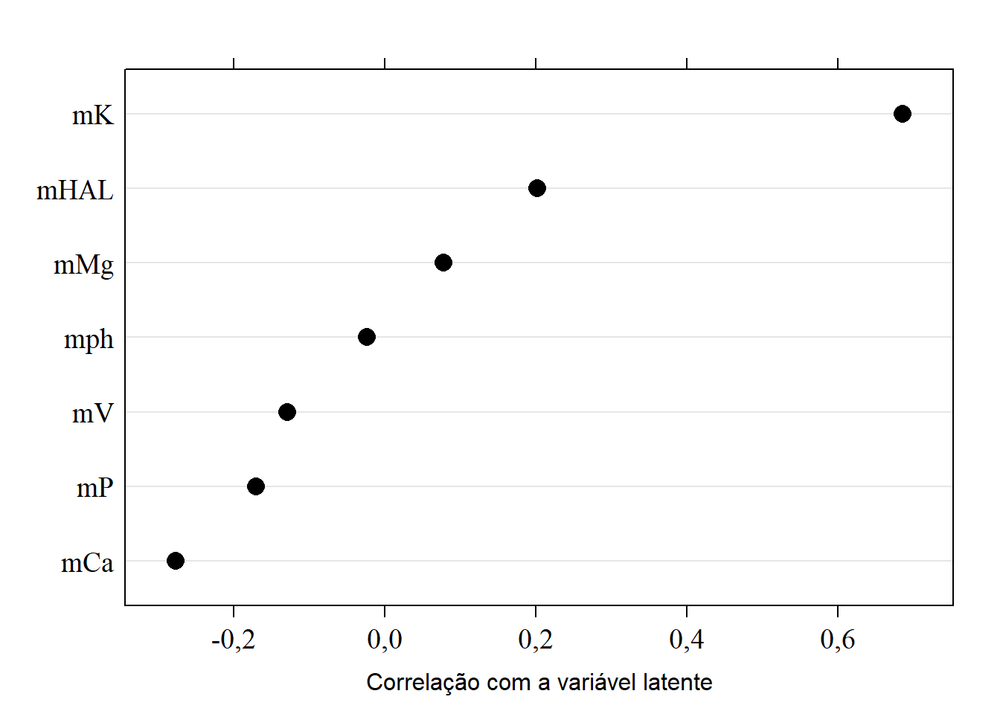

<br><br><br>

****

## Extraindo cluster de forma automática

****

### Conjunto de dados


```r
var1=c(rnorm(20,10,2),rnorm(20,20,2),rnorm(20,15,2))
var2=c(rnorm(20,20,2),rnorm(20,18,2),rnorm(20,15,2))
var3=c(rnorm(20,100,2),rnorm(20,60,2),rnorm(20,80,2))
var4=c(rnorm(20,150,2),rnorm(20,160,2),rnorm(20,140,2))
trat=paste("T",1:60)
dados=data.frame(trat,var1,var2,var3,var4)
```

### Construindo Dendrograma

Obs. método UPGMA - average


```r
dend=as.dendrogram(hclust(dist(scale(dados[,2:5])),method = "average"))
library(dendextend)
dend=set(dend,
         "branches_k_color", 
         value = 1:3, 
         k = 3)
```

### Extraindo cluster


```r
cluster=as.factor(as.vector(cutree(dend,k=3)))
```

### PCA

Obs. Não editado


```r
library(factoextra);library(FactoMineR)
data=dados[,2:5]
rownames(data)=dados$trat
fviz_pca_biplot(PCA(data),col.ind = cluster, addEllipses = T) # default e padronizado
```

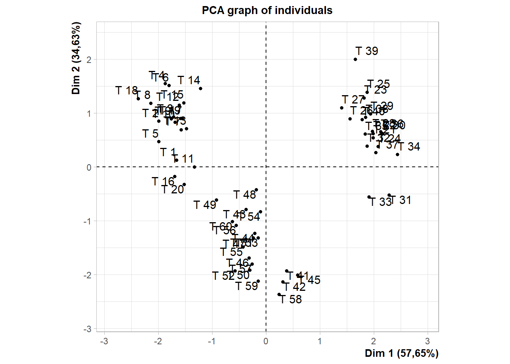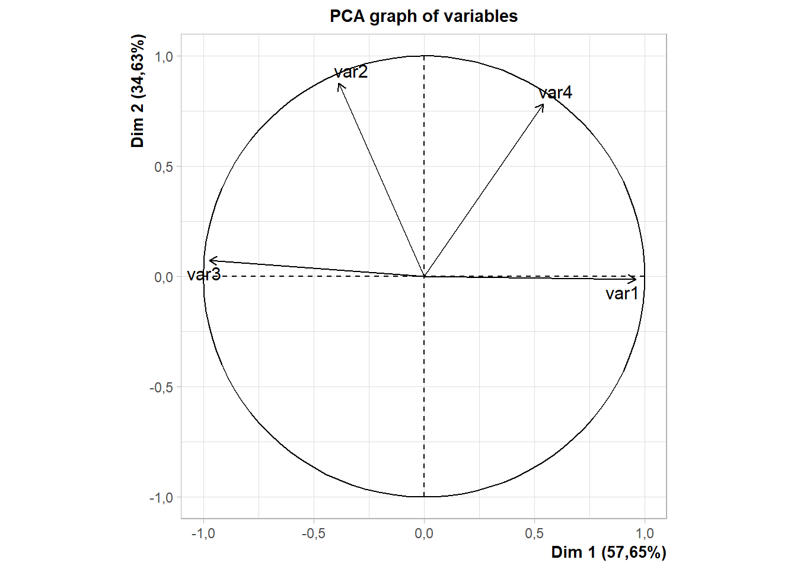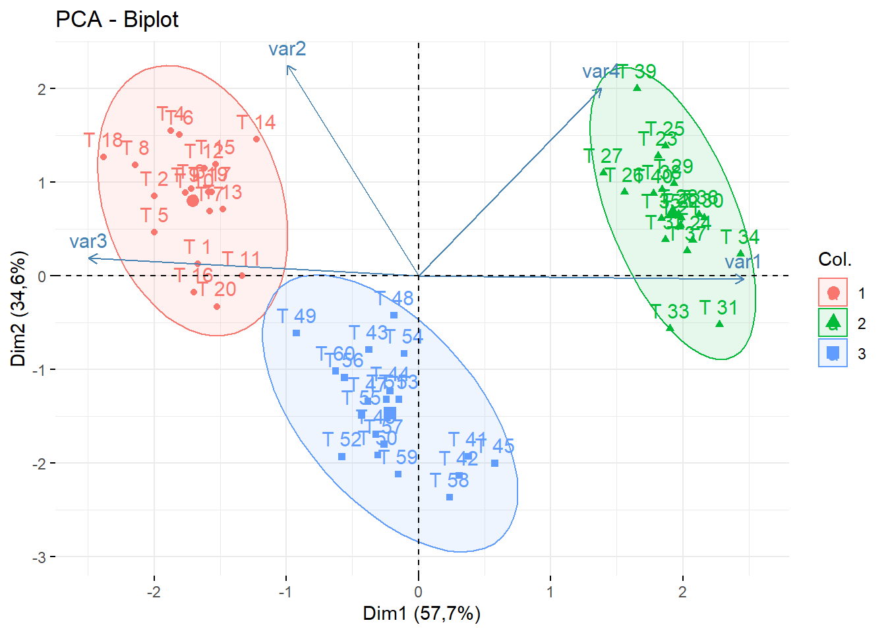

****

# Dendograma

****


### Conjunto de dados

Violent Crime Rates by US State

Description

This data set contains statistics, in arrests per 100,000 residents for assault, murder, and rape in each of the 50 US states in 1973. Also given is the percent of the population living in urban areas. 

McNeil, D. R. (1977) Interactive Data Analysis. New York: Wiley.


```r
data("USArrests")
USArrests
```

```
##                Murder Assault UrbanPop Rape
## Alabama          13,2     236       58 21,2
## Alaska           10,0     263       48 44,5
## Arizona           8,1     294       80 31,0
## Arkansas          8,8     190       50 19,5
## California        9,0     276       91 40,6
## Colorado          7,9     204       78 38,7
## Connecticut       3,3     110       77 11,1
## Delaware          5,9     238       72 15,8
## Florida          15,4     335       80 31,9
## Georgia          17,4     211       60 25,8
## Hawaii            5,3      46       83 20,2
## Idaho             2,6     120       54 14,2
## Illinois         10,4     249       83 24,0
## Indiana           7,2     113       65 21,0
## Iowa              2,2      56       57 11,3
## Kansas            6,0     115       66 18,0
## Kentucky          9,7     109       52 16,3
## Louisiana        15,4     249       66 22,2
## Maine             2,1      83       51  7,8
## Maryland         11,3     300       67 27,8
## Massachusetts     4,4     149       85 16,3
## Michigan         12,1     255       74 35,1
## Minnesota         2,7      72       66 14,9
## Mississippi      16,1     259       44 17,1
## Missouri          9,0     178       70 28,2
## Montana           6,0     109       53 16,4
## Nebraska          4,3     102       62 16,5
## Nevada           12,2     252       81 46,0
## New Hampshire     2,1      57       56  9,5
## New Jersey        7,4     159       89 18,8
## New Mexico       11,4     285       70 32,1
## New York         11,1     254       86 26,1
## North Carolina   13,0     337       45 16,1
## North Dakota      0,8      45       44  7,3
## Ohio              7,3     120       75 21,4
## Oklahoma          6,6     151       68 20,0
## Oregon            4,9     159       67 29,3
## Pennsylvania      6,3     106       72 14,9
## Rhode Island      3,4     174       87  8,3
## South Carolina   14,4     279       48 22,5
## South Dakota      3,8      86       45 12,8
## Tennessee        13,2     188       59 26,9
## Texas            12,7     201       80 25,5
## Utah              3,2     120       80 22,9
## Vermont           2,2      48       32 11,2
## Virginia          8,5     156       63 20,7
## Washington        4,0     145       73 26,2
## West Virginia     5,7      81       39  9,3
## Wisconsin         2,6      53       66 10,8
## Wyoming           6,8     161       60 15,6
```

<br>

### Calculando as distâncias


```r
d=dist(USArrests)
R=hclust(d)
```

<br>

### Dendograma


```r
plot(R)
```


<br>

### Altura dos rótulos


```r
plot(R, hang=-1)
```

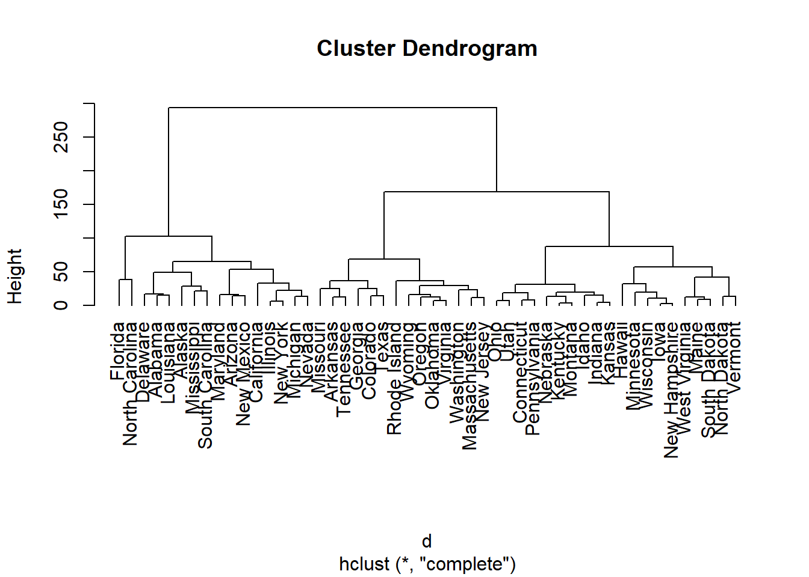

<br>

### Editando argumentos


```r
plot(R, 
     las=1, # Escala do eixo na horizontal
     hang=-1, # alinhas altura dos rótulos
     main="", # Título vazio
     ylab="Dist?ncia") # Título do eixo Y
```

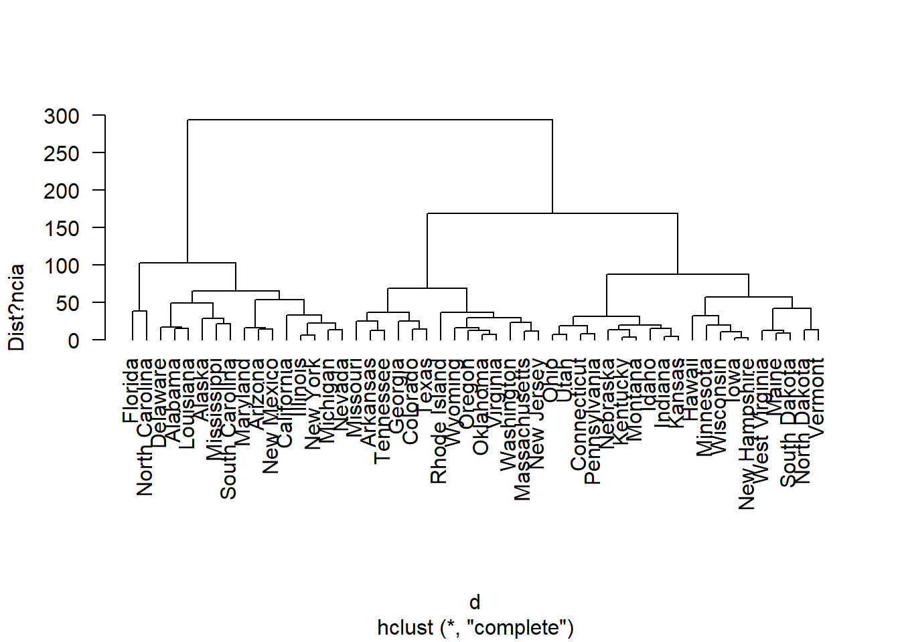

<br>

### Separando em grupos

Neste exemplo vamos considerar dois grupos


```r
# Chamando package dendextend
library(dendextend)

# Construindo o dendograma
dend=as.dendrogram(hclust(dist(USArrests), method='average'))

# Definindo cores e grupos para o dendograma
dend=set(dend,"branches_k_color", 
             value = c("red", "blue"), k = 2)

# Plotando o gráfico
par(cex=0.7)
plot(dend, 
     las=1, 
     ylab="Distância")
```


<br>

### Caixas separando grupos


```r
library(dendextend)
dend=as.dendrogram(hclust(dist(USArrests), 
                          method='average'))
dend=set(dend,
         "branches_k_color", 
             value = c("red", "blue"), 
         k = 2)
par(cex=0.7, mai=c(1.2,0.8,0,0))
plot(dend, 
     las=1,
     ylab="Distância")
par(cex=0.8)
# Construindo caixa de separação entre os grupos
rect.dendrogram(dend,
                k=2, # Dois grupos
                border = 8, # cor da borda (8: cinza)
                lty = 5, # formato da linha
                lwd = 2) # espessura da linha
```

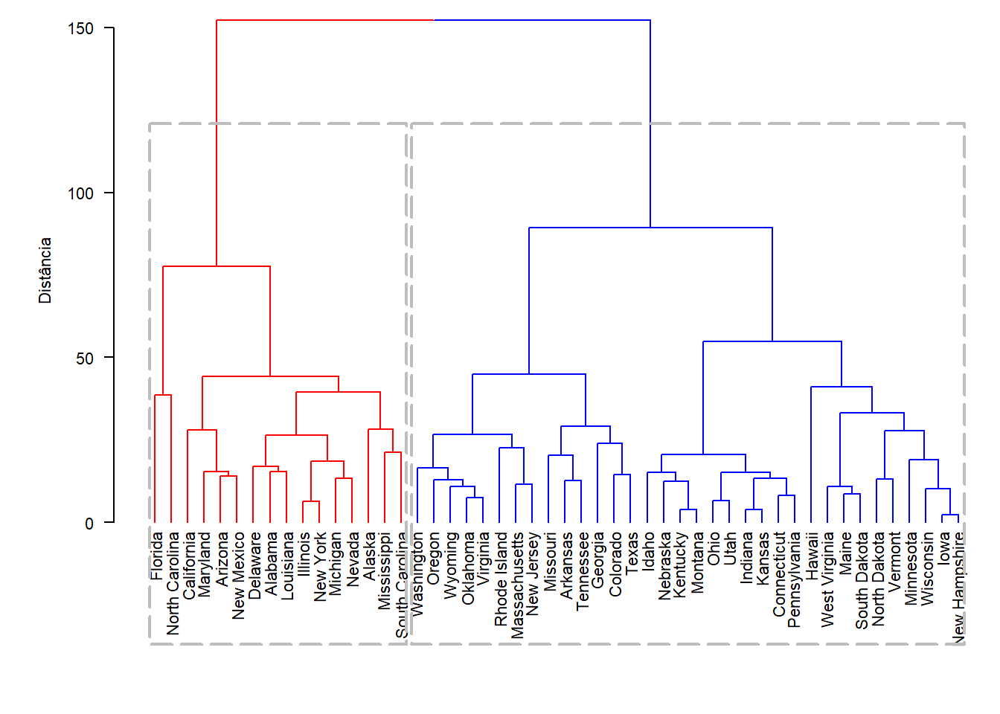

<br>

### Árvore filogenética (Em círculo)


```r
library(ape)
par(mar=c(0,0,1,0))
plot(as.phylo(R),
     cex=0.7, 
     hang=-1, 
     type="fan")
```


<br>

### Cor e separando por grupo


```r
par(mar=c(0,0,1,0))
clus=cutree(R,2)
colors=c("red","blue")
plot(as.phylo(R), 
     cex=0.7,
     hang=-1, 
     type="fan", 
     tip.color=colors[clus])
```

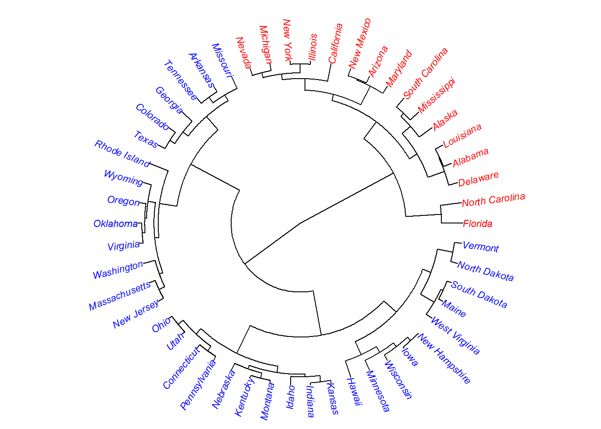

<br>

### Formato radial


```r
par(mar=c(0,0,1,0))
plot(as.phylo(R),
     cex=0.7, 
     hang=-1, 
     type="radial")
```


<br><br><br>

****

# Expression()

****

Durante a elaboração de gráficos no R, os títulos são inseridos conforme o nome da variável em que está analisando. Muitas vezes é necessário editar esses nomes no gráfico, entretanto, existem casos complexos em que é necessário inserir uma série de comandos para conseguir o desejado. Neste tutorial, iremos abordar a função `expression()` e alguns exemplos.

Não iremos trabalhar com um conjunto de dados neste exemplo, dessa forma, a linha respectiva ao `plot(1,1,axes=F, col="white", ylab="",xlab="")` serve apenas para utilizar a função legend() posteriormente. Lembrando que, a função `expression()` pode ser usada para todos os argumentos de renomeação (ylab, xlab, main, title, etc...)


<div style="column-count: 2;">

<br>


```r
plot(1,1,axes=F, col="white", ylab="",xlab="")
legend("center",
       legend="Resposta", 
       bty="n", 
       cex=2)
```


```r
plot(1,1,axes=F, col="white", ylab="",xlab="")
legend("center",
       legend=expression(sum()=="sum()"), 
       bty="n", 
       cex=2)
```

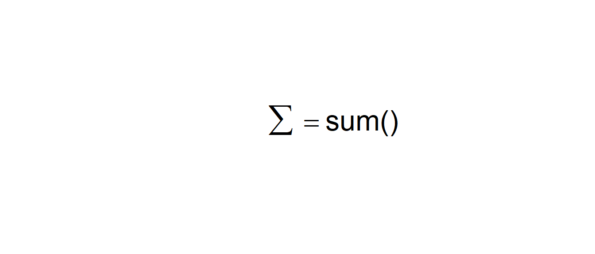


```r
plot(1,1,axes=F, col="white", ylab="",xlab="")
legend("center",
       legend=expression(delta == "delta"), 
       bty="n", 
       cex=2)
```


```r
plot(1,1,axes=F, col="white", ylab="",xlab="")
legend("center",
       legend=expression(alpha == "alpha"), 
       bty="n", 
       cex=2)
```


```r
plot(1,1,axes=F, col="white", ylab="",xlab="")
legend("center",
       legend=expression(beta =="beta"), 
       bty="n", 
       cex=2)
```


```r
plot(1,1,axes=F, col="white", ylab="",xlab="")
legend("center",
       legend=expression(gamma == "gamma"), 
       bty="n", 
       cex=2)
```


```r
plot(1,1,axes=F, col="white", ylab="",xlab="")
legend("center",
       legend=expression(mu == "mu"), 
       bty="n", 
       cex=2)
```


```r
plot(1,1,axes=F, col="white", ylab="",xlab="")
legend("center",
       legend=expression(sigma == "sigma"), 
       bty="n", 
       cex=2)
```


```r
plot(1,1,axes=F, col="white", ylab="",xlab="")
legend("center",
       legend=expression(pi == "pi"), 
       bty="n", 
       cex=2)
```


```r
plot(1,1,axes=F, col="white", ylab="",xlab="")
legend("center",
       legend=expression(epsilon == "epsilon"), 
       bty="n", 
       cex=2)
```


```r
plot(1,1,axes=F, col="white", ylab="",xlab="")
legend("center",
       legend=expression(lambda == "lambda"), 
       bty="n", 
       cex=2)
```


```r
plot(1,1,axes=F, col="white", ylab="",xlab="")
legend("center",
       legend=expression(italic(A) == "italic(A)"), 
       bty="n", 
       cex=2)
```


```r
plot(1,1,axes=F, col="white", ylab="",xlab="")
legend("center",legend=
      expression(bold(A) == "bold(A)"), 
       bty="n", 
       cex=2)
```


```r
plot(1,1,axes=F, col="white", ylab="",xlab="")
legend("center", 
       legend = expression(sigma^2==frac(sum((X[i]-mu)^2,i==1,n),N)), 
       bty="n", 
       cex=2)
```

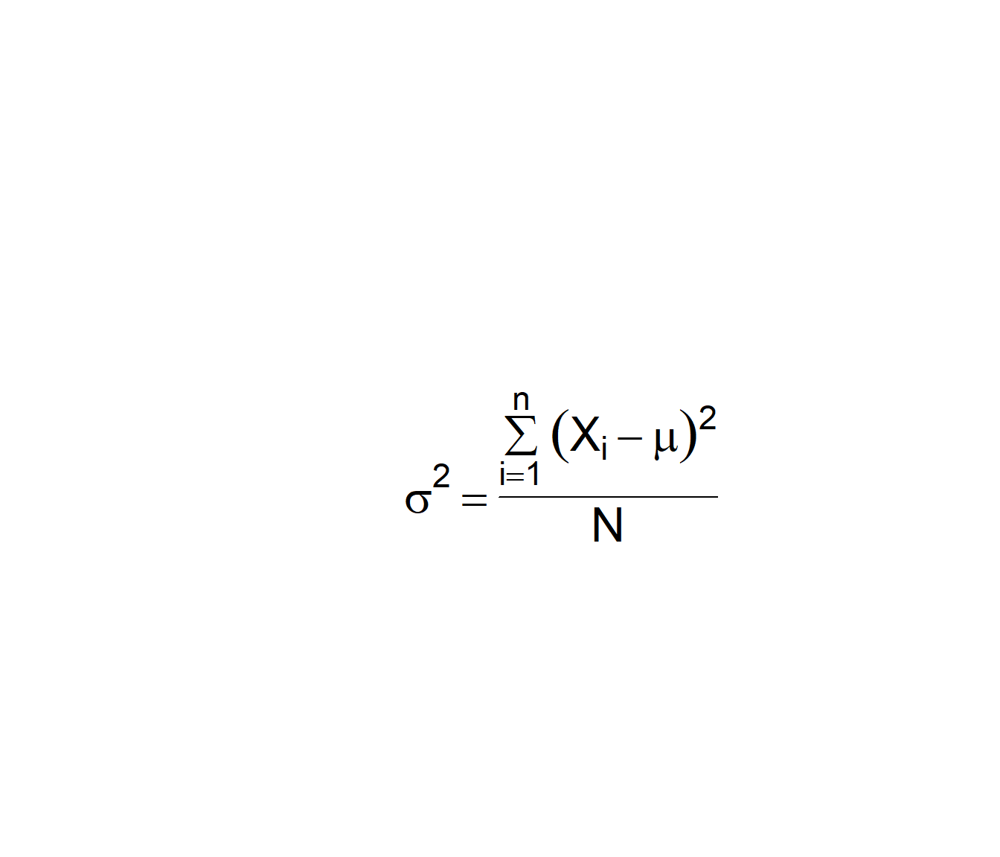

<br>


```r
plot(1,1,axes=F, col="white", ylab="",xlab="")
legend("center",
       legend=expression(hat(Y) == "hat(y)"), 
       bty="n", 
       cex=2)
```


```r
plot(1,1,axes=F, col="white", ylab="",xlab="")
legend("center",
       legend=expression(bar(x) =="bar(x)"), 
       bty="n", 
       cex=2)
```


```r
plot(1,1,axes=F, col="white", ylab="",xlab="")
legend("center",
       legend=expression(sqrt(Y)=="sqrt(Y)"), 
       bty="n", 
       cex=2)
```


```r
plot(1,1,axes=F, col="white", ylab="",xlab="")
legend("center",
       legend=expression(x^2 == "x^2"), 
       bty="n", 
       cex=2)
```

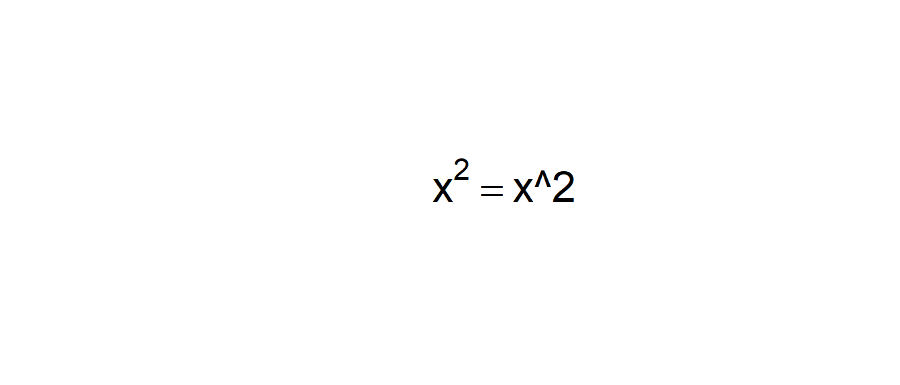


```r
plot(1,1,axes=F, col="white", ylab="",xlab="")
legend("center",
       legend=expression(x[2] == "x[2]"), 
       bty="n", 
       cex=2)
```


```r
plot(1,1,axes=F, col="white", ylab="",xlab="")
legend("center",legend=
expression("nome\nresposta"=="nome\\nresposta"), 
bty="n", 
cex=2)
```


```r
plot(1,1,axes=F, col="white", ylab="",xlab="")
legend("center",
legend=expression(hat(Y)==ax^2+bx+c,R^2==0.99), 
bty="n", 
cex=2)
```

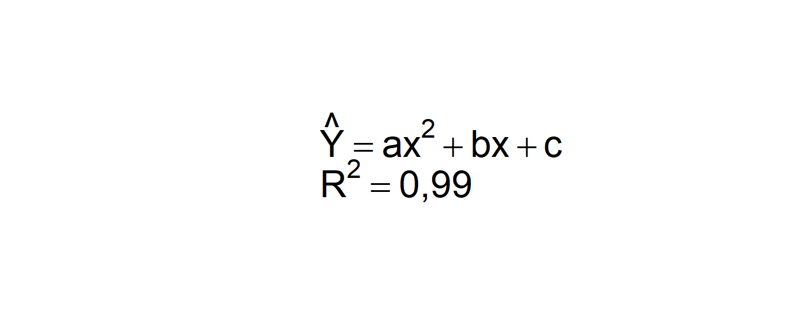


```r
plot(1,1,axes=F, col="white", ylab="",xlab="")
legend("center",
legend=expression(hat(Y)==ax^2+bx+c,R^2==0.99,italic(p-valor)==0.0001),
bty="n", cex=2)
```


```r
plot(1,1,axes=F, col="white", ylab="",xlab="")
legend("center",
legend=expression(Produtividade~(kg~ha^-1)), 
       bty="n", 
       cex=2)
```

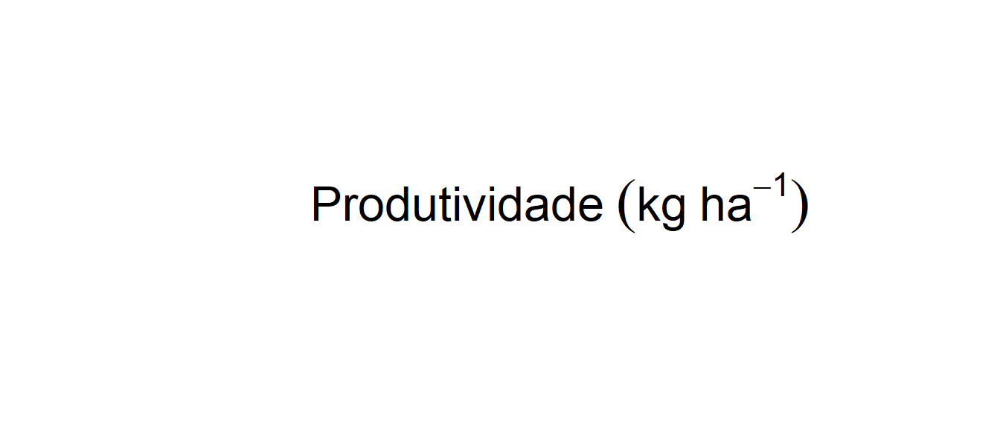


```r
plot(1,1,axes=F, col="white", ylab="",xlab="")
legend("center",legend=
expression(H[2]*0[2]~(mu*"mol"~g^-1~MFPA)), 
       bty="n", 
       cex=2)
```

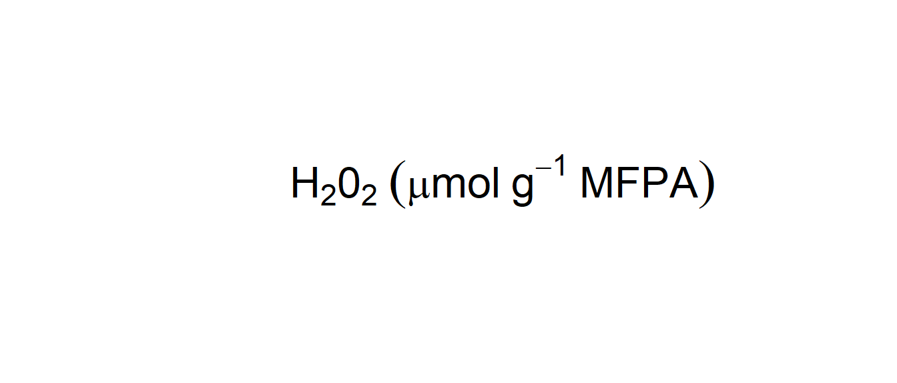


```r
plot(1,1,axes=F, col="white", ylab="",xlab="")
legend("center", 
legend=expression(MSPA~(g~kg^-1)), 
       bty="n", 
       cex=2)
```


```r
plot(1,1,axes=F, col="white", ylab="",xlab="")
legend("center",legend=
expression(bold(italic(A)) == "bold(italic(A))"), 
       bty="n", 
       cex=2)
```


```r
plot(1,1,axes=F, col="white", ylab="",xlab="")
legend("center",
legend=expression(hat(Y)==ax^2+bx+c), 
       bty="n", 
       cex=2)
```

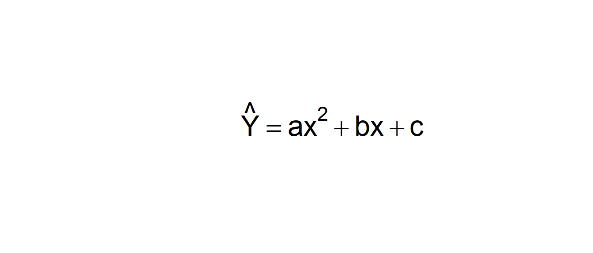

</div>

<br><br><br>

****

# layout (graphics)

****

<br>

### Como modificar o layout do R graphics

<br>

Durante a elaboração de gráficos no R, muitas vezes nos deparamos com problemas na margem (Títulos ou escalas ficam cortados) ou querem elaborar dois ou mais gráficos em uma única saída. Neste sentido, o presente tutorial irá abordar algumas funções para modificar o layout do gráfico base do R.

Não iremos trabalhar com um conjunto de dados neste exemplo, dessa forma, a linha respectiva ao `plot(1,1,axes=F, col="white", ylab="",xlab="")` serve apenas para demonstrar como alterar os parâmetros gráficos.

<br>

<div style="column-count: 1;">

****

### Gráfico Simples

****


```r
plot(1,1, ylab="Eixo Y",xlab="Eixo X")
```


****

### Parâmetros de margem

****

<br>

O comando par(...) é utilizado para alterar os parâmetros gráficos e deve ser executando antes do gráfico. Entretanto, uma vez executado essa linha de comando, todos os outros gráficos irão apresentar o mesmo layout, exceto se fechar o Rstudio ou limpar todos os gráficos.

O comando mai representa o tamanho de margem e deve-se digitar um vetor numérico com quatro valores, sendo respectivamente em ordem, inferior, esquerda, superior e direita (`mai=c(bottom, left, top, right)`).

<br>


```r
par(mai=c(1,1,1,1))
plot(1,1, ylab="Eixo Y",xlab="Eixo X")
```


****

### Fonte do gráfico

****

O comando para alterar a fonte do gráfico também é realizada dentro de par(...). Os argumentos do comando é `family="fonte"`.

`par(family="serif")`: Times New Roman


```r
par(family="serif")
plot(1,1, ylab="Eixo Y",xlab="Eixo X")
```

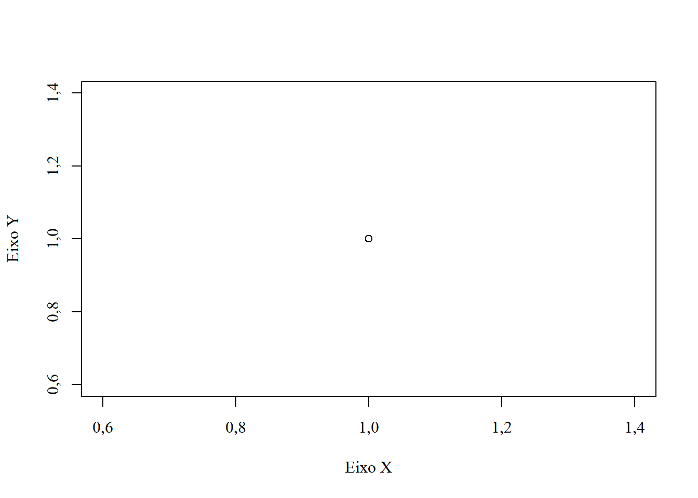

<br>

****

### Cor do gráfico

****

Especificando a cor do gráfico (Geral, exceto eixos)


```r
par(col="red")
plot(1,1, ylab="Eixo Y",xlab="Eixo X")
```

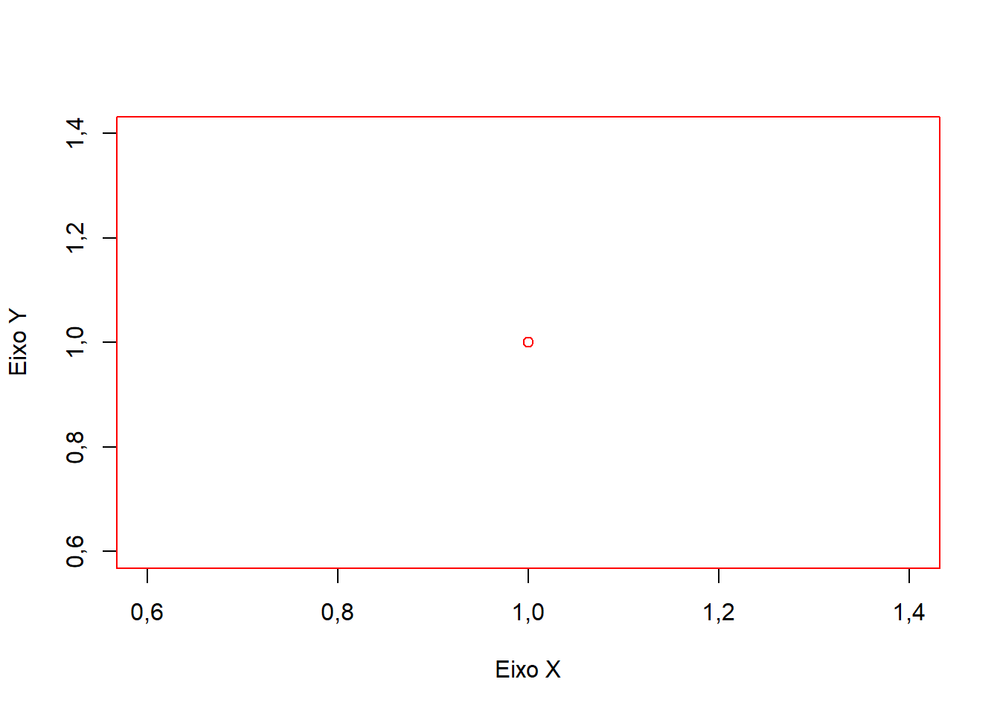

Especificando a cor da escala dos eixos do gráfico


```r
par(col.axis="red")
plot(1,1, ylab="",xlab="")
```

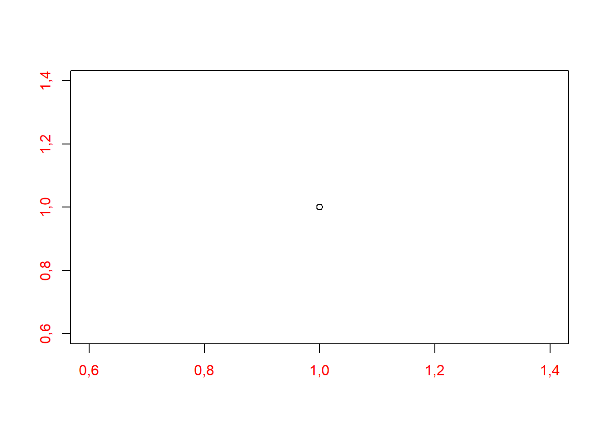

Especificando cor do nome dos eixos


```r
par(col.lab="red")
plot(1,1, ylab="Eixo Y",xlab="Eixo X")
```


Especificando cor do título


```r
par(col.main="red")
plot(1,1, ylab="Eixo Y",xlab="Eixo X",main="title")
```

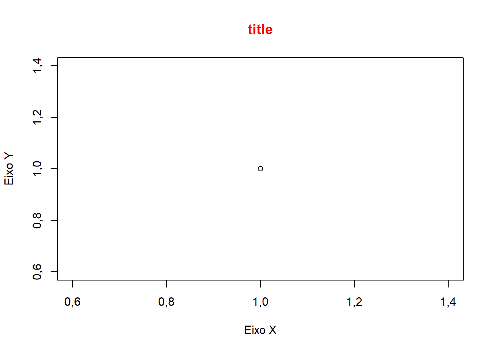

<br>

****

### Tamanho de letra

****


```r
par(cex=1.3)
plot(1,1, ylab="Eixo Y",xlab="Eixo X",main="title")
```


 - `cex.axis` : Tamanho da fonte das escalas de Y e X
 - `cex.lab` : Tamaho da fonte do nome dos eixos
 - `cex.main` : Tamanho da fonte do título

<br>

****

### Sobrepor gráficos

****


```r
plot(c(1,2,3,4,5,6), ylab="Eixo Y",xlab="Eixo X",main="title", type="o",col="red")
par(new=T)
plot(c(6,5,4,3,2,1), ylab="",xlab="",main="", type="o",col="blue")
```

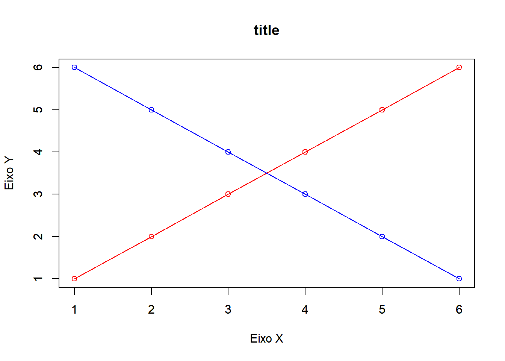

<br>

****

### Dois ou mais gráficos em uma saída

****

`mfrow=c(1,2)`: vetor de dados em que o primeiro representa o número de linhas e o segundo o número de colunas (Neste caso, uma linha e duas colunas)


```r
par(mfrow=c(1,2))
plot(c(1,2,3,4,5,6), ylab="Eixo Y",xlab="Eixo X",main="title", type="o",col="red")
plot(c(6,5,4,3,2,1), ylab="Eixo Y",xlab="Eixo X",main="title", type="o",col="blue")
```

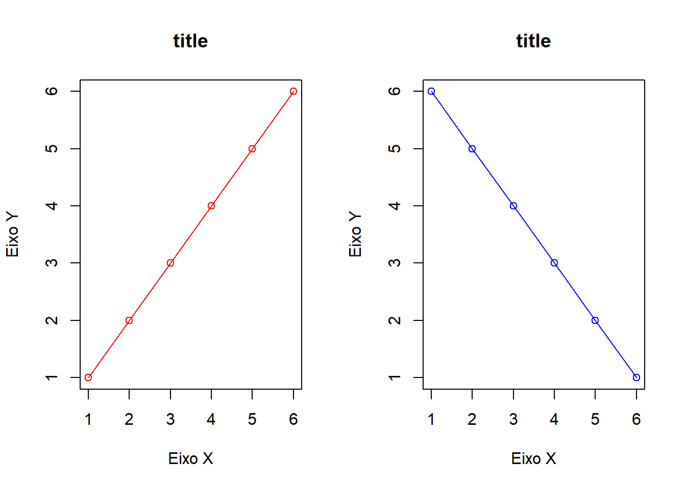

<br>

****

### Saída com dois gráficas na primeira linha e um gráfico na segunda linha

****

Saída com dois gráficas na primeira linha e um gráfico na segunda linha e necessário criar uma matriz com as posições.

Exemplo de matriz:

Matriz com quatro valores (`c(1,3,2,3)`) e duas colunas (`ncol=2`). Neste caso, a linha 1 apresenta os valores 1 e 2, que representam o primeiro e o segundo plot. A linha 2 apresenta os valores 3 e 3 que representa o terceiro plot.


```r
matrix(c(1,3,2,3), ncol=2)
```

```
##      [,1] [,2]
## [1,]    1    2
## [2,]    3    3
```


```r
layout(matrix(c(1,3,2,3), ncol=2))
plot(c(1,2,3,4,5,6), ylab="Eixo Y",xlab="Eixo X",main="title", type="o",col="red")
plot(c(6,5,4,3,2,1), ylab="Eixo Y",xlab="Eixo X",main="title", type="o",col="blue")
plot(c(1,6,1,6,1,6), ylab="Eixo Y",xlab="Eixo X",main="title", type="o",col="blue")
```


<br>

</div>

<br><br><br>

****

# ggplot2

****

*Em construção*

<br>

****

### Como juntar vários gráficos do ggplot2

****

No tutorial abaixo apresentamos uma das formas de juntar vários gráficos do ggplot2 em uma única figura. 

**Obs.**: Estamos usando o gráfico de colunas como exemplo, todavia, esses mesmos comandos funcionam para todos os gráficos do *ggplot2* e de outros pacotes que utilizam o *ggplot2*.

#### Conjunto de dados

Vamos trabalhar com três experimentos em DIC com quatro tratamentos e três repetições cada. 


```r
exp1=c(10,12,13,18,19,16,5,6,5,25,26,28)
exp2=c(9,12,11,18,20,16,7,6,9,25,28,28)
exp3=c(9,12,13,18,22,15,3,6,4,25,30,28)  
Trat=rep(c(paste("T",1:4)),e=3)
dados=data.frame(Trat,exp1,exp2,exp3)
dados$Trat=as.factor(Trat)
```

### Juntando três gráficos do ggplot2

*Obs* Para edição do gráfico ver tutorial sobre gráfico de colunas usando o ggplot2


```r
library(ggplot2)
m1=tapply(exp1, Trat, mean);d1=tapply(exp1, Trat, sd)
dados1=data.frame(Trat=rownames(m1),m1,d1)
a=ggplot(dados1, aes(x=Trat,y=m1))+geom_col()+theme_bw()+
  geom_errorbar(aes(ymax=m1+d1, ymin=m1-d1), width=0.25)
m2=tapply(exp2, Trat, mean);d2=tapply(exp2, Trat, sd)
dados2=data.frame(Trat=rownames(m2),m2,d2)
b=ggplot(dados2, aes(x=Trat,y=m2))+geom_col()+theme_bw()+
  geom_errorbar(aes(ymax=m2+d2,ymin=m2-d2), width=0.25)
m3=tapply(exp3, Trat, mean);d3=tapply(exp3, Trat, sd)
dados3=data.frame(Trat=rownames(m3),m3,d3)
c=ggplot(dados3, aes(x=Trat,y=m3))+geom_col()+theme_bw()+
  geom_errorbar(aes(ymax=m3+d3,ymin=m3-d3),width=0.25)
```

### Gráficos lado a lado


```r
library(gridExtra)
grid.arrange(a,b,c,ncol=3)
```

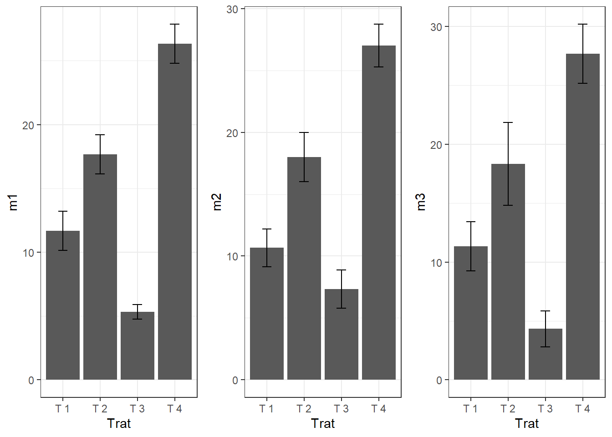

### Gráficos um abaixo do outro


```r
library(gridExtra)
grid.arrange(a,b,c,ncol=1)
```


### Dois na primeira linha e uma no lado esquerdo da segunda linha


```r
library(gridExtra)
grid.arrange(a,b,c,ncol=2)
```

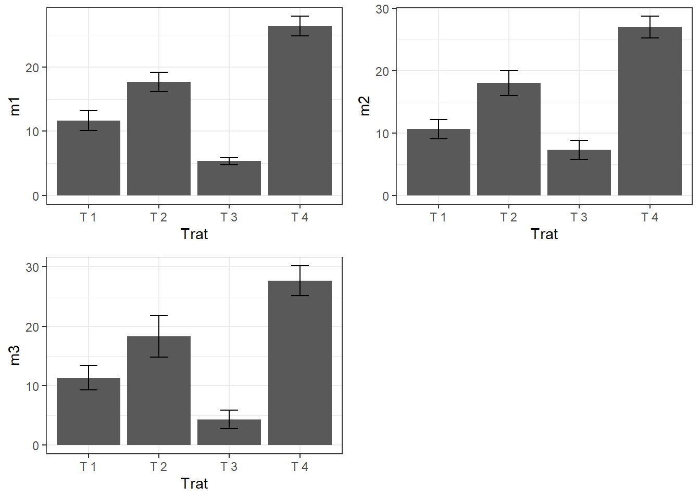

### Dois na primeira linha e uma centralizado na segunda linha


```r
library(gridExtra)
grid.arrange(a,b,c,
             layout_matrix = rbind(c(1,1,2,2), c(NA,3,3,NA)))
```


### Dois na primeira linha e uma a direita na segunda linha

<br>


```r
library(gridExtra)
grid.arrange(a,b,c,
             layout_matrix = rbind(c(1,1,2,2), c(NA,NA,3,3)))
```

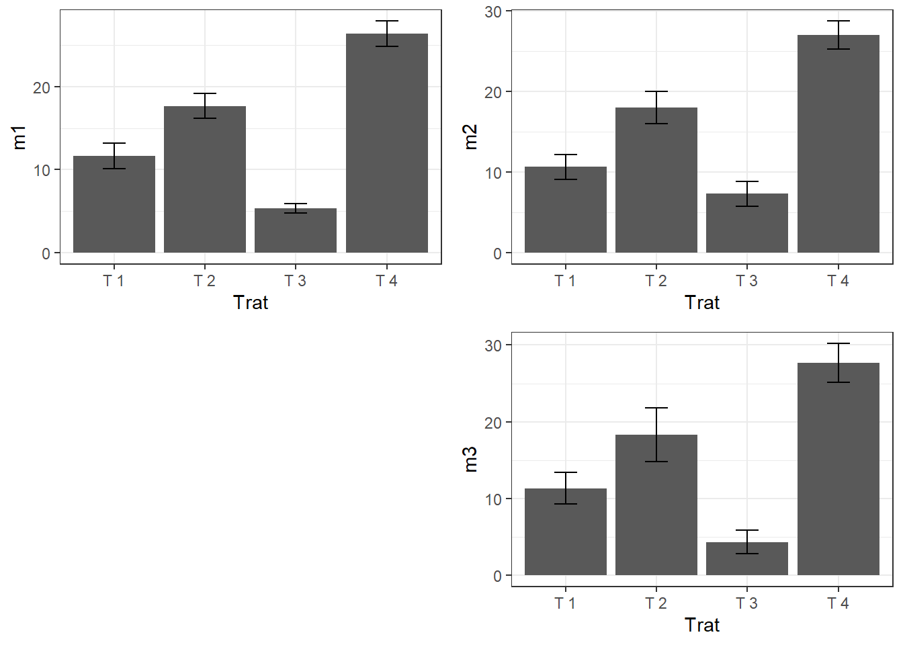

<br><br><br>


# Análise de regressão linear e não-linear

Nas mais diversas áreas da pesquisa, seja ela na área médica, biológica, industrial, química entre outras, é de grande interesse verificar se duas ou mais variáveis estão relacionadas de alguma forma. Para expressar esta relação é muito importante estabelecer um modelo matemático. Este tipo de modelagem é chamado de regressão, e ajuda a entender como determinadas variáveis influenciam outra variável, ou seja, verifica como o comportamento de uma ou mais variáveis podem mudar o comportamento de outra.

Na agronomia, a análise de regressão é muito utilizada por exemplo, para estabelecer doses de máxima resposta de produtos fitossanitários, adubos, populações de plantas, etc..; ou mesmo no estudo do desenvolvimento de uma planta, o que chamamos de curva de crescimento. 

Popularmente, é comum a utilização de curva do tipo polinomial, visto a facilidade de sua utilização e explicação. Todavia, muito dos dados não se comportam dessa forma, ainda que o ajuste seja significativo, podendo assim, levar a conclusões limitadas em função da análise inadequada. Logo, o presente tutorial apresenta diferentes ajustes de regressão linear e não-linear de um mesmo conjunto de dados. 

Neste tutorial, você irá reparar que em quase todos os modelos, o coeficientes serão significativos, demonstrando que quase todos os modelos são válidos para explicar o comportamento dos dados. A questão é, qual o melhor modelo?

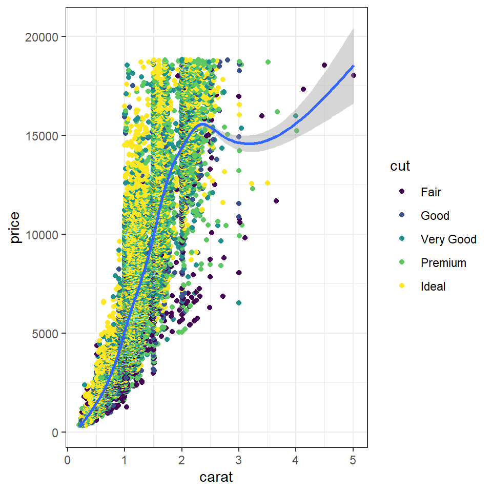

**Obs. Este é um tutorial para demonstração dos modelos de regressão. Alguns casos ele não é significativo ou uma das pressuposições não é atendida. É um tutorial apenas para fins didáticos.**

<br><br>

****

## Conjunto de dados

****

O conjunto de dados é de um experimento cujo objetivo foi avaliar a perda de massa da casca de romã em estufa a $60^oC$. Foi utilizado oito repetições em oito avaliações (60, 210,390, 720, 930, 1410, 1890 e 2370 minutos)


```r
`PERDA DE MASSA CAA`=c(18.15810,17.99376,14.81450,15.39822,21.62234,20.45106,18.65319,20.96547,36.77274,39.92503,34.60874,35.70286,43.57189,42.19460,39.23367,43.36169,52.90384,52.64886,45.61431,47.81200,44.41734,47.40493,46.15373,47.12330,65.29474,67.78859,64.60738,66.24453,63.97464,66.77636,65.37446,65.11912,67.86385,70.68877,69.45271,70.33895,69.43583,71.56150,69.73480,69.97407,69.02813,71.28882,71.17485,71.22420,71.32344,72.46687,71.17063,72.07550,69.16576,71.44176,71.30762,71.34075,71.42775,72.59710,71.28255,72.19996,69.30339,71.59471,71.44040,71.45729,71.53206,72.72733,71.39446,72.32441)
TEMPO=rep(c(60,210,390,720,930,1410,1890,2370),e=8)
dados=data.frame(TEMPO,`PERDA DE MASSA CAA`)
y=c(`PERDA DE MASSA CAA`)
x=c(TEMPO)
data=data.frame(y,x)
```

<br><br>

### Média e desvio-padrão amostral


```r
(media=tapply(y,x, mean))
```

```
##       60      210      390      720      930     1410     1890     2370 
## 18,50708 39,42140 48,00979 65,64748 69,88131 71,21905 71,34541 71,47176
```

```r
(desvio=tapply(y,x, sd))
```

```
##       60      210      390      720      930     1410     1890     2370 
## 2,485224 3,479257 3,133973 1,229025 1,080134 1,007882 1,004939 1,002227
```

```r
(tempo=c(60,210,390,720,930,1410,1890,2370))
```

```
## [1]   60  210  390  720  930 1410 1890 2370
```

<br><br>

****

### Gráficos exploratórios

****

<br><br>

### Gráfico de caixas


```r
boxplot(y~x)
```

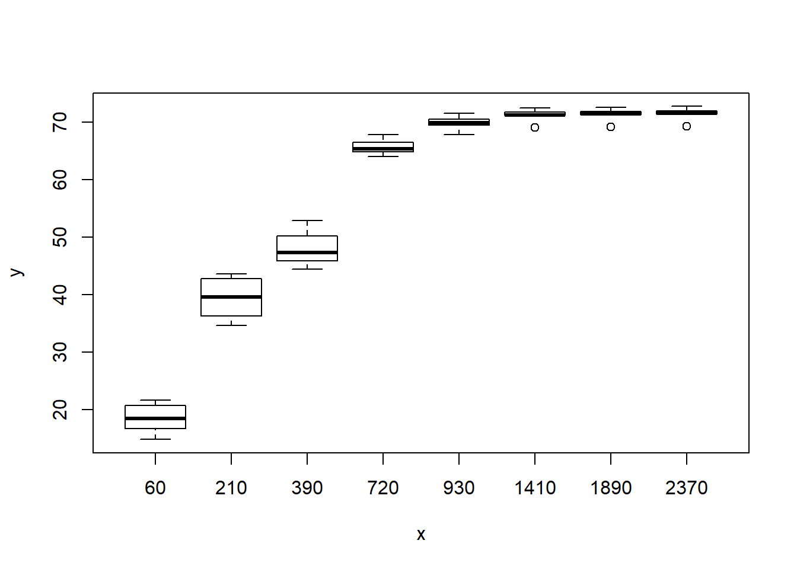

### Gráfico de dispersão


```r
plot(y~x)
```

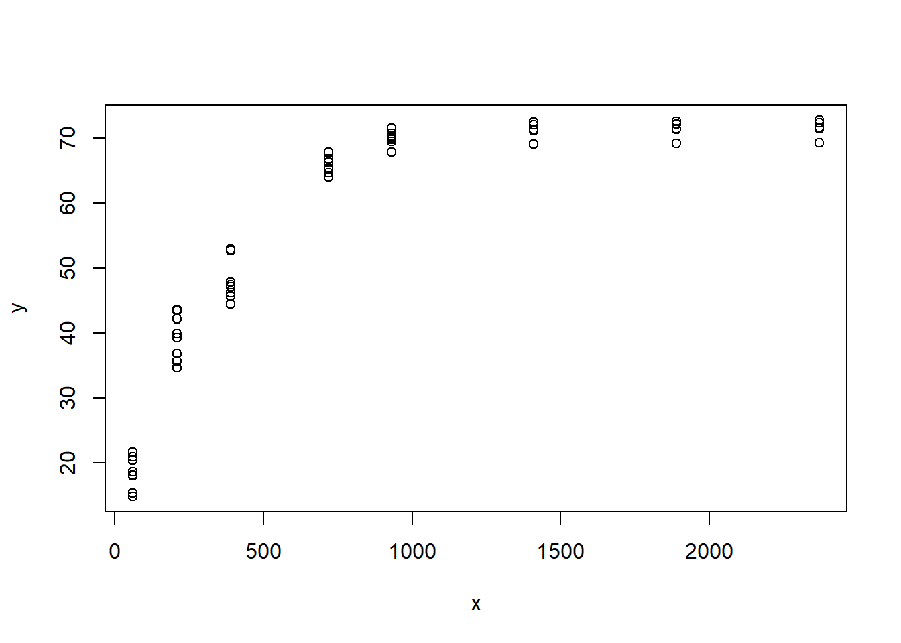

### Gráfico de dispersão com médias


```r
plot(y~x)
points(media~tempo,pch=16,col="red")
```

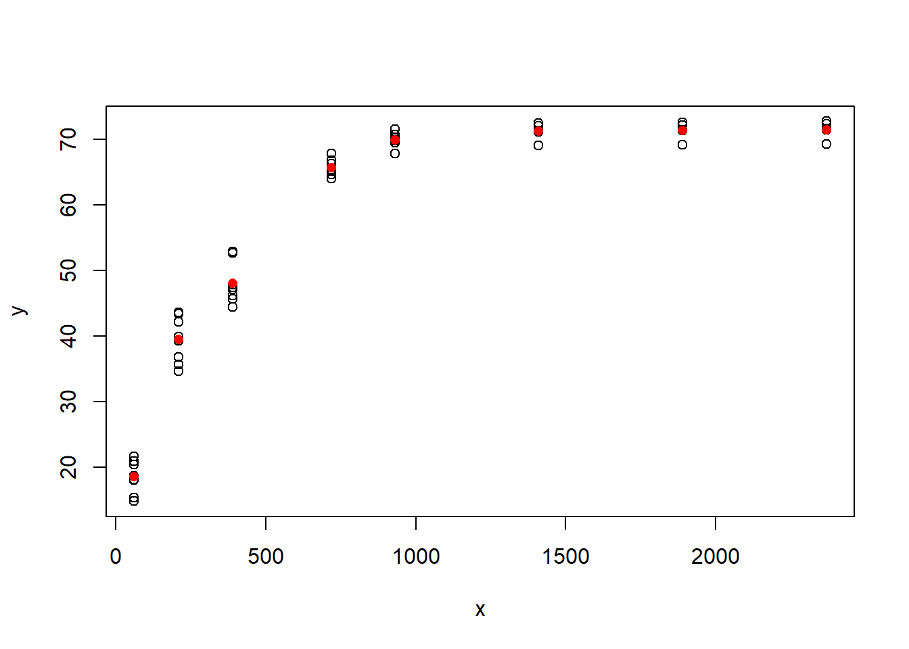

### Gráfico de linhas com as médias


```r
par(mfrow=c(1,2))
plot(media~tempo, type="b")
plot(media~tempo, type="l")
```

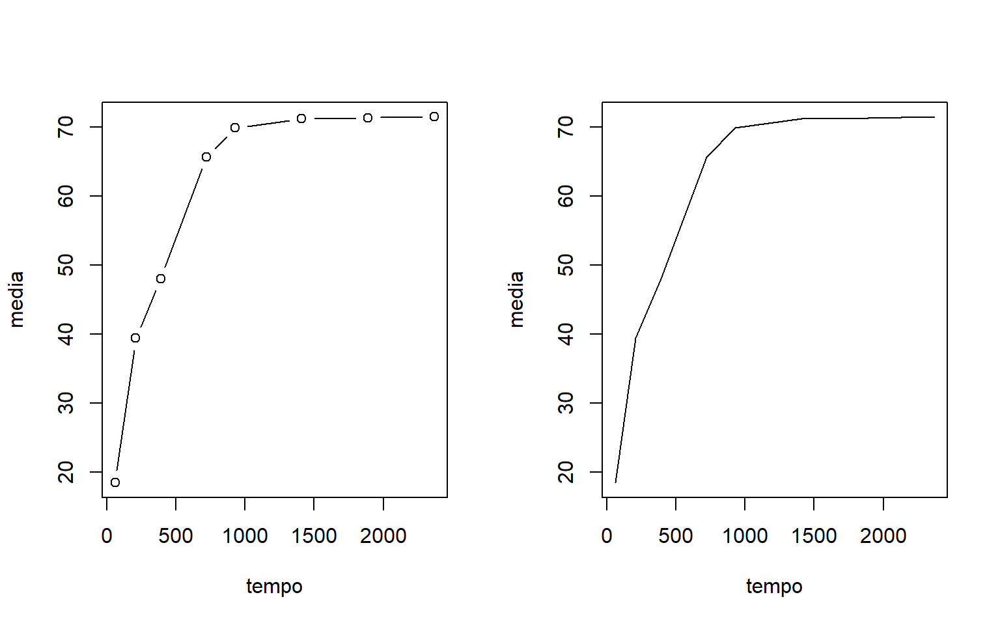

### Histograma


```r
hist(y)
```


<br><br><br>

****

## Linear Simples

****

O modelo de regressão linear simples (MRLS) se define uma relação linear entre a variável dependente e uma variável independente.

$$Y=\beta_1x+\beta_0$$

### Criando o modelo de regressão


```r
modl=lm(y~x)
summary(modl)
```

```
## 
## Call:
## lm(formula = y ~ x)
## 
## Residuals:
##      Min       1Q   Median       3Q      Max 
## -24,4181  -8,1253   0,4191   8,8542  16,0914 
## 
## Coefficients:
##              Estimate Std. Error t value Pr(>|t|)    
## (Intercept) 38,099512   2,368998   16,08  < 2e-16 ***
## x            0,018886   0,001876   10,07 1,15e-14 ***
## ---
## Signif. codes:  0 '***' 0,001 '**' 0,01 '*' 0,05 '.' 0,1 ' ' 1
## 
## Residual standard error: 11,62 on 62 degrees of freedom
## Multiple R-squared:  0,6205,	Adjusted R-squared:  0,6144 
## F-statistic: 101,4 on 1 and 62 DF,  p-value: 1,147e-14
```

### Diagnóstico

### Normalidade dos erros


```r
hnp::hnp(modl)
```

```
## Gaussian model (lm object)
```

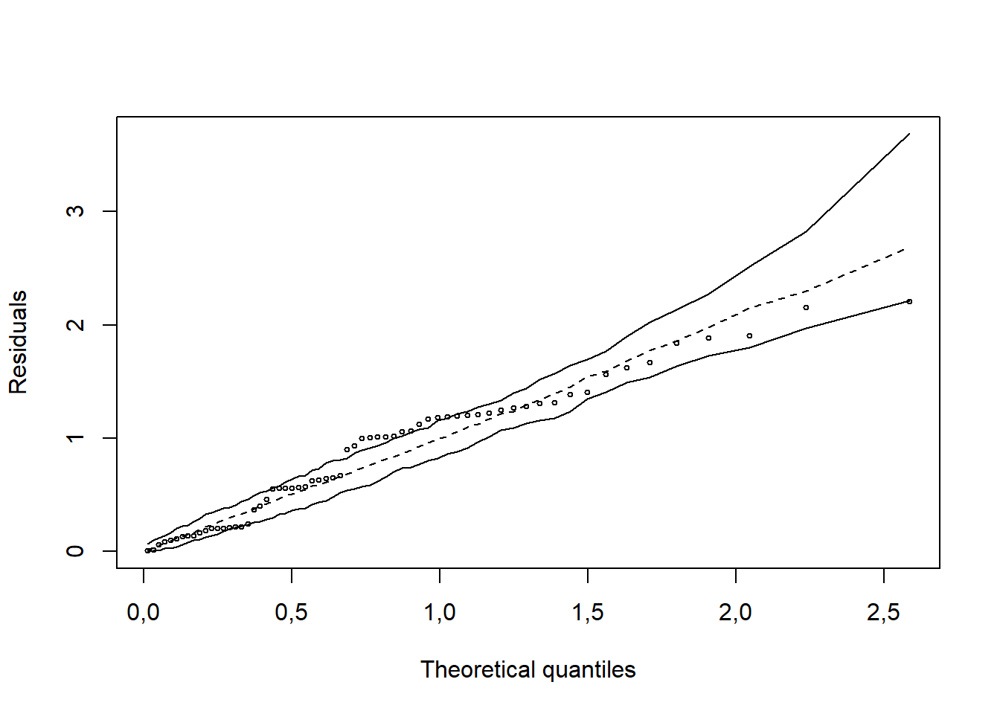

```r
shapiro.test(resid(modl)) # erros não normais
```

```
## 
## 	Shapiro-Wilk normality test
## 
## data:  resid(modl)
## W = 0,94067, p-value = 0,004079
```

### Falta de ajuste (Desvio da regressão)


```r
modq=aov(y~as.factor(x))
anova(modl,modq)
```

```
## Analysis of Variance Table
## 
## Model 1: y ~ x
## Model 2: y ~ as.factor(x)
##   Res.Df    RSS Df Sum of Sq      F    Pr(>F)    
## 1     62 8377,2                                  
## 2     56  236,7  6    8140,5 321,02 < 2,2e-16 ***
## ---
## Signif. codes:  0 '***' 0,001 '**' 0,01 '*' 0,05 '.' 0,1 ' ' 1
```

### Construindo gráfico


```r
par(family="serif")
plot(media~tempo, main="Linear Simples",
     las=1, cex=1.3,
     ylab="Weight loss (%)", xlim=c(0,2500),
     xlab="Time (Minutes)", 
     pch=16, ylim=c(0,80))
curve(coef(modl)[1]+coef(modl)[2]*x, add=TRUE, lty=2)
legend("topleft",
       cex=1,
       bty="n",
       legend = c(expression(hat(Y)==38.09951+0.01889*x)))
```

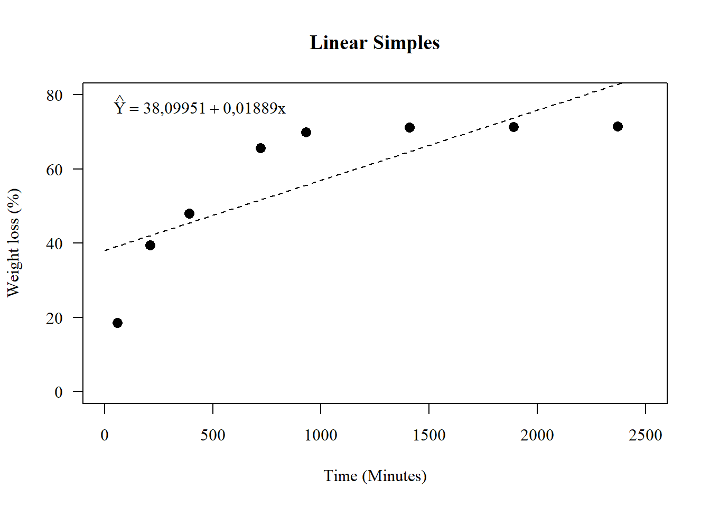

### ggplot2


```r
library(ggplot2)
da=data.frame(media,tempo)
ggplot(da,aes(y=media,x=tempo))+
  geom_point()+
  geom_smooth(method="lm",se = F,col="black",size=0.1,lty=2)+
  theme_classic()+
  ylab("Weight loss (%)")+
  xlab("Time (Minutes)") 
```


<br><br><br>

****

## Quadrático

****

$$Y=\beta_2x^2+\beta_1x+\beta_0$$

### Criando modelo de regressão


```r
mod1=lm(y~x+I(x^2))
summary(mod1)
```

```
## 
## Call:
## lm(formula = y ~ x + I(x^2))
## 
## Residuals:
##     Min      1Q  Median      3Q     Max 
## -11,428  -5,288   1,756   4,360   8,018 
## 
## Coefficients:
##               Estimate Std. Error t value Pr(>|t|)    
## (Intercept)  2,226e+01  1,528e+00   14,57   <2e-16 ***
## x            6,763e-02  3,367e-03   20,09   <2e-16 ***
## I(x^2)      -2,055e-05  1,371e-06  -14,99   <2e-16 ***
## ---
## Signif. codes:  0 '***' 0,001 '**' 0,01 '*' 0,05 '.' 0,1 ' ' 1
## 
## Residual standard error: 5,415 on 61 degrees of freedom
## Multiple R-squared:  0,919,	Adjusted R-squared:  0,9163 
## F-statistic: 345,9 on 2 and 61 DF,  p-value: < 2,2e-16
```

### Diagnóstico do modelo

### Normalidade dos erros


```r
hnp::hnp(mod1)
```

```
## Gaussian model (lm object)
```

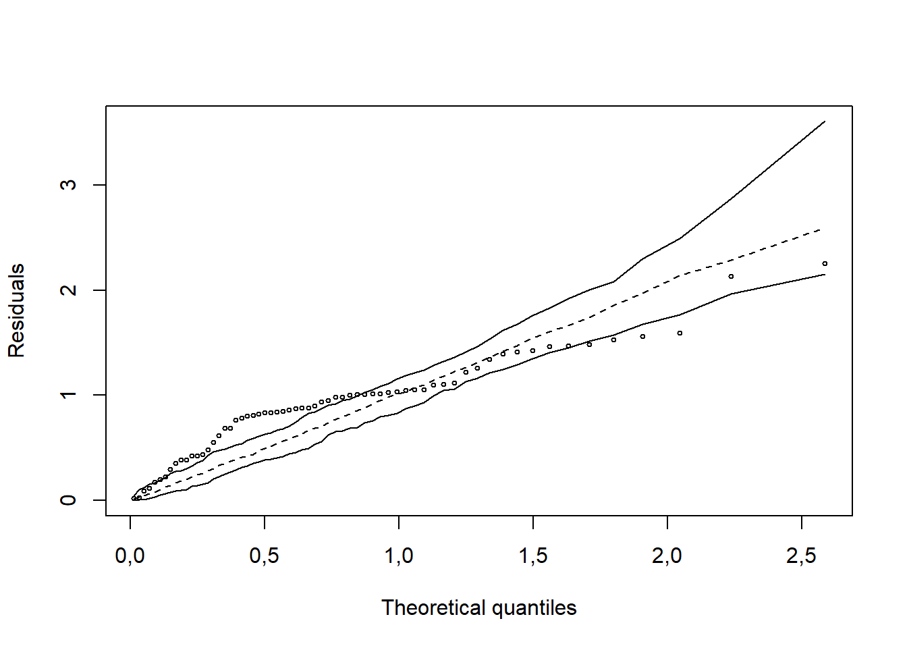

```r
shapiro.test(resid(mod1)) # erros nao normais
```

```
## 
## 	Shapiro-Wilk normality test
## 
## data:  resid(mod1)
## W = 0,92285, p-value = 0,000655
```

### Fator de inflação de variância (Multicolinearidade)


```r
car::vif(mod1) # problema de multicolinearidade
```

```
##        x   I(x^2) 
## 14,84834 14,84834
```

### Falta de ajuste (Desvio da regressão)


```r
modq=aov(y~as.factor(x))
anova(mod1,modq)
```

```
## Analysis of Variance Table
## 
## Model 1: y ~ x + I(x^2)
## Model 2: y ~ as.factor(x)
##   Res.Df     RSS Df Sum of Sq      F    Pr(>F)    
## 1     61 1788,55                                  
## 2     56  236,68  5    1551,9 73,438 < 2,2e-16 ***
## ---
## Signif. codes:  0 '***' 0,001 '**' 0,01 '*' 0,05 '.' 0,1 ' ' 1
```

### Construindo gráfico


```r
par(family="serif")
plot(media~tempo, main="Quadrático",
     las=1, cex=1.3,
     ylab="Weight loss (%)", xlim=c(0,2500),
     xlab="Time (Minutes)", 
     pch=16, ylim=c(0,80))
curve(coef(mod1)[1]+coef(mod1)[2]*x+coef(mod1)[3]*x^2, add=TRUE, lty=2)
legend("topleft",
       cex=1,
       bty="n",
       legend = c(expression(hat(Y)==22.26+0.006763*x-0.00002055*x^2)))
```

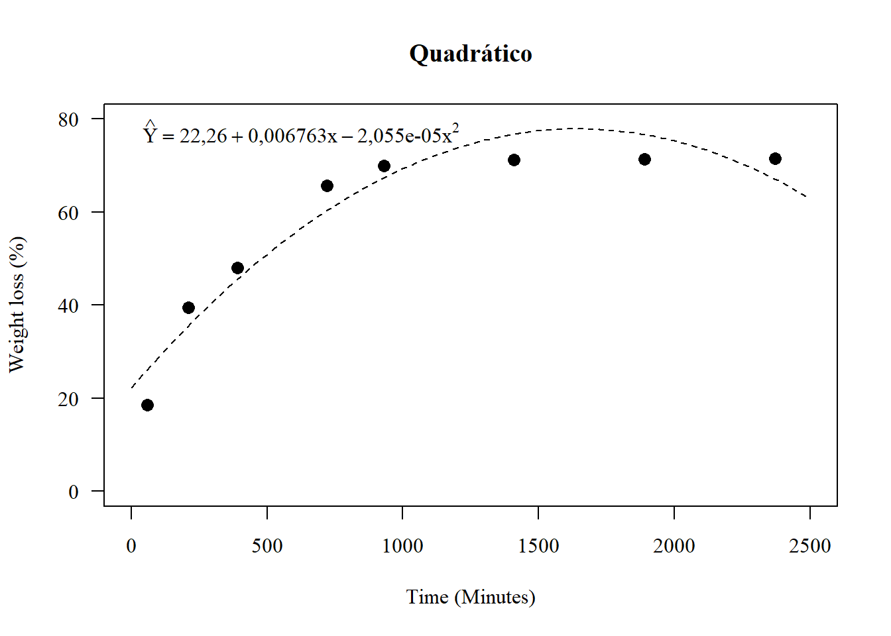

### Ponto de máximo (Ou mínimo)

O ponto de máximo ou mínimo podem ser encontrados de várias formas

### Manualmente


```r
(xmax=-coef(mod1)[2]/(2*coef(mod1)[3]))
```

```
##        x 
## 1645,317
```

```r
(ymax=coef(mod1)[1]+coef(mod1)[2]*xmax+coef(mod1)[3]*xmax^2)
```

```
## (Intercept) 
##    77,89475
```

### Usando o which.max ou which.min


```r
plot(y~x)
tend=curve(coef(mod1)[1]+coef(mod1)[2]*x+coef(mod1)[3]*x^2,add=T)
```

```r
tend$x[which.max(tend$y)]
```

```
## [1] 1653,9
```

```r
# tend$x[which.min(tend$y)] # no caso de mínimo
```

### ggplot2


```r
library(ggplot2)
da=data.frame(media,tempo)
ggplot(da,aes(y=media,x=tempo))+
  geom_point()+
  geom_smooth(method="lm",formula = y~poly(x,2), se = F,col="black",size=0.1,lty=2)+
  theme_classic()+
  ylab("Weight loss (%)")+
  xlab("Time (Minutes)") 
```


<br><br><br>

****

## Cúbico

****

$$Y=\beta_3x^3+\beta_2x^2+\beta_1x+\beta_0$$

### Construindo o modelo


```r
mod2=lm(y~x+I(x^2)+I(x^3))
summary(mod2)
```

```
## 
## Call:
## lm(formula = y ~ x + I(x^2) + I(x^3))
## 
## Residuals:
##     Min      1Q  Median      3Q     Max 
## -6,0186 -1,3299 -0,3928  1,3155  8,0377 
## 
## Coefficients:
##               Estimate Std. Error t value Pr(>|t|)    
## (Intercept)  1,406e+01  9,927e-01   14,16   <2e-16 ***
## x            1,174e-01  4,125e-03   28,47   <2e-16 ***
## I(x^2)      -7,536e-05  4,189e-06  -17,99   <2e-16 ***
## I(x^3)       1,524e-08  1,149e-09   13,27   <2e-16 ***
## ---
## Signif. codes:  0 '***' 0,001 '**' 0,01 '*' 0,05 '.' 0,1 ' ' 1
## 
## Residual standard error: 2,753 on 60 degrees of freedom
## Multiple R-squared:  0,9794,	Adjusted R-squared:  0,9784 
## F-statistic: 951,1 on 3 and 60 DF,  p-value: < 2,2e-16
```

### Diagnóstico do modelo

### Normalidade dos erros


```r
hnp::hnp(mod2)
```

```
## Gaussian model (lm object)
```

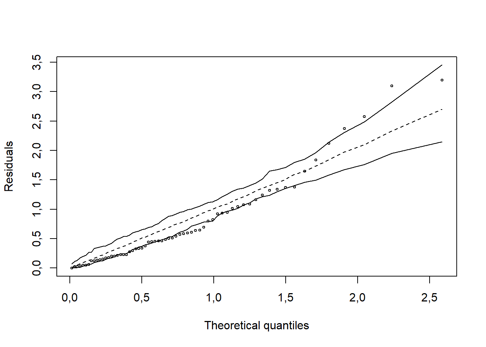

```r
shapiro.test(resid(mod2)) # Erros nao normais
```

```
## 
## 	Shapiro-Wilk normality test
## 
## data:  resid(mod2)
## W = 0,94796, p-value = 0,009093
```

### Fator de inflação de variância (Multicolinearidade) 


```r
car::vif(mod2) # alta multicolinearidade
```

```
##         x    I(x^2)    I(x^3) 
##  86,25922 536,46498 221,25164
```

### Falta de ajuste (Desvio da regressão)


```r
modq=aov(y~as.factor(x))
anova(mod2,modq)
```

```
## Analysis of Variance Table
## 
## Model 1: y ~ x + I(x^2) + I(x^3)
## Model 2: y ~ as.factor(x)
##   Res.Df    RSS Df Sum of Sq      F    Pr(>F)    
## 1     60 454,60                                  
## 2     56 236,68  4    217,93 12,891 1,666e-07 ***
## ---
## Signif. codes:  0 '***' 0,001 '**' 0,01 '*' 0,05 '.' 0,1 ' ' 1
```

### Construindo o gráfico


```r
par(family="serif")
plot(media~tempo, main="Cúbico",
     las=1, cex=1.3,
     ylab="Weight loss (%)", xlim=c(0,2500),
     xlab="Time (Minutes)", 
     pch=16, ylim=c(0,80))
curve(coef(mod2)[1]+coef(mod2)[2]*x+coef(mod2)[3]*x^2+coef(mod2)[4]*x^3, add=TRUE, lty=2)
legend("topleft",
       cex=1,
       bty="n",
       legend = c(expression(hat(Y)==14.06+0.01174*x-0.00007536*x^2+0.00000001524*x^3)))
```


### ponto de máximo, mínimo e inflexão


```r
plot(media~tempo)
curva=curve(coef(mod2)[1]+coef(mod2)[2]*x+coef(mod2)[3]*x^2+coef(mod2)[4]*x^3, add=TRUE, lty=2)
```

```r
# ponto de inflexão
pi=-(2*coef(mod2)[3])/(3*2*coef(mod2)[4])

# ponto de máximo anterior ao ponto de inflexão
xmax=curva$x[which.max(curva$y[curva$x<pi])]

# ponto de mínimo posterior ao ponto de inflexão
xmin=curva$x[which.max(curva$y[curva$x<pi])+which.min(curva$y[curva$x>xmax])]
```


```r
plot(media~tempo)
curva=curve(coef(mod2)[1]+coef(mod2)[2]*x+coef(mod2)[3]*x^2+coef(mod2)[4]*x^3, add=TRUE, lty=1)
abline(v=c(xmax,xmin,pi),lty=2)
```


### ggplot2


```r
library(ggplot2)
da=data.frame(media,tempo)
ggplot(da,aes(y=media,x=tempo))+
  geom_point()+
  geom_smooth(method="lm",formula = y~poly(x,3), se = F,col="black",size=0.1,lty=2)+
  theme_classic()+
  ylab("Weight loss (%)")+
  xlab("Time (Minutes)") 
```


<br><br><br>

****

## Logarítmico

****

$$Y=\beta_{0}+\beta_{1}\log(x)$$

### Construindo modelo


```r
modelog=lm(y~log(x))
summary(modelog)
```

```
## 
## Call:
## lm(formula = y ~ log(x))
## 
## Residuals:
##     Min      1Q  Median      3Q     Max 
## -8,5359 -3,5194 -0,5506  3,6366  8,4348 
## 
## Coefficients:
##             Estimate Std. Error t value Pr(>|t|)    
## (Intercept) -42,7285     3,3261  -12,85   <2e-16 ***
## log(x)       15,5158     0,5096   30,45   <2e-16 ***
## ---
## Signif. codes:  0 '***' 0,001 '**' 0,01 '*' 0,05 '.' 0,1 ' ' 1
## 
## Residual standard error: 4,724 on 62 degrees of freedom
## Multiple R-squared:  0,9373,	Adjusted R-squared:  0,9363 
## F-statistic: 927,1 on 1 and 62 DF,  p-value: < 2,2e-16
```

### Diagnóstico do modelo


```r
hnp::hnp(modelog)
```

```
## Gaussian model (lm object)
```

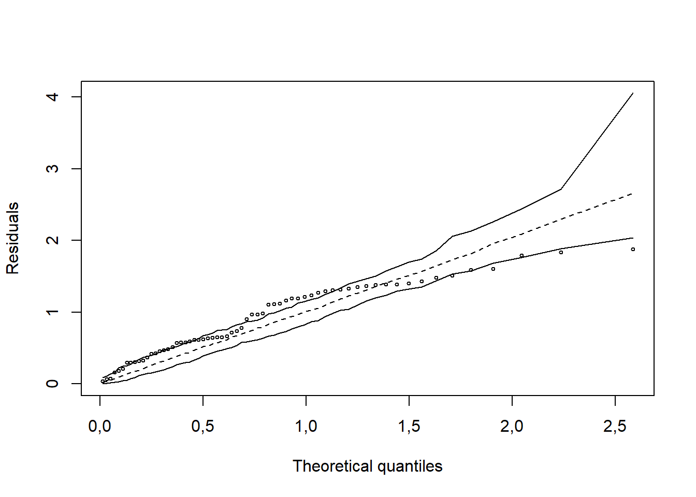

```r
shapiro.test(resid(modelog))
```

```
## 
## 	Shapiro-Wilk normality test
## 
## data:  resid(modelog)
## W = 0,94476, p-value = 0,006371
```

### Construindo gráfico


```r
plot(media~tempo, main="Log",
     las=1, cex=1.3,
     ylab="Weight loss (%)", xlim=c(0,2500),
     xlab="Time (Minutes)", 
     pch=16, ylim=c(0,80))
curve(-42.73+15.52*log(x),add=T,lty=2)
legend("topleft",
       cex=1,
       bty="n",
       legend = c(expression(hat(Y)==-42.73+15.52*log(x))))
```

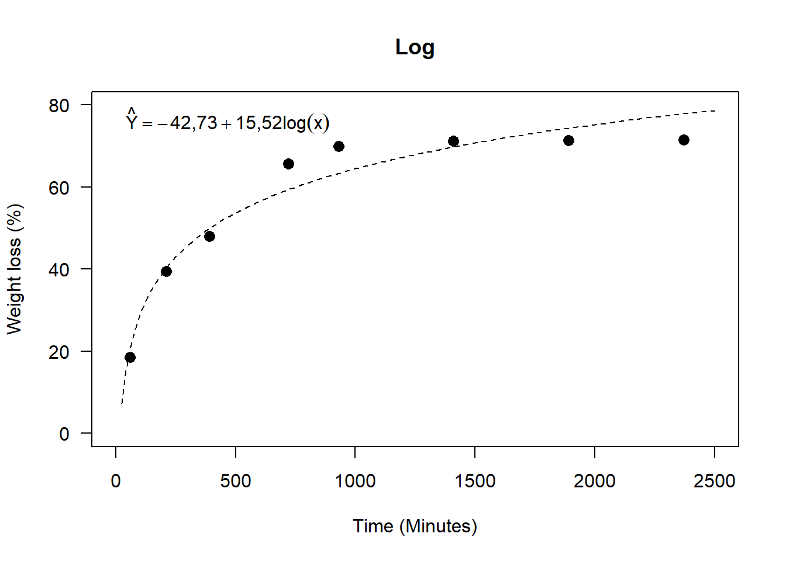

<br><br><br>

****

## Michaelis-Menten (MM)

****

$$Y=\frac{A\times x}{V+x}$$

### Construindo o modelo


```r
data=data.frame(y,x)
n0 <- nls(formula=y~A*x/(V+x), data=data,
          start=list(A=max(y), V=100), trace=TRUE)
```

```
## 2726,427 :   72,72733 100,00000
## 820,4424 :   78,84265 179,59765
## 691,338 :   80,90678 212,88993
## 690,8008 :   81,02471 215,24858
## 690,8006 :   81,02129 215,20409
## 690,8006 :   81,02137 215,20519
```

```r
summary(n0)
```

```
## 
## Formula: y ~ A * x/(V + x)
## 
## Parameters:
##   Estimate Std. Error t value Pr(>|t|)    
## A   81,021      1,004   80,67   <2e-16 ***
## V  215,205     11,711   18,38   <2e-16 ***
## ---
## Signif. codes:  0 '***' 0,001 '**' 0,01 '*' 0,05 '.' 0,1 ' ' 1
## 
## Residual standard error: 3,338 on 62 degrees of freedom
## 
## Number of iterations to convergence: 5 
## Achieved convergence tolerance: 3,035e-07
```

### Diagnóstico do modelo


```r
shapiro.test(resid(n0))
```

```
## 
## 	Shapiro-Wilk normality test
## 
## data:  resid(n0)
## W = 0,9717, p-value = 0,1482
```

### Construindo o gráfico


```r
A <- coef(n0)[1]; V <- coef(n0)[2]
par(family="serif")
plot(media~tempo, main="Michaelis Menten",
     las=1, cex=1.3,
     ylab="Weight loss (%)", xlim=c(0,2500),
     xlab="Time (Minutes)", 
     pch=16, ylim=c(0,80))
curve(A*x/(V+x), add=TRUE, lty=2)
legend("topleft",
       cex=1,
       bty="n",
       legend = c(expression(hat(Y)==frac(81.021*x,(215.205+x)))))
```


### Utilizando outro método


```r
m.m <- nls(y ~ SSmicmen(x, Vm, K), data = data)
m.m
```

```
## Nonlinear regression model
##   model: y ~ SSmicmen(x, Vm, K)
##    data: data
##     Vm      K 
##  81,02 215,20 
##  residual sum-of-squares: 690,8
## 
## Number of iterations to convergence: 0 
## Achieved convergence tolerance: 2,047e-06
```

```r
plot(media~tempo, main="Michaelis-Menten",
     las=1, cex=1.3,
     ylab="Weight loss (%)", xlim=c(0,2500),
     xlab="Time (Minutes)", 
     pch=16, ylim=c(0,80))
curve((81.02135*x)/(215.20499+x), add=T)
```


<br><br><br>

****

## MM Modificado

****

$$Y=\frac{A\times x}{V+x}+D\times x $$

### Construindo modelo


```r
data=data.frame(y,x)
n1 <- nls(formula=y~A*x/(V+x)+D*x, data=data,
          start=list(A=max(y), V=100,D=10), trace=TRUE)
```

```
## 10206286603 :   72,72733 100,00000  10,00000
## 802,0047 :   8,061554e+01  1,857416e+02 -9,194725e-04
## 545,3405 :   91,710079373 263,748404929  -0,004630648
## 521,8705 :   96,954052340 297,103221016  -0,006224234
## 521,0745 :   98,085315801 303,935203239  -0,006567869
## 521,0613 :   98,241471280 304,881731574  -0,006617559
## 521,0611 :   98,261118528 305,001695810  -0,006623916
## 521,0611 :   98,263575225 305,016711452  -0,006624713
```

```r
summary(n1)
```

```
## 
## Formula: y ~ A * x/(V + x) + D * x
## 
## Parameters:
##     Estimate Std. Error t value Pr(>|t|)    
## A  98,263575   4,439290  22,135  < 2e-16 ***
## V 305,016711  25,778649  11,832  < 2e-16 ***
## D  -0,006625   0,001563  -4,239 7,73e-05 ***
## ---
## Signif. codes:  0 '***' 0,001 '**' 0,01 '*' 0,05 '.' 0,1 ' ' 1
## 
## Residual standard error: 2,923 on 61 degrees of freedom
## 
## Number of iterations to convergence: 7 
## Achieved convergence tolerance: 9,342e-06
```

### Construindo gráfico


```r
A <- coef(n1)[1]; V <- coef(n1)[2]; D<-coef(n1)[3]
par(family="serif")
plot(media~tempo, main="Michaelis Menten (Corrigido)",
     las=1, cex=1.3,
     ylab="Weight loss (%)", xlim=c(0,2500),
     xlab="Time (Minutes)", 
     pch=16, ylim=c(0,80))
curve(A*x/(V+x)+D*x, add=TRUE, lty=2)
legend("topleft",
       cex=1,
       bty="n",
       legend = c(expression(hat(Y)==frac(98.263572*x,(305.016698+x))-0.006625*x)))
```


<br><br><br>

****

## Segmentada linear

****

$$Y=\beta_{1}X+\beta_{0} (if\leq X_1)$$

### Construindo o modelo linear 


```r
modelo_linear<- lm(y~x)
summary(modelo_linear)
```

```
## 
## Call:
## lm(formula = y ~ x)
## 
## Residuals:
##      Min       1Q   Median       3Q      Max 
## -24,4181  -8,1253   0,4191   8,8542  16,0914 
## 
## Coefficients:
##              Estimate Std. Error t value Pr(>|t|)    
## (Intercept) 38,099512   2,368998   16,08  < 2e-16 ***
## x            0,018886   0,001876   10,07 1,15e-14 ***
## ---
## Signif. codes:  0 '***' 0,001 '**' 0,01 '*' 0,05 '.' 0,1 ' ' 1
## 
## Residual standard error: 11,62 on 62 degrees of freedom
## Multiple R-squared:  0,6205,	Adjusted R-squared:  0,6144 
## F-statistic: 101,4 on 1 and 62 DF,  p-value: 1,147e-14
```

### Construindo o modelo segmentado


```r
library(segmented)
modelo_pieciwise<- segmented(modelo_linear, seg.Z = ~x, psi=1000)
modelo_pieciwise
```

```
## Call: segmented.lm(obj = modelo_linear, seg.Z = ~x, psi = 1000)
## 
## Meaningful coefficients of the linear terms:
## (Intercept)            x         U1.x  
##    19,83682      0,06684     -0,06582  
## 
## Estimated Break-Point(s):
## psi1.x  
##  751,4
```

```r
summary(modelo_pieciwise)
```

```
## 
## 	***Regression Model with Segmented Relationship(s)***
## 
## Call: 
## segmented.lm(obj = modelo_linear, seg.Z = ~x, psi = 1000)
## 
## Estimated Break-Point(s):
##            Est. St.Err
## psi1.x 751,438 26,797
## 
## Meaningful coefficients of the linear terms:
##              Estimate Std. Error t value Pr(>|t|)    
## (Intercept) 19,836818   1,106834   17,92   <2e-16 ***
## x            0,066839   0,002612   25,59   <2e-16 ***
## U1.x        -0,065819   0,002873  -22,91       NA    
## ---
## Signif. codes:  0 '***' 0,001 '**' 0,01 '*' 0,05 '.' 0,1 ' ' 1
## 
## Residual standard error: 3,635 on 60 degrees of freedom
## Multiple R-Squared: 0,9641,  Adjusted R-squared: 0,9623 
## 
## Convergence attained in 2 iter. (rel. change 0)
```

### Definindo limite com base no platô


```r
y1=y[x<=modelo_pieciwise$psi[2]]
x11=x[x<=modelo_pieciwise$psi[2]]
```

### Curva do primeiro segmento


```r
mod=lm(y1~x11)
summary(mod)
```

```
## 
## Call:
## lm(formula = y1 ~ x11)
## 
## Residuals:
##     Min      1Q  Median      3Q     Max 
## -9,0327 -2,9998 -0,7374  2,1557  9,6988 
## 
## Coefficients:
##              Estimate Std. Error t value Pr(>|t|)    
## (Intercept) 19,836818   1,532481   12,94 8,22e-14 ***
## x11          0,066839   0,003617   18,48  < 2e-16 ***
## ---
## Signif. codes:  0 '***' 0,001 '**' 0,01 '*' 0,05 '.' 0,1 ' ' 1
## 
## Residual standard error: 5,033 on 30 degrees of freedom
## Multiple R-squared:  0,9193,	Adjusted R-squared:  0,9166 
## F-statistic: 341,6 on 1 and 30 DF,  p-value: < 2,2e-16
```

### Construindo gráfico


```r
par(pch=16,las=1); par(family="serif")
plot(media~tempo, 
     las=1, cex=1.3, main="Segmentado Linear",
     ylab="Weight loss (%)", xlim=c(0,2500),
     xlab="Time (Minutes)", 
     pch=16, ylim=c(0,80))
a=curve(coef(mod)[1]+coef(mod)[2]*x, 
        to=modelo_pieciwise$psi[2], lty=2,add=T)
plato=a$y[round(a$x,3)==round(modelo_pieciwise$psi[2],3)]
lines(c(modelo_pieciwise$psi[2],max(x)),
      c(plato,plato),lty=2)
legend("topleft",
       cex=1,
       legend=expression(hat(Y)==19.836817+0.066839*x~("if"~x~"<"~751.4)), bty="n")
```


<br><br><br>

****

## Segmentada quadrático

****

$$Y=\beta_{2}X^2+\beta_{1}X+\beta_{0} (if\leq X_1)$$

### Construindo o modelo quadrático


```r
modelo_linear<- lm(y~x+I(x^2))
summary(modelo_linear)
```

```
## 
## Call:
## lm(formula = y ~ x + I(x^2))
## 
## Residuals:
##     Min      1Q  Median      3Q     Max 
## -11,428  -5,288   1,756   4,360   8,018 
## 
## Coefficients:
##               Estimate Std. Error t value Pr(>|t|)    
## (Intercept)  2,226e+01  1,528e+00   14,57   <2e-16 ***
## x            6,763e-02  3,367e-03   20,09   <2e-16 ***
## I(x^2)      -2,055e-05  1,371e-06  -14,99   <2e-16 ***
## ---
## Signif. codes:  0 '***' 0,001 '**' 0,01 '*' 0,05 '.' 0,1 ' ' 1
## 
## Residual standard error: 5,415 on 61 degrees of freedom
## Multiple R-squared:  0,919,	Adjusted R-squared:  0,9163 
## F-statistic: 345,9 on 2 and 61 DF,  p-value: < 2,2e-16
```

### Construindo o modelo segmentado


```r
library(segmented)
modelo_pieciwise1<- segmented(modelo_linear)
modelo_pieciwise1
```

```
## Call: segmented.lm(obj = modelo_linear)
## 
## Meaningful coefficients of the linear terms:
## (Intercept)            x       I(x^2)         U1.x  
##   1,580e+01    9,004e-02   -4,424e-06   -7,368e-02  
## 
## Estimated Break-Point(s):
## psi1.x  
##  560,2
```

```r
summary(modelo_pieciwise1)
```

```
## 
## 	***Regression Model with Segmented Relationship(s)***
## 
## Call: 
## segmented.lm(obj = modelo_linear)
## 
## Estimated Break-Point(s):
##            Est. St.Err
## psi1.x 560,234 28,392
## 
## Meaningful coefficients of the linear terms:
##               Estimate Std. Error t value Pr(>|t|)    
## (Intercept)  1,580e+01  1,201e+00  13,151   <2e-16 ***
## x            9,004e-02  4,718e-03  19,083   <2e-16 ***
## I(x^2)      -4,424e-06  1,764e-06  -2,508   0,0149 *  
## U1.x        -7,368e-02  6,596e-03 -11,171       NA    
## ---
## Signif. codes:  0 '***' 0,001 '**' 0,01 '*' 0,05 '.' 0,1 ' ' 1
## 
## Residual standard error: 3,073 on 59 degrees of freedom
## Multiple R-Squared: 0,9748,  Adjusted R-squared: 0,973 
## 
## Convergence attained in 2 iter. (rel. change 0)
```

### Valores para o primeiro segmento

Obs. No caso do linear simples, podemo usar apenas os pontos abaixo do platô, no caso do segmentado quadrático aconselho englobar o ponto acima do acusado no platô. No meu caso é o ponto 930.


```r
y1=y[x<=930]
x11=x[x<=930]
mod=lm(y1~x11+I(x11^2))
summary(mod)
```

```
## 
## Call:
## lm(formula = y1 ~ x11 + I(x11^2))
## 
## Residuals:
##     Min      1Q  Median      3Q     Max 
## -5,5773 -2,1731  0,0432  1,2608  8,0591 
## 
## Coefficients:
##               Estimate Std. Error t value Pr(>|t|)    
## (Intercept)  1,357e+01  1,379e+00   9,839 7,13e-12 ***
## x11          1,175e-01  7,321e-03  16,047  < 2e-16 ***
## I(x11^2)    -6,173e-05  7,151e-06  -8,632 2,15e-10 ***
## ---
## Signif. codes:  0 '***' 0,001 '**' 0,01 '*' 0,05 '.' 0,1 ' ' 1
## 
## Residual standard error: 3,293 on 37 degrees of freedom
## Multiple R-squared:  0,9715,	Adjusted R-squared:   0,97 
## F-statistic: 630,9 on 2 and 37 DF,  p-value: < 2,2e-16
```

### Construindo o gráfico


```r
par(pch=16,las=1); par(family="serif")
plot(media~tempo, main="Segmentado Quadrático",
     las=1, cex=1.3,
     ylab="Weight loss (%)", xlim=c(0,2500),
     xlab="Time (Minutes)", 
     pch=16, ylim=c(0,80))
maximo=-coef(mod)[2]/(2*coef(mod)[3])
a=curve(coef(mod)[1]+coef(mod)[2]*x+coef(mod)[3]*x^2, 
        to=maximo, lty=2,
        add=T)
plato=a$y[round(a$x,3)==round(maximo,3)]
lines(c(maximo,max(x)),
      c(plato,plato),lty=2)
legend("topleft",
       legend=expression(Y==13.57+0.1175*x-0.00006173*x^2~("if"~x~"<"~951.5095)), bty="n")
```


<br><br><br>

****

## Mitscherlich

****

$$Y=A \times(1-exp((B\times C)-(C \times X)$$


```r
modelo2=nls(y~A*(1-exp((B*C)-(C*x))),
           start = list(A=80,B=-10,C=0.01),data=data)
summary(modelo2)
```

```
## 
## Formula: y ~ A * (1 - exp((B * C) - (C * x)))
## 
## Parameters:
##     Estimate Std. Error t value Pr(>|t|)    
## A  7,232e+01  5,606e-01 129,004  < 2e-16 ***
## B -4,438e+01  8,610e+00  -5,155  2,9e-06 ***
## C  2,874e-03  1,302e-04  22,066  < 2e-16 ***
## ---
## Signif. codes:  0 '***' 0,001 '**' 0,01 '*' 0,05 '.' 0,1 ' ' 1
## 
## Residual standard error: 2,63 on 61 degrees of freedom
## 
## Number of iterations to convergence: 7 
## Achieved convergence tolerance: 8,634e-07
```

```r
par(pch=16,las=1); par(family="serif")
plot(media~tempo,main="Mitscherlich",
     las=1, cex=1.3,
     ylab="Weight loss (%)", xlim=c(0,2500),
     xlab="Time (Minutes)", 
     pch=16, ylim=c(0,80))
b=summary(modelo2)
A=b$coefficients[1,1]
B=b$coefficients[2,1]
C=b$coefficients[3,1]
a=curve(A*(1-exp((B*C)-(C*x))),lty=2,add=T)
legend("topleft",expression(Y==72.31912*(1-e^{(-44.382759*0.002873)-(0.002873*x)})),bty="n")
```


<br><br><br>

****

## Logística de 3 termos

****

$$Y = \frac{d}{1+exp(b(x-e))}$$


```r
library(drc)
model <- drm(y ~ x, fct = LL.3(), data = data)
summary(model)
```

```
## 
## Model fitted: Log-logistic (ED50 as parameter) with lower limit at 0 (3 parms)
## 
## Parameter estimates:
## 
##                 Estimate Std. Error t-value   p-value    
## b:(Intercept)  -1,058194   0,062275 -16,992 < 2,2e-16 ***
## d:(Intercept)  79,599836   1,684582  47,252 < 2,2e-16 ***
## e:(Intercept) 208,408451  12,445682  16,745 < 2,2e-16 ***
## ---
## Signif. codes:  0 '***' 0,001 '**' 0,01 '*' 0,05 '.' 0,1 ' ' 1
## 
## Residual standard error:
## 
##  3,340759 (61 degrees of freedom)
```

```r
par(family="serif")
plot(model,main="Logístico LL.3",
     las=1, cex=1.3,
     ylab="Weight loss (%)", 
     xlab="Time (Minutes)", 
     pch=16,lty=2)
legend("topleft",
       legend=expression(hat(Y)==frac(79.599836,
                                      1+exp(-1.058194(x-208.408455)))), bty="n")
```


### ED, DL ou EC


```r
ED(model,10) ## Ed10
```

```
## 
## Estimated effective doses
## 
##        Estimate Std. Error
## e:1:10   26,131      2,755
```

```r
ED(model,50) ## ED50
```

```
## 
## Estimated effective doses
## 
##        Estimate Std. Error
## e:1:50  208,408     12,446
```

```r
ED(model,90) ## ED90
```

```
## 
## Estimated effective doses
## 
##        Estimate Std. Error
## e:1:90   1662,2      267,4
```

<br><br><br>

****

## Logística de 4 termos

****

$$Y = c-\frac{d-c}{1+exp(b(x-e))}$$


```r
model1 <- drm(y ~ x, fct = LL.4(), data = data)
summary(model1)
```

```
## 
## Model fitted: Log-logistic (ED50 as parameter) (4 parms)
## 
## Parameter estimates:
## 
##               Estimate Std. Error  t-value   p-value    
## b:(Intercept)  -1,6960     0,1552 -10,9279 6,668e-16 ***
## c:(Intercept)  15,1899     1,9728   7,6995 1,597e-10 ***
## d:(Intercept)  74,5348     1,0697  69,6796 < 2,2e-16 ***
## e:(Intercept) 289,3971    16,5292  17,5082 < 2,2e-16 ***
## ---
## Signif. codes:  0 '***' 0,001 '**' 0,01 '*' 0,05 '.' 0,1 ' ' 1
## 
## Residual standard error:
## 
##  2,950196 (60 degrees of freedom)
```

```r
par(family="serif")
plot(model,main="Logístico LL.4",
     las=1, cex=1.3,
     ylab="Weight loss (%)", 
     xlab="Time (Minutes)", 
     pch=16,lty=2)
legend("topleft",
       legend=expression(hat(Y)==15.1899+frac(74.59984-15.1899,
                                              1+exp(-1.6960(x-289.3971)))), bty="n")
```


### ED, DL ou EC


```r
ED(model,10) ## Ed10
```

```
## 
## Estimated effective doses
## 
##        Estimate Std. Error
## e:1:10   26,131      2,755
```

```r
ED(model,50) ## ED50
```

```
## 
## Estimated effective doses
## 
##        Estimate Std. Error
## e:1:50  208,408     12,446
```

```r
ED(model,90) ## ED90
```

```
## 
## Estimated effective doses
## 
##        Estimate Std. Error
## e:1:90   1662,2      267,4
```

<br><br><br>

****

## Yield Loss

****

$$\hat{Y}=\frac{i\times x}{1+\frac{i\times x}{A}}$$


```r
#library(devtools)
#install_github("OnofriAndreaPG/aomisc")
par(family="serif")
library(aomisc)
model2 <- drm(y ~ x, fct = DRC.YL(), data = data)
summary(model2)
```

```
## 
## Model fitted: Yield-Loss function (Cousens, 1985) (2 parms)
## 
## Parameter estimates:
## 
##                Estimate Std. Error t-value   p-value    
## i:(Intercept)  0,376483   0,016637  22,629 < 2,2e-16 ***
## A:(Intercept) 81,021404   0,996137  81,336 < 2,2e-16 ***
## ---
## Signif. codes:  0 '***' 0,001 '**' 0,01 '*' 0,05 '.' 0,1 ' ' 1
## 
## Residual standard error:
## 
##  3,337955 (62 degrees of freedom)
```

```r
plot(model2,main="Yield Loss",
     las=1, cex=1.3,
     ylab="Weight loss (%)", 
     xlab="Time (Minutes)", 
     pch=16,lty=2)
legend("topleft",
       legend=expression(hat(YL)==frac(0.376483*x,
                                       1+frac(0.376483*x,81.021705))), bty="n")
```


<br><br><br>

****

## Weibull 3

****

$$\hat{Y}=d\times e^{-e^{b\times log(x)-e}}$$

```r
par(family="serif")
model3 <- drm(y ~ x, fct = w3(), data = data)
summary(model3)
```

```
## 
## Model fitted: Weibull (type 1) with lower limit at 0 (3 parms)
## 
## Parameter estimates:
## 
##                 Estimate Std. Error t-value   p-value    
## b:(Intercept)  -0,621433   0,051944 -11,963 < 2,2e-16 ***
## d:(Intercept)  88,316665   3,466514  25,477 < 2,2e-16 ***
## e:(Intercept) 135,558602  10,937572  12,394 < 2,2e-16 ***
## ---
## Signif. codes:  0 '***' 0,001 '**' 0,01 '*' 0,05 '.' 0,1 ' ' 1
## 
## Residual standard error:
## 
##  3,702132 (61 degrees of freedom)
```

```r
plot(model3,main="Weibull 3",
     las=1, cex=1.3,
     ylab="Weight loss (%)", 
     xlab="Time (Minutes)", 
     pch=16,lty=2)
legend("topleft",
       legend=expression(hat(YL)==88.316665*e^(-e^{(-0.621433*(log(x)-135.558606))})), bty="n")
```


<br><br><br>

****

## Weibul 4 

****

$$\hat{Y} = c + (d − c)(1 − exp(− exp(b(log(x) − log(e)))))$$


```r
par(family="serif")
model4 <- drm(y ~ x, fct = w4(), data = data)
summary(model4)
```

```
## 
## Model fitted: Weibull (type 1) (4 parms)
## 
## Parameter estimates:
## 
##               Estimate Std. Error t-value   p-value    
## b:(Intercept)  -1,2171     0,1156 -10,528 2,911e-15 ***
## c:(Intercept)  18,4270     1,2668  14,546 < 2,2e-16 ***
## d:(Intercept)  76,5754     1,5142  50,571 < 2,2e-16 ***
## e:(Intercept) 230,4661    11,7439  19,624 < 2,2e-16 ***
## ---
## Signif. codes:  0 '***' 0,001 '**' 0,01 '*' 0,05 '.' 0,1 ' ' 1
## 
## Residual standard error:
## 
##  3,134519 (60 degrees of freedom)
```

```r
plot(model4,main="Weibull 4",
     las=1, cex=1.3,
     ylab="Weight loss (%)", 
     xlab="Time (Minutes)", 
     pch=16,lty=2)
legend("topleft",
       legend=expression(hat(YL)==18.4270+(76.5754-18.4270)(1-e^(-e^(-1.2171*(log(x)-log(230.4661)))))), bty="n")
```


<br><br><br>

****

## Assintótica 2

****


```r
par(family="serif")
model5 <- drm(y ~ x, fct = drc::AR.2(), data = data)
summary(model5)
```

```
## 
## Model fitted: Asymptotic regression with lower limit at 0 (2 parms)
## 
## Parameter estimates:
## 
##                Estimate Std. Error t-value   p-value    
## d:(Intercept)  71,36776    0,64016 111,484 < 2,2e-16 ***
## e:(Intercept) 285,21787   10,77269  26,476 < 2,2e-16 ***
## ---
## Signif. codes:  0 '***' 0,001 '**' 0,01 '*' 0,05 '.' 0,1 ' ' 1
## 
## Residual standard error:
## 
##  3,364715 (62 degrees of freedom)
```

```r
plot(model5,main="Assintótica 2",
     las=1, cex=1.3,
     ylab="Weight loss (%)", 
     xlab="Time (Minutes)", 
     pch=16,lty=2)
```

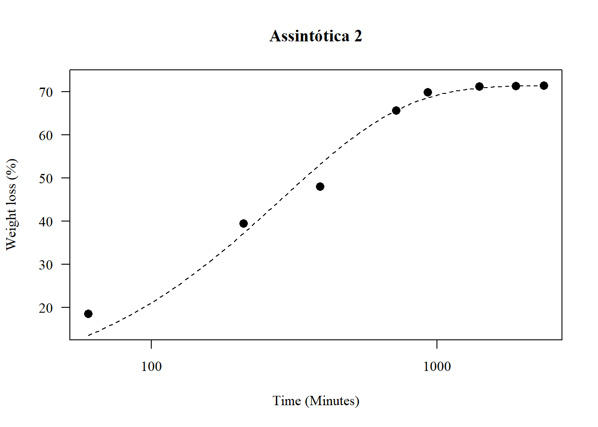

<br><br><br>

****

## Assintótica 3

****


```r
par(family="serif")
model6 <- drm(y ~ x, fct = drc::AR.3(), data = data)
summary(model6)
```

```
## 
## Model fitted: Shifted asymptotic regression (3 parms)
## 
## Parameter estimates:
## 
##                Estimate Std. Error  t-value   p-value    
## c:(Intercept)   8,65955    1,29240   6,7003 7,565e-09 ***
## d:(Intercept)  72,31924    0,55231 130,9390 < 2,2e-16 ***
## e:(Intercept) 348,01446   15,20460  22,8888 < 2,2e-16 ***
## ---
## Signif. codes:  0 '***' 0,001 '**' 0,01 '*' 0,05 '.' 0,1 ' ' 1
## 
## Residual standard error:
## 
##  2,630211 (61 degrees of freedom)
```

```r
plot(model6,main="Assintótica 3",
     las=1, cex=1.3,
     ylab="Weight loss (%)", 
     xlab="Time (Minutes)", 
     pch=16,lty=2)
```

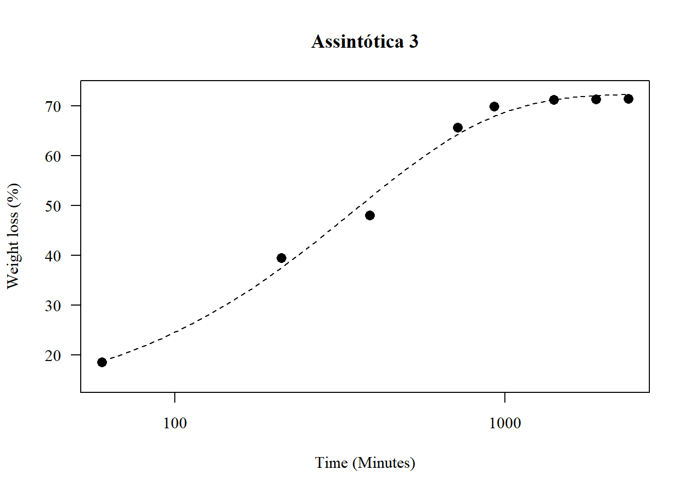

<br><br><br>

****

## Brain-Counsens 4

****


```r
model7 <- drm(y ~ x, fct = drc::BC.4(), data = data)
summary(model7)
```

```
## 
## Model fitted: Brain-Cousens (hormesis) with lower limit fixed at 0 (4 parms)
## 
## Parameter estimates:
## 
##                  Estimate  Std. Error  t-value   p-value    
## b:(Intercept)  -0,7419957   0,0628498 -11,8059 < 2,2e-16 ***
## d:(Intercept) 149,6381450  28,0543384   5,3339 1,539e-06 ***
## e:(Intercept) 842,5975169 384,1854662   2,1932  0,032179 *  
## f:(Intercept)  -0,0196017   0,0066143  -2,9635  0,004356 ** 
## ---
## Signif. codes:  0 '***' 0,001 '**' 0,01 '*' 0,05 '.' 0,1 ' ' 1
## 
## Residual standard error:
## 
##  2,642605 (60 degrees of freedom)
```

```r
par(family="serif")
plot(model,main="Brain-Counsens 4",
     las=1, cex=1.3,
     ylab="Weight loss (%)", 
     xlab="Time (Minutes)", 
     pch=16,lty=2)
```


<br><br><br>

****

## Brain-Counsens 5

****


```r
par(family="serif")
model8 <- drm(y ~ x, fct = drc::BC.5(), data = data)
summary(model8)
```

```
## 
## Model fitted: Brain-Cousens (hormesis) (5 parms)
## 
## Parameter estimates:
## 
##                  Estimate  Std. Error t-value   p-value    
## b:(Intercept)  -1,0445094   0,2286639 -4,5679 2,561e-05 ***
## c:(Intercept)   8,7627115   4,7730274  1,8359  0,071416 .  
## d:(Intercept) 109,0339449  20,0242731  5,4451 1,055e-06 ***
## e:(Intercept) 486,0685001 143,3483090  3,3908  0,001248 ** 
## f:(Intercept)  -0,0112154   0,0051383 -2,1827  0,033048 *  
## ---
## Signif. codes:  0 '***' 0,001 '**' 0,01 '*' 0,05 '.' 0,1 ' ' 1
## 
## Residual standard error:
## 
##  2,632805 (59 degrees of freedom)
```

```r
plot(model8,main="Brain-Cousens 5",
     las=1, cex=1.3,
     ylab="Weight loss (%)", 
     xlab="Time (Minutes)", 
     pch=16,lty=2)
```


<br><br><br>

****

## Cedergreen-Ritz-Streibig 3

****


```r
par(family="serif")
model9 <- drm(y ~ x, fct = drc::uml3a(), data = data)
summary(model9)
```

```
## 
## Model fitted: U-shaped Cedergreen-Ritz-Streibig (4 parms)
## 
## Parameter estimates:
## 
##                Estimate Std. Error t-value   p-value    
## b:(Intercept)   1,70356    0,15617 10,9084 6,917e-16 ***
## d:(Intercept)  74,51053    1,06473 69,9805 < 2,2e-16 ***
## e:(Intercept) 291,21663   16,71405 17,4235 < 2,2e-16 ***
## f:(Intercept) -15,54808    1,99553 -7,7915 1,112e-10 ***
## ---
## Signif. codes:  0 '***' 0,001 '**' 0,01 '*' 0,05 '.' 0,1 ' ' 1
## 
## Residual standard error:
## 
##  2,947189 (60 degrees of freedom)
```

```r
plot(model9,main="Cedergreen-Ritz-Streibig 3",
     las=1, cex=1.3,
     ylab="Weight loss (%)", 
     xlab="Time (Minutes)", 
     pch=16,lty=2)
```


<br><br><br>

****

## Cedergreen-Ritz-Streibig 4

****


```r
par(family="serif")
model10 <- drm(y ~ x, fct = drc::uml4a(), data = data)
summary(model10)
```

```
## 
## Model fitted: U-shaped Cedergreen-Ritz-Streibig (5 parms)
## 
## Parameter estimates:
## 
##                  Estimate  Std. Error  t-value   p-value    
## b:(Intercept)     4,64106     0,47568   9,7568 6,416e-14 ***
## c:(Intercept) -1701,15137    94,96264 -17,9139 < 2,2e-16 ***
## d:(Intercept)    71,53869     0,42799 167,1489 < 2,2e-16 ***
## e:(Intercept)   544,23492    21,39639  25,4358 < 2,2e-16 ***
## f:(Intercept) -1748,54548    96,09285 -18,1964 < 2,2e-16 ***
## ---
## Signif. codes:  0 '***' 0,001 '**' 0,01 '*' 0,05 '.' 0,1 ' ' 1
## 
## Residual standard error:
## 
##  2,008856 (59 degrees of freedom)
```

```r
plot(model,main="Cedergreen-Ritz-Streibig 4",
     las=1, cex=1.3,
     ylab="Weight loss (%)", 
     xlab="Time (Minutes)", 
     pch=16,lty=2)
```

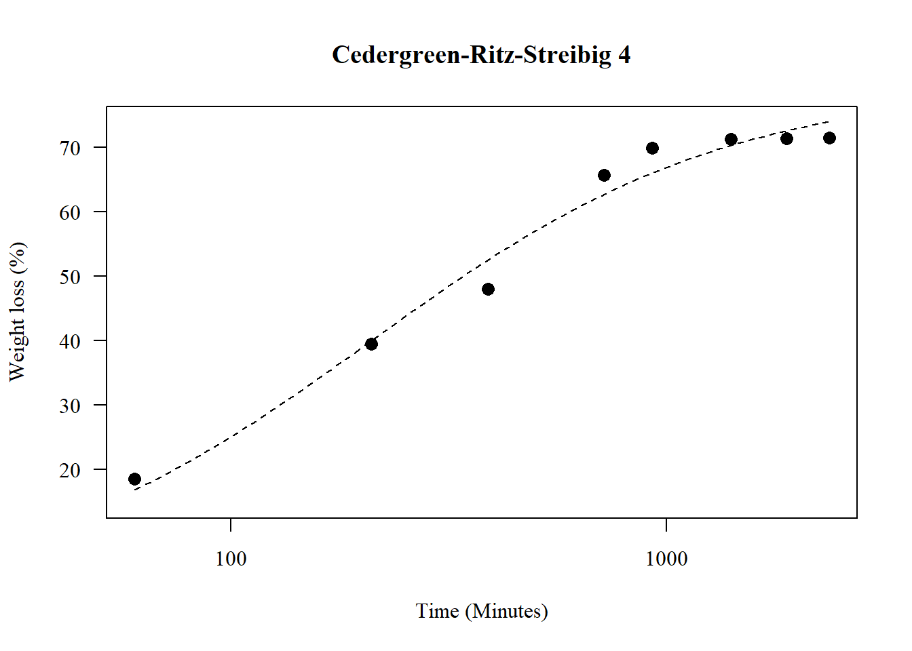

<br><br><br>

****

## Modelo exponencial

****


```r
modelexp=lm(log(y)~x);summary(modelexp)
```

```
## 
## Call:
## lm(formula = log(y) ~ x)
## 
## Residuals:
##     Min      1Q  Median      3Q     Max 
## -0,8722 -0,1354  0,1129  0,2682  0,3722 
## 
## Coefficients:
##              Estimate Std. Error t value Pr(>|t|)    
## (Intercept) 3,543e+00  6,534e-02  54,216  < 2e-16 ***
## x           4,188e-04  5,174e-05   8,095 2,71e-11 ***
## ---
## Signif. codes:  0 '***' 0,001 '**' 0,01 '*' 0,05 '.' 0,1 ' ' 1
## 
## Residual standard error: 0,3206 on 62 degrees of freedom
## Multiple R-squared:  0,5138,	Adjusted R-squared:  0,506 
## F-statistic: 65,52 on 1 and 62 DF,  p-value: 2,711e-11
```

```r
alpha=exp(modelexp$coefficients[1])
beta=modelexp$coefficients[2]
model11=nls(y~A*exp(x*B),start=list(A=alpha,B=beta))
summary(model11)
```

```
## 
## Formula: y ~ A * exp(x * B)
## 
## Parameters:
##    Estimate Std. Error t value Pr(>|t|)    
## A 4,237e+01  2,255e+00  18,790  < 2e-16 ***
## B 2,762e-04  3,386e-05   8,156 2,12e-11 ***
## ---
## Signif. codes:  0 '***' 0,001 '**' 0,01 '*' 0,05 '.' 0,1 ' ' 1
## 
## Residual standard error: 12,77 on 62 degrees of freedom
## 
## Number of iterations to convergence: 6 
## Achieved convergence tolerance: 5,434e-06
```

```r
plot(y~x)
lines(seq(min(x), max(x), length.out = 100), 
      predict(model11, newdata = data.frame(x = seq(min(x), 
                                                     max(x), 
                                                     length.out = 100))),
      col="red",lwd=2,lty=2)
```


<br><br><br>

****

## Modelo loess

****


```r
model12=loess(y~x)
summary(model12)
```

```
## Call:
## loess(formula = y ~ x)
## 
## Number of Observations: 64 
## Equivalent Number of Parameters: 4,94 
## Residual Standard Error: 2,7 
## Trace of smoother matrix: 5,42  (exact)
## 
## Control settings:
##   span     :  0,75 
##   degree   :  2 
##   family   :  gaussian
##   surface  :  interpolate	  cell = 0,2
##   normalize:  TRUE
##  parametric:  FALSE
## drop.square:  FALSE
```

```r
par(pch=16,las=1); par(family="serif")
plot(media~tempo, main="Modelo Loess",
     las=1, cex=1.3,
     ylab="Weight loss (%)", xlim=c(0,2500),
     xlab="Time (Minutes)", 
     pch=16, ylim=c(0,80))
lines(x,predict(model12,x),lty=2)
```


```r
## ou

par(pch=16,las=1); par(family="serif")
plot(media~tempo, main="modelo loess",
     las=1, cex=1.3,
     ylab="Weight loss (%)", xlim=c(0,2500),
     xlab="Time (Minutes)", 
     pch=16, ylim=c(0,80))
lines(seq(60,2370,5),predict(model12,seq(60,2370,5)),lty=2)
```


```r
## ou

library(ggplot2)
ggplot(data,aes(y=y,x=x))+
  geom_point()+
  geom_smooth()+
  theme_bw()+
  theme_classic()+
  xlab("Time (minutes)")+
  ylab("Weight loss (%)")
```


****

## Coef. de determinação ($R^2$)

****


```r
r2=c(1-var(residuals(modl))/var(residuals(lm(y~1))),
1-var(residuals(mod1))/var(residuals(lm(y~1))),
1-var(residuals(mod2))/var(residuals(lm(y~1))),
1-var(residuals(modelog))/var(residuals(lm(y~1))),
1-var(residuals(n0))/var(residuals(lm(y~1))),
1-var(residuals(n1))/var(residuals(lm(y~1))),
1-var(residuals(modelo_pieciwise))/var(residuals(lm(y~1))),
1-var(residuals(modelo_pieciwise1))/var(residuals(lm(y~1))),
1-var(residuals(modelo2))/var(residuals(lm(y~1))),
1-var(residuals(model))/var(residuals(lm(y~1))),
1-var(residuals(model1))/var(residuals(lm(y~1))),
1-var(residuals(model2))/var(residuals(lm(y~1))),
1-var(residuals(model3))/var(residuals(lm(y~1))),
1-var(residuals(model4))/var(residuals(lm(y~1))),
1-var(residuals(model5))/var(residuals(lm(y~1))),
1-var(residuals(model6))/var(residuals(lm(y~1))),
1-var(residuals(model7))/var(residuals(lm(y~1))),
1-var(residuals(model8))/var(residuals(lm(y~1))),
1-var(residuals(model9))/var(residuals(lm(y~1))),
1-var(residuals(model10))/var(residuals(lm(y~1))),
1-var(residuals(model11))/var(residuals(lm(y~1))))
```

<br><br><br>

****

## AIC

****


```r
aic=c(AIC(modl),
AIC(mod1),
AIC(mod2),
AIC(modelog),
AIC(n0),
AIC(n1),
AIC(modelo_pieciwise),
AIC(modelo_pieciwise1),
AIC(modelo2),
AIC(model),
AIC(model1),
AIC(model2),
AIC(model3),
AIC(model4),
AIC(model5),
AIC(model6),
AIC(model7),
AIC(model8),
AIC(model9),
AIC(model10),
AIC(model11))
```

<br><br><br>

****

## BIC

****


```r
bic=c(BIC(modl),
BIC(mod1),
BIC(mod2),
BIC(modelog),
BIC(n0),
BIC(n1),
BIC(modelo_pieciwise),
BIC(modelo_pieciwise1),
BIC(modelo2),
BIC(model),
BIC(model1),
BIC(model2),
BIC(model3),
BIC(model4),
BIC(model5),
BIC(model6),
BIC(model7),
BIC(model8),
BIC(model9),
BIC(model10),
BIC(model11))
analise=cbind(aic,bic,r2)
rownames(analise)=c("Linear","Quadrático","Cúbico","Log",
                    "Michaelis-Mente","Michaelis Menten (Corrigido)",
                    "Segmentada Linear","Segmentada Quadrática",
                    "Mitscherlich","Logístico LL.3","Logístico LL.4",
                    "Yield Loss", "Weibull 3","Weibull 4",
                    "Assintótica 2","Assintótica 3",
                    "Brain-Counsens 4","Brain-Counsens 5",
                    "Cedergreen-Ritz-Streibig 3",
                    "Cedergreen-Ritz-Streibig 4",
                    "Exponencial")
knitr::kable(analise)
```

                                     aic        bic          r2
-----------------------------  ---------  ---------  ----------
Linear                          499,5847   506,0614   0,6204884
Quadrático                      402,7620   411,3975   0,9189732
Cúbico                          317,0989   327,8933   0,9794051
Log                             384,3339   390,8105   0,9373170
Michaelis-Mente                 339,8781   346,3547   0,9687055
Michaelis Menten (Corrigido)    323,8311   332,4667   0,9765013
Segmentada Linear               352,6998   363,4943   0,9640795
Segmentada Quadrática           332,1142   345,0675   0,9747606
Mitscherlich                    310,3357   318,9713   0,9808822
Logístico LL.3                  340,9449   349,5804   0,9691758
Logístico LL.4                  325,9732   336,7677   0,9763419
Yield Loss                      339,8781   346,3547   0,9687055
Weibull 3                       354,0919   362,7274   0,9621318
Weibull 4                       333,7306   344,5250   0,9732933
Assintótica 2                   340,9002   347,3768   0,9688639
Assintótica 3                   310,3357   318,9713   0,9808822
Brain-Counsens 4                311,8796   322,6740   0,9810184
Brain-Counsens 5                312,3284   325,2817   0,9814725
Cedergreen-Ritz-Streibig 3      325,8427   336,6371   0,9763901
Cedergreen-Ritz-Streibig 4      277,7064   290,6597   0,9892136
Exponencial                     511,5978   518,0744   0,5422488


# Análise de sobrevivência

*****

<br><br>


Análise de sobrevivência, também denominada análise de sobrevida, é um ramo da estatística que estuda o tempo de duração esperado até a ocorrência de um ou mais eventos, tais como morte em organismos biológicos ou falha em sistemas mecânicos. Na agronomia, tem sido bastante utilizada na avaliação residual de produtos fitossanitários em insetos, tempo até a morte em função de um doença, etc.

<br><br>

****

****

## Conjunto de dados

****

O conjunto de dados é de um experimento cujo objetivo é avaliar a mortalidade de insetos em função de alguns produtos comerciais. 


```r
tempo=c(10,10,10,10,10,10,10,24,24,24,24,48,10,10,10,10,10,10,10,10,10,10,10,10,24,24,48,48,72,72,72,72,72,72,72,72,10,10,24,24,72,72,72,72,72,72,96,96,10,10,10,48,96,96,144,144,168,168,168,168,10,10,24,24,72,72,72,96,96,120,168,168,10,10,10,10,10,10,10,24,24,24,24,48,10,10,10,24,24,120,120,144,144,144,144,144,10,10,144,144,168,168,168,168,168,168,168,168,24,72,96,96,120,144,168,168,168,168,168,168,24,72,96,120,144,168,168,168,168,168,168,168,10,10,10,10,10,10,24,72,96,168,168,168)
# criando vetor de status (Ocorreu ou nao o evento)
status=c(1,1,1,1,1,1,1,1,1,1,1,1,1,1,1,1,1,1,1,1,1,1,1,1,1,1,1,1,1,1,1,1,1,1,1,1,1,1,1,1,1,1,1,1,1,1,1,1,1,1,1,1,1,1,1,1,0,0,0,0,1,1,1,1,1,1,1,1,1,1,1,0,1,1,1,1,1,1,1,1,1,1,1,1,1,1,1,1,1,1,1,1,1,1,1,1,1,1,1,1,1,1,1,1,0,0,0,0,1,1,1,1,1,1,1,0,0,0,1,0,1,1,1,1,1,1,1,1,1,0,0,0,1,1,1,1,1,1,1,1,1,1,0,0)
trat=rep(c("T1","T2",'T3'),e=48)
dados=data.frame(trat,tempo,status)
```

<br><br>

## Histograma


```r
hist(tempo)
```


<br><br>

****

## Método não-paramétrico de Kaplan-meier

****

<br><br>

### Sem considerar tratamentos

Somente uma análise exploratória geral


```r
library(survival)
library(survminer)
KM <- survfit(Surv(tempo,status) ~ 1, type="kaplan-meier")
summary(KM)
```

```
## Call: survfit(formula = Surv(tempo, status) ~ 1, type = "kaplan-meier")
## 
##  time n.risk n.event survival std.err lower 95% CI upper 95% CI
##    10    144      44    0,694  0,0384       0,6231        0,774
##    24    100      19    0,562  0,0413       0,4870        0,650
##    48     81       5    0,528  0,0416       0,4522        0,616
##    72     76      20    0,389  0,0406       0,3169        0,477
##    96     56      10    0,319  0,0389       0,2517        0,405
##   120     46       5    0,285  0,0376       0,2198        0,369
##   144     41      11    0,208  0,0338       0,1515        0,286
##   168     30      12    0,125  0,0276       0,0811        0,193
```

```r
ggsurvplot(
  fit = survfit(Surv(tempo, status) ~ 1),data=dados, 
  xlab = "Time (hours)", 
  ylab = "Overall survival probability")
```


### Tempo médio de sobrevivência


```r
a=survival:::survmean(KM, rmean=48)
a$matrix[5]
```

```
##   *rmean 
## 33,22222
```

<br><br>

### Considerando tratamentos

### Conferindo diferenças par a par


```r
pvalor=pairwise_survdiff(Surv(tempo,status)~trat,data=dados, rho=0)
knitr::kable(pvalor$p.value)
```

             T1          T2
---  ----------  ----------
T2    0,0003111            
T3    0,0000000   0,0006521

Todos diferem entre si

### Grafico por tratamento usando o método de Kaplan-Meier


```r
KM1 <- survfit(Surv(tempo,status) ~ trat, type="kaplan-meier")
ggsurvplot(
  fit = survfit(Surv(tempo, status) ~ trat),data=dados, 
  xlab = "Time (hours)", 
  ylab = "Overall survival probability")
```


### Tempo médio de sobrevivência


```r
survival:::survmean(KM1, rmean=48)$matrix[,5]
```

```
##  trat=T1  trat=T2  trat=T3 
## 27,37500 32,12500 40,16667
```

<br><br>

****

## Modelo paramétrico

****

<br><br>

****

### Distribuição exponencial

****

<br><br>

### Sem considerar tratamentos


```r
KM <- survreg(Surv(tempo,status) ~ 1, dist="exponential")
summary(KM)
```

```
## 
## Call:
## survreg(formula = Surv(tempo, status) ~ 1, dist = "exponential")
##              Value Std. Error    z      p
## (Intercept) 4,4473     0,0891 49,9 <2e-16
## 
## Scale fixed at 1 
## 
## Exponential distribution
## Loglik(model)= -686,4   Loglik(intercept only)= -686,4
## Number of Newton-Raphson Iterations: 4 
## n= 144
```

```r
s <- seq(.01, .99, by = .01)
t_0 <- predict(KM, newdata = data.frame(trat=paste("T1","T2","T3")), 
                 type = "quantile", p = s)
smod <- data.frame(time = c(t_0), # acrescentar os tratamentos 
                   surv = rep(1 - s, times = 1), # mudar o times
                   upper = NA, lower = NA)
ggsurvplot(smod)  
```


### Considerando tratamentos


```r
library(survival)
library(survminer)
KM2 <- survreg(Surv(tempo,status) ~ trat, dist="exponential")
summary(KM)
```

```
## 
## Call:
## survreg(formula = Surv(tempo, status) ~ 1, dist = "exponential")
##              Value Std. Error    z      p
## (Intercept) 4,4473     0,0891 49,9 <2e-16
## 
## Scale fixed at 1 
## 
## Exponential distribution
## Loglik(model)= -686,4   Loglik(intercept only)= -686,4
## Number of Newton-Raphson Iterations: 4 
## n= 144
```

```r
anova(KM2)
```

```
##      Df Deviance Resid. Df    -2*LL     Pr(>Chi)
## NULL NA       NA       143 1372,722           NA
## trat  2 44,24522       141 1328,477 2,467593e-10
```

```r
s <- seq(.01, .99, by = .01)
t_0 <- predict(KM2, newdata = data.frame(trat = "T1"), type = "quantile", p = s)
t_1 <- predict(KM2, newdata = data.frame(trat = "T2"), type = "quantile", p = s)
t_2 <- predict(KM2, newdata = data.frame(trat = "T3"), type = "quantile", p = s)
smod <- data.frame(time = c(t_0, t_1, t_2), # acrescentar os tratamentos 
                   surv = rep(1 - s, times = 3), # mudar o times
                   strata = rep(c("T1", "T2", "T3"), each = length(s)),
                   upper = NA, lower = NA)
ggsurvplot(smod)  
```


<br><br>

****

## Distribuição gaussiano

****

### Sem considerar tratamentos


```r
KM <- survreg(Surv(tempo,status) ~ 1, dist="gaussian")
summary(KM)
```

```
## 
## Call:
## survreg(formula = Surv(tempo, status) ~ 1, dist = "gaussian")
##               Value Std. Error    z      p
## (Intercept) 78,8982     5,9303 13,3 <2e-16
## Log(scale)   4,2519     0,0652 65,2 <2e-16
## 
## Scale= 70,2 
## 
## Gaussian distribution
## Loglik(model)= -735,6   Loglik(intercept only)= -735,6
## Number of Newton-Raphson Iterations: 5 
## n= 144
```

### Considerando tratamentos


```r
KM3 <- survreg(Surv(tempo,status) ~ trat, dist="gaussian")
summary(KM3)
```

```
## 
## Call:
## survreg(formula = Surv(tempo, status) ~ trat, dist = "gaussian")
##               Value Std. Error     z       p
## (Intercept) 36,3750     8,5829  4,24 2,3e-05
## tratT2      37,3906    12,1867  3,07  0,0022
## tratT3      89,7879    12,3737  7,26 4,0e-13
## Log(scale)   4,0854     0,0649 62,96 < 2e-16
## 
## Scale= 59,5 
## 
## Gaussian distribution
## Loglik(model)= -712,5   Loglik(intercept only)= -735,6
## 	Chisq= 46,23 on 2 degrees of freedom, p= 9,2e-11 
## Number of Newton-Raphson Iterations: 4 
## n= 144
```

```r
anova(KM3)
```

```
##      Df Deviance Resid. Df    -2*LL     Pr(>Chi)
## NULL NA       NA       142 1471,295           NA
## trat  2 46,22645       140 1425,069 9,163355e-11
```

```r
t_0 <- predict(KM3, newdata = data.frame(trat = "T1"), type = "lp")
t_1 <- predict(KM3, newdata = data.frame(trat = "T2"),type = "lp")
t_2 <- predict(KM3, newdata = data.frame(trat = "T3"),type = "lp")
x_grid <- 1:400
sur_curves <- sapply(t_0, function(x)survreg.distributions[[KM3$dist]]$density((x - x_grid)/KM3$scale)[, 1])
sur_curves1 <- sapply(t_1, function(x)survreg.distributions[[KM3$dist]]$density((x - x_grid)/KM3$scale)[, 1])
sur_curves2 <- sapply(t_2, function(x)survreg.distributions[[KM3$dist]]$density((x - x_grid)/KM3$scale)[, 1])
matplot(x_grid, sur_curves, type = "l", lty = 1,ylim=c(0,1))
lines(x_grid,sur_curves1,col="red")
lines(x_grid,sur_curves2,col="blue")
```


<br><br>

****

## Distribuição logistico

****

### Sem considerar tratamentos


```r
KM <- survreg(Surv(tempo,status) ~ 1, dist="logistic")
summary(KM)
```

```
## 
## Call:
## survreg(formula = Surv(tempo, status) ~ 1, dist = "logistic")
##               Value Std. Error    z      p
## (Intercept) 72,5020     6,3768 11,4 <2e-16
## Log(scale)   3,7594     0,0722 52,0 <2e-16
## 
## Scale= 42,9 
## 
## Logistic distribution
## Loglik(model)= -739,5   Loglik(intercept only)= -739,5
## Number of Newton-Raphson Iterations: 5 
## n= 144
```

### Considerando tratamentos


```r
KM4 <- survreg(Surv(tempo,status) ~ trat, dist="logistic")
summary(KM4)
```

```
## 
## Call:
## survreg(formula = Surv(tempo, status) ~ trat, dist = "logistic")
##               Value Std. Error     z       p
## (Intercept) 35,4968     7,7296  4,59 4,4e-06
## tratT2      31,3587    12,2695  2,56   0,011
## tratT3      98,9211    12,4589  7,94 2,0e-15
## Log(scale)   3,5544     0,0737 48,20 < 2e-16
## 
## Scale= 35 
## 
## Logistic distribution
## Loglik(model)= -714,3   Loglik(intercept only)= -739,5
## 	Chisq= 50,45 on 2 degrees of freedom, p= 1,1e-11 
## Number of Newton-Raphson Iterations: 4 
## n= 144
```

```r
anova(KM4)
```

```
##      Df Deviance Resid. Df    -2*LL     Pr(>Chi)
## NULL NA       NA       142 1479,091           NA
## trat  2 50,45218       140 1428,639 1,107765e-11
```

```r
t_0 <- predict(KM4, newdata = data.frame(trat = "T1"), type = "lp")
t_1 <- predict(KM4, newdata = data.frame(trat = "T2"),type = "lp")
t_2 <- predict(KM4, newdata = data.frame(trat = "T3"),type = "lp")
x_grid <- 1:400
sur_curves <- sapply(t_0, function(x)survreg.distributions[[KM4$dist]]$density((x - x_grid)/KM4$scale)[, 1])
sur_curves1 <- sapply(t_1, function(x)survreg.distributions[[KM4$dist]]$density((x - x_grid)/KM4$scale)[, 1])
sur_curves2 <- sapply(t_2, function(x)survreg.distributions[[KM4$dist]]$density((x - x_grid)/KM4$scale)[, 1])
matplot(x_grid, sur_curves, type = "l", lty = 1,ylim=c(0,1))
lines(x_grid,sur_curves1,col="red")
lines(x_grid,sur_curves2,col="blue")
```


<br><br>

****

## Distribuição Log normal

****

### Sem considerar tratamentos


```r
KM <- survreg(Surv(tempo,status) ~ 1, dist="lognormal")
summary(KM)
```

```
## 
## Call:
## survreg(formula = Surv(tempo, status) ~ 1, dist = "lognormal")
##              Value Std. Error     z       p
## (Intercept) 3,8658     0,1080 35,80 < 2e-16
## Log(scale)  0,2438     0,0648  3,76 0,00017
## 
## Scale= 1,28 
## 
## Log Normal distribution
## Loglik(model)= -681,1   Loglik(intercept only)= -681,1
## Number of Newton-Raphson Iterations: 5 
## n= 144
```

### Considerando tratamentos


```r
KM5 <- survreg(Surv(tempo,status) ~ trat, dist="lognormal")
summary(KM5)
```

```
## 
## Call:
## survreg(formula = Surv(tempo, status) ~ trat, dist = "lognormal")
##              Value Std. Error     z      p
## (Intercept) 3,2165     0,1655 19,43 <2e-16
## tratT2      0,5650     0,2352  2,40  0,016
## tratT3      1,3925     0,2394  5,82  6e-09
## Log(scale)  0,1369     0,0644  2,12  0,034
## 
## Scale= 1,15 
## 
## Log Normal distribution
## Loglik(model)= -665,4   Loglik(intercept only)= -681,1
## 	Chisq= 31,54 on 2 degrees of freedom, p= 1,4e-07 
## Number of Newton-Raphson Iterations: 4 
## n= 144
```

```r
anova(KM5)
```

```
##      Df Deviance Resid. Df    -2*LL     Pr(>Chi)
## NULL NA       NA       142 1362,288           NA
## trat  2 31,54326       140 1330,744 1,414059e-07
```

```r
s <- seq(.01, .99, by = .01)
t_0 <- predict(KM5, newdata = data.frame(trat = "T1"), type = "quantile", p = s)
t_1 <- predict(KM5, newdata = data.frame(trat = "T2"), type = "quantile", p = s)
t_2 <- predict(KM5, newdata = data.frame(trat = "T3"), type = "quantile", p = s)
smod <- data.frame(time = c(t_0, t_1, t_2), # acrescentar os tratamentos 
                   surv = rep(1 - s, times = 3), # mudar o times
                   strata = rep(c("T1", "T2", "T3"), each = length(s)),
                   upper = NA, lower = NA)
ggsurvplot(smod)  
```


<br><br>

****

## Distribuição Log-Logístico

****

### Sem considerar tratamentos


```r
KM <- survreg(Surv(tempo,status) ~ 1, dist="loglogistic")
summary(KM)
```

```
## 
## Call:
## survreg(formula = Surv(tempo, status) ~ 1, dist = "loglogistic")
##               Value Std. Error     z      p
## (Intercept)  3,8717     0,1192 32,49 <2e-16
## Log(scale)  -0,2265     0,0711 -3,19 0,0014
## 
## Scale= 0,797 
## 
## Log logistic distribution
## Loglik(model)= -687   Loglik(intercept only)= -687
## Number of Newton-Raphson Iterations: 5 
## n= 144
```

### Considerando tratamentos


```r
KM6 <- survreg(Surv(tempo,status) ~ trat, dist="loglogistic")
summary(KM6)
```

```
## 
## Call:
## survreg(formula = Surv(tempo, status) ~ trat, dist = "loglogistic")
##               Value Std. Error     z       p
## (Intercept)  3,1947     0,1689 18,92 < 2e-16
## tratT2       0,5839     0,2530  2,31   0,021
## tratT3       1,5687     0,2441  6,43 1,3e-10
## Log(scale)  -0,3709     0,0725 -5,11 3,2e-07
## 
## Scale= 0,69 
## 
## Log logistic distribution
## Loglik(model)= -669,2   Loglik(intercept only)= -687
## 	Chisq= 35,64 on 2 degrees of freedom, p= 1,8e-08 
## Number of Newton-Raphson Iterations: 4 
## n= 144
```

```r
anova(KM6)
```

```
##      Df Deviance Resid. Df    -2*LL     Pr(>Chi)
## NULL NA       NA       142 1373,973           NA
## trat  2 35,64462       140 1338,328 1,819156e-08
```

```r
s <- seq(.01, .99, by = .01)
t_0 <- predict(KM6, newdata = data.frame(trat = "T1"), type = "quantile", p = s)
t_1 <- predict(KM6, newdata = data.frame(trat = "T2"), type = "quantile", p = s)
t_2 <- predict(KM6, newdata = data.frame(trat = "T3"), type = "quantile", p = s)
smod <- data.frame(time = c(t_0, t_1, t_2), # acrescentar os tratamentos 
                   surv = rep(1 - s, times = 3), # mudar o times
                   strata = rep(c("T1", "T2", "T3"), each = length(s)),
                   upper = NA, lower = NA)
ggsurvplot(smod)  
```


<br><br>

****

## Distribuição Weibull (default)

*****

### Sem considerar tratamentos


```r
KM <- survreg(Surv(tempo,status) ~ 1, dist="weibull")
summary(KM)
```

```
## 
## Call:
## survreg(formula = Surv(tempo, status) ~ 1, dist = "weibull")
##              Value Std. Error     z      p
## (Intercept) 4,4310     0,0969 45,72 <2e-16
## Log(scale)  0,0685     0,0740  0,93   0,35
## 
## Scale= 1,07 
## 
## Weibull distribution
## Loglik(model)= -685,9   Loglik(intercept only)= -685,9
## Number of Newton-Raphson Iterations: 6 
## n= 144
```

### Considerando tratamentos


```r
KM7 <- survreg(Surv(tempo,status) ~ trat, dist="weibull")
summary(KM7)
```

```
## 
## Call:
## survreg(formula = Surv(tempo, status) ~ trat, dist = "weibull")
##               Value Std. Error     z       p
## (Intercept)  3,6259     0,1334 27,18 < 2e-16
## tratT2       0,7769     0,1906  4,08 4,6e-05
## tratT3       1,4392     0,2043  7,05 1,8e-12
## Log(scale)  -0,0969     0,0744 -1,30    0,19
## 
## Scale= 0,908 
## 
## Weibull distribution
## Loglik(model)= -663,4   Loglik(intercept only)= -685,9
## 	Chisq= 45 on 2 degrees of freedom, p= 1,7e-10 
## Number of Newton-Raphson Iterations: 5 
## n= 144
```

```r
anova(KM7)
```

```
##      Df Deviance Resid. Df    -2*LL     Pr(>Chi)
## NULL NA       NA       142 1371,840           NA
## trat  2 44,99626       140 1326,844 1,695061e-10
```

```r
s <- seq(.01, .99, by = .01)
t_0 <- predict(KM7, newdata = data.frame(trat = "T1"), type = "quantile", p = s)
t_1 <- predict(KM7, newdata = data.frame(trat = "T2"), type = "quantile", p = s)
t_2 <- predict(KM7, newdata = data.frame(trat = "T3"), type = "quantile", p = s)
smod <- data.frame(time = c(t_0, t_1, t_2), # acrescentar os tratamentos 
                   surv = rep(1 - s, times = 3), # mudar o times
                   strata = rep(c("T1", "T2", "T3"), each = length(s)),
                   upper = NA, lower = NA)
ggsurvplot(smod)  
```


<br><br><br>

****

## Gompertz

****


```r
library(flexsurv)
KM9=flexsurvreg(Surv(tempo,status)~trat,dist="Gompertz")
summary(KM9)
```

```
## trat=T1 
##   time         est          lcl        ucl
## 1   10 0,786371074 7,232752e-01 0,83911162
## 2   24 0,549854904 4,479971e-01 0,64283646
## 3   48 0,279640531 1,840537e-01 0,38407503
## 4   72 0,130206542 6,796248e-02 0,21484853
## 5   96 0,054871360 2,038831e-02 0,11454678
## 6  120 0,020657887 4,376664e-03 0,05889927
## 7  144 0,006846406 7,235971e-04 0,02828755
## 8  168 0,001964497 6,983711e-05 0,01339412
## 
## trat=T2 
##   time        est        lcl       ucl
## 1   10 0,91229451 0,87331154 0,9413935
## 2   24 0,79577094 0,71808347 0,8578590
## 3   48 0,61465240 0,50609979 0,7107700
## 4   72 0,45902365 0,34252835 0,5697133
## 5   96 0,32998531 0,22192375 0,4376911
## 6  120 0,22722132 0,13328083 0,3293009
## 7  144 0,14902446 0,07470928 0,2383306
## 8  168 0,09250403 0,03800506 0,1703754
## 
## trat=T3 
##   time       est       lcl       ucl
## 1   10 0,9585577 0,9322980 0,9737424
## 2   24 0,9000225 0,8424858 0,9343911
## 3   48 0,7989822 0,7018413 0,8614044
## 4   72 0,6983485 0,5817678 0,7819800
## 5   96 0,5997606 0,4745195 0,7011188
## 6  120 0,5049620 0,3789321 0,6143491
## 7  144 0,4157087 0,2914415 0,5351033
## 8  168 0,3336543 0,2121430 0,4532552
```

```r
plot(KM9,col=c(1,2,3))
```


****

## Gamma

****


```r
library(flexsurv)
KM10=flexsurvreg(Surv(tempo,status)~trat,dist="gamma")
summary(KM10)
```

```
## trat=T1 
##   time         est         lcl        ucl
## 1   10 0,790201487 0,719309848 0,85487605
## 2   24 0,537681788 0,441769852 0,63355947
## 3   48 0,267748022 0,178325147 0,37513023
## 4   72 0,130741530 0,068561707 0,21612689
## 5   96 0,063206831 0,025867793 0,12418913
## 6  120 0,030369861 0,009663219 0,07230255
## 7  144 0,014531118 0,003516686 0,04179215
## 8  168 0,006931519 0,001255214 0,02432217
## 
## trat=T2 
##   time       est        lcl       ucl
## 1   10 0,9055576 0,85492217 0,9441662
## 2   24 0,7671054 0,68798616 0,8376454
## 3   48 0,5650288 0,46168895 0,6610689
## 4   72 0,4110387 0,29916324 0,5184281
## 5   96 0,2969771 0,19325853 0,4014741
## 6  120 0,2136179 0,12442969 0,3138910
## 7  144 0,1531754 0,07776916 0,2437258
## 8  168 0,1095770 0,04881060 0,1896404
## 
## trat=T3 
##   time       est       lcl       ucl
## 1   10 0,9552715 0,9205263 0,9751594
## 2   24 0,8838874 0,8244174 0,9260402
## 3   48 0,7645536 0,6748641 0,8339494
## 4   72 0,6563859 0,5496685 0,7468414
## 5   96 0,5610497 0,4435391 0,6641375
## 6  120 0,4781342 0,3584966 0,5900300
## 7  144 0,4065841 0,2875838 0,5252627
## 8  168 0,3451603 0,2319613 0,4664246
```

```r
plot(KM10,col=c(1,2,3))
```


<br><br>

****

## Método semi-paramétrico de Cox

****

Serve para um modelo de regressão de riscos proporcionais de Cox. Variáveis dependentes do tempo, estratos dependentes do tempo, vários eventos por assunto e outras extensões são incorporadas usando a formulação do processo de contagem de Andersen e Gill.

**Reference**: Andersen, P. and Gill, R. (1982). Cox's regression model for counting processes, a large sample study. Annals of Statistics 10, 1100-1120.

### Sem considerar tratamentos


```r
KM <- coxph(Surv(tempo,status) ~ 1)
summary(KM)
```

```
## Call:  coxph(formula = Surv(tempo, status) ~ 1)
## 
## Null model
##   log likelihood= -538,6621 
##   n= 144
```

### Considerando tratamentos


```r
KM8 <- coxph(Surv(tempo,status) ~ strata(trat),data=dados)
summary(KM8)
```

```
## Call:  coxph(formula = Surv(tempo, status) ~ strata(trat), data = dados)
## 
## Null model
##   log likelihood= -394,6821 
##   n= 144
```

```r
library(ggfortify)
autoplot(survfit(KM8),conf.int = F)+theme_classic()
```


<br><br>

****

## Modelo de riscos proporcionais de COX

****

<br><br>

Mostra as taxas de risco (HR) derivadas do modelo para todas as covariáveis incluídas na fórmula coxph. Resumidamente, uma FC> 1 indica um risco aumentado de morte (de acordo com a definição de h(t)) se uma condição específica for atendida por um paciente. Uma FC <1, por outro lado, indica uma diminuição do risco.

<br><br>

### Considerando trat


```r
library(forestmodel)
colnames(dados)=c("Treatments","tempo","status")
fit.coxph <- coxph(Surv(tempo, status) ~ Treatments, data = dados)
#ggforest(fit.coxph, data = dados)
print(forest_model(fit.coxph, limits=log( c(0.05, 5))))
```


## Critério de inferência de Akaike


```r
library(car)
AIC(KM2) # exponencial
```

```
## [1] 1334,477
```

```r
AIC(KM3) # normal
```

```
## [1] 1433,069
```

```r
AIC(KM4) # logistico
```

```
## [1] 1436,639
```

```r
AIC(KM5) # lognormal
```

```
## [1] 1338,744
```

```r
AIC(KM6) # loglogistic
```

```
## [1] 1346,328
```

```r
AIC(KM7) # weibull
```

```
## [1] 1334,844
```

```r
AIC(KM8) # coxph
```

```
## [1] 789,3642
```

```r
AIC(KM9) # Gompertz
```

```
## [1] 1331,275
```

## Resíduo


```r
residuo2 <- residuals(KM2, type = "deviance")
g2=ggplot(data = dados, mapping = aes(x = tempo, y = residuo2)) +
    geom_point() + labs(title="Exponential")+
    geom_smooth() +
    theme_bw() + theme(legend.key = element_blank())
residuo3 <- residuals(KM3, type = "deviance")
g3=ggplot(data = dados, mapping = aes(x = tempo, y = residuo3)) +
    geom_point() + labs(title="Normal")+
    geom_smooth() +
    theme_bw() + theme(legend.key = element_blank())
residuo4 <- residuals(KM4, type = "deviance")
g4=ggplot(data = dados, mapping = aes(x = tempo, y = residuo4)) +
    geom_point() + labs(title="Logístico")+
    geom_smooth() +
    theme_bw() + theme(legend.key = element_blank())
residuo5 <- residuals(KM5, type = "deviance")
g5=ggplot(data = dados, mapping = aes(x = tempo, y = residuo5)) +
    geom_point() + labs(title="lognormal")+
    geom_smooth() +
    theme_bw() + theme(legend.key = element_blank())
residuo6 <- residuals(KM6, type = "deviance")
g6=ggplot(data = dados, mapping = aes(x = tempo, y = residuo6)) +
    geom_point() + labs(title="loglogistico")+
    geom_smooth() +
    theme_bw() + theme(legend.key = element_blank())
residuo7 <- residuals(KM7, type = "deviance")
g7=ggplot(data = dados, mapping = aes(x = tempo, y = residuo7)) +
    geom_point() + labs(title="weibull")+
    geom_smooth() +
    theme_bw() + theme(legend.key = element_blank())
residuo8 <- residuals(KM8, type = "deviance")
g8=ggplot(data = dados, mapping = aes(x = tempo, y = residuo8)) +
    geom_point() + labs(title="coxph")+
    geom_smooth() +
    theme_bw() + theme(legend.key = element_blank())
library(gridExtra)
grid.arrange(g2,g3,g4,g5,g6,g7,g8,ncol=4)
```


<br><br><br><br><br><br>

# Modelo linear generalizado

## Conjunto de dados

Considera um conjunto de dados simulados de germinação com oito repetições e quatro tratamento qualitativos. Conforme a regra de análise de sementes, em um teste de germinação é estabelecido a quantidade mínima de 50 sementes por rolo de papel. Logo, sabemos que a quantidade máxima de cada repetição e de 50 sementes.


```r
trat=rep(paste("T",1:4),e=8)
germ=c(33,35,34,30,38,30,37,30,36,38,34,38,38,38,35,35,30,15,31,17,25,24,24,18,27,20,28,35,30,30,30,29)
```

## Modelo linear generalizado

No R, podemos realizar a entrada dos dados de duas formas. Pela proporção ou por dados dicotomizados (Respostas do tipo 0 ou 1).

Nosso exemplo usaremos pela proporção.


```r
modelo=glm(cbind(germ,50-germ)~trat, family=binomial)
```

**Explicação**: `germ` é nossa resposta, ou seja, total de sementes germinadas (ou podemos chamar de total de sucessos na repetição). O valor `50` indica o total de observações na repetição (Deve ser conhecido). `trat` é nossa variável explicativa qualitativa, `binomial` é a distrbuição provável que estamos considerando.

## Análise de deviance


```r
summary(modelo)
```

```
## 
## Call:
## glm(formula = cbind(germ, 50 - germ) ~ trat, family = binomial)
## 
## Deviance Residuals: 
##     Min       1Q   Median       3Q      Max  
## -2,4488  -0,5500   0,2359   0,4838   2,2701  
## 
## Coefficients:
##             Estimate Std. Error z value Pr(>|z|)    
## (Intercept)   0,6969     0,1061   6,566 5,16e-11 ***
## tratT 2       0,2977     0,1548   1,924  0,05437 .  
## tratT 3      -0,8572     0,1460  -5,870 4,36e-09 ***
## tratT 4      -0,4048     0,1466  -2,762  0,00574 ** 
## ---
## Signif. codes:  0 '***' 0,001 '**' 0,01 '*' 0,05 '.' 0,1 ' ' 1
## 
## (Dispersion parameter for binomial family taken to be 1)
## 
##     Null deviance: 108,818  on 31  degrees of freedom
## Residual deviance:  38,676  on 28  degrees of freedom
## AIC: 182,75
## 
## Number of Fisher Scoring iterations: 3
```

```r
anova(modelo, test="Chisq")
```

```
## Analysis of Deviance Table
## 
## Model: binomial, link: logit
## 
## Response: cbind(germ, 50 - germ)
## 
## Terms added sequentially (first to last)
## 
## 
##      Df Deviance Resid. Df Resid. Dev  Pr(>Chi)    
## NULL                    31    108,818              
## trat  3   70,142        28     38,676 3,979e-15 ***
## ---
## Signif. codes:  0 '***' 0,001 '**' 0,01 '*' 0,05 '.' 0,1 ' ' 1
```

## Diagnóstico


```r
par(mfrow=c(2,2))
plot(modelo)
```


## Halfnormaplot


```r
hnp::hnp(modelo, print.on=T)
```

```
## Binomial model
```

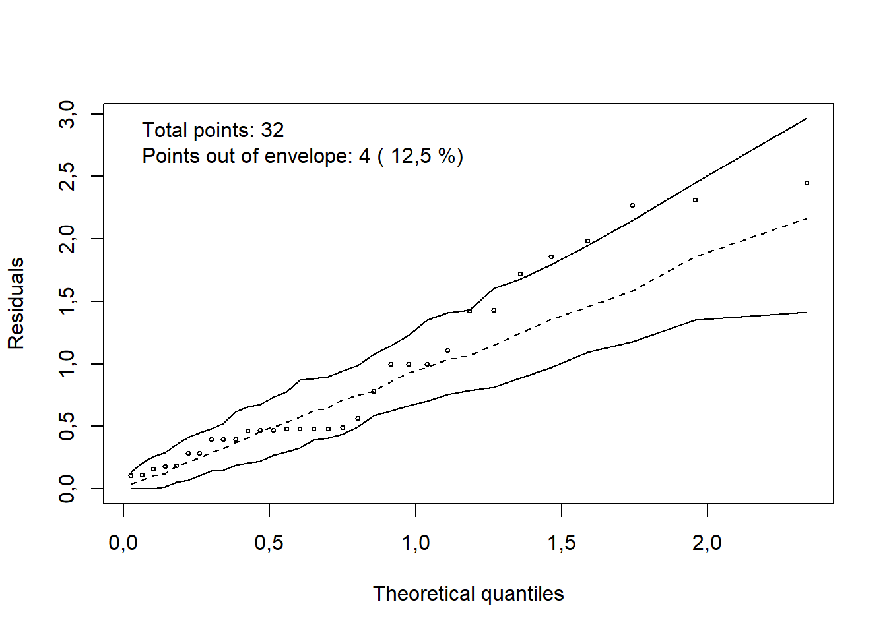

## Constrastes


```r
library(emmeans)
media=emmeans(modelo,~trat)
```

## Retornando a função logistica


```r
medfin=regrid(media)
library(multcompView)
library(multcomp)
cld(medfin, alpha=0.05, Letters=letters, decreasing=FALSE, adjust="tukey")
```

```
##  trat  prob     SE  df asymp.LCL asymp.UCL .group
##  T 3  0,460 0,0249 Inf     0,398     0,522  a    
##  T 4  0,573 0,0247 Inf     0,511     0,634   b   
##  T 1  0,667 0,0236 Inf     0,609     0,726    c  
##  T 2  0,730 0,0222 Inf     0,675     0,785    c  
## 
## Confidence level used: 0,95 
## Conf-level adjustment: sidak method for 4 estimates 
## P value adjustment: tukey method for comparing a family of 4 estimates 
## significance level used: alpha = 0,05
```

## Supondo que não sabemos o total de cada repetição

Nesse caso, vamos optar pela distribuição poisson


```r
modelo=glm(germ~trat, family=poisson)
```

## Análise de deviance


```r
summary(modelo)
```

```
## 
## Call:
## glm(formula = germ ~ trat, family = poisson)
## 
## Deviance Residuals: 
##     Min       1Q   Median       3Q      Max  
## -1,7823  -0,3347   0,1574   0,2550   1,5832  
## 
## Coefficients:
##             Estimate Std. Error z value Pr(>|z|)    
## (Intercept)  3,50781    0,06120  57,318  < 2e-16 ***
## tratT 2      0,08951    0,08468   1,057 0,290496    
## tratT 3     -0,37231    0,09581  -3,886 0,000102 ***
## tratT 4     -0,15353    0,09007  -1,705 0,088274 .  
## ---
## Signif. codes:  0 '***' 0,001 '**' 0,01 '*' 0,05 '.' 0,1 ' ' 1
## 
## (Dispersion parameter for poisson family taken to be 1)
## 
##     Null deviance: 46,061  on 31  degrees of freedom
## Residual deviance: 18,017  on 28  degrees of freedom
## AIC: 193,41
## 
## Number of Fisher Scoring iterations: 4
```

```r
anova(modelo, test="Chisq")
```

```
## Analysis of Deviance Table
## 
## Model: poisson, link: log
## 
## Response: germ
## 
## Terms added sequentially (first to last)
## 
## 
##      Df Deviance Resid. Df Resid. Dev  Pr(>Chi)    
## NULL                    31     46,061              
## trat  3   28,045        28     18,017 3,555e-06 ***
## ---
## Signif. codes:  0 '***' 0,001 '**' 0,01 '*' 0,05 '.' 0,1 ' ' 1
```

## Diagnóstico


```r
par(mfrow=c(2,2))
plot(modelo)
```

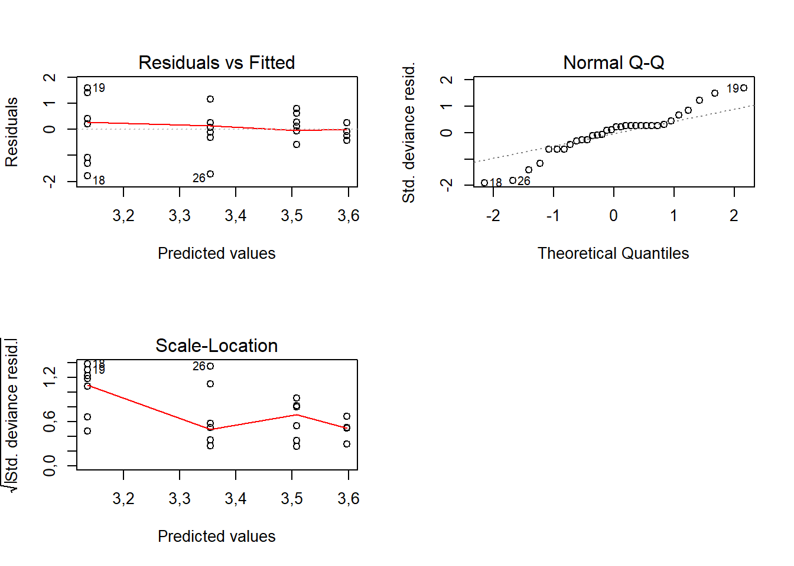

## Halfnormaplot


```r
hnp::hnp(modelo, print.on=T)
```

```
## Poisson model
```

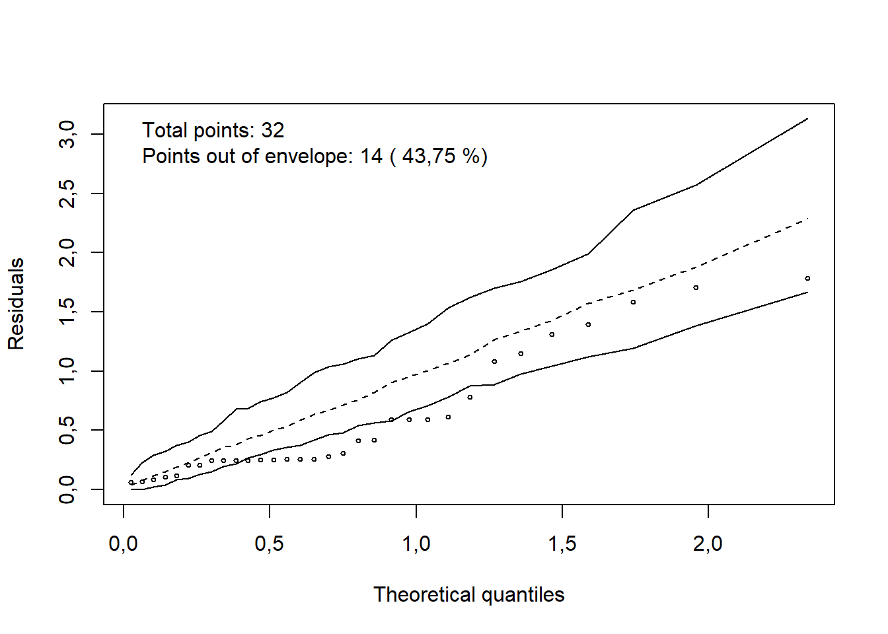

## Constrastes


```r
library(emmeans)
media=emmeans(modelo,~trat)
```

## Retornando a função logistica


```r
medfin=regrid(media)
library(multcompView)
library(multcomp)
cld(medfin, alpha=0.05, Letters=letters, decreasing=FALSE, adjust="tukey")
```

```
##  trat rate   SE  df asymp.LCL asymp.UCL .group
##  T 3  23,0 1,70 Inf      18,8      27,2  a    
##  T 4  28,6 1,89 Inf      23,9      33,3  ab   
##  T 1  33,4 2,04 Inf      28,3      38,5   bc  
##  T 2  36,5 2,14 Inf      31,2      41,8    c  
## 
## Confidence level used: 0,95 
## Conf-level adjustment: sidak method for 4 estimates 
## P value adjustment: tukey method for comparing a family of 4 estimates 
## significance level used: alpha = 0,05
```

## Analisando sobredispersão


```r
library(AER)
dispersiontest(modelo, trafo=1) 
```

```
## 
## 	Overdispersion test
## 
## data:  modelo
## z = -2,8129, p-value = 0,9975
## alternative hypothesis: true alpha is greater than 0
## sample estimates:
##      alpha 
## -0,4488216
```

```r
## se for menor que 0,01 há sbredispersão, nesse caso usar quasipoisson
```

Caso fosse menor que 0,01 ou 0,05, podemos testar a distribuição quasipoisson. 
Vamos treinar, ainda que não seja necessário.


```r
modelo=glm(germ~trat, family=quasipoisson)
```

## Análise de deviance


```r
summary(modelo)
```

```
## 
## Call:
## glm(formula = germ ~ trat, family = quasipoisson)
## 
## Deviance Residuals: 
##     Min       1Q   Median       3Q      Max  
## -1,7823  -0,3347   0,1574   0,2550   1,5832  
## 
## Coefficients:
##             Estimate Std. Error t value Pr(>|t|)    
## (Intercept)  3,50781    0,04857  72,219  < 2e-16 ***
## tratT 2      0,08951    0,06720   1,332   0,1937    
## tratT 3     -0,37231    0,07604  -4,896 3,69e-05 ***
## tratT 4     -0,15353    0,07148  -2,148   0,0405 *  
## ---
## Signif. codes:  0 '***' 0,001 '**' 0,01 '*' 0,05 '.' 0,1 ' ' 1
## 
## (Dispersion parameter for quasipoisson family taken to be 0,6299182)
## 
##     Null deviance: 46,061  on 31  degrees of freedom
## Residual deviance: 18,017  on 28  degrees of freedom
## AIC: NA
## 
## Number of Fisher Scoring iterations: 4
```

```r
anova(modelo, test="Chisq")
```

```
## Analysis of Deviance Table
## 
## Model: quasipoisson, link: log
## 
## Response: germ
## 
## Terms added sequentially (first to last)
## 
## 
##      Df Deviance Resid. Df Resid. Dev Pr(>Chi)    
## NULL                    31     46,061             
## trat  3   28,045        28     18,017 1,17e-09 ***
## ---
## Signif. codes:  0 '***' 0,001 '**' 0,01 '*' 0,05 '.' 0,1 ' ' 1
```

## Diagnóstico


```r
par(mfrow=c(2,2))
plot(modelo)
```


## Halfnormaplot


```r
hnp::hnp(modelo, print.on=T)
```

```
## Quasi-Poisson model
```

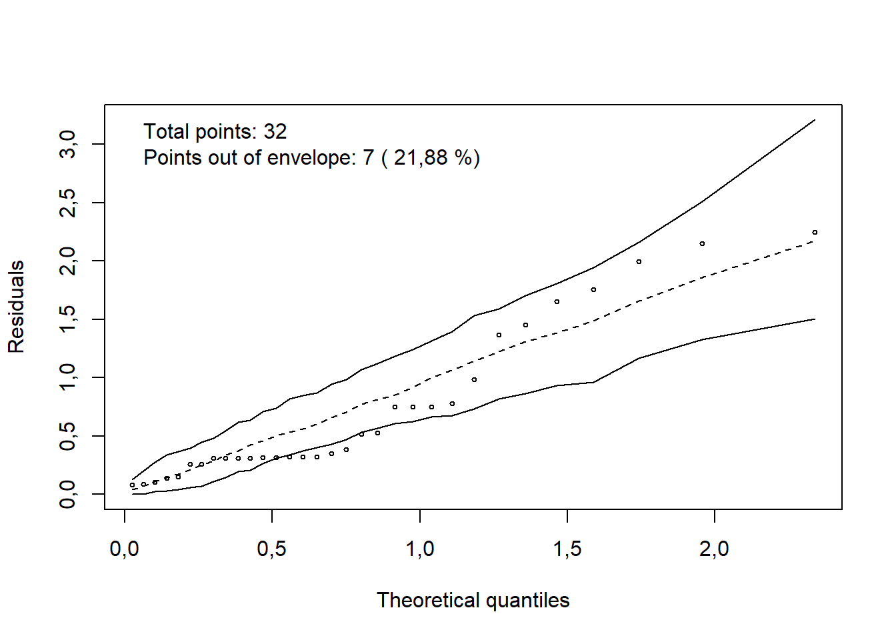

## Constrastes


```r
library(emmeans)
media=emmeans(modelo,~trat)
```

## Retornando a função logistica


```r
medfin=regrid(media)
library(multcompView)
library(multcomp)
cld(medfin, alpha=0.05, Letters=letters, decreasing=FALSE, adjust="tukey")
```

```
##  trat rate   SE  df asymp.LCL asymp.UCL .group
##  T 3  23,0 1,35 Inf      19,6      26,4  a    
##  T 4  28,6 1,50 Inf      24,9      32,4   b   
##  T 1  33,4 1,62 Inf      29,3      37,4   bc  
##  T 2  36,5 1,70 Inf      32,3      40,7    c  
## 
## Confidence level used: 0,95 
## Conf-level adjustment: sidak method for 4 estimates 
## P value adjustment: tukey method for comparing a family of 4 estimates 
## significance level used: alpha = 0,05
```

## Distribuição quasibinomial


```r
quasibin<-glm(cbind(germ,50-germ)~trat, family = quasibinomial)
```

## Análise de deviance


```r
summary(modelo)
```

```
## 
## Call:
## glm(formula = germ ~ trat, family = quasipoisson)
## 
## Deviance Residuals: 
##     Min       1Q   Median       3Q      Max  
## -1,7823  -0,3347   0,1574   0,2550   1,5832  
## 
## Coefficients:
##             Estimate Std. Error t value Pr(>|t|)    
## (Intercept)  3,50781    0,04857  72,219  < 2e-16 ***
## tratT 2      0,08951    0,06720   1,332   0,1937    
## tratT 3     -0,37231    0,07604  -4,896 3,69e-05 ***
## tratT 4     -0,15353    0,07148  -2,148   0,0405 *  
## ---
## Signif. codes:  0 '***' 0,001 '**' 0,01 '*' 0,05 '.' 0,1 ' ' 1
## 
## (Dispersion parameter for quasipoisson family taken to be 0,6299182)
## 
##     Null deviance: 46,061  on 31  degrees of freedom
## Residual deviance: 18,017  on 28  degrees of freedom
## AIC: NA
## 
## Number of Fisher Scoring iterations: 4
```

```r
anova(modelo, test="Chisq")
```

```
## Analysis of Deviance Table
## 
## Model: quasipoisson, link: log
## 
## Response: germ
## 
## Terms added sequentially (first to last)
## 
## 
##      Df Deviance Resid. Df Resid. Dev Pr(>Chi)    
## NULL                    31     46,061             
## trat  3   28,045        28     18,017 1,17e-09 ***
## ---
## Signif. codes:  0 '***' 0,001 '**' 0,01 '*' 0,05 '.' 0,1 ' ' 1
```

## Diagnóstico


```r
par(mfrow=c(2,2))
plot(modelo)
```


## Halfnormaplot


```r
hnp::hnp(modelo, print.on=T)
```

```
## Quasi-Poisson model
```

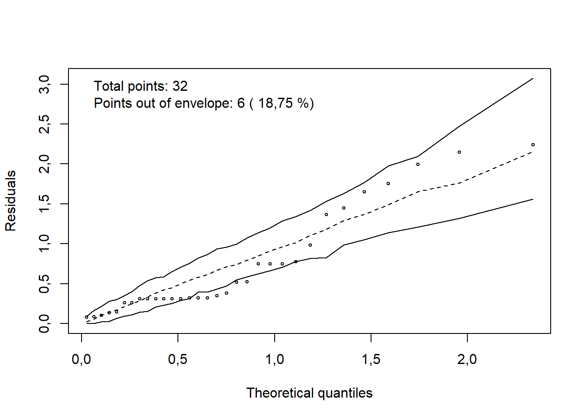

## Constrastes


```r
library(emmeans)
media=emmeans(modelo,~trat)
summary(pairs(media), type = "response")
```

```
##  contrast  ratio     SE  df z.ratio p.value
##  T 1 / T 2 0,914 0,0615 Inf -1,332  0,5425 
##  T 1 / T 3 1,451 0,1103 Inf  4,896  0,0000 
##  T 1 / T 4 1,166 0,0833 Inf  2,148  0,1382 
##  T 2 / T 3 1,587 0,1186 Inf  6,182  0,0000 
##  T 2 / T 4 1,275 0,0893 Inf  3,469  0,0029 
##  T 3 / T 4 0,803 0,0631 Inf -2,784  0,0275 
## 
## P value adjustment: tukey method for comparing a family of 4 estimates 
## Tests are performed on the log scale
```

## Retornando a função logistica


```r
medfin=regrid(media)
library(multcompView)
library(multcomp)
cld(medfin, alpha=0.05, Letters=letters, decreasing=FALSE, adjust="tukey")
```

```
##  trat rate   SE  df asymp.LCL asymp.UCL .group
##  T 3  23,0 1,35 Inf      19,6      26,4  a    
##  T 4  28,6 1,50 Inf      24,9      32,4   b   
##  T 1  33,4 1,62 Inf      29,3      37,4   bc  
##  T 2  36,5 1,70 Inf      32,3      40,7    c  
## 
## Confidence level used: 0,95 
## Conf-level adjustment: sidak method for 4 estimates 
## P value adjustment: tukey method for comparing a family of 4 estimates 
## significance level used: alpha = 0,05
```

## Fatorial qualitativo e quantitativo

Supondo um outro exemplo de um experimento em esquema fatorial 2 x 5, em que o primeiro fator e qualitativo e o segundo fator quantitativo com 5 doses (2, 4, 6, 8, 10) e três repetições cada. Total de semenetes e conhecido e o valor e 30.


```r
resp=c(0,0,0,3,3,2,6,6,5,17,18,14,25,26,23,
       0,1,0,1,1,2,15,14,15,15,16,16,20,20,19)
f1=rep(c("T1","T2"),e=15) ## fator qualitativo
d=rep(c(2,4,6,8,10),e=3,2) ## dose como numerico
D=factor(d) ## considerando dose como fator
```

## Modelo

Vamos considerar os dois fatores como qualitativos


```r
bin=glm(cbind(resp,30-resp)~f1*D, family = binomial)
```

## Deviance


```r
summary(bin)
```

```
## 
## Call:
## glm(formula = cbind(resp, 30 - resp) ~ f1 * D, family = binomial)
## 
## Deviance Residuals: 
##     Min       1Q   Median       3Q      Max  
## -0,8532  -0,2951   0,1217   0,1590   0,9375  
## 
## Coefficients:
##             Estimate Std. Error z value Pr(>|z|)
## (Intercept)   -23,14    6757,51  -0,003    0,997
## f1T2           18,65    6757,51   0,003    0,998
## D4             20,81    6757,51   0,003    0,998
## D6             21,68    6757,51   0,003    0,997
## D8             23,31    6757,51   0,003    0,997
## D10            24,67    6757,51   0,004    0,997
## f1T2:D4       -19,39    6757,51  -0,003    0,998
## f1T2:D6       -17,24    6757,51  -0,003    0,998
## f1T2:D8       -18,74    6757,51  -0,003    0,998
## f1T2:D10      -19,54    6757,51  -0,003    0,998
## 
## (Dispersion parameter for binomial family taken to be 1)
## 
##     Null deviance: 397,0255  on 29  degrees of freedom
## Residual deviance:   5,6398  on 20  degrees of freedom
## AIC: 108,6
## 
## Number of Fisher Scoring iterations: 19
```

```r
anova(bin, test="Chisq")
```

```
## Analysis of Deviance Table
## 
## Model: binomial, link: logit
## 
## Response: cbind(resp, 30 - resp)
## 
## Terms added sequentially (first to last)
## 
## 
##      Df Deviance Resid. Df Resid. Dev  Pr(>Chi)    
## NULL                    29     397,03              
## f1    1     0,24        28     396,78    0,6215    
## D     4   363,46        24      33,33 < 2,2e-16 ***
## f1:D  4    27,69        20       5,64 1,443e-05 ***
## ---
## Signif. codes:  0 '***' 0,001 '**' 0,01 '*' 0,05 '.' 0,1 ' ' 1
```

```r
referencia <- ref_grid(bin)
referencia ## Aqui deve aparecer os niveis dos fatores, se dose so aparecer 1, está errado
```

```
## 'emmGrid' object with variables:
##     f1 = T1, T2
##     D = 2, 4, 6, 8, 10
## Transformation: "logit"
```

## Teste de comparação 

Se não fosse um fator quantitativo, podemos fazer assim:


```r
media <- emmeans(bin, ~f1|D)
medfin<-regrid(media)
cld(medfin, alpha=0.05, Letters=letters, adjust="tukey")
```

```
## D = 2:
##  f1   prob       SE  df asymp.LCL asymp.UCL .group
##  T1 0,0000 6,00e-07 Inf -1,40e-06  1,40e-06  a    
##  T2 0,0111 1,10e-02 Inf -1,36e-02  3,58e-02  a    
## 
## D = 4:
##  f1   prob       SE  df asymp.LCL asymp.UCL .group
##  T2 0,0444 2,17e-02 Inf -4,14e-03  9,30e-02  a    
##  T1 0,0889 3,00e-02 Inf  2,18e-02  1,56e-01  a    
## 
## D = 6:
##  f1   prob       SE  df asymp.LCL asymp.UCL .group
##  T1 0,1889 4,13e-02 Inf  9,66e-02  2,81e-01  a    
##  T2 0,4889 5,27e-02 Inf  3,71e-01  6,07e-01   b   
## 
## D = 8:
##  f1   prob       SE  df asymp.LCL asymp.UCL .group
##  T2 0,5222 5,27e-02 Inf  4,04e-01  6,40e-01  a    
##  T1 0,5444 5,25e-02 Inf  4,27e-01  6,62e-01  a    
## 
## D = 10:
##  f1   prob       SE  df asymp.LCL asymp.UCL .group
##  T2 0,6556 5,01e-02 Inf  5,44e-01  7,68e-01  a    
##  T1 0,8222 4,03e-02 Inf  7,32e-01  9,12e-01   b   
## 
## Confidence level used: 0,95 
## Conf-level adjustment: sidak method for 2 estimates 
## significance level used: alpha = 0,05
```

```r
media <- emmeans(bin, ~D|f1)
medfin<-regrid(media)
cld(medfin, alpha=0.05, Letters=letters, adjust="tukey")
```

```
## f1 = T1:
##  D    prob       SE  df asymp.LCL asymp.UCL .group
##  2  0,0000 6,00e-07 Inf -1,60e-06  1,60e-06  a    
##  4  0,0889 3,00e-02 Inf  1,18e-02  1,66e-01   b   
##  6  0,1889 4,13e-02 Inf  8,29e-02  2,95e-01   b   
##  8  0,5444 5,25e-02 Inf  4,10e-01  6,79e-01    c  
##  10 0,8222 4,03e-02 Inf  7,19e-01  9,26e-01     d 
## 
## f1 = T2:
##  D    prob       SE  df asymp.LCL asymp.UCL .group
##  2  0,0111 1,10e-02 Inf -1,73e-02  3,95e-02  a    
##  4  0,0444 2,17e-02 Inf -1,14e-02  1,00e-01  a    
##  6  0,4889 5,27e-02 Inf  3,54e-01  6,24e-01   b   
##  8  0,5222 5,27e-02 Inf  3,87e-01  6,57e-01   b   
##  10 0,6556 5,01e-02 Inf  5,27e-01  7,84e-01   b   
## 
## Confidence level used: 0,95 
## Conf-level adjustment: sidak method for 5 estimates 
## P value adjustment: tukey method for comparing a family of 5 estimates 
## significance level used: alpha = 0,05
```

## Regressão

Como há interação entre os fatores, necessitamos construir duas curvas, vejamos: 

## Dividindo o conjunto de dados


```r
resp1=resp[1:15]  ## resposta de T1, nesse caso as observações de T1 estão na posição de  1 a 15
resp2=resp[16:30] ## resposta de T2, nesse caso as observações de T2 estão na posição de  16 a 30
d=d[1:15] ## cortando dose, nesse caso somente uma vez é necessário
```

## modelo para T1


```r
bin1=glm(cbind(resp1,30-resp1)~d, family = binomial)
summary(bin1)
```

```
## 
## Call:
## glm(formula = cbind(resp1, 30 - resp1) ~ d, family = binomial)
## 
## Deviance Residuals: 
##     Min       1Q   Median       3Q      Max  
## -0,9384  -0,7855  -0,1458   0,4803   0,8687  
## 
## Coefficients:
##             Estimate Std. Error z value Pr(>|z|)    
## (Intercept) -5,66100    0,51900  -10,91   <2e-16 ***
## d            0,72347    0,06751   10,72   <2e-16 ***
## ---
## Signif. codes:  0 '***' 0,001 '**' 0,01 '*' 0,05 '.' 0,1 ' ' 1
## 
## (Dispersion parameter for binomial family taken to be 1)
## 
##     Null deviance: 223,1818  on 14  degrees of freedom
## Residual deviance:   6,8923  on 13  degrees of freedom
## AIC: 50,895
## 
## Number of Fisher Scoring iterations: 4
```

## modelo para T2


```r
bin2=glm(cbind(resp2,30-resp2)~d, family = binomial)
summary(bin2)
```

```
## 
## Call:
## glm(formula = cbind(resp2, 30 - resp2) ~ d, family = binomial)
## 
## Deviance Residuals: 
##     Min       1Q   Median       3Q      Max  
## -1,8205  -1,5467  -0,9111   0,1884   2,4892  
## 
## Coefficients:
##             Estimate Std. Error z value Pr(>|z|)    
## (Intercept) -3,89248    0,37250 -10,449   <2e-16 ***
## d            0,49464    0,05016   9,862   <2e-16 ***
## ---
## Signif. codes:  0 '***' 0,001 '**' 0,01 '*' 0,05 '.' 0,1 ' ' 1
## 
## (Dispersion parameter for binomial family taken to be 1)
## 
##     Null deviance: 173,600  on 14  degrees of freedom
## Residual deviance:  34,827  on 13  degrees of freedom
## AIC: 81,781
## 
## Number of Fisher Scoring iterations: 5
```

## Gráfico

### Calculando vetores


```r
med1=tapply(resp1/30, d, mean)
med2=tapply(resp2/30, d, mean)
DOSE=c(2,4,6,8,10)
```

### Gráfico final


```r
plot(med1~DOSE,xlab="Dose(mg/L)",ylab="Probabilidade")
points(med2~DOSE,pch=16,col="darkblue")
curve(predict(bin1,data.frame(d=x),type="resp"),add=TRUE) ## curva de T1
##points(d,fitted(bin1),pch=20) 
curve(predict(bin2,data.frame(d=x),type="resp"),add=TRUE, lty=2,col="darkblue") ## Curva de T2
```


<!--chapter:end:index.Rmd-->

--- 
title: "Aplicações práticas do software R para Agronomia"
author: "Gabriel Danilo Shimizu"
date: "2020-05-09"
site: bookdown::bookdown_site
documentclass: book
bibliography: [book.bib, packages.bib]
biblio-style: apalike
link-citations: yes
description: "Este é um ..."
---


# Apresentação


# Estatística Descritiva

<br>

As estatísticas descritivas são números que resumem e descrevem o conjuntos de dados. As estatísticas descritivas apenas "descrevem" os dados, elas não representam generalizações da amostra para a população.

Abaixo, segue alguns comandos do software R e as respectivas explicações das análises. Foi utilizado um conjunto de dados para melhor exemplificação.

****

## Conjunto de Dados

****

Existem várias formas de entrada ou leitura de dados no R. Para um conjunto de dados pequeno, pode-se entrar com as informações diretamente no console do programa. Considere um delineamento 
inteiramente ao acaso com 5 tratamentos e 4 repetições. A entrada dos dados, entre outras, poderia ser da forma:


```r
tratamentos = rep(c(paste("T", sep='', 1:5)), each=4)
resposta = c(100, 120, 110,  90,
             150, 145, 149, 165,
             150, 144, 134, 139,
             220, 206, 211, 210,
             266, 249, 248, 260)
```

<br><br>

****

## Medidas de Tendência Central

****

As medidas de tendência central ou posição são utilizadas para resumir, em um único número, o conjunto de dados observados da variável em estudo. 

Usualmente emprega-se uma das seguintes medidas de posição (ou localização) central: média, mediana ou moda.

<br>

### Média Aritmética Simples

A medida de tendência central mais comumente usada para descrever resumidamente um conjunto de dados, tabelados ou não, é a média aritmética simples, ou simplesmente média e representa-se por $\bar{x}$. é definida como a soma das observações dividida pelo número delas.

Assim, a média amostral é dada por:

$$\overline{x} = \frac{x_1 + \ldots + x_n}{n}, \qquad \mbox{ ou, resumidamente, como } \qquad \overline{x} = \displaystyle \frac {1}{n} \sum_{i=1}^{n} x_i. $$


```r
## Comando básico para o cálculo da média geral
(média = mean(resposta))
```

```
## [1] 173.3
```

Para calcular a média por tratamento, pode-se usar o comando tapply(), que necessita dos seguintes argumentos:
`tapply(vetor de dados, fator, análise)`.

Assim

```r
## Cálculo da média por tratamento
(médias = tapply(resposta, tratamentos, mean))
```

```
##     T1     T2     T3     T4     T5 
## 105.00 152.25 141.75 211.75 255.75
```

<br>

****

### Mediana

****

A mediana, denotada por $Md$, é uma quantidade que, como a média, também procura caracterizar o centro da distribuição de frequências quando os valores são dispostos em ordem crescente ou decrescente de magnitude. 

É o valor que divide o conjunto ordenado de valores em duas partes com igual número de elementos, ou seja, 50\% das observações ficam acima da mediana e 50\% ficam abaixo.

Para calcular a mediana deve-se, em primeiro lugar, ordenar os dados para que se possa localizar a posição da mediana e assim encontrar seu valor. O número que indica a ordem ou posição em que se encontra o valor correspondente à mediana é denominado elemento mediano ($E_{Md}$).

Se o número de observações for impar, a mediana será a observação central. Se o número de observações for par, a mediana será a média aritmática das duas observações centrais.


```r
## Comando básico para o cálculo da mediana
(mediana = median(resposta))
```

```
## [1] 150
```


```r
## Cálculo da mediana por tratamento
(medianas = tapply(resposta, tratamentos, median))
```

```
##    T1    T2    T3    T4    T5 
## 105.0 149.5 141.5 210.5 254.5
```

<br>

****

### Moda

****

A moda de um conjunto de valores é definida como a realização mais frequente do conjunto de valores observados, ou seja, é o valor que apresenta a maior frequência. 

Se dois valores ocorrem com a mesma frequência máxima, cada um deles será a moda, e o conjunto se denomina **bimodal**. 

Se mais de dois valores ocorrem com a mesma frequência máxima, cada um deles é uma moda, e o conjunto é **multimodal**. 

Quando nenhum valor é repetido, o conjunto não tem moda (**amodal**). 

A moda pode ser obtida mesmo que a variável seja **qualitativa**. Os comandos para se determinar a moda são:


```r
tab = table(resposta)
(moda = names(tab)[tab == max(tab)])
```

```
## [1] "150"
```

<br>

****

### Máximo 

****

O maior valor observado no conjunto de dados.


```r
## Comando básico para o cálculo do valor máximo
(máximo = max(resposta))
```

```
## [1] 266
```


```r
## Cálculo do valor máximo para cada tratamento
(máximos = tapply(resposta, tratamentos, max))
```

```
##  T1  T2  T3  T4  T5 
## 120 165 150 220 266
```

<br>

****

### Mínimo

****

O menor valor observado no conjunto de dados.


```r
## Comando básico para valor mínimo
(mínimo = min(resposta))
```

```
## [1] 90
```


```r
## Cálculo do valor mínimo para cada tratamento
(mínimos = tapply(resposta, tratamentos, min))
```

```
##  T1  T2  T3  T4  T5 
##  90 145 134 206 248
```

<br> <br>

****

## Medidas de Dispersão

****

As medidas de dispersão servem para indicar o quanto os dados se apresentam dispersos, ou afastados, em relação ao seu valor médio, por exemplo.

<br>

****

### Amplitude Total

****

A maneira mais simples de se medir a variabilidade de uma variável é através da "distância" entre o maior e o menor valor observado em um conjunto de dados. Essa diferença é a amplitude total, denotada por $A_t$. 

Considere o conjunto de dados ordenado:
$$X_{(1)} \leq X_{(2)} \leq X_{(3)} \leq \cdots \leq X_{(n-1)} \leq X_{(n)}.$$	

A amplitude $A_t$ dos dados é dada por:

$$A_t = X_{(n)} - X_{(1)}$$

```r
(amplitude = max(resposta) - min(resposta))
```

```
## [1] 176
```

```r
# ou
(amplitude = diff(range(resposta)))
```

```
## [1] 176
```

<br>

****

### Variância Amostral

****

A medida de variabilidade mais utilizada é a variância, que é simplesmente a soma dos quadrados dos desvios, dividida pelo total de observações menos um. 

A variância de uma amostra $\left\{x_1, \ldots, x_n \right\}$ de $n$ elementos é definida por:
$$s^2 = \sum_{i=1}^n \frac{(x_i - \overline{x})^2}{n-1} \qquad \mbox{ ou } \qquad s^2 = \frac{1}{n-1} \left[ 
\sum_{i=1}^n x_i^2 - \frac{ \left( \displaystyle \sum_{i=1}^n x_i \right)^2  }{n} \right].$$


```r
## Comando básico para o cálculo da variância amostral
(variância = var(resposta))
```

```
## [1] 3090.747
```


```r
## Cálculo da variância amostral para cada tratamento
(variâncias = tapply(resposta, tratamentos, var))
```

```
##        T1        T2        T3        T4        T5 
## 166.66667  76.91667  46.91667  34.91667  76.25000
```

<br>

Algumas propriedades da variância são:

- somar (ou subtrair) um valor constante e arbitrário $c$ a cada elemento de um conjunto de números não altera a variância;

- multiplicar (ou dividir) por um valor constante e arbitrário $c$ cada elemento de um conjunto de números, a variância fica multiplicada (ou dividida) pelo quadrado da constante.

<br>

****

### Desvio-padrão Amostral

****

Observe que, devido ao fato de se elevar os desvios ao quadrado, a unidade de medida também fica elevada ao quadrado, gerando escalas sem sentido prático. Assim, caso a unidade de mensuração seja metros ($m$), a unidade de medida da variância será $m^2$.

Uma forma de se obter uma medida de dispersão com a mesma unidade de medida dos dados observados é, simplesmente, extrair a raiz quadrada da variância, obtendo-se o desvio padrão. Ele é representado por $s$. Logo,

$$ s = \sqrt{s^2} = \sqrt{\sum_{i=1}^n \frac{(x_i - \overline{x})^2}{n-1}}$$


```r
## Comando básico para Desvio-padrão amostral
(desvio = sd(resposta))
```

```
## [1] 55.59449
```


```r
## Separando por tratamento
(desvios = tapply(resposta, tratamentos, sd))
```

```
##        T1        T2        T3        T4        T5 
## 12.909944  8.770215  6.849574  5.909033  8.732125
```

<br>

****

### Coeficiente de Variação

****

A interpretação do desvio padrão depende da ordem de grandeza da variável em estudo. Assim, um desvio padrão de 10 pode ser insignificante se os valores típicos observados forem muito altos, por exemplo, em torno de 1.000; mas pode ser muito expressivo para um conjunto de dados cuja observação típica seja em torno de 100.

Logo, pode ser conveniente expressar a variabilidade dos dados de uma variável de modo **independente da sua unidade de medida** utilizada, tirando a influência da ordem de grandeza da variável. Tal medida é denominada coeficiente de variação.

O coeficiente de variação de Pearson é a razão entre o desvio padrão e a média. Em geral, o resultado é multiplicado por 100, para que o coeficiente de variação seja expresso em porcentagem. 

É dado por:

$$CV = \dfrac{s} {\overline{x} } \times 100$$


```r
## Comando para o cálculo do Coeficiente de Variação
(CV = sd(resposta) / mean(resposta)*100)
```

```
## [1] 32.07991
```

```r
# ou
(CV = desvio / média * 100)
```

```
## [1] 32.07991
```


```r
## Cálculo do Coeficiente de Variação por tratamento
(CVs = tapply(resposta, tratamentos, sd) / tapply(resposta, tratamentos, mean)*100)
```

```
##        T1        T2        T3        T4        T5 
## 12.295185  5.760404  4.832151  2.790570  3.414320
```

<br>

****

## Gerando uma Tabela com as Estatísticas

****

Pode-se construir uma única tabela com as estatísticas geradas usando-se o comando ``rbind`` ou ``cbind``. Assim,


```r
descritiva = rbind(Média = média,
                   Mediana = mediana,
                   Máximo=max(resposta),
                   Mínimo=min(resposta),
                   Amplitude=amplitude,
                   Variância=variância,
                   "Desvio-padrão"=desvio,
                   "CV(%)"=CV)
colnames(descritiva) = 'Estatísticas'
descritiva
```

```
##               Estatísticas
## Média            173.30000
## Mediana          150.00000
## Máximo           266.00000
## Mínimo            90.00000
## Amplitude        176.00000
## Variância       3090.74737
## Desvio-padrão     55.59449
## CV(%)             32.07991
```

<br>

****

## Gerando as estatísticas por tratamento:

****


```r
# Cálculo das Estatísticas por tratamento

Descritiva = cbind(Médias=round(médias, 1), 
                   Medianas=medianas,
                   Máximos=máximos,
                   Mínimos=mínimos,
                   Amplitudes=máximos - mínimos,
                   Variâncias=round(variâncias, 4), 
                   "Desvios-padrão"=round(desvios, 4), 
                   "CVs(%)"=round(CVs, 1))
Descritiva
```

```
##    Médias Medianas Máximos Mínimos Amplitudes Variâncias Desvios-padrão CVs(%)
## T1  105.0    105.0     120      90         30   166.6667        12.9099   12.3
## T2  152.2    149.5     165     145         20    76.9167         8.7702    5.8
## T3  141.8    141.5     150     134         16    46.9167         6.8496    4.8
## T4  211.8    210.5     220     206         14    34.9167         5.9090    2.8
## T5  255.8    254.5     266     248         18    76.2500         8.7321    3.4
```


# Estatística Experimental

<br><br>

A Estatística Experimental tem por objetivo o estudo dos experimentos, incluindo o planejamento, execução, análise dos dados e interpretação dos resultados obtidos, sendo baseado em três principios básicos: casualização, repetição e controle local.

<br><br>

{width=110%}
[**Fonte**: Exame](https://exame.abril.com.br/ciencia/a-ciencia-por-tras-do-experimento-agricola-mais-longo-da-historia/)

<br><br><br><br>

# Delineamento Inteiramente Casualizado

****

<br><br><br><br>

O Delineamento inteiramente casualizado é considerado o delineamento mais simples dentro da estatistica. No DIC as unidades experimentais são destinadas a cada tratamento de uma forma inteiramente casual (sorteio). Os experimentos formulados com este delineamento são denominados "experimentos inteiramente ao acaso".

<br>

O DIC apresenta as seguintes características:

- Considera apenas os princípios de repetição e casulização;
- Os tratamentos são divididos em parcelas de forma inteiramente casual;
- Exige que o material experimental seja semelhante e que as condições de estudo sejam completamentes uniformes;
- Os aspectos que devem ser considerados na semelhança entre as U.E. são aqueles que interferem nas respostas das mesmas aos tratamentos;
- Ele geralmente é mais utilizado em experimentos nos quais as condições experimentais podem ser bastante controladas (por exemplo em laboratórios);

<br>

****

## Vantagens

****

- Delineamento flexível - número de tratamentos e repetições depende apenas da quantidade de parcelas disponíveis

- O número de repetições pode diferir de um tratamento para o outro (experimento não balanceado)

- A análise estatística é simples

- O número de G.L. resíduo é o maior possível

<br>

****

## Desvantagens

****

- Exige homogeneidade das condições ambientais

- Pode estimar uma variância residual muito alta

****

## Modelo matemático para DIC

****

\begin{eqnarray}
y_{ji}=\mu+\tau_i+\varepsilon_{ij}
\end{eqnarray}

$y_{ji}$: é a observação referente ao tratamento i na repetição j;

$\mu$: é a média geral (ou constante comum a todas as observações);

$\tau_i$: é o efeito de tratamento, com $i = 1, 2, . . . , I$;

$\varepsilon_{ij}$: é o erro experimental, tal que $\varepsilon_{ij}$~N(0; $\sigma^2$).

****

## Hipóteses e Modelo 

****

\begin{eqnarray*}
\left\{
\begin{array}{ll}
H_0: & \mu_1 = \mu_2 =\mu_i\\[.2cm]
H_1: & \mu_i \neq \mu_i' \qquad i \neq i'.
\end{array}
\right.
\end{eqnarray*}

CV            | G.L.    |S.Q.         |Q.M.                     |  Fcalc                 | Ftab
-------------:|:-------:|:-----------:|:-----------------------:|:----------------------:|:----------------------------------
Tratamentos   | $a - 1$ | $SQ_{Trat}$ | $\frac{SQ_{Trat}}{a-1}$ | $\frac{QMTrat}{QMRes}$ | $F(\alpha;GL_{Trat} ;GL_{Res})$
resíduo       | $a(b-1)$| $SQ_{Res}$  |$SQRes$                  | -                      |
Total         | $ab-1$  |$SQ_{Total}$ | -                       | -                      |

<center>

**Correção**

$C = \frac{(\sum Y_{ij})^2}{ij}$

**Soma de Quadrados Total**

$SQ_{Total}=\sum Y_{ij}^2-C$

**Soma de Quadrados Tratamento**

$SQ_{Tratamento}=\frac{1}{J}\sum Y_{i}^2-C$

**Soma de Quadrados do resíduo**

$SQ_{Resíduo} = SQ_{Total} - SQ_{Tratamento}$

**Quadrado Médio do Tratamento**

$QM_{Tratamento} = \frac{SQ_{Tratamento}}{GL_{Tratamento}}$

**Quadrado Médio do Resíduo**

$QM_{Resíduo} = \frac{SQ_{Resíduo}}{GL_{Resíduo}}$

**F calculado**

$F_{Calculado}=\frac{QM_{Tratamento}}{QM_{Resíduo}}$

</center>

<br><br>

****

## Croqui para DIC

****

<br>

Criando uma função para fazer um croqui (Número de colunas igual a número de repetições)

<br>


```r
# Não alterar os comandos da função
library(agricolae)
library(gridExtra)
library(grid)
croqui=function(trat,r){
  sort=design.crd(trat,r,serie=0)
  sort$book[,3]=as.factor(matrix(sort$book[,3],r,,T))
  ncol=r
  gs <- lapply(sort$book[,3], function(ii)
    grobTree(rectGrob(gp=gpar(fill=ii, alpha=0.5)),textGrob(ii)))
  grid.arrange(grobs=gs, ncol=ncol)}
```

<br>

Vetor de tratamentos


```r
trat=c("T1","T2","T3","T4")
```

<br>

Usando a função


```r
croqui(trat,r=3)
```

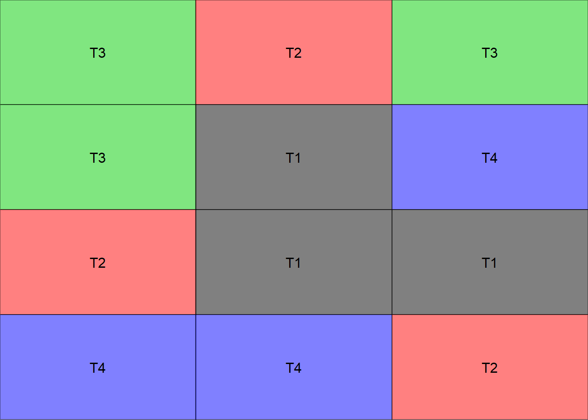

<br>

Criando uma função para fazer um croqui (Número de colunas igual a número de tratamentos)


```r
# Não alterar os comandos da função
library(agricolae)
library(gridExtra)
library(grid)
croqui=function(trat,r){
  sort=design.crd(trat,r,serie=0)
  sort$book[,3]=as.factor(t(matrix(sort$book[,3],r,,T)))
  ncol=length(levels(sort$book[,3]))
  gs <- lapply(sort$book[,3], function(ii)
    grobTree(rectGrob(gp=gpar(fill=ii, alpha=0.5)),textGrob(ii)))
  grid.arrange(grobs=gs, ncol=ncol)}
```

<br>

Vetor de tratamentos


```r
trat=c("T1","T2","T3","T4")
```

<br>

Usando a função


```r
croqui(trat,r=3)
```

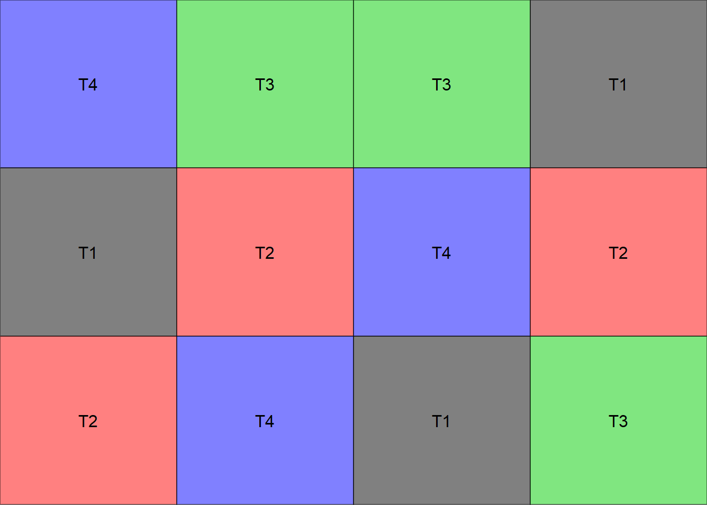

<br><br>

****

## Exemplo 1

****

<br>

Um experimento foi conduzido em Delineamento Inteiramente Casualizado composto por 5 tratamentos em 4 repetições


X1         X2         X3         X4       
---------  ---------  ---------  ---------
T1 (100)   T2 (150)   T1 (110)   T4 (210) 
T3 (150)   T5 (249)   T2 (149)   T3 (139) 
T4 (220)   T1 (120)   T4 (206)   T5 (260) 
T3 (144)   T5 (248)   T3 (134)   T1 (90)  
T5(266)    T2 (145)   T4 (210)   T2 (165) 


```r
tratamentos=rep(c(paste("T",1:5)),e=4)
resposta=c(100,120,110,90,150,145,149,165,150,144,134,139,220,206,210,210,266,249,248,260)
```

<br><br>

## Análise Descritiva


```r
Media=mean(resposta)
Desvio=sd(resposta)
Variancia=var(resposta)
Maximo=max(resposta)
Minimo=min(resposta)
Mediana=median(resposta)
descritiva=cbind(Media,
                 Desvio, 
                 Variancia, 
                 Maximo, 
                 Minimo, 
                 Mediana)
kable(descritiva)
```


  Media     Desvio   Variancia   Maximo   Minimo   Mediana
-------  ---------  ----------  -------  -------  --------
 173.25   55.55924    3086.829      266       90       150

<br><br>

## Por Tratamento


```r
Media=tapply(resposta,tratamentos, mean)
Desvio=tapply(resposta,tratamentos,sd)
Variancia=tapply(resposta,tratamentos, var)
Maximo=tapply(resposta,tratamentos,max)
Minimo=tapply(resposta,tratamentos, min)
Mediana=tapply(resposta,tratamentos,median)
descritiva=cbind(Media,
                 Desvio, 
                 Variancia, 
                 Maximo, 
                 Minimo, 
                 Mediana)
kable(descritiva)
```

        Media      Desvio   Variancia   Maximo   Minimo   Mediana
----  -------  ----------  ----------  -------  -------  --------
T 1    105.00   12.909944   166.66667      120       90     105.0
T 2    152.25    8.770215    76.91667      165      145     149.5
T 3    141.75    6.849574    46.91667      150      134     141.5
T 4    211.50    5.972158    35.66667      220      206     210.0
T 5    255.75    8.732125    76.25000      266      248     254.5


```r
kable(round(descritiva,2), align="l")
```

      Media    Desvio   Variancia   Maximo   Minimo   Mediana 
----  -------  -------  ----------  -------  -------  --------
T 1   105.00   12.91    166.67      120      90       105.0   
T 2   152.25   8.77     76.92       165      145      149.5   
T 3   141.75   6.85     46.92       150      134      141.5   
T 4   211.50   5.97     35.67       220      206      210.0   
T 5   255.75   8.73     76.25       266      248      254.5   

<br><br>

## Gráfico de Caixas (Boxplot)


```r
car::Boxplot(resposta~tratamentos,
             las=1,
             col="lightblue", xlab="",
             ylab=expression("Produtividade"*" "* (Kg*" "*ha^-1)))
points(Media,col="red", pch=8)
```

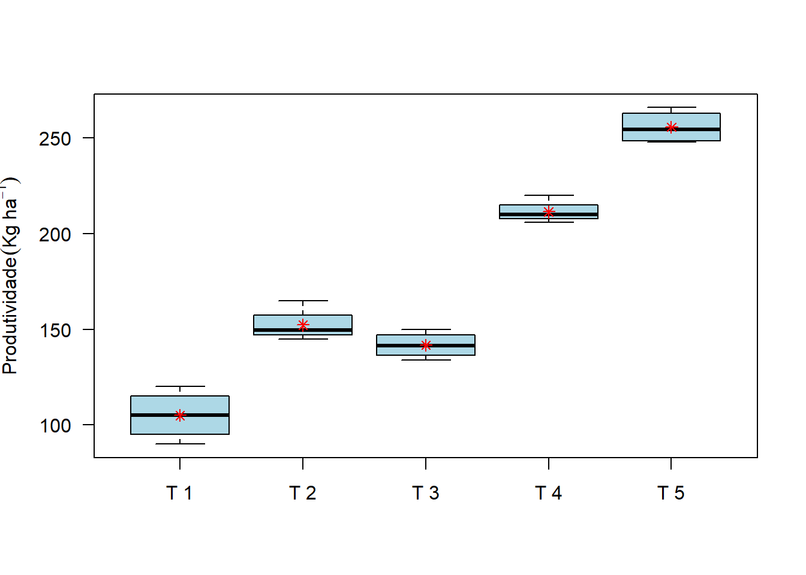

## Análise de Variância

Hipóteses:

\begin{eqnarray*}
\left\{
\begin{array}{ll}
H_0: & \mu_1 = \mu_2 = \mu_3 =\mu_4 =\mu_5\\[.2cm]
H_1: & \mu_i \neq \mu_i' \qquad i \neq i'.
\end{array}
\right.
\end{eqnarray*}

$H_0: \mu_1=\mu_2=\mu_3=\mu_4=\mu_5$\
$H_1: \mu_i\neq\mu'_i \qquad i\neq i'$


```r
modelo=aov(resposta~tratamentos)
anova=anova(modelo)
```


```r
kable(anova, align="l")
```

              Df   Sum Sq     Mean Sq       F value    Pr(>F) 
------------  ---  ---------  ------------  ---------  -------
tratamentos   4    57442.50   14360.62500   178.4298   0      
Residuals     15   1207.25    80.48333                        

Como o p-valor calculado ($p=1.8747417\times 10^{-12}$) é menor que o nível de significância adotado ($\alpha=0,05$), rejeita $H_0$. Logo, ao menos dois tratamentos se diferem entre si.

<br><br>

## Pressuposições da Análise 

<br>

## Normalidade dos erros

\begin{eqnarray*}
\left\{
\begin{array}{ll}
H_0: & \mbox{ Os erros têm distribuição normal} \\[.2cm]
H_1: & \mbox{ Os erros não têm distribuição normal}.
\end{array}
\right.
\end{eqnarray*}


```r
(norm=shapiro.test(modelo$res))
```

```
## 
## 	Shapiro-Wilk normality test
## 
## data:  modelo$res
## W = 0.95788, p-value = 0.5023
```

Como p-valor calculado ($p=0.5023389$) é maior que o nível de significância adotado ($\alpha=0,05$), não se rejeita $H_0$. Logo, os erros seguem distribuição normal.

<br>

## Gráfico de normalidade


```r
HNP=hnp::hnp(modelo, paint.on=T, col="red" , las=1, pch=8)
```


```r
plot(HNP,lty=c(2,3,2),  col=c(2,1,2,1))
```

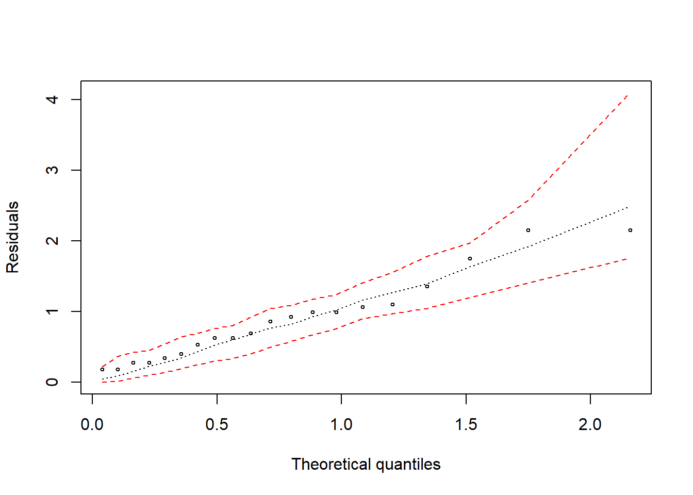

<br><br>

## Homogeneidade de variâncias

\begin{eqnarray*}
\left\{
\begin{array}{ll}
H_0: & \mbox{ As variâncias são homogêneas} \\[.2cm]
H_1: & \mbox{ As variâncias não são homogêneas}.
\end{array}
\right.
\end{eqnarray*}


```r
(homog=bartlett.test(modelo$res~tratamentos))
```

```
## 
## 	Bartlett test of homogeneity of variances
## 
## data:  modelo$res by tratamentos
## Bartlett's K-squared = 1.9189, df = 4, p-value = 0.7507
```

Como p-valor calculado ($p=0.7506686$) é maior que o nível de significância adotado ($\alpha=0,05$), não se rejeita $H_0$. Logo, as variâncias são homogêneas.

<br><br>

## Independências dos erros

\begin{eqnarray*}
\left\{
\begin{array}{ll}
H_0: & \mbox{ Os erros são independentes;} \\[.2cm]
H_1: & \mbox{ Os erros não são independentes.}
\end{array}
\right.
\end{eqnarray*}


```r
library(lmtest)
ind=dwtest(modelo)
```

Como p-valor calculado ($p=0.1738058$) é maior que o nível de significância adotado ($\alpha=0,05$), não se rejeita $H_0$. Logo, os erros são independentes. A Figura \ref{Fig3} apresenta o gráfico dos resíduos brutos. Percebe-se que os resíduos estão distribuídos de forma totalmente aleatório, evidenciando a independência dos erros.


```r
plot(modelo$res, col="blue",
     las=1, pch=16,
     ylab="Residuos brutos")
abline(h=0, col="red", lwd=2)
```

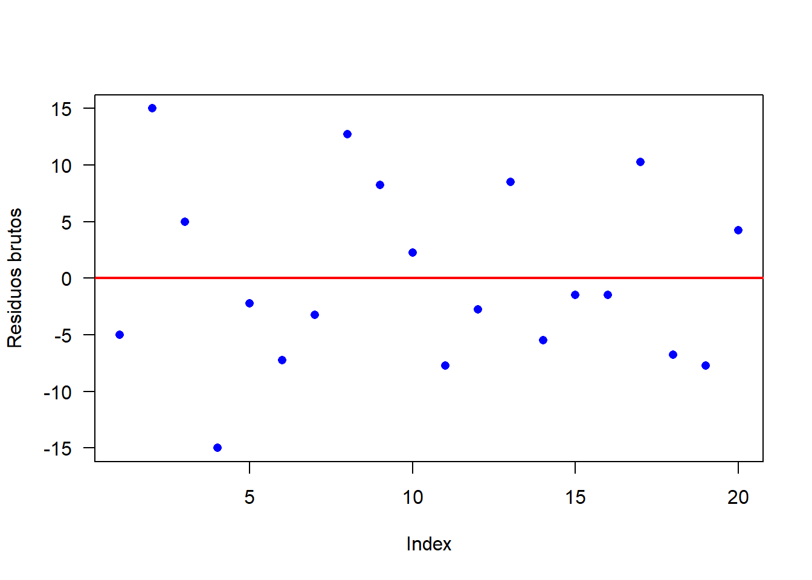

<br><br>

## Teste de Comparação Múltipla


```r
(dados=data.frame(tratamentos,resposta))
mod1=easyanova::ea1(dados, design = 1)
```

```r
tabela=cbind(mod1$Means[1],
      mod1$Means[2], 
      mod1$Means[4])
names(tabela)[1:3]=c("Tratamento","Média","")
tabela
```


```r
kable(tabela, align = "l")
```


Tratamento   Média       
-----------  -------  ---
T 5          255.75   a  
T 4          211.50   b  
T 2          152.25   c  
T 3          141.75   c  
T 1          105.00   d  


```r
tukey=c("d","c","c","b","a")
box=car::Boxplot(resposta~tratamentos,
             las=1,ylim=c(50,300),
             col="lightblue", xlab="",
             ylab=expression("Produtividade"*" "* (Kg*" "*ha^-1)))
points(Media,col="red", pch=8)
text(c(1:5),
     Media+Desvio+10,
     paste(Media,tukey))
```

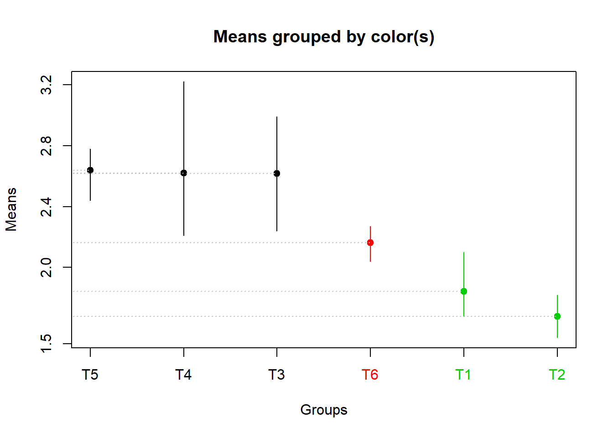

## Usando o ExpDes.pt


```r
library(ExpDes.pt)
dic(tratamentos, resposta)
```

```
## ------------------------------------------------------------------------
## Quadro da analise de variancia
## ------------------------------------------------------------------------
##            GL    SQ      QM     Fc      Pr>Fc
## Tratamento  4 57442 14360.6 178.43 1.8747e-12
## Residuo    15  1207    80.5                  
## Total      19 58650                          
## ------------------------------------------------------------------------
## CV = 5.18 %
## 
## ------------------------------------------------------------------------
## Teste de normalidade dos residuos 
## Valor-p:  0.5023389 
## De acordo com o teste de Shapiro-Wilk a 5% de significancia, os residuos podem ser considerados normais.
## ------------------------------------------------------------------------
## 
## ------------------------------------------------------------------------
## Teste de homogeneidade de variancia 
## valor-p:  0.7506686 
## De acordo com o teste de bartlett a 5% de significancia, as variancias podem ser consideradas homogeneas.
## ------------------------------------------------------------------------
## 
## Teste de Tukey
## ------------------------------------------------------------------------
## Grupos Tratamentos Medias
## a 	 T 5 	 255.75 
##  b 	 T 4 	 211.5 
##   c 	 T 2 	 152.25 
##   c 	 T 3 	 141.75 
##    d 	 T 1 	 105 
## ------------------------------------------------------------------------
```

<br><br>

## Exemplo 2

**Dados reais de um experimento conduzido na Universidade Estadual de Londrina**


Um experimento foi conduzido com o objetivo de estudar diferentes produtos para redução da perda de massa em pós-colheita de frutos de romã. O experimento foi conduzido em delineamento inteiramente casualizado com quatro repetições.

**Os Tratamentos são**:

- T1: Cera Externo
- T2: Cera Externo + Interno
- T3: Óleo de Laranja Externo
- T4: Óleo de Laranja Interno + Externo
- T5: Hipoclorito de sódio Externo
- T6: Hipoclorito de sódio Interno + Externo

<br>

Os resultados de perda de massa, em porcentagem, foram:

Tratamentos | R1      |R2       |R3       |R4
------------|---------|---------|---------|---------
1           |2.10     |1.90     |1.68     |1.69
2           |1.62     |1.82     |1.73     |1.54
3           |2.62     |2.24     |2.99     |2.62
4           |2.52     |2.21     |2.53     |3.22
5           |2.67     |2.44     |2.78     |2.66
6           |2.17     |2.27     |2.17     |2.04

<br><br>

## Conjunto de dados

<br>


```r
resp=c(2.10,1.90,1.68,1.69,1.62,1.82,1.73,1.54,2.62,2.24,2.99,2.62,
       2.52,2.21,2.53,3.22,2.67,2.44,2.78,2.66,2.17,2.27,2.17,2.04)
trat=as.factor(rep(paste("T",1:6, sep=""),e=4))
```

<br>

## Gráfico de caixas


```r
car::Boxplot(resp~trat)
```

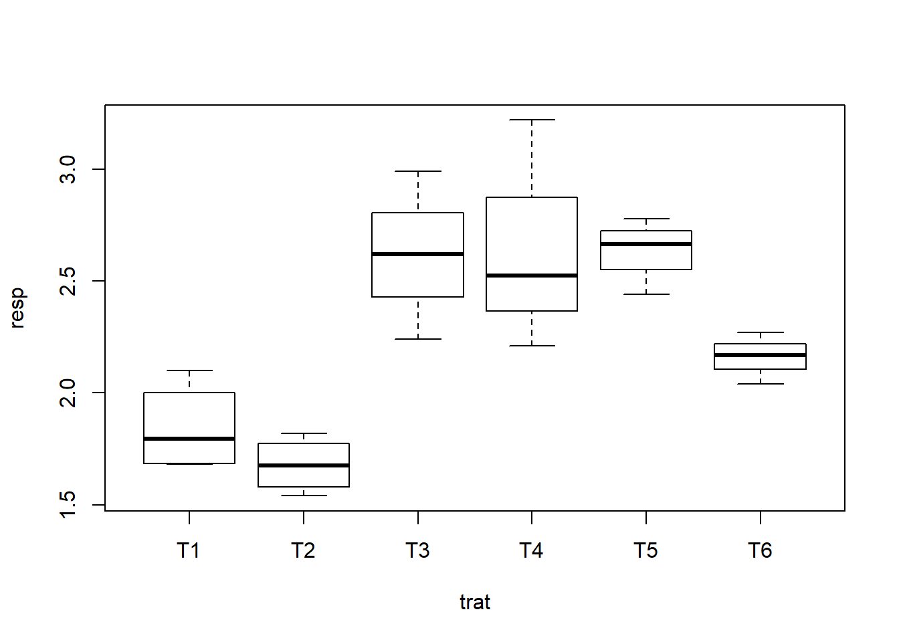

<br><br>

## Histograma


```r
hist(resp)
```


<br><br>

****

## Análise de variância

****

<br>


```r
modelo=aov(resp~trat)
anova(modelo) # Conferir GL
```

```
## Analysis of Variance Table
## 
## Response: resp
##           Df Sum Sq Mean Sq F value    Pr(>F)    
## trat       5 3.6921 0.73842  12.312 2.724e-05 ***
## Residuals 18 1.0796 0.05998                      
## ---
## Signif. codes:  0 '***' 0.001 '**' 0.01 '*' 0.05 '.' 0.1 ' ' 1
```

<br><br>

****

## Pressuposições

****

<br>

## Normalidade dos erros


```r
shapiro.test(modelo$residuals)
```

```
## 
## 	Shapiro-Wilk normality test
## 
## data:  modelo$residuals
## W = 0.94483, p-value = 0.2088
```

Os erros seguem distribuição normal

<br>

## Homogeneidade das variâncias


```r
bartlett.test(modelo$residuals~trat)
```

```
## 
## 	Bartlett test of homogeneity of variances
## 
## data:  modelo$residuals by trat
## Bartlett's K-squared = 8.5683, df = 5, p-value = 0.1276
```

As variâncias são homogêneas

<br>

## Independência dos erros


```r
lmtest::dwtest(modelo)
```

```
## 
## 	Durbin-Watson test
## 
## data:  modelo
## DW = 2.1048, p-value = 0.1924
## alternative hypothesis: true autocorrelation is greater than 0
```

Os erros são independentes.

<br>

## Gráfico de resíduos


```r
a=anova(modelo)
plot(modelo$residuals/sqrt(a$`Mean Sq`[2]), ylab="Resíduos Padronizados")
abline(h=0)
```


<br><br>

****

## Teste de comparação múltipla

****

<br>

### Teste de Comparação Múltipla de Tukey (Utilizando o multcomp)


```r
library(multcomp)
mcomp=glht(modelo, mcp(trat="Tukey"))
plot(mcomp)
```


```r
cld(mcomp)
```

```
##   T1   T2   T3   T4   T5   T6 
##  "a"  "a"  "b"  "b"  "b" "ab"
```

<br>

### Teste de Comparação Múltipla de Tukey (Utilizando o TukeyHSD do R)


```r
(tukey=TukeyHSD(modelo))
```

```
##   Tukey multiple comparisons of means
##     95% family-wise confidence level
## 
## Fit: aov(formula = resp ~ trat)
## 
## $trat
##          diff         lwr        upr     p adj
## T2-T1 -0.1650 -0.71534348 0.38534348 0.9268309
## T3-T1  0.7750  0.22465652 1.32534348 0.0033733
## T4-T1  0.7775  0.22715652 1.32784348 0.0032716
## T5-T1  0.7950  0.24465652 1.34534348 0.0026408
## T6-T1  0.3200 -0.23034348 0.87034348 0.4623788
## T3-T2  0.9400  0.38965652 1.49034348 0.0004555
## T4-T2  0.9425  0.39215652 1.49284348 0.0004421
## T5-T2  0.9600  0.40965652 1.51034348 0.0003589
## T6-T2  0.4850 -0.06534348 1.03534348 0.1030235
## T4-T3  0.0025 -0.54784348 0.55284348 1.0000000
## T5-T3  0.0200 -0.53034348 0.57034348 0.9999965
## T6-T3 -0.4550 -1.00534348 0.09534348 0.1409264
## T5-T4  0.0175 -0.53284348 0.56784348 0.9999982
## T6-T4 -0.4575 -1.00784348 0.09284348 0.1373682
## T6-T5 -0.4750 -1.02534348 0.07534348 0.1145358
```

```r
plot(tukey)
```


<br>

### Teste de Comparação Múltipla de Tukey (Utilizando o HSD.test do Agricolae)


```r
library(agricolae)
tukey=HSD.test(modelo,"trat")
plot(tukey)
```


<br>

### Teste de Comparação Múltipla de Tukey (Utilizando o ea1() do pacote easyanova)


```r
library(easyanova)
tukey=ea1(data.frame(trat,resp))
```

```r
cbind(tukey$Means[1],tukey$Means[2],tukey$Means[4])
```

```
##   treatment   mean tukey
## 1        T5 2.6375     a
## 2        T4 2.6200     a
## 3        T3 2.6175     a
## 4        T6 2.1625    ab
## 5        T1 1.8425     b
## 6        T2 1.6775     b
```

<br>

### Teste de Comparação Múltipla de Tukey (Utilizando o dic do pacote ExpDes.pt)


```r
library(ExpDes.pt)
dic(trat,resp)
```

```
## ------------------------------------------------------------------------
## Quadro da analise de variancia
## ------------------------------------------------------------------------
##            GL     SQ      QM     Fc      Pr>Fc
## Tratamento  5 3.6921 0.73842 12.312 2.7235e-05
## Residuo    18 1.0796 0.05998                  
## Total      23 4.7717                          
## ------------------------------------------------------------------------
## CV = 10.84 %
## 
## ------------------------------------------------------------------------
## Teste de normalidade dos residuos 
## Valor-p:  0.2087967 
## De acordo com o teste de Shapiro-Wilk a 5% de significancia, os residuos podem ser considerados normais.
## ------------------------------------------------------------------------
## 
## ------------------------------------------------------------------------
## Teste de homogeneidade de variancia 
## valor-p:  0.1275737 
## De acordo com o teste de bartlett a 5% de significancia, as variancias podem ser consideradas homogeneas.
## ------------------------------------------------------------------------
## 
## Teste de Tukey
## ------------------------------------------------------------------------
## Grupos Tratamentos Medias
## a 	 T5 	 2.6375 
## a 	 T4 	 2.62 
## a 	 T3 	 2.6175 
## ab 	 T6 	 2.1625 
##  b 	 T1 	 1.8425 
##  b 	 T2 	 1.6775 
## ------------------------------------------------------------------------
```

<br>

### Teste de Comparação Múltipla de Tukey (Utilizando o LTukey do pacote laercio)


```r
library(laercio)
LTukey(modelo)
```

```
## 
##  TUKEY TEST TO COMPARE MEANS 
##  
##  Confidence level:  0.95 
##  Dependent variable:  resp
##  Variation Coefficient:  10.83832 % 
##  
## Independent variable:  trat 
##   Factors Means    
##   T5      2.6375 a 
##   T4      2.62   a 
##   T3      2.6175 a 
##   T6      2.1625 ab
##   T1      1.8425  b
##   T2      1.6775  b
## 
## 
```

<br><br>

### Teste de comparação de Duncan (Utilizando o LDuncan do pacote laercio)
 

```r
library(laercio)
LDuncan(modelo,which = "trat")
```

```
## 
##  DUNCAN TEST TO COMPARE MEANS 
##  
##  Confidence Level:  0.95 
##  Dependent Variable:  resp
##  Variation Coefficient:  10.83832 % 
##  
## 
##  Independent Variable:  trat 
##   Factors Means     
##   T5      2.6375 a  
##   T4      2.62   a  
##   T3      2.6175 a  
##   T6      2.1625  b 
##   T1      1.8425  bc
##   T2      1.6775   c
```

<br>

### Teste de comparação de Duncan (Utilizando o dic do pacote ExpDes.pt)
 

```r
library(ExpDes.pt)
dic(trat,resp,mcomp = "duncan")
```

```
## ------------------------------------------------------------------------
## Quadro da analise de variancia
## ------------------------------------------------------------------------
##            GL     SQ      QM     Fc      Pr>Fc
## Tratamento  5 3.6921 0.73842 12.312 2.7235e-05
## Residuo    18 1.0796 0.05998                  
## Total      23 4.7717                          
## ------------------------------------------------------------------------
## CV = 10.84 %
## 
## ------------------------------------------------------------------------
## Teste de normalidade dos residuos 
## Valor-p:  0.2087967 
## De acordo com o teste de Shapiro-Wilk a 5% de significancia, os residuos podem ser considerados normais.
## ------------------------------------------------------------------------
## 
## ------------------------------------------------------------------------
## Teste de homogeneidade de variancia 
## valor-p:  0.1275737 
## De acordo com o teste de bartlett a 5% de significancia, as variancias podem ser consideradas homogeneas.
## ------------------------------------------------------------------------
## 
## Teste de Duncan 
## ------------------------------------------------------------------------
## Grupos  Tratamentos  Medias
## a 	 T5 	     2.6375 
## a 	 T4 	     2.62 
## a 	 T3 	     2.6175 
##  b 	 T6 	     2.1625 
##  bc 	 T1 	     1.8425 
##   c 	 T2 	     1.6775 
## ------------------------------------------------------------------------
```

<br>

### Teste de Agrupamento de Duncan (Utilizando o ea1() do pacote easyanova)


```r
library(easyanova)
tukey=ea1(data.frame(trat,resp))
```

```r
cbind(tukey$Means[1],tukey$Means[2],tukey$Means[6])
```

```
##   treatment   mean duncan
## 1        T5 2.6375      a
## 2        T4 2.6200      a
## 3        T3 2.6175      a
## 4        T6 2.1625      b
## 5        T1 1.8425     bc
## 6        T2 1.6775      c
```

<br>

### Teste de Agrupamento de Scott-Knott (Utilizando o SK do pacote ScottKnott)


```r
library(ScottKnott)
sk <- SK(x=resp, y=resp, model="y~trat", which="trat", sig.level=0.05)
summary(sk)
```

```
##  Levels  Means SK(5%)
##      T5 2.6375      a
##      T4 2.6200      a
##      T3 2.6175      a
##      T6 2.1625      b
##      T1 1.8425      c
##      T2 1.6775      c
```

```r
plot(sk)
box()
```


<br>

### Teste de Agrupamento de Scott-Knott (Utilizando o ea1() do pacote easyanova)


```r
library(easyanova)
tukey=ea1(data.frame(trat,resp))
```

```r
cbind(tukey$Means[1],tukey$Means[2],tukey$Means[8])
```

```
##   treatment   mean scott_knott
## 1        T5 2.6375           a
## 2        T4 2.6200           a
## 3        T3 2.6175           a
## 4        T6 2.1625           b
## 5        T1 1.8425           c
## 6        T2 1.6775           c
```

<br>

### Teste de Agrupamento de Scott-Knott (Utilizando o LScottKnott do pacote laercio)


```r
library(laercio)
LScottKnott(modelo,'trat')
```

Obs. O Comando do pacote laercio (Versão 1.0-1) não funciona no Rmarkdown e gera um erro (Problema no scan(), possivelmente o comando do pacote utiliza o scan() para efetuar sua análise e o mesmo não funciona no Rmarkdown a menos que o texto esteja entre aspas).

O Erro gerado é: 

``Error in scan(file = file, what = what, sep = sep, quote = quote, dec = dec,:line 4 did not have 2 elements``


<br><br><br><br>

# Transformação de dados

****

<br><br><br><br>

- O modelo de Análise de Variância pressupõe que exista homocedasticidade, ou seja, que os tratamentos apresentem a mesma variabilidade;
- Algumas vezes este pressuposto pode não ser atendido e assim, para corrigir este problema existe uma saída por vezes bastante simples que é a transformação de dados;
- Esta técnica consiste na utilização de um artifício matemático para tornar o modelo de ANOVA válido.

****

## Heterogeneidade Irregular

****

- Ocorre quando alguns tratamentos apresentam maior variabilidade do que outros, contudo, não existe uma associação entre média e variância;

- Neste caso, não há uma transformação matemática que elimine esta variabilidade.

Solução:

* Modelos Lineares Generalizados;

* Análise não paramétrica.

<br>

****

## Heterogeneidade Regular

****

- Acontece quando existe alguma associação entre as médias dos tratamentos e a variância;
- A heterocedasticidade regular está associada é falta de normalidade do erros;

Solução:

* Transformação dos dados;

* Modelos Lineares Generalizados;

* Análise não paramétrica.

<br>

****

## Princípio de transformação

****

<br>

Seja $E(Y) = \mu$ a média de Y e suponha que o desvio padrão de Y é proporcional a potência da média de Y tal que:

<center>

$\sigma Y \alpha \mu^\alpha.$

</center>

O objetivo é encontrar uma transformação de $Y$ que gere uma variância constante.

Suponha que a transformação é uma potência dos dados originais, isto é:

<center>

$Y^*=Y^\lambda$

</center>

Assim, pode ser mostrado que:

<center>

$\sigma Y^* \alpha \mu^{\lambda+ \alpha-1}.$

</center>

Caso $\lambda = 1-\alpha$, então a variância dos dados transformados $Y^*$ é constante, mostrando que **não é necessário transformação**.

Algumas das transformações mais comuns são:

<br>

<center>

| $\lambda$ | Transformação       |
|:-----------:|:---------------------:|
| 1         | Nenhuma             |
| 0,5       | $\sqrt{y}$          |
| 0         | log(y)              |
| -0,5      | $\frac{1}{\sqrt{y}}$ |
| -1        | $\frac{1}{y}$         |

</center>

****

## Seleção Empírica de $\alpha$

****

<br>

Em muitas situações de delineamentos experimentais em que há repetições, pode-se estimar empiricamente $\alpha$ a partir dos dados.

Dado que na i-ésima combinação de tratamentos

<center>

$\sigma Y \alpha \mu^{\alpha}_i =\theta \mu^{\alpha}_i$

</center>

em que $\theta$ é uma constante de proporcionalidade, pode-se aplicar logaritmos para obter:

<center>

$log (\sigma_{Y_i}) = log( \theta) + \alpha log( \mu_{i})$

</center>

Portanto, um gráfico de $log(\sigma_{Y_i})$ versus $log(\mu_i)$ seria uma linha reta com uma inclinação $\alpha$.

Como não se conhece $\sigma_{Y_i}$ e $\mu_i$ , utilizam-se as estimativas $s_i$ e a média $\hat{Y}_i$, respectivamente;

O parâmetro de inclinação da equação linear ajustada é uma estimativa de $\alpha$.

<br>

****

## Transf. de Box & Cox

****

<br>

Box & Cox (1964) mostraram como o parâmetro de transformação $\lambda$ em $Y^* = Y^\lambda$ pode ser estimado simultaneamente com outros parâmetros do modelo (média geral e efeitos de tratamentos) usando o método de máxima verossimilhança. O procedimento consiste em realizar, para vários valores de $\lambda$, uma análise de variância padrão sobre:

$$Y_i(\lambda) = \left\{ \begin{array}{ll} \ln(X_i),~~~~~~\textrm{se $\lambda = 0$,} \\ \\ \dfrac{X_i^{\lambda} - 1}{\lambda},~~~~\textrm{se $\lambda \neq 0$,}\end{array} \right.$$

A estimativa de máxima verossimilhança de $\lambda$ é o valor para o qual a soma de quadrado do resíduo, SQRes($\lambda$), é mínima.

Este valor de $\lambda$ é encontrado através do gráfico de SQRes($\lambda$) *versus* $\lambda$, sendo que $\lambda$ é o valor que minimiza a SQRes($\lambda$).

Ou, ainda, o valor de $\lambda$ que maximiza a função de logverossimilhança.

<br>

Um intervalo de confiança $100(1-\alpha)$% para $\lambda$ pode ser encontrado calculando-se:

<center>

$IC(\lambda) = SQRes(\lambda)(1 \pm \frac{t2^2/2=2;v }{v})$

</center>

em que $v$ é o número de graus de liberdade.

Se o intervalo de confiança incluir o valor $\lambda = 1$, isto quer dizer que não é necessário transformar os dados.

****

## Exemplo 1

****


Vamos considerar os dados adaptados de ZAMBÃO; SAMPAIO; BARBIN, 1982 (Livro Planejamento e Análise Estatística de Experimentos Agronômicos - Décio Barbin) como exemplo, em que o pesquisador pretende comparar quatro cultivares de pêssego quanto ao enraizamento de estacas. Foi utilizado cinco repetições por tratamento e o delineamento experimental foi inteiramente casualizado. 

**Fonte da foto**: Rosa, G.G., 2014 (Pelotas)

<br><br>

Tratamentos | R1      |R2       |R3       |R4       |R5       |TOTAL
------------|---------|---------|---------|---------|---------|---------
A           |02       |02       |01       |01       |00       |06
B           |01       |00       |00       |01       |01       |03
C           |12       |10       |14       |17       |11       |64
D           |07       |09       |15       |08       |10       |49

<br><br> 

## Conjunto de dados


```r
resposta=c(02,02,01,01,00,01,00,00,01,01,12,10,14,17,11,07,09,15,08,10)
cultivar=rep(LETTERS[1:4],e=5)
cultivar=as.factor(cultivar)
```

<br>

## Gráficos exploratórios

<br>

### Gráfico de caixas


```r
car::Boxplot(resposta~cultivar)
```


```
## [1] "18"
```

<br>

### Histograma


```r
hist(resposta)
```

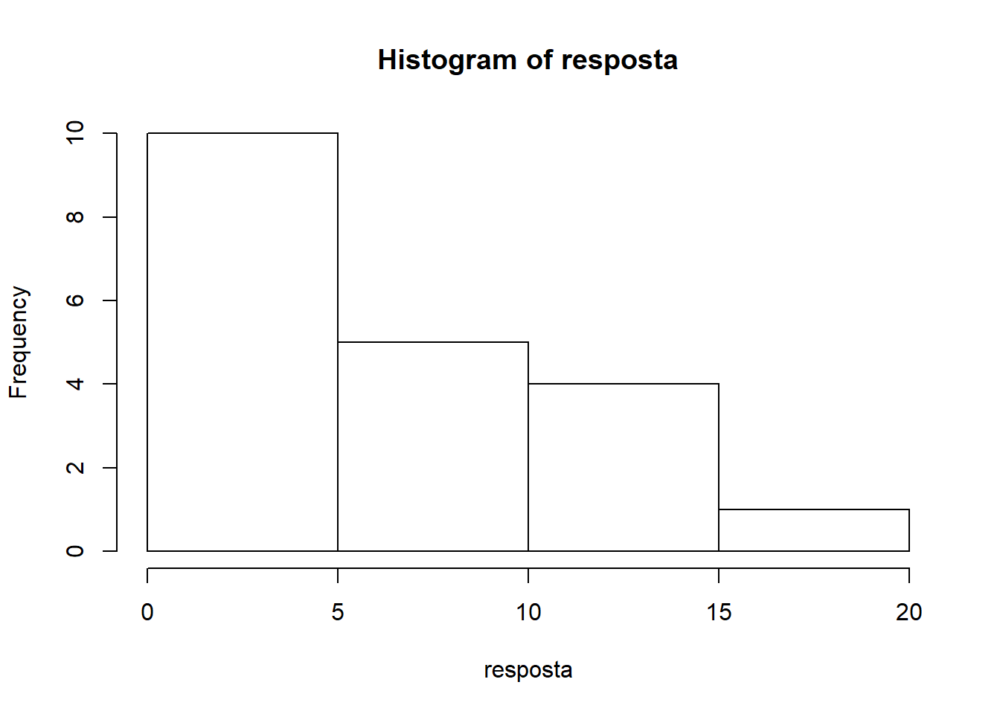

<br>

## Análise de variância


```r
modelo=aov(resposta~cultivar)
anova(modelo) # Conferir GL
```

```
## Analysis of Variance Table
## 
## Response: resposta
##           Df Sum Sq Mean Sq F value    Pr(>F)    
## cultivar   3  564.2  188.07  40.884 9.945e-08 ***
## Residuals 16   73.6    4.60                      
## ---
## Signif. codes:  0 '***' 0.001 '**' 0.01 '*' 0.05 '.' 0.1 ' ' 1
```

<br>

## Pressuposições 

### Normalidade dos erros


```r
shapiro.test(modelo$residuals)
```

```
## 
## 	Shapiro-Wilk normality test
## 
## data:  modelo$residuals
## W = 0.88533, p-value = 0.02209
```

Os erros não seguem distribuição normal

### Homogeneidade das variâncias


```r
bartlett.test(modelo$residuals~cultivar)
```

```
## 
## 	Bartlett test of homogeneity of variances
## 
## data:  modelo$residuals by cultivar
## Bartlett's K-squared = 12.141, df = 3, p-value = 0.006914
```

As variâncias não são homogêneas

<br>

### Independência dos erros


```r
lmtest::dwtest(modelo)
```

```
## 
## 	Durbin-Watson test
## 
## data:  modelo
## DW = 2.269, p-value = 0.4631
## alternative hypothesis: true autocorrelation is greater than 0
```

Os erros são independentes.

<br>

### Gráfico de resíduos padronizados


```r
a=anova(modelo)
plot(modelo$residuals/sqrt(a$`Mean Sq`[2]), ylab="Resíduos Padronizados")
abline(h=0)
```


As pressuposições de normalidade dos erros e homogeneidade das variâncias não foram atendidas. Dessa forma, vamos transformar os dados e conferir novamente as pressuposições!

## Transformação de dados

<br>

### Usando a *package* MASS

<br>

### Usando o comando boxcox e conferindo visualmente um valor aproximado de $\lambda$


```r
# MASS::boxcox(modelo) ## o comando boxcox do pacote MASS não aceita quando ocorre observações 0
# vamos somar uma constante com valor "baixo"
MASS::boxcox(aov(resposta+0.000001~cultivar))
```


<br>

### Descobrindo o valor exato de $\lambda$


```r
bc=MASS::boxcox(aov(resposta+0.000001~cultivar))
```


```r
bc$x[which.max(bc$y)]
```

```
## [1] 0.4242424
```

A aproximação de $\lambda$ é 0,5 (sqrt(Y))

<br>

## Dados transformados

<br>

### Modelo transformado


```r
modelo=aov(resposta^0.5~cultivar)
#ou
modelo=aov(sqrt(resposta)~cultivar)
```

<br>

### Normalidade dos erros


```r
shapiro.test(modelo$residuals)
```

```
## 
## 	Shapiro-Wilk normality test
## 
## data:  modelo$residuals
## W = 0.96828, p-value = 0.7182
```

Os erros seguem distribuição normal

<br>

### Homogeneidade das variâncias


```r
bartlett.test(modelo$residuals~cultivar)
```

```
## 
## 	Bartlett test of homogeneity of variances
## 
## data:  modelo$residuals by cultivar
## Bartlett's K-squared = 0.71659, df = 3, p-value = 0.8693
```

As variâncias são homogêneas

<br>

### Independência dos erros


```r
lmtest::dwtest(modelo)
```

```
## 
## 	Durbin-Watson test
## 
## data:  modelo
## DW = 2.1575, p-value = 0.3596
## alternative hypothesis: true autocorrelation is greater than 0
```

Os erros são independentes.

<br>

### Gráfico de resíduos padronizados


```r
a=anova(modelo)
plot(modelo$residuals/sqrt(a$`Mean Sq`[2]), ylab="Resíduos Padronizados")
abline(h=0)
```


<br>

## Comparação múltipla

<br>

### Teste de Comparação Múltipla de Tukey (Utilizando o multcomp)


```r
library(multcomp)
mcomp=glht(modelo, mcp(cultivar="Tukey"))
plot(mcomp)
```


```r
cld(mcomp)
```

```
##   A   B   C   D 
## "a" "a" "b" "b"
```

<br>

### Teste de Comparação Múltipla de Tukey (Utilizando o TukeyHSD do R)


```r
(tukey=TukeyHSD(modelo))
```

```
##   Tukey multiple comparisons of means
##     95% family-wise confidence level
## 
## Fit: aov(formula = sqrt(resposta) ~ cultivar)
## 
## $cultivar
##           diff       lwr       upr     p adj
## B-A -0.3656854 -1.271030 0.5396592 0.6619314
## C-A  2.5958680  1.690523 3.5012126 0.0000022
## D-A  2.1362025  1.230858 3.0415471 0.0000252
## C-B  2.9615534  2.056209 3.8668981 0.0000004
## D-B  2.5018879  1.596543 3.4072325 0.0000035
## D-C -0.4596655 -1.365010 0.4456791 0.4869422
```

```r
plot(tukey)
```

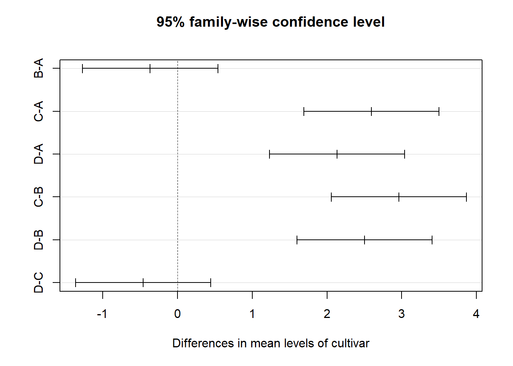

<br>

### Teste de Comparação Múltipla de Tukey (Utilizando o HSD.test do Agricolae)


```r
library(agricolae)
tukey=HSD.test(modelo,"cultivar")
plot(tukey)
```

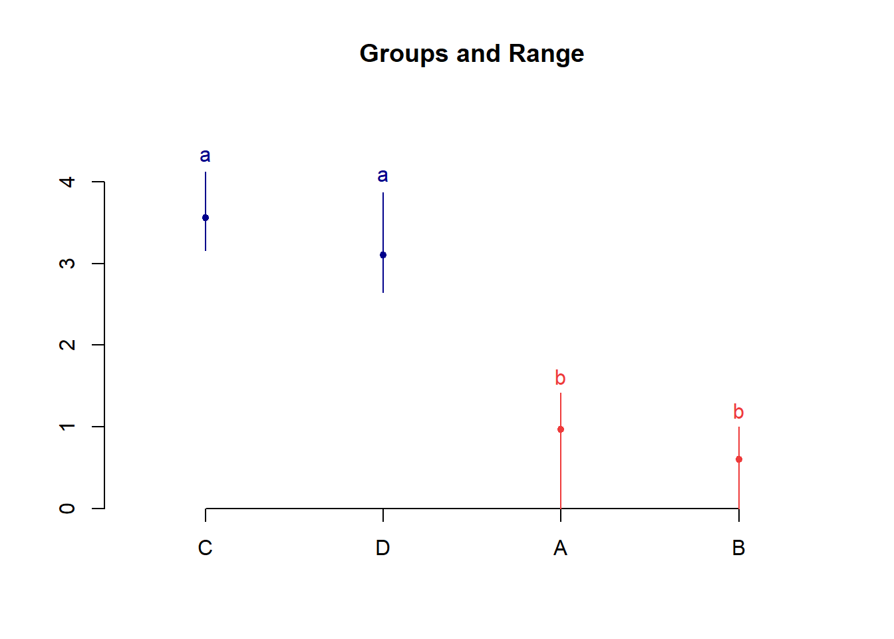

<br>

### Teste de Comparação Múltipla de Tukey (Utilizando o ea1() do pacote easyanova)


```r
library(easyanova)
tukey=ea1(data.frame(cultivar,resposta^0.5))
```

```r
cbind(tukey$Means[1],tukey$Means[2],tukey$Means[4])
```

```
##   treatment   mean tukey
## 1         C 3.5616     a
## 2         D 3.1019     a
## 3         A 0.9657     b
## 4         B 0.6000     b
```

<br>

### Teste de Comparação Múltipla de Tukey (Utilizando o dic do pacote ExpDes.pt)


```r
library(ExpDes.pt)
dic(cultivar,resposta^0.5)
```

```
## ------------------------------------------------------------------------
## Quadro da analise de variancia
## ------------------------------------------------------------------------
##            GL     SQ      QM     Fc      Pr>Fc
## Tratamento  3 33.346 11.1155 44.402 5.5521e-08
## Residuo    16  4.005  0.2503                  
## Total      19 37.352                          
## ------------------------------------------------------------------------
## CV = 24.32 %
## 
## ------------------------------------------------------------------------
## Teste de normalidade dos residuos 
## Valor-p:  0.7181511 
## De acordo com o teste de Shapiro-Wilk a 5% de significancia, os residuos podem ser considerados normais.
## ------------------------------------------------------------------------
## 
## ------------------------------------------------------------------------
## Teste de homogeneidade de variancia 
## valor-p:  0.8692942 
## De acordo com o teste de bartlett a 5% de significancia, as variancias podem ser consideradas homogeneas.
## ------------------------------------------------------------------------
## 
## Teste de Tukey
## ------------------------------------------------------------------------
## Grupos Tratamentos Medias
## a 	 C 	 3.561553 
## a 	 D 	 3.101888 
##  b 	 A 	 0.9656854 
##  b 	 B 	 0.6 
## ------------------------------------------------------------------------
```

<br><br>

****

## Exemplo 2

****

### Conjunto de dados

<br>

Um experimento foi conduzido com o intuito de avaliar a inoculação de *Trichoderma* sp. (T4), *Azospirillum* sp. (T3) e associação de ambos (T2) em relação a testemunha, quanto à altura de plantas de milho. O experimento foi conduzido em delineamento inteiramente casualizado com 8 repetições.

<br>


```r
RESP=c(124,136,124,102,112,108,102,122,
       130,128,118,106,126,106,128,122,
       132,132,190,144,090,126,142,148,
       140,120,118,098,110,140,104,142)
TRAT=rep(c(paste("T",1:4)),e=8)
dados = data.frame(TRAT, RESP)
```

<br><br>

## Estatística descritiva


```r
Média = with(dados, mean(RESP))
Variância = with(dados, var(RESP))
Desvio = with(dados, sd(RESP))
CV = Desvio / Média * 100

desc = cbind(Média, Variância, Desvio, CV)
kable(round(desc,2), align="l")
```


Média    Variância   Desvio   CV    
-------  ----------  -------  ------
124.06   367.09      19.16    15.44 

<br>

### Por Cultivar


```r
Médias = with(dados, tapply(RESP, TRAT, mean))
Variâncias = with(dados, tapply(RESP, TRAT, var))
Desvios = with(dados, tapply(RESP, TRAT, sd))
CV = Desvios / Médias * 100
Desc = cbind(Médias, Variâncias, Desvios, CV)
kable(round(Desc,2),align="l")
```

      Médias   Variâncias   Desvios   CV    
----  -------  -----------  --------  ------
T 1   116.25   147.93       12.16     10.46 
T 2   120.50   94.57        9.72      8.07  
T 3   138.00   768.00       27.71     20.08 
T 4   121.50   301.43       17.36     14.29 

<br><br>

## Gráficos exploratórios

<br>

### Gráfico de Caixas


```r
par(bty='l', mai=c(1, 1, .2, .2))
par(cex=0.7)
caixas=with(dados, car::Boxplot(RESP ~ dados$TRAT, vertical=T,las=1, col='Lightyellow'))
mediab=tapply(RESP, TRAT, mean)
points(mediab, pch='+', cex=1.5, col='red')
```

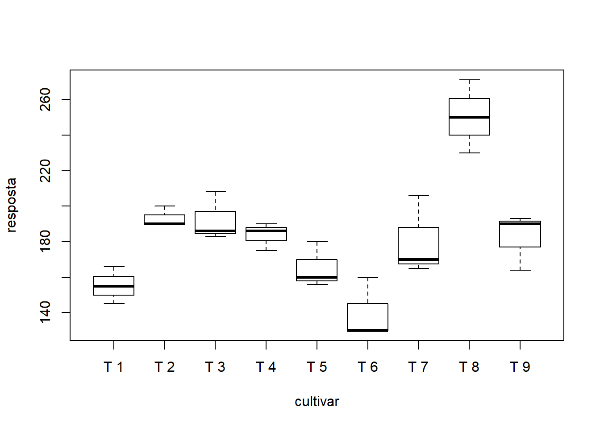

<br><br>

## Análise de Variância

\begin{eqnarray*}
\left\{
\begin{array}{ll}
H_0: & \mu_1 = \mu_2 = \mu_3 = \cdots = \mu_{15} \\[.2cm]
H_1: & \mu_i \neq \mu_i' \qquad i \neq i'.
\end{array}
\right.
\end{eqnarray*}


```r
mod = with(dados, aov(RESP ~ TRAT))
av=anova(mod)
kable(av, align = "l")
```

            Df   Sum Sq     Mean Sq    F value   Pr(>F)    
----------  ---  ---------  ---------  --------  ----------
TRAT        3    2196.375   732.1250   2.23221   0.1064722 
Residuals   28   9183.500   327.9821                       

<br><br>

## Pressuposições

<br>

### Normalidade dos erros

\begin{eqnarray*}
\left\{
\begin{array}{ll}
H_0: & \mbox{Os erros seguem distribuição normal}\\[.2cm]
H_1: & \mbox{Os erros não seguem distribuição normal}.
\end{array}
\right.
\end{eqnarray*}


```r
(norm=shapiro.test(mod$res))
```

```
## 
## 	Shapiro-Wilk normality test
## 
## data:  mod$res
## W = 0.94078, p-value = 0.07878
```

Como p-valor calculado ($p=0,07878$) é maior que o nível de significância adotado ($p=0,05$), não se rejeita $H_0$. Logo, os erros seguem distribuição normal.


```r
hnp::hnp(mod, las=1, xlab="Quantis teóricos", pch=16)
```

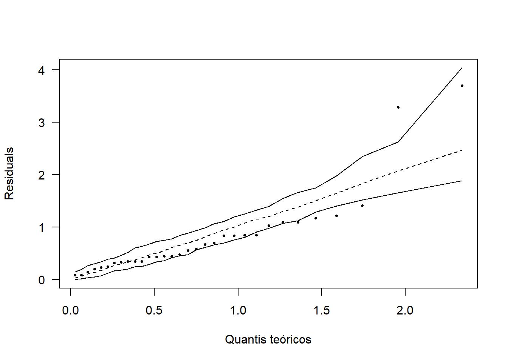

<br>

### Homogeneidade de variâncias

\begin{eqnarray*}
\left\{
\begin{array}{ll}
H_0: & \mbox{ As variâncias são homogêneas}\\[.2cm]
H_1: & \mbox{ As variâncias não são homogêneas}.
\end{array}
\right.
\end{eqnarray*}


```r
(homog=with(dados, bartlett.test(mod$res ~ TRAT)))
```

```
## 
## 	Bartlett test of homogeneity of variances
## 
## data:  mod$res by TRAT
## Bartlett's K-squared = 8.4132, df = 3, p-value = 0.0382
```

Como p-valor ($p=0,0382$) é menor que o nível de significância adotado ($p=0,05$). Rejeita-se $H_0$, logo, as variâncias dos erros não são homogêneas.

<br>

## Transformação de dados


```r
library(MASS)
bc=boxcox(mod)
```


```r
bc$x[which.max(bc$y)]
```

```
## [1] -0.2222222
```

O valor de $\lambda$ para a Transformação Box-Cox é -0,22222. Nesse sentido, vamos usar a aproximação. Logo, iremos usar a Transformação Log

<br>

### Transformação log

### Modelo com dados transformados

Devemos testar novamente as pressuposições após a Transformação!!!


```r
modelo=aov(log(RESP)~TRAT)
anova(modelo)
```

```
## Analysis of Variance Table
## 
## Response: log(RESP)
##           Df  Sum Sq  Mean Sq F value Pr(>F)
## TRAT       3 0.11275 0.037583  1.8407 0.1627
## Residuals 28 0.57170 0.020418
```

Como p-valor da análise de variância ($p=0,1627$) é maior que o nível de significância adotado, não se rejeita $H_0$. Logo, não há evidências de diferença entre os tratamentos.

<br>

### Normalidade dos erros


```r
shapiro.test(modelo$residuals)
```

```
## 
## 	Shapiro-Wilk normality test
## 
## data:  modelo$residuals
## W = 0.95442, p-value = 0.1922
```

<br>

### Homogeneidade das variâncias


```r
bartlett.test(modelo$residuals~TRAT)
```

```
## 
## 	Bartlett test of homogeneity of variances
## 
## data:  modelo$residuals by TRAT
## Bartlett's K-squared = 6.2678, df = 3, p-value = 0.09928
```

<br>

### Independências dos erros


```r
lmtest::dwtest(modelo)
```

```
## 
## 	Durbin-Watson test
## 
## data:  modelo
## DW = 1.9204, p-value = 0.216
## alternative hypothesis: true autocorrelation is greater than 0
```

<br>

### Usando os pacotes easyanova e ExpDes.pt
 

```r
dados=data.frame(TRAT,log(RESP))
easyanova::ea1(dados, design=1, plot=2)
```

```
## $`Analysis of variance`
##            df type I SS mean square F value    p>F
## treatments  3    0.1127      0.0376  1.8407 0.1627
## Residuals  28    0.5717      0.0204       -      -
## 
## $Means
##   treatment   mean standard.error tukey snk duncan  t scott_knott
## 1       T 3 4.9089         0.0505     a   a      a  a           a
## 2       T 4 4.7909         0.0505     a   a      a ab           a
## 3       T 2 4.7887         0.0505     a   a      a ab           a
## 4       T 1 4.7510         0.0505     a   a      a  b           a
## 
## $`Multiple comparison test`
##        pair contrast p(tukey) p(snk) p(duncan)   p(t)
## 1 T 3 - T 4   0.1180   0.3671 0.1097    0.1097 0.1097
## 2 T 3 - T 2   0.1202   0.3512 0.2293    0.1221 0.1035
## 3 T 3 - T 1   0.1579   0.1449 0.1449    0.0509 0.0354
## 4 T 4 - T 2   0.0022   1.0000 0.9756    0.9756 0.9756
## 5 T 4 - T 1   0.0399   0.9434 0.8429    0.6036 0.5808
## 6 T 2 - T 1   0.0377   0.9516 0.6017    0.6017 0.6017
## 
## $`Residual analysis`
## $`Residual analysis`$`residual analysis`
##                               values
## p.value Shapiro-Wilk test     0.1922
## p.value Bartlett test         0.0993
## coefficient of variation (%)  2.9700
## first value most discrepant  21.0000
## second value most discrepant 19.0000
## third value most discrepant  28.0000
## 
## $`Residual analysis`$residuals
##            1            2            3            4            5            6 
##  0.069304717  0.161678037  0.069304717 -0.126004035 -0.032477977 -0.068845621 
##            7            8            9           10           11           12 
## -0.126004035  0.053044196  0.078851858  0.063347671 -0.017997968 -0.125243499 
##           13           14           15           16           17           18 
##  0.047599314 -0.125243499  0.063347671  0.015338452 -0.026144593 -0.026144593 
##           19           20           21           22           23           24 
##  0.338077556  0.060866784 -0.409136845 -0.072664609  0.046880542  0.088265758 
##           25           26           27           28           29           30 
##  0.150751546 -0.003399134 -0.020206252 -0.205923398 -0.090410511  0.150751546 
##           31           32 
## -0.146499978  0.164936181 
## 
## $`Residual analysis`$`standardized residuals`
##           1           2           3           4           5           6 
##  0.51034208  1.19055541  0.51034208 -0.92786125 -0.23915946 -0.50696142 
##           7           8           9          10          11          12 
## -0.92786125  0.39060380  0.58064476  0.46647593 -0.13253240 -0.92226086 
##          13          14          15          16          17          18 
##  0.35050909 -0.92226086  0.46647593  0.11294841 -0.19252205 -0.19252205 
##          19          20          21          22          23          24 
##  2.48951602  0.44820731 -3.01277832 -0.53508346  0.34521623  0.64996630 
##          25          26          27          28          29          30 
##  1.11009554 -0.02503035 -0.14879364 -1.51636685 -0.66575971  1.11009554 
##          31          32 
## -1.07878809  1.21454754
```


```r
library(ExpDes.pt)
with(dados,dic(TRAT,log(RESP), mcomp="tukey"))
```

```
## ------------------------------------------------------------------------
## Quadro da analise de variancia
## ------------------------------------------------------------------------
##            GL      SQ       QM     Fc  Pr>Fc
## Tratamento  3 0.11275 0.037583 1.8407 0.1627
## Residuo    28 0.57170 0.020418              
## Total      31 0.68444                       
## ------------------------------------------------------------------------
## CV = 2.97 %
## 
## ------------------------------------------------------------------------
## Teste de normalidade dos residuos 
## Valor-p:  0.1921639 
## De acordo com o teste de Shapiro-Wilk a 5% de significancia, os residuos podem ser considerados normais.
## ------------------------------------------------------------------------
## 
## ------------------------------------------------------------------------
## Teste de homogeneidade de variancia 
## valor-p:  0.09928479 
## De acordo com o teste de bartlett a 5% de significancia, as variancias podem ser consideradas homogeneas.
## ------------------------------------------------------------------------
## 
## De acordo com o teste F, as medias nao podem ser consideradas diferentes.
## ------------------------------------------------------------------------
##   Niveis   Medias
## 1    T 1 4.750977
## 2    T 2 4.788683
## 3    T 3 4.908947
## 4    T 4 4.790891
## ------------------------------------------------------------------------
```

<br><br><br><br>

# Delineamento em Blocos Casualizados

****

<br><br><br><br>

- O delineamento em blocos ao acaso ou o delineamento em blocos casualizados são aqueles que levam em consideração os 3 princípios básicos da experimentação;
- O controle local é feito na sua forma mais simples e é chamado de blocos;
- Sempre que não houver homogeneidade das condições experimentais, deve-se utilizar o princípio do controle local;
- Estabelece-se, então, sub-ambientes homogêneos (blocos) e instalando, em cada um deles, todos os tratamentos, igualmente repetidos;
- Nessas condições, o delineamento em blocos casualizados é mais eficiente que o inteiramente ao acaso e, essa eficiência depende da uniformidade das parcelas de cada bloco;
- Pode-se haver diferenças bem acentuadas de um bloco para outro.
- O número de blocos e de repetições coincide apenas quando os tratamentos ocorrem uma única vez em cada bloco.

<br><br>

****

## Vantagens

****

<br>

- Controla as diferenças que ocorrem nas condições ambientais, de um bloco para outro;
- Conduz a uma estimativa mais exata para a variância residual, uma vez que a variação ambiental entre blocos é isolada.

****

## Desvantagens

****

<br>

- Pela utilização do princípio do controle local, há uma redução no número de graus de liberdade do resíduo;
- Exigência de homogeneidade das parcelas dentro de cada bloco limita o número de tratamentos, que não pode ser muito elevado.

<br>

****

## Modelo matemático 

****

<br>

\begin{eqnarray}
y_{ji}=\mu+\tau_i+\beta_j+\varepsilon_{ij}
\end{eqnarray}

$y_{ji}$: é a observação referente ao tratamento i no bloco j;

$\mu$: é a média geral (ou constante comum a todas as observações);

$\tau_i$: é o efeito de tratamento, com $i = 1, 2, . . . , I$;

$\beta_j$: é o efeito do bloco;

$\varepsilon_{ij}$: é o erro experimental, tal que $\varepsilon_{ij}$~N(0; $\sigma^2$).

****

## Hipóteses e Modelo 

****

\begin{eqnarray*}
\left\{
\begin{array}{ll}
H_0: & \mu_1 = \mu_2 =\mu_i\\[.2cm]
H_1: & \mu_i \neq \mu_i' \qquad i \neq i'.
\end{array}
\right.
\end{eqnarray*}

CV            | G.L.    |S.Q.         |Q.M.                     |  Fcalc                 | Ftab
--------------:|:---------:|:-------------:|:-------------------------:|:------------------------:|:----------------------------------
Tratamentos   | $a - 1$ | $SQ_{Trat}$ | $\frac{SQ_{Trat}}{a-1}$ | $\frac{QMTrat}{QMRes}$ | $F(\alpha;GL_{Trat} ;GL_{Res})$
Blocos        | $b-1$   | $Sq_{Blocos}$|$\frac{SQ_{Blocos}}{b-1}$|$\frac{QM_{bloco}}{QM_{Res}}$ | $F(\alpha;GL_{bloco} ;GL_{Res})$
resíduo       | $(a-1)(b-1)$| $SQ_{Res}$  |$\frac{SQRes}{(a-1)(b-1)}$                  | -                      |
Total         | $ab-1$  |$SQ_{Total}$ | -                       | -                      |

<br>

## Croqui 

<br>

Criando uma função para fazer um croqui (Bloco em coluna)


```r
# Não alterar os comandos da função
library(agricolae)
library(gridExtra)
library(grid)
croqui=function(trat,r){
  sort=design.rcbd(trat,r,serie=0)
  sort$book[,3]=as.factor(matrix(sort$book[,3],r,,T))
  ncol=r
  gs <- lapply(sort$book[,3], function(ii)
    grobTree(rectGrob(gp=gpar(fill=ii, alpha=0.5)),textGrob(ii)))
  grid.arrange(grobs=gs, ncol=ncol)}
```

<br>

Vetor de tratamentos


```r
trat=c("T1","T2","T3","T4")
```

<br>

Usando a função


```r
croqui(trat,r=3)
```

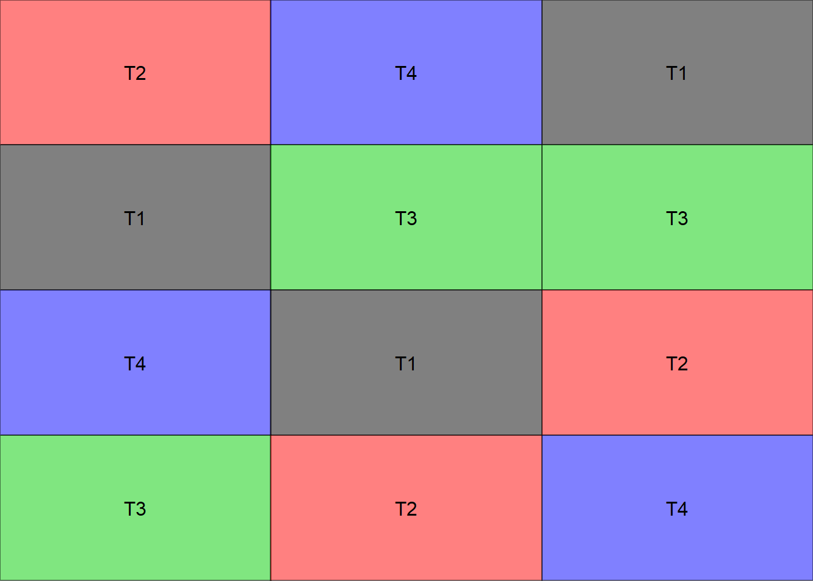

<br>

Criando uma função para fazer um croqui (Bloco em linha)


```r
# Não alterar os comandos da função
library(agricolae)
library(gridExtra)
library(grid)
croqui=function(trat,r){
  sort=design.rcbd(trat,r,serie=0)
  sort$book[,3]=as.factor(t(matrix(sort$book[,3],r,,T)))
  ncol=length(levels(sort$book[,3]))
  gs <- lapply(sort$book[,3], function(ii)
    grobTree(rectGrob(gp=gpar(fill=ii, alpha=0.5)),textGrob(ii)))
  grid.arrange(grobs=gs, ncol=ncol)}
```

<br>

Vetor de tratamentos


```r
trat=c("T1","T2","T3","T4")
```

<br>

Usando a função


```r
croqui(trat,r=3)
```

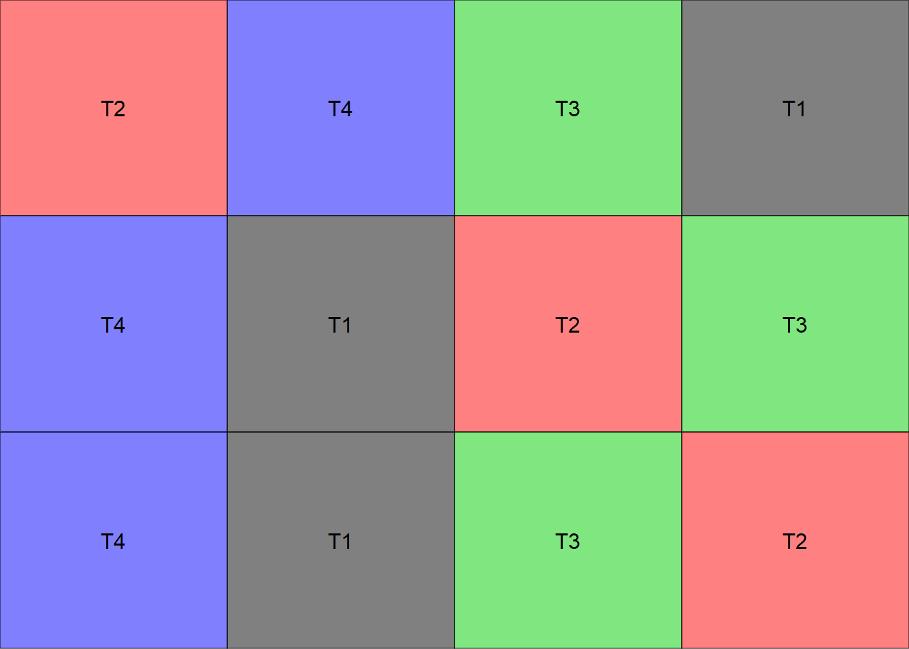

<br><br>

****

## Exemplo 1

****

<br>

**Exemplo do Livro Planejamento e Análise Estatística de Experimentos Agronômicos (2013) - Décio Barbin - pg. 72**


Um experimento foi conduzido com o objetivo de estudar o comportamento de nove porta-enxertos para a laranjeira Valência. 

Os porta-enxertos são:

- T1: Tangerina Sunki
- T2: Limão rugoso Nacional
- T3: Limão rugoso da Flórida
- T4: Tangerina Cleópatra
- T5: Citranger-troyer
- T6: Trifoliata
- T7: Tangerina Cravo
- T8: Laranja caipira
- T9: Limão Cravo

**Delineamento experimental**: Blocos casualizados.

**Repetições/Tratamento**: 3 repetições

<br>

Croqui experimental é apresentado abaixo:

Bloco |     |     |     |     |     |     |     |     |
------|-----|-----|-----|-----|-----|-----|-----|-----|-----
B1    |T3   |T1   |T4   |T8   |T6   |T7   |T2   |T9   |T5
B2    |T7   |T3   |T9   |T4   |T2   |T5   |T1   |T6   |T8
B3    |T8   |T6   |T2   |T1   |T7   |T9   |T3   |T4   |T5

Para o ano de 1973 (Plantas com 12 anos de idade), os resultados de produção, em número médio de frutos por planta, foram:

Tratamentos | B1      |B2       |B3       |Total
------------|---------|---------|---------|---------
1           |145      |155      |166      |466
2           |200      |190      |190      |580
3           |183      |186      |208      |577
4           |190      |175      |186      |551
5           |180      |160      |156      |496
6           |130      |160      |130      |420
7           |206      |165      |170      |541
8           |250      |271      |230      |751
9           |164      |190      |193      |547
Total       |1648     |1652     |1629     |4929

<br>

### Conjunto de dados


```r
resposta=c(145,155,166,
           200,190,190,
           183,186,208,
           190,175,186,
           180,160,156,
           130,160,130,
           206,165,170,
           250,271,230,
           164,190,193)
cultivar=rep(c(paste("T",1:9)),e=3)
cultivar=as.factor(cultivar)
bloco=as.factor(rep(c(paste("B",1:3)),9))
```

<br><br>

## Gráficos exploratórios

<br>

### Gráfico de caixas


```r
car::Boxplot(resposta~cultivar)
```

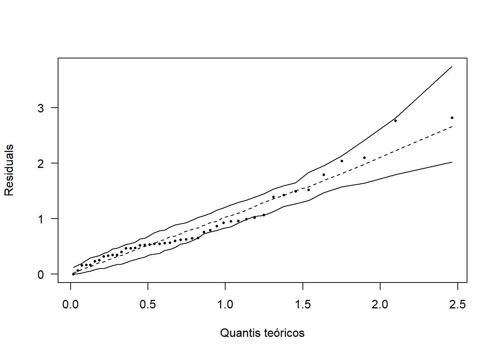

<br>

### Histograma


```r
hist(resposta)
```

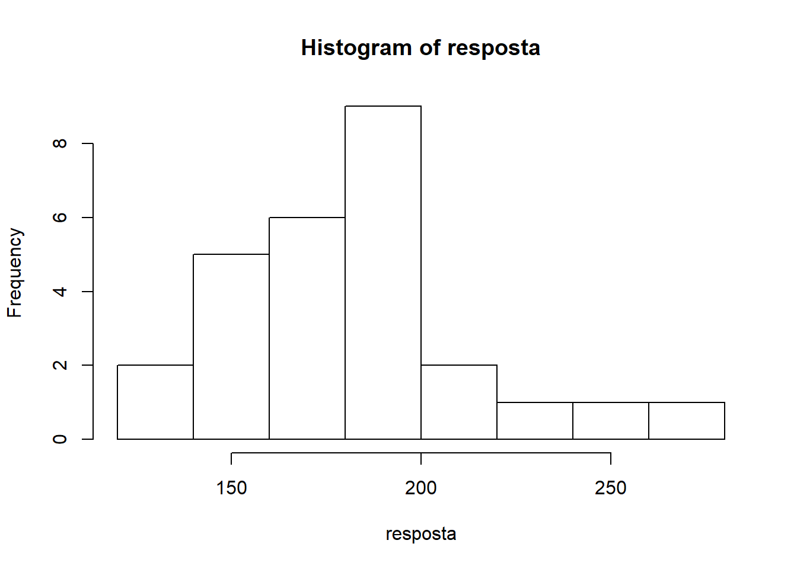

<br>

## Análise de variância


```r
modelo=aov(resposta~cultivar+bloco)
anova(modelo) # Conferir GL
```

```
## Analysis of Variance Table
## 
## Response: resposta
##           Df  Sum Sq Mean Sq F value    Pr(>F)    
## cultivar   8 22981.3 2872.67 11.4114 2.637e-05 ***
## bloco      2    33.6   16.78  0.0666    0.9358    
## Residuals 16  4027.8  251.74                      
## ---
## Signif. codes:  0 '***' 0.001 '**' 0.01 '*' 0.05 '.' 0.1 ' ' 1
```

<br><br>

## Pressuposições

<br>

### Normalidade dos erros


```r
shapiro.test(modelo$residuals)
```

```
## 
## 	Shapiro-Wilk normality test
## 
## data:  modelo$residuals
## W = 0.94759, p-value = 0.1873
```

Os erros seguem distribuição normal

<br>

### Homogeneidade das variâncias


```r
bartlett.test(modelo$residuals~cultivar)
```

```
## 
## 	Bartlett test of homogeneity of variances
## 
## data:  modelo$residuals by cultivar
## Bartlett's K-squared = 4.0369, df = 8, p-value = 0.8538
```

As variâncias são homogêneas

<br>

### Independência dos erros


```r
lmtest::dwtest(modelo)
```

```
## 
## 	Durbin-Watson test
## 
## data:  modelo
## DW = 2.3246, p-value = 0.2484
## alternative hypothesis: true autocorrelation is greater than 0
```

Os erros são independentes.

<br>

### Teste de Aditividade de Tukey


```r
library(asbio)
tukey.add.test(resposta,cultivar,bloco)
```

```
## 
## Tukey's one df test for additivity 
## F = 0.6866169   Denom df = 15    p-value = 0.4203076
```

<br>

### Gráfico de resíduos padronizados


```r
a=anova(modelo)
plot(modelo$residuals/sqrt(a$`Mean Sq`[3]), ylab="Resíduos Padronizados")
abline(h=0)
```


<br><br>

## Comparação múltipla

<br>

### Teste de Comparação Múltipla de Tukey (Utilizando o multcomp)


```r
library(multcomp)
mcomp=glht(modelo, mcp(cultivar="Tukey"))
plot(mcomp)
```

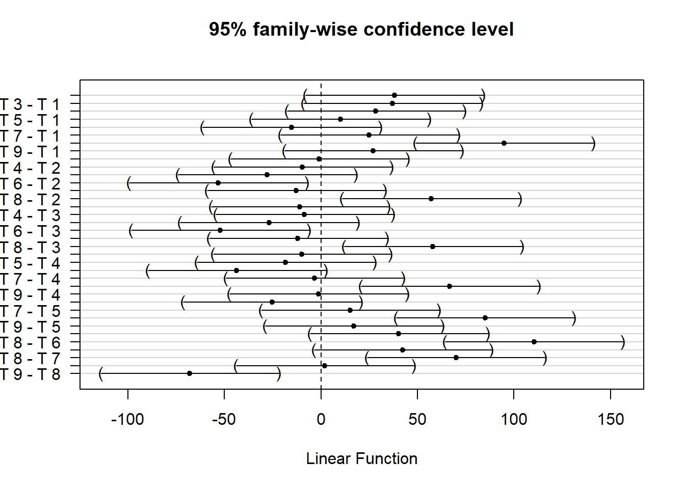

```r
cld(mcomp)
```

```
##  T 1  T 2  T 3  T 4  T 5  T 6  T 7  T 8  T 9 
## "ab"  "b"  "b" "ab" "ab"  "a" "ab"  "c" "ab"
```

<br>

### Teste de Comparação Múltipla de Tukey (Utilizando o TukeyHSD do R)


```r
(tukey=TukeyHSD(modelo))
```

```
##   Tukey multiple comparisons of means
##     95% family-wise confidence level
## 
## Fit: aov(formula = resposta ~ cultivar + bloco)
## 
## $cultivar
##               diff         lwr        upr     p adj
## T 2-T 1  38.000000   -8.085796  84.085796 0.1520249
## T 3-T 1  37.000000   -9.085796  83.085796 0.1728150
## T 4-T 1  28.333333  -17.752463  74.419129 0.4559717
## T 5-T 1  10.000000  -36.085796  56.085796 0.9962223
## T 6-T 1 -15.333333  -61.419129  30.752463 0.9489958
## T 7-T 1  25.000000  -21.085796  71.085796 0.6053536
## T 8-T 1  95.000000   48.914204 141.085796 0.0000460
## T 9-T 1  27.000000  -19.085796  73.085796 0.5143733
## T 3-T 2  -1.000000  -47.085796  45.085796 1.0000000
## T 4-T 2  -9.666667  -55.752463  36.419129 0.9969942
## T 5-T 2 -28.000000  -74.085796  18.085796 0.4703201
## T 6-T 2 -53.333333  -99.419129  -7.247537 0.0172692
## T 7-T 2 -13.000000  -59.085796  33.085796 0.9799785
## T 8-T 2  57.000000   10.914204 103.085796 0.0099947
## T 9-T 2 -11.000000  -57.085796  35.085796 0.9929220
## T 4-T 3  -8.666667  -54.752463  37.419129 0.9985839
## T 5-T 3 -27.000000  -73.085796  19.085796 0.5143733
## T 6-T 3 -52.333333  -98.419129  -6.247537 0.0200347
## T 7-T 3 -12.000000  -58.085796  34.085796 0.9877062
## T 8-T 3  58.000000   11.914204 104.085796 0.0086074
## T 9-T 3 -10.000000  -56.085796  36.085796 0.9962223
## T 5-T 4 -18.333333  -64.419129  27.752463 0.8763516
## T 6-T 4 -43.666667  -89.752463   2.419129 0.0705323
## T 7-T 4  -3.333333  -49.419129  42.752463 0.9999989
## T 8-T 4  66.666667   20.580871 112.752463 0.0023716
## T 9-T 4  -1.333333  -47.419129  44.752463 1.0000000
## T 6-T 5 -25.333333  -71.419129  20.752463 0.5900630
## T 7-T 5  15.000000  -31.085796  61.085796 0.9546944
## T 8-T 5  85.000000   38.914204 131.085796 0.0001740
## T 9-T 5  17.000000  -29.085796  63.085796 0.9134401
## T 7-T 6  40.333333   -5.752463  86.419129 0.1116698
## T 8-T 6 110.333333   64.247537 156.419129 0.0000069
## T 9-T 6  42.333333   -3.752463  88.419129 0.0849582
## T 8-T 7  70.000000   23.914204 116.085796 0.0014541
## T 9-T 7   2.000000  -44.085796  48.085796 1.0000000
## T 9-T 8 -68.000000 -114.085796 -21.914204 0.0019490
## 
## $bloco
##               diff       lwr      upr     p adj
## B 2-B 1  0.4444444 -18.85487 19.74376 0.9980554
## B 3-B 1 -2.1111111 -21.41043 17.18820 0.9571497
## B 3-B 2 -2.5555556 -21.85487 16.74376 0.9379209
```

```r
plot(tukey)
```

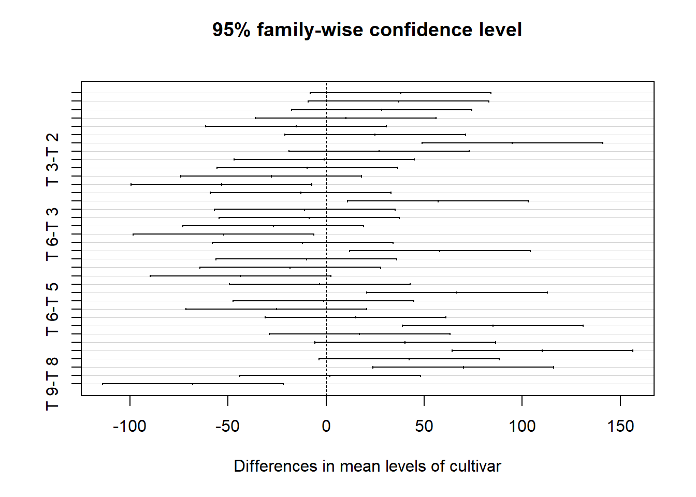

<br>

### Teste de Comparação Múltipla de Tukey (Utilizando o HSD.test do Agricolae)


```r
library(agricolae)
tukey=HSD.test(modelo,"cultivar")
plot(tukey)
```

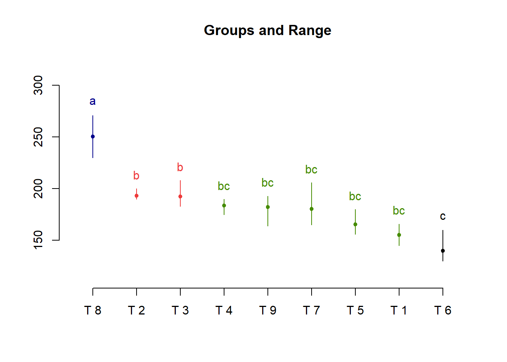

<br>

### Teste de Comparação Múltipla de Tukey (Utilizando o ea1() do pacote easyanova)


```r
library(easyanova)
tukey=ea1(data.frame(cultivar,bloco,resposta), design = 2)
```

```r
cbind(tukey$`Adjusted means`[1],tukey$`Adjusted means`[2],tukey$`Adjusted means`[4])
```

```
##   treatment adjusted.mean tukey
## 1       T 8      250.3333     a
## 2       T 2      193.3333     b
## 3       T 3      192.3333     b
## 4       T 4      183.6667    bc
## 5       T 9      182.3333    bc
## 6       T 7      180.3333    bc
## 7       T 5      165.3333    bc
## 8       T 1      155.3333    bc
## 9       T 6      140.0000     c
```

<br>

#### Teste de Comparação Múltipla de Tukey (Utilizando o dbc do pacote ExpDes.pt)


```r
library(ExpDes.pt)
dbc(cultivar,bloco,resposta)
```

```
## ------------------------------------------------------------------------
## Quadro da analise de variancia
## ------------------------------------------------------------------------
##            GL      SQ      QM      Fc   Pr>Fc
## Tratamento  8 22981.3 2872.67 11.4114 0.00003
## Bloco       2    33.6   16.78  0.0666 0.93578
## Residuo    16  4027.8  251.74                
## Total      26 27042.7                        
## ------------------------------------------------------------------------
## CV = 8.69 %
## 
## ------------------------------------------------------------------------
## Teste de normalidade dos residuos 
## valor-p:  0.187264 
## De acordo com o teste de Shapiro-Wilk a 5% de significancia, os residuos podem ser considerados normais.
## ------------------------------------------------------------------------
## 
## ------------------------------------------------------------------------
## Teste de homogeneidade de variancia 
## valor-p:  0.7817409 
## De acordo com o teste de oneillmathews a 5% de significancia, as variancias podem ser consideradas homogeneas.
## ------------------------------------------------------------------------
## 
## Teste de Tukey
## ------------------------------------------------------------------------
## Grupos Tratamentos Medias
## a 	 T 8 	 250.3333 
##  b 	 T 2 	 193.3333 
##  b 	 T 3 	 192.3333 
##  bc 	 T 4 	 183.6667 
##  bc 	 T 9 	 182.3333 
##  bc 	 T 7 	 180.3333 
##  bc 	 T 5 	 165.3333 
##  bc 	 T 1 	 155.3333 
##   c 	 T 6 	 140 
## ------------------------------------------------------------------------
```

<br><br>

****

## Exemplo 2

****


Um experimento foi realizado com o intuito de avaliar a produtividade de 15 cultivares comerciais de soja no munícipio de Londrina-PR. O experimento foi instalado em Delineamento em blocos casualizados com 3 repetições por tratamento.

**Fonte da foto**: [Agricultura](http://www.agricultura.gov.br/noticias/entra-em-vigor-novo-sistema-de-registro-de-cultivares/@@nitf_galleria)

<br>

### Conjunto de dados


```r
PRO=c(2444.44,2870.37,2314.81,2629.63,2444.44,2592.59,2962.96,3037.04,3037.04,2592.59,2296.30,2444.44,2370.37,3481.48,2555.56,1981.48,2611.11,1925.93,1870.37,2518.52,2370.37,2462.96,2351.85,2000.00,2703.70,2685.19,2166.67,2129.63,2222.22,1814.81,2537.04,2351.85,2333.33,3370.37,2462.96,3129.63,2666.67,2796.30,2055.56,2333.33,2240.74,2092.59,2703.70,2129.63,2740.74)
Cultivares=rep(c(paste("T",1:15)),e=3)
Bloco=rep(c(paste("B",1:3)),15)
Tratamento = as.factor(Cultivares)
bloco=as.factor(Bloco)
dados = data.frame(Tratamento, TRAT=Tratamento, bloco,resp=PRO)
dados = dados[order(dados$Tratamento), ]
X = 'Cultivares de soja'
(Y = expression(Produtividade (Kg.ha^-1)))
```

```
## expression(Produtividade(Kg.ha^-1))
```

```r
alfa="0,05"
```

<br><br>

## Estatística descritiva


```r
Média = with(dados, mean(resp))
Variância = with(dados, var(resp))
Desvio = with(dados, sd(resp))
CV = Desvio / Média * 100

desc = cbind(Média, Variância, Desvio, CV)
rownames(desc) = 'Produvidade (Kg/ha)'
kable(round(desc,2), align="l")
```

                      Média     Variância   Desvio   CV    
--------------------  --------  ----------  -------  ------
Produvidade (Kg/ha)   2485.18   141049.6    375.57   15.11 

<br><br>

### Por Cultivar


```r
Médias = with(dados, tapply(resp, Tratamento, mean))
Variâncias = with(dados, tapply(resp, Tratamento, var))
Desvios = with(dados, tapply(resp, Tratamento, sd))
CV = Desvios / Médias * 100
Desc = cbind(Médias, Variâncias, Desvios, CV)
kable(round(Desc,2),align="l")
```

       Médias    Variâncias   Desvios   CV    
-----  --------  -----------  --------  ------
T 1    2543.21   84477.87     290.65    11.43 
T 10   2055.55   45611.24     213.57    10.39 
T 11   2407.41   12689.35     112.65    4.68  
T 12   2987.65   220966.26    470.07    15.73 
T 13   2506.18   156492.52    395.59    15.78 
T 14   2222.22   14746.18     121.43    5.46  
T 15   2524.69   117397.29    342.63    13.57 
T 2    2555.55   9602.62      97.99     3.83  
T 3    3012.35   1829.28      42.77     1.42  
T 4    2444.44   21946.94     148.15    6.06  
T 5    2802.47   354364.77    595.29    21.24 
T 6    2172.84   144831.90    380.57    17.51 
T 7    2253.09   115341.14    339.62    15.07 
T 8    2271.60   58412.64     241.69    10.64 
T 9    2518.52   92934.47     304.85    12.10 

As Médias e as Variâncias estão apresentadas na Tabela \ref{tab:MedVar}. Nota-se uma variação nos valores médios, sendo a menor Média igual a $2055.55$ e a maior Média de $3012.35$. Já em relação às Variâncias, o menor valor é de $1829.28$ e a maior variablidade de $3.5436477\times 10^{5}$. 

<br><br>

## Gráfico de Caixas


```r
par(bty='l', mai=c(1, 1, .2, .2))
par(cex=0.7)
caixas=with(dados, car::Boxplot(resp ~ dados$TRAT, vertical=T,las=1, col='Lightyellow',
                    xlab=X, ylab=Y))
mediab=tapply(dados$resp, dados$ TRAT, mean)
points(mediab, pch='+', cex=1.5, col='red')
```

<div class="figure" style="text-align: center">
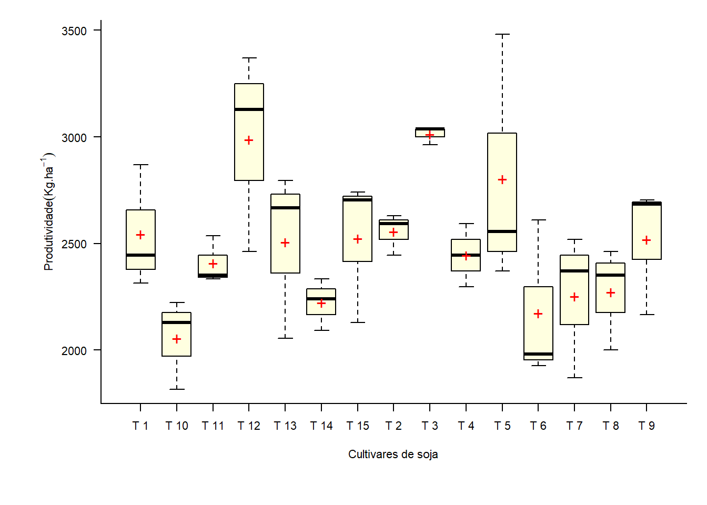
<p class="caption">(\#fig:unnamed-chunk-122)Gráfico de caixas</p>
</div>

```r
names(Desvios)[which.min(Desvios)]
```

Não observa-se *outliers*. Há maior variabilidade em T 5 e menor em T 3, com 595.285 e 42.77, respectivamente. Há evidências de diferença entre as Médias dos tratamentos.

<br><br>

## Análise de Variância

\begin{eqnarray*}
\left\{
\begin{array}{ll}
H_0: & \mu_1 = \mu_2 = \mu_3 = \cdots = \mu_{15} \\[.2cm]
H_1: & \mu_i \neq \mu_i' \qquad i \neq i'.
\end{array}
\right.
\end{eqnarray*}


```r
mod = with(dados, aov(resp ~ Tratamento+bloco))
av=anova(mod)
kable(av, align = "l")
```

             Df   Sum Sq      Mean Sq     F value    Pr(>F)    
-----------  ---  ----------  ----------  ---------  ----------
Tratamento   14   3302891.5   235920.82   2.545837   0.0171400 
bloco        2    308550.2    154275.11   1.664793   0.2074184 
Residuals    28   2594738.7   92669.24                         

Como p-valor calculado (p=$0.01714$) é menor que o nível de significância adotado ($p=0,05$), rejeita-se $H0$. Logo, 
ao menos dois tratamentos se diferem entre si

<br><br>

## Pressuposições

<br>

### Normalidade dos erros

\begin{eqnarray*}
\left\{
\begin{array}{ll}
H_0: & \mbox{Os erros seguem distribuição normal}\\[.2cm]
H_1: & \mbox{Os erros não seguem distribuição normal}.
\end{array}
\right.
\end{eqnarray*}


```r
(norm=shapiro.test(mod$res))
```

```
## 
## 	Shapiro-Wilk normality test
## 
## data:  mod$res
## W = 0.97989, p-value = 0.6151
```

Como p-valor calculado (p=$0.6151$) é maior que o nível de significância adotado ($\alpha=0,05$), não rejeita-se $H_O$. Logo, os erros seguem distribuição normal.


```r
hnp::hnp(mod, las=1, xlab="Quantis teóricos", pch=16)
```

<div class="figure" style="text-align: center">
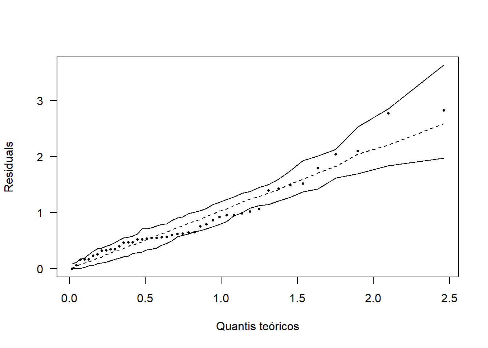
<p class="caption">(\#fig:unnamed-chunk-125)Gráfico QQplot \label{Fig:QQ}</p>
</div>

<br>

### Homogeneidade de Variâncias

\begin{eqnarray*}
\left\{
\begin{array}{ll}
H_0: & \mbox{ As Variâncias são homogêneas}\\[.2cm]
H_1: & \mbox{ As Variâncias não são homogêneas}.
\end{array}
\right.
\end{eqnarray*}


```r
(homog=with(dados, bartlett.test(mod$res ~ Tratamento)))
```

```
## 
## 	Bartlett test of homogeneity of variances
## 
## data:  mod$res by Tratamento
## Bartlett's K-squared = 15.293, df = 14, p-value = 0.3584
```

Como p-valor calculado (p=$0.3584$) é maior que o nível de significância adotado ($p=0,05$), não rejeita-se $H_0$. Logo, as Variâncias são homogêneas.

<br>

### Independência dos erros

\begin{eqnarray*}
\left\{
\begin{array}{ll}
H_0: \mbox{Os erros são independentes}\\[.2cm]
H_1: \mbox{Os erros não são independentes}.
\end{array}
\right.
\end{eqnarray*}


```r
(ind=lmtest::dwtest(mod))
```

```
## 
## 	Durbin-Watson test
## 
## data:  mod
## DW = 2.9611, p-value = 0.9272
## alternative hypothesis: true autocorrelation is greater than 0
```

Como p-valor calculado (p=$0.9272$) é maior que o nível de significância adotado ($p=0,05$), não rejeita-se $H_0$. Logo, os erros são independentes. A Figura \ref{fig:res} apresenta os resíduos brutos. Percebe-se que os resíduos estão distribuídos de forma totalmente aleatória, evidenciando a sua independência.


```r
plot(mod$res, las=1, pch=19, col='red', ylab='Resíduos brutos')
abline(h=0)
```

<div class="figure" style="text-align: center">

<p class="caption">(\#fig:unnamed-chunk-128)Gráfico de resíduos brutos \label{fig:res}</p>
</div>

<br><br>

## Teste de comparações
 

```r
mod.1 = easyanova::ea1(dados[,c(1,3,4)], design=2, plot=2)
```

```r
tabela=cbind(mod.1$`Adjusted means`[1],
             mod.1$`Adjusted means`[2],
             mod.1$`Adjusted means`[8])
names(tabela)[1:3]=c("Cultivar","Média","")
kable(tabela, align = 'l', booktabs=T, caption="Teste de comparação de Scott-Knott", format="pandoc", format.args = list(big.mark="."))
```


Table: (\#tab:unnamed-chunk-129)Teste de comparação de Scott-Knott

Cultivar   Média          
---------  ----------  ---
T 3        3.012.347   a  
T 12       2.987.653   a  
T 5        2.802.470   a  
T 2        2.555.553   b  
T 1        2.543.207   b  
T 15       2.524.690   b  
T 9        2.518.520   b  
T 13       2.506.177   b  
T 4        2.444.443   b  
T 11       2.407.407   b  
T 8        2.271.603   b  
T 7        2.253.087   b  
T 14       2.222.220   b  
T 6        2.172.840   b  
T 10       2.055.553   b  


```r
library(ExpDes.pt)
with(dados,dbc(Tratamento, bloco,resp, mcomp="tukey"))
```

```
## ------------------------------------------------------------------------
## Quadro da analise de variancia
## ------------------------------------------------------------------------
##            GL      SQ     QM     Fc   Pr>Fc
## Tratamento 14 3302891 235921 2.5458 0.01714
## Bloco       2  308550 154275 1.6648 0.20742
## Residuo    28 2594739  92669               
## Total      44 6206180                      
## ------------------------------------------------------------------------
## CV = 12.25 %
## 
## ------------------------------------------------------------------------
## Teste de normalidade dos residuos 
## valor-p:  0.6150834 
## De acordo com o teste de Shapiro-Wilk a 5% de significancia, os residuos podem ser considerados normais.
## ------------------------------------------------------------------------
## 
## ------------------------------------------------------------------------
## Teste de homogeneidade de variancia 
## valor-p:  0.1187836 
## De acordo com o teste de oneillmathews a 5% de significancia, as variancias podem ser consideradas homogeneas.
## ------------------------------------------------------------------------
## 
## Teste de Tukey
## ------------------------------------------------------------------------
## Grupos Tratamentos Medias
## a 	 T 3 	 3012.347 
## a 	 T 12 	 2987.653 
## ab 	 T 5 	 2802.47 
## ab 	 T 2 	 2555.553 
## ab 	 T 1 	 2543.207 
## ab 	 T 15 	 2524.69 
## ab 	 T 9 	 2518.52 
## ab 	 T 13 	 2506.177 
## ab 	 T 4 	 2444.443 
## ab 	 T 11 	 2407.407 
## ab 	 T 8 	 2271.603 
## ab 	 T 7 	 2253.087 
## ab 	 T 14 	 2222.22 
## ab 	 T 6 	 2172.84 
##  b 	 T 10 	 2055.553 
## ------------------------------------------------------------------------
```


<br><br><br><br>

# Delineamento em Quadrado Latino

****

<br><br><br><br>

- Na sessão de delineamento em blocos ao acaso, observamos que o mesmo é usado para reduzir o erro residual de um experimento utilizando o princípio do controle local;
- No Delineamento em Quadrado Latino, além dos princípios da repetição e da casualização, o princípio do controle local é utilizado duas vezes para controlar o efeito de dois fatores;
- Para controlar esta variabilidade, é necessário dividir as unidades experimentais em blocos homogêneos de unidades experimentais em relação a cada fator controlado.
- O número de blocos para cada fator controlado deve ser igual ao número de tratamentos.
Uma vez formados os blocos, distribui-se os tratamentos ao acaso com a restrição que cada tratamento seja designado uma única vez em cada um dos blocos dos dois fatores controlados.
- Os níveis de um fator controlado são identificados por linhas em uma tabela de dupla entrada e os níveis do outro fator controlado são identificados por colunas na tabela.
- A grande restrição dos ensaios em quadrados latinos é que para 2, 3 ou 4 tratamentos teremos apenas 0, 2 ou 6 g.l., respectivamente,para o resíduo.
- Por outro lado, com 9 ou mais tratamentos, o quadrado latino fica muito grande, trazendo dificuldades na instalação, pois, para 9 tratamentos, teremos 81 parcelas.
- Por isso, os quadrados latinos mais usados são os de 5 x 5, 6 x 6, 7 x 7 e 8 x 8.

<br>

****

## Modelo matemático 

****

\begin{eqnarray}
y_{ji}=\mu+\tau_i+\alpha_j+\beta_k+\varepsilon_{ij}
\end{eqnarray}

$y_{ji}$: é o valor observado na i-ésima linha e k-ésima coluna para o j-ésimo tratamento;

$\mu$: é a média geral (ou constante comum a todas as observações);

$\tau_i$: é o efeito de tratamento, com $i = 1, 2, . . . , I$;

$\beta_j$: é o efeito da k-ésima coluna;

$\alpha_j$: é efeito da j-ésima linha

$\varepsilon_{ij}$: é o erro experimental, tal que $\varepsilon_{ij}$~N(0; $\sigma^2$).

**O modelo é completamente aditivo, ou seja, não há interação entre linhas, colunas e tratamentos.**

****

## Hipóteses e Modelo 

****

\begin{eqnarray*}
\left\{
\begin{array}{ll}
H_0: & \mu_1 = \mu_2 =\mu_i\\[.2cm]
H_1: & \mu_i \neq \mu_i' \qquad i \neq i'.
\end{array}
\right.
\end{eqnarray*}

CV            | G.L.        |S.Q.        |Q.M.                      |  Fcalc                  | Ftab
--------------:|:-------------:|:------------:|:--------------------------:|:-------------------------:|:----------------------------------:
Tratamentos   | $p - 1$     |$SQ_{Trat}$ |$\frac{SQ_{Trat}}{p-1}$   |$\frac{QMTrat}{QMRes}$   | $F(\alpha;GL_{Trat} ;GL_{Res})$
Linhas        | $p - 1$     |$SQ_{L}$    |$\frac{SQ_{L}}{p-1}$      |$\frac{QM_{L}}{QM_{Res}}$| $F(\alpha;GL_{L} ;GL_{Res})$
Colunas       | $p - 1$     |$SQ_{C}$    |$\frac{SQ_{C}}{p-1}$      |$\frac{QM_{C}}{QM_{Res}}$| $F(\alpha;GL_{C} ;GL_{Res})$
resíduo       | $(p-2)(p-1)$|$SQ_{Res}$  |$\frac{SQRes}{(p-2)(p-1)}$|                         |
Total         | $p^2-1$     |$SQ_{Total}$|                          |                         |

<br><br>

****

### Croqui de um experimento em DQL

****

<br>

Criando uma função para fazer um croqui


```r
# Não alterar os comandos da função
library(agricolae)
library(gridExtra)
library(grid)
croqui=function(trat){
  r=length(trat)
  sort=design.lsd(trat,r,serie=0)
  sort$book[,4]=as.factor(matrix(sort$book[,4],r,,T))
  ncol=r
  gs <- lapply(sort$book[,4], function(ii)
    grobTree(rectGrob(gp=gpar(fill=ii, alpha=0.5)),textGrob(ii)))
  grid.arrange(grobs=gs, ncol=ncol)}
```

<br>

Vetor de tratamentos


```r
trat=c("T1","T2","T3","T4")
```

<br>

Usando a função


```r
croqui(trat)
```

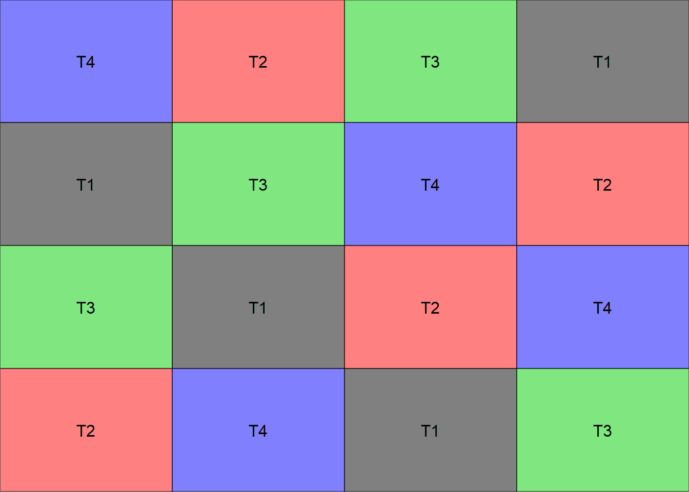

<br><br>

****

## Exemplo 1

****

Considere um experimento, cujo objetivo foi estudar o efeito da idade de castração no desenvolvimento e produção de suínos, avaliando-se o peso dos leitões. Quatro tratamentos foram estudados:

- A - castração aos 56 dias de idade;
- B - castração aos 7 dias de idade;
- C - castração aos 36 dias de idade;
- D - inteiros (não castrados);
- E - castração aos 21 dias de idade;

Foi utilizado o delineamento em quadrado latino buscando controlar a variação entre leitegadas (linhas) e a variação no peso inicial dos leitões (colunas), sendo a parcela experimental constituída de um leitão. Os ganhos de pesos, em kg, após o período experimental (28 semanas), estão apresentados no quadro abaixo:


Linhas      | Coluna 1 | Coluna 2 | Coluna 3 | Coluna 4 | Coluna 5 | Totais
------------|----------|----------|----------|----------|----------|------------
Leitegada 1 | 93,0(A)  | 115,4(C) | 116,9(E) | 110,2(D) | 110,4(B) | 545,9 
Leitegada 2 | 110,6(C) | 96,5(E)  | 108,9(B) | 97,6 (A) | 112,0(D) | 525,6
Leitegada 3 | 102,1(B) | 108,6(D) | 77,9(A)  | 102,0(E) | 111,7(C) | 502,3
Leitegada 4 | 115,4(D) | 94,9(A)  | 114,0(C) | 100,2(B) | 118,5(E) | 543,0
Leitegada 5 | 117,6(E) | 114,1(B) | 118,7(D) | 108,8(C) | 80,2(A)  | 539,4
Totais      | 538,7    | 529,5    | 536,4    | 518,8    | 532,8    | 2656,2

<br><br>

### Conjunto de dados


```r
RESP=c(93.0, 115.4, 116.9, 110.2, 110.4,110.6, 96.5, 108.9, 97.6, 112.0,102.1, 108.6, 77.9, 102.0, 111.7,115.4, 94.9, 114.0, 100.2, 118.5,117.6, 114.1, 118.7, 108.8, 80.2)
(TRAT=c("A","C","E","D","B","C","E","B","A","D","B","D","A","E","C","D","A","C","B","E","E","B","D","C","A"))
```

```
##  [1] "A" "C" "E" "D" "B" "C" "E" "B" "A" "D" "B" "D" "A" "E" "C" "D" "A" "C" "B"
## [20] "E" "E" "B" "D" "C" "A"
```

```r
(linha=as.factor(rep(1:5,each=5)))
```

```
##  [1] 1 1 1 1 1 2 2 2 2 2 3 3 3 3 3 4 4 4 4 4 5 5 5 5 5
## Levels: 1 2 3 4 5
```

```r
(coluna=as.factor(rep(1:5,5)))
```

```
##  [1] 1 2 3 4 5 1 2 3 4 5 1 2 3 4 5 1 2 3 4 5 1 2 3 4 5
## Levels: 1 2 3 4 5
```

```r
dados = data.frame(TRAT, linha, coluna, RESP)
alfa=0.05
```

<br><br>

## Análise Descritiva


```r
Media=mean(RESP)
Desvio=sd(RESP)
Variancia=var(RESP)
Maximo=max(RESP)
Minimo=min(RESP)
Mediana=median(RESP)
descritiva=cbind(Media,
                 Desvio, 
                 Variancia, 
                 Maximo, 
                 Minimo, 
                 Mediana)
kable(descritiva)
```


   Media     Desvio   Variancia   Maximo   Minimo   Mediana
--------  ---------  ----------  -------  -------  --------
 106.248   11.17751    124.9368    118.7     77.9     110.2

<br>

### Por Tratamento


```r
Media=tapply(RESP,TRAT, mean)
Desvio=tapply(RESP,TRAT,sd)
Variancia=tapply(RESP,TRAT, var)
Maximo=tapply(RESP,TRAT,max)
Minimo=tapply(RESP,TRAT, min)
Mediana=tapply(RESP,TRAT,median)
descritiva=cbind(Media,
                 Desvio, 
                 Variancia, 
                 Maximo, 
                 Minimo, 
                 Mediana)
kable(descritiva)
```

       Media      Desvio   Variancia   Maximo   Minimo   Mediana
---  -------  ----------  ----------  -------  -------  --------
A      88.72    9.014266      81.257     97.6     77.9      93.0
B     107.14    5.825204      33.933    114.1    100.2     108.9
C     112.10    2.636285       6.950    115.4    108.8     111.7
D     112.98    4.075782      16.612    118.7    108.6     112.0
E     110.30   10.288586     105.855    118.5     96.5     116.9


```r
kable(round(descritiva,2), align="l")
```

     Media    Desvio   Variancia   Maximo   Minimo   Mediana 
---  -------  -------  ----------  -------  -------  --------
A    88.72    9.01     81.26       97.6     77.9     93.0    
B    107.14   5.83     33.93       114.1    100.2    108.9   
C    112.10   2.64     6.95        115.4    108.8    111.7   
D    112.98   4.08     16.61       118.7    108.6    112.0   
E    110.30   10.29    105.86      118.5    96.5     116.9   

<br>

## Gráfico de Caixas (Boxplot)


```r
car::Boxplot(RESP~TRAT,
             las=1,
             col="lightblue", xlab="",
             ylab=expression("Resposta"))
points(Media,col="red", pch=8)
```


<br>

## Análise de Variância

\begin{eqnarray*}
\left\{
\begin{array}{ll}
H_0: & \mu_1 = \mu_2 = \mu_3 = \cdots = \mu_{15} \\[.2cm]
H_1: & \mu_i \neq \mu_i' \qquad i \neq i'.
\end{array}
\right.
\end{eqnarray*}


```r
mod=aov(RESP~ TRAT+linha+coluna)
av=anova(mod)
names(av)=c("GL","SQ","QM","Teste F", "p-valor")
kable(av, align = "l", format="pandoc")
```

            GL   SQ          QM         Teste F     p-valor   
----------  ---  ----------  ---------  ----------  ----------
TRAT        4    2020.0544   505.0136   9.0167153   0.0013321 
linha       4    257.8264    64.4566    1.1508340   0.3796397 
coluna      4    48.4984     12.1246    0.2164775   0.9241758 
Residuals   12   672.1032    56.0086                          

Como p-valor calculado (p=$0.0013321$) é menor que o nível de significância adotado ($p=0.05$), rejeita-se $H0$. Logo, 
ao menos dois tratamentos se diferem entre si

<br><br>

## Pressuposições

<br>

### Normalidade dos erros

\begin{eqnarray*}
\left\{
\begin{array}{ll}
H_0: & \mbox{Os erros seguem distribuição normal}\\[.2cm]
H_1: & \mbox{Os erros não seguem distribuição normal}.
\end{array}
\right.
\end{eqnarray*}


```r
(norm=shapiro.test(mod$res))
```

```
## 
## 	Shapiro-Wilk normality test
## 
## data:  mod$res
## W = 0.96116, p-value = 0.438
```

Como p-valor calculado (p=$0.438$) é maior que o nível de significância adotado ($\alpha=0.05$), não rejeita-se $H_O$. Logo, os erros seguem distribuição normal.


```r
hnp::hnp(mod, las=1, xlab="Quantis teóricos", pch=16)
```

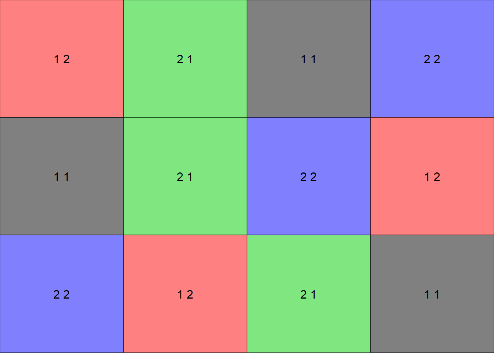

<br>

### Homogeneidade de variâncias

\begin{eqnarray*}
\left\{
\begin{array}{ll}
H_0: & \mbox{ As variâncias são homogêneas}\\[.2cm]
H_1: & \mbox{ As variâncias não são homogêneas}.
\end{array}
\right.
\end{eqnarray*}


```r
(homog=with(dados, bartlett.test(mod$res ~ TRAT)))
```

```
## 
## 	Bartlett test of homogeneity of variances
## 
## data:  mod$res by TRAT
## Bartlett's K-squared = 7.7901, df = 4, p-value = 0.09958
```

Como p-valor calculado ($p=0.0996$) é maior que o nível de significância adotado ($p=0.05$), não rejeita-se $H_0$. Logo, as variâncias são homogêneas.

<br>

### Independência dos erros

\begin{eqnarray*}
\left\{
\begin{array}{ll}
H_0: \mbox{Os erros são independentes}\\[.2cm]
H_1: \mbox{Os erros não são independentes}.
\end{array}
\right.
\end{eqnarray*}


```r
(ind=lmtest::dwtest(mod))
```

```
## 
## 	Durbin-Watson test
## 
## data:  mod
## DW = 1.7241, p-value = 0.08134
## alternative hypothesis: true autocorrelation is greater than 0
```

Como p-valor calculado (p=$0.0813$) é maior que o nível de significância adotado ($p=0.05$), não rejeita-se $H_0$. Logo, os erros são independentes. 


```r
plot(mod$res, las=1, pch=19, col='red')
abline(h=0)
```

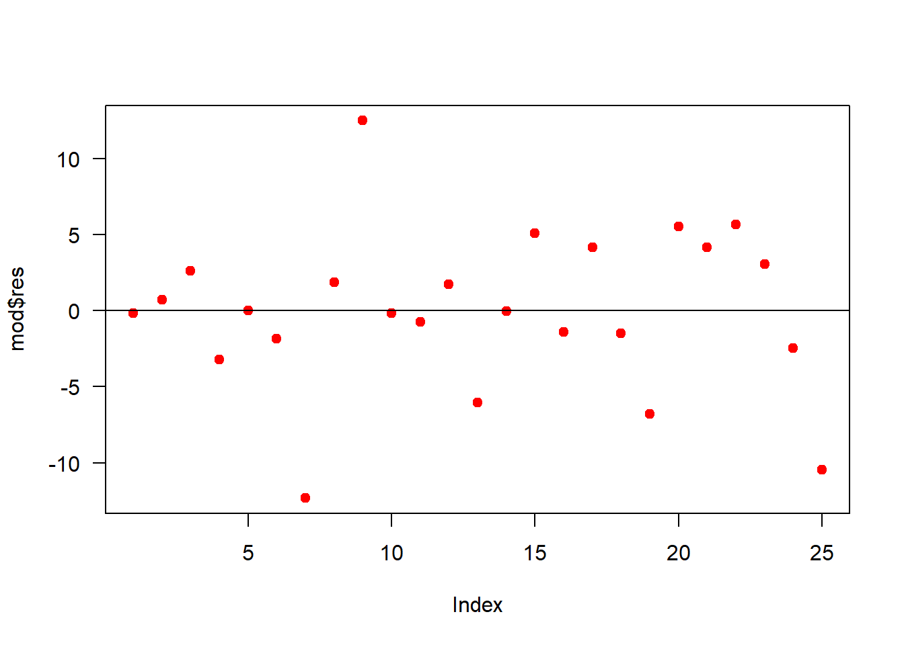

<br><br>

## Teste de comparações

<br>

### Usando o pacote easyanova


```r
library(easyanova)
ea1(dados,design = 3)
```

```
## $`Analysis of variance`
##            df type III SS mean square F value    p>F
## treatments  4   2020.0544    505.0136  9.0167 0.0013
## rows        4    257.8264     64.4566  1.1508 0.3796
## columns     4     48.4984     12.1246  0.2165 0.9242
## residuals  12    672.1032     56.0086       -      -
## 
## $`Adjusted means`
##   treatment adjusted.mean standard.error tukey snk duncan t scott_knott
## 1         D        112.98         3.3469     a   a      a a           a
## 2         C        112.10         3.3469     a   a      a a           a
## 3         E        110.30         3.3469     a   a      a a           a
## 4         B        107.14         3.3469     a   a      a a           a
## 5         A         88.72         3.3469     b   b      b b           b
## 
## $`Multiple comparison test`
##     pair contrast p(tukey) p(snk) p(duncan)   p(t)
## 1  D - C     0.88   0.9997 0.8556    0.8556 0.8556
## 2  D - E     2.68   0.9776 0.8402    0.6003 0.5817
## 3  D - B     5.84   0.7332 0.6186    0.2748 0.2409
## 4  D - A    24.26   0.0019 0.0019    0.0005 0.0003
## 5  C - E     1.80   0.9949 0.7104    0.7104 0.7104
## 6  C - B     4.96   0.8286 0.5624    0.3385 0.3153
## 7  C - A    23.38   0.0026 0.0017    0.0006 0.0003
## 8  E - B     3.16   0.9598 0.5170    0.5170 0.5170
## 9  E - A    21.58   0.0048 0.0018    0.0009 0.0007
## 10 B - A    18.42   0.0150 0.0021    0.0021 0.0021
## 
## $`Residual analysis`
## $`Residual analysis`$`residual analysis`
##                               values
## p.value Shapiro-Wilk test     0.4380
## p.value Bartlett test         0.1031
## coefficient of variation (%)  7.0400
## first value most discrepant   9.0000
## second value most discrepant  7.0000
## third value most discrepant  25.0000
## 
## $`Residual analysis`$residuals
##       1       2       3       4       5       6       7       8       9      10 
##  -0.144   0.716   2.636  -3.224   0.016  -1.864 -12.324   1.856  12.496  -0.164 
##      11      12      13      14      15      16      17      18      19      20 
##  -0.744   1.756  -6.064  -0.024   5.076  -1.424   4.176  -1.484  -6.804   5.536 
##      21      22      23      24      25 
##   4.176   5.676   3.056  -2.444 -10.464 
## 
## $`Residual analysis`$`standardized residuals`
##            1            2            3            4            5            6 
## -0.027211353  0.135300893  0.498118928 -0.609231952  0.003023484 -0.352235843 
##            7            8            9           10           11           12 
## -2.328838268  0.350724101  2.361340717 -0.030990707 -0.140591989  0.331827329 
##           13           14           15           16           17           18 
## -1.145900297 -0.004535225  0.959200182 -0.269090043  0.789129228 -0.280428107 
##           19           20           21           22           23           24 
## -1.285736415  1.046125337  0.789129228  1.072580819  0.577485374 -0.461837125 
##           25 
## -1.977358296
```

<br>

### Usando o pacote laercio


```r
require(laercio)
LTukey(mod,"trat",conf.level=0.95)
```

```
## 
##  TUKEY TEST TO COMPARE MEANS 
##  
##  Confidence level:  0.95 
##  Dependent variable:  RESP
##  Variation Coefficient:  7.043793 % 
##  
## Independent variable:  TRAT 
##   Factors Means    
##   D       112.98 a 
##   C       112.1  a 
##   E       110.3  a 
##   B       107.14 a 
##   A       88.72   b
## 
##  
## Independent variable:  linha 
##   Factors Means   
##   1       109.18 a
##   4       108.6  a
##   5       107.88 a
##   2       105.12 a
##   3       100.46 a
## 
##  
## Independent variable:  coluna 
##   Factors Means   
##   1       107.74 a
##   3       107.28 a
##   5       106.56 a
##   2       105.9  a
##   4       103.76 a
## 
## 
```

<br>

### Usando o pacote agricolae


```r
require(agricolae)
TukeyHSD(mod, "TRAT", ordered = TRUE)
```

```
##   Tukey multiple comparisons of means
##     95% family-wise confidence level
##     factor levels have been ordered
## 
## Fit: aov(formula = RESP ~ TRAT + linha + coluna)
## 
## $TRAT
##      diff        lwr      upr     p adj
## B-A 18.42   3.333159 33.50684 0.0149528
## E-A 21.58   6.493159 36.66684 0.0048180
## C-A 23.38   8.293159 38.46684 0.0025698
## D-A 24.26   9.173159 39.34684 0.0019006
## E-B  3.16 -11.926841 18.24684 0.9597645
## C-B  4.96 -10.126841 20.04684 0.8286018
## D-B  5.84  -9.246841 20.92684 0.7331622
## C-E  1.80 -13.286841 16.88684 0.9949414
## D-E  2.68 -12.406841 17.76684 0.9776166
## D-C  0.88 -14.206841 15.96684 0.9996909
```

```r
plot(TukeyHSD(mod, "TRAT"), col='blue', las=1)
```

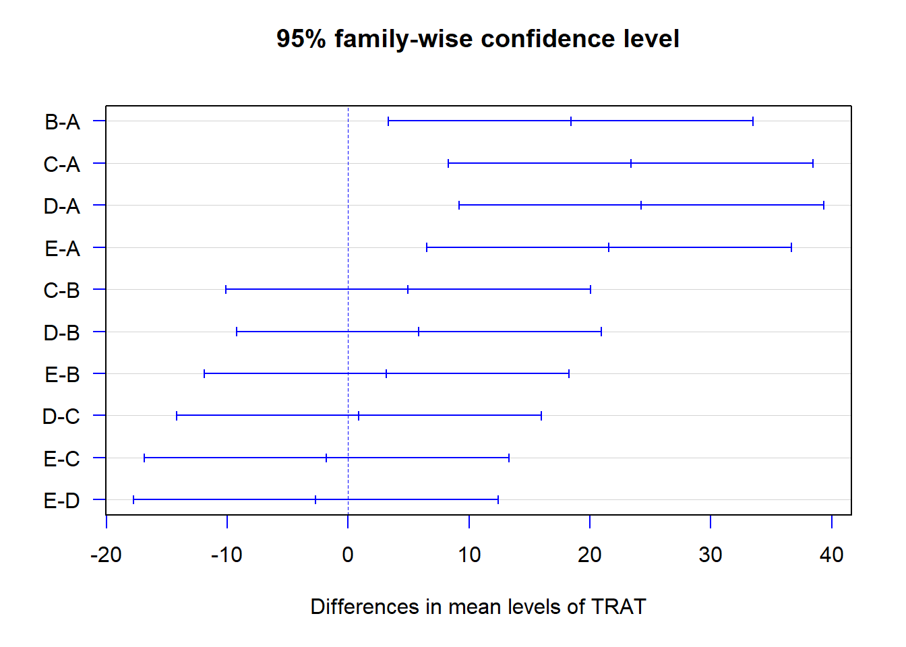

<br>

### Usando o pacote ExpDes.pt


```r
library(ExpDes.pt)
dql(TRAT,linha,coluna,RESP)
```

```
## ------------------------------------------------------------------------
## Quadro da analise de variancia
## ------------------------------------------------------------------------
##            GL      SQ     QM     Fc   Pr>Fc
## Tratamento  4 2020.05 505.01 9.0167 0.00133
## Linha       4  257.83  64.46 1.1508 0.37964
## Coluna      4   48.50  12.12 0.2165 0.92418
## Residuo    12  672.10  56.01               
## Total      24 2998.48                      
## ------------------------------------------------------------------------
## CV = 7.04 %
## 
## ------------------------------------------------------------------------
## Teste de normalidade dos residuos (Shapiro-Wilk)
## valor-p:  0.4380496 
## De acordo com o teste de Shapiro-Wilk a 5% de significancia, os residuos podem ser considerados normais.
## ------------------------------------------------------------------------
## 
## Teste de Tukey
## ------------------------------------------------------------------------
## Grupos Tratamentos Medias
## a 	 D 	 112.98 
## a 	 C 	 112.1 
## a 	 E 	 110.3 
## a 	 B 	 107.14 
##  b 	 A 	 88.72 
## ------------------------------------------------------------------------
```

<br><br><br><br>

# Esquema Fatorial (2 Fatores) 

****

<br><br><br><br>

Nos experimentos mais simples comparamos níveis (tratamentos) de apenas um fator; Entretanto, existem casos em que dois ou mais fatores devem ser estudados simultaneamente para que possam nos conduzir a resultados de interesse;

Em geral, os experimentos fatoriais são mais eficientes para este tipo de experimento, pois estudam, ao mesmo tempo, os efeitos de dois ou mais fatores, cada um deles com dois ou mais níveis.

O fatorial é um tipo de esquema, ou seja, uma das maneiras de organizar os tratamentos e não um tipo de delineamento;

Os experimentos fatoriais são montados segundo um tipo de delineamento experimental;

Nos experimentos fatoriais, os tratamentos são obtidos pelas combinações dos níveis dos fatores.

<br>

****

## Tipos de efeitos avaliados

****

<br>

- Efeito Principal: é o efeito de cada fator, independente do efeito dos outros fatores;

- Efeito de Interação: é o efeito simultâneo dos fatores sobre a variável em estudo. Dizemos que ocorre interação entre os fatores quando os efeitos dos níveis de um fator são modificados pelos níveis do outro fator.

<br>

****

## Vantagens

****

<br>

a) Pode-se estudar dois ou mais fatores num único experimento.

b) Pode-se, por meio dos efeitos das interações, verificar se um fator é independente ou dependente do(s) outro(s).

****

## Desvantagens

****

<br>

a) O número de tratamentos ou combinações de níveis de fatores cresce, rapidamente, com o aumento do número de níveis, em cada fator, ou mesmo com o aumento do número de fatores.

b) A interpretação dos resultados se torna mais difícil é medida que aumentamos o número de níveis e de fatores no experimento.

<br>

****

## Modelo estatístico

****

<br>

As observações podem ser descritas pelo modelo estatístico linear:

<center>

$y_{ij} = \mu+\tau_{i}+\beta_{j}+(\tau\beta)_{ij}+\epsilon_{ij}$

</center>

- i = 1; 2; : : : ; a
- j = 1; 2; : : : ; b
- k = 1; 2; : : : ; r

em que:

- $y_{ijk}$ é o valor observado no i-ésimo nivel do Fator A e j-ésima nível do Fator B;
- $\mu$ é uma constante;
- $\tau_{i}$ é o efeito do i-ésimo nível do fator A;
- $\beta_{j}$ é o efeito do j-ésimo nível do fator B;
- $(\tau\beta)_ij$ é o efeito da interação entre $\tau_{i}$ e $\beta_{j}$;
- $(\epsilon)ijk$ é o componente de erro aleatório.

<br>

****

## Hipóteses e quadro da análise de variância

****

<br>

No experimento fatorial com 2 fatores, deseja-se testar a signicância de ambos os fatores. 

Há interesse em testar hipóteses sobre a igualdade dos efeitos do fator A, isto é:

- H0 : $\beta_{11}$ = $\beta_{12}$ = : : : $\beta_{1a}$ = 0
- H1 : Pelo menos um $\beta_{1i} \neq 0$

e a igualdade nos efeitos do fator B, ou seja:

- H0 : $\beta_{21}$ = $\beta_{22}$ = : : : $\beta_{2b}$ = 0
- H1 : Pelo menos um $\beta_{2j} \neq 0$

e, ainda, se há interação entre os fatores:

- H0 : $(\beta_1\beta_2)_{ij}$ = 0 para todo i ; j
- H1 : Pelo menos um $(\beta_1\beta_2)_{ij} \neq 0$

CV              | G.L.        |S.Q.         |Q.M.                          | Fcalc 
---------------:|:-----------:|:-----------:|:----------------------------:|:---------------------------------
Fator A         | $a - 1$     | $SQ_{A}$    | $\frac{SQ_{A}}{a-1}$         | $\frac{QM_{A}}{QM_{Res}}$ 
Fator B         | $b-1$       | $SQ_{B}$    | $\frac{SQ_{B}}{b-1}$         | $\frac{QM_{B}}{QM_{Res}}$
Interação A x B | $(a-1)(b-1)$| $SQ_{AxB}$  | $\frac{SQ_{AxB}}{(a-1)(b-1)}$| $\frac{QM_{AxB}}{QM_{Res}}$
resíduo         | $ab(n-1)$   | $SQ_{Res}$  | $\frac{SQ_{Res(b)}}{ab(n-1)}$| 
Total           | $abn-1$     | $SQ_{Total}$| -                            | 

<br>

****

## Croqui em DIC

****

<br>

Criando uma função para fazer um croqui (Número de coluna igual número de repetições)


```r
# Não alterar os comandos da função
library(agricolae)
library(gridExtra)
library(grid)
croqui=function(trat,r){
  sort=design.ab(trat,r,design = "crd",serie=0)
  sort$book$trat=as.vector(matrix(paste(sort$book$A,sort$book$B),nrow =r,byrow=T))
  ncol=r
  sort$book$trat=as.factor(sort$book$trat)
  gs <- lapply(sort$book$trat, function(ii)
    grobTree(rectGrob(gp=gpar(fill=ii, alpha=0.5)),textGrob(ii)))
  grid.arrange(grobs=gs, ncol=ncol)}
```

<br>

Vetor de tratamentos


```r
trat=c(2,2)
```

<br>

Usando a função


```r
croqui(trat,r=3)
```

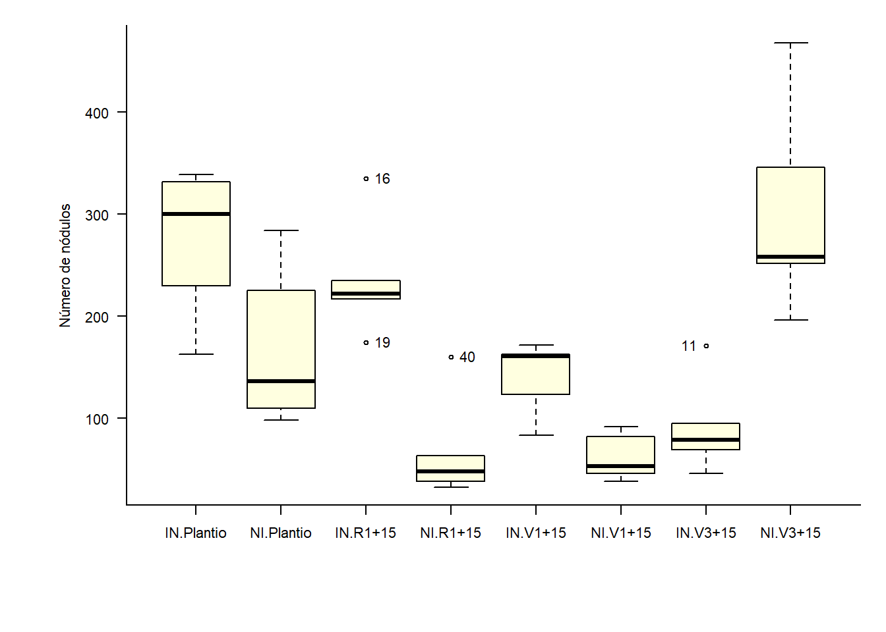

<br>

Criando uma função para fazer um croqui (Número de colunas igual número de tratamentos)


```r
# Não alterar os comandos da função
library(agricolae)
library(gridExtra)
library(grid)
croqui=function(trat,r){
  sort=design.ab(trat,r,design = "crd",serie=0)
  sort$book$trat=as.vector(t(matrix(paste(sort$book$A,sort$book$B),nrow =r, byrow=T)))
  sort$book$trat=as.factor(sort$book$trat)
  ncol=length(levels(sort$book$trat))
  gs <- lapply(sort$book$trat, function(ii)
    grobTree(rectGrob(gp=gpar(fill=ii, alpha=0.5)),textGrob(ii)))
  grid.arrange(grobs=gs, ncol=ncol)}
```

<br>

Vetor de tratamentos


```r
trat=c(2,2) # número de níveis do fator 1 e fator 2 (no caso são 2 cada)
```

<br>

Usando a função


```r
croqui(trat,r=3)
```


<br><br>

## Croqui em DBC

<br>

Criando uma função para fazer um croqui (Número de coluna igual número de repetições)


```r
# Não alterar os comandos da função
library(agricolae)
library(gridExtra)
library(grid)
croqui=function(trat,r){
  sort=design.ab(trat,r,design = "rcbd",serie=0)
  sort$book$trat=as.vector(matrix(paste(sort$book$A,sort$book$B),nrow =r,byrow=T))
  ncol=r
  sort$book$trat=as.factor(sort$book$trat)
  gs <- lapply(sort$book$trat, function(ii)
    grobTree(rectGrob(gp=gpar(fill=ii, alpha=0.5)),textGrob(ii)))
  grid.arrange(grobs=gs, ncol=ncol)}
```

<br>

Vetor de tratamentos


```r
trat=c(2,2)
```

<br>

Usando a função


```r
croqui(trat,r=3)
```

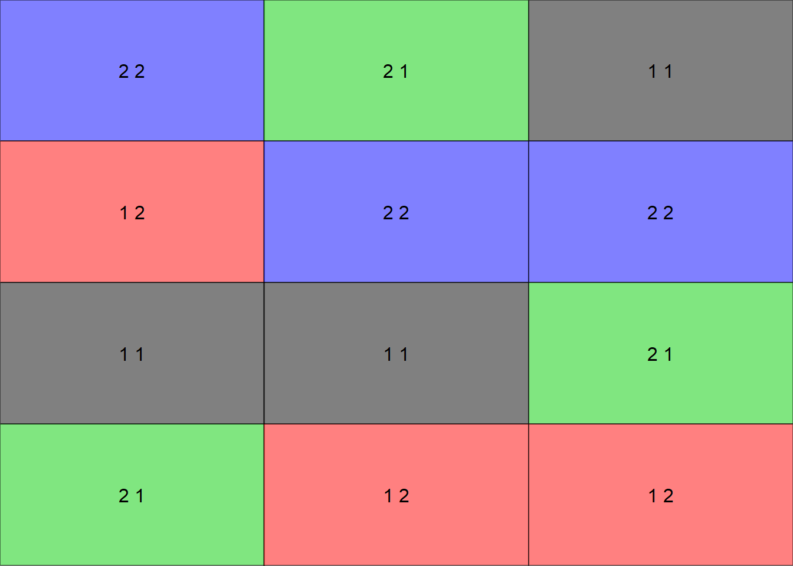

<br>

Criando uma função para fazer um croqui (Número de colunas igual número de tratamentos)


```r
# Não alterar os comandos da função
library(agricolae)
library(gridExtra)
library(grid)
croqui=function(trat,r){
  sort=design.ab(trat,r,design = "rcbd",serie=0)
  sort$book$trat=as.vector(t(matrix(paste(sort$book$A,sort$book$B),nrow =r, byrow=T)))
  sort$book$trat=as.factor(sort$book$trat)
  ncol=length(levels(sort$book$trat))
  gs <- lapply(sort$book$trat, function(ii)
    grobTree(rectGrob(gp=gpar(fill=ii, alpha=0.5)),textGrob(ii)))
  grid.arrange(grobs=gs, ncol=ncol)}
```

<br>

Vetor de tratamentos


```r
trat=c(2,2) # número de níveis do fator 1 e fator 2 (no caso são 2 cada)
```

<br>

Usando a função


```r
croqui(trat,r=3)
```


<br><br><br>

****

## Exemplo 1

****

<br>

Um experimento foi conduzido em casa de vegetação em vasos na Universidade Estadual de Londrina. O trabalho tem o objetivo de avaliar a aplicação de dicloroisocianurato de sódio (DUP) em soja em 4 épocas de aplicação em soja inoculada ou não com *Rhizobium* e sua influência sobre o número de nódulos. O experimento foi conduzido em delineamento inteiramente casualizado com cinco repetições.


**Fonte da foto**: https://blog.aegro.com.br/inoculante-para-soja/ 


<br>


```r
NN=c(339,332,163,230,300,
      163,172,123,083,161,
      171,069,095,046,079,
      335,235,217,174,222,
      284,136,225,098,110,
      082,038,092,053,046,
      196,252,346,468,258,
      032,038,063,048,160)
(Inoculacao=rep(c("IN","NI"),e=20))
```

```
##  [1] "IN" "IN" "IN" "IN" "IN" "IN" "IN" "IN" "IN" "IN" "IN" "IN" "IN" "IN" "IN"
## [16] "IN" "IN" "IN" "IN" "IN" "NI" "NI" "NI" "NI" "NI" "NI" "NI" "NI" "NI" "NI"
## [31] "NI" "NI" "NI" "NI" "NI" "NI" "NI" "NI" "NI" "NI"
```

```r
(epoca=rep(c("Plantio","V1+15","V3+15","R1+15"),e=5,2))
```

```
##  [1] "Plantio" "Plantio" "Plantio" "Plantio" "Plantio" "V1+15"   "V1+15"  
##  [8] "V1+15"   "V1+15"   "V1+15"   "V3+15"   "V3+15"   "V3+15"   "V3+15"  
## [15] "V3+15"   "R1+15"   "R1+15"   "R1+15"   "R1+15"   "R1+15"   "Plantio"
## [22] "Plantio" "Plantio" "Plantio" "Plantio" "V1+15"   "V1+15"   "V1+15"  
## [29] "V1+15"   "V1+15"   "V3+15"   "V3+15"   "V3+15"   "V3+15"   "V3+15"  
## [36] "R1+15"   "R1+15"   "R1+15"   "R1+15"   "R1+15"
```

```r
F1=as.factor(Inoculacao)
F2=as.factor(epoca)
Trat=paste(F1,F2)
dados=data.frame(F1,F2,resp=NN)
X="";Y="Número de nódulos"
```

<br><br>

## Estatística descritiva


```r
Media = with(dados, mean(resp))
Variancia = with(dados, var(resp))
Desvio = with(dados, sd(resp))
CV = Desvio / Media * 100

desc = cbind(Media, Variancia, Desvio, CV)
desc
```


Media    Variancia   Desvio   CV    
-------  ----------  -------  ------
168.35   11413.41    106.83   63.46 

<br>

### Por Inoculação


```r
MediaA = with(dados, tapply(resp, F1, mean))
VarianciaA = with(dados, tapply(resp, F1, var))
DesvioA = with(dados, tapply(resp, F1, sd))
CVA = DesvioA / MediaA * 100
Desc = cbind(MediaA, VarianciaA, DesvioA, CVA)
Desc
```


     MediaA   VarianciaA   DesvioA   CVA   
---  -------  -----------  --------  ------
IN   185.45   8229.21      90.71     48.92 
NI   151.25   14582.72     120.76    79.84 

<br>

### Por época de aplicação


```r
MediaB = with(dados, tapply(resp, F2, mean))
VarianciaB = with(dados, tapply(resp, F2, var))
DesvioB = with(dados, tapply(resp, F2, sd))
CVB = DesvioB / MediaB * 100
Desc = cbind(MediaB, VarianciaB, DesvioB, CVB)
Desc
```


          MediaB   VarianciaB   DesvioB   CVB   
--------  -------  -----------  --------  ------
Plantio   221.7    8287.34      91.03     41.06 
R1+15     152.4    10686.93     103.38    67.83 
V1+15     101.3    2559.12      50.59     49.94 
V3+15     198.0    18507.56     136.04    68.71 

<br><br>

## Gráficos exploratórios

<br>

### Gráfico de Caixas

#### Fator 1


```r
par(bty='l', mai=c(1, 1, .2, .2))
par(cex=0.7)
caixas=with(dados, car::Boxplot(resp ~ F1, vertical=T,las=1, col='Lightyellow',
                    xlab=X, ylab=Y))
mediab=with(dados,tapply(resp, F1, mean))
points(mediab, pch='+', cex=1.5, col='red')
```


<br>

#### Fator 2


```r
par(bty='l', mai=c(1, 1, .2, .2))
par(cex=0.7)
caixas=with(dados, car::Boxplot(resp ~ F2, vertical=T,las=1, col='Lightyellow',
                    xlab=X, ylab=Y))
mediab=with(dados,tapply(resp, F2, mean))
points(mediab, pch='+', cex=1.5, col='red')
```


<br>

#### Juntando Fatores


```r
par(bty='l', mai=c(1, 1, .2, .2))
par(cex=0.7)
caixas=with(dados, car::Boxplot(resp ~ F1*F2, vertical=T,las=1, col='Lightyellow',
                    xlab=X, ylab=Y))
```


<br><br>

### Gráfico de interação


```r
with(dados, interaction.plot(F2, F1, resp, las=1, col=1:6, bty='l', 
                             xlab='', ylab='CBM', trace.label="FATOR1"))
```

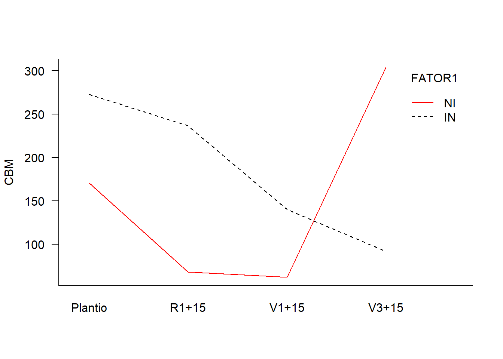


```r
# FATOR1 e FATOR2
with(dados, interaction.plot(F1, F2, resp, las=1, col=1:6, bty='l', 
                             xlab='', ylab='CBM', trace.label="FATOR2"))
```


<br><br>

## Análise de Variância

**Hipótese do Fator 1**:

\begin{eqnarray*}
\left\{
\begin{array}{ll}
H_0: & \mu_1 = \mu_2\\[.2cm]
H_1: & \mu_i \neq \mu_i' \qquad i \neq i'.
\end{array}
\right.
\end{eqnarray*}

**Hipótese do Fator 2**:

\begin{eqnarray*}
\left\{
\begin{array}{ll}
H_0: & \mu_1 = \mu_2 = \mu_3 = \mu_4 \\[.2cm]
H_1: & \mu_i \neq \mu_i' \qquad i \neq i'.
\end{array}
\right.
\end{eqnarray*}

**Hipótese da interação**:

\begin{eqnarray*}
\left\{
\begin{array}{ll}
H_0: & \mbox{Todas as combinações entre os níveis do fator 1 e do fator 2 têm o mesmo efeito} \\[.2cm]
H_1: & \mbox{Pelo menos duas combinações entre os níveis do fator 1 e do fator 2 têm efeitos diferentes}.
\end{array}
\right.
\end{eqnarray*}


```r
mod = with(dados, aov(resp~F1*F2))
anova(mod)
```


            GL   SQ         QM         Teste F     p-valor   
----------  ---  ---------  ---------  ----------  ----------
F1          1    11696.4    11696.40   2.757934    0.1065420 
F2          3    84754.5    28251.50   6.661518    0.0012721 
F1:F2       3    212960.2   70986.73   16.738206   0.0000010 
Residuals   32   135712.0   4241.00                          

<br><br>

## Pressuposições

<br>

### Normalidade dos erros

\begin{eqnarray*}
\left\{
\begin{array}{ll}
H_0: & \mbox{Os erros seguem distribuição normal}\\[.2cm]
H_1: & \mbox{Os erros não seguem distribuição normal}.
\end{array}
\right.
\end{eqnarray*}


```r
(norm=shapiro.test(mod$res))
```

```
## 
## 	Shapiro-Wilk normality test
## 
## data:  mod$res
## W = 0.96809, p-value = 0.3125
```


```r
hnp::hnp(mod, las=1, xlab="Quantis teóricos", pch=16)
```


<br>

### Homogeneidade de variâncias

\begin{eqnarray*}
\left\{
\begin{array}{ll}
H_0: & \mbox{ As variâncias são homogêneas}\\[.2cm]
H_1: & \mbox{ As variâncias não são homogêneas}.
\end{array}
\right.
\end{eqnarray*}

#### Para Fator 1


```r
with(dados, bartlett.test(mod$residuals~F1))
```

```
## 
## 	Bartlett test of homogeneity of variances
## 
## data:  mod$residuals by F1
## Bartlett's K-squared = 1.1346, df = 1, p-value = 0.2868
```

<br>

#### Para Fator 2


```r
with(dados, bartlett.test(mod$residuals~F2))
```

```
## 
## 	Bartlett test of homogeneity of variances
## 
## data:  mod$residuals by F2
## Bartlett's K-squared = 8.1367, df = 3, p-value = 0.04327
```

<br>

#### Juntandos os fatores


```r
tratamentos=rep(c(paste("T",1:8)),e=5)
with(dados, bartlett.test(mod$residuals~tratamentos))
```

```
## 
## 	Bartlett test of homogeneity of variances
## 
## data:  mod$residuals by tratamentos
## Bartlett's K-squared = 9.8754, df = 7, p-value = 0.1957
```

<br>

### Independência dos erros

\begin{eqnarray*}
\left\{
\begin{array}{ll}
H_0: \mbox{Os erros são independentes}\\[.2cm]
H_1: \mbox{Os erros não são independentes}.
\end{array}
\right.
\end{eqnarray*}


```r
(ind=lmtest::dwtest(mod))
```

```
## 
## 	Durbin-Watson test
## 
## data:  mod
## DW = 1.9256, p-value = 0.07498
## alternative hypothesis: true autocorrelation is greater than 0
```


```r
plot(mod$res, las=1, pch=19, col='red', ylab='Resíduos brutos')
abline(h=0)
```


<br>

## Teste de comparações


```r
library(ExpDes.pt)
with(dados,fat2.dic(F1,F2,resp, mcomp="tukey"))
```

```
## ------------------------------------------------------------------------
## Legenda:
## FATOR 1:  F1 
## FATOR 2:  F2 
## ------------------------------------------------------------------------
## 
## 
## Quadro da analise de variancia
## ------------------------------------------------------------------------
##         GL     SQ    QM      Fc    Pr>Fc
## F1       1  11696 11696  2.7579 0.106542
## F2       3  84754 28252  6.6615 0.001272
## F1*F2    3 212960 70987 16.7382 0.000001
## Residuo 32 135712  4241                 
## Total   39 445123                       
## ------------------------------------------------------------------------
## CV = 38.68 %
## 
## ------------------------------------------------------------------------
## Teste de normalidade dos residuos (Shapiro-Wilk)
## valor-p:  0.3125183 
## De acordo com o teste de Shapiro-Wilk a 5% de significancia, os residuos podem ser considerados normais.
## ------------------------------------------------------------------------
## 
## 
## 
## Interacao significativa: desdobrando a interacao
## ------------------------------------------------------------------------
## 
## Desdobrando  F1  dentro de cada nivel de  F2 
## ------------------------------------------------------------------------
## ------------------------------------------------------------------------
## Quadro da analise de variancia
## ------------------------------------------------------------------------
##               GL       SQ        QM      Fc  Pr.Fc
## F2             3  84754.5  28251.50  6.6615 0.0013
## F1:F2 Plantio  1  26112.1  26112.10  6.1571 0.0185
## F1:F2 R1+15    1  70896.4  70896.40 16.7169  3e-04
## F1:F2 V1+15    1  15288.1  15288.10  3.6048 0.0667
## F1:F2 V3+15    1 112360.0 112360.00 26.4938      0
## Residuo       32 135712.0   4241.00               
## Total         39 445123.1  11413.41               
## ------------------------------------------------------------------------
## 
## 
## 
##  F1  dentro do nivel  Plantio  de  F2 
## ------------------------------------------------------------------------
## Teste de Tukey
## ------------------------------------------------------------------------
## Grupos Tratamentos Medias
## a 	 1 	 272.8 
##  b 	 2 	 170.6 
## ------------------------------------------------------------------------
## 
## 
##  F1  dentro do nivel  R1+15  de  F2 
## ------------------------------------------------------------------------
## Teste de Tukey
## ------------------------------------------------------------------------
## Grupos Tratamentos Medias
## a 	 1 	 236.6 
##  b 	 2 	 68.2 
## ------------------------------------------------------------------------
## 
## 
##  F1  dentro do nivel  V1+15  de  F2 
## 
## De acordo com o teste F, as medias desse fator sao estatisticamente iguais.
## ------------------------------------------------------------------------
##     Niveis     Medias
## 1        1      140.4
## 2        2       62.2
## ------------------------------------------------------------------------
## 
## 
##  F1  dentro do nivel  V3+15  de  F2 
## ------------------------------------------------------------------------
## Teste de Tukey
## ------------------------------------------------------------------------
## Grupos Tratamentos Medias
## a 	 2 	 304 
##  b 	 1 	 92 
## ------------------------------------------------------------------------
## 
## 
## 
## Desdobrando  F2  dentro de cada nivel de  F1 
## ------------------------------------------------------------------------
## ------------------------------------------------------------------------
## Quadro da analise de variancia
## ------------------------------------------------------------------------
##          GL       SQ       QM      Fc  Pr.Fc
## F1        1  11696.4 11696.40  2.7579 0.1065
## F2:F1 IN  3 105043.8 35014.58  8.2562  3e-04
## F2:F1 NI  3 192671.0 64223.65 15.1435      0
## Residuo  32 135712.0  4241.00               
## Total    39 445123.1 11413.41               
## ------------------------------------------------------------------------
## 
## 
## 
##  F2  dentro do nivel  IN  de  F1 
## ------------------------------------------------------------------------
## Teste de Tukey
## ------------------------------------------------------------------------
## Grupos Tratamentos Medias
## a 	 1 	 272.8 
## ab 	 2 	 236.6 
##  bc 	 3 	 140.4 
##   c 	 4 	 92 
## ------------------------------------------------------------------------
## 
## 
##  F2  dentro do nivel  NI  de  F1 
## ------------------------------------------------------------------------
## Teste de Tukey
## ------------------------------------------------------------------------
## Grupos Tratamentos Medias
## a 	 4 	 304 
##  b 	 1 	 170.6 
##  b 	 2 	 68.2 
##  b 	 3 	 62.2 
## ------------------------------------------------------------------------
```

<br><br><br><br>

# Esquema Fatorial (3 Fatores)

****

<br><br><br><br>

Nos experimentos mais simples comparamos níveis (tratamentos) de apenas um fator; entretanto, existem casos em que dois ou mais fatores devem ser estudados simultaneamente para que possam nos conduzir a resultados de interesse;

Em geral, os experimentos fatoriais são mais eficientes para este tipo de experimento, pois estudam, ao mesmo tempo, os efeitos de dois ou mais fatores, cada um deles com dois ou mais níveis.

O fatorial é um tipo de esquema, ou seja, uma das maneiras de organizar os tratamentos e não um tipo de delineamento;

Os experimentos fatoriais são montados segundo um tipo de delineamento experimental;

Nos experimentos fatoriais, os tratamentos são obtidos pelas combinações dos níveis dos fatores.

<br>

****

## Tipos de efeitos avaliados

****

<br>

- Efeito Principal: é o efeito de cada fator, independente do efeito dos outros fatores;

- Efeito de Interação: é o efeito simultâneo dos fatores sobre a variável em estudo. Dizemos que ocorre interação entre os fatores quando os efeitos dos níveis de um fator são modificados pelos níveis do outro fator.

<br>

****

## Vantagens

****

<br>

a) Pode-se estudar dois ou mais fatores num único experimento.

b) Pode-se, por meio dos efeitos das interações, verificar se um fator é independente ou dependente do(s) outro(s).

****

## Desvantagens

****

<br>

a) O número de tratamentos ou combinações de níveis de fatores cresce, rapidamente, com o aumento do número de níveis, em cada fator, ou mesmo com o aumento do número de fatores.

b) A interpretação dos resultados se torna mais difícil é medida que aumentamos o número de níveis e de fatores no experimento.

<br>

****

## Modelo estatístico

****

<br>

As observações podem ser descritas pelo modelo estatístico linear:

<center>

$y_{ijk} = \mu+\beta_{1i}+\beta_{2j}+\beta_{3k}+(\beta_1\beta_2)_{ij}+(\beta_1\beta_3)_{ik}+(\beta_2\beta_3)_{jk}+(\beta_1\beta_2\beta_3)_{ijk}+\epsilon_{ijk}$

</center>

- i = 1; 2; : : : ; a
- j = 1; 2; : : : ; b
- k = 1; 2; : : : ; c

em que:

- $y_{ijk}$ é o valor observado no i-ésimo nível do fator A, j-ésima nível do fator B e k-ésimo nível do fator C;
- $\mu$ é uma constante;
- $\beta_{1i}$ é o efeito do i-ésimo nível do fator A;
- $\beta_{2j}$ é o efeito do j-ésimo nível do fator B;
- $\beta_{3k}$ é o efeito do j-ésimo nível do fator C;
- $(\beta_1\beta_2)_ij$ é o efeito da interação entre $\beta_{1i}$ e $\beta_{2j}$;
- $(\beta_1\beta_3)_ik$ é o efeito da interação entre $\beta_{1i}$ e $\beta_{3j}$;
- $(\beta_2\beta_3)_jk$ é o efeito da interação entre $\beta_{2i}$ e $\beta_{3j}$;
- $(\beta_1\beta_2\beta_3)_{ijk}$ é o efeito da interação entre $\beta_{1i}$, $\beta_{2j}$ e $\beta_{3k}$;
- $(\epsilon)ijk$ é o componente de erro aleatório.

<br>

****

## Hipóteses e modelo

****

<br>

No experimento fatorial com 3 fatores, deseja-se testar a signicância de ambos os fatores. 

No experimento fatorial com 2 fatores, deseja-se testar a signicância de ambos os fatores. 

Há interesse em testar hipóteses sobre a igualdade dos efeitos do fator A, isto é:

- H0 : $\beta_{11}$ = $\beta_{12}$ = : : : $\beta_{1a}$ = 0
- H1 : Pelo menos um $\beta_{1i} \neq 0$

e a igualdade nos efeitos do fator B, ou seja:

- H0 : $\beta_{21}$ = $\beta_{22}$ = : : : $\beta_{2b}$ = 0
- H1 : Pelo menos um $\beta_{2j} \neq 0$

e, ainda, se há interação entre os fatores A e B:

- H0 : $(\beta_1\beta_2)_{ij}$ = 0 para todo i ; j
- H1 : Pelo menos um $(\beta_1\beta_2)_{ij} \neq 0$

e, ainda, se há interação entre os fatores A e C:

- H0 : $(\beta_1\beta_3)_{ik}$ = 0 para todo i ; k
- H1 : Pelo menos um $(\beta_1\beta_3)_{ik} \neq 0$

e, ainda, se há interação entre os fatores B e C:

- H0 : $(\beta_2\beta_3)_{jk}$ = 0 para todo j ; k
- H1 : Pelo menos um $(\beta_2\beta_3)_{jk} \neq 0$

e, ainda, se há interação entre os fatores A e B e C:

- H0 : $(\beta_1\beta_2\beta_3)_{ijk}$ = 0 para todo i ; j; k
- H1 : Pelo menos um $(\beta_1\beta_2\beta_3)_{ijk} \neq 0$

<br><br><br>

****

## Exemplo 1

****

<br>

Neste exemplo, vamos trabalhar com um experimento conduzido em delineamento inteiramente casualziado em esquema fatorial 3 x 3 x 3, em que todos os níveis dos fatores são qualitativos. Cada tratamento foi composto por quatro repetições, totalizando 108 parcelas. Os tratamentos consistem em:

 - Fator 1: A1; A2 e A3
 - Fator 2: B1; B2 e B3
 - Fator 3: C1; C2 e C3

Variável analisada: Produtividade em kg ha$^{-1}$

<br><br>

## Conjunto de dados


```r
RENDIMENTO=c(4599.55,6203.50,4566.02,5616.38,4978.35,5126.15,4816.23,4251.00,4106.79,
             4600.58,4012.14,4623.41,4274.16,4683.50,4433.33,4326.16,4932.66,5066.67,
             4697.29,5011.38,5156.72,4744.21,4826.80,4663.26,4807.19,4377.19,4442.07,
             4685.58,5066.90,5317.66,5144.19,4580.18,4860.37,5204.21,5146.19,5015.67,
             5801.99,4668.05,5393.16,5282.27,5369.41,5494.43,4980.32,5715.76,4754.54,
             5000.83,4664.11,4969.41,5315.43,4872.29,5546.79,4765.79,4649.63,4899.31,
             4890.89,5117.10,4942.97,4548.97,4916.97,4225.38,4820.21,4150.44,4648.46,
             4271.57,5143.54,4808.97,5459.66,4928.35,5224.70,4900.90,4770.88,4977.68,
             5816.80,5107.11,5555.80,5767.65,5117.10,5573.08,5673.87,4859.00,4687.26,
             5055.22,5235.22,4961.72,4984.93,5425.67,4978.33,5172.60,5328.07,4973.87,
             5296.55,4928.01,4528.12,5337.93,5809.20,4914.70,5191.89,5261.24,5287.53,
             5680.55,5080.06,5425.53,4949.13,5300.57,4481.23,5039.54,5223.75,4581.65)
FATOR1=rep(rep(c("A1","A2","A3"), e=12),3)
FATOR2=rep(c("B1","B2","B3"), e=36)
FATOR3=rep(rep(c("C1","c2","c3"),e=4),9)
dados=data.frame(FATOR1,FATOR2,FATOR3,RENDIMENTO)
```

<br><br>

## Análise Exploratória dos dados

<br>

### Análise Exploratória dos dados (Geral)


```r
media=mean(RENDIMENTO)
variancia=var(RENDIMENTO)
desvio=sd(RENDIMENTO)
cv=desvio/media*100
cbind(media,variancia,desvio,cv)
```

```
##         media variancia   desvio       cv
## [1,] 4985.604  172705.4 415.5784 8.335568
```

<br>

### Análise Exploratória dos dados (Fator 1)


```r
media=tapply(RENDIMENTO, FATOR1,mean)
variancia=tapply(RENDIMENTO, FATOR1,var)
desvio=tapply(RENDIMENTO, FATOR1,sd)
cv=desvio/media*100
cbind(media,variancia,desvio,cv)
```

```
##       media variancia   desvio        cv
## A1 5083.450  263382.8 513.2084 10.095670
## A2 4921.823  124860.9 353.3566  7.179384
## A3 4951.540  124516.3 352.8687  7.126444
```

<br>

### Análise Exploratória dos dados (Fator 2)


```r
media=tapply(RENDIMENTO, FATOR2,mean)
variancia=tapply(RENDIMENTO, FATOR2,var)
desvio=tapply(RENDIMENTO, FATOR2,sd)
cv=desvio/media*100
cbind(media,variancia,desvio,cv)
```

```
##       media variancia   desvio       cv
## B1 4804.546  184134.8 429.1093 8.931319
## B2 4969.199  150227.6 387.5920 7.799889
## B3 5183.069  119520.8 345.7178 6.670136
```

<br>

### Análise Exploratória dos dados (Fator 3)


```r
media=tapply(RENDIMENTO, FATOR3,mean)
variancia=tapply(RENDIMENTO,FATOR3,var)
desvio=tapply(RENDIMENTO,FATOR3,sd)
cv=desvio/media*100
cbind(media,variancia,desvio,cv)
```

```
##       media variancia   desvio        cv
## C1 5021.699 277212.38 526.5096 10.484690
## c2 5081.969  97030.46 311.4971  6.129458
## c3 4853.145 124804.19 353.2764  7.279328
```

<br>

### Análise Exploratória dos dados (Juntando tratamentos)


```r
media=tapply(RENDIMENTO, paste(FATOR1,FATOR2,FATOR3),mean)
variancia=tapply(RENDIMENTO, paste(FATOR1,FATOR2,FATOR3),var)
desvio=tapply(RENDIMENTO, paste(FATOR1,FATOR2,FATOR3),sd)
cv=desvio/media*100
cbind(media,variancia,desvio,cv)
```

```
##             media variancia   desvio        cv
## A1 B1 C1 5246.363 644752.49 802.9648 15.305172
## A1 B1 c2 4792.932 146549.05 382.8173  7.987120
## A1 B1 c3 4335.730 103343.11 321.4702  7.414443
## A1 B2 C1 5286.368 219868.17 468.9010  8.870004
## A1 B2 c2 5389.980  95095.62 308.3758  5.721279
## A1 B2 c3 4847.222  26881.76 163.9566  3.382485
## A1 B3 C1 5561.840 104726.07 323.6141  5.818472
## A1 B3 c2 5305.762 147384.02 383.9063  7.235647
## A1 B3 c3 4984.855  52243.96 228.5694  4.585276
## A2 B1 C1 4429.288  33113.39 181.9708  4.108355
## A2 B1 c2 4927.000  26475.47 162.7128  3.302473
## A2 B1 c3 4847.748  46886.15 216.5321  4.466654
## A2 B2 C1 5125.075 135688.18 368.3588  7.187383
## A2 B2 c2 4889.233  36479.09 190.9950  3.906441
## A2 B2 c3 4658.573 115773.22 340.2546  7.303839
## A2 B3 C1 5140.382  44284.47 210.4388  4.093835
## A2 B3 c2 5131.625  44045.53 209.8703  4.089743
## A2 B3 c3 5147.488 303979.30 551.3432 10.710918
## A3 B1 C1 4578.007  40967.71 202.4048  4.421243
## A3 B1 c2 5027.233  99818.88 315.9413  6.284596
## A3 B1 c3 5056.610  23332.19 152.7488  3.020774
## A3 B2 C1 4472.670  98653.19 314.0910  7.022451
## A3 B2 c2 5085.130  81509.59 285.4988  5.614386
## A3 B2 c3 4968.540  36448.71 190.9155  3.842486
## A3 B3 C1 5355.302  48643.48 220.5527  4.118398
## A3 B3 c2 5188.823  45933.24 214.3204  4.130425
## A3 B3 c3 4831.542 127418.26 356.9569  7.388054
```

<br><br>

## Gráfico exploratório

<br>

### Gráfico de caixas


```r
par(mai=c(2,0.8,0.5,0.5))
car::Boxplot(RENDIMENTO~paste(FATOR1,FATOR2,FATOR3), las=2, xlab="")
```


<br>

### Gráfico de interação


```r
FATOR1=FATOR1
FATOR2=FATOR2
FATOR3=FATOR3
RESP=RENDIMENTO
par(mfrow=c(1,2), bty="l")
interaction.plot(FATOR1,FATOR2,RESP, ylab="Resposta")
interaction.plot(FATOR2,FATOR1,RESP, ylab="Resposta")
```


```r
interaction.plot(FATOR1,FATOR3,RESP, ylab="Resposta")
interaction.plot(FATOR2,FATOR1,RESP, ylab="Resposta")
```

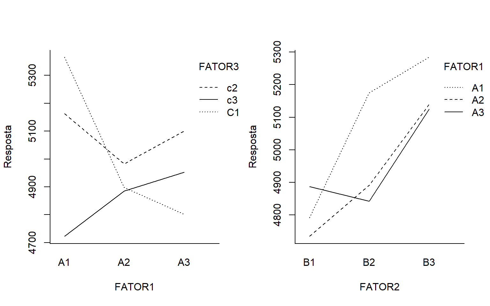

```r
interaction.plot(FATOR2,FATOR3,RESP, ylab="Resposta")
interaction.plot(FATOR3,FATOR2,RESP, ylab="Resposta")
```


<br>

## Análise de variância


```r
modelo=aov(RESP~FATOR1*FATOR2*FATOR3)
anova(modelo)
```

```
## Analysis of Variance Table
## 
## Response: RESP
##                      Df  Sum Sq Mean Sq F value    Pr(>F)    
## FATOR1                2  532881  266440  2.4550  0.092230 .  
## FATOR2                2 2593572 1296786 11.9487 2.836e-05 ***
## FATOR3                2 1012836  506418  4.6662  0.012078 *  
## FATOR1:FATOR2         4  568196  142049  1.3089  0.273715    
## FATOR1:FATOR3         4 2177621  544405  5.0162  0.001158 ** 
## FATOR2:FATOR3         4  548172  137043  1.2627  0.291478    
## FATOR1:FATOR2:FATOR3  8 2255321  281915  2.5976  0.014010 *  
## Residuals            81 8790883  108529                      
## ---
## Signif. codes:  0 '***' 0.001 '**' 0.01 '*' 0.05 '.' 0.1 ' ' 1
```

O que se observa nesta análise:

 - Efeito de interação tripla: F1 x F2 x F3;
 - Efeito de interação dupla: F1 x F3;
 - Efeito isolado dos fatores F2 e F3.

<br><br>

## Pressuposições

<br>

### Normalidade dos erros

Análise gráfica e pelo teste de normalidade de Shapiro-Wilk


```r
shapiro.test(modelo$residuals)
```

```
## 
## 	Shapiro-Wilk normality test
## 
## data:  modelo$residuals
## W = 0.98386, p-value = 0.217
```

```r
hnp::hnp(modelo)
```

```
## Gaussian model (aov object)
```

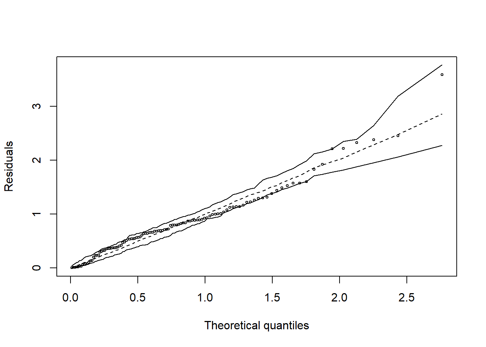

Como p-valor calculado ($p=0.217$) é menor que o nível de significância adotado ($\alpha=0.05$), não rejeita-se $H_0$. Logo, os erros podem ser considerados normais

<br>

### Homogeneidade das variâncias


```r
bartlett.test(modelo$residuals~paste(FATOR1,FATOR2,FATOR3))
```

```
## 
## 	Bartlett test of homogeneity of variances
## 
## data:  modelo$residuals by paste(FATOR1, FATOR2, FATOR3)
## Bartlett's K-squared = 26.434, df = 26, p-value = 0.4394
```

Como p-valor calculado ($p=0.4394$) é menor que o nível de significância adotado ($\alpha=0.05$), não rejeita-se $H_0$. Logo, as variâncias podem ser consideradas homogêneas.

<br>

### Independência dos erros


```r
lmtest::dwtest(modelo)
```

```
## 
## 	Durbin-Watson test
## 
## data:  modelo
## DW = 2.8115, p-value = 0.9728
## alternative hypothesis: true autocorrelation is greater than 0
```

Como p-valor calculado ($p=0.9728$) é menor que o nível de significância adotado ($\alpha=0.05$), não rejeita-se $H_0$. Logo, os erros podem ser considerados independentes.

<br>

### Gráfico de residuos padronizados


```r
a=anova(modelo)
plot(modelo$residuals/sqrt(a$`Mean Sq`[7]),
     ylab="Resíduos padronizados",
     pch=16,
     las=1,
     col="red")
abline(h=c(0,3,-3),
       lty=2,
       col="blue")
```

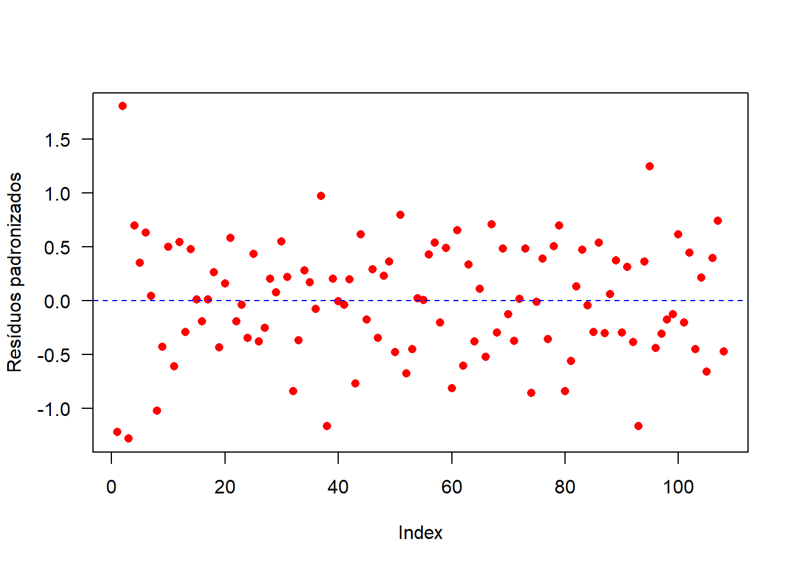

<br><br>

## Teste de comparação 

<br>

### Pacote ExpDes.pt


```r
library(ExpDes.pt)
fat3.dic(FATOR1,FATOR2,FATOR3,RESP)
```

```
## ------------------------------------------------------------------------
## Legenda:
## FATOR 1:  F1 
## FATOR 2:  F2 
## FATOR 3:  F3 
## ------------------------------------------------------------------------
## 
## ------------------------------------------------------------------------
## Quadro da analise de variancia
## ------------------------------------------------------------------------
##           GL         SQ            QM      Fc  Pr>Fc
## F1         2   532880.7  266440.36564   2.455 0.0922
## F2         2  2593572.1 1296786.06573 11.9487      0
## F3         2  1012836.0  506417.98458  4.6662 0.0121
## F1*F2      4   568195.7  142048.92116  1.3089 0.2737
## F1*F3      4  2177620.9  544405.22841  5.0162 0.0012
## F2*F3      4   548172.3  137043.08275  1.2627 0.2915
## F1*F2*F3   8  2255321.1   281915.1382  2.5976  0.014
## Residuo   81  8790882.9  108529.41824               
## Total    107 18479481.7                             
## ------------------------------------------------------------------------
## CV = 0.03 %
## 
## ------------------------------------------------------------------------
## Teste de normalidade dos residuos (Shapiro-Wilk)
## valor-p:  0.2169645 
## De acordo com o teste de Shapiro-Wilk a 5% de significancia, os residuos podem ser considerados normais.
## ------------------------------------------------------------------------
## 
## 
## 
## Interacao F1*F2*F3  significativa: desdobrando a interacao
## ------------------------------------------------------------------------
## 
## Desdobrando  F1  dentro de cada nivel de  F2 e F3 
## ------------------------------------------------------------------------
## ------------------------------------------------------------------------
## Quadro da analise de variancia
## ------------------------------------------------------------------------
##           GL         SQ        QM       Fc    Pr>Fc
## F1: B1 C1  2 1515236.80 757618.40 6.980765 0.001596
## F1: B1 c2  2  110556.18  55278.09 0.509337 0.602805
## F1: B1 c3  2 1100604.58 550302.29 5.070536 0.008418
## F1: B2 C1  2 1485001.57 742500.78  6.84147 0.001797
## F1: B2 c2  2  509409.88 254704.94 2.346875 0.102142
## F1: B2 c3  2  195182.15  97591.07 0.899213 0.410912
## F1: B3 C1  2  355299.69 177649.85 1.636882 0.200956
## F1: B3 c2  2   63027.18  31513.59 0.290369 0.748763
## F1: B3 c3  2  199700.39  99850.20 0.920029 0.402631
## Residuo   81 8790882.88 108529.42                  
## ------------------------------------------------------------------------
## 
## 
## 
##  F1  dentro da combinacao dos niveis  B1  de  F2  e  C1  de  F3 
## ------------------------------------------------------------------------
## Teste de Tukey
## ------------------------------------------------------------------------
## Grupos Tratamentos Medias
## a 	 A1 	 5246.363 
##  b 	 A3 	 4578.007 
##  b 	 A2 	 4429.288 
## ------------------------------------------------------------------------
## 
## 
##  F1  dentro da combinacao dos niveis  B1  de  F2  e  c2  de  F3 
## 
## De acordo com o teste F, as medias desse fator sao estatisticamente iguais.
## ------------------------------------------------------------------------
##     Niveis     Medias
## 1       A1   4792.932
## 2       A2   4927.000
## 3       A3   5027.233
## ------------------------------------------------------------------------
## 
## 
##  F1  dentro da combinacao dos niveis  B1  de  F2  e  c3  de  F3 
## ------------------------------------------------------------------------
## Teste de Tukey
## ------------------------------------------------------------------------
## Grupos Tratamentos Medias
## a 	 A3 	 5056.61 
## ab 	 A2 	 4847.748 
##  b 	 A1 	 4335.73 
## ------------------------------------------------------------------------
## 
## 
##  F1  dentro da combinacao dos niveis  B2  de  F2  e  C1  de  F3 
## ------------------------------------------------------------------------
## Teste de Tukey
## ------------------------------------------------------------------------
## Grupos Tratamentos Medias
## a 	 A1 	 5286.368 
## a 	 A2 	 5125.075 
##  b 	 A3 	 4472.67 
## ------------------------------------------------------------------------
## 
## 
##  F1  dentro da combinacao dos niveis  B2  de  F2  e  c2  de  F3 
## 
## De acordo com o teste F, as medias desse fator sao estatisticamente iguais.
## ------------------------------------------------------------------------
##     Niveis     Medias
## 1       A1   5389.980
## 2       A2   4889.233
## 3       A3   5085.130
## ------------------------------------------------------------------------
## 
## 
##  F1  dentro da combinacao dos niveis  B2  de  F2  e  c3  de  F3 
## 
## De acordo com o teste F, as medias desse fator sao estatisticamente iguais.
## ------------------------------------------------------------------------
##     Niveis     Medias
## 1       A1   4847.222
## 2       A2   4658.573
## 3       A3   4968.540
## ------------------------------------------------------------------------
## 
## 
##  F1  dentro da combinacao dos niveis  B3  de  F2  e  C1  de  F3 
## 
## De acordo com o teste F, as medias desse fator sao estatisticamente iguais.
## ------------------------------------------------------------------------
##     Niveis     Medias
## 1       A1   5561.840
## 2       A2   5140.382
## 3       A3   5355.302
## ------------------------------------------------------------------------
## 
## 
##  F1  dentro da combinacao dos niveis  B3  de  F2  e  c2  de  F3 
## 
## De acordo com o teste F, as medias desse fator sao estatisticamente iguais.
## ------------------------------------------------------------------------
##     Niveis     Medias
## 1       A1   5305.762
## 2       A2   5131.625
## 3       A3   5188.823
## ------------------------------------------------------------------------
## 
## 
##  F1  dentro da combinacao dos niveis  B3  de  F2  e  c3  de  F3 
## 
## De acordo com o teste F, as medias desse fator sao estatisticamente iguais.
## ------------------------------------------------------------------------
##     Niveis     Medias
## 1       A1   4984.855
## 2       A2   5147.488
## 3       A3   4831.542
## ------------------------------------------------------------------------
## 
## 
## 
## Desdobrando  F2  dentro de cada nivel de  F1 e F3 
## ------------------------------------------------------------------------
## ------------------------------------------------------------------------
## Quadro da analise de variancia
## ------------------------------------------------------------------------
##           GL         SQ        QM       Fc    Pr>Fc
## F2: A1 C1  2  236015.40 118007.70 1.087334 0.341983
## F2: A1 c2  2  835403.88 417701.94 3.848744 0.025307
## F2: A1 c3  2  935907.40 467953.70 4.311768 0.016617
## F2: A2 C1  2 1320014.22 660007.11 6.081366 0.003462
## F2: A2 c2  2  136069.20  68034.60 0.626877 0.536829
## F2: A2 c3  2  486225.50 243112.75 2.240063 0.113007
## F2: A3 C1  2 1859098.18 929549.09  8.56495 0.000422
## F2: A3 c2  2   53620.78  26810.39 0.247033 0.781701
## F2: A3 c3  2  102906.69  51453.35 0.474096 0.624164
## Residuo   81 8790882.88 108529.42                  
## ------------------------------------------------------------------------
## 
## 
## 
##  F2  dentro da combinacao dos niveis  A1  de  F1  e  C1  de  F3 
## 
## De acordo com o teste F, as medias desse fator sao estatisticamente iguais.
## ------------------------------------------------------------------------
##     Niveis     Medias
## 1       B1   5246.363
## 2       B2   5286.368
## 3       B3   5561.840
## ------------------------------------------------------------------------
## 
## 
##  F2  dentro da combinacao dos niveis  A1  de  F1  e  c2  de  F3 
## ------------------------------------------------------------------------
## Teste de Tukey
## ------------------------------------------------------------------------
## Grupos Tratamentos Medias
## a 	 B2 	 5389.98 
## ab 	 B3 	 5305.762 
##  b 	 B1 	 4792.932 
## ------------------------------------------------------------------------
## 
## 
##  F2  dentro da combinacao dos niveis  A1  de  F1  e  c3  de  F3 
## ------------------------------------------------------------------------
## Teste de Tukey
## ------------------------------------------------------------------------
## Grupos Tratamentos Medias
## a 	 B3 	 4984.855 
## ab 	 B2 	 4847.222 
##  b 	 B1 	 4335.73 
## ------------------------------------------------------------------------
## 
## 
##  F2  dentro da combinacao dos niveis  A2  de  F1  e  C1  de  F3 
## ------------------------------------------------------------------------
## Teste de Tukey
## ------------------------------------------------------------------------
## Grupos Tratamentos Medias
## a 	 B3 	 5140.382 
## a 	 B2 	 5125.075 
##  b 	 B1 	 4429.288 
## ------------------------------------------------------------------------
## 
## 
##  F2  dentro da combinacao dos niveis  A2  de  F1  e  c2  de  F3 
## 
## De acordo com o teste F, as medias desse fator sao estatisticamente iguais.
## ------------------------------------------------------------------------
##     Niveis     Medias
## 1       B1   4927.000
## 2       B2   4889.233
## 3       B3   5131.625
## ------------------------------------------------------------------------
## 
## 
##  F2  dentro da combinacao dos niveis  A2  de  F1  e  c3  de  F3 
## 
## De acordo com o teste F, as medias desse fator sao estatisticamente iguais.
## ------------------------------------------------------------------------
##     Niveis     Medias
## 1       B1   4847.748
## 2       B2   4658.573
## 3       B3   5147.488
## ------------------------------------------------------------------------
## 
## 
##  F2  dentro da combinacao dos niveis  A3  de  F1  e  C1  de  F3 
## ------------------------------------------------------------------------
## Teste de Tukey
## ------------------------------------------------------------------------
## Grupos Tratamentos Medias
## a 	 B3 	 5355.302 
##  b 	 B1 	 4578.007 
##  b 	 B2 	 4472.67 
## ------------------------------------------------------------------------
## 
## 
##  F2  dentro da combinacao dos niveis  A3  de  F1  e  c2  de  F3 
## 
## De acordo com o teste F, as medias desse fator sao estatisticamente iguais.
## ------------------------------------------------------------------------
##     Niveis     Medias
## 1       B1   5027.233
## 2       B2   5085.130
## 3       B3   5188.823
## ------------------------------------------------------------------------
## 
## 
##  F2  dentro da combinacao dos niveis  A3  de  F1  e  c3  de  F3 
## 
## De acordo com o teste F, as medias desse fator sao estatisticamente iguais.
## ------------------------------------------------------------------------
##     Niveis     Medias
## 1       B1   5056.610
## 2       B2   4968.540
## 3       B3   4831.542
## ------------------------------------------------------------------------
## 
## Desdobrando  F3  dentro de cada nivel de  F1 e F2 
## ------------------------------------------------------------------------
## ------------------------------------------------------------------------
## Quadro da analise de variancia
## ------------------------------------------------------------------------
##           GL           SQ          QM       Fc    Pr>Fc
## F3: A1 B1  2 1658512.5880 829256.2940 7.640843 0.000912
## F3: A1 B2  2  664226.1133 332113.0567  3.06012 0.052338
## F3: A1 B3  2  668625.3330 334312.6665 3.080388 0.051362
## F3: A2 B1  2  572143.2840 286071.6420  2.63589 0.077796
## F3: A2 B2  2  435267.0706 217633.5353 2.005295 0.141249
## F3: A2 B3  2     505.0583    252.5292 0.002327 0.997676
## F3: A3 B1  2  575635.3215 287817.6608 2.651978  0.07663
## F3: A3 B2  2  846116.7155 423058.3577 3.898098 0.024192
## F3: A3 B3  2  572918.8352 286459.4176 2.639463 0.077536
## Residuo   81 8790882.8771 108529.4182                  
## ------------------------------------------------------------------------
## 
## 
## 
##  F3  dentro da combinacao dos niveis  A1  de  F1  e  B1  de  F2 
## ------------------------------------------------------------------------
## Teste de Tukey
## ------------------------------------------------------------------------
## Grupos Tratamentos Medias
## a 	 C1 	 5246.363 
## ab 	 c2 	 4792.932 
##  b 	 c3 	 4335.73 
## ------------------------------------------------------------------------
## 
## 
##  F3  dentro da combinacao dos niveis  A1  de  F1  e  B2  de  F2 
## 
## De acordo com o teste F, as medias desse fator sao estatisticamente iguais.
## ------------------------------------------------------------------------
##     Niveis     Medias
## 1       C1   5286.368
## 2       c2   5389.980
## 3       c3   4847.222
## ------------------------------------------------------------------------
## 
## 
##  F3  dentro da combinacao dos niveis  A1  de  F1  e  B3  de  F2 
## 
## De acordo com o teste F, as medias desse fator sao estatisticamente iguais.
## ------------------------------------------------------------------------
##     Niveis     Medias
## 1       C1   5561.840
## 2       c2   5305.762
## 3       c3   4984.855
## ------------------------------------------------------------------------
## 
## 
##  F3  dentro da combinacao dos niveis  A2  de  F1  e  B1  de  F2 
## 
## De acordo com o teste F, as medias desse fator sao estatisticamente iguais.
## ------------------------------------------------------------------------
##     Niveis     Medias
## 1       C1   4429.288
## 2       c2   4927.000
## 3       c3   4847.748
## ------------------------------------------------------------------------
## 
## 
##  F3  dentro da combinacao dos niveis  A2  de  F1  e  B2  de  F2 
## 
## De acordo com o teste F, as medias desse fator sao estatisticamente iguais.
## ------------------------------------------------------------------------
##     Niveis     Medias
## 1       C1   5125.075
## 2       c2   4889.233
## 3       c3   4658.573
## ------------------------------------------------------------------------
## 
## 
##  F3  dentro da combinacao dos niveis  A2  de  F1  e  B3  de  F2 
## 
## De acordo com o teste F, as medias desse fator sao estatisticamente iguais.
## ------------------------------------------------------------------------
##     Niveis     Medias
## 1       C1   5140.382
## 2       c2   5131.625
## 3       c3   5147.488
## ------------------------------------------------------------------------
## 
## 
##  F3  dentro da combinacao dos niveis  A3  de  F1  e  B1  de  F2 
## 
## De acordo com o teste F, as medias desse fator sao estatisticamente iguais.
## ------------------------------------------------------------------------
##     Niveis     Medias
## 1       C1   4578.007
## 2       c2   5027.233
## 3       c3   5056.610
## ------------------------------------------------------------------------
## 
## 
##  F3  dentro da combinacao dos niveis  A3  de  F1  e  B2  de  F2 
## ------------------------------------------------------------------------
## Teste de Tukey
## ------------------------------------------------------------------------
## Grupos Tratamentos Medias
## a 	 c2 	 5085.13 
## ab 	 c3 	 4968.54 
##  b 	 C1 	 4472.67 
## ------------------------------------------------------------------------
## 
## 
##  F3  dentro da combinacao dos niveis  A3  de  F1  e  B3  de  F2 
## 
## De acordo com o teste F, as medias desse fator sao estatisticamente iguais.
## ------------------------------------------------------------------------
##     Niveis     Medias
## 1       C1   5355.302
## 2       c2   5188.823
## 3       c3   4831.542
## ------------------------------------------------------------------------
```

<br>

### Pacote easyanova


```r
library(easyanova)
ea2(data.frame(FATOR1,FATOR2,FATOR3,RESP),design = 7)
```

**Obs.** Em função da saída extensa da *package* easyanova, foi ocultado o resultado do mesmo.

<br>

## Tabela Final

<br>

**Sugestão de tabela**

+---------------+---------------+------------------------------+------------------------------+------------------------------+
| FATOR1        | FATOR 2       |                              | FATOR 3                      |                              |
+===============+===============+==============================+==============================+==============================+
|               |               | C1                           | C2                           | C3                           |
+---------------+---------------+------------------------------+------------------------------+------------------------------+
|               | - B1           - 5245,36 *a*aA                  - 4335,73 *b*bB                  - 4792,93 *a*aAB             |
| A1            | - B2           - 5286,37 *a*aA                  - 4847,22 *a*abA                 - 5389,98 *a*aA              |
|               | - B3           - 5561,84 *a*aA                  - 4984,86 *a*aA                  - 5305,76 *a*abA             |
+---------------+---------------+------------------------------+------------------------------+------------------------------+
|               | - B1           - 4429,29 *b*bA                  - 4847,75 *ab*aA                 - 4927,00 *a*aA              |
| A2            | - B2           - 5125,08 *a*aA                  - 4658,57 *a*aA                  - 4889,23 *a*aA              |
|               | - B3           - 5140,38 *a*aA                  - 5147,49 *a*aA                  - 5131,63 *a*aA              |
+---------------+---------------+------------------------------+------------------------------+------------------------------+
|               | - B1           - 4578,00 *b*bA                  - 5056,61 *a*aA                  - 5027,23 *a*aA              |
| A3            | - B2           - 4472,67 *b*bB                  - 4968,54 *a*aAB                 - 5085,13 *a*aA              |
|               | - B3           - 5355,30 *a*aA                  - 4831,54 *a*aA                  - 5188,82 *a*aA              |
+---------------+---------------+------------------------------+------------------------------+------------------------------+
|- F1           | - 0,0922$^{ns}$                                                                                            |
|- F2           | - 0,0000$^{**}$                                                                                           |
|- F3           | - 0,0121$^*$                                                                                               |
|- F1xF2        | - 0,2737$^{ns}$                                                                                            |
|- F1xF3        | - 0,0012$^{**}$                                                                                            |
|- F1xF3        | - 0,2915$^{ns}$                                                                                            |
|- F1xF2xF3     | - 0,0140$^*$                                                                                               |
+---------------+---------------+------------------------------+------------------------------+------------------------------+

Médias seguidas de mesma letra maiúscula na linha, minúscula em itálico dentro dos níveis do Fator 2, e minúsculo dentro dos níveis do Fator 1 não diferem pelo teste de Tukey ($p\leqslant 0,05$). $^*,^{**},^{ns}$, significativo a 5%, 1% e não significativo pelo teste F.

<br><br><br><br>

# Esquema de Parcelas Subdivididas

****

<br><br><br><br>

- Tal como no caso de fatorial, o termo parcelas subdivididas não se refere a um tipo de delineamento e sim ao esquema do experimento, ou seja, a maneira pela qual os tratamentos são organizados.
- Nos experimentos em parcelas subdivididas, em geral, estuda-se simultaneamente dois tipos de fatores os quais são geralmente denominados de fatores primários e fatores secundários.
- Em um experimento em parcelas subdivididas, as unidades experimentais são agrupadas em parcelas as quais devem conter um número de unidades experimentais (subparcelas) igual ao
número de níveis do fator secundário.
- Na instalação os níveis do fator primário (A) são distribuidos às parcelas segundo um tipo de delineamento experimental: DIC, DBC, DQL.
- Posteriormente os níveis do fator secundário (B) são distribuídos ao acaso às subparcerlas de cada parcela.Tal disposição permite obter uma estimativa geral de maior precisão para os efeitos dos tratamentos do segundo fator.
- Nos experimentos em parcelas subdivididas tem-se dois resíduos distintos: um correspondente às parcelas e outro às subparcelas dentro das parcelas.
- Em casos mais complexos, as subparcelas podem, também, ser repartidas em subsubparcelas. Tem-se, neste caso, três resíduos distintos:
  - resíduo (a), referente às parcelas;
  - resíduo (b), à subparcelas e
  - resíduo (c), correspondendo às subsubparcelas.

<br>

****

## Vantagens

****

<br>

a) Em comparação com experimentos fatoriais, experimentos em parcelas subdivididas são mais fáceis de instalar;

b) Quando os tratamentos associados aos níveis de um dos fatores exigem maior quantidade de material na unidade experimental do que os tratamentos do outro fator.

c) O esquema pode ser utilizado quando um fator adicional é incorporado num experimento, para ampliar seu objetivo.

d) Através da prévia informação, sabe-se que maiores diferenças podem ser esperadas entre os níveis de um certo fator do que entre os níveis do outro fator.

<br>

****

## Desvantagens

****

<br>

a) Do ponto de vista estatístico, os fatoriais são, em geral, mais eficientes que os em parcelas subdivididas;

b) Enquanto nos fatoriais temos um são resíduo para todos os F e comparações de médias, no *"split-plot"* há dois resíduos, um para comparações de parcelas e outro para subparcelas;

c) Para parcela, o número de GL geralmente é pequeno, levando à pouca sensibilidade na análise;

d) Sempre que possível, é preferível utilizar experimentos fatoriais em lugar dos experimentos em parcelas subdivididas.

<br>

****

## Modelo estatístico

****

<br>

O modelo linear para o experimento em parcelas subdivididas no delineamento em blocos ao acaso é dado por:

<center>

$yijk = \mu+\tau_{i}+\gamma_{k}+(\tau\gamma)_{ik}+\beta_{j}+(\tau\beta)_{ij}+(\tau\beta\gamma)_{ijk}$

</center>

- i = 1; 2; : : : ; a
- j = 1; 2; : : : ; b
- k = 1; 2; : : : ; r

em que:

- $y_{ijk}$ é o valor observado no i-ésimo tratamento, k-ésimo bloco e j-ésima subparcela;
- $\mu$ é uma constante;
- $\tau_{i}$ é o efeito do i-ésimo fator A;
- $\gamma_{k}$ é o efeito do k-ésimo bloco;
- $(\tau\gamma)_{ik}$ é o resíduo (a) da parcela;
- $\beta_{j}$ é o efeito do j-ésimo fator B;
- $(\tau\beta)_ij$ é a interação entre o i-ésimo fator A e o j-ésimo fator B;
- $(\tau\beta\gamma)ijk$ é o resíduo (b) da subparcela;

<br>

****

## Hipóteses e modelo

****

<br>

No experimento em parcelas subdivididas com 2 fatores, deseja-se testar a signicância de ambos os fatores. Há interesse em testar hipóteses sobre a igualdade dos efeitos do fator primário, isto é:

\begin{eqnarray*}
\left\{
\begin{array}{ll}
H_0: & \mu_1 = \mu_2 = \mu_3 = \cdots = \mu_{a} \\[.2cm]
H_1: & \mu_i \neq \mu_i' \qquad i \neq i'.
\end{array}
\right.
\end{eqnarray*}

e a igualdade nos efeitos do fator secundário, ou seja:

\begin{eqnarray*}
\left\{
\begin{array}{ll}
H_0: & \mu_1 = \mu_2 = \mu_3 = \cdots = \mu_{b} \\[.2cm]
H_1: & \mu_i \neq \mu_i' \qquad i \neq i'.
\end{array}
\right.
\end{eqnarray*}

e, ainda, se há interação entre os fatores:

\begin{eqnarray*}
\left\{
\begin{array}{ll}
H_0: & (\tau\beta)ij = 0 \mbox{para todo} i ; j \\[.2cm]
H_1: & \mbox{Pelo menos um} (\tau\beta)ij \neq 0
\end{array}
\right.
\end{eqnarray*}

CV             | G.L.         |S.Q.             |Q.M.                              |  Fcalc 
--------------:|:---------:|:-------------:|:-------------------------:|:------------------------:|:-------------
Bloco          | $r-1$        | $SQ_{Bloc}$     | $\frac{SQ_{Bloc}}{r-1}$          | $\frac{QM_{Bloc}}{QM_{Res(a)}}$
Tratamento A   | $a - 1$      | $SQ_{A}$        | $\frac{SQ_{A}}{a-1}$             | $\frac{QM_{A}}{QM_{Res(a)}}$ 
resíduo A      | $(a-1)(r-1)$ | $SQ_{Res(A)}$   | $\frac{SQ_{res(A)}}{(a-1)(r-1)}$ | 
Parcelas       | $ar-1$       | $SQ_{Parcelas}$ |  -                               |        
Tratamento B   | $b-1$        | $SQ_{B}$        | $\frac{SQ_{B}}{b-1}$             | $\frac{QM_{B}}{QM_{Res(b)}}$
Interação A x B | $(a-1)(b-1)$ | $SQ_{AxB}$      | $\frac{SQ_{AB}}{(a-1)(b-1)}$     | $\frac{QM_{AxB}}{QM_{Res(b)}}$
resíduo B      | $a(a-1)(r-1)$| $SQ_{Res(B)}$   | $\frac{SQ_{Res(b)}}{(r-1)(b-1)}$ | 
Total          | $abr-1$      | $SQ_{Total}$    | -                                | 

<br>

****

## Croqui em DIC

****

<br>

Criando uma função para fazer um croqui (Número de coluna igual número de repetições)


```r
# Não alterar os comandos da função
library(agricolae)
library(gridExtra)
library(grid)
croqui=function(trat,trat1,r){
  sort=design.split(trat,trat1,r,design = "crd",serie=0)
  sort$book$trat=as.vector(matrix(paste(sort$book$trat,sort$book$trat1),nrow =r,byrow=T))
  ncol=r
  sort$book$trat=as.factor(sort$book$trat)
  gs <- lapply(sort$book$trat, function(ii)
    grobTree(rectGrob(gp=gpar(fill=ii, alpha=0.5)),textGrob(ii)))
  grid.arrange(grobs=gs, ncol=ncol)}
```

<br>

Vetor de tratamentos


```r
trat=c("A1","A2")
trat1=c("B1","B2","B3")
```

<br>

Usando a função


```r
croqui(trat,trat1,r=2)
```


<br>

Criando uma função para fazer um croqui (Número de colunas igual número de tratamentos)


```r
# Não alterar os comandos da função
library(agricolae)
library(gridExtra)
library(grid)
croqui=function(trat,trat1,r){
  sort=design.split(trat,trat1,r,design = "crd",serie=0)
  sort$book$trat=as.vector(t(matrix(paste(sort$book$trat,sort$book$trat1),nrow =r, byrow=T)))
  sort$book$trat=as.factor(sort$book$trat)
  ncol=length(levels(sort$book$trat))
  gs <- lapply(sort$book$trat, function(ii)
    grobTree(rectGrob(gp=gpar(fill=ii, alpha=0.5)),textGrob(ii)))
  grid.arrange(grobs=gs, ncol=ncol)}
```

<br>

Vetor de tratamentos


```r
trat=c("A1","A2")
trat1=c("B1","B2","B3")
```

<br>

Usando a função


```r
croqui(trat,trat1,r=2)
```


<br><br>

****

## Croqui em DBC

****

<br>

Criando uma função para fazer um croqui (Número de coluna igual número de repetições)


```r
# Não alterar os comandos da função
library(agricolae)
library(gridExtra)
library(grid)
croqui=function(trat,trat1,r){
  sort=design.split(trat,trat1,r,design = "rcbd",serie=0)
  sort$book$trat=as.vector(matrix(paste(sort$book$trat,sort$book$trat1),nrow =r,byrow=T))
  ncol=r
  sort$book$trat=as.factor(sort$book$trat)
  gs <- lapply(sort$book$trat, function(ii)
    grobTree(rectGrob(gp=gpar(fill=ii, alpha=0.5)),textGrob(ii)))
  grid.arrange(grobs=gs, ncol=ncol)}
```

<br>

Vetor de tratamentos


```r
trat=c("A1","A2")
trat1=c("B1","B2","B3")
```

<br>

Usando a função


```r
croqui(trat,trat1,r=2)
```


<br>

Criando uma função para fazer um croqui (Número de colunas igual número de tratamentos)


```r
# Não alterar os comandos da função
library(agricolae)
library(gridExtra)
library(grid)
croqui=function(trat,trat1,r){
  sort=design.split(trat,trat1,r,design = "rcbd",serie=0)
  sort$book$trat=as.vector(t(matrix(paste(sort$book$trat,sort$book$trat1),nrow =r, byrow=T)))
  sort$book$trat=as.factor(sort$book$trat)
  ncol=length(levels(sort$book$trat))
  gs <- lapply(sort$book$trat, function(ii)
    grobTree(rectGrob(gp=gpar(fill=ii, alpha=0.5)),textGrob(ii)))
  grid.arrange(grobs=gs, ncol=ncol)}
```

<br>

Vetor de tratamentos


```r
trat=c("A1","A2")
trat1=c("B1","B2","B3")
```

<br>

Usando a função


```r
croqui(trat,trat1,r=2)
```


****

## Exemplo 1

****

<br>

Um experimento foi realizado com o intuito de avaliar 5 tratamentos na linha e entrelinha de um pomar. O experimento foi instalado em Delineamento em blocos casualizados com 12 repetições por tratamento. Foi analisado o carbono da biomassa microbiana (CBM).


```r
RESP=c(224.92, 180.32, 130.19, 110.31, 163.74,193.03, 211.49, 137.65, 127.15, 203.39,
       182.36, 124.75, 177.70, 231.01, 202.14,214.89, 198.42, 267.85, 207.67, 176.74,
       162.18, 124.59, 158.99, 209.12, 128.14,113.95, 215.53, 190.51, 174.58, 148.70,
       150.90, 209.03, 210.40, 199.03, 237.05,196.97, 176.06, 263.27, 240.19, 160.72,
       239.90, 188.07, 251.35, 215.45, 198.50,271.42, 226.56, 217.65, 213.69, 101.26,
       115.41, 140.10, 117.67, 106.45, 139.34,104.22, 206.13, 195.89, 147.11, 122.93,
       176.55, 173.63, 112.83, 184.82, 178.18, 115.85, 183.89, 134.92, 086.49, 103.96,
       096.33, 091.64, 157.76, 107.45, 106.61, 095.28, 152.37, 066.02, 125.75, 075.34,
       088.64, 104.00, 066.38, 084.74, 101.76,173.70, 101.24, 143.71, 119.88, 157.79,
       070.42, 152.75, 111.65, 153.08, 146.64,142.57, 098.96, 065.92, 065.62, 063.26,
       095.72, 084.14, 054.92, 090.49, 112.11,102.68, 144.77, 122.58, 125.14, 127.61,
       117.14, 147.87, 156.18, 154.82, 183.91,159.11, 155.41, 184.55, 121.39, 155.77)
FATOR1=rep(rep(c("L","EL"), e=12),5); FATOR1=factor(FATOR1)
FATOR2=rep(c(paste("T",1:5)),e=24); FATOR2=factor(FATOR2)
repe=rep(c(paste("R",1:12)),10); repe=factor(repe)
dados = data.frame(FATOR1,FATOR2,repe,RESP)
```

<br><br>

## Estatística descritiva


```r
"Média" = with(dados, mean(RESP))
"Variância" = with(dados, var(RESP))
Desvio = with(dados, sd(RESP))
CV = Desvio / Média * 100

desc = cbind(Média, Variância, Desvio, CV)
rownames(desc) = 'CBM'
kable(round(desc,2), align="l", format="pandoc", format.args = list(big.mark="."))
```

      Média    Variância   Desvio   CV   
----  -------  ----------  -------  -----
CBM   151.58   2.547.35    50.47    33.3 

<br>

### Fator 1 (Linha e Entrelinha)


```r
Médias1 = with(dados, tapply(RESP, FATOR1, mean))
Variâncias1 = with(dados, tapply(RESP, FATOR1, var))
Desvios1 = with(dados, tapply(RESP, FATOR1, sd))
CV1 = Desvios1 / Médias1 * 100
Desc1 = cbind(Médias1, Variâncias1, Desvios1, CV1)
kable(round(Desc1,2),align="l")
```

     Médias1   Variâncias1   Desvios1   CV1   
---  --------  ------------  ---------  ------
EL   166.39    2297.00       47.93      28.80 
L    136.76    2394.44       48.93      35.78 

<br>

### Fator 2 (Manejo)


```r
Médias2 = with(dados, tapply(RESP, FATOR2, mean))
Variâncias2 = with(dados, tapply(RESP, FATOR2, var))
Desvios2 = with(dados, tapply(RESP, FATOR2, sd))
CV2 = Desvios2 / Médias2 * 100
Desc2 = cbind(Médias2, Variâncias2, Desvios2, CV2)
kable(round(Desc2,2),align="l")
```

      Médias2   Variâncias2   Desvios2   CV2   
----  --------  ------------  ---------  ------
T 1   180.03    1599.93       40.00      22.22 
T 2   201.00    1678.32       40.97      20.38 
T 3   139.55    1560.41       39.50      28.31 
T 4   116.90    1085.31       32.94      28.18 
T 5   120.42    1443.94       38.00      31.56 

<br>

### Repetição


```r
Médias4 = with(dados, tapply(RESP, repe, mean))
Variâncias4 = with(dados, tapply(RESP, repe, var))
Desvios4 = with(dados, tapply(RESP, repe, sd))
CV4 = Desvios4/ Médias4 * 100
Desc4 = cbind(Médias4, Variâncias4, Desvios4, CV4)
kable(round(Desc4,2),align="l")
```

       Médias4   Variâncias4   Desvios4   CV4   
-----  --------  ------------  ---------  ------
R 1    158.07    1917.57       43.79      27.70 
R 10   164.26    3154.85       56.17      34.19 
R 11   152.76    2803.26       52.95      34.66 
R 12   146.87    2228.39       47.21      32.14 
R 2    153.81    3815.91       61.77      40.16 
R 3    140.69    3301.19       57.46      40.84 
R 4    145.15    2131.01       46.16      31.80 
R 5    159.66    1780.25       42.19      26.43 
R 6    148.27    3522.03       59.35      40.03 
R 7    157.96    3902.06       62.47      39.54 
R 8    145.57    2218.76       47.10      32.36 
R 9    145.87    2264.97       47.59      32.63 

<br>

### Juntando os fatores


```r
Médias3 = with(dados, tapply(RESP, list(FATOR1,FATOR2), mean))
Variâncias3 = with(dados, tapply(RESP, list(FATOR1,FATOR2), var))
Desvios3 = with(dados, tapply(RESP, list(FATOR1,FATOR2), sd))
CV3 = Desvios3/Médias3 * 100
Desc3 = rbind(Médias3, Variâncias3, Desvios3, CV3)
rownames(Desc3)=c("Média.L","Média.EL","Variância.L","Variância.EL", "Desvio.L","Desvio.EL", "CV.L","CV.EL")
kable(round(Desc3,2),align="l")
```

               T 1       T 2       T 3       T 4      T 5    
-------------  --------  --------  --------  -------  -------
Média.L        194.28    220.76    136.59    131.27   149.07 
Média.EL       165.78    181.23    142.52    102.53   91.76  
Variância.L    1398.17   1208.34   1588.68   904.49   505.68 
Variância.EL   1504.10   1448.57   1654.85   914.33   721.90 
Desvio.L       37.39     34.76     39.86     30.07    22.49  
Desvio.EL      38.78     38.06     40.68     30.24    26.87  
CV.L           19.25     15.75     29.18     22.91    15.08  
CV.EL          23.39     21.00     28.54     29.49    29.28  

<br><br>

## Gráficos exploratórios

<br>

### Gráfico de caixas (*Boxplot*)

<br>

#### Fator 1


```r
caixas=with(dados, car::Boxplot(RESP ~ FATOR1, vertical=T,las=1, col='Lightyellow'))
points(Médias1, pch='+', cex=1.5, col='red')
```


<br>

#### Fator 2


```r
caixas=with(dados, car::Boxplot(RESP ~ FATOR2, vertical=T,las=1, col='Lightyellow'))
points(Médias2, pch='+', cex=1.5, col='red')
```


<br>

#### Juntando fatores


```r
caixas=with(dados, car::Boxplot(RESP ~ FATOR1*FATOR2, vertical=T,las=1, col='Lightyellow'))
```


<br>

### Interação


```r
library(gplots)
library(lattice)
with(dados, xyplot(RESP ~ FATOR1|FATOR2, groups=repe, aspect="xy", type="o", ylab='CBM',
                   strip=strip.custom(strip.names=TRUE, strip.levels=TRUE)))
```

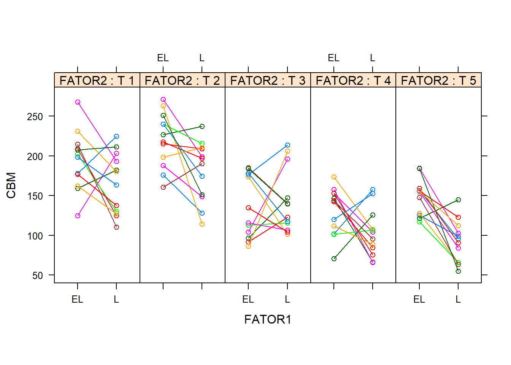


```r
with(dados, xyplot(RESP ~ FATOR1|repe, groups=FATOR2, aspect="xy", type="o", ylab='CBM',
                   strip=strip.custom(strip.names=TRUE, strip.levels=TRUE)))
```

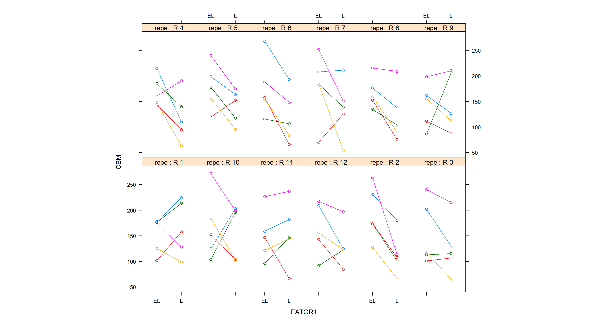


```r
with(dados, xyplot(RESP ~ FATOR2|repe, groups=FATOR1, aspect="xy", type="o", ylab='CBM',
                   strip=strip.custom(strip.names=TRUE, strip.levels=TRUE)))
```


```r
with(dados, interaction.plot(FATOR2, FATOR1, RESP, las=1, col=1:6, bty='l', 
                             xlab='', ylab='CBM', trace.label="repe"))
```


```r
# FATOR1 e FATOR2
with(dados, interaction.plot(FATOR1, FATOR2, RESP, las=1, col=1:6, bty='l', 
                             xlab='', ylab='CBM', trace.label="FATOR2"))
```

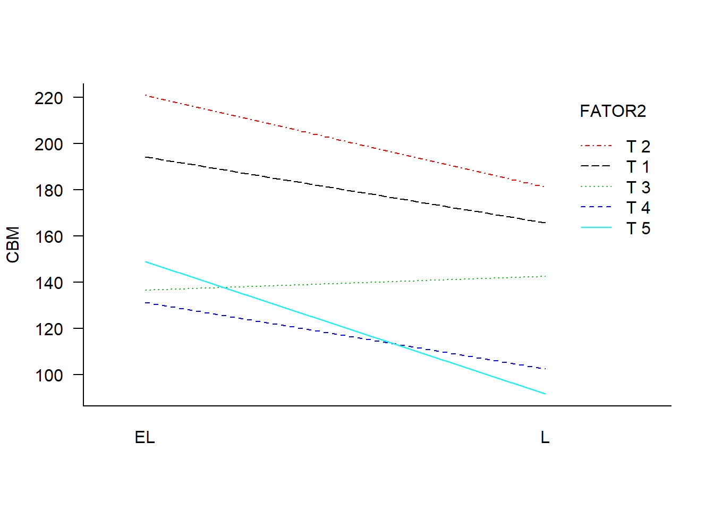

<br><br>

## Análise de Variância

\begin{eqnarray*}
\left\{
\begin{array}{ll}
H_0: & \mu_1 = \mu_2 = \mu_3 = \cdots = \mu_{a} \\[.2cm]
H_1: & \mu_i \neq \mu_i' \qquad i \neq i'.
\end{array}
\right.
\end{eqnarray*}

e a igualdade nos efeitos do fator secundário, ou seja:
\begin{eqnarray*}
\left\{
\begin{array}{ll}
H_0: & \mu_1 = \mu_2 = \mu_3 = \cdots = \mu_{b} \\[.2cm]
H_1: & \mu_i \neq \mu_i' \qquad i \neq i'.
\end{array}
\right.
\end{eqnarray*}

e, ainda, se há interação entre os fatores:

\begin{eqnarray*}
\left\{
\begin{array}{ll}
H_0: & (\tau\beta)ij = 0 \mbox{para todo} i ; j \\[.2cm]
H_1: & \mbox{Pelo menos um} (\tau\beta)ij \neq 0
\end{array}
\right.
\end{eqnarray*}


```r
mod = with(dados, aov(RESP ~ FATOR1*FATOR2+Error(repe/FATOR1)))
summary(mod)
```

```
## 
## Error: repe
##           Df Sum Sq Mean Sq F value Pr(>F)
## Residuals 11   5772   524.7               
## 
## Error: repe:FATOR1
##           Df Sum Sq Mean Sq F value Pr(>F)   
## FATOR1     1  26339   26339   12.74 0.0044 **
## Residuals 11  22748    2068                  
## ---
## Signif. codes:  0 '***' 0.001 '**' 0.01 '*' 0.05 '.' 0.1 ' ' 1
## 
## Error: Within
##               Df Sum Sq Mean Sq F value   Pr(>F)    
## FATOR2         4 133672   33418  28.882 2.47e-15 ***
## FATOR1:FATOR2  4  12783    3196   2.762   0.0325 *  
## Residuals     88 101820    1157                     
## ---
## Signif. codes:  0 '***' 0.001 '**' 0.01 '*' 0.05 '.' 0.1 ' ' 1
```

Interação significativa ($p=0,0325$)

<br>

### Usando o pacote agricolae


```r
library(agricolae)
mod.parc = with(dados, sp.plot(repe, FATOR1, FATOR2, RESP))
```

```
## 
## ANALYSIS SPLIT PLOT:  RESP 
## Class level information
## 
## FATOR1 	:  L EL 
## FATOR2 	:  T 1 T 2 T 3 T 4 T 5 
## repe 	:  R 1 R 2 R 3 R 4 R 5 R 6 R 7 R 8 R 9 R 10 R 11 R 12 
## 
## Number of observations:  120 
## 
## Analysis of Variance Table
## 
## Response: RESP
##               Df Sum Sq Mean Sq F value    Pr(>F)    
## repe          11   5772     525  0.2537  0.984072    
## FATOR1         1  26339   26339 12.7363  0.004404 ** 
## Ea            11  22748    2068                      
## FATOR2         4 133672   33418 28.8821 2.442e-15 ***
## FATOR1:FATOR2  4  12783    3196  2.7620  0.032468 *  
## Eb            88 101820    1157                      
## ---
## Signif. codes:  0 '***' 0.001 '**' 0.01 '*' 0.05 '.' 0.1 ' ' 1
## 
## cv(a) = 30 %, cv(b) = 22.4 %, Mean = 151.5785
```

<br>

### Usando o pacote easyanova


```r
ano=easyanova::ea2(data.frame(FATOR1,repe,FATOR2,RESP),design = 5)
```

```r
ano[1]
```

```
## $`Marginal anova (Type III Sum of Squares)`
##                 numDF denDF   F-value p-value
## plot                1    11 12.736294  0.0044
## split.plot          4    88 28.882103  <.0001
## block              11    11  0.253728  0.9841
## plot:split.plot     4    88  2.761997  0.0325
```

<br><br>

## Pressupostos 

<br>

### Normalidade dos erros

Uma forma de verificação é usar como esquema fatorial

\begin{eqnarray*}
\left\{
\begin{array}{ll}
H_0: \mbox{Erros seguem distribuição normal}\\[.2cm]
H_1: \mbox{Erros não seguem distribuição normal.}
\end{array}
\right.
\end{eqnarray*}


```r
mod.pres = with(dados, aov(RESP ~ repe + FATOR1*FATOR2)); summary(mod.pres)
```

```
##               Df Sum Sq Mean Sq F value   Pr(>F)    
## repe          11   5772     525   0.417   0.9455    
## FATOR1         1  26339   26339  20.933 1.38e-05 ***
## FATOR2         4 133672   33418  26.559 5.66e-15 ***
## FATOR1:FATOR2  4  12783    3196   2.540   0.0445 *  
## Residuals     99 124568    1258                     
## ---
## Signif. codes:  0 '***' 0.001 '**' 0.01 '*' 0.05 '.' 0.1 ' ' 1
```

```r
shapiro.test(mod.pres$res)
```

```
## 
## 	Shapiro-Wilk normality test
## 
## data:  mod.pres$res
## W = 0.99207, p-value = 0.7273
```

Como p-valor($p=0,7273$) é maior que o nível de significância adotado ($p=0,05$), não se rejeita $H_0$. Logo, os erros seguem distribuição normal.

<br>

### Homogeneidade de variâncias

\begin{eqnarray*}
\left\{
\begin{array}{ll}
H_0: \mbox{As variâncias dos erros são homogêneas}\\[.2cm]
H_1: \mbox{As variâncias dos erros não são homogêneas}
\end{array}
\right.
\end{eqnarray*}

<br>

#### Para Fator 1


```r
with(dados, bartlett.test(mod.pres$residuals~FATOR1))
```

```
## 
## 	Bartlett test of homogeneity of variances
## 
## data:  mod.pres$residuals by FATOR1
## Bartlett's K-squared = 0.022345, df = 1, p-value = 0.8812
```

Como p-valor($p=0,8812$) é maior que o nível de significância adotado ($p=0,05$), não se rejeita $H_0$. Logo, as variâncias dos erros são homogêneas.

<br>

#### Para Bloco


```r
with(dados, bartlett.test(mod.pres$residuals~repe))
```

```
## 
## 	Bartlett test of homogeneity of variances
## 
## data:  mod.pres$residuals by repe
## Bartlett's K-squared = 10.291, df = 11, p-value = 0.5044
```

Como p-valor($p=0,5044$) é maior que o nível de significância adotado ($p=0,05$), não se rejeita $H_0$. Logo, as variâncias dos erros são homogêneas.

<br>

#### Para Fator 2


```r
with(dados, bartlett.test(mod.pres$residuals~FATOR2))
```

```
## 
## 	Bartlett test of homogeneity of variances
## 
## data:  mod.pres$residuals by FATOR2
## Bartlett's K-squared = 6.6241, df = 4, p-value = 0.1571
```

Como p-valor($p=0,1571$) é maior que o nível de significância adotado ($p=0,05$), não se rejeita $H_0$. Logo, as variâncias dos erros são homogêneas.

<br>

#### Juntandos os fatores


```r
tratamentos=rep(c(paste("T",1:10)),e=12)
with(dados, bartlett.test(mod.pres$residuals~tratamentos))
```

```
## 
## 	Bartlett test of homogeneity of variances
## 
## data:  mod.pres$residuals by tratamentos
## Bartlett's K-squared = 8.3359, df = 9, p-value = 0.5007
```

Como p-valor($p=0,5007$) é maior que o nível de significância adotado ($p=0,05$), não se rejeita $H_0$. Logo, as variâncias dos erros são homogêneas.

<br>

### Independência dos erros

\begin{eqnarray*}
\left\{
\begin{array}{ll}
H_0: \mbox{Os erros são independentes}\\[.2cm]
H_1: \mbox{Os erros não são independentes}
\end{array}
\right.
\end{eqnarray*}


```r
library(lmtest)
dwtest(mod.pres)
```

```
## 
## 	Durbin-Watson test
## 
## data:  mod.pres
## DW = 1.9095, p-value = 0.1026
## alternative hypothesis: true autocorrelation is greater than 0
```

Como p-valor($p=0,1026$) é maior que o nível de significância adotado ($p=0,05$), não se rejeita $H_0$. Logo, os erros são independentes.

<br>

### Análise Gráfica


```r
plot(RESP-mean(RESP), pch=16, col="red")
abline(h=0, col="blue")
```


<br><br>

## Teste de comparações múltiplas

<br>

### Pelo pacote easyanova


```r
ano=easyanova::ea2(data.frame(FATOR1,repe,FATOR2,RESP),design = 5)
```

```r
ano$`Adjusted means (plot in levels of split.plot)`
```

```
## $`plot in  T 1`
##   plot.split.plot adjusted.mean standard.error tukey snk duncan t
## 1          EL.T 1       194.275        10.5643     a   a      a a
## 2           L.T 1       165.775        10.5643     a   a      a a
## 
## $`plot in  T 2`
##   plot.split.plot adjusted.mean standard.error tukey snk duncan t
## 3          EL.T 2      220.7617        10.5643     a   a      a a
## 4           L.T 2      181.2325        10.5643     b   b      b b
## 
## $`plot in  T 3`
##   plot.split.plot adjusted.mean standard.error tukey snk duncan t
## 6           L.T 3      142.5167        10.5643     a   a      a a
## 5          EL.T 3      136.5908        10.5643     a   a      a a
## 
## $`plot in  T 4`
##   plot.split.plot adjusted.mean standard.error tukey snk duncan t
## 7          EL.T 4      131.2658        10.5643     a   a      a a
## 8           L.T 4      102.5283        10.5643     a   a      a a
## 
## $`plot in  T 5`
##    plot.split.plot adjusted.mean standard.error tukey snk duncan t
## 9           EL.T 5      149.0750        10.5643     a   a      a a
## 10           L.T 5       91.7642        10.5643     b   b      b b
```

```r
ano$`Adjusted means (split.plot in levels of plot)`
```

```
## $`split.plot in  EL`
##   plot.split.plot adjusted.mean standard.error tukey snk duncan t
## 3          EL.T 2      220.7617        10.5643     a   a      a a
## 1          EL.T 1      194.2750        10.5643     a   a      a a
## 9          EL.T 5      149.0750        10.5643     b   b      b b
## 5          EL.T 3      136.5908        10.5643     b   b      b b
## 7          EL.T 4      131.2658        10.5643     b   b      b b
## 
## $`split.plot in  L`
##    plot.split.plot adjusted.mean standard.error tukey snk duncan  t
## 4            L.T 2      181.2325        10.5643     a   a      a  a
## 2            L.T 1      165.7750        10.5643    ab  ab     ab ab
## 6            L.T 3      142.5167        10.5643     b   b      b  b
## 8            L.T 4      102.5283        10.5643     c   c      c  c
## 10           L.T 5       91.7642        10.5643     c   c      c  c
```

<br>

### Pelo pacote ExpDes.pt


```r
library(ExpDes.pt)
psub2.dbc(FATOR1,FATOR2,repe,RESP)
```

<br><br><br><br>

# Polinômios Ortogonais

****

<br><br><br><br>

- A variável analisada na análise de variância nos delineamentos discutidos anteriormente pode ser qualitativa ou quantitativa.
- Uma variável quantitativa é aquela cujos níveis podem ser associados com pontos em uma escala numérica, tal como temperatura, pressão ou tempo.
- Variáveis qualitativas, por outro lado, apresentam valores que não podem ser colocados em ordem de magnitude.

<br>

****

## Teste F

****

<br>

- Se o efeito de tratamentos for significativo e, os níveis forem quantitativos, deve-se decompor os graus de liberdade dos tratamentos em regressão linear, quadrática e cúbica.
- Em situações em que os níveis da variável possuem o mesmo espaçamento, esta decomposição pode ser feita de modo simples pelo método dos polinômios ortogonais, com o auxílio de coeficientes dados em tabelas.

<br>

****

## Quadro da Análise de variância

****

<br>


CV            | G.L.        | S.Q.          | Q.M.                    | Fcalc                           | Ftab
--------------:|:-------------:|:---------------:|:-------------------------:|:---------------------------------:|:--------
Trat          | $a-1$       |$SQ_{trat}$    |$\frac{SQ_{trat}}{a-1}$  |$\frac{QM_{trat}}{QM_{Res}}$     |$F(\alpha;GL_{Trat};GL_{Res})$
  *Linear*      | 1           |$SQ_{\hat{y}L}$|$QM_{\hat{y}L}$          |$\frac{QM_{\hat{y}L}}{QM_{res}}$ |
  *Quadrático*  | 1           |$SQ_{\hat{y}Q}$|$QM_{\hat{y}Q}$          |$\frac{QM_{\hat{y}Q}}{QM_{res}}$ |
  *Cúbico*      | 1           |$SQ_{\hat{y}C}$|$QM_{\hat{y}C}$          |$\frac{QM_{\hat{y}C}}{QM_{res}}$ |
resíduo       | $a(b-1)$    |$SQ_{res}$     |$\frac{SQ_{res}}{a(b-1)}$|
Total         | $ab-1$      |$SQ_{Total}$   |                         |

<br>

****

## Exemplo 1

****

<br>

**Avaliação e Caracterização de Silagem de Triticale (X *Triticosecale* Wittimack)**

No Brasil, quando se fala em produção de volumoso conservado, logo se imagina silagem de milho ou sorgo. No entanto, em clima subtropical e temperado, silagens de cereais de inverno tornam-se uma alternativa interessante para produção dos mesmos, principalmente em situações onde culturas de verão não são possíveis de serem cultivadas.

Assim, um trabalho foi desenvolvido com o objetivo de avaliar a silagem de triticale em substituição à silagem de sorgo na alimentação de bovinos corte. O ensaio foi realizado no Laboratório de análises de Alimentos e Nutrição Animal (LANA) do Departamento de Zootecnia da Universidade Estadual de Londrina. 

Foi estudado a silagem de triticale em substituição a silagem de sorgo com os teores de 0, 25, 50, 75 e 100% de substituição à de sorgo, a fim de melhor avaliar o valor nutritivo deste volumoso. Foi realizada a determinação da matéria seca (MS). O delineamento experimental utilizado foi o inteiramente casualizado com 4 repetições.

Fonte: <http://www.uel.br/pessoal/silvano/Experimental/R/Polinomios/Sorgo_Sandra.R>

<br>

### Conjunto de dados


```r
MS=c(93.517, 93.246, 93.216, 93.224,
     93.168, 93.645, 93.640, 93.357,
     92.985, 92.644, 92.506, 92.293, 
     93.124, 93.375, 93.138, 92.678,
     92.529, 92.150, 92.603, 92.415)
AMOSTRA=c(0,0,0,0,
          25,25,25,25,
          50,50,50,50,
          75,75,75,75,
          100,100,100,100)
dados=data.frame(Amostra=factor(AMOSTRA),MS)
attach(dados)
```

<br>

### Média e Variância


```r
(meditrat=tapply(MS,AMOSTRA,mean))
```

```
##        0       25       50       75      100 
## 93.30075 93.45250 92.60700 93.07875 92.42425
```

```r
(variatrat=tapply(MS,AMOSTRA,var))
```

```
##          0         25         50         75        100 
## 0.02094492 0.05409100 0.08435000 0.08464092 0.03940758
```

<br>

## Análise de Variância

\begin{eqnarray*}
\left\{
\begin{array}{ll}
H_0: & \mu_1 = \mu_2 = \mu_3 = \cdots = \mu_{5} \\[.2cm]
H_1: & \mu_i \neq \mu_i' \qquad i \neq i'.
\end{array}
\right.
\end{eqnarray*}

<br>

## Análise de Variância para Matéria Seca


```r
mod = aov(MS ~ Amostra)
summary(mod)
```

```
##             Df Sum Sq Mean Sq F value   Pr(>F)    
## Amostra      4 3.1344  0.7836   13.82 6.42e-05 ***
## Residuals   15 0.8503  0.0567                     
## ---
## Signif. codes:  0 '***' 0.001 '**' 0.01 '*' 0.05 '.' 0.1 ' ' 1
```

<br>

## Polinômio até 4 grau


```r
mod.reg = aov(MS ~ AMOSTRA + I(AMOSTRA^2) + I(AMOSTRA^3) + I(AMOSTRA^4))
summary(mod.reg)
```

```
##              Df Sum Sq Mean Sq F value   Pr(>F)    
## AMOSTRA       1 1.8092  1.8092  31.916 4.62e-05 ***
## I(AMOSTRA^2)  1 0.0249  0.0249   0.439 0.517484    
## I(AMOSTRA^3)  1 0.0067  0.0067   0.117 0.736600    
## I(AMOSTRA^4)  1 1.2936  1.2936  22.821 0.000245 ***
## Residuals    15 0.8503  0.0567                     
## ---
## Signif. codes:  0 '***' 0.001 '**' 0.01 '*' 0.05 '.' 0.1 ' ' 1
```

<br>

## Polinômio de 3 grau


```r
mod.reg = aov(MS ~ AMOSTRA + I(AMOSTRA^2) + I(AMOSTRA^3))
summary(mod.reg)
```

```
##              Df Sum Sq Mean Sq F value  Pr(>F)   
## AMOSTRA       1 1.8092  1.8092  13.502 0.00205 **
## I(AMOSTRA^2)  1 0.0249  0.0249   0.186 0.67212   
## I(AMOSTRA^3)  1 0.0067  0.0067   0.050 0.82645   
## Residuals    16 2.1439  0.1340                   
## ---
## Signif. codes:  0 '***' 0.001 '**' 0.01 '*' 0.05 '.' 0.1 ' ' 1
```

<br>

## Polinômio de 2 grau


```r
mod.reg = aov(MS ~ AMOSTRA + I(AMOSTRA^2))
summary(mod.reg)
```

```
##              Df Sum Sq Mean Sq F value  Pr(>F)   
## AMOSTRA       1 1.8092  1.8092  14.302 0.00149 **
## I(AMOSTRA^2)  1 0.0249  0.0249   0.197 0.66285   
## Residuals    17 2.1506  0.1265                   
## ---
## Signif. codes:  0 '***' 0.001 '**' 0.01 '*' 0.05 '.' 0.1 ' ' 1
```

<br>

## Polinômio de 1 grau


```r
mod.reg = aov(MS ~ AMOSTRA)
summary(mod.reg)
```

```
##             Df Sum Sq Mean Sq F value  Pr(>F)   
## AMOSTRA      1  1.809  1.8092   14.97 0.00112 **
## Residuals   18  2.175  0.1209                   
## ---
## Signif. codes:  0 '***' 0.001 '**' 0.01 '*' 0.05 '.' 0.1 ' ' 1
```

<br>

## Coeficientes do modelo


```r
mod.reg = lm(MS ~ I(AMOSTRA) + I(AMOSTRA^2) + I(AMOSTRA^3) + I(AMOSTRA^4))
summary(mod.reg)
```

```
## 
## Call:
## lm(formula = MS ~ I(AMOSTRA) + I(AMOSTRA^2) + I(AMOSTRA^3) + 
##     I(AMOSTRA^4))
## 
## Residuals:
##      Min       1Q   Median       3Q      Max 
## -0.40075 -0.09688  0.01388  0.18094  0.37800 
## 
## Coefficients:
##                Estimate Std. Error t value Pr(>|t|)    
## (Intercept)   9.330e+01  1.190e-01 783.743  < 2e-16 ***
## I(AMOSTRA)    1.045e-01  2.659e-02   3.928 0.001341 ** 
## I(AMOSTRA^2) -6.139e-03  1.335e-03  -4.598 0.000348 ***
## I(AMOSTRA^3)  1.008e-04  2.134e-05   4.724 0.000272 ***
## I(AMOSTRA^4) -5.075e-07  1.062e-07  -4.777 0.000245 ***
## ---
## Signif. codes:  0 '***' 0.001 '**' 0.01 '*' 0.05 '.' 0.1 ' ' 1
## 
## Residual standard error: 0.2381 on 15 degrees of freedom
## Multiple R-squared:  0.7866,	Adjusted R-squared:  0.7297 
## F-statistic: 13.82 on 4 and 15 DF,  p-value: 6.422e-05
```

<br>

## Curva Estimada


```r
m1 <- lm(MS~poly(AMOSTRA, degree=1, raw=TRUE)) # não ortogonal
# ou
m2 <- lm(MS~AMOSTRA)
anova(m1)
```

```
## Analysis of Variance Table
## 
## Response: MS
##                                       Df Sum Sq Mean Sq F value   Pr(>F)   
## poly(AMOSTRA, degree = 1, raw = TRUE)  1 1.8092 1.80923   14.97 0.001124 **
## Residuals                             18 2.1755 0.12086                    
## ---
## Signif. codes:  0 '***' 0.001 '**' 0.01 '*' 0.05 '.' 0.1 ' ' 1
```

<br>

## Usando o ExpDes.pt


```r
library(ExpDes.pt)
dic(AMOSTRA,MS,quali = F)
```

```
## ------------------------------------------------------------------------
## Quadro da analise de variancia
## ------------------------------------------------------------------------
##            GL     SQ      QM     Fc      Pr>Fc
## Tratamento  4 3.1344 0.78361 13.823 6.4215e-05
## Residuo    15 0.8503 0.05669                  
## Total      19 3.9847                          
## ------------------------------------------------------------------------
## CV = 0.26 %
## 
## ------------------------------------------------------------------------
## Teste de normalidade dos residuos 
## Valor-p:  0.8052063 
## De acordo com o teste de Shapiro-Wilk a 5% de significancia, os residuos podem ser considerados normais.
## ------------------------------------------------------------------------
## 
## ------------------------------------------------------------------------
## Teste de homogeneidade de variancia 
## valor-p:  0.807195 
## De acordo com o teste de bartlett a 5% de significancia, as variancias podem ser consideradas homogeneas.
## ------------------------------------------------------------------------
## 
## Ajuste de modelos polinomiais de regressao
## ------------------------------------------------------------------------
## 
## Modelo Linear
## ============================================
##    Estimativa Erro.padrao     tc     valor.p
## --------------------------------------------
## b0  93.3980     0.0922    1,012.8630    0   
## b1  -0.0085     0.0015     -5.6494   0.00005
## --------------------------------------------
## 
## R2 do modelo linear
## --------
## 0.577212
## --------
## 
## Analise de variancia do modelo linear
## ===================================================
##                      GL   SQ     QM    Fc   valor.p
## ---------------------------------------------------
## Efeito linear        1  1.8092 1.8092 31.92  5e-05 
## Desvios de Regressao 3  1.3252 0.4417 7.79  0.00228
## Residuos             15 0.8503 0.0567              
## ---------------------------------------------------
## ------------------------------------------------------------------------
## 
## Modelo quadratico
## ==========================================
##    Estimativa Erro.padrao    tc    valor.p
## ------------------------------------------
## b0  93.3558     0.1120    833.2653    0   
## b1  -0.0051     0.0053    -0.9669  0.3489 
## b2  -0.00003    0.00005   -0.6629  0.5175 
## ------------------------------------------
## 
## R2 do modelo quadratico
## --------
## 0.585158
## --------
## 
## Analise de variancia do modelo quadratico
## ===================================================
##                      GL   SQ     QM    Fc   valor.p
## ---------------------------------------------------
## Efeito linear        1  1.8092 1.8092 31.92  5e-05 
## Efeito quadratico    1  0.0249 0.0249 0.44  0.51748
## Desvios de Regressao 2  1.3003 0.6501 11.47 0.00095
## Residuos             15 0.8503 0.0567              
## ---------------------------------------------------
## ------------------------------------------------------------------------
## 
## Modelo cubico
## ==========================================
##    Estimativa Erro.padrao    tc    valor.p
## ------------------------------------------
## b0  93.3687     0.1182    789.9773    0   
## b1  -0.0088     0.0120    -0.7343  0.4741 
## b2   0.0001     0.0003     0.2274  0.8232 
## b3 -0.000001       0      -0.3427  0.7366 
## ------------------------------------------
## 
## R2 do modelo cubico
## --------
## 0.587282
## --------
## 
## Analise de variancia do modelo cubico
## ===================================================
##                      GL   SQ     QM    Fc   valor.p
## ---------------------------------------------------
## Efeito linear        1  1.8092 1.8092 31.92  5e-05 
## Efeito quadratico    1  0.0249 0.0249 0.44  0.51748
## Efeito cubico        1  0.0067 0.0067 0.12  0.7366 
## Desvios de Regressao 1  1.2936 1.2936 22.82 0.00024
## Residuos             15 0.8503 0.0567              
## ---------------------------------------------------
## ------------------------------------------------------------------------
```

<br>

## Gráfico 


```r
plot(MS~AMOSTRA,ylab="Massa Seca",xlab=" ")
abline(m1,col=2)
dose=c(0,25,50,75,100)
points(meditrat~dose,col="blue",pch="*",cex=1.5)
```

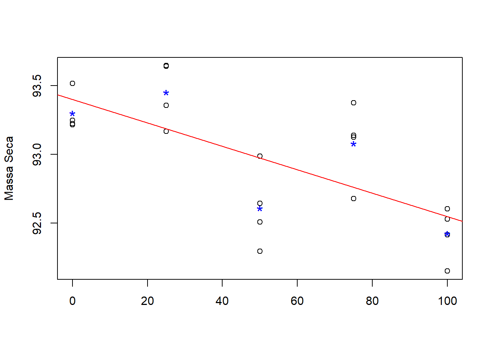

<br>

## Gráfico somente com a média


```r
plot(meditrat~dose,col="red",pch=16, las=1)
curve(m1$coefficients[1]+m1$coefficients[2]*x, add=T)
```


<br><br><br>

****

## Exemplo 2

****

<br>

Num experimento estudou-se o efeito do farelo de arroz desengordurado (FAD) como fatores de retardamento da maturidade sexual de frangas. O ensaio, organizado em blocos completos casualizados, abrangeu duas fases distintas e foi constituído de 5 tratamentos e 5 repetições com 8 aves por unidade experimental. Os tratamentos, na primeira fase eram formados por rações que continham 0, 15, 30, 45, 60 % de FAD em substituição ao milho. Os resultados obtidos na primeira fase do ensaio, para conversão alimentar foram os seguintes:

Fonte: <http://www.uel.br/pessoal/lscunha/pages/arquivos/uel/Especializa%C3%A7%C3%A3o/Aula_9_-_Polin%C3%B4mios_Ortogonais(1).pdf>


```r
CA=c(6.5, 6.4, 6.2, 5.8, 7.3,
    7.1, 7.4, 6.9, 7.3, 7.0,
    7.5, 8.1, 6.7, 7.4, 7.7,
    7.2, 7.0, 6.9, 6.7, 6.5,
    6.4, 6.5, 6.0, 6.3, 6.2)
Bloco=rep(c(paste("B", 1:5)),5)
FAD=rep(c(0,15,30,45,60),e=5)
dados=data.frame(fad=factor(FAD),Bloco=factor(Bloco),CA)
```

<br><br>

## Análise de Variância

\begin{eqnarray*}
\left\{
\begin{array}{ll}
H_0: & \mu_1 = \mu_2 = \mu_3 = \cdots = \mu_{5} \\[.2cm]
H_1: & \mu_i \neq \mu_i' \qquad i \neq i'.
\end{array}
\right.
\end{eqnarray*}

<br>


```r
mod = with(dados,aov(CA ~ fad+Bloco))
summary(mod)
```

```
##             Df Sum Sq Mean Sq F value   Pr(>F)    
## fad          4  4.868   1.217  10.058 0.000289 ***
## Bloco        4  0.936   0.234   1.934 0.153795    
## Residuals   16  1.936   0.121                     
## ---
## Signif. codes:  0 '***' 0.001 '**' 0.01 '*' 0.05 '.' 0.1 ' ' 1
```

<br><br>

## Pressuposições

<br>

### Normalidade dos erros

<br>

\begin{eqnarray*}
\left\{
\begin{array}{ll}
H_0: & \mbox{Os erros seguem distribuição normal}\\[.2cm]
H_1: & \mbox{Os erros não seguem distribuição normal}.
\end{array}
\right.
\end{eqnarray*}

<br>


```r
shapiro.test(mod$res)
```

```
## 
## 	Shapiro-Wilk normality test
## 
## data:  mod$res
## W = 0.95907, p-value = 0.3963
```

<br>

### Homogeneidade das Variâncias

<br>

\begin{eqnarray*}
\left\{
\begin{array}{ll}
H_0: & \mbox{ As Variâncias são homogêneas}\\[.2cm]
H_1: & \mbox{ As Variâncias não são homogêneas}.
\end{array}
\right.
\end{eqnarray*}

<br>


```r
bartlett.test(residuals(mod)~as.factor(dados$fad))
```

```
## 
## 	Bartlett test of homogeneity of variances
## 
## data:  residuals(mod) by as.factor(dados$fad)
## Bartlett's K-squared = 6.4994, df = 4, p-value = 0.1648
```

<br>

### Independência dos erros

<br>

\begin{eqnarray*}
\left\{
\begin{array}{ll}
H_0: \mbox{Os erros são independentes}\\[.2cm]
H_1: \mbox{Os erros não são independentes}.
\end{array}
\right.
\end{eqnarray*}


```r
library(lmtest)
dwtest(mod)
```

```
## 
## 	Durbin-Watson test
## 
## data:  mod
## DW = 2.8659, p-value = 0.923
## alternative hypothesis: true autocorrelation is greater than 0
```

```r
plot(mod$residuals)
```


<br>

## Coeficientes do modelo

<br>


```r
mod.reg = lm(CA ~ FAD + I(FAD^2) + I(FAD^3) + I(FAD^4))
summary(mod.reg)
```

```
## 
## Call:
## lm(formula = CA ~ FAD + I(FAD^2) + I(FAD^3) + I(FAD^4))
## 
## Residuals:
##    Min     1Q Median     3Q    Max 
##  -0.78  -0.16   0.02   0.16   0.86 
## 
## Coefficients:
##               Estimate Std. Error t value Pr(>|t|)    
## (Intercept)  6.440e+00  1.695e-01  38.001   <2e-16 ***
## FAD          1.867e-02  6.309e-02   0.296    0.770    
## I(FAD^2)     3.793e-03  5.279e-03   0.718    0.481    
## I(FAD^3)    -1.481e-04  1.407e-04  -1.053    0.305    
## I(FAD^4)     1.317e-06  1.167e-06   1.128    0.272    
## ---
## Signif. codes:  0 '***' 0.001 '**' 0.01 '*' 0.05 '.' 0.1 ' ' 1
## 
## Residual standard error: 0.3789 on 20 degrees of freedom
## Multiple R-squared:  0.6289,	Adjusted R-squared:  0.5547 
## F-statistic: 8.475 on 4 and 20 DF,  p-value: 0.0003607
```

<br>

## Usando o ExpDes.pt


```r
library(ExpDes.pt)
dic(FAD,CA, quali=F)
```

```
## ------------------------------------------------------------------------
## Quadro da analise de variancia
## ------------------------------------------------------------------------
##            GL    SQ     QM     Fc      Pr>Fc
## Tratamento  4 4.868 1.2170 8.4749 0.00036068
## Residuo    20 2.872 0.1436                  
## Total      24 7.740                         
## ------------------------------------------------------------------------
## CV = 5.54 %
## 
## ------------------------------------------------------------------------
## Teste de normalidade dos residuos 
## Valor-p:  0.5382094 
## De acordo com o teste de Shapiro-Wilk a 5% de significancia, os residuos podem ser considerados normais.
## ------------------------------------------------------------------------
## 
## ------------------------------------------------------------------------
## Teste de homogeneidade de variancia 
## valor-p:  0.1426676 
## De acordo com o teste de bartlett a 5% de significancia, as variancias podem ser consideradas homogeneas.
## ------------------------------------------------------------------------
## 
## Ajuste de modelos polinomiais de regressao
## ------------------------------------------------------------------------
## 
## Modelo Linear
## =========================================
##    Estimativa Erro.padrao   tc    valor.p
## -----------------------------------------
## b0   6.9600     0.1313    53.0202    0   
## b1  -0.0040     0.0036    -1.1196 0.2762 
## -----------------------------------------
## 
## R2 do modelo linear
## --------
## 0.036976
## --------
## 
## Analise de variancia do modelo linear
## ===================================================
##                      GL   SQ     QM    Fc   valor.p
## ---------------------------------------------------
## Efeito linear        1  0.1800 0.1800 1.25  0.27615
## Desvios de Regressao 3  4.6880 1.5627 10.88 0.00019
## Residuos             20 2.8720 0.1436              
## ---------------------------------------------------
## ------------------------------------------------------------------------
## 
## Modelo quadratico
## =========================================
##    Estimativa Erro.padrao   tc    valor.p
## -----------------------------------------
## b0   6.4571     0.1595    40.4857    0   
## b1   0.0630     0.0126    5.0056  0.0001 
## b2  -0.0011     0.0002    -5.5512 0.00002
## -----------------------------------------
## 
## R2 do modelo quadratico
## --------
## 0.946003
## --------
## 
## Analise de variancia do modelo quadratico
## ===================================================
##                      GL   SQ     QM    Fc   valor.p
## ---------------------------------------------------
## Efeito linear        1  0.1800 0.1800 1.25  0.27615
## Efeito quadratico    1  4.4251 4.4251 30.82  2e-05 
## Desvios de Regressao 2  0.2629 0.1314 0.92  0.41655
## Residuos             20 2.8720 0.1436              
## ---------------------------------------------------
## ------------------------------------------------------------------------
## 
## Modelo cubico
## =========================================
##    Estimativa Erro.padrao   tc    valor.p
## -----------------------------------------
## b0   6.4171     0.1682    38.1394    0   
## b1   0.0822     0.0285    2.8792  0.0093 
## b2  -0.0020     0.0012    -1.6611 0.1123 
## b3  0.00001     0.00001   0.7464  0.4641 
## -----------------------------------------
## 
## R2 do modelo cubico
## --------
## 0.962437
## --------
## 
## Analise de variancia do modelo cubico
## ===================================================
##                      GL   SQ     QM    Fc   valor.p
## ---------------------------------------------------
## Efeito linear        1  0.1800 0.1800 1.25  0.27615
## Efeito quadratico    1  4.4251 4.4251 30.82  2e-05 
## Efeito cubico        1  0.0800 0.0800 0.56  0.46411
## Desvios de Regressao 1  0.1829 0.1829 1.27  0.27249
## Residuos             20 2.8720 0.1436              
## ---------------------------------------------------
## ------------------------------------------------------------------------
```

<br>

## Curva Estimada


```r
m1 <- lm(CA~poly(FAD, degree=1, raw=TRUE)) # não ortogonal
anova(m1)
```

```
## Analysis of Variance Table
## 
## Response: CA
##                                   Df Sum Sq Mean Sq F value Pr(>F)
## poly(FAD, degree = 1, raw = TRUE)  1   0.18  0.1800  0.5476 0.4668
## Residuals                         23   7.56  0.3287
```

```r
summary(m1)
```

```
## 
## Call:
## lm(formula = CA ~ poly(FAD, degree = 1, raw = TRUE))
## 
## Residuals:
##    Min     1Q Median     3Q    Max 
##  -1.16  -0.42   0.00   0.40   1.26 
## 
## Coefficients:
##                                    Estimate Std. Error t value Pr(>|t|)    
## (Intercept)                        6.960000   0.198604   35.05   <2e-16 ***
## poly(FAD, degree = 1, raw = TRUE) -0.004000   0.005405   -0.74    0.467    
## ---
## Signif. codes:  0 '***' 0.001 '**' 0.01 '*' 0.05 '.' 0.1 ' ' 1
## 
## Residual standard error: 0.5733 on 23 degrees of freedom
## Multiple R-squared:  0.02326,	Adjusted R-squared:  -0.01921 
## F-statistic: 0.5476 on 1 and 23 DF,  p-value: 0.4668
```


```r
m2 <- lm(CA~poly(FAD, degree=2, raw=TRUE)) # não ortogonal
anova(m2)
```

```
## Analysis of Variance Table
## 
## Response: CA
##                                   Df Sum Sq Mean Sq F value    Pr(>F)    
## poly(FAD, degree = 2, raw = TRUE)  2 4.6051 2.30257  16.159 4.811e-05 ***
## Residuals                         22 3.1349 0.14249                      
## ---
## Signif. codes:  0 '***' 0.001 '**' 0.01 '*' 0.05 '.' 0.1 ' ' 1
```

```r
summary(m2)
```

```
## 
## Call:
## lm(formula = CA ~ poly(FAD, degree = 2, raw = TRUE))
## 
## Residuals:
##      Min       1Q   Median       3Q      Max 
## -0.65714 -0.21714 -0.01714  0.16857  0.84286 
## 
## Coefficients:
##                                      Estimate Std. Error t value Pr(>|t|)    
## (Intercept)                         6.4571429  0.1588764  40.643  < 2e-16 ***
## poly(FAD, degree = 2, raw = TRUE)1  0.0630476  0.0125468   5.025 4.96e-05 ***
## poly(FAD, degree = 2, raw = TRUE)2 -0.0011175  0.0002005  -5.573 1.33e-05 ***
## ---
## Signif. codes:  0 '***' 0.001 '**' 0.01 '*' 0.05 '.' 0.1 ' ' 1
## 
## Residual standard error: 0.3775 on 22 degrees of freedom
## Multiple R-squared:  0.595,	Adjusted R-squared:  0.5582 
## F-statistic: 16.16 on 2 and 22 DF,  p-value: 4.811e-05
```

<br>

## Gráficos


```r
(meditrat=tapply(CA,FAD,mean))
```

```
##    0   15   30   45   60 
## 6.44 7.14 7.48 6.86 6.28
```

```r
plot(CA~FAD,ylab="CA",xlab=" ")
curve(coef(m2)[1]+coef(m2)[2]*x+coef(m2)[3]*x^2, add=T)
dose=c(0,15,30,45,60)
points(meditrat~dose,col="blue",pch="*",cex=1.5)
```


```r
plot(meditrat~dose,
     col="red",
     pch=16, 
     las=1, 
     ylab="Conversão alimentar",
     main=expression(italic("Conversão alimentar")),
     xlab="FAD (%)")
curve(coef(m2)[1]+coef(m2)[2]*x+coef(m2)[3]*x^2, add=T, col="blue")
(xmax=coef(m2)[2]/-(2*coef(m2)[3]))
```

```
## poly(FAD, degree = 2, raw = TRUE)1 
##                           28.21023
```

```r
(ymax=coef(m2)[1]+coef(m2)[2]*xmax+coef(m2)[3]*xmax^2)
```

```
## (Intercept) 
##    7.346437
```

```r
abline(v=xmax, h=ymax, lty=2,col="red")
points(xmax,ymax, col="red", pch=8)
legend("bottomleft", bty="n",legend=c(expression(Y==6.457143+0.06304762 *x-0.00111746*x^2), expression(R^2==0.595)))
```

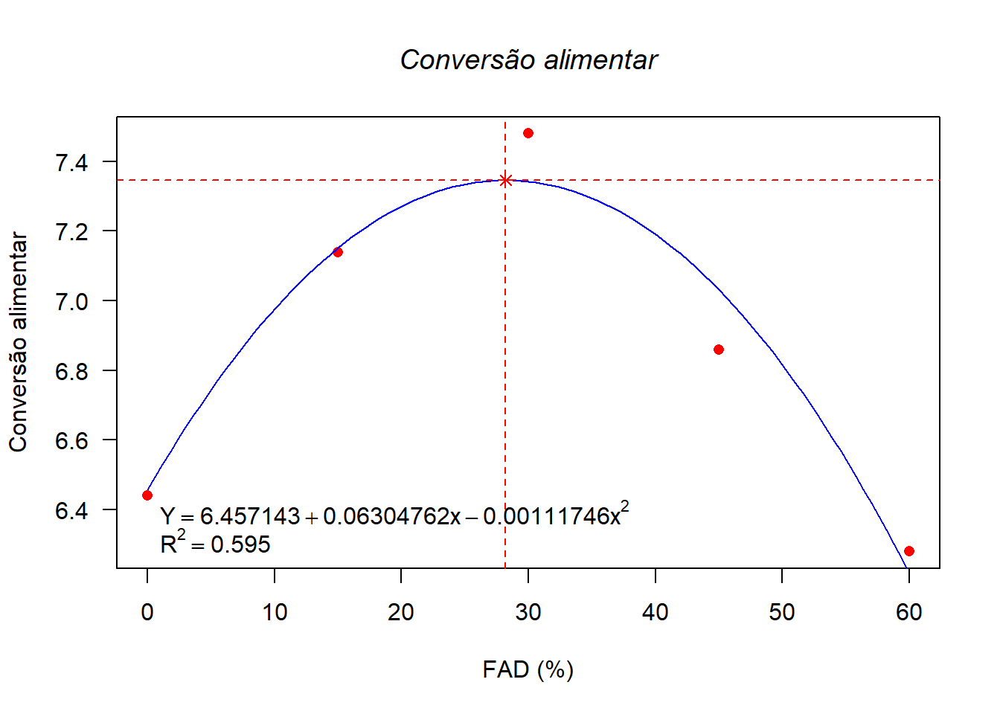

<br><br><br><br>

# Análise conjunta

****

<br><br><br><br>

## Análise conjunta com um fator qualitativo (DBC)

<br>

Na experimentação agrícola é comum a instalação de grupos de ensaios iguais, ou seja, com a mesma estrutura (delineamento, repetições e tratamentos iguais), entretanto, em anos e/ou locais distintos, visando a obtenção de conclusões mais abrangentes. Este tipo de análise é denominada análise conjunta de experimentos ou também conhecido como análise de grupos de experimentos.

Requisitos para análise de variância conjunta

a) Definir local (Ambiente) onde a pesquisa será conduzida, ou seja, diferentes localidades, anos diferentes de uma mesma localidade, anos e localidades distintas, etc. instalam-se os experimentos, o que geralmente são implantados em blocos casualziados, e após a coleta dos daddos, realizam-se todas às análises individuais, isto é, análise para cada ambiente de acordo com o delineamento estatístico utilizado.

b) Examina-se a seguir as grandezas dos $QM_{Res}$, ou seja, se forem homogêneas (Quando a razão entre a maior e o menor $QM_{Res}$ não for superior a mais de sete vezes) todos os ambientes poderão ser incluídos na análise conjunta sem restrições, do contrário, devem-se organizar subgrupos com QMresíduos homogêneos, sendo as análises conjuntas feitas para cada subgrupo.

FV               | G.L.        | S.Q.            |Q.M.                            | Fcalc                         
----------------:|:-----------:|:---------------:|:------------------------------:|:------------------------------
Tratamento       | $t-1$       |$SQ_{Tratamento}$|$\frac{SQ_{Tratamento}}{t-1}$   |$\frac{QM_{trat}}{QM_{T x A}}$  
Ambientes        | $a-1$       |$SQ_{Ambiente}$  |$\frac{SQ_{tratamento}}{a-1}$   |$\frac{QM_{a}}{QM_{T x A}}$     
Interação T x A  | $(t-1)(a-1)$|$SQ_{Interação}$ |$\frac{SQ_{T x A}}{(t-1)(a-1)}$ |$\frac{QM_{T x A}}{QM_{res}}$   
Resíduo médio    | $N'$        |$SQ_{res}$       |$\frac{SQ_{res}}{N}$            |
Total            | $at-1$      |$SQ_{Total}$     |                                |


****

## Exemplo 1

****

<br>

Um experimento com três tratamentos (T1: 6cm; T2: 12cm e T3: 18cm) foi conduzido em delineamento em blocos casualizados com quatro repetições cada. Este mesmo experimento foi repetido duas vezes, totalizando 3 ensaios experimentais (fevereiro; Abril e Junho de 2018).

<br>


```r
rm(list=ls())
resposta=c(20,30,30,20,80,75,75,60,85,80,80,90,20,10,10,20,
           30,20,10,20,50,60,80,30,30,60,40,50,100,60,80,80,
           70,90,80,80)
Comprimento=rep(rep(c(6,12,18),e=4),3); Comprimento=as.factor(Comprimento)
Tempo=rep(c(2,4,6),e=12); Tempo=as.factor(Tempo)
Repe=as.factor(c(rep(c(paste("R",1:4)),3),
       rep(c(paste("R",1:4)),3),
       rep(c(paste("R",1:4)),3)))
(dados=data.frame(Comprimento, Tempo, Repe, resposta))
```

```
##    Comprimento Tempo Repe resposta
## 1            6     2  R 1       20
## 2            6     2  R 2       30
## 3            6     2  R 3       30
## 4            6     2  R 4       20
## 5           12     2  R 1       80
## 6           12     2  R 2       75
## 7           12     2  R 3       75
## 8           12     2  R 4       60
## 9           18     2  R 1       85
## 10          18     2  R 2       80
## 11          18     2  R 3       80
## 12          18     2  R 4       90
## 13           6     4  R 1       20
## 14           6     4  R 2       10
## 15           6     4  R 3       10
## 16           6     4  R 4       20
## 17          12     4  R 1       30
## 18          12     4  R 2       20
## 19          12     4  R 3       10
## 20          12     4  R 4       20
## 21          18     4  R 1       50
## 22          18     4  R 2       60
## 23          18     4  R 3       80
## 24          18     4  R 4       30
## 25           6     6  R 1       30
## 26           6     6  R 2       60
## 27           6     6  R 3       40
## 28           6     6  R 4       50
## 29          12     6  R 1      100
## 30          12     6  R 2       60
## 31          12     6  R 3       80
## 32          12     6  R 4       80
## 33          18     6  R 1       70
## 34          18     6  R 2       90
## 35          18     6  R 3       80
## 36          18     6  R 4       80
```

<br>

## ANOVA individual

<br>

Antes de efetuar a análise conjunta, vamos analisar os dados em cada época (Como experimentos separados).

<br>

### Tempo de 2 meses


```r
modelo=with(dados[Tempo=="2",],aov(resposta~Comprimento+Repe))
anova(modelo)
```

```
## Analysis of Variance Table
## 
## Response: resposta
##             Df Sum Sq Mean Sq F value    Pr(>F)    
## Comprimento  2 7779.2  3889.6 69.1481 7.189e-05 ***
## Repe         3   56.3    18.8  0.3333    0.8022    
## Residuals    6  337.5    56.3                      
## ---
## Signif. codes:  0 '***' 0.001 '**' 0.01 '*' 0.05 '.' 0.1 ' ' 1
```

Como p-valor calculado ($p=7.1893264\times 10^{-5}$) é menor que o nível de significância adotado, rejeita-se $H_0$. Logo, ao menos dois tratamentos diferem entre si.

<br>

### Tempo de 4 meses


```r
modelo1=with(dados[Tempo=="4",],aov(resposta~Comprimento+Repe))
anova(modelo1)
```

```
## Analysis of Variance Table
## 
## Response: resposta
##             Df Sum Sq Mean Sq F value  Pr(>F)  
## Comprimento  2   3800 1900.00  8.1429 0.01952 *
## Repe         3    200   66.67  0.2857 0.83436  
## Residuals    6   1400  233.33                  
## ---
## Signif. codes:  0 '***' 0.001 '**' 0.01 '*' 0.05 '.' 0.1 ' ' 1
```

Como p-valor calculado ($p=0.0195152$) é menor que o nível de significância adotado, rejeita-se $H_0$. Logo, ao menos dois tratamentos diferem entre si.

<br>

### Tempo de 6 meses


```r
modelo2=with(dados[Tempo=="6",],aov(resposta~Comprimento+Repe))
anova(modelo2)
```

```
## Analysis of Variance Table
## 
## Response: resposta
##             Df Sum Sq Mean Sq F value  Pr(>F)  
## Comprimento  2 3266.7 1633.33  6.6818 0.02975 *
## Repe         3   33.3   11.11  0.0455 0.98589  
## Residuals    6 1466.7  244.44                  
## ---
## Signif. codes:  0 '***' 0.001 '**' 0.01 '*' 0.05 '.' 0.1 ' ' 1
```

Como p-valor calculado ($p=0.0297504$) é menor que o nível de significância adotado, rejeita-se $H_0$. Logo, ao menos dois tratamentos diferem entre si.

<br>

## Quadrado do resíduo médio


```r
QMResiduo1<- anova(modelo)$`Mean Sq`[3]
QMResiduo2<- anova(modelo1)$`Mean Sq`[3]
QMResiduo3<- anova(modelo2)$`Mean Sq`[3]
QMResiduo<- c(QMResiduo1, QMResiduo2,
              QMResiduo3)
max(QMResiduo)/min(QMResiduo) ## Deve ser menor que 7
```

```
## [1] 4.345679
```

```r
sum(QMResiduo)/3
```

```
## [1] 178.0093
```

<br>

De acordo com Pimentel Gomes (2009), os ensaios em diversos locais podem ser agrupados em uma única análise desde que o quociente entre o maior e o menor quadrado médio do resíduo (QMRes) seja inferior a 7, caso contrário, pode-se considerar subgrupos de locais homogêneos, com quadrados médios residuais que satisfaçam o quociente, a fim de se construir tantas análises conjuntas quantos subgrupos criados

**Referência**: PIMENTEL GOMES, F. Curso de estatística experimental. 15 ed. Piracicaba: FEALQ, 2009. 451p.

<br><br><br>

## Gráfico de interação


```r
interaction.plot(Comprimento, 
                 Tempo, resposta, 
                 col=c("red","blue","green"),
                 las=1,
                 ylab="Resposta")
```


<br>

## Análise de Variância conjunta

A análise de variância conjunta pode ser efetuada conforme os comandos abaixo:

Teste F para efeito da interação Local:Trat (Somente a interação é válida)


```r
summary(aov(resposta~Tempo+Tempo:Repe+Comprimento+
              Tempo:Comprimento, data=dados)) 
```

```
##                   Df Sum Sq Mean Sq F value   Pr(>F)    
## Tempo              2   9829    4915  27.609 3.28e-06 ***
## Comprimento        2  12304    6152  34.560 6.86e-07 ***
## Tempo:Repe         9    290      32   0.181    0.994    
## Tempo:Comprimento  4   2542     635   3.570    0.026 *  
## Residuals         18   3204     178                     
## ---
## Signif. codes:  0 '***' 0.001 '**' 0.01 '*' 0.05 '.' 0.1 ' ' 1
```

Como p-valor calculado $p=0.026$ é menor que o nível de significância adotado de ($\alpha=0.05$), pode-se concluir que há efeito de interação. Logo, temos que analisar como experimentos separados.

Teste F para efeito do Tratamento


```r
mod=aov(resposta~Tempo+Tempo:Repe+Comprimento+Error(Tempo:(Repe+Comprimento)), data=dados)
summary(mod)
```

```
## 
## Error: Tempo:Repe
##            Df Sum Sq Mean Sq
## Tempo       2   9829    4915
## Tempo:Repe  9    290      32
## 
## Error: Tempo:Comprimento
##             Df Sum Sq Mean Sq F value Pr(>F)  
## Comprimento  2  12304    6152   9.682 0.0293 *
## Residuals    4   2542     635                 
## ---
## Signif. codes:  0 '***' 0.001 '**' 0.01 '*' 0.05 '.' 0.1 ' ' 1
## 
## Error: Within
##           Df Sum Sq Mean Sq F value Pr(>F)
## Residuals 18   3204     178
```

<br><br><br>

## Conferindo "Manualmente" 

Quadro auxiliar com os totais da resposta em ensaios realizados em Londrina no delineamento inteiramente casualizado com três tratamentos (Comprimento de estaca) e quatro repetições em três épocas (T2,T4,T6)

Comprimento     | T2      |T4        |T6           | Total
----------------|---------|----------|-------------|----------
6               | 100     | 60       |180          | 340
12              | 290     | 80       |320          | 690
18              | 335     | 220      |320          | 875
Total           | 725     | 360      |820          | 1905

<br><br>

## Grau de liberdade

**Grau de liberdade do Comprimento**

<center>

$GL_{c}=c-1$

$GL_{comp}=3-1=2$

</center>

**Grau de liberdade do tempo**

<center>

$GL_{t}=t-1$

$GL_{tempo}=3-1=2$

</center>

**Grau de liberdade da interação**

<center>

$GL_{cXt}=(c-1)(t-1)$

$GL_{interação}=(3-1)(3-1)=4$

</center>

**Grau de liberdade do resíduo**

<center>

$GL_{resíduomédio}=N'$

$GL_{resíduo médio}=2*3(3)=18$

$N= c r t=36$

</center>

<br><br>

### Calculando soma de quadrados

<center>

****

$SQ_{c}=\frac{\sum T_c^2}{rc}-\frac{(\sum T_c)^2}{N}$

$SQ_{comp}=\frac{340^2+690^2+875^2}{4*3}-\frac{1905^2}{36}=12.304,17$

****

$SQ_{t}=\frac{\sum T_t^2}{rt}-\frac{(\sum T_t)^2}{N}$

$SQ_{tempo}=\frac{725^2+360^2+820^2}{4*3}-\frac{1905^2}{36}=9.829,15$

****

$SQ_{c X t}=\frac{\sum T_{ct}^2}{r}-\frac{(\sum T_{ct})^2}{N}$

$SQ_{interação}=\frac{100^2+60^2+180^2+290^2+80^2+320^2+335^2+220^2+320^2}{4}-\frac{1905^2}{36}-12.304,17-9.829,15=2.541,63$

</center>

<br><br>

### Calculando quadrado médio

<center>

****
$QM_{c}=\frac{SQ_{c}}{GL_c}$

$QM_{comp}=\frac{12.304,17}{2}=6.152,1$

****
$QM_{t}=\frac{SQ_{t}}{GL_t}$

$QM_{tempo}=\frac{9.829,15}{2}=4.914,6$

****
$QM_{c}=\frac{SQ_{cXt}}{GL_{interação}}$

$QM_{interação}=\frac{2.541,63}{4}=635,4075$

****
$QM_{c}=\frac{SQ_{resT2}+SQ_{resT4}+SQ_{resT6}}{t}$

$QM_{resíduo médio}=\frac{56+233,33+244,44}{3}=178,0$

</center>

<br><br>

### Teste F de Fischer

<center>

****

$F_{c}=\frac{QM_{c}}{QM_{cXt}}$

$F_{comp}=\frac{6.152,1}{635.4075}=9.682$

$F_{t}=\frac{QM_{t}}{QM_{cXt}}$

$F_{tempo}=\frac{4.914,6}{635.4075}=7,73$

$F_{c}=\frac{QM_{cXt}}{QM_{resíduomédio}}$

$F_{interação}=\frac{635.4075}{178}=3,5696$

</center>

<br><br>

## Pressuposição do modelo

<br>

### Normalidade dos erros

\begin{eqnarray*}
\left\{
\begin{array}{ll}
H_0: & \mbox{ Os erros têm distribuição normal} \\[.2cm]
H_1: & \mbox{ Os erros não têm distribuição normal}.
\end{array}
\right.
\end{eqnarray*}


```r
## Vamos analisar os erros como sendo um modelo em esquema Fatorial
mod1=aov(resposta~Comprimento*Tempo+Repe)
(norm=shapiro.test(mod1$res))
```

```
## 
## 	Shapiro-Wilk normality test
## 
## data:  mod1$res
## W = 0.97794, p-value = 0.6756
```

Como p-valor calculado ($p=0.6756399$) é maior que o nível de significância adotado ($\alpha=0,05$), não se rejeita $H_0$. Logo, os erros seguem distribuição normal.

<br><br>

### Gráfico de normalidade


```r
HNP=hnp::hnp(mod1, paint.on=T, col="red" , las=1, pch=8)
```


```r
plot(HNP,lty=c(2,3,2),  col=c(2,1,2,1))
```

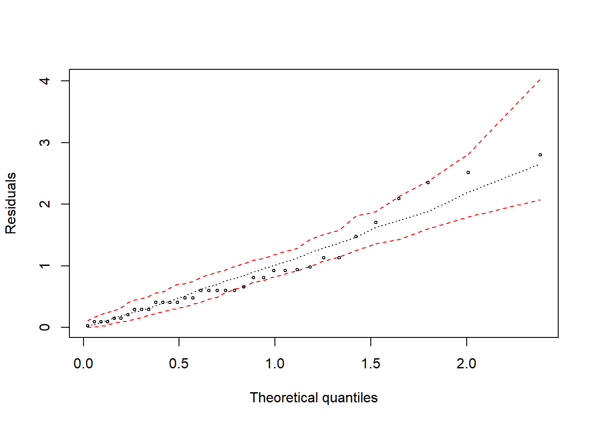

<br><br>

### Homogeneidade de variâncias

\begin{eqnarray*}
\left\{
\begin{array}{ll}
H_0: & \mbox{ As variâncias são homogêneas} \\[.2cm]
H_1: & \mbox{ As variâncias não são homogêneas}.
\end{array}
\right.
\end{eqnarray*}


```r
(homog=bartlett.test(mod1$res~paste(Comprimento,Tempo)))
```

```
## 
## 	Bartlett test of homogeneity of variances
## 
## data:  mod1$res by paste(Comprimento, Tempo)
## Bartlett's K-squared = 9.5181, df = 8, p-value = 0.3005
```

Como p-valor calculado ($p=0.3004895$) é maior que o nível de significância adotado ($\alpha=0,05$), não se rejeita $H_0$. Logo, as variâncias são homogêneas.

<br><br>

### Independências dos erros

\begin{eqnarray*}
\left\{
\begin{array}{ll}
H_0: & \mbox{ Os erros são independentes;} \\[.2cm]
H_1: & \mbox{ Os erros não são independentes.}
\end{array}
\right.
\end{eqnarray*}


```r
library(lmtest)
ind=dwtest(mod1)
```

Como p-valor calculado ($p=0.5781767$) é maior que o nível de significância adotado ($\alpha=0,05$), não se rejeita $H_0$. Logo, os erros são independentes. A Figura \ref{Fig3} apresenta o gráfico dos resíduos brutos. Percebe-se que os resíduos estão distribuídos de forma totalmente aleatório, evidenciando a independência dos erros.


```r
plot(mod1$res, col="blue",
     las=1, pch=16,
     ylab="Residuos brutos")
abline(h=0, col="red", lwd=2)
```


<br><br><br>

## Desdobramento

<br>

### Desdobramento do Comprimento em cada nível de Tempo


```r
#desdobramento
dados$LT<- as.factor(dados$Tempo:dados$Comprimento)
#efeito de tratamento dentro de cada nível de local
mod.conj<- aov(resposta ~ Tempo + Tempo:Repe + LT,
               data=dados)
summary(mod.conj,
        split=list(LT=list(TdL1=1:2,TdL2=3:4,
                           TdL3=5:6)))
```

```
##             Df Sum Sq Mean Sq F value   Pr(>F)    
## Tempo        2   9829    4915  27.609 3.28e-06 ***
## LT           6  14846    2474  13.900 6.80e-06 ***
##   LT: TdL1   2   7779    3890  21.850 1.53e-05 ***
##   LT: TdL2   2   3800    1900  10.674 0.000877 ***
##   LT: TdL3   2   3267    1633   9.176 0.001790 ** 
## Tempo:Repe   9    290      32   0.181 0.993687    
## Residuals   18   3204     178                     
## ---
## Signif. codes:  0 '***' 0.001 '**' 0.01 '*' 0.05 '.' 0.1 ' ' 1
```

<br>

### Teste de comparação múltipla


```r
# O QMres é 178 e o GL é 18

require(agricolae)

#dentro de Tempo 2
tukey.l1<-HSD.test(dados$resposta[dados$Tempo=="2"],
             dados$Comprimento[dados$Tempo=="2"],
             18, 178)
tukey.l1$groups
```

```
##    dados$resposta[dados$Tempo == "2"] groups
## 18                              83.75      a
## 12                              72.50      a
## 6                               25.00      b
```

```r
#dentro de Tempo 4
tukey.l2<-HSD.test(dados$resposta[dados$Tempo=="4"],
                    dados$Comprimento[dados$Tempo=="4"],
                    18, 178)
tukey.l2$groups
```

```
##    dados$resposta[dados$Tempo == "4"] groups
## 18                                 55      a
## 12                                 20      b
## 6                                  15      b
```

```r
#dentro de Tempo 6
tukey.l3<-HSD.test(dados$resposta[dados$Tempo=="6"],
                    dados$Comprimento[dados$Tempo=="6"],
                    18, 178)
tukey.l3$groups
```

```
##    dados$resposta[dados$Tempo == "6"] groups
## 12                                 80      a
## 18                                 80      a
## 6                                  45      b
```


```r
par(mfrow=c(1,3))
bar.group(tukey.l1$groups, ylim=c(0,120),
          main="Tempo 2", xlab="Comprimento",
          ylab="resposta",las=1)
bar.group(tukey.l2$groups, ylim=c(0,120),
          main="Tempo 4", xlab="Comprimento",
          ylab="resposta",las=1)
bar.group(tukey.l3$groups, ylim=c(0,120),
          main="Tempo 6", xlab="Comprimento",
          ylab="resposta",las=1) 
```


<br><br><br>

## Tabela Final


```r
library(knitr)
media=tapply(resposta, list(Comprimento, Tempo),mean)
tabela=data.frame("Mês 2"=media[,1],
             " "=c("B","A","A"),
             "Mês 4"=media[,2],
             " "=c("B","B","A"),
             "Mês 6"=media[,3],
             " "=c("B","A","A"))
kable(tabela, align = "c", col.names = c("Mês 2"," ","Mês 4"," ","Mês 6"," "))
```

      Mês 2         Mês 4         Mês 6      
---  -------  ---  -------  ---  -------  ---
6     25.00    B     15      B     45      B 
12    72.50    A     20      B     80      A 
18    83.75    A     55      A     80      A 

<br><br><br><br>

# Gráficos em R

<br><br>

****

# Gráfico de Colunas 

****

O gráfico em colunas consiste em construir retângulos, em que uma das dimensões é proporcional à magnitude a ser representada ($n_i$ ou $f_i$), sendo a outra arbitrária, porém igual para todas as colunas. Essas colunas são dispostas paralelamente umas às outras de forma vertical.

<br>

Além do título e fonte de referências deve-se observar o seguinte:

- as colunas devem ter todas a mesma largura;
- a distância entre as colunas deve ser constante e de preferência menor que a largura das colunas.

<br><br>


## Conjunto de dados

<br>


```r
tratamentos=rep(c(paste("T",1:5)),e=4)
resposta=c(100,120,110,90,150,145,149,165,150,144,134,139,220,206,210,210,266,249,248,260)
## Média e Desvio-padrão (Por Tratamento)
media=tapply(resposta,tratamentos, mean)
desvio=tapply(resposta,tratamentos,sd)
```

<br>


```r
barplot(media)
```


<br>

## Adicionando melhorias


```r
barplot(media, 
        las=1,
        col="lightyellow",
        ylab="Resposta",
        xlab="Tratamentos",
        ylim=c(0,300))
abline(h=0)
```


**Comandos**:

las=1: deixar escala do eixo Y na vertical

col="cor": mudar cor das barras (Ex. "red","blue","green" ou gray.colors(quantidade de tonalidades) para escala cinza ou rainbow(quantidade de cores) para escala colorida. Também é possível específicar a cor de cada barra (col=c("red","green","yellow","gray","blue"))).

xlab e ylab: nomear eixo X e Y

xlim e ylim: escala do eixo X e Y

abline(h=0): linha na horizontal em Y=0 (No caso de vertical, abline(v=0)). É possível alterar a cor pela função "col="cor"" e o tracejado pelo "lty=número" (Ver o Help do comando)

<br>

## Barras de desvio-padrão


```r
bar=barplot(media, 
        las=1,
        col="lightyellow",
        ylab="Resposta",
        xlab="Tratamentos",
        ylim=c(0,300))
abline(h=0)
arrows(bar,media+desvio,bar,media-desvio,length = 0.1,angle=90,code=3)
```


<br>

## Unidade do eixo Y 

(Ex. $Kg\ ha^{-1}$)


```r
bar=barplot(media, 
        las=1,
        col="lightyellow",
        ylab=expression("Resposta"*" "*(kg*" "*ha^-1)),
        xlab="Tratamentos",
        ylim=c(0,300))
abline(h=0)
arrows(bar,media+desvio,bar,media-desvio,length = 0.1,angle=90,code=3)
```


<br>

## Média dos tratamentos


```r
bar=barplot(media, 
        las=1,
        col="lightyellow",
        ylab=expression("Resposta"*" "*(kg*" "*ha^-1)),
        xlab="Tratamentos",
        ylim=c(0,300))
abline(h=0)
text(bar,media+desvio+10,media)
arrows(bar,media+desvio,bar,media-desvio,length = 0.1,angle=90,code=3)
```


<br>

## Separação de casa decimal


```r
options(OutDec=",")
bar=barplot(media, 
        las=1,
        col="lightyellow",
        ylab=expression("Resposta"*" "*(kg*" "*ha^-1)),
        xlab="Tratamentos",
        ylim=c(0,300))
abline(h=0)
text(bar,media+desvio+10,media)
arrows(bar,media+desvio,bar,media-desvio,length = 0.1,angle=90,code=3)
```


<br>

## Letras do teste de comparação


```r
tukey=c("d","c","c","b","a")
options(OutDec=",")
bar=barplot(media, 
        las=1,
        col="lightyellow",
        ylab=expression("Resposta"*" "*(kg*" "*ha^-1)),
        xlab="Tratamentos",
        ylim=c(0,300))
abline(h=0)
text(bar,media+desvio+10,paste(round(media,0),tukey))
arrows(bar,media+desvio,bar,media-desvio,length = 0.1,angle=90,code=3)
```


<br><br>

****

## Pacote Agricolae

****

<br>

### Conjunto de dados


```r
tratamentos=rep(c(paste("T",1:5)),e=4)
resposta=c(100,120,110,90,150,145,149,165,150,144,134,139,220,206,210,210,266,249,248,260)
```

<br>

### Modelo de Anova


```r
modelo=aov(resposta~tratamentos)
```


```r
library(agricolae)
a=HSD.test(modelo,"tratamentos", group = T)
```

<br>

### Gráfico com média 


```r
plot(a, las=1)
```


<br>

### Gráfico de barras


```r
bar.group(a$groups, col="lightblue",
          las=1, 
          ylim=c(0,300))
abline(h=0)
```


<br>

### Barras de desvio-padrão


```r
bar.err(a$means,
        variation="SD", col="lightblue",
        las=1,
        ylim=c(0,300))
abline(h=0)
```


<br>

### Barras de erro padrão


```r
bar.err(a$means,
        variation="SE", col="lightblue",
        las=1,
        ylim=c(0,300))
abline(h=0)
```


<br>

### Barras de máximo-mínimo


```r
bar.err(a$means,
        variation="range", col="lightblue",
        las=1,
        ylim=c(0,300))
abline(h=0)
```


<br>

### Barras da distância interquartil


```r
bar.err(a$means,
        variation="IQR", col="lightblue",
        las=1,
        ylim=c(0,300))
abline(h=0)
```

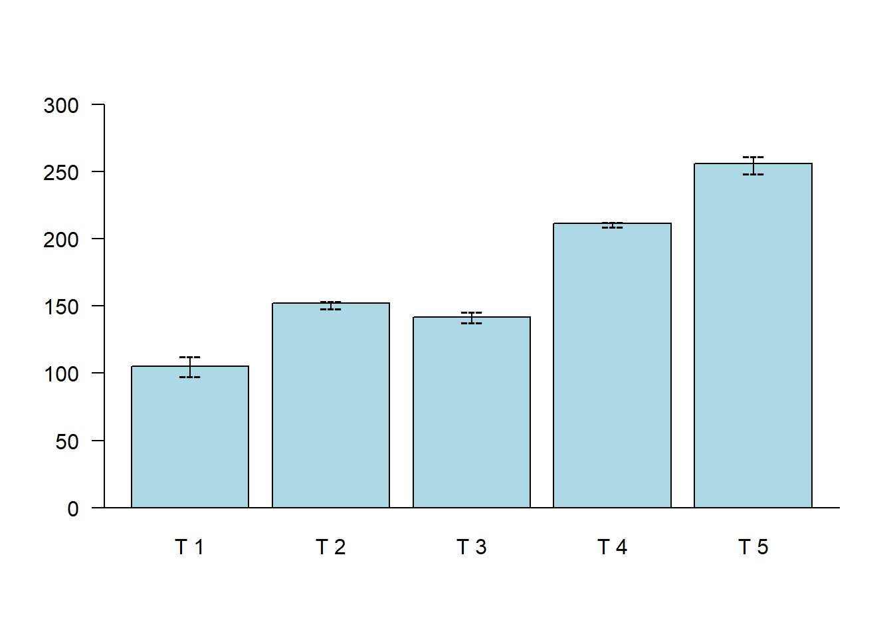

<br><br><br>

****

## Pacote ggplot2 e ggpubr

****

### Conjunto de dados

Vamos trabalhar com três experimentos em DIC com quatro tratamentos e três repetições cada. 


```r
exp1=c(10,12,13,18,19,16,5,6,5,25,26,28)
exp2=c(9,12,11,18,20,16,7,6,9,25,28,28)
exp3=c(9,12,13,18,22,15,3,6,4,25,30,28)  
Trat=rep(c(paste("T",1:4)),e=3)
dados=data.frame(Trat,exp1,exp2,exp3)
dados$Trat=as.factor(Trat)
```

Obs. Para facilitar, vamos realizar a análise direto pelo pacote ExpDes.pt (é necessário instalar o pacote)

<br>

### Análise de exp1


```r
ExpDes.pt::dic(Trat,exp1)
```

```
## ------------------------------------------------------------------------
## Quadro da analise de variancia
## ------------------------------------------------------------------------
##            GL     SQ QM     Fc      Pr>Fc
## Tratamento  3 719,58    130,83 3,8864e-07
## Residuo     8  14,67                     
## Total      11 734,25                     
## ------------------------------------------------------------------------
## CV = 8,88 %
## 
## ------------------------------------------------------------------------
## Teste de normalidade dos residuos 
## Valor-p:  0,3563889 
## De acordo com o teste de Shapiro-Wilk a 5% de significancia, os residuos podem ser considerados normais.
## ------------------------------------------------------------------------
## 
## ------------------------------------------------------------------------
## Teste de homogeneidade de variancia 
## valor-p:  0,6539247 
## De acordo com o teste de bartlett a 5% de significancia, as variancias podem ser consideradas homogeneas.
## ------------------------------------------------------------------------
## 
## Teste de Tukey
## ------------------------------------------------------------------------
## Grupos Tratamentos Medias
## a 	 T 4 	 26,33333 
##  b 	 T 2 	 17,66667 
##   c 	 T 1 	 11,66667 
##    d 	 T 3 	 5,333333 
## ------------------------------------------------------------------------
```

<br>

### Análise de exp2


```r
ExpDes.pt::dic(Trat,exp2)
```

```
## ------------------------------------------------------------------------
## Quadro da analise de variancia
## ------------------------------------------------------------------------
##            GL     SQ QM     Fc      Pr>Fc
## Tratamento  3 684,92    78,276 2,8606e-06
## Residuo     8  23,33                     
## Total      11 708,25                     
## ------------------------------------------------------------------------
## CV = 10,84 %
## 
## ------------------------------------------------------------------------
## Teste de normalidade dos residuos 
## Valor-p:  0,2365244 
## De acordo com o teste de Shapiro-Wilk a 5% de significancia, os residuos podem ser considerados normais.
## ------------------------------------------------------------------------
## 
## ------------------------------------------------------------------------
## Teste de homogeneidade de variancia 
## valor-p:  0,9823917 
## De acordo com o teste de bartlett a 5% de significancia, as variancias podem ser consideradas homogeneas.
## ------------------------------------------------------------------------
## 
## Teste de Tukey
## ------------------------------------------------------------------------
## Grupos Tratamentos Medias
## a 	 T 4 	 27 
##  b 	 T 2 	 18 
##   c 	 T 1 	 10,66667 
##   c 	 T 3 	 7,333333 
## ------------------------------------------------------------------------
```

<br>

### Análise de exp3


```r
ExpDes.pt::dic(Trat,exp3)
```

```
## ------------------------------------------------------------------------
## Quadro da analise de variancia
## ------------------------------------------------------------------------
##            GL     SQ QM     Fc      Pr>Fc
## Tratamento  3 894,25    47,066 1,9902e-05
## Residuo     8  50,67                     
## Total      11 944,92                     
## ------------------------------------------------------------------------
## CV = 16,32 %
## 
## ------------------------------------------------------------------------
## Teste de normalidade dos residuos 
## Valor-p:  0,9419794 
## De acordo com o teste de Shapiro-Wilk a 5% de significancia, os residuos podem ser considerados normais.
## ------------------------------------------------------------------------
## 
## ------------------------------------------------------------------------
## Teste de homogeneidade de variancia 
## valor-p:  0,7583526 
## De acordo com o teste de bartlett a 5% de significancia, as variancias podem ser consideradas homogeneas.
## ------------------------------------------------------------------------
## 
## Teste de Tukey
## ------------------------------------------------------------------------
## Grupos Tratamentos Medias
## a 	 T 4 	 27,66667 
##  b 	 T 2 	 18,33333 
##   c 	 T 1 	 11,33333 
##    d 	 T 3 	 4,333333 
## ------------------------------------------------------------------------
```

<br>

## Utilizando o *ggplot2*


```r
library(ggplot2)
library(gridExtra)
```

<br>

### Média e desvio-padrão


```r
media=tapply(exp1, Trat, mean)
desvio=tapply(exp1, Trat, sd)
## Construindo uma nova data.frame com a media e desvio
dados1=data.frame(Trat=rownames(media),media,desvio)
```

<br>

### Gráfico básico


```r
ggplot(dados1, 
       aes(x=Trat,y=media))+
  geom_col()
```


### Média no gráfico


```r
ggplot(dados1, 
       aes(x=Trat,y=media))+
  geom_col()+
  geom_text(label=round(media,1), vjust=-1) 
```


```r
# Obs. Round é para arrendondar o valor, neste caso estamos pedindo até a primeira casa decimal
```

<br>

### Letras do teste de comparação


```r
ggplot(dados1, 
       aes(x=Trat,y=media))+
  geom_col()+
  geom_text(label=paste(round(media,1),c("c","b","d","a")), vjust=-1)
```


```r
#Obs. a função paste serve para juntar palavras, nesse caso está juntando cada média com suas respectivas letras do teste de comparação de médias
```

<br>

### Escala do eixo Y


```r
ggplot(dados1, 
       aes(x=Trat,y=media))+
  geom_col()+
  geom_text(label=paste(round(media,1),c("c","b","d","a")), vjust=-1)+
  ylim(c(0,40))
```


<br>

### Cor das colunas


```r
ggplot(dados1, 
       aes(x=Trat,y=media))+
  geom_col(fill=c(1,2,3,4))+
  geom_text(label=paste(round(media,1),c("c","b","d","a")), vjust=-1)+
  ylim(c(0,40))
```


<br>

### Removendo cor de fundo


```r
ggplot(dados1, 
       aes(x=Trat,y=media))+
  geom_col(fill=c(1,2,3,4))+
  geom_text(label=paste(round(media,1),c("c","b","d","a")), vjust=-1)+
  ylim(c(0,40))+
  theme_bw()
```


<br>

### Removendo linhas de grade


```r
ggplot(dados1, 
       aes(x=Trat,y=media))+
  geom_col(fill=c(1,2,3,4))+
  geom_text(label=paste(round(media,1),c("c","b","d","a")), vjust=-1)+
  ylim(c(0,40))+
  theme_bw()+
  theme_classic()
```

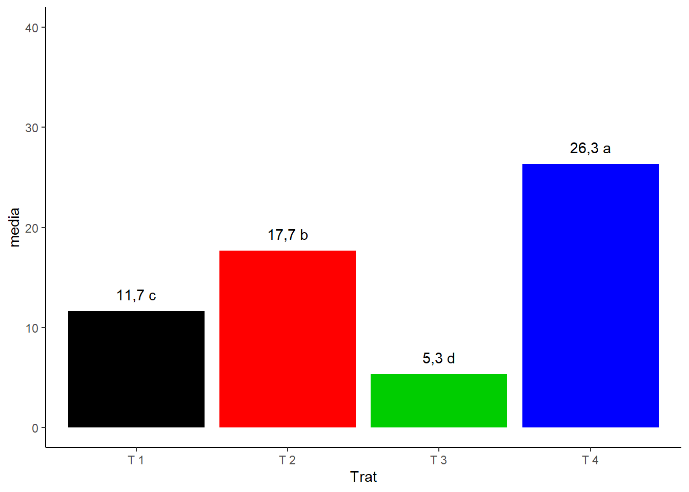

<br>

### Nome dos eixos X e Y

**Obs**. A função `expression()` funciona nesses argumentos.


```r
ggplot(dados1, aes(x=Trat,y=media))+
  geom_col(fill=c(1,2,3,4))+
  geom_text(label=paste(round(media,1),c("c","b","d","a")), vjust=-1)+
  ylim(c(0,40))+
  theme_bw()+
  theme_classic()+
  ylab("Resposta")+
  xlab(" ")
```


<br>

### Cor do contorno das colunas


```r
ggplot(dados1, 
       aes(x=Trat,y=media))+
  geom_col(fill=c(1,2,3,4),col="black")+     # Modifiquei aqui
  geom_text(label=paste(round(media,1),c("c","b","d","a")), vjust=-1)+
  ylim(c(0,40))+
  theme_bw()+
  theme_classic()+
  ylab("Resposta")+
  xlab(" ")
```


<br>

### Barras de desvio-padrão


```r
ggplot(dados1, aes(x=Trat,y=media))+
  geom_col(fill=c(1,2,3,4),col="black")+
  geom_text(label=paste(round(media,1),c("c","b","d","a")), vjust=-2)+
  ylim(c(0,40))+
  theme_bw()+
  theme_classic()+
  ylab("Resposta")+
  xlab(" ")+
  geom_errorbar(aes(ymax=media+desvio,ymin=media-desvio), width=0.25) # Width é a largura da barra
```


<br>

### Juntando os gráficos

Obs. Vamos chamar todo o plot de cada uma das variáveis de `a,b,c`, respectivamente. 

<br>

### Variável exp1


```r
media=tapply(exp1, Trat, mean)
desvio=tapply(exp1, Trat, sd)
dados1=data.frame(Trat=rownames(media),media,desvio)
a=ggplot(dados1, aes(x=Trat,y=media))+
  geom_col(fill=c(1,2,3,4),col="black")+
  geom_text(label=paste(round(media,1),
                        c("c","b","d","a")), vjust=-3)+
  ylim(c(0,40))+theme_bw()+theme_classic()+ylab("Resposta")+xlab(" ")+
  geom_errorbar(aes(ymax=media+desvio,
                   ymin=media-desvio), width=0.25)
```

<br>

### Variável exp2


```r
media=tapply(exp2, Trat, mean)
desvio=tapply(exp2, Trat, sd)
dados2=data.frame(Trat=rownames(media),media,desvio)
b=ggplot(dados2, aes(x=Trat,y=media))+
  geom_col(fill=c(1,2,3,4),col="black")+
  geom_text(label=paste(round(media,1),
                        c("c","b","c","a")), vjust=-3)+
  ylim(c(0,40))+theme_bw()+theme_classic()+ylab("Resposta")+xlab(" ")+
  geom_errorbar(aes(ymax=media+desvio,
                   ymin=media-desvio), width=0.25)
```

<br>

### Variável exp3


```r
media=tapply(exp3, Trat, mean)
desvio=tapply(exp3, Trat, sd)
dados3=data.frame(Trat=rownames(media),media,desvio)
c=ggplot(dados3, aes(x=Trat,y=media))+
  geom_col(fill=c(1,2,3,4),col="black")+
  geom_text(label=paste(round(media,1),
                        c("c","b","d","a")), vjust=-4)+
  ylim(c(0,40))+theme_bw()+theme_classic()+ylab("Resposta")+xlab(" ")+
  geom_errorbar(aes(ymax=media+desvio,
                   ymin=media-desvio), width=0.25)
```


```r
grid.arrange(a,b,c,ncol=3)
```


<br><br>

****

## Pacote ggpubr

****

**Obs.** Existem vários *packages* que utilizam o `ggplot2` e geram saídas similares, contudo, com argumentos dos comandos mais simples.


```r
exp1=c(10,12,13,18,19,16,5,6,5,25,26,28)
exp2=c(9,12,11,18,20,16,7,6,9,25,28,28)
exp3=c(9,12,13,18,22,15,3,6,4,25,30,28)  
Trat=rep(c(paste("T",1:4)),e=3)
dados=data.frame(Trat,exp1,exp2,exp3)
dados$Trat=as.factor(Trat)
```


```r
library(ggpubr)
library(gridExtra)
```

<br>

### Comando base 


```r
ggbarplot(dados, 
          x = "Trat", 
          y = "exp1",
          add="mean")
```


<br>

### Barras de desvio-padrão


```r
ggbarplot(dados, 
          x = "Trat", 
          y = "exp1",
          add = "mean_sd")
```


<br>

### Cor da coluna 


```r
ggbarplot(dados, 
          x = "Trat", 
          y = "exp1",
          add = "mean_sd", 
          fill = "Trat")
```


```r
ggbarplot(dados, 
          x = "Trat", 
          y = "exp1",
          add = "mean_sd", 
          fill = "Trat",
          palette = c(1,2,3,4))
```


<br>

### Letra do teste de comparação


```r
ggbarplot(dados, 
          x = "Trat", 
          y = "exp1",
          add = "mean_sd", 
          fill = "Trat",
          label = c("c","b","d","a"),
          lab.vjust=-2)
```


<br>

### Adicionando a média


```r
media=tapply(exp1,Trat,mean)
ggbarplot(dados, 
          x = "Trat", 
          y = "exp1",
          add = "mean_sd", 
          fill = "Trat",
          label = paste(round(media,1),c("c","b","c","a")),
          lab.vjust=-2)
```


<br>

### Escala do eixo Y


```r
ggbarplot(dados, 
          x = "Trat", 
          y = "exp1",
          add = "mean_sd", 
          fill = "Trat",
          label = paste(round(media,1),c("c","b","d","a")),
          lab.vjust=-2)+ylim(c(0,40))
```


<br>

### Removendo legenda


```r
ggbarplot(dados, 
          x = "Trat", 
          y = "exp1",
          add = "mean_sd", 
          fill = "Trat",
          label = paste(round(media,1),c("c","b","d","a")),
          lab.vjust=-2,
          legend="n")+ylim(c(0,40))
```


<br>

### Juntando os gráficos

<br>

### Variável exp1


```r
media=tapply(exp1,Trat,mean)
a=ggbarplot(dados, 
          x = "Trat", 
          y = "exp1",
          add = "mean_sd", 
          fill = "Trat",
          label = paste(round(media,1),c("c","b","d","a")),
          lab.vjust=-3,
          legend="n")+ylim(c(0,40))
```

<br>

### Variável exp2


```r
media=tapply(exp2,Trat,mean)
b=ggbarplot(dados, 
          x = "Trat", 
          y = "exp2",
          add = "mean_sd", 
          fill = "Trat",
          label = paste(round(media,1),c("c","b","d","a")),
          lab.vjust=-3,
          legend="n")+ylim(c(0,40))
```

<br>

### Variável exp3


```r
media=tapply(exp3,Trat,mean)
c=ggbarplot(dados, 
          x = "Trat", 
          y = "exp3",
          add = "mean_sd", 
          fill = "Trat",
          label = paste(round(media,1),c("c","b","d","a")),
          lab.vjust=-3,
          legend="n")+ylim(c(0,40))
```


```r
grid.arrange(a,b,c,ncol=3)
```


<br>

**Como deixar apenas o gráfico a esquerda com a escala de Y?**

Existem casos em que uma mesma variável foi analisada em várias situações e dessa forma, geramos gráficos com a mesma unidade de medida. Nesse sentido, é frequente apresentar apenas uma escala de Y, geralmente o gráfico a esquerda. No pacote ggpubr, podemos efetuar da seguinte forma:

<br>


```r
media=tapply(exp1,Trat,mean)
a=ggbarplot(dados, 
          x = "Trat", 
          y = "exp1",
          add = "mean_sd", 
          fill = "Trat",
          ylab="Resposta",
          label = paste(round(media,1),c("c","b","d","a")),
          lab.vjust=-3,
          legend="n")+ylim(c(0,40))
```

<br>


```r
media=tapply(exp2,Trat,mean)
b=ggbarplot(dados, 
          x = "Trat", 
          y = "exp2",
          add = "mean_sd", 
          fill = "Trat",
          label = paste(round(media,1),c("c","b","c","a")),
          lab.vjust=-3,
          legend="n",
          yscale="n")+
  ylim(c(0,40))+
  theme(axis.text.y=element_blank())+ # Comando para remover os números da escala de Y
  ylab("") # Remover nome do eixo Y 
```

<br>


```r
media=tapply(exp3,Trat,mean)
c=ggbarplot(dados, 
          x = "Trat", 
          y = "exp3",
          add = "mean_sd", 
          fill = "Trat",
          label = paste(round(media,1),c("c","b","d","a")),
          lab.vjust=-4,
          legend="n")+
  ylim(c(0,40))+
  theme(axis.text.y=element_blank())+
  ylab("")
```


```r
grid.arrange(a,b,c,ncol=3)
```


<br><br><br>

****

## Duas variáveis categóricas

****

<br>

### Conjunto de dados


```r
Fator1=factor(rep(c(paste("F",1:2)),e=20))
Fator2=factor(c(rep(c(paste("T",1:5)),e=4),rep(c(paste("T",1:5)),e=4)))
resposta=c(100,120,110,90,150,145,149,165,250,244,220,239,220,206,210,210,266,249,248,260,110,130,120,100,160,165,169,175,160,154,144,149,230,216,220,220,276,259,258,270)
dados=data.frame(Fator1,Fator2,resposta)
## Média e Desvio-padrão (Por Tratamento)
media=with(dados, tapply(dados$resposta,list(Fator1, Fator2), mean))
desvio=with(dados, tapply(resposta,list(Fator1, Fator2), sd))
```

<br>

### Gráfico simples


```r
barplot(media, beside = T)
```


O argumento beside=T é refente a um gráfico de barras em que as barras são posicionadas lado a lado. Do contrário, as barras serão empilhadas (*stacked*). 

<br>

### Melhorias


```r
barplot(media, beside = T,
        las=1, col=c("lawngreen","gold"),
        ylab="Resposta",
        xlab="Fator2",
        ylim=c(0,300))
abline(h=0)
```


**Comandos**:

**las=1**: deixar escala do eixo Y na vertical

**col="cor"**: mudar cor das barras (Ex. "red","blue","green" ou gray.colors(quantidade de tonalidades) para escala cinza ou rainbow(quantidade de cores) para escala colorida. Também é possível específicar a cor de cada barra (col=c("red","green","yellow","gray","blue"))).

**xlab** e **ylab**: nomear eixo X e Y

**xlim** e **ylim**: escala do eixo X e Y

**abline(h=0)**: linha na horizontal em Y=0 (No caso de vertical, abline(v=0)). É possível alterar a cor pela função "col="cor"" e o tracejado pelo "lty=número" (Ver o Help do comando)

<br>

### Cores


```r
barplot(1:21, col=c("red","white","black","lightyellow","green","blue","orange",
                        "yellow","gray","pink","brown","Gainsboro", "Lavender", 
                        "DeepSkyBlue","LawnGreen", "Gold","MediumOrchid",
                        "LightSalmon", "Sienna", "Tomato", "DeepPink1"))
```


<br>

### Barras de desvio-padrão


```r
bar=barplot(media,beside=T, 
        las=1,
        ylab="Resposta",
        xlab="Tratamentos",
        ylim=c(0,300))
abline(h=0)
arrows(bar,media+desvio,bar,media-desvio,length = 0.1,angle=90,code=3)
```


<br>

### Unidade do eixo Y 

(Ex. $Kg\ ha^{-1}$)


```r
bar=barplot(media, beside=T,
        las=1,
        ylab=expression("Resposta"*" "*(kg*" "*ha^-1)),
        xlab="Tratamentos",
        ylim=c(0,300))
abline(h=0)
arrows(bar,media+desvio,bar,media-desvio,length = 0.1,angle=90,code=3)
```


<br>

### Média acima das barras


```r
bar=barplot(media, beside=T,
        las=1,
        ylab=expression("Resposta"*" "*(kg*" "*ha^-1)),
        xlab="Tratamentos",
        ylim=c(0,300))
abline(h=0)
text(bar,media+desvio+10,media, cex=0.8)
arrows(bar,media+desvio,bar,media-desvio,length = 0.1,angle=90,code=3)
```


<br>

### Separação de casa decimal


```r
options(OutDec=",")
bar=barplot(media, beside=T,
        las=1,
        ylab=expression("Resposta"*" "*(kg*" "*ha^-1)),
        xlab="Tratamentos",
        ylim=c(0,300))
abline(h=0)
text(bar,media+desvio+10,media, cex=0.8)
arrows(bar,media+desvio,bar,media-desvio,length = 0.1,angle=90,code=3)
```


<br>

### Letras do teste de comparação


```r
tukey=c("dB","dA","cB","cA","cB","cA","bB","bA","aB","aA")
options(OutDec=",")
bar=barplot(media, beside=T,
        las=1,
        ylab=expression("Resposta"*" "*(kg*" "*ha^-1)),
        xlab="Tratamentos",
        ylim=c(0,300))
abline(h=0)
text(bar,media+desvio+10,paste(round(media,0),tukey), cex=0.8)
arrows(bar,media+desvio,bar,media-desvio,length = 0.1,angle=90,code=3)
```


<br>

### Adicionando legenda

**legend.text=rownames(media)**: adicionar a legenda (neste caso em relação ao Fator 2)

**args.legend**: argumentos da legenda (x="topleft": legenda será adicionada no parte superior esquerda, podemos adicionar superior direito ("topright"), inferior esquerdo ("bottomleft"), inferior direito ("bottomright"), centralizado ("center"))


```r
tukey=c("dB","dA","cB","cA","cB","cA","bB","bA","aB","aA")
options(OutDec=",")
bar=barplot(media, 
            beside=T,
            legend.text = rownames(media),
            args.legend = list(x="topleft", bty="n"),
        las=1,
        ylab=expression("Resposta"*" "*(kg*" "*ha^-1)),
        xlab="Tratamentos",
        ylim=c(0,300))
abline(h=0)
text(bar,media+desvio+10,paste(round(media,0),tukey), cex=0.8)
arrows(bar,media+desvio,bar,media-desvio,length = 0.1,angle=90,code=3)
```


<br><br><br>

****

## Colunas empilhadas

****

<br>

### Conjunto de dados


```r
Fator1=factor(rep(c(paste("F",1:2)),e=20))
Fator2=factor(c(rep(c(paste("T",1:5)),e=4),rep(c(paste("T",1:5)),e=4)))
resposta=c(100,120,110,90,150,145,149,165,250,244,220,239,220,206,210,
           210,266,249,248,260,110,130,120,100,160,165,169,175,160,154,
           144,149,230,216,220,220,276,259,258,270)
dados=data.frame(Fator1,Fator2,resposta)
## Média e Desvio-padrão (Por Tratamento)
media=with(dados, tapply(dados$resposta,list(Fator1, Fator2), mean))
desvio=with(dados, tapply(resposta,list(Fator1, Fator2), sd))
```

<br>

### Gráfico básico


```r
barplot(media, beside=F)
```


O argumento beside=F é refente a um gráfico de barras em que as barras são posicionadas lado a lado. Do contrário, as barras serão empilhadas (*stacked*). 

<br>

### Melhorias


```r
barplot(media, beside=F,
        las=1, col=c("lawngreen","gold"),
        ylab="Resposta",
        xlab="Fator2",
        ylim=c(0,600))
abline(h=0)
```

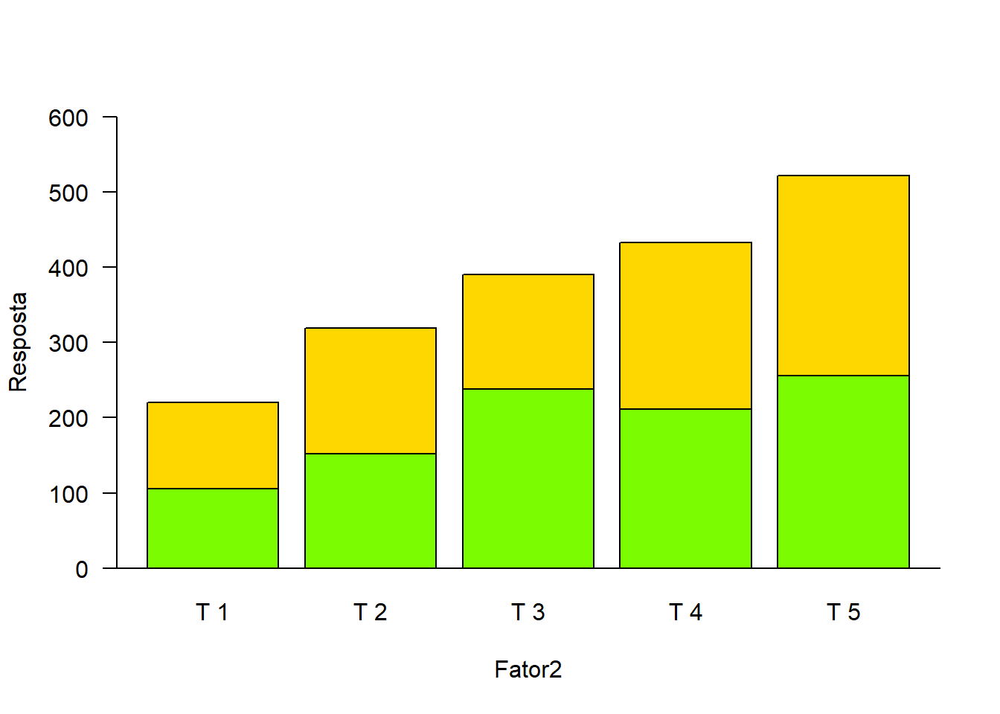

**Comandos**:

**las=1**: deixar escala do eixo Y na vertical

**col="cor"**: mudar cor das barras (Ex. "red","blue","green" ou gray.colors(quantidade de tonalidades) para escala cinza ou rainbow(quantidade de cores) para escala colorida. Também é possível específicar a cor de cada barra (col=c("red","green","yellow","gray","blue"))).

**xlab** e **ylab**: nomear eixo X e Y

**xlim** e **ylim**: escala do eixo X e Y

**abline(h=0)**: linha na horizontal em Y=0 (No caso de vertical, abline(v=0)). É possível alterar a cor pela função "col="cor"" e o tracejado pelo "lty=número" (Ver o Help do comando)

### Barras de desvio-padrão


```r
bar=barplot(media,beside=F, 
        las=1,col=c("lawngreen","gold"),
        ylab="Resposta",
        xlab="Tratamentos",
        ylim=c(0,600))
abline(h=0)
arrows(bar,media[1,]+desvio[1,],bar,media[1,]-desvio[1,],length = 0.1,angle=90,code=3)
arrows(bar,media[1,]+media[2,]+desvio[2,],bar,media[1,]+media[2,]-desvio[2,],length = 0.1,angle=90,code=3)
```


<br>

### Unidade do eixo Y 

(Ex. $Kg\ ha^{-1}$)


```r
bar=barplot(media, beside=F,
        las=1,col=c("lawngreen","gold"),
        ylab=expression(Resposta~~(kg~ha^-1)),
        xlab="Tratamentos",
        ylim=c(0,600))
abline(h=0)
arrows(bar,media[1,]+desvio[1,],bar,media[1,]-desvio[1,],length = 0.1,angle=90,code=3)
arrows(bar,media[1,]+media[2,]+desvio[2,],bar,media[1,]+media[2,]-desvio[2,],length = 0.1,angle=90,code=3)
```

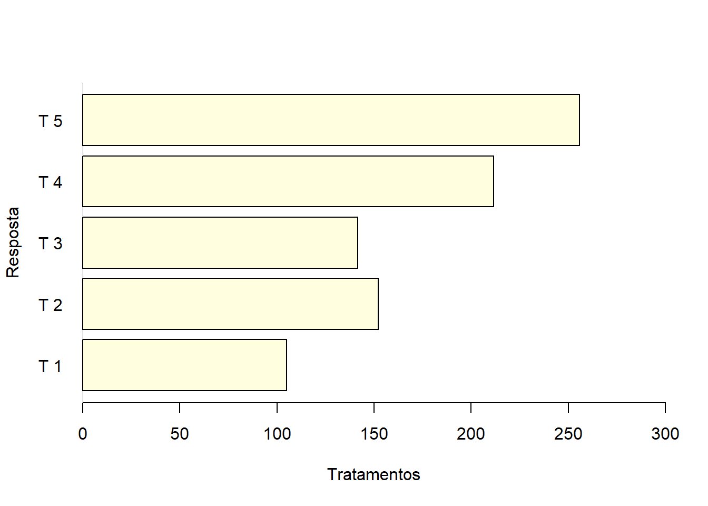

### Média acima das barras


```r
bar=barplot(media, beside=F,
        las=1,col=c("lawngreen","gold"),
        ylab=expression(Resposta~~(kg~ha^-1)),
        xlab="Tratamentos",
        ylim=c(0,600))
abline(h=0)
text(bar,media[1,]+desvio[1,]+20,media[1,], cex=0.8)
text(bar,media[1,]+media[2,]+desvio[2,]+20,media[2,], cex=0.8)
arrows(bar,media[1,]+desvio[1,],bar,media[1,]-desvio[1,],length = 0.1,angle=90,code=3)
arrows(bar,media[1,]+media[2,]+desvio[2,],bar,media[1,]+media[2,]-desvio[2,],length = 0.1,angle=90,code=3)
```


<br>

### Separação de casa decimal


```r
options(OutDec=",")
bar=barplot(media, beside=F,
        las=1,col=c("lawngreen","gold"),
        ylab=expression(Resposta~~(kg~ha^-1)),
        xlab="Tratamentos",
        ylim=c(0,600))
abline(h=0)
text(bar,media[1,]+desvio[1,]+20,media[1,], cex=0.8)
text(bar,media[1,]+media[2,]+desvio[2,]+20,media[2,], cex=0.8)
arrows(bar,media[1,]+desvio[1,],bar,media[1,]-desvio[1,],length = 0.1,angle=90,code=3)
arrows(bar,media[1,]+media[2,]+desvio[2,],bar,media[1,]+media[2,]-desvio[2,],length = 0.1,angle=90,code=3)
```


<br>

### Letras do teste de comparação 


```r
tukey=c("dB","dA","cB","cA","cB","cA","bB","bA","aB","aA")
options(OutDec=",")
bar=barplot(media, beside=F,
        las=1,col=c("lawngreen","gold"),
        ylab=expression(Resposta~~(kg~ha^-1)),
        xlab="Tratamentos",
        ylim=c(0,600))
abline(h=0)
text(bar,media[1,]+desvio[1,]+20,paste(media[1,], tukey[c(1,3,6,7,9)]), cex=0.8)
text(bar,media[1,]+media[2,]+desvio[2,]+20,paste(media[2,], tukey[c(2,4,6,8,10)]), cex=0.8)
arrows(bar,media[1,]+desvio[1,],bar,media[1,]-desvio[1,],length = 0.1,angle=90,code=3)
arrows(bar,media[1,]+media[2,]+desvio[2,],bar,media[1,]+media[2,]-desvio[2,],length = 0.1,angle=90,code=3)
```

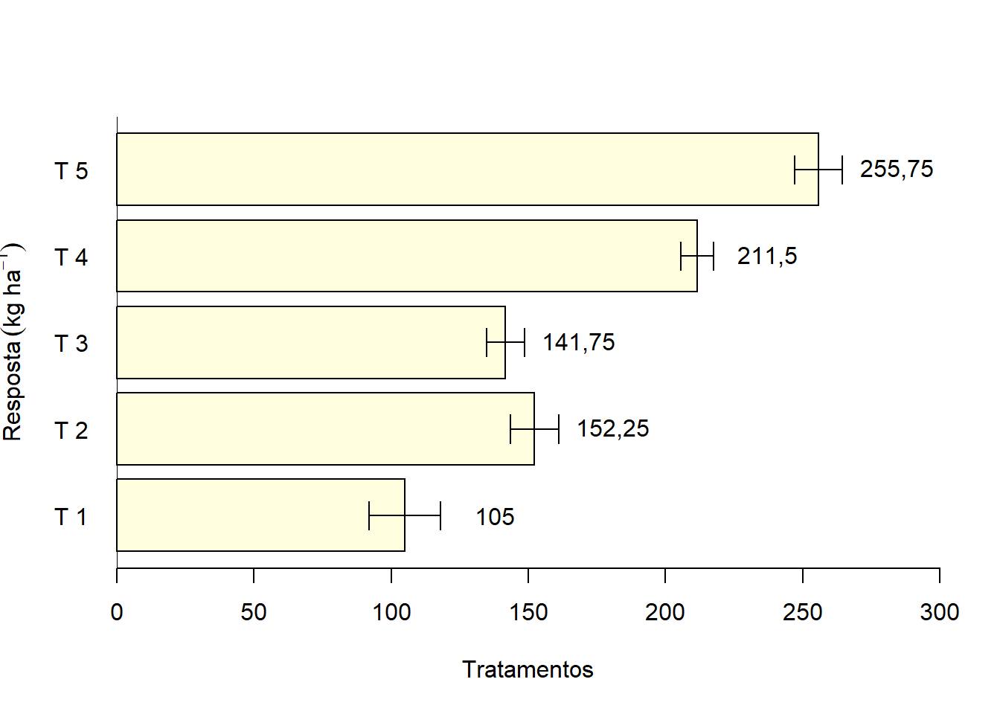

<br>

### Adicionando legenda

**legend.text=rownames(media)**: adicionar a legenda (neste caso em relação ao Fator 2)

**args.legend**: argumentos da legenda (x="topleft": legenda será adicionada no parte superior esquerda, podemos adicionar superior direito ("topright"), inferior esquerdo ("bottomleft"), inferior direito ("bottomright"), centralizado ("center"))


```r
tukey=c("dB","dA","cB","cA","cB","cA","bB","bA","aB","aA")
options(OutDec=",")
bar=barplot(media, 
            beside=F,
            legend.text = rownames(media),
            args.legend = list(x="topleft", bty="n"),
        las=1,col=c("lawngreen","gold"),
        ylab=expression(Resposta~(kg~ha^-1)),
        xlab="Tratamentos",
        ylim=c(0,600))
abline(h=0)
text(bar,media[1,]+desvio[1,]+20,paste(media[1,], tukey[c(1,3,6,7,9)]), cex=0.8)
text(bar,media[1,]+media[2,]+desvio[2,]+20,paste(media[2,], tukey[c(2,4,6,8,10)]), cex=0.8)
arrows(bar,media[1,]+desvio[1,],bar,media[1,]-desvio[1,],length = 0.1,angle=90,code=3)
arrows(bar,media[1,]+media[2,]+desvio[2,],bar,media[1,]+media[2,]-desvio[2,],length = 0.1,angle=90,code=3)
```


<br><br><br>

****

## Dois lados com escala positiva

****

<br>

### Conjunto de dados


```r
trat=rep(c("T1","T2","T3","T4","T5"),e=3)
mspa=c(8,10,12,18,20,22,28,30,32,38,40,42,48,50,52)
msr=c(14,15,16,19,20,21,24,25,26,29,30,31,34,35,36)
```

<br>

### Média e desvio-padrão


```r
m1=tapply(mspa, trat, mean)
m2=tapply(msr, trat, mean)
sd1=tapply(mspa, trat, sd)
sd2=tapply(msr, trat, sd)
```


```r
# alterando margem e configurando para dois plots um abaixo do outro
op <- list(mfrow = c(2,1),
          oma = c(5,4,0,0) + 0.1,
          mar = c(0,0,0,1))
```

<br>

### Somente colunas

**Obs.** Nesse caso em específico, estamos querendo que ambas as variáveis assumem respostas positivas. Todavia, queremo a coluna da variável MSPA acima e MSR abaixo. 


```r
par(op)
b1=barplot(m1, 
           axes=F, 
           col="blue",
           ylim=c(0,60),
           axisnames = F,
           las=1)
b2=barplot(m2, 
           axes=F,
           col="red",
           ylim=c(60,0),
           las=1)
```


<br>

### Escala do eixo Y


```r
par(op)
b1=barplot(m1, 
           axes=F, 
           col="blue",
           ylim=c(0,60),
           axisnames = F,
           las=1)
axis(2,seq(0,50,10),las=1)
b1=barplot(m2, 
           axes=F,
           col="red",
           ylim=c(60,0),
           axisnames = F,
           las=1)
axis(2,seq(0,50,10),las=1)
```

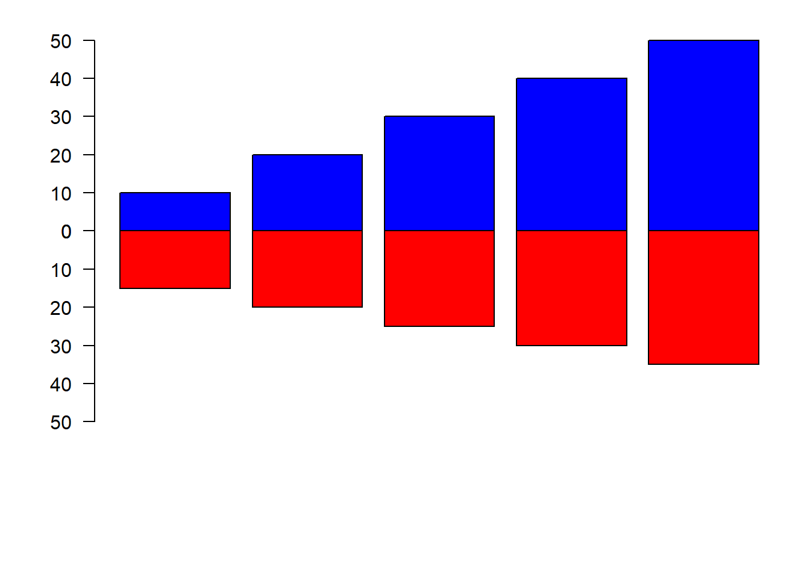

<br>

### Barras de desvio-padrão


```r
par(op)
b1=barplot(m1, 
           axes=F, 
           col="blue",
           ylim=c(0,60),
           axisnames = F,
           las=1)
axis(2,seq(0,50,10),las=1)
arrows(b1,m1+sd1,b1,m1-sd1,angle = 90,code=3, length = 0.05)
b2=barplot(m2, 
           axes=F,
           col="red",
           ylim=c(60,0),
           axisnames = F,
           las=1)
axis(2,seq(0,50,10),las=1)
arrows(b2,m2+sd2,b2,m2-sd2,angle = 90,code=3, length = 0.05)
```

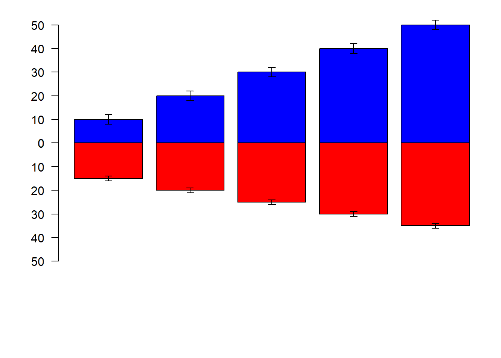

<br>

### Linha em 0 e título de Y


```r
par(op)
b1=barplot(m1, 
           axes=F, 
           col="blue",
           ylim=c(0,60),
           axisnames = F,
           las=1)
axis(2,seq(0,50,10),las=1)
arrows(b1,m1+sd1,b1,m1-sd1,angle = 90,code=3, length = 0.05)
b2=barplot(m2, 
           axes=F,
           col="red",
           ylim=c(60,0),
           axisnames = F,
           las=1)
axis(2,seq(0,50,10),las=1)
title(ylab = "Resposta",outer=T, line = 3)
arrows(b2,m2+sd2,b2,m2-sd2,angle = 90,code=3, length = 0.05)
abline(h=0)
```


<br>

### Título para MS (g)


```r
par(op)
b1=barplot(m1, 
           axes=F, 
           col="blue",
           ylim=c(0,60),
           axisnames = F,
           las=1)
axis(2,seq(0,50,10),las=1)
arrows(b1,m1+sd1,b1,m1-sd1,angle = 90,code=3, length = 0.05)
b2=barplot(m2, 
           axes=F,
           col="red",
           ylim=c(60,0),
#           axisnames = F,
           las=1)
axis(2,seq(0,50,10),las=1)
title(ylab = expression(MS~(g)),outer=T, line = 3)
arrows(b2,m2+sd2,b2,m2-sd2,angle = 90,code=3, length = 0.05)
abline(h=0)
```


<br>

### Coluna hachurada


```r
par(op)
b1=barplot(m1, 
           axes=F, 
           col="blue",
           density = 40,
           ylim=c(0,60),
           axisnames = F,
           las=1)
axis(2,seq(0,50,10),las=1)
arrows(b1,m1+sd1,b1,m1-sd1,angle = 90,code=3, length = 0.05)
b2=barplot(m2, 
           axes=F,
           col="red",
           ylim=c(60,0),
           density = 20,
#           axisnames = F,
           las=1)
axis(2,seq(0,50,10),las=1)
title(ylab = expression(MS~(g)),outer=T, line = 3)
arrows(b2,m2+sd2,b2,m2-sd2,angle = 90,code=3, length = 0.05)
abline(h=0)
```

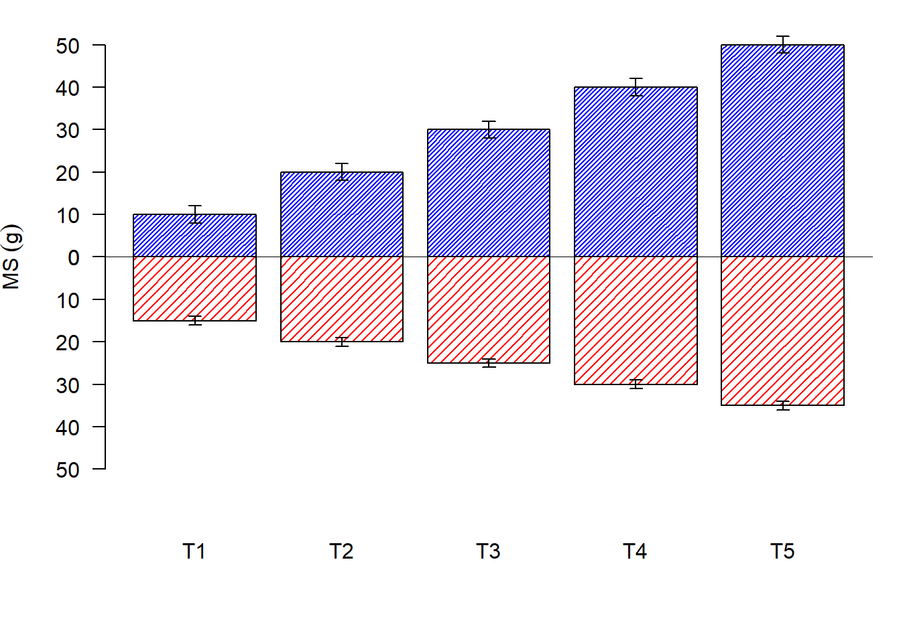

<br>

### Adicionando legenda


```r
par(op)
b1=barplot(m1, 
           axes=F, 
           col="blue",
           density = 40,
           ylim=c(0,60),
           axisnames = F,
           las=1)
axis(2,seq(0,50,10),las=1)
arrows(b1,m1+sd1,b1,m1-sd1,angle = 90,code=3, length = 0.05)
legend("topleft",
       fill=c("blue","red"),
       legend=c("MSPA","MSR"),
       density = c(40,20),
       bty="n")
b2=barplot(m2, 
           axes=F,
           col="red",
           ylim=c(60,0),
           density = 20,
#           axisnames = F,
           las=1)
axis(2,seq(0,50,10),las=1)
title(ylab = expression(MS~(g)),outer=T, line = 3)
arrows(b2,m2+sd2,b2,m2-sd2,angle = 90,code=3, length = 0.05)
abline(h=0)
```


<br>

### Teste de comparação


```r
par(op)
b1=barplot(m1, 
           axes=F, 
           col="blue",
           density = 40,
           ylim=c(0,60),
           axisnames = F,
           las=1)
axis(2,seq(0,50,10),las=1)
arrows(b1,m1+sd1,b1,m1-sd1,angle = 90,code=3, length = 0.05)
legend("topleft",
       fill=c("blue","red"),
       legend=c("MSPA","MSR"),
       density = c(40,20),
       bty="n")
text(b1,m1+sd1+5,c("e","d","c","b","a"))
b2=barplot(m2, 
           axes=F,
           col="red",
           ylim=c(60,0),
           density = 20,
#           axisnames = F,
           las=1)
axis(2,seq(0,50,10),las=1)
text(b2,m2+sd2+5,c("e","d","c","b","a"))
title(ylab = expression(MS~(g)),outer=T, line = 3)
arrows(b2,m2+sd2,b2,m2-sd2,angle = 90,code=3, length = 0.05)
abline(h=0)
```


<br>

### Mudando fonte 


```r
par(family="serif")
par(op)
b1=barplot(m1, 
           axes=F, 
           col="blue",
           density = 40,
           ylim=c(0,60),
           axisnames = F,
           las=1)
axis(2,seq(0,50,10),las=1)
arrows(b1,m1+sd1,b1,m1-sd1,angle = 90,code=3, length = 0.05)
legend("topleft",
       fill=c("blue","red"),
       legend=c("MSPA","MSR"),
       density = c(40,20),
       bty="n")
text(b1,m1+sd1+5,c("e","d","c","b","a"))
b2=barplot(m2, 
           axes=F,
           col="red",
           ylim=c(60,0),
           density = 20,
#           axisnames = F,
           las=1)
axis(2,seq(0,50,10),las=1)
text(b2,m2+sd2+5,c("e","d","c","b","a"))
title(ylab = expression(MS~(g)),outer=T, line = 3)
arrows(b2,m2+sd2,b2,m2-sd2,angle = 90,code=3, length = 0.05)
abline(h=0)
```


<br><br><br>

****

# Gráfico de Barras

****

<br>

O gráfico em barras consiste em construir retângulos, em que uma das dimensões é proporcional à magnitude a ser representada ($n_i$ ou $f_i$), sendo a outra arbitrária, porém igual para todas as barras. Essas colunas são dispostas paralelamente umas às outras de forma horizontal.

Além do título e fonte de referências deve-se observar o seguinte:

- as barras devem ter todas a mesma largura;
- a distância entre as barras deve ser constante e de preferência menor que a largura das barras.

<br>

### Conjunto de dados


```r
tratamentos=rep(c(paste("T",1:5)),e=4)
resposta=c(100,120,110,90,150,145,149,165,150,144,134,139,220,206,210,210,266,249,248,260)
## Média e Desvio-padrão (Por Tratamento)
media=tapply(resposta,tratamentos, mean)
desvio=tapply(resposta,tratamentos,sd)
```

<br>

### Gráfico básico


```r
barplot(media, horiz = T)
```


<br>

### Melhorias


```r
barplot(media, horiz = T, 
        las=1,
        col="lightyellow",
        ylab="Resposta",
        xlab="Tratamentos",
        xlim=c(0,300))
abline(v=0)
```


<br>

### Barras de desvio-padrão


```r
bar=barplot(media, 
        las=1,horiz = T,
        col="lightyellow",
        ylab="Resposta",
        xlab="Tratamentos",
        xlim=c(0,300))
abline(v=0)
arrows(media+desvio,bar,media-desvio,bar,length = 0.1,angle=90,code=3)
```


<br>

### Unidade do eixo Y 

(Ex. $Kg\ ha^{-1}$)


```r
bar=barplot(media, 
        las=1,horiz = T,
        col="lightyellow",
        ylab=expression("Resposta"*" "*(kg*" "*ha^-1)),
        xlab="Tratamentos",
        xlim=c(0,300))
abline(v=0)
arrows(media+desvio,bar,media-desvio,bar,length = 0.1,angle=90,code=3)
```


<br>

### Média acima das barras


```r
bar=barplot(media, 
        las=1,horiz = T,
        col="lightyellow",
        ylab=expression("Resposta"*" "*(kg*" "*ha^-1)),
        xlab="Tratamentos",
        xlim=c(0,300))
abline(v=0)
text(media+desvio+20,bar,media)
arrows(media+desvio,bar,media-desvio,bar,length = 0.1,angle=90,code=3)
```


<br>

### Separação de casa decimal


```r
options(OutDec=",")
bar=barplot(media, 
        las=1,horiz = T,
        col="lightyellow",
        ylab=expression("Resposta"*" "*(kg*" "*ha^-1)),
        xlab="Tratamentos",
        xlim=c(0,300))
abline(v=0)
text(media+desvio+20,bar,media)
arrows(media+desvio,bar,media-desvio,bar,length = 0.1,angle=90,code=3)
```


<br>

### Letras do teste de comparação 


```r
tukey=c("d","c","c","b","a")
options(OutDec=",")
bar=barplot(media, 
        las=1,horiz = T,
        col="lightyellow",
        ylab=expression("Resposta"*" "*(kg*" "*ha^-1)),
        xlab="Tratamentos",
        xlim=c(0,300))
abline(v=0)
text(media+desvio+20,bar,paste(round(media,0),tukey))
arrows(media+desvio,bar,media-desvio,bar,length = 0.1,angle=90,code=3)
```


<br><br><br>

# Caixas (Boxplot)

****

<br>

O *boxplot* (gráfico de caixa) é um gráfico utilizado para avaliar a distribuição empírica do dados. O *boxplot* é formado pelo primeiro e terceiro quartil e pela mediana. As hastes inferiores e superiores se estendem, respectivamente, do quartil inferior até o menor valor não inferior ao limite inferior e do quartil superior até o maior valor não superior ao limite superior. Os limites são calculados da forma abaixo

**Limite inferior**: $\max\{\min(\text{dados});Q_1-1,5(Q_3-Q_1)\}$.

**Limite superior**: $\min\{\max(\text{dados});Q_3+1,5(Q_3-Q_1)\}$.

Para este caso, os pontos fora destes limites são considerados valores discrepantes (*outliers*). A Figura  a seguir apresenta um exemplo do formato de um *boxplot*.

<center>


</center>


Existem várias formas de entrada ou leitura de dados no R. Para um conjunto de dados pequeno, pode-se entrar com as informações diretamente no console do programa. Considere um delineamento inteiramente ao acaso com 5 tratamentos e 4 repetições. A entrada dos dados, entre outras, poderia ser da forma:

<br>


```r
tratamentos=rep(c(paste("T", sep='', 1:5)), each=4)
resposta = c(100, 120, 110,  90, 150, 145, 149, 165, 150, 144, 134, 139, 220, 206, 210, 210, 266, 249, 248, 260)
## Médias e Desvioss-padrão (por Tratamento)
(Médias = tapply(resposta, tratamentos, mean))
```

```
##     T1     T2     T3     T4     T5 
## 105,00 152,25 141,75 211,50 255,75
```

```r
(Desvios = tapply(resposta, tratamentos, sd))
```

```
##        T1        T2        T3        T4        T5 
## 12,909944  8,770215  6,849574  5,972158  8,732125
```

<br>


```r
boxplot(resposta ~ tratamentos)
# Ou, pode-se usar o comando ``Boxplot`` do pacote ``car``
require(car)
Boxplot(resposta ~ tratamentos)
```


<br>

Uma vantagem do comando ``Boxplot`` é que se houver *outlier*, ele já identifica a pposição do elemento discrepante.

<br>

### Melhorias


```r
boxplot(resposta ~ tratamentos, 
        las=1,
        col="lightyellow",
        xlab="Tratamentos",
        ylab="Resposta",
        ylim=c(0,300))
```


<br>

**Comandos usados**:

* ``las=1``: mostrar a escala do eixo no sentido horizontal;

* ``col="cor"``: mudar a cor das colunas (Ex. "red", "blue", "green" ou ``gray.colors``(quantidade de tonalidades) para escala cinza ou ``rainbow``(quantidade de cores) para escala colorida. Também é possível especificar a cor de cada coluna (``col``=c("red", "green", "yellow", "gray", "blue")));

* ``xlab`` e ``ylab``: nomear os eixos $X$ e $Y$;

* ``xlim`` e ``xlim``: mudar as escalas dos eixox $X$ e $Y$;

<br>

### Plotando médias


```r
boxplot(resposta ~ tratamentos, 
        las=1,
        col="lightyellow",
        xlab="Tratamentos",
        ylab="Resposta",
        ylim=c(50,300))

points(Médias, pch='+', col="red")
```


<br>

### Unidade do eixo Y 

Caso a variável resposta seja Produção ($kg/ha$), inclui-se tal informação usando-se o comando ``expression``.


```r
boxplot(resposta ~ tratamentos,
        las=1,
        col="lightyellow",
        xlab="Tratamentos",
        ylab=expression(Produção~~(kg~ha^-1)),
        ylim=c(50,300))
points(Médias, pch='+', col="red")
```

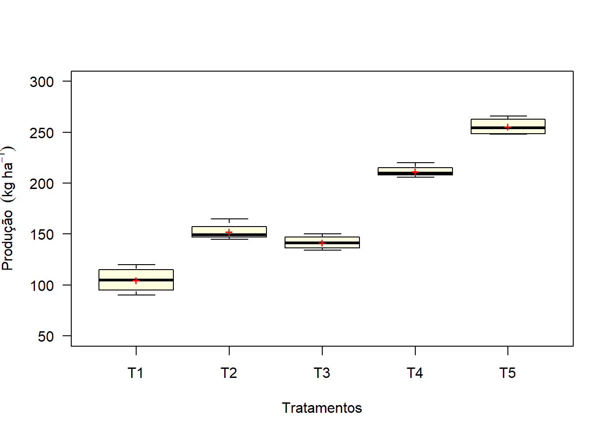

<br>

### Limites superior e inferior


```r
limites = tapply(resposta, tratamentos, boxplot.stats)
superior=c(limites$`T1`$stats[5],
           limites$`T2`$stats[5],
           limites$`T3`$stats[5],
           limites$`T4`$stats[5],
           limites$`T5`$stats[5])
```

<br>

### Média acima das barras


```r
boxplot(resposta ~ tratamentos,
        las=1,
        col="lightyellow",
        xlab="Tratamentos",
        ylab=expression("Produção"~~(kg~ha^-1)),
        ylim=c(50,300))
points(Médias, pch='+', col="red")
text(c(1:5), superior + 10, Médias)
```


<br>

### Separação de casa decimal


```r
options(OutDec=",")
boxplot(resposta ~ tratamentos,
        las=1,
        col="lightyellow",
        xlab="Tratamentos",
        ylab=expression("Produção"~~(kg~ha^-1)),
        ylim=c(50,300))
points(Médias, pch='+', col="red")
text(c(1:5), superior + 20, Médias)
```

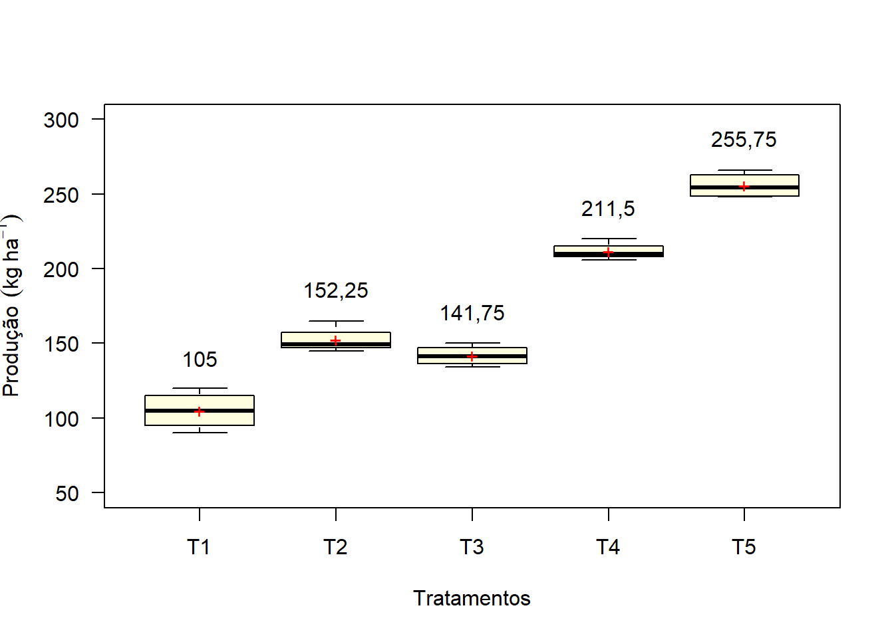

<br>

### Letras do teste de comparação


```r
tukey=c("d","c","c","b","a")
options(OutDec=",")
boxplot(resposta ~ tratamentos,
        las=1,
        col="lightyellow",
        xlab="Tratamentos",
        ylab=expression("Produção"~(kg~ha^-1)),
        ylim=c(50,300))
points(Médias, pch='+', col="red")
text(c(1:5), superior + 20, paste(round(Médias, 0), tukey))
```

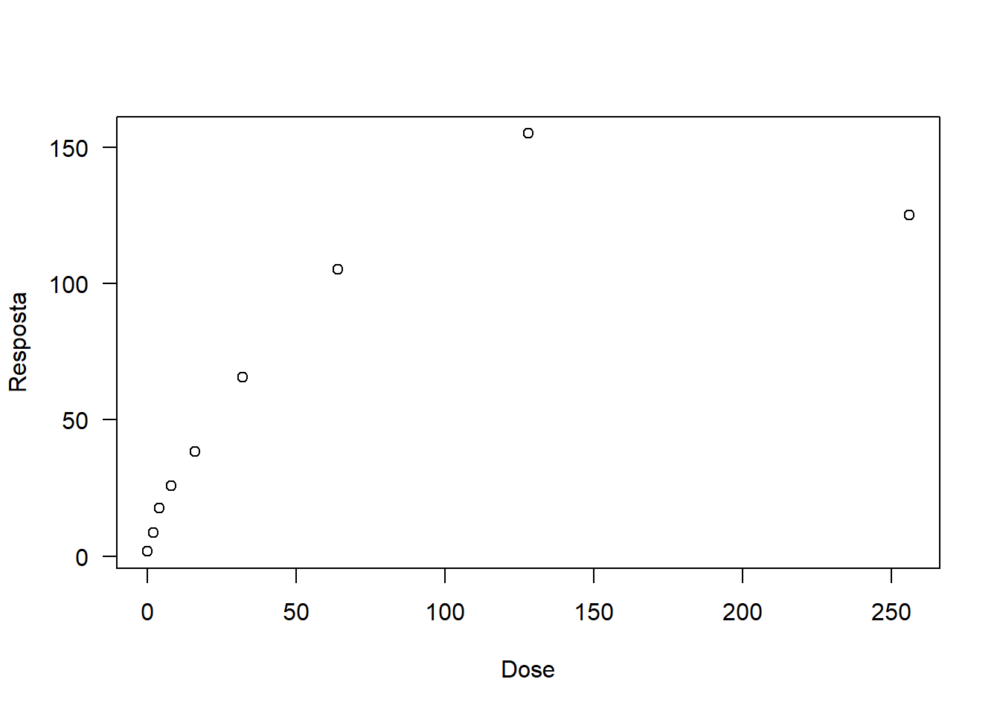

<br><br>

## Pacote ggplot2

Vamos trabalhar com um experimento em DIC com quatro tratamentos e quatro repetições cada.


```r
exp1=c(17,22,13,14,18,19,16,21,9,16,15,8,25,26,23,40)
Trat=rep(c(paste("T",1:4)),e=4)
dados=data.frame(Trat,exp1)
dados$Trat=as.factor(Trat)
```

**Obs.** Para facilitar, vamos realizar a análise direto pelo pacote ExpDes.pt (é necessário instalar o pacote)

<br>

### Análise de variância


```r
ExpDes.pt::dic(Trat,exp1)
```

```
## ------------------------------------------------------------------------
## Quadro da analise de variancia
## ------------------------------------------------------------------------
##            GL     SQ QM     Fc     Pr>Fc
## Tratamento  3 582,75    7,9556 0,0034723
## Residuo    12 293,00                    
## Total      15 875,75                    
## ------------------------------------------------------------------------
## CV = 26,18 %
## 
## ------------------------------------------------------------------------
## Teste de normalidade dos residuos 
## Valor-p:  0,06507919 
## De acordo com o teste de Shapiro-Wilk a 5% de significancia, os residuos podem ser considerados normais.
## ------------------------------------------------------------------------
## 
## ------------------------------------------------------------------------
## Teste de homogeneidade de variancia 
## valor-p:  0,237053 
## De acordo com o teste de bartlett a 5% de significancia, as variancias podem ser consideradas homogeneas.
## ------------------------------------------------------------------------
## 
## Teste de Tukey
## ------------------------------------------------------------------------
## Grupos Tratamentos Medias
## a 	 T 4 	 28,5 
## ab 	 T 2 	 18,5 
##  b 	 T 1 	 16,5 
##  b 	 T 3 	 12 
## ------------------------------------------------------------------------
```

<br>

## Utilizando o *ggplot2*


```r
library(ggplot2)
```

<br>

### Gráfico básico


```r
ggplot(dados, 
       aes(x=Trat,y=exp1))+
  geom_boxplot()
```


<br>

### Modificando cores


```r
ggplot(dados, 
       aes(x=Trat,y=exp1))+
  geom_boxplot(fill="lightgreen",          # Cor da caixa
               colour="red",               # cor do contorno
               outlier.colour = "blue",    # Cor do contorno do outlier
               outlier.shape = 10,          # Formato do ponto do outlier
               outlier.size = 2)           # Tamanho do outlier
```


<br>

### Cor por tratamento


```r
ggplot(dados, 
       aes(x=Trat,y=exp1))+
  geom_boxplot(aes(fill=dados$Trat))
```


<br>

### Nome dos eixos


```r
ggplot(dados, 
       aes(x=Trat,y=exp1))+
  geom_boxplot(fill="lightgreen",          
               colour="red",               
               outlier.colour = "blue",    
               outlier.shape = 10,          
               outlier.size = 2)+      
  ylab("Resposta")+
  xlab("Tratamentos")
```


<br>

### linha de grade e cor de fundo


```r
ggplot(dados, 
       aes(x=Trat,y=exp1))+
  geom_boxplot(fill="lightgreen", 
               colour="black",    
               outlier.colour = "blue",
               outlier.shape = 10,     
               outlier.size = 2)+      
  ylab("Resposta")+
  xlab("Tratamentos")+
  theme_bw()+
  theme_classic()
```


<br>

### Letras do teste de Tukey

**Obs.** Neste exemplo vamos adicionar as letras abaixo das caixas e alinhado em y=1


```r
a=data.frame(Trat=levels(as.factor(Trat)),
             exp1=c(1,1,1,1),                # Deve ter o mesmo da variável
                                             # esse 1 é para Y=1
             letra=c("b","ab","b","a"))
ggplot(dados, 
       aes(x=Trat,y=exp1))+
  geom_boxplot(fill="lightgreen", 
               colour="black",    
               outlier.colour = "blue",
               outlier.shape = 10,     
               outlier.size = 2)+      
  ylab("Resposta")+
  xlab("Tratamentos")+
  theme_bw()+
  theme_classic()+
  geom_text(data = a, aes(label = letra))
```

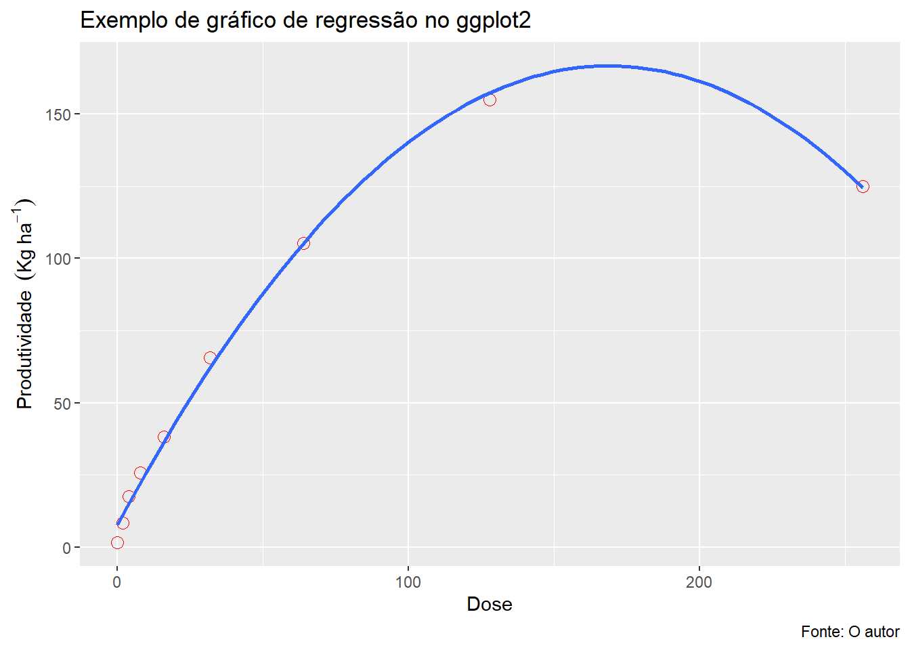

<br>

## *Package* ggpubr


```r
library(ggpubr)
ggboxplot(dados,            # data.frame com os dados e tratamentos
          'Trat',           # Nome do tratamento entre aspas
          'exp1')           # Nome da resposta
```


<br>

### Cor da caixa


```r
ggboxplot(dados,
          'Trat',
          'exp1', 
          fill="red")
```


<br>

### Cor de contorno


```r
ggboxplot(dados,
          'Trat',
          'exp1', 
          fill="red",
          color = "blue")
```


<br>

### Inserindo título


```r
ggboxplot(dados,
          'Trat',
          'exp1', 
          fill="red",
          color = "blue",
          title="(A)")
```

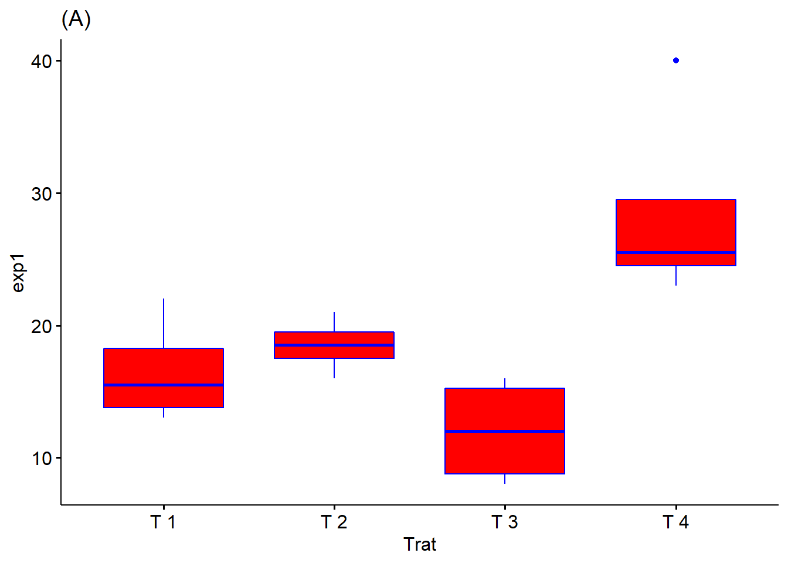

<br>

### Nome dos eixos X e Y


```r
ggboxplot(dados,
          'Trat',
          'exp1', 
          fill="red",
          color = "black",
          title="(A)",
          xlab="Tratamentos",
          ylab="Resposta")
```

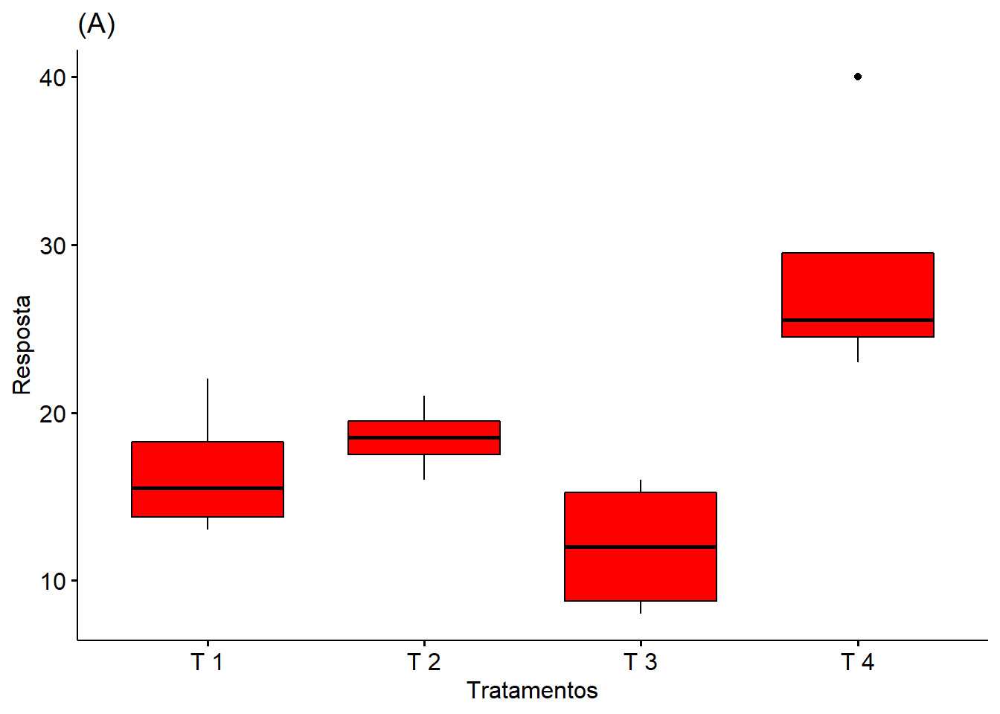

<br>

### Ponto da média


```r
ggboxplot(dados,
          'Trat',
          'exp1', 
          fill="red",
          color = "black",
          title="(A)",
          xlab="Tratamentos",
          ylab="Resposta",
          add="mean")
```


<br>

**Obs.** Podemos usar ao invés de `"mean"`, os seguintes argumentos:

- `mean_se`: Média e erro padrão
- `mean_sd`: Média e desvio-padrão
- `mean_ci`: Média e intervalo de confiança
- `median`: Mediana
- `point`: pontos referente às observações

Para mais informações consultar atráves de: `desc_stat`

<br>

### Letras do teste de Tukey


```r
a=data.frame(Trat=levels(as.factor(Trat)),
             exp1=c(1,1,1,1),                # Deve ter o mesmo da variável
                                             # esse 1 é para Y=1
             letra=c("b","ab","b","a"))
ggboxplot(dados,
          'Trat',
          'exp1', 
          fill="red",
          color = "black",
          title="(A)",
          xlab="Tratamentos",
          ylab="Resposta",
          add="mean",
          ylim=c(0,40))+
  geom_text(data = a, aes(label = letra))
```

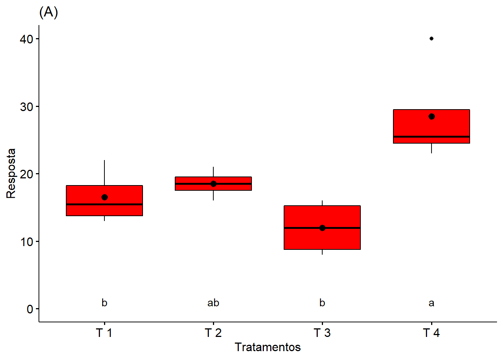

<br><br><br>

****

# Regressão

****

O gráfico de regressão pode ser construído utilizando um gráfico de dispersão. Assim, uma análise gráfica preliminar é realizada construindo-se o gráfico de dispersão entre as variáveis em questão. Este gráfico é importante em qualquer análise de regressão já que por meio dele é possível ter uma noção do tipo de relação existente entre as variáveis (relação linear, quadrática). Esta relação na maioria das vezes não é perfeita, ou seja, os pontos não estão dispostos perfeitamente sobre a função que relaciona as duas variáveis mas deseja-se que estes pontos estejam próximos. A curva da regressão é construída sobre o gráfico de dispersão mediante às respectivas análises a serem consideradas para definir o melhor modelo.

<br>

### Conjunto de dados


```r
tratamentos=rep(c(0,2,4,8,16,32,64,128,256),e=4)
resposta=c(0,1,2,4,8,7,9,10,15,17,18,20,25,26,24,28,36,39,38,40,60,68,65,70,100,110,104,107,150,155,156,159,120,130,126,124)
## Média e Desvio-padrão (Por Tratamento)
Dose=c(0,2,4,8,16,32,64,128,256)
media=tapply(resposta,tratamentos, mean)
desvio=tapply(resposta,tratamentos,sd)
```

<br>

### Gráfico básico


```r
plot(media~Dose)
```

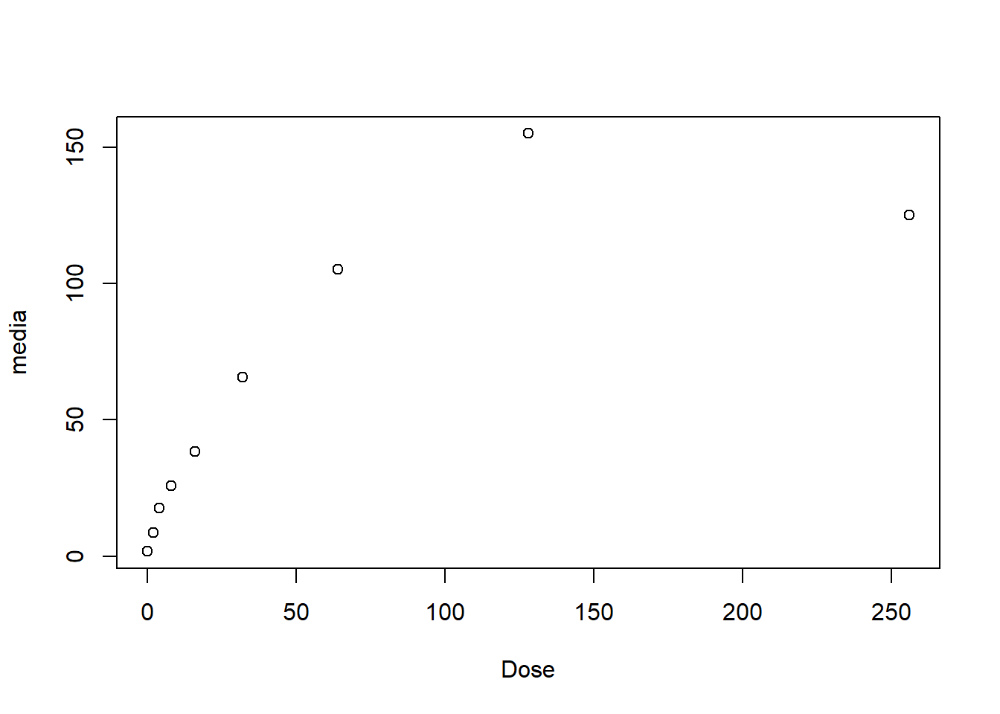

### Melhorias


```r
plot(media~Dose, 
        las=1,
        ylab="Resposta",
        xlab="Dose")
```


<br>

### Barras de desvio-padrão


```r
reg=plot(media~Dose, 
        las=1,
        ylab="Resposta",
        xlab="Dose")
arrows(Dose,media+desvio,Dose,media-desvio,length = 0.05,angle=90,code=3)
```

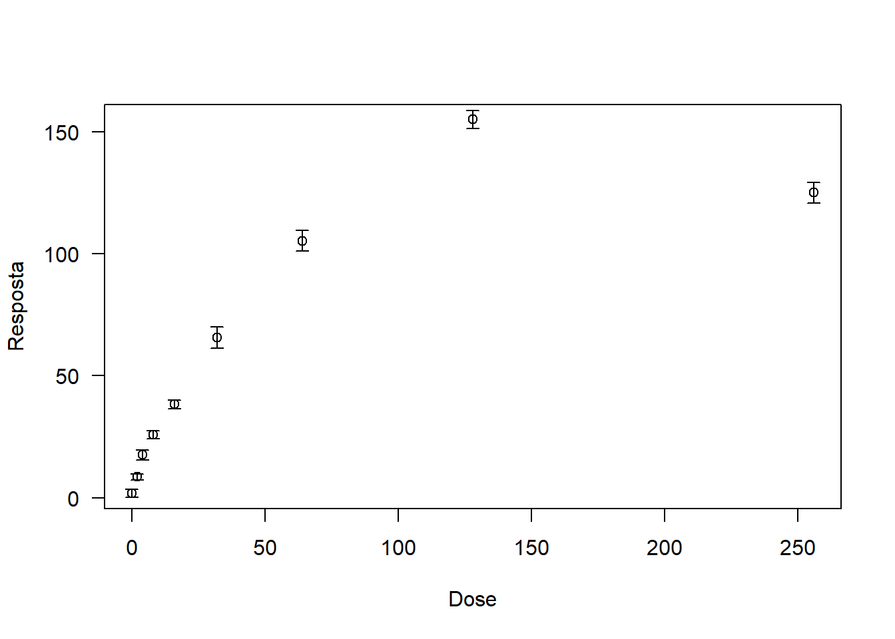

Adicionando barras de desvio-padrão de largura 0.05 (length=0.05), com angulo de 90 graus e tipo de flecha 3 (T ou T invertido)

<br>

### Unidade do eixo 

Y (Ex. $Kg\ ha^{-1}$) e X(Ex.$Kg\ ha^{-1}\ ano^{-1}$)


```r
reg=plot(media~Dose, 
        las=1,
        ylab=expression("Resposta"~~(kg~ha^-1)),
        xlab=expression("Dose"~(kg~ha^-1~ano^-1)))
arrows(Dose,media+desvio,Dose,media-desvio,length = 0.02,angle=90,code=3)
```


A função expression também pode ser usada para textos em gráficos (Função "text()" - veremos posteriormente).

<br>

### Separação de casa decimal


```r
options(OutDec=",")
reg=plot(media~Dose, 
        las=1,
        ylab=expression("Resposta"~~(kg~ha^-1)),
        xlab=expression("Dose"~~(kg~ha^-1~ano^-1)))
arrows(Dose,media+desvio,Dose,media-desvio,length = 0.02,angle=90,code=3)
```


A função "options(OutDec=",")" converte a casa decimal de todas as saídas posteriores ao comando para vírgula, entretanto a função não altera para gráficos do pacote ggplot2.

<br>

### Curva de Tendência


```r
modelo=lm(media~Dose+I(Dose^2))
summary(modelo)
```

```
## 
## Call:
## lm(formula = media ~ Dose + I(Dose^2))
## 
## Residuals:
##     Min      1Q  Median      3Q     Max 
## -6,0101 -2,3298  0,5233  2,3045  3,4953 
## 
## Coefficients:
##               Estimate Std. Error t value Pr(>|t|)    
## (Intercept)  7,7601301  1,7653406   4,396  0,00459 ** 
## Dose         1,8811023  0,0566083  33,230 4,94e-08 ***
## I(Dose^2)   -0,0055671  0,0002241 -24,847 2,80e-07 ***
## ---
## Signif. codes:  0 '***' 0,001 '**' 0,01 '*' 0,05 '.' 0,1 ' ' 1
## 
## Residual standard error: 3,709 on 6 degrees of freedom
## Multiple R-squared:  0,9967,	Adjusted R-squared:  0,9956 
## F-statistic: 899,4 on 2 and 6 DF,  p-value: 3,674e-08
```

```r
plot(media~Dose, 
     las=1,
     ylim=c(0,200),
     col="red",
     pch=16,
     ylab=expression("Resposta"~~(kg~ha^-1)),
     xlab=expression("Dose"~~(kg~ha^-1~ano^-1)))
arrows(Dose,media+desvio,Dose,media-desvio,length = 0.02,angle=90,code=3)
curve(modelo$coefficients[1]+modelo$coefficients[2]*x+modelo$coefficients[3]*x^2, add=T,col="blue")
```

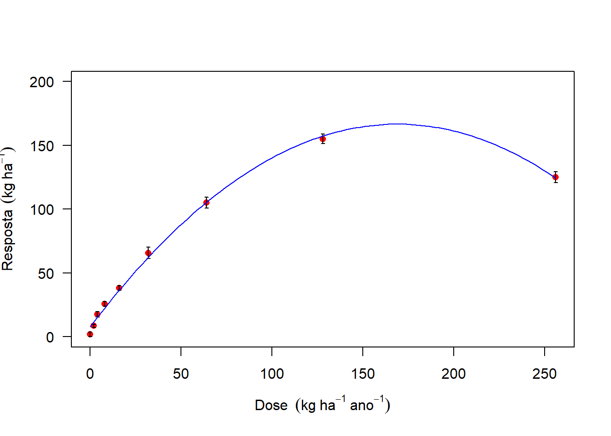

<br>

### Pontos de máximo/mínimo


```r
## Para encontrar o ponto de máximo ou mínimo em equação quadrática, fazer derivada primeira de Y=0

(x=-modelo$coefficients[2]/(2*modelo$coefficients[3]))
```

```
##     Dose 
## 168,9481
```

```r
(y=modelo$coefficients[1]+modelo$coefficients[2]*x+modelo$coefficients[3]*x^2)
```

```
## (Intercept) 
##    166,6644
```


```r
plot(media~Dose, 
     las=1,
     ylim=c(0,200),
     col="red",
     pch=16,
     ylab=expression("Resposta"~~(kg~ha^-1)),
     xlab=expression("Dose"~~(kg~ha^-1~ano^-1)))
arrows(Dose,media+desvio,Dose,media-desvio,length = 0.02,angle=90,code=3)
curve(modelo$coefficients[1]+modelo$coefficients[2]*x+modelo$coefficients[3]*x^2, add=T,col="blue")
abline(h=y,col="red",lty=2)
abline(v=x,col="red",lty=2)
points(x,y,pch=8,col="black")
```

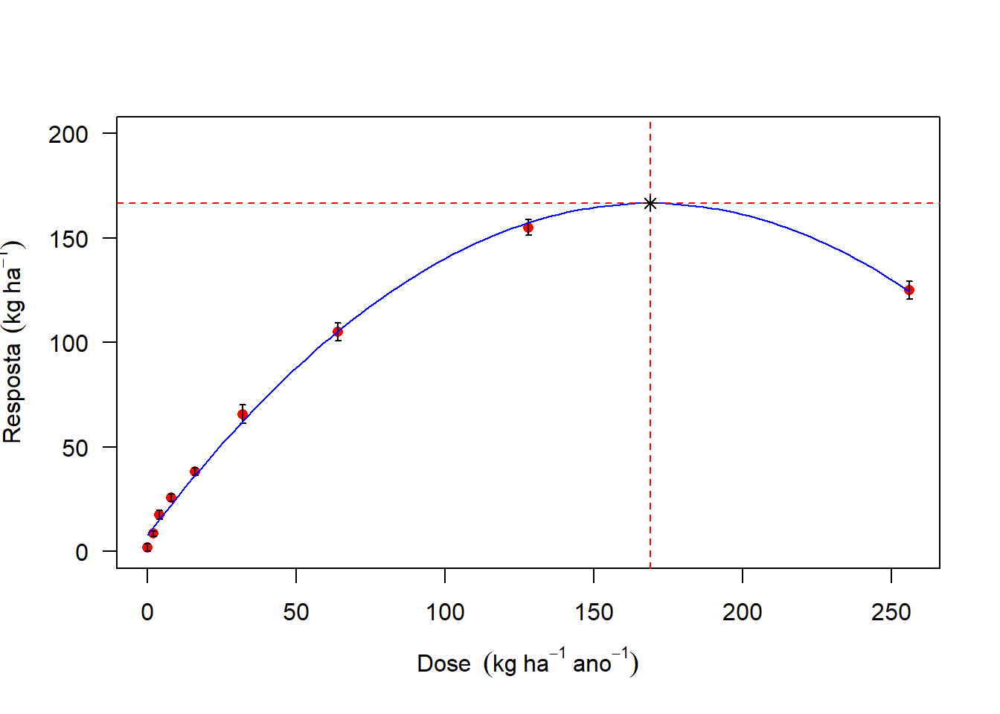

<br>

### Equação e R^2


```r
plot(media~Dose, 
     las=1,
     ylim=c(0,200),
     col="red",
     pch=16,
     ylab=expression("Resposta"~~(kg~ha^-1)),
     xlab=expression("Dose"~~(kg~ha^-1~ano^-1)))
arrows(Dose,media+desvio,Dose,media-desvio,length = 0.02,angle=90,code=3)
curve(modelo$coefficients[1]+modelo$coefficients[2]*x+modelo$coefficients[3]*x^2, add=T,col="blue")
abline(h=y,col="red",lty=2)
abline(v=x,col="red",lty=2)
points(x,y,pch=8,col="black")
text(100,50,expression(Y==7.76013+1.881102*x-0.005567102 *x^2),cex=0.8)
text(100,40,expression(R^2==1.00),cex=0.8)
```

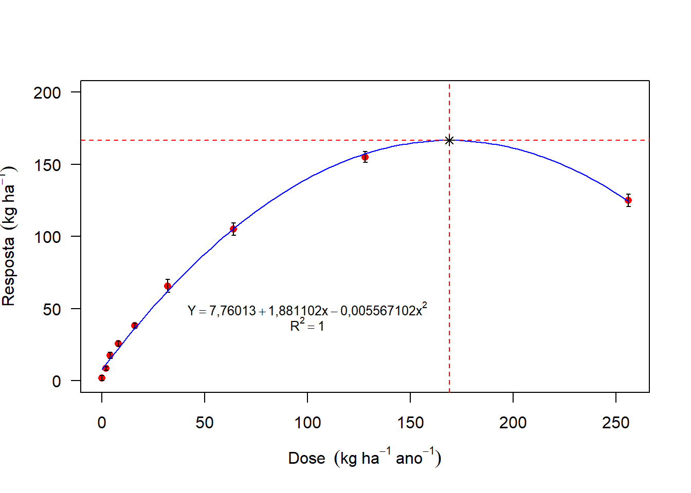

<br><br>

****

## Usando o pacote ggplot2

****

<br>

### Gráfico básico


```r
library(ggplot2)
dados=data.frame(Dose,media)
ggplot(dados, aes(x=Dose, y=media)) + geom_point()
```

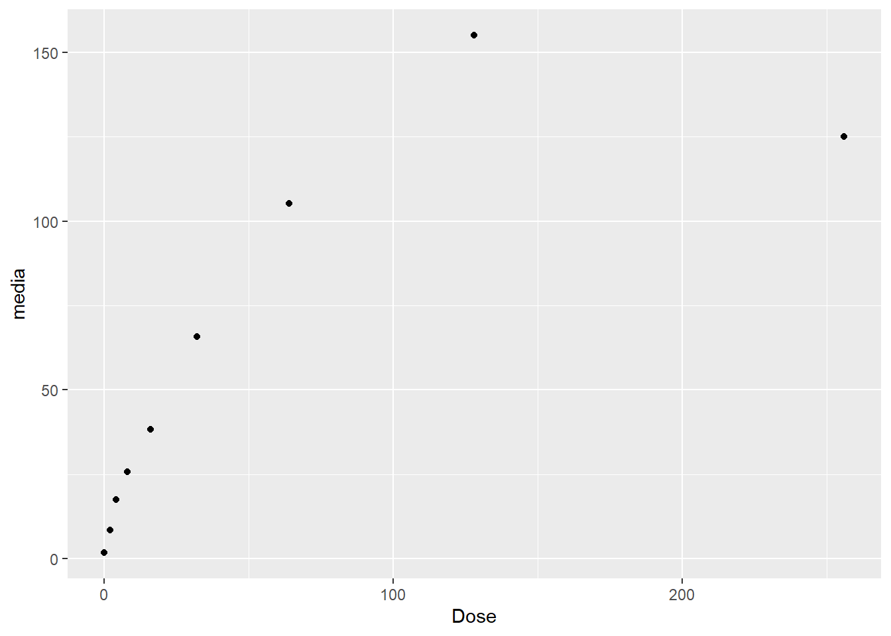

<br>

### Editando gráfico


```r
(grafico=ggplot(dados, 
                aes(x=Dose, y=media)) + 
   geom_point(colour="red", size=3, shape=1)+
   geom_smooth(method="lm", se = F, formula = y~poly(x,2), show.legend = T) +
   labs(title = "Exemplo de gráfico de regressão no ggplot2",
       y = expression(Produtividade~~(Kg~ha^-1)), x = "Dose",
       caption = "Fonte: O autor"))
```


geom_point(colour="red", size=3, shape=1): gráfico de dispersão, com pontos de cor vermelha, de tamanho 3 e formato 2 (Círculo sem preenchimento interno)

geom_smooth(method="lm", se = F, formula = y~poly(x,2)): Comando para plotar curva de tendência para regressão polinomial de grau 2 (Quadrático)

labs = nomear os eixos e títulos dos gráficos

<br>

### Plotando equação


```r
texto <- sprintf('y = %.2f + %.2fx %.2fx², r² = %.2f',modelo$coefficients[1],modelo$coefficients[2],modelo$coefficients[3],summary(modelo)$r.squared)
```

<br>

### Plotando o texto 


```r
(grafico=grafico+
   geom_text(aes(x=x, y=y, label=texto), hjust=1, vjust=16))
```

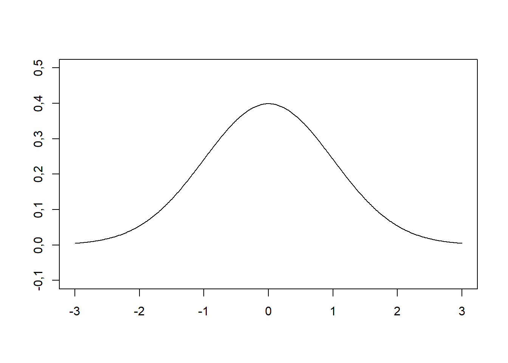

<br>

### Removendo cor de fundo


```r
(grafico=grafico+
   theme_bw())
```


<br>

### Removendo grade


```r
(grafico=grafico+
   theme_classic())
```


```r
(grafico=grafico+
   theme(axis.title = element_text(size = 12),
          axis.text = element_text(size = 12)))
```

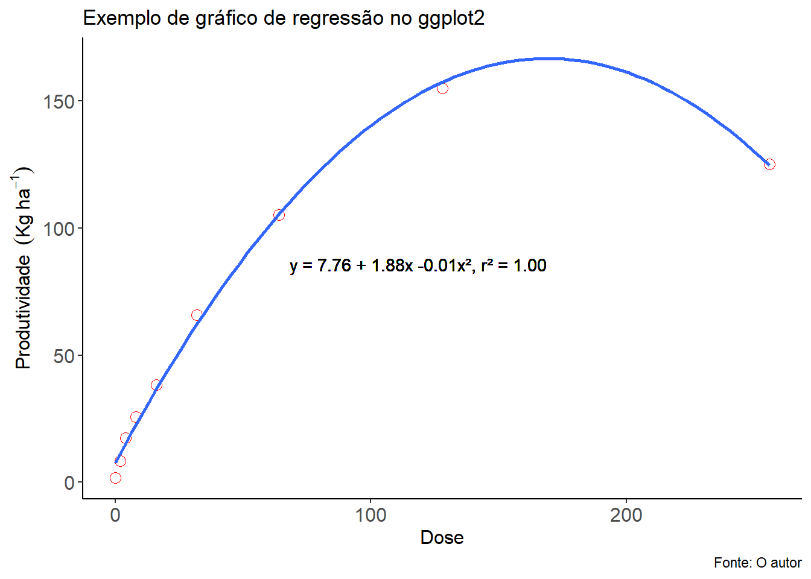

<br>

### Ponto de máximo/mínimo


```r
(grafico=grafico+
   geom_vline(xintercept = x, colour="red", linetype="dotted", size=1.2)+
   geom_hline(yintercept =y,colour='red', linetype='dotted', size=1.3))
```


<br>

### Tipos de linhas


```r
d=data.frame(lt=c("blank", "solid", "dashed", "dotted", "dotdash", "longdash", "twodash", "1F", "F1", "4C88C488", "12345678"))
ggplot()+
  scale_x_continuous(name="",limits=c(0,1))+
  scale_y_discrete(name="linetype")+
  theme_bw()+
  theme_classic()+
  scale_linetype_identity()+
  geom_segment(data=d, mapping=aes(x=0, xend=1, y=d$lt, yend=d$lt, linetype=d$lt))
```


<br><br><br>

****

## Duas curvas

****

<br>

### Conjunto de dados

**Variável**:

- **resposta**: Resposta do tratamento A
- **resposta1**: Resposta do tratamento B

**Doses**: 0,2,4,8,16,32,64,128,256


```r
dose=rep(c(0,2,4,8,16,32,64,128,256),e=4)
resposta=c(0,1,2,4,8,7,9,10,15,17,18,20,25,26,24,28,36,39,38,40,60,68,65,70,100,110,104,107,150,155,156,159,120,130,126,124)
resposta1=c(20,21,22,24,28,27,29,26,35,37,38,40,45,46,44,48,56,59,58,60,80,88,85,90,120,130,124,127,160,165,166,169,140,150,146,144)
Dose=c(0,2,4,8,16,32,64,128,256)
```

<br>

### Média e Desvio-padrão


```r
media=tapply(resposta,dose, mean)
media1=tapply(resposta1,dose, mean)
desvio=tapply(resposta,dose,sd)
desvio1=tapply(resposta,dose,sd)
```

<br>

### Tratamento A


```r
modelo=lm(media~Dose+I(Dose^2))
summary(modelo)
```

```
## 
## Call:
## lm(formula = media ~ Dose + I(Dose^2))
## 
## Residuals:
##     Min      1Q  Median      3Q     Max 
## -6,0101 -2,3298  0,5233  2,3045  3,4953 
## 
## Coefficients:
##               Estimate Std. Error t value Pr(>|t|)    
## (Intercept)  7,7601301  1,7653406   4,396  0,00459 ** 
## Dose         1,8811023  0,0566083  33,230 4,94e-08 ***
## I(Dose^2)   -0,0055671  0,0002241 -24,847 2,80e-07 ***
## ---
## Signif. codes:  0 '***' 0,001 '**' 0,01 '*' 0,05 '.' 0,1 ' ' 1
## 
## Residual standard error: 3,709 on 6 degrees of freedom
## Multiple R-squared:  0,9967,	Adjusted R-squared:  0,9956 
## F-statistic: 899,4 on 2 and 6 DF,  p-value: 3,674e-08
```

```r
plot(media~Dose, 
     main="TRATAMENTO A",
     ylim=c(0,200),
     col="red",
     ylab=expression(Resposta~(kg~ha^-1)),
     xlab=expression(Dose~(kg~ha^-1~ano^-1)))
curve(coef(modelo)[1]+coef(modelo)[2]*x+coef(modelo)[3]*x^2, add=T,col="red")
legend("topleft",expression(Y==7.76013+1.88110*x-0.00557 *x^2, R^2==1.00), bty="n")
```


<br>

### Tratamento B


```r
modelo1=lm(media1~Dose+I(Dose^2))
summary(modelo1)
```

```
## 
## Call:
## lm(formula = media1 ~ Dose + I(Dose^2))
## 
## Residuals:
##    Min     1Q Median     3Q    Max 
## -6,959 -4,745  1,761  3,147  5,451 
## 
## Coefficients:
##               Estimate Std. Error t value Pr(>|t|)    
## (Intercept) 28,7090755  2,5811396   11,12 3,15e-05 ***
## Dose         1,7782967  0,0827680   21,48 6,63e-07 ***
## I(Dose^2)   -0,0051907  0,0003276  -15,85 4,01e-06 ***
## ---
## Signif. codes:  0 '***' 0,001 '**' 0,01 '*' 0,05 '.' 0,1 ' ' 1
## 
## Residual standard error: 5,423 on 6 degrees of freedom
## Multiple R-squared:  0,9924,	Adjusted R-squared:  0,9898 
## F-statistic: 390,2 on 2 and 6 DF,  p-value: 4,442e-07
```

```r
plot(media1~Dose, 
     main="TRATAMENTO B",
     ylim=c(0,200),
     col="blue",
     ylab=expression(Resposta~(kg~ha^-1)),
     xlab=expression(Dose~(kg~ha^-1~ano^-1)))
curve(coef(modelo1)[1]+coef(modelo1)[2]*x+coef(modelo1)[3]*x^2, add=T,col="blue")
legend("topleft",expression(Y==28.70908+1.77830*x-0.00520*x^2, R^2==0.99), bty="n")
```

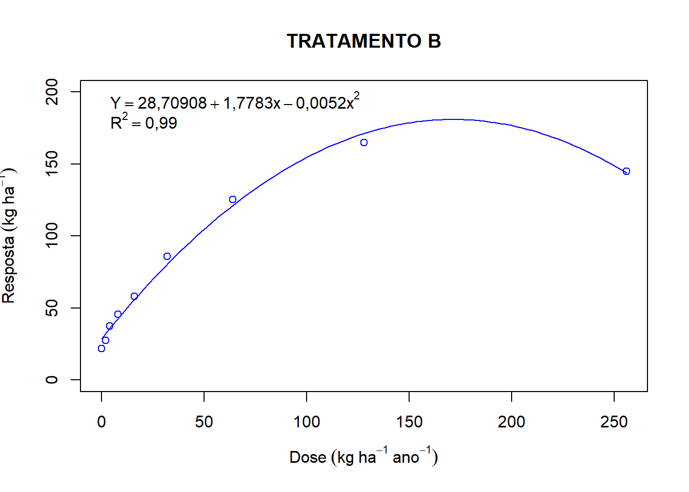

<br>

### Juntando os Gráficos

### Gráfico de dispersão


```r
plot(media~Dose, 
     ylim=c(0,250),
     col="red",
     ylab=expression(Resposta~(kg~ha^-1)),
     xlab=expression(Dose~(kg~ha^-1~ano^-1)))
curve(coef(modelo)[1]+coef(modelo)[2]*x+coef(modelo)[3]*x^2, add=T,col="red")
points(media1~Dose, col="blue")
curve(coef(modelo1)[1]+coef(modelo1)[2]*x+coef(modelo1)[3]*x^2, add=T,col="blue")
```


```r
plot(media~Dose, 
     ylim=c(0,250),
     col="red",
     ylab=expression(Resposta~(kg~ha^-1)),
     xlab=expression(Dose~(kg~ha^-1~ano^-1)))
curve(coef(modelo)[1]+coef(modelo)[2]*x+coef(modelo)[3]*x^2, add=T,col="red")
points(media1~Dose, col="blue")
curve(coef(modelo1)[1]+coef(modelo1)[2]*x+coef(modelo1)[3]*x^2, add=T,col="blue")
```


<br>

### Inserindo legenda


```r
plot(media~Dose, 
    ylim=c(0,250),
    col="red",
    ylab=expression(Resposta~(kg~ha^-1)),
    xlab=expression(Dose~(kg~ha^-1~ano^-1)))
points(media1~Dose,col="blue")
legend("topleft", 
       col=c("red","blue"), 
       bty="n", pch=1,
       c(expression(Y[A]==7.76013+1.88110*x-0.00557*x^2~~R^2*"=1,00"),
         expression(Y[B]==28.70908+1.77830*x-0.00519*x^2~~R^2*"=0,99")))
curve(coef(modelo)[1]+coef(modelo)[2]*x+coef(modelo)[3]*x^2, add=T,col="red")
curve(coef(modelo1)[1]+coef(modelo1)[2]*x+coef(modelo1)[3]*x^2, add=T,col="blue")
```


<br><br><br>

# Histograma

****

Histograma é uma representação gráfica (um gráfico de barras verticais ou barras horizontais) da distribuição de frequências de um conjunto de dados quantitativos contínuos. O histograma pode ser um gráfico por valores absolutos ou frequência relativa ou densidade. No caso de densidade, a frequência relativa do intervalo $i$, ($fr_i$), é representada pela área de um retângulo que é colocado acima do ponto médio da classe  i. Consequentemente, a área total do histograma (igual a soma das áreas de todos os retângulos) será igual a 1. Assim, ao construir o histograma, cada retângulo deverá ter área proporcional à frequência relativa (ou à frequência absoluta, o que é indiferente) correspondente. No caso em que os intervalos são de tamanhos (amplitudes) iguais, as alturas dos retângulos serão iguais às frequências relativas (ou iguais às frequências absolutas) dos intervalos correspondentes.

<br>

### Conjunto de dados


```r
tratamentos=rep(c(paste("T",1:5)),e=8)
resposta=c(100,170,160,90,150,145,179,165,180,144,184,139,220,206,187,210,166,235,220,190,100,120,110,190,140,145,149,165,150,144,134,139,188,206,190,140,166,224,148,160)
data=data.frame(tratamentos, resposta)
```

### Gráfico básico


```r
hist(resposta)
```


<br>

### Melhorias


```r
hist(resposta, 
        las=1,
        col="lightyellow",
        ylab="Frequência",
        xlab="Resposta",
        ylim=c(0,10),
        main="Histograma")
abline(h=0)
```


**Comandos**:

las=1: deixar escala do eixo Y na vertical

col="cor": mudar cor das barras (Ex. "red","blue","green" ou gray.colors(quantidade de tonalidades) para escala cinza ou rainbow(quantidade de cores) para escala colorida. Também é possível específicar a cor de cada barra (col=c("red","green","yellow","gray","blue"))).

xlab e ylab: nomear eixo X e Y

xlim e ylim: escala do eixo X e Y

main: Título

abline(h=0): linha na horizontal em Y=0 (No caso de vertical, abline(v=0)). É possível alterar a cor pela função "col="cor"" e o tracejado pelo "lty=número" (Ver o Help do comando)

<br>

### Plotando curva normal


```r
histograma=hist(resposta, 
        las=1,
        col="lightyellow",
        ylab="Frequência",
        xlab="Resposta",
        ylim=c(0,10),
        main="Histograma")
abline(h=0)

## Criando sequência de dados quantitativos discretos entre o mínimo e o máximo da resposta
xfit<-seq(min(resposta),max(resposta))

## dnorm (Função para encontrar os possíveis valores para Y e suas densidade de probabilidade)
yfit<-dnorm(xfit,mean=mean(resposta),sd=sd(resposta))

## diff é o comando para diferença e length para comprimento
yfit <- yfit*diff(histograma$mids[1:2])*length(resposta)

## Plotando linha da curva normal
lines(xfit, yfit, col="blue", lwd=2)
```

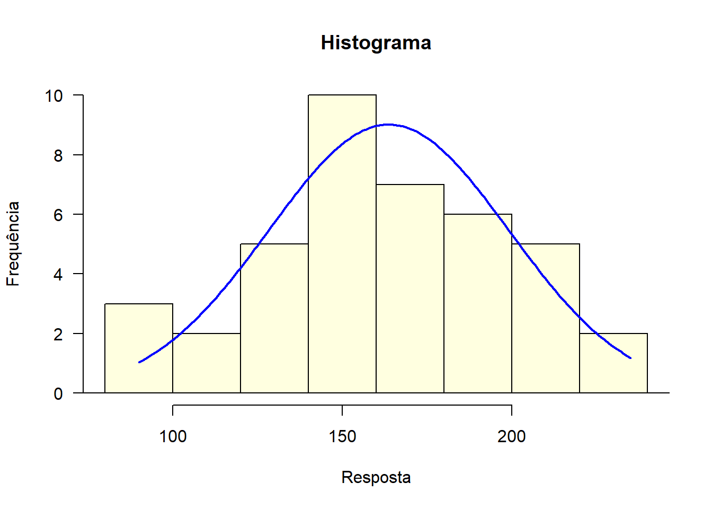

<br>

****

## Pacote ggplot2

****

<br>

instalar pacote ggplot2:

``install.packages("ggplot2")``


```r
# Carregar pacote
library(ggplot2)

# Obs. Não esquecer de criar uma data.frame (Ex. chamei de data no início do material)

# Criar histograma
mean=mean(resposta);sd= sd(resposta);n=length(resposta); largura=20
ggplot(data, aes(data$resposta))+
  geom_histogram(binwidth = 20, col="red", fill="green")+
  labs(title="Histograma")+
  labs(x="Resposta", y="Frequência")+
stat_function(fun = function(x) dnorm(x, mean = mean, sd = sd) * n * largura,
    color = "red", size = 1)
```


**binwidth** = largura de caixa

**col**= cor do contorno das caixas

**fill**= cor do interior das caixas

**Comando para plotar a curva normal:**

stat_function(fun = function(x) dnorm(x, mean = mean, sd = sd) \* n \* lagura,color = "red", size = 1)

<br><br>

****

## Distribuição normal padrão (Z)

****

### Simulando dados


```r
x=seq(-3,3,length=400)
y=dnorm(x,0,1)
```

<br>

### gráfico simples


```r
plot(x,
     y,
     type="l",
     xlab="",
     ylim=c(-0.1,0.5),
     ylab="")
```


<br>

### Removendo marca da escala


```r
plot(x,y,type="l",axes=F,xlab="",ylim=c(-0.1,0.5),
     ylab="")
```


<br>

### Preenchimento tracejado


```r
plot(x,y,type="l",axes=F,xlab="",ylim=c(-0.1,0.5),
     ylab="",col="white")
polygon(c(-3,x,3),c(0,y,0),density = 30)
```

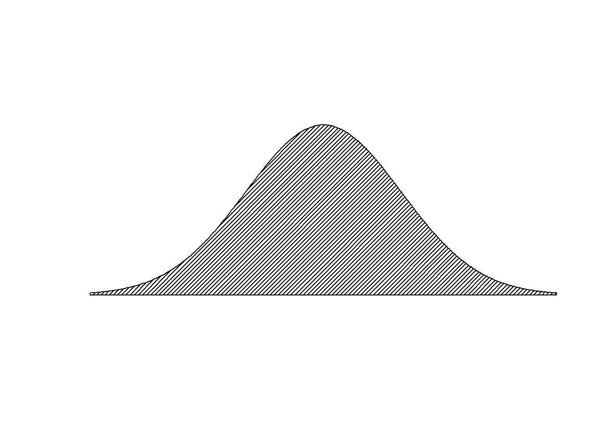

<br>

### Valor crítico (90%)


```r
plot(x,y,type="l",axes=F,xlab="",ylim=c(-0.1,0.5),
     ylab="",col="white")
polygon(c(-3,x,3),c(0,y,0),density = 30)
x1=seq(-1.645,1.645,length=100) # 90
y1=dnorm(x1)
polygon(c(-1.645,x1,1.645),c(0,y1,0),col="white")
abline(h=0);
lines(x=c(0,0),y=c(0,max(y)),lty=2)
```


<br>

### Valor crítico (95%)


```r
plot(x,y,type="l",axes=F,xlab="",ylim=c(-0.1,0.5),
     ylab="",col="white")
polygon(c(-3,x,3),c(0,y,0),density = 30)
x1=seq(-1.96,1.96,length=100) # 95%
y1=dnorm(x1)
polygon(c(-1.96,x1,1.96),c(0,y1,0),col="white")
abline(h=0);
lines(x=c(0,0),y=c(0,max(y)),lty=2)
```


<br>

### Valor crítico (99%)


```r
plot(x,y,type="l",axes=F,xlab="",ylim=c(-0.1,0.5),
     ylab="",col="white")
polygon(c(-3,x,3),c(0,y,0),density = 30)
x1=seq(-2.575,2.575,length=100) # 99
y1=dnorm(x1)
polygon(c(-2.575,x1,2.575),c(0,y1,0),col="white")
abline(h=0);
lines(x=c(0,0),y=c(0,max(y)),lty=2)
```


<br>

### Adicionando legendas


```r
plot(x,y,type="l",axes=F,xlab="",ylim=c(-0.1,0.5),
     ylab="",col="white")
polygon(c(-3,x,3),c(0,y,0),density = 30)
x1=seq(-1.96,1.96,length=100)
y1=dnorm(x1)
polygon(c(-1.96,x1,1.96),c(0,y1,0),col="white")
abline(h=0);
lines(x=c(0,0),y=c(0,max(y)),lty=2)
text(-1.96,-.05,expression(frac(-Z,(alpha/2))))
text(+1.96,-.05,expression(frac(Z,(alpha/2))))
text(-2.5,0.1,expression(frac(alpha,2)))
text(+2.5,0.1,expression(frac(alpha,2)))
axis(1)
```

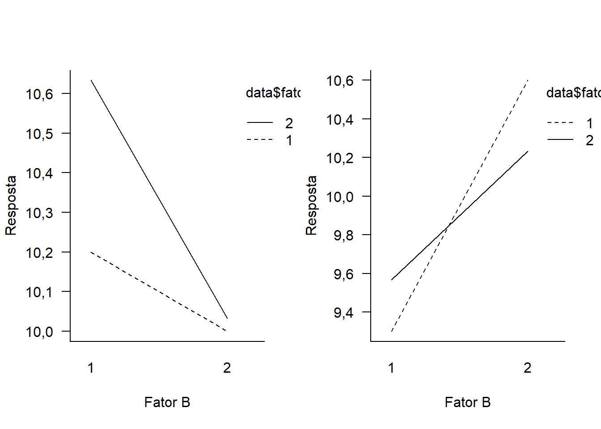

<br><br><br>

****

# Setores circulares 

****

O gráfico de Setores, também conhecido como gráfico de pizza ou gráfico circular é um diagrama circular onde os valores de cada categoria estatística representada são proporcionais às respectivas frequências. Este gráfico pode vir acompanhado de porcentagens. É utilizado para dados qualitativos nominais. Para construir um gráfico de setores é necessário determinar o ângulo dos setores circulares correspondentes à contribuição percentual de cada valor no total.

<br><br>

### Conjunto de dados


```r
variedade=c("Hass","Breda","Quintal","Geada","Margarida","Hass","Geada","Margarida","Hass","Margarida","Hass","Breda","Quintal","Breda","Quintal","Geada","Margarida","Breda","Quintal","Hass","Margarida","Hass","Breda","Hass","Margarida","Hass","Breda","Quintal","Breda","Quintal","Geada","Margarida","Breda","Quintal","Hass","Margarida","Hass","Breda","Geada","Margarida","Breda","Quintal","Hass","Margarida","Hass","Breda","Hass","Margarida","Hass","Breda","Quintal","Breda","Quintal","Geada","Margarida","Breda","Quintal","Hass","Margarida","Hass","Breda","Hass","Margarida","Hass","Breda","Quintal","Breda","Quintal","Geada","Margarida","Breda","Quintal","Quintal","Breda","Quintal")
```

<br>

### Frequências


```r
factor(variedade)
```

```
##  [1] Hass      Breda     Quintal   Geada     Margarida Hass      Geada    
##  [8] Margarida Hass      Margarida Hass      Breda     Quintal   Breda    
## [15] Quintal   Geada     Margarida Breda     Quintal   Hass      Margarida
## [22] Hass      Breda     Hass      Margarida Hass      Breda     Quintal  
## [29] Breda     Quintal   Geada     Margarida Breda     Quintal   Hass     
## [36] Margarida Hass      Breda     Geada     Margarida Breda     Quintal  
## [43] Hass      Margarida Hass      Breda     Hass      Margarida Hass     
## [50] Breda     Quintal   Breda     Quintal   Geada     Margarida Breda    
## [57] Quintal   Hass      Margarida Hass      Breda     Hass      Margarida
## [64] Hass      Breda     Quintal   Breda     Quintal   Geada     Margarida
## [71] Breda     Quintal   Quintal   Breda     Quintal  
## Levels: Breda Geada Hass Margarida Quintal
```

```r
n=length(variedade)
table(variedade)
```

```
## variedade
##     Breda     Geada      Hass Margarida   Quintal 
##        19         7        18        15        16
```

```r
proporção = prop.table(table(variedade))
```

<br>

### Gráfico básico


```r
pie(proporção*100)
```


<br>

### Melhorias


```r
pie(proporção*100, 
    edges=400, 
    radius=1, 
    col=c("red","green","yellow","blue","orange"), 
    main="Variedades de abacate")
```


<br>

### Plotando valores

Obs. sem casa decimal


```r
pie(proporção*100, 
    edges=400, 
    radius=1, 
    labels=paste(names(proporção),"(",round(proporção*100,0),"%",")"), 
    col=c("red","green","yellow","blue","orange"), 
    main="Variedades de abacate")
```

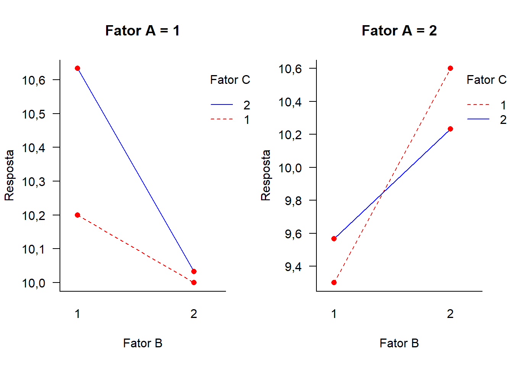

<br><br>

<br>

****

## Gráfico de Setores Circulares 3D

****

<br><br>

### Descobrindo as frequências


```r
factor(variedade)
```

```
##  [1] Hass      Breda     Quintal   Geada     Margarida Hass      Geada    
##  [8] Margarida Hass      Margarida Hass      Breda     Quintal   Breda    
## [15] Quintal   Geada     Margarida Breda     Quintal   Hass      Margarida
## [22] Hass      Breda     Hass      Margarida Hass      Breda     Quintal  
## [29] Breda     Quintal   Geada     Margarida Breda     Quintal   Hass     
## [36] Margarida Hass      Breda     Geada     Margarida Breda     Quintal  
## [43] Hass      Margarida Hass      Breda     Hass      Margarida Hass     
## [50] Breda     Quintal   Breda     Quintal   Geada     Margarida Breda    
## [57] Quintal   Hass      Margarida Hass      Breda     Hass      Margarida
## [64] Hass      Breda     Quintal   Breda     Quintal   Geada     Margarida
## [71] Breda     Quintal   Quintal   Breda     Quintal  
## Levels: Breda Geada Hass Margarida Quintal
```

```r
n=length(variedade)
table(variedade)
```

```
## variedade
##     Breda     Geada      Hass Margarida   Quintal 
##        19         7        18        15        16
```

```r
proporção = prop.table(table(variedade))
```

<br>

### Gráfico em 3D


```r
library(plotrix)
pie3D(proporção*100)
```


<br>

### Separando os setores


```r
pie3D(proporção*100, 
      explode=0.1, 
      main="Variedades de abacate")
```


<br>

### Adicionando nomes e frequências


```r
pie3D(proporção*100, 
      explode=0.1, 
      cex=0.8,
      labels=paste(names(proporção),
                   "(",round(proporção*100,0),"%",")"), 
      main="Variedades de abacate")
```


<br><br><br>

****

# Interação

****

O gráfico de interações é usado quando temos ao menos dois fatores. Tem como função identificar visualmente se os fatores apresentam efeito conjunto ou se são independentes

### Conjunto de dados

Um experimento foi realizado com o intuito de avaliar 5 manejos na entrelinha do pomar de laranja Natal e sua influência em relação a linha de plantio. O experimento foi instalado em Delineamento em blocos casualizados com 12 repetições por tratamento em esquema de parcelas subdividida (2 [linha e entrelinha] x 5[ *U. brizantha* (T1),*U. decumbens* (T2), *U. ruziziensis* (T3), *Glifosato* (T4), *Pousio* (T5). Foi analisado o carbono da biomassa microbiana (CBM).


```r
RESP=c(224.92, 180.32, 130.19, 110.31, 163.74,193.03, 211.49, 137.65, 127.15, 203.39,182.36, 124.75, 177.70, 231.01, 202.14,214.89, 198.42, 267.85, 207.67, 176.74,162.18, 124.59, 158.99, 209.12, 128.14,113.95, 215.53, 190.51, 174.58, 148.70,150.90, 209.03, 210.40, 199.03, 237.05,196.97, 176.06, 263.27, 240.19, 160.72,239.90, 188.07, 251.35, 215.45, 198.50,271.42, 226.56, 217.65, 213.69, 101.26,115.41, 140.10, 117.67, 106.45, 139.34,104.22, 206.13, 195.89, 147.11, 122.93,176.55, 173.63, 112.83, 184.82, 178.18,115.85, 183.89, 134.92, 086.49, 103.96,096.33, 091.64, 157.76, 107.45, 106.61,095.28, 152.37, 066.02, 125.75, 075.34,088.64, 104.00, 066.38, 084.74, 101.76,173.70, 101.24, 143.71, 119.88, 157.79,070.42, 152.75, 111.65, 153.08, 146.64,142.57, 098.96, 065.92, 065.62, 063.26,095.72, 084.14, 054.92, 090.49, 112.11,102.68, 144.77, 122.58, 125.14, 127.61,117.14, 147.87, 156.18, 154.82, 183.91,159.11, 155.41, 184.55, 121.39, 155.77)
FATOR1=rep(rep(c("L","EL"), e=12),5); FATOR1=factor(FATOR1)
FATOR2=rep(c(paste("T",1:5)),e=24); FATOR2=factor(FATOR2)
repe=rep(c(paste("R",1:12)),10); repe=factor(repe)
dados = data.frame(FATOR1,FATOR2,repe,RESP)
```

### Fator1 x Fator 2


```r
with(dados, interaction.plot(FATOR1, FATOR2, RESP))
```


### Editando o gráfico


```r
with(dados, interaction.plot(FATOR1, FATOR2, RESP, las=1, col=1:6, bty='l', 
                             ylab='CBM', trace.label="FATOR2"))
```


### Fator2 x Fator 1


```r
with(dados, interaction.plot(FATOR2, FATOR1, RESP))
```


### Editando o gráfico


```r
with(dados, interaction.plot(FATOR2,FATOR1, RESP, las=1, col=c("blue","red"), bty='l',xlab='', ylab='CBM', trace.label="repe"))
```

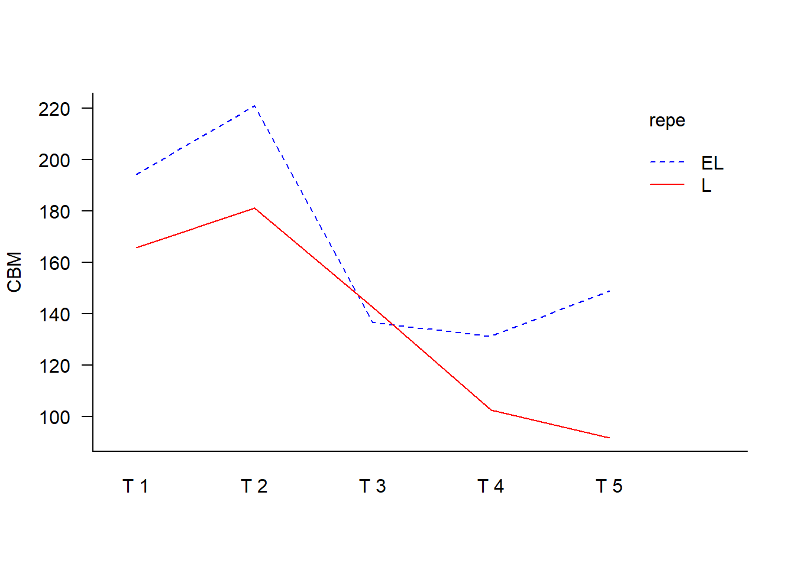

## Usando o interaction(s)

### Conjunto de dados

Este conjunto de dados pertence ao pacote ExpDes.pt (data6). Ao qual é composto de três fatores (fatorA, fatorB e fatorC), cuja resposta é nomeada como resp.


```r
x=scan(dec=",",text="
1       1      1      1   1 10,0
2       1      1      1   2 10,8
3       1      1      1   3  9,8
4       1      1      2   1 10,3
5       1      1      2   2 11,3
6       1      1      2   3 10,3
7       1      2      1   1  9,7
8       1      2      1   2 10,1
9       1      2      1   3 10,2
10      1      2      2   1  9,4
11      1      2      2   2 11,6
12      1      2      2   3  9,1
13      2      1      1   1  9,2
14      2      1      1   2  8,6
15      2      1      1   3 10,1
16      2      1      2   1  9,3
17      2      1      2   2 10,3
18      2      1      2   3  9,1
19      2      2      1   1 11,5
20      2      2      1   2  9,5
21      2      2      1   3 10,8
22      2      2      2   1 10,7
23      2      2      2   2 10,4
24      2      2      2   3  9,6
")
data=data.frame(t(matrix(x,6,24)))
colnames(data)=c("N","fatorA", "fatorB", "fatorC","rep","resp")
data
```

```
##     N fatorA fatorB fatorC rep resp
## 1   1      1      1      1   1 10,0
## 2   2      1      1      1   2 10,8
## 3   3      1      1      1   3  9,8
## 4   4      1      1      2   1 10,3
## 5   5      1      1      2   2 11,3
## 6   6      1      1      2   3 10,3
## 7   7      1      2      1   1  9,7
## 8   8      1      2      1   2 10,1
## 9   9      1      2      1   3 10,2
## 10 10      1      2      2   1  9,4
## 11 11      1      2      2   2 11,6
## 12 12      1      2      2   3  9,1
## 13 13      2      1      1   1  9,2
## 14 14      2      1      1   2  8,6
## 15 15      2      1      1   3 10,1
## 16 16      2      1      2   1  9,3
## 17 17      2      1      2   2 10,3
## 18 18      2      1      2   3  9,1
## 19 19      2      2      1   1 11,5
## 20 20      2      2      1   2  9,5
## 21 21      2      2      1   3 10,8
## 22 22      2      2      2   1 10,7
## 23 23      2      2      2   2 10,4
## 24 24      2      2      2   3  9,6
```

### Separado por Fator A


```r
par(mfrow=c(1,2))
interaction.plot(data$fatorB[data$fatorA=="1"],
                 data$fatorC[data$fatorA=="1"],
                 data$resp[data$fatorA=="1"])
interaction.plot(data$fatorB[data$fatorA=="2"],
                 data$fatorC[data$fatorA=="2"],
                 data$resp[data$fatorA=="2"])
```


### Alterando escala do eixo Y


```r
par(mfrow=c(1,2))
interaction.plot(data$fatorB[data$fatorA=="1"],
                 data$fatorC[data$fatorA=="1"],
                 data$resp[data$fatorA=="1"], 
                 las=1)
interaction.plot(data$fatorB[data$fatorA=="2"],
                 data$fatorC[data$fatorA=="2"],
                 data$resp[data$fatorA=="2"], 
                 las=1)
```

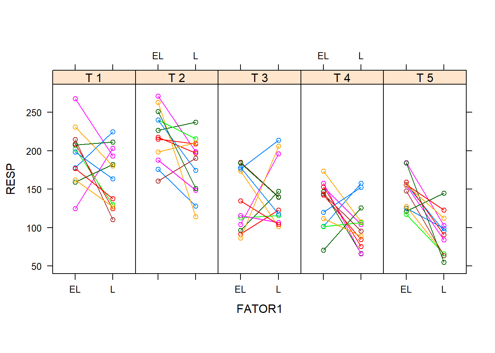

### Título do eixo x e y


```r
par(mfrow=c(1,2))
interaction.plot(data$fatorB[data$fatorA=="1"],
                 data$fatorC[data$fatorA=="1"],
                 data$resp[data$fatorA=="1"], 
                 las=1,
                 xlab="Fator B",
                 ylab="Resposta")
interaction.plot(data$fatorB[data$fatorA=="2"],
                 data$fatorC[data$fatorA=="2"],
                 data$resp[data$fatorA=="2"], 
                 las=1,
                 xlab="Fator B",
                 ylab="Resposta")
```

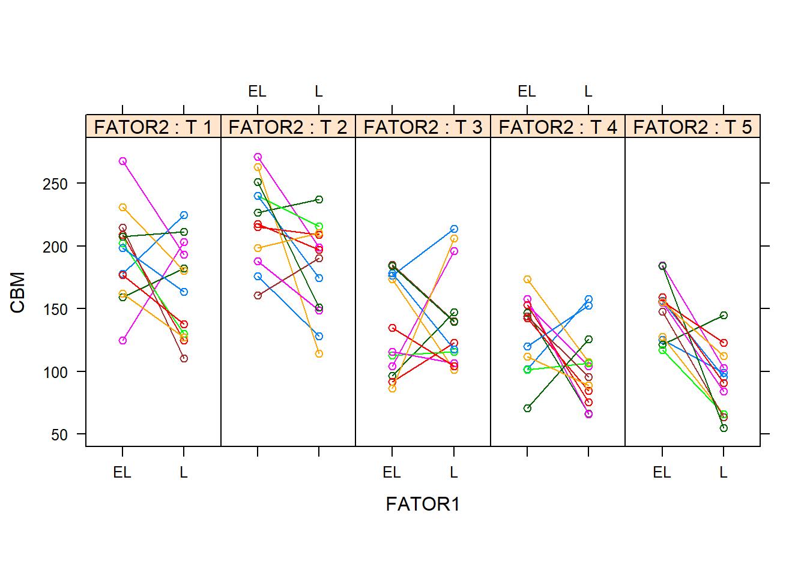

### Removendo linhas da caixa


```r
par(mfrow=c(1,2))
interaction.plot(data$fatorB[data$fatorA=="1"],
                 data$fatorC[data$fatorA=="1"],
                 data$resp[data$fatorA=="1"], 
                 las=1,
                 xlab="Fator B",
                 ylab="Resposta",
                 bty="l")
interaction.plot(data$fatorB[data$fatorA=="2"],
                 data$fatorC[data$fatorA=="2"],
                 data$resp[data$fatorA=="2"], 
                 las=1,
                 xlab="Fator B",
                 ylab="Resposta",
                 bty="l")
```


### Cor da linhas


```r
par(mfrow=c(1,2))
interaction.plot(data$fatorB[data$fatorA=="1"],
                 data$fatorC[data$fatorA=="1"],
                 data$resp[data$fatorA=="1"], 
                 las=1,
                 xlab="Fator B",
                 ylab="Resposta",
                 bty="l", 
                 col = c("red","blue"))
interaction.plot(data$fatorB[data$fatorA=="2"],
                 data$fatorC[data$fatorA=="2"],
                 data$resp[data$fatorA=="2"], 
                 las=1,
                 xlab="Fator B",
                 ylab="Resposta",
                 bty="l",
                 col = c("red","blue"))
```


### Título dos gráficos


```r
par(mfrow=c(1,2))
interaction.plot(data$fatorB[data$fatorA=="1"],
                 data$fatorC[data$fatorA=="1"],
                 data$resp[data$fatorA=="1"], 
                 las=1,
                 xlab="Fator B",
                 ylab="Resposta",
                 bty="l", 
                 col = c("red","blue"),
                 main="Fator A = 1")
interaction.plot(data$fatorB[data$fatorA=="2"],
                 data$fatorC[data$fatorA=="2"],
                 data$resp[data$fatorA=="2"], 
                 las=1,
                 xlab="Fator B",
                 ylab="Resposta",
                 bty="l",
                 col = c("red","blue"),
                 main="Fator A = 2")
```


### Título da legenda


```r
par(mfrow=c(1,2))
interaction.plot(data$fatorB[data$fatorA=="1"],
                 data$fatorC[data$fatorA=="1"],
                 data$resp[data$fatorA=="1"], 
                 las=1,
                 xlab="Fator B",
                 ylab="Resposta",
                 bty="l", 
                 col = c("red","blue"),
                 main="Fator A = 1",
                 trace.label = "Fator C")
interaction.plot(data$fatorB[data$fatorA=="2"],
                 data$fatorC[data$fatorA=="2"],
                 data$resp[data$fatorA=="2"], 
                 las=1,
                 xlab="Fator B",
                 ylab="Resposta",
                 bty="l",
                 col = c("red","blue"),
                 main="Fator A = 2",
                 trace.label = "Fator C")
```


### Pontos da média

Calculando as médias


```r
# Média para nível 1 do fator A
media=with(data, 
           tapply(resp[fatorA=="1"], 
                      list(fatorB[fatorA=="1"],
                           fatorC[fatorA=="1"]), 
                  mean))

# Média e desvio-padrão para nível 2 do fator A
media1=with(data, 
            tapply(resp[fatorA=="2"], 
                      list(fatorB[fatorA=="2"],
                           fatorC[fatorA=="2"]), 
                   mean))           
```


```r
par(mfrow=c(1,2))
interaction.plot(data$fatorB[data$fatorA=="1"],
                 data$fatorC[data$fatorA=="1"],
                 data$resp[data$fatorA=="1"], 
                 las=1,
                 xlab="Fator B",
                 ylab="Resposta",
                 bty="l", 
                 col = c("red","blue"),
                 main="Fator A = 1",
                 trace.label = "Fator C")
points(c(1,2,1,2),media, col="red", pch=16)

interaction.plot(data$fatorB[data$fatorA=="2"],
                 data$fatorC[data$fatorA=="2"],
                 data$resp[data$fatorA=="2"], 
                 las=1,
                 xlab="Fator B",
                 ylab="Resposta",
                 bty="l",
                 col = c("red","blue"),
                 main="Fator A = 2",
                 trace.label = "Fator C")
points(c(1,2,1,2),media1, col="red", pch=16)
```


### Barras de desvio-padrão

Calculando os desvios-padrões


```r
# Desvio-padrão para nível 1 do fator A
desvio=with(data, 
            tapply(resp[fatorA=="1"], 
                      list(fatorB[fatorA=="1"],
                           fatorC[fatorA=="1"]), 
                         sd))

# Desvio-padrão para nível 2 do fator A
desvio1=with(data, 
             tapply(resp[fatorA=="2"], 
                      list(fatorB[fatorA=="2"],
                           fatorC[fatorA=="2"]), 
                    sd))
```


```r
par(mfrow=c(1,2))
interaction.plot(data$fatorB[data$fatorA=="1"],
                 data$fatorC[data$fatorA=="1"],
                 data$resp[data$fatorA=="1"], 
                 las=1, args.legend=list(x="topleft"),
                 xlab="Fator B", ylim=c(8,13),
                 ylab="Resposta", 
                 bty="l", 
                 col = c("red","blue"),
                 main="Fator A = 1",
                 trace.label = "Fator C")
points(c(1,2,1,2),media, col="red", pch=16)
arrows(c(1,2,1,2), media+desvio,c(1,2,1,2),media-desvio, code=3,angle=90,length = 0.1, col=c("red","red","blue","blue"))

interaction.plot(data$fatorB[data$fatorA=="2"],
                 data$fatorC[data$fatorA=="2"],
                 data$resp[data$fatorA=="2"], 
                 las=1,
                 xlab="Fator B", ylim=c(8,13),
                 ylab="Resposta",
                 bty="l",
                 col = c("red","blue"),
                 main="Fator A = 2",
                 trace.label = "Fator C")
points(c(1,2,1,2),media1, col="red", pch=16)
arrows(c(1,2,1,2), media1+desvio1,c(1,2,1,2),media1-desvio1, code=3,angle=90,length = 0.1, col=c("red","red","blue","blue"))
```


## Pacote dae

### Conjunto de dados


```r
resp=c(4599.55,6203.50,4566.02,5616.38,4978.35,5126.15,4816.23,4251.00,4106.79,
       4600.58,4012.14,4623.41,4274.16,4683.50,4433.33,4326.16,4932.66,5066.67,
       4697.29,5011.38,5156.72,4744.21,4826.80,4663.26,4807.19,4377.19,4442.07,
       4685.58,5066.90,5317.66,5144.19,4580.18,4860.37,5204.21,5146.19,5015.67,
       5801.99,4668.05,5393.16,5282.27,5369.41,5494.43,4980.32,5715.76,4754.54,
       5000.83,4664.11,4969.41,5315.43,4872.29,5546.79,4765.79,4649.63,4899.31,
       4890.89,5117.10,4942.97,4548.97,4916.97,4225.38,4820.21,4150.44,4648.46,
       4271.57,5143.54,4808.97,5459.66,4928.35,5224.70,4900.90,4770.88,4977.68,
       5816.80,5107.11,5555.80,5767.65,5117.10,5573.08,5673.87,4859.00,4687.26,
       5055.22,5235.22,4961.72,4984.93,5425.67,4978.33,5172.60,5328.07,4973.87,
       5296.55,4928.01,4528.12,5337.93,5809.20,4914.70,5191.89,5261.24,5287.53,
       5680.55,5080.06,5425.53,4949.13,5300.57,4481.23,5039.54,5223.75,4581.65)
FATOR1=rep(rep(c("A1","A2","A3"), e=12),3)
FATOR2=rep(c("B1","B2","B3"), e=36)
FATOR3=rep(rep(c("C1","c2","c3"),e=4),9)
dados=data.frame(FATOR1,FATOR2,FATOR3,resp)
```

<br>

### Gráfico com a média

Para se construir esse gráfico é necessário instalar o pacote `dae`


```r
library(dae)
interaction.ABC.plot(resp,FATOR1,FATOR2,FATOR3,data=dados)
```

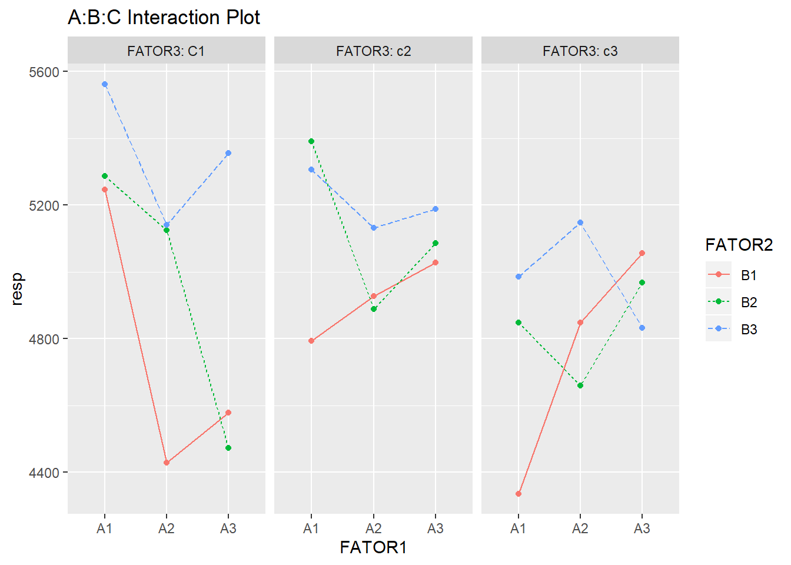

```r
interaction.ABC.plot(resp,FATOR1,FATOR3,FATOR2,data=dados)
```


```r
interaction.ABC.plot(resp,FATOR2,FATOR3,FATOR1,data=dados)
```

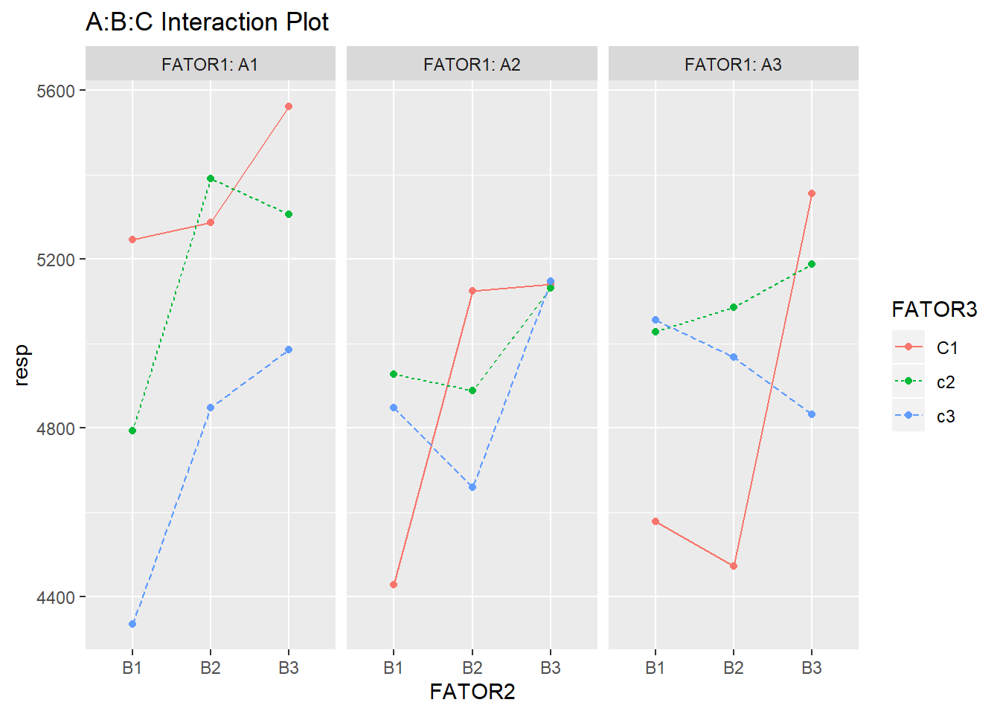

```r
interaction.ABC.plot(resp,FATOR2,FATOR1,FATOR3,data=dados)
```


```r
interaction.ABC.plot(resp,FATOR3,FATOR2,FATOR1,data=dados)
```

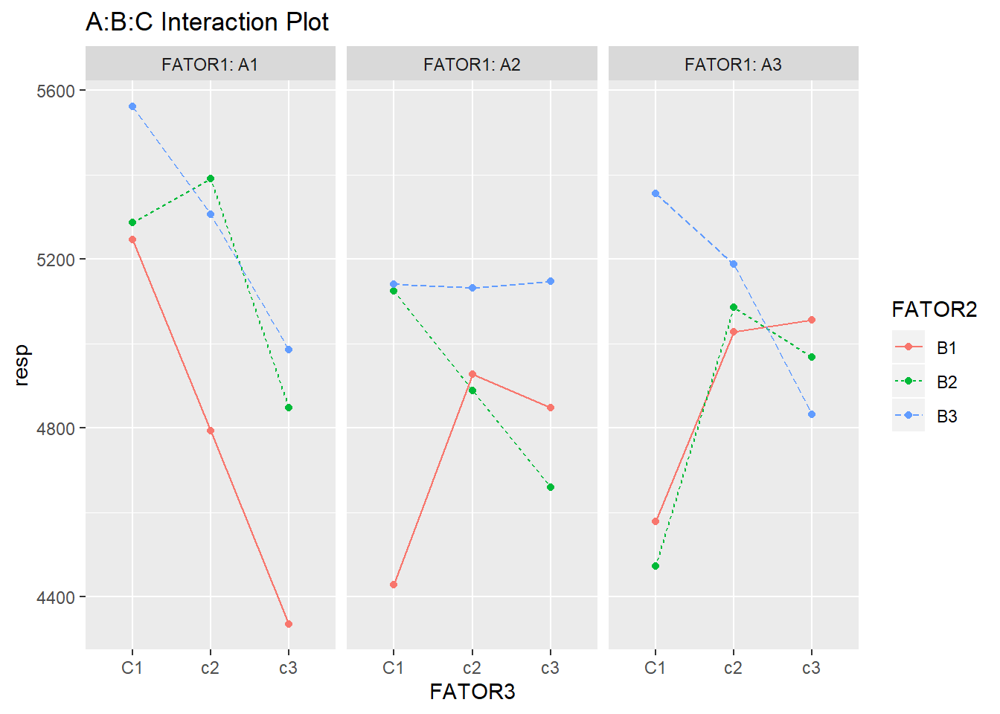

```r
interaction.ABC.plot(resp,FATOR3,FATOR1,FATOR2,data=dados)
```


### Média e desvio-padrão


```r
media=tapply(resp, paste(FATOR1,FATOR2,FATOR3),mean)
desvio=tapply(resp, paste(FATOR1,FATOR2,FATOR3),sd)
```


```r
(F1=rep(c("A1","A2","A3"), e=9))
```

```
##  [1] "A1" "A1" "A1" "A1" "A1" "A1" "A1" "A1" "A1" "A2" "A2" "A2" "A2" "A2" "A2"
## [16] "A2" "A2" "A2" "A3" "A3" "A3" "A3" "A3" "A3" "A3" "A3" "A3"
```

```r
(F2=rep(rep(c("B1","B2","B3"), e=3),3)) 
```

```
##  [1] "B1" "B1" "B1" "B2" "B2" "B2" "B3" "B3" "B3" "B1" "B1" "B1" "B2" "B2" "B2"
## [16] "B3" "B3" "B3" "B1" "B1" "B1" "B2" "B2" "B2" "B3" "B3" "B3"
```

```r
(F3=rep(c("C1","c2","c3"),9))
```

```
##  [1] "C1" "c2" "c3" "C1" "c2" "c3" "C1" "c2" "c3" "C1" "c2" "c3" "C1" "c2" "c3"
## [16] "C1" "c2" "c3" "C1" "c2" "c3" "C1" "c2" "c3" "C1" "c2" "c3"
```

```r
paste(F1,F2,F3) # tratamentos
```

```
##  [1] "A1 B1 C1" "A1 B1 c2" "A1 B1 c3" "A1 B2 C1" "A1 B2 c2" "A1 B2 c3"
##  [7] "A1 B3 C1" "A1 B3 c2" "A1 B3 c3" "A2 B1 C1" "A2 B1 c2" "A2 B1 c3"
## [13] "A2 B2 C1" "A2 B2 c2" "A2 B2 c3" "A2 B3 C1" "A2 B3 c2" "A2 B3 c3"
## [19] "A3 B1 C1" "A3 B1 c2" "A3 B1 c3" "A3 B2 C1" "A3 B2 c2" "A3 B2 c3"
## [25] "A3 B3 C1" "A3 B3 c2" "A3 B3 c3"
```

### Criando uma data.frame


```r
data=data.frame(F1,F2,F3,media,desvio)
```

### Construindo o gráfico


```r
interaction.ABC.plot(media,F1,F2,F3,data=data,
                     ggplotFunc=
                       list(geom_errorbar(data=data,
                                          aes(ymax=media+desvio, 
                                              ymin=media-desvio), 
                                                   width=0.2)))
```


<br><br><br>

****

# Perfil Individual

****

### Conjunto de dados

Um experimento foi realizado com o intuito de avaliar 5 manejos na entrelinha do pomar de laranja Natal e sua influência em relação a linha de plantio. O experimento foi instalado em Delineamento em blocos casualizados com 12 repetições por tratamento em esquema de parcelas subdividida (2 [linha e entrelinha] x 5[ *U. brizantha* (T1),*U. decumbens* (T2), *U. ruziziensis* (T3), *Glifosato* (T4), *Pousio* (T5). Foi analisado o carbono da biomassa microbiana (CBM).


```r
RESP=c(224.92, 180.32, 130.19, 110.31, 163.74,193.03, 211.49, 137.65, 127.15, 203.39,182.36, 124.75, 177.70, 231.01, 202.14,214.89, 198.42, 267.85, 207.67, 176.74,162.18, 124.59, 158.99, 209.12, 128.14,113.95, 215.53, 190.51, 174.58, 148.70,150.90, 209.03, 210.40, 199.03, 237.05,196.97, 176.06, 263.27, 240.19, 160.72,239.90, 188.07, 251.35, 215.45, 198.50,271.42, 226.56, 217.65, 213.69, 101.26,115.41, 140.10, 117.67, 106.45, 139.34,104.22, 206.13, 195.89, 147.11, 122.93,176.55, 173.63, 112.83, 184.82, 178.18,115.85, 183.89, 134.92, 086.49, 103.96,096.33, 091.64, 157.76, 107.45, 106.61,095.28, 152.37, 066.02, 125.75, 075.34,088.64, 104.00, 066.38, 084.74, 101.76,173.70, 101.24, 143.71, 119.88, 157.79,070.42, 152.75, 111.65, 153.08, 146.64,142.57, 098.96, 065.92, 065.62, 063.26,095.72, 084.14, 054.92, 090.49, 112.11,102.68, 144.77, 122.58, 125.14, 127.61,117.14, 147.87, 156.18, 154.82, 183.91,159.11, 155.41, 184.55, 121.39, 155.77)
FATOR1=rep(rep(c("L","EL"), e=12),5); FATOR1=factor(FATOR1)
FATOR2=rep(c(paste("T",1:5)),e=24); FATOR2=factor(FATOR2)
repe=rep(c(paste("R",1:12)),10); repe=factor(repe)
dados = data.frame(FATOR1,FATOR2,repe,RESP)
```

### Fator 2 x Fator 1


```r
library(lattice)
with(dados, xyplot(RESP ~ FATOR1|FATOR2, groups=repe))
```


```r
with(dados, xyplot(RESP ~ FATOR1|FATOR2, groups=repe, aspect="xy"))
```


```r
with(dados, xyplot(RESP ~ FATOR1|FATOR2, groups=repe, aspect="xy", type="o"))
```


```r
with(dados, xyplot(RESP ~ FATOR1|FATOR2, groups=repe, aspect="xy", type="o", ylab='CBM',strip=strip.custom(strip.names=TRUE, strip.levels=TRUE)))
```


### Fator 1 x Fator 2


```r
with(dados, xyplot(RESP ~ FATOR2|FATOR1, groups=repe, type="o", ylab='CBM', strip=strip.custom(strip.names=TRUE,strip.levels=TRUE)))
```


<br><br><br>

****

# Linhas

****

Gráficos de linhas ou pontos são normalmente usados para controlar alterações ao longo do tempo e para facilitar a identificação de tendências ou de anomalias.


### Conjunto de dados

Esse conjunto de dados de Umidade relativa (UR) foi obtido no site do Instituto Agronômico do Paraná  (http://www.iapar.br/modules/conteudo/conteudo.php?conteudo=1828) no período de 01/09/2018 a 21/02/2019.

<br>


```r
UR=c(68,93,86,55,54,51,45,43,55,54,58,57,64,89,73,80,96,71,86,95,74,62,49,43,51,62,86,73,64,95,68,77,86,93,76,63,69,94,88,89,88,67,76,84,71,88,83,83,74,54,51,61,74,97,94,97,66,58,65,56,82,93,66,64,67,65,67,67,63,62,76,51,57,54,80,65,65,65,93,88,63,68,65,98,83,64,67,62,59,78,75,70,63,62,53,46,42,55,60,51,51,47,42,60,62,77,74,58,63,67,66,83,81,87,95,80,71,68,74,69,75,74,75,90,86,91,91,98,84,81,74,82,69,77,84,78,74,87,75,80,89,90,77,73,82,80,82,75,79,70,61,63,74,63,58,62,76,76,74,69,64,56,61,86,94,85,78,91,82,80,81,85,89,84)
TEMPO=c(1:174)
```

<br>

### Gráfico de dispersão


```r
plot(UR~TEMPO, 
     ylab="Umidade Relativa (%)", xlab="Tempo (Dias)",
     col="blue", las=1)
```


<br>

### Gráfico com as linhas


```r
plot(UR~TEMPO,
     ylab="Umidade Relativa (%)", xlab="Tempo (Dias)",
     type="lines", 
     col="blue", las=1)
```


<br>

### Gráfico com linhas e pontos 


```r
plot(UR~TEMPO,
     ylab="Umidade Relativa (%)", xlab="Tempo (Dias)",
     type="b", 
     col="blue", las=1)
```


```r
plot(UR~TEMPO,
     ylab="Umidade Relativa (%)", xlab="Tempo (Dias)",
     type="o", 
     col="blue", las=1)
```


<br>

### Linhas verticais


```r
plot(UR~TEMPO,
     ylab="Umidade Relativa (%)", xlab="Tempo (Dias)",
     type="h", 
     col="blue", las=1)
```


<br>

### Formato em escada


```r
plot(UR~TEMPO,
     ylab="Umidade Relativa (%)", xlab="Tempo (Dias)",
     type="s", 
     col="blue", las=1)
```


<br>

### Juntando os 6 gráficos


```r
par(mfrow=c(2,3))
plot(UR~TEMPO,cex=0.5, 
     ylab="Umidade Relativa (%)", xlab="Tempo (Dias)",
     col="blue", las=1)
plot(UR~TEMPO,cex=0.5,
     ylab="Umidade Relativa (%)", xlab="Tempo (Dias)",
     type="lines", 
     col="blue", las=1)
plot(UR~TEMPO,cex=0.5,
     ylab="Umidade Relativa (%)", xlab="Tempo (Dias)",
     type="b", 
     col="blue", las=1)
plot(UR~TEMPO,cex=0.5,
     ylab="Umidade Relativa (%)", xlab="Tempo (Dias)",
     type="o", 
     col="blue", las=1)
plot(UR~TEMPO,cex=0.5,
     ylab="Umidade Relativa (%)", xlab="Tempo (Dias)",
     type="h", 
     col="blue", las=1)
plot(UR~TEMPO,cex=0.5,
     ylab="Umidade Relativa (%)", xlab="Tempo (Dias)",
     type="s", 
     col="blue", las=1)
```


<br>

****

## Eixo secundário

****

### Conjunto de dados


```r
TM=c(23.4,19.8,12.8,16.3,20.8,17.4,20.0,21.8,21.8,20.6,20.3,20.6,20.4,18.1,20.2,19.3,17.2,20.8,20.7,17.4,21.8,23.8,25.8,26.3,25.3,24.5,21.4,23.3,24.3,21.2,24.3,23.6,23.5,22.3,21.4,19.7,22.1,20.5,22.3,21.8,18.0,21.3,24.1,23.9,23.6,23.3,23.2,22.0,22.4,20.8,20.2,22.6,23.7,19.9,19.7,21.4,22.5,21.4,20.4,24.5,22.7,20.3,23.7,24.0,23.6,21.6,22.0,22.6,21.3,22.5,22.2,26.3,27.2,28.3,25.9,25.8,26.6,24.9,20.8,19.4,21.6,22.2,23.8,20.9,22.9,25.0,23.7,23.8,24.8,24.8)
UR=c(68,93,86,55,54,51,45,43,55,54,58,57,64,89,73,80,96,71,86,95,74,62,49,43,51,62,86,73,64,95,68,77,86,93,76,63,69,94,88,89,88,67,76,84,71,88,83,83,74,54,51,61,74,97,94,97,66,58,65,56,82,93,66,64,67,65,67,67,63,62,76,51,57,54,80,65,65,65,93,88,63,68,65,98,83,64,67,62,59,78)
TEMPO=c(1:90)
```

<br>

### Linhas individuais


```r
par(mfrow=c(1,2)) # mudando parâmetro gráfico para plotar dois graficos lado a lado
plot(TM~TEMPO, ylab="Temperatura")
plot(UR~TEMPO, ylab="Umidade relativa")
```


<br>

### Editando gráficos


```r
par(mfrow=c(1,2))
plot(TM~TEMPO, 
     ylim=c(0,50), # mudando escala de Y
     las=2, # deixando marcador de escala na vertical
     type="l", # mudando tipo de gráfico para linhas
     ylab='Temperatura', # modificando nome do eixo Y
     xlab="Tempo (minutos)") # modificando nome do eixo x
plot(UR~TEMPO, 
     ylim=c(0,100), 
     las=2, 
     type="l", 
     xlab="",
     ylab="",
     lty=4) # modificando formato de linha
```


<br>

### Sobrepor os gráficos


```r
par(mar=c(4,4,3,4)) # modificando a largura da margem (inferior, esquerda, superior, direita)
plot(TM~TEMPO, 
     ylim=c(0,50),
     las=2, 
     type="l",
     ylab='Temperatura', 
     xlab="Tempo (minutos)")
par(new=T) # comando para sobrepor gráficos
plot(UR~TEMPO, 
     ylim=c(0,100), 
     las=2, 
     type="l", 
     xlab="",
     ylab="",
     lty=4)
```


<br>

### Marca das escalas 


```r
par(mar=c(4,4,3,4))
plot(TM~TEMPO, 
     ylim=c(0,50),
     las=2, 
     type="l",
     axes=F, # argumento para remover as escalas 
     ylab='Temperatura', 
     xlab="Tempo (minutos)")
par(new=T)
plot(UR~TEMPO, 
     ylim=c(0,100), 
     las=2, 
     type="l", 
     axes=F, # argumento para remover as escalas
     xlab="",
     ylab="",
     lty=4)
```


```r
par(mar=c(4,4,3,4))
plot(TM~TEMPO, 
     ylim=c(0,50),
     las=2, 
     type="l",
     axes=F, 
     lty=1, 
     ylab='Temperatura', 
     xlab="Tempo (minutos)")
par(new=T)
plot(UR~TEMPO, 
     ylim=c(0,100), 
     las=2, 
     type="l", 
     axes=F, 
     xlab="",
     ylab="",
     lty=4)
axis(2,las=2, ylim=c(0,50)) # escala do eixo y primário
axis(4,las=2) # escala do eixo y secundário
axis(side=1,las=1, at=seq(0, 100, by=10)) # escala do eixo x 
```


```r
## Obs. at=seq(0, 100, by=10) estou definindo um intervalo de 0 a 100 como marca a cada 10 unidades
```

<br>

### Nome do eixo Y secundário


```r
par(mar=c(4,4,3,4))
plot(TM~TEMPO, 
     ylim=c(0,50),
     las=2, 
     type="l",
     axes=F, 
     lty=1, 
     ylab='Temperatura', 
     xlab="Tempo (minutos)")
par(new=T)
plot(UR~TEMPO, 
     ylim=c(0,100), 
     las=2, 
     type="l", 
     axes=F, 
     xlab="",
     ylab="",
     lty=4)
axis(4,las=2)
axis(2,las=2)
axis(side=1,las=1, at=seq(0, 100, by=10))
text(par("usr")[2]*1.11,mean(par("usr")[3:4]), "UR (%)", srt = -90, xpd = TRUE, pos = 4)
```


<br>

### Adicionando legenda


```r
par(mar=c(4,4,3,4))
plot(TM~TEMPO, 
     ylim=c(0,50),
     las=2, 
     type="l",
     axes=F, 
     lty=1, 
     ylab='Temperatura', 
     xlab="Tempo (minutos)")
par(new=T)
plot(UR~TEMPO, 
     ylim=c(0,100), 
     las=2, 
     type="l", 
     axes=F, 
     xlab="",
     ylab="",
     lty=4)
axis(4,las=2)
axis(2,las=2)
axis(side=1,las=1, at=seq(0, 100, by=10))
text(par("usr")[2]*1.11,mean(par("usr")[3:4]), "UR (%)", srt = -90, xpd = TRUE, pos = 4)
legend("bottomleft", # posição da legenda
       lty=c(1,4), # formato do tracejado 
       legend=c(expression("Temperatura"^"o"*C),"Umidade Relativa (%)"), 
       bty="n") # caixa da legenda sem margem
```


<br>

### Conjunto de dados

Esse conjunto de dados de temperatura média (TM) e Umidade relativa (UR) foi obtido no site do Instituto Agronômico do Paraná  (http://www.iapar.br/modules/conteudo/conteudo.php?conteudo=1828) no período de 01/09/2018 a 21/02/2019.


```r
TM=c(23.4,19.8,12.8,16.3,20.8,17.4,20.0,21.8,21.8,20.6,20.3,20.6,20.4,18.1,20.2,19.3,17.2,20.8,20.7,17.4,21.8,23.8,25.8,26.3,25.3,24.5,21.4,23.3,24.3,21.2,24.3,23.6,23.5,22.3,21.4,19.7,22.1,20.5,22.3,21.8,18.0,21.3,24.1,23.9,23.6,23.3,23.2,22.0,22.4,20.8,20.2,22.6,23.7,19.9,19.7,21.4,22.5,21.4,20.4,24.5,22.7,20.3,23.7,24.0,23.6,21.6,22.0,22.6,21.3,22.5,22.2,26.3,27.2,28.3,25.9,25.8,26.6,24.9,20.8,19.4,21.6,22.2,23.8,20.9,22.9,25.0,23.7,23.8,24.8,24.8,24.8,25.4,24.4,23.5,24.7,25.3,25.2,23.8,22.8,22.2,26.0,27.8,28.1,25.8,26.8,25.3,25.0,26.6,26.4,26.7,26.8,25.5,24.0,23.2,22.6,23.4,24.5,25.7,25.0,26.4,26.2,26.2,26.9,24.7,25.6,25.0,23.7,22.8,25.5,26.3,26.9,25.1,26.7,25.6,24.5,26.2,26.2,24.4,26.3,25.6,24.4,24.0,26.7,28.2,26.3,26.7,25.4,24.8,24.6,26.3,28.7,28.6,26.3,28.6,29.0,28.2,24.3,23.0,22.9,24.6,26.6,28.5,28.0,25.5,23.2,23.7,23.0,22.4,23.6,23.6,23.5,23.5,22.9,23.5)
UR=c(68,93,86,55,54,51,45,43,55,54,58,57,64,89,73,80,96,71,86,95,74,62,49,43,51,62,86,73,64,95,68,77,86,93,76,63,69,94,88,89,88,67,76,84,71,88,83,83,74,54,51,61,74,97,94,97,66,58,65,56,82,93,66,64,67,65,67,67,63,62,76,51,57,54,80,65,65,65,93,88,63,68,65,98,83,64,67,62,59,78,75,70,63,62,53,46,42,55,60,51,51,47,42,60,62,77,74,58,63,67,66,83,81,87,95,80,71,68,74,69,75,74,75,90,86,91,91,98,84,81,74,82,69,77,84,78,74,87,75,80,89,90,77,73,82,80,82,75,79,70,61,63,74,63,58,62,76,76,74,69,64,56,61,86,94,85,78,91,82,80,81,85,89,84)
TEMPO=c(1:174)
```

<br>

### Linhas individuais

Utilizando o comando plot do próprio pacote *stats* do R podemos fazer um gráfico de linhas para cada uma das variáveis.


```r
plot(TM~TEMPO, 
     type="lines", 
     col="red", las=1)
```


```r
plot(UR~TEMPO, 
     type="lines", 
     col="blue", 
     las=1)
```


<br>

****

## Usando o pacote ggplot2 

****

Obs. Instalar pacote

### Criando a data.frame


```r
data=data.frame(tempo=TEMPO,Umidade=UR,Temperatura=TM)
attach(data)
library(ggplot2)
```

<br>

### Gráficos individuais


```r
ggplot(data, 
       aes(x = tempo))+
  geom_line(aes(y = Temperatura, 
                colour = "Temperatura"), 
            col="red")+
  xlab("Tempo (dias)")
```


```r
ggplot(data, aes(x = tempo))+geom_line(aes(y = Umidade, colour = "Umidade"), col="blue")+ xlab("Tempo (dias)")
```

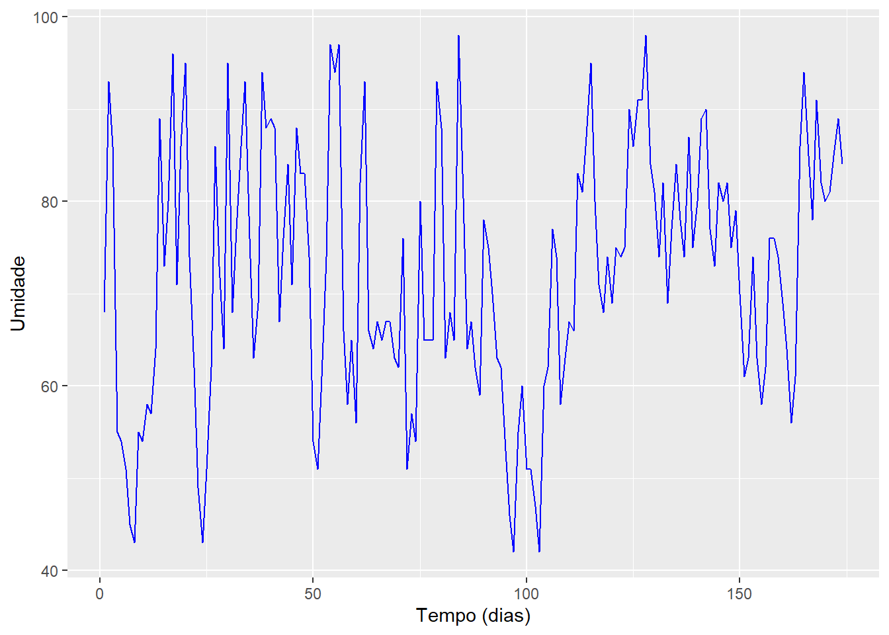

<br>

### Juntandos os gráficos


```r
(plots=ggplot(data, aes(x = tempo)) +
  geom_line(aes(y = Umidade, 
                colour = "Umidade"))+  
  scale_x_continuous() + 
  geom_line(aes(y = Temperatura, 
                colour = "Temperatura")))
```


<br>

### Eixo Y secundário


```r
(plots=plots + 
  scale_y_continuous(sec.axis = sec_axis(~ . *1 ), 
    limits = c(0, 100)))
```


<br>

### Nomeando eixo Y 


```r
(plots=plots+ 
  scale_y_continuous(name = expression("Umidade (%)"), 
                     sec.axis = sec_axis(~ . *1 , 
                                         name = expression("Temperatura"^o*"C"))))
```


<br>

### Organizando a legenda


```r
(plots=plots+
   scale_colour_manual("", 
                       breaks = c("Umidade", "Temperatura"), 
                       values = c("red","blue")))
```


<br>

### Linha de grade e cor de fundo


```r
(plots=plots+theme_bw()+
   theme(panel.grid.major = element_blank(), 
         panel.grid.minor = element_blank()))
```


<br><br><br>

****

# Correlação

****

A Matriz de Correlação possibilita a análise simultânea da associação entre variáveis, através do coeficiente de Pearson.

Coeficiente de Pearson

$$\rho = \dfrac{\sum_{i=1}^{n}(x_i-\bar{x})(y_i-\bar{y})}{\sqrt{\sum_{i=1}^n(x_i-\bar{x})^2}\sqrt{\sum_{i=1}^{n}(y_i-\bar{y})^2}}$$


### Conjunto de dados

Variáveis:

- DPF:	Dias para florescimento
- APF:	Altura da planta no florescimento (cm)
- DPM:	Dias para maturação
- APM:	Altura da planta na maturação (cm)
- IPV:	Inserção primeira vagem (cm)
- ACA:	Acamamento 
- PRO:	Produtiviade de grãos em $Kg$ $ha^-1$
- MCG:	Massa de cem grãos (g)


```r
DPF=c(46.00,46.00,46.00,46.00,46.00,46.00,43.00,43.00,43.00,46.00,43.00,43.00,46.00,46.00,46.00,49.00,50.00,46.00,43.00,43.00,46.00,43.00,46.00,43.00,39.00,39.00,43.00,43.00,42.00,45.00,43.00,46.00,46.00,43.00,43.00,43.00,43.00,46.00,43.00,49.00,50.00,43.00,39.00,39.00,39.00)
APF=c(58.33,55.00,50.00,41.00,35.67,43.33,35.67,36.00,35.33,46.67,36.67,49.00,38.33,43.67,44.33,41.00,48.00,43.67,32.67,28.67,36.67,38.33,46.33,53.33,38.00,33.00,32.67,45.67,48.33,46.67,33.67,36.67,42.67,37.00,43.67,35.33,42.33,47.00,47.00,59.67,59.00,48.33,32.33,36.33,33.33)
DPM=c(105.00,105.00,102.00,110.00,110.00,112.00,110.00,110.00,105.00,112.00,112.00,110.00,110.00,112.00,112.00,112.00,112.00,112.00,110.00,105.00,105.00,110.00,102.00,102.00,110.00,105.00,110.00,110.00,110.00,104.00,105.00,105.00,104.00,104.00,104.00,102.00,104.00,105.00,102.00,110.00,112.00,112.00,102.00,102.00,102.00)
APM=c(100.00,90.33,97.00,91.33,97.67,77.33,90.00,93.00,91.33,98.00,84.67,91.33,92.33,101.67,102.33,102.33,98.33,93.00,78.67,72.33,72.33,97.67,104.33,96.00,99.00,97.00,94.33,104.67,115.00,117.67,81.33,82.33,83.00,104.33,107.33,103.00,89.33,90.33,82.33,123.33,115.00,133.33,60.00,59.00,65.67)
IPV=c(15.00,20.00,17.00,10.00,22.67,14.33,23.00,19.33,15.33,14.33,15.00,22.67,14.67,15.33,17.00,13.67,16.67,19.33,11.00,8.67,11.33,13.00,14.67,13.00,13.00,12.00,17.67,14.67,10.67,25.00,18.00,14.00,18.67,15.67,11.00,18.00,16.33,24.33,17.00,13.33,11.00,22.33,10.33,5.67,14.00)
ACA=c(2.00,1.90,2.20,1.50,1.20,1.00,2.00,1.50,1.20,3.00,1.40,1.60,1.80,2.50,2.50,2.00,1.70,1.80,1.50,2.00,1.50,1.80,2.00,1.80,1.30,1.20,2.00,3.00,2.00,3.00,1.50,1.80,2.20,1.80,1.80,2.00,1.80,3.50,3.50,1.50,2.50,2.00,1.20,1.00,1.20)
PRO=c(2444.44,2870.37,2314.81,2629.63,2444.44,2592.59,2962.96,3037.04,3037.04,2592.59,2296.30,2444.44,2370.37,3481.48,2555.56,1981.48,2611.11,1925.93,1870.37,2518.52,2370.37,2462.96,2351.85,2000.00,2703.70,2685.19,2166.67,2129.63,2222.22,1814.81,2537.04,2351.85,2333.33,3370.37,2462.96,3129.63,2666.67,2796.30,2055.56,2333.33,2240.74,2092.59,2703.70,2129.63,2740.74)
MCG=c(10.78,10.96,10.07,10.77,11.17,11.24,12.57,13.35,13.77,14.23,13.61,13.30,11.85,11.80,12.04,10.10,10.19,9.97,12.15,11.35,11.70,12.83,11.52,11.10,10.95,11.14,10.26,12.51,11.87,12.30,14.20,13.13,14.70,13.08,12.76,13.74,14.59,13.98,13.52,12.72,12.22,12.63,10.93,10.65,10.67)
dados=data.frame(DPF,APF,DPM,APM,IPV,ACA,PRO,MCG)
```

<br>

### Matriz de correlação


```r
M<-cor(dados)
head(round(M,2))
```

```
##      DPF  APF  DPM  APM  IPV  ACA   PRO   MCG
## DPF 1,00 0,56 0,39 0,39 0,21 0,33 -0,13 -0,04
## APF 0,56 1,00 0,12 0,57 0,17 0,41 -0,23 -0,03
## DPM 0,39 0,12 1,00 0,37 0,11 0,00 -0,08 -0,09
## APM 0,39 0,57 0,37 1,00 0,32 0,35 -0,09  0,09
## IPV 0,21 0,17 0,11 0,32 1,00 0,36  0,10  0,28
## ACA 0,33 0,41 0,00 0,35 0,36 1,00 -0,14  0,30
```

Instalar pacote corrplot

<br>

### Formato de Círculo


```r
library(corrplot)
corrplot(M, method="circle")
```


<br>

### Formato de quadrado preenchido


```r
corrplot(M, method="color")
```


<br>

### Formato Numérico


```r
corrplot(M, method="number")
```

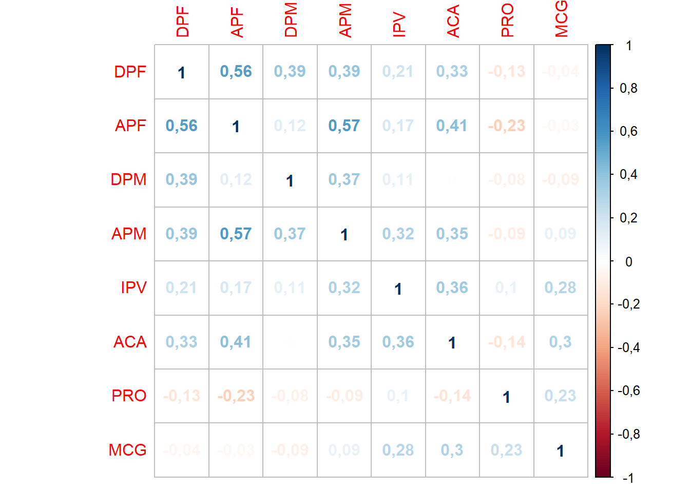

<br>

### Circulo - matriz superior


```r
corrplot(M, type="upper")
```


<br>

### Circulo - matriz inferior


```r
corrplot(M, type="lower")
```


<br>

### Quadrado preenchido, número e sem a diagonal


```r
corrplot(M, method="color",  
         type="upper",
         addCoef.col = "black", insig = "blank", diag=FALSE )
```


<br>

### Escala cinza


```r
corrplot(M, method="color",  
         type="upper", col=gray.colors(100)[100:1],
         addCoef.col = "black", insig = "blank", diag=FALSE)
```


<br>

### Cor da legenda


```r
corrplot(M, method="color", tl.col="black", 
         type="upper", col=gray.colors(100)[100:1],
         addCoef.col = "black", insig = "blank", diag=FALSE )
```


<br>

### Modificando a fonte


```r
par(family="serif")
corrplot(M, method="color", tl.col="black", 
         type="upper", col=gray.colors(100)[100:1],
         addCoef.col = "black", insig = "blank", diag=FALSE )
```

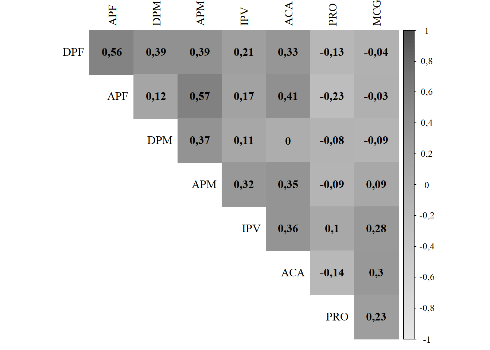

<br>

### Cor do valor da correlação


```r
par(family="serif")
corrplot(M, method="color", tl.col="black", 
         type="upper", col=gray.colors(100)[100:1],
         addCoef.col = "green", insig = "blank", diag=FALSE 
         )
```


<br><br><br>

****

## Matriz de Correlação

****

<br>

### Conjunto de dados


```r
DPF=c(46.00,46.00,46.00,46.00,46.00,46.00,43.00,43.00,43.00,46.00,43.00,43.00,46.00,46.00,46.00,49.00,50.00,46.00,43.00,43.00,46.00,43.00,46.00,43.00,39.00,39.00,43.00,43.00,42.00,45.00,43.00,46.00,46.00,43.00,43.00,43.00,43.00,46.00,43.00,49.00,50.00,43.00,39.00,39.00,39.00)
APF=c(58.33,55.00,50.00,41.00,35.67,43.33,35.67,36.00,35.33,46.67,36.67,49.00,38.33,43.67,44.33,41.00,48.00,43.67,32.67,28.67,36.67,38.33,46.33,53.33,38.00,33.00,32.67,45.67,48.33,46.67,33.67,36.67,42.67,37.00,43.67,35.33,42.33,47.00,47.00,59.67,59.00,48.33,32.33,36.33,33.33)
DPM=c(105.00,105.00,102.00,110.00,110.00,112.00,110.00,110.00,105.00,112.00,112.00,110.00,110.00,112.00,112.00,112.00,112.00,112.00,110.00,105.00,105.00,110.00,
102.00,102.00,110.00,105.00,110.00,110.00,110.00,104.00,105.00,105.00,104.00,104.00,104.00,102.00,104.00,105.00,102.00,110.00,112.00,112.00,102.00,102.00,102.00)
APM=c(100.00,90.33,97.00,91.33,97.67,77.33,90.00,93.00,91.33,98.00,84.67,91.33,92.33,101.67,102.33,102.33,98.33,93.00,78.67,72.33,72.33,97.67,104.33,96.00,99.00,97.00,94.33,104.67,115.00,117.67,81.33,82.33,83.00,104.33,107.33,103.00,89.33,90.33,82.33,123.33,115.00,133.33,60.00,59.00,65.67)
IPV=c(15.00,20.00,17.00,10.00,22.67,14.33,23.00,19.33,15.33,14.33,15.00,22.67,14.67,15.33,17.00,13.67,16.67,19.33,11.00,8.67,11.33,13.00,14.67,13.00,13.00,12.00,17.67,14.67,10.67,25.00,18.00,14.00,18.67,15.67,11.00,18.00,16.33,24.33,17.00,13.33,11.00,22.33,10.33,5.67,14.00)
ACA=c(2.00,1.90,2.20,1.50,1.20,1.00,2.00,1.50,1.20,3.00,1.40,1.60,1.80,2.50,2.50,2.00,1.70,1.80,1.50,2.00,1.50,1.80,2.00,1.80,1.30,1.20,2.00,3.00,2.00,3.00,1.50,1.80,2.20,1.80,1.80,2.00,1.80,3.50,3.50,1.50,2.50,2.00,1.20,1.00,1.20)
PRO=c(2444.44,2870.37,2314.81,2629.63,2444.44,2592.59,2962.96,3037.04,3037.04,2592.59,2296.30,2444.44,2370.37,3481.48,2555.56,1981.48,2611.11,1925.93,1870.37,2518.52,2370.37,2462.96,2351.85,2000.00,2703.70,2685.19,2166.67,2129.63,2222.22,1814.81,2537.04,2351.85,2333.33,3370.37,2462.96,3129.63,2666.67,2796.30,2055.56,2333.33,2240.74,2092.59,2703.70,2129.63,2740.74)
MCG=c(10.78,10.96,10.07,10.77,11.17,11.24,12.57,13.35,13.77,14.23,13.61,13.30,11.85,11.80,12.04,10.10,10.19,9.97,12.15,11.35,11.70,12.83,11.52,11.10,10.95,11.14,10.26,12.51,11.87,12.30,14.20,13.13,14.70,13.08,12.76,13.74,14.59,13.98,13.52,12.72,12.22,12.63,10.93,10.65,10.67)
```

<br>

### Criando uma data.frame


```r
dados=data.frame(DPF,APF,DPM,APM,IPV,ACA,PRO,MCG)
```

<br>

### Matriz de correlação


```r
corre=cor(dados[c(1:8),c(1:8)])
```

<br>

### Construindo o Gráfico

Instalar pacote (PerformanceAnalytics)


```r
library(PerformanceAnalytics)
chart.Correlation(dados, pch=19)
```

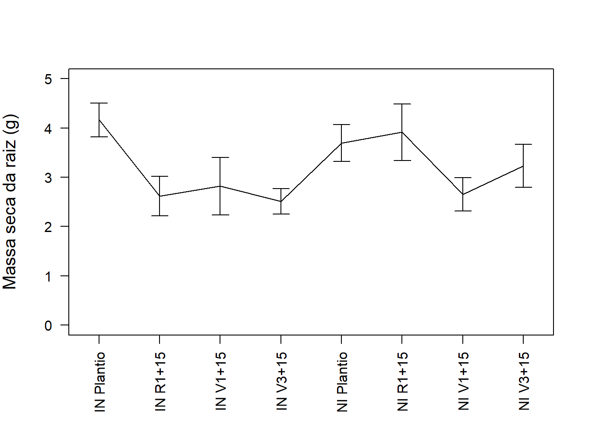

### Conjunto de dados


```r
ph=c(5.4,6.7,6.8,5.9,6.3,6.2,6.3,6,6.1,5.8,6.7,5.7,6.8,6.9,6.5,6.9,6.8,6.7,6.5,6.5,6.7,6.7,6.5,6.7,6.6,6.8,6.4,4.6,6.5,6.6,6.3,6.2,5.5,4.5,5.2,6.5,6.3,6.6,6.4,6.6,6.6,6.5,6.5,6.4,6.5,6.8,6.7,6.6,5.9,6.1,6.3,6.3,6.2,5.3,5.8,6.1,6.7,6.7,6.6,6.6,6.6,6.8,6.8,6.7,6.9,7,7.1,7.1,6.7,6.7,6.6,6.6,6.3,5.8,6.2,6.3,6,5,6.3,5.3,5.4,6.4,6.7,6.5,6.5,6.4,6.7,6.5,6.8,6.2,6.1,6.2,6.8,6.7,6.6,6.4,6.7,6.6,6.4,5.9,6.5,6.6,5.9,6.8,6.8,6.7,6.5,6.7,6.9,6.5,6.8,6.7,6.8,6.6,6.7,6.7,6.9,6.9,6.7,6.8)
HAL=c(4.6,2.7,2.7,3.9,3.4,3.6,3.4,3.9,3.6,3.9,2.5,4.2,2.5,2.5,3.1,2.5,2.5,2.9,3.1,3.1,2.7,2.9,2.9,2.9,3.1,2.7,3.4,8.3,2.9,2.9,3.6,3.1,4.9,8.3,5.3,3.1,2.7,2.7,2.7,2.7,3.1,3.1,2.7,3.1,2.5,2.5,2.9,2.9,3.9,3.9,3.6,3.4,3.9,5.3,3.9,3.9,2.9,2.7,2.9,3.1,2.7,2.1,2.3,2.3,2.3,2.1,2.0,2.1,2.5,2.3,2.5,2.5,3.1,3.6,2.9,2.9,3.4,4.9,2.5,4.6,4.2,2.5,2.3,2.5,2.7,2.5,2.1,2.5,2.1,2.9,2.9,2.9,2.1,2.3,2.5,2.7,2.5,2.5,2.7,3.6,2.7,2.5,3.4,2.0,2.3,2.3,2.7,2.3,2.1,2.5,2.1,2.3,2.3,2.5,2.5,2.3,2.1,2.3,2.3,2.1)
K=c(0.5,0.7,0.7,0.9,0.9,0.8,0.6,0.9,0.8,0.6,0.5,0.4,2.0,1.9,1.0,1.2,1.2,1.6,1.5,0.9,2.0,1.2,1.6,1.4,0.9,0.8,0.8,1.0,0.9,1.1,1.2,1.1,0.6,0.5,0.6,0.9,1.4,1.6,1.3,1.5,0.9,1.2,1.3,1.0,1.4,0.7,0.7,1.0,1.0,0.7,0.8,1.3,0.7,0.7,0.8,0.8,1.3,0.9,1.2,0.8,1.5,1.4,0.8,1.0,1.4,1.1,1.6,1.0,0.9,1.1,1.1,0.9,1.0,0.7,0.6,1.0,1.0,0.7,1.0,0.6,0.9,1.2,0.8,0.8,0.8,0.7,1.1,1.2,0.8,0.9,0.9,1.2,1.1,1.1,1.2,0.9,0.8,0.7,0.9,0.7,0.8,0.9,0.5,0.8,1.0,0.7,0.8,0.7,1.4,0.9,1.4,0.9,1.0,1.3,0.7,1.3,1.4,0.9,0.8,1.4)
P=c(13.7,14.5,65.7,20.5,20.7,19.3,16.2,14.6,15.8,8.7,8.9,7.7,20.0,18.4,9.4,14.8,17.5,11.7,11.2,11.1,51.4,20.4,27.3,14.1,20.1,18.1,23.5,36.4,16.9,18.6,29.0,20.9,16.8,16.8,8.6,11.3,17.5,17.0,30.9,17.2,10.7,17.2,10.9,14.5,26.6,42.1,10.5,13.5,16.4,13.3,34.7,20.0,12.8,15.1,15.8,14.1,26.9,33.2,25.4,25.1,14.1,17.7,12.6,12.9,27.5,18.6,16.9,15.5,16.2,17.6,17.5,14.5,12.6,10.5,10.6,10.5,14.7,10.1,10.7,9.6,17.9,23.9,22.4,22.0,14.2,15.8,12.8,17.8,16.0,10.5,9.6,13.8,17.5,17.7,10.0,10.1,29.0,16.8,18.6,31.7,17.2,40.2,9.8,14.5,28.8,13.0,13.1,18.6,22.0,36.0,19.5,25.2,14.2,15.8,11.9,16.7,20.0,14.7,11.7,17.9)
Ca=c(3.43,4.24,5.37,4.13,4.48,4.65,4.33,4.19,3.91,3.23,4.01,2.98,4.55,4.53,3.91,4.33,4.62,4.54,3.38,3.87,3.85,3.91,3.79,4.57,4.71,4.75,4.93,4.32,4.08,3.73,3.30,3.88,2.59,1.99,2.27,3.68,4.94,5.29,5.69,5.67,4.55,5.01,4.85,4.76,4.99,5.13,4.40,4.38,3.05,3.78,4.21,4.22,3.55,2.81,2.98,3.35,4.03,3.80,3.88,3.97,4.32,4.81,5.06,4.98,5.46,4.88,5.37,5.36,5.41,5.05,5.22,4.95,6.06,3.51,3.72,3.25,2.74,1.78,2.86,2.31,3.63,4.91,4.47,4.85,4.78,6.76,4.31,4.62,4.54,3.10,2.88,3.66,5.56,5.08,4.89,4.67,5.71,5.47,4.68,4.72,4.45,4.23,3.36,4.27,4.31,3.48,3.42,4.38,5.37,7.21,5.40,5.71,4.53,4.35,3.87,3.68,4.18,4.95,4.40,4.84)
Mg=c(2.24,3.22,3.20,2.46,2.51,2.65,2.84,2.80,2.56,2.56,3.45,2.43,3.17,3.25,2.89,3.30,3.34,3.28,2.91,3.00,3.29,2.83,2.89,2.86,2.82,3.15,2.49,2.65,2.95,3.20,2.88,3.10,2.28,1.92,2.05,3.18,3.19,3.13,3.35,3.44,3.27,3.18,3.35,3.24,3.29,3.37,3.21,3.19,2.50,2.01,2.61,2.74,2.42,2.05,2.29,2.36,3.33,3.30,3.03,2.90,2.99,3.34,3.33,3.35,3.30,3.10,3.47,3.30,3.30,3.23,3.25,3.23,3.49,2.40,2.70,2.83,2.78,1.98,2.89,2.30,2.35,3.20,3.45,2.74,2.97,4.56,3.28,2.80,3.03,2.79,2.68,2.95,3.43,3.38,3.30,3.13,3.25,3.06,2.99,2.49,2.84,2.81,2.22,3.48,3.08,2.80,2.62,2.79,3.30,3.39,3.23,3.14,3.31,2.94,3.03,3.17,2.98,3.38,3.13,3.21)
V=c(57.27,75.06,77.30,65.31,69.75,68.82,69.49,66.52,66.47,61.75,75.94,57.72,79.32,79.29,71.24,77.71,78.33,76.18,71.19,71.14,76.94,72.96,73.78,75.10,72.70,76.02,70.72,48.85,73.04,73.25,66.68,71.78,52.34,34.52,48.24,70.98,77.75,78.59,79.11,79.57,73.40,74.76,77.59,73.97,79.17,78.45,73.85,74.40,62.52,62.12,67.51,70.86,62.69,51.35,60.67,62.34,74.62,74.63,73.41,70.85,76.35,81.43,79.59,79.78,81.17,80.69,83.74,81.62,79.09,79.87,79.09,78.23,76.80,64.16,70.53,70.54,65.82,47.34,72.73,53.10,61.80,78.52,78.78,76.85,75.73,82.58,80.00,77.24,79.24,69.95,68.90,72.68,82.19,80.29,78.75,76.06,79.42,78.49,75.87,68.39,74.74,75.88,64.04,80.92,78.00,74.94,71.55,76.95,82.11,81.94,82.16,80.58,78.89,77.11,75.13,77.63,79.68,79.73,77.91,81.24)
dados=data.frame(ph,HAL,K,P,Ca,Mg,V)
```

<br>

### Usando o GGally


```r
library(GGally)
ggpairs(dados)
```

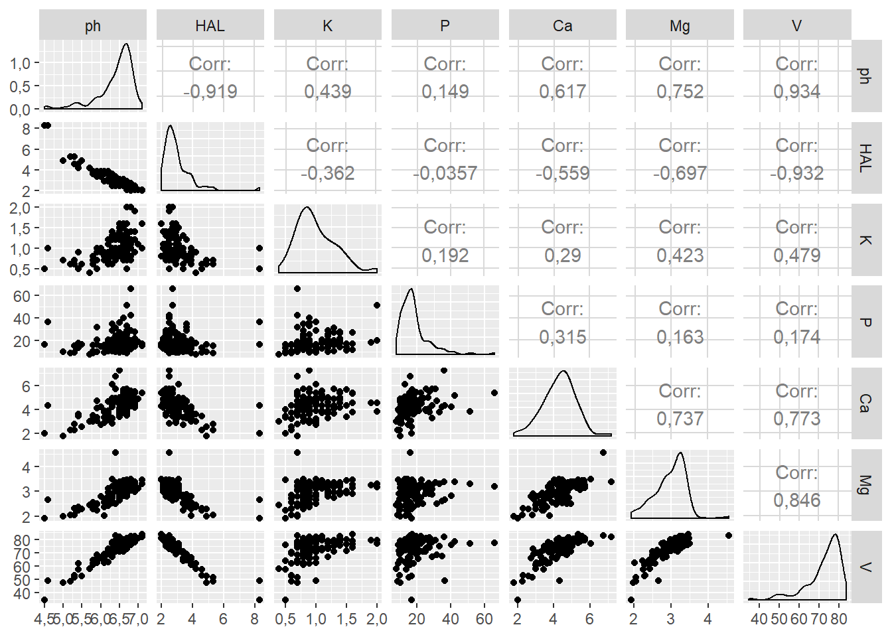

<br>

### Usando a package psych


```r
library(psych)
pairs.panels(dados)
```


<br><br>

****

## Rede de correlação

****

### Conjunto de dados


```r
DPF=c(46.00,46.00,46.00,46.00,46.00,46.00,43.00,43.00,43.00,46.00,43.00,43.00,46.00,46.00,46.00,49.00,50.00,46.00,43.00,43.00,46.00,43.00,46.00,43.00,39.00,39.00,43.00,43.00,42.00,45.00,43.00,46.00,46.00,43.00,43.00,43.00,43.00,46.00,43.00,49.00,50.00,43.00,39.00,39.00,39.00)
APF=c(58.33,55.00,50.00,41.00,35.67,43.33,35.67,36.00,35.33,46.67,36.67,49.00,38.33,43.67,44.33,41.00,48.00,43.67,32.67,28.67,36.67,38.33,46.33,53.33,38.00,33.00,32.67,45.67,48.33,46.67,33.67,36.67,42.67,37.00,43.67,35.33,42.33,47.00,47.00,59.67,59.00,48.33,32.33,36.33,33.33)
DPM=c(105.00,105.00,102.00,110.00,110.00,112.00,110.00,110.00,105.00,112.00,112.00,110.00,110.00,112.00,112.00,112.00,112.00,112.00,110.00,105.00,105.00,110.00,102.00,102.00,110.00,105.00,110.00,110.00,110.00,104.00,105.00,105.00,104.00,104.00,104.00,102.00,104.00,105.00,102.00,110.00,112.00,112.00,102.00,102.00,102.00)
APM=c(100.00,90.33,97.00,91.33,97.67,77.33,90.00,93.00,91.33,98.00,84.67,91.33,92.33,101.67,102.33,102.33,98.33,93.00,78.67,72.33,72.33,97.67,104.33,96.00,99.00,97.00,94.33,104.67,115.00,117.67,81.33,82.33,83.00,104.33,107.33,103.00,89.33,90.33,82.33,123.33,115.00,133.33,60.00,59.00,65.67)
IPV=c(15.00,20.00,17.00,10.00,22.67,14.33,23.00,19.33,15.33,14.33,15.00,22.67,14.67,15.33,17.00,13.67,16.67,19.33,11.00,8.67,11.33,13.00,14.67,13.00,13.00,12.00,17.67,14.67,10.67,25.00,18.00,14.00,18.67,15.67,11.00,18.00,16.33,24.33,17.00,13.33,11.00,22.33,10.33,5.67,14.00)
ACA=c(2.00,1.90,2.20,1.50,1.20,1.00,2.00,1.50,1.20,3.00,1.40,1.60,1.80,2.50,2.50,2.00,1.70,1.80,1.50,2.00,1.50,1.80,2.00,1.80,1.30,1.20,2.00,3.00,2.00,3.00,1.50,1.80,2.20,1.80,1.80,2.00,1.80,3.50,3.50,1.50,2.50,2.00,1.20,1.00,1.20)
PRO=c(2444.44,2870.37,2314.81,2629.63,2444.44,2592.59,2962.96,3037.04,3037.04,2592.59,2296.30,2444.44,2370.37,3481.48,2555.56,1981.48,2611.11,1925.93,1870.37,2518.52,2370.37,2462.96,2351.85,2000.00,2703.70,2685.19,2166.67,2129.63,2222.22,1814.81,2537.04,2351.85,2333.33,3370.37,2462.96,3129.63,2666.67,2796.30,2055.56,2333.33,2240.74,2092.59,2703.70,2129.63,2740.74)
MCG=c(10.78,10.96,10.07,10.77,11.17,11.24,12.57,13.35,13.77,14.23,13.61,13.30,11.85,11.80,12.04,10.10,10.19,9.97,12.15,11.35,11.70,12.83,11.52,11.10,10.95,11.14,10.26,12.51,11.87,12.30,14.20,13.13,14.70,13.08,12.76,13.74,14.59,13.98,13.52,12.72,12.22,12.63,10.93,10.65,10.67)
```

<br>

### Criando uma data.frame


```r
dados=data.frame(DPF,APF,DPM,APM,IPV,ACA,PRO,MCG)
```

<br>

### Matriz de correlação (Pearson)


```r
corre=cor(dados[c(1:8),c(1:8)])
```

<br>

### Construindo o Gráfico

Instalar pacote (qgraph)


```r
library(qgraph)
```

```
## Error : invalid version specification '1,5'
```

```r
qgraph(corre, shape="circle", 
       posCol="darkgreen", 
       negCol="darkred", layout="groups", vsize=10)
```


<br>

### Matriz de correlação (Kendall)


```r
corre=cor(dados[c(1:8),c(1:8)], method = "kendall")
```

<br>

### Construindo o Gráfico

Instalar pacote (qgraph)


```r
library(qgraph)
qgraph(corre, shape="circle", 
       posCol="darkgreen", 
       negCol="darkred", layout="groups", vsize=10)
```


<br>

### Matriz de correlação (Spearman)


```r
corre=cor(dados[c(1:8),c(1:8)], method = "spearman")
```

<br>

### Construindo o Gráfico

Instalar pacote (qgraph)


```r
library(qgraph)
qgraph(corre, shape="circle", 
       posCol="darkgreen", 
       negCol="darkred", layout="groups", vsize=10)
```


<br><br><br>

****

# Radar

****

<br>

Um gráfico de radar é um método gráfico de apresentar dados multivariáveis na forma de um gráfico bidimensional de três ou mais variáveis quantitativas representadas em eixos que partem do mesmo ponto. A posição relativa e o ãngulo dos eixos normalmente é pouco informativo.

O gráfico de radar é também conhecido como gráfico de teia, gráfico de aranha, gráfico de estrela, polígono irregular, gráfico polar, ou diagrama Kiviat.

<br>

### Conjunto de dados


```r
cor=c(6,6,6,7,7,7,3,4,3,3,3,3,6,6,7,6,6,7,6,7,5,6,5,3,3,5,5,5,3,3)
aroma=c(6,7,5,6,6,7,3,3,3,3,5,3,4,6,6,6,5,7,5,6,5,3,3,6,4,4,5,5,4,3)
sabor=c(5,6,6,6,5,6,3,4,3,4,2,2,3,6,7,6,7,7,6,6,5,4,5,3,6,6,5,5,4,6)
corpo=c(6,5,4,6,4,5,4,4,4,5,2,4,6,6,5,6,6,7,5,6,4,5,5,4,4,5,5,4,2,4)
global=c(5,6,6,7,5,6,3,4,3,3,2,3,4,6,6,6,6,7,6,6,5,6,5,5,4,5,5,4,3,5)
(Amostra=rep(c(paste("A", 1:5)), e=6))
```

```
##  [1] "A 1" "A 1" "A 1" "A 1" "A 1" "A 1" "A 2" "A 2" "A 2" "A 2" "A 2" "A 2"
## [13] "A 3" "A 3" "A 3" "A 3" "A 3" "A 3" "A 4" "A 4" "A 4" "A 4" "A 4" "A 4"
## [25] "A 5" "A 5" "A 5" "A 5" "A 5" "A 5"
```

```r
dados=data.frame(Amostra, cor, aroma, sabor, corpo, global)
```

**Tratamentos**:

- B100: 100% de B (Amostra A1)
- N100: 100% de N (Amostra A2)
- B75N25: 75% de B e 25% de N (Amostra A3)
- B50N50: 50% de B e 50% de N (Amostra A4)
- B25N75: 25% de B e 75% de N (Amostra A5)

### Média por variável


```r
mediacor=tapply(cor, Amostra, mean)
mediaaroma=tapply(aroma, Amostra, mean)
mediasabor=tapply(sabor, Amostra, mean)
mediacorpo=tapply(corpo, Amostra, mean)
mediaglobal=tapply(global, Amostra, mean)
medias=c(mediacor,mediaaroma, mediasabor,mediacorpo,mediaglobal)
```

<br>

### Pacote radarchart

<br>

### Lista com as médias

<br>


```r
labs=c("Cor","Aroma","Sabor","Corpo","Global")
scores=list("B100"=as.numeric(medias[c(1,6,11,16,21)]),
            "N100"=as.numeric(medias[c(2,7,12,17,22)]),
            "B75N25"=as.numeric(medias[c(3,8,13,18,23)]),  
            "B50N50"=as.numeric(medias[c(4,9,14,19,24)]),
            "B25N75"=as.numeric(medias[c(5,10,15,20,25)]))
```

Instalar pacote radarchart


```r
library(radarchart)
chartJSRadar(scores = scores,
             labs=labs, 
             plwd=4 , 
             plty=1,
             axistype=0, 
             maxmin=F,
             cglcol="grey", 
             cglty=1, 
             axislabcol="grey", 
             caxislabels=seq(0,20,5), 
             cglwd=0.8,
             vlcex=0.8)
```

<!--html_preserve--><canvas id="htmlwidget-1e064003c72134332329" class="chartJSRadar html-widget" width="672" height="480"></canvas>
<script type="application/json" data-for="htmlwidget-1e064003c72134332329">{"x":{"data":{"labels":["Cor","Aroma","Sabor","Corpo","Global"],"datasets":[{"label":"B100","data":[6.5,6.16666666666667,5.66666666666667,5,5.83333333333333],"backgroundColor":"rgba(255,0,0,0,2)","borderColor":"rgba(255,0,0,0,8)","pointBackgroundColor":"rgba(255,0,0,0,8)","pointBorderColor":"#fff","pointHoverBackgroundColor":"#fff","pointHoverBorderColor":"rgba(255,0,0,0,8)"},{"label":"N100","data":[3.16666666666667,3.33333333333333,3,3.83333333333333,3],"backgroundColor":"rgba(0,255,0,0,2)","borderColor":"rgba(0,255,0,0,8)","pointBackgroundColor":"rgba(0,255,0,0,8)","pointBorderColor":"#fff","pointHoverBackgroundColor":"#fff","pointHoverBorderColor":"rgba(0,255,0,0,8)"},{"label":"B75N25","data":[6.33333333333333,5.66666666666667,6,6,5.83333333333333],"backgroundColor":"rgba(0,0,255,0,2)","borderColor":"rgba(0,0,255,0,8)","pointBackgroundColor":"rgba(0,0,255,0,8)","pointBorderColor":"#fff","pointHoverBackgroundColor":"#fff","pointHoverBorderColor":"rgba(0,0,255,0,8)"},{"label":"B50N50","data":[5.33333333333333,4.66666666666667,4.83333333333333,4.83333333333333,5.5],"backgroundColor":"rgba(255,255,0,0,2)","borderColor":"rgba(255,255,0,0,8)","pointBackgroundColor":"rgba(255,255,0,0,8)","pointBorderColor":"#fff","pointHoverBackgroundColor":"#fff","pointHoverBorderColor":"rgba(255,255,0,0,8)"},{"label":"B25N75","data":[4,4.16666666666667,5.33333333333333,4,4.33333333333333],"backgroundColor":"rgba(255,0,255,0,2)","borderColor":"rgba(255,0,255,0,8)","pointBackgroundColor":"rgba(255,0,255,0,8)","pointBorderColor":"#fff","pointHoverBackgroundColor":"#fff","pointHoverBorderColor":"rgba(255,0,255,0,8)"}]},"options":{"responsive":true,"title":{"display":false,"text":null},"scale":{"ticks":{"min":0},"pointLabels":{"fontSize":18}},"tooltips":{"enabled":true,"mode":"label"},"legend":{"display":true},"plwd":4,"plty":1,"axistype":0,"maxmin":false,"cglcol":"grey","cglty":1,"axislabcol":"grey","caxislabels":[0,5,10,15,20],"cglwd":0.8,"vlcex":0.8}},"evals":[],"jsHooks":[]}</script><!--/html_preserve-->

<br>

### Pacote plotly

<br>

### Médias por tratamento


```r
B100=c(as.numeric(medias[c(1,6,11,16,21)]))
N100=c(as.numeric(medias[c(2,7,12,17,22)]))
B75N25=c(as.numeric(medias[c(3,8,13,18,23)]))  
B50N50=c(as.numeric(medias[c(4,9,14,19,24)]))
B25N75=c(as.numeric(medias[c(5,10,15,20,25)]))
```

<br>

### Pacote plotly

<center>


```r
library(plotly)
(p <- plot_ly(type = 'scatterpolar',fill = 'toself') %>%
  add_trace(r = B100,theta = c('Cor','Aroma','Sabor', 'Corpo', 'Global'),name = 'B100') %>%
  add_trace(r = N100,theta = c('Cor','Aroma','Sabor', 'Corpo', 'Global'),name = 'N100') %>%
  add_trace(r = B75N25,theta = c('Cor','Aroma','Sabor', 'Corpo', 'Global'),name = 'B75N25') %>%
  add_trace(r = B50N50,theta = c('Cor','Aroma','Sabor', 'Corpo', 'Global'),name = 'B50N50') %>%
  add_trace(r = B25N75,theta = c('Cor','Aroma','Sabor', 'Corpo', 'Global'),name = 'B25N75') %>% layout(polar = list(radialaxis = list(visible = T))))
```

<!--html_preserve--><div id="htmlwidget-a3540d683b69f0d4c71c" style="width:672px;height:480px;" class="plotly html-widget"></div>
<script type="application/json" data-for="htmlwidget-a3540d683b69f0d4c71c">{"x":{"visdat":{"42481219655d":["function () ","plotlyVisDat"]},"cur_data":"42481219655d","attrs":{"42481219655d":{"fill":"toself","alpha_stroke":1,"sizes":[10,100],"spans":[1,20],"type":"scatterpolar"},"42481219655d.1":{"fill":"toself","alpha_stroke":1,"sizes":[10,100],"spans":[1,20],"type":"scatterpolar","r":[6.5,6.16666666666667,5.66666666666667,5,5.83333333333333],"theta":["Cor","Aroma","Sabor","Corpo","Global"],"name":"B100","inherit":true},"42481219655d.2":{"fill":"toself","alpha_stroke":1,"sizes":[10,100],"spans":[1,20],"type":"scatterpolar","r":[3.16666666666667,3.33333333333333,3,3.83333333333333,3],"theta":["Cor","Aroma","Sabor","Corpo","Global"],"name":"N100","inherit":true},"42481219655d.3":{"fill":"toself","alpha_stroke":1,"sizes":[10,100],"spans":[1,20],"type":"scatterpolar","r":[6.33333333333333,5.66666666666667,6,6,5.83333333333333],"theta":["Cor","Aroma","Sabor","Corpo","Global"],"name":"B75N25","inherit":true},"42481219655d.4":{"fill":"toself","alpha_stroke":1,"sizes":[10,100],"spans":[1,20],"type":"scatterpolar","r":[5.33333333333333,4.66666666666667,4.83333333333333,4.83333333333333,5.5],"theta":["Cor","Aroma","Sabor","Corpo","Global"],"name":"B50N50","inherit":true},"42481219655d.5":{"fill":"toself","alpha_stroke":1,"sizes":[10,100],"spans":[1,20],"type":"scatterpolar","r":[4,4.16666666666667,5.33333333333333,4,4.33333333333333],"theta":["Cor","Aroma","Sabor","Corpo","Global"],"name":"B25N75","inherit":true}},"layout":{"margin":{"b":40,"l":60,"t":25,"r":10},"polar":{"radialaxis":{"visible":true}},"hovermode":"closest","showlegend":true},"source":"A","config":{"showSendToCloud":false},"data":[{"fillcolor":"rgba(31,119,180,0,5)","fill":"toself","type":"scatterpolar","mode":"markers","marker":{"color":"rgba(31,119,180,1)","line":{"color":"rgba(31,119,180,1)"}},"line":{"color":"rgba(31,119,180,1)"},"frame":null},{"fillcolor":"rgba(255,127,14,0,5)","fill":"toself","type":"scatterpolar","r":[6.5,6.16666666666667,5.66666666666667,5,5.83333333333333],"theta":["Cor","Aroma","Sabor","Corpo","Global"],"name":"B100","mode":"markers","marker":{"color":"rgba(255,127,14,1)","line":{"color":"rgba(255,127,14,1)"}},"line":{"color":"rgba(255,127,14,1)"},"frame":null},{"fillcolor":"rgba(44,160,44,0,5)","fill":"toself","type":"scatterpolar","r":[3.16666666666667,3.33333333333333,3,3.83333333333333,3],"theta":["Cor","Aroma","Sabor","Corpo","Global"],"name":"N100","mode":"markers","marker":{"color":"rgba(44,160,44,1)","line":{"color":"rgba(44,160,44,1)"}},"line":{"color":"rgba(44,160,44,1)"},"frame":null},{"fillcolor":"rgba(214,39,40,0,5)","fill":"toself","type":"scatterpolar","r":[6.33333333333333,5.66666666666667,6,6,5.83333333333333],"theta":["Cor","Aroma","Sabor","Corpo","Global"],"name":"B75N25","mode":"markers","marker":{"color":"rgba(214,39,40,1)","line":{"color":"rgba(214,39,40,1)"}},"line":{"color":"rgba(214,39,40,1)"},"frame":null},{"fillcolor":"rgba(148,103,189,0,5)","fill":"toself","type":"scatterpolar","r":[5.33333333333333,4.66666666666667,4.83333333333333,4.83333333333333,5.5],"theta":["Cor","Aroma","Sabor","Corpo","Global"],"name":"B50N50","mode":"markers","marker":{"color":"rgba(148,103,189,1)","line":{"color":"rgba(148,103,189,1)"}},"line":{"color":"rgba(148,103,189,1)"},"frame":null},{"fillcolor":"rgba(140,86,75,0,5)","fill":"toself","type":"scatterpolar","r":[4,4.16666666666667,5.33333333333333,4,4.33333333333333],"theta":["Cor","Aroma","Sabor","Corpo","Global"],"name":"B25N75","mode":"markers","marker":{"color":"rgba(140,86,75,1)","line":{"color":"rgba(140,86,75,1)"}},"line":{"color":"rgba(140,86,75,1)"},"frame":null}],"highlight":{"on":"plotly_click","persistent":false,"dynamic":false,"selectize":false,"opacityDim":0.2,"selected":{"opacity":1},"debounce":0},"shinyEvents":["plotly_hover","plotly_click","plotly_selected","plotly_relayout","plotly_brushed","plotly_brushing","plotly_clickannotation","plotly_doubleclick","plotly_deselect","plotly_afterplot","plotly_sunburstclick"],"base_url":"https://plot.ly"},"evals":[],"jsHooks":[]}</script><!--/html_preserve-->

</center>

<br><br><br>

****

# Intervalo de confiança

****

<br>

### Conjunto de dados

Um experimento foi realizado com o intuito de avaliar a massa seca da raiz de soja no munícipio de Londrina-PR. O experimento foi instalado em delineamento inteiramente casualizado (DIC), 5 repetições, no esquema fatorial 4 x 2 (4 aplicações de dicloroisocianurato de sódio (DUP) e 2 inoculações de *Rhizobium*).


```r
msraiz=c(4.87, 4.64, 3.71, 3.04, 4.57, 4.13,  3.8, 1.17, 3.28, 1.73, 1.87, 2.85,  3.32, 2.19, 2.33, 4.09, 2.85, 1.86, 2.17, 2.12, 3.03, 3.52, 3.72, 3.09, 5.11,  3.6, 2.14, 2.25, 1.93, 3.35, 2.03, 4.72, 3.39, 3.05, 2.98, 2.53, 5.61, 3.74, 2.89, 4.8)
(Inoculação=rep(c("IN","NI"),e=20))
```

```
##  [1] "IN" "IN" "IN" "IN" "IN" "IN" "IN" "IN" "IN" "IN" "IN" "IN" "IN" "IN" "IN"
## [16] "IN" "IN" "IN" "IN" "IN" "NI" "NI" "NI" "NI" "NI" "NI" "NI" "NI" "NI" "NI"
## [31] "NI" "NI" "NI" "NI" "NI" "NI" "NI" "NI" "NI" "NI"
```

```r
(Época=rep(c("Plantio","V1+15","V3+15","R1+15"),e=5,2))
```

```
##  [1] "Plantio" "Plantio" "Plantio" "Plantio" "Plantio" "V1+15"   "V1+15"  
##  [8] "V1+15"   "V1+15"   "V1+15"   "V3+15"   "V3+15"   "V3+15"   "V3+15"  
## [15] "V3+15"   "R1+15"   "R1+15"   "R1+15"   "R1+15"   "R1+15"   "Plantio"
## [22] "Plantio" "Plantio" "Plantio" "Plantio" "V1+15"   "V1+15"   "V1+15"  
## [29] "V1+15"   "V1+15"   "V3+15"   "V3+15"   "V3+15"   "V3+15"   "V3+15"  
## [36] "R1+15"   "R1+15"   "R1+15"   "R1+15"   "R1+15"
```

```r
F1=as.factor(Inoculação)
F2=as.factor(Época)
Trat=paste(F1,F2)
dados=data.frame(Trat,resp=msraiz)
```

<br>

### Gráfico de linhas


```r
sciplot::lineplot.CI(Trat,msraiz,type="l",las=2,xlab="",ylim=c(0,5),
                     ylab="Massa seca da raiz (g)",
                     cex.lab=1.25,cex.names=1)
```


<br>

### Gráfico de pontos


```r
sciplot::lineplot.CI(Trat,msraiz,type="p",las=2,xlab="",ylim=c(0,5),
                     ylab="Massa seca da raiz (g)",
                     cex.lab=1.25,cex.names=1)
```


<br>

### Gráfico de linhas e pontos


```r
sciplot::lineplot.CI(Trat,msraiz,type="b",las=2,xlab="",ylim=c(0,5),
                     ylab="Massa seca da raiz (g)",
                     cex.lab=1.25,cex.names=1)
```

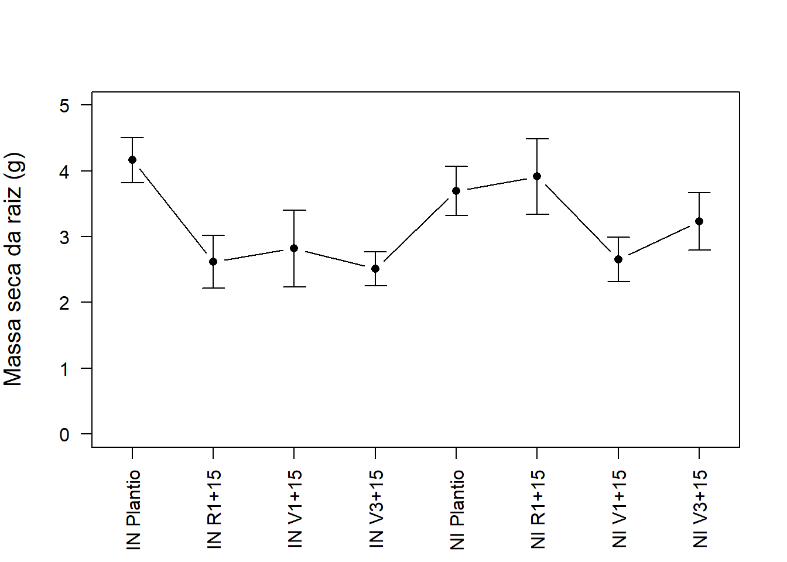

<br>

### Gráfico de barras e linhas


```r
sciplot::bargraph.CI(Trat,msraiz,las=2,xlab="",
                     ylab="Massa seca da raiz (g)",ylim=c(0,5),
                     cex.lab = 1.25,col = "black",
                     angle = 45, cex.names = 1,density = c(0,20))
abline(h=0)
```


<br><br><br>

****

# Quantis Teóricos 

****

<br>

### Conjunto de dados

Um experimento foi realizado com o intuito de avaliar a massa seca da raiz de soja no munícipio de Londrina-PR. O experimento foi instalado em delineamento inteiramente casualizado (DIC), 5 repetições, no esquema fatorial 4 x 2 (4 aplicações de dicloroisocianurato de sódio (DUP) e 2 inoculações de *Rhizobium*).


```r
msraiz=c(4.87, 4.64, 3.71, 3.04, 4.57, 4.13,  3.8, 1.17, 3.28, 1.73, 1.87, 2.85, 3.32, 2.19, 2.33, 4.09, 2.85, 1.86, 2.17, 2.12, 3.03, 3.52, 3.72, 3.09,  5.11,  3.6, 2.14, 2.25, 1.93, 3.35, 2.03, 4.72, 3.39, 3.05, 2.98, 2.53, 5.61, 3.74, 2.89, 4.8)
(Inoculação=rep(c("IN","NI"),e=20))
```

```
##  [1] "IN" "IN" "IN" "IN" "IN" "IN" "IN" "IN" "IN" "IN" "IN" "IN" "IN" "IN" "IN"
## [16] "IN" "IN" "IN" "IN" "IN" "NI" "NI" "NI" "NI" "NI" "NI" "NI" "NI" "NI" "NI"
## [31] "NI" "NI" "NI" "NI" "NI" "NI" "NI" "NI" "NI" "NI"
```

```r
(Época=rep(c("Plantio","V1+15","V3+15","R1+15"),e=5,2))
```

```
##  [1] "Plantio" "Plantio" "Plantio" "Plantio" "Plantio" "V1+15"   "V1+15"  
##  [8] "V1+15"   "V1+15"   "V1+15"   "V3+15"   "V3+15"   "V3+15"   "V3+15"  
## [15] "V3+15"   "R1+15"   "R1+15"   "R1+15"   "R1+15"   "R1+15"   "Plantio"
## [22] "Plantio" "Plantio" "Plantio" "Plantio" "V1+15"   "V1+15"   "V1+15"  
## [29] "V1+15"   "V1+15"   "V3+15"   "V3+15"   "V3+15"   "V3+15"   "V3+15"  
## [36] "R1+15"   "R1+15"   "R1+15"   "R1+15"   "R1+15"
```

```r
F1=as.factor(Inoculação)
F2=as.factor(Época)
Trat=paste(F1,F2)
dados=data.frame(Trat,resp=msraiz)
```

<br>

### Análise de variância


```r
mod = with(dados, aov(msraiz~F1*F2))
anova(mod)
```

```
## Analysis of Variance Table
## 
## Response: msraiz
##           Df  Sum Sq Mean Sq F value  Pr(>F)  
## F1         1  1,1868 1,18680  1,2950 0,26358  
## F2         3  8,5762 2,85872  3,1193 0,03961 *
## F1:F2      3  4,9430 1,64766  1,7978 0,16744  
## Residuals 32 29,3268 0,91646                  
## ---
## Signif. codes:  0 '***' 0,001 '**' 0,01 '*' 0,05 '.' 0,1 ' ' 1
```

<br>

### Envelope simulado


```r
hnp::hnp(mod,
         las=1,
         seed=1,
         pch=16)
```


<br>

### Porcentagem de pontos fora


```r
hnp::hnp(mod,
         seed=1,
         las=1, 
         pch=16,
         print.on=T)
```

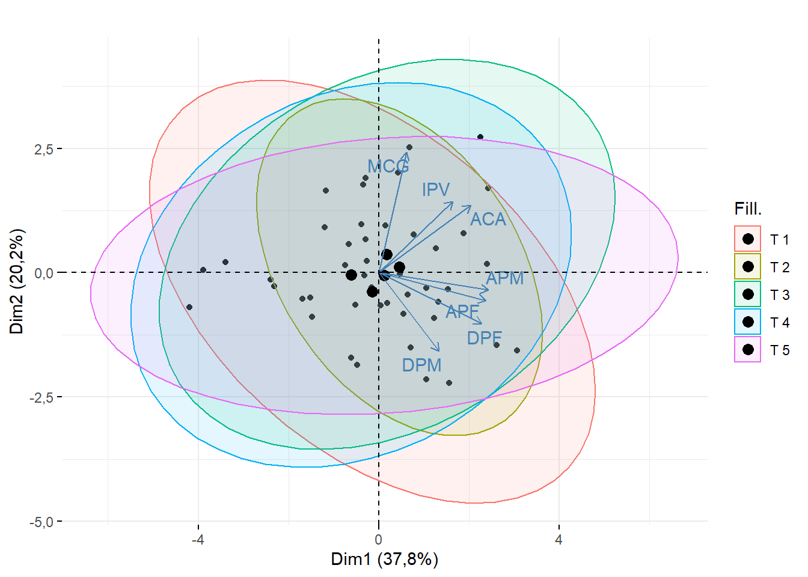

<br>

### Colorir pontos fora 


```r
hnp::hnp(mod, 
         seed=1,
         las=1, 
         pch=16,
         print.on=T,
         paint.out=T, 
         col.paint.out="red")
```


<br><br><br>

****

# Componentes principais

****

A análise de Componentes Principais é um método utilizado para reduzir a dimensão do problema em componentes não correlacionadas que são combinações lineares das variáveis originais. O número dessas componentes é menor ou igual a quantidade de variáveis originais. Esse método é útil quando o número de variáveis em estudo é muito grande.

<br>

****

## Pacote ggforfity

****

### Conjunto de dados


```r
dados <- iris[c(1, 2, 3, 4)]
```

<br>

### Calculando a PCA


```r
(pca=prcomp(dados,scale. = T))
```

```
## Standard deviations (1, .., p=4):
## [1] 1,7083611 0,9560494 0,3830886 0,1439265
## 
## Rotation (n x k) = (4 x 4):
##                     PC1         PC2        PC3        PC4
## Sepal.Length  0,5210659 -0,37741762  0,7195664  0,2612863
## Sepal.Width  -0,2693474 -0,92329566 -0,2443818 -0,1235096
## Petal.Length  0,5804131 -0,02449161 -0,1421264 -0,8014492
## Petal.Width   0,5648565 -0,06694199 -0,6342727  0,5235971
```

<br>

### Dispersão com os autovalores


```r
library(ggfortify)
autoplot(pca,data=iris)
```


<br>

### Agrupando por espécies

Obs. a coluna de "Species" está na dataset *iris*


```r
library(ggfortify)
autoplot(pca,data=iris,colour="Species")
```


<br>

### Vetor das respostas


```r
library(ggfortify)
autoplot(pca,
         data=iris,
         colour="Species",
         loadings=T)
```


<br>

### Nome dos vetores


```r
library(ggfortify)
autoplot(pca,
         data=iris,
         colour="Species",
         loadings=T,
         loadings.label=T)
```


<br>


### Polígono de agrupamento


```r
library(ggfortify)
autoplot(pca,
         data=iris,
         colour="Species",
         loadings=T,
         loadings.label=T,
         frame=T)
```


<br>


### Modificando para elipse


```r
library(ggfortify)
autoplot(pca,
         data=iris,
         colour="Species",
         loadings=T,
         loadings.label=T,
         frame=T, 
         frame.type="norm")
```

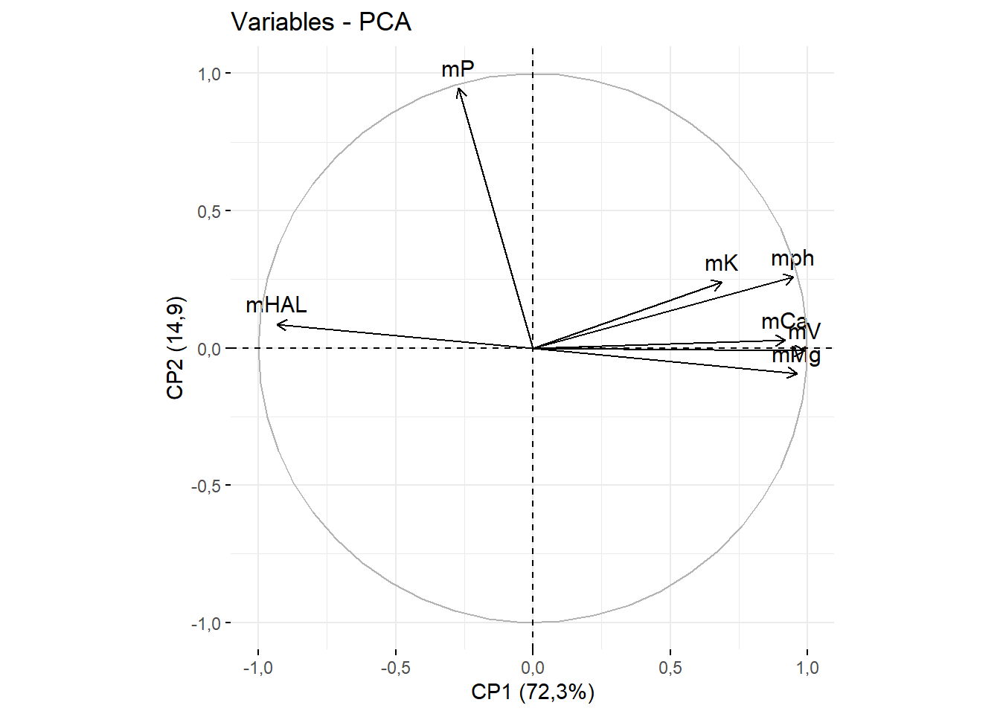

<br>


### Cor do vetor e do nome


```r
library(ggfortify)
autoplot(pca,
         data=iris,
         colour="Species",
         loadings=T,
         loadings.label=T,
         frame=T, 
         frame.type="norm",
         loadings.colour="black",
         loadings.label.colour="black")
```


<br>


### fonte; linha de grade e cor de fundo


```r
library(ggfortify)
autoplot(pca,
         data=iris,
         colour="Species",
         loadings=T,
         loadings.label=T,
         frame=T, 
         frame.type="norm",
         loadings.colour="black",
         loadings.label.colour="black",
         loadings.label.family="serif")+theme_bw()+
  theme(text = element_text(family="serif"))
```


<br>

### Linha em Y=0 e X=0


```r
library(ggfortify)
autoplot(pca,
         data=iris,
         colour="Species",
         loadings=T,
         loadings.label=T,
         frame=T, 
         frame.type="norm",
         loadings.colour="black",
         loadings.label.colour="black",
         loadings.label.family="serif")+theme_bw()+
  theme(text = element_text(family="serif"))+
  geom_vline(,xintercept = 0,linetype=2)+
  geom_hline(,yintercept = 0,linetype=2)
```

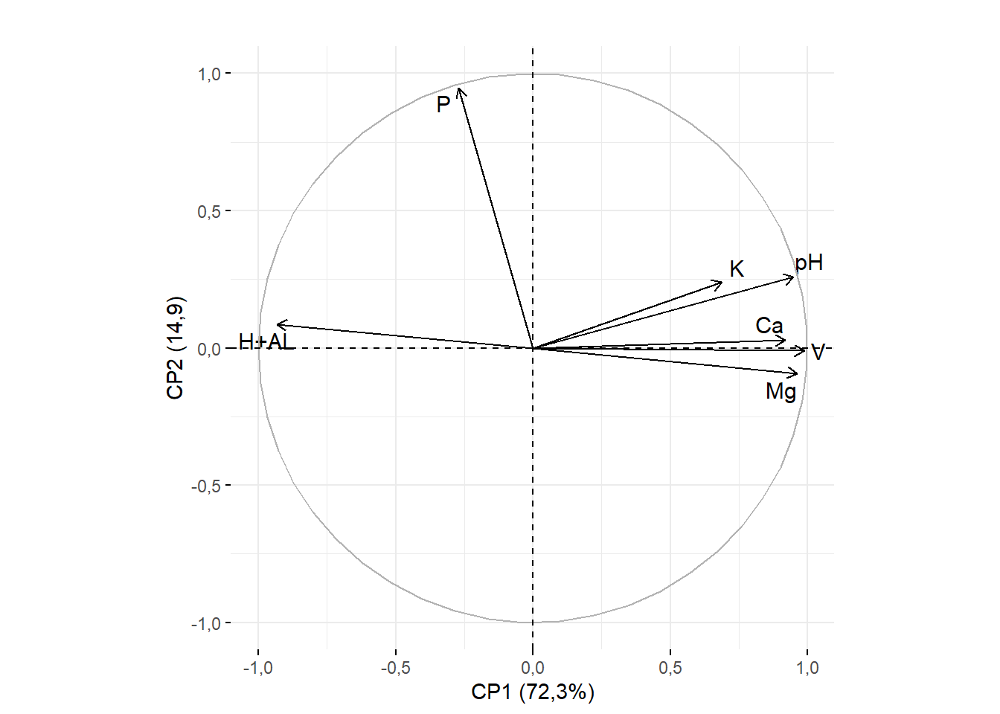

<br><br>

****

## factoextra e factomineR (Biplot)

****

<br>

```r
rm(list=ls())
DPF=c(46.00,46.00,46.00,46.00,46.00,46.00,43.00,43.00,43.00,46.00,43.00,43.00,46.00,46.00,46.00,49.00,50.00,46.00,43.00,43.00,46.00,43.00,46.00,43.00,39.00,39.00,43.00,43.00,42.00,45.00,43.00,46.00,46.00,43.00,43.00,43.00,43.00,46.00,43.00,49.00,50.00,43.00,39.00,39.00,39.00)
APF=c(58.33,55.00,50.00,41.00,35.67,43.33,35.67,36.00,35.33,46.67,36.67,49.00,38.33,43.67,44.33,41.00,48.00,43.67,32.67,28.67,36.67,38.33,46.33,53.33,38.00,33.00,32.67,45.67,48.33,46.67,33.67,36.67,42.67,37.00,43.67,35.33,42.33,47.00,47.00,59.67,59.00,48.33,32.33,36.33,33.33)
DPM=c(105.00,105.00,102.00,110.00,110.00,112.00,110.00,110.00,105.00,112.00,112.00,110.00,110.00,112.00,112.00,112.00,112.00,112.00,110.00,105.00,105.00,110.00,102.00,102.00,110.00,105.00,110.00,110.00,110.00,104.00,105.00,105.00,104.00,104.00,104.00,102.00,104.00,105.00,102.00,110.00,112.00,112.00,102.00,102.00,102.00)
APM=c(100.00,90.33,97.00,91.33,97.67,77.33,90.00,93.00,91.33,98.00,84.67,91.33,92.33,101.67,102.33,102.33,98.33,93.00,78.67,72.33,72.33,97.67,104.33,96.00,99.00,97.00,94.33,104.67,115.00,117.67,81.33,82.33,83.00,104.33,107.33,103.00,89.33,90.33,82.33,123.33,115.00,133.33,60.00,59.00,65.67)
IPV=c(15.00,20.00,17.00,10.00,22.67,14.33,23.00,19.33,15.33,14.33,15.00,22.67,14.67,15.33,17.00,13.67,16.67,19.33,11.00,8.67,11.33,13.00,14.67,13.00,13.00,12.00,17.67,14.67,10.67,25.00,18.00,14.00,18.67,15.67,11.00,18.00,16.33,24.33,17.00,13.33,11.00,22.33,10.33,5.67,14.00)
ACA=c(2.00,1.90,2.20,1.50,1.20,1.00,2.00,1.50,1.20,3.00,1.40,1.60,1.80,2.50,2.50,2.00,1.70,1.80,1.50,2.00,1.50,1.80,2.00,1.80,1.30,1.20,2.00,3.00,2.00,3.00,1.50,1.80,2.20,1.80,1.80,2.00,1.80,3.50,3.50,1.50,2.50,2.00,1.20,1.00,1.20)
PRO=c(2444.44,2870.37,2314.81,2629.63,2444.44,2592.59,2962.96,3037.04,3037.04,2592.59,2296.30,2444.44,2370.37,3481.48,2555.56,1981.48,2611.11,1925.93,1870.37,2518.52,2370.37,2462.96,2351.85,2000.00,2703.70,2685.19,2166.67,2129.63,2222.22,1814.81,2537.04,2351.85,2333.33,3370.37,2462.96,3129.63,2666.67,2796.30,2055.56,2333.33,2240.74,2092.59,2703.70,2129.63,2740.74)
MCG=c(10.78,10.96,10.07,10.77,11.17,11.24,12.57,13.35,13.77,14.23,13.61,13.30,11.85,11.80,12.04,10.10,10.19,9.97,12.15,11.35,11.70,12.83,11.52,11.10,10.95,11.14,10.26,12.51,11.87,12.30,14.20,13.13,14.70,13.08,12.76,13.74,14.59,13.98,13.52,12.72,12.22,12.63,10.93,10.65,10.67)
Tratamento=rep(c(paste("T",1:5)),9)
dados=data.frame(Tratamento,DPF,APF,DPM,APM,IPV,ACA,PRO,MCG)
```

<br>

### Valores dos CP


```r
require(FactoMineR)
pca=PCA(dados[c(2,3,4,5,6,7,9)],scale.unit=T,graph=F)
round(pca$eig,3)
```

```
##        eigenvalue percentage of variance cumulative percentage of variance
## comp 1      2,648                 37,821                            37,821
## comp 2      1,411                 20,152                            57,974
## comp 3      0,939                 13,418                            71,392
## comp 4      0,650                  9,282                            80,673
## comp 5      0,608                  8,692                            89,365
## comp 6      0,479                  6,842                            96,207
## comp 7      0,266                  3,793                           100,000
```

<br>

### Gráfico básico


```r
require(factoextra)
fviz_pca_biplot(pca,geom = c("point"))
```


<br>

### Elipse geral


```r
require(factoextra)
fviz_pca_biplot(pca,geom = c("point"),
                addEllipses = T)
```


<br>

### Elipse por Tratamentos


```r
require(factoextra)
fviz_pca_biplot(pca,geom = c("point"),
                addEllipses = T, fill.ind = dados$Tratamento)
```

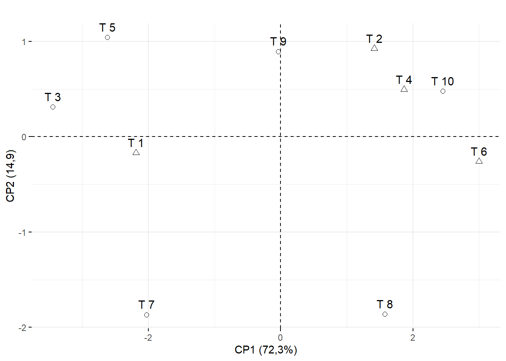

<br>

### Removendo título


```r
require(factoextra)
fviz_pca_biplot(pca,geom = c("point"),
                addEllipses = T, 
                fill.ind = dados$Tratamento,
                title = "")
```


<br>

### Sobreposição de legendas


```r
require(factoextra)
fviz_pca_biplot(pca,geom = c("point"),
                addEllipses = T, ## adicionar elipse
                fill.ind = dados$Tratamento,
                title = "",
                repel=T)
```


<br>

### Tamanho do ponto, letra e a cor


```r
require(factoextra)
fviz_pca_biplot(pca,geom = c("point"),
                addEllipses = T, 
                fill.ind = dados$Tratamento,
                title = "",
                repel=T, 
                pointshape=21,pointsize=2,textsize=0.5, col.var="black")
```

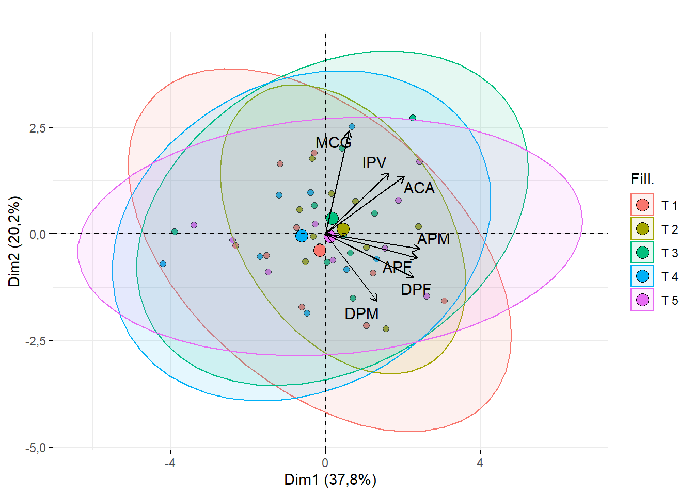

<br>

### Título das ellipses


```r
require(factoextra)
fviz_pca_biplot(pca,geom = c("point"),
                addEllipses = T, 
                fill.ind = dados$Tratamento,
                title = "",
                repel=T, 
                pointshape=21,pointsize=2,textsize=0.5, col.var="black",fill= "Cultivares")
```


<br>

### Título do 1 e 2 CP


```r
require(factoextra)
fviz_pca_biplot(pca,geom = c("point"),
                addEllipses = T, 
                fill.ind = dados$Tratamento,
                title = "",
                repel=T, 
                pointshape=21,pointsize=2,textsize=0.5,
                col.var="black",fill= "Cultivares")+ylab("CP2(20,2%)")+xlab("CP1(37,8%)")
```


<br><br>

****

## factoextra (Gráficos separados)

****

<br>


### Conjunto de dados


```r
ph=c(5.4,6.7,6.8,5.9,6.3,6.2,6.3,6,6.1,5.8,6.7,5.7,6.8,6.9,6.5,6.9,6.8,6.7,6.5,6.5,6.7,6.7,6.5,6.7,6.6,6.8,6.4,4.6,6.5,6.6,6.3,6.2,5.5,4.5,5.2,6.5,6.3,6.6,6.4,6.6,6.6,6.5,6.5,6.4,6.5,6.8,6.7,6.6,5.9,6.1,6.3,6.3,6.2,5.3,5.8,6.1,6.7,6.7,6.6,6.6,6.6,6.8,6.8,6.7,6.9,7,7.1,7.1,6.7,6.7,6.6,6.6,6.3,5.8,6.2,6.3,6,5,6.3,5.3,5.4,6.4,6.7,6.5,6.5,6.4,6.7,6.5,6.8,6.2,6.1,6.2,6.8,6.7,6.6,6.4,6.7,6.6,6.4,5.9,6.5,6.6,5.9,6.8,6.8,6.7,6.5,6.7,6.9,6.5,6.8,6.7,6.8,6.6,6.7,6.7,6.9,6.9,6.7,6.8)
HAL=c(4.6,2.7,2.7,3.9,3.4,3.6,3.4,3.9,3.6,3.9,2.5,4.2,2.5,2.5,3.1,2.5,2.5,2.9,3.1,3.1,2.7,2.9,2.9,2.9,3.1,2.7,3.4,8.3,2.9,2.9,3.6,3.1,4.9,8.3,5.3,3.1,2.7,2.7,2.7,2.7,3.1,3.1,2.7,3.1,2.5,2.5,2.9,2.9,3.9,3.9,3.6,3.4,3.9,5.3,3.9,3.9,2.9,2.7,2.9,3.1,2.7,2.1,2.3,2.3,2.3,2.1,2.0,2.1,2.5,2.3,2.5,2.5,3.1,3.6,2.9,2.9,3.4,4.9,2.5,4.6,4.2,2.5,2.3,2.5,2.7,2.5,2.1,2.5,2.1,2.9,2.9,2.9,2.1,2.3,2.5,2.7,2.5,2.5,2.7,3.6,2.7,2.5,3.4,2.0,2.3,2.3,2.7,2.3,2.1,2.5,2.1,2.3,2.3,2.5,2.5,2.3,2.1,2.3,2.3,2.1)
K=c(0.5,0.7,0.7,0.9,0.9,0.8,0.6,0.9,0.8,0.6,0.5,0.4,2.0,1.9,1.0,1.2,1.2,1.6,1.5,0.9,2.0,1.2,1.6,1.4,0.9,0.8,0.8,1.0,0.9,1.1,1.2,1.1,0.6,0.5,0.6,0.9,1.4,1.6,1.3,1.5,0.9,1.2,1.3,1.0,1.4,0.7,0.7,1.0,1.0,0.7,0.8,1.3,0.7,0.7,0.8,0.8,1.3,0.9,1.2,0.8,1.5,1.4,0.8,1.0,1.4,1.1,1.6,1.0,0.9,1.1,1.1,0.9,1.0,0.7,0.6,1.0,1.0,0.7,1.0,0.6,0.9,1.2,0.8,0.8,0.8,0.7,1.1,1.2,0.8,0.9,0.9,1.2,1.1,1.1,1.2,0.9,0.8,0.7,0.9,0.7,0.8,0.9,0.5,0.8,1.0,0.7,0.8,0.7,1.4,0.9,1.4,0.9,1.0,1.3,0.7,1.3,1.4,0.9,0.8,1.4)
P=c(13.7,14.5,65.7,20.5,20.7,19.3,16.2,14.6,15.8,8.7,8.9,7.7,20.0,18.4,9.4,14.8,17.5,11.7,11.2,11.1,51.4,20.4,27.3,14.1,20.1,18.1,23.5,36.4,16.9,18.6,29.0,20.9,16.8,16.8,8.6,11.3,17.5,17.0,30.9,17.2,10.7,17.2,10.9,14.5,26.6,42.1,10.5,13.5,16.4,13.3,34.7,20.0,12.8,15.1,15.8,14.1,26.9,33.2,25.4,25.1,14.1,17.7,12.6,12.9,27.5,18.6,16.9,15.5,16.2,17.6,17.5,14.5,12.6,10.5,10.6,10.5,14.7,10.1,10.7,9.6,17.9,23.9,22.4,22.0,14.2,15.8,12.8,17.8,16.0,10.5,9.6,13.8,17.5,17.7,10.0,10.1,29.0,16.8,18.6,31.7,17.2,40.2,9.8,14.5,28.8,13.0,13.1,18.6,22.0,36.0,19.5,25.2,14.2,15.8,11.9,16.7,20.0,14.7,11.7,17.9)
Ca=c(3.43,4.24,5.37,4.13,4.48,4.65,4.33,4.19,3.91,3.23,4.01,2.98,4.55,4.53,3.91,4.33,4.62,4.54,3.38,3.87,3.85,3.91,3.79,4.57,4.71,4.75,4.93,4.32,4.08,3.73,3.30,3.88,2.59,1.99,2.27,3.68,4.94,5.29,5.69,5.67,4.55,5.01,4.85,4.76,4.99,5.13,4.40,4.38,3.05,3.78,4.21,4.22,3.55,2.81,2.98,3.35,4.03,3.80,3.88,3.97,4.32,4.81,5.06,4.98,5.46,4.88,5.37,5.36,5.41,5.05,5.22,4.95,6.06,3.51,3.72,3.25,2.74,1.78,2.86,2.31,3.63,4.91,4.47,4.85,4.78,6.76,4.31,4.62,4.54,3.10,2.88,3.66,5.56,5.08,4.89,4.67,5.71,5.47,4.68,4.72,4.45,4.23,3.36,4.27,4.31,3.48,3.42,4.38,5.37,7.21,5.40,5.71,4.53,4.35,3.87,3.68,4.18,4.95,4.40,4.84)
Mg=c(2.24,3.22,3.20,2.46,2.51,2.65,2.84,2.80,2.56,2.56,3.45,2.43,3.17,3.25,2.89,3.30,3.34,3.28,2.91,3.00,3.29,2.83,2.89,2.86,2.82,3.15,2.49,2.65,2.95,3.20,2.88,3.10,2.28,1.92,2.05,3.18,3.19,3.13,3.35,3.44,3.27,3.18,3.35,3.24,3.29,3.37,3.21,3.19,2.50,2.01,2.61,2.74,2.42,2.05,2.29,2.36,3.33,3.30,3.03,2.90,2.99,3.34,3.33,3.35,3.30,3.10,3.47,3.30,3.30,3.23,3.25,3.23,3.49,2.40,2.70,2.83,2.78,1.98,2.89,2.30,2.35,3.20,3.45,2.74,2.97,4.56,3.28,2.80,3.03,2.79,2.68,2.95,3.43,3.38,3.30,3.13,3.25,3.06,2.99,2.49,2.84,2.81, 2.22,3.48,3.08,2.80,2.62,2.79,3.30,3.39,3.23,3.14,3.31,2.94,3.03,3.17,2.98,3.38,3.13,3.21)
V=c(57.27,75.06,77.30,65.31,69.75,68.82,69.49,66.52,66.47,61.75,75.94,57.72,79.32,79.29,71.24,77.71,78.33,76.18,71.19,71.14,76.94,72.96,73.78,75.10,72.70,76.02,70.72,48.85,73.04,73.25,66.68,71.78,52.34,34.52,48.24,70.98,77.75,78.59,79.11,79.57,73.40,74.76,77.59,73.97,79.17,78.45,73.85,74.40,62.52,62.12,67.51,70.86,62.69,51.35,60.67,62.34,74.62,74.63,73.41,70.85,76.35,81.43,79.59,79.78,81.17,80.69,83.74,81.62,79.09,79.87,79.09,78.23,76.80,64.16,70.53,70.54,65.82,47.34,72.73,53.10,61.80,78.52,78.78,76.85,75.73,82.58,80.00,77.24,79.24,69.95,68.90,72.68,82.19,80.29,78.75,76.06,79.42,78.49,75.87,68.39,74.74,75.88,64.04,80.92,78.00,74.94,71.55,76.95,82.11,81.94,82.16,80.58,78.89,77.11,75.13,77.63,79.68,79.73,77.91,81.24)
Trat=rep(c(paste("T",1:10)), e=12)
dados=data.frame(Trat,ph,HAL,K,P,Ca,Mg,V)
```

### Calculando as médias


```r
mph=tapply(ph, Trat, mean)
mHAL=tapply(HAL, Trat, mean)
mK=tapply(K, Trat, mean)
mP=tapply(P, Trat, mean)
mCa=tapply(Ca, Trat, mean)
mMg=tapply(Mg, Trat, mean)
mV=tapply(V, Trat, mean)
dadosm=data.frame(mph,mHAL,mK,mP,mCa,mMg,mV)
```

<br>

### Dendograma (Definir Clusters)


```r
dend=as.dendrogram(hclust(dist(dadosm), method='average'), hang = -1)
plot(dend)
abline(h=8, lty=2, col="red")
```

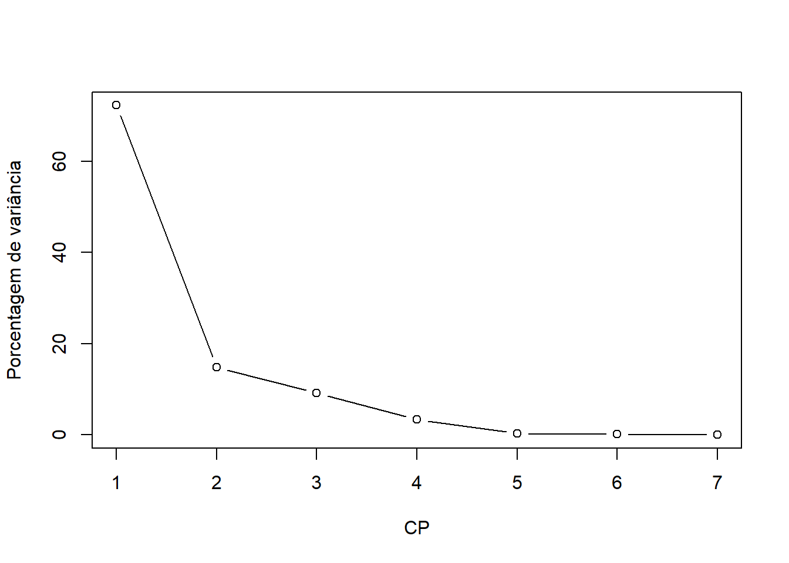

```r
## Cluster 1: T8, T10, T6,T9,T2,T4
## Cluster 2: T7, T3, T1, T5
```

<br>

### Valores dos CP


```r
require(FactoMineR)
pca=PCA(dadosm,scale.unit=T,graph=F)
round(pca$eig,3)
```

```
##        eigenvalue percentage of variance cumulative percentage of variance
## comp 1      5,057                 72,243                            72,243
## comp 2      1,037                 14,812                            87,055
## comp 3      0,639                  9,128                            96,183
## comp 4      0,237                  3,387                            99,571
## comp 5      0,022                  0,312                            99,883
## comp 6      0,008                  0,109                            99,992
## comp 7      0,001                  0,008                           100,000
```

<br>

### Gráfico com os vetores


```r
library(factoextra)
fviz_pca_var(pca)
```


<br>

### Renomeando eixos


```r
fviz_pca_var(pca)+ylab("CP2 (14,9)")+xlab("CP1 (72,3%)")
```


<br>

### Removendo título


```r
fviz_pca_var(pca, title="")+ylab("CP2 (14,9)")+xlab("CP1 (72,3%)")
```


<br>

### Renomeando os vetores


```r
rownames(pca$var$coord)=c("pH","H+AL","K","P","Ca","Mg","V")
fviz_pca_var(pca, title="")+ylab("CP2 (14,9)")+xlab("CP1 (72,3%)")
```


<br>

### Sobreposição dos nomes


```r
rownames(pca$var$coord)=c("pH","H+AL","K","P","Ca","Mg","V")
fviz_pca_var(pca, 
             title="", 
             repel=T)+ylab("CP2 (14,9)")+xlab("CP1 (72,3%)")
```


<br>

### Removendo linhas de grade


```r
rownames(pca$var$coord)=c("pH","H+AL","K","P","Ca","Mg","V")
fviz_pca_var(pca, 
             title="", 
             repel=T)+
  ylab("CP2 (14,9)")+
  xlab("CP1 (72,3%)")+
  theme_classic()
```


<br>

### Pontos dos scores


```r
fviz_pca_ind(pca)
```


<br>

### Renomeando eixos e título


```r
fviz_pca_ind(pca, title="")+ylab("CP2 (14,9)")+xlab("CP1 (72,3%)")
```


<br>

### Marcando os clusters (Por coloração)


```r
## Cluster 1: T8, T10, T6,T9,T2,T4
## Cluster 2: T7, T3, T1, T5
## Construir vetor com o cluster (Nesse caso vamos chamar de A e B)

cluster=c("B","A","B","A","B","A","B","A","A","A")
fviz_pca_ind(pca, 
             title="", 
             col.ind = as.factor(cluster))+
  ylab("CP2 (14,9)")+
  xlab("CP1 (72,3%)")
```

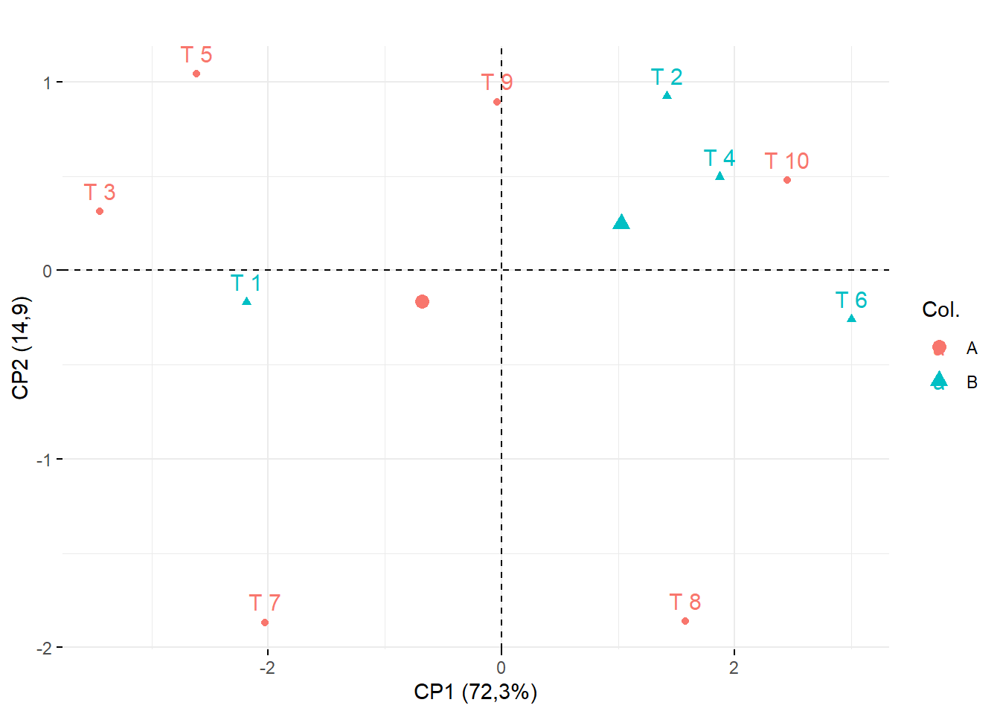

<br>

### Marcando os clusters (Por formato de ponto)


```r
## Cluster 1: T8, T10, T6,T9,T2,T4
## Cluster 2: T7, T3, T1, T5
## Construir vetor com o cluster (Nesse caso vamos chamar de A e B)

cluster=c("B","A","B","A","B","A","B","A","A","A")
fviz_pca_ind(pca, 
             title="", 
             pointshape = as.factor(cluster),
             pointsize=2)+
  ylab("CP2 (14,9)")+
  xlab("CP1 (72,3%)")
```


<br>

### Marcando os clusters (Por coloração e formato de ponto)


```r
## Cluster 1: T8, T10, T6,T9,T2,T4
## Cluster 2: T7, T3, T1, T5
## Construir vetor com o cluster (Nesse caso vamos chamar de A e B)
cluster=c("B","A","B","A","B","A","B","A","A","A")
fviz_pca_ind(pca, 
             title="", legend.title="Cluster",
             habillage = as.factor(cluster))+
  ylab("CP2 (14,9)")+
  xlab("CP1 (72,3%)")
```


<br>

### Removendo linhas de grade


```r
## Cluster 1: T8, T10, T6,T9,T2,T4
## Cluster 2: T7, T3, T1, T5
## Construir vetor com o cluster (Nesse caso vamos chamar de A e B)
cluster=c("B","A","B","A","B","A","B","A","A","A")
fviz_pca_ind(pca, 
             title="", legend.title="Cluster",
             habillage = as.factor(cluster))+
  ylab("CP2 (14,9)")+
  xlab("CP1 (72,3%)")+theme_classic()
```


```r
a=fviz_pca_ind(pca, title="")+theme_classic()
b=fviz_pca_var(pca, title="")+theme_classic()
library(gridExtra)
grid.arrange(a,b, ncol=2)
```


<br><br>

****

## Gráfico de CP (Manualmente)

****

<br>

### Calculando as médias


```r
mph=tapply(ph, Trat, mean)
mHAL=tapply(HAL, Trat, mean)
mK=tapply(K, Trat, mean)
mP=tapply(P, Trat, mean)
mCa=tapply(Ca, Trat, mean)
mMg=tapply(Mg, Trat, mean)
mV=tapply(V, Trat, mean)
dadosm=data.frame(mph,mHAL,mK,mP,mCa,mMg,mV)
```

<br>

### Dendograma (Definir Clusters)

Obs. Fica a critério do pesquisador o valor do corte (Neste caso optei pelo corte em 8, formando assim dois *clusters*)

Podemos fazer como neste exemplo abaixo:


```r
dend=as.dendrogram(hclust(dist(dadosm), method='average'), hang = -1)
plot(dend)
abline(h=8, lty=2, col="red")
```

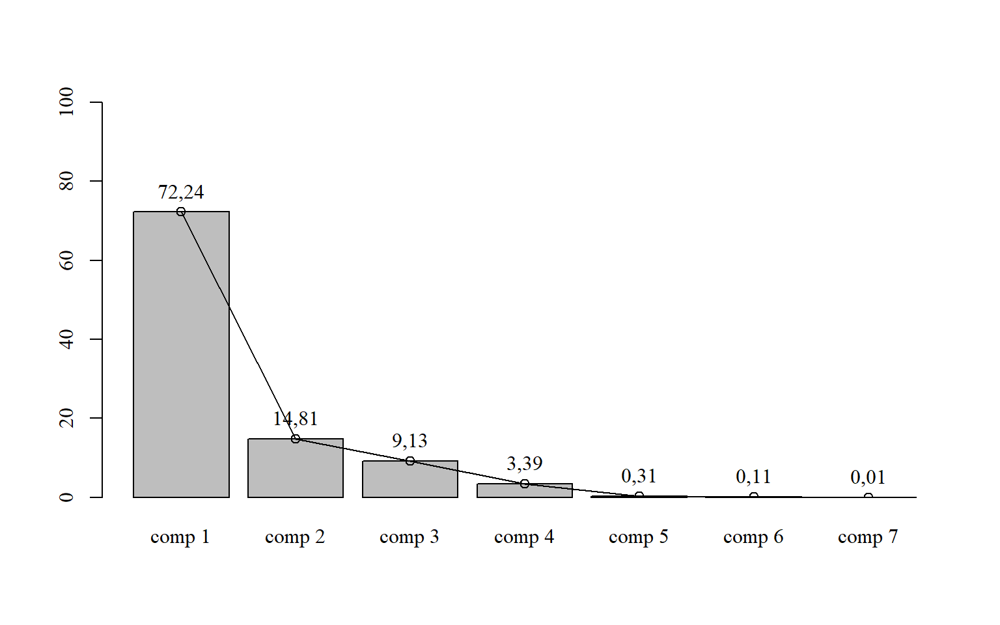

```r
## Cluster 1: T8, T10, T6,T9,T2,T4
## Cluster 2: T7, T3, T1, T5
```

ou,


```r
library(dendextend)
dend=as.dendrogram(hclust(dist(dadosm), method='average'))
dend=set(dend,"branches_k_color", value = c("red", "blue"), k = 2)
par(cex=0.7, mai=c(1.2,0.8,0.5,0.5))
plot(dend,las=1,ylab="Distância")
par(cex=0.8)
rect.dendrogram(dend, k=2,border = 8, lty = 5, lwd = 2)
```

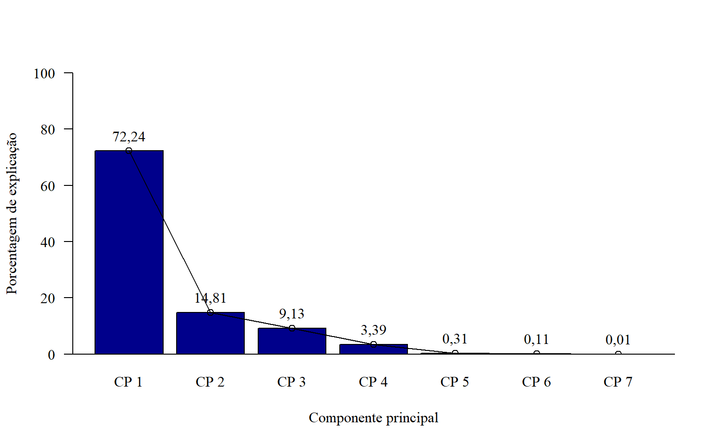

<br>

### Valores dos CP


```r
require(FactoMineR)
pca=PCA(dadosm,scale.unit=T,graph=F)
round(pca$eig,3)
```

```
##        eigenvalue percentage of variance cumulative percentage of variance
## comp 1      5,057                 72,243                            72,243
## comp 2      1,037                 14,812                            87,055
## comp 3      0,639                  9,128                            96,183
## comp 4      0,237                  3,387                            99,571
## comp 5      0,022                  0,312                            99,883
## comp 6      0,008                  0,109                            99,992
## comp 7      0,001                  0,008                           100,000
```

<br>

### Gráfico com os componentes


```r
plot(pca$eig[,2], type="b",ylab="Porcentagem de variância",xlab="CP")
```


<br>

### Ponto dos scores


```r
plot(pca$ind$coord, # Extraindo da pca os valores das coordenadas em x e CP1 e y e CP2
     xlab="CP1 (72.2 %)", # renomeando eixo x
     ylab="CP2 (14.8 %)", # renomeando eixo y
     pch=16) # alterando formato de ponto ("Bolinha preenchida")
abline(h=0,v=0, lty=2) # traçando linha em x e y = 0; lty=2 é linha tracejada 
```

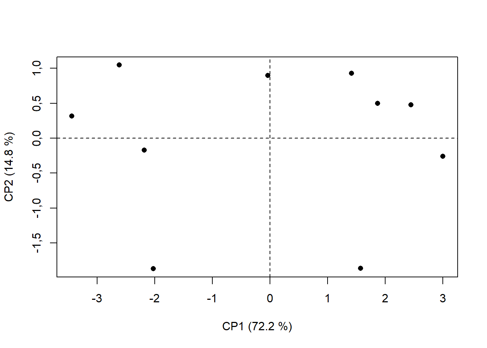

<br>

### Identificando pontos


```r
plot(pca$ind$coord, # Extraindo da pca os valores das coordenadas em x e CP1 e y e CP2
     xlab="CP1 (72.2 %)", # renomeando eixo x
     ylab="CP2 (14.8 %)", # renomeando eixo y
     pch=16) # alterando formato de ponto ("Bolinha preenchida")
abline(h=0,v=0, lty=2) # traçando linha em x e y = 0; lty=2 é linha tracejada 
text(pca$ind$coord[,1],
     pca$ind$coord[,2]-0.1, 
     rownames(pca$ind$coord))
```


<br>

### Modificando nome dos pontos


```r
rownames(pca$ind$coord)=c("A","J","B","C","D","E","F","G","H","I")
plot(pca$ind$coord, # Extraindo da pca os valores das coordenadas em x e CP1 e y e CP2
     xlab="CP1 (72.2 %)", # renomeando eixo x
     ylab="CP2 (14.8 %)", # renomeando eixo y
     pch=16) # alterando formato de ponto ("Bolinha preenchida")
abline(h=0,v=0, lty=2) # traçando linha em x e y = 0; lty=2 é linha tracejada 
text(pca$ind$coord[,1],
     pca$ind$coord[,2]-0.1, 
     rownames(pca$ind$coord))
```


<br>

### Limite da seta dos vetores


```r
plot(pca$var$coord, # Extraindo da pca os valores da coordenadas em x e y dos vetores resposta
     xlab="CP1 (72.2 %)", # renomeando eixo x
     ylab="CP2 (14.8 %)", # renomeando eixo y
     pch=16, # alterando formato de ponto ("Bolinha preenchida")
     ylim=c(-1,1), # Alterando escala de Y para -1 até 1
     xlim=c(-1,1)) # Alterando escala de X para -1 até 1
abline(h=0,v=0, lty=2) # traçando linha em x e y = 0; lty=2 é linha tracejada 
```


<br>

### Convertendo o ponto para seta

Neste caso, temos que criar setas individuais e plotar sobre o nosso gráfico.

Ex. 

 - `pca$var$coord[1,1]`: extraindo de `pca` o valor da coordenada X para o vetor 1, em que de `pca`, localiza-se na linha 1 e coluna 1
 - `pca$var$coord[1,2]`: extraindo de `pca` o valor da coordenada y para o vetor 1, em que de `pca`, localiza-se na linha 1 e coluna 2


```r
plot(pca$var$coord, 
     xlab="CP1 (72.2 %)",
     ylab="CP2 (14.8 %)",
     col="white", # Estou definindo como branco para apagar os pontos
     ylim=c(-1.5,1.5),
     xlim=c(-1.5,1.5))
abline(h=0,v=0, lty=2)
arrows(0,0,pca$var$coord[1,1],pca$var$coord[1,2], length = 0.1) # vetor 1 - pH
arrows(0,0,pca$var$coord[2,1],pca$var$coord[2,2], length = 0.1) # vetor 2 - HAL
arrows(0,0,pca$var$coord[3,1],pca$var$coord[3,2], length = 0.1) # vetor 3 - K
arrows(0,0,pca$var$coord[4,1],pca$var$coord[4,2], length = 0.1) # vetor 4 - P
arrows(0,0,pca$var$coord[5,1],pca$var$coord[5,2], length = 0.1) # vetor 5 - Ca
arrows(0,0,pca$var$coord[6,1],pca$var$coord[6,2], length = 0.1) # vetor 6 - Mg
arrows(0,0,pca$var$coord[7,1],pca$var$coord[7,2], length = 0.1) # vetor 7 - V
text(pca$var$coord-0.01,rownames(pca$var$coord)) # Estou colocando os nomes dos vetores (-0.01 significa abaixo da coordenada a 0.01)
```


<br>

### Alterando posição do nome do vetores

Existem pesquisadores que preferem que o nome dos vetores quando x é positivo esteja a direita da extremidade da seta e quando x é negativo, o nome esteja a esquerda da seta. Neste caso, podemos utilizar a função `ifelse` dentro de `text()` 


```r
plot(pca$var$coord, 
     xlab="CP1 (72.2 %)",
     ylab="CP2 (14.8 %)",
     col="white",
     ylim=c(-0.5,1),
     xlim=c(-1.5,1.5))
abline(h=0,v=0, lty=2)
arrows(0,0,pca$var$coord[1,1],pca$var$coord[1,2], length = 0.1)
arrows(0,0,pca$var$coord[2,1],pca$var$coord[2,2], length = 0.1)
arrows(0,0,pca$var$coord[3,1],pca$var$coord[3,2], length = 0.1)
arrows(0,0,pca$var$coord[4,1],pca$var$coord[4,2], length = 0.1)
arrows(0,0,pca$var$coord[5,1],pca$var$coord[5,2], length = 0.1)
arrows(0,0,pca$var$coord[6,1],pca$var$coord[6,2], length = 0.1)
arrows(0,0,pca$var$coord[7,1],pca$var$coord[7,2], length = 0.1)
text(pca$var$coord[,1]+
       ifelse(pca$var$coord[,1]<0,-0.2,+0.2),  
     pca$var$coord[,2],rownames(pca$var$coord))
```

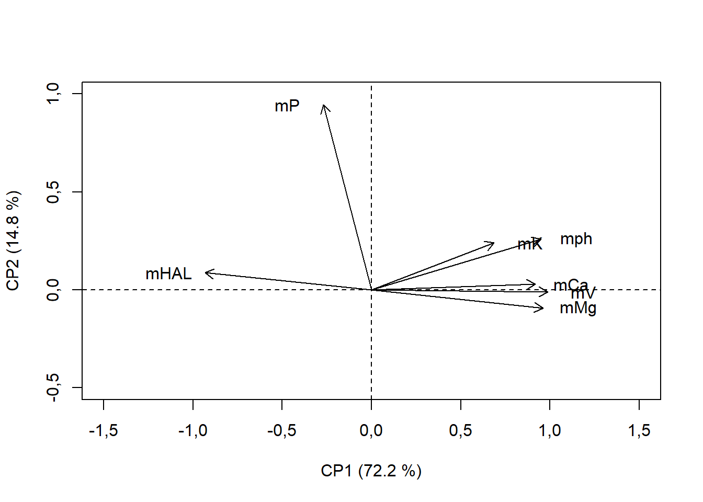

`ifelse(pca$var$coord[,1]<0,-0.2,+0.2)`: estamos definindo que se `pca$var$coord[,1]` for menor que 0, irá adicionar -0.2, do contrário irá somar 0.2

**Obs.** Nessa caso estamos alterando apenas em X, este princípio também pode ser aplicado em Y. Também é possível estabelecer manualmente a localização do texto (Criar um vetor com as coordenadas) 

<br>

### Adicionando círculo com raio do maior vetor resposta


```r
library(plotrix)
plot(pca$var$coord, 
     xlab="CP1 (72.2 %)",
     ylab="CP2 (14.8 %)",
     col="white",
     ylim=c(-1,1),
     xlim=c(-1.5,1.5))
abline(h=0,v=0, lty=2)
arrows(0,0,pca$var$coord[1,1],pca$var$coord[1,2], length = 0.1)
arrows(0,0,pca$var$coord[2,1],pca$var$coord[2,2], length = 0.1)
arrows(0,0,pca$var$coord[3,1],pca$var$coord[3,2], length = 0.1)
arrows(0,0,pca$var$coord[4,1],pca$var$coord[4,2], length = 0.1)
arrows(0,0,pca$var$coord[5,1],pca$var$coord[5,2], length = 0.1)
arrows(0,0,pca$var$coord[6,1],pca$var$coord[6,2], length = 0.1)
arrows(0,0,pca$var$coord[7,1],pca$var$coord[7,2], length = 0.1)
text(pca$var$coord[,1]+ifelse(pca$var$coord[,1]<0,-0.2,+0.2),
     pca$var$coord[,2],rownames(pca$var$coord))
draw.circle(0,0,max(ifelse(c(pca$var$coord[,1],pca$var$coord[,2])<0,
                           c(pca$var$coord[,1],pca$var$coord[,2])*-1,
                           c(pca$var$coord[,1],pca$var$coord[,2]))))
```


<br>

### Renomeando vetores


```r
rownames(pca$var$coord)=c("pH","H+AL","K","P","Ca","Mg","V%") # renomeando vetores
library(plotrix)
plot(pca$var$coord, 
     xlab="CP1 (72.2 %)",
     ylab="CP2 (14.8 %)",
     col="white",
     ylim=c(-1,1),
     xlim=c(-1.5,1.5))
abline(h=0,v=0, lty=2)
arrows(0,0,pca$var$coord[1,1],pca$var$coord[1,2], length = 0.1)
arrows(0,0,pca$var$coord[2,1],pca$var$coord[2,2], length = 0.1)
arrows(0,0,pca$var$coord[3,1],pca$var$coord[3,2], length = 0.1)
arrows(0,0,pca$var$coord[4,1],pca$var$coord[4,2], length = 0.1)
arrows(0,0,pca$var$coord[5,1],pca$var$coord[5,2], length = 0.1)
arrows(0,0,pca$var$coord[6,1],pca$var$coord[6,2], length = 0.1)
arrows(0,0,pca$var$coord[7,1],pca$var$coord[7,2], length = 0.1)
text(c(1.05,  -1.1, 0.8, -0.3, 1,  1.05,  1.1),
     c(0.3, 0.1, 0.3,  1, 0.06, -0.1, -0),
     rownames(pca$var$coord))
draw.circle(0,0,max(ifelse(c(pca$var$coord[,1],pca$var$coord[,2])<0,
                           c(pca$var$coord[,1],pca$var$coord[,2])*-1,
                           c(pca$var$coord[,1],pca$var$coord[,2]))))
```


<br><br>

****

## Screeplot

****

<br><br>

### Conjunto de dados


```r
Trat=rep(c(paste("T",1:10)), e=12)
dados=data.frame(Trat,ph,HAL,K,P,Ca,Mg,V)
```

<br>

### Calculando as médias


```r
mph=tapply(ph, Trat, mean)
mHAL=tapply(HAL, Trat, mean)
mK=tapply(K, Trat, mean)
mP=tapply(P, Trat, mean)
mCa=tapply(Ca, Trat, mean)
mMg=tapply(Mg, Trat, mean)
mV=tapply(V, Trat, mean)
dadosm=data.frame(mph,mHAL,mK,mP,mCa,mMg,mV)
```

<br>

### Pacote FactomineR


```r
library(FactoMineR)
pca=PCA(dadosm)
```


<br>

### Screeplot do factoextra


```r
library(factoextra)
fviz_screeplot(pca)
```


```r
fviz_screeplot(pca,
               title="", # removendo título
               font.family="serif", # fonte times new roman
               barcolor="black", # cor da borda preto
               addlabels=T,
               ggtheme=theme_classic())+
  xlab("Componente Principal")+ # nomeando eixo x
  ylab("Porcentagem de explicação da variância") # nomeando eixo y
```


<br>

****

## Manualmente pelo stats

****

<br>

### Somente colunas


```r
par(family="serif") # fonte times new roman
bar=barplot(pca$eig[,2], 
        ylim=c(0,100))
```


<br>

### Com colunas, pontos e linhas


```r
par(family="serif") # fonte times new roman
bar=barplot(pca$eig[,2], 
        ylim=c(0,100))
points(bar,
       pca$eig[,2], 
       type = "o")
```


<br>

### Com colunas, pontos, linhas e legenda


```r
par(family="serif") # fonte times new roman
bar=barplot(pca$eig[,2], 
        ylim=c(0,100))
points(bar,
       pca$eig[,2], 
       type = "o")
text(bar,
     pca$eig[,2]+5,
     round(pca$eig[,2],2))
```


<br>

### Editando


```r
rownames(pca$eig)=c(paste("CP",1:length(pca$eig[,2])))
par(family="serif") # fonte times new roman
bar=barplot(pca$eig[,2], 
        ylim=c(0,100),
        las=1,
        col="darkblue",
        xlab="Componente principal",
        ylab="Porcentagem de explicação")
abline(h=0)
points(bar,
       pca$eig[,2], 
       type = "o")
text(bar,
     pca$eig[,2]+5,
     round(pca$eig[,2],2))
```


<br><br>

****

## Correlação com variável latente

****

<br><br>

### Calculando as médias


```r
mph=tapply(ph, Trat, mean)
mHAL=tapply(HAL, Trat, mean)
mK=tapply(K, Trat, mean)
mP=tapply(P, Trat, mean)
mCa=tapply(Ca, Trat, mean)
mMg=tapply(Mg, Trat, mean)
mV=tapply(V, Trat, mean)
dadosm=data.frame(mph,mHAL,mK,mP,mCa,mMg,mV)
```

<br>

## Pacote psych


```r
library(psych)
pca.solo <- principal(scale(dadosm), # scale é para padronizar dados
                      nfactors=5,  # Numero de componentes
                      n.obs=10, # possui 10 observações/ variável
                      rotate='none', 
                      scores=TRUE)
pca.solo
```

```
## Principal Components Analysis
## Call: principal(r = scale(dadosm), nfactors = 5, rotate = "none", n.obs = 10, 
##     scores = TRUE)
## Standardized loadings (pattern matrix) based upon correlation matrix
##        PC1   PC2   PC3   PC4   PC5 h2      u2 com
## mph   0,95  0,26 -0,02 -0,14  0,12  1 3,1e-04 1,2
## mHAL -0,93  0,09  0,20  0,28  0,06  1 5,4e-04 1,3
## mK    0,69  0,24  0,69 -0,01 -0,02  1 7,4e-04 2,2
## mP   -0,27  0,95 -0,17  0,03 -0,04  1 5,4e-05 1,2
## mCa   0,92  0,03 -0,28  0,28  0,02  1 2,9e-03 1,4
## mMg   0,96 -0,09  0,08  0,24 -0,04  1 2,9e-03 1,2
## mV    0,99 -0,01 -0,13 -0,08 -0,03  1 8,4e-04 1,1
## 
##                        PC1  PC2  PC3  PC4  PC5
## SS loadings           5,06 1,04 0,64 0,24 0,02
## Proportion Var        0,72 0,15 0,09 0,03 0,00
## Cumulative Var        0,72 0,87 0,96 1,00 1,00
## Proportion Explained  0,72 0,15 0,09 0,03 0,00
## Cumulative Proportion 0,72 0,87 0,96 1,00 1,00
## 
## Mean item complexity =  1,4
## Test of the hypothesis that 5 components are sufficient.
## 
## The root mean square of the residuals (RMSR) is  0 
##  with the empirical chi square  0  with prob <  NA 
## 
## Fit based upon off diagonal values = 1
```

<br>

### Extraindo correlações


```r
(load <- pca.solo$loadings)
```

```
## 
## Loadings:
##      PC1    PC2    PC3    PC4    PC5   
## mph   0,949  0,258        -0,137  0,116
## mHAL -0,933         0,201  0,278       
## mK    0,687  0,240  0,685              
## mP   -0,270  0,946 -0,171              
## mCa   0,918        -0,277  0,276       
## mMg   0,961                0,239       
## mV    0,987        -0,129              
## 
##                  PC1   PC2   PC3   PC4   PC5
## SS loadings    5,057 1,037 0,639 0,237 0,022
## Proportion Var 0,722 0,148 0,091 0,034 0,003
## Cumulative Var 0,722 0,871 0,962 0,996 0,999
```

<br>

### Correlação com a variável latente CP1


```r
library(lattice)
sorted.loadings1 <- load[order(load[,1]),1]
(load1 <- dotplot(sorted.loadings1,
                 cex=1.5,
                 xlab="Correlação com a variável latente",
                 col="black",
                 scales=list(fontfamily="serif",cex=1.2),
                 auto.key=list(cex=1.2),
                 pch=16))
```

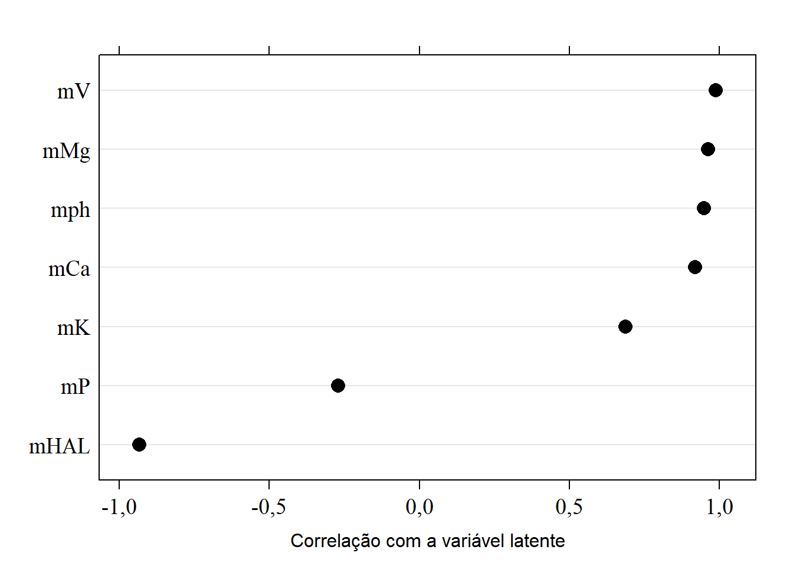

<br>

### Correlação com a variável latente CP2


```r
sorted.loadings2 <- load[order(load[,2]),2]
(load2 <- dotplot(sorted.loadings2,
                 cex=1.5,
                 xlab="Correlação com a variável latente",
                 col="black",
                 scales=list(fontfamily="serif",cex=1.2),
                 pch=16))
```


<br>

### Correlação com a variável latente CP3


```r
sorted.loadings3 <- load[order(load[,3]),3]
(load3 <- dotplot(sorted.loadings3,
                 cex=1.5,
                 xlab="Correlação com a variável latente",
                 col="black",
                 scales=list(fontfamily="serif",cex=1.2),
                 pch=16))
```


<br><br><br>

****

# Dendograma

****


### Conjunto de dados

Violent Crime Rates by US State

Description

This data set contains statistics, in arrests per 100,000 residents for assault, murder, and rape in each of the 50 US states in 1973. Also given is the percent of the population living in urban areas. 

McNeil, D. R. (1977) Interactive Data Analysis. New York: Wiley.


```r
data("USArrests")
USArrests
```

```
##                Murder Assault UrbanPop Rape
## Alabama          13,2     236       58 21,2
## Alaska           10,0     263       48 44,5
## Arizona           8,1     294       80 31,0
## Arkansas          8,8     190       50 19,5
## California        9,0     276       91 40,6
## Colorado          7,9     204       78 38,7
## Connecticut       3,3     110       77 11,1
## Delaware          5,9     238       72 15,8
## Florida          15,4     335       80 31,9
## Georgia          17,4     211       60 25,8
## Hawaii            5,3      46       83 20,2
## Idaho             2,6     120       54 14,2
## Illinois         10,4     249       83 24,0
## Indiana           7,2     113       65 21,0
## Iowa              2,2      56       57 11,3
## Kansas            6,0     115       66 18,0
## Kentucky          9,7     109       52 16,3
## Louisiana        15,4     249       66 22,2
## Maine             2,1      83       51  7,8
## Maryland         11,3     300       67 27,8
## Massachusetts     4,4     149       85 16,3
## Michigan         12,1     255       74 35,1
## Minnesota         2,7      72       66 14,9
## Mississippi      16,1     259       44 17,1
## Missouri          9,0     178       70 28,2
## Montana           6,0     109       53 16,4
## Nebraska          4,3     102       62 16,5
## Nevada           12,2     252       81 46,0
## New Hampshire     2,1      57       56  9,5
## New Jersey        7,4     159       89 18,8
## New Mexico       11,4     285       70 32,1
## New York         11,1     254       86 26,1
## North Carolina   13,0     337       45 16,1
## North Dakota      0,8      45       44  7,3
## Ohio              7,3     120       75 21,4
## Oklahoma          6,6     151       68 20,0
## Oregon            4,9     159       67 29,3
## Pennsylvania      6,3     106       72 14,9
## Rhode Island      3,4     174       87  8,3
## South Carolina   14,4     279       48 22,5
## South Dakota      3,8      86       45 12,8
## Tennessee        13,2     188       59 26,9
## Texas            12,7     201       80 25,5
## Utah              3,2     120       80 22,9
## Vermont           2,2      48       32 11,2
## Virginia          8,5     156       63 20,7
## Washington        4,0     145       73 26,2
## West Virginia     5,7      81       39  9,3
## Wisconsin         2,6      53       66 10,8
## Wyoming           6,8     161       60 15,6
```

<br>

### Calculando as distâncias


```r
d=dist(USArrests)
R=hclust(d)
```

<br>

### Dendograma


```r
plot(R)
```


<br>

### Altura dos rótulos


```r
plot(R, hang=-1)
```


<br>

### Editando argumentos


```r
plot(R, 
     las=1, # Escala do eixo na horizontal
     hang=-1, # alinhas altura dos rótulos
     main="", # Título vazio
     ylab="Dist?ncia") # Título do eixo Y
```


<br>

### Separando em grupos

Neste exemplo vamos considerar dois grupos


```r
# Chamando package dendextend
library(dendextend)

# Construindo o dendograma
dend=as.dendrogram(hclust(dist(USArrests), method='average'))

# Definindo cores e grupos para o dendograma
dend=set(dend,"branches_k_color", 
             value = c("red", "blue"), k = 2)

# Plotando o gráfico
par(cex=0.7)
plot(dend, 
     las=1, 
     ylab="Distância")
```


<br>

### Caixas separando grupos


```r
library(dendextend)
dend=as.dendrogram(hclust(dist(USArrests), 
                          method='average'))
dend=set(dend,
         "branches_k_color", 
             value = c("red", "blue"), 
         k = 2)
par(cex=0.7, mai=c(1.2,0.8,0,0))
plot(dend, 
     las=1,
     ylab="Distância")
par(cex=0.8)
# Construindo caixa de separação entre os grupos
rect.dendrogram(dend,
                k=2, # Dois grupos
                border = 8, # cor da borda (8: cinza)
                lty = 5, # formato da linha
                lwd = 2) # espessura da linha
```


<br>

### Árvore filogenética (Em círculo)


```r
library(ape)
par(mar=c(0,0,1,0))
plot(as.phylo(R),
     cex=0.7, 
     hang=-1, 
     type="fan")
```


<br>

### Cor e separando por grupo


```r
par(mar=c(0,0,1,0))
clus=cutree(R,2)
colors=c("red","blue")
plot(as.phylo(R), 
     cex=0.7,
     hang=-1, 
     type="fan", 
     tip.color=colors[clus])
```


<br>

### Formato radial


```r
par(mar=c(0,0,1,0))
plot(as.phylo(R),
     cex=0.7, 
     hang=-1, 
     type="radial")
```

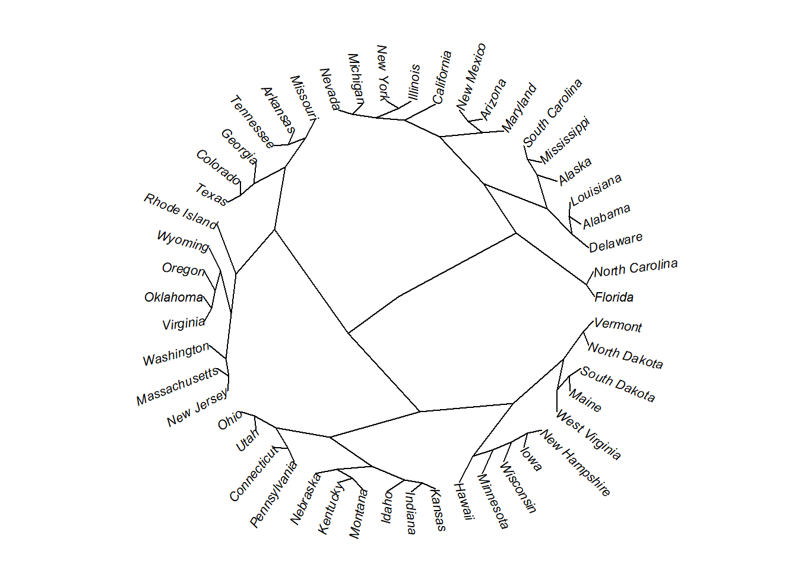

<br><br><br>

****

# Expression()

****

Durante a elaboração de gráficos no R, os títulos são inseridos conforme o nome da variável em que está analisando. Muitas vezes é necessário editar esses nomes no gráfico, entretanto, existem casos complexos em que é necessário inserir uma série de comandos para conseguir o desejado. Neste tutorial, iremos abordar a função `expression()` e alguns exemplos.

Não iremos trabalhar com um conjunto de dados neste exemplo, dessa forma, a linha respectiva ao `plot(1,1,axes=F, col="white", ylab="",xlab="")` serve apenas para utilizar a função legend() posteriormente. Lembrando que, a função `expression()` pode ser usada para todos os argumentos de renomeação (ylab, xlab, main, title, etc...)


<div style="column-count: 2;">

<br>


```r
plot(1,1,axes=F, col="white", ylab="",xlab="")
legend("center",
       legend="Resposta", 
       bty="n", 
       cex=2)
```


```r
plot(1,1,axes=F, col="white", ylab="",xlab="")
legend("center",
       legend=expression(sum()=="sum()"), 
       bty="n", 
       cex=2)
```


```r
plot(1,1,axes=F, col="white", ylab="",xlab="")
legend("center",
       legend=expression(delta == "delta"), 
       bty="n", 
       cex=2)
```


```r
plot(1,1,axes=F, col="white", ylab="",xlab="")
legend("center",
       legend=expression(alpha == "alpha"), 
       bty="n", 
       cex=2)
```


```r
plot(1,1,axes=F, col="white", ylab="",xlab="")
legend("center",
       legend=expression(beta =="beta"), 
       bty="n", 
       cex=2)
```


```r
plot(1,1,axes=F, col="white", ylab="",xlab="")
legend("center",
       legend=expression(gamma == "gamma"), 
       bty="n", 
       cex=2)
```


```r
plot(1,1,axes=F, col="white", ylab="",xlab="")
legend("center",
       legend=expression(mu == "mu"), 
       bty="n", 
       cex=2)
```

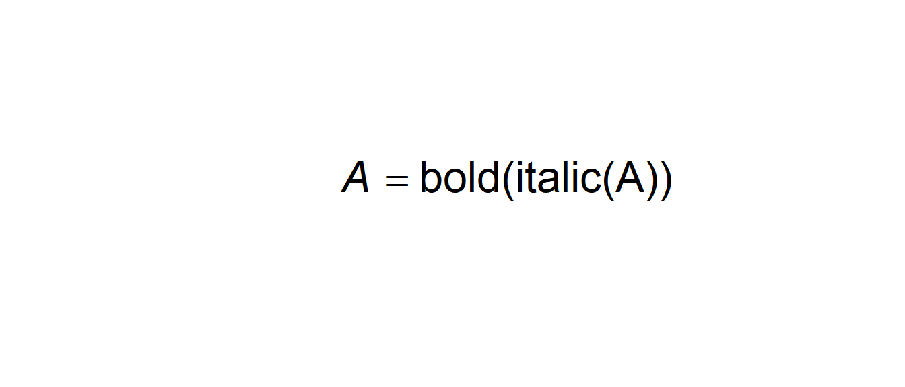


```r
plot(1,1,axes=F, col="white", ylab="",xlab="")
legend("center",
       legend=expression(sigma == "sigma"), 
       bty="n", 
       cex=2)
```


```r
plot(1,1,axes=F, col="white", ylab="",xlab="")
legend("center",
       legend=expression(pi == "pi"), 
       bty="n", 
       cex=2)
```


```r
plot(1,1,axes=F, col="white", ylab="",xlab="")
legend("center",
       legend=expression(epsilon == "epsilon"), 
       bty="n", 
       cex=2)
```


```r
plot(1,1,axes=F, col="white", ylab="",xlab="")
legend("center",
       legend=expression(lambda == "lambda"), 
       bty="n", 
       cex=2)
```


```r
plot(1,1,axes=F, col="white", ylab="",xlab="")
legend("center",
       legend=expression(italic(A) == "italic(A)"), 
       bty="n", 
       cex=2)
```


```r
plot(1,1,axes=F, col="white", ylab="",xlab="")
legend("center",legend=
      expression(bold(A) == "bold(A)"), 
       bty="n", 
       cex=2)
```


```r
plot(1,1,axes=F, col="white", ylab="",xlab="")
legend("center", 
       legend = expression(sigma^2==frac(sum((X[i]-mu)^2,i==1,n),N)), 
       bty="n", 
       cex=2)
```


<br>


```r
plot(1,1,axes=F, col="white", ylab="",xlab="")
legend("center",
       legend=expression(hat(Y) == "hat(y)"), 
       bty="n", 
       cex=2)
```


```r
plot(1,1,axes=F, col="white", ylab="",xlab="")
legend("center",
       legend=expression(bar(x) =="bar(x)"), 
       bty="n", 
       cex=2)
```


```r
plot(1,1,axes=F, col="white", ylab="",xlab="")
legend("center",
       legend=expression(sqrt(Y)=="sqrt(Y)"), 
       bty="n", 
       cex=2)
```


```r
plot(1,1,axes=F, col="white", ylab="",xlab="")
legend("center",
       legend=expression(x^2 == "x^2"), 
       bty="n", 
       cex=2)
```


```r
plot(1,1,axes=F, col="white", ylab="",xlab="")
legend("center",
       legend=expression(x[2] == "x[2]"), 
       bty="n", 
       cex=2)
```


```r
plot(1,1,axes=F, col="white", ylab="",xlab="")
legend("center",legend=
expression("nome\nresposta"=="nome\\nresposta"), 
bty="n", 
cex=2)
```


```r
plot(1,1,axes=F, col="white", ylab="",xlab="")
legend("center",
legend=expression(hat(Y)==ax^2+bx+c,R^2==0.99), 
bty="n", 
cex=2)
```


```r
plot(1,1,axes=F, col="white", ylab="",xlab="")
legend("center",
legend=expression(hat(Y)==ax^2+bx+c,R^2==0.99,italic(p-valor)==0.0001),
bty="n", cex=2)
```

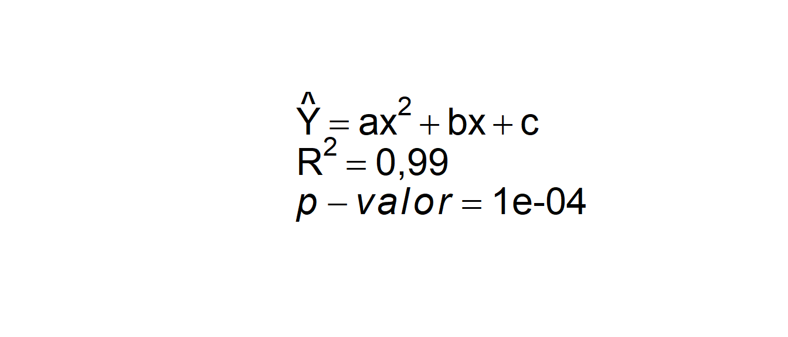


```r
plot(1,1,axes=F, col="white", ylab="",xlab="")
legend("center",
legend=expression(Produtividade~(kg~ha^-1)), 
       bty="n", 
       cex=2)
```


```r
plot(1,1,axes=F, col="white", ylab="",xlab="")
legend("center",legend=
expression(H[2]*0[2]~(mu*"mol"~g^-1~MFPA)), 
       bty="n", 
       cex=2)
```


```r
plot(1,1,axes=F, col="white", ylab="",xlab="")
legend("center", 
legend=expression(MSPA~(g~kg^-1)), 
       bty="n", 
       cex=2)
```


```r
plot(1,1,axes=F, col="white", ylab="",xlab="")
legend("center",legend=
expression(bold(italic(A)) == "bold(italic(A))"), 
       bty="n", 
       cex=2)
```


```r
plot(1,1,axes=F, col="white", ylab="",xlab="")
legend("center",
legend=expression(hat(Y)==ax^2+bx+c), 
       bty="n", 
       cex=2)
```


</div>

<br><br><br>

****

# layout (graphics)

****

<br>

### Como modificar o layout do R graphics

<br>

Durante a elaboração de gráficos no R, muitas vezes nos deparamos com problemas na margem (Títulos ou escalas ficam cortados) ou querem elaborar dois ou mais gráficos em uma única saída. Neste sentido, o presente tutorial irá abordar algumas funções para modificar o layout do gráfico base do R.

Não iremos trabalhar com um conjunto de dados neste exemplo, dessa forma, a linha respectiva ao `plot(1,1,axes=F, col="white", ylab="",xlab="")` serve apenas para demonstrar como alterar os parâmetros gráficos.

<br>

<div style="column-count: 1;">

****

### Gráfico Simples

****


```r
plot(1,1, ylab="Eixo Y",xlab="Eixo X")
```


****

### Parâmetros de margem

****

<br>

O comando par(...) é utilizado para alterar os parâmetros gráficos e deve ser executando antes do gráfico. Entretanto, uma vez executado essa linha de comando, todos os outros gráficos irão apresentar o mesmo layout, exceto se fechar o Rstudio ou limpar todos os gráficos.

O comando mai representa o tamanho de margem e deve-se digitar um vetor numérico com quatro valores, sendo respectivamente em ordem, inferior, esquerda, superior e direita (`mai=c(bottom, left, top, right)`).

<br>


```r
par(mai=c(1,1,1,1))
plot(1,1, ylab="Eixo Y",xlab="Eixo X")
```

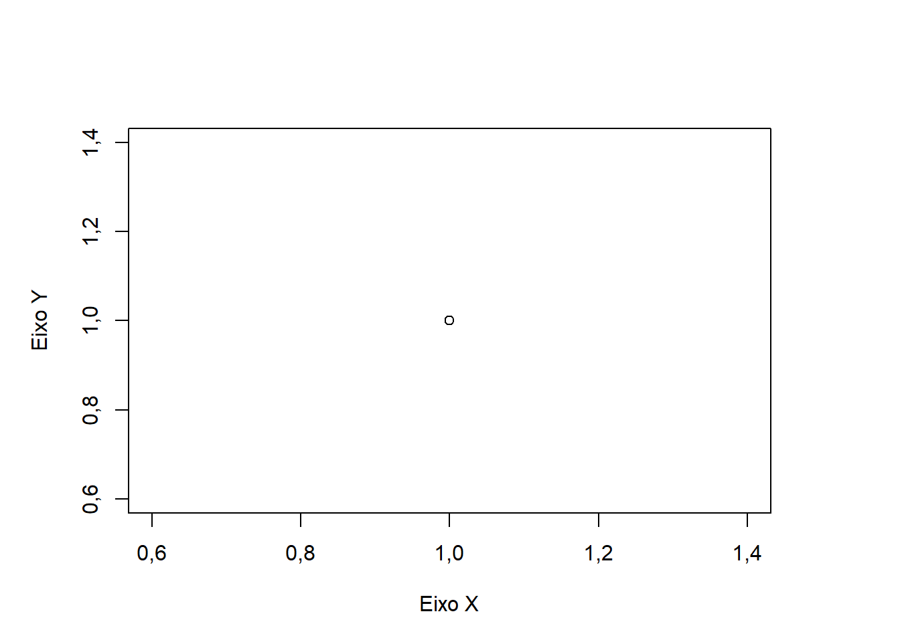

****

### Fonte do gráfico

****

O comando para alterar a fonte do gráfico também é realizada dentro de par(...). Os argumentos do comando é `family="fonte"`.

`par(family="serif")`: Times New Roman


```r
par(family="serif")
plot(1,1, ylab="Eixo Y",xlab="Eixo X")
```


<br>

****

### Cor do gráfico

****

Especificando a cor do gráfico (Geral, exceto eixos)


```r
par(col="red")
plot(1,1, ylab="Eixo Y",xlab="Eixo X")
```


Especificando a cor da escala dos eixos do gráfico


```r
par(col.axis="red")
plot(1,1, ylab="",xlab="")
```


Especificando cor do nome dos eixos


```r
par(col.lab="red")
plot(1,1, ylab="Eixo Y",xlab="Eixo X")
```

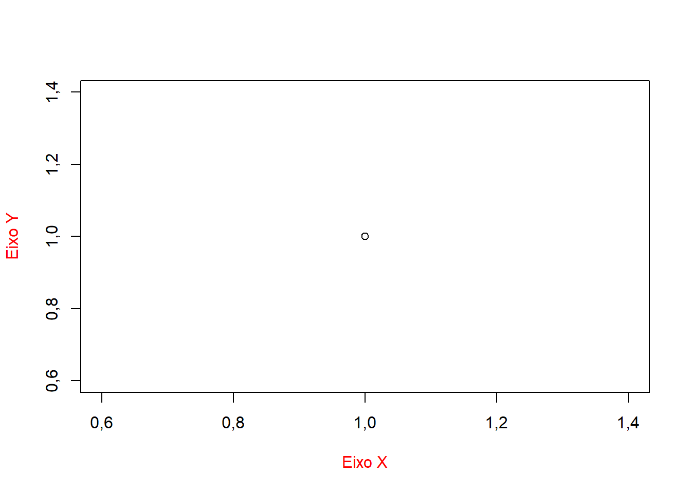

Especificando cor do título


```r
par(col.main="red")
plot(1,1, ylab="Eixo Y",xlab="Eixo X",main="title")
```


<br>

****

### Tamanho de letra

****


```r
par(cex=1.3)
plot(1,1, ylab="Eixo Y",xlab="Eixo X",main="title")
```


 - `cex.axis` : Tamanho da fonte das escalas de Y e X
 - `cex.lab` : Tamaho da fonte do nome dos eixos
 - `cex.main` : Tamanho da fonte do título

<br>

****

### Sobrepor gráficos

****


```r
plot(c(1,2,3,4,5,6), ylab="Eixo Y",xlab="Eixo X",main="title", type="o",col="red")
par(new=T)
plot(c(6,5,4,3,2,1), ylab="",xlab="",main="", type="o",col="blue")
```


<br>

****

### Dois ou mais gráficos em uma saída

****

`mfrow=c(1,2)`: vetor de dados em que o primeiro representa o número de linhas e o segundo o número de colunas (Neste caso, uma linha e duas colunas)


```r
par(mfrow=c(1,2))
plot(c(1,2,3,4,5,6), ylab="Eixo Y",xlab="Eixo X",main="title", type="o",col="red")
plot(c(6,5,4,3,2,1), ylab="Eixo Y",xlab="Eixo X",main="title", type="o",col="blue")
```


<br>

****

### Saída com dois gráficas na primeira linha e um gráfico na segunda linha

****

Saída com dois gráficas na primeira linha e um gráfico na segunda linha e necessário criar uma matriz com as posições.

Exemplo de matriz:

Matriz com quatro valores (`c(1,3,2,3)`) e duas colunas (`ncol=2`). Neste caso, a linha 1 apresenta os valores 1 e 2, que representam o primeiro e o segundo plot. A linha 2 apresenta os valores 3 e 3 que representa o terceiro plot.


```r
matrix(c(1,3,2,3), ncol=2)
```

```
##      [,1] [,2]
## [1,]    1    2
## [2,]    3    3
```


```r
layout(matrix(c(1,3,2,3), ncol=2))
plot(c(1,2,3,4,5,6), ylab="Eixo Y",xlab="Eixo X",main="title", type="o",col="red")
plot(c(6,5,4,3,2,1), ylab="Eixo Y",xlab="Eixo X",main="title", type="o",col="blue")
plot(c(1,6,1,6,1,6), ylab="Eixo Y",xlab="Eixo X",main="title", type="o",col="blue")
```


<br>

</div>

<br><br><br>

****

# ggplot2

****

*Em construção*

<br>

****

### Como juntar vários gráficos do ggplot2

****

No tutorial abaixo apresentamos uma das formas de juntar vários gráficos do ggplot2 em uma única figura. 

**Obs.**: Estamos usando o gráfico de colunas como exemplo, todavia, esses mesmos comandos funcionam para todos os gráficos do *ggplot2* e de outros pacotes que utilizam o *ggplot2*.

#### Conjunto de dados

Vamos trabalhar com três experimentos em DIC com quatro tratamentos e três repetições cada. 


```r
exp1=c(10,12,13,18,19,16,5,6,5,25,26,28)
exp2=c(9,12,11,18,20,16,7,6,9,25,28,28)
exp3=c(9,12,13,18,22,15,3,6,4,25,30,28)  
Trat=rep(c(paste("T",1:4)),e=3)
dados=data.frame(Trat,exp1,exp2,exp3)
dados$Trat=as.factor(Trat)
```

### Juntando três gráficos do ggplot2

*Obs* Para edição do gráfico ver tutorial sobre gráfico de colunas usando o ggplot2


```r
library(ggplot2)
m1=tapply(exp1, Trat, mean);d1=tapply(exp1, Trat, sd)
dados1=data.frame(Trat=rownames(m1),m1,d1)
a=ggplot(dados1, aes(x=Trat,y=m1))+geom_col()+theme_bw()+
  geom_errorbar(aes(ymax=m1+d1, ymin=m1-d1), width=0.25)
m2=tapply(exp2, Trat, mean);d2=tapply(exp2, Trat, sd)
dados2=data.frame(Trat=rownames(m2),m2,d2)
b=ggplot(dados2, aes(x=Trat,y=m2))+geom_col()+theme_bw()+
  geom_errorbar(aes(ymax=m2+d2,ymin=m2-d2), width=0.25)
m3=tapply(exp3, Trat, mean);d3=tapply(exp3, Trat, sd)
dados3=data.frame(Trat=rownames(m3),m3,d3)
c=ggplot(dados3, aes(x=Trat,y=m3))+geom_col()+theme_bw()+
  geom_errorbar(aes(ymax=m3+d3,ymin=m3-d3),width=0.25)
```

### Gráficos lado a lado


```r
library(gridExtra)
grid.arrange(a,b,c,ncol=3)
```

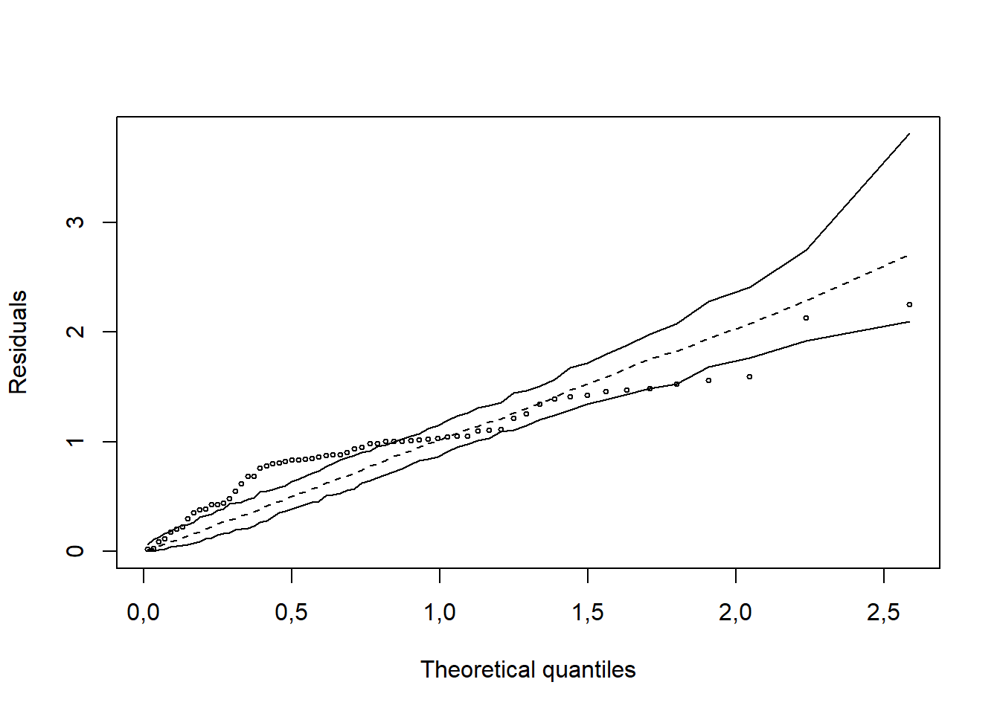

### Gráficos um abaixo do outro


```r
library(gridExtra)
grid.arrange(a,b,c,ncol=1)
```

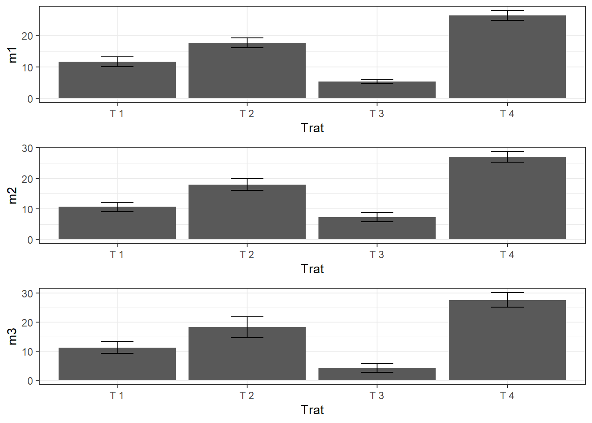

### Dois na primeira linha e uma no lado esquerdo da segunda linha


```r
library(gridExtra)
grid.arrange(a,b,c,ncol=2)
```


### Dois na primeira linha e uma centralizado na segunda linha


```r
library(gridExtra)
grid.arrange(a,b,c,
             layout_matrix = rbind(c(1,1,2,2), c(NA,3,3,NA)))
```


### Dois na primeira linha e uma a direita na segunda linha

<br>


```r
library(gridExtra)
grid.arrange(a,b,c,
             layout_matrix = rbind(c(1,1,2,2), c(NA,NA,3,3)))
```


<br><br><br>

# Análise de regressão linear e não-linear

Nas mais diversas áreas da pesquisa, seja ela na área médica, biológica, industrial, química entre outras, é de grande interesse verificar se duas ou mais variáveis estão relacionadas de alguma forma. Para expressar esta relação é muito importante estabelecer um modelo matemático. Este tipo de modelagem é chamado de regressão, e ajuda a entender como determinadas variáveis influenciam outra variável, ou seja, verifica como o comportamento de uma ou mais variáveis podem mudar o comportamento de outra.

Na agronomia, a análise de regressão é muito utilizada por exemplo, para estabelecer doses de máxima resposta de produtos fitossanitários, adubos, populações de plantas, etc..; ou mesmo no estudo do desenvolvimento de uma planta, o que chamamos de curva de crescimento. 

Popularmente, é comum a utilização de curva do tipo polinomial, visto a facilidade de sua utilização e explicação. Todavia, muito dos dados não se comportam dessa forma, ainda que o ajuste seja significativo, podendo assim, levar a conclusões limitadas em função da análise inadequada. Logo, o presente tutorial apresenta diferentes ajustes de regressão linear e não-linear de um mesmo conjunto de dados. 

Neste tutorial, você irá reparar que em quase todos os modelos, o coeficientes serão significativos, demonstrando que quase todos os modelos são válidos para explicar o comportamento dos dados. A questão é, qual o melhor modelo?


**Obs. Este é um tutorial para demonstração dos modelos de regressão. Alguns casos ele não é significativo ou uma das pressuposições não é atendida. É um tutorial apenas para fins didáticos.**

<br><br>

****

## Conjunto de dados

****

O conjunto de dados é de um experimento cujo objetivo foi avaliar a perda de massa da casca de romã em estufa a $60^oC$. Foi utilizado oito repetições em oito avaliações (60, 210,390, 720, 930, 1410, 1890 e 2370 minutos)


```r
`PERDA DE MASSA CAA`=c(18.15810,17.99376,14.81450,15.39822,21.62234,20.45106,18.65319,20.96547,36.77274,39.92503,34.60874,35.70286,43.57189,42.19460,39.23367,43.36169,52.90384,52.64886,45.61431,47.81200,44.41734,47.40493,46.15373,47.12330,65.29474,67.78859,64.60738,66.24453,63.97464,66.77636,65.37446,65.11912,67.86385,70.68877,69.45271,70.33895,69.43583,71.56150,69.73480,69.97407,69.02813,71.28882,71.17485,71.22420,71.32344,72.46687,71.17063,72.07550,69.16576,71.44176,71.30762,71.34075,71.42775,72.59710,71.28255,72.19996,69.30339,71.59471,71.44040,71.45729,71.53206,72.72733,71.39446,72.32441)
TEMPO=rep(c(60,210,390,720,930,1410,1890,2370),e=8)
dados=data.frame(TEMPO,`PERDA DE MASSA CAA`)
y=c(`PERDA DE MASSA CAA`)
x=c(TEMPO)
data=data.frame(y,x)
```

<br><br>

### Média e desvio-padrão amostral


```r
(media=tapply(y,x, mean))
```

```
##       60      210      390      720      930     1410     1890     2370 
## 18,50708 39,42140 48,00979 65,64748 69,88131 71,21905 71,34541 71,47176
```

```r
(desvio=tapply(y,x, sd))
```

```
##       60      210      390      720      930     1410     1890     2370 
## 2,485224 3,479257 3,133973 1,229025 1,080134 1,007882 1,004939 1,002227
```

```r
(tempo=c(60,210,390,720,930,1410,1890,2370))
```

```
## [1]   60  210  390  720  930 1410 1890 2370
```

<br><br>

****

### Gráficos exploratórios

****

<br><br>

### Gráfico de caixas


```r
boxplot(y~x)
```


### Gráfico de dispersão


```r
plot(y~x)
```


### Gráfico de dispersão com médias


```r
plot(y~x)
points(media~tempo,pch=16,col="red")
```


### Gráfico de linhas com as médias


```r
par(mfrow=c(1,2))
plot(media~tempo, type="b")
plot(media~tempo, type="l")
```


### Histograma


```r
hist(y)
```

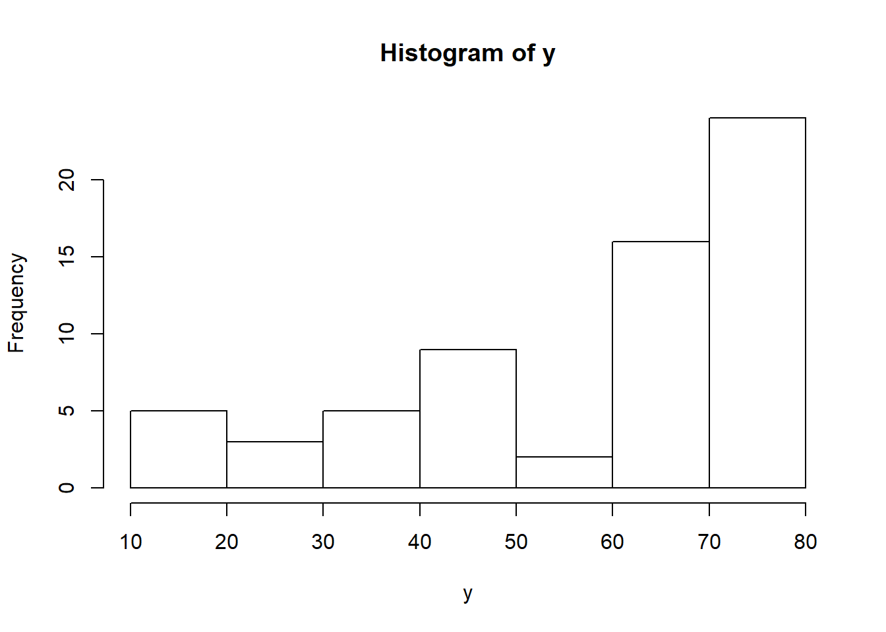

<br><br><br>

****

## Linear Simples

****

O modelo de regressão linear simples (MRLS) se define uma relação linear entre a variável dependente e uma variável independente.

$$Y=\beta_1x+\beta_0$$

### Criando o modelo de regressão


```r
modl=lm(y~x)
summary(modl)
```

```
## 
## Call:
## lm(formula = y ~ x)
## 
## Residuals:
##      Min       1Q   Median       3Q      Max 
## -24,4181  -8,1253   0,4191   8,8542  16,0914 
## 
## Coefficients:
##              Estimate Std. Error t value Pr(>|t|)    
## (Intercept) 38,099512   2,368998   16,08  < 2e-16 ***
## x            0,018886   0,001876   10,07 1,15e-14 ***
## ---
## Signif. codes:  0 '***' 0,001 '**' 0,01 '*' 0,05 '.' 0,1 ' ' 1
## 
## Residual standard error: 11,62 on 62 degrees of freedom
## Multiple R-squared:  0,6205,	Adjusted R-squared:  0,6144 
## F-statistic: 101,4 on 1 and 62 DF,  p-value: 1,147e-14
```

### Diagnóstico

### Normalidade dos erros


```r
hnp::hnp(modl)
```

```
## Gaussian model (lm object)
```

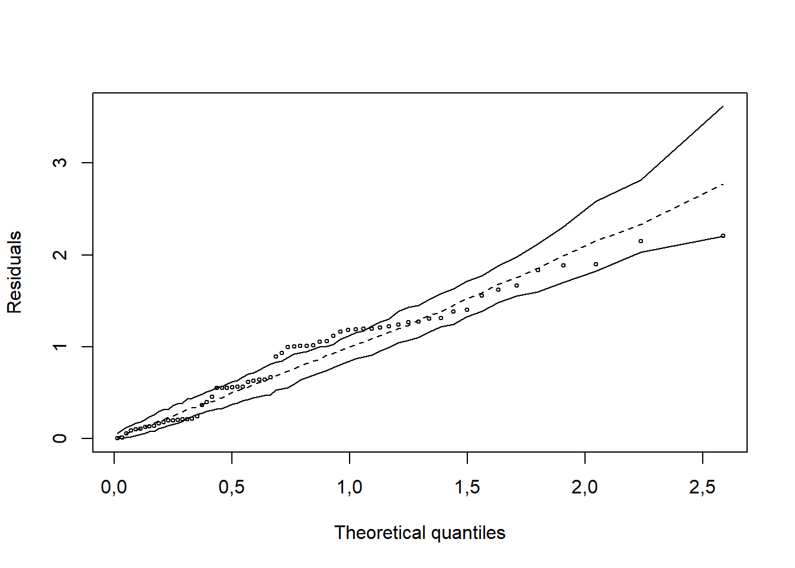

```r
shapiro.test(resid(modl)) # erros não normais
```

```
## 
## 	Shapiro-Wilk normality test
## 
## data:  resid(modl)
## W = 0,94067, p-value = 0,004079
```

### Falta de ajuste (Desvio da regressão)


```r
modq=aov(y~as.factor(x))
anova(modl,modq)
```

```
## Analysis of Variance Table
## 
## Model 1: y ~ x
## Model 2: y ~ as.factor(x)
##   Res.Df    RSS Df Sum of Sq      F    Pr(>F)    
## 1     62 8377,2                                  
## 2     56  236,7  6    8140,5 321,02 < 2,2e-16 ***
## ---
## Signif. codes:  0 '***' 0,001 '**' 0,01 '*' 0,05 '.' 0,1 ' ' 1
```

### Construindo gráfico


```r
par(family="serif")
plot(media~tempo, main="Linear Simples",
     las=1, cex=1.3,
     ylab="Weight loss (%)", xlim=c(0,2500),
     xlab="Time (Minutes)", 
     pch=16, ylim=c(0,80))
curve(coef(modl)[1]+coef(modl)[2]*x, add=TRUE, lty=2)
legend("topleft",
       cex=1,
       bty="n",
       legend = c(expression(hat(Y)==38.09951+0.01889*x)))
```


### ggplot2


```r
library(ggplot2)
da=data.frame(media,tempo)
ggplot(da,aes(y=media,x=tempo))+
  geom_point()+
  geom_smooth(method="lm",se = F,col="black",size=0.1,lty=2)+
  theme_classic()+
  ylab("Weight loss (%)")+
  xlab("Time (Minutes)") 
```


<br><br><br>

****

## Quadrático

****

$$Y=\beta_2x^2+\beta_1x+\beta_0$$

### Criando modelo de regressão


```r
mod1=lm(y~x+I(x^2))
summary(mod1)
```

```
## 
## Call:
## lm(formula = y ~ x + I(x^2))
## 
## Residuals:
##     Min      1Q  Median      3Q     Max 
## -11,428  -5,288   1,756   4,360   8,018 
## 
## Coefficients:
##               Estimate Std. Error t value Pr(>|t|)    
## (Intercept)  2,226e+01  1,528e+00   14,57   <2e-16 ***
## x            6,763e-02  3,367e-03   20,09   <2e-16 ***
## I(x^2)      -2,055e-05  1,371e-06  -14,99   <2e-16 ***
## ---
## Signif. codes:  0 '***' 0,001 '**' 0,01 '*' 0,05 '.' 0,1 ' ' 1
## 
## Residual standard error: 5,415 on 61 degrees of freedom
## Multiple R-squared:  0,919,	Adjusted R-squared:  0,9163 
## F-statistic: 345,9 on 2 and 61 DF,  p-value: < 2,2e-16
```

### Diagnóstico do modelo

### Normalidade dos erros


```r
hnp::hnp(mod1)
```

```
## Gaussian model (lm object)
```


```r
shapiro.test(resid(mod1)) # erros nao normais
```

```
## 
## 	Shapiro-Wilk normality test
## 
## data:  resid(mod1)
## W = 0,92285, p-value = 0,000655
```

### Fator de inflação de variância (Multicolinearidade)


```r
car::vif(mod1) # problema de multicolinearidade
```

```
##        x   I(x^2) 
## 14,84834 14,84834
```

### Falta de ajuste (Desvio da regressão)


```r
modq=aov(y~as.factor(x))
anova(mod1,modq)
```

```
## Analysis of Variance Table
## 
## Model 1: y ~ x + I(x^2)
## Model 2: y ~ as.factor(x)
##   Res.Df     RSS Df Sum of Sq      F    Pr(>F)    
## 1     61 1788,55                                  
## 2     56  236,68  5    1551,9 73,438 < 2,2e-16 ***
## ---
## Signif. codes:  0 '***' 0,001 '**' 0,01 '*' 0,05 '.' 0,1 ' ' 1
```

### Construindo gráfico


```r
par(family="serif")
plot(media~tempo, main="Quadrático",
     las=1, cex=1.3,
     ylab="Weight loss (%)", xlim=c(0,2500),
     xlab="Time (Minutes)", 
     pch=16, ylim=c(0,80))
curve(coef(mod1)[1]+coef(mod1)[2]*x+coef(mod1)[3]*x^2, add=TRUE, lty=2)
legend("topleft",
       cex=1,
       bty="n",
       legend = c(expression(hat(Y)==22.26+0.006763*x-0.00002055*x^2)))
```


### Ponto de máximo (Ou mínimo)

O ponto de máximo ou mínimo podem ser encontrados de várias formas

### Manualmente


```r
(xmax=-coef(mod1)[2]/(2*coef(mod1)[3]))
```

```
##        x 
## 1645,317
```

```r
(ymax=coef(mod1)[1]+coef(mod1)[2]*xmax+coef(mod1)[3]*xmax^2)
```

```
## (Intercept) 
##    77,89475
```

### Usando o which.max ou which.min


```r
plot(y~x)
tend=curve(coef(mod1)[1]+coef(mod1)[2]*x+coef(mod1)[3]*x^2,add=T)
```

```r
tend$x[which.max(tend$y)]
```

```
## [1] 1653,9
```

```r
# tend$x[which.min(tend$y)] # no caso de mínimo
```

### ggplot2


```r
library(ggplot2)
da=data.frame(media,tempo)
ggplot(da,aes(y=media,x=tempo))+
  geom_point()+
  geom_smooth(method="lm",formula = y~poly(x,2), se = F,col="black",size=0.1,lty=2)+
  theme_classic()+
  ylab("Weight loss (%)")+
  xlab("Time (Minutes)") 
```


<br><br><br>

****

## Cúbico

****

$$Y=\beta_3x^3+\beta_2x^2+\beta_1x+\beta_0$$

### Construindo o modelo


```r
mod2=lm(y~x+I(x^2)+I(x^3))
summary(mod2)
```

```
## 
## Call:
## lm(formula = y ~ x + I(x^2) + I(x^3))
## 
## Residuals:
##     Min      1Q  Median      3Q     Max 
## -6,0186 -1,3299 -0,3928  1,3155  8,0377 
## 
## Coefficients:
##               Estimate Std. Error t value Pr(>|t|)    
## (Intercept)  1,406e+01  9,927e-01   14,16   <2e-16 ***
## x            1,174e-01  4,125e-03   28,47   <2e-16 ***
## I(x^2)      -7,536e-05  4,189e-06  -17,99   <2e-16 ***
## I(x^3)       1,524e-08  1,149e-09   13,27   <2e-16 ***
## ---
## Signif. codes:  0 '***' 0,001 '**' 0,01 '*' 0,05 '.' 0,1 ' ' 1
## 
## Residual standard error: 2,753 on 60 degrees of freedom
## Multiple R-squared:  0,9794,	Adjusted R-squared:  0,9784 
## F-statistic: 951,1 on 3 and 60 DF,  p-value: < 2,2e-16
```

### Diagnóstico do modelo

### Normalidade dos erros


```r
hnp::hnp(mod2)
```

```
## Gaussian model (lm object)
```

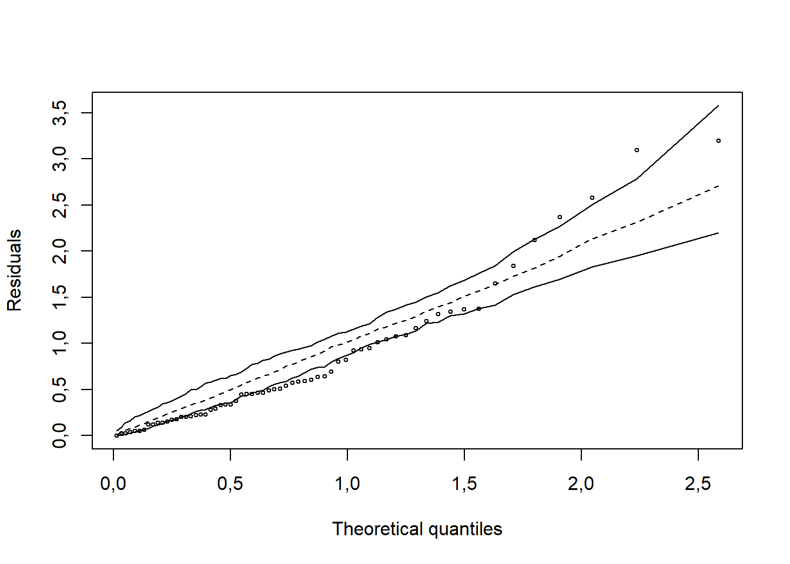

```r
shapiro.test(resid(mod2)) # Erros nao normais
```

```
## 
## 	Shapiro-Wilk normality test
## 
## data:  resid(mod2)
## W = 0,94796, p-value = 0,009093
```

### Fator de inflação de variância (Multicolinearidade) 


```r
car::vif(mod2) # alta multicolinearidade
```

```
##         x    I(x^2)    I(x^3) 
##  86,25922 536,46498 221,25164
```

### Falta de ajuste (Desvio da regressão)


```r
modq=aov(y~as.factor(x))
anova(mod2,modq)
```

```
## Analysis of Variance Table
## 
## Model 1: y ~ x + I(x^2) + I(x^3)
## Model 2: y ~ as.factor(x)
##   Res.Df    RSS Df Sum of Sq      F    Pr(>F)    
## 1     60 454,60                                  
## 2     56 236,68  4    217,93 12,891 1,666e-07 ***
## ---
## Signif. codes:  0 '***' 0,001 '**' 0,01 '*' 0,05 '.' 0,1 ' ' 1
```

### Construindo o gráfico


```r
par(family="serif")
plot(media~tempo, main="Cúbico",
     las=1, cex=1.3,
     ylab="Weight loss (%)", xlim=c(0,2500),
     xlab="Time (Minutes)", 
     pch=16, ylim=c(0,80))
curve(coef(mod2)[1]+coef(mod2)[2]*x+coef(mod2)[3]*x^2+coef(mod2)[4]*x^3, add=TRUE, lty=2)
legend("topleft",
       cex=1,
       bty="n",
       legend = c(expression(hat(Y)==14.06+0.01174*x-0.00007536*x^2+0.00000001524*x^3)))
```


### ponto de máximo, mínimo e inflexão


```r
plot(media~tempo)
curva=curve(coef(mod2)[1]+coef(mod2)[2]*x+coef(mod2)[3]*x^2+coef(mod2)[4]*x^3, add=TRUE, lty=2)
```

```r
# ponto de inflexão
pi=-(2*coef(mod2)[3])/(3*2*coef(mod2)[4])

# ponto de máximo anterior ao ponto de inflexão
xmax=curva$x[which.max(curva$y[curva$x<pi])]

# ponto de mínimo posterior ao ponto de inflexão
xmin=curva$x[which.max(curva$y[curva$x<pi])+which.min(curva$y[curva$x>xmax])]
```


```r
plot(media~tempo)
curva=curve(coef(mod2)[1]+coef(mod2)[2]*x+coef(mod2)[3]*x^2+coef(mod2)[4]*x^3, add=TRUE, lty=1)
abline(v=c(xmax,xmin,pi),lty=2)
```


### ggplot2


```r
library(ggplot2)
da=data.frame(media,tempo)
ggplot(da,aes(y=media,x=tempo))+
  geom_point()+
  geom_smooth(method="lm",formula = y~poly(x,3), se = F,col="black",size=0.1,lty=2)+
  theme_classic()+
  ylab("Weight loss (%)")+
  xlab("Time (Minutes)") 
```


<br><br><br>

****

## Logarítmico

****

$$Y=\beta_{0}+\beta_{1}\log(x)$$

### Construindo modelo


```r
modelog=lm(y~log(x))
summary(modelog)
```

```
## 
## Call:
## lm(formula = y ~ log(x))
## 
## Residuals:
##     Min      1Q  Median      3Q     Max 
## -8,5359 -3,5194 -0,5506  3,6366  8,4348 
## 
## Coefficients:
##             Estimate Std. Error t value Pr(>|t|)    
## (Intercept) -42,7285     3,3261  -12,85   <2e-16 ***
## log(x)       15,5158     0,5096   30,45   <2e-16 ***
## ---
## Signif. codes:  0 '***' 0,001 '**' 0,01 '*' 0,05 '.' 0,1 ' ' 1
## 
## Residual standard error: 4,724 on 62 degrees of freedom
## Multiple R-squared:  0,9373,	Adjusted R-squared:  0,9363 
## F-statistic: 927,1 on 1 and 62 DF,  p-value: < 2,2e-16
```

### Diagnóstico do modelo


```r
hnp::hnp(modelog)
```

```
## Gaussian model (lm object)
```

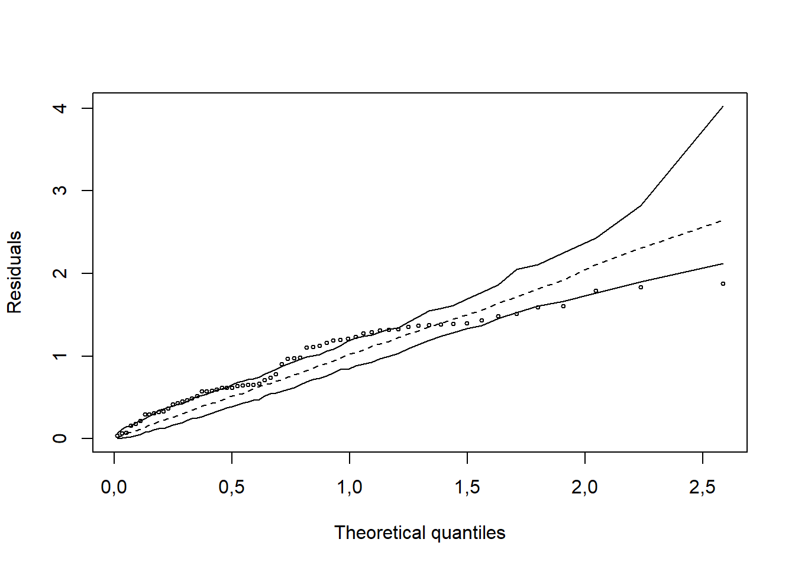

```r
shapiro.test(resid(modelog))
```

```
## 
## 	Shapiro-Wilk normality test
## 
## data:  resid(modelog)
## W = 0,94476, p-value = 0,006371
```

### Construindo gráfico


```r
plot(media~tempo, main="Log",
     las=1, cex=1.3,
     ylab="Weight loss (%)", xlim=c(0,2500),
     xlab="Time (Minutes)", 
     pch=16, ylim=c(0,80))
curve(-42.73+15.52*log(x),add=T,lty=2)
legend("topleft",
       cex=1,
       bty="n",
       legend = c(expression(hat(Y)==-42.73+15.52*log(x))))
```

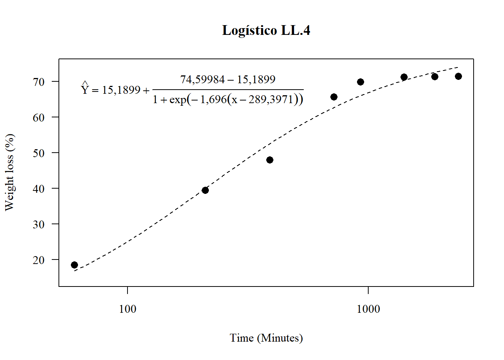

<br><br><br>

****

## Michaelis-Menten (MM)

****

$$Y=\frac{A\times x}{V+x}$$

### Construindo o modelo


```r
data=data.frame(y,x)
n0 <- nls(formula=y~A*x/(V+x), data=data,
          start=list(A=max(y), V=100), trace=TRUE)
```

```
## 2726,427 :   72,72733 100,00000
## 820,4424 :   78,84265 179,59765
## 691,338 :   80,90678 212,88993
## 690,8008 :   81,02471 215,24858
## 690,8006 :   81,02129 215,20409
## 690,8006 :   81,02137 215,20519
```

```r
summary(n0)
```

```
## 
## Formula: y ~ A * x/(V + x)
## 
## Parameters:
##   Estimate Std. Error t value Pr(>|t|)    
## A   81,021      1,004   80,67   <2e-16 ***
## V  215,205     11,711   18,38   <2e-16 ***
## ---
## Signif. codes:  0 '***' 0,001 '**' 0,01 '*' 0,05 '.' 0,1 ' ' 1
## 
## Residual standard error: 3,338 on 62 degrees of freedom
## 
## Number of iterations to convergence: 5 
## Achieved convergence tolerance: 3,035e-07
```

### Diagnóstico do modelo


```r
shapiro.test(resid(n0))
```

```
## 
## 	Shapiro-Wilk normality test
## 
## data:  resid(n0)
## W = 0,9717, p-value = 0,1482
```

### Construindo o gráfico


```r
A <- coef(n0)[1]; V <- coef(n0)[2]
par(family="serif")
plot(media~tempo, main="Michaelis Menten",
     las=1, cex=1.3,
     ylab="Weight loss (%)", xlim=c(0,2500),
     xlab="Time (Minutes)", 
     pch=16, ylim=c(0,80))
curve(A*x/(V+x), add=TRUE, lty=2)
legend("topleft",
       cex=1,
       bty="n",
       legend = c(expression(hat(Y)==frac(81.021*x,(215.205+x)))))
```


### Utilizando outro método


```r
m.m <- nls(y ~ SSmicmen(x, Vm, K), data = data)
m.m
```

```
## Nonlinear regression model
##   model: y ~ SSmicmen(x, Vm, K)
##    data: data
##     Vm      K 
##  81,02 215,20 
##  residual sum-of-squares: 690,8
## 
## Number of iterations to convergence: 0 
## Achieved convergence tolerance: 2,047e-06
```

```r
plot(media~tempo, main="Michaelis-Menten",
     las=1, cex=1.3,
     ylab="Weight loss (%)", xlim=c(0,2500),
     xlab="Time (Minutes)", 
     pch=16, ylim=c(0,80))
curve((81.02135*x)/(215.20499+x), add=T)
```


<br><br><br>

****

## MM Modificado

****

$$Y=\frac{A\times x}{V+x}+D\times x $$

### Construindo modelo


```r
data=data.frame(y,x)
n1 <- nls(formula=y~A*x/(V+x)+D*x, data=data,
          start=list(A=max(y), V=100,D=10), trace=TRUE)
```

```
## 10206286603 :   72,72733 100,00000  10,00000
## 802,0047 :   8,061554e+01  1,857416e+02 -9,194725e-04
## 545,3405 :   91,710079373 263,748404929  -0,004630648
## 521,8705 :   96,954052340 297,103221016  -0,006224234
## 521,0745 :   98,085315801 303,935203239  -0,006567869
## 521,0613 :   98,241471280 304,881731574  -0,006617559
## 521,0611 :   98,261118528 305,001695810  -0,006623916
## 521,0611 :   98,263575225 305,016711452  -0,006624713
```

```r
summary(n1)
```

```
## 
## Formula: y ~ A * x/(V + x) + D * x
## 
## Parameters:
##     Estimate Std. Error t value Pr(>|t|)    
## A  98,263575   4,439290  22,135  < 2e-16 ***
## V 305,016711  25,778649  11,832  < 2e-16 ***
## D  -0,006625   0,001563  -4,239 7,73e-05 ***
## ---
## Signif. codes:  0 '***' 0,001 '**' 0,01 '*' 0,05 '.' 0,1 ' ' 1
## 
## Residual standard error: 2,923 on 61 degrees of freedom
## 
## Number of iterations to convergence: 7 
## Achieved convergence tolerance: 9,342e-06
```

### Construindo gráfico


```r
A <- coef(n1)[1]; V <- coef(n1)[2]; D<-coef(n1)[3]
par(family="serif")
plot(media~tempo, main="Michaelis Menten (Corrigido)",
     las=1, cex=1.3,
     ylab="Weight loss (%)", xlim=c(0,2500),
     xlab="Time (Minutes)", 
     pch=16, ylim=c(0,80))
curve(A*x/(V+x)+D*x, add=TRUE, lty=2)
legend("topleft",
       cex=1,
       bty="n",
       legend = c(expression(hat(Y)==frac(98.263572*x,(305.016698+x))-0.006625*x)))
```


<br><br><br>

****

## Segmentada linear

****

$$Y=\beta_{1}X+\beta_{0} (if\leq X_1)$$

### Construindo o modelo linear 


```r
modelo_linear<- lm(y~x)
summary(modelo_linear)
```

```
## 
## Call:
## lm(formula = y ~ x)
## 
## Residuals:
##      Min       1Q   Median       3Q      Max 
## -24,4181  -8,1253   0,4191   8,8542  16,0914 
## 
## Coefficients:
##              Estimate Std. Error t value Pr(>|t|)    
## (Intercept) 38,099512   2,368998   16,08  < 2e-16 ***
## x            0,018886   0,001876   10,07 1,15e-14 ***
## ---
## Signif. codes:  0 '***' 0,001 '**' 0,01 '*' 0,05 '.' 0,1 ' ' 1
## 
## Residual standard error: 11,62 on 62 degrees of freedom
## Multiple R-squared:  0,6205,	Adjusted R-squared:  0,6144 
## F-statistic: 101,4 on 1 and 62 DF,  p-value: 1,147e-14
```

### Construindo o modelo segmentado


```r
library(segmented)
modelo_pieciwise<- segmented(modelo_linear, seg.Z = ~x, psi=1000)
modelo_pieciwise
```

```
## Call: segmented.lm(obj = modelo_linear, seg.Z = ~x, psi = 1000)
## 
## Meaningful coefficients of the linear terms:
## (Intercept)            x         U1.x  
##    19,83682      0,06684     -0,06582  
## 
## Estimated Break-Point(s):
## psi1.x  
##  751,4
```

```r
summary(modelo_pieciwise)
```

```
## 
## 	***Regression Model with Segmented Relationship(s)***
## 
## Call: 
## segmented.lm(obj = modelo_linear, seg.Z = ~x, psi = 1000)
## 
## Estimated Break-Point(s):
##            Est. St.Err
## psi1.x 751,438 26,797
## 
## Meaningful coefficients of the linear terms:
##              Estimate Std. Error t value Pr(>|t|)    
## (Intercept) 19,836818   1,106834   17,92   <2e-16 ***
## x            0,066839   0,002612   25,59   <2e-16 ***
## U1.x        -0,065819   0,002873  -22,91       NA    
## ---
## Signif. codes:  0 '***' 0,001 '**' 0,01 '*' 0,05 '.' 0,1 ' ' 1
## 
## Residual standard error: 3,635 on 60 degrees of freedom
## Multiple R-Squared: 0,9641,  Adjusted R-squared: 0,9623 
## 
## Convergence attained in 2 iter. (rel. change 0)
```

### Definindo limite com base no platô


```r
y1=y[x<=modelo_pieciwise$psi[2]]
x11=x[x<=modelo_pieciwise$psi[2]]
```

### Curva do primeiro segmento


```r
mod=lm(y1~x11)
summary(mod)
```

```
## 
## Call:
## lm(formula = y1 ~ x11)
## 
## Residuals:
##     Min      1Q  Median      3Q     Max 
## -9,0327 -2,9998 -0,7374  2,1557  9,6988 
## 
## Coefficients:
##              Estimate Std. Error t value Pr(>|t|)    
## (Intercept) 19,836818   1,532481   12,94 8,22e-14 ***
## x11          0,066839   0,003617   18,48  < 2e-16 ***
## ---
## Signif. codes:  0 '***' 0,001 '**' 0,01 '*' 0,05 '.' 0,1 ' ' 1
## 
## Residual standard error: 5,033 on 30 degrees of freedom
## Multiple R-squared:  0,9193,	Adjusted R-squared:  0,9166 
## F-statistic: 341,6 on 1 and 30 DF,  p-value: < 2,2e-16
```

### Construindo gráfico


```r
par(pch=16,las=1); par(family="serif")
plot(media~tempo, 
     las=1, cex=1.3, main="Segmentado Linear",
     ylab="Weight loss (%)", xlim=c(0,2500),
     xlab="Time (Minutes)", 
     pch=16, ylim=c(0,80))
a=curve(coef(mod)[1]+coef(mod)[2]*x, 
        to=modelo_pieciwise$psi[2], lty=2,add=T)
plato=a$y[round(a$x,3)==round(modelo_pieciwise$psi[2],3)]
lines(c(modelo_pieciwise$psi[2],max(x)),
      c(plato,plato),lty=2)
legend("topleft",
       cex=1,
       legend=expression(hat(Y)==19.836817+0.066839*x~("if"~x~"<"~751.4)), bty="n")
```


<br><br><br>

****

## Segmentada quadrático

****

$$Y=\beta_{2}X^2+\beta_{1}X+\beta_{0} (if\leq X_1)$$

### Construindo o modelo quadrático


```r
modelo_linear<- lm(y~x+I(x^2))
summary(modelo_linear)
```

```
## 
## Call:
## lm(formula = y ~ x + I(x^2))
## 
## Residuals:
##     Min      1Q  Median      3Q     Max 
## -11,428  -5,288   1,756   4,360   8,018 
## 
## Coefficients:
##               Estimate Std. Error t value Pr(>|t|)    
## (Intercept)  2,226e+01  1,528e+00   14,57   <2e-16 ***
## x            6,763e-02  3,367e-03   20,09   <2e-16 ***
## I(x^2)      -2,055e-05  1,371e-06  -14,99   <2e-16 ***
## ---
## Signif. codes:  0 '***' 0,001 '**' 0,01 '*' 0,05 '.' 0,1 ' ' 1
## 
## Residual standard error: 5,415 on 61 degrees of freedom
## Multiple R-squared:  0,919,	Adjusted R-squared:  0,9163 
## F-statistic: 345,9 on 2 and 61 DF,  p-value: < 2,2e-16
```

### Construindo o modelo segmentado


```r
library(segmented)
modelo_pieciwise1<- segmented(modelo_linear)
modelo_pieciwise1
```

```
## Call: segmented.lm(obj = modelo_linear)
## 
## Meaningful coefficients of the linear terms:
## (Intercept)            x       I(x^2)         U1.x  
##   1,580e+01    9,004e-02   -4,424e-06   -7,368e-02  
## 
## Estimated Break-Point(s):
## psi1.x  
##  560,2
```

```r
summary(modelo_pieciwise1)
```

```
## 
## 	***Regression Model with Segmented Relationship(s)***
## 
## Call: 
## segmented.lm(obj = modelo_linear)
## 
## Estimated Break-Point(s):
##            Est. St.Err
## psi1.x 560,234 28,392
## 
## Meaningful coefficients of the linear terms:
##               Estimate Std. Error t value Pr(>|t|)    
## (Intercept)  1,580e+01  1,201e+00  13,151   <2e-16 ***
## x            9,004e-02  4,718e-03  19,083   <2e-16 ***
## I(x^2)      -4,424e-06  1,764e-06  -2,508   0,0149 *  
## U1.x        -7,368e-02  6,596e-03 -11,171       NA    
## ---
## Signif. codes:  0 '***' 0,001 '**' 0,01 '*' 0,05 '.' 0,1 ' ' 1
## 
## Residual standard error: 3,073 on 59 degrees of freedom
## Multiple R-Squared: 0,9748,  Adjusted R-squared: 0,973 
## 
## Convergence attained in 2 iter. (rel. change 0)
```

### Valores para o primeiro segmento

Obs. No caso do linear simples, podemo usar apenas os pontos abaixo do platô, no caso do segmentado quadrático aconselho englobar o ponto acima do acusado no platô. No meu caso é o ponto 930.


```r
y1=y[x<=930]
x11=x[x<=930]
mod=lm(y1~x11+I(x11^2))
summary(mod)
```

```
## 
## Call:
## lm(formula = y1 ~ x11 + I(x11^2))
## 
## Residuals:
##     Min      1Q  Median      3Q     Max 
## -5,5773 -2,1731  0,0432  1,2608  8,0591 
## 
## Coefficients:
##               Estimate Std. Error t value Pr(>|t|)    
## (Intercept)  1,357e+01  1,379e+00   9,839 7,13e-12 ***
## x11          1,175e-01  7,321e-03  16,047  < 2e-16 ***
## I(x11^2)    -6,173e-05  7,151e-06  -8,632 2,15e-10 ***
## ---
## Signif. codes:  0 '***' 0,001 '**' 0,01 '*' 0,05 '.' 0,1 ' ' 1
## 
## Residual standard error: 3,293 on 37 degrees of freedom
## Multiple R-squared:  0,9715,	Adjusted R-squared:   0,97 
## F-statistic: 630,9 on 2 and 37 DF,  p-value: < 2,2e-16
```

### Construindo o gráfico


```r
par(pch=16,las=1); par(family="serif")
plot(media~tempo, main="Segmentado Quadrático",
     las=1, cex=1.3,
     ylab="Weight loss (%)", xlim=c(0,2500),
     xlab="Time (Minutes)", 
     pch=16, ylim=c(0,80))
maximo=-coef(mod)[2]/(2*coef(mod)[3])
a=curve(coef(mod)[1]+coef(mod)[2]*x+coef(mod)[3]*x^2, 
        to=maximo, lty=2,
        add=T)
plato=a$y[round(a$x,3)==round(maximo,3)]
lines(c(maximo,max(x)),
      c(plato,plato),lty=2)
legend("topleft",
       legend=expression(Y==13.57+0.1175*x-0.00006173*x^2~("if"~x~"<"~951.5095)), bty="n")
```

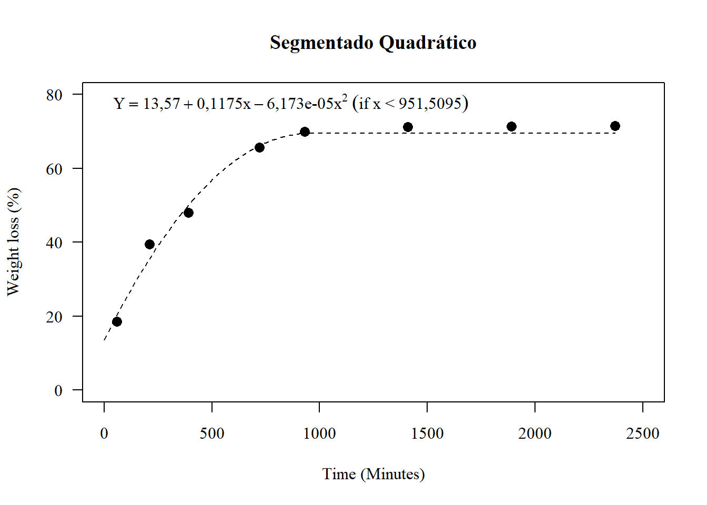

<br><br><br>

****

## Mitscherlich

****

$$Y=A \times(1-exp((B\times C)-(C \times X)$$


```r
modelo2=nls(y~A*(1-exp((B*C)-(C*x))),
           start = list(A=80,B=-10,C=0.01),data=data)
summary(modelo2)
```

```
## 
## Formula: y ~ A * (1 - exp((B * C) - (C * x)))
## 
## Parameters:
##     Estimate Std. Error t value Pr(>|t|)    
## A  7,232e+01  5,606e-01 129,004  < 2e-16 ***
## B -4,438e+01  8,610e+00  -5,155  2,9e-06 ***
## C  2,874e-03  1,302e-04  22,066  < 2e-16 ***
## ---
## Signif. codes:  0 '***' 0,001 '**' 0,01 '*' 0,05 '.' 0,1 ' ' 1
## 
## Residual standard error: 2,63 on 61 degrees of freedom
## 
## Number of iterations to convergence: 7 
## Achieved convergence tolerance: 8,634e-07
```

```r
par(pch=16,las=1); par(family="serif")
plot(media~tempo,main="Mitscherlich",
     las=1, cex=1.3,
     ylab="Weight loss (%)", xlim=c(0,2500),
     xlab="Time (Minutes)", 
     pch=16, ylim=c(0,80))
b=summary(modelo2)
A=b$coefficients[1,1]
B=b$coefficients[2,1]
C=b$coefficients[3,1]
a=curve(A*(1-exp((B*C)-(C*x))),lty=2,add=T)
legend("topleft",expression(Y==72.31912*(1-e^{(-44.382759*0.002873)-(0.002873*x)})),bty="n")
```


<br><br><br>

****

## Logística de 3 termos

****

$$Y = \frac{d}{1+exp(b(x-e))}$$


```r
library(drc)
model <- drm(y ~ x, fct = LL.3(), data = data)
summary(model)
```

```
## 
## Model fitted: Log-logistic (ED50 as parameter) with lower limit at 0 (3 parms)
## 
## Parameter estimates:
## 
##                 Estimate Std. Error t-value   p-value    
## b:(Intercept)  -1,058194   0,062275 -16,992 < 2,2e-16 ***
## d:(Intercept)  79,599836   1,684582  47,252 < 2,2e-16 ***
## e:(Intercept) 208,408451  12,445682  16,745 < 2,2e-16 ***
## ---
## Signif. codes:  0 '***' 0,001 '**' 0,01 '*' 0,05 '.' 0,1 ' ' 1
## 
## Residual standard error:
## 
##  3,340759 (61 degrees of freedom)
```

```r
par(family="serif")
plot(model,main="Logístico LL.3",
     las=1, cex=1.3,
     ylab="Weight loss (%)", 
     xlab="Time (Minutes)", 
     pch=16,lty=2)
legend("topleft",
       legend=expression(hat(Y)==frac(79.599836,
                                      1+exp(-1.058194(x-208.408455)))), bty="n")
```

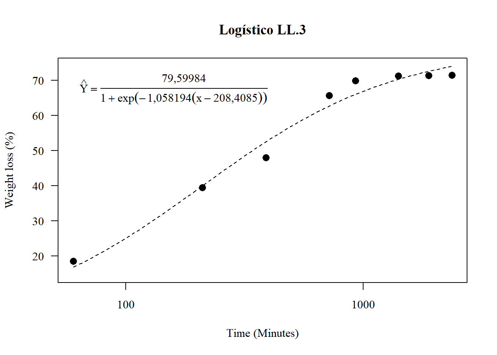

### ED, DL ou EC


```r
ED(model,10) ## Ed10
```

```
## 
## Estimated effective doses
## 
##        Estimate Std. Error
## e:1:10   26,131      2,755
```

```r
ED(model,50) ## ED50
```

```
## 
## Estimated effective doses
## 
##        Estimate Std. Error
## e:1:50  208,408     12,446
```

```r
ED(model,90) ## ED90
```

```
## 
## Estimated effective doses
## 
##        Estimate Std. Error
## e:1:90   1662,2      267,4
```

<br><br><br>

****

## Logística de 4 termos

****

$$Y = c-\frac{d-c}{1+exp(b(x-e))}$$


```r
model1 <- drm(y ~ x, fct = LL.4(), data = data)
summary(model1)
```

```
## 
## Model fitted: Log-logistic (ED50 as parameter) (4 parms)
## 
## Parameter estimates:
## 
##               Estimate Std. Error  t-value   p-value    
## b:(Intercept)  -1,6960     0,1552 -10,9279 6,668e-16 ***
## c:(Intercept)  15,1899     1,9728   7,6995 1,597e-10 ***
## d:(Intercept)  74,5348     1,0697  69,6796 < 2,2e-16 ***
## e:(Intercept) 289,3971    16,5292  17,5082 < 2,2e-16 ***
## ---
## Signif. codes:  0 '***' 0,001 '**' 0,01 '*' 0,05 '.' 0,1 ' ' 1
## 
## Residual standard error:
## 
##  2,950196 (60 degrees of freedom)
```

```r
par(family="serif")
plot(model,main="Logístico LL.4",
     las=1, cex=1.3,
     ylab="Weight loss (%)", 
     xlab="Time (Minutes)", 
     pch=16,lty=2)
legend("topleft",
       legend=expression(hat(Y)==15.1899+frac(74.59984-15.1899,
                                              1+exp(-1.6960(x-289.3971)))), bty="n")
```

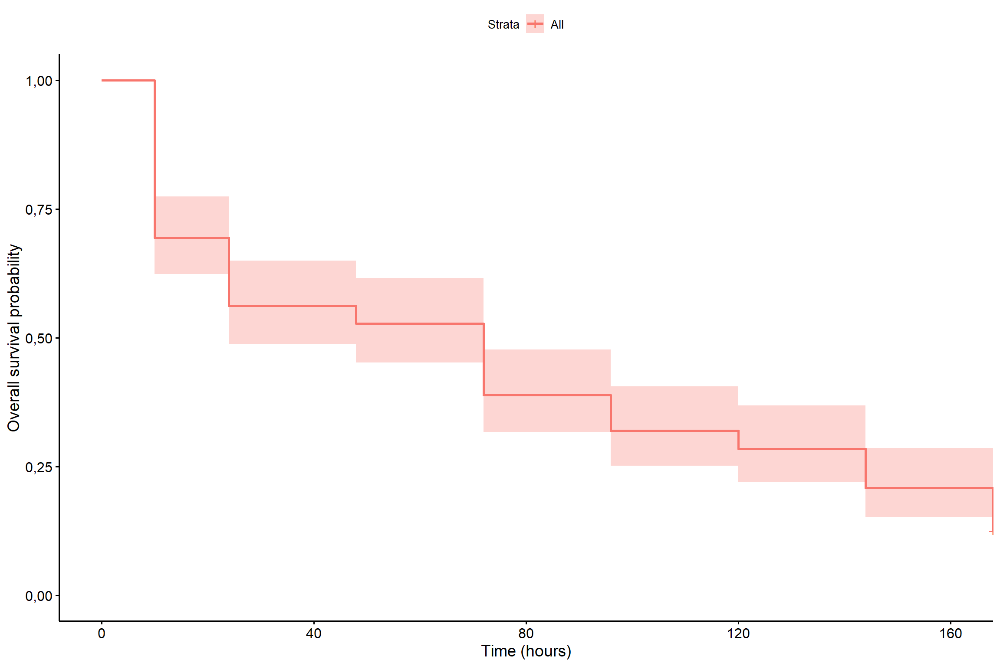

### ED, DL ou EC


```r
ED(model,10) ## Ed10
```

```
## 
## Estimated effective doses
## 
##        Estimate Std. Error
## e:1:10   26,131      2,755
```

```r
ED(model,50) ## ED50
```

```
## 
## Estimated effective doses
## 
##        Estimate Std. Error
## e:1:50  208,408     12,446
```

```r
ED(model,90) ## ED90
```

```
## 
## Estimated effective doses
## 
##        Estimate Std. Error
## e:1:90   1662,2      267,4
```

<br><br><br>

****

## Yield Loss

****

$$\hat{Y}=\frac{i\times x}{1+\frac{i\times x}{A}}$$


```r
#library(devtools)
#install_github("OnofriAndreaPG/aomisc")
par(family="serif")
library(aomisc)
model2 <- drm(y ~ x, fct = DRC.YL(), data = data)
summary(model2)
```

```
## 
## Model fitted: Yield-Loss function (Cousens, 1985) (2 parms)
## 
## Parameter estimates:
## 
##                Estimate Std. Error t-value   p-value    
## i:(Intercept)  0,376483   0,016637  22,629 < 2,2e-16 ***
## A:(Intercept) 81,021404   0,996137  81,336 < 2,2e-16 ***
## ---
## Signif. codes:  0 '***' 0,001 '**' 0,01 '*' 0,05 '.' 0,1 ' ' 1
## 
## Residual standard error:
## 
##  3,337955 (62 degrees of freedom)
```

```r
plot(model2,main="Yield Loss",
     las=1, cex=1.3,
     ylab="Weight loss (%)", 
     xlab="Time (Minutes)", 
     pch=16,lty=2)
legend("topleft",
       legend=expression(hat(YL)==frac(0.376483*x,
                                       1+frac(0.376483*x,81.021705))), bty="n")
```

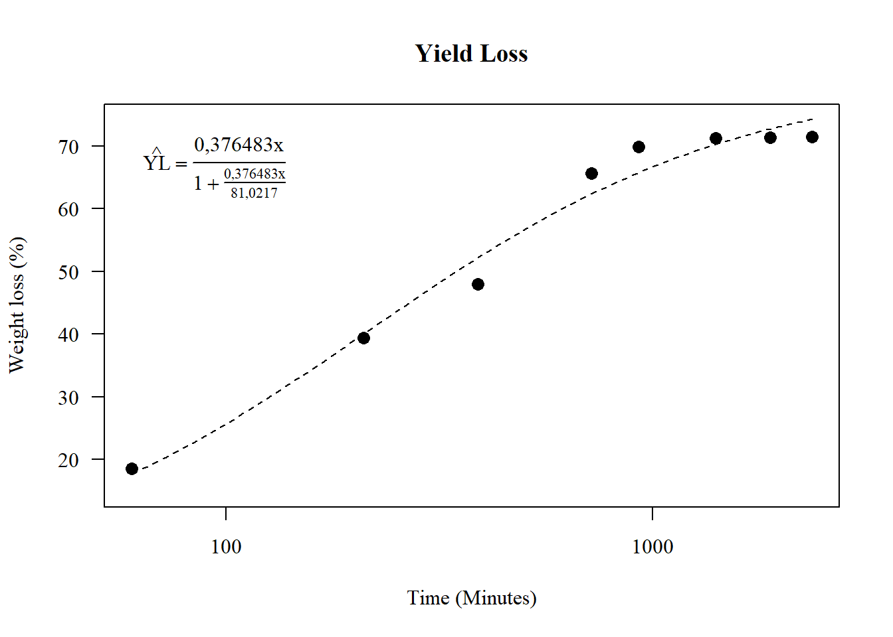

<br><br><br>

****

## Weibull 3

****

$$\hat{Y}=d\times e^{-e^{b\times log(x)-e}}$$

```r
par(family="serif")
model3 <- drm(y ~ x, fct = w3(), data = data)
summary(model3)
```

```
## 
## Model fitted: Weibull (type 1) with lower limit at 0 (3 parms)
## 
## Parameter estimates:
## 
##                 Estimate Std. Error t-value   p-value    
## b:(Intercept)  -0,621433   0,051944 -11,963 < 2,2e-16 ***
## d:(Intercept)  88,316665   3,466514  25,477 < 2,2e-16 ***
## e:(Intercept) 135,558602  10,937572  12,394 < 2,2e-16 ***
## ---
## Signif. codes:  0 '***' 0,001 '**' 0,01 '*' 0,05 '.' 0,1 ' ' 1
## 
## Residual standard error:
## 
##  3,702132 (61 degrees of freedom)
```

```r
plot(model3,main="Weibull 3",
     las=1, cex=1.3,
     ylab="Weight loss (%)", 
     xlab="Time (Minutes)", 
     pch=16,lty=2)
legend("topleft",
       legend=expression(hat(YL)==88.316665*e^(-e^{(-0.621433*(log(x)-135.558606))})), bty="n")
```


<br><br><br>

****

## Weibul 4 

****

$$\hat{Y} = c + (d − c)(1 − exp(− exp(b(log(x) − log(e)))))$$


```r
par(family="serif")
model4 <- drm(y ~ x, fct = w4(), data = data)
summary(model4)
```

```
## 
## Model fitted: Weibull (type 1) (4 parms)
## 
## Parameter estimates:
## 
##               Estimate Std. Error t-value   p-value    
## b:(Intercept)  -1,2171     0,1156 -10,528 2,911e-15 ***
## c:(Intercept)  18,4270     1,2668  14,546 < 2,2e-16 ***
## d:(Intercept)  76,5754     1,5142  50,571 < 2,2e-16 ***
## e:(Intercept) 230,4661    11,7439  19,624 < 2,2e-16 ***
## ---
## Signif. codes:  0 '***' 0,001 '**' 0,01 '*' 0,05 '.' 0,1 ' ' 1
## 
## Residual standard error:
## 
##  3,134519 (60 degrees of freedom)
```

```r
plot(model4,main="Weibull 4",
     las=1, cex=1.3,
     ylab="Weight loss (%)", 
     xlab="Time (Minutes)", 
     pch=16,lty=2)
legend("topleft",
       legend=expression(hat(YL)==18.4270+(76.5754-18.4270)(1-e^(-e^(-1.2171*(log(x)-log(230.4661)))))), bty="n")
```

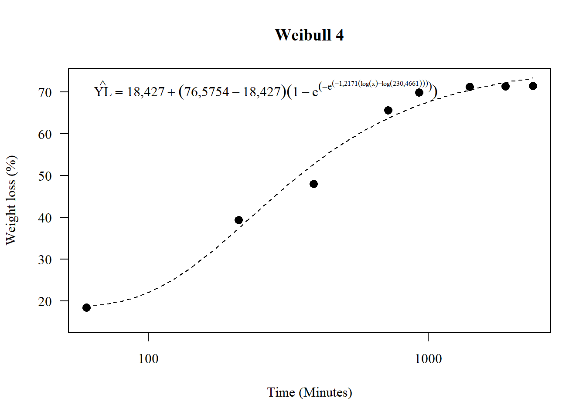

<br><br><br>

****

## Assintótica 2

****


```r
par(family="serif")
model5 <- drm(y ~ x, fct = drc::AR.2(), data = data)
summary(model5)
```

```
## 
## Model fitted: Asymptotic regression with lower limit at 0 (2 parms)
## 
## Parameter estimates:
## 
##                Estimate Std. Error t-value   p-value    
## d:(Intercept)  71,36776    0,64016 111,484 < 2,2e-16 ***
## e:(Intercept) 285,21787   10,77269  26,476 < 2,2e-16 ***
## ---
## Signif. codes:  0 '***' 0,001 '**' 0,01 '*' 0,05 '.' 0,1 ' ' 1
## 
## Residual standard error:
## 
##  3,364715 (62 degrees of freedom)
```

```r
plot(model5,main="Assintótica 2",
     las=1, cex=1.3,
     ylab="Weight loss (%)", 
     xlab="Time (Minutes)", 
     pch=16,lty=2)
```

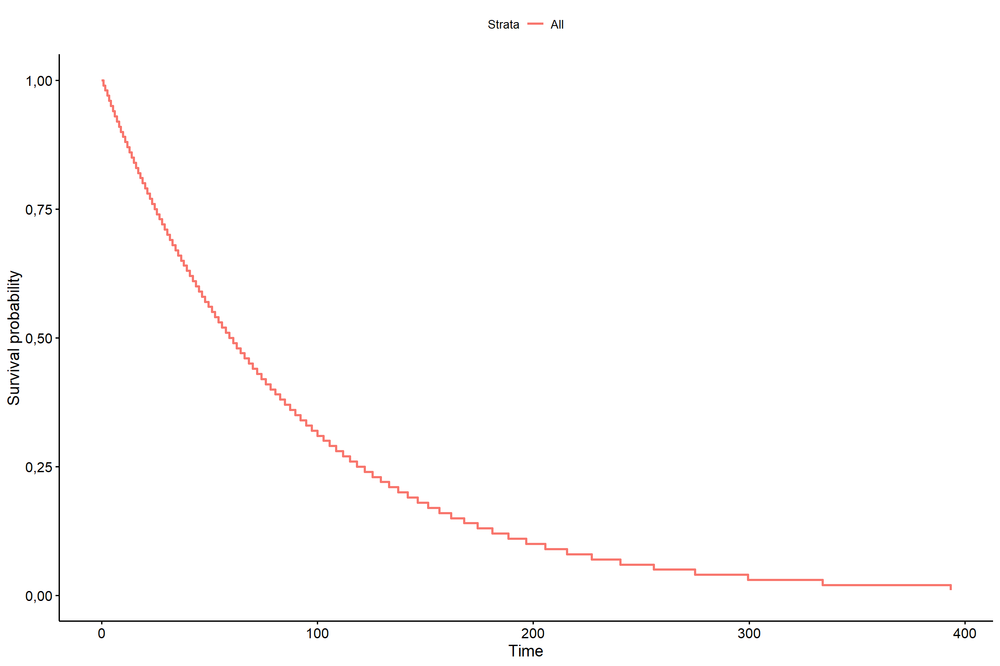

<br><br><br>

****

## Assintótica 3

****


```r
par(family="serif")
model6 <- drm(y ~ x, fct = drc::AR.3(), data = data)
summary(model6)
```

```
## 
## Model fitted: Shifted asymptotic regression (3 parms)
## 
## Parameter estimates:
## 
##                Estimate Std. Error  t-value   p-value    
## c:(Intercept)   8,65955    1,29240   6,7003 7,565e-09 ***
## d:(Intercept)  72,31924    0,55231 130,9390 < 2,2e-16 ***
## e:(Intercept) 348,01446   15,20460  22,8888 < 2,2e-16 ***
## ---
## Signif. codes:  0 '***' 0,001 '**' 0,01 '*' 0,05 '.' 0,1 ' ' 1
## 
## Residual standard error:
## 
##  2,630211 (61 degrees of freedom)
```

```r
plot(model6,main="Assintótica 3",
     las=1, cex=1.3,
     ylab="Weight loss (%)", 
     xlab="Time (Minutes)", 
     pch=16,lty=2)
```

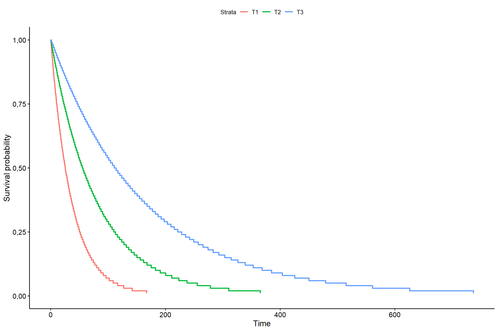

<br><br><br>

****

## Brain-Counsens 4

****


```r
model7 <- drm(y ~ x, fct = drc::BC.4(), data = data)
summary(model7)
```

```
## 
## Model fitted: Brain-Cousens (hormesis) with lower limit fixed at 0 (4 parms)
## 
## Parameter estimates:
## 
##                  Estimate  Std. Error  t-value   p-value    
## b:(Intercept)  -0,7419957   0,0628498 -11,8059 < 2,2e-16 ***
## d:(Intercept) 149,6381450  28,0543384   5,3339 1,539e-06 ***
## e:(Intercept) 842,5975169 384,1854662   2,1932  0,032179 *  
## f:(Intercept)  -0,0196017   0,0066143  -2,9635  0,004356 ** 
## ---
## Signif. codes:  0 '***' 0,001 '**' 0,01 '*' 0,05 '.' 0,1 ' ' 1
## 
## Residual standard error:
## 
##  2,642605 (60 degrees of freedom)
```

```r
par(family="serif")
plot(model,main="Brain-Counsens 4",
     las=1, cex=1.3,
     ylab="Weight loss (%)", 
     xlab="Time (Minutes)", 
     pch=16,lty=2)
```


<br><br><br>

****

## Brain-Counsens 5

****


```r
par(family="serif")
model8 <- drm(y ~ x, fct = drc::BC.5(), data = data)
summary(model8)
```

```
## 
## Model fitted: Brain-Cousens (hormesis) (5 parms)
## 
## Parameter estimates:
## 
##                  Estimate  Std. Error t-value   p-value    
## b:(Intercept)  -1,0445094   0,2286639 -4,5679 2,561e-05 ***
## c:(Intercept)   8,7627115   4,7730274  1,8359  0,071416 .  
## d:(Intercept) 109,0339449  20,0242731  5,4451 1,055e-06 ***
## e:(Intercept) 486,0685001 143,3483090  3,3908  0,001248 ** 
## f:(Intercept)  -0,0112154   0,0051383 -2,1827  0,033048 *  
## ---
## Signif. codes:  0 '***' 0,001 '**' 0,01 '*' 0,05 '.' 0,1 ' ' 1
## 
## Residual standard error:
## 
##  2,632805 (59 degrees of freedom)
```

```r
plot(model8,main="Brain-Cousens 5",
     las=1, cex=1.3,
     ylab="Weight loss (%)", 
     xlab="Time (Minutes)", 
     pch=16,lty=2)
```


<br><br><br>

****

## Cedergreen-Ritz-Streibig 3

****


```r
par(family="serif")
model9 <- drm(y ~ x, fct = drc::uml3a(), data = data)
summary(model9)
```

```
## 
## Model fitted: U-shaped Cedergreen-Ritz-Streibig (4 parms)
## 
## Parameter estimates:
## 
##                Estimate Std. Error t-value   p-value    
## b:(Intercept)   1,70356    0,15617 10,9084 6,917e-16 ***
## d:(Intercept)  74,51053    1,06473 69,9805 < 2,2e-16 ***
## e:(Intercept) 291,21663   16,71405 17,4235 < 2,2e-16 ***
## f:(Intercept) -15,54808    1,99553 -7,7915 1,112e-10 ***
## ---
## Signif. codes:  0 '***' 0,001 '**' 0,01 '*' 0,05 '.' 0,1 ' ' 1
## 
## Residual standard error:
## 
##  2,947189 (60 degrees of freedom)
```

```r
plot(model9,main="Cedergreen-Ritz-Streibig 3",
     las=1, cex=1.3,
     ylab="Weight loss (%)", 
     xlab="Time (Minutes)", 
     pch=16,lty=2)
```

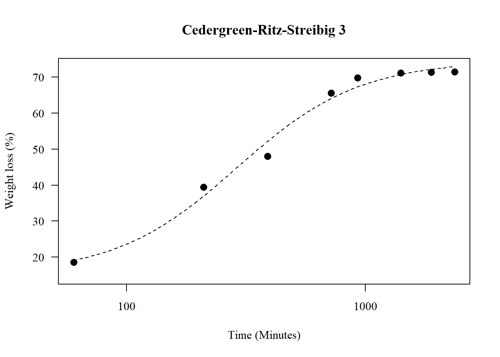

<br><br><br>

****

## Cedergreen-Ritz-Streibig 4

****


```r
par(family="serif")
model10 <- drm(y ~ x, fct = drc::uml4a(), data = data)
summary(model10)
```

```
## 
## Model fitted: U-shaped Cedergreen-Ritz-Streibig (5 parms)
## 
## Parameter estimates:
## 
##                  Estimate  Std. Error  t-value   p-value    
## b:(Intercept)     4,64106     0,47568   9,7568 6,416e-14 ***
## c:(Intercept) -1701,15137    94,96264 -17,9139 < 2,2e-16 ***
## d:(Intercept)    71,53869     0,42799 167,1489 < 2,2e-16 ***
## e:(Intercept)   544,23492    21,39639  25,4358 < 2,2e-16 ***
## f:(Intercept) -1748,54548    96,09285 -18,1964 < 2,2e-16 ***
## ---
## Signif. codes:  0 '***' 0,001 '**' 0,01 '*' 0,05 '.' 0,1 ' ' 1
## 
## Residual standard error:
## 
##  2,008856 (59 degrees of freedom)
```

```r
plot(model,main="Cedergreen-Ritz-Streibig 4",
     las=1, cex=1.3,
     ylab="Weight loss (%)", 
     xlab="Time (Minutes)", 
     pch=16,lty=2)
```


<br><br><br>

****

## Modelo exponencial

****


```r
modelexp=lm(log(y)~x);summary(modelexp)
```

```
## 
## Call:
## lm(formula = log(y) ~ x)
## 
## Residuals:
##     Min      1Q  Median      3Q     Max 
## -0,8722 -0,1354  0,1129  0,2682  0,3722 
## 
## Coefficients:
##              Estimate Std. Error t value Pr(>|t|)    
## (Intercept) 3,543e+00  6,534e-02  54,216  < 2e-16 ***
## x           4,188e-04  5,174e-05   8,095 2,71e-11 ***
## ---
## Signif. codes:  0 '***' 0,001 '**' 0,01 '*' 0,05 '.' 0,1 ' ' 1
## 
## Residual standard error: 0,3206 on 62 degrees of freedom
## Multiple R-squared:  0,5138,	Adjusted R-squared:  0,506 
## F-statistic: 65,52 on 1 and 62 DF,  p-value: 2,711e-11
```

```r
alpha=exp(modelexp$coefficients[1])
beta=modelexp$coefficients[2]
model11=nls(y~A*exp(x*B),start=list(A=alpha,B=beta))
summary(model11)
```

```
## 
## Formula: y ~ A * exp(x * B)
## 
## Parameters:
##    Estimate Std. Error t value Pr(>|t|)    
## A 4,237e+01  2,255e+00  18,790  < 2e-16 ***
## B 2,762e-04  3,386e-05   8,156 2,12e-11 ***
## ---
## Signif. codes:  0 '***' 0,001 '**' 0,01 '*' 0,05 '.' 0,1 ' ' 1
## 
## Residual standard error: 12,77 on 62 degrees of freedom
## 
## Number of iterations to convergence: 6 
## Achieved convergence tolerance: 5,434e-06
```

```r
plot(y~x)
lines(seq(min(x), max(x), length.out = 100), 
      predict(model11, newdata = data.frame(x = seq(min(x), 
                                                     max(x), 
                                                     length.out = 100))),
      col="red",lwd=2,lty=2)
```

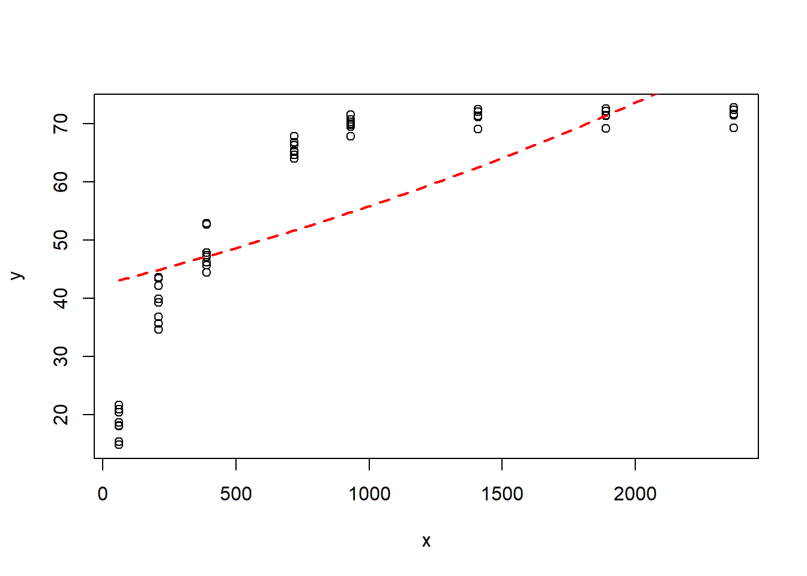

<br><br><br>

****

## Modelo loess

****


```r
model12=loess(y~x)
summary(model12)
```

```
## Call:
## loess(formula = y ~ x)
## 
## Number of Observations: 64 
## Equivalent Number of Parameters: 4,94 
## Residual Standard Error: 2,7 
## Trace of smoother matrix: 5,42  (exact)
## 
## Control settings:
##   span     :  0,75 
##   degree   :  2 
##   family   :  gaussian
##   surface  :  interpolate	  cell = 0,2
##   normalize:  TRUE
##  parametric:  FALSE
## drop.square:  FALSE
```

```r
par(pch=16,las=1); par(family="serif")
plot(media~tempo, main="Modelo Loess",
     las=1, cex=1.3,
     ylab="Weight loss (%)", xlim=c(0,2500),
     xlab="Time (Minutes)", 
     pch=16, ylim=c(0,80))
lines(x,predict(model12,x),lty=2)
```

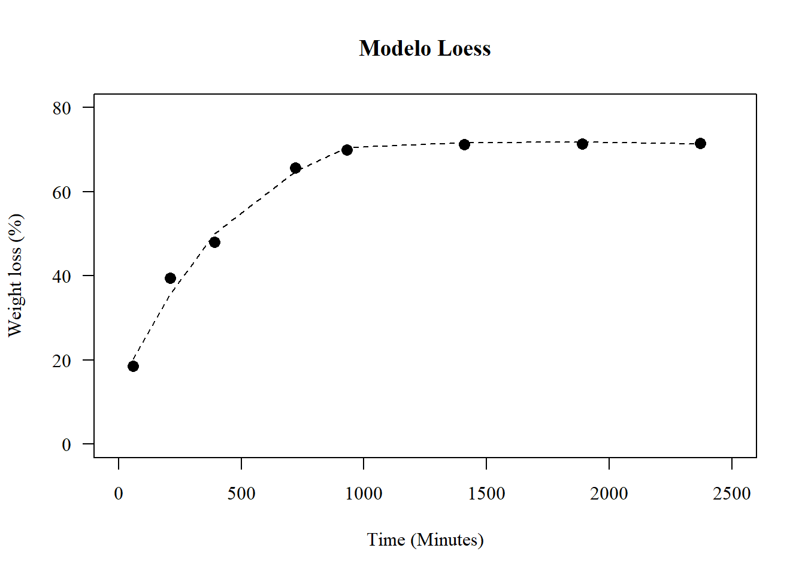

```r
## ou

par(pch=16,las=1); par(family="serif")
plot(media~tempo, main="modelo loess",
     las=1, cex=1.3,
     ylab="Weight loss (%)", xlim=c(0,2500),
     xlab="Time (Minutes)", 
     pch=16, ylim=c(0,80))
lines(seq(60,2370,5),predict(model12,seq(60,2370,5)),lty=2)
```


```r
## ou

library(ggplot2)
ggplot(data,aes(y=y,x=x))+
  geom_point()+
  geom_smooth()+
  theme_bw()+
  theme_classic()+
  xlab("Time (minutes)")+
  ylab("Weight loss (%)")
```


****

## Coef. de determinação ($R^2$)

****


```r
r2=c(1-var(residuals(modl))/var(residuals(lm(y~1))),
1-var(residuals(mod1))/var(residuals(lm(y~1))),
1-var(residuals(mod2))/var(residuals(lm(y~1))),
1-var(residuals(modelog))/var(residuals(lm(y~1))),
1-var(residuals(n0))/var(residuals(lm(y~1))),
1-var(residuals(n1))/var(residuals(lm(y~1))),
1-var(residuals(modelo_pieciwise))/var(residuals(lm(y~1))),
1-var(residuals(modelo_pieciwise1))/var(residuals(lm(y~1))),
1-var(residuals(modelo2))/var(residuals(lm(y~1))),
1-var(residuals(model))/var(residuals(lm(y~1))),
1-var(residuals(model1))/var(residuals(lm(y~1))),
1-var(residuals(model2))/var(residuals(lm(y~1))),
1-var(residuals(model3))/var(residuals(lm(y~1))),
1-var(residuals(model4))/var(residuals(lm(y~1))),
1-var(residuals(model5))/var(residuals(lm(y~1))),
1-var(residuals(model6))/var(residuals(lm(y~1))),
1-var(residuals(model7))/var(residuals(lm(y~1))),
1-var(residuals(model8))/var(residuals(lm(y~1))),
1-var(residuals(model9))/var(residuals(lm(y~1))),
1-var(residuals(model10))/var(residuals(lm(y~1))),
1-var(residuals(model11))/var(residuals(lm(y~1))))
```

<br><br><br>

****

## AIC

****


```r
aic=c(AIC(modl),
AIC(mod1),
AIC(mod2),
AIC(modelog),
AIC(n0),
AIC(n1),
AIC(modelo_pieciwise),
AIC(modelo_pieciwise1),
AIC(modelo2),
AIC(model),
AIC(model1),
AIC(model2),
AIC(model3),
AIC(model4),
AIC(model5),
AIC(model6),
AIC(model7),
AIC(model8),
AIC(model9),
AIC(model10),
AIC(model11))
```

<br><br><br>

****

## BIC

****


```r
bic=c(BIC(modl),
BIC(mod1),
BIC(mod2),
BIC(modelog),
BIC(n0),
BIC(n1),
BIC(modelo_pieciwise),
BIC(modelo_pieciwise1),
BIC(modelo2),
BIC(model),
BIC(model1),
BIC(model2),
BIC(model3),
BIC(model4),
BIC(model5),
BIC(model6),
BIC(model7),
BIC(model8),
BIC(model9),
BIC(model10),
BIC(model11))
analise=cbind(aic,bic,r2)
rownames(analise)=c("Linear","Quadrático","Cúbico","Log",
                    "Michaelis-Mente","Michaelis Menten (Corrigido)",
                    "Segmentada Linear","Segmentada Quadrática",
                    "Mitscherlich","Logístico LL.3","Logístico LL.4",
                    "Yield Loss", "Weibull 3","Weibull 4",
                    "Assintótica 2","Assintótica 3",
                    "Brain-Counsens 4","Brain-Counsens 5",
                    "Cedergreen-Ritz-Streibig 3",
                    "Cedergreen-Ritz-Streibig 4",
                    "Exponencial")
knitr::kable(analise)
```

                                     aic        bic          r2
-----------------------------  ---------  ---------  ----------
Linear                          499,5847   506,0614   0,6204884
Quadrático                      402,7620   411,3975   0,9189732
Cúbico                          317,0989   327,8933   0,9794051
Log                             384,3339   390,8105   0,9373170
Michaelis-Mente                 339,8781   346,3547   0,9687055
Michaelis Menten (Corrigido)    323,8311   332,4667   0,9765013
Segmentada Linear               352,6998   363,4943   0,9640795
Segmentada Quadrática           332,1142   345,0675   0,9747606
Mitscherlich                    310,3357   318,9713   0,9808822
Logístico LL.3                  340,9449   349,5804   0,9691758
Logístico LL.4                  325,9732   336,7677   0,9763419
Yield Loss                      339,8781   346,3547   0,9687055
Weibull 3                       354,0919   362,7274   0,9621318
Weibull 4                       333,7306   344,5250   0,9732933
Assintótica 2                   340,9002   347,3768   0,9688639
Assintótica 3                   310,3357   318,9713   0,9808822
Brain-Counsens 4                311,8796   322,6740   0,9810184
Brain-Counsens 5                312,3284   325,2817   0,9814725
Cedergreen-Ritz-Streibig 3      325,8427   336,6371   0,9763901
Cedergreen-Ritz-Streibig 4      277,7064   290,6597   0,9892136
Exponencial                     511,5978   518,0744   0,5422488

# Análise de sobrevivência

*****

<br><br>

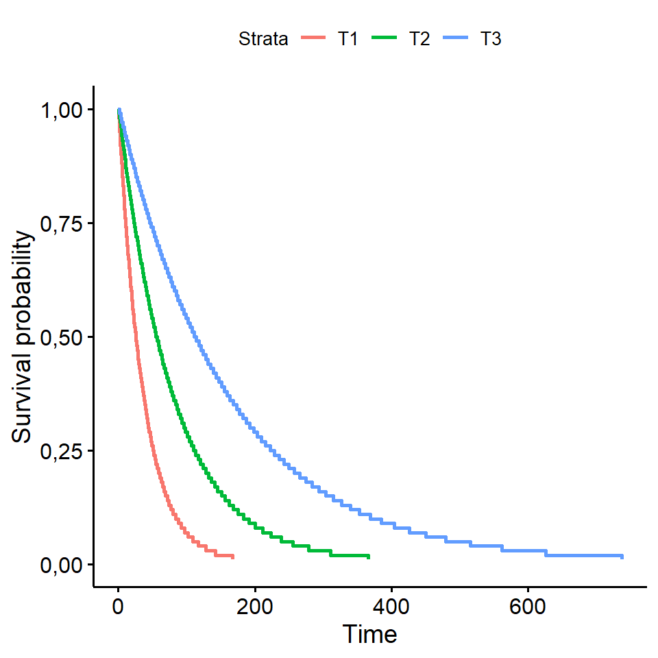

Análise de sobrevivência, também denominada análise de sobrevida, é um ramo da estatística que estuda o tempo de duração esperado até a ocorrência de um ou mais eventos, tais como morte em organismos biológicos ou falha em sistemas mecânicos. Na agronomia, tem sido bastante utilizada na avaliação residual de produtos fitossanitários em insetos, tempo até a morte em função de um doença, etc.

<br><br>

****

****

## Conjunto de dados

****

O conjunto de dados é de um experimento cujo objetivo é avaliar a mortalidade de insetos em função de alguns produtos comerciais. 


```r
tempo=c(10,10,10,10,10,10,10,24,24,24,24,48,10,10,10,10,10,10,10,10,10,10,10,10,24,24,48,48,72,72,72,72,72,72,72,72,10,10,24,24,72,72,72,72,72,72,96,96,10,10,10,48,96,96,144,144,168,168,168,168,10,10,24,24,72,72,72,96,96,120,168,168,10,10,10,10,10,10,10,24,24,24,24,48,10,10,10,24,24,120,120,144,144,144,144,144,10,10,144,144,168,168,168,168,168,168,168,168,24,72,96,96,120,144,168,168,168,168,168,168,24,72,96,120,144,168,168,168,168,168,168,168,10,10,10,10,10,10,24,72,96,168,168,168)
# criando vetor de status (Ocorreu ou nao o evento)
status=c(1,1,1,1,1,1,1,1,1,1,1,1,1,1,1,1,1,1,1,1,1,1,1,1,1,1,1,1,1,1,1,1,1,1,1,1,1,1,1,1,1,1,1,1,1,1,1,1,1,1,1,1,1,1,1,1,0,0,0,0,1,1,1,1,1,1,1,1,1,1,1,0,1,1,1,1,1,1,1,1,1,1,1,1,1,1,1,1,1,1,1,1,1,1,1,1,1,1,1,1,1,1,1,1,0,0,0,0,1,1,1,1,1,1,1,0,0,0,1,0,1,1,1,1,1,1,1,1,1,0,0,0,1,1,1,1,1,1,1,1,1,1,0,0)
trat=rep(c("T1","T2",'T3'),e=48)
dados=data.frame(trat,tempo,status)
```

<br><br>

## Histograma


```r
hist(tempo)
```


<br><br>

****

## Método não-paramétrico de Kaplan-meier

****

<br><br>

### Sem considerar tratamentos

Somente uma análise exploratória geral


```r
library(survival)
library(survminer)
KM <- survfit(Surv(tempo,status) ~ 1, type="kaplan-meier")
summary(KM)
```

```
## Call: survfit(formula = Surv(tempo, status) ~ 1, type = "kaplan-meier")
## 
##  time n.risk n.event survival std.err lower 95% CI upper 95% CI
##    10    144      44    0,694  0,0384       0,6231        0,774
##    24    100      19    0,562  0,0413       0,4870        0,650
##    48     81       5    0,528  0,0416       0,4522        0,616
##    72     76      20    0,389  0,0406       0,3169        0,477
##    96     56      10    0,319  0,0389       0,2517        0,405
##   120     46       5    0,285  0,0376       0,2198        0,369
##   144     41      11    0,208  0,0338       0,1515        0,286
##   168     30      12    0,125  0,0276       0,0811        0,193
```

```r
ggsurvplot(
  fit = survfit(Surv(tempo, status) ~ 1),data=dados, 
  xlab = "Time (hours)", 
  ylab = "Overall survival probability")
```


### Tempo médio de sobrevivência


```r
a=survival:::survmean(KM, rmean=48)
a$matrix[5]
```

```
##   *rmean 
## 33,22222
```

<br><br>

### Considerando tratamentos

### Conferindo diferenças par a par


```r
pvalor=pairwise_survdiff(Surv(tempo,status)~trat,data=dados, rho=0)
knitr::kable(pvalor$p.value)
```

             T1          T2
---  ----------  ----------
T2    0,0003111            
T3    0,0000000   0,0006521

Todos diferem entre si

### Grafico por tratamento usando o método de Kaplan-Meier


```r
KM1 <- survfit(Surv(tempo,status) ~ trat, type="kaplan-meier")
ggsurvplot(
  fit = survfit(Surv(tempo, status) ~ trat),data=dados, 
  xlab = "Time (hours)", 
  ylab = "Overall survival probability")
```


### Tempo médio de sobrevivência


```r
survival:::survmean(KM1, rmean=48)$matrix[,5]
```

```
##  trat=T1  trat=T2  trat=T3 
## 27,37500 32,12500 40,16667
```

<br><br>

****

## Modelo paramétrico

****

<br><br>

****

### Distribuição exponencial

****

<br><br>

### Sem considerar tratamentos


```r
KM <- survreg(Surv(tempo,status) ~ 1, dist="exponential")
summary(KM)
```

```
## 
## Call:
## survreg(formula = Surv(tempo, status) ~ 1, dist = "exponential")
##              Value Std. Error    z      p
## (Intercept) 4,4473     0,0891 49,9 <2e-16
## 
## Scale fixed at 1 
## 
## Exponential distribution
## Loglik(model)= -686,4   Loglik(intercept only)= -686,4
## Number of Newton-Raphson Iterations: 4 
## n= 144
```

```r
s <- seq(.01, .99, by = .01)
t_0 <- predict(KM, newdata = data.frame(trat=paste("T1","T2","T3")), 
                 type = "quantile", p = s)
smod <- data.frame(time = c(t_0), # acrescentar os tratamentos 
                   surv = rep(1 - s, times = 1), # mudar o times
                   upper = NA, lower = NA)
ggsurvplot(smod)  
```


### Considerando tratamentos


```r
library(survival)
library(survminer)
KM2 <- survreg(Surv(tempo,status) ~ trat, dist="exponential")
summary(KM)
```

```
## 
## Call:
## survreg(formula = Surv(tempo, status) ~ 1, dist = "exponential")
##              Value Std. Error    z      p
## (Intercept) 4,4473     0,0891 49,9 <2e-16
## 
## Scale fixed at 1 
## 
## Exponential distribution
## Loglik(model)= -686,4   Loglik(intercept only)= -686,4
## Number of Newton-Raphson Iterations: 4 
## n= 144
```

```r
anova(KM2)
```

```
##      Df Deviance Resid. Df    -2*LL     Pr(>Chi)
## NULL NA       NA       143 1372,722           NA
## trat  2 44,24522       141 1328,477 2,467593e-10
```

```r
s <- seq(.01, .99, by = .01)
t_0 <- predict(KM2, newdata = data.frame(trat = "T1"), type = "quantile", p = s)
t_1 <- predict(KM2, newdata = data.frame(trat = "T2"), type = "quantile", p = s)
t_2 <- predict(KM2, newdata = data.frame(trat = "T3"), type = "quantile", p = s)
smod <- data.frame(time = c(t_0, t_1, t_2), # acrescentar os tratamentos 
                   surv = rep(1 - s, times = 3), # mudar o times
                   strata = rep(c("T1", "T2", "T3"), each = length(s)),
                   upper = NA, lower = NA)
ggsurvplot(smod)  
```


<br><br>

****

## Distribuição gaussiano

****

### Sem considerar tratamentos


```r
KM <- survreg(Surv(tempo,status) ~ 1, dist="gaussian")
summary(KM)
```

```
## 
## Call:
## survreg(formula = Surv(tempo, status) ~ 1, dist = "gaussian")
##               Value Std. Error    z      p
## (Intercept) 78,8982     5,9303 13,3 <2e-16
## Log(scale)   4,2519     0,0652 65,2 <2e-16
## 
## Scale= 70,2 
## 
## Gaussian distribution
## Loglik(model)= -735,6   Loglik(intercept only)= -735,6
## Number of Newton-Raphson Iterations: 5 
## n= 144
```

### Considerando tratamentos


```r
KM3 <- survreg(Surv(tempo,status) ~ trat, dist="gaussian")
summary(KM3)
```

```
## 
## Call:
## survreg(formula = Surv(tempo, status) ~ trat, dist = "gaussian")
##               Value Std. Error     z       p
## (Intercept) 36,3750     8,5829  4,24 2,3e-05
## tratT2      37,3906    12,1867  3,07  0,0022
## tratT3      89,7879    12,3737  7,26 4,0e-13
## Log(scale)   4,0854     0,0649 62,96 < 2e-16
## 
## Scale= 59,5 
## 
## Gaussian distribution
## Loglik(model)= -712,5   Loglik(intercept only)= -735,6
## 	Chisq= 46,23 on 2 degrees of freedom, p= 9,2e-11 
## Number of Newton-Raphson Iterations: 4 
## n= 144
```

```r
anova(KM3)
```

```
##      Df Deviance Resid. Df    -2*LL     Pr(>Chi)
## NULL NA       NA       142 1471,295           NA
## trat  2 46,22645       140 1425,069 9,163355e-11
```

```r
t_0 <- predict(KM3, newdata = data.frame(trat = "T1"), type = "lp")
t_1 <- predict(KM3, newdata = data.frame(trat = "T2"),type = "lp")
t_2 <- predict(KM3, newdata = data.frame(trat = "T3"),type = "lp")
x_grid <- 1:400
sur_curves <- sapply(t_0, function(x)survreg.distributions[[KM3$dist]]$density((x - x_grid)/KM3$scale)[, 1])
sur_curves1 <- sapply(t_1, function(x)survreg.distributions[[KM3$dist]]$density((x - x_grid)/KM3$scale)[, 1])
sur_curves2 <- sapply(t_2, function(x)survreg.distributions[[KM3$dist]]$density((x - x_grid)/KM3$scale)[, 1])
matplot(x_grid, sur_curves, type = "l", lty = 1,ylim=c(0,1))
lines(x_grid,sur_curves1,col="red")
lines(x_grid,sur_curves2,col="blue")
```


<br><br>

****

## Distribuição logistico

****

### Sem considerar tratamentos


```r
KM <- survreg(Surv(tempo,status) ~ 1, dist="logistic")
summary(KM)
```

```
## 
## Call:
## survreg(formula = Surv(tempo, status) ~ 1, dist = "logistic")
##               Value Std. Error    z      p
## (Intercept) 72,5020     6,3768 11,4 <2e-16
## Log(scale)   3,7594     0,0722 52,0 <2e-16
## 
## Scale= 42,9 
## 
## Logistic distribution
## Loglik(model)= -739,5   Loglik(intercept only)= -739,5
## Number of Newton-Raphson Iterations: 5 
## n= 144
```

### Considerando tratamentos


```r
KM4 <- survreg(Surv(tempo,status) ~ trat, dist="logistic")
summary(KM4)
```

```
## 
## Call:
## survreg(formula = Surv(tempo, status) ~ trat, dist = "logistic")
##               Value Std. Error     z       p
## (Intercept) 35,4968     7,7296  4,59 4,4e-06
## tratT2      31,3587    12,2695  2,56   0,011
## tratT3      98,9211    12,4589  7,94 2,0e-15
## Log(scale)   3,5544     0,0737 48,20 < 2e-16
## 
## Scale= 35 
## 
## Logistic distribution
## Loglik(model)= -714,3   Loglik(intercept only)= -739,5
## 	Chisq= 50,45 on 2 degrees of freedom, p= 1,1e-11 
## Number of Newton-Raphson Iterations: 4 
## n= 144
```

```r
anova(KM4)
```

```
##      Df Deviance Resid. Df    -2*LL     Pr(>Chi)
## NULL NA       NA       142 1479,091           NA
## trat  2 50,45218       140 1428,639 1,107765e-11
```

```r
t_0 <- predict(KM4, newdata = data.frame(trat = "T1"), type = "lp")
t_1 <- predict(KM4, newdata = data.frame(trat = "T2"),type = "lp")
t_2 <- predict(KM4, newdata = data.frame(trat = "T3"),type = "lp")
x_grid <- 1:400
sur_curves <- sapply(t_0, function(x)survreg.distributions[[KM4$dist]]$density((x - x_grid)/KM4$scale)[, 1])
sur_curves1 <- sapply(t_1, function(x)survreg.distributions[[KM4$dist]]$density((x - x_grid)/KM4$scale)[, 1])
sur_curves2 <- sapply(t_2, function(x)survreg.distributions[[KM4$dist]]$density((x - x_grid)/KM4$scale)[, 1])
matplot(x_grid, sur_curves, type = "l", lty = 1,ylim=c(0,1))
lines(x_grid,sur_curves1,col="red")
lines(x_grid,sur_curves2,col="blue")
```


<br><br>

****

## Distribuição Log normal

****

### Sem considerar tratamentos


```r
KM <- survreg(Surv(tempo,status) ~ 1, dist="lognormal")
summary(KM)
```

```
## 
## Call:
## survreg(formula = Surv(tempo, status) ~ 1, dist = "lognormal")
##              Value Std. Error     z       p
## (Intercept) 3,8658     0,1080 35,80 < 2e-16
## Log(scale)  0,2438     0,0648  3,76 0,00017
## 
## Scale= 1,28 
## 
## Log Normal distribution
## Loglik(model)= -681,1   Loglik(intercept only)= -681,1
## Number of Newton-Raphson Iterations: 5 
## n= 144
```

### Considerando tratamentos


```r
KM5 <- survreg(Surv(tempo,status) ~ trat, dist="lognormal")
summary(KM5)
```

```
## 
## Call:
## survreg(formula = Surv(tempo, status) ~ trat, dist = "lognormal")
##              Value Std. Error     z      p
## (Intercept) 3,2165     0,1655 19,43 <2e-16
## tratT2      0,5650     0,2352  2,40  0,016
## tratT3      1,3925     0,2394  5,82  6e-09
## Log(scale)  0,1369     0,0644  2,12  0,034
## 
## Scale= 1,15 
## 
## Log Normal distribution
## Loglik(model)= -665,4   Loglik(intercept only)= -681,1
## 	Chisq= 31,54 on 2 degrees of freedom, p= 1,4e-07 
## Number of Newton-Raphson Iterations: 4 
## n= 144
```

```r
anova(KM5)
```

```
##      Df Deviance Resid. Df    -2*LL     Pr(>Chi)
## NULL NA       NA       142 1362,288           NA
## trat  2 31,54326       140 1330,744 1,414059e-07
```

```r
s <- seq(.01, .99, by = .01)
t_0 <- predict(KM5, newdata = data.frame(trat = "T1"), type = "quantile", p = s)
t_1 <- predict(KM5, newdata = data.frame(trat = "T2"), type = "quantile", p = s)
t_2 <- predict(KM5, newdata = data.frame(trat = "T3"), type = "quantile", p = s)
smod <- data.frame(time = c(t_0, t_1, t_2), # acrescentar os tratamentos 
                   surv = rep(1 - s, times = 3), # mudar o times
                   strata = rep(c("T1", "T2", "T3"), each = length(s)),
                   upper = NA, lower = NA)
ggsurvplot(smod)  
```


<br><br>

****

## Distribuição Log-Logístico

****

### Sem considerar tratamentos


```r
KM <- survreg(Surv(tempo,status) ~ 1, dist="loglogistic")
summary(KM)
```

```
## 
## Call:
## survreg(formula = Surv(tempo, status) ~ 1, dist = "loglogistic")
##               Value Std. Error     z      p
## (Intercept)  3,8717     0,1192 32,49 <2e-16
## Log(scale)  -0,2265     0,0711 -3,19 0,0014
## 
## Scale= 0,797 
## 
## Log logistic distribution
## Loglik(model)= -687   Loglik(intercept only)= -687
## Number of Newton-Raphson Iterations: 5 
## n= 144
```

### Considerando tratamentos


```r
KM6 <- survreg(Surv(tempo,status) ~ trat, dist="loglogistic")
summary(KM6)
```

```
## 
## Call:
## survreg(formula = Surv(tempo, status) ~ trat, dist = "loglogistic")
##               Value Std. Error     z       p
## (Intercept)  3,1947     0,1689 18,92 < 2e-16
## tratT2       0,5839     0,2530  2,31   0,021
## tratT3       1,5687     0,2441  6,43 1,3e-10
## Log(scale)  -0,3709     0,0725 -5,11 3,2e-07
## 
## Scale= 0,69 
## 
## Log logistic distribution
## Loglik(model)= -669,2   Loglik(intercept only)= -687
## 	Chisq= 35,64 on 2 degrees of freedom, p= 1,8e-08 
## Number of Newton-Raphson Iterations: 4 
## n= 144
```

```r
anova(KM6)
```

```
##      Df Deviance Resid. Df    -2*LL     Pr(>Chi)
## NULL NA       NA       142 1373,973           NA
## trat  2 35,64462       140 1338,328 1,819156e-08
```

```r
s <- seq(.01, .99, by = .01)
t_0 <- predict(KM6, newdata = data.frame(trat = "T1"), type = "quantile", p = s)
t_1 <- predict(KM6, newdata = data.frame(trat = "T2"), type = "quantile", p = s)
t_2 <- predict(KM6, newdata = data.frame(trat = "T3"), type = "quantile", p = s)
smod <- data.frame(time = c(t_0, t_1, t_2), # acrescentar os tratamentos 
                   surv = rep(1 - s, times = 3), # mudar o times
                   strata = rep(c("T1", "T2", "T3"), each = length(s)),
                   upper = NA, lower = NA)
ggsurvplot(smod)  
```

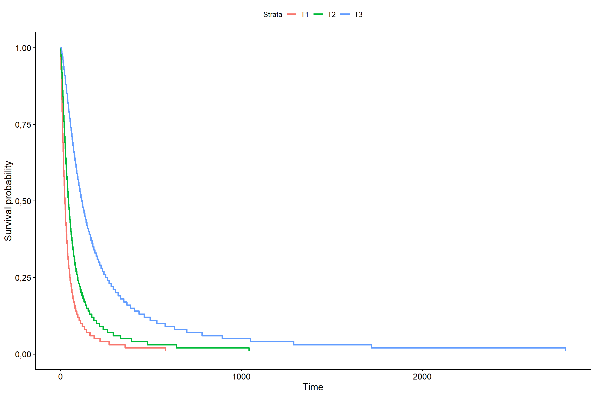

<br><br>

****

## Distribuição Weibull (default)

*****

### Sem considerar tratamentos


```r
KM <- survreg(Surv(tempo,status) ~ 1, dist="weibull")
summary(KM)
```

```
## 
## Call:
## survreg(formula = Surv(tempo, status) ~ 1, dist = "weibull")
##              Value Std. Error     z      p
## (Intercept) 4,4310     0,0969 45,72 <2e-16
## Log(scale)  0,0685     0,0740  0,93   0,35
## 
## Scale= 1,07 
## 
## Weibull distribution
## Loglik(model)= -685,9   Loglik(intercept only)= -685,9
## Number of Newton-Raphson Iterations: 6 
## n= 144
```

### Considerando tratamentos


```r
KM7 <- survreg(Surv(tempo,status) ~ trat, dist="weibull")
summary(KM7)
```

```
## 
## Call:
## survreg(formula = Surv(tempo, status) ~ trat, dist = "weibull")
##               Value Std. Error     z       p
## (Intercept)  3,6259     0,1334 27,18 < 2e-16
## tratT2       0,7769     0,1906  4,08 4,6e-05
## tratT3       1,4392     0,2043  7,05 1,8e-12
## Log(scale)  -0,0969     0,0744 -1,30    0,19
## 
## Scale= 0,908 
## 
## Weibull distribution
## Loglik(model)= -663,4   Loglik(intercept only)= -685,9
## 	Chisq= 45 on 2 degrees of freedom, p= 1,7e-10 
## Number of Newton-Raphson Iterations: 5 
## n= 144
```

```r
anova(KM7)
```

```
##      Df Deviance Resid. Df    -2*LL     Pr(>Chi)
## NULL NA       NA       142 1371,840           NA
## trat  2 44,99626       140 1326,844 1,695061e-10
```

```r
s <- seq(.01, .99, by = .01)
t_0 <- predict(KM7, newdata = data.frame(trat = "T1"), type = "quantile", p = s)
t_1 <- predict(KM7, newdata = data.frame(trat = "T2"), type = "quantile", p = s)
t_2 <- predict(KM7, newdata = data.frame(trat = "T3"), type = "quantile", p = s)
smod <- data.frame(time = c(t_0, t_1, t_2), # acrescentar os tratamentos 
                   surv = rep(1 - s, times = 3), # mudar o times
                   strata = rep(c("T1", "T2", "T3"), each = length(s)),
                   upper = NA, lower = NA)
ggsurvplot(smod)  
```

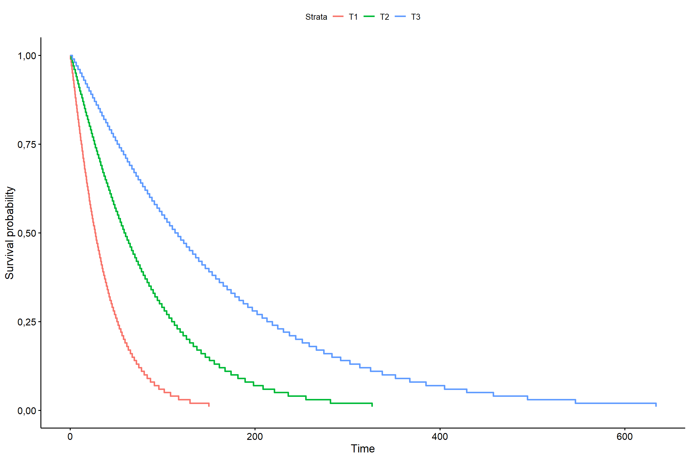


<br><br><br>

****

## Gompertz

****


```r
library(flexsurv)
KM9=flexsurvreg(Surv(tempo,status)~trat,dist="Gompertz")
summary(KM9)
```

```
## trat=T1 
##   time         est          lcl        ucl
## 1   10 0,786371074 7,217036e-01 0,83670214
## 2   24 0,549854904 4,491171e-01 0,63929512
## 3   48 0,279640531 1,839060e-01 0,38450707
## 4   72 0,130206542 6,718524e-02 0,21916226
## 5   96 0,054871360 2,035735e-02 0,11570802
## 6  120 0,020657887 4,633433e-03 0,05818793
## 7  144 0,006846406 8,009858e-04 0,02808131
## 8  168 0,001964497 9,461558e-05 0,01260615
## 
## trat=T2 
##   time        est        lcl       ucl
## 1   10 0,91229451 0,86575721 0,9403324
## 2   24 0,79577094 0,70448808 0,8554563
## 3   48 0,61465240 0,48535470 0,7097821
## 4   72 0,45902365 0,32862031 0,5703498
## 5   96 0,32998531 0,21652331 0,4451944
## 6  120 0,22722132 0,13388782 0,3320264
## 7  144 0,14902446 0,07594742 0,2454403
## 8  168 0,09250403 0,03736292 0,1763878
## 
## trat=T3 
##   time       est       lcl       ucl
## 1   10 0,9585577 0,9335958 0,9747080
## 2   24 0,9000225 0,8460003 0,9369671
## 3   48 0,7989822 0,7105146 0,8641142
## 4   72 0,6983485 0,5904945 0,7847070
## 5   96 0,5997606 0,4821634 0,6956082
## 6  120 0,5049620 0,3847635 0,6127203
## 7  144 0,4157087 0,2937037 0,5284119
## 8  168 0,3336543 0,2168233 0,4543410
```

```r
plot(KM9,col=c(1,2,3))
```

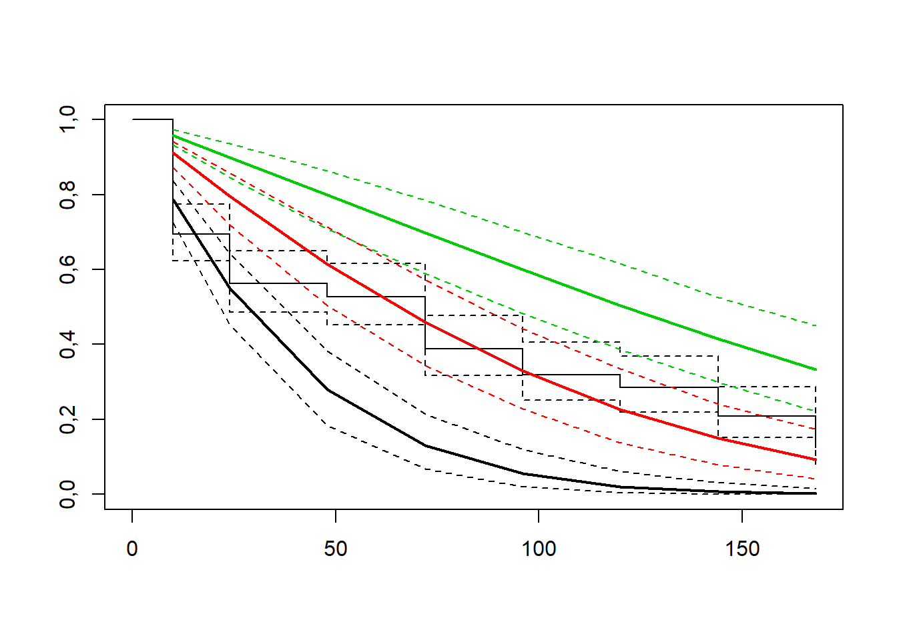

****

## Gamma

****


```r
library(flexsurv)
KM10=flexsurvreg(Surv(tempo,status)~trat,dist="gamma")
summary(KM10)
```

```
## trat=T1 
##   time         est         lcl        ucl
## 1   10 0,790201487 0,709966646 0,85893415
## 2   24 0,537681788 0,434485641 0,64090258
## 3   48 0,267748022 0,172239912 0,37202618
## 4   72 0,130741530 0,065957005 0,21430824
## 5   96 0,063206831 0,024350634 0,12675243
## 6  120 0,030369861 0,008911952 0,07330668
## 7  144 0,014531118 0,003182211 0,04299919
## 8  168 0,006931519 0,001137989 0,02521377
## 
## trat=T2 
##   time       est        lcl       ucl
## 1   10 0,9055576 0,85200723 0,9461820
## 2   24 0,7671054 0,68178306 0,8412064
## 3   48 0,5650288 0,45411312 0,6655914
## 4   72 0,4110387 0,29761085 0,5187758
## 5   96 0,2969771 0,18997017 0,4056439
## 6  120 0,2136179 0,12050687 0,3139151
## 7  144 0,1531754 0,07772390 0,2457060
## 8  168 0,1095770 0,04880704 0,1905611
## 
## trat=T3 
##   time       est       lcl       ucl
## 1   10 0,9552715 0,9259418 0,9769590
## 2   24 0,8838874 0,8296134 0,9278691
## 3   48 0,7645536 0,6811250 0,8348968
## 4   72 0,6563859 0,5552139 0,7457532
## 5   96 0,5610497 0,4492434 0,6658450
## 6  120 0,4781342 0,3589378 0,5919754
## 7  144 0,4065841 0,2874197 0,5246213
## 8  168 0,3451603 0,2264167 0,4652829
```

```r
plot(KM10,col=c(1,2,3))
```

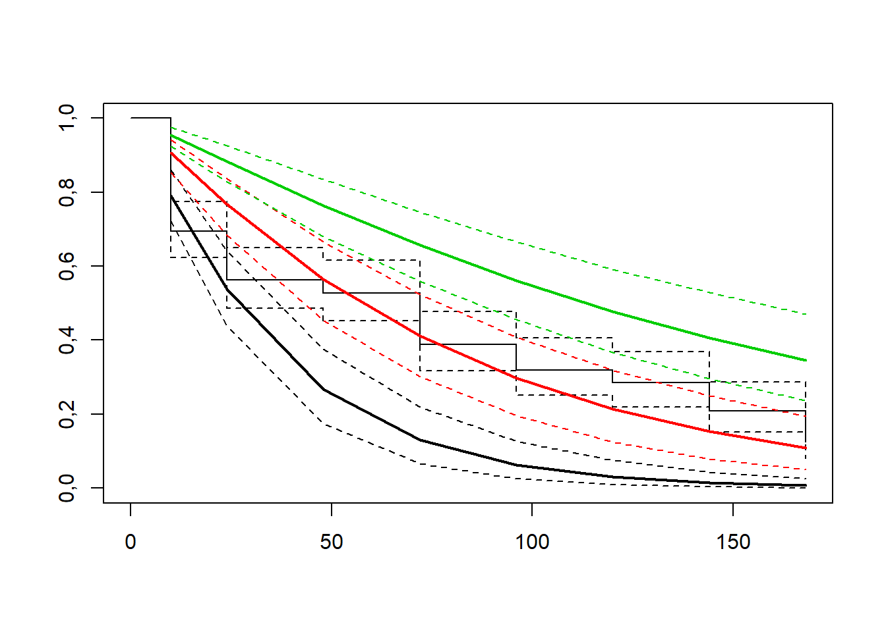

<br><br>

****

## Método semi-paramétrico de Cox

****

Serve para um modelo de regressão de riscos proporcionais de Cox. Variáveis dependentes do tempo, estratos dependentes do tempo, vários eventos por assunto e outras extensões são incorporadas usando a formulação do processo de contagem de Andersen e Gill.

**Reference**: Andersen, P. and Gill, R. (1982). Cox's regression model for counting processes, a large sample study. Annals of Statistics 10, 1100-1120.

### Sem considerar tratamentos


```r
KM <- coxph(Surv(tempo,status) ~ 1)
summary(KM)
```

```
## Call:  coxph(formula = Surv(tempo, status) ~ 1)
## 
## Null model
##   log likelihood= -538,6621 
##   n= 144
```

### Considerando tratamentos


```r
KM8 <- coxph(Surv(tempo,status) ~ strata(trat),data=dados)
summary(KM8)
```

```
## Call:  coxph(formula = Surv(tempo, status) ~ strata(trat), data = dados)
## 
## Null model
##   log likelihood= -394,6821 
##   n= 144
```

```r
library(ggfortify)
autoplot(survfit(KM8),conf.int = F)+theme_classic()
```

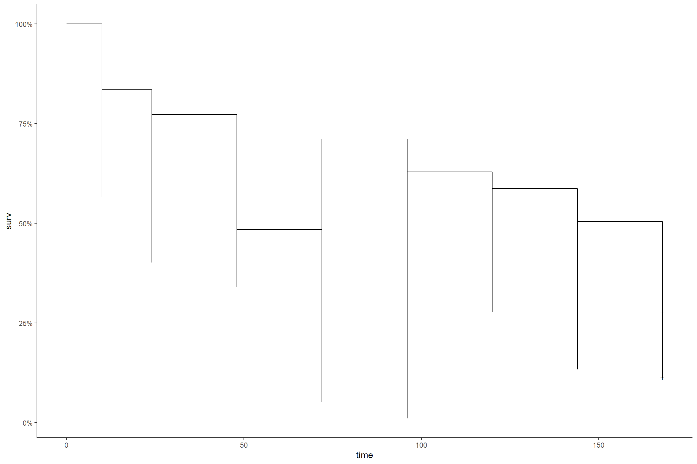

<br><br>

****

## Modelo de riscos proporcionais de COX

****

<br><br>

Mostra as taxas de risco (HR) derivadas do modelo para todas as covariáveis incluídas na fórmula coxph. Resumidamente, uma FC> 1 indica um risco aumentado de morte (de acordo com a definição de h(t)) se uma condição específica for atendida por um paciente. Uma FC <1, por outro lado, indica uma diminuição do risco.

<br><br>

### Considerando trat


```r
library(forestmodel)
colnames(dados)=c("Treatments","tempo","status")
fit.coxph <- coxph(Surv(tempo, status) ~ Treatments, data = dados)
#ggforest(fit.coxph, data = dados)
print(forest_model(fit.coxph, limits=log( c(0.05, 5))))
```


## Critério de inferência de Akaike


```r
library(car)
AIC(KM2) # exponencial
```

```
## [1] 1334,477
```

```r
AIC(KM3) # normal
```

```
## [1] 1433,069
```

```r
AIC(KM4) # logistico
```

```
## [1] 1436,639
```

```r
AIC(KM5) # lognormal
```

```
## [1] 1338,744
```

```r
AIC(KM6) # loglogistic
```

```
## [1] 1346,328
```

```r
AIC(KM7) # weibull
```

```
## [1] 1334,844
```

```r
AIC(KM8) # coxph
```

```
## [1] 789,3642
```

```r
AIC(KM9) # Gompertz
```

```
## [1] 1331,275
```

## Resíduo


```r
residuo2 <- residuals(KM2, type = "deviance")
g2=ggplot(data = dados, mapping = aes(x = tempo, y = residuo2)) +
    geom_point() + labs(title="Exponential")+
    geom_smooth() +
    theme_bw() + theme(legend.key = element_blank())
residuo3 <- residuals(KM3, type = "deviance")
g3=ggplot(data = dados, mapping = aes(x = tempo, y = residuo3)) +
    geom_point() + labs(title="Normal")+
    geom_smooth() +
    theme_bw() + theme(legend.key = element_blank())
residuo4 <- residuals(KM4, type = "deviance")
g4=ggplot(data = dados, mapping = aes(x = tempo, y = residuo4)) +
    geom_point() + labs(title="Logístico")+
    geom_smooth() +
    theme_bw() + theme(legend.key = element_blank())
residuo5 <- residuals(KM5, type = "deviance")
g5=ggplot(data = dados, mapping = aes(x = tempo, y = residuo5)) +
    geom_point() + labs(title="lognormal")+
    geom_smooth() +
    theme_bw() + theme(legend.key = element_blank())
residuo6 <- residuals(KM6, type = "deviance")
g6=ggplot(data = dados, mapping = aes(x = tempo, y = residuo6)) +
    geom_point() + labs(title="loglogistico")+
    geom_smooth() +
    theme_bw() + theme(legend.key = element_blank())
residuo7 <- residuals(KM7, type = "deviance")
g7=ggplot(data = dados, mapping = aes(x = tempo, y = residuo7)) +
    geom_point() + labs(title="weibull")+
    geom_smooth() +
    theme_bw() + theme(legend.key = element_blank())
residuo8 <- residuals(KM8, type = "deviance")
g8=ggplot(data = dados, mapping = aes(x = tempo, y = residuo8)) +
    geom_point() + labs(title="coxph")+
    geom_smooth() +
    theme_bw() + theme(legend.key = element_blank())
library(gridExtra)
grid.arrange(g2,g3,g4,g5,g6,g7,g8,ncol=4)
```


<br><br><br><br><br><br>

# Modelo linear generalizado

## Conjunto de dados

Considera um conjunto de dados simulados de germinação com oito repetições e quatro tratamento qualitativos. Conforme a regra de análise de sementes, em um teste de germinação é estabelecido a quantidade mínima de 50 sementes por rolo de papel. Logo, sabemos que a quantidade máxima de cada repetição e de 50 sementes.


```r
trat=rep(paste("T",1:4),e=8)
germ=c(33,35,34,30,38,30,37,30,36,38,34,38,38,38,35,35,30,15,31,17,25,24,24,18,27,20,28,35,30,30,30,29)
```

## Modelo linear generalizado

No R, podemos realizar a entrada dos dados de duas formas. Pela proporção ou por dados dicotomizados (Respostas do tipo 0 ou 1).

Nosso exemplo usaremos pela proporção.


```r
modelo=glm(cbind(germ,50-germ)~trat, family=binomial)
```

**Explicação**: `germ` é nossa resposta, ou seja, total de sementes germinadas (ou podemos chamar de total de sucessos na repetição). O valor `50` indica o total de observações na repetição (Deve ser conhecido). `trat` é nossa variável explicativa qualitativa, `binomial` é a distrbuição provável que estamos considerando.

## Análise de deviance


```r
summary(modelo)
```

```
## 
## Call:
## glm(formula = cbind(germ, 50 - germ) ~ trat, family = binomial)
## 
## Deviance Residuals: 
##     Min       1Q   Median       3Q      Max  
## -2,4488  -0,5500   0,2359   0,4838   2,2701  
## 
## Coefficients:
##             Estimate Std. Error z value Pr(>|z|)    
## (Intercept)   0,6969     0,1061   6,566 5,16e-11 ***
## tratT 2       0,2977     0,1548   1,924  0,05437 .  
## tratT 3      -0,8572     0,1460  -5,870 4,36e-09 ***
## tratT 4      -0,4048     0,1466  -2,762  0,00574 ** 
## ---
## Signif. codes:  0 '***' 0,001 '**' 0,01 '*' 0,05 '.' 0,1 ' ' 1
## 
## (Dispersion parameter for binomial family taken to be 1)
## 
##     Null deviance: 108,818  on 31  degrees of freedom
## Residual deviance:  38,676  on 28  degrees of freedom
## AIC: 182,75
## 
## Number of Fisher Scoring iterations: 3
```

```r
anova(modelo, test="Chisq")
```

```
## Analysis of Deviance Table
## 
## Model: binomial, link: logit
## 
## Response: cbind(germ, 50 - germ)
## 
## Terms added sequentially (first to last)
## 
## 
##      Df Deviance Resid. Df Resid. Dev  Pr(>Chi)    
## NULL                    31    108,818              
## trat  3   70,142        28     38,676 3,979e-15 ***
## ---
## Signif. codes:  0 '***' 0,001 '**' 0,01 '*' 0,05 '.' 0,1 ' ' 1
```

## Diagnóstico


```r
par(mfrow=c(2,2))
plot(modelo)
```

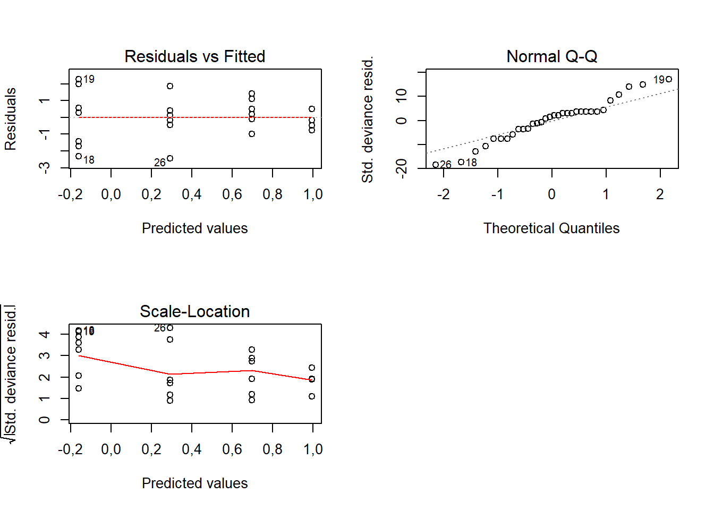

## Halfnormaplot


```r
hnp::hnp(modelo, print.on=T)
```

```
## Binomial model
```

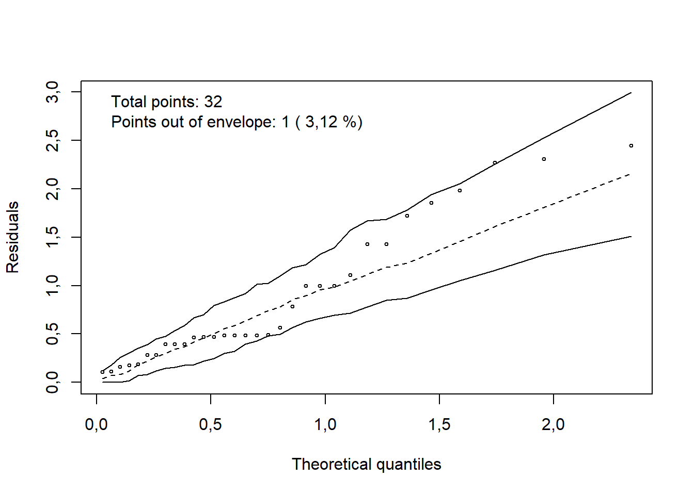

## Constrastes


```r
library(emmeans)
media=emmeans(modelo,~trat)
```

## Retornando a função logistica


```r
medfin=regrid(media)
library(multcompView)
library(multcomp)
cld(medfin, alpha=0.05, Letters=letters, decreasing=FALSE, adjust="tukey")
```

```
##  trat  prob     SE  df asymp.LCL asymp.UCL .group
##  T 3  0,460 0,0249 Inf     0,398     0,522  a    
##  T 4  0,573 0,0247 Inf     0,511     0,634   b   
##  T 1  0,667 0,0236 Inf     0,609     0,726    c  
##  T 2  0,730 0,0222 Inf     0,675     0,785    c  
## 
## Confidence level used: 0,95 
## Conf-level adjustment: sidak method for 4 estimates 
## P value adjustment: tukey method for comparing a family of 4 estimates 
## significance level used: alpha = 0,05
```

## Supondo que não sabemos o total de cada repetição

Nesse caso, vamos optar pela distribuição poisson


```r
modelo=glm(germ~trat, family=poisson)
```

## Análise de deviance


```r
summary(modelo)
```

```
## 
## Call:
## glm(formula = germ ~ trat, family = poisson)
## 
## Deviance Residuals: 
##     Min       1Q   Median       3Q      Max  
## -1,7823  -0,3347   0,1574   0,2550   1,5832  
## 
## Coefficients:
##             Estimate Std. Error z value Pr(>|z|)    
## (Intercept)  3,50781    0,06120  57,318  < 2e-16 ***
## tratT 2      0,08951    0,08468   1,057 0,290496    
## tratT 3     -0,37231    0,09581  -3,886 0,000102 ***
## tratT 4     -0,15353    0,09007  -1,705 0,088274 .  
## ---
## Signif. codes:  0 '***' 0,001 '**' 0,01 '*' 0,05 '.' 0,1 ' ' 1
## 
## (Dispersion parameter for poisson family taken to be 1)
## 
##     Null deviance: 46,061  on 31  degrees of freedom
## Residual deviance: 18,017  on 28  degrees of freedom
## AIC: 193,41
## 
## Number of Fisher Scoring iterations: 4
```

```r
anova(modelo, test="Chisq")
```

```
## Analysis of Deviance Table
## 
## Model: poisson, link: log
## 
## Response: germ
## 
## Terms added sequentially (first to last)
## 
## 
##      Df Deviance Resid. Df Resid. Dev  Pr(>Chi)    
## NULL                    31     46,061              
## trat  3   28,045        28     18,017 3,555e-06 ***
## ---
## Signif. codes:  0 '***' 0,001 '**' 0,01 '*' 0,05 '.' 0,1 ' ' 1
```

## Diagnóstico


```r
par(mfrow=c(2,2))
plot(modelo)
```


## Halfnormaplot


```r
hnp::hnp(modelo, print.on=T)
```

```
## Poisson model
```

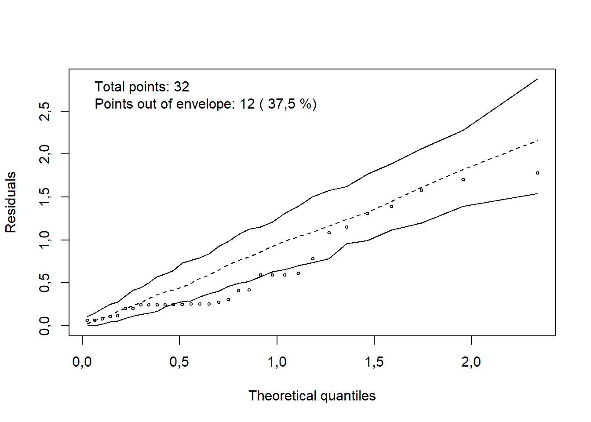

## Constrastes


```r
library(emmeans)
media=emmeans(modelo,~trat)
```

## Retornando a função logistica


```r
medfin=regrid(media)
library(multcompView)
library(multcomp)
cld(medfin, alpha=0.05, Letters=letters, decreasing=FALSE, adjust="tukey")
```

```
##  trat rate   SE  df asymp.LCL asymp.UCL .group
##  T 3  23,0 1,70 Inf      18,8      27,2  a    
##  T 4  28,6 1,89 Inf      23,9      33,3  ab   
##  T 1  33,4 2,04 Inf      28,3      38,5   bc  
##  T 2  36,5 2,14 Inf      31,2      41,8    c  
## 
## Confidence level used: 0,95 
## Conf-level adjustment: sidak method for 4 estimates 
## P value adjustment: tukey method for comparing a family of 4 estimates 
## significance level used: alpha = 0,05
```

## Analisando sobredispersão


```r
library(AER)
dispersiontest(modelo, trafo=1) 
```

```
## 
## 	Overdispersion test
## 
## data:  modelo
## z = -2,8129, p-value = 0,9975
## alternative hypothesis: true alpha is greater than 0
## sample estimates:
##      alpha 
## -0,4488216
```

```r
## se for menor que 0,01 há sbredispersão, nesse caso usar quasipoisson
```

Caso fosse menor que 0,01 ou 0,05, podemos testar a distribuição quasipoisson. 
Vamos treinar, ainda que não seja necessário.


```r
modelo=glm(germ~trat, family=quasipoisson)
```

## Análise de deviance


```r
summary(modelo)
```

```
## 
## Call:
## glm(formula = germ ~ trat, family = quasipoisson)
## 
## Deviance Residuals: 
##     Min       1Q   Median       3Q      Max  
## -1,7823  -0,3347   0,1574   0,2550   1,5832  
## 
## Coefficients:
##             Estimate Std. Error t value Pr(>|t|)    
## (Intercept)  3,50781    0,04857  72,219  < 2e-16 ***
## tratT 2      0,08951    0,06720   1,332   0,1937    
## tratT 3     -0,37231    0,07604  -4,896 3,69e-05 ***
## tratT 4     -0,15353    0,07148  -2,148   0,0405 *  
## ---
## Signif. codes:  0 '***' 0,001 '**' 0,01 '*' 0,05 '.' 0,1 ' ' 1
## 
## (Dispersion parameter for quasipoisson family taken to be 0,6299182)
## 
##     Null deviance: 46,061  on 31  degrees of freedom
## Residual deviance: 18,017  on 28  degrees of freedom
## AIC: NA
## 
## Number of Fisher Scoring iterations: 4
```

```r
anova(modelo, test="Chisq")
```

```
## Analysis of Deviance Table
## 
## Model: quasipoisson, link: log
## 
## Response: germ
## 
## Terms added sequentially (first to last)
## 
## 
##      Df Deviance Resid. Df Resid. Dev Pr(>Chi)    
## NULL                    31     46,061             
## trat  3   28,045        28     18,017 1,17e-09 ***
## ---
## Signif. codes:  0 '***' 0,001 '**' 0,01 '*' 0,05 '.' 0,1 ' ' 1
```

## Diagnóstico


```r
par(mfrow=c(2,2))
plot(modelo)
```


## Halfnormaplot


```r
hnp::hnp(modelo, print.on=T)
```

```
## Quasi-Poisson model
```

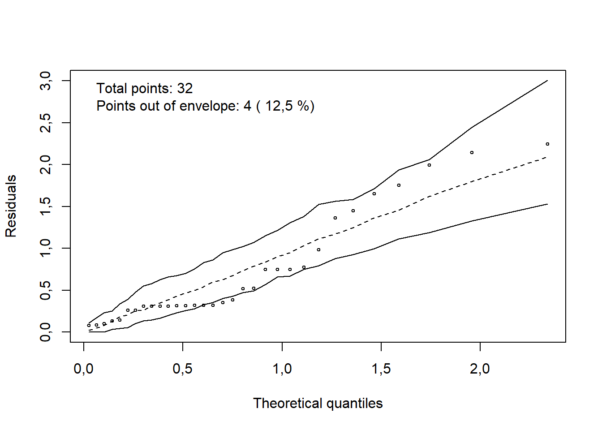

## Constrastes


```r
library(emmeans)
media=emmeans(modelo,~trat)
```

## Retornando a função logistica


```r
medfin=regrid(media)
library(multcompView)
library(multcomp)
cld(medfin, alpha=0.05, Letters=letters, decreasing=FALSE, adjust="tukey")
```

```
##  trat rate   SE  df asymp.LCL asymp.UCL .group
##  T 3  23,0 1,35 Inf      19,6      26,4  a    
##  T 4  28,6 1,50 Inf      24,9      32,4   b   
##  T 1  33,4 1,62 Inf      29,3      37,4   bc  
##  T 2  36,5 1,70 Inf      32,3      40,7    c  
## 
## Confidence level used: 0,95 
## Conf-level adjustment: sidak method for 4 estimates 
## P value adjustment: tukey method for comparing a family of 4 estimates 
## significance level used: alpha = 0,05
```

## Distribuição quasibinomial


```r
quasibin<-glm(cbind(germ,50-germ)~trat, family = quasibinomial)
```

## Análise de deviance


```r
summary(modelo)
```

```
## 
## Call:
## glm(formula = germ ~ trat, family = quasipoisson)
## 
## Deviance Residuals: 
##     Min       1Q   Median       3Q      Max  
## -1,7823  -0,3347   0,1574   0,2550   1,5832  
## 
## Coefficients:
##             Estimate Std. Error t value Pr(>|t|)    
## (Intercept)  3,50781    0,04857  72,219  < 2e-16 ***
## tratT 2      0,08951    0,06720   1,332   0,1937    
## tratT 3     -0,37231    0,07604  -4,896 3,69e-05 ***
## tratT 4     -0,15353    0,07148  -2,148   0,0405 *  
## ---
## Signif. codes:  0 '***' 0,001 '**' 0,01 '*' 0,05 '.' 0,1 ' ' 1
## 
## (Dispersion parameter for quasipoisson family taken to be 0,6299182)
## 
##     Null deviance: 46,061  on 31  degrees of freedom
## Residual deviance: 18,017  on 28  degrees of freedom
## AIC: NA
## 
## Number of Fisher Scoring iterations: 4
```

```r
anova(modelo, test="Chisq")
```

```
## Analysis of Deviance Table
## 
## Model: quasipoisson, link: log
## 
## Response: germ
## 
## Terms added sequentially (first to last)
## 
## 
##      Df Deviance Resid. Df Resid. Dev Pr(>Chi)    
## NULL                    31     46,061             
## trat  3   28,045        28     18,017 1,17e-09 ***
## ---
## Signif. codes:  0 '***' 0,001 '**' 0,01 '*' 0,05 '.' 0,1 ' ' 1
```

## Diagnóstico


```r
par(mfrow=c(2,2))
plot(modelo)
```


## Halfnormaplot


```r
hnp::hnp(modelo, print.on=T)
```

```
## Quasi-Poisson model
```

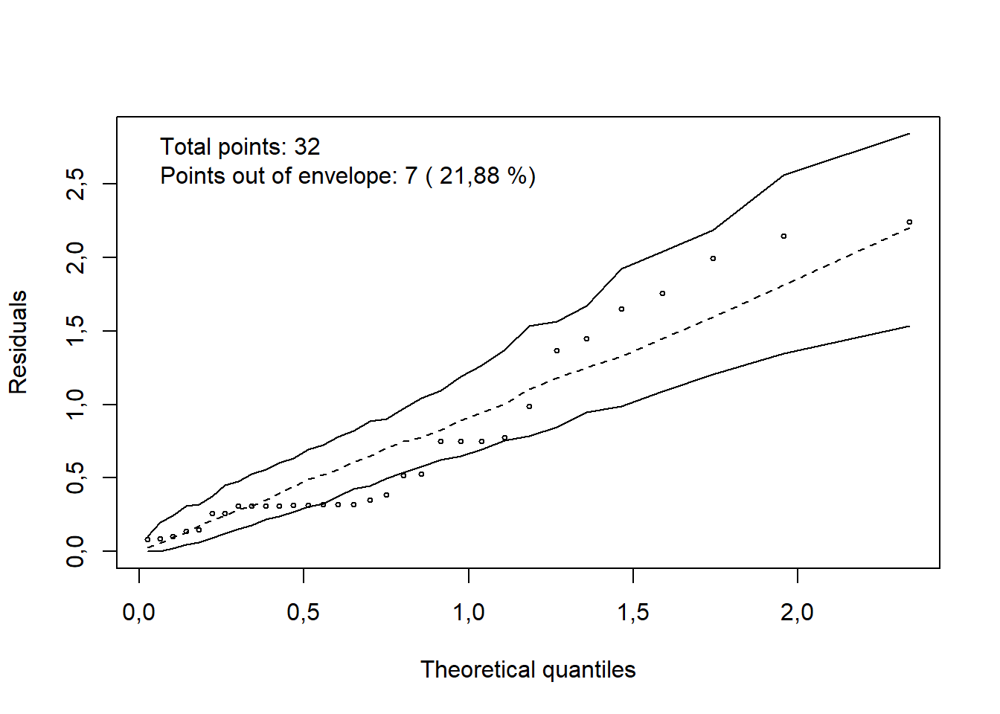

## Constrastes


```r
library(emmeans)
media=emmeans(modelo,~trat)
summary(pairs(media), type = "response")
```

```
##  contrast  ratio     SE  df z.ratio p.value
##  T 1 / T 2 0,914 0,0615 Inf -1,332  0,5425 
##  T 1 / T 3 1,451 0,1103 Inf  4,896  0,0000 
##  T 1 / T 4 1,166 0,0833 Inf  2,148  0,1382 
##  T 2 / T 3 1,587 0,1186 Inf  6,182  0,0000 
##  T 2 / T 4 1,275 0,0893 Inf  3,469  0,0029 
##  T 3 / T 4 0,803 0,0631 Inf -2,784  0,0275 
## 
## P value adjustment: tukey method for comparing a family of 4 estimates 
## Tests are performed on the log scale
```

## Retornando a função logistica


```r
medfin=regrid(media)
library(multcompView)
library(multcomp)
cld(medfin, alpha=0.05, Letters=letters, decreasing=FALSE, adjust="tukey")
```

```
##  trat rate   SE  df asymp.LCL asymp.UCL .group
##  T 3  23,0 1,35 Inf      19,6      26,4  a    
##  T 4  28,6 1,50 Inf      24,9      32,4   b   
##  T 1  33,4 1,62 Inf      29,3      37,4   bc  
##  T 2  36,5 1,70 Inf      32,3      40,7    c  
## 
## Confidence level used: 0,95 
## Conf-level adjustment: sidak method for 4 estimates 
## P value adjustment: tukey method for comparing a family of 4 estimates 
## significance level used: alpha = 0,05
```

## Fatorial qualitativo e quantitativo

Supondo um outro exemplo de um experimento em esquema fatorial 2 x 5, em que o primeiro fator e qualitativo e o segundo fator quantitativo com 5 doses (2, 4, 6, 8, 10) e três repetições cada. Total de semenetes e conhecido e o valor e 30.


```r
resp=c(0,0,0,3,3,2,6,6,5,17,18,14,25,26,23,
       0,1,0,1,1,2,15,14,15,15,16,16,20,20,19)
f1=rep(c("T1","T2"),e=15) ## fator qualitativo
d=rep(c(2,4,6,8,10),e=3,2) ## dose como numerico
D=factor(d) ## considerando dose como fator
```

## Modelo

Vamos considerar os dois fatores como qualitativos


```r
bin=glm(cbind(resp,30-resp)~f1*D, family = binomial)
```

## Deviance


```r
summary(bin)
```

```
## 
## Call:
## glm(formula = cbind(resp, 30 - resp) ~ f1 * D, family = binomial)
## 
## Deviance Residuals: 
##     Min       1Q   Median       3Q      Max  
## -0,8532  -0,2951   0,1217   0,1590   0,9375  
## 
## Coefficients:
##             Estimate Std. Error z value Pr(>|z|)
## (Intercept)   -23,14    6757,51  -0,003    0,997
## f1T2           18,65    6757,51   0,003    0,998
## D4             20,81    6757,51   0,003    0,998
## D6             21,68    6757,51   0,003    0,997
## D8             23,31    6757,51   0,003    0,997
## D10            24,67    6757,51   0,004    0,997
## f1T2:D4       -19,39    6757,51  -0,003    0,998
## f1T2:D6       -17,24    6757,51  -0,003    0,998
## f1T2:D8       -18,74    6757,51  -0,003    0,998
## f1T2:D10      -19,54    6757,51  -0,003    0,998
## 
## (Dispersion parameter for binomial family taken to be 1)
## 
##     Null deviance: 397,0255  on 29  degrees of freedom
## Residual deviance:   5,6398  on 20  degrees of freedom
## AIC: 108,6
## 
## Number of Fisher Scoring iterations: 19
```

```r
anova(bin, test="Chisq")
```

```
## Analysis of Deviance Table
## 
## Model: binomial, link: logit
## 
## Response: cbind(resp, 30 - resp)
## 
## Terms added sequentially (first to last)
## 
## 
##      Df Deviance Resid. Df Resid. Dev  Pr(>Chi)    
## NULL                    29     397,03              
## f1    1     0,24        28     396,78    0,6215    
## D     4   363,46        24      33,33 < 2,2e-16 ***
## f1:D  4    27,69        20       5,64 1,443e-05 ***
## ---
## Signif. codes:  0 '***' 0,001 '**' 0,01 '*' 0,05 '.' 0,1 ' ' 1
```

```r
referencia <- ref_grid(bin)
referencia ## Aqui deve aparecer os niveis dos fatores, se dose so aparecer 1, está errado
```

```
## 'emmGrid' object with variables:
##     f1 = T1, T2
##     D = 2, 4, 6, 8, 10
## Transformation: "logit"
```

## Teste de comparação 

Se não fosse um fator quantitativo, podemos fazer assim:


```r
media <- emmeans(bin, ~f1|D)
medfin<-regrid(media)
cld(medfin, alpha=0.05, Letters=letters, adjust="tukey")
```

```
## D = 2:
##  f1   prob       SE  df asymp.LCL asymp.UCL .group
##  T1 0,0000 6,00e-07 Inf -1,40e-06  1,40e-06  a    
##  T2 0,0111 1,10e-02 Inf -1,36e-02  3,58e-02  a    
## 
## D = 4:
##  f1   prob       SE  df asymp.LCL asymp.UCL .group
##  T2 0,0444 2,17e-02 Inf -4,14e-03  9,30e-02  a    
##  T1 0,0889 3,00e-02 Inf  2,18e-02  1,56e-01  a    
## 
## D = 6:
##  f1   prob       SE  df asymp.LCL asymp.UCL .group
##  T1 0,1889 4,13e-02 Inf  9,66e-02  2,81e-01  a    
##  T2 0,4889 5,27e-02 Inf  3,71e-01  6,07e-01   b   
## 
## D = 8:
##  f1   prob       SE  df asymp.LCL asymp.UCL .group
##  T2 0,5222 5,27e-02 Inf  4,04e-01  6,40e-01  a    
##  T1 0,5444 5,25e-02 Inf  4,27e-01  6,62e-01  a    
## 
## D = 10:
##  f1   prob       SE  df asymp.LCL asymp.UCL .group
##  T2 0,6556 5,01e-02 Inf  5,44e-01  7,68e-01  a    
##  T1 0,8222 4,03e-02 Inf  7,32e-01  9,12e-01   b   
## 
## Confidence level used: 0,95 
## Conf-level adjustment: sidak method for 2 estimates 
## significance level used: alpha = 0,05
```

```r
media <- emmeans(bin, ~D|f1)
medfin<-regrid(media)
cld(medfin, alpha=0.05, Letters=letters, adjust="tukey")
```

```
## f1 = T1:
##  D    prob       SE  df asymp.LCL asymp.UCL .group
##  2  0,0000 6,00e-07 Inf -1,60e-06  1,60e-06  a    
##  4  0,0889 3,00e-02 Inf  1,18e-02  1,66e-01   b   
##  6  0,1889 4,13e-02 Inf  8,29e-02  2,95e-01   b   
##  8  0,5444 5,25e-02 Inf  4,10e-01  6,79e-01    c  
##  10 0,8222 4,03e-02 Inf  7,19e-01  9,26e-01     d 
## 
## f1 = T2:
##  D    prob       SE  df asymp.LCL asymp.UCL .group
##  2  0,0111 1,10e-02 Inf -1,73e-02  3,95e-02  a    
##  4  0,0444 2,17e-02 Inf -1,14e-02  1,00e-01  a    
##  6  0,4889 5,27e-02 Inf  3,54e-01  6,24e-01   b   
##  8  0,5222 5,27e-02 Inf  3,87e-01  6,57e-01   b   
##  10 0,6556 5,01e-02 Inf  5,27e-01  7,84e-01   b   
## 
## Confidence level used: 0,95 
## Conf-level adjustment: sidak method for 5 estimates 
## P value adjustment: tukey method for comparing a family of 5 estimates 
## significance level used: alpha = 0,05
```

## Regressão

Como há interação entre os fatores, necessitamos construir duas curvas, vejamos: 

## Dividindo o conjunto de dados


```r
resp1=resp[1:15]  ## resposta de T1, nesse caso as observações de T1 estão na posição de  1 a 15
resp2=resp[16:30] ## resposta de T2, nesse caso as observações de T2 estão na posição de  16 a 30
d=d[1:15] ## cortando dose, nesse caso somente uma vez é necessário
```

## modelo para T1


```r
bin1=glm(cbind(resp1,30-resp1)~d, family = binomial)
summary(bin1)
```

```
## 
## Call:
## glm(formula = cbind(resp1, 30 - resp1) ~ d, family = binomial)
## 
## Deviance Residuals: 
##     Min       1Q   Median       3Q      Max  
## -0,9384  -0,7855  -0,1458   0,4803   0,8687  
## 
## Coefficients:
##             Estimate Std. Error z value Pr(>|z|)    
## (Intercept) -5,66100    0,51900  -10,91   <2e-16 ***
## d            0,72347    0,06751   10,72   <2e-16 ***
## ---
## Signif. codes:  0 '***' 0,001 '**' 0,01 '*' 0,05 '.' 0,1 ' ' 1
## 
## (Dispersion parameter for binomial family taken to be 1)
## 
##     Null deviance: 223,1818  on 14  degrees of freedom
## Residual deviance:   6,8923  on 13  degrees of freedom
## AIC: 50,895
## 
## Number of Fisher Scoring iterations: 4
```

## modelo para T2


```r
bin2=glm(cbind(resp2,30-resp2)~d, family = binomial)
summary(bin2)
```

```
## 
## Call:
## glm(formula = cbind(resp2, 30 - resp2) ~ d, family = binomial)
## 
## Deviance Residuals: 
##     Min       1Q   Median       3Q      Max  
## -1,8205  -1,5467  -0,9111   0,1884   2,4892  
## 
## Coefficients:
##             Estimate Std. Error z value Pr(>|z|)    
## (Intercept) -3,89248    0,37250 -10,449   <2e-16 ***
## d            0,49464    0,05016   9,862   <2e-16 ***
## ---
## Signif. codes:  0 '***' 0,001 '**' 0,01 '*' 0,05 '.' 0,1 ' ' 1
## 
## (Dispersion parameter for binomial family taken to be 1)
## 
##     Null deviance: 173,600  on 14  degrees of freedom
## Residual deviance:  34,827  on 13  degrees of freedom
## AIC: 81,781
## 
## Number of Fisher Scoring iterations: 5
```

## Gráfico

### Calculando vetores


```r
med1=tapply(resp1/30, d, mean)
med2=tapply(resp2/30, d, mean)
DOSE=c(2,4,6,8,10)
```

### Gráfico final


```r
plot(med1~DOSE,xlab="Dose(mg/L)",ylab="Probabilidade")
points(med2~DOSE,pch=16,col="darkblue")
curve(predict(bin1,data.frame(d=x),type="resp"),add=TRUE) ## curva de T1
##points(d,fitted(bin1),pch=20) 
curve(predict(bin2,data.frame(d=x),type="resp"),add=TRUE, lty=2,col="darkblue") ## Curva de T2
```


<!--chapter:end:livroagro.Rmd-->

