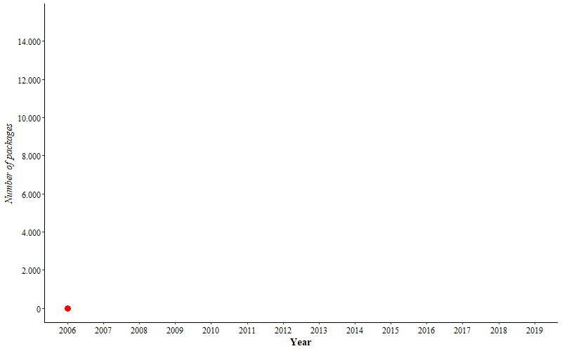
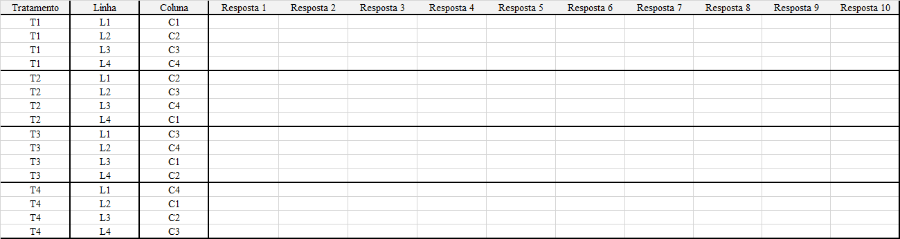
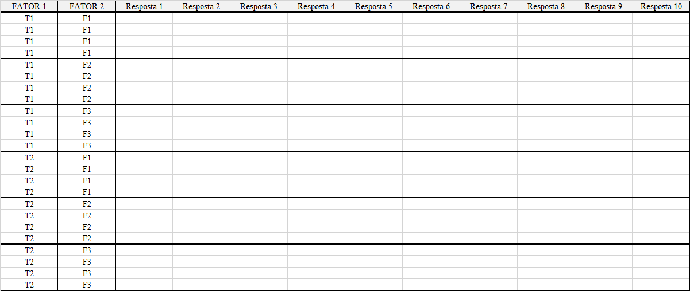
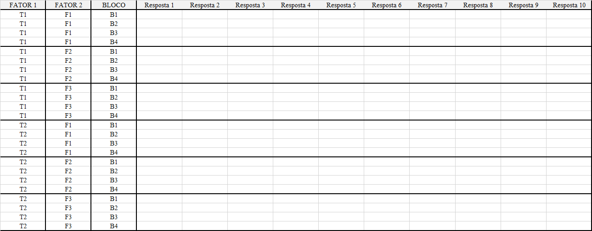
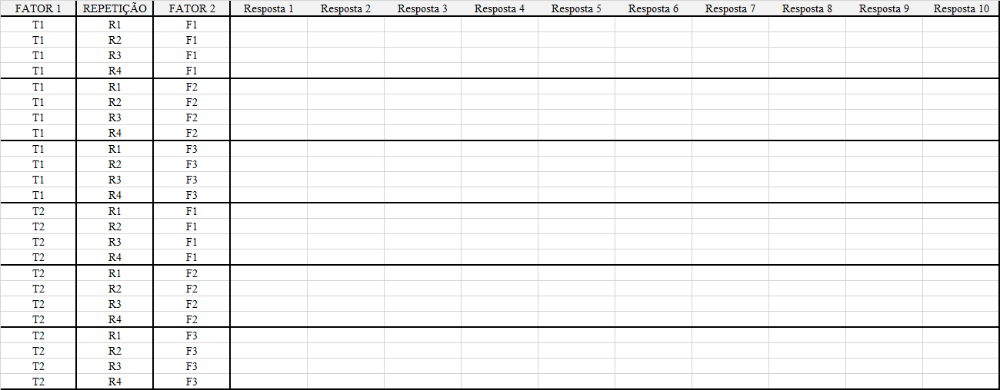
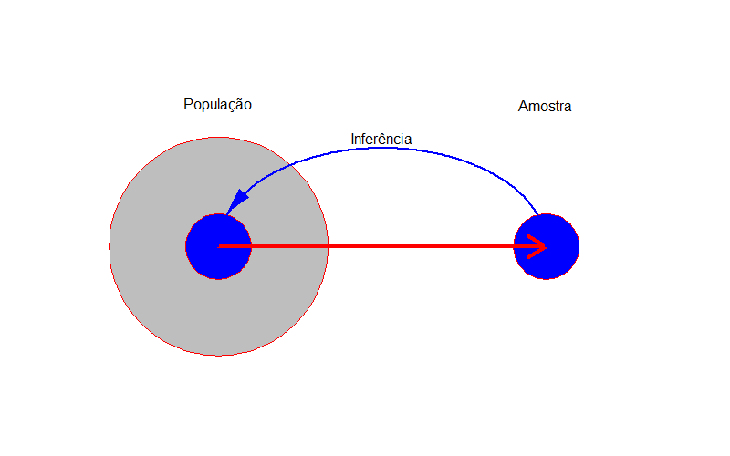
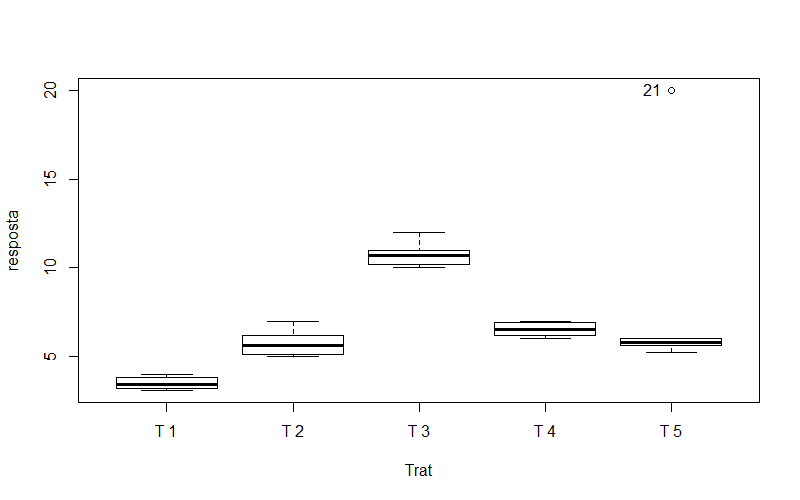
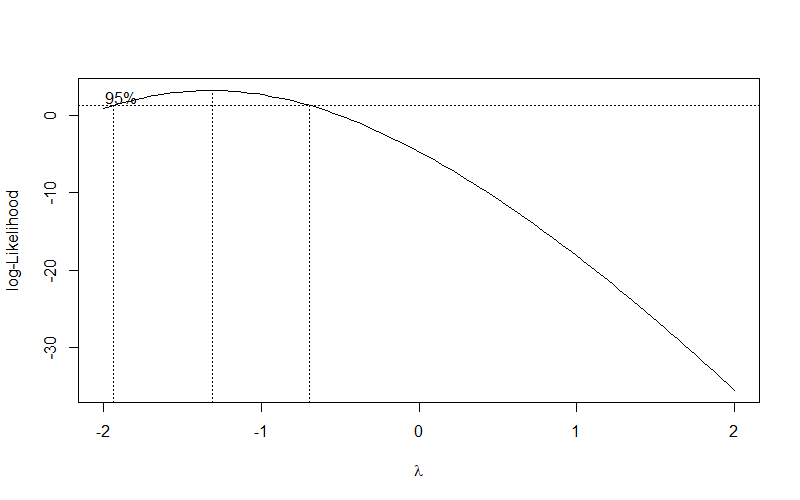
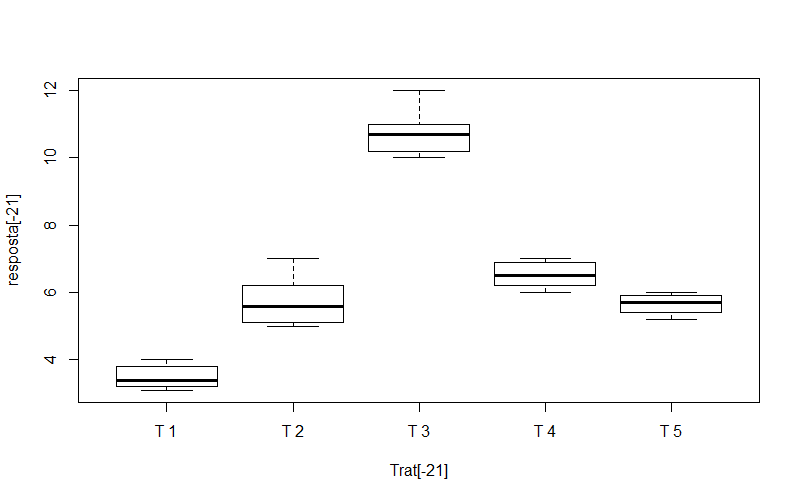
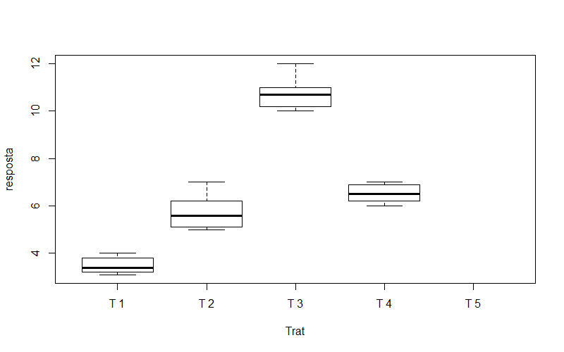

--- 
title: "Aplicações práticas do software R para Agronomia"
author: "Gabriel Danilo Shimizu"
date: "`r Sys.Date()`"
site: bookdown::bookdown_site
documentclass: book
bibliography: [book.bib, packages.bib]
biblio-style: apalike
link-citations: yes
description: "Este é um livro virtual desenvolvido com a finalidade de fornecer tutoriais práticos das principais análises estatísticas e apresentação de dados utilizando o software R"
---

```{r setup, include=FALSE}
knitr::opts_chunk$set(echo = TRUE, message = FALSE, warning = FALSE)
library(knitr)
options(OutDec = ".", knitr.kable.NA="")
```

# Apresentação

Este livro virtual partiu de uma idéia de ajudar os profissionais da agronomia, em especial a área acadêmica, fornecendo tutoriais práticos das principais análises estatísticas e apresentação de dados utilizando o software R. Esse projeto não é vinculado diretamente a nenhuma instituição, e tampouco custeada financeiramente, ela é unicamente desenvolvida por iniciativa própria.

O R é uma linguagem de programação muito utilizada na âmbito da estatística e na ciência de dados. Na Agronomia, o conhecimento sobre essa linguagem é um diferencial, sobretudo na carreira acadêmica, pois sua limitação gráfica e de análises é praticamente inexistente. 

Dúvidas, sugestões e críticas podem ser encaminhadas ao e-mail: shimizu@uel.br

**Obs.** Em função do tamanho do arquivo, separei em várias "páginas". O acesso para as demais pode ser encontrado ao final do sumário

<br><br>


# O que é o R

R é um ambiente computacional e uma linguagem de programação especializada em manipulação, análise e visualização gráfica de dados. Na atualidade é considerado o melhor ambiente computacional para essa finalidade. O ambiente está disponível para diferentes sistemas operacionais: Unix/Linux, Mac e Windows.

Foi criado originalmente por Ross Ihaka e por Robert Gentleman no departamento de Estatística da Universidade de Auckland, Nova Zelândia. Posteriormente, foi desenvolvido pelo esforço colaborativo de pessoas em vários locais do mundo.

O nome R provém em parte das iniciais dos criadores (Ross Ihaka e Robert Gentleman) e também de um jogo figurado com a linguagem S (da Bell Laboratories, antiga AT&T).

R é um ambiente e uma linguagem de programação similar ao S, contudo, é uma implementação distinta do S. Muitos códigos escritos para o S podem ser executados inalterados no R e vice-versa.

R é altamente expansível com o uso dos pacotes. Os pacotes são bibliotecas com dados e funções para diferentes áreas do conhecimento relacionado a estatística e áreas afins.

Um conjunto básico de pacotes vem embutido na instalação do R, com muito outros disponíveis na rede de distribuição do R (em inglês CRAN).

A linguagem R é largamente usada entre estatísticos e analistas de dados para desenvolver software de estatística e análise de dados. Pesquisas e levantamentos com profissionais da área mostram que a popularidade do R aumentou substancialmente nos últimos anos.

## Porque utilizar o R?

 - Software gratuito com código aberto com uma linguagem acessível; Expansão exponencial entre pesquisadores, engenheiros e estatísticos;
 - Se reinventa constantemente através de novas aplicações (aproximadamente 14.762 pacotes);
 - Cobertura inigualável, tecnologia de ponta;
 - Totalmente flexível, permitindo desenvolver facilmente funções e pacotes para facilitar o trabalho;
 - Capacidade gráfica;
 - Disponível para diferentes plataformas: Windows, Linux e Mac.

Atualizado em: 04/11/2019 ([CRAN](https://cran.r-project.org/web/packages/))

[Script](https://agronomiar.000webhostapp.com/script.R)

[Dados](https://agronomiar.000webhostapp.com/dados.xlsx)



# Instalação do software R

link para download:

[Software R](https://www.r-project.org/)

[R Studio](https://www.rstudio.com/products/rstudio/download/)

Acessar: https://www.r-project.org/ 
 
Ir em: Download > CRAN

 

Ir em: Universidade Federal do Paraná

 
 
Ir em: Escolher a opção do sistema operacional do computador

  

Ir em: Instalar R pela primeira vez

 

 

[Versões anteriores do R](https://cran.r-project.org/bin/windows/base/old/)

Executar o instalador

## Instalando RStudio

Acessar: https://www.rstudio.com/ 
 
Ir em: Download 


 
Baixar a versão do Rstudio correspondente ao seu sistema operacional


Executar o instalador.

## Primeiros passos

Abra o Rstudio


 
Ambiente Rstudio


 
Source: é seu script (Sempre construir o script aqui, nunca no console)
Console: é a saída
Dados e histórico: é onde está os dados e tudo que foi realizado durante a análise
Plots, files, packages, ajuda: é a saída gráfica, as pastas do diretório atual, os pacotes instalados e a ajuda

## Instalando packages


 


 
Digitar o nome do pacote desejado e depois em “Install”.

 
Toda vez que aparecer o ícone em vermelho, o Rstudio está trabalhando, dessa forma, não executar mais nada até o ícone desaparecer.
 
 

## Chamando pacote no Rstudio

Função: 

`library(nome do pacote)`
`require(nome do pacote)`

nome do pacote::

Ex. library(readxl); require(readxl); readxl::

# Importação de dados 

## Importação de dados do excel

<center>

[]()

</center>

### Utilizando a package readxl

Existem diversas formas de exportar arquivos para o R. Uma das mais utilizadas é a importação de um arquivo em excel.

O excel pode possuir dois tipos de extensão, **.xls** ou **.xlsx**, sendo as versões anteriores e superiores ao office 2010, respectivamente. 

Uma das packages mais utilizadas para exportar os dados de um arquivo em excel é chamado de **"readxl"**. 

Para importar por esse pacote, devemos seguir os passos a seguir:

### Especificar o diretório onde fica o arquivo em excel.

Uma das formas de especificar o diretório buscando a pasta manualmente, como na Figura 1 (copiar e colar no Source do Rstudio). 

<center>


</center>

A seguir, é necessário trocar as barras de \ para / ou adicionar mais uma \\ (\\ para \\) e colocar dentro do comando setwd e o diretório entre aspas.

Obs. O diretório abaixo é do **meu computador**!!!

```{r, eval=F}
setwd("C:\\Users\\Gabriel Shimizu\\Dropbox\\ProjetoExperimental\\Análise Descritiva")

## ou

setwd("C:/Users/Gabriel Shimizu/Dropbox/ProjetoExperimental/Análise Descritiva")
```

Obs. **Sempre que for alterar a local da pasta, devemos alterar a localização do diretório!!!**

### Opção 2 para especificar diretório

Atalho: ctrl+shift+h

Este comando irá buscar as **pastas** (não irá aparecer nenhum arquivo a menos que seja uma pasta). Buscar a pasta que contém o arquivo (Deverá saber onde fica, pois por esse método, o arquivo em extensão excel não irá aparecer, uma vez que o excel não é uma pasta)

Após encontrar, clicar em **"open"**. No console do R irá aparecer **setwd(localização)**, esta é a localização. Recomendo copiar e colar no **Source** do Rstudio

### Conferir se o arquivo está no diretório especificado

```{r, eval=F}
dir()
```

### Ativando a package e importando o arquivo

Antes de ativar o pacote, deve-se instalar o mesmo (Ver guia de instalação - [Instalação](https://agronomiar.000webhostapp.com/manual_instalacao.pdf))

```{r, eval=F}
library(readxl)
dados=read_excel("DIC.xlsx", sheet=1)
```

O argumento sheet=1, está se referindo a planilha 1 do arquivo em excel (podemos exportar de outras planilhas)

**Obs. No caso de extensão ".xls", não esquecer de mudar!!!**

### Ajuda

```{r, eval=F}
?readxl
```

[Conjunto de dados](https://agronomiar.000webhostapp.com/DIC.xlsx)

## Importação de dados em csv

Existem diversas formas de exportar arquivos para o R. Uma das mais utilizadas é a importação de um arquivo em extensão .csv.

Para importar dados de um arquivo em .csv, podemos usar os comandos read.csv (arquivo separado por vírgula e decimal por ponto) ou read.csv2 (Arquivo separado por ponto e vírgula e decimental por vírgula). 

Para importar dados em extensão .csv, devemos seguir os passos a seguir:

### Especificar o diretório onde fica o arquivo de dados.

Uma das formas de especificar o diretório buscando a pasta manualmente, como na Figura 1 (copiar e colar no Source do Rstudio). 

<center>


</center>

A seguir, é necessário trocar as barras de \ para / ou adicionar mais uma \\ (\\ para \\) e colocar dentro do comando setwd e o diretório entre aspas.

Obs. O diretório abaixo é do **meu computador**!!!

```{r, eval=F}
setwd("C:\\Users\\Gabriel Shimizu\\Dropbox\\SITE\\EXPERIMENTAL")

## ou

setwd("C:/Users/Gabriel Shimizu/Dropbox/SITE/EXPERIMENTAL")
```

Obs. **Sempre que for alterar a local da pasta, devemos alterar a localização do diretório!!!**

### Opção 2 para especificar diretório

Atalho: ctrl+shift+h

Este comando irá buscar as **pastas** (não irá aparecer nenhum arquivo a menos que seja uma pasta). Buscar a pasta que contém o arquivo (Deverá saber onde fica, pois por esse método, o arquivo em extensão excel não irá aparecer, uma vez que o excel não é uma pasta)

Após encontrar, clicar em **"open"**. No console do R irá aparecer **setwd(localização)**, esta é a localização. Recomendo copiar e colar no **Source** do Rstudio

### Conferir se o arquivo está no diretório especificado

```{r, eval=F}
dir()
```

### Importando o arquivo

## Arquivo separado por ponto e vírgula e decimal separado por vírgula

```{r, eval=F}
dados=read.csv2("DIC (CSV ponto e virgula).csv")
dados
```

### Arquivo separado por vírgula e decimal com ponto

```{r, eval=F}
dados=read.csv("DIC (CSV virgula).csv", sep=",")
dados
```


[Dados (Separado por vírgula)](https://agronomiar.000webhostapp.com/DIC (CSV virgula).csv)

[Dados (Separado por ponto e vírgula)](https://agronomiar.000webhostapp.com/DIC (CSV ponto e virgula).csv)

# Tabulação de dados

Apesar da simplicidade em se tabular dados em uma planilha excel, a grande maioria dos acadêmicos tem dificuldade em se efetuar tal tarefa. Isso torna-se ainda pior, quando os mesmos precisam tabular de uma forma específica para um determinado *Software*. Nesse contexto, o presente tutorial tem a finalidade de auxiliar os usuários de R a estruturar a planilha em excel de tal forma a facilitar as análises com ênfase em experimentação agronômica.

****

**O que não colocar em sua planilha!**

<br>

 - Frequentemente é comum que os usuários de excel realizem cálculos de medidas de posição e dispersão, tais como média, variância, desvio-padrão, etc… Entretanto, essas células preenchidas por tais estatísticas de nada contribuem para quem irá trabalhar com o R, muito pelo contrário, acabam gerando mais trabalho, visto que em alguns casos podem ocasionar confundimento no *Software*;

 - Deve-se evitar nomes de colunas muito extensos, pois operacionalmente digitar tais nomes pode gerar complicações futuras;

 - Nome de colunas sempre na primeira linha;

 - Evitar nome dos níveis do fator (Tratamentos) como numérico (1,2,3,4,…), exceto quando os tratamentos são quantitativos;

 - Evitar pular células (Células em branco), a menos que tenha dados faltantes (parcelas perdidas).

<br>

<center>

**Monte a planilha da forma mais simples possível!!!**

</center>

<br>

****

## DIC unifatorial

<br>

Experimentos em delineamento inteiramente casualizado só possuem o tratamento como fator. Dessa forma, em uma planilha, só necessitamos de **uma coluna de tratamentos e uma coluna de resposta**. 

Quando há mais de uma variável resposta, pode-se adicionar as variáveis em cada coluna, lado a lado.

Abaixo, segue um imagem de como montar um arquivo em excel de um experimento em DIC com seis tratamentos e quatro repetições e o link para o download de um arquivo em excel (extensão .xlsx)

<center>

{ width=1000}

</center>

**Download**: [DIC](https://agronomiar.000webhostapp.com/excel_DIC.xlsx)

<br>

****

<br>

## DBC unifatorial

<br>

Experimentos em delineamento em blocos casualizados possuem o tratamento e o bloco como fatores. Dessa forma, em uma planilha necessitamos de **uma coluna de tratamentos, uma coluna do bloco e uma coluna de resposta**. 

Quando há mais de uma variável resposta, pode-se adicionar as variáveis em cada coluna, lado a lado.

Abaixo, segue um imagem de como montar um arquivo em excel de um experimento em DBC com seis tratamentos e quatro blocos e o link para o download de um arquivo em excel (extensão .xlsx)

<center>

{ width=1000}

</center>

**Download**: [DBC](https://agronomiar.000webhostapp.com/excel_DBC.xlsx)

<br>

****

<br>

## DQL

<br>

Experimentos em delineamento em quadrado latino possuem o tratamento, a linha e a coluna como fatores. Dessa forma, em uma planilha necessitamos de **uma coluna de tratamentos, uma da linha, uma da coluna e uma da resposta**. 

Quando há mais de uma variável resposta, pode-se adicionar as variáveis em cada coluna, lado a lado.

Abaixo, segue um imagem de como montar um arquivo em excel de um experimento em DBC com seis tratamentos e quatro blocos e o link para o download de um arquivo em excel (extensão .xlsx)

<center>

{ width=1000}

</center>

**Download**: [DQL](https://agronomiar.000webhostapp.com/excel_DQL.xlsx)

<br>

****

<br>

## Fatorial duplo em DIC

<br>

Experimentos em delineamento inteiramente casualizado em que há mais de um fator estudado, ou seja, possui um fator A e um fator B, necessitam ser tabulados da seguinte forma: **uma coluna do fator A, uma coluna do Fator B e uma coluna de resposta**. 

Quando há mais de uma variável resposta, pode-se adicionar as variáveis em cada coluna, lado a lado.

Quando há mais um fator (três fatores), adicionar uma coluna ao lado do fator 3.

Abaixo, segue um imagem de como montar um arquivo em excel de um experimento em DBC com seis tratamentos e quatro blocos e o link para o download de um arquivo em excel (extensão .xlsx)

<center>

{ width=1000}

</center>

**Download**: [DIC Fatorial](https://agronomiar.000webhostapp.com/excel_fatdic.xlsx)

<br>

****

<br>

## Fatorial Duplo em DBC

<br>

Experimentos em delineamento inteiramente casualizado em que há mais de um fator estudado, ou seja, possui um fator A e um fator B, necessitam ser tabulados da seguinte forma: **uma coluna do fator A, uma coluna do Fator B e uma coluna de resposta**. 

Quando há mais de uma variável resposta, pode-se adicionar as variáveis em cada coluna, lado a lado.

Quando há mais um fator (três fatores), adicionar uma coluna ao lado do fator 3.

Abaixo, segue um imagem de como montar um arquivo em excel de um experimento em esquema fatorial 2 x 3, com dois níveis do fator A e três níveis do fator B, com quatro repetições e o link para o download de um arquivo em excel (extensão .xlsx)

<center>

{ width=1000}

</center>

**Download**: [DBC Fatorial](https://agronomiar.000webhostapp.com/excel_fatdbc.xlsx)

<br>

****

<br>

## Parcela subdividida em DIC

<br>

Experimentos em delineamento inteiramente casualizado em que os tratamentos são posicionados em parcelas e subparcelas, caracterizam o esquema de parcela subdividida e possuem dois fatores estudados, dessa forma, necessitam ser tabulados da seguinte forma: **uma coluna do fator A, uma coluna da repetição, uma coluna do Fator B e uma coluna de resposta**. 

Quando há mais de uma variável resposta, pode-se adicionar as variáveis em cada coluna, lado a lado.

Abaixo, segue um imagem de como montar um arquivo em excel de um experimento em esquema de parcelas subdivididas 2 x 3, com dois níveis da parcela e três níveis da subparcela, com três repetições e o link para o download de um arquivo em excel (extensão .xlsx)

<center>

{ width=1000}

</center>

**Download**: [DIC Parcela subdividida](https://agronomiar.000webhostapp.com/excel_psubdic.xlsx)

<br>

****

<br>

## Parcela subdividida em DBC

<br>

Experimentos em delineamento em blocos casualizados em que os tratamentos são posicionados em parcelas e subparcelas, caracterizam o esquema de parcela subdividida e possuem dois fatores estudados, bem como o bloco, dessa forma, necessitam ser tabulados da seguinte forma: **uma coluna da parcela, uma coluna dos blocos, uma coluna da subparcela e uma coluna de resposta**. 

Quando há mais de uma variável resposta, pode-se adicionar as variáveis em cada coluna, lado a lado.

Abaixo, segue um imagem de como montar um arquivo em excel de um experimento em esquema de parcelas subdivididas 2 x 3, com dois níveis da parcela e três níveis da subparcela, com quatro blocos e o link para o download de um arquivo em excel (extensão .xlsx)

<center>

{ width=1000}

</center>

**Download**: [DBC Parcela subdividida](https://agronomiar.000webhostapp.com/excel_psubdbc.xlsx)

<br>

****

<br>


# Introdução à estatística

<br>

<center>


<h1><span style="color:darkblue"> "Estatística é a Ciência que permite obter conclusões a
partir de dados"</h1></span> (Paul Velleman)

</center>

****

<br>

A Estatística (ou ciência Estatística) é um conjunto de técnicas e métodos de pesquisa que entre outros típicos envolve o planejamento do experimento a ser realizado, a coleta qualificada dos dados, a inferência, o processamento, a análise e a disseminação das informações.

Na estatística trabalhamos com dados, nos quais podem ser obtidos por meio de uma amostra da população em estudo. Como as populações são caracterizadas por medidas numéricas descritivas, denominadas parâmetros, a inferência estatística diz respeito é realização de inferências sobre esses parâmetros populacionais. As inferências podem ser feitas por estimação de parâmetros ou por testes de hipóteses.

<br>

**População**: conjunto de elementos que tem pelo menos uma característica em comum. Esta característica deve delimitar corretamente quais são os elementos da população. A população pode ser classificado como:

  * população ilimitada ou infinita - possui um grande número de elementos que na prática não são possíveis de serem
contados.
  * população limitada ou finita - possui um número determinado de elementos, possíveis de serem contados.

**Amostra**: subconjunto de elementos de uma população, que são representativos para estudar a característica de interesse da população. A seleção dos elementos que irão compor a amostra pode ser feita de várias maneiras e irá depender do conhecimento que se tem da população e da quantidade de recursos disponíveis.

<center>

[]()

</center>

Uma das principais subdivisões da Estatística é a AMOSTRAGEM. Que reúne os métodos necessários para coletar adequadamente amostras representativas e suficientes para que os resultados obtidos possam ser generalizados para a população de interesse

****

## Etapas de um levantamento por amostragem

****

* Explicitação dos objetivos com bastante clareza - para evitar dúvidas posteriores ou mesmo esquecimentos, devendo ficar bem definida qual a unidade elementar (elemento) ou unidade de análise a ser trabalhada

* Definição da população a ser amostrada - em certas situações isso pode ser relativamente fácil, como no caso
em que se deseja selecionar uma amostra de uma população de crianças que estejam matriculadas e frequentando certo grupo escolar.

**Escolha das variáveis a serem observadas em cada unidade de análise**
  
  * Verificar todos os dados relevantes para a pesquisa e se nenhum dado foi omitido
  * Existe uma tendência, particularmente ao se trabalhar com populações humanas, usando questionário, com muitas perguntas, um grande número das quais nunca analisadas
  * Questionários longos, em geral, levam a diminuir a qualidade das respostas

**Escolha da unidade amostral:**

* É a menor parte distinta e identificável da população, para fins de enumeração e sorteio da amostra

* Uma unidade amostral pode ser:
    * O próprio elemento de estudo
    * Um conjunto de elementos.

* As unidades amostrais devem cobrir toda a população e um elemento de estudo não pode pertencer ao mesmo tempo a mais de uma unidade amostral

<br>

****

## Estatísticas e parâmetros

****

* Já sabemos a diferença entre amostra e população. Agora, precisamos estabelecer a distinção entre valores obtidos da amostra e valores obtidos da população;
* O parâmetro resume uma **característica da população**
* são valores fixos, geralmente desconhecidos e usualmente representados por caracteres gregos

Exemplos:

$\mu$ (média populacional)

$\sigma^2$ (variância populacional)

$\sigma$ (desvio-padrão populacional)

$\rho$ ou $\pi$ proporção populacional


* A estatística resume uma característica da amostra
* É representada por caracteres latinos

* Exemplos:

$\bar{X}$ (média amostral)

$S^2$ (variância amostral)

$S$ (desvio-padrão amostral)

$\hat{p}$ ou $\hat{\pi}$ (proporção amostral)

<br>

****

## Tamanho Amostral

****

<br>

**DETERMINAÇÃO DO TAMANHO DE UMA AMOSTRA COM BASE NA ESTIMATIVA DA MÉDIA POPULACIONAL**

A determinação do tamanho de uma amostra é problema de grande importância, porque:
 - amostras desnecessariamente grandes acarretam desperdício de tempo e de dinheiro;
 - e amostras excessivamente pequenas podem levar a resultados não confiáveis.

Em muitos casos é possível determinar o tamanho mínimo de uma amostra para estimar um parâmetro estatístico, como por exemplo, a MÉDIA POPULACIONAL ($\mu$).

A fórmula para cálculo do tamanho da amostra para uma estimativa confiável da MÉDIA POPULACIONAL ($\mu$) é dada por:

<center>
$n=[\frac{Z_{\frac{\alpha}{2}}\sigma}{e}]$
</center>

em que:

- n = número de indivíduos na amostra
- $Z_{\alpha/2}$ = Valor crítico que corresponde ao grau de confiança desejado.
- $\sigma$ = Desvio-padrão populacional da variável estudada.
- $e$ = Margem de erro ou ERRO MÁXIMO DE ESTIMATIVA. Identifica a diferença máxima entre a MÉDIA AMOSTRAL ( X ) e a verdadeira MÉDIA POPULACIONAL

<center>
$e=Z_{\frac{\alpha}{2}}\frac{\sigma}{\sqrt{n}}$
</center>

Os valores de confiança mais utilizados e os valores de Z:

- Grau de confiança:90%,$\alpha$=0,10, Valor crítico $Z_{\alpha/2}$=1,645
- Grau de confiança:95%,$\alpha$=0,05, Valor crítico $Z_{\alpha/2}$=1,96
- Grau de confiança:99%,$\alpha$=0,01, Valor crítico $Z_{\alpha/2}$=2,575

<br>

**DETERMINAÇÃO DO TAMANHO DE UMA AMOSTRA COM DESVIO-PADRÃO DESCONHECIDO**

Não conhecendo o desvio-padrão da população, substituímos $\sigma$ por sua estimativa $s$ e usamos a distribuição t de Student. Porém, se ainda não retiramos a amostra como teremos o $s$?

<center>
$n=(\frac{t_{n'-1S}}{e})^2$
</center>

Se $n \leq n'$, a amostra-piloto já terá sido suficiente para a estimação. Caso contrário, deveremos retirar, ainda, da população, os elementos necessários à complementação do tamanho mínimo da amostra.

<br>

****

<h1><span style="color:darkblue">Tipos de Amostragem</h1></span>

****

* Para se obter uma amostra, é preciso definir os critérios que serão usados para selecionar as unidades que irão compor essa amostra
* De acordo com a técnica usada, podem ser realizados três tipos de amostragem: 

**Amostragem aleatória, casual ou probabilística**
  
  * Aleatória simples
  * Estratificada
  
**Amostragem semiprobabilística**
  
  * Sistemática
  * Por conglomerados
  * Por cotas
  
**Amostragem não-probabilística ou de conveniência**

<br>

****

**Amostragem simples**

- É constituída por n unidades retiradas ao acaso da população de tamanho N;
- Toda unidade da população tem probabilidade conhecida $\frac{n}{N}$ de pertencer à amostra;
- Para obter uma amostra aleatória simples - a população deve ser conhecida e cada unidade identificada por nome ou por número;
- Os elementos que constituirão a amostra serão escolhidos por sorteio, que pode ser feito usando-se um software estatístico
- Na maioria das vezes, usa-se a amostragem sem reposição

<br>

**Amostragem aleatória estratificada**

- é usada quando a população é constituída por unidades heterogêneas para a variável que se quer estudar
- As unidades da população de tamanho N, devem ser
identificadas e depois as unidades similares devem ser reunidas em subgrupos chamados estratos de tamanhos $N_1, N_2, ..., N_k$
- em que $N_1 + N_2 + : : : + N_k = N$
- Exemplos de estratos:
    - sexo
    - renda
    - idade, etc

- O sorteio dos elementos da amostra é feito dentro de cada estrato
- Se a população é composta de k estratos:
- N é o tamanho da população
- Nh é o tamanho de cada estrato populacional
- n é o tamanho total da amostra
- nh é o tamanho da amostra do estrato h, e $n1 + n2 + : : : nk = n$

<br>

**Amostragem sistemática**

- Para realizar a amostragem sistemática é preciso que a população esteja organizada em:
    - filas
    - arquivos
    - domicílios de uma cidade, etc
- Por exemplo, para tomar uma amostra dos domicílios de uma cidade, parte-se de um ponto sorteado e toma-se, de tantos
em tantos, um domicílio para a amostra.
- Devido a sua simplicidade operacional - a amostragem sistemática é amplamente adotada para o sorteio de amostras estratificadas sob o critério de proporcionalidade
- Na amostragem sistemática, os N elementos da população são reunidos em grupos definidos por um intervalo de amplitude
j = N=n
- Desse intervalo, deve ser sorteado um elemento de cada grupo para compor a amostra

<br>

**Amostragem por conglomerado**

- A população é dividida em subpopulações (conglomerados) distintas
    - Asilo
    - Quarteirões
    - Residências
    - Famílias
    - Universidade
    - Serviço militar
    - Bairros, etc
- Esse tipo de amostragem é realizado em duas etapas
    - Primeira etapa - Um subconjunto dos conglomerados é aleatoriamente escolhido;
    - Segunda etapa - Para cada conglomerado selecionado é escolhida uma amostra aleatória simples para ser incluída na
amostra aleatória final, ou quando possível analisam-se todos os indivíduos pertencentes aos conglomerados selecionados;
- Esse tipo de amostragem é menos eficiente que a amostragem aleatória simples ou amostragem estratificada. Porém, é um tipo de amostragem mais econômica;
- Esse procedimento amostral é adequado quando é possível dividir a população em um grande número de pequenas subpopulações.

<br>

**Amostragem por cotas**

- A idéia de cota é semelhante à de estrato, com uma diferença básica: a amostra é selecionada por julgamento e depois
confirmadas as características das unidades a amostradas;
- A amostragem por cotas não é feita de forma aleatória;
- A vantagem é ser relativamente barata, e por esta razão é muito usada em levantamentos de opinião e pesquisa de mercado;
- É constituída por n unidades retiradas da população de tamanho N segundo cotas estabelecidas de acordo com a distribuição desses elementos na população;
- A amostra por cotas exige algum conhecimento da população, mas as unidades não precisam estar numeradas ou identificadas

<br>

**Amostra não-probabilística ou de conveniência**

- A amostragem não-probabilística pode prejudicar sensivelmente a validade de um estudo
- Isso ocorre porque muitos fatores podem influir na escolha de uma unidade amostral para pertencer à amostra
- Isso prejudica a sua representatividade em relação à população
- Existem situações em que ela é (ou necessita) ser utilizada

<br>

# Manipulação de objeto

## Como remover um ponto no R?

*Conjunto de dados*: Neste tutorial iremos trabalhar com dados simulados, considerando um experimento inteiramente casualizado com cinco repetições e cinco tratamentos. Abaixo segue os valores da resposta e os tratamentos.

```{r}
resposta=c(3.1,3.2,3.4,3.8,4,5.0,5.1,5.6,6.2,7,10,10.2,10.7,11,12,6,6.5,6.2,7,6.9,20,5.2,5.6,5.8,6)
Trat=rep(c(paste("T",1:5)),e=5)
```

Este conjunto de dados apresenta um ponto discrepante das demais repetições de um dos tratamentos. Uma das formas de descobrir este ponto é através de um gráfico de caixas, conforme segue abaixo.

<br>

```{r, fig.align='center', fig.show='hide'}
## Utilizando o pacote car
car::Boxplot(resposta~Trat)
```

<center>


</center>

Inicialmente vamos construir um modelo de análise de variância em DIC sem remover o ponto discrepante e analisar quanto aos pressupostos de normalidade dos erros e homogeneidade das variâncias.

```{r}
modelo=aov(resposta~Trat)
shapiro.test(modelo$residuals)
bartlett.test(modelo$residuals~Trat)
```

Pode-se concluir que os pressupostos foram corrompidos e análise de variância não é válida. Dessa forma, poderiamos transformar os dados pela metodologia de Box-Cox (1964), conforme segue abaixo: 

```{r, fig.align='center', fig.show='hide'}
bc=MASS::boxcox(modelo)
```

<center>

</center>

```{r}
lambda=bc$x[which.max(bc$y)]
modelo=aov((resposta^lambda-1)/lambda~Trat)
shapiro.test(modelo$residuals)
bartlett.test(modelo$residuals~Trat)
```

Nesse exemplo em questão a transformação de dados não resolve os problemas de normalidade dos erros e homogeneidade das variâncias. Neste sentido, as vezes a simples remoção de um ponto discrepante poderia resolver esses problemas. Dessa forma, vamos remover o ponto 21, conforme acusado pela gráfico de caixas.

Para remover o ponto, podemos efetuar de várias formas. Manualmente em cada um dos vetores, criando uma nova variável, usando o comando `with`, entre outros.

**Removendo manualmente em cada vetor**

```{r, fig.align='center'}
modelo=aov(resposta[-21]~Trat[-21])
shapiro.test(modelo$residuals)
bartlett.test(modelo$residuals~Trat[-21])
```

```{r, fig.align='center', fig.show='hide'}
car::Boxplot(resposta[-21]~Trat[-21])
```

<center>



</center>

**Criando novos vetores de dados**

```{r, fig.align='center'}
Trat1=Trat[-21]
resposta1=resposta[-21]
modelo=aov(resposta1~Trat1)
shapiro.test(modelo$residuals)
bartlett.test(modelo$residuals~Trat1)
```

```{r, fig.align='center', fig.show='hide'}
car::Boxplot(resposta1~Trat1)
```

<center>

</center>

**Removendo utilizando o `with`**

```{r, fig.align='center'}
dados=data.frame(Trat,resposta)
modelo=with(dados[-21,],aov(resposta~Trat))
shapiro.test(modelo$residuals)
with(dados[-21,],bartlett.test(modelo$residuals~Trat))
```

```{r, fig.align='center',fig.show='hide'}
with(dados[-21,],car::Boxplot(resposta~Trat))
```

<center>

</center>

****

## Como remover um Tratamento?

****

```{r, fig.align='center'}
dados=data.frame(Trat,resposta)
modelo=with(dados[!Trat=="T 5",],aov(resposta~Trat))
shapiro.test(modelo$residuals)
with(dados[!Trat=="T 5",],bartlett.test(modelo$residuals~Trat))
```

```{r, fig.align='center', fig.show='hide'}
with(dados[!Trat=="T 5",],car::Boxplot(resposta~Trat))
```

<center>

</center>

# Funções úteis 

****

## Como criar um sequência repetida de observações?

****

O primeiro argumento indica o valor que será repetido e o segundo argumento será o número de vezes que será repetido

```{r}
rep(0,10)        # criando uma sequência de 10 observações 0
```

<br>

```{r}
rep("T",10)      # criando uma sequência de 10 observações T
```

<br><br>

Criando uma sequência de cinco observações 1 e 2, sendo cada uma repetida de forma alternada

```{r}
rep(c(1,2),5)
```

<br><br>

Criando uma sequência de cinco observações 1 e 2, sendo cada uma repetida de forma sequencial (5 primeiras observações são 1 e as demais 2).

```{r}
rep(c(1,2),e=5)
```

<br><br>

****

## Como criar um sequência númerica com intervalo fixo?

****

```{r}
seq(1,100,1) # sequencia de 1 a 100 com intervalo de 1 em 1
```

<br><br>

****

## Como arredondar valores?

****

```{r}
ds=rnorm(10,8,2) # Criando um vetor numérico de 10 observações com média 8 e desvio-padrão 2
```

<br>

```{r}
round(ds,2)      # Se a observação for menor que .5 arredonda para baixo, do contrário arredonda para cima
```

<br>

```{r}
ceiling(ds)      # sempre arredonda para cima
```

<br>

```{r}
floor(ds)        # sempre arredonda para baixo
```

# Introdução aos loops

Os *loops* em R são muito utilizados na construção de *packages*, entretanto, podem ser aplicados de diversas formas. Nesta seção iremos abordar os comandos `if()`, `else()`, `ifelse()` e `for()`.

<br><br>

****

## Comando *if* e *else*

****

O comando `if` indica a expressão "se", ou seja, irá retornar uma saída apenas se a condição for atendida.

O comando `else` indica a expressão "do contrário", ou seja, se a condição não for atendida.

<br><br>

**Vejamos um exemplo**:

Queremos testar se x é maior que 0. Vamos adotar em um primeiro caso que x é 10, dessa forma temos:

```{r}
x=10
if(x<0){"Menor"}else{"Maior"} 
```

<br>

Agora iremos adotar que x é -10, dessa forma temos:

```{r}
x=-10
if(x<0){"Menor"}else{"Maior"} 
```

<br><br>

****

### Exemplo aplicado à estatística experimental

****

Considere um experimento em delineamento inteiramente casualizado em que o conjunto de dados foi simulado. Foi utilizado cinco tratamentos e quatro repetições, totalizando 20 parcelas.  

```{r}
set.seed(1) # vamos fixar o conjunto de dados simulados para obter os mesmos valores
resp=rnorm(20,50,4) # 20 observações de média 50 e desvio-padrão 4
trat=rep(c(paste("T",1:5)),e=4); trat=as.factor(trat)
```

<br>

**Vamos criar o modelo da análise de variância**: 

```{r}
modelo=aov(resp~trat)
```

<br><br>

Vamos testar a normalidade dos erros e nomear como `norm`

```{r}
norm=shapiro.test(modelo$residuals)
norm$p.value # extraindo p-valor
```

<br><br>

Vamos usar o *if* e *else* para caso a pressuposição não seja rejeitada, irá retornar a análise de variância, do contrário irá retornar `"Erros não seguem distribuição normal"`. Dessa forma, temos:

```{r}
if(norm$p.value>0.05){anova(modelo)}else{"Erros não seguem distribuição normal"}
```

<br>

Como o *p-valor* calculado foi maior que 0.05, não rejeitamos a hipótese nula que os erros seguem distribuição normal e dessa forma, retornou-se a análise de variância. Entretanto, de forma didática, vamos modificar o *p-valor* da normalidade dos erros e solicitar novamente o *loop*. Dessa forma, temos que:

```{r}
norm$p.value=0.0001 # Vamos alterar o valor de p para 0.0001 (De forma didática, jamais fazer isso!!!)
if(norm$p.value>0.05){anova(modelo)}else{"Erros não seguem distribuição normal"}
```

<br>

Assim, como p-valor foi menor que 0.05, o R irá retornar a opção `else`.

<br><br>

****

## Comando ifelse

****

Considere o mesmo exemplo da seção anterior.  

```{r}
set.seed(1) # vamos fixar o conjunto de dados simulados para obter os mesmos valores
resp=rnorm(20,50,4) # 20 observações de média 50 e desvio-padrão 4
trat=rep(c(paste("T",1:5)),e=4); trat=as.factor(trat)
```

<br>

**Vamos criar o modelo da análise de variância e testar a normalidade dos erros**: 

```{r}
modelo=aov(resp~trat)
norm=shapiro.test(modelo$residuals)
```

O Comando `ifelse` é a união dos comandos `if` e `else`. O primeiro argumento é a pargunta, o segundo argumento é a saída de `if` e o terceiro é a saída de `else`. Vamos gerar a saída de `if` como sendo `"Erros seguem distribuição normal"` e a saída de `else` como `"Erros não seguem distribuição normal"`.

```{r}
ifelse(norm$p.value>0.05, "Erros seguem distribuição normal","Erros não seguem distribuição normal")
```


<br><br>

****

## Comando for

****

Chamando o conjunto de dados através do comando for()

```{r}
set.seed(1)
x=rnorm(10,0,1)
for(i in x){print(i)}
```

<br><br>

Somando cada observação a um valor constante

```{r}
set.seed(1)
x=rnorm(10,0,1)
for(i in x){result=i+1
            print(result)}
```

<br><br>

Solicitando se cada valor é maior ou menor que zero

```{r}
set.seed(1)
x=rnorm(10,0,1)
for(i in x){result=if(i<0){"Menor"}else{"Maior"}
            print(result)}
```

<br>

# Estatística Descritiva

<br>

As estatísticas descritivas são números que resumem e descrevem o conjuntos de dados. As estatísticas descritivas apenas "descrevem" os dados, elas não representam generalizações da amostra para a população.

Abaixo, segue alguns comandos do software R e as respectivas explicações das análises. Foi utilizado um conjunto de dados para melhor exemplificação.

****

## Conjunto de Dados

****

Existem várias formas de entrada ou leitura de dados no R. Para um conjunto de dados pequeno, pode-se entrar com as informações diretamente no console do programa. Considere um delineamento 
inteiramente ao acaso com 5 tratamentos e 4 repetições. A entrada dos dados, entre outras, poderia ser da forma:

```{r}
tratamentos = rep(c(paste("T", sep='', 1:5)), each=4)
resposta = c(100, 120, 110,  90,
             150, 145, 149, 165,
             150, 144, 134, 139,
             220, 206, 211, 210,
             266, 249, 248, 260)
```

<br><br>

****

## Medidas de Tendência Central

****

As medidas de tendência central ou posição são utilizadas para resumir, em um único número, o conjunto de dados observados da variável em estudo. 

Usualmente emprega-se uma das seguintes medidas de posição (ou localização) central: média, mediana ou moda.

<br>

### Média Aritmética Simples

A medida de tendência central mais comumente usada para descrever resumidamente um conjunto de dados, tabelados ou não, é a média aritmética simples, ou simplesmente média e representa-se por $\bar{x}$. é definida como a soma das observações dividida pelo número delas.

Assim, a média amostral é dada por:

$$\overline{x} = \frac{x_1 + \ldots + x_n}{n}, \qquad \mbox{ ou, resumidamente, como } \qquad \overline{x} = \displaystyle \frac {1}{n} \sum_{i=1}^{n} x_i. $$

```{r}
## Comando básico para o cálculo da média geral
(média = mean(resposta))
```

Para calcular a média por tratamento, pode-se usar o comando tapply(), que necessita dos seguintes argumentos:
`tapply(vetor de dados, fator, análise)`.

Assim
```{r}
## Cálculo da média por tratamento
(médias = tapply(resposta, tratamentos, mean))
```

<br>

****

### Mediana

****

A mediana, denotada por $Md$, é uma quantidade que, como a média, também procura caracterizar o centro da distribuição de frequências quando os valores são dispostos em ordem crescente ou decrescente de magnitude. 

É o valor que divide o conjunto ordenado de valores em duas partes com igual número de elementos, ou seja, 50\% das observações ficam acima da mediana e 50\% ficam abaixo.

Para calcular a mediana deve-se, em primeiro lugar, ordenar os dados para que se possa localizar a posição da mediana e assim encontrar seu valor. O número que indica a ordem ou posição em que se encontra o valor correspondente à mediana é denominado elemento mediano ($E_{Md}$).

Se o número de observações for impar, a mediana será a observação central. Se o número de observações for par, a mediana será a média aritmática das duas observações centrais.

```{r}
## Comando básico para o cálculo da mediana
(mediana = median(resposta))
```

```{r}
## Cálculo da mediana por tratamento
(medianas = tapply(resposta, tratamentos, median))
```

<br>

****

### Moda

****

A moda de um conjunto de valores é definida como a realização mais frequente do conjunto de valores observados, ou seja, é o valor que apresenta a maior frequência. 

Se dois valores ocorrem com a mesma frequência máxima, cada um deles será a moda, e o conjunto se denomina **bimodal**. 

Se mais de dois valores ocorrem com a mesma frequência máxima, cada um deles é uma moda, e o conjunto é **multimodal**. 

Quando nenhum valor é repetido, o conjunto não tem moda (**amodal**). 

A moda pode ser obtida mesmo que a variável seja **qualitativa**. Os comandos para se determinar a moda são:

```{r}
tab = table(resposta)
(moda = names(tab)[tab == max(tab)])
```

<br>

****

### Máximo 

****

O maior valor observado no conjunto de dados.

```{r}
## Comando básico para o cálculo do valor máximo
(máximo = max(resposta))
```

```{r}
## Cálculo do valor máximo para cada tratamento
(máximos = tapply(resposta, tratamentos, max))
```

<br>

****

### Mínimo

****

O menor valor observado no conjunto de dados.

```{r}
## Comando básico para valor mínimo
(mínimo = min(resposta))
```

```{r}
## Cálculo do valor mínimo para cada tratamento
(mínimos = tapply(resposta, tratamentos, min))
```

<br> <br>

****

## Medidas de Dispersão

****

As medidas de dispersão servem para indicar o quanto os dados se apresentam dispersos, ou afastados, em relação ao seu valor médio, por exemplo.

<br>

****

### Amplitude Total

****

A maneira mais simples de se medir a variabilidade de uma variável é através da "distância" entre o maior e o menor valor observado em um conjunto de dados. Essa diferença é a amplitude total, denotada por $A_t$. 

Considere o conjunto de dados ordenado:
$$X_{(1)} \leq X_{(2)} \leq X_{(3)} \leq \cdots \leq X_{(n-1)} \leq X_{(n)}.$$	

A amplitude $A_t$ dos dados é dada por:

$$A_t = X_{(n)} - X_{(1)}$$
```{r}
(amplitude = max(resposta) - min(resposta))

# ou
(amplitude = diff(range(resposta)))
```

<br>

****

### Variância Amostral

****

A medida de variabilidade mais utilizada é a variância, que é simplesmente a soma dos quadrados dos desvios, dividida pelo total de observações menos um. 

A variância de uma amostra $\left\{x_1, \ldots, x_n \right\}$ de $n$ elementos é definida por:
$$s^2 = \sum_{i=1}^n \frac{(x_i - \overline{x})^2}{n-1} \qquad \mbox{ ou } \qquad s^2 = \frac{1}{n-1} \left[ 
\sum_{i=1}^n x_i^2 - \frac{ \left( \displaystyle \sum_{i=1}^n x_i \right)^2  }{n} \right].$$

```{r}
## Comando básico para o cálculo da variância amostral
(variância = var(resposta))
```

```{r}
## Cálculo da variância amostral para cada tratamento
(variâncias = tapply(resposta, tratamentos, var))
```

<br>

Algumas propriedades da variância são:

- somar (ou subtrair) um valor constante e arbitrário $c$ a cada elemento de um conjunto de números não altera a variância;

- multiplicar (ou dividir) por um valor constante e arbitrário $c$ cada elemento de um conjunto de números, a variância fica multiplicada (ou dividida) pelo quadrado da constante.

<br>

****

### Desvio-padrão Amostral

****

Observe que, devido ao fato de se elevar os desvios ao quadrado, a unidade de medida também fica elevada ao quadrado, gerando escalas sem sentido prático. Assim, caso a unidade de mensuração seja metros ($m$), a unidade de medida da variância será $m^2$.

Uma forma de se obter uma medida de dispersão com a mesma unidade de medida dos dados observados é, simplesmente, extrair a raiz quadrada da variância, obtendo-se o desvio padrão. Ele é representado por $s$. Logo,

$$ s = \sqrt{s^2} = \sqrt{\sum_{i=1}^n \frac{(x_i - \overline{x})^2}{n-1}}$$

```{r}
## Comando básico para Desvio-padrão amostral
(desvio = sd(resposta))
```

```{r}
## Separando por tratamento
(desvios = tapply(resposta, tratamentos, sd))
```

<br>

****

### Coeficiente de Variação

****

A interpretação do desvio padrão depende da ordem de grandeza da variável em estudo. Assim, um desvio padrão de 10 pode ser insignificante se os valores típicos observados forem muito altos, por exemplo, em torno de 1.000; mas pode ser muito expressivo para um conjunto de dados cuja observação típica seja em torno de 100.

Logo, pode ser conveniente expressar a variabilidade dos dados de uma variável de modo **independente da sua unidade de medida** utilizada, tirando a influência da ordem de grandeza da variável. Tal medida é denominada coeficiente de variação.

O coeficiente de variação de Pearson é a razão entre o desvio padrão e a média. Em geral, o resultado é multiplicado por 100, para que o coeficiente de variação seja expresso em porcentagem. 

É dado por:

$$CV = \dfrac{s} {\overline{x} } \times 100$$

```{r}
## Comando para o cálculo do Coeficiente de Variação
(CV = sd(resposta) / mean(resposta)*100)

# ou
(CV = desvio / média * 100)
```

```{r}
## Cálculo do Coeficiente de Variação por tratamento
(CVs = tapply(resposta, tratamentos, sd) / tapply(resposta, tratamentos, mean)*100)
```

<br>

****

## Gerando uma Tabela com as Estatísticas

****

Pode-se construir uma única tabela com as estatísticas geradas usando-se o comando ``rbind`` ou ``cbind``. Assim,

```{r}
descritiva = rbind(Média = média,
                   Mediana = mediana,
                   Máximo=max(resposta),
                   Mínimo=min(resposta),
                   Amplitude=amplitude,
                   Variância=variância,
                   "Desvio-padrão"=desvio,
                   "CV(%)"=CV)
colnames(descritiva) = 'Estatísticas'
descritiva
```

<br>

****

## Gerando as estatísticas por tratamento:

****

```{r}
# Cálculo das Estatísticas por tratamento

Descritiva = cbind(Médias=round(médias, 1), 
                   Medianas=medianas,
                   Máximos=máximos,
                   Mínimos=mínimos,
                   Amplitudes=máximos - mínimos,
                   Variâncias=round(variâncias, 4), 
                   "Desvios-padrão"=round(desvios, 4), 
                   "CVs(%)"=round(CVs, 1))
Descritiva
```

# Estatística Experimental

<br><br>

A Estatística Experimental tem por objetivo o estudo dos experimentos, incluindo o planejamento, execução, análise dos dados e interpretação dos resultados obtidos, sendo baseado em três principios básicos: casualização, repetição e controle local.

<br><br>

{width=110%}
[**Fonte**: Exame](https://exame.abril.com.br/ciencia/a-ciencia-por-tras-do-experimento-agricola-mais-longo-da-historia/)

<br><br><br><br>

****

# Delineamento Inteiramente Casualizado

****

<br><br><br><br>

O Delineamento inteiramente casualizado é considerado o delineamento mais simples dentro da estatistica. No DIC as unidades experimentais são destinadas a cada tratamento de uma forma inteiramente casual (sorteio). Os experimentos formulados com este delineamento são denominados "experimentos inteiramente ao acaso".

<br>

O DIC apresenta as seguintes características:

- Considera apenas os princípios de repetição e casulização;
- Os tratamentos são divididos em parcelas de forma inteiramente casual;
- Exige que o material experimental seja semelhante e que as condições de estudo sejam completamentes uniformes;
- Os aspectos que devem ser considerados na semelhança entre as U.E. são aqueles que interferem nas respostas das mesmas aos tratamentos;
- Ele geralmente é mais utilizado em experimentos nos quais as condições experimentais podem ser bastante controladas (por exemplo em laboratórios);

<br>

****

## Vantagens

****

- Delineamento flexível - número de tratamentos e repetições depende apenas da quantidade de parcelas disponíveis

- O número de repetições pode diferir de um tratamento para o outro (experimento não balanceado)

- A análise estatística é simples

- O número de G.L. resíduo é o maior possível

<br>

****

## Desvantagens

****

- Exige homogeneidade das condições ambientais

- Pode estimar uma variância residual muito alta

****

## Modelo matemático para DIC

****

\begin{eqnarray}
y_{ji}=\mu+\tau_i+\varepsilon_{ij}
\end{eqnarray}

$y_{ji}$: é a observação referente ao tratamento i na repetição j;

$\mu$: é a média geral (ou constante comum a todas as observações);

$\tau_i$: é o efeito de tratamento, com $i = 1, 2, . . . , I$;

$\varepsilon_{ij}$: é o erro experimental, tal que $\varepsilon_{ij}$~N(0; $\sigma^2$).

****

## Hipóteses e Modelo 

****

\begin{eqnarray*}
\left\{
\begin{array}{ll}
H_0: & \mu_1 = \mu_2 =\mu_i\\[.2cm]
H_1: & \mu_i \neq \mu_i' \qquad i \neq i'.
\end{array}
\right.
\end{eqnarray*}

CV            | G.L.    |S.Q.         |Q.M.                     |  Fcalc                 | Ftab
-------------:|:-------:|:-----------:|:-----------------------:|:----------------------:|:----------------------------------
Tratamentos   | $a - 1$ | $SQ_{Trat}$ | $\frac{SQ_{Trat}}{a-1}$ | $\frac{QMTrat}{QMRes}$ | $F(\alpha;GL_{Trat} ;GL_{Res})$
resíduo       | $a(b-1)$| $SQ_{Res}$  |$SQRes$                  | -                      |
Total         | $ab-1$  |$SQ_{Total}$ | -                       | -                      |

<center>

**Correção**

$C = \frac{(\sum Y_{ij})^2}{ij}$

**Soma de Quadrados Total**

$SQ_{Total}=\sum Y_{ij}^2-C$

**Soma de Quadrados Tratamento**

$SQ_{Tratamento}=\frac{1}{J}\sum Y_{i}^2-C$

**Soma de Quadrados do resíduo**

$SQ_{Resíduo} = SQ_{Total} - SQ_{Tratamento}$

**Quadrado Médio do Tratamento**

$QM_{Tratamento} = \frac{SQ_{Tratamento}}{GL_{Tratamento}}$

**Quadrado Médio do Resíduo**

$QM_{Resíduo} = \frac{SQ_{Resíduo}}{GL_{Resíduo}}$

**F calculado**

$F_{Calculado}=\frac{QM_{Tratamento}}{QM_{Resíduo}}$

</center>

<br><br>

****

## Croqui para DIC

****

<br>

Criando uma função para fazer um croqui (Número de colunas igual a número de repetições)

<br>

```{r}
# Não alterar os comandos da função
library(agricolae)
library(gridExtra)
library(grid)
croqui=function(trat,r){
  sort=design.crd(trat,r,serie=0)
  sort$book[,3]=as.factor(matrix(sort$book[,3],r,,T))
  ncol=r
  gs <- lapply(sort$book[,3], function(ii)
    grobTree(rectGrob(gp=gpar(fill=ii, alpha=0.5)),textGrob(ii)))
  grid.arrange(grobs=gs, ncol=ncol)}
``` 

<br>

Vetor de tratamentos

```{r}
trat=c("T1","T2","T3","T4")
```

<br>

Usando a função

```{r, fig.align='center'}
croqui(trat,r=3)
```

<br>

Criando uma função para fazer um croqui (Número de colunas igual a número de tratamentos)

```{r}
# Não alterar os comandos da função
library(agricolae)
library(gridExtra)
library(grid)
croqui=function(trat,r){
  sort=design.crd(trat,r,serie=0)
  sort$book[,3]=as.factor(t(matrix(sort$book[,3],r,,T)))
  ncol=length(levels(sort$book[,3]))
  gs <- lapply(sort$book[,3], function(ii)
    grobTree(rectGrob(gp=gpar(fill=ii, alpha=0.5)),textGrob(ii)))
  grid.arrange(grobs=gs, ncol=ncol)}
``` 

<br>

Vetor de tratamentos

```{r}
trat=c("T1","T2","T3","T4")
```

<br>

Usando a função

```{r, fig.align='center'}
croqui(trat,r=3)
```

<br><br>

****

## Exemplo 1

****

<br>

Um experimento foi conduzido em Delineamento Inteiramente Casualizado composto por 5 tratamentos em 4 repetições

```{r, echo=FALSE}
knitr::kable(data.frame(matrix(c("T1 (100)","T3 (150)","T4 (220)","T3 (144)","T5(266)",
                      "T2 (150)","T5 (249)","T1 (120)","T5 (248)","T2 (145)",
                      "T1 (110)","T2 (149)","T4 (206)","T3 (134)","T4 (210)",
                      "T4 (210)","T3 (139)","T5 (260)","T1 (90)","T2 (165)"), ,4)))
```

```{r}
tratamentos=rep(c(paste("T",1:5)),e=4)
resposta=c(100,120,110,90,150,145,149,165,150,144,134,139,220,206,210,210,266,249,248,260)
```

<br><br>

## Análise Descritiva

```{r}
Media=mean(resposta)
Desvio=sd(resposta)
Variancia=var(resposta)
Maximo=max(resposta)
Minimo=min(resposta)
Mediana=median(resposta)
descritiva=cbind(Media,
                 Desvio, 
                 Variancia, 
                 Maximo, 
                 Minimo, 
                 Mediana)
kable(descritiva)
```

<br><br>

## Por Tratamento

```{r}
Media=tapply(resposta,tratamentos, mean)
Desvio=tapply(resposta,tratamentos,sd)
Variancia=tapply(resposta,tratamentos, var)
Maximo=tapply(resposta,tratamentos,max)
Minimo=tapply(resposta,tratamentos, min)
Mediana=tapply(resposta,tratamentos,median)
descritiva=cbind(Media,
                 Desvio, 
                 Variancia, 
                 Maximo, 
                 Minimo, 
                 Mediana)
kable(descritiva)
```

```{r, fig.align='center'}
kable(round(descritiva,2), align="l")
```

<br><br>

## Gráfico de Caixas (Boxplot)

```{r, fig.align='center'}
car::Boxplot(resposta~tratamentos,
             las=1,
             col="lightblue", xlab="",
             ylab=expression("Produtividade"*" "* (Kg*" "*ha^-1)))
points(Media,col="red", pch=8)
```

## Análise de Variância

Hipóteses:

\begin{eqnarray*}
\left\{
\begin{array}{ll}
H_0: & \mu_1 = \mu_2 = \mu_3 =\mu_4 =\mu_5\\[.2cm]
H_1: & \mu_i \neq \mu_i' \qquad i \neq i'.
\end{array}
\right.
\end{eqnarray*}

$H_0: \mu_1=\mu_2=\mu_3=\mu_4=\mu_5$\
$H_1: \mu_i\neq\mu'_i \qquad i\neq i'$

```{r}
modelo=aov(resposta~tratamentos)
anova=anova(modelo)
```

```{r}
kable(anova, align="l")
```

Como o p-valor calculado ($p=`r anova[1,5]`$) é `r ifelse(anova[1,5]>0.05, "maior", "menor")` que o nível de significância adotado ($\alpha=0,05$), `r ifelse(anova[1,5]>0.05, "não rejeita", "rejeita")` $H_0$. Logo, `r ifelse(anova[1,5]>0.05, "os tratamentos não se diferem", "ao menos dois tratamentos se diferem entre si")`.

<br><br>

## Pressuposições da Análise 

<br>

## Normalidade dos erros

\begin{eqnarray*}
\left\{
\begin{array}{ll}
H_0: & \mbox{ Os erros têm distribuição normal} \\[.2cm]
H_1: & \mbox{ Os erros não têm distribuição normal}.
\end{array}
\right.
\end{eqnarray*}

```{r}
(norm=shapiro.test(modelo$res))
```

Como p-valor calculado ($p=`r norm$p.value`$) é `r ifelse(norm$p.value>0.05, "maior", "menor")` que o nível de significância adotado ($\alpha=0,05$), `r ifelse(norm$p.value>0.05, "não se rejeita", "rejeita")` $H_0$. Logo, os erros `r ifelse(norm$p.value>0.05, "seguem", "não seguem")` distribuição normal.

<br>

## Gráfico de normalidade

```{r, results='hide',fig.show='hide'}
HNP=hnp::hnp(modelo, paint.on=T, col="red" , las=1, pch=8)
```

```{r, results='hide', fig.align='center'}
plot(HNP,lty=c(2,3,2),  col=c(2,1,2,1))
```

<br><br>

## Homogeneidade de variâncias

\begin{eqnarray*}
\left\{
\begin{array}{ll}
H_0: & \mbox{ As variâncias são homogêneas} \\[.2cm]
H_1: & \mbox{ As variâncias não são homogêneas}.
\end{array}
\right.
\end{eqnarray*}

```{r}
(homog=bartlett.test(modelo$res~tratamentos))
```

Como p-valor calculado ($p=`r homog$p.value`$) é `r ifelse(homog$p.value>0.05, "maior", "menor")` que o nível de significância adotado ($\alpha=0,05$), `r ifelse(homog$p.value>0.05, "não se rejeita", "rejeita")` $H_0$. Logo, as variâncias `r ifelse(homog$p.value>0.05, "são", "não são")` homogêneas.

<br><br>

## Independências dos erros

\begin{eqnarray*}
\left\{
\begin{array}{ll}
H_0: & \mbox{ Os erros são independentes;} \\[.2cm]
H_1: & \mbox{ Os erros não são independentes.}
\end{array}
\right.
\end{eqnarray*}

```{r}
library(lmtest)
ind=dwtest(modelo)
```

Como p-valor calculado ($p=`r ind$p.value`$) é `r ifelse(ind$p.value>0.05, "maior", "menor")` que o nível de significância adotado ($\alpha=0,05$), `r ifelse(ind$p.value>0.05, "não se rejeita", "rejeita")` $H_0$. Logo, os erros `r ifelse(ind$p.value>0.05, "são", "não são")` independentes. A Figura \ref{Fig3} apresenta o gráfico dos resíduos brutos. Percebe-se que os resíduos estão distribuídos de forma totalmente aleatório, evidenciando a independência dos erros.

```{r, fig.pos="H", fig.align='center'}
plot(modelo$res, col="blue",
     las=1, pch=16,
     ylab="Residuos brutos")
abline(h=0, col="red", lwd=2)
```

<br><br>

## Teste de Comparação Múltipla

```{r, results='hide', fig.show='hide'}
(dados=data.frame(tratamentos,resposta))
mod1=easyanova::ea1(dados, design = 1)
tabela=cbind(mod1$Means[1],
      mod1$Means[2], 
      mod1$Means[4])
names(tabela)[1:3]=c("Tratamento","Média","")
tabela
```

```{r}
kable(tabela, align = "l")
```

```{r, fig.align='center'}
tukey=c("d","c","c","b","a")
box=car::Boxplot(resposta~tratamentos,
             las=1,ylim=c(50,300),
             col="lightblue", xlab="",
             ylab=expression("Produtividade"*" "* (Kg*" "*ha^-1)))
points(Media,col="red", pch=8)
text(c(1:5),
     Media+Desvio+10,
     paste(Media,tukey))
```

## Usando o ExpDes.pt

```{r}
library(ExpDes.pt)
dic(tratamentos, resposta)
```

<br><br>

## Exemplo 2

**Dados reais de um experimento conduzido na Universidade Estadual de Londrina**


Um experimento foi conduzido com o objetivo de estudar diferentes produtos para redução da perda de massa em pós-colheita de frutos de romã. O experimento foi conduzido em delineamento inteiramente casualizado com quatro repetições.

**Os Tratamentos são**:

- T1: Cera Externo
- T2: Cera Externo + Interno
- T3: Óleo de Laranja Externo
- T4: Óleo de Laranja Interno + Externo
- T5: Hipoclorito de sódio Externo
- T6: Hipoclorito de sódio Interno + Externo

<br>

Os resultados de perda de massa, em porcentagem, foram:

Tratamentos | R1      |R2       |R3       |R4
------------|---------|---------|---------|---------
1           |2.10     |1.90     |1.68     |1.69
2           |1.62     |1.82     |1.73     |1.54
3           |2.62     |2.24     |2.99     |2.62
4           |2.52     |2.21     |2.53     |3.22
5           |2.67     |2.44     |2.78     |2.66
6           |2.17     |2.27     |2.17     |2.04

<br><br>

## Conjunto de dados

<br>

```{r}
resp=c(2.10,1.90,1.68,1.69,1.62,1.82,1.73,1.54,2.62,2.24,2.99,2.62,
       2.52,2.21,2.53,3.22,2.67,2.44,2.78,2.66,2.17,2.27,2.17,2.04)
trat=as.factor(rep(paste("T",1:6, sep=""),e=4))
```

<br>

## Gráfico de caixas

```{r}
car::Boxplot(resp~trat)
```

<br><br>

## Histograma

```{r}
hist(resp)
```

<br><br>

****

## Análise de variância

****

<br>

```{r}
modelo=aov(resp~trat)
anova(modelo) # Conferir GL
```

<br><br>

****

## Pressuposições

****

<br>

## Normalidade dos erros

```{r}
shapiro.test(modelo$residuals)
```

Os erros seguem distribuição normal

<br>

## Homogeneidade das variâncias

```{r}
bartlett.test(modelo$residuals~trat)
```

As variâncias são homogêneas

<br>

## Independência dos erros

```{r}
lmtest::dwtest(modelo)
```

Os erros são independentes.

<br>

## Gráfico de resíduos

```{r}
a=anova(modelo)
plot(modelo$residuals/sqrt(a$`Mean Sq`[2]), ylab="Resíduos Padronizados")
abline(h=0)
```

<br><br>

****

## Teste de comparação múltipla

****

<br>

### Teste de Comparação Múltipla de Tukey (Utilizando o multcomp)

```{r}
library(multcomp)
mcomp=glht(modelo, mcp(trat="Tukey"))
plot(mcomp)
cld(mcomp)
```

<br>

### Teste de Comparação Múltipla de Tukey (Utilizando o TukeyHSD do R)

```{r}
(tukey=TukeyHSD(modelo))
plot(tukey)
```

<br>

### Teste de Comparação Múltipla de Tukey (Utilizando o HSD.test do Agricolae)

```{r}
library(agricolae)
tukey=HSD.test(modelo,"trat")
plot(tukey)
```

<br>

### Teste de Comparação Múltipla de Tukey (Utilizando o ea1() do pacote easyanova)

```{r, fig.show='hide'}
library(easyanova)
tukey=ea1(data.frame(trat,resp))
cbind(tukey$Means[1],tukey$Means[2],tukey$Means[4])
```

<br>

### Teste de Comparação Múltipla de Tukey (Utilizando o dic do pacote ExpDes.pt)

```{r}
library(ExpDes.pt)
dic(trat,resp)
```

<br>

### Teste de Comparação Múltipla de Tukey (Utilizando o LTukey do pacote laercio)

```{r}
library(laercio)
LTukey(modelo)
```

<br><br>

### Teste de comparação de Duncan (Utilizando o LDuncan do pacote laercio)
 
```{r}
library(laercio)
LDuncan(modelo,which = "trat")
```

<br>

### Teste de comparação de Duncan (Utilizando o dic do pacote ExpDes.pt)
 
```{r}
library(ExpDes.pt)
dic(trat,resp,mcomp = "duncan")
```

<br>

### Teste de Agrupamento de Duncan (Utilizando o ea1() do pacote easyanova)

```{r, fig.show='hide'}
library(easyanova)
tukey=ea1(data.frame(trat,resp))
cbind(tukey$Means[1],tukey$Means[2],tukey$Means[6])
```

<br>

### Teste de Agrupamento de Scott-Knott (Utilizando o SK do pacote ScottKnott)

```{r}
library(ScottKnott)
sk <- SK(x=resp, y=resp, model="y~trat", which="trat", sig.level=0.05)
summary(sk)
plot(sk)
box()
```

<br>

### Teste de Agrupamento de Scott-Knott (Utilizando o ea1() do pacote easyanova)

```{r, fig.show='hide'}
library(easyanova)
tukey=ea1(data.frame(trat,resp))
cbind(tukey$Means[1],tukey$Means[2],tukey$Means[8])
```

<br>

### Teste de Agrupamento de Scott-Knott (Utilizando o LScottKnott do pacote laercio)

```{r, eval=FALSE}
library(laercio)
LScottKnott(modelo,'trat')
```

Obs. O Comando do pacote laercio (Versão 1.0-1) não funciona no Rmarkdown e gera um erro (Problema no scan(), possivelmente o comando do pacote utiliza o scan() para efetuar sua análise e o mesmo não funciona no Rmarkdown a menos que o texto esteja entre aspas).

O Erro gerado é: 

``Error in scan(file = file, what = what, sep = sep, quote = quote, dec = dec,:line 4 did not have 2 elements``


<br><br><br><br>

****

# Transformação de dados

****

<br><br><br><br>

- O modelo de Análise de Variância pressupõe que exista homocedasticidade, ou seja, que os tratamentos apresentem a mesma variabilidade;
- Algumas vezes este pressuposto pode não ser atendido e assim, para corrigir este problema existe uma saída por vezes bastante simples que é a transformação de dados;
- Esta técnica consiste na utilização de um artifício matemático para tornar o modelo de ANOVA válido.

****

## Heterogeneidade Irregular

****

- Ocorre quando alguns tratamentos apresentam maior variabilidade do que outros, contudo, não existe uma associação entre média e variância;

- Neste caso, não há uma transformação matemática que elimine esta variabilidade.

Solução:

* Modelos Lineares Generalizados;

* Análise não paramétrica.

<br>

****

## Heterogeneidade Regular

****

- Acontece quando existe alguma associação entre as médias dos tratamentos e a variância;
- A heterocedasticidade regular está associada é falta de normalidade do erros;

Solução:

* Transformação dos dados;

* Modelos Lineares Generalizados;

* Análise não paramétrica.

<br>

****

## Princípio de transformação

****

<br>

Seja $E(Y) = \mu$ a média de Y e suponha que o desvio padrão de Y é proporcional a potência da média de Y tal que:

<center>

$\sigma Y \alpha \mu^\alpha.$

</center>

O objetivo é encontrar uma transformação de $Y$ que gere uma variância constante.

Suponha que a transformação é uma potência dos dados originais, isto é:

<center>

$Y^*=Y^\lambda$

</center>

Assim, pode ser mostrado que:

<center>

$\sigma Y^* \alpha \mu^{\lambda+ \alpha-1}.$

</center>

Caso $\lambda = 1-\alpha$, então a variância dos dados transformados $Y^*$ é constante, mostrando que **não é necessário transformação**.

Algumas das transformações mais comuns são:

<br>

<center>

| $\lambda$ | Transformação       |
|:-----------:|:---------------------:|
| 1         | Nenhuma             |
| 0,5       | $\sqrt{y}$          |
| 0         | log(y)              |
| -0,5      | $\frac{1}{\sqrt{y}}$ |
| -1        | $\frac{1}{y}$         |

</center>

****

## Seleção Empírica de $\alpha$

****

<br>

Em muitas situações de delineamentos experimentais em que há repetições, pode-se estimar empiricamente $\alpha$ a partir dos dados.

Dado que na i-ésima combinação de tratamentos

<center>

$\sigma Y \alpha \mu^{\alpha}_i =\theta \mu^{\alpha}_i$

</center>

em que $\theta$ é uma constante de proporcionalidade, pode-se aplicar logaritmos para obter:

<center>

$log (\sigma_{Y_i}) = log( \theta) + \alpha log( \mu_{i})$

</center>

Portanto, um gráfico de $log(\sigma_{Y_i})$ versus $log(\mu_i)$ seria uma linha reta com uma inclinação $\alpha$.

Como não se conhece $\sigma_{Y_i}$ e $\mu_i$ , utilizam-se as estimativas $s_i$ e a média $\hat{Y}_i$, respectivamente;

O parâmetro de inclinação da equação linear ajustada é uma estimativa de $\alpha$.

<br>

****

## Transf. de Box & Cox

****

<br>

Box & Cox (1964) mostraram como o parâmetro de transformação $\lambda$ em $Y^* = Y^\lambda$ pode ser estimado simultaneamente com outros parâmetros do modelo (média geral e efeitos de tratamentos) usando o método de máxima verossimilhança. O procedimento consiste em realizar, para vários valores de $\lambda$, uma análise de variância padrão sobre:

$$Y_i(\lambda) = \left\{ \begin{array}{ll} \ln(X_i),~~~~~~\textrm{se $\lambda = 0$,} \\ \\ \dfrac{X_i^{\lambda} - 1}{\lambda},~~~~\textrm{se $\lambda \neq 0$,}\end{array} \right.$$

A estimativa de máxima verossimilhança de $\lambda$ é o valor para o qual a soma de quadrado do resíduo, SQRes($\lambda$), é mínima.

Este valor de $\lambda$ é encontrado através do gráfico de SQRes($\lambda$) *versus* $\lambda$, sendo que $\lambda$ é o valor que minimiza a SQRes($\lambda$).

Ou, ainda, o valor de $\lambda$ que maximiza a função de logverossimilhança.

<br>

Um intervalo de confiança $100(1-\alpha)$% para $\lambda$ pode ser encontrado calculando-se:

<center>

$IC(\lambda) = SQRes(\lambda)(1 \pm \frac{t2^2/2=2;v }{v})$

</center>

em que $v$ é o número de graus de liberdade.

Se o intervalo de confiança incluir o valor $\lambda = 1$, isto quer dizer que não é necessário transformar os dados.

****

## Exemplo 1

****


Vamos considerar os dados adaptados de ZAMBÃO; SAMPAIO; BARBIN, 1982 (Livro Planejamento e Análise Estatística de Experimentos Agronômicos - Décio Barbin) como exemplo, em que o pesquisador pretende comparar quatro cultivares de pêssego quanto ao enraizamento de estacas. Foi utilizado cinco repetições por tratamento e o delineamento experimental foi inteiramente casualizado. 

**Fonte da foto**: Rosa, G.G., 2014 (Pelotas)

<br><br>

Tratamentos | R1      |R2       |R3       |R4       |R5       |TOTAL
------------|---------|---------|---------|---------|---------|---------
A           |02       |02       |01       |01       |00       |06
B           |01       |00       |00       |01       |01       |03
C           |12       |10       |14       |17       |11       |64
D           |07       |09       |15       |08       |10       |49

<br><br> 

## Conjunto de dados

```{r}
resposta=c(02,02,01,01,00,01,00,00,01,01,12,10,14,17,11,07,09,15,08,10)
cultivar=rep(LETTERS[1:4],e=5)
cultivar=as.factor(cultivar)
```

<br>

## Gráficos exploratórios

<br>

### Gráfico de caixas

```{r}
car::Boxplot(resposta~cultivar)
```

<br>

### Histograma

```{r}
hist(resposta)
```

<br>

## Análise de variância

```{r}
modelo=aov(resposta~cultivar)
anova(modelo) # Conferir GL
```

<br>

## Pressuposições 

### Normalidade dos erros

```{r}
shapiro.test(modelo$residuals)
```

Os erros não seguem distribuição normal

### Homogeneidade das variâncias

```{r}
bartlett.test(modelo$residuals~cultivar)
```

As variâncias não são homogêneas

<br>

### Independência dos erros

```{r}
lmtest::dwtest(modelo)
```

Os erros são independentes.

<br>

### Gráfico de resíduos padronizados

```{r}
a=anova(modelo)
plot(modelo$residuals/sqrt(a$`Mean Sq`[2]), ylab="Resíduos Padronizados")
abline(h=0)
```

As pressuposições de normalidade dos erros e homogeneidade das variâncias não foram atendidas. Dessa forma, vamos transformar os dados e conferir novamente as pressuposições!

## Transformação de dados

<br>

### Usando a *package* MASS

<br>

### Usando o comando boxcox e conferindo visualmente um valor aproximado de $\lambda$

```{r}
# MASS::boxcox(modelo) ## o comando boxcox do pacote MASS não aceita quando ocorre observações 0
# vamos somar uma constante com valor "baixo"
MASS::boxcox(aov(resposta+0.000001~cultivar))
```

<br>

### Descobrindo o valor exato de $\lambda$

```{r}
bc=MASS::boxcox(aov(resposta+0.000001~cultivar))
bc$x[which.max(bc$y)]
```

A aproximação de $\lambda$ é 0,5 (sqrt(Y))

<br>

## Dados transformados

<br>

### Modelo transformado

```{r}
modelo=aov(resposta^0.5~cultivar)
#ou
modelo=aov(sqrt(resposta)~cultivar)
```

<br>

### Normalidade dos erros

```{r}
shapiro.test(modelo$residuals)
```

Os erros seguem distribuição normal

<br>

### Homogeneidade das variâncias

```{r}
bartlett.test(modelo$residuals~cultivar)
```

As variâncias são homogêneas

<br>

### Independência dos erros

```{r}
lmtest::dwtest(modelo)
```

Os erros são independentes.

<br>

### Gráfico de resíduos padronizados

```{r}
a=anova(modelo)
plot(modelo$residuals/sqrt(a$`Mean Sq`[2]), ylab="Resíduos Padronizados")
abline(h=0)
```

<br>

## Comparação múltipla

<br>

### Teste de Comparação Múltipla de Tukey (Utilizando o multcomp)

```{r}
library(multcomp)
mcomp=glht(modelo, mcp(cultivar="Tukey"))
plot(mcomp)
cld(mcomp)
```

<br>

### Teste de Comparação Múltipla de Tukey (Utilizando o TukeyHSD do R)

```{r}
(tukey=TukeyHSD(modelo))
plot(tukey)
```

<br>

### Teste de Comparação Múltipla de Tukey (Utilizando o HSD.test do Agricolae)

```{r}
library(agricolae)
tukey=HSD.test(modelo,"cultivar")
plot(tukey)
```

<br>

### Teste de Comparação Múltipla de Tukey (Utilizando o ea1() do pacote easyanova)

```{r, fig.show='hide'}
library(easyanova)
tukey=ea1(data.frame(cultivar,resposta^0.5))
cbind(tukey$Means[1],tukey$Means[2],tukey$Means[4])
```

<br>

### Teste de Comparação Múltipla de Tukey (Utilizando o dic do pacote ExpDes.pt)

```{r}
library(ExpDes.pt)
dic(cultivar,resposta^0.5)
```

<br><br>

****

## Exemplo 2

****

### Conjunto de dados

<br>

Um experimento foi conduzido com o intuito de avaliar a inoculação de *Trichoderma* sp. (T4), *Azospirillum* sp. (T3) e associação de ambos (T2) em relação a testemunha, quanto à altura de plantas de milho. O experimento foi conduzido em delineamento inteiramente casualizado com 8 repetições.

<br>

```{r, include=T}
RESP=c(124,136,124,102,112,108,102,122,
       130,128,118,106,126,106,128,122,
       132,132,190,144,090,126,142,148,
       140,120,118,098,110,140,104,142)
TRAT=rep(c(paste("T",1:4)),e=8)
dados = data.frame(TRAT, RESP)
```

<br><br>

## Estatística descritiva

```{r}
Média = with(dados, mean(RESP))
Variância = with(dados, var(RESP))
Desvio = with(dados, sd(RESP))
CV = Desvio / Média * 100

desc = cbind(Média, Variância, Desvio, CV)
kable(round(desc,2), align="l")
```

<br>

### Por Cultivar

```{r}
Médias = with(dados, tapply(RESP, TRAT, mean))
Variâncias = with(dados, tapply(RESP, TRAT, var))
Desvios = with(dados, tapply(RESP, TRAT, sd))
CV = Desvios / Médias * 100
Desc = cbind(Médias, Variâncias, Desvios, CV)
kable(round(Desc,2),align="l")
```

<br><br>

## Gráficos exploratórios

<br>

### Gráfico de Caixas

```{r, results='hide', fig.pos="H", fig.align='center'}
par(bty='l', mai=c(1, 1, .2, .2))
par(cex=0.7)
caixas=with(dados, car::Boxplot(RESP ~ dados$TRAT, vertical=T,las=1, col='Lightyellow'))
mediab=tapply(RESP, TRAT, mean)
points(mediab, pch='+', cex=1.5, col='red')
```

<br><br>

## Análise de Variância

\begin{eqnarray*}
\left\{
\begin{array}{ll}
H_0: & \mu_1 = \mu_2 = \mu_3 = \cdots = \mu_{15} \\[.2cm]
H_1: & \mu_i \neq \mu_i' \qquad i \neq i'.
\end{array}
\right.
\end{eqnarray*}

```{r}
mod = with(dados, aov(RESP ~ TRAT))
av=anova(mod)
kable(av, align = "l")
```

<br><br>

## Pressuposições

<br>

### Normalidade dos erros

\begin{eqnarray*}
\left\{
\begin{array}{ll}
H_0: & \mbox{Os erros seguem distribuição normal}\\[.2cm]
H_1: & \mbox{Os erros não seguem distribuição normal}.
\end{array}
\right.
\end{eqnarray*}

```{r}
(norm=shapiro.test(mod$res))
```

Como p-valor calculado ($p=0,07878$) é maior que o nível de significância adotado ($p=0,05$), não se rejeita $H_0$. Logo, os erros seguem distribuição normal.

```{r, results='hide', fig.pos="H", fig.align='center'}
hnp::hnp(mod, las=1, xlab="Quantis teóricos", pch=16)
```

<br>

### Homogeneidade de variâncias

\begin{eqnarray*}
\left\{
\begin{array}{ll}
H_0: & \mbox{ As variâncias são homogêneas}\\[.2cm]
H_1: & \mbox{ As variâncias não são homogêneas}.
\end{array}
\right.
\end{eqnarray*}

```{r}
(homog=with(dados, bartlett.test(mod$res ~ TRAT)))
```

Como p-valor ($p=0,0382$) é menor que o nível de significância adotado ($p=0,05$). Rejeita-se $H_0$, logo, as variâncias dos erros não são homogêneas.

<br>

## Transformação de dados

```{r}
library(MASS)
bc=boxcox(mod)
bc$x[which.max(bc$y)]
```

O valor de $\lambda$ para a Transformação Box-Cox é -0,22222. Nesse sentido, vamos usar a aproximação. Logo, iremos usar a Transformação Log

<br>

### Transformação log

### Modelo com dados transformados

Devemos testar novamente as pressuposições após a Transformação!!!

```{r}
modelo=aov(log(RESP)~TRAT)
anova(modelo)
```

Como p-valor da análise de variância ($p=0,1627$) é maior que o nível de significância adotado, não se rejeita $H_0$. Logo, não há evidências de diferença entre os tratamentos.

<br>

### Normalidade dos erros

```{r}
shapiro.test(modelo$residuals)
```

<br>

### Homogeneidade das variâncias

```{r}
bartlett.test(modelo$residuals~TRAT)
```

<br>

### Independências dos erros

```{r}
lmtest::dwtest(modelo)
```

<br>

### Usando os pacotes easyanova e ExpDes.pt
 
```{r, fig.show='hide'}
dados=data.frame(TRAT,log(RESP))
easyanova::ea1(dados, design=1, plot=2)
```

```{r}
library(ExpDes.pt)
with(dados,dic(TRAT,log(RESP), mcomp="tukey"))
```

<br><br><br><br>

****

# Delineamento em Blocos Casualizados

****

<br><br><br><br>

- O delineamento em blocos ao acaso ou o delineamento em blocos casualizados são aqueles que levam em consideração os 3 princípios básicos da experimentação;
- O controle local é feito na sua forma mais simples e é chamado de blocos;
- Sempre que não houver homogeneidade das condições experimentais, deve-se utilizar o princípio do controle local;
- Estabelece-se, então, sub-ambientes homogêneos (blocos) e instalando, em cada um deles, todos os tratamentos, igualmente repetidos;
- Nessas condições, o delineamento em blocos casualizados é mais eficiente que o inteiramente ao acaso e, essa eficiência depende da uniformidade das parcelas de cada bloco;
- Pode-se haver diferenças bem acentuadas de um bloco para outro.
- O número de blocos e de repetições coincide apenas quando os tratamentos ocorrem uma única vez em cada bloco.

<br><br>

****

## Vantagens

****

<br>

- Controla as diferenças que ocorrem nas condições ambientais, de um bloco para outro;
- Conduz a uma estimativa mais exata para a variância residual, uma vez que a variação ambiental entre blocos é isolada.

****

## Desvantagens

****

<br>

- Pela utilização do princípio do controle local, há uma redução no número de graus de liberdade do resíduo;
- Exigência de homogeneidade das parcelas dentro de cada bloco limita o número de tratamentos, que não pode ser muito elevado.

<br>

****

## Modelo matemático 

****

<br>

\begin{eqnarray}
y_{ji}=\mu+\tau_i+\beta_j+\varepsilon_{ij}
\end{eqnarray}

$y_{ji}$: é a observação referente ao tratamento i no bloco j;

$\mu$: é a média geral (ou constante comum a todas as observações);

$\tau_i$: é o efeito de tratamento, com $i = 1, 2, . . . , I$;

$\beta_j$: é o efeito do bloco;

$\varepsilon_{ij}$: é o erro experimental, tal que $\varepsilon_{ij}$~N(0; $\sigma^2$).

****

## Hipóteses e Modelo 

****

\begin{eqnarray*}
\left\{
\begin{array}{ll}
H_0: & \mu_1 = \mu_2 =\mu_i\\[.2cm]
H_1: & \mu_i \neq \mu_i' \qquad i \neq i'.
\end{array}
\right.
\end{eqnarray*}

CV            | G.L.    |S.Q.         |Q.M.                     |  Fcalc                 | Ftab
--------------:|:---------:|:-------------:|:-------------------------:|:------------------------:|:----------------------------------
Tratamentos   | $a - 1$ | $SQ_{Trat}$ | $\frac{SQ_{Trat}}{a-1}$ | $\frac{QMTrat}{QMRes}$ | $F(\alpha;GL_{Trat} ;GL_{Res})$
Blocos        | $b-1$   | $Sq_{Blocos}$|$\frac{SQ_{Blocos}}{b-1}$|$\frac{QM_{bloco}}{QM_{Res}}$ | $F(\alpha;GL_{bloco} ;GL_{Res})$
resíduo       | $(a-1)(b-1)$| $SQ_{Res}$  |$\frac{SQRes}{(a-1)(b-1)}$                  | -                      |
Total         | $ab-1$  |$SQ_{Total}$ | -                       | -                      |

<br>

## Croqui 

<br>

Criando uma função para fazer um croqui (Bloco em coluna)

```{r}
# Não alterar os comandos da função
library(agricolae)
library(gridExtra)
library(grid)
croqui=function(trat,r){
  sort=design.rcbd(trat,r,serie=0)
  sort$book[,3]=as.factor(matrix(sort$book[,3],r,,T))
  ncol=r
  gs <- lapply(sort$book[,3], function(ii)
    grobTree(rectGrob(gp=gpar(fill=ii, alpha=0.5)),textGrob(ii)))
  grid.arrange(grobs=gs, ncol=ncol)}
``` 

<br>

Vetor de tratamentos

```{r}
trat=c("T1","T2","T3","T4")
```

<br>

Usando a função

```{r, fig.align='center'}
croqui(trat,r=3)
```

<br>

Criando uma função para fazer um croqui (Bloco em linha)

```{r}
# Não alterar os comandos da função
library(agricolae)
library(gridExtra)
library(grid)
croqui=function(trat,r){
  sort=design.rcbd(trat,r,serie=0)
  sort$book[,3]=as.factor(t(matrix(sort$book[,3],r,,T)))
  ncol=length(levels(sort$book[,3]))
  gs <- lapply(sort$book[,3], function(ii)
    grobTree(rectGrob(gp=gpar(fill=ii, alpha=0.5)),textGrob(ii)))
  grid.arrange(grobs=gs, ncol=ncol)}
``` 

<br>

Vetor de tratamentos

```{r}
trat=c("T1","T2","T3","T4")
```

<br>

Usando a função

```{r, fig.align='center'}
croqui(trat,r=3)
```

<br><br>

****

## Exemplo 1

****

<br>

**Exemplo do Livro Planejamento e Análise Estatística de Experimentos Agronômicos (2013) - Décio Barbin - pg. 72**


Um experimento foi conduzido com o objetivo de estudar o comportamento de nove porta-enxertos para a laranjeira Valência. 

Os porta-enxertos são:

- T1: Tangerina Sunki
- T2: Limão rugoso Nacional
- T3: Limão rugoso da Flórida
- T4: Tangerina Cleópatra
- T5: Citranger-troyer
- T6: Trifoliata
- T7: Tangerina Cravo
- T8: Laranja caipira
- T9: Limão Cravo

**Delineamento experimental**: Blocos casualizados.

**Repetições/Tratamento**: 3 repetições

<br>

Croqui experimental é apresentado abaixo:

Bloco |     |     |     |     |     |     |     |     |
------|-----|-----|-----|-----|-----|-----|-----|-----|-----
B1    |T3   |T1   |T4   |T8   |T6   |T7   |T2   |T9   |T5
B2    |T7   |T3   |T9   |T4   |T2   |T5   |T1   |T6   |T8
B3    |T8   |T6   |T2   |T1   |T7   |T9   |T3   |T4   |T5

Para o ano de 1973 (Plantas com 12 anos de idade), os resultados de produção, em número médio de frutos por planta, foram:

Tratamentos | B1      |B2       |B3       |Total
------------|---------|---------|---------|---------
1           |145      |155      |166      |466
2           |200      |190      |190      |580
3           |183      |186      |208      |577
4           |190      |175      |186      |551
5           |180      |160      |156      |496
6           |130      |160      |130      |420
7           |206      |165      |170      |541
8           |250      |271      |230      |751
9           |164      |190      |193      |547
Total       |1648     |1652     |1629     |4929

<br>

### Conjunto de dados

```{r}
resposta=c(145,155,166,
           200,190,190,
           183,186,208,
           190,175,186,
           180,160,156,
           130,160,130,
           206,165,170,
           250,271,230,
           164,190,193)
cultivar=rep(c(paste("T",1:9)),e=3)
cultivar=as.factor(cultivar)
bloco=as.factor(rep(c(paste("B",1:3)),9))
```

<br><br>

## Gráficos exploratórios

<br>

### Gráfico de caixas

```{r}
car::Boxplot(resposta~cultivar)
```

<br>

### Histograma

```{r}
hist(resposta)
```

<br>

## Análise de variância

```{r}
modelo=aov(resposta~cultivar+bloco)
anova(modelo) # Conferir GL
```

<br><br>

## Pressuposições

<br>

### Normalidade dos erros

```{r}
shapiro.test(modelo$residuals)
```

Os erros seguem distribuição normal

<br>

### Homogeneidade das variâncias

```{r}
bartlett.test(modelo$residuals~cultivar)
```

As variâncias são homogêneas

<br>

### Independência dos erros

```{r}
lmtest::dwtest(modelo)
```

Os erros são independentes.

<br>

### Teste de Aditividade de Tukey

```{r}
library(asbio)
tukey.add.test(resposta,cultivar,bloco)
```

<br>

### Gráfico de resíduos padronizados

```{r}
a=anova(modelo)
plot(modelo$residuals/sqrt(a$`Mean Sq`[3]), ylab="Resíduos Padronizados")
abline(h=0)
```

<br><br>

## Comparação múltipla

<br>

### Teste de Comparação Múltipla de Tukey (Utilizando o multcomp)

```{r}
library(multcomp)
mcomp=glht(modelo, mcp(cultivar="Tukey"))
plot(mcomp)
cld(mcomp)
```

<br>

### Teste de Comparação Múltipla de Tukey (Utilizando o TukeyHSD do R)

```{r}
(tukey=TukeyHSD(modelo))
plot(tukey)
```

<br>

### Teste de Comparação Múltipla de Tukey (Utilizando o HSD.test do Agricolae)

```{r}
library(agricolae)
tukey=HSD.test(modelo,"cultivar")
plot(tukey)
```

<br>

### Teste de Comparação Múltipla de Tukey (Utilizando o ea1() do pacote easyanova)

```{r, fig.show='hide'}
library(easyanova)
tukey=ea1(data.frame(cultivar,bloco,resposta), design = 2)
cbind(tukey$`Adjusted means`[1],tukey$`Adjusted means`[2],tukey$`Adjusted means`[4])
```

<br>

#### Teste de Comparação Múltipla de Tukey (Utilizando o dbc do pacote ExpDes.pt)

```{r}
library(ExpDes.pt)
dbc(cultivar,bloco,resposta)
```

<br><br>

****

## Exemplo 2

****


Um experimento foi realizado com o intuito de avaliar a produtividade de 15 cultivares comerciais de soja no munícipio de Londrina-PR. O experimento foi instalado em Delineamento em blocos casualizados com 3 repetições por tratamento.

**Fonte da foto**: [Agricultura](http://www.agricultura.gov.br/noticias/entra-em-vigor-novo-sistema-de-registro-de-cultivares/@@nitf_galleria)

<br>

### Conjunto de dados

```{r}
PRO=c(2444.44,2870.37,2314.81,2629.63,2444.44,2592.59,2962.96,3037.04,3037.04,2592.59,2296.30,2444.44,2370.37,3481.48,2555.56,1981.48,2611.11,1925.93,1870.37,2518.52,2370.37,2462.96,2351.85,2000.00,2703.70,2685.19,2166.67,2129.63,2222.22,1814.81,2537.04,2351.85,2333.33,3370.37,2462.96,3129.63,2666.67,2796.30,2055.56,2333.33,2240.74,2092.59,2703.70,2129.63,2740.74)
Cultivares=rep(c(paste("T",1:15)),e=3)
Bloco=rep(c(paste("B",1:3)),15)
Tratamento = as.factor(Cultivares)
bloco=as.factor(Bloco)
dados = data.frame(Tratamento, TRAT=Tratamento, bloco,resp=PRO)
dados = dados[order(dados$Tratamento), ]
X = 'Cultivares de soja'
(Y = expression(Produtividade (Kg.ha^-1)))
alfa="0,05"
```

<br><br>

## Estatística descritiva

```{r}
Média = with(dados, mean(resp))
Variância = with(dados, var(resp))
Desvio = with(dados, sd(resp))
CV = Desvio / Média * 100

desc = cbind(Média, Variância, Desvio, CV)
rownames(desc) = 'Produvidade (Kg/ha)'
kable(round(desc,2), align="l")
```

<br><br>

### Por Cultivar

```{r}
Médias = with(dados, tapply(resp, Tratamento, mean))
Variâncias = with(dados, tapply(resp, Tratamento, var))
Desvios = with(dados, tapply(resp, Tratamento, sd))
CV = Desvios / Médias * 100
Desc = cbind(Médias, Variâncias, Desvios, CV)
kable(round(Desc,2),align="l")
```

As Médias e as Variâncias estão apresentadas na Tabela \ref{tab:MedVar}. Nota-se uma variação nos valores médios, sendo a menor Média igual a $`r round(min(Médias), 2)`$ e a maior Média de $`r round(max(Médias), 2)`$. Já em relação às Variâncias, o menor valor é de $`r round(min(Variâncias), 2)`$ e a maior variablidade de $`r round(max(Variâncias), 2)`$. 

<br><br>

## Gráfico de Caixas

```{r, results='hide', fig.cap="Gráfico de caixas", fig.pos="H", fig.align='center'}
par(bty='l', mai=c(1, 1, .2, .2))
par(cex=0.7)
caixas=with(dados, car::Boxplot(resp ~ dados$TRAT, vertical=T,las=1, col='Lightyellow',
                    xlab=X, ylab=Y))
mediab=tapply(dados$resp, dados$ TRAT, mean)
points(mediab, pch='+', cex=1.5, col='red')
names(Desvios)[which.min(Desvios)]
```

Não observa-se *outliers*. Há maior variabilidade em `r names(Desvios)[which.max(Desvios)]` e menor em `r names(Desvios)[which.min(Desvios)]`, com `r round(max(Desvios),3)` e `r round(min(Desvios),3)`, respectivamente. Há evidências de diferença entre as Médias dos tratamentos.

<br><br>

## Análise de Variância

\begin{eqnarray*}
\left\{
\begin{array}{ll}
H_0: & \mu_1 = \mu_2 = \mu_3 = \cdots = \mu_{15} \\[.2cm]
H_1: & \mu_i \neq \mu_i' \qquad i \neq i'.
\end{array}
\right.
\end{eqnarray*}

```{r}
mod = with(dados, aov(resp ~ Tratamento+bloco))
av=anova(mod)
kable(av, align = "l")
```

Como p-valor calculado (p=$`r av[1,5]`$) é `r ifelse(av[1,5]>0.05, "maior", "menor")` que o nível de significância adotado ($p=`r alfa`$), `r ifelse(av[1,5]>0.05, "não rejeita-se","rejeita-se")` $H0$. Logo, 
`r ifelse(av[1,5]>0.05, "os tratamentos não se diferem","ao menos dois tratamentos se diferem entre si")`

<br><br>

## Pressuposições

<br>

### Normalidade dos erros

\begin{eqnarray*}
\left\{
\begin{array}{ll}
H_0: & \mbox{Os erros seguem distribuição normal}\\[.2cm]
H_1: & \mbox{Os erros não seguem distribuição normal}.
\end{array}
\right.
\end{eqnarray*}

```{r}
(norm=shapiro.test(mod$res))
```

Como p-valor calculado (p=$`r round(norm$p.value,4)`$) é `r ifelse(norm$p.value>0.05, "maior", "menor")` que o nível de significância adotado ($\alpha=`r alfa`$), `r ifelse(norm$p.value>0.05, "não rejeita-se", "rejeita-se")` $H_O$. Logo, os erros `r ifelse(norm$p.value>0.05, "seguem", "não seguem")` distribuição normal.

```{r, results='hide', fig.cap="Gráfico QQplot \\label{Fig:QQ}", fig.pos="H", fig.align='center'}
hnp::hnp(mod, las=1, xlab="Quantis teóricos", pch=16)
```

<br>

### Homogeneidade de Variâncias

\begin{eqnarray*}
\left\{
\begin{array}{ll}
H_0: & \mbox{ As Variâncias são homogêneas}\\[.2cm]
H_1: & \mbox{ As Variâncias não são homogêneas}.
\end{array}
\right.
\end{eqnarray*}

```{r}
(homog=with(dados, bartlett.test(mod$res ~ Tratamento)))
```

Como p-valor calculado (p=$`r round(homog$p.value,4)`$) é `r ifelse(homog$p.value>0.05, "maior", "menor")` que o nível de significância adotado ($p=`r alfa`$), `r ifelse(homog$p.value>0.05, "não rejeita-se", "rejeita-se")` $H_0$. Logo, as Variâncias `r ifelse(homog$p.value>0.05, "são", "não são")` homogêneas.

<br>

### Independência dos erros

\begin{eqnarray*}
\left\{
\begin{array}{ll}
H_0: \mbox{Os erros são independentes}\\[.2cm]
H_1: \mbox{Os erros não são independentes}.
\end{array}
\right.
\end{eqnarray*}

```{r}
(ind=lmtest::dwtest(mod))
```

Como p-valor calculado (p=$`r round(ind$p.value,4)`$) é `r ifelse(ind$p.value>0.05, "maior", "menor")` que o nível de significância adotado ($p=`r alfa`$), `r ifelse(homog$p.value>0.05, "não rejeita-se", "rejeita-se")` $H_0$. Logo, os erros `r ifelse(ind$p.value>0.05, "são", "não são")` independentes. A Figura \ref{fig:res} apresenta os resíduos brutos. Percebe-se que os resíduos estão distribuídos de forma totalmente aleatória, evidenciando a sua independência.

```{r, fig.cap="Gráfico de resíduos brutos \\label{fig:res}", fig.pos="H", fig.align='center'}
plot(mod$res, las=1, pch=19, col='red', ylab='Resíduos brutos')
abline(h=0)
```

<br><br>

## Teste de comparações
 
```{r, fig.show='hide'}
mod.1 = easyanova::ea1(dados[,c(1,3,4)], design=2, plot=2)
tabela=cbind(mod.1$`Adjusted means`[1],
             mod.1$`Adjusted means`[2],
             mod.1$`Adjusted means`[8])
names(tabela)[1:3]=c("Cultivar","Média","")
kable(tabela, align = 'l', booktabs=T, caption="Teste de comparação de Scott-Knott", format="pandoc", format.args = list(big.mark="."))
```

```{r}
library(ExpDes.pt)
with(dados,dbc(Tratamento, bloco,resp, mcomp="tukey"))
```


<br><br><br><br>

****

# Delineamento em Quadrado Latino

****

<br><br><br><br>

- Na sessão de delineamento em blocos ao acaso, observamos que o mesmo é usado para reduzir o erro residual de um experimento utilizando o princípio do controle local;
- No Delineamento em Quadrado Latino, além dos princípios da repetição e da casualização, o princípio do controle local é utilizado duas vezes para controlar o efeito de dois fatores;
- Para controlar esta variabilidade, é necessário dividir as unidades experimentais em blocos homogêneos de unidades experimentais em relação a cada fator controlado.
- O número de blocos para cada fator controlado deve ser igual ao número de tratamentos.
Uma vez formados os blocos, distribui-se os tratamentos ao acaso com a restrição que cada tratamento seja designado uma única vez em cada um dos blocos dos dois fatores controlados.
- Os níveis de um fator controlado são identificados por linhas em uma tabela de dupla entrada e os níveis do outro fator controlado são identificados por colunas na tabela.
- A grande restrição dos ensaios em quadrados latinos é que para 2, 3 ou 4 tratamentos teremos apenas 0, 2 ou 6 g.l., respectivamente,para o resíduo.
- Por outro lado, com 9 ou mais tratamentos, o quadrado latino fica muito grande, trazendo dificuldades na instalação, pois, para 9 tratamentos, teremos 81 parcelas.
- Por isso, os quadrados latinos mais usados são os de 5 x 5, 6 x 6, 7 x 7 e 8 x 8.

<br>

****

## Modelo matemático 

****

\begin{eqnarray}
y_{ji}=\mu+\tau_i+\alpha_j+\beta_k+\varepsilon_{ij}
\end{eqnarray}

$y_{ji}$: é o valor observado na i-ésima linha e k-ésima coluna para o j-ésimo tratamento;

$\mu$: é a média geral (ou constante comum a todas as observações);

$\tau_i$: é o efeito de tratamento, com $i = 1, 2, . . . , I$;

$\beta_j$: é o efeito da k-ésima coluna;

$\alpha_j$: é efeito da j-ésima linha

$\varepsilon_{ij}$: é o erro experimental, tal que $\varepsilon_{ij}$~N(0; $\sigma^2$).

**O modelo é completamente aditivo, ou seja, não há interação entre linhas, colunas e tratamentos.**

****

## Hipóteses e Modelo 

****

\begin{eqnarray*}
\left\{
\begin{array}{ll}
H_0: & \mu_1 = \mu_2 =\mu_i\\[.2cm]
H_1: & \mu_i \neq \mu_i' \qquad i \neq i'.
\end{array}
\right.
\end{eqnarray*}

CV            | G.L.        |S.Q.        |Q.M.                      |  Fcalc                  | Ftab
--------------:|:-------------:|:------------:|:--------------------------:|:-------------------------:|:----------------------------------:
Tratamentos   | $p - 1$     |$SQ_{Trat}$ |$\frac{SQ_{Trat}}{p-1}$   |$\frac{QMTrat}{QMRes}$   | $F(\alpha;GL_{Trat} ;GL_{Res})$
Linhas        | $p - 1$     |$SQ_{L}$    |$\frac{SQ_{L}}{p-1}$      |$\frac{QM_{L}}{QM_{Res}}$| $F(\alpha;GL_{L} ;GL_{Res})$
Colunas       | $p - 1$     |$SQ_{C}$    |$\frac{SQ_{C}}{p-1}$      |$\frac{QM_{C}}{QM_{Res}}$| $F(\alpha;GL_{C} ;GL_{Res})$
resíduo       | $(p-2)(p-1)$|$SQ_{Res}$  |$\frac{SQRes}{(p-2)(p-1)}$|                         |
Total         | $p^2-1$     |$SQ_{Total}$|                          |                         |

<br><br>

****

### Croqui de um experimento em DQL

****

<br>

Criando uma função para fazer um croqui

```{r}
# Não alterar os comandos da função
library(agricolae)
library(gridExtra)
library(grid)
croqui=function(trat){
  r=length(trat)
  sort=design.lsd(trat,r,serie=0)
  sort$book[,4]=as.factor(matrix(sort$book[,4],r,,T))
  ncol=r
  gs <- lapply(sort$book[,4], function(ii)
    grobTree(rectGrob(gp=gpar(fill=ii, alpha=0.5)),textGrob(ii)))
  grid.arrange(grobs=gs, ncol=ncol)}
``` 

<br>

Vetor de tratamentos

```{r}
trat=c("T1","T2","T3","T4")
```

<br>

Usando a função

```{r, fig.align='center'}
croqui(trat)
```

<br><br>

****

## Exemplo 1

****

Considere um experimento, cujo objetivo foi estudar o efeito da idade de castração no desenvolvimento e produção de suínos, avaliando-se o peso dos leitões. Quatro tratamentos foram estudados:

- A - castração aos 56 dias de idade;
- B - castração aos 7 dias de idade;
- C - castração aos 36 dias de idade;
- D - inteiros (não castrados);
- E - castração aos 21 dias de idade;

Foi utilizado o delineamento em quadrado latino buscando controlar a variação entre leitegadas (linhas) e a variação no peso inicial dos leitões (colunas), sendo a parcela experimental constituída de um leitão. Os ganhos de pesos, em kg, após o período experimental (28 semanas), estão apresentados no quadro abaixo:


Linhas      | Coluna 1 | Coluna 2 | Coluna 3 | Coluna 4 | Coluna 5 | Totais
------------|----------|----------|----------|----------|----------|------------
Leitegada 1 | 93,0(A)  | 115,4(C) | 116,9(E) | 110,2(D) | 110,4(B) | 545,9 
Leitegada 2 | 110,6(C) | 96,5(E)  | 108,9(B) | 97,6 (A) | 112,0(D) | 525,6
Leitegada 3 | 102,1(B) | 108,6(D) | 77,9(A)  | 102,0(E) | 111,7(C) | 502,3
Leitegada 4 | 115,4(D) | 94,9(A)  | 114,0(C) | 100,2(B) | 118,5(E) | 543,0
Leitegada 5 | 117,6(E) | 114,1(B) | 118,7(D) | 108,8(C) | 80,2(A)  | 539,4
Totais      | 538,7    | 529,5    | 536,4    | 518,8    | 532,8    | 2656,2

<br><br>

### Conjunto de dados

```{r}
RESP=c(93.0, 115.4, 116.9, 110.2, 110.4,110.6, 96.5, 108.9, 97.6, 112.0,102.1, 108.6, 77.9, 102.0, 111.7,115.4, 94.9, 114.0, 100.2, 118.5,117.6, 114.1, 118.7, 108.8, 80.2)
(TRAT=c("A","C","E","D","B","C","E","B","A","D","B","D","A","E","C","D","A","C","B","E","E","B","D","C","A"))
(linha=as.factor(rep(1:5,each=5)))
(coluna=as.factor(rep(1:5,5)))
dados = data.frame(TRAT, linha, coluna, RESP)
alfa=0.05
```

<br><br>

## Análise Descritiva

```{r}
Media=mean(RESP)
Desvio=sd(RESP)
Variancia=var(RESP)
Maximo=max(RESP)
Minimo=min(RESP)
Mediana=median(RESP)
descritiva=cbind(Media,
                 Desvio, 
                 Variancia, 
                 Maximo, 
                 Minimo, 
                 Mediana)
kable(descritiva)
```

<br>

### Por Tratamento

```{r}
Media=tapply(RESP,TRAT, mean)
Desvio=tapply(RESP,TRAT,sd)
Variancia=tapply(RESP,TRAT, var)
Maximo=tapply(RESP,TRAT,max)
Minimo=tapply(RESP,TRAT, min)
Mediana=tapply(RESP,TRAT,median)
descritiva=cbind(Media,
                 Desvio, 
                 Variancia, 
                 Maximo, 
                 Minimo, 
                 Mediana)
kable(descritiva)
```

```{r, fig.align='center'}
kable(round(descritiva,2), align="l")
```

<br>

## Gráfico de Caixas (Boxplot)

```{r, fig.align='center'}
car::Boxplot(RESP~TRAT,
             las=1,
             col="lightblue", xlab="",
             ylab=expression("Resposta"))
points(Media,col="red", pch=8)
```

<br>

## Análise de Variância

\begin{eqnarray*}
\left\{
\begin{array}{ll}
H_0: & \mu_1 = \mu_2 = \mu_3 = \cdots = \mu_{15} \\[.2cm]
H_1: & \mu_i \neq \mu_i' \qquad i \neq i'.
\end{array}
\right.
\end{eqnarray*}

```{r}
mod=aov(RESP~ TRAT+linha+coluna)
av=anova(mod)
names(av)=c("GL","SQ","QM","Teste F", "p-valor")
kable(av, align = "l", format="pandoc")
```

Como p-valor calculado (p=$`r av[1,5]`$) é `r ifelse(av[1,5]>0.05, "maior", "menor")` que o nível de significância adotado ($p=`r alfa`$), `r ifelse(av[1,5]>0.05, "não rejeita-se","rejeita-se")` $H0$. Logo, 
`r ifelse(av[1,5]>0.05, "os tratamentos não se diferem","ao menos dois tratamentos se diferem entre si")`

<br><br>

## Pressuposições

<br>

### Normalidade dos erros

\begin{eqnarray*}
\left\{
\begin{array}{ll}
H_0: & \mbox{Os erros seguem distribuição normal}\\[.2cm]
H_1: & \mbox{Os erros não seguem distribuição normal}.
\end{array}
\right.
\end{eqnarray*}

```{r}
(norm=shapiro.test(mod$res))
```

Como p-valor calculado (p=$`r round(norm$p.value,4)`$) é `r ifelse(norm$p.value>0.05, "maior", "menor")` que o nível de significância adotado ($\alpha=`r alfa`$), `r ifelse(norm$p.value>0.05, "não rejeita-se", "rejeita-se")` $H_O$. Logo, os erros `r ifelse(norm$p.value>0.05, "seguem", "não seguem")` distribuição normal.

```{r, results='hide',  fig.pos="H", fig.align='center'}
hnp::hnp(mod, las=1, xlab="Quantis teóricos", pch=16)
```

<br>

### Homogeneidade de variâncias

\begin{eqnarray*}
\left\{
\begin{array}{ll}
H_0: & \mbox{ As variâncias são homogêneas}\\[.2cm]
H_1: & \mbox{ As variâncias não são homogêneas}.
\end{array}
\right.
\end{eqnarray*}

```{r}
(homog=with(dados, bartlett.test(mod$res ~ TRAT)))
```

Como p-valor calculado ($p=`r round(homog$p.value,4)`$) é `r ifelse(homog$p.value>0.05, "maior", "menor")` que o nível de significância adotado ($p=`r alfa`$), `r ifelse(homog$p.value>0.05, "não rejeita-se", "rejeita-se")` $H_0$. Logo, as variâncias `r ifelse(homog$p.value>0.05, "são", "não são")` homogêneas.

<br>

### Independência dos erros

\begin{eqnarray*}
\left\{
\begin{array}{ll}
H_0: \mbox{Os erros são independentes}\\[.2cm]
H_1: \mbox{Os erros não são independentes}.
\end{array}
\right.
\end{eqnarray*}

```{r}
(ind=lmtest::dwtest(mod))
```

Como p-valor calculado (p=$`r round(ind$p.value,4)`$) é `r ifelse(ind$p.value>0.05, "maior", "menor")` que o nível de significância adotado ($p=`r alfa`$), `r ifelse(homog$p.value>0.05, "não rejeita-se", "rejeita-se")` $H_0$. Logo, os erros `r ifelse(ind$p.value>0.05, "são", "não são")` independentes. 

```{r, fig.pos="H", fig.align='center'}
plot(mod$res, las=1, pch=19, col='red')
abline(h=0)
```

<br><br>

## Teste de comparações

<br>

### Usando o pacote easyanova

```{r, fig.show='hide'}
library(easyanova)
ea1(dados,design = 3)
```

<br>

### Usando o pacote laercio

```{r}
require(laercio)
LTukey(mod,"trat",conf.level=0.95)
```

<br>

### Usando o pacote agricolae

```{r}
require(agricolae)
TukeyHSD(mod, "TRAT", ordered = TRUE)
plot(TukeyHSD(mod, "TRAT"), col='blue', las=1)
```

<br>

### Usando o pacote ExpDes.pt

```{r}
library(ExpDes.pt)
dql(TRAT,linha,coluna,RESP)
```

<br><br><br><br>

****

# Esquema Fatorial (2 Fatores) 

****

<br><br><br><br>

Nos experimentos mais simples comparamos níveis (tratamentos) de apenas um fator; Entretanto, existem casos em que dois ou mais fatores devem ser estudados simultaneamente para que possam nos conduzir a resultados de interesse;

Em geral, os experimentos fatoriais são mais eficientes para este tipo de experimento, pois estudam, ao mesmo tempo, os efeitos de dois ou mais fatores, cada um deles com dois ou mais níveis.

O fatorial é um tipo de esquema, ou seja, uma das maneiras de organizar os tratamentos e não um tipo de delineamento;

Os experimentos fatoriais são montados segundo um tipo de delineamento experimental;

Nos experimentos fatoriais, os tratamentos são obtidos pelas combinações dos níveis dos fatores.

<br>

****

## Tipos de efeitos avaliados

****

<br>

- Efeito Principal: é o efeito de cada fator, independente do efeito dos outros fatores;

- Efeito de Interação: é o efeito simultâneo dos fatores sobre a variável em estudo. Dizemos que ocorre interação entre os fatores quando os efeitos dos níveis de um fator são modificados pelos níveis do outro fator.

<br>

****

## Vantagens

****

<br>

a) Pode-se estudar dois ou mais fatores num único experimento.

b) Pode-se, por meio dos efeitos das interações, verificar se um fator é independente ou dependente do(s) outro(s).

****

## Desvantagens

****

<br>

a) O número de tratamentos ou combinações de níveis de fatores cresce, rapidamente, com o aumento do número de níveis, em cada fator, ou mesmo com o aumento do número de fatores.

b) A interpretação dos resultados se torna mais difícil é medida que aumentamos o número de níveis e de fatores no experimento.

<br>

****

## Modelo estatístico

****

<br>

As observações podem ser descritas pelo modelo estatístico linear:

<center>

$y_{ij} = \mu+\tau_{i}+\beta_{j}+(\tau\beta)_{ij}+\epsilon_{ij}$

</center>

- i = 1; 2; : : : ; a
- j = 1; 2; : : : ; b
- k = 1; 2; : : : ; r

em que:

- $y_{ijk}$ é o valor observado no i-ésimo nivel do Fator A e j-ésima nível do Fator B;
- $\mu$ é uma constante;
- $\tau_{i}$ é o efeito do i-ésimo nível do fator A;
- $\beta_{j}$ é o efeito do j-ésimo nível do fator B;
- $(\tau\beta)_ij$ é o efeito da interação entre $\tau_{i}$ e $\beta_{j}$;
- $(\epsilon)ijk$ é o componente de erro aleatório.

<br>

****

## Hipóteses e quadro da análise de variância

****

<br>

No experimento fatorial com 2 fatores, deseja-se testar a signicância de ambos os fatores. 

Há interesse em testar hipóteses sobre a igualdade dos efeitos do fator A, isto é:

- H0 : $\beta_{11}$ = $\beta_{12}$ = : : : $\beta_{1a}$ = 0
- H1 : Pelo menos um $\beta_{1i} \neq 0$

e a igualdade nos efeitos do fator B, ou seja:

- H0 : $\beta_{21}$ = $\beta_{22}$ = : : : $\beta_{2b}$ = 0
- H1 : Pelo menos um $\beta_{2j} \neq 0$

e, ainda, se há interação entre os fatores:

- H0 : $(\beta_1\beta_2)_{ij}$ = 0 para todo i ; j
- H1 : Pelo menos um $(\beta_1\beta_2)_{ij} \neq 0$

CV              | G.L.        |S.Q.         |Q.M.                          | Fcalc 
---------------:|:-----------:|:-----------:|:----------------------------:|:---------------------------------
Fator A         | $a - 1$     | $SQ_{A}$    | $\frac{SQ_{A}}{a-1}$         | $\frac{QM_{A}}{QM_{Res}}$ 
Fator B         | $b-1$       | $SQ_{B}$    | $\frac{SQ_{B}}{b-1}$         | $\frac{QM_{B}}{QM_{Res}}$
Interação A x B | $(a-1)(b-1)$| $SQ_{AxB}$  | $\frac{SQ_{AxB}}{(a-1)(b-1)}$| $\frac{QM_{AxB}}{QM_{Res}}$
resíduo         | $ab(n-1)$   | $SQ_{Res}$  | $\frac{SQ_{Res(b)}}{ab(n-1)}$| 
Total           | $abn-1$     | $SQ_{Total}$| -                            | 

<br>

****

## Croqui em DIC

****

<br>

Criando uma função para fazer um croqui (Número de coluna igual número de repetições)

```{r}
# Não alterar os comandos da função
library(agricolae)
library(gridExtra)
library(grid)
croqui=function(trat,r){
  sort=design.ab(trat,r,design = "crd",serie=0)
  sort$book$trat=as.vector(matrix(paste(sort$book$A,sort$book$B),nrow =r,byrow=T))
  ncol=r
  sort$book$trat=as.factor(sort$book$trat)
  gs <- lapply(sort$book$trat, function(ii)
    grobTree(rectGrob(gp=gpar(fill=ii, alpha=0.5)),textGrob(ii)))
  grid.arrange(grobs=gs, ncol=ncol)}
``` 

<br>

Vetor de tratamentos

```{r}
trat=c(2,2)
```

<br>

Usando a função

```{r, fig.align='center'}
croqui(trat,r=3)
```

<br>

Criando uma função para fazer um croqui (Número de colunas igual número de tratamentos)

```{r}
# Não alterar os comandos da função
library(agricolae)
library(gridExtra)
library(grid)
croqui=function(trat,r){
  sort=design.ab(trat,r,design = "crd",serie=0)
  sort$book$trat=as.vector(t(matrix(paste(sort$book$A,sort$book$B),nrow =r, byrow=T)))
  sort$book$trat=as.factor(sort$book$trat)
  ncol=length(levels(sort$book$trat))
  gs <- lapply(sort$book$trat, function(ii)
    grobTree(rectGrob(gp=gpar(fill=ii, alpha=0.5)),textGrob(ii)))
  grid.arrange(grobs=gs, ncol=ncol)}
``` 

<br>

Vetor de tratamentos

```{r}
trat=c(2,2) # número de níveis do fator 1 e fator 2 (no caso são 2 cada)
```

<br>

Usando a função

```{r, fig.align='center'}
croqui(trat,r=3)
```

<br><br>

## Croqui em DBC

<br>

Criando uma função para fazer um croqui (Número de coluna igual número de repetições)

```{r}
# Não alterar os comandos da função
library(agricolae)
library(gridExtra)
library(grid)
croqui=function(trat,r){
  sort=design.ab(trat,r,design = "rcbd",serie=0)
  sort$book$trat=as.vector(matrix(paste(sort$book$A,sort$book$B),nrow =r,byrow=T))
  ncol=r
  sort$book$trat=as.factor(sort$book$trat)
  gs <- lapply(sort$book$trat, function(ii)
    grobTree(rectGrob(gp=gpar(fill=ii, alpha=0.5)),textGrob(ii)))
  grid.arrange(grobs=gs, ncol=ncol)}
``` 

<br>

Vetor de tratamentos

```{r}
trat=c(2,2)
```

<br>

Usando a função

```{r, fig.align='center'}
croqui(trat,r=3)
```

<br>

Criando uma função para fazer um croqui (Número de colunas igual número de tratamentos)

```{r}
# Não alterar os comandos da função
library(agricolae)
library(gridExtra)
library(grid)
croqui=function(trat,r){
  sort=design.ab(trat,r,design = "rcbd",serie=0)
  sort$book$trat=as.vector(t(matrix(paste(sort$book$A,sort$book$B),nrow =r, byrow=T)))
  sort$book$trat=as.factor(sort$book$trat)
  ncol=length(levels(sort$book$trat))
  gs <- lapply(sort$book$trat, function(ii)
    grobTree(rectGrob(gp=gpar(fill=ii, alpha=0.5)),textGrob(ii)))
  grid.arrange(grobs=gs, ncol=ncol)}
``` 

<br>

Vetor de tratamentos

```{r}
trat=c(2,2) # número de níveis do fator 1 e fator 2 (no caso são 2 cada)
```

<br>

Usando a função

```{r, fig.align='center'}
croqui(trat,r=3)
```


<br><br><br>

****

## Exemplo 1

****

<br>

Um experimento foi conduzido em casa de vegetação em vasos na Universidade Estadual de Londrina. O trabalho tem o objetivo de avaliar a aplicação de dicloroisocianurato de sódio (DUP) em soja em 4 épocas de aplicação em soja inoculada ou não com *Rhizobium* e sua influência sobre o número de nódulos. O experimento foi conduzido em delineamento inteiramente casualizado com cinco repetições.


**Fonte da foto**: https://blog.aegro.com.br/inoculante-para-soja/ 


<br>

```{r}
NN=c(339,332,163,230,300,
      163,172,123,083,161,
      171,069,095,046,079,
      335,235,217,174,222,
      284,136,225,098,110,
      082,038,092,053,046,
      196,252,346,468,258,
      032,038,063,048,160)
(Inoculacao=rep(c("IN","NI"),e=20))
(epoca=rep(c("Plantio","V1+15","V3+15","R1+15"),e=5,2))

F1=as.factor(Inoculacao)
F2=as.factor(epoca)
Trat=paste(F1,F2)
dados=data.frame(F1,F2,resp=NN)
X="";Y="Número de nódulos"
```

<br><br>

## Estatística descritiva

```{r, results='hide'}
Media = with(dados, mean(resp))
Variancia = with(dados, var(resp))
Desvio = with(dados, sd(resp))
CV = Desvio / Media * 100

desc = cbind(Media, Variancia, Desvio, CV)
desc
```

```{r, echo=F}
kable(round(desc,2), align="l")
```

<br>

### Por Inoculação

```{r, results='hide'}
MediaA = with(dados, tapply(resp, F1, mean))
VarianciaA = with(dados, tapply(resp, F1, var))
DesvioA = with(dados, tapply(resp, F1, sd))
CVA = DesvioA / MediaA * 100
Desc = cbind(MediaA, VarianciaA, DesvioA, CVA)
Desc
```

```{r, echo=F}
kable(round(Desc,2),align="l")
```

<br>

### Por época de aplicação

```{r, results='hide'}
MediaB = with(dados, tapply(resp, F2, mean))
VarianciaB = with(dados, tapply(resp, F2, var))
DesvioB = with(dados, tapply(resp, F2, sd))
CVB = DesvioB / MediaB * 100
Desc = cbind(MediaB, VarianciaB, DesvioB, CVB)
Desc
```

```{r, echo=F}
kable(round(Desc,2),align="l")
```

<br><br>

## Gráficos exploratórios

<br>

### Gráfico de Caixas

#### Fator 1

```{r, results='hide', fig.pos="H", fig.align='center'}
par(bty='l', mai=c(1, 1, .2, .2))
par(cex=0.7)
caixas=with(dados, car::Boxplot(resp ~ F1, vertical=T,las=1, col='Lightyellow',
                    xlab=X, ylab=Y))
mediab=with(dados,tapply(resp, F1, mean))
points(mediab, pch='+', cex=1.5, col='red')
```

<br>

#### Fator 2

```{r, results='hide', fig.pos="H", fig.align='center'}
par(bty='l', mai=c(1, 1, .2, .2))
par(cex=0.7)
caixas=with(dados, car::Boxplot(resp ~ F2, vertical=T,las=1, col='Lightyellow',
                    xlab=X, ylab=Y))
mediab=with(dados,tapply(resp, F2, mean))
points(mediab, pch='+', cex=1.5, col='red')
```

<br>

#### Juntando Fatores

```{r, results='hide', fig.pos="H", fig.align='center'}
par(bty='l', mai=c(1, 1, .2, .2))
par(cex=0.7)
caixas=with(dados, car::Boxplot(resp ~ F1*F2, vertical=T,las=1, col='Lightyellow',
                    xlab=X, ylab=Y))
```

<br><br>

### Gráfico de interação

```{r}
with(dados, interaction.plot(F2, F1, resp, las=1, col=1:6, bty='l', 
                             xlab='', ylab='CBM', trace.label="FATOR1"))
```

```{r}
# FATOR1 e FATOR2
with(dados, interaction.plot(F1, F2, resp, las=1, col=1:6, bty='l', 
                             xlab='', ylab='CBM', trace.label="FATOR2"))
```

<br><br>

## Análise de Variância

**Hipótese do Fator 1**:

\begin{eqnarray*}
\left\{
\begin{array}{ll}
H_0: & \mu_1 = \mu_2\\[.2cm]
H_1: & \mu_i \neq \mu_i' \qquad i \neq i'.
\end{array}
\right.
\end{eqnarray*}

**Hipótese do Fator 2**:

\begin{eqnarray*}
\left\{
\begin{array}{ll}
H_0: & \mu_1 = \mu_2 = \mu_3 = \mu_4 \\[.2cm]
H_1: & \mu_i \neq \mu_i' \qquad i \neq i'.
\end{array}
\right.
\end{eqnarray*}

**Hipótese da interação**:

\begin{eqnarray*}
\left\{
\begin{array}{ll}
H_0: & \mbox{Todas as combinações entre os níveis do fator 1 e do fator 2 têm o mesmo efeito} \\[.2cm]
H_1: & \mbox{Pelo menos duas combinações entre os níveis do fator 1 e do fator 2 têm efeitos diferentes}.
\end{array}
\right.
\end{eqnarray*}

```{r, results='hide'}
mod = with(dados, aov(resp~F1*F2))
anova(mod)
```

```{r, echo=F}
av=anova(mod)
names(av)=c("GL","SQ","QM","Teste F", "p-valor")
kable(av, align = "l")
```

<br><br>

## Pressuposições

<br>

### Normalidade dos erros

\begin{eqnarray*}
\left\{
\begin{array}{ll}
H_0: & \mbox{Os erros seguem distribuição normal}\\[.2cm]
H_1: & \mbox{Os erros não seguem distribuição normal}.
\end{array}
\right.
\end{eqnarray*}

```{r}
(norm=shapiro.test(mod$res))
```

```{r, results='hide', fig.pos="H", fig.align='center'}
hnp::hnp(mod, las=1, xlab="Quantis teóricos", pch=16)
```

<br>

### Homogeneidade de variâncias

\begin{eqnarray*}
\left\{
\begin{array}{ll}
H_0: & \mbox{ As variâncias são homogêneas}\\[.2cm]
H_1: & \mbox{ As variâncias não são homogêneas}.
\end{array}
\right.
\end{eqnarray*}

#### Para Fator 1

```{r}
with(dados, bartlett.test(mod$residuals~F1))
```

<br>

#### Para Fator 2

```{r}
with(dados, bartlett.test(mod$residuals~F2))
```

<br>

#### Juntandos os fatores

```{r}
tratamentos=rep(c(paste("T",1:8)),e=5)
with(dados, bartlett.test(mod$residuals~tratamentos))
```

<br>

### Independência dos erros

\begin{eqnarray*}
\left\{
\begin{array}{ll}
H_0: \mbox{Os erros são independentes}\\[.2cm]
H_1: \mbox{Os erros não são independentes}.
\end{array}
\right.
\end{eqnarray*}

```{r}
(ind=lmtest::dwtest(mod))
```

```{r,  fig.pos="H", fig.align='center'}
plot(mod$res, las=1, pch=19, col='red', ylab='Resíduos brutos')
abline(h=0)
```

<br>

## Teste de comparações

```{r}
library(ExpDes.pt)
with(dados,fat2.dic(F1,F2,resp, mcomp="tukey"))
```

<br><br><br><br>

****

# Esquema Fatorial (3 Fatores)

****

<br><br><br><br>

Nos experimentos mais simples comparamos níveis (tratamentos) de apenas um fator; entretanto, existem casos em que dois ou mais fatores devem ser estudados simultaneamente para que possam nos conduzir a resultados de interesse;

Em geral, os experimentos fatoriais são mais eficientes para este tipo de experimento, pois estudam, ao mesmo tempo, os efeitos de dois ou mais fatores, cada um deles com dois ou mais níveis.

O fatorial é um tipo de esquema, ou seja, uma das maneiras de organizar os tratamentos e não um tipo de delineamento;

Os experimentos fatoriais são montados segundo um tipo de delineamento experimental;

Nos experimentos fatoriais, os tratamentos são obtidos pelas combinações dos níveis dos fatores.

<br>

****

## Tipos de efeitos avaliados

****

<br>

- Efeito Principal: é o efeito de cada fator, independente do efeito dos outros fatores;

- Efeito de Interação: é o efeito simultâneo dos fatores sobre a variável em estudo. Dizemos que ocorre interação entre os fatores quando os efeitos dos níveis de um fator são modificados pelos níveis do outro fator.

<br>

****

## Vantagens

****

<br>

a) Pode-se estudar dois ou mais fatores num único experimento.

b) Pode-se, por meio dos efeitos das interações, verificar se um fator é independente ou dependente do(s) outro(s).

****

## Desvantagens

****

<br>

a) O número de tratamentos ou combinações de níveis de fatores cresce, rapidamente, com o aumento do número de níveis, em cada fator, ou mesmo com o aumento do número de fatores.

b) A interpretação dos resultados se torna mais difícil é medida que aumentamos o número de níveis e de fatores no experimento.

<br>

****

## Modelo estatístico

****

<br>

As observações podem ser descritas pelo modelo estatístico linear:

<center>

$y_{ijk} = \mu+\beta_{1i}+\beta_{2j}+\beta_{3k}+(\beta_1\beta_2)_{ij}+(\beta_1\beta_3)_{ik}+(\beta_2\beta_3)_{jk}+(\beta_1\beta_2\beta_3)_{ijk}+\epsilon_{ijk}$

</center>

- i = 1; 2; : : : ; a
- j = 1; 2; : : : ; b
- k = 1; 2; : : : ; c

em que:

- $y_{ijk}$ é o valor observado no i-ésimo nível do fator A, j-ésima nível do fator B e k-ésimo nível do fator C;
- $\mu$ é uma constante;
- $\beta_{1i}$ é o efeito do i-ésimo nível do fator A;
- $\beta_{2j}$ é o efeito do j-ésimo nível do fator B;
- $\beta_{3k}$ é o efeito do j-ésimo nível do fator C;
- $(\beta_1\beta_2)_ij$ é o efeito da interação entre $\beta_{1i}$ e $\beta_{2j}$;
- $(\beta_1\beta_3)_ik$ é o efeito da interação entre $\beta_{1i}$ e $\beta_{3j}$;
- $(\beta_2\beta_3)_jk$ é o efeito da interação entre $\beta_{2i}$ e $\beta_{3j}$;
- $(\beta_1\beta_2\beta_3)_{ijk}$ é o efeito da interação entre $\beta_{1i}$, $\beta_{2j}$ e $\beta_{3k}$;
- $(\epsilon)ijk$ é o componente de erro aleatório.

<br>

****

## Hipóteses e modelo

****

<br>

No experimento fatorial com 3 fatores, deseja-se testar a signicância de ambos os fatores. 

No experimento fatorial com 2 fatores, deseja-se testar a signicância de ambos os fatores. 

Há interesse em testar hipóteses sobre a igualdade dos efeitos do fator A, isto é:

- H0 : $\beta_{11}$ = $\beta_{12}$ = : : : $\beta_{1a}$ = 0
- H1 : Pelo menos um $\beta_{1i} \neq 0$

e a igualdade nos efeitos do fator B, ou seja:

- H0 : $\beta_{21}$ = $\beta_{22}$ = : : : $\beta_{2b}$ = 0
- H1 : Pelo menos um $\beta_{2j} \neq 0$

e, ainda, se há interação entre os fatores A e B:

- H0 : $(\beta_1\beta_2)_{ij}$ = 0 para todo i ; j
- H1 : Pelo menos um $(\beta_1\beta_2)_{ij} \neq 0$

e, ainda, se há interação entre os fatores A e C:

- H0 : $(\beta_1\beta_3)_{ik}$ = 0 para todo i ; k
- H1 : Pelo menos um $(\beta_1\beta_3)_{ik} \neq 0$

e, ainda, se há interação entre os fatores B e C:

- H0 : $(\beta_2\beta_3)_{jk}$ = 0 para todo j ; k
- H1 : Pelo menos um $(\beta_2\beta_3)_{jk} \neq 0$

e, ainda, se há interação entre os fatores A e B e C:

- H0 : $(\beta_1\beta_2\beta_3)_{ijk}$ = 0 para todo i ; j; k
- H1 : Pelo menos um $(\beta_1\beta_2\beta_3)_{ijk} \neq 0$

<br><br><br>

****

## Exemplo 1

****

<br>

Neste exemplo, vamos trabalhar com um experimento conduzido em delineamento inteiramente casualziado em esquema fatorial 3 x 3 x 3, em que todos os níveis dos fatores são qualitativos. Cada tratamento foi composto por quatro repetições, totalizando 108 parcelas. Os tratamentos consistem em:

 - Fator 1: A1; A2 e A3
 - Fator 2: B1; B2 e B3
 - Fator 3: C1; C2 e C3

Variável analisada: Produtividade em kg ha$^{-1}$

<br><br>

## Conjunto de dados

```{r}
RENDIMENTO=c(4599.55,6203.50,4566.02,5616.38,4978.35,5126.15,4816.23,4251.00,4106.79,
             4600.58,4012.14,4623.41,4274.16,4683.50,4433.33,4326.16,4932.66,5066.67,
             4697.29,5011.38,5156.72,4744.21,4826.80,4663.26,4807.19,4377.19,4442.07,
             4685.58,5066.90,5317.66,5144.19,4580.18,4860.37,5204.21,5146.19,5015.67,
             5801.99,4668.05,5393.16,5282.27,5369.41,5494.43,4980.32,5715.76,4754.54,
             5000.83,4664.11,4969.41,5315.43,4872.29,5546.79,4765.79,4649.63,4899.31,
             4890.89,5117.10,4942.97,4548.97,4916.97,4225.38,4820.21,4150.44,4648.46,
             4271.57,5143.54,4808.97,5459.66,4928.35,5224.70,4900.90,4770.88,4977.68,
             5816.80,5107.11,5555.80,5767.65,5117.10,5573.08,5673.87,4859.00,4687.26,
             5055.22,5235.22,4961.72,4984.93,5425.67,4978.33,5172.60,5328.07,4973.87,
             5296.55,4928.01,4528.12,5337.93,5809.20,4914.70,5191.89,5261.24,5287.53,
             5680.55,5080.06,5425.53,4949.13,5300.57,4481.23,5039.54,5223.75,4581.65)
FATOR1=rep(rep(c("A1","A2","A3"), e=12),3)
FATOR2=rep(c("B1","B2","B3"), e=36)
FATOR3=rep(rep(c("C1","c2","c3"),e=4),9)
dados=data.frame(FATOR1,FATOR2,FATOR3,RENDIMENTO)
```

<br><br>

## Análise Exploratória dos dados

<br>

### Análise Exploratória dos dados (Geral)

```{r}
media=mean(RENDIMENTO)
variancia=var(RENDIMENTO)
desvio=sd(RENDIMENTO)
cv=desvio/media*100
cbind(media,variancia,desvio,cv)
```

<br>

### Análise Exploratória dos dados (Fator 1)

```{r}
media=tapply(RENDIMENTO, FATOR1,mean)
variancia=tapply(RENDIMENTO, FATOR1,var)
desvio=tapply(RENDIMENTO, FATOR1,sd)
cv=desvio/media*100
cbind(media,variancia,desvio,cv)
```

<br>

### Análise Exploratória dos dados (Fator 2)

```{r}
media=tapply(RENDIMENTO, FATOR2,mean)
variancia=tapply(RENDIMENTO, FATOR2,var)
desvio=tapply(RENDIMENTO, FATOR2,sd)
cv=desvio/media*100
cbind(media,variancia,desvio,cv)
```

<br>

### Análise Exploratória dos dados (Fator 3)

```{r}
media=tapply(RENDIMENTO, FATOR3,mean)
variancia=tapply(RENDIMENTO,FATOR3,var)
desvio=tapply(RENDIMENTO,FATOR3,sd)
cv=desvio/media*100
cbind(media,variancia,desvio,cv)
```

<br>

### Análise Exploratória dos dados (Juntando tratamentos)

```{r}
media=tapply(RENDIMENTO, paste(FATOR1,FATOR2,FATOR3),mean)
variancia=tapply(RENDIMENTO, paste(FATOR1,FATOR2,FATOR3),var)
desvio=tapply(RENDIMENTO, paste(FATOR1,FATOR2,FATOR3),sd)
cv=desvio/media*100
cbind(media,variancia,desvio,cv)
```

<br><br>

## Gráfico exploratório

<br>

### Gráfico de caixas

```{r, fig.width = 12}
par(mai=c(2,0.8,0.5,0.5))
car::Boxplot(RENDIMENTO~paste(FATOR1,FATOR2,FATOR3), las=2, xlab="")
```

<br>

### Gráfico de interação

```{r, fig.align='center', fig.width=8}
FATOR1=FATOR1
FATOR2=FATOR2
FATOR3=FATOR3
RESP=RENDIMENTO
par(mfrow=c(1,2), bty="l")
interaction.plot(FATOR1,FATOR2,RESP, ylab="Resposta")
interaction.plot(FATOR2,FATOR1,RESP, ylab="Resposta")
interaction.plot(FATOR1,FATOR3,RESP, ylab="Resposta")
interaction.plot(FATOR2,FATOR1,RESP, ylab="Resposta")
interaction.plot(FATOR2,FATOR3,RESP, ylab="Resposta")
interaction.plot(FATOR3,FATOR2,RESP, ylab="Resposta")
```

<br>

## Análise de variância

```{r}
modelo=aov(RESP~FATOR1*FATOR2*FATOR3)
anova(modelo)
``` 

O que se observa nesta análise:

 - Efeito de interação tripla: F1 x F2 x F3;
 - Efeito de interação dupla: F1 x F3;
 - Efeito isolado dos fatores F2 e F3.

<br><br>

## Pressuposições

<br>

### Normalidade dos erros

Análise gráfica e pelo teste de normalidade de Shapiro-Wilk

```{r, fig.align='center'}
shapiro.test(modelo$residuals)
hnp::hnp(modelo)
```

Como p-valor calculado ($p=0.217$) é menor que o nível de significância adotado ($\alpha=0.05$), não rejeita-se $H_0$. Logo, os erros podem ser considerados normais

<br>

### Homogeneidade das variâncias

```{r}
bartlett.test(modelo$residuals~paste(FATOR1,FATOR2,FATOR3))
```

Como p-valor calculado ($p=0.4394$) é menor que o nível de significância adotado ($\alpha=0.05$), não rejeita-se $H_0$. Logo, as variâncias podem ser consideradas homogêneas.

<br>

### Independência dos erros

```{r}
lmtest::dwtest(modelo)
```

Como p-valor calculado ($p=0.9728$) é menor que o nível de significância adotado ($\alpha=0.05$), não rejeita-se $H_0$. Logo, os erros podem ser considerados independentes.

<br>

### Gráfico de residuos padronizados

```{r, fig.align='center'}
a=anova(modelo)
plot(modelo$residuals/sqrt(a$`Mean Sq`[7]),
     ylab="Resíduos padronizados",
     pch=16,
     las=1,
     col="red")
abline(h=c(0,3,-3),
       lty=2,
       col="blue")
```

<br><br>

## Teste de comparação 

<br>

### Pacote ExpDes.pt

```{r}
library(ExpDes.pt)
fat3.dic(FATOR1,FATOR2,FATOR3,RESP)
```

<br>

### Pacote easyanova

```{r, eval=FALSE, fig.show='hide'}
library(easyanova)
ea2(data.frame(FATOR1,FATOR2,FATOR3,RESP),design = 7)
```

**Obs.** Em função da saída extensa da *package* easyanova, foi ocultado o resultado do mesmo.

<br>

## Tabela Final

<br>

**Sugestão de tabela**

+---------------+---------------+------------------------------+------------------------------+------------------------------+
| FATOR1        | FATOR 2       |                              | FATOR 3                      |                              |
+===============+===============+==============================+==============================+==============================+
|               |               | C1                           | C2                           | C3                           |
+---------------+---------------+------------------------------+------------------------------+------------------------------+
|               | - B1           - 5245,36 *a*aA                  - 4335,73 *b*bB                  - 4792,93 *a*aAB             |
| A1            | - B2           - 5286,37 *a*aA                  - 4847,22 *a*abA                 - 5389,98 *a*aA              |
|               | - B3           - 5561,84 *a*aA                  - 4984,86 *a*aA                  - 5305,76 *a*abA             |
+---------------+---------------+------------------------------+------------------------------+------------------------------+
|               | - B1           - 4429,29 *b*bA                  - 4847,75 *ab*aA                 - 4927,00 *a*aA              |
| A2            | - B2           - 5125,08 *a*aA                  - 4658,57 *a*aA                  - 4889,23 *a*aA              |
|               | - B3           - 5140,38 *a*aA                  - 5147,49 *a*aA                  - 5131,63 *a*aA              |
+---------------+---------------+------------------------------+------------------------------+------------------------------+
|               | - B1           - 4578,00 *b*bA                  - 5056,61 *a*aA                  - 5027,23 *a*aA              |
| A3            | - B2           - 4472,67 *b*bB                  - 4968,54 *a*aAB                 - 5085,13 *a*aA              |
|               | - B3           - 5355,30 *a*aA                  - 4831,54 *a*aA                  - 5188,82 *a*aA              |
+---------------+---------------+------------------------------+------------------------------+------------------------------+
|- F1           | - 0,0922$^{ns}$                                                                                            |
|- F2           | - 0,0000$^{**}$                                                                                           |
|- F3           | - 0,0121$^*$                                                                                               |
|- F1xF2        | - 0,2737$^{ns}$                                                                                            |
|- F1xF3        | - 0,0012$^{**}$                                                                                            |
|- F1xF3        | - 0,2915$^{ns}$                                                                                            |
|- F1xF2xF3     | - 0,0140$^*$                                                                                               |
+---------------+---------------+------------------------------+------------------------------+------------------------------+

Médias seguidas de mesma letra maiúscula na linha, minúscula em itálico dentro dos níveis do Fator 2, e minúsculo dentro dos níveis do Fator 1 não diferem pelo teste de Tukey ($p\leqslant 0,05$). $^*,^{**},^{ns}$, significativo a 5%, 1% e não significativo pelo teste F.

<br><br><br><br>

****

# Esquema de Parcelas Subdivididas

****

<br><br><br><br>

- Tal como no caso de fatorial, o termo parcelas subdivididas não se refere a um tipo de delineamento e sim ao esquema do experimento, ou seja, a maneira pela qual os tratamentos são organizados.
- Nos experimentos em parcelas subdivididas, em geral, estuda-se simultaneamente dois tipos de fatores os quais são geralmente denominados de fatores primários e fatores secundários.
- Em um experimento em parcelas subdivididas, as unidades experimentais são agrupadas em parcelas as quais devem conter um número de unidades experimentais (subparcelas) igual ao
número de níveis do fator secundário.
- Na instalação os níveis do fator primário (A) são distribuidos às parcelas segundo um tipo de delineamento experimental: DIC, DBC, DQL.
- Posteriormente os níveis do fator secundário (B) são distribuídos ao acaso às subparcerlas de cada parcela.Tal disposição permite obter uma estimativa geral de maior precisão para os efeitos dos tratamentos do segundo fator.
- Nos experimentos em parcelas subdivididas tem-se dois resíduos distintos: um correspondente às parcelas e outro às subparcelas dentro das parcelas.
- Em casos mais complexos, as subparcelas podem, também, ser repartidas em subsubparcelas. Tem-se, neste caso, três resíduos distintos:
  - resíduo (a), referente às parcelas;
  - resíduo (b), à subparcelas e
  - resíduo (c), correspondendo às subsubparcelas.

<br>

****

## Vantagens

****

<br>

a) Em comparação com experimentos fatoriais, experimentos em parcelas subdivididas são mais fáceis de instalar;

b) Quando os tratamentos associados aos níveis de um dos fatores exigem maior quantidade de material na unidade experimental do que os tratamentos do outro fator.

c) O esquema pode ser utilizado quando um fator adicional é incorporado num experimento, para ampliar seu objetivo.

d) Através da prévia informação, sabe-se que maiores diferenças podem ser esperadas entre os níveis de um certo fator do que entre os níveis do outro fator.

<br>

****

## Desvantagens

****

<br>

a) Do ponto de vista estatístico, os fatoriais são, em geral, mais eficientes que os em parcelas subdivididas;

b) Enquanto nos fatoriais temos um são resíduo para todos os F e comparações de médias, no *"split-plot"* há dois resíduos, um para comparações de parcelas e outro para subparcelas;

c) Para parcela, o número de GL geralmente é pequeno, levando à pouca sensibilidade na análise;

d) Sempre que possível, é preferível utilizar experimentos fatoriais em lugar dos experimentos em parcelas subdivididas.

<br>

****

## Modelo estatístico

****

<br>

O modelo linear para o experimento em parcelas subdivididas no delineamento em blocos ao acaso é dado por:

<center>

$yijk = \mu+\tau_{i}+\gamma_{k}+(\tau\gamma)_{ik}+\beta_{j}+(\tau\beta)_{ij}+(\tau\beta\gamma)_{ijk}$

</center>

- i = 1; 2; : : : ; a
- j = 1; 2; : : : ; b
- k = 1; 2; : : : ; r

em que:

- $y_{ijk}$ é o valor observado no i-ésimo tratamento, k-ésimo bloco e j-ésima subparcela;
- $\mu$ é uma constante;
- $\tau_{i}$ é o efeito do i-ésimo fator A;
- $\gamma_{k}$ é o efeito do k-ésimo bloco;
- $(\tau\gamma)_{ik}$ é o resíduo (a) da parcela;
- $\beta_{j}$ é o efeito do j-ésimo fator B;
- $(\tau\beta)_ij$ é a interação entre o i-ésimo fator A e o j-ésimo fator B;
- $(\tau\beta\gamma)ijk$ é o resíduo (b) da subparcela;

<br>

****

## Hipóteses e modelo

****

<br>

No experimento em parcelas subdivididas com 2 fatores, deseja-se testar a signicância de ambos os fatores. Há interesse em testar hipóteses sobre a igualdade dos efeitos do fator primário, isto é:

\begin{eqnarray*}
\left\{
\begin{array}{ll}
H_0: & \mu_1 = \mu_2 = \mu_3 = \cdots = \mu_{a} \\[.2cm]
H_1: & \mu_i \neq \mu_i' \qquad i \neq i'.
\end{array}
\right.
\end{eqnarray*}

e a igualdade nos efeitos do fator secundário, ou seja:

\begin{eqnarray*}
\left\{
\begin{array}{ll}
H_0: & \mu_1 = \mu_2 = \mu_3 = \cdots = \mu_{b} \\[.2cm]
H_1: & \mu_i \neq \mu_i' \qquad i \neq i'.
\end{array}
\right.
\end{eqnarray*}

e, ainda, se há interação entre os fatores:

\begin{eqnarray*}
\left\{
\begin{array}{ll}
H_0: & (\tau\beta)ij = 0 \mbox{para todo} i ; j \\[.2cm]
H_1: & \mbox{Pelo menos um} (\tau\beta)ij \neq 0
\end{array}
\right.
\end{eqnarray*}

CV             | G.L.         |S.Q.             |Q.M.                              |  Fcalc 
--------------:|:---------:|:-------------:|:-------------------------:|:------------------------:|:-------------
Bloco          | $r-1$        | $SQ_{Bloc}$     | $\frac{SQ_{Bloc}}{r-1}$          | $\frac{QM_{Bloc}}{QM_{Res(a)}}$
Tratamento A   | $a - 1$      | $SQ_{A}$        | $\frac{SQ_{A}}{a-1}$             | $\frac{QM_{A}}{QM_{Res(a)}}$ 
resíduo A      | $(a-1)(r-1)$ | $SQ_{Res(A)}$   | $\frac{SQ_{res(A)}}{(a-1)(r-1)}$ | 
Parcelas       | $ar-1$       | $SQ_{Parcelas}$ |  -                               |        
Tratamento B   | $b-1$        | $SQ_{B}$        | $\frac{SQ_{B}}{b-1}$             | $\frac{QM_{B}}{QM_{Res(b)}}$
Interação A x B | $(a-1)(b-1)$ | $SQ_{AxB}$      | $\frac{SQ_{AB}}{(a-1)(b-1)}$     | $\frac{QM_{AxB}}{QM_{Res(b)}}$
resíduo B      | $a(a-1)(r-1)$| $SQ_{Res(B)}$   | $\frac{SQ_{Res(b)}}{(r-1)(b-1)}$ | 
Total          | $abr-1$      | $SQ_{Total}$    | -                                | 

<br>

****

## Croqui em DIC

****

<br>

Criando uma função para fazer um croqui (Número de coluna igual número de repetições)

```{r}
# Não alterar os comandos da função
library(agricolae)
library(gridExtra)
library(grid)
croqui=function(trat,trat1,r){
  sort=design.split(trat,trat1,r,design = "crd",serie=0)
  sort$book$trat=as.vector(matrix(paste(sort$book$trat,sort$book$trat1),nrow =r,byrow=T))
  ncol=r
  sort$book$trat=as.factor(sort$book$trat)
  gs <- lapply(sort$book$trat, function(ii)
    grobTree(rectGrob(gp=gpar(fill=ii, alpha=0.5)),textGrob(ii)))
  grid.arrange(grobs=gs, ncol=ncol)}
``` 

<br>

Vetor de tratamentos

```{r}
trat=c("A1","A2")
trat1=c("B1","B2","B3")
```

<br>

Usando a função

```{r, fig.align='center'}
croqui(trat,trat1,r=2)
```

<br>

Criando uma função para fazer um croqui (Número de colunas igual número de tratamentos)

```{r}
# Não alterar os comandos da função
library(agricolae)
library(gridExtra)
library(grid)
croqui=function(trat,trat1,r){
  sort=design.split(trat,trat1,r,design = "crd",serie=0)
  sort$book$trat=as.vector(t(matrix(paste(sort$book$trat,sort$book$trat1),nrow =r, byrow=T)))
  sort$book$trat=as.factor(sort$book$trat)
  ncol=length(levels(sort$book$trat))
  gs <- lapply(sort$book$trat, function(ii)
    grobTree(rectGrob(gp=gpar(fill=ii, alpha=0.5)),textGrob(ii)))
  grid.arrange(grobs=gs, ncol=ncol)}
``` 

<br>

Vetor de tratamentos

```{r}
trat=c("A1","A2")
trat1=c("B1","B2","B3")
```

<br>

Usando a função

```{r, fig.align='center'}
croqui(trat,trat1,r=2)
```

<br><br>

****

## Croqui em DBC

****

<br>

Criando uma função para fazer um croqui (Número de coluna igual número de repetições)

```{r}
# Não alterar os comandos da função
library(agricolae)
library(gridExtra)
library(grid)
croqui=function(trat,trat1,r){
  sort=design.split(trat,trat1,r,design = "rcbd",serie=0)
  sort$book$trat=as.vector(matrix(paste(sort$book$trat,sort$book$trat1),nrow =r,byrow=T))
  ncol=r
  sort$book$trat=as.factor(sort$book$trat)
  gs <- lapply(sort$book$trat, function(ii)
    grobTree(rectGrob(gp=gpar(fill=ii, alpha=0.5)),textGrob(ii)))
  grid.arrange(grobs=gs, ncol=ncol)}
``` 

<br>

Vetor de tratamentos

```{r}
trat=c("A1","A2")
trat1=c("B1","B2","B3")
```

<br>

Usando a função

```{r, fig.align='center'}
croqui(trat,trat1,r=2)
```

<br>

Criando uma função para fazer um croqui (Número de colunas igual número de tratamentos)

```{r}
# Não alterar os comandos da função
library(agricolae)
library(gridExtra)
library(grid)
croqui=function(trat,trat1,r){
  sort=design.split(trat,trat1,r,design = "rcbd",serie=0)
  sort$book$trat=as.vector(t(matrix(paste(sort$book$trat,sort$book$trat1),nrow =r, byrow=T)))
  sort$book$trat=as.factor(sort$book$trat)
  ncol=length(levels(sort$book$trat))
  gs <- lapply(sort$book$trat, function(ii)
    grobTree(rectGrob(gp=gpar(fill=ii, alpha=0.5)),textGrob(ii)))
  grid.arrange(grobs=gs, ncol=ncol)}
``` 

<br>

Vetor de tratamentos

```{r}
trat=c("A1","A2")
trat1=c("B1","B2","B3")
```

<br>

Usando a função

```{r, fig.align='center'}
croqui(trat,trat1,r=2)
```

****

## Exemplo 1

****

<br>

Um experimento foi realizado com o intuito de avaliar 5 tratamentos na linha e entrelinha de um pomar. O experimento foi instalado em Delineamento em blocos casualizados com 12 repetições por tratamento. Foi analisado o carbono da biomassa microbiana (CBM).

```{r, include=T}
RESP=c(224.92, 180.32, 130.19, 110.31, 163.74,193.03, 211.49, 137.65, 127.15, 203.39,
       182.36, 124.75, 177.70, 231.01, 202.14,214.89, 198.42, 267.85, 207.67, 176.74,
       162.18, 124.59, 158.99, 209.12, 128.14,113.95, 215.53, 190.51, 174.58, 148.70,
       150.90, 209.03, 210.40, 199.03, 237.05,196.97, 176.06, 263.27, 240.19, 160.72,
       239.90, 188.07, 251.35, 215.45, 198.50,271.42, 226.56, 217.65, 213.69, 101.26,
       115.41, 140.10, 117.67, 106.45, 139.34,104.22, 206.13, 195.89, 147.11, 122.93,
       176.55, 173.63, 112.83, 184.82, 178.18, 115.85, 183.89, 134.92, 086.49, 103.96,
       096.33, 091.64, 157.76, 107.45, 106.61, 095.28, 152.37, 066.02, 125.75, 075.34,
       088.64, 104.00, 066.38, 084.74, 101.76,173.70, 101.24, 143.71, 119.88, 157.79,
       070.42, 152.75, 111.65, 153.08, 146.64,142.57, 098.96, 065.92, 065.62, 063.26,
       095.72, 084.14, 054.92, 090.49, 112.11,102.68, 144.77, 122.58, 125.14, 127.61,
       117.14, 147.87, 156.18, 154.82, 183.91,159.11, 155.41, 184.55, 121.39, 155.77)
FATOR1=rep(rep(c("L","EL"), e=12),5); FATOR1=factor(FATOR1)
FATOR2=rep(c(paste("T",1:5)),e=24); FATOR2=factor(FATOR2)
repe=rep(c(paste("R",1:12)),10); repe=factor(repe)
dados = data.frame(FATOR1,FATOR2,repe,RESP)
```

<br><br>

## Estatística descritiva

```{r}
"Média" = with(dados, mean(RESP))
"Variância" = with(dados, var(RESP))
Desvio = with(dados, sd(RESP))
CV = Desvio / Média * 100

desc = cbind(Média, Variância, Desvio, CV)
rownames(desc) = 'CBM'
kable(round(desc,2), align="l", format="pandoc", format.args = list(big.mark="."))
```

<br>

### Fator 1 (Linha e Entrelinha)

```{r}
Médias1 = with(dados, tapply(RESP, FATOR1, mean))
Variâncias1 = with(dados, tapply(RESP, FATOR1, var))
Desvios1 = with(dados, tapply(RESP, FATOR1, sd))
CV1 = Desvios1 / Médias1 * 100
Desc1 = cbind(Médias1, Variâncias1, Desvios1, CV1)
kable(round(Desc1,2),align="l")
```

<br>

### Fator 2 (Manejo)

```{r}
Médias2 = with(dados, tapply(RESP, FATOR2, mean))
Variâncias2 = with(dados, tapply(RESP, FATOR2, var))
Desvios2 = with(dados, tapply(RESP, FATOR2, sd))
CV2 = Desvios2 / Médias2 * 100
Desc2 = cbind(Médias2, Variâncias2, Desvios2, CV2)
kable(round(Desc2,2),align="l")
```

<br>

### Repetição

```{r}
Médias4 = with(dados, tapply(RESP, repe, mean))
Variâncias4 = with(dados, tapply(RESP, repe, var))
Desvios4 = with(dados, tapply(RESP, repe, sd))
CV4 = Desvios4/ Médias4 * 100
Desc4 = cbind(Médias4, Variâncias4, Desvios4, CV4)
kable(round(Desc4,2),align="l")
```

<br>

### Juntando os fatores

```{r}
Médias3 = with(dados, tapply(RESP, list(FATOR1,FATOR2), mean))
Variâncias3 = with(dados, tapply(RESP, list(FATOR1,FATOR2), var))
Desvios3 = with(dados, tapply(RESP, list(FATOR1,FATOR2), sd))
CV3 = Desvios3/Médias3 * 100
Desc3 = rbind(Médias3, Variâncias3, Desvios3, CV3)
rownames(Desc3)=c("Média.L","Média.EL","Variância.L","Variância.EL", "Desvio.L","Desvio.EL", "CV.L","CV.EL")
kable(round(Desc3,2),align="l")
```

<br><br>

## Gráficos exploratórios

<br>

### Gráfico de caixas (*Boxplot*)

<br>

#### Fator 1

```{r, results='hide', fig.pos="H", fig.align='center'}
caixas=with(dados, car::Boxplot(RESP ~ FATOR1, vertical=T,las=1, col='Lightyellow'))
points(Médias1, pch='+', cex=1.5, col='red')
```

<br>

#### Fator 2

```{r, results='hide', fig.pos="H", fig.align='center'}
caixas=with(dados, car::Boxplot(RESP ~ FATOR2, vertical=T,las=1, col='Lightyellow'))
points(Médias2, pch='+', cex=1.5, col='red')
```

<br>

#### Juntando fatores

```{r, results='hide', fig.pos="H", fig.align='center'}
caixas=with(dados, car::Boxplot(RESP ~ FATOR1*FATOR2, vertical=T,las=1, col='Lightyellow'))
```

<br>

### Interação

```{r}
library(gplots)
library(lattice)
with(dados, xyplot(RESP ~ FATOR1|FATOR2, groups=repe, aspect="xy", type="o", ylab='CBM',
                   strip=strip.custom(strip.names=TRUE, strip.levels=TRUE)))
```

```{r, fig.width=15, fig.height=8}
with(dados, xyplot(RESP ~ FATOR1|repe, groups=FATOR2, aspect="xy", type="o", ylab='CBM',
                   strip=strip.custom(strip.names=TRUE, strip.levels=TRUE)))
```

```{r}
with(dados, xyplot(RESP ~ FATOR2|repe, groups=FATOR1, aspect="xy", type="o", ylab='CBM',
                   strip=strip.custom(strip.names=TRUE, strip.levels=TRUE)))
```

```{r}
with(dados, interaction.plot(FATOR2, FATOR1, RESP, las=1, col=1:6, bty='l', 
                             xlab='', ylab='CBM', trace.label="repe"))
```

```{r}
# FATOR1 e FATOR2
with(dados, interaction.plot(FATOR1, FATOR2, RESP, las=1, col=1:6, bty='l', 
                             xlab='', ylab='CBM', trace.label="FATOR2"))
```

<br><br>

## Análise de Variância

\begin{eqnarray*}
\left\{
\begin{array}{ll}
H_0: & \mu_1 = \mu_2 = \mu_3 = \cdots = \mu_{a} \\[.2cm]
H_1: & \mu_i \neq \mu_i' \qquad i \neq i'.
\end{array}
\right.
\end{eqnarray*}

e a igualdade nos efeitos do fator secundário, ou seja:
\begin{eqnarray*}
\left\{
\begin{array}{ll}
H_0: & \mu_1 = \mu_2 = \mu_3 = \cdots = \mu_{b} \\[.2cm]
H_1: & \mu_i \neq \mu_i' \qquad i \neq i'.
\end{array}
\right.
\end{eqnarray*}

e, ainda, se há interação entre os fatores:

\begin{eqnarray*}
\left\{
\begin{array}{ll}
H_0: & (\tau\beta)ij = 0 \mbox{para todo} i ; j \\[.2cm]
H_1: & \mbox{Pelo menos um} (\tau\beta)ij \neq 0
\end{array}
\right.
\end{eqnarray*}

```{r}
mod = with(dados, aov(RESP ~ FATOR1*FATOR2+Error(repe/FATOR1)))
summary(mod)
```

Interação significativa ($p=0,0325$)

<br>

### Usando o pacote agricolae

```{r}
library(agricolae)
mod.parc = with(dados, sp.plot(repe, FATOR1, FATOR2, RESP))
```

<br>

### Usando o pacote easyanova

```{r, fig.show='hide'}
ano=easyanova::ea2(data.frame(FATOR1,repe,FATOR2,RESP),design = 5)
ano[1]
```

<br><br>

## Pressupostos 

<br>

### Normalidade dos erros

Uma forma de verificação é usar como esquema fatorial

\begin{eqnarray*}
\left\{
\begin{array}{ll}
H_0: \mbox{Erros seguem distribuição normal}\\[.2cm]
H_1: \mbox{Erros não seguem distribuição normal.}
\end{array}
\right.
\end{eqnarray*}

```{r}
mod.pres = with(dados, aov(RESP ~ repe + FATOR1*FATOR2)); summary(mod.pres)
shapiro.test(mod.pres$res)
```

Como p-valor($p=0,7273$) é maior que o nível de significância adotado ($p=0,05$), não se rejeita $H_0$. Logo, os erros seguem distribuição normal.

<br>

### Homogeneidade de variâncias

\begin{eqnarray*}
\left\{
\begin{array}{ll}
H_0: \mbox{As variâncias dos erros são homogêneas}\\[.2cm]
H_1: \mbox{As variâncias dos erros não são homogêneas}
\end{array}
\right.
\end{eqnarray*}

<br>

#### Para Fator 1

```{r}
with(dados, bartlett.test(mod.pres$residuals~FATOR1))
```

Como p-valor($p=0,8812$) é maior que o nível de significância adotado ($p=0,05$), não se rejeita $H_0$. Logo, as variâncias dos erros são homogêneas.

<br>

#### Para Bloco

```{r}
with(dados, bartlett.test(mod.pres$residuals~repe))
```

Como p-valor($p=0,5044$) é maior que o nível de significância adotado ($p=0,05$), não se rejeita $H_0$. Logo, as variâncias dos erros são homogêneas.

<br>

#### Para Fator 2

```{r}
with(dados, bartlett.test(mod.pres$residuals~FATOR2))
```

Como p-valor($p=0,1571$) é maior que o nível de significância adotado ($p=0,05$), não se rejeita $H_0$. Logo, as variâncias dos erros são homogêneas.

<br>

#### Juntandos os fatores

```{r}
tratamentos=rep(c(paste("T",1:10)),e=12)
with(dados, bartlett.test(mod.pres$residuals~tratamentos))
```

Como p-valor($p=0,5007$) é maior que o nível de significância adotado ($p=0,05$), não se rejeita $H_0$. Logo, as variâncias dos erros são homogêneas.

<br>

### Independência dos erros

\begin{eqnarray*}
\left\{
\begin{array}{ll}
H_0: \mbox{Os erros são independentes}\\[.2cm]
H_1: \mbox{Os erros não são independentes}
\end{array}
\right.
\end{eqnarray*}

```{r}
library(lmtest)
dwtest(mod.pres)
```

Como p-valor($p=0,1026$) é maior que o nível de significância adotado ($p=0,05$), não se rejeita $H_0$. Logo, os erros são independentes.

<br>

### Análise Gráfica

```{r}
plot(RESP-mean(RESP), pch=16, col="red")
abline(h=0, col="blue")
```

<br><br>

## Teste de comparações múltiplas

<br>

### Pelo pacote easyanova

```{r, fig.show='hide'}
ano=easyanova::ea2(data.frame(FATOR1,repe,FATOR2,RESP),design = 5)
ano$`Adjusted means (plot in levels of split.plot)`
ano$`Adjusted means (split.plot in levels of plot)`
```

<br>

### Pelo pacote ExpDes.pt

```{r, eval=F}
library(ExpDes.pt)
psub2.dbc(FATOR1,FATOR2,repe,RESP)
```

<br><br><br><br>

****

# Polinômios Ortogonais

****

<br><br><br><br>

- A variável analisada na análise de variância nos delineamentos discutidos anteriormente pode ser qualitativa ou quantitativa.
- Uma variável quantitativa é aquela cujos níveis podem ser associados com pontos em uma escala numérica, tal como temperatura, pressão ou tempo.
- Variáveis qualitativas, por outro lado, apresentam valores que não podem ser colocados em ordem de magnitude.

<br>

****

## Teste F

****

<br>

- Se o efeito de tratamentos for significativo e, os níveis forem quantitativos, deve-se decompor os graus de liberdade dos tratamentos em regressão linear, quadrática e cúbica.
- Em situações em que os níveis da variável possuem o mesmo espaçamento, esta decomposição pode ser feita de modo simples pelo método dos polinômios ortogonais, com o auxílio de coeficientes dados em tabelas.

<br>

****

## Quadro da Análise de variância

****

<br>


CV            | G.L.        | S.Q.          | Q.M.                    | Fcalc                           | Ftab
--------------:|:-------------:|:---------------:|:-------------------------:|:---------------------------------:|:--------
Trat          | $a-1$       |$SQ_{trat}$    |$\frac{SQ_{trat}}{a-1}$  |$\frac{QM_{trat}}{QM_{Res}}$     |$F(\alpha;GL_{Trat};GL_{Res})$
  *Linear*      | 1           |$SQ_{\hat{y}L}$|$QM_{\hat{y}L}$          |$\frac{QM_{\hat{y}L}}{QM_{res}}$ |
  *Quadrático*  | 1           |$SQ_{\hat{y}Q}$|$QM_{\hat{y}Q}$          |$\frac{QM_{\hat{y}Q}}{QM_{res}}$ |
  *Cúbico*      | 1           |$SQ_{\hat{y}C}$|$QM_{\hat{y}C}$          |$\frac{QM_{\hat{y}C}}{QM_{res}}$ |
resíduo       | $a(b-1)$    |$SQ_{res}$     |$\frac{SQ_{res}}{a(b-1)}$|
Total         | $ab-1$      |$SQ_{Total}$   |                         |

<br>

****

## Exemplo 1

****

<br>

**Avaliação e Caracterização de Silagem de Triticale (X *Triticosecale* Wittimack)**

No Brasil, quando se fala em produção de volumoso conservado, logo se imagina silagem de milho ou sorgo. No entanto, em clima subtropical e temperado, silagens de cereais de inverno tornam-se uma alternativa interessante para produção dos mesmos, principalmente em situações onde culturas de verão não são possíveis de serem cultivadas.

Assim, um trabalho foi desenvolvido com o objetivo de avaliar a silagem de triticale em substituição à silagem de sorgo na alimentação de bovinos corte. O ensaio foi realizado no Laboratório de análises de Alimentos e Nutrição Animal (LANA) do Departamento de Zootecnia da Universidade Estadual de Londrina. 

Foi estudado a silagem de triticale em substituição a silagem de sorgo com os teores de 0, 25, 50, 75 e 100% de substituição à de sorgo, a fim de melhor avaliar o valor nutritivo deste volumoso. Foi realizada a determinação da matéria seca (MS). O delineamento experimental utilizado foi o inteiramente casualizado com 4 repetições.

Fonte: <http://www.uel.br/pessoal/silvano/Experimental/R/Polinomios/Sorgo_Sandra.R>

<br>

### Conjunto de dados

```{r, include=T}
MS=c(93.517, 93.246, 93.216, 93.224,
     93.168, 93.645, 93.640, 93.357,
     92.985, 92.644, 92.506, 92.293, 
     93.124, 93.375, 93.138, 92.678,
     92.529, 92.150, 92.603, 92.415)
AMOSTRA=c(0,0,0,0,
          25,25,25,25,
          50,50,50,50,
          75,75,75,75,
          100,100,100,100)
dados=data.frame(Amostra=factor(AMOSTRA),MS)
attach(dados)
```

<br>

### Média e Variância

```{r}
(meditrat=tapply(MS,AMOSTRA,mean))
(variatrat=tapply(MS,AMOSTRA,var))
```

<br>

## Análise de Variância

\begin{eqnarray*}
\left\{
\begin{array}{ll}
H_0: & \mu_1 = \mu_2 = \mu_3 = \cdots = \mu_{5} \\[.2cm]
H_1: & \mu_i \neq \mu_i' \qquad i \neq i'.
\end{array}
\right.
\end{eqnarray*}

<br>

## Análise de Variância para Matéria Seca

```{r}
mod = aov(MS ~ Amostra)
summary(mod)
```

<br>

## Polinômio até 4 grau

```{r}
mod.reg = aov(MS ~ AMOSTRA + I(AMOSTRA^2) + I(AMOSTRA^3) + I(AMOSTRA^4))
summary(mod.reg)
```

<br>

## Polinômio de 3 grau

```{r}
mod.reg = aov(MS ~ AMOSTRA + I(AMOSTRA^2) + I(AMOSTRA^3))
summary(mod.reg)
```

<br>

## Polinômio de 2 grau

```{r}
mod.reg = aov(MS ~ AMOSTRA + I(AMOSTRA^2))
summary(mod.reg)
```

<br>

## Polinômio de 1 grau

```{r}
mod.reg = aov(MS ~ AMOSTRA)
summary(mod.reg)
```

<br>

## Coeficientes do modelo

```{r}
mod.reg = lm(MS ~ I(AMOSTRA) + I(AMOSTRA^2) + I(AMOSTRA^3) + I(AMOSTRA^4))
summary(mod.reg)
```

<br>

## Curva Estimada

```{r}
m1 <- lm(MS~poly(AMOSTRA, degree=1, raw=TRUE)) # não ortogonal
# ou
m2 <- lm(MS~AMOSTRA)
anova(m1)
```

<br>

## Usando o ExpDes.pt

```{r}
library(ExpDes.pt)
dic(AMOSTRA,MS,quali = F)
```

<br>

## Gráfico 

```{r}
plot(MS~AMOSTRA,ylab="Massa Seca",xlab=" ")
abline(m1,col=2)
dose=c(0,25,50,75,100)
points(meditrat~dose,col="blue",pch="*",cex=1.5)
```

<br>

## Gráfico somente com a média

```{r}
plot(meditrat~dose,col="red",pch=16, las=1)
curve(m1$coefficients[1]+m1$coefficients[2]*x, add=T)
```

<br><br><br>

****

## Exemplo 2

****

<br>

Num experimento estudou-se o efeito do farelo de arroz desengordurado (FAD) como fatores de retardamento da maturidade sexual de frangas. O ensaio, organizado em blocos completos casualizados, abrangeu duas fases distintas e foi constituído de 5 tratamentos e 5 repetições com 8 aves por unidade experimental. Os tratamentos, na primeira fase eram formados por rações que continham 0, 15, 30, 45, 60 % de FAD em substituição ao milho. Os resultados obtidos na primeira fase do ensaio, para conversão alimentar foram os seguintes:

Fonte: <http://www.uel.br/pessoal/lscunha/pages/arquivos/uel/Especializa%C3%A7%C3%A3o/Aula_9_-_Polin%C3%B4mios_Ortogonais(1).pdf>

```{r}
CA=c(6.5, 6.4, 6.2, 5.8, 7.3,
    7.1, 7.4, 6.9, 7.3, 7.0,
    7.5, 8.1, 6.7, 7.4, 7.7,
    7.2, 7.0, 6.9, 6.7, 6.5,
    6.4, 6.5, 6.0, 6.3, 6.2)
Bloco=rep(c(paste("B", 1:5)),5)
FAD=rep(c(0,15,30,45,60),e=5)
dados=data.frame(fad=factor(FAD),Bloco=factor(Bloco),CA)
```

<br><br>

## Análise de Variância

\begin{eqnarray*}
\left\{
\begin{array}{ll}
H_0: & \mu_1 = \mu_2 = \mu_3 = \cdots = \mu_{5} \\[.2cm]
H_1: & \mu_i \neq \mu_i' \qquad i \neq i'.
\end{array}
\right.
\end{eqnarray*}

<br>

```{r}
mod = with(dados,aov(CA ~ fad+Bloco))
summary(mod)
```

<br><br>

## Pressuposições

<br>

### Normalidade dos erros

<br>

\begin{eqnarray*}
\left\{
\begin{array}{ll}
H_0: & \mbox{Os erros seguem distribuição normal}\\[.2cm]
H_1: & \mbox{Os erros não seguem distribuição normal}.
\end{array}
\right.
\end{eqnarray*}

<br>

```{r}
shapiro.test(mod$res)
```

<br>

### Homogeneidade das Variâncias

<br>

\begin{eqnarray*}
\left\{
\begin{array}{ll}
H_0: & \mbox{ As Variâncias são homogêneas}\\[.2cm]
H_1: & \mbox{ As Variâncias não são homogêneas}.
\end{array}
\right.
\end{eqnarray*}

<br>

```{r}
bartlett.test(residuals(mod)~as.factor(dados$fad))
```

<br>

### Independência dos erros

<br>

\begin{eqnarray*}
\left\{
\begin{array}{ll}
H_0: \mbox{Os erros são independentes}\\[.2cm]
H_1: \mbox{Os erros não são independentes}.
\end{array}
\right.
\end{eqnarray*}

```{r}
library(lmtest)
dwtest(mod)
plot(mod$residuals)
```

<br>

## Coeficientes do modelo

<br>

```{r}
mod.reg = lm(CA ~ FAD + I(FAD^2) + I(FAD^3) + I(FAD^4))
summary(mod.reg)
```

<br>

## Usando o ExpDes.pt

```{r}
library(ExpDes.pt)
dic(FAD,CA, quali=F)
```

<br>

## Curva Estimada

```{r}
m1 <- lm(CA~poly(FAD, degree=1, raw=TRUE)) # não ortogonal
anova(m1)
summary(m1)
```

```{r}
m2 <- lm(CA~poly(FAD, degree=2, raw=TRUE)) # não ortogonal
anova(m2)
summary(m2)
```

<br>

## Gráficos

```{r}
(meditrat=tapply(CA,FAD,mean))
plot(CA~FAD,ylab="CA",xlab=" ")
curve(coef(m2)[1]+coef(m2)[2]*x+coef(m2)[3]*x^2, add=T)
dose=c(0,15,30,45,60)
points(meditrat~dose,col="blue",pch="*",cex=1.5)
```

```{r}
plot(meditrat~dose,
     col="red",
     pch=16, 
     las=1, 
     ylab="Conversão alimentar",
     main=expression(italic("Conversão alimentar")),
     xlab="FAD (%)")
curve(coef(m2)[1]+coef(m2)[2]*x+coef(m2)[3]*x^2, add=T, col="blue")
(xmax=coef(m2)[2]/-(2*coef(m2)[3]))
(ymax=coef(m2)[1]+coef(m2)[2]*xmax+coef(m2)[3]*xmax^2)
abline(v=xmax, h=ymax, lty=2,col="red")
points(xmax,ymax, col="red", pch=8)
legend("bottomleft", bty="n",legend=c(expression(Y==6.457143+0.06304762 *x-0.00111746*x^2), expression(R^2==0.595)))
```

<br><br><br><br>

****

# Análise conjunta

****

<br><br><br><br>

## Análise conjunta com um fator qualitativo (DBC)

<br>

Na experimentação agrícola é comum a instalação de grupos de ensaios iguais, ou seja, com a mesma estrutura (delineamento, repetições e tratamentos iguais), entretanto, em anos e/ou locais distintos, visando a obtenção de conclusões mais abrangentes. Este tipo de análise é denominada análise conjunta de experimentos ou também conhecido como análise de grupos de experimentos.

Requisitos para análise de variância conjunta

a) Definir local (Ambiente) onde a pesquisa será conduzida, ou seja, diferentes localidades, anos diferentes de uma mesma localidade, anos e localidades distintas, etc. instalam-se os experimentos, o que geralmente são implantados em blocos casualziados, e após a coleta dos daddos, realizam-se todas às análises individuais, isto é, análise para cada ambiente de acordo com o delineamento estatístico utilizado.

b) Examina-se a seguir as grandezas dos $QM_{Res}$, ou seja, se forem homogêneas (Quando a razão entre a maior e o menor $QM_{Res}$ não for superior a mais de sete vezes) todos os ambientes poderão ser incluídos na análise conjunta sem restrições, do contrário, devem-se organizar subgrupos com QMresíduos homogêneos, sendo as análises conjuntas feitas para cada subgrupo.

FV               | G.L.        | S.Q.            |Q.M.                            | Fcalc                         
----------------:|:-----------:|:---------------:|:------------------------------:|:------------------------------
Tratamento       | $t-1$       |$SQ_{Tratamento}$|$\frac{SQ_{Tratamento}}{t-1}$   |$\frac{QM_{trat}}{QM_{T x A}}$  
Ambientes        | $a-1$       |$SQ_{Ambiente}$  |$\frac{SQ_{tratamento}}{a-1}$   |$\frac{QM_{a}}{QM_{T x A}}$     
Interação T x A  | $(t-1)(a-1)$|$SQ_{Interação}$ |$\frac{SQ_{T x A}}{(t-1)(a-1)}$ |$\frac{QM_{T x A}}{QM_{res}}$   
Resíduo médio    | $N'$        |$SQ_{res}$       |$\frac{SQ_{res}}{N}$            |
Total            | $at-1$      |$SQ_{Total}$     |                                |


****

## Exemplo 1

****

<br>

Um experimento com três tratamentos (T1: 6cm; T2: 12cm e T3: 18cm) foi conduzido em delineamento em blocos casualizados com quatro repetições cada. Este mesmo experimento foi repetido duas vezes, totalizando 3 ensaios experimentais (fevereiro; Abril e Junho de 2018).

<br>

```{r}
rm(list=ls())
resposta=c(20,30,30,20,80,75,75,60,85,80,80,90,20,10,10,20,
           30,20,10,20,50,60,80,30,30,60,40,50,100,60,80,80,
           70,90,80,80)
Comprimento=rep(rep(c(6,12,18),e=4),3); Comprimento=as.factor(Comprimento)
Tempo=rep(c(2,4,6),e=12); Tempo=as.factor(Tempo)
Repe=as.factor(c(rep(c(paste("R",1:4)),3),
       rep(c(paste("R",1:4)),3),
       rep(c(paste("R",1:4)),3)))
(dados=data.frame(Comprimento, Tempo, Repe, resposta))
```

<br>

## ANOVA individual

<br>

Antes de efetuar a análise conjunta, vamos analisar os dados em cada época (Como experimentos separados).

<br>

### Tempo de 2 meses

```{r}
modelo=with(dados[Tempo=="2",],aov(resposta~Comprimento+Repe))
anova(modelo)
```

Como p-valor calculado ($p=`r anova(modelo)[1,5]`$) é `r ifelse (anova(modelo)[1,5]<0.05, "menor que o nível de significância adotado, rejeita-se", "maior que o nível de significância adotado, não rejeita-se")` $H_0$. Logo, `r ifelse (anova(modelo)[1,5]<0.05, "ao menos dois tratamentos diferem entre si", "não há evidências de diferença entre os tratamentos")`.

<br>

### Tempo de 4 meses

```{r}
modelo1=with(dados[Tempo=="4",],aov(resposta~Comprimento+Repe))
anova(modelo1)
```

Como p-valor calculado ($p=`r anova(modelo1)[1,5]`$) é `r ifelse (anova(modelo1)[1,5]<0.05, "menor que o nível de significância adotado, rejeita-se", "maior que o nível de significância adotado, não rejeita-se")` $H_0$. Logo, `r ifelse (anova(modelo1)[1,5]<0.05, "ao menos dois tratamentos diferem entre si", "não há evidências de diferença entre os tratamentos")`.

<br>

### Tempo de 6 meses

```{r}
modelo2=with(dados[Tempo=="6",],aov(resposta~Comprimento+Repe))
anova(modelo2)
```

Como p-valor calculado ($p=`r anova(modelo2)[1,5]`$) é `r ifelse (anova(modelo2)[1,5]<0.05, "menor que o nível de significância adotado, rejeita-se", "maior que o nível de significância adotado, não rejeita-se")` $H_0$. Logo, `r ifelse (anova(modelo2)[1,5]<0.05, "ao menos dois tratamentos diferem entre si", "não há evidências de diferença entre os tratamentos")`.

<br>

## Quadrado do resíduo médio

```{r}
QMResiduo1<- anova(modelo)$`Mean Sq`[3]
QMResiduo2<- anova(modelo1)$`Mean Sq`[3]
QMResiduo3<- anova(modelo2)$`Mean Sq`[3]
QMResiduo<- c(QMResiduo1, QMResiduo2,
              QMResiduo3)
max(QMResiduo)/min(QMResiduo) ## Deve ser menor que 7
sum(QMResiduo)/3
```

<br>

De acordo com Pimentel Gomes (2009), os ensaios em diversos locais podem ser agrupados em uma única análise desde que o quociente entre o maior e o menor quadrado médio do resíduo (QMRes) seja inferior a 7, caso contrário, pode-se considerar subgrupos de locais homogêneos, com quadrados médios residuais que satisfaçam o quociente, a fim de se construir tantas análises conjuntas quantos subgrupos criados

**Referência**: PIMENTEL GOMES, F. Curso de estatística experimental. 15 ed. Piracicaba: FEALQ, 2009. 451p.

<br><br><br>

## Gráfico de interação

```{r, fig.align='center'}
interaction.plot(Comprimento, 
                 Tempo, resposta, 
                 col=c("red","blue","green"),
                 las=1,
                 ylab="Resposta")
```

<br>

## Análise de Variância conjunta

A análise de variância conjunta pode ser efetuada conforme os comandos abaixo:

Teste F para efeito da interação Local:Trat (Somente a interação é válida)

```{r}
summary(aov(resposta~Tempo+Tempo:Repe+Comprimento+
              Tempo:Comprimento, data=dados)) 
```

Como p-valor calculado $p=0.026$ é menor que o nível de significância adotado de ($\alpha=0.05$), pode-se concluir que há efeito de interação. Logo, temos que analisar como experimentos separados.

Teste F para efeito do Tratamento

```{r}
mod=aov(resposta~Tempo+Tempo:Repe+Comprimento+Error(Tempo:(Repe+Comprimento)), data=dados)
summary(mod)
```

<br><br><br>

## Conferindo "Manualmente" 

Quadro auxiliar com os totais da resposta em ensaios realizados em Londrina no delineamento inteiramente casualizado com três tratamentos (Comprimento de estaca) e quatro repetições em três épocas (T2,T4,T6)

Comprimento     | T2      |T4        |T6           | Total
----------------|---------|----------|-------------|----------
6               | 100     | 60       |180          | 340
12              | 290     | 80       |320          | 690
18              | 335     | 220      |320          | 875
Total           | 725     | 360      |820          | 1905

<br><br>

## Grau de liberdade

**Grau de liberdade do Comprimento**

<center>

$GL_{c}=c-1$

$GL_{comp}=3-1=2$

</center>

**Grau de liberdade do tempo**

<center>

$GL_{t}=t-1$

$GL_{tempo}=3-1=2$

</center>

**Grau de liberdade da interação**

<center>

$GL_{cXt}=(c-1)(t-1)$

$GL_{interação}=(3-1)(3-1)=4$

</center>

**Grau de liberdade do resíduo**

<center>

$GL_{resíduomédio}=N'$

$GL_{resíduo médio}=2*3(3)=18$

$N= c r t=36$

</center>

<br><br>

### Calculando soma de quadrados

<center>

****

$SQ_{c}=\frac{\sum T_c^2}{rc}-\frac{(\sum T_c)^2}{N}$

$SQ_{comp}=\frac{340^2+690^2+875^2}{4*3}-\frac{1905^2}{36}=12.304,17$

****

$SQ_{t}=\frac{\sum T_t^2}{rt}-\frac{(\sum T_t)^2}{N}$

$SQ_{tempo}=\frac{725^2+360^2+820^2}{4*3}-\frac{1905^2}{36}=9.829,15$

****

$SQ_{c X t}=\frac{\sum T_{ct}^2}{r}-\frac{(\sum T_{ct})^2}{N}$

$SQ_{interação}=\frac{100^2+60^2+180^2+290^2+80^2+320^2+335^2+220^2+320^2}{4}-\frac{1905^2}{36}-12.304,17-9.829,15=2.541,63$

</center>

<br><br>

### Calculando quadrado médio

<center>

****
$QM_{c}=\frac{SQ_{c}}{GL_c}$

$QM_{comp}=\frac{12.304,17}{2}=6.152,1$

****
$QM_{t}=\frac{SQ_{t}}{GL_t}$

$QM_{tempo}=\frac{9.829,15}{2}=4.914,6$

****
$QM_{c}=\frac{SQ_{cXt}}{GL_{interação}}$

$QM_{interação}=\frac{2.541,63}{4}=635,4075$

****
$QM_{c}=\frac{SQ_{resT2}+SQ_{resT4}+SQ_{resT6}}{t}$

$QM_{resíduo médio}=\frac{56+233,33+244,44}{3}=178,0$

</center>

<br><br>

### Teste F de Fischer

<center>

****

$F_{c}=\frac{QM_{c}}{QM_{cXt}}$

$F_{comp}=\frac{6.152,1}{635.4075}=9.682$

$F_{t}=\frac{QM_{t}}{QM_{cXt}}$

$F_{tempo}=\frac{4.914,6}{635.4075}=7,73$

$F_{c}=\frac{QM_{cXt}}{QM_{resíduomédio}}$

$F_{interação}=\frac{635.4075}{178}=3,5696$

</center>

<br><br>

## Pressuposição do modelo

<br>

### Normalidade dos erros

\begin{eqnarray*}
\left\{
\begin{array}{ll}
H_0: & \mbox{ Os erros têm distribuição normal} \\[.2cm]
H_1: & \mbox{ Os erros não têm distribuição normal}.
\end{array}
\right.
\end{eqnarray*}

```{r}
## Vamos analisar os erros como sendo um modelo em esquema Fatorial
mod1=aov(resposta~Comprimento*Tempo+Repe)
(norm=shapiro.test(mod1$res))
```

Como p-valor calculado ($p=`r norm$p.value`$) é `r ifelse(norm$p.value>0.05, "maior", "menor")` que o nível de significância adotado ($\alpha=0,05$), `r ifelse(norm$p.value>0.05, "não se rejeita", "rejeita")` $H_0$. Logo, os erros `r ifelse(norm$p.value>0.05, "seguem", "não seguem")` distribuição normal.

<br><br>

### Gráfico de normalidade

```{r, results='hide',fig.show='hide'}
HNP=hnp::hnp(mod1, paint.on=T, col="red" , las=1, pch=8)
```

```{r, results='hide', fig.align='center'}
plot(HNP,lty=c(2,3,2),  col=c(2,1,2,1))
```

<br><br>

### Homogeneidade de variâncias

\begin{eqnarray*}
\left\{
\begin{array}{ll}
H_0: & \mbox{ As variâncias são homogêneas} \\[.2cm]
H_1: & \mbox{ As variâncias não são homogêneas}.
\end{array}
\right.
\end{eqnarray*}

```{r}
(homog=bartlett.test(mod1$res~paste(Comprimento,Tempo)))
```

Como p-valor calculado ($p=`r homog$p.value`$) é `r ifelse(homog$p.value>0.05, "maior", "menor")` que o nível de significância adotado ($\alpha=0,05$), `r ifelse(homog$p.value>0.05, "não se rejeita", "rejeita")` $H_0$. Logo, as variâncias `r ifelse(homog$p.value>0.05, "são", "não são")` homogêneas.

<br><br>

### Independências dos erros

\begin{eqnarray*}
\left\{
\begin{array}{ll}
H_0: & \mbox{ Os erros são independentes;} \\[.2cm]
H_1: & \mbox{ Os erros não são independentes.}
\end{array}
\right.
\end{eqnarray*}

```{r}
library(lmtest)
ind=dwtest(mod1)
```

Como p-valor calculado ($p=`r ind$p.value`$) é `r ifelse(ind$p.value>0.05, "maior", "menor")` que o nível de significância adotado ($\alpha=0,05$), `r ifelse(ind$p.value>0.05, "não se rejeita", "rejeita")` $H_0$. Logo, os erros `r ifelse(ind$p.value>0.05, "são", "não são")` independentes. A Figura \ref{Fig3} apresenta o gráfico dos resíduos brutos. Percebe-se que os resíduos estão distribuídos de forma totalmente aleatório, evidenciando a independência dos erros.

```{r, fig.pos="H", fig.align='center'}
plot(mod1$res, col="blue",
     las=1, pch=16,
     ylab="Residuos brutos")
abline(h=0, col="red", lwd=2)
```

<br><br><br>

## Desdobramento

<br>

### Desdobramento do Comprimento em cada nível de Tempo

```{r}
#desdobramento
dados$LT<- as.factor(dados$Tempo:dados$Comprimento)
#efeito de tratamento dentro de cada nível de local
mod.conj<- aov(resposta ~ Tempo + Tempo:Repe + LT,
               data=dados)
summary(mod.conj,
        split=list(LT=list(TdL1=1:2,TdL2=3:4,
                           TdL3=5:6)))
```

<br>

### Teste de comparação múltipla

```{r}
# O QMres é 178 e o GL é 18

require(agricolae)

#dentro de Tempo 2
tukey.l1<-HSD.test(dados$resposta[dados$Tempo=="2"],
             dados$Comprimento[dados$Tempo=="2"],
             18, 178)
tukey.l1$groups

#dentro de Tempo 4
tukey.l2<-HSD.test(dados$resposta[dados$Tempo=="4"],
                    dados$Comprimento[dados$Tempo=="4"],
                    18, 178)
tukey.l2$groups

#dentro de Tempo 6
tukey.l3<-HSD.test(dados$resposta[dados$Tempo=="6"],
                    dados$Comprimento[dados$Tempo=="6"],
                    18, 178)
tukey.l3$groups
```

```{r}
par(mfrow=c(1,3))
bar.group(tukey.l1$groups, ylim=c(0,120),
          main="Tempo 2", xlab="Comprimento",
          ylab="resposta",las=1)
bar.group(tukey.l2$groups, ylim=c(0,120),
          main="Tempo 4", xlab="Comprimento",
          ylab="resposta",las=1)
bar.group(tukey.l3$groups, ylim=c(0,120),
          main="Tempo 6", xlab="Comprimento",
          ylab="resposta",las=1) 
```

<br><br><br>

## Tabela Final

```{r}
library(knitr)
media=tapply(resposta, list(Comprimento, Tempo),mean)
tabela=data.frame("Mês 2"=media[,1],
             " "=c("B","A","A"),
             "Mês 4"=media[,2],
             " "=c("B","B","A"),
             "Mês 6"=media[,3],
             " "=c("B","A","A"))
kable(tabela, align = "c", col.names = c("Mês 2"," ","Mês 4"," ","Mês 6"," "))
```
